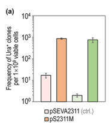

## Question

# Gene Research for Functional Annotation

## ⚠️ CRITICAL: Gene/Protein Identification Context

**BEFORE YOU BEGIN RESEARCH:** You MUST verify you are researching the CORRECT gene/protein. Gene symbols can be ambiguous, especially for less well-characterized genes from non-model organisms.

### Target Gene/Protein Identity (from UniProt):
- **UniProt Accession:** Q88DD1
- **Protein Description:** RecName: Full=DNA mismatch repair protein MutL {ECO:0000255|HAMAP-Rule:MF_00149};
- **Gene Information:** Name=mutL {ECO:0000255|HAMAP-Rule:MF_00149}; OrderedLocusNames=PP_4896;
- **Organism (full):** Pseudomonas putida (strain ATCC 47054 / DSM 6125 / CFBP 8728 / NCIMB 11950 / KT2440).
- **Protein Family:** Belongs to the DNA mismatch repair MutL/HexB family.
- **Key Domains:** DNA_mismatch_repair_CS. (IPR014762); DNA_mismatch_repair_MutL. (IPR020667); DNA_mismatch_S5_2-like. (IPR013507); HATPase_C_sf. (IPR036890); MutL/Mlh/PMS. (IPR002099)

### MANDATORY VERIFICATION STEPS:

1. **Check if the gene symbol "mutL" matches the protein description above**
2. **Verify the organism is correct:** Pseudomonas putida (strain ATCC 47054 / DSM 6125 / CFBP 8728 / NCIMB 11950 / KT2440).
3. **Check if protein family/domains align with what you find in literature**
4. **If you find literature for a DIFFERENT gene with the same or similar symbol, STOP**

### If Gene Symbol is Ambiguous or You Cannot Find Relevant Literature:

**DO NOT PROCEED WITH RESEARCH ON A DIFFERENT GENE.** Instead:
- State clearly: "The gene symbol 'mutL' is ambiguous or literature is limited for this specific protein"
- Explain what you found (e.g., "Found extensive literature on a different gene with the same symbol in a different organism")
- Describe the protein based ONLY on the UniProt information provided above
- Suggest that the protein function can be inferred from domain/family information

### Research Target:

Please provide a comprehensive research report on the gene **mutL** (gene ID: mutL, UniProt: Q88DD1) in PSEPK.

The research report should be a detailed narrative explaining the function, biological processes, and localization of the gene product. Citations should be given for all claims.

You should prioritize authoritative reviews and primary scientific literature when conducting research. You can supplement
this with annotations you find in gene/protein databases, but these can be outdated or inaccurate.

We are specifically interested in the primary function of the gene - for enzymes, what reaction is catalyzed, and what is the substrate specificity? For transporters, what is the substrate? For structural proteins or adapters, what is the broader structural role? For signaling molecules, what is the role in the pathway.

We are interested in where in or outside the cell the gene product carries out its function.

We are also interested in the signaling or biochemical pathways in which the gene functions. We are less interested in broad pleiotropic effects, except where these elucidate the precise role.

Include evidence where possible. We are interested in both experimental evidence as well as inference from structure, evolution, or bioinformatic analysis. Precise studies should be prioritized over high-throughput, where available.

## Output

Question: You are an expert researcher providing comprehensive, well-cited information.

Provide detailed information focusing on:
1. Key concepts and definitions with current understanding
2. Recent developments and latest research (prioritize 2023-2024 sources)
3. Current applications and real-world implementations
4. Expert opinions and analysis from authoritative sources
5. Relevant statistics and data from recent studies

Format as a comprehensive research report with proper citations. Include URLs and publication dates where available.
Always prioritize recent, authoritative sources and provide specific citations for all major claims.

# Gene Research for Functional Annotation

## ⚠️ CRITICAL: Gene/Protein Identification Context

**BEFORE YOU BEGIN RESEARCH:** You MUST verify you are researching the CORRECT gene/protein. Gene symbols can be ambiguous, especially for less well-characterized genes from non-model organisms.

### Target Gene/Protein Identity (from UniProt):
- **UniProt Accession:** Q88DD1
- **Protein Description:** RecName: Full=DNA mismatch repair protein MutL {ECO:0000255|HAMAP-Rule:MF_00149};
- **Gene Information:** Name=mutL {ECO:0000255|HAMAP-Rule:MF_00149}; OrderedLocusNames=PP_4896;
- **Organism (full):** Pseudomonas putida (strain ATCC 47054 / DSM 6125 / CFBP 8728 / NCIMB 11950 / KT2440).
- **Protein Family:** Belongs to the DNA mismatch repair MutL/HexB family.
- **Key Domains:** DNA_mismatch_repair_CS. (IPR014762); DNA_mismatch_repair_MutL. (IPR020667); DNA_mismatch_S5_2-like. (IPR013507); HATPase_C_sf. (IPR036890); MutL/Mlh/PMS. (IPR002099)

### MANDATORY VERIFICATION STEPS:

1. **Check if the gene symbol "mutL" matches the protein description above**
2. **Verify the organism is correct:** Pseudomonas putida (strain ATCC 47054 / DSM 6125 / CFBP 8728 / NCIMB 11950 / KT2440).
3. **Check if protein family/domains align with what you find in literature**
4. **If you find literature for a DIFFERENT gene with the same or similar symbol, STOP**

### If Gene Symbol is Ambiguous or You Cannot Find Relevant Literature:

**DO NOT PROCEED WITH RESEARCH ON A DIFFERENT GENE.** Instead:
- State clearly: "The gene symbol 'mutL' is ambiguous or literature is limited for this specific protein"
- Explain what you found (e.g., "Found extensive literature on a different gene with the same symbol in a different organism")
- Describe the protein based ONLY on the UniProt information provided above
- Suggest that the protein function can be inferred from domain/family information

### Research Target:

Please provide a comprehensive research report on the gene **mutL** (gene ID: mutL, UniProt: Q88DD1) in PSEPK.

The research report should be a detailed narrative explaining the function, biological processes, and localization of the gene product. Citations should be given for all claims.

You should prioritize authoritative reviews and primary scientific literature when conducting research. You can supplement
this with annotations you find in gene/protein databases, but these can be outdated or inaccurate.

We are specifically interested in the primary function of the gene - for enzymes, what reaction is catalyzed, and what is the substrate specificity? For transporters, what is the substrate? For structural proteins or adapters, what is the broader structural role? For signaling molecules, what is the role in the pathway.

We are interested in where in or outside the cell the gene product carries out its function.

We are also interested in the signaling or biochemical pathways in which the gene functions. We are less interested in broad pleiotropic effects, except where these elucidate the precise role.

Include evidence where possible. We are interested in both experimental evidence as well as inference from structure, evolution, or bioinformatic analysis. Precise studies should be prioritized over high-throughput, where available.

# Research Report: *Pseudomonas putida* KT2440 **mutL** (PP_4896; UniProt Q88DD1) — Functional Annotation and Evidence

## 0. Executive summary
The target protein **MutL** (gene **mutL**, locus **PP_4896**, UniProt **Q88DD1**) in *Pseudomonas putida* KT2440 is a canonical bacterial mismatch-repair factor required for post-replicative correction of base–base mismatches and small insertion/deletion loops, operating in a **MutH-less** context (KT2440 encodes **MutS** and **MutL**, and lacks **MutH** and Dam methylation). *P. putida* MutL is experimentally validated as the key controllable “lever” for tuning mismatch repair (MMR): a dominant-negative allele (**mutL E36K**) transiently inhibits endogenous MMR, producing up to **438-fold** increases in selectable mutation frequencies and enabling efficient genome engineering with **low off-target burden (0–3 SNPs)** by whole-genome sequencing (WGS). Mechanistically, while direct biochemical measurements of *P. putida* MutL enzymatic activities were not found in the retrieved organism-specific literature, authoritative bacterial DNA repair reviews support inference that many MutH-less bacterial MutL homologs contain a **metal-dependent endonuclease motif** and are activated/positioned by interaction with the replication **β-clamp (DnaN)**.

## 1. Mandatory verification: correct gene/protein identity
### 1.1 Mapping UniProt context to primary literature
The UniProt target (Q88DD1) is annotated as **DNA mismatch repair protein MutL**, gene **mutL**, ordered locus **PP_4896**, in *Pseudomonas putida* KT2440. In *P. putida* KT2440-focused work, MutL is explicitly referenced as **PP_4896** and described as a MutL homolog with ~**44% amino-acid identity** to *E. coli* MutL (greater conservation in the N-terminal half). (aparicio2020mismatchrepairhierarchy pages 2-3, aparicio2020mismatchrepairhierarchy pages 1-2)

### 1.2 Avoiding ambiguity with the symbol “mutL”
“mutL” is a widely conserved bacterial gene symbol. The evidence cited below is restricted to:
- **MutL/MutS mismatch repair** studies in *Pseudomonas putida* KT2440 derivatives (notably EM42, a KT2440 derivative) (aparicio2020mismatchrepairhierarchy pages 3-5, fernandezcabezon2021spatiotemporalmanipulationof pages 4-5)
- General bacterial mismatch repair reviews used only for **mechanistic inference** about MutL family function (wozniak2022bacterialdnaexcision pages 10-11, wozniak2022bacterialdnaexcision pages 18-19)

## 2. Key concepts and definitions (current understanding)
### 2.1 DNA mismatch repair (MMR)
Bacteria reduce replication error rates via (i) base selection, (ii) proofreading, and (iii) **mismatch repair**. In MMR, mismatches remaining after replication are recognized and corrected, preventing fixation of point mutations and some small indels. (fernandezcabezon2021spatiotemporalmanipulationof pages 1-2)

### 2.2 Canonical players and pathway architectures
- **MutS**: mismatch recognition factor.
- **MutL**: matchmaker/coordinator and (in many organisms) the nuclease that initiates strand incision.
- **MutH**: endonuclease used in *E. coli* methyl-directed MMR; not universal.

A defining feature for *P. putida* KT2440 is that it encodes **mutS and mutL but lacks mutH and dam methylation**, implying a methylation-independent, MutH-less MMR mechanism with different strand-discrimination logic than *E. coli*. (aparicio2020mismatchrepairhierarchy pages 2-3, aparicio2020mismatchrepairhierarchy pages 1-2)

## 3. MutL (PP_4896) molecular function and mechanism
### 3.1 Primary biological role in *P. putida* KT2440
**Primary function:** MutL maintains genome fidelity by participating in MMR to recognize/resolve base–base mismatches introduced during replication or during recombineering-mediated introduction of mismatches.

Functional evidence in *P. putida* is strongest from genetic/engineering perturbations:
- **Permanent** MMR disruption via **ΔmutS** strongly elevates mutational regime and removes mismatch-type bias, consistent with MutS–MutL dependence. (aparicio2020mismatchrepairhierarchy pages 2-3, aparicio2020mismatchrepairhierarchy pages 3-5)
- **Transient** suppression of MutL via dominant-negative **mutL E36K** makes mismatches introduced by ssDNA recombineering escape repair and become inherited. (aparicio2020mismatchrepairhierarchy pages 3-5, aparicio2020mismatchrepairhierarchy pages 5-6)

### 3.2 Interaction partners and pathway placement
Organism-specific interaction mapping (e.g., co-immunoprecipitation) was not retrieved; however, the *P. putida* functional data and broader MMR models support that MutL operates downstream of mismatch recognition by MutS.

In an MMR hierarchy study, *P. putida* strains were engineered in three MMR states: wild-type, **ΔmutS** (MMR-null), and wild-type with **MutL E36K** transiently inhibiting MMR. Convergence of recombineering efficiencies between mismatch types upon MutL suppression demonstrates MutL’s functional centrality in the pathway. (aparicio2020mismatchrepairhierarchy pages 3-5)

### 3.3 Enzymatic activities: what is known vs inferred
#### 3.3.1 Evidence-supported inferences for MutH-less systems
A high-authority bacterial DNA repair review reports:
- Many MutL homologs in methylation-independent bacteria contain a conserved **metal-dependent endonuclease motif**: **DQHA(X)2E(X)4E**.
- The replication **β-clamp (DnaN)** binds MutL and can **stimulate MutL incision activity**; mutating either the endonuclease motif or DnaN-binding motif abolishes MMR in vivo (demonstrated in *Bacillus subtilis*). (wozniak2022bacterialdnaexcision pages 10-11)

This supports annotation of *P. putida* MutL as a likely **endonuclease-enabled MMR coordinator** in a MutH-less setting, but the report explicitly distinguishes this as **inference** rather than direct biochemical proof for PP_4896. (wozniak2022bacterialdnaexcision pages 10-11)

#### 3.3.2 ATPase/clamp behaviors and “action-at-a-distance” models (recent mechanistic synthesis)
A 2024 review focused on long-range communication in MMR highlights that mismatch repair can involve clamp-like states and long-distance signaling between mismatch sites and distant incision sites, including models involving sliding clamps, DNA looping, and MutL-family oligomerization/assemblies (largely eukaryotic context, but conceptually informative). (collingwood2024actionatadistanceindna pages 4-6, collingwood2024actionatadistanceindna pages 1-3)

**Relevance to bacterial MutL annotation:** These models provide an expert framework for how MutL-family proteins could coordinate incision and excision at distances from the mismatch, consistent with clamp-coupled recruitment concepts also emphasized in bacterial reviews. (wozniak2022bacterialdnaexcision pages 10-11, collingwood2024actionatadistanceindna pages 4-6)

## 4. Cellular localization: where MutL acts
Direct subcellular localization microscopy of *P. putida* MutL (PP_4896) was not identified in the retrieved KT2440-specific sources. However, mechanistic evidence suggests MutL’s effective localization is **nucleoid-associated and replisome-coupled**, mediated through interaction with the **β-clamp (DnaN)** in methylation-independent MMR pathways. (wozniak2022bacterialdnaexcision pages 10-11)

## 5. *P. putida* KT2440-specific functional phenotypes and quantitative data
### 5.1 Dominant-negative **mutL E36K** as a conditional mutator system
#### 5.1.1 Concept and construction
A key engineering strategy in *P. putida* uses a dominant-negative MutL allele, **mutL E36K**, designed by analogy to a dominant-negative *E. coli* MutL variant (equivalent residue position differs: *P. putida* E36). In *P. putida*, regulated overexpression of **mutL E36K** transiently inhibits endogenous MMR, allowing mismatches to become fixed as mutations. (aparicio2020mismatchrepairhierarchy pages 2-3, fernandezcabezon2021spatiotemporalmanipulationof pages 1-2)

#### 5.1.2 Mutation-frequency increases and selectable phenotypes
In *P. putida*, inducible mutator devices driving **mutL E36K** expression produced:
- Up to **438-fold** increased DNA mutation frequencies (as reported in the study abstract). (fernandezcabezon2021spatiotemporalmanipulationof pages 1-2)
- Accelerated evolution of: (i) streptomycin resistance, (ii) rifampicin resistance, (iii) combined resistance, and (iv) reversion of a synthetic uracil auxotrophy. (fernandezcabezon2021spatiotemporalmanipulationof pages 1-2)

Figure-level quantitative support (mutation frequency assays) is provided in the paper’s mutation-frequency plots. (fernandezcabezon2021spatiotemporalmanipulationof media 4d80bb01)

#### 5.1.3 Statistics for auxotrophy reversion
For a synthetic uracil auxotrophy reversion assay, conditional mutator systems yielded approximately:
- **750 Ura+ mutants per 1 × 10^9 viable cells** (cyclohexanone-inducible system)
- **860 Ura+ mutants per 1 × 10^9 viable cells** (thermoinducible system)
Controls yielded only **0–4** spontaneous Ura+ mutants under the tested conditions. (fernandezcabezon2021spatiotemporalmanipulationof pages 5-6)

A figure panel documenting these mutation frequencies was retrieved. (fernandezcabezon2021spatiotemporalmanipulationof media 1d27dc75)

### 5.2 Mismatch recognition hierarchy in *P. putida* MMR (functional “specificity”)
A *P. putida* MMR hierarchy was experimentally derived using ssDNA recombineering into **pyrF** and deep sequencing, yielding a mismatch sensitivity ordering (less to more sensitive):
**A:G < C:C < G:A < C:A, A:A, G:G, T:T, T:G, A:C, C:T < G:T, T:C**. (aparicio2020mismatchrepairhierarchy pages 5-6)

This hierarchy is a key organism-specific functional insight: it indicates that certain mismatch types (notably **G:T and T:C**) are strongly corrected by *P. putida* MMR, which directly impacts editing strategies and expected mutational spectra under MMR suppression. (aparicio2020mismatchrepairhierarchy pages 5-6)

### 5.3 Genome engineering application and off-target burden
To test whether transient MutL suppression introduces widespread off-target mutations, whole-genome sequencing was performed on clones generated during transient MMR inactivation with **mutL E36K**.

Result:
- **0–3 SNPs** detected in strains transiently expressing **mutL E36K**.
- **0 mutations** detected in the MMR-proficient control strain analyzed. (aparicio2020mismatchrepairhierarchy pages 8-9)

This supports real-world implementation of MutL suppression as a practical genome-editing enabler in *P. putida* with relatively low background mutation accumulation when used transiently. (aparicio2020mismatchrepairhierarchy pages 8-9)

## 6. Recent developments (prioritizing 2023–2024)
Direct 2023–2024 *P. putida* KT2440 MutL primary studies were not retrieved in the tool results; the key organism-specific experimental sources available here are 2020–2021. However, two recent mechanistic syntheses that inform interpretation and annotation are:
- **Collingwood et al., 2024-11-xx (Biomolecules)**: review of long-range communication and clamp/assembly models in mismatch repair, including MutL-family clamp-like states and oligomerization concepts. URL: https://doi.org/10.3390/biom14111442 (collingwood2024actionatadistanceindna pages 4-6)
- Additional authoritative review evidence on MutH-less bacterial MutL endonuclease/clamp coupling from **Wozniak & Simmons, 2022-02-xx (Nature Reviews Microbiology)**, which remains a widely cited up-to-date synthesis for bacterial excision repair pathways. URL: https://doi.org/10.1038/s41579-022-00694-0 (wozniak2022bacterialdnaexcision pages 10-11)

## 7. Current applications and real-world implementations
### 7.1 Adaptive laboratory evolution (ALE) and phenotype emergence
Because *P. putida* has a highly efficient MMR system, controlled transient inhibition via **mutL E36K** is used as an “accelerator” for evolution-based optimization. In practice, inducible devices allow alternating cycles of mutagenesis and selection, enabling faster emergence of useful phenotypes (antibiotic resistance as a proxy, auxotrophy reversion as a calibration case). (fernandezcabezon2021spatiotemporalmanipulationof pages 1-2, fernandezcabezon2021spatiotemporalmanipulationof pages 5-6)

### 7.2 Genome editing and recombineering
MMR is a major barrier to ssDNA recombineering because it removes introduced mismatches. In *P. putida*, co-expression of a recombinase (Rec2) with **mutL E36K** creates a window in which mismatches can be incorporated across mismatch classes more uniformly, mitigating mismatch-type bias that otherwise differs by ~**two orders of magnitude** in recombineering outcomes. (aparicio2020mismatchrepairhierarchy pages 3-5)

The low WGS off-target burden (0–3 SNPs) under transient MutL inhibition supports its use in strain engineering where maintaining general genomic integrity is important. (aparicio2020mismatchrepairhierarchy pages 8-9)

## 8. Expert opinions and analysis (authoritative interpretations)
Two high-level expert interpretations supported by review and primary evidence:
1. **MutH-less bacteria rely on MutL endonuclease activity and replisome coupling**: review evidence supports that MutL homologs in methylation-independent systems frequently encode an intrinsic nuclease motif and are activated/positioned by β-clamp binding, providing a plausible basis for strand discrimination and incision initiation without MutH/Dam. (wozniak2022bacterialdnaexcision pages 10-11)
2. **Mismatch repair requires long-range communication mechanisms**: mechanistic reviews emphasize that mismatch repair must coordinate recognition at a mismatch with strand incision/excision at potentially distant sites, and propose models including sliding clamps, looping, and MutL-family assemblies—conceptually consistent with clamp-centered bacterial recruitment logic. (collingwood2024actionatadistanceindna pages 4-6, collingwood2024actionatadistanceindna pages 1-3)

## 9. Data highlights (recent statistics and quantitative results)
Key quantitative outputs for functional annotation:
- **Up to 438-fold** increase in DNA mutation frequency using *P. putida* mutL E36K conditional mutator devices. (fernandezcabezon2021spatiotemporalmanipulationof pages 1-2)
- **~750–860 Ura+ mutants per 10^9 cells** under mutator-device conditions vs **0–4** in controls (auxotrophy reversion). (fernandezcabezon2021spatiotemporalmanipulationof pages 5-6)
- **0–3 SNPs** detected by WGS after transient mutL E36K expression vs **0** in the MMR+ control. (aparicio2020mismatchrepairhierarchy pages 8-9)
- Mismatch-type sensitivity hierarchy: **A:G** and **C:C** least corrected; **G:T** and **T:C** most corrected. (aparicio2020mismatchrepairhierarchy pages 5-6)

Figure evidence showing mutation-frequency shifts and Ura+ frequencies is available from the mutator-device paper. (fernandezcabezon2021spatiotemporalmanipulationof media 4d80bb01, fernandezcabezon2021spatiotemporalmanipulationof media 1d27dc75)

## 10. Evidence-based functional annotation (proposed)
### 10.1 Molecular function (GO-style narrative)
MutL (PP_4896; Q88DD1) is a mismatch-repair factor that coordinates repair of replication errors in *P. putida* KT2440, functioning with MutS and acting in a MutH-independent pathway. Genetic perturbation (dominant-negative E36K) demonstrates MutL is essential for suppressing fixation of mismatches and controlling mutation rates. (aparicio2020mismatchrepairhierarchy pages 3-5, fernandezcabezon2021spatiotemporalmanipulationof pages 1-2)

### 10.2 Reaction/biochemical activity and substrate specificity
- **Directly evidenced in *P. putida*:** MutL activity suppresses fixation of a broad set of mismatch classes, with mismatch-type dependent efficiencies summarized by a hierarchy derived experimentally. (aparicio2020mismatchrepairhierarchy pages 5-6)
- **Inferred (not directly shown for PP_4896 in retrieved sources):** MutH-less bacterial MutL homologs often provide a **metal-dependent endonuclease incision** activity via the conserved DQHA(X)2E(X)4E motif and are stimulated by β-clamp binding. (wozniak2022bacterialdnaexcision pages 10-11)

### 10.3 Cellular localization
Likely cytosolic/nucleoid-associated with functional recruitment to replication forks via β-clamp interactions (inference from MutH-less bacterial systems; *P. putida*-specific imaging evidence not retrieved). (wozniak2022bacterialdnaexcision pages 10-11)

## 11. Limitations and evidence gaps
- No *P. putida* KT2440-specific biochemical assays confirming PP_4896 ATPase or endonuclease catalytic activity were retrieved; enzymatic-function statements beyond genetics are **inferred from authoritative reviews**. (wozniak2022bacterialdnaexcision pages 10-11)
- No direct microscopy-based localization of *P. putida* MutL was retrieved; localization is inferred via clamp-coupling models in MutH-less bacteria. (wozniak2022bacterialdnaexcision pages 10-11)

## 12. Summary table
| Topic | Key points | Best supporting citations |
|---|---|---|
| Identity | - Target matches **mutL / PP_4896 / UniProt Q88DD1** in *Pseudomonas putida* KT2440, annotated as a DNA mismatch repair protein MutL. - *P. putida* KT2440 carries **mutS** and **mutL** homologues but lacks **mutH** and Dam methylation, so it uses a MutH-independent MMR pathway. - PP_4896 shares ~**44% amino-acid identity** with *E. coli* MutL, with stronger conservation in the N-terminal region. | Aparicio et al., 2020, *Environmental Microbiology*, Nov 2020, https://doi.org/10.1111/1462-2920.14814 (aparicio2020mismatchrepairhierarchy pages 2-3, aparicio2020mismatchrepairhierarchy pages 1-2) |
| Pathway role | - MutL functions in post-replicative **DNA mismatch repair (MMR)**, helping correct replication errors after base selection and proofreading. - In *P. putida*, active MMR clearly depends at least on **MutS and MutL** and suppresses inheritance of ssDNA recombineering-generated mismatches. - Transient inhibition of MutL allows mismatches to escape repair and become fixed as chromosomal mutations. | Fernández-Cabezón et al., 2021, *ACS Synthetic Biology*, Apr 2021, https://doi.org/10.1021/acssynbio.1c00031 (fernandezcabezon2021spatiotemporalmanipulationof pages 1-2); Aparicio et al., 2020, https://doi.org/10.1111/1462-2920.14814 (aparicio2020mismatchrepairhierarchy pages 3-5, aparicio2020mismatchrepairhierarchy pages 8-9) |
| Activities/domains | - Direct *P. putida*-specific biochemical assays were not provided in the retrieved papers, so ATPase/endonuclease activities are inferred from conserved bacterial MutL biology rather than demonstrated here. - Authoritative review evidence indicates many MutL homologues in methylation-independent systems carry a **metal-dependent endonuclease motif** [DQHA(X)2E(X)4E]. - The same review indicates MutL activity is linked to the replication clamp **DnaN**, whose binding can stimulate MutL endonuclease activity in MutH-independent bacteria. | Wozniak & Simmons, 2022, *Nature Reviews Microbiology*, Feb 2022, https://doi.org/10.1038/s41579-022-00694-0 (wozniak2022bacterialdnaexcision pages 10-11); Aparicio et al., 2020 discussion/citations, https://doi.org/10.1111/1462-2920.14814 (aparicio2020mismatchrepairhierarchy pages 12-13) |
| Mismatch recognition hierarchy findings | - Using pyrF-targeted mutagenic ssDNA recombineering, the *P. putida* MMR hierarchy was reported as **A:G < C:C < G:A < C:A, A:A, G:G, T:T, T:G, A:C, C:T < G:T, T:C** from less to more sensitive to repair. - Wild-type MMR therefore tolerates some mismatches much more than others; **G:T and T:C** are among the most strongly repaired. - Transient expression of dominant-negative **mutL E36K** or permanent **ΔmutS** largely collapses this bias. | Aparicio et al., 2020, *Environmental Microbiology*, Nov 2020, https://doi.org/10.1111/1462-2920.14814 (aparicio2020mismatchrepairhierarchy pages 1-2, aparicio2020mismatchrepairhierarchy pages 5-6, aparicio2020mismatchrepairhierarchy pages 8-9) |
| Mutator devices and phenotypes | - A dominant-negative **mutLE36K** allele was engineered in *P. putida* based on the equivalent inactive/dominant-negative *E. coli* allele; in KT2440 the homologous residue is **E36**. - Regulated overexpression of **mutLE36K** on broad-host-range plasmids created conditional mutator devices that transiently inhibit endogenous MMR. - These devices accelerated emergence of **streptomycin resistance, rifampicin resistance, dual antibiotic resistance, and reversion of a synthetic uracil auxotrophy**. | Aparicio et al., 2020, https://doi.org/10.1111/1462-2920.14814 (aparicio2020mismatchrepairhierarchy pages 2-3, aparicio2020mismatchrepairhierarchy pages 3-5); Fernández-Cabezón et al., 2021, https://doi.org/10.1021/acssynbio.1c00031 (fernandezcabezon2021spatiotemporalmanipulationof pages 1-2, fernandezcabezon2021spatiotemporalmanipulationof pages 4-5, fernandezcabezon2021spatiotemporalmanipulationof pages 5-6) |
| Quantitative mutation frequencies | - In the 2021 mutator-device study, inducible **mutLE36K** increased DNA mutation frequencies by **up to 438-fold** relative to controls. - For uracil prototroph reversion, conditional mutator systems yielded about **750** and **860 Ura+ mutants per 1 × 10^9 viable cells** (cyclohexanone- and thermoinducible systems, respectively), whereas controls produced only **0–4** spontaneous Ura+ mutants under the tested conditions. - In recombineering assays, wild-type MMR caused about a **two-orders-of-magnitude** difference between low-sensitivity (SR; A:G) and high-sensitivity (NR; G:T/C:A) oligos; this gap disappeared with **ΔmutS** or **mutLE36K** expression. | Fernández-Cabezón et al., 2021, *ACS Synthetic Biology*, Apr 2021, https://doi.org/10.1021/acssynbio.1c00031 (fernandezcabezon2021spatiotemporalmanipulationof pages 1-2, fernandezcabezon2021spatiotemporalmanipulationof pages 4-5, fernandezcabezon2021spatiotemporalmanipulationof pages 5-6, fernandezcabezon2021spatiotemporalmanipulationof media 4d80bb01, fernandezcabezon2021spatiotemporalmanipulationof media 1d27dc75); Aparicio et al., 2020, https://doi.org/10.1111/1462-2920.14814 (aparicio2020mismatchrepairhierarchy pages 3-5, aparicio2020mismatchrepairhierarchy pages 9-10) |
| Genome-wide off-target mutations | - Whole-genome sequencing of clones generated after transient **mutLE36K** expression found **0–3 SNPs** in edited strains. - A control MMR-proficient strain analyzed in parallel showed **no detectable mutations**. - These data support transient MutL inhibition as a practical genome-engineering strategy with relatively low off-target burden in *P. putida*. | Aparicio et al., 2020, *Environmental Microbiology*, Nov 2020, https://doi.org/10.1111/1462-2920.14814 (aparicio2020mismatchrepairhierarchy pages 8-9) |

*Table: This table summarizes the most relevant functional annotation evidence for Pseudomonas putida KT2440 MutL, including pathway role, inferred activities, mismatch-recognition behavior, and engineering phenotypes. It is useful for distinguishing organism-specific findings from broader bacterial MutL inferences.*

## 13. Key primary sources (publication date and URL)
- Aparicio T. et al. **(Nov 2020)**. *Environmental Microbiology*. “Mismatch repair hierarchy of *Pseudomonas putida* revealed by mutagenic ssDNA recombineering of the pyrF gene”. https://doi.org/10.1111/1462-2920.14814 (aparicio2020mismatchrepairhierarchy pages 1-2)
- Fernández-Cabezón L. et al. **(Apr 2021)**. *ACS Synthetic Biology*. “Spatiotemporal Manipulation of the Mismatch Repair System of *Pseudomonas putida* Accelerates Phenotype Emergence”. https://doi.org/10.1021/acssynbio.1c00031 (fernandezcabezon2021spatiotemporalmanipulationof pages 1-2)
- Wozniak KJ, Simmons LA. **(Feb 2022)**. *Nature Reviews Microbiology*. “Bacterial DNA excision repair pathways”. https://doi.org/10.1038/s41579-022-00694-0 (wozniak2022bacterialdnaexcision pages 10-11)
- Collingwood BW. et al. **(Nov 2024)**. *Biomolecules*. “Action-At-A-Distance in DNA Mismatch Repair: Mechanistic Insights and Models for How DNA and Repair Proteins Facilitate Long-Range Communication”. https://doi.org/10.3390/biom14111442 (collingwood2024actionatadistanceindna pages 4-6)

## 14. Figure evidence (from retrieved images)
- Mutation frequencies and relative fold-changes for RifR and StrR under conditional mutator devices (Figure 3 crop). (fernandezcabezon2021spatiotemporalmanipulationof media 4d80bb01)
- Ura+ mutation frequencies under conditional mutator devices (Figure 4a crop). (fernandezcabezon2021spatiotemporalmanipulationof media 1d27dc75)

References

1. (aparicio2020mismatchrepairhierarchy pages 2-3): Tomas Aparicio, Akos Nyerges, István Nagy, Csaba Pal, Esteban Martínez‐García, and Víctor de Lorenzo. Mismatch repair hierarchy of <i>pseudomonas putida</i> revealed by mutagenic ssdna recombineering of the <i>pyrf</i> gene. Environmental Microbiology, 22:45-58, Nov 2020. URL: https://doi.org/10.1111/1462-2920.14814, doi:10.1111/1462-2920.14814. This article has 23 citations and is from a domain leading peer-reviewed journal.

2. (aparicio2020mismatchrepairhierarchy pages 1-2): Tomas Aparicio, Akos Nyerges, István Nagy, Csaba Pal, Esteban Martínez‐García, and Víctor de Lorenzo. Mismatch repair hierarchy of <i>pseudomonas putida</i> revealed by mutagenic ssdna recombineering of the <i>pyrf</i> gene. Environmental Microbiology, 22:45-58, Nov 2020. URL: https://doi.org/10.1111/1462-2920.14814, doi:10.1111/1462-2920.14814. This article has 23 citations and is from a domain leading peer-reviewed journal.

3. (aparicio2020mismatchrepairhierarchy pages 3-5): Tomas Aparicio, Akos Nyerges, István Nagy, Csaba Pal, Esteban Martínez‐García, and Víctor de Lorenzo. Mismatch repair hierarchy of <i>pseudomonas putida</i> revealed by mutagenic ssdna recombineering of the <i>pyrf</i> gene. Environmental Microbiology, 22:45-58, Nov 2020. URL: https://doi.org/10.1111/1462-2920.14814, doi:10.1111/1462-2920.14814. This article has 23 citations and is from a domain leading peer-reviewed journal.

4. (fernandezcabezon2021spatiotemporalmanipulationof pages 4-5): Lorena Fernández-Cabezón, Antonin Cros, and Pablo I. Nikel. Spatiotemporal manipulation of the mismatch repair system of <i>pseudomonas putida</i> accelerates phenotype emergence. Apr 2021. URL: https://doi.org/10.1021/acssynbio.1c00031, doi:10.1021/acssynbio.1c00031. This article has 28 citations and is from a domain leading peer-reviewed journal.

5. (wozniak2022bacterialdnaexcision pages 10-11): Katherine J. Wozniak and Lyle A. Simmons. Bacterial dna excision repair pathways. Nature Reviews Microbiology, 20:465-477, Feb 2022. URL: https://doi.org/10.1038/s41579-022-00694-0, doi:10.1038/s41579-022-00694-0. This article has 102 citations and is from a highest quality peer-reviewed journal.

6. (wozniak2022bacterialdnaexcision pages 18-19): Katherine J. Wozniak and Lyle A. Simmons. Bacterial dna excision repair pathways. Nature Reviews Microbiology, 20:465-477, Feb 2022. URL: https://doi.org/10.1038/s41579-022-00694-0, doi:10.1038/s41579-022-00694-0. This article has 102 citations and is from a highest quality peer-reviewed journal.

7. (fernandezcabezon2021spatiotemporalmanipulationof pages 1-2): Lorena Fernández-Cabezón, Antonin Cros, and Pablo I. Nikel. Spatiotemporal manipulation of the mismatch repair system of <i>pseudomonas putida</i> accelerates phenotype emergence. Apr 2021. URL: https://doi.org/10.1021/acssynbio.1c00031, doi:10.1021/acssynbio.1c00031. This article has 28 citations and is from a domain leading peer-reviewed journal.

8. (aparicio2020mismatchrepairhierarchy pages 5-6): Tomas Aparicio, Akos Nyerges, István Nagy, Csaba Pal, Esteban Martínez‐García, and Víctor de Lorenzo. Mismatch repair hierarchy of <i>pseudomonas putida</i> revealed by mutagenic ssdna recombineering of the <i>pyrf</i> gene. Environmental Microbiology, 22:45-58, Nov 2020. URL: https://doi.org/10.1111/1462-2920.14814, doi:10.1111/1462-2920.14814. This article has 23 citations and is from a domain leading peer-reviewed journal.

9. (collingwood2024actionatadistanceindna pages 4-6): Bryce W. Collingwood, Scott J. Witte, and Carol M. Manhart. Action-at-a-distance in dna mismatch repair: mechanistic insights and models for how dna and repair proteins facilitate long-range communication. Biomolecules, 14:1442, Nov 2024. URL: https://doi.org/10.3390/biom14111442, doi:10.3390/biom14111442. This article has 1 citations.

10. (collingwood2024actionatadistanceindna pages 1-3): Bryce W. Collingwood, Scott J. Witte, and Carol M. Manhart. Action-at-a-distance in dna mismatch repair: mechanistic insights and models for how dna and repair proteins facilitate long-range communication. Biomolecules, 14:1442, Nov 2024. URL: https://doi.org/10.3390/biom14111442, doi:10.3390/biom14111442. This article has 1 citations.

11. (fernandezcabezon2021spatiotemporalmanipulationof media 4d80bb01): Lorena Fernández-Cabezón, Antonin Cros, and Pablo I. Nikel. Spatiotemporal manipulation of the mismatch repair system of <i>pseudomonas putida</i> accelerates phenotype emergence. Apr 2021. URL: https://doi.org/10.1021/acssynbio.1c00031, doi:10.1021/acssynbio.1c00031. This article has 28 citations and is from a domain leading peer-reviewed journal.

12. (fernandezcabezon2021spatiotemporalmanipulationof pages 5-6): Lorena Fernández-Cabezón, Antonin Cros, and Pablo I. Nikel. Spatiotemporal manipulation of the mismatch repair system of <i>pseudomonas putida</i> accelerates phenotype emergence. Apr 2021. URL: https://doi.org/10.1021/acssynbio.1c00031, doi:10.1021/acssynbio.1c00031. This article has 28 citations and is from a domain leading peer-reviewed journal.

13. (fernandezcabezon2021spatiotemporalmanipulationof media 1d27dc75): Lorena Fernández-Cabezón, Antonin Cros, and Pablo I. Nikel. Spatiotemporal manipulation of the mismatch repair system of <i>pseudomonas putida</i> accelerates phenotype emergence. Apr 2021. URL: https://doi.org/10.1021/acssynbio.1c00031, doi:10.1021/acssynbio.1c00031. This article has 28 citations and is from a domain leading peer-reviewed journal.

14. (aparicio2020mismatchrepairhierarchy pages 8-9): Tomas Aparicio, Akos Nyerges, István Nagy, Csaba Pal, Esteban Martínez‐García, and Víctor de Lorenzo. Mismatch repair hierarchy of <i>pseudomonas putida</i> revealed by mutagenic ssdna recombineering of the <i>pyrf</i> gene. Environmental Microbiology, 22:45-58, Nov 2020. URL: https://doi.org/10.1111/1462-2920.14814, doi:10.1111/1462-2920.14814. This article has 23 citations and is from a domain leading peer-reviewed journal.

15. (aparicio2020mismatchrepairhierarchy pages 12-13): Tomas Aparicio, Akos Nyerges, István Nagy, Csaba Pal, Esteban Martínez‐García, and Víctor de Lorenzo. Mismatch repair hierarchy of <i>pseudomonas putida</i> revealed by mutagenic ssdna recombineering of the <i>pyrf</i> gene. Environmental Microbiology, 22:45-58, Nov 2020. URL: https://doi.org/10.1111/1462-2920.14814, doi:10.1111/1462-2920.14814. This article has 23 citations and is from a domain leading peer-reviewed journal.

16. (aparicio2020mismatchrepairhierarchy pages 9-10): Tomas Aparicio, Akos Nyerges, István Nagy, Csaba Pal, Esteban Martínez‐García, and Víctor de Lorenzo. Mismatch repair hierarchy of <i>pseudomonas putida</i> revealed by mutagenic ssdna recombineering of the <i>pyrf</i> gene. Environmental Microbiology, 22:45-58, Nov 2020. URL: https://doi.org/10.1111/1462-2920.14814, doi:10.1111/1462-2920.14814. This article has 23 citations and is from a domain leading peer-reviewed journal.

## Artifacts

- [Edison artifact artifact-00](mutL-deep-research-falcon_artifacts/artifact-00.md)

## Citations

1. fernandezcabezon2021spatiotemporalmanipulationof pages 1-2
2. aparicio2020mismatchrepairhierarchy pages 3-5
3. wozniak2022bacterialdnaexcision pages 10-11
4. fernandezcabezon2021spatiotemporalmanipulationof pages 5-6
5. aparicio2020mismatchrepairhierarchy pages 5-6
6. aparicio2020mismatchrepairhierarchy pages 8-9
7. collingwood2024actionatadistanceindna pages 4-6
8. aparicio2020mismatchrepairhierarchy pages 12-13
9. aparicio2020mismatchrepairhierarchy pages 1-2
10. aparicio2020mismatchrepairhierarchy pages 2-3
11. fernandezcabezon2021spatiotemporalmanipulationof pages 4-5
12. wozniak2022bacterialdnaexcision pages 18-19
13. collingwood2024actionatadistanceindna pages 1-3
14. aparicio2020mismatchrepairhierarchy pages 9-10
15. DQHA(X)2E(X)4E
16. https://doi.org/10.3390/biom14111442
17. https://doi.org/10.1038/s41579-022-00694-0
18. https://doi.org/10.1111/1462-2920.14814
19. https://doi.org/10.1021/acssynbio.1c00031
20. https://doi.org/10.1111/1462-2920.14814,
21. https://doi.org/10.1021/acssynbio.1c00031,
22. https://doi.org/10.1038/s41579-022-00694-0,
23. https://doi.org/10.3390/biom14111442,