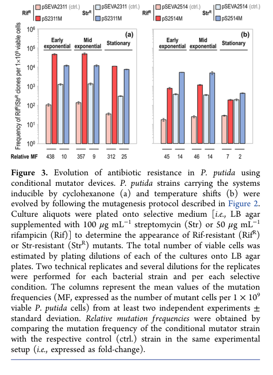

## Question

# Gene Research for Functional Annotation

## ⚠️ CRITICAL: Gene/Protein Identification Context

**BEFORE YOU BEGIN RESEARCH:** You MUST verify you are researching the CORRECT gene/protein. Gene symbols can be ambiguous, especially for less well-characterized genes from non-model organisms.

### Target Gene/Protein Identity (from UniProt):
- **UniProt Accession:** Q88ME7
- **Protein Description:** RecName: Full=DNA mismatch repair protein MutS {ECO:0000255|HAMAP-Rule:MF_00096};
- **Gene Information:** Name=mutS {ECO:0000255|HAMAP-Rule:MF_00096}; OrderedLocusNames=PP_1626;
- **Organism (full):** Pseudomonas putida (strain ATCC 47054 / DSM 6125 / CFBP 8728 / NCIMB 11950 / KT2440).
- **Protein Family:** Belongs to the DNA mismatch repair MutS family.
- **Key Domains:** DNA_mismatch_repair_MutS. (IPR005748); DNA_mismatch_repair_MutS-lik_N. (IPR007695); DNA_mismatch_repair_MutS/MSH. (IPR017261); DNA_mismatch_repair_MutS_C. (IPR000432); DNA_mismatch_repair_MutS_clamp. (IPR007861)

### MANDATORY VERIFICATION STEPS:

1. **Check if the gene symbol "mutS" matches the protein description above**
2. **Verify the organism is correct:** Pseudomonas putida (strain ATCC 47054 / DSM 6125 / CFBP 8728 / NCIMB 11950 / KT2440).
3. **Check if protein family/domains align with what you find in literature**
4. **If you find literature for a DIFFERENT gene with the same or similar symbol, STOP**

### If Gene Symbol is Ambiguous or You Cannot Find Relevant Literature:

**DO NOT PROCEED WITH RESEARCH ON A DIFFERENT GENE.** Instead:
- State clearly: "The gene symbol 'mutS' is ambiguous or literature is limited for this specific protein"
- Explain what you found (e.g., "Found extensive literature on a different gene with the same symbol in a different organism")
- Describe the protein based ONLY on the UniProt information provided above
- Suggest that the protein function can be inferred from domain/family information

### Research Target:

Please provide a comprehensive research report on the gene **mutS** (gene ID: mutS, UniProt: Q88ME7) in PSEPK.

The research report should be a detailed narrative explaining the function, biological processes, and localization of the gene product. Citations should be given for all claims.

You should prioritize authoritative reviews and primary scientific literature when conducting research. You can supplement
this with annotations you find in gene/protein databases, but these can be outdated or inaccurate.

We are specifically interested in the primary function of the gene - for enzymes, what reaction is catalyzed, and what is the substrate specificity? For transporters, what is the substrate? For structural proteins or adapters, what is the broader structural role? For signaling molecules, what is the role in the pathway.

We are interested in where in or outside the cell the gene product carries out its function.

We are also interested in the signaling or biochemical pathways in which the gene functions. We are less interested in broad pleiotropic effects, except where these elucidate the precise role.

Include evidence where possible. We are interested in both experimental evidence as well as inference from structure, evolution, or bioinformatic analysis. Precise studies should be prioritized over high-throughput, where available.

## Output

Question: You are an expert researcher providing comprehensive, well-cited information.

Provide detailed information focusing on:
1. Key concepts and definitions with current understanding
2. Recent developments and latest research (prioritize 2023-2024 sources)
3. Current applications and real-world implementations
4. Expert opinions and analysis from authoritative sources
5. Relevant statistics and data from recent studies

Format as a comprehensive research report with proper citations. Include URLs and publication dates where available.
Always prioritize recent, authoritative sources and provide specific citations for all major claims.

# Gene Research for Functional Annotation

## ⚠️ CRITICAL: Gene/Protein Identification Context

**BEFORE YOU BEGIN RESEARCH:** You MUST verify you are researching the CORRECT gene/protein. Gene symbols can be ambiguous, especially for less well-characterized genes from non-model organisms.

### Target Gene/Protein Identity (from UniProt):
- **UniProt Accession:** Q88ME7
- **Protein Description:** RecName: Full=DNA mismatch repair protein MutS {ECO:0000255|HAMAP-Rule:MF_00096};
- **Gene Information:** Name=mutS {ECO:0000255|HAMAP-Rule:MF_00096}; OrderedLocusNames=PP_1626;
- **Organism (full):** Pseudomonas putida (strain ATCC 47054 / DSM 6125 / CFBP 8728 / NCIMB 11950 / KT2440).
- **Protein Family:** Belongs to the DNA mismatch repair MutS family.
- **Key Domains:** DNA_mismatch_repair_MutS. (IPR005748); DNA_mismatch_repair_MutS-lik_N. (IPR007695); DNA_mismatch_repair_MutS/MSH. (IPR017261); DNA_mismatch_repair_MutS_C. (IPR000432); DNA_mismatch_repair_MutS_clamp. (IPR007861)

### MANDATORY VERIFICATION STEPS:

1. **Check if the gene symbol "mutS" matches the protein description above**
2. **Verify the organism is correct:** Pseudomonas putida (strain ATCC 47054 / DSM 6125 / CFBP 8728 / NCIMB 11950 / KT2440).
3. **Check if protein family/domains align with what you find in literature**
4. **If you find literature for a DIFFERENT gene with the same or similar symbol, STOP**

### If Gene Symbol is Ambiguous or You Cannot Find Relevant Literature:

**DO NOT PROCEED WITH RESEARCH ON A DIFFERENT GENE.** Instead:
- State clearly: "The gene symbol 'mutS' is ambiguous or literature is limited for this specific protein"
- Explain what you found (e.g., "Found extensive literature on a different gene with the same symbol in a different organism")
- Describe the protein based ONLY on the UniProt information provided above
- Suggest that the protein function can be inferred from domain/family information

### Research Target:

Please provide a comprehensive research report on the gene **mutS** (gene ID: mutS, UniProt: Q88ME7) in PSEPK.

The research report should be a detailed narrative explaining the function, biological processes, and localization of the gene product. Citations should be given for all claims.

You should prioritize authoritative reviews and primary scientific literature when conducting research. You can supplement
this with annotations you find in gene/protein databases, but these can be outdated or inaccurate.

We are specifically interested in the primary function of the gene - for enzymes, what reaction is catalyzed, and what is the substrate specificity? For transporters, what is the substrate? For structural proteins or adapters, what is the broader structural role? For signaling molecules, what is the role in the pathway.

We are interested in where in or outside the cell the gene product carries out its function.

We are also interested in the signaling or biochemical pathways in which the gene functions. We are less interested in broad pleiotropic effects, except where these elucidate the precise role.

Include evidence where possible. We are interested in both experimental evidence as well as inference from structure, evolution, or bioinformatic analysis. Precise studies should be prioritized over high-throughput, where available.

# Research Report: Functional Annotation of **mutS** (UniProt: **Q88ME7**; locus **PP_1626**) in *Pseudomonas putida* KT2440

## 1. Target verification (gene/protein identity)
The target protein is **MutS**, a canonical **DNA mismatch repair (MMR) mismatch-recognition ATPase** in *Pseudomonas putida* strain KT2440 (gene **mutS**, locus **PP_1626**, UniProt **Q88ME7**). *P. putida* KT2440 is reported to encode **mutS** and **mutL** but **lacks a bona fide mutH homolog**, indicating an “abridged” bacterial MMR architecture relative to *E. coli*’s MutS/MutL/MutH pathway. (aparicio2020mismatchrepairhierarchy pages 1-2)

## 2. Key concepts & current mechanistic understanding (2024-focused)

### 2.1 Definition: what MutS does
**MutS is the initiating sensor of post-replicative mismatch repair**, detecting replication errors (base–base mismatches and small insertion–deletion loops, IDLs), and then coordinating recruitment/activation of downstream repair factors (notably MutL-family proteins) to remove the error-containing nascent strand segment and restore the correct sequence. (waters2024newdiscoverieson pages 8-9, zarb2024singlemoleculeprobing pages 20-28)

### 2.2 Substrate specificity (mismatch types)
MutS recognizes **single-base mismatches** and **small IDLs**, with strong preference for **single-base IDLs** over larger loops (larger IDLs are inefficiently recognized/processed by MutS alone, implying different handling or reduced repair). (zarb2024singlemoleculeprobing pages 57-61, zarb2024singlemoleculeprobing pages 61-65)

### 2.3 Core MutS catalytic cycle: ATP/ADP-driven conformational switching and sliding clamp
Recent single-molecule kinetic work (largely in *E. coli* MutS, used here as mechanistic inference for bacterial MutS family members) supports a nucleotide-state model:

- **Scanning state**: MutS in an **ADP-bound/open** conformation scans dsDNA for helix distortions from mismatches. (zarb2024singlemoleculeprobing pages 57-61)
- **Mismatch recognition**: mismatch binding is **ATP-independent** in the sense that MutS can bind mismatches without ATP, but **ATP strongly enhances productive transitions**. Binding induces a sharp DNA bend/kink (≈ **60°**) and involves localized mismatch-contact residues including a conserved Phe-X-Glu motif. (zarb2024singlemoleculeprobing pages 15-20)
- **Activation and “sliding clamp” formation**: after mismatch binding, **ADP→ATP exchange** and binding of **two ATP molecules per MutS dimer** triggers a conformational change into a **ring-like sliding clamp** that releases the mismatch site and **diffuses along dsDNA**, facilitating recruitment/loading of MutL. (zarb2024singlemoleculeprobing pages 20-28, zarb2024singlemoleculeprobing pages 57-61)
- **Resetting**: the sliding-clamp state is long-lived on dsDNA; **ATP hydrolysis and reopening/reset** is associated with encountering **ssDNA regions, gaps, or DNA breaks**, returning MutS to a scanning-competent state. (zarb2024singlemoleculeprobing pages 57-61)

Quantitative kinetic parameters from single-molecule measurements illustrate nucleotide control. For example, for a CC mismatch, the conformational-change rate **k2** was reported as **0.007 ± 0.001 s⁻¹** with 1 mM ADP versus **0.57 ± 0.01 s⁻¹** with 1 mM ATP, highlighting strong ATP dependence and ADP dampening; clamp-formation rate is reduced by physiologic ADP levels. (zarb2024singlemoleculeprobing pages 52-57, zarb2024singlemoleculeprobing pages 57-61)

### 2.4 “Action-at-a-distance” in MMR: how mismatch recognition communicates with distant incision sites (2024 expert synthesis)
A key unresolved/active research area is **how mismatch detection by MutS leads to strand incision/excision at sites that may be distant from the mismatch**. A 2024 review synthesizes evidence into three non-exclusive model classes:

1. **Tracking/sliding**: ATP-bound MutS (and/or MutL) moves along DNA as a sliding clamp, creating a distribution of repair factors along the DNA that enables incision at a distance. (collingwood2024actionatadistanceindna pages 1-3, collingwood2024actionatadistanceindna pages 4-6)
2. **DNA looping/loop extrusion**: ATP-dependent translocation could extrude DNA loops, bridging mismatch and incision sites. (collingwood2024actionatadistanceindna pages 4-6, collingwood2024actionatadistanceindna pages 1-3)
3. **Oligomerization/bridging**: MutS can remain mismatch-bound while MutL-family assemblies bridge the gap, potentially altering DNA topology and facilitating incision. (collingwood2024actionatadistanceindna pages 4-6, collingwood2024actionatadistanceindna pages 1-3)

Crucially, this review contrasts *E. coli*’s **MutH-dependent** pathway with **MutH-lacking systems** where **MutL-family proteins provide endonuclease activity** to create nicks on the nascent strand, requiring robust long-range communication mechanisms. This distinction is directly relevant to *P. putida* KT2440, which lacks MutH. (collingwood2024actionatadistanceindna pages 3-4, aparicio2020mismatchrepairhierarchy pages 1-2)

## 3. *Pseudomonas putida* KT2440/EM42-specific functional evidence

### 3.1 Pathway context in *P. putida*: abridged MutS/MutL system
In *P. putida* KT2440, MMR is described as comprising **MutS and MutL homologs** without MutH, motivating empirical measurement of mismatch-type sensitivity in this organism. (aparicio2020mismatchrepairhierarchy pages 1-2)

### 3.2 Organism-specific mismatch recognition/repair hierarchy
Using ssDNA recombineering of **pyrF** under wild-type conditions, **ΔmutS**, and **transient MutL inhibition** (dominant-negative **mutL E36K**), a **mismatch-recognition hierarchy** was established for *P. putida*:

**A:G < C:C < G:A < C:A, A:A, G:G, T:T, T:G, A:C, C:T < G:T, T:C**. (aparicio2020mismatchrepairhierarchy pages 1-2)

This is a key, direct *P. putida*-specific functional annotation point: **MutS-dependent MMR does not correct all mismatches equally**; rather, mismatch identity strongly affects whether introduced base substitutions are rejected or tolerated. (aparicio2020mismatchrepairhierarchy pages 1-2)

## 4. Cellular localization and interaction partners (with organism-specific caveats)

### 4.1 Where MutS acts in the cell
Direct imaging or subcellular localization measurements for **MutS in *P. putida* KT2440** were **not** found in the retrieved corpus. However, based on conserved bacterial MutS biochemistry, its site of action is **intracellular on chromosomal DNA** (nucleoid-associated) during/after replication when mismatches arise. (zarb2024singlemoleculeprobing pages 20-28, waters2024newdiscoverieson pages 8-9)

### 4.2 Interaction partners and pathway components
*P. putida* sources explicitly describe **MutS recruiting MutL** as an initiating step (canonical MMR). (fernandezcabezon2021spatiotemporalmanipulationof pages 2-3)

Because *P. putida* lacks MutH, its strand incision is expected to be **MutL-mediated (endonuclease-capable MutL systems)** or reliant on pre-existing discontinuities, consistent with the broader MutH-lacking MMR paradigm described in 2024 expert synthesis. (collingwood2024actionatadistanceindna pages 3-4, collingwood2024actionatadistanceindna pages 1-3)

A *P. putida* KT2440 study discussing MMR notes that strand discrimination “could involve the **beta clamp** of the replication machinery,” citing prior work (in other bacteria) connecting replication clamps to MMR positioning, but this is not direct biochemical evidence in *P. putida*. (aparicio2020mismatchrepairhierarchy pages 8-9)

## 5. Recent developments and latest research (prioritizing 2023–2024)

### 5.1 2024: Mechanistic models for long-range communication in MMR
The 2024 Biomolecules review emphasizes that “action-at-a-distance” remains incompletely explained and that **multiple mechanisms likely coexist**, with organism-specific differences between bacterial and eukaryotic systems and between MutH-dependent vs MutH-lacking pathways. (collingwood2024actionatadistanceindna pages 4-6, collingwood2024actionatadistanceindna pages 3-4)

### 5.2 2024: Single-molecule quantification of nucleotide effects on MutS clamp formation
Recent single-molecule work quantifies how **ATP promotes** mismatch binding and sliding-clamp formation, while **physiologic ADP buffers/dampens** clamp formation and conformational changes, providing a kinetic basis for how cellular nucleotide pools can tune MMR initiation. (zarb2024singlemoleculeprobing pages 52-57, zarb2024singlemoleculeprobing pages 57-61)

### 5.3 2024: Review-level synthesis of early recruitment/regulation
A 2024 review of early DNA damage response steps summarizes the widely accepted MMR recruitment cascade in which MutS-family sensors detect replication errors, then recruit MutL-family proteins whose nuclease activity (in MutH-lacking systems) can be activated in coordination with replication-associated clamps (e.g., PCNA in eukaryotes), followed by excision and resynthesis. (waters2024newdiscoverieson pages 8-9)

## 6. Current applications and real-world implementations (with quantitative results)

### 6.1 Controllable “mutator devices” in *P. putida* KT2440 (synthetic biology; 2021 foundational implementation)
A demonstrated real-world implementation for *P. putida* is **spatiotemporal manipulation of MMR** to accelerate evolution/phenotype emergence using inducible expression of a dominant-negative **mutL E36K** allele on broad-host-range plasmids.

Quantitative outcomes (mutation frequency readouts in rpoB and rpsL via antibiotic resistance):

- Cyclohexanone-inducible device **pS2311M**: up to **438-fold** increase in **rifampicin-resistant** mutants and **10-fold** increase in **streptomycin-resistant** mutants vs control (early exponential induction condition). (fernandezcabezon2021spatiotemporalmanipulationof pages 3-4, fernandezcabezon2021spatiotemporalmanipulationof media 45d6effd)
- Thermoinducible device **pS2514M**: **45-fold** increase in rifampicin-resistant mutants and **14-fold** increase in streptomycin-resistant mutants vs control (under the described induction protocol). (fernandezcabezon2021spatiotemporalmanipulationof pages 3-4, fernandezcabezon2021spatiotemporalmanipulationof media 45d6effd)

The same work cites prior evidence that a **ΔmutS KT2440 derivative** has ~**1000-fold** higher frequency of rifampicin-resistant mutants than wild type, illustrating the strong constitutive mutator phenotype expected when MutS is removed. (fernandezcabezon2021spatiotemporalmanipulationof pages 8-8)

These mutator devices were used to accelerate emergence of selectable phenotypes (e.g., antibiotic resistance) and to revert a synthetic uracil auxotrophy, and were positioned as tools to support adaptive laboratory evolution and metabolic cell factory optimization. (fernandezcabezon2021spatiotemporalmanipulationof pages 1-2)

### 6.2 Genome engineering / recombineering workflows using transient MMR suppression
A *P. putida* recombineering study explicitly frames **permanent ΔmutS** or **transient MMR suppression** (dominant-negative MutL) as a strategy to enable “bias-free” incorporation of base substitutions during ssDNA recombineering, supporting strain engineering methods for precise single-nucleotide changes. (aparicio2020mismatchrepairhierarchy pages 1-2, aparicio2020mismatchrepairhierarchy pages 8-9)

## 7. Interpretation for functional annotation of Q88ME7 (MutS) in *P. putida* KT2440

### 7.1 Primary molecular function
**MutS (Q88ME7)** functions as a **DNA mismatch-recognition ATPase** that initiates MMR by detecting mismatches/small IDLs in dsDNA and transitioning (ATP-driven) into a **sliding clamp** state that recruits MutL-family proteins to trigger downstream incision/excision and repair synthesis. (zarb2024singlemoleculeprobing pages 20-28, zarb2024singlemoleculeprobing pages 57-61)

### 7.2 Biological processes/pathways
MutS participates in **replication fidelity maintenance** through the **DNA mismatch repair pathway**, thereby suppressing spontaneous mutation accumulation; disabling MMR (ΔmutS or dominant-negative MutL) yields strong **mutator phenotypes**, directly demonstrated in *P. putida* KT2440 by large increases in antibiotic-resistant mutants. (fernandezcabezon2021spatiotemporalmanipulationof pages 3-4, fernandezcabezon2021spatiotemporalmanipulationof pages 8-8)

### 7.3 Cellular compartment
MutS action is best annotated as **cytoplasmic / nucleoid-associated (DNA-bound)**, acting on chromosomal DNA. Direct *P. putida*-specific localization measurements were not identified in the retrieved sources, so this localization is inferred from conserved MutS family mechanism. (zarb2024singlemoleculeprobing pages 20-28, waters2024newdiscoverieson pages 8-9)

### 7.4 *P. putida*-specific nuance: mismatch preference matters
For *P. putida*, experimental evidence indicates that **mismatch identity strongly controls repair sensitivity**, yielding a specific mismatch hierarchy that should be considered when interpreting mutation spectra, designing recombineering oligos, or engineering directed evolution schemes. (aparicio2020mismatchrepairhierarchy pages 1-2)

## 8. Summary table (evidence map)

| Topic | Concise finding | Quantitative / specific details | Key citations, DOI/URL, year |
|---|---|---|---|
| Verified target identity | Target matches **MutS DNA mismatch repair protein**: **UniProt Q88ME7**, gene **mutS**, ordered locus **PP_1626**, organism **Pseudomonas putida KT2440**; literature on *P. putida* MMR consistently treats **MutS** as the mismatch-recognition factor acting with **MutL** in an abridged, **MutH-lacking** bacterial MMR system. Conserved family/domain assignment is consistent with a canonical **MutS DNA mismatch repair family** ATPase/sliding-clamp protein. | *P. putida* encodes **MutS** and **MutL** but lacks a bona fide **MutH** homolog; therefore pathway inference should follow MutH-independent bacterial MMR, not the full *E. coli* 3-protein methyl-directed pathway. | (aparicio2020mismatchrepairhierarchy pages 1-2, collingwood2024actionatadistanceindna pages 3-4) Aparicio et al., *Environ. Microbiol.* DOI: https://doi.org/10.1111/1462-2920.14814 (2020); Collingwood et al., *Biomolecules* DOI: https://doi.org/10.3390/biom14111442 (2024) |
| Core MutS mechanism | MutS is the **primary mismatch sensor**. It scans dsDNA in an **ADP-bound/open** state, binds mismatches or small IDLs, then undergoes **ADP→ATP exchange**; binding of **two ATP molecules** converts the dimer to a **closed/sliding-clamp** state that leaves the mismatch and diffuses on DNA to **recruit/load MutL**. ATP hydrolysis resets the complex after encountering ssDNA/gaps or breaks. | MutS binds mismatched DNA with ~**10–20-fold** higher affinity than matched DNA; ATP can enhance mismatch binding up to **~29-fold** for some mismatches; ADP reduces clamp-formation kinetics; example for CC mismatch: **k2 = 0.007 ± 0.001 s⁻¹** with 1 mM ADP vs **0.57 ± 0.01 s⁻¹** with 1 mM ATP. DNA is kinked by ~**60°** upon mismatch recognition. | (zarb2024singlemoleculeprobing pages 57-61, zarb2024singlemoleculeprobing pages 20-28, zarb2024singlemoleculeprobing pages 61-65, zarb2024singlemoleculeprobing pages 15-20, zarb2024singlemoleculeprobing pages 52-57) Zarb (2024, single-molecule thesis/manuscript in retrieved corpus); Waters & Spratt, DOI: https://doi.org/10.3390/ijms25031676 (2024) |
| P. putida mismatch-recognition hierarchy | In *P. putida*, MMR shows a clear mismatch-recognition hierarchy rather than equal correction of all mismatches. This hierarchy was inferred by ssDNA recombineering in WT, **ΔmutS**, and transient **mutL E36K** inhibition backgrounds. | Reported hierarchy: **A:G < C:C < G:A < C:A, A:A, G:G, T:T, T:G, A:C, C:T < G:T, T:C**. This is the key organism-specific specificity result available for KT2440/EM42-related strains. | (aparicio2020mismatchrepairhierarchy pages 1-2) Aparicio et al., DOI: https://doi.org/10.1111/1462-2920.14814 (2020) |
| P. putida mutator phenotypes / MMR perturbation | Conditional inhibition of MMR in *P. putida* was implemented with plasmid-borne **dominant-negative mutL E36K** devices; these transiently elevate mutation frequency and accelerate phenotype emergence. A cited KT2440 **ΔmutS** strain shows a much stronger constitutive mutator phenotype. | **KT2440/pS2311M**: **438-fold** increase in RifR and **10-fold** increase in StrR vs control when induction ended in early exponential phase. **KT2440/pS2514M**: **45-fold** RifR and **14-fold** StrR increases. A cited prior study found **ΔmutS KT2440 ~1000-fold** higher RifR frequency vs WT. Mutation frequencies were reported as mutants per **10⁹ viable cells**. | (fernandezcabezon2021spatiotemporalmanipulationof pages 3-4, fernandezcabezon2021spatiotemporalmanipulationof pages 8-8, fernandezcabezon2021spatiotemporalmanipulationof pages 4-5, fernandezcabezon2021spatiotemporalmanipulationof pages 1-2, fernandezcabezon2021spatiotemporalmanipulationof pages 6-7) Fernández-Cabezón et al., *ACS Synth. Biol.* DOI: https://doi.org/10.1021/acssynbio.1c00031 (2021) |
| Action-at-a-distance models | Recent expert synthesis concludes that communication between a mismatch-bound MutS complex and distant incision/excision sites can be explained by three non-exclusive model classes: **tracking/sliding**, **DNA looping**, and **oligomerization/bridging**. In MutH-lacking bacteria, MutL-family endonuclease activity substitutes for MutH-mediated nicking. | Sliding-clamp models: ATP-bound MutS diffuses away from the mismatch and recruits MutL. Looping models: ATP-driven translocation/extrusion brings distant sites together. Oligomerization models: MutS remains mismatch-bound while MutL/other factors bridge distance. Review emphasizes that mechanisms likely differ by organism and may coexist. | (collingwood2024actionatadistanceindna pages 4-6, collingwood2024actionatadistanceindna pages 3-4, collingwood2024actionatadistanceindna pages 1-3, collingwood2024actionatadistanceindna pages 12-14) Collingwood et al., *Biomolecules* DOI: https://doi.org/10.3390/biom14111442 (2024) |
| Pathway context and localization | Functional localization is **intracellular, chromosome-associated (nucleoid/DNA-bound)**: MutS acts on newly replicated genomic DNA where replication errors arise, then coordinates with MutL and downstream excision/resynthesis factors. For *P. putida*, localization is inferred from conserved bacterial MutS biochemistry and organism-specific MMR genetics rather than direct localization imaging in the retrieved sources. | In canonical bacterial descriptions, downstream factors include **MutL**, helicase/excision factors such as **UvrD** and exonucleases, followed by DNA polymerase and ligase. In MutH-lacking systems, strand discrimination relies on **MutL endonuclease/nicks** or pre-existing discontinuities rather than MutH cleavage at hemimethylated GATC sites. | (aparicio2020mismatchrepairhierarchy pages 1-2, aparicio2020mismatchrepairhierarchy pages 12-13, collingwood2024actionatadistanceindna pages 3-4, collingwood2024actionatadistanceindna pages 1-3, waters2024newdiscoverieson pages 8-9) Aparicio et al., DOI: https://doi.org/10.1111/1462-2920.14814 (2020); Collingwood et al., DOI: https://doi.org/10.3390/biom14111442 (2024); Waters & Spratt, DOI: https://doi.org/10.3390/ijms25031676 (2024) |

*Table: This table condenses the verified identity, conserved mechanism, organism-specific mismatch preferences, quantitative mutator phenotypes, and current mechanistic models relevant to Pseudomonas putida KT2440 MutS (Q88ME7/PP_1626). It separates direct P. putida evidence from broader bacterial MutS mechanism needed for functional annotation.*

## 9. Key limitations of available evidence for this specific protein
- Direct **MutS localization/interaction** experiments in *P. putida* KT2440 (e.g., imaging at the replisome, co-IP with β-clamp) were **not present** in the retrieved corpus; thus, localization is annotated primarily by conserved mechanism with explicit caveats. (aparicio2020mismatchrepairhierarchy pages 8-9)
- Some *P. putida*-specific quantitative results for **ΔmutS** (e.g., full mutation rate estimates, genome-wide spectra) are indicated to exist in supporting materials (e.g., “mutational activity” in supplementary figures) but were not extractable from the provided excerpts. (aparicio2020mismatchrepairhierarchy pages 13-14)

## References (URLs and publication dates as available)
- Aparicio T. et al. “Mismatch repair hierarchy of *Pseudomonas putida*…” *Environmental Microbiology* **Nov 2020**. https://doi.org/10.1111/1462-2920.14814 (aparicio2020mismatchrepairhierarchy pages 1-2)
- Fernández-Cabezón L. et al. “Spatiotemporal manipulation of the mismatch repair system of *Pseudomonas putida*…” *ACS Synthetic Biology* **Apr 2021**. https://doi.org/10.1021/acssynbio.1c00031 (fernandezcabezon2021spatiotemporalmanipulationof pages 3-4)
- Collingwood B.W. et al. “Action-At-A-Distance in DNA Mismatch Repair…” *Biomolecules* **Nov 2024**. https://doi.org/10.3390/biom14111442 (collingwood2024actionatadistanceindna pages 4-6)
- Waters K.L., Spratt D.E. “New Discoveries on Protein Recruitment…” *International Journal of Molecular Sciences* **Jan 2024**. https://doi.org/10.3390/ijms25031676 (waters2024newdiscoverieson pages 8-9)

References

1. (aparicio2020mismatchrepairhierarchy pages 1-2): Tomas Aparicio, Akos Nyerges, István Nagy, Csaba Pal, Esteban Martínez‐García, and Víctor de Lorenzo. Mismatch repair hierarchy of <i>pseudomonas putida</i> revealed by mutagenic ssdna recombineering of the <i>pyrf</i> gene. Environmental Microbiology, 22:45-58, Nov 2020. URL: https://doi.org/10.1111/1462-2920.14814, doi:10.1111/1462-2920.14814. This article has 23 citations and is from a domain leading peer-reviewed journal.

2. (waters2024newdiscoverieson pages 8-9): Kelly L. Waters and Donald E. Spratt. New discoveries on protein recruitment and regulation during the early stages of the dna damage response pathways. International Journal of Molecular Sciences, 25:1676, Jan 2024. URL: https://doi.org/10.3390/ijms25031676, doi:10.3390/ijms25031676. This article has 15 citations.

3. (zarb2024singlemoleculeprobing pages 20-28): J Zarb. Single molecule probing of mismatch type and sequence dependence of dna mismatch repair by muts. Unknown journal, 2024.

4. (zarb2024singlemoleculeprobing pages 57-61): J Zarb. Single molecule probing of mismatch type and sequence dependence of dna mismatch repair by muts. Unknown journal, 2024.

5. (zarb2024singlemoleculeprobing pages 61-65): J Zarb. Single molecule probing of mismatch type and sequence dependence of dna mismatch repair by muts. Unknown journal, 2024.

6. (zarb2024singlemoleculeprobing pages 15-20): J Zarb. Single molecule probing of mismatch type and sequence dependence of dna mismatch repair by muts. Unknown journal, 2024.

7. (zarb2024singlemoleculeprobing pages 52-57): J Zarb. Single molecule probing of mismatch type and sequence dependence of dna mismatch repair by muts. Unknown journal, 2024.

8. (collingwood2024actionatadistanceindna pages 1-3): Bryce W. Collingwood, Scott J. Witte, and Carol M. Manhart. Action-at-a-distance in dna mismatch repair: mechanistic insights and models for how dna and repair proteins facilitate long-range communication. Biomolecules, 14:1442, Nov 2024. URL: https://doi.org/10.3390/biom14111442, doi:10.3390/biom14111442. This article has 1 citations.

9. (collingwood2024actionatadistanceindna pages 4-6): Bryce W. Collingwood, Scott J. Witte, and Carol M. Manhart. Action-at-a-distance in dna mismatch repair: mechanistic insights and models for how dna and repair proteins facilitate long-range communication. Biomolecules, 14:1442, Nov 2024. URL: https://doi.org/10.3390/biom14111442, doi:10.3390/biom14111442. This article has 1 citations.

10. (collingwood2024actionatadistanceindna pages 3-4): Bryce W. Collingwood, Scott J. Witte, and Carol M. Manhart. Action-at-a-distance in dna mismatch repair: mechanistic insights and models for how dna and repair proteins facilitate long-range communication. Biomolecules, 14:1442, Nov 2024. URL: https://doi.org/10.3390/biom14111442, doi:10.3390/biom14111442. This article has 1 citations.

11. (fernandezcabezon2021spatiotemporalmanipulationof pages 2-3): Lorena Fernández-Cabezón, Antonin Cros, and Pablo I. Nikel. Spatiotemporal manipulation of the mismatch repair system of <i>pseudomonas putida</i> accelerates phenotype emergence. Apr 2021. URL: https://doi.org/10.1021/acssynbio.1c00031, doi:10.1021/acssynbio.1c00031. This article has 28 citations and is from a domain leading peer-reviewed journal.

12. (aparicio2020mismatchrepairhierarchy pages 8-9): Tomas Aparicio, Akos Nyerges, István Nagy, Csaba Pal, Esteban Martínez‐García, and Víctor de Lorenzo. Mismatch repair hierarchy of <i>pseudomonas putida</i> revealed by mutagenic ssdna recombineering of the <i>pyrf</i> gene. Environmental Microbiology, 22:45-58, Nov 2020. URL: https://doi.org/10.1111/1462-2920.14814, doi:10.1111/1462-2920.14814. This article has 23 citations and is from a domain leading peer-reviewed journal.

13. (fernandezcabezon2021spatiotemporalmanipulationof pages 3-4): Lorena Fernández-Cabezón, Antonin Cros, and Pablo I. Nikel. Spatiotemporal manipulation of the mismatch repair system of <i>pseudomonas putida</i> accelerates phenotype emergence. Apr 2021. URL: https://doi.org/10.1021/acssynbio.1c00031, doi:10.1021/acssynbio.1c00031. This article has 28 citations and is from a domain leading peer-reviewed journal.

14. (fernandezcabezon2021spatiotemporalmanipulationof media 45d6effd): Lorena Fernández-Cabezón, Antonin Cros, and Pablo I. Nikel. Spatiotemporal manipulation of the mismatch repair system of <i>pseudomonas putida</i> accelerates phenotype emergence. Apr 2021. URL: https://doi.org/10.1021/acssynbio.1c00031, doi:10.1021/acssynbio.1c00031. This article has 28 citations and is from a domain leading peer-reviewed journal.

15. (fernandezcabezon2021spatiotemporalmanipulationof pages 8-8): Lorena Fernández-Cabezón, Antonin Cros, and Pablo I. Nikel. Spatiotemporal manipulation of the mismatch repair system of <i>pseudomonas putida</i> accelerates phenotype emergence. Apr 2021. URL: https://doi.org/10.1021/acssynbio.1c00031, doi:10.1021/acssynbio.1c00031. This article has 28 citations and is from a domain leading peer-reviewed journal.

16. (fernandezcabezon2021spatiotemporalmanipulationof pages 1-2): Lorena Fernández-Cabezón, Antonin Cros, and Pablo I. Nikel. Spatiotemporal manipulation of the mismatch repair system of <i>pseudomonas putida</i> accelerates phenotype emergence. Apr 2021. URL: https://doi.org/10.1021/acssynbio.1c00031, doi:10.1021/acssynbio.1c00031. This article has 28 citations and is from a domain leading peer-reviewed journal.

17. (fernandezcabezon2021spatiotemporalmanipulationof pages 4-5): Lorena Fernández-Cabezón, Antonin Cros, and Pablo I. Nikel. Spatiotemporal manipulation of the mismatch repair system of <i>pseudomonas putida</i> accelerates phenotype emergence. Apr 2021. URL: https://doi.org/10.1021/acssynbio.1c00031, doi:10.1021/acssynbio.1c00031. This article has 28 citations and is from a domain leading peer-reviewed journal.

18. (fernandezcabezon2021spatiotemporalmanipulationof pages 6-7): Lorena Fernández-Cabezón, Antonin Cros, and Pablo I. Nikel. Spatiotemporal manipulation of the mismatch repair system of <i>pseudomonas putida</i> accelerates phenotype emergence. Apr 2021. URL: https://doi.org/10.1021/acssynbio.1c00031, doi:10.1021/acssynbio.1c00031. This article has 28 citations and is from a domain leading peer-reviewed journal.

19. (collingwood2024actionatadistanceindna pages 12-14): Bryce W. Collingwood, Scott J. Witte, and Carol M. Manhart. Action-at-a-distance in dna mismatch repair: mechanistic insights and models for how dna and repair proteins facilitate long-range communication. Biomolecules, 14:1442, Nov 2024. URL: https://doi.org/10.3390/biom14111442, doi:10.3390/biom14111442. This article has 1 citations.

20. (aparicio2020mismatchrepairhierarchy pages 12-13): Tomas Aparicio, Akos Nyerges, István Nagy, Csaba Pal, Esteban Martínez‐García, and Víctor de Lorenzo. Mismatch repair hierarchy of <i>pseudomonas putida</i> revealed by mutagenic ssdna recombineering of the <i>pyrf</i> gene. Environmental Microbiology, 22:45-58, Nov 2020. URL: https://doi.org/10.1111/1462-2920.14814, doi:10.1111/1462-2920.14814. This article has 23 citations and is from a domain leading peer-reviewed journal.

21. (aparicio2020mismatchrepairhierarchy pages 13-14): Tomas Aparicio, Akos Nyerges, István Nagy, Csaba Pal, Esteban Martínez‐García, and Víctor de Lorenzo. Mismatch repair hierarchy of <i>pseudomonas putida</i> revealed by mutagenic ssdna recombineering of the <i>pyrf</i> gene. Environmental Microbiology, 22:45-58, Nov 2020. URL: https://doi.org/10.1111/1462-2920.14814, doi:10.1111/1462-2920.14814. This article has 23 citations and is from a domain leading peer-reviewed journal.

## Artifacts

- [Edison artifact artifact-00](mutS-deep-research-falcon_artifacts/artifact-00.md)

## Citations

1. aparicio2020mismatchrepairhierarchy pages 1-2
2. zarb2024singlemoleculeprobing pages 57-61
3. zarb2024singlemoleculeprobing pages 15-20
4. fernandezcabezon2021spatiotemporalmanipulationof pages 2-3
5. aparicio2020mismatchrepairhierarchy pages 8-9
6. waters2024newdiscoverieson pages 8-9
7. fernandezcabezon2021spatiotemporalmanipulationof pages 8-8
8. fernandezcabezon2021spatiotemporalmanipulationof pages 1-2
9. aparicio2020mismatchrepairhierarchy pages 13-14
10. fernandezcabezon2021spatiotemporalmanipulationof pages 3-4
11. collingwood2024actionatadistanceindna pages 4-6
12. zarb2024singlemoleculeprobing pages 20-28
13. zarb2024singlemoleculeprobing pages 61-65
14. zarb2024singlemoleculeprobing pages 52-57
15. collingwood2024actionatadistanceindna pages 1-3
16. collingwood2024actionatadistanceindna pages 3-4
17. fernandezcabezon2021spatiotemporalmanipulationof pages 4-5
18. fernandezcabezon2021spatiotemporalmanipulationof pages 6-7
19. collingwood2024actionatadistanceindna pages 12-14
20. aparicio2020mismatchrepairhierarchy pages 12-13
21. https://doi.org/10.1111/1462-2920.14814
22. https://doi.org/10.3390/biom14111442
23. https://doi.org/10.3390/ijms25031676
24. https://doi.org/10.1021/acssynbio.1c00031
25. https://doi.org/10.1111/1462-2920.14814,
26. https://doi.org/10.3390/ijms25031676,
27. https://doi.org/10.3390/biom14111442,
28. https://doi.org/10.1021/acssynbio.1c00031,