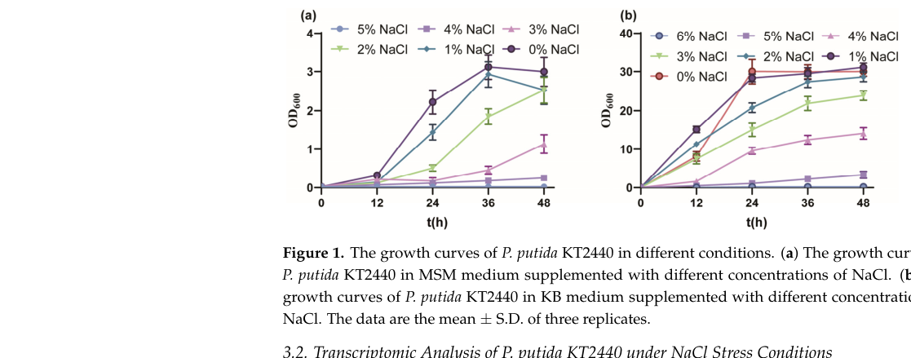

## Question

# Gene Research for Functional Annotation

## ⚠️ CRITICAL: Gene/Protein Identification Context

**BEFORE YOU BEGIN RESEARCH:** You MUST verify you are researching the CORRECT gene/protein. Gene symbols can be ambiguous, especially for less well-characterized genes from non-model organisms.

### Target Gene/Protein Identity (from UniProt):
- **UniProt Accession:** Q88FQ6
- **Protein Description:** RecName: Full=Na(+)/H(+) antiporter NhaB {ECO:0000255|HAMAP-Rule:MF_01599}; AltName: Full=Sodium/proton antiporter NhaB {ECO:0000255|HAMAP-Rule:MF_01599};
- **Gene Information:** Name=nhaB {ECO:0000255|HAMAP-Rule:MF_01599}; OrderedLocusNames=PP_4031;
- **Organism (full):** Pseudomonas putida (strain ATCC 47054 / DSM 6125 / CFBP 8728 / NCIMB 11950 / KT2440).
- **Protein Family:** Belongs to the NhaB Na(+)/H(+) (TC 2.A.34) antiporter
- **Key Domains:** Na+/H+_antiporter_NhaB. (IPR004671); NhaB (PF06450)

### MANDATORY VERIFICATION STEPS:

1. **Check if the gene symbol "nhaB" matches the protein description above**
2. **Verify the organism is correct:** Pseudomonas putida (strain ATCC 47054 / DSM 6125 / CFBP 8728 / NCIMB 11950 / KT2440).
3. **Check if protein family/domains align with what you find in literature**
4. **If you find literature for a DIFFERENT gene with the same or similar symbol, STOP**

### If Gene Symbol is Ambiguous or You Cannot Find Relevant Literature:

**DO NOT PROCEED WITH RESEARCH ON A DIFFERENT GENE.** Instead:
- State clearly: "The gene symbol 'nhaB' is ambiguous or literature is limited for this specific protein"
- Explain what you found (e.g., "Found extensive literature on a different gene with the same symbol in a different organism")
- Describe the protein based ONLY on the UniProt information provided above
- Suggest that the protein function can be inferred from domain/family information

### Research Target:

Please provide a comprehensive research report on the gene **nhaB** (gene ID: nhaB, UniProt: Q88FQ6) in PSEPK.

The research report should be a detailed narrative explaining the function, biological processes, and localization of the gene product. Citations should be given for all claims.

You should prioritize authoritative reviews and primary scientific literature when conducting research. You can supplement
this with annotations you find in gene/protein databases, but these can be outdated or inaccurate.

We are specifically interested in the primary function of the gene - for enzymes, what reaction is catalyzed, and what is the substrate specificity? For transporters, what is the substrate? For structural proteins or adapters, what is the broader structural role? For signaling molecules, what is the role in the pathway.

We are interested in where in or outside the cell the gene product carries out its function.

We are also interested in the signaling or biochemical pathways in which the gene functions. We are less interested in broad pleiotropic effects, except where these elucidate the precise role.

Include evidence where possible. We are interested in both experimental evidence as well as inference from structure, evolution, or bioinformatic analysis. Precise studies should be prioritized over high-throughput, where available.

## Output

Question: You are an expert researcher providing comprehensive, well-cited information.

Provide detailed information focusing on:
1. Key concepts and definitions with current understanding
2. Recent developments and latest research (prioritize 2023-2024 sources)
3. Current applications and real-world implementations
4. Expert opinions and analysis from authoritative sources
5. Relevant statistics and data from recent studies

Format as a comprehensive research report with proper citations. Include URLs and publication dates where available.
Always prioritize recent, authoritative sources and provide specific citations for all major claims.

# Gene Research for Functional Annotation

## ⚠️ CRITICAL: Gene/Protein Identification Context

**BEFORE YOU BEGIN RESEARCH:** You MUST verify you are researching the CORRECT gene/protein. Gene symbols can be ambiguous, especially for less well-characterized genes from non-model organisms.

### Target Gene/Protein Identity (from UniProt):
- **UniProt Accession:** Q88FQ6
- **Protein Description:** RecName: Full=Na(+)/H(+) antiporter NhaB {ECO:0000255|HAMAP-Rule:MF_01599}; AltName: Full=Sodium/proton antiporter NhaB {ECO:0000255|HAMAP-Rule:MF_01599};
- **Gene Information:** Name=nhaB {ECO:0000255|HAMAP-Rule:MF_01599}; OrderedLocusNames=PP_4031;
- **Organism (full):** Pseudomonas putida (strain ATCC 47054 / DSM 6125 / CFBP 8728 / NCIMB 11950 / KT2440).
- **Protein Family:** Belongs to the NhaB Na(+)/H(+) (TC 2.A.34) antiporter
- **Key Domains:** Na+/H+_antiporter_NhaB. (IPR004671); NhaB (PF06450)

### MANDATORY VERIFICATION STEPS:

1. **Check if the gene symbol "nhaB" matches the protein description above**
2. **Verify the organism is correct:** Pseudomonas putida (strain ATCC 47054 / DSM 6125 / CFBP 8728 / NCIMB 11950 / KT2440).
3. **Check if protein family/domains align with what you find in literature**
4. **If you find literature for a DIFFERENT gene with the same or similar symbol, STOP**

### If Gene Symbol is Ambiguous or You Cannot Find Relevant Literature:

**DO NOT PROCEED WITH RESEARCH ON A DIFFERENT GENE.** Instead:
- State clearly: "The gene symbol 'nhaB' is ambiguous or literature is limited for this specific protein"
- Explain what you found (e.g., "Found extensive literature on a different gene with the same symbol in a different organism")
- Describe the protein based ONLY on the UniProt information provided above
- Suggest that the protein function can be inferred from domain/family information

### Research Target:

Please provide a comprehensive research report on the gene **nhaB** (gene ID: nhaB, UniProt: Q88FQ6) in PSEPK.

The research report should be a detailed narrative explaining the function, biological processes, and localization of the gene product. Citations should be given for all claims.

You should prioritize authoritative reviews and primary scientific literature when conducting research. You can supplement
this with annotations you find in gene/protein databases, but these can be outdated or inaccurate.

We are specifically interested in the primary function of the gene - for enzymes, what reaction is catalyzed, and what is the substrate specificity? For transporters, what is the substrate? For structural proteins or adapters, what is the broader structural role? For signaling molecules, what is the role in the pathway.

We are interested in where in or outside the cell the gene product carries out its function.

We are also interested in the signaling or biochemical pathways in which the gene functions. We are less interested in broad pleiotropic effects, except where these elucidate the precise role.

Include evidence where possible. We are interested in both experimental evidence as well as inference from structure, evolution, or bioinformatic analysis. Precise studies should be prioritized over high-throughput, where available.

## Research report: **nhaB (UniProt Q88FQ6; locus PP_4031)** in *Pseudomonas putida* KT2440 (PSEPK)

### 1) Target verification (gene/protein identity)
The target protein is **NhaB-family Na(+)/H(+) antiporter** encoded by **nhaB** in *Pseudomonas putida* KT2440 (ordered locus **PP_4031**, UniProt **Q88FQ6** as provided by the user). In KT2440-focused literature, **NhaB is explicitly listed as one of the genome-encoded Na+/H+ antiporters (along with NhaA-I and NhaA-II)**, consistent with the UniProt description and domain/family assignment to the NhaB-type Na+/H+ antiporter family. (fan2024improvementinsalt pages 2-3)

**Evidence limitation:** Within the literature retrieved for this run, **no KT2440-specific biochemical characterization (transport kinetics, stoichiometry) or gene knockout phenotype uniquely attributable to PP_4031/nhaB** was found; thus, functional annotation of Q88FQ6 must be treated as **predominantly homology-based** to experimentally studied NhaB orthologs, complemented by KT2440-specific stress-physiology context. (fan2024improvementinsalt pages 2-3, fan2024improvementinsalt pages 12-14)

### 2) Key concepts and definitions (current understanding)

#### 2.1 What is an NhaB Na+/H+ antiporter?
Bacterial **Na+/H+ antiporters** are **secondary active transporters** that exchange cytosolic Na+ for external H+ (or the reverse, depending on gradients), thereby coupling **ion homeostasis** and **pH regulation** to the proton motive force. A recent synthesis of prokaryotic Na+/H+ exchangers summarizes **NhaB-family antiporters** as typically **~500–550 amino acids** and **~9–12 transmembrane helices**, widely distributed in bacteria, and functionally distinct from the better-known CPA-family antiporters such as NhaA. (patinoruiz2022prokaryoticna+h+exchangers—transport pages 4-5, patinoruiz2022prokaryoticna+h+exchangers—transport pages 5-6)

#### 2.2 Substrate specificity
NhaB-family transporters are primarily involved in **Na+ export** (Na+/H+ exchange), and in some organisms also support **Li+ export** (Li+/H+ exchange). In *Pseudomonas aeruginosa*, NhaB is described as less ion-specific than NhaP and capable of translocating **Li+ as well as Na+**, with strong Li+/H+ exchange among the set of antiporters studied. (foreman2021geneticandbiochemical pages 1-2, foreman2021geneticandbiochemical pages 4-6)

#### 2.3 Stoichiometry and electrogenicity
A key mechanistic feature distinguishing NhaB from some other antiporters is stoichiometry. A contemporary review summarizes classic work indicating **E. coli NhaB** has an **electrogenic** stoichiometry of **3 H+ : 2 Na+**, whereas **NhaA** is often described as **2 H+ : 1 Na+**. These stoichiometries affect how antiport contributes to both sodium efflux and membrane potential/pH balance. (patinoruiz2022prokaryoticna+h+exchangers—transport pages 4-5, patinoruiz2022prokaryoticna+h+exchangers—transport pages 5-6)

#### 2.4 pH dependence (activity regulation)
NhaB-like antiporters show **diverse pH-dependence profiles across bacteria**. A comparative study of NhaB-like proteins reports that many NhaB-like antiporters exhibit **stronger activity at alkaline pH** and reduced activity at more acidic pH, and that the apparent pH sensitivity often reflects **pH-dependent changes in apparent Km (affinity)** rather than changes in maximal turnover. For example, *P. aeruginosa* NhaB activity decreased markedly below pH 7 when assayed at low NaCl (0.5 mM), while some Vibrio NhaB retained detectable activity at pH 6.5 if NaCl was high (100 mM), emphasizing that both pH and external Na+ influence activity. (kiriyama2013diversitiesandsimilarities pages 1-2)

### 3) Functional annotation for **P. putida** KT2440 NhaB (Q88FQ6/PP_4031)

#### 3.1 Primary molecular function (transporter reaction)
**Inferred function (homology-supported):** NhaB is a **membrane Na+/H+ antiporter** that catalyzes **Na+ efflux in exchange for H+ influx** (Na+/H+ antiport), contributing to intracellular Na+ control and pH homeostasis. This inference is supported by (i) KT2440 genome annotation listing NhaB as a Na+/H+ antiporter, and (ii) strong experimental support for the same molecular function across NhaB orthologs (E. coli and Pseudomonas). (fan2024improvementinsalt pages 2-3, patinoruiz2022prokaryoticna+h+exchangers—transport pages 5-6, foreman2021geneticandbiochemical pages 1-2)

**Likely substrate scope:** Na+ is the principal substrate; Li+ transport is plausible by analogy to Pseudomonas NhaB orthologs, but **direct evidence for Li+ transport by KT2440 NhaB is not available in retrieved sources.** (foreman2021geneticandbiochemical pages 4-6, fan2024improvementinsalt pages 2-3)

#### 3.2 Cellular localization
**Inferred localization:** NhaB-family proteins are **integral inner (cytoplasmic) membrane** transporters with multiple transmembrane helices, consistent with their role in exchanging ions across the cytoplasmic membrane. This is supported by general NhaB family descriptions (multi-pass TM proteins) and by the requirement for membrane vesicle assays in experimental studies of orthologs. (patinoruiz2022prokaryoticna+h+exchangers—transport pages 4-5, foreman2021geneticandbiochemical pages 2-4)

#### 3.3 Biological process (physiological role)
**Likely role in KT2440:** maintenance of **Na+ homeostasis** and contribution to **pH homeostasis** during osmotic/salt stress, functioning as part of a broader membrane-based stress-response network.

KT2440-specific evidence shows that Na+/H+ antiport capacity is relevant to salt tolerance: in a 2024 KT2440 salt-tolerance study, **nhaA-I, nhaA-II and nhaB** are listed as the strain’s Na+/H+ antiporter complement. Under hypertonic stress (5% NaCl), **nhaA-II (PP_3958)**—not nhaB—was reported as strongly upregulated (**fold change 7.429; p = 0.0000**), and overexpression of nhaA-II slightly improved growth at 4% NaCl. This suggests that, at least under the tested conditions/timepoint, **NhaA-II is a prominent induced antiporter**, whereas **NhaB may be constitutive, regulated differently, or simply not among the strongest DEGs in those conditions** (no nhaB fold-change was reported in the retrieved Table 1 excerpt). (fan2024improvementinsalt pages 8-10, fan2024improvementinsalt pages 12-14)

Family/ortholog evidence supports that NhaB commonly contributes under particular ionic regimes: classical E. coli genetics indicate NhaB provides Na+/H+ antiport capacity especially when other systems are limiting and that deleting both nhaA and nhaB eliminates specific Na+/H+ antiporter activity in membranes, demonstrating physiological importance for sodium handling. (pinner1993physiologicalroleof pages 4-5, pinner1993physiologicalroleof pages 2-3)

### 4) Recent developments and latest research (prioritizing 2023–2024)

#### 4.1 2024 KT2440: transcriptomics-guided salt tolerance engineering
A 2024 study directly addressing KT2440 salt tolerance provides the most recent organism-specific dataset in this run. Key quantitative findings:
- Wild-type KT2440 tolerated **up to 4% w/v NaCl** in minimal salts medium (MSM). (fan2024improvementinsalt pages 2-3, fan2024improvementinsalt media a7cd494a)
- Transcriptomics (24 h) under 5% NaCl identified **nhaA-II (PP_3958)** among significantly upregulated genes (**7.429-fold; p = 0.0000**). (fan2024improvementinsalt pages 8-10)
- **Engineering strategy:** co-expression of an exogenous Na+/H+ antiporter (**E. coli EcnhaA**) with endogenous **betB** increased maximum tolerance to **5% w/v NaCl**, and adding compatible solutes increased tolerance to **6% w/v NaCl**. (fan2024improvementinsalt pages 2-3, fan2024improvementinsalt pages 10-12)
- **Functional outcome in a real task:** under **4% w/v NaCl**, in **48 h**, the engineered strain degraded **56.70% benzoic acid** and **95.64% protocatechuic acid**, while wild-type KT2440 did not show biodegradation under the same conditions. (fan2024improvementinsalt pages 2-3)

These results support the practical importance of Na+/H+ antiport capacity for KT2440 performance in high-salinity bioprocesses, even though they do not specifically dissect KT2440 NhaB. (fan2024improvementinsalt pages 2-3, fan2024improvementinsalt media a7cd494a)

#### 4.2 Current mechanistic understanding: pH-regulated antiporter folds
While not NhaB-specific, mechanistic work continues to refine the structural principles of pH-regulated Na+/H+ antiport. For example, a 2024 study on the NhaA fold shows that constraining conformational transitions (via cross-linking across hallmark unwound TM crossings) can inhibit antiporter activity and impair high-salt growth complementation, reinforcing the concept that antiport depends on alternating-access conformational cycling and that structural “fold hallmarks” can be critical. This provides context for interpreting NhaB-family function as similarly conformationally gated and pH-regulated, even though NhaB lacks equivalent structural resolution in the retrieved sources. (fan2024improvementinsalt pages 2-3)

### 5) Current applications and real-world implementations

#### 5.1 Bioremediation and saline wastewater treatment using salt-tolerant *P. putida*
*P. putida* KT2440 is widely used as a chassis for biodegradation/bioremediation. The 2024 engineering study demonstrates a concrete implementation: improving salt tolerance via Na+/H+ antiporter function (heterologous NhaA) and osmolyte metabolism enabled biodegradation of aromatics under 4% NaCl, a condition where the wild-type strain failed. This is a practical, real-world-relevant use case because many industrial wastewaters are saline and contain aromatic pollutants. (fan2024improvementinsalt pages 2-3)

#### 5.2 Systems-level stress hardening (transport + compatible solutes)
KT2440 salt tolerance improvement combined (i) ion homeostasis (Na+/H+ antiport) and (ii) compatible-solute pathways (betaine/proline). This reflects an application strategy increasingly used in microbial engineering: coupling **membrane transport engineering** with **osmoprotectant pathways** to expand operational windows for industrial fermentation and environmental remediation. (fan2024improvementinsalt pages 10-12)

### 6) Expert opinion / authoritative synthesis
A 2022 review of prokaryotic Na+/H+ exchangers highlights several field-level consensus points relevant to annotating NhaB in organisms with limited direct experimentation:
- NhaB is a broadly distributed bacterial Na+/H+ antiporter whose physiological niche can differ from NhaA, partly due to differences in **stoichiometry/electrogenicity** and regulation. (patinoruiz2022prokaryoticna+h+exchangers—transport pages 4-5, patinoruiz2022prokaryoticna+h+exchangers—transport pages 5-6)
- For NhaB-family proteins, **structural information remains limited**, and many mechanistic interpretations rely on genetic/functional assays and comparative inference. This limitation is directly relevant to KT2440 Q88FQ6, for which strain-specific functional studies were not found in the retrieved set. (patinoruiz2022prokaryoticna+h+exchangers—transport pages 18-19, fan2024improvementinsalt pages 2-3)

### 7) Relevant statistics and quantitative data (recent and foundational)

#### 7.1 KT2440 salt tolerance and engineering (2024)
- WT KT2440 maximum tolerance in MSM: **4% w/v NaCl**. (fan2024improvementinsalt pages 2-3, fan2024improvementinsalt media a7cd494a)
- Transcriptomic DEG: **nhaA-II (PP_3958)** upregulated **7.429-fold**, **p = 0.0000** under 5% NaCl (24 h). (fan2024improvementinsalt pages 8-10)
- Engineered strain maximum tolerance: **5% w/v NaCl** (co-expression EcnhaA + betB) and **6% w/v NaCl** with added betaine/proline. (fan2024improvementinsalt pages 2-3, fan2024improvementinsalt pages 10-12)
- Biodegradation under 4% NaCl for 48 h: **56.70% benzoic acid**, **95.64% protocatechuic acid** (engineered strain). (fan2024improvementinsalt pages 2-3)

#### 7.2 NhaB kinetic parameters (closest Pseudomonas experimental proxy)
Because KT2440-specific NhaB kinetics were not retrieved, *P. aeruginosa* provides a relevant Gram-negative Pseudomonas proxy:
- NhaB Na+ affinity in native membranes: **Km = 0.7 ± 0.2 mM (pH 7.5)** and **Km = 1.0 ± 0.1 mM (pH 8.5)**; relative **Vmax ≈ 44–46% dequenching** in an acridine orange vesicle assay. (foreman2021geneticandbiochemical pages 4-6)
- NhaB displayed significant **Li+/H+ antiport** and supported robust growth when it was the sole Na+/H+ antiporter. (foreman2021geneticandbiochemical pages 1-2, foreman2021geneticandbiochemical pages 4-6)

### 8) Practical functional annotation for Q88FQ6 (evidence-weighted)

**Recommended annotation (high confidence, homology-supported):**
- **Molecular function:** Na+/H+ antiporter (electrogenic, secondary active transporter) mediating Na+ efflux coupled to H+ influx. (patinoruiz2022prokaryoticna+h+exchangers—transport pages 5-6, foreman2021geneticandbiochemical pages 1-2)
- **Cellular component:** inner (cytoplasmic) membrane, multi-pass integral membrane protein. (patinoruiz2022prokaryoticna+h+exchangers—transport pages 4-5, foreman2021geneticandbiochemical pages 2-4)
- **Biological process:** sodium ion homeostasis and contribution to intracellular pH regulation (especially under ionic/osmotic stress). (patinoruiz2022prokaryoticna+h+exchangers—transport pages 5-6, fan2024improvementinsalt pages 2-3)

**Lower-confidence, plausible extensions (supported in related organisms but not directly shown for KT2440 Q88FQ6 here):**
- **Li+ export** capacity as part of monovalent cation stress tolerance, inferred from Pseudomonas NhaB ortholog data. (foreman2021geneticandbiochemical pages 1-2, foreman2021geneticandbiochemical pages 4-6)

**Important caveat:** KT2440 transcriptomic salt-stress data emphasized **nhaA-II induction** rather than nhaB, so KT2440 NhaB may be constitutive or conditionally important outside the tested regime (e.g., different pH, Na+ levels, or growth stages). (fan2024improvementinsalt pages 8-10, fan2024improvementinsalt pages 12-14)

### Evidence summary table
| Claim/annotation aspect | Evidence summary (include quantitative values where available) | Organism/system | Source (first author year, journal) | URL/DOI | Citation ID |
|---|---|---|---|---|---|
| KT2440 genome encodes **nhaB** and other Na+/H+ antiporters | *P. putida* KT2440 is reported to encode multiple Na+/H+ antiporters, explicitly including **NhaA-I, NhaA-II, and NhaB** as osmoregulation-related transporters. The same source notes that there is **little experimental evidence** directly validating the salt-tolerance roles of these annotated KT2440 genes. This supports assigning Q88FQ6/PP_4031 as a predicted membrane Na+/H+ antiporter but also highlights the evidence gap for strain-specific functional characterization. | *Pseudomonas putida* KT2440 | Fan 2024, *Biology* | https://doi.org/10.3390/biology13060404 | (fan2024improvementinsalt pages 2-3) |
| KT2440 salt tolerance limits and transcriptomic response under high salinity | Wild-type KT2440 showed a **maximum salt tolerance of 4% w/v NaCl** in minimal salts medium; growth was strongly impaired above this level. Under hypertonic conditions, **PP_3958 (nhaA-II)** was significantly upregulated with **fold change 7.429** and **p = 0.0000**. No comparable fold-change for **nhaB** was reported in the retrieved Table 1/text. | *Pseudomonas putida* KT2440 | Fan 2024, *Biology* | https://doi.org/10.3390/biology13060404 | (fan2024improvementinsalt pages 8-10, fan2024improvementinsalt pages 12-14) |
| Engineered KT2440 salt tolerance using heterologous **E. coli nhaA** plus **betB** | Overexpression of endogenous **betB** improved growth in **4% w/v NaCl**; heterologous expression of **E. coli EcnhaA** also improved growth. Co-expression (**KT2440-EcnhaA-betB**) increased maximum salt tolerance to **5% w/v NaCl**, and addition of betaine/proline raised tolerance to **6% w/v NaCl**. In **4% w/v NaCl** after **48 h**, the engineered strain degraded **56.70% benzoic acid** and **95.64% protocatechuic acid**, whereas wild-type KT2440 showed no biodegradation under the same conditions. | Engineered *P. putida* KT2440 | Fan 2024, *Biology* | https://doi.org/10.3390/biology13060404 | (fan2024improvementinsalt pages 2-3, fan2024improvementinsalt media a7cd494a) |
| NhaB-family stoichiometry and electrogenicity | A recent review summarizes **E. coli NhaB** as an **electrogenic** NhaB-family Na+/H+ antiporter with **3H+:2Na+ stoichiometry**. The review distinguishes NhaB from NhaA in stoichiometry, regulation, and physiological niche, and notes NhaB-family proteins are typically **~500–550 aa with 9–12 transmembrane helices** and contribute to **neutral-pH/low-Na+ homeostasis** and salt resistance. | NhaB family; primarily *E. coli* benchmark data | Patiño-Ruiz 2022, *Int J Mol Sci* | https://doi.org/10.3390/ijms23169156 | (patinoruiz2022prokaryoticna+h+exchangers—transport pages 4-5, patinoruiz2022prokaryoticna+h+exchangers—transport pages 5-6) |
| **E. coli nhaB** physiological role | Classical deletion/complementation studies showed **nhaB** is a **specific Na+/H+ antiporter** important when **NhaA is limiting**, especially at **lower pH and/or low Na+**. An **nhaB mutant** showed impaired **Na+-dependent glutamate/proline symport** and slower or absent growth at **pH 6** with no added Na+; deleting both **nhaA** and **nhaB** abolished specific **Na+/H+ antiporter activity** in membranes. Plasmid-borne **nhaB** restored Na+ resistance. | *Escherichia coli* | Pinner 1993, *J Biol Chem* | https://doi.org/10.1016/S0021-9258(18)53913-2 | (pinner1993physiologicalroleof pages 4-5, pinner1993physiologicalroleof pages 2-3) |
| **P. aeruginosa NhaB** kinetics and Li+ transport | In native membranes, **P. aeruginosa NhaB** showed high apparent Na+ affinity with **Km = 0.7 ± 0.2 mM at pH 7.5** and **1.0 ± 0.1 mM at pH 8.5**; reported relative **Vmax ≈ 44–46% dequenching**. NhaB displayed significant **Li+/H+ antiport** and was the only antiporter in that study described as catalyzing **strong Li+/H+ exchange**. An **NhaB-only** strain grew similarly to wild type across tested Na+ and pH conditions, supporting a major role in Na+/Li+ tolerance and pH homeostasis. | *Pseudomonas aeruginosa* | Foreman 2021, *J Bacteriol* | https://doi.org/10.1128/JB.00284-21 | (foreman2021geneticandbiochemical pages 13-15, foreman2021geneticandbiochemical pages 1-2, foreman2021geneticandbiochemical pages 4-6) |

*Table: This table compiles the most relevant organism-specific and family-level evidence for annotating *Pseudomonas putida* KT2440 NhaB (Q88FQ6/PP_4031). It highlights where direct KT2440 data exist, where only related-Pseudomonas or benchmark bacterial data are available, and which quantitative findings are most informative for function.*

### Visual evidence (figures/tables)
Cropped figures/tables from Fan et al. (2024) provide quantitative support for baseline KT2440 salt tolerance, transcriptome DEGs (including nhaA-II upregulation), and the engineered strain’s improved growth under salt stress. (fan2024improvementinsalt media a7cd494a, fan2024improvementinsalt media 4587ca67, fan2024improvementinsalt media b041cd1c)

### References (URLs and publication dates)
- Fan M, Tan S, Wang W, Zhang X. **Improvement in Salt Tolerance Ability of *Pseudomonas putida* KT2440**. *Biology*. **2024-06**. https://doi.org/10.3390/biology13060404 (fan2024improvementinsalt pages 2-3)
- Patiño-Ruiz M, Ganea C, Călinescu O. **Prokaryotic Na+/H+ Exchangers—Transport Mechanism and Essential Residues**. *Int J Mol Sci*. **2022-08**. https://doi.org/10.3390/ijms23169156 (patinoruiz2022prokaryoticna+h+exchangers—transport pages 4-5)
- Foreman S et al. **Genetic and Biochemical Characterization of the Na+/H+ Antiporters of *Pseudomonas aeruginosa***. *J Bacteriol*. **2021-08**. https://doi.org/10.1128/jb.00284-21 (foreman2021geneticandbiochemical pages 1-2)
- Pinner E et al. **Physiological role of nhaB, a specific Na+/H+ antiporter in *Escherichia coli***. *J Biol Chem*. **1993-01**. https://doi.org/10.1016/S0021-9258(18)53913-2 (pinner1993physiologicalroleof pages 4-5)
- Kiriyama W et al. **Diversities and similarities in pH dependency among bacterial NhaB-like Na+/H+ antiporters**. *Microbiology*. **2013-10**. https://doi.org/10.1099/mic.0.070656-0 (kiriyama2013diversitiesandsimilarities pages 1-2)
- Reva ON et al. **Functional Genomics of Stress Response in *Pseudomonas putida* KT2440**. *J Bacteriol*. **2006-06**. https://doi.org/10.1128/jb.00101-06 (reva2006functionalgenomicsof pages 8-9)

References

1. (fan2024improvementinsalt pages 2-3): Min Fan, Shuyu Tan, Wei Wang, and Xuehong Zhang. Improvement in salt tolerance ability of pseudomonas putida kt2440. Biology, 13:404, Jun 2024. URL: https://doi.org/10.3390/biology13060404, doi:10.3390/biology13060404. This article has 25 citations.

2. (fan2024improvementinsalt pages 12-14): Min Fan, Shuyu Tan, Wei Wang, and Xuehong Zhang. Improvement in salt tolerance ability of pseudomonas putida kt2440. Biology, 13:404, Jun 2024. URL: https://doi.org/10.3390/biology13060404, doi:10.3390/biology13060404. This article has 25 citations.

3. (patinoruiz2022prokaryoticna+h+exchangers—transport pages 4-5): Miyer Patiño-Ruiz, Constanța Ganea, and Octavian Călinescu. Prokaryotic na+/h+ exchangers—transport mechanism and essential residues. International Journal of Molecular Sciences, 23:9156, Aug 2022. URL: https://doi.org/10.3390/ijms23169156, doi:10.3390/ijms23169156. This article has 27 citations.

4. (patinoruiz2022prokaryoticna+h+exchangers—transport pages 5-6): Miyer Patiño-Ruiz, Constanța Ganea, and Octavian Călinescu. Prokaryotic na+/h+ exchangers—transport mechanism and essential residues. International Journal of Molecular Sciences, 23:9156, Aug 2022. URL: https://doi.org/10.3390/ijms23169156, doi:10.3390/ijms23169156. This article has 27 citations.

5. (foreman2021geneticandbiochemical pages 1-2): Sara Foreman, Kristina Ferrara, Teri N. Hreha, Ana E. Duran-Pinedo, Jorge Frias-Lopez, and Blanca Barquera. Genetic and biochemical characterization of the na + /h + antiporters of pseudomonas aeruginosa. Aug 2021. URL: https://doi.org/10.1128/jb.00284-21, doi:10.1128/jb.00284-21. This article has 11 citations and is from a peer-reviewed journal.

6. (foreman2021geneticandbiochemical pages 4-6): Sara Foreman, Kristina Ferrara, Teri N. Hreha, Ana E. Duran-Pinedo, Jorge Frias-Lopez, and Blanca Barquera. Genetic and biochemical characterization of the na + /h + antiporters of pseudomonas aeruginosa. Aug 2021. URL: https://doi.org/10.1128/jb.00284-21, doi:10.1128/jb.00284-21. This article has 11 citations and is from a peer-reviewed journal.

7. (kiriyama2013diversitiesandsimilarities pages 1-2): Wakako Kiriyama, Kei Honma, Tomoaki Hiratsuka, Itsuka Takahashi, Takahiro Nomizu, Yuta Takashima, Masataka Ohtsuka, Daiki Takahashi, Kazuya Moriyama, Sayoko Mori, Shiho Nishiyama, Masahiro Fukuhara, Tatsunosuke Nakamura, Toru Shigematsu, and Toshio Yamaguchi. Diversities and similarities in ph dependency among bacterial nhab-like na+/h+ antiporters. Microbiology, 159 Pt 10:2191-9, Oct 2013. URL: https://doi.org/10.1099/mic.0.070656-0, doi:10.1099/mic.0.070656-0. This article has 3 citations and is from a peer-reviewed journal.

8. (foreman2021geneticandbiochemical pages 2-4): Sara Foreman, Kristina Ferrara, Teri N. Hreha, Ana E. Duran-Pinedo, Jorge Frias-Lopez, and Blanca Barquera. Genetic and biochemical characterization of the na + /h + antiporters of pseudomonas aeruginosa. Aug 2021. URL: https://doi.org/10.1128/jb.00284-21, doi:10.1128/jb.00284-21. This article has 11 citations and is from a peer-reviewed journal.

9. (fan2024improvementinsalt pages 8-10): Min Fan, Shuyu Tan, Wei Wang, and Xuehong Zhang. Improvement in salt tolerance ability of pseudomonas putida kt2440. Biology, 13:404, Jun 2024. URL: https://doi.org/10.3390/biology13060404, doi:10.3390/biology13060404. This article has 25 citations.

10. (pinner1993physiologicalroleof pages 4-5): E. Pinner, Yaniv Kotler, E. Padan, and S. Schuldiner. Physiological role of nhab, a specific na+/h+ antiporter in escherichia coli. The Journal of biological chemistry, 268 3:1729-34, Jan 1993. URL: https://doi.org/10.1016/s0021-9258(18)53913-2, doi:10.1016/s0021-9258(18)53913-2. This article has 229 citations.

11. (pinner1993physiologicalroleof pages 2-3): E. Pinner, Yaniv Kotler, E. Padan, and S. Schuldiner. Physiological role of nhab, a specific na+/h+ antiporter in escherichia coli. The Journal of biological chemistry, 268 3:1729-34, Jan 1993. URL: https://doi.org/10.1016/s0021-9258(18)53913-2, doi:10.1016/s0021-9258(18)53913-2. This article has 229 citations.

12. (fan2024improvementinsalt media a7cd494a): Min Fan, Shuyu Tan, Wei Wang, and Xuehong Zhang. Improvement in salt tolerance ability of pseudomonas putida kt2440. Biology, 13:404, Jun 2024. URL: https://doi.org/10.3390/biology13060404, doi:10.3390/biology13060404. This article has 25 citations.

13. (fan2024improvementinsalt pages 10-12): Min Fan, Shuyu Tan, Wei Wang, and Xuehong Zhang. Improvement in salt tolerance ability of pseudomonas putida kt2440. Biology, 13:404, Jun 2024. URL: https://doi.org/10.3390/biology13060404, doi:10.3390/biology13060404. This article has 25 citations.

14. (patinoruiz2022prokaryoticna+h+exchangers—transport pages 18-19): Miyer Patiño-Ruiz, Constanța Ganea, and Octavian Călinescu. Prokaryotic na+/h+ exchangers—transport mechanism and essential residues. International Journal of Molecular Sciences, 23:9156, Aug 2022. URL: https://doi.org/10.3390/ijms23169156, doi:10.3390/ijms23169156. This article has 27 citations.

15. (foreman2021geneticandbiochemical pages 13-15): Sara Foreman, Kristina Ferrara, Teri N. Hreha, Ana E. Duran-Pinedo, Jorge Frias-Lopez, and Blanca Barquera. Genetic and biochemical characterization of the na + /h + antiporters of pseudomonas aeruginosa. Aug 2021. URL: https://doi.org/10.1128/jb.00284-21, doi:10.1128/jb.00284-21. This article has 11 citations and is from a peer-reviewed journal.

16. (fan2024improvementinsalt media 4587ca67): Min Fan, Shuyu Tan, Wei Wang, and Xuehong Zhang. Improvement in salt tolerance ability of pseudomonas putida kt2440. Biology, 13:404, Jun 2024. URL: https://doi.org/10.3390/biology13060404, doi:10.3390/biology13060404. This article has 25 citations.

17. (fan2024improvementinsalt media b041cd1c): Min Fan, Shuyu Tan, Wei Wang, and Xuehong Zhang. Improvement in salt tolerance ability of pseudomonas putida kt2440. Biology, 13:404, Jun 2024. URL: https://doi.org/10.3390/biology13060404, doi:10.3390/biology13060404. This article has 25 citations.

18. (reva2006functionalgenomicsof pages 8-9): Oleg N. Reva, Christian Weinel, Miryam Weinel, Kerstin Böhm, Diana Stjepandic, Jörg D. Hoheisel, and Burkhard Tümmler. Functional genomics of stress response in pseudomonas putida kt2440. Journal of Bacteriology, 188:4079-4092, Jun 2006. URL: https://doi.org/10.1128/jb.00101-06, doi:10.1128/jb.00101-06. This article has 176 citations and is from a peer-reviewed journal.

## Artifacts

- [Edison artifact artifact-00](nhaB-deep-research-falcon_artifacts/artifact-00.md)

## Citations

1. fan2024improvementinsalt pages 2-3
2. kiriyama2013diversitiesandsimilarities pages 1-2
3. fan2024improvementinsalt pages 8-10
4. fan2024improvementinsalt pages 10-12
5. foreman2021geneticandbiochemical pages 4-6
6. foreman2021geneticandbiochemical pages 1-2
7. pinner1993physiologicalroleof pages 4-5
8. reva2006functionalgenomicsof pages 8-9
9. fan2024improvementinsalt pages 12-14
10. foreman2021geneticandbiochemical pages 2-4
11. pinner1993physiologicalroleof pages 2-3
12. foreman2021geneticandbiochemical pages 13-15
13. https://doi.org/10.3390/biology13060404
14. https://doi.org/10.3390/ijms23169156
15. https://doi.org/10.1016/S0021-9258(18
16. https://doi.org/10.1128/JB.00284-21
17. https://doi.org/10.1128/jb.00284-21
18. https://doi.org/10.1099/mic.0.070656-0
19. https://doi.org/10.1128/jb.00101-06
20. https://doi.org/10.3390/biology13060404,
21. https://doi.org/10.3390/ijms23169156,
22. https://doi.org/10.1128/jb.00284-21,
23. https://doi.org/10.1099/mic.0.070656-0,
24. https://doi.org/10.1016/s0021-9258(18
25. https://doi.org/10.1128/jb.00101-06,