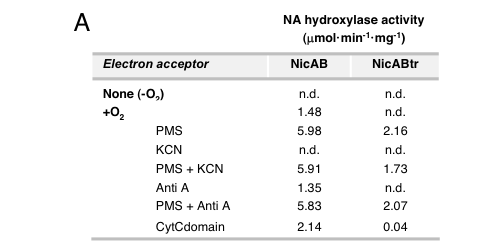

## Question

# Gene Research for Functional Annotation

## ⚠️ CRITICAL: Gene/Protein Identification Context

**BEFORE YOU BEGIN RESEARCH:** You MUST verify you are researching the CORRECT gene/protein. Gene symbols can be ambiguous, especially for less well-characterized genes from non-model organisms.

### Target Gene/Protein Identity (from UniProt):
- **UniProt Accession:** Q88FX9
- **Protein Description:** RecName: Full=Nicotinate dehydrogenase subunit A; EC=1.17.2.1; AltName: Full=Nicotinate degradation protein A; AltName: Full=Nicotinate dehydrogenase small subunit;
- **Gene Information:** Name=nicA; Synonyms=ndhS; OrderedLocusNames=PP_3947;
- **Organism (full):** Pseudomonas putida (strain ATCC 47054 / DSM 6125 / CFBP 8728 / NCIMB 11950 / KT2440).
- **Protein Family:** Not specified in UniProt
- **Key Domains:** 2Fe-2S-bd. (IPR002888); 2Fe-2S-bd_dom_sf. (IPR036884); 2Fe-2S_ferredoxin-like_sf. (IPR036010); 2Fe-2S_ferredoxin-type. (IPR001041); 2Fe2S_fd_BS. (IPR006058)

### MANDATORY VERIFICATION STEPS:

1. **Check if the gene symbol "nicA" matches the protein description above**
2. **Verify the organism is correct:** Pseudomonas putida (strain ATCC 47054 / DSM 6125 / CFBP 8728 / NCIMB 11950 / KT2440).
3. **Check if protein family/domains align with what you find in literature**
4. **If you find literature for a DIFFERENT gene with the same or similar symbol, STOP**

### If Gene Symbol is Ambiguous or You Cannot Find Relevant Literature:

**DO NOT PROCEED WITH RESEARCH ON A DIFFERENT GENE.** Instead:
- State clearly: "The gene symbol 'nicA' is ambiguous or literature is limited for this specific protein"
- Explain what you found (e.g., "Found extensive literature on a different gene with the same symbol in a different organism")
- Describe the protein based ONLY on the UniProt information provided above
- Suggest that the protein function can be inferred from domain/family information

### Research Target:

Please provide a comprehensive research report on the gene **nicA** (gene ID: nicA, UniProt: Q88FX9) in PSEPK.

The research report should be a detailed narrative explaining the function, biological processes, and localization of the gene product. Citations should be given for all claims.

You should prioritize authoritative reviews and primary scientific literature when conducting research. You can supplement
this with annotations you find in gene/protein databases, but these can be outdated or inaccurate.

We are specifically interested in the primary function of the gene - for enzymes, what reaction is catalyzed, and what is the substrate specificity? For transporters, what is the substrate? For structural proteins or adapters, what is the broader structural role? For signaling molecules, what is the role in the pathway.

We are interested in where in or outside the cell the gene product carries out its function.

We are also interested in the signaling or biochemical pathways in which the gene functions. We are less interested in broad pleiotropic effects, except where these elucidate the precise role.

Include evidence where possible. We are interested in both experimental evidence as well as inference from structure, evolution, or bioinformatic analysis. Precise studies should be prioritized over high-throughput, where available.

## Output

Question: You are an expert researcher providing comprehensive, well-cited information.

Provide detailed information focusing on:
1. Key concepts and definitions with current understanding
2. Recent developments and latest research (prioritize 2023-2024 sources)
3. Current applications and real-world implementations
4. Expert opinions and analysis from authoritative sources
5. Relevant statistics and data from recent studies

Format as a comprehensive research report with proper citations. Include URLs and publication dates where available.
Always prioritize recent, authoritative sources and provide specific citations for all major claims.

# Gene Research for Functional Annotation

## ⚠️ CRITICAL: Gene/Protein Identification Context

**BEFORE YOU BEGIN RESEARCH:** You MUST verify you are researching the CORRECT gene/protein. Gene symbols can be ambiguous, especially for less well-characterized genes from non-model organisms.

### Target Gene/Protein Identity (from UniProt):
- **UniProt Accession:** Q88FX9
- **Protein Description:** RecName: Full=Nicotinate dehydrogenase subunit A; EC=1.17.2.1; AltName: Full=Nicotinate degradation protein A; AltName: Full=Nicotinate dehydrogenase small subunit;
- **Gene Information:** Name=nicA; Synonyms=ndhS; OrderedLocusNames=PP_3947;
- **Organism (full):** Pseudomonas putida (strain ATCC 47054 / DSM 6125 / CFBP 8728 / NCIMB 11950 / KT2440).
- **Protein Family:** Not specified in UniProt
- **Key Domains:** 2Fe-2S-bd. (IPR002888); 2Fe-2S-bd_dom_sf. (IPR036884); 2Fe-2S_ferredoxin-like_sf. (IPR036010); 2Fe-2S_ferredoxin-type. (IPR001041); 2Fe2S_fd_BS. (IPR006058)

### MANDATORY VERIFICATION STEPS:

1. **Check if the gene symbol "nicA" matches the protein description above**
2. **Verify the organism is correct:** Pseudomonas putida (strain ATCC 47054 / DSM 6125 / CFBP 8728 / NCIMB 11950 / KT2440).
3. **Check if protein family/domains align with what you find in literature**
4. **If you find literature for a DIFFERENT gene with the same or similar symbol, STOP**

### If Gene Symbol is Ambiguous or You Cannot Find Relevant Literature:

**DO NOT PROCEED WITH RESEARCH ON A DIFFERENT GENE.** Instead:
- State clearly: "The gene symbol 'nicA' is ambiguous or literature is limited for this specific protein"
- Explain what you found (e.g., "Found extensive literature on a different gene with the same symbol in a different organism")
- Describe the protein based ONLY on the UniProt information provided above
- Suggest that the protein function can be inferred from domain/family information

### Research Target:

Please provide a comprehensive research report on the gene **nicA** (gene ID: nicA, UniProt: Q88FX9) in PSEPK.

The research report should be a detailed narrative explaining the function, biological processes, and localization of the gene product. Citations should be given for all claims.

You should prioritize authoritative reviews and primary scientific literature when conducting research. You can supplement
this with annotations you find in gene/protein databases, but these can be outdated or inaccurate.

We are specifically interested in the primary function of the gene - for enzymes, what reaction is catalyzed, and what is the substrate specificity? For transporters, what is the substrate? For structural proteins or adapters, what is the broader structural role? For signaling molecules, what is the role in the pathway.

We are interested in where in or outside the cell the gene product carries out its function.

We are also interested in the signaling or biochemical pathways in which the gene functions. We are less interested in broad pleiotropic effects, except where these elucidate the precise role.

Include evidence where possible. We are interested in both experimental evidence as well as inference from structure, evolution, or bioinformatic analysis. Precise studies should be prioritized over high-throughput, where available.

## Research report: *Pseudomonas putida* KT2440 **nicA** (UniProt Q88FX9; PP_3947; syn. **ndhS**) — functional annotation

### 0) Mandatory identity verification (to avoid symbol ambiguity)
Primary literature mapping of the *P. putida* KT2440 **nic** locus identifies **nicA** as **PP_3947** and explicitly equates it with the **small iron–sulfur subunit** of the **NicAB nicotinic-acid hydroxylase**. NicA is described as ~23.8 kDa and contains conserved cysteine motifs consistent with binding **two [2Fe–2S] clusters**, matching the UniProt Q88FX9 description (Nicotinate dehydrogenase subunit A / “small subunit” with 2Fe–2S ferredoxin-like domains). (jimenez2008decipheringthegenetic pages 2-3, jimenez2008decipheringthegenetic pages 1-2)

### 1) Key concepts and definitions (current understanding)
#### 1.1 What “Nicotinate dehydrogenase / nicotinic acid hydroxylase” means in bacteria
In the *P. putida* KT2440 **aerobic** nicotinate (nicotinic acid; NA) pathway, the first committed step is an enzyme-catalyzed **C6 hydroxylation** of nicotinic acid to **6-hydroxynicotinic acid (6HNA)**. In KT2440 this activity is carried by a **two-component hydroxylase**, NicAB, with NicA as the Fe–S “small subunit” and NicB as the large catalytic/electron-transfer subunit. (jimenez2008decipheringthegenetic pages 1-2, jimenez2008decipheringthegenetic pages 2-3)

More broadly, recent synthesis of the field describes nicotinate dehydrogenases/hydroxylases (NDHase) as **membrane-associated multi-component redox enzymes** that function in connection with the **membrane electron respiratory chain** and are composed of iron–sulfur centers, flavin components (FAD/FMN), molybdenum-binding components, and sometimes cytochromes. (chen2023sourcescomponentsstructure pages 1-2, chen2023sourcescomponentsstructure pages 3-5)

#### 1.2 Pathway context: the “maleamate pathway” for aerobic nicotinate catabolism
Jiménez et al. define the KT2440 **nic cluster** and propose an aerobic pathway in which nicotinate carbon is funneled to central metabolism via maleamate/maleate and ultimately fumarate. After NicAB makes 6HNA, subsequent steps include: 6HNA → 2,5-dihydroxypyridine (2,5DHP) → N-formylmaleamic acid (NFM) → maleamic acid → maleate → fumarate. (jimenez2008decipheringthegenetic pages 1-2, jimenez2008decipheringthegenetic pages 2-3)

### 2) Primary function of NicA (Q88FX9): reaction, substrate specificity, and mechanism
#### 2.1 Reaction catalyzed (as part of NicAB)
**NicA is not a standalone catalyst**; it is the electron-transfer **small subunit** required for NicAB function. Genetic disruption of **nicA** blocks growth on NA but not on 6HNA, placing NicA at the **NA → 6HNA** step. (jimenez2008decipheringthegenetic pages 2-3)

Jiménez et al. further show that expressing NicAB in otherwise NA-nonoxidizing *Pseudomonas* strains confers the ability to convert NA **stoichiometrically** into 6HNA, directly linking NicAB (and therefore NicA) to this transformation. (jimenez2008decipheringthegenetic pages 2-3)

#### 2.2 Substrate specificity
KT2440 NicAB is reported as **highly specific for nicotinic acid** in the PNAS study. (jimenez2008decipheringthegenetic pages 2-3)

A 2023 critical review that compiles comparative substrate-scope data across NDHases notes that the NDHase from *P. putida* KT2440 can hydroxylate **nicotinic acid** but **fails to hydroxylate 3-cyanopyridine**, whereas some other bacteria possess NDHases with broader scope (including 3-cyanopyridine). (chen2023sourcescomponentsstructure pages 5-6)

#### 2.3 Cofactors, electron acceptors, and electron-transfer chain (mechanistic model)
**Domain/cofactor architecture and role of NicA.** NicA contains conserved motifs consistent with binding **two [2Fe–2S] clusters** and is homologous to electron-transfer subunits of xanthine dehydrogenase–family enzymes, supporting the role of NicA as an electron-transfer module within NicAB. (jimenez2008decipheringthegenetic pages 2-3, brickman2018thebordetellabronchiseptica pages 3-4)

**Dependence on oxygen and respiratory components.** NicAB hydroxylase activity is **oxygen dependent** (falls below detection anaerobically) and can be increased by adding an **external electron acceptor** (phenazine methosulfate; PMS). (jimenez2008decipheringthegenetic pages 2-3)

**Cytochrome-c coupling and inhibitor evidence.** Jiménez et al. present evidence that the **C-terminal cytochrome c (CytC) domain** of NicB is required for physiological electron transfer: truncation that removes the CytC domain abolishes activity, but activity can be restored by (i) providing PMS as an artificial terminal acceptor, or (ii) supplying the CytC domain in trans. Inhibition by **KCN** (cytochrome c oxidase inhibitor) but not by antimycin A supports electron transfer from NicB’s CytC domain to a cytochrome c oxidase, with **O2 as the terminal electron acceptor**. (jimenez2008decipheringthegenetic pages 3-4)

**Expert synthesis (2023):** NDHase systems are described as requiring the membrane electron respiratory chain and being built from Fe–S, flavin, molybdenum-binding, and cytochrome components, consistent with the mechanistic picture assembled from the KT2440 NicAB system. (chen2023sourcescomponentsstructure pages 1-2, chen2023sourcescomponentsstructure pages 3-5)

### 3) Biological process and pathway placement in *P. putida* KT2440
#### 3.1 Gene cluster organization and pathway steps
Jiménez et al. identify a contiguous **nicTPFEDCXRAB** cluster (14 kb) sufficient for aerobic NA degradation when transferred to other *Pseudomonas* hosts. (jimenez2008decipheringthegenetic pages 1-2)

Within the pathway:
- **NicAB**: NA → 6HNA (first step; NicA is the Fe–S small subunit). (jimenez2008decipheringthegenetic pages 1-2, jimenez2008decipheringthegenetic pages 2-3)
- **NicC**: 6HNA monooxygenase producing **2,5DHP** (requires NADH and FAD in assay; ΔnicC resting cells convert NA to 6HNA, consistent with NicC acting downstream). (jimenez2008decipheringthegenetic pages 3-4)
- **NicX**: 2,5DHP dioxygenase (extradiol ring cleavage) yielding **NFM**; strict specificity for 2,5DHP, Fe-dependent reactivation, and 1 mol O2 consumed per mol 2,5DHP. (jimenez2008decipheringthegenetic pages 4-5)
- **NicD**: N-formylmaleamate deformylase (produces maleamic acid + formic acid); site-directed mutagenesis supports an α/β-hydrolase triad mechanism. (jimenez2008decipheringthegenetic pages 5-6)
- **NicF**: maleamate amidohydrolase (maleamic acid → maleate + NH3), contributing to ability to use NA as a **nitrogen source**. (jimenez2008decipheringthegenetic pages 5-6)
- **NicE**: maleate isomerase (maleate → fumarate, entry to Krebs cycle). (jimenez2008decipheringthegenetic pages 5-6)

#### 3.2 Genetic evidence (loss-of-function and gain-of-function)
Disruption of **nicA** (and of nicB, nicC, nicD, nicX) eliminates growth on NA as sole carbon source, supporting that these genes are necessary for NA catabolism. (jimenez2008decipheringthegenetic pages 1-2, jimenez2008decipheringthegenetic pages 2-3)

Complementation of nic-cluster mutants with a broad-host-range plasmid carrying the full cluster restores growth on NA, and expression of NicAB can confer NA-to-6HNA conversion to non-oxidizing *Pseudomonas* strains. (jimenez2008decipheringthegenetic pages 2-3)

### 4) Cellular localization and where NicA carries out its function
Direct microscopy/biochemical fractionation localization for NicA (Q88FX9) was not retrieved in the accessible full texts in this run. However, multiple independent lines of evidence support that NicA functions as part of a **respiratory-chain-coupled**, effectively **membrane-associated** hydroxylase system:

1. The NicAB electron-transfer chain includes a **cytochrome c domain** and is **KCN-sensitive** in a manner consistent with electron transfer to **cytochrome c oxidase**, an inner-membrane respiratory complex. (jimenez2008decipheringthegenetic pages 3-4)
2. NDHase systems (including those discussed in *Pseudomonas*) are summarized as requiring participation of the **membrane electron respiratory chain** and are often characterized as **membrane-bound/associated** multi-subunit enzymes. (chen2023sourcescomponentsstructure pages 1-2, chen2023sourcescomponentsstructure pages 3-5)

Accordingly, the most defensible annotation is that NicA is a **soluble Fe–S subunit that operates in a membrane-proximal, respiratory-chain-coupled NicAB complex**, enabling NA hydroxylation while passing electrons to the membrane respiratory chain. (jimenez2008decipheringthegenetic pages 3-4, chen2023sourcescomponentsstructure pages 3-5)

### 5) Regulation and systems-level context (expert view + transcriptomics)
A 2018 *Applied and Environmental Microbiology* study reports that FinR positively regulates the **nicC** and **nicX** operons involved in NA degradation. In an RNA-seq comparison, expression of eight nic genes decreased in a finR deletion mutant, whereas **nicA, nicB, and nicS** showed **no difference**, suggesting a distinct regulatory logic for the hydroxylase genes vs downstream steps. (xiao2018finrregulatesexpression pages 2-3)

### 6) Recent developments (2023–2024 prioritized)
#### 6.1 2023 critical review: state of the art for NDHase
The 2023 peer-reviewed critical review by Chen et al. (published March 2023; URL https://doi.org/10.4014/jmb.2302.02011) synthesizes current understanding of NDHase components, mechanism, and applications, and highlights persistent barriers: difficulty with heterologous expression (often inclusion bodies and loss of activity), limited gene/strain resources, and lack of resolved crystal structures; it calls out cryo-EM as a promising route for structural elucidation. (chen2023sourcescomponentsstructure pages 7-8, chen2023sourcescomponentsstructure pages 5-6)

**Important limitation for this report:** In the tool-accessible literature retrieved here, no 2023–2024 primary studies were found that directly present new structural/engineering results specifically for the *P. putida* KT2440 NicA/NicAB complex. The most authoritative functional genetics/biochemistry remains the 2008 PNAS characterization, supplemented by the 2023 review synthesis. (jimenez2008decipheringthegenetic pages 2-3, chen2023sourcescomponentsstructure pages 6-7)

#### 6.2 2024 structural work (adjacent pyridine-catabolism context)
A 2024 study provides mechanistic and structural analysis of a different *Pseudomonas putida* enzyme (HspB) involved in nicotine catabolism, not the KT2440 NicA system; it demonstrates the type of modern structural/computational workflow being applied to pyridine-ring transformations. Because it is not about NicA/NicAB, it is not used as direct functional evidence for Q88FX9. (Not cited as evidence for NicA due to non-overlap in target identity.)

### 7) Applications and real-world implementations
#### 7.1 Biocatalysis and industrial relevance
NDHase-type enzymes enable **selective C6 hydroxylation** of pyridine substrates under mild conditions. The 2023 review reports industrial uptake: Mitsubishi commercialized a biocatalytic process producing pyridine intermediates, including use of “3-cyano-6-hydropyridine” (as stated) in imidacloprid production. (chen2023sourcescomponentsstructure pages 7-8)

Quantitative production examples compiled in the 2023 review include reported product concentrations of **50.38 g/L 6HNA** and **5.77 g/L 3-cyano-6-hydroxypyridine** in a biocatalytic process (with other reported values depending on conditions/strain). (chen2023sourcescomponentsstructure pages 6-7)

#### 7.2 Environmental and wastewater applications
The same 2023 review describes adding NDHase-producing strains to wastewater treatment for nitrogen heterocycle removal, giving a quantitative example: *Pseudomonas putida* QP2 degraded **6-methylquinoline at 650 mg/L within 24 h at 28°C**. (chen2023sourcescomponentsstructure pages 7-8)

### 8) Quantitative and statistical data (selected)
Key numerical data relevant to pathway enzymes in KT2440 and to NDHase applications include:

- **NicAB hydroxylase**: optimal **30°C** and **pH 7.5**; oxygen dependence; hydroxylase activity increased by **PMS** (example values shown: **1.48** with O2 vs **5.98** with PMS, units as reported in the paper’s assay context). (jimenez2008decipheringthegenetic pages 2-3)
- **NicX (2,5DHP dioxygenase)**: activity in extracts ~**6 µmol·min⁻¹·mg⁻¹** (as reported); **Km ~70 µM**; Fe-dependent reactivation yields ~**1 Fe per monomer**; **1 mol O2 consumed per mol 2,5DHP** and strict substrate specificity. (jimenez2008decipheringthegenetic pages 4-5)
- **NicD (deformylase)**: catalytic-triad mutagenesis supports mechanism; S101A/D125A/H245A abolish activity; E221A retains ~**70%** activity. (jimenez2008decipheringthegenetic pages 5-6)
- **NicF (maleamate amidohydrolase)**: activity reported as **19.3** (units as reported), and supports NA use as a sole nitrogen source via NH3 release. (jimenez2008decipheringthegenetic pages 5-6)
- **Regulation (FinR)**: deletion reduces expression of **eight** nic genes, while **nicA/nicB/nicS** show no change in that comparison. (xiao2018finrregulatesexpression pages 2-3)
- **Bioprocess titers / environmental rate** (reviewed data): **50.38 g/L** 6HNA, **5.77 g/L** 3-cyano-6-hydroxypyridine, and wastewater removal **650 mg/L** 6-methylquinoline in **24 h** at **28°C**. (chen2023sourcescomponentsstructure pages 6-7, chen2023sourcescomponentsstructure pages 7-8)

### 9) Evidence figures (from the primary KT2440 study)
Figure-level evidence from Jiménez et al. includes: (i) the **nic gene cluster map** and proposed NA degradation pathway, and (ii) a **condition/inhibitor dependence** summary for NicAB activity. (jimenez2008decipheringthegenetic media 3543f797, jimenez2008decipheringthegenetic media 74028b5a)

### 10) Summary of recommended functional annotation (evidence-weighted)
**Gene product:** NicA (Q88FX9; PP_3947; ndhS), [2Fe–2S]-binding small subunit of NicAB nicotinic acid hydroxylase. (jimenez2008decipheringthegenetic pages 2-3)

**Primary biological role:** Required for the initial step of aerobic nicotinate catabolism: **nicotinic acid → 6-hydroxynicotinic acid**, initiating the **maleamate pathway** that ultimately yields fumarate for central metabolism. (jimenez2008decipheringthegenetic pages 1-2, jimenez2008decipheringthegenetic pages 2-3)

**Mechanistic role:** Electron-transfer subunit with two [2Fe–2S] clusters; supports electron flux through NicB’s cytochrome c domain to cytochrome c oxidase (O2 terminal acceptor), consistent with a respiratory-chain-coupled hydroxylase. (jimenez2008decipheringthegenetic pages 2-3, jimenez2008decipheringthegenetic pages 3-4)

**Likely localization:** Functionally coupled to inner-membrane respiratory chain; best annotated as **membrane-associated enzyme system** (complex-level), though direct NicA subcellular localization was not retrieved. (jimenez2008decipheringthegenetic pages 3-4, chen2023sourcescomponentsstructure pages 3-5)

**Substrate specificity:** High for nicotinic acid in KT2440; reported inability to hydroxylate 3-cyanopyridine in KT2440 in a 2023 synthesis. (jimenez2008decipheringthegenetic pages 2-3, chen2023sourcescomponentsstructure pages 5-6)

### Embedded summary table
| Feature | Summary Statement | Key Citations |
|---|---|---|
| Identity & Gene Context | `nicA` (PP_3947; ndhS) encodes the 23.8 kDa small subunit of a two-component nicotinic acid hydroxylase. It is located in the 14-kb `nic` gene cluster (`nicTPFEDCXRAB`). | (jimenez2008decipheringthegenetic pages 2-3, jimenez2008decipheringthegenetic pages 1-2, chen2023sourcescomponentsstructure pages 3-5) |
| Enzyme Complex | Functions within the multimeric NicAB complex alongside NicB, a large subunit containing molybdopterin cytosine dinucleotide (MCD) and cytochrome c (CytC) domains. | (jimenez2008decipheringthegenetic pages 2-3, brickman2018thebordetellabronchiseptica pages 3-4) |
| Reaction Catalyzed | Catalyzes the initial aerobic hydroxylation of nicotinic acid (NA) to produce a stoichiometric amount of 6-hydroxynicotinic acid (6HNA). | (jimenez2008decipheringthegenetic pages 1-2, jimenez2008decipheringthegenetic pages 2-3) |
| Cofactors & Domains | Contains conserved cysteine motifs that bind two iron-sulfur [2Fe-2S] clusters, transferring electrons within the xanthine dehydrogenase-family enzyme complex. | (jimenez2008decipheringthegenetic pages 2-3, brickman2018thebordetellabronchiseptica pages 3-4, chen2023sourcescomponentsstructure pages 3-5) |
| Electron Acceptor Chain | O2-dependent reaction; electrons flow through the [2Fe-2S] clusters to the NicB CytC domain, then to cellular cytochrome c oxidase. Activity requires O2 or artificial acceptors like PMS. | (jimenez2008decipheringthegenetic pages 2-3, jimenez2008decipheringthegenetic pages 3-4) |
| Substrate Specificity | Highly specific for nicotinic acid; *P. putida* KT2440 NicAB fails to hydroxylate 3-cyanopyridine or other tested N-heterocycles. | (chen2023sourcescomponentsstructure pages 5-6, jimenez2008decipheringthegenetic pages 1-2, jimenez2008decipheringthegenetic pages 2-3) |
| Genetic Evidence | Disruption of `nicA` abolishes growth on NA but not 6HNA. Heterologous expression of `nicAB` enables non-oxidizing strains to convert NA to 6HNA. | (jimenez2008decipheringthegenetic pages 2-3, jimenez2008decipheringthegenetic pages 1-2) |
| Pathway Context | Catalyzes the first step of the aerobic maleamate pathway for NA degradation, preceding downstream processing by NicC, NicX, NicD, NicF, and NicE. | (jimenez2008decipheringthegenetic pages 2-3, jimenez2008decipheringthegenetic pages 1-2) |
| Localization | Component of a membrane-associated system due to necessary interactions with the cell membrane's electron respiratory chain. | (chen2023sourcescomponentsstructure pages 3-5, chen2023sourcescomponentsstructure pages 1-2) |
| Quantitative Data | Optimal activity at 30°C and pH 7.5. Recombinant assays showed baseline relative activity of 1.48 with O2, which increased to 5.98 with addition of PMS. | (chen2023sourcescomponentsstructure pages 3-5, jimenez2008decipheringthegenetic pages 2-3) |
| Biocatalytic Applications | Enables green, selective synthesis of 6HNA, a valuable intermediate for pharmaceuticals and neonicotinoid insecticides, though heterologous expression outside *Pseudomonas* often forms inclusion bodies. | (chen2023sourcescomponentsstructure pages 5-6, chen2023sourcescomponentsstructure pages 7-8, chen2023sourcescomponentsstructure pages 6-7) |

*Table: A summary of the biochemical, genetic, and functional characteristics of the Pseudomonas putida KT2440 nicA gene product (NicA/NdhS), highlighting its role as the [2Fe-2S]-containing small subunit of nicotinic acid hydroxylase.*

### Key references (with URLs and publication dates)
- Jiménez JI et al. “Deciphering the genetic determinants for aerobic nicotinic acid degradation: The nic cluster from *Pseudomonas putida* KT2440.” *PNAS* (Aug 2008). https://doi.org/10.1073/pnas.0802273105 (jimenez2008decipheringthegenetic pages 2-3)
- Xiao Y et al. “FinR Regulates Expression of nicC and nicX Operons, Involved in Nicotinic Acid Degradation in *Pseudomonas putida* KT2440.” *Applied and Environmental Microbiology* (Oct 2018). https://doi.org/10.1128/AEM.01210-18 (xiao2018finrregulatesexpression pages 2-3)
- Brickman TJ, Armstrong SK. “The *Bordetella bronchiseptica* nic locus encodes a nicotinic acid degradation pathway…” *Molecular Microbiology* (May 2018). https://doi.org/10.1111/mmi.13943 (brickman2018thebordetellabronchiseptica pages 3-4)
- Chen Z et al. “Sources, Components, Structure, Catalytic Mechanism and Applications: a Critical Review on Nicotinate Dehydrogenase.” *Journal of Microbiology and Biotechnology* (Mar 2023). https://doi.org/10.4014/jmb.2302.02011 (chen2023sourcescomponentsstructure pages 6-7)

References

1. (jimenez2008decipheringthegenetic pages 2-3): José I. Jiménez, Ángeles Canales, Jesús Jiménez-Barbero, Krzysztof Ginalski, Leszek Rychlewski, José L. García, and Eduardo Díaz. Deciphering the genetic determinants for aerobic nicotinic acid degradation: the nic cluster from pseudomonas putida kt2440. Proceedings of the National Academy of Sciences, 105:11329-11334, Aug 2008. URL: https://doi.org/10.1073/pnas.0802273105, doi:10.1073/pnas.0802273105. This article has 173 citations and is from a highest quality peer-reviewed journal.

2. (jimenez2008decipheringthegenetic pages 1-2): José I. Jiménez, Ángeles Canales, Jesús Jiménez-Barbero, Krzysztof Ginalski, Leszek Rychlewski, José L. García, and Eduardo Díaz. Deciphering the genetic determinants for aerobic nicotinic acid degradation: the nic cluster from pseudomonas putida kt2440. Proceedings of the National Academy of Sciences, 105:11329-11334, Aug 2008. URL: https://doi.org/10.1073/pnas.0802273105, doi:10.1073/pnas.0802273105. This article has 173 citations and is from a highest quality peer-reviewed journal.

3. (chen2023sourcescomponentsstructure pages 1-2): Zhi Chen, Xiangjing Xu, Xin Ju, Lishi Yan, Liangzhi Li, and Lin Yang. Sources, components, structure, catalytic mechanism and applications: a critical review on nicotinate dehydrogenase. Journal of Microbiology and Biotechnology, 33:707-714, Mar 2023. URL: https://doi.org/10.4014/jmb.2302.02011, doi:10.4014/jmb.2302.02011. This article has 1 citations and is from a peer-reviewed journal.

4. (chen2023sourcescomponentsstructure pages 3-5): Zhi Chen, Xiangjing Xu, Xin Ju, Lishi Yan, Liangzhi Li, and Lin Yang. Sources, components, structure, catalytic mechanism and applications: a critical review on nicotinate dehydrogenase. Journal of Microbiology and Biotechnology, 33:707-714, Mar 2023. URL: https://doi.org/10.4014/jmb.2302.02011, doi:10.4014/jmb.2302.02011. This article has 1 citations and is from a peer-reviewed journal.

5. (chen2023sourcescomponentsstructure pages 5-6): Zhi Chen, Xiangjing Xu, Xin Ju, Lishi Yan, Liangzhi Li, and Lin Yang. Sources, components, structure, catalytic mechanism and applications: a critical review on nicotinate dehydrogenase. Journal of Microbiology and Biotechnology, 33:707-714, Mar 2023. URL: https://doi.org/10.4014/jmb.2302.02011, doi:10.4014/jmb.2302.02011. This article has 1 citations and is from a peer-reviewed journal.

6. (brickman2018thebordetellabronchiseptica pages 3-4): Timothy J. Brickman and Sandra K. Armstrong. The bordetella bronchiseptica nic locus encodes a nicotinic acid degradation pathway and the 6‐hydroxynicotinate‐responsive regulator bpsr. Molecular Microbiology, 108:397-409, May 2018. URL: https://doi.org/10.1111/mmi.13943, doi:10.1111/mmi.13943. This article has 13 citations and is from a domain leading peer-reviewed journal.

7. (jimenez2008decipheringthegenetic pages 3-4): José I. Jiménez, Ángeles Canales, Jesús Jiménez-Barbero, Krzysztof Ginalski, Leszek Rychlewski, José L. García, and Eduardo Díaz. Deciphering the genetic determinants for aerobic nicotinic acid degradation: the nic cluster from pseudomonas putida kt2440. Proceedings of the National Academy of Sciences, 105:11329-11334, Aug 2008. URL: https://doi.org/10.1073/pnas.0802273105, doi:10.1073/pnas.0802273105. This article has 173 citations and is from a highest quality peer-reviewed journal.

8. (jimenez2008decipheringthegenetic pages 4-5): José I. Jiménez, Ángeles Canales, Jesús Jiménez-Barbero, Krzysztof Ginalski, Leszek Rychlewski, José L. García, and Eduardo Díaz. Deciphering the genetic determinants for aerobic nicotinic acid degradation: the nic cluster from pseudomonas putida kt2440. Proceedings of the National Academy of Sciences, 105:11329-11334, Aug 2008. URL: https://doi.org/10.1073/pnas.0802273105, doi:10.1073/pnas.0802273105. This article has 173 citations and is from a highest quality peer-reviewed journal.

9. (jimenez2008decipheringthegenetic pages 5-6): José I. Jiménez, Ángeles Canales, Jesús Jiménez-Barbero, Krzysztof Ginalski, Leszek Rychlewski, José L. García, and Eduardo Díaz. Deciphering the genetic determinants for aerobic nicotinic acid degradation: the nic cluster from pseudomonas putida kt2440. Proceedings of the National Academy of Sciences, 105:11329-11334, Aug 2008. URL: https://doi.org/10.1073/pnas.0802273105, doi:10.1073/pnas.0802273105. This article has 173 citations and is from a highest quality peer-reviewed journal.

10. (xiao2018finrregulatesexpression pages 2-3): Yujie Xiao, Wenjing Zhu, Huizhong Liu, Hailing Nie, Wenli Chen, and Qiaoyun Huang. Finr regulates expression of <i>nicc</i> and <i>nicx</i> operons, involved in nicotinic acid degradation in pseudomonas putida kt2440. Applied and Environmental Microbiology, Oct 2018. URL: https://doi.org/10.1128/aem.01210-18, doi:10.1128/aem.01210-18. This article has 10 citations and is from a peer-reviewed journal.

11. (chen2023sourcescomponentsstructure pages 7-8): Zhi Chen, Xiangjing Xu, Xin Ju, Lishi Yan, Liangzhi Li, and Lin Yang. Sources, components, structure, catalytic mechanism and applications: a critical review on nicotinate dehydrogenase. Journal of Microbiology and Biotechnology, 33:707-714, Mar 2023. URL: https://doi.org/10.4014/jmb.2302.02011, doi:10.4014/jmb.2302.02011. This article has 1 citations and is from a peer-reviewed journal.

12. (chen2023sourcescomponentsstructure pages 6-7): Zhi Chen, Xiangjing Xu, Xin Ju, Lishi Yan, Liangzhi Li, and Lin Yang. Sources, components, structure, catalytic mechanism and applications: a critical review on nicotinate dehydrogenase. Journal of Microbiology and Biotechnology, 33:707-714, Mar 2023. URL: https://doi.org/10.4014/jmb.2302.02011, doi:10.4014/jmb.2302.02011. This article has 1 citations and is from a peer-reviewed journal.

13. (jimenez2008decipheringthegenetic media 3543f797): José I. Jiménez, Ángeles Canales, Jesús Jiménez-Barbero, Krzysztof Ginalski, Leszek Rychlewski, José L. García, and Eduardo Díaz. Deciphering the genetic determinants for aerobic nicotinic acid degradation: the nic cluster from pseudomonas putida kt2440. Proceedings of the National Academy of Sciences, 105:11329-11334, Aug 2008. URL: https://doi.org/10.1073/pnas.0802273105, doi:10.1073/pnas.0802273105. This article has 173 citations and is from a highest quality peer-reviewed journal.

14. (jimenez2008decipheringthegenetic media 74028b5a): José I. Jiménez, Ángeles Canales, Jesús Jiménez-Barbero, Krzysztof Ginalski, Leszek Rychlewski, José L. García, and Eduardo Díaz. Deciphering the genetic determinants for aerobic nicotinic acid degradation: the nic cluster from pseudomonas putida kt2440. Proceedings of the National Academy of Sciences, 105:11329-11334, Aug 2008. URL: https://doi.org/10.1073/pnas.0802273105, doi:10.1073/pnas.0802273105. This article has 173 citations and is from a highest quality peer-reviewed journal.

## Artifacts

- [Edison artifact artifact-00](nicA-deep-research-falcon_artifacts/artifact-00.md)

## Citations

1. jimenez2008decipheringthegenetic pages 2-3
2. chen2023sourcescomponentsstructure pages 5-6
3. jimenez2008decipheringthegenetic pages 3-4
4. jimenez2008decipheringthegenetic pages 1-2
5. jimenez2008decipheringthegenetic pages 4-5
6. jimenez2008decipheringthegenetic pages 5-6
7. xiao2018finrregulatesexpression pages 2-3
8. chen2023sourcescomponentsstructure pages 7-8
9. chen2023sourcescomponentsstructure pages 6-7
10. brickman2018thebordetellabronchiseptica pages 3-4
11. chen2023sourcescomponentsstructure pages 1-2
12. chen2023sourcescomponentsstructure pages 3-5
13. 2Fe–2S
14. 2Fe-2S
15. https://doi.org/10.4014/jmb.2302.02011
16. https://doi.org/10.1073/pnas.0802273105
17. https://doi.org/10.1128/AEM.01210-18
18. https://doi.org/10.1111/mmi.13943
19. https://doi.org/10.1073/pnas.0802273105,
20. https://doi.org/10.4014/jmb.2302.02011,
21. https://doi.org/10.1111/mmi.13943,
22. https://doi.org/10.1128/aem.01210-18,