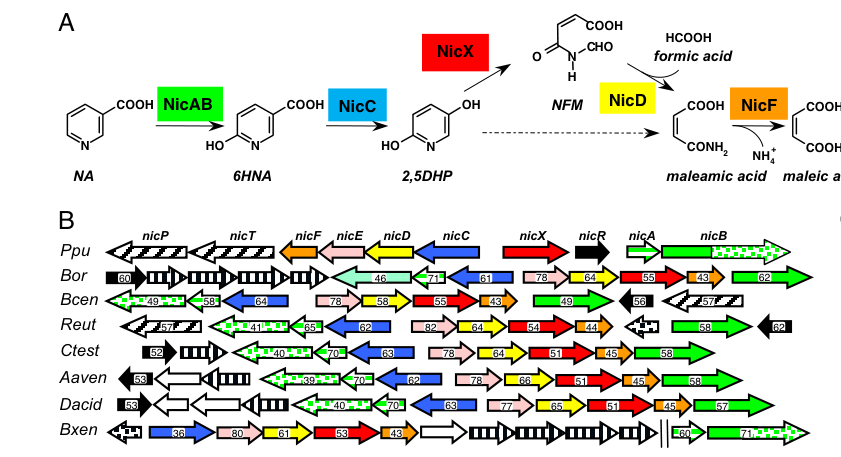

## Question

# Gene Research for Functional Annotation

## ⚠️ CRITICAL: Gene/Protein Identification Context

**BEFORE YOU BEGIN RESEARCH:** You MUST verify you are researching the CORRECT gene/protein. Gene symbols can be ambiguous, especially for less well-characterized genes from non-model organisms.

### Target Gene/Protein Identity (from UniProt):
- **UniProt Accession:** Q88FX8
- **Protein Description:** RecName: Full=Nicotinate dehydrogenase subunit B; EC=1.17.2.1; AltName: Full=Nicotinate degradation protein B; AltName: Full=Nicotinate dehydrogenase large subunit;
- **Gene Information:** Name=nicB; Synonyms=ndhL; OrderedLocusNames=PP_3948;
- **Organism (full):** Pseudomonas putida (strain ATCC 47054 / DSM 6125 / CFBP 8728 / NCIMB 11950 / KT2440).
- **Protein Family:** Not specified in UniProt
- **Key Domains:** Ald_Oxase/Xan_DH_a/b. (IPR000674); Ald_Oxase/Xan_DH_a/b_sf. (IPR036856); AldOxase/xan_DH_MoCoBD1. (IPR008274); AldOxase/xan_DH_MoCoBD2. (IPR046867); AldOxase/xan_DH_Mopterin-bd_sf. (IPR037165)

### MANDATORY VERIFICATION STEPS:

1. **Check if the gene symbol "nicB" matches the protein description above**
2. **Verify the organism is correct:** Pseudomonas putida (strain ATCC 47054 / DSM 6125 / CFBP 8728 / NCIMB 11950 / KT2440).
3. **Check if protein family/domains align with what you find in literature**
4. **If you find literature for a DIFFERENT gene with the same or similar symbol, STOP**

### If Gene Symbol is Ambiguous or You Cannot Find Relevant Literature:

**DO NOT PROCEED WITH RESEARCH ON A DIFFERENT GENE.** Instead:
- State clearly: "The gene symbol 'nicB' is ambiguous or literature is limited for this specific protein"
- Explain what you found (e.g., "Found extensive literature on a different gene with the same symbol in a different organism")
- Describe the protein based ONLY on the UniProt information provided above
- Suggest that the protein function can be inferred from domain/family information

### Research Target:

Please provide a comprehensive research report on the gene **nicB** (gene ID: nicB, UniProt: Q88FX8) in PSEPK.

The research report should be a detailed narrative explaining the function, biological processes, and localization of the gene product. Citations should be given for all claims.

You should prioritize authoritative reviews and primary scientific literature when conducting research. You can supplement
this with annotations you find in gene/protein databases, but these can be outdated or inaccurate.

We are specifically interested in the primary function of the gene - for enzymes, what reaction is catalyzed, and what is the substrate specificity? For transporters, what is the substrate? For structural proteins or adapters, what is the broader structural role? For signaling molecules, what is the role in the pathway.

We are interested in where in or outside the cell the gene product carries out its function.

We are also interested in the signaling or biochemical pathways in which the gene functions. We are less interested in broad pleiotropic effects, except where these elucidate the precise role.

Include evidence where possible. We are interested in both experimental evidence as well as inference from structure, evolution, or bioinformatic analysis. Precise studies should be prioritized over high-throughput, where available.

## Output

Question: You are an expert researcher providing comprehensive, well-cited information.

Provide detailed information focusing on:
1. Key concepts and definitions with current understanding
2. Recent developments and latest research (prioritize 2023-2024 sources)
3. Current applications and real-world implementations
4. Expert opinions and analysis from authoritative sources
5. Relevant statistics and data from recent studies

Format as a comprehensive research report with proper citations. Include URLs and publication dates where available.
Always prioritize recent, authoritative sources and provide specific citations for all major claims.

# Gene Research for Functional Annotation

## ⚠️ CRITICAL: Gene/Protein Identification Context

**BEFORE YOU BEGIN RESEARCH:** You MUST verify you are researching the CORRECT gene/protein. Gene symbols can be ambiguous, especially for less well-characterized genes from non-model organisms.

### Target Gene/Protein Identity (from UniProt):
- **UniProt Accession:** Q88FX8
- **Protein Description:** RecName: Full=Nicotinate dehydrogenase subunit B; EC=1.17.2.1; AltName: Full=Nicotinate degradation protein B; AltName: Full=Nicotinate dehydrogenase large subunit;
- **Gene Information:** Name=nicB; Synonyms=ndhL; OrderedLocusNames=PP_3948;
- **Organism (full):** Pseudomonas putida (strain ATCC 47054 / DSM 6125 / CFBP 8728 / NCIMB 11950 / KT2440).
- **Protein Family:** Not specified in UniProt
- **Key Domains:** Ald_Oxase/Xan_DH_a/b. (IPR000674); Ald_Oxase/Xan_DH_a/b_sf. (IPR036856); AldOxase/xan_DH_MoCoBD1. (IPR008274); AldOxase/xan_DH_MoCoBD2. (IPR046867); AldOxase/xan_DH_Mopterin-bd_sf. (IPR037165)

### MANDATORY VERIFICATION STEPS:

1. **Check if the gene symbol "nicB" matches the protein description above**
2. **Verify the organism is correct:** Pseudomonas putida (strain ATCC 47054 / DSM 6125 / CFBP 8728 / NCIMB 11950 / KT2440).
3. **Check if protein family/domains align with what you find in literature**
4. **If you find literature for a DIFFERENT gene with the same or similar symbol, STOP**

### If Gene Symbol is Ambiguous or You Cannot Find Relevant Literature:

**DO NOT PROCEED WITH RESEARCH ON A DIFFERENT GENE.** Instead:
- State clearly: "The gene symbol 'nicB' is ambiguous or literature is limited for this specific protein"
- Explain what you found (e.g., "Found extensive literature on a different gene with the same symbol in a different organism")
- Describe the protein based ONLY on the UniProt information provided above
- Suggest that the protein function can be inferred from domain/family information

### Research Target:

Please provide a comprehensive research report on the gene **nicB** (gene ID: nicB, UniProt: Q88FX8) in PSEPK.

The research report should be a detailed narrative explaining the function, biological processes, and localization of the gene product. Citations should be given for all claims.

You should prioritize authoritative reviews and primary scientific literature when conducting research. You can supplement
this with annotations you find in gene/protein databases, but these can be outdated or inaccurate.

We are specifically interested in the primary function of the gene - for enzymes, what reaction is catalyzed, and what is the substrate specificity? For transporters, what is the substrate? For structural proteins or adapters, what is the broader structural role? For signaling molecules, what is the role in the pathway.

We are interested in where in or outside the cell the gene product carries out its function.

We are also interested in the signaling or biochemical pathways in which the gene functions. We are less interested in broad pleiotropic effects, except where these elucidate the precise role.

Include evidence where possible. We are interested in both experimental evidence as well as inference from structure, evolution, or bioinformatic analysis. Precise studies should be prioritized over high-throughput, where available.

## Research report: functional annotation of **nicB** (UniProt **Q88FX8**; gene **nicB**; synonyms **ndhL**; ordered locus **PP_3948**) in *Pseudomonas putida* KT2440

### 1) Target verification (gene/protein identity)
The *P. putida* KT2440 **nicB** gene is experimentally linked to aerobic nicotinic acid (NA; nicotinate) catabolism as the **large subunit** of a **two-component nicotinic acid hydroxylase** complex **NicAB**, which catalyzes the first committed step **NA → 6-hydroxynicotinic acid (6HNA)**. This matches the UniProt identity given for Q88FX8 (“nicotinate dehydrogenase subunit B / large subunit”) and the expected xanthine dehydrogenase-family molybdenum hydroxylase modular architecture (jimenez2008decipheringthegenetic pages 2-3).

### 2) Key concepts and definitions (current understanding)

#### Nicotinate dehydrogenase / nicotinic acid hydroxylase (NicAB)
In *P. putida* KT2440, **NicAB** is a **heterodimeric, two-component hydroxylase** encoded by **nicA** and **nicB**. It initiates the “maleamate pathway” of aerobic NA degradation by converting **nicotinic acid (NA)** to **6-hydroxynicotinic acid (6HNA)** (jimenez2008decipheringthegenetic pages 2-3, jimenez2008decipheringthegenetic pages 1-2).

A key mechanistic concept is that hydroxylation of N-heteroaromatic compounds in this enzyme class typically involves a **molybdenum center** coordinated by a **pterin-based cofactor** (here specified as **molybdopterin cytosine dinucleotide, MCD**) plus additional redox cofactors that support intramolecular electron transfer (jimenez2008decipheringthegenetic pages 2-3, mendel2024thefinalstep pages 2-4).

#### NicB modular architecture and cofactors/domains
Jiménez et al. (2008; PNAS; published Aug 2008; URL https://doi.org/10.1073/pnas.0802273105) describe **NicB (128 kDa)** as a “large subunit” with:
- An **N-terminal molybdenum-cofactor binding/catalytic region** consistent with an **MCD-binding molybdopterin architecture** (MPT2–MPT1–MPT3 arrangement) (jimenez2008decipheringthegenetic pages 2-3).
- A **C-terminal cytochrome c (CytC) domain** containing **three heme-binding motifs** (Cys–X2–Cys–His-like CytC motifs), which is unusual among xanthine dehydrogenase family members and is proposed to participate in electron transfer to the terminal acceptor (jimenez2008decipheringthegenetic pages 2-3, jimenez2008decipheringthegenetic pages 3-4).

NicA (23.8 kDa) is described as the “small subunit” harboring conserved motifs consistent with binding **two [2Fe–2S] clusters** (jimenez2008decipheringthegenetic pages 2-3).

#### Broader enzyme-family context (molybdenum hydroxylase / xanthine oxidoreductase family)
Recent reviews (2023–2024) summarize that prototypical xanthine oxidoreductase family enzymes are **molybdoflavin enzymes** combining a **Mo–pterin cofactor** with additional redox cofactors including **FAD** and **two [2Fe–2S] clusters**, arranged to support directed electron flow during catalysis (seychell2024thegoodand pages 1-4). Separately, recent historical/chemical syntheses of the molybdenum cofactor emphasize that **Moco is built on molybdopterin (MPT)** and that **bacteria can carry nucleotide-modified forms (dinucleotide derivatives)**—consistent with the MCD noted for NicB (mendel2024thefinalstep pages 2-4).

### 3) Pathway role and biological process (aerobic nicotinic acid degradation)

#### Pathway overview
The KT2440 **nic** gene cluster supports the aerobic conversion of NA through the maleamate pathway. In the pathway outline provided in Jiménez et al. (2008), the roles are:
- **NicAB**: NA → 6HNA (initial hydroxylation) (jimenez2008decipheringthegenetic pages 2-3).
- **NicC**: 6HNA → 2,5-dihydroxypyridine (2,5DHP) (xiao2018finrregulatesexpression pages 3-4).
- **NicX**: 2,5DHP → N-formylmaleamic acid (ring cleavage) (xiao2018finrregulatesexpression pages 3-4, jimenez2008decipheringthegenetic pages 4-5).
Downstream steps (e.g., NicD, NicF, NicE) funnel carbon to central metabolism (maleate/fumarate), as depicted in the pathway schematic (jimenez2008decipheringthegenetic pages 2-3).

#### Genetic evidence linking nicB to NA utilization
- Disruption of **nicA** or **nicB** abolished growth on NA but did not prevent growth on 6HNA (indicating NicAB is needed for the NA→6HNA step specifically) (jimenez2008decipheringthegenetic pages 2-3).
- A broad-host-range plasmid containing the **complete nic cluster** restored NA growth in knockout mutants and conferred NA utilization capacity to a nondegrading *Pseudomonas* strain (jimenez2008decipheringthegenetic pages 2-3).

These results anchor **nicB** as essential for NA catabolism specifically at the first hydroxylation step.

### 4) Enzymatic function: reaction, substrate specificity, and electron acceptors

#### Catalyzed reaction and substrate specificity
NicAB catalyzes conversion of **nicotinic acid (NA)** to **6-hydroxynicotinic acid (6HNA)**, and the hydroxylase activity was reported as **highly specific for NA** (jimenez2008decipheringthegenetic pages 2-3).

#### Electron acceptors and electron-transfer architecture
Biochemical assays in crude extracts show NicAB hydroxylase activity is:
- **Oxygen-dependent** (undetectable anaerobically) (jimenez2008decipheringthegenetic pages 2-3).
- Strongly stimulated by adding **phenazine methosulfate (PMS)**, an artificial electron acceptor (jimenez2008decipheringthegenetic pages 2-3).

Functional experiments support a model in which the **C-terminal CytC domain of NicB** mediates electron transfer from the internal redox centers to the terminal oxidant:
- A **truncated NicAB** lacking the NicB CytC domain lost activity; activity could be restored by supplying the CytC domain **in trans** or by using **PMS** (jimenez2008decipheringthegenetic pages 3-4).
- **KCN** inhibited activity under physiological conditions, consistent with involvement of a **cytochrome c oxidase** as the terminal oxidase, whereas PMS could bypass this inhibition (jimenez2008decipheringthegenetic pages 3-4).

Quantitative activity values reported for crude extract assays (units as reported: mol·min⁻¹·mg⁻¹) include:
- With **O2**: **1.48**
- With **PMS**: **5.98**
- With added **CytC domain**: **2.14**
- Under **anaerobic (-O2)** conditions: not detected
(jimenez2008decipheringthegenetic pages 2-3, jimenez2008decipheringthegenetic media 49857ed9).

These results imply that, physiologically, NicAB likely couples substrate oxidation to oxygen reduction through a **cytochrome c-linked electron transfer chain**, rather than using soluble NAD(P)+ directly (jimenez2008decipheringthegenetic pages 3-4, jimenez2008decipheringthegenetic pages 2-3).

### 5) Gene cluster context, regulation, and expression (KT2440)

#### Cluster and operon organization
The nicotinic-acid degradation genes in KT2440 are organized as a **nicTPFEDCXRAB** cluster (Jiménez et al., 2008; URL https://doi.org/10.1073/pnas.0802273105) (jimenez2008decipheringthegenetic pages 1-2, jimenez2008decipheringthegenetic pages 2-3). Xiao et al. (2018; Applied and Environmental Microbiology; published Oct 2018; URL https://doi.org/10.1128/AEM.01210-18) further describe three **NA-inducible operons**:
- **nicAB** (promoter **Pa**, upstream of nicA)
- **nicXR** (promoter **Px**)
- **nicCDEFTP** (promoter **Pc**, upstream of nicC)
with additional **NA-independent** promoters upstream of some genes (e.g., nicS, nicT, nicR) (xiao2018finrregulatesexpression pages 3-4).

#### Regulatory inputs: FinR and NicR
Xiao et al. report that the LysR-type regulator **FinR** positively regulates the **nicC** and **nicX** operons and cooperates with the NicR repressor system; critically, **nicA and nicB transcript levels were reported as not differing** between wild type and a finR deletion mutant under the tested conditions, consistent with FinR acting mainly on downstream steps (xiao2018finrregulatesexpression pages 2-3, xiao2018finrregulatesexpression pages 3-4).

Quantitative transcriptomics (RNA-seq) reported log2 fold changes (finR mutant vs wild type) for nic genes including:
- **nicC**: **3.601**
- **nicX**: **2.474**
and additional changes for other nic-pathway genes (e.g., nicT, nicF, nicE, nicD) (xiao2018finrregulatesexpression pages 3-4).

#### Growth/phenotype evidence from regulation studies
FinR deletion caused **impaired NA/6HNA utilization**, described as a **noticeably longer growth delay** in minimal media with NA or 6HNA as sole carbon source (with controls to mitigate confounding growth effects from altered fpr-1) (xiao2018finrregulatesexpression pages 3-4).

### 6) Subcellular localization (what is known vs unknown)
Direct experimental localization (e.g., cytosolic vs periplasmic vs membrane-associated) for NicB/NicAB was **not provided** in the retrieved KT2440-focused excerpts. However, the requirement for a **cytochrome c domain** in NicB and the sensitivity to **KCN** are consistent with coupling to a respiratory electron transfer component (a cytochrome c oxidase) under aerobic conditions (jimenez2008decipheringthegenetic pages 3-4, jimenez2008decipheringthegenetic pages 2-3). This supports a model where NicAB function is integrated with cellular electron transfer, though the precise cellular compartment for catalysis remains to be confirmed experimentally from the available text (jimenez2008decipheringthegenetic pages 3-4, jimenez2008decipheringthegenetic pages 2-3).

### 7) Recent developments (2023–2024) relevant to NicB/NicAB functional annotation
No KT2440 NicB/NicAB-specific primary studies from 2023–2024 were retrieved in the current searches; nonetheless, multiple authoritative 2023–2024 sources refine mechanistic context for interpreting NicB’s domain/cofactor architecture:

1. **Cofactor set and electron relay logic**: A 2024 review on xanthine oxidoreductase emphasizes that the canonical family uses a **Mo–pterin cofactor + FAD + two [2Fe–2S] clusters**, and that these cofactors are structurally arranged to support directional electron flow during catalysis (Seychell et al., Feb 2024; URL https://doi.org/10.5772/intechopen.112498) (seychell2024thegoodand pages 1-4). This is consistent with NicA bearing Fe–S motifs and NicB providing the Mo–pterin catalytic site, while NicB’s unique CytC domain supplies an additional ET module (jimenez2008decipheringthegenetic pages 2-3).

2. **Molybdenum cofactor chemistry and bacterial dinucleotide derivatives**: Mendel & Oliphant’s 2024 review of Moco biosynthesis summarizes that Moco is based on **molybdopterin (MPT)** and that in **bacteria** the cofactor can occur as a **dinucleotide derivative**, aligning with the MCD assignment for NicB (Mendel & Oliphant, Sep 2024; URL https://doi.org/10.3390/molecules29184458) (mendel2024thefinalstep pages 2-4).

3. **Redox cycling and hydroxylation mechanism**: A 2024 review emphasizes the Mo center’s role in hydroxylation and Mo(IV/VI) cycling in molybdenum enzymes, reinforcing why Moco/MCD availability is decisive for NicB activity (Adamus et al., Jul 2024; URL https://doi.org/10.3390/biom14070869) (adamus2024molybdenum’sroleas pages 1-2).

4. **Systems-level view of cofactor maturation**: A 2023 review on molybdate/Moco handling highlights the existence of distinct Mo-enzyme families and outlines cofactor maturation logic (e.g., sulfurated mono-oxo forms in XO-family enzymes), which is relevant background when interpreting why heterologous hosts lacking proper cofactor maturation can fail to express activity (Weber et al., Dec 2023; URL https://doi.org/10.3390/molecules29010040) (weber2023themechanismsof pages 3-5). In the KT2440 NicAB case, Jiménez et al. explicitly attribute lack of activity in *E. coli* to inability to synthesize the relevant cofactor (MCD) (jimenez2008decipheringthegenetic pages 2-3).

### 8) Current applications and real-world implementations

#### Biodegradation/biotransformation capability transfer
A practical implementation arising directly from the KT2440 work is that a plasmid carrying the **nic cluster** (14 kb) can confer **growth on NA** to other bacteria, and a plasmid carrying **nicAB** can confer efficient **NA → 6HNA** conversion to *Pseudomonas* hosts that cannot otherwise oxidize NA (jimenez2008decipheringthegenetic pages 2-3). This provides a concrete route to engineer **nicotinate bioconversion** capabilities (e.g., producing 6HNA or enabling NA utilization) in heterologous *Pseudomonas* strains (jimenez2008decipheringthegenetic pages 2-3).

#### Environmental and metabolic engineering relevance
Because *P. putida* is a widely used chassis organism for bioremediation and metabolic engineering, experimentally defined catabolic modules like the **nic** cluster provide well-bounded genetic parts (operons/transporters/enzymes) for expanding substrate range to N-heteroaromatics. The KT2440 studies provide essential enabling information: the minimal initiating enzyme module (**nicAB**) and the necessity of correct Mo–pterin cofactor availability (jimenez2008decipheringthegenetic pages 2-3).

### 9) Visual evidence (figures/tables)
Key figures supporting pathway context and enzyme architecture/activity were retrieved from Jiménez et al. (2008):
- Nic cluster organization and NA degradation pathway schematic (jimenez2008decipheringthegenetic media 464cd9e8).
- NicAB activity table and domain architecture schematic (jimenez2008decipheringthegenetic media 49857ed9).

### 10) Evidence-backed functional summary for annotation
- **Molecular function (primary)**: NicB is the **molybdopterin (MCD)-binding large subunit** of **NicAB nicotinic acid hydroxylase**, catalyzing the first step in aerobic nicotinate degradation: **nicotinic acid → 6-hydroxynicotinic acid** (jimenez2008decipheringthegenetic pages 2-3).
- **Cofactors/domains**: NicB carries the **Mo–pterin catalytic region** and a **C-terminal multi-heme cytochrome c domain**; NicA carries conserved motifs for **two [2Fe–2S] clusters** (jimenez2008decipheringthegenetic pages 2-3).
- **Electron acceptor physiology**: Activity is **O2-dependent** and coupled via the CytC domain to a KCN-sensitive terminal oxidase; **PMS** can serve as an artificial electron acceptor in vitro (jimenez2008decipheringthegenetic pages 3-4, jimenez2008decipheringthegenetic pages 2-3).
- **Biological process**: Required for growth on NA as a sole carbon source; nicB knockout eliminates NA utilization while leaving growth on the downstream intermediate 6HNA intact (jimenez2008decipheringthegenetic pages 2-3).
- **Genetic context/regulation**: nicB is part of the **nic** catabolic cluster; nicAB is one of three NA-inducible operons; downstream steps are activated by FinR/NicR regulatory logic while nicA/nicB expression shows less FinR dependence in the cited work (xiao2018finrregulatesexpression pages 2-3, xiao2018finrregulatesexpression pages 3-4).

### Artifact: concise functional summary table
| Component | Size | Key cofactors/domains/motifs | Role in reaction | Electron acceptor / ET chain | Key experimental evidence |
|---|---:|---|---|---|---|
| NicA | 23.8 kDa | Small subunit with two conserved [2Fe-2S]-binding motif regions: `41-C-X4-C-G-X-C-Xn-C-59` and `100-C-G-X-C-X31-C-X-C-137` (jimenez2008decipheringthegenetic pages 2-3) | Part of the two-component nicotinate hydroxylase NicAB that catalyzes the first step of aerobic nicotinic acid (NA) degradation: NA → 6-hydroxynicotinic acid (6HNA) (jimenez2008decipheringthegenetic pages 2-3, jimenez2008decipheringthegenetic pages 1-2, xiao2018finrregulatesexpression pages 3-4) | Electrons are transferred through the NicAB redox chain to a terminal acceptor; physiological transfer is proposed to proceed to O2 via the NicB cytochrome c region / cytochrome c oxidase, while PMS can substitute in vitro (jimenez2008decipheringthegenetic pages 3-4, jimenez2008decipheringthegenetic pages 2-3) | Disruption of nicA abolishes growth on NA but not on 6HNA; nicAB expression in non-NA-oxidizing Pseudomonas strains confers stoichiometric NA → 6HNA conversion; nicAB belongs to the NA-inducible nicAB operon under promoter Pa (jimenez2008decipheringthegenetic pages 2-3, jimenez2008decipheringthegenetic pages 1-2, xiao2018finrregulatesexpression pages 3-4) |
| NicB (UniProt Q88FX8; nicB/ndhL; PP_3948) | 128 kDa | Large subunit; N-terminal molybdopterin cytosine dinucleotide (MCD)-binding catalytic architecture with MPT2-MPT1-MPT3 arrangement; C-terminal cytochrome c domain with three heme-binding motifs `817-CAVCH-823`, `963-CTACH-969`, `1087-CLGCH-1093` (jimenez2008decipheringthegenetic pages 2-3, jimenez2008decipheringthegenetic pages 5-6) | Catalytic large subunit of NicAB; houses the molybdenum/MCD-dependent hydroxylation machinery for NA → 6HNA and a fused electron-transfer cytochrome c region (jimenez2008decipheringthegenetic pages 2-3, jimenez2008decipheringthegenetic pages 5-6) | Proposed intramolecular transfer from the NicAB redox center through the NicB cytochrome c domain to a cytochrome c oxidase using molecular oxygen as terminal acceptor; KCN inhibits activity, antimycin A has little effect with O2, and PMS bypasses physiological ET; a truncated NicB lacking the CytC region loses activity, restored partly by added CytC domain in trans (jimenez2008decipheringthegenetic pages 3-4, jimenez2008decipheringthegenetic pages 2-3) | nicB disruption abolishes growth on NA but not on 6HNA; complementation with the full nic cluster restores growth; pNicAB transfers NA-hydroxylating capacity to other Pseudomonas strains; crude-extract NicAB activity: +O2 = 1.48, +PMS = 5.98, +CytCdomain = 2.14 mol·min⁻¹·mg⁻¹; no detectable activity anaerobically; activity maximal at 30°C and pH 7.5; highly specific for NA; in 2018 RT-qPCR/promoter assays, nicB itself showed no significant FinR dependence while downstream nicC/nicX operons were FinR-activated (jimenez2008decipheringthegenetic pages 2-3, jimenez2008decipheringthegenetic pages 3-4, jimenez2008decipheringthegenetic pages 1-2, xiao2018finrregulatesexpression pages 2-3, xiao2018finrregulatesexpression pages 3-4) |
| NicAB complex | Heterodimeric 2-component enzyme (NicA + NicB) | Xanthine dehydrogenase-family/molybdohydroxylase-like system combining [2Fe-2S] centers (NicA), MCD-dependent catalytic region (NicB), and fused cytochrome c electron-transfer domain (NicB) (jimenez2008decipheringthegenetic pages 2-3, jimenez2008decipheringthegenetic pages 3-4, jimenez2008decipheringthegenetic media 464cd9e8) | Initiates the maleamate pathway of aerobic NA catabolism in P. putida KT2440 by hydroxylating nicotinic acid to 6HNA (jimenez2008decipheringthegenetic pages 1-2, jimenez2008decipheringthegenetic pages 2-3, xiao2018finrregulatesexpression pages 3-4) | Oxygen-dependent under physiological conditions; authors propose NicAB is the first xanthine dehydrogenase-family enzyme whose ET chain to molecular oxygen includes a cytochrome c domain; PMS acts as an artificial acceptor in vitro (jimenez2008decipheringthegenetic pages 3-4, jimenez2008decipheringthegenetic pages 1-2, jimenez2008decipheringthegenetic pages 2-3) | NA-grown cells depend on nicAB for growth on NA; growth restored by complementation with pNIC; pNicAB is sufficient for NA → 6HNA conversion in heterologous Pseudomonas hosts; activity abolished in NicABtr and rescued partially by CytC domain in trans or PMS; nicAB is one of three NA-inducible operons in the nic cluster (nicAB, nicXR, nicCDEFTP) (jimenez2008decipheringthegenetic pages 2-3, jimenez2008decipheringthegenetic pages 3-4, xiao2018finrregulatesexpression pages 3-4, jimenez2008decipheringthegenetic pages 1-2) |

*Table: This table summarizes the experimentally supported functional annotation of NicB and the NicAB nicotinate hydroxylase in Pseudomonas putida KT2440. It highlights subunit architecture, cofactors, reaction role, electron transfer features, and the strongest genetic and biochemical evidence from the cited studies.*

### Limitations of this evidence set
- The retrieved KT2440-focused texts did **not** explicitly state the mapping **PP_3948 = nicB**; this locus assignment is therefore taken from the user-provided UniProt context rather than independently verified in the excerpts (xiao2018finrregulatesexpression pages 3-4).
- No 2023–2024 primary studies specifically re-characterizing *P. putida* KT2440 NicB/NicAB were retrieved; recent sources used here provide **updated mechanistic context** for molybdoenzymes rather than new NicB-specific experiments (seychell2024thegoodand pages 1-4, mendel2024thefinalstep pages 2-4, adamus2024molybdenum’sroleas pages 1-2).

References

1. (jimenez2008decipheringthegenetic pages 2-3): José I. Jiménez, Ángeles Canales, Jesús Jiménez-Barbero, Krzysztof Ginalski, Leszek Rychlewski, José L. García, and Eduardo Díaz. Deciphering the genetic determinants for aerobic nicotinic acid degradation: the nic cluster from pseudomonas putida kt2440. Proceedings of the National Academy of Sciences, 105:11329-11334, Aug 2008. URL: https://doi.org/10.1073/pnas.0802273105, doi:10.1073/pnas.0802273105. This article has 173 citations and is from a highest quality peer-reviewed journal.

2. (jimenez2008decipheringthegenetic pages 1-2): José I. Jiménez, Ángeles Canales, Jesús Jiménez-Barbero, Krzysztof Ginalski, Leszek Rychlewski, José L. García, and Eduardo Díaz. Deciphering the genetic determinants for aerobic nicotinic acid degradation: the nic cluster from pseudomonas putida kt2440. Proceedings of the National Academy of Sciences, 105:11329-11334, Aug 2008. URL: https://doi.org/10.1073/pnas.0802273105, doi:10.1073/pnas.0802273105. This article has 173 citations and is from a highest quality peer-reviewed journal.

3. (mendel2024thefinalstep pages 2-4): Ralf R. Mendel and Kevin D. Oliphant. The final step in molybdenum cofactor biosynthesis—a historical view. Molecules, 29:4458, Sep 2024. URL: https://doi.org/10.3390/molecules29184458, doi:10.3390/molecules29184458. This article has 8 citations.

4. (jimenez2008decipheringthegenetic pages 3-4): José I. Jiménez, Ángeles Canales, Jesús Jiménez-Barbero, Krzysztof Ginalski, Leszek Rychlewski, José L. García, and Eduardo Díaz. Deciphering the genetic determinants for aerobic nicotinic acid degradation: the nic cluster from pseudomonas putida kt2440. Proceedings of the National Academy of Sciences, 105:11329-11334, Aug 2008. URL: https://doi.org/10.1073/pnas.0802273105, doi:10.1073/pnas.0802273105. This article has 173 citations and is from a highest quality peer-reviewed journal.

5. (seychell2024thegoodand pages 1-4): Brandon Charles Seychell, Marita Vella, Gary James Hunter, and Thérèse Hunter. The good and the bad: the bifunctional enzyme xanthine oxidoreductase in the production of reactive oxygen species. Biochemistry, Feb 2024. URL: https://doi.org/10.5772/intechopen.112498, doi:10.5772/intechopen.112498. This article has 5 citations and is from a peer-reviewed journal.

6. (xiao2018finrregulatesexpression pages 3-4): Yujie Xiao, Wenjing Zhu, Huizhong Liu, Hailing Nie, Wenli Chen, and Qiaoyun Huang. Finr regulates expression of <i>nicc</i> and <i>nicx</i> operons, involved in nicotinic acid degradation in pseudomonas putida kt2440. Applied and Environmental Microbiology, Oct 2018. URL: https://doi.org/10.1128/aem.01210-18, doi:10.1128/aem.01210-18. This article has 10 citations and is from a peer-reviewed journal.

7. (jimenez2008decipheringthegenetic pages 4-5): José I. Jiménez, Ángeles Canales, Jesús Jiménez-Barbero, Krzysztof Ginalski, Leszek Rychlewski, José L. García, and Eduardo Díaz. Deciphering the genetic determinants for aerobic nicotinic acid degradation: the nic cluster from pseudomonas putida kt2440. Proceedings of the National Academy of Sciences, 105:11329-11334, Aug 2008. URL: https://doi.org/10.1073/pnas.0802273105, doi:10.1073/pnas.0802273105. This article has 173 citations and is from a highest quality peer-reviewed journal.

8. (jimenez2008decipheringthegenetic media 49857ed9): José I. Jiménez, Ángeles Canales, Jesús Jiménez-Barbero, Krzysztof Ginalski, Leszek Rychlewski, José L. García, and Eduardo Díaz. Deciphering the genetic determinants for aerobic nicotinic acid degradation: the nic cluster from pseudomonas putida kt2440. Proceedings of the National Academy of Sciences, 105:11329-11334, Aug 2008. URL: https://doi.org/10.1073/pnas.0802273105, doi:10.1073/pnas.0802273105. This article has 173 citations and is from a highest quality peer-reviewed journal.

9. (xiao2018finrregulatesexpression pages 2-3): Yujie Xiao, Wenjing Zhu, Huizhong Liu, Hailing Nie, Wenli Chen, and Qiaoyun Huang. Finr regulates expression of <i>nicc</i> and <i>nicx</i> operons, involved in nicotinic acid degradation in pseudomonas putida kt2440. Applied and Environmental Microbiology, Oct 2018. URL: https://doi.org/10.1128/aem.01210-18, doi:10.1128/aem.01210-18. This article has 10 citations and is from a peer-reviewed journal.

10. (adamus2024molybdenum’sroleas pages 1-2): Jakub Piotr Adamus, Anna Ruszczyńska, and Aleksandra Wyczałkowska-Tomasik. Molybdenum’s role as an essential element in enzymes catabolizing redox reactions: a review. Biomolecules, 14:869, Jul 2024. URL: https://doi.org/10.3390/biom14070869, doi:10.3390/biom14070869. This article has 56 citations.

11. (weber2023themechanismsof pages 3-5): Jan-Niklas Weber, Rieke Minner-Meinen, and David Kaufholdt. The mechanisms of molybdate distribution and homeostasis with special focus on the model plant arabidopsis thaliana. Molecules, Dec 2023. URL: https://doi.org/10.3390/molecules29010040, doi:10.3390/molecules29010040. This article has 11 citations.

12. (jimenez2008decipheringthegenetic media 464cd9e8): José I. Jiménez, Ángeles Canales, Jesús Jiménez-Barbero, Krzysztof Ginalski, Leszek Rychlewski, José L. García, and Eduardo Díaz. Deciphering the genetic determinants for aerobic nicotinic acid degradation: the nic cluster from pseudomonas putida kt2440. Proceedings of the National Academy of Sciences, 105:11329-11334, Aug 2008. URL: https://doi.org/10.1073/pnas.0802273105, doi:10.1073/pnas.0802273105. This article has 173 citations and is from a highest quality peer-reviewed journal.

13. (jimenez2008decipheringthegenetic pages 5-6): José I. Jiménez, Ángeles Canales, Jesús Jiménez-Barbero, Krzysztof Ginalski, Leszek Rychlewski, José L. García, and Eduardo Díaz. Deciphering the genetic determinants for aerobic nicotinic acid degradation: the nic cluster from pseudomonas putida kt2440. Proceedings of the National Academy of Sciences, 105:11329-11334, Aug 2008. URL: https://doi.org/10.1073/pnas.0802273105, doi:10.1073/pnas.0802273105. This article has 173 citations and is from a highest quality peer-reviewed journal.

## Artifacts

- [Edison artifact artifact-00](nicB-deep-research-falcon_artifacts/artifact-00.md)

## Citations

1. jimenez2008decipheringthegenetic pages 2-3
2. seychell2024thegoodand pages 1-4
3. mendel2024thefinalstep pages 2-4
4. xiao2018finrregulatesexpression pages 3-4
5. jimenez2008decipheringthegenetic pages 3-4
6. weber2023themechanismsof pages 3-5
7. jimenez2008decipheringthegenetic pages 1-2
8. jimenez2008decipheringthegenetic pages 4-5
9. xiao2018finrregulatesexpression pages 2-3
10. jimenez2008decipheringthegenetic pages 5-6
11. 2Fe–2S
12. 2Fe-2S
13. https://doi.org/10.1073/pnas.0802273105
14. https://doi.org/10.1128/AEM.01210-18
15. https://doi.org/10.5772/intechopen.112498
16. https://doi.org/10.3390/molecules29184458
17. https://doi.org/10.3390/biom14070869
18. https://doi.org/10.3390/molecules29010040
19. https://doi.org/10.1073/pnas.0802273105,
20. https://doi.org/10.3390/molecules29184458,
21. https://doi.org/10.5772/intechopen.112498,
22. https://doi.org/10.1128/aem.01210-18,
23. https://doi.org/10.3390/biom14070869,
24. https://doi.org/10.3390/molecules29010040,