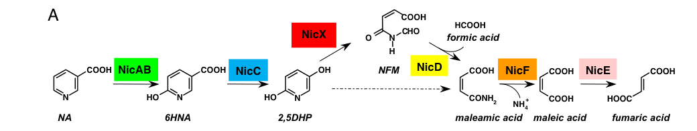
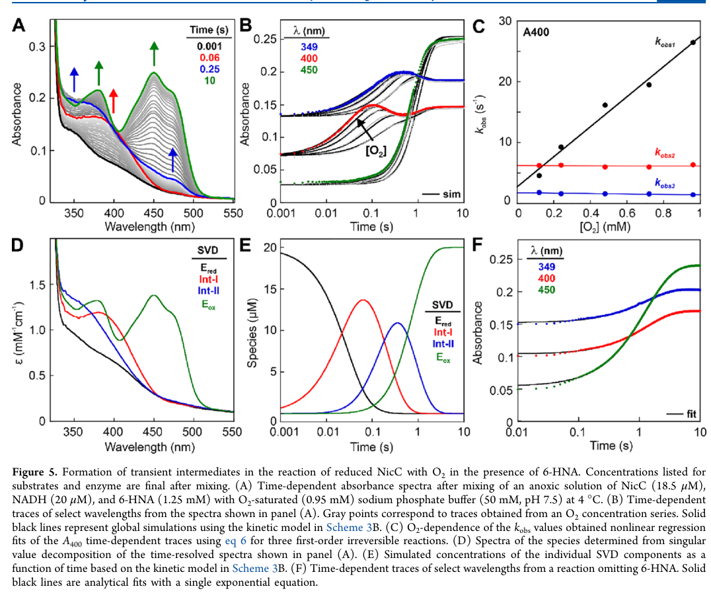

## Question

# Gene Research for Functional Annotation

## ⚠️ CRITICAL: Gene/Protein Identification Context

**BEFORE YOU BEGIN RESEARCH:** You MUST verify you are researching the CORRECT gene/protein. Gene symbols can be ambiguous, especially for less well-characterized genes from non-model organisms.

### Target Gene/Protein Identity (from UniProt):
- **UniProt Accession:** Q88FY2
- **Protein Description:** RecName: Full=6-hydroxynicotinate 3-monooxygenase {ECO:0000303|PubMed:27218267}; Short=6-HNA monooxygenase {ECO:0000303|PubMed:27218267}; EC=1.14.13.114 {ECO:0000269|PubMed:18678916, ECO:0000269|PubMed:27218267}; AltName: Full=Nicotinate degradation protein C; Flags: Precursor;
- **Gene Information:** Name=nicC {ECO:0000303|PubMed:27218267}; OrderedLocusNames=PP_3944;
- **Organism (full):** Pseudomonas putida (strain ATCC 47054 / DSM 6125 / CFBP 8728 / NCIMB 11950 / KT2440).
- **Protein Family:** Belongs to the 6-hydroxynicotinate 3-monooxygenase family.
- **Key Domains:** FAD-bd. (IPR002938); FAD-dep_Monooxygenase_BioMet. (IPR050493); FAD/NAD-bd_sf. (IPR036188); FAD_binding_3 (PF01494)

### MANDATORY VERIFICATION STEPS:

1. **Check if the gene symbol "nicC" matches the protein description above**
2. **Verify the organism is correct:** Pseudomonas putida (strain ATCC 47054 / DSM 6125 / CFBP 8728 / NCIMB 11950 / KT2440).
3. **Check if protein family/domains align with what you find in literature**
4. **If you find literature for a DIFFERENT gene with the same or similar symbol, STOP**

### If Gene Symbol is Ambiguous or You Cannot Find Relevant Literature:

**DO NOT PROCEED WITH RESEARCH ON A DIFFERENT GENE.** Instead:
- State clearly: "The gene symbol 'nicC' is ambiguous or literature is limited for this specific protein"
- Explain what you found (e.g., "Found extensive literature on a different gene with the same symbol in a different organism")
- Describe the protein based ONLY on the UniProt information provided above
- Suggest that the protein function can be inferred from domain/family information

### Research Target:

Please provide a comprehensive research report on the gene **nicC** (gene ID: nicC, UniProt: Q88FY2) in PSEPK.

The research report should be a detailed narrative explaining the function, biological processes, and localization of the gene product. Citations should be given for all claims.

You should prioritize authoritative reviews and primary scientific literature when conducting research. You can supplement
this with annotations you find in gene/protein databases, but these can be outdated or inaccurate.

We are specifically interested in the primary function of the gene - for enzymes, what reaction is catalyzed, and what is the substrate specificity? For transporters, what is the substrate? For structural proteins or adapters, what is the broader structural role? For signaling molecules, what is the role in the pathway.

We are interested in where in or outside the cell the gene product carries out its function.

We are also interested in the signaling or biochemical pathways in which the gene functions. We are less interested in broad pleiotropic effects, except where these elucidate the precise role.

Include evidence where possible. We are interested in both experimental evidence as well as inference from structure, evolution, or bioinformatic analysis. Precise studies should be prioritized over high-throughput, where available.

## Output

Question: You are an expert researcher providing comprehensive, well-cited information.

Provide detailed information focusing on:
1. Key concepts and definitions with current understanding
2. Recent developments and latest research (prioritize 2023-2024 sources)
3. Current applications and real-world implementations
4. Expert opinions and analysis from authoritative sources
5. Relevant statistics and data from recent studies

Format as a comprehensive research report with proper citations. Include URLs and publication dates where available.
Always prioritize recent, authoritative sources and provide specific citations for all major claims.

# Gene Research for Functional Annotation

## ⚠️ CRITICAL: Gene/Protein Identification Context

**BEFORE YOU BEGIN RESEARCH:** You MUST verify you are researching the CORRECT gene/protein. Gene symbols can be ambiguous, especially for less well-characterized genes from non-model organisms.

### Target Gene/Protein Identity (from UniProt):
- **UniProt Accession:** Q88FY2
- **Protein Description:** RecName: Full=6-hydroxynicotinate 3-monooxygenase {ECO:0000303|PubMed:27218267}; Short=6-HNA monooxygenase {ECO:0000303|PubMed:27218267}; EC=1.14.13.114 {ECO:0000269|PubMed:18678916, ECO:0000269|PubMed:27218267}; AltName: Full=Nicotinate degradation protein C; Flags: Precursor;
- **Gene Information:** Name=nicC {ECO:0000303|PubMed:27218267}; OrderedLocusNames=PP_3944;
- **Organism (full):** Pseudomonas putida (strain ATCC 47054 / DSM 6125 / CFBP 8728 / NCIMB 11950 / KT2440).
- **Protein Family:** Belongs to the 6-hydroxynicotinate 3-monooxygenase family.
- **Key Domains:** FAD-bd. (IPR002938); FAD-dep_Monooxygenase_BioMet. (IPR050493); FAD/NAD-bd_sf. (IPR036188); FAD_binding_3 (PF01494)

### MANDATORY VERIFICATION STEPS:

1. **Check if the gene symbol "nicC" matches the protein description above**
2. **Verify the organism is correct:** Pseudomonas putida (strain ATCC 47054 / DSM 6125 / CFBP 8728 / NCIMB 11950 / KT2440).
3. **Check if protein family/domains align with what you find in literature**
4. **If you find literature for a DIFFERENT gene with the same or similar symbol, STOP**

### If Gene Symbol is Ambiguous or You Cannot Find Relevant Literature:

**DO NOT PROCEED WITH RESEARCH ON A DIFFERENT GENE.** Instead:
- State clearly: "The gene symbol 'nicC' is ambiguous or literature is limited for this specific protein"
- Explain what you found (e.g., "Found extensive literature on a different gene with the same symbol in a different organism")
- Describe the protein based ONLY on the UniProt information provided above
- Suggest that the protein function can be inferred from domain/family information

### Research Target:

Please provide a comprehensive research report on the gene **nicC** (gene ID: nicC, UniProt: Q88FY2) in PSEPK.

The research report should be a detailed narrative explaining the function, biological processes, and localization of the gene product. Citations should be given for all claims.

You should prioritize authoritative reviews and primary scientific literature when conducting research. You can supplement
this with annotations you find in gene/protein databases, but these can be outdated or inaccurate.

We are specifically interested in the primary function of the gene - for enzymes, what reaction is catalyzed, and what is the substrate specificity? For transporters, what is the substrate? For structural proteins or adapters, what is the broader structural role? For signaling molecules, what is the role in the pathway.

We are interested in where in or outside the cell the gene product carries out its function.

We are also interested in the signaling or biochemical pathways in which the gene functions. We are less interested in broad pleiotropic effects, except where these elucidate the precise role.

Include evidence where possible. We are interested in both experimental evidence as well as inference from structure, evolution, or bioinformatic analysis. Precise studies should be prioritized over high-throughput, where available.

## Research report: *Pseudomonas putida* KT2440 **nicC** (UniProt Q88FY2; PP_3944) — functional annotation of 6-hydroxynicotinate 3-monooxygenase (EC 1.14.13.114)

### 0) Target verification (critical disambiguation)
The UniProt entry Q88FY2 specifies *Pseudomonas putida* KT2440 **nicC** encoding **6-hydroxynicotinate (6-hydroxynicotinic acid; 6-HNA) 3-monooxygenase**, a flavin-dependent monooxygenase in aerobic nicotinic acid (NA) degradation. This identity is directly supported by genetic and biochemical characterization of the **KT2440 nic cluster**, which assigns **nicC** to the enzymatic step converting **6-HNA → 2,5-dihydroxypyridine (2,5-DHP)**; a ΔnicC mutant accumulates 6-HNA and cannot proceed further, while heterologous expression yields an active ~42 kDa enzyme requiring **NADH and FAD** in extracts. (jimenez2008decipheringthegenetic pages 3-4)

### 1) Key concepts and definitions (current understanding)

#### 1.1 NicC enzymatic function and reaction definition
**NicC (6-hydroxynicotinate 3-monooxygenase; EC 1.14.13.114)** is a **single-component class A FAD-dependent monooxygenase** that catalyzes a **decarboxylative hydroxylation** of the pyridine ring of **6-hydroxynicotinic acid (6-HNA)** to form **2,5-dihydroxypyridine (2,5-DHP)**, coupled to oxidation of **NADH → NAD+** and requiring **O2**. (perkins2023mechanismofthe pages 1-2, nakamoto2019mechanismof6hydroxynicotinate pages 1-2)

In *P. putida* KT2440 specifically, NicC is the pathway enzyme responsible for transforming 6-HNA to 2,5-DHP during aerobic NA catabolism. (jimenez2008decipheringthegenetic pages 3-4)

#### 1.2 Pathway context: aerobic nicotinic acid degradation (maleamate route)
In KT2440, NA is degraded aerobically through a gene cluster encoding enzymes that convert NA via **6-HNA** and **2,5-DHP** to ring-cleavage products that are further hydrolyzed/isomerized to **fumarate**, connecting the pathway to central metabolism. The pathway sequence in the canonical KT2440 “nic” cluster is:

NA → 6-HNA → 2,5-DHP → N-formylmaleamate → maleamate → maleate → fumarate. (jimenez2008decipheringthegenetic pages 1-2, jimenez2008decipheringthegenetic media c3646f9b)

NicC catalyzes the **second oxidative step** (6-HNA → 2,5-DHP), upstream of the Fe(II)-dependent dioxygenase NicX that performs ring cleavage of 2,5-DHP. (jimenez2008decipheringthegenetic pages 1-2, jimenez2008decipheringthegenetic media c3646f9b)

#### 1.3 Gene-cluster/operon definitions relevant for annotation
The KT2440 nic locus is frequently described as **nicTPFEDCXRAB** (with additional regulatory/transport features depending on annotation). (jimenez2008decipheringthegenetic pages 1-2)

More detailed transcriptional mapping indicates three NA-inducible operons:
- **nicAB** (nicotinic acid hydroxylase) 
- **nicXR** 
- **nicCDEFTP** (containing **nicC**) 
with additional constitutive promoters upstream of **nicS**, **nicT**, and **nicR**. (xiao2018finrregulatesexpression pages 3-4)

### 2) Molecular function: substrates, cofactors, specificity, and mechanism

#### 2.1 Substrate(s), cosubstrate(s), and cofactor requirements
**Substrate:** 6-hydroxynicotinic acid (6-HNA). (jimenez2008decipheringthegenetic pages 3-4, perkins2023mechanismofthe pages 1-2)

**Electron donor:** NADH is the physiological reductant, oxidized to NAD+. (perkins2023mechanismofthe pages 1-2, jimenez2008decipheringthegenetic pages 3-4)

**Cofactor:** FAD is required (flavin monooxygenase class A). In KT2440-based biochemical assays, NicC activity in extracts required addition of **NADH and FAD**, consistent with a flavoprotein monooxygenase requiring bound flavin and NADH-driven reduction. (jimenez2008decipheringthegenetic pages 3-4)

**Oxidant and oxygen source:** molecular oxygen (O2). Mechanistic work supports formation of flavin–oxygen adduct intermediates typical of class A FMOs. (perkins2023mechanismofthe pages 12-13, perkins2023mechanismofthe pages 2-3)

#### 2.2 Current mechanistic model (2023–updated)
A 2023 transient-state/global kinetic analysis resolves NicC catalysis into three stages—(i) 6-HNA binding, (ii) NADH binding and FAD reduction, and (iii) O2 binding with C4a-adduct formation, substrate hydroxylation, and flavin regeneration—and provides strong evidence for **C4a-hydroperoxy-FAD** and **C4a-hydroxy-FAD** intermediates (Int-I and Int-II, respectively). (perkins2023mechanismofthe pages 1-2, perkins2023mechanismofthe pages 12-13)

Global analysis suggests steady-state turnover is **partially limited by substrate hydroxylation and by dehydration of C4a-hydroxy-FAD** to regenerate oxidized FAD, with the C4a-hydroxy-FAD dehydration unusually slow (**k8 ≈ 1.6 s−1** under the reported conditions). (perkins2023mechanismofthe pages 12-13)

Image evidence for the pathway (and gene cluster) and for kinetic/mechanistic panels is available from the primary papers. (jimenez2008decipheringthegenetic media c3646f9b, jimenez2008decipheringthegenetic media 87b21037, perkins2023mechanismofthe media 52329f15, perkins2023mechanismofthe media 01746dda, perkins2023mechanismofthe media 8e48086e, perkins2023mechanismofthe media aa4536ca)

#### 2.3 Coupling efficiency and unproductive turnover
NicC is predominantly coupled but not perfectly; in single-turnover measurements, ~**0.905 mol 2,5-DHP per mol NADH** was formed, with ~**0.096 mol H2O2 per mol NADH**, indicating ~10% “uncoupling” via peroxide release. (perkins2023mechanismofthe pages 11-12)

This is important for functional annotation because it indicates possible oxidative stress/peroxide generation under some conditions and defines an engineering lever (reducing uncoupling). (perkins2023mechanismofthe pages 11-12, perkins2023mechanismofthe pages 1-2)

#### 2.4 Substrate specificity and analog activity
Mechanistic studies on a close NicC homolog (Bordetella bronchiseptica) show NicC can process analogs such as **4-hydroxybenzoate (4-HBA)** but with much lower catalytic efficiency (reported as ~420-fold lower than 6-HNA), while **5-chloro-6-HNA** can be ~10-fold more efficient than 6-HNA in that system. (nakamoto2019mechanismof6hydroxynicotinate pages 1-2, nakamoto2019mechanismof6hydroxynicotinate pages 8-9)

A KT2440-focused study (Chinese-language source in this corpus) similarly reports NicC converting 6-HNA to 2,5-DHP and also transforming **4-HBA → hydroquinone**, suggesting some promiscuity. (于浩20196羟基烟酸3单加氧酶(nicc) pages 8-9)

#### 2.5 Active-site determinants (authoritative mechanistic interpretation)
Mutational/kinetic evidence supports an **electrophilic aromatic substitution-like** hydroxylation pathway involving the C4a-hydroperoxyflavin as oxygen donor. Conserved residues including **His47** and **Tyr215** are critical determinants of productive binding and coupling; variants (H47E, Y215F) show large binding defects and strong uncoupling (very low [2,5-DHP]/[NAD+]). (nakamoto2019mechanismof6hydroxynicotinate pages 1-2, nakamoto2019mechanismof6hydroxynicotinate pages 9-11)

### 3) Biological process role, phenotypes, and regulation in *P. putida* KT2440

#### 3.1 Phenotype: nicC is essential for growth on nicotinate as carbon source
In KT2440, disruption of **nicC** abolishes growth on NA as a sole carbon source (and blocks catabolism beyond 6-HNA), showing NicC is essential to flux through the pathway. (jimenez2008decipheringthegenetic pages 1-2, jimenez2008decipheringthegenetic pages 3-4)

Resting-cell experiments show KT2440 ΔnicC converts **NA → 6-HNA** but does not proceed further, consistent with NicC being specifically required for the 6-HNA → 2,5-DHP step. (jimenez2008decipheringthegenetic pages 3-4)

#### 3.2 Transcriptional regulation: NicR (repressor) and FinR (positive regulator)
In KT2440, **NicR** (MarR-family) functions as a principal repressor of **nicC** and **nicX** operons, with **6-HNA identified as an inducer** for nicC/nicX expression. (xiao2018finrregulatesexpression pages 4-6, xiao2018finrregulatesexpression pages 8-10)

**FinR** is a **positive regulator** required for full induction of nicC/nicX. Deleting finR decreases nic gene expression and impairs growth on NA and 6-HNA as sole carbon sources, while complementation restores expression and growth. (xiao2018finrregulatesexpression pages 1-2, xiao2018finrregulatesexpression pages 4-6)

Direct DNA-binding evidence shows **both FinR and NicR bind the nicC and nicX promoter regions**, consistent with combinatorial control. (xiao2018finrregulatesexpression pages 8-10)

Quantitatively, RNA-seq reported changes for nic genes including **nicC (PP_3944; log2 fold change 3.601)** and **nicX (log2 fold change 2.474)** in the analyzed FinR-dependent regulatory context (as reported in the paper’s transcriptomic summary). (xiao2018finrregulatesexpression pages 3-4)

### 4) Cellular localization and where NicC acts
Direct subcellular localization (e.g., fractionation or microscopy) for KT2440 NicC was **not found** in the retrieved sources; thus, localization must be stated conservatively.

However, NicC activity was demonstrated in **crude cell extracts** from heterologous expression strains, and pathway activity/accumulation phenotypes were demonstrated in **resting cells**, consistent with an enzyme that functions within the cellular interior rather than being extracellular. (jimenez2008decipheringthegenetic pages 3-4)

### 5) Recent developments (2023–2024 prioritized)

#### 5.1 2023: global kinetic mechanism resolves rate-limiting steps and intermediates
A 2023 *Biochemistry* study provided an updated, quantitative kinetic mechanism for NicC across substrate binding, reductive half-reaction, and oxidative half-reaction, including evidence for **C4a-hydroperoxy-FAD and C4a-hydroxy-FAD** intermediates and identification of steps that partially limit turnover (substrate hydroxylation and C4a-hydroxy-FAD dehydration). (perkins2023mechanismofthe pages 1-2, perkins2023mechanismofthe pages 12-13)

This work also quantified coupling/uncoupling and provided kinetic parameters such as Ki for product (weak binding; **Ki ≈ 3 mM**) and a reported **kcat ≈ 1.3 s−1 at 4 °C** (conditions as reported). (perkins2023mechanismofthe pages 12-13)

#### 5.2 2023: real-world/ecological implementation of nic genes in microbe–fungus interactions
A 2023 *Microbiology Spectrum* study showed that **nicC/nicX-linked nicotinic acid catabolism** can function as a determinant of ecological behavior (mycophagy) in *Burkholderia gladioli* NGJ1 interacting with the plant pathogen *Rhizoctonia solani*. A transposon screen (84 mutants; 12 mycophagy-defective) identified **nicC** as required, and supplementation with **20 mM NA** (but not fumaric acid) restored mycophagy-related phenotypes in nicC/nicX mutants, consistent with NA having signaling/regulatory roles beyond serving solely as carbon. (das2023nicotinicacidcatabolism pages 1-2, das2023nicotinicacidcatabolism pages 5-7)

Although this is not KT2440, it is a recent (2023) demonstration of the nic pathway’s *in situ* functional relevance and provides contemporary context for NicC-annotated pathways in environmental microbiology. (das2023nicotinicacidcatabolism pages 1-2)

#### 5.3 2024: NicC as a reference point in flavoprotein monooxygenase structure–function space
A 2024 *Chemical Science* study analyzing a distinct FAD monooxygenase (TrlE) references **KT2440 NicC** in phylogenetic/structural comparisons within group A flavoprotein monooxygenases, emphasizing shared mechanistic motifs such as mobile-flavin “OUT/IN” cycling and related active-site architectures among enzymes that catalyze oxidative decarboxylations/hydroxylations. (hoing2024biosynthesisofthe pages 3-5)

### 6) Current applications and real-world implementations

#### 6.1 Bioremediation / biodegradation relevance
Nicotinate catabolism is presented as a model for bacterial transformation of **N-heterocyclic aromatic compounds** (NHACs), which are common and toxic environmental chemicals. Mechanistic understanding of NicC is therefore explicitly positioned as enabling comparison to other phenolic hydroxylases and supporting **bioengineering potential for remediation** and biotransformation. (perkins2023mechanismofthe pages 1-2)

#### 6.2 Biocatalysis and pathway engineering potential
Because NicC performs a rare, regioselective decarboxylative hydroxylation on a pyridine ring and has measurable (imperfect) coupling, contemporary mechanistic work frames NicC as a scaffold where engineering could target (i) substrate scope toward other N-heterocycles and (ii) improved coupling to reduce peroxide release. (perkins2023mechanismofthe pages 1-2, perkins2023mechanismofthe pages 11-12)

From an applied biochemical perspective, one KT2440 NicC study provides operational benchmarks that are directly useful for implementation: optimum **30–40 °C**, **pH ~8.0**, and strong inhibition by **Cd2+**; these parameters matter for bioprocess design and environmental deployment. (于浩20196羟基烟酸3单加氧酶(nicc) pages 8-9)

### 7) Relevant statistics and quantitative data (selected highlights)
- Coupling stoichiometry (single-turnover): **0.905 ± 0.002 mol 2,5-DHP/mol NADH**; H2O2 side-product: **0.096 ± 0.02 mol H2O2/mol NADH**. (perkins2023mechanismofthe pages 11-12)
- Product inhibition/binding: **Ki(2,5-DHP) ≈ 3 mM** (weak product binding). (perkins2023mechanismofthe pages 12-13)
- Kinetic features: **kcat ≈ 1.3 s−1 at 4 °C**; **k8 (C4a-hydroxy-FAD dehydration) ≈ 1.6 s−1**. (perkins2023mechanismofthe pages 12-13)
- Substrate binding (reported across studies/models): **Kd(6-HNA) ≈ 41 ± 6 μM** (one study) vs. two-step binding model with **Kd1 = 0.9 mM** and **Kd,net = 0.12 mM** (global analysis), reflecting different experimental frameworks/conditions. (nakamoto2019mechanismof6hydroxynicotinate pages 8-9, perkins2023mechanismofthe pages 12-13)
- Apparent steady-state parameters for KT2440 NicC (as reported in one study): **Km(6-HNA) = 51.8 μM; Vmax(6-HNA) = 14.1 U/mg**; **Km(NADH) = 15.0 μM; Vmax(NADH) = 10.79 U/mg**. (于浩20196羟基烟酸3单加氧酶(nicc) pages 8-9)
- Regulation (KT2440 ΔfinR): reported transcriptomic value for **nicC (PP_3944) log2 fold change 3.601** in the study’s FinR regulon analysis and reduced promoter activity in ΔfinR with restoration by complementation; NicR and FinR both bind promoters. (xiao2018finrregulatesexpression pages 3-4, xiao2018finrregulatesexpression pages 8-10)

### 8) Consolidated evidence table
| Topic | Key finding | Evidence/quantitative values | Primary sources (include DOI URL and year) |
|---|---|---|---|
| Reaction | In *Pseudomonas putida* KT2440, **nicC** encodes 6-hydroxynicotinate 3-monooxygenase (NicC), which converts **6-hydroxynicotinic acid (6-HNA)** to **2,5-dihydroxypyridine (2,5-DHP)** in the aerobic nicotinate degradation pathway. This assignment matches UniProt Q88FY2 and was verified genetically and biochemically in the KT2440 nic cluster. (jimenez2008decipheringthegenetic pages 3-4, jimenez2008decipheringthegenetic pages 1-2) | Δ**nicC** strains accumulate/stop at 6-HNA; heterologous **nicC** expression produced a ~**42 kDa** protein converting 6-HNA to 2,5-DHP in extracts. (jimenez2008decipheringthegenetic pages 3-4) | Jiménez et al., 2008, PNAS, https://doi.org/10.1073/pnas.0802273105 |
| Cofactor / electron donor | NicC is a **single-component class A FAD-dependent monooxygenase** that uses **NADH** as the physiological electron donor and **O2** as oxidant. FAD is required for activity, consistent with the FAD-binding domains annotated in UniProt. (jimenez2008decipheringthegenetic pages 3-4, perkins2023mechanismofthe pages 1-2, fitzpatrick2018theenzymesof pages 8-10) | Activity in extracts required addition of **NADH + FAD**; steady-state/coupled turnover oxidizes NADH to NAD+. (jimenez2008decipheringthegenetic pages 3-4, perkins2023mechanismofthe pages 1-2) | Jiménez et al., 2008, https://doi.org/10.1073/pnas.0802273105; Perkins et al., 2023, https://doi.org/10.1021/acs.biochem.2c00514 |
| Pathway context | NicC catalyzes the **second committed oxidative step** of the maleamate branch of nicotinate catabolism: **NA → 6-HNA → 2,5-DHP → N-formylmaleamate → maleamate → maleate → fumarate**. In KT2440 this pathway is encoded in the **nicTPFEDCXRAB** cluster. (jimenez2008decipheringthegenetic pages 1-2, jimenez2008decipheringthegenetic media c3646f9b) | Essential downstream enzymes include **NicX** (Fe2+-dependent 2,5-DHP dioxygenase), **NicD** (deformylase), **NicF** (maleamate amidohydrolase), and **NicE** (maleate isomerase). Growth on nicotinate is lost when **nicA, nicB, nicC, nicD,** or **nicX** are disrupted. (jimenez2008decipheringthegenetic pages 5-6, jimenez2008decipheringthegenetic pages 1-2) | Jiménez et al., 2008, https://doi.org/10.1073/pnas.0802273105 |
| Operon / gene organization | The KT2440 nic region is organized into inducible operons in which **nicC** belongs to the **nicCDEFTP** operon, while **nicXR** and **nicAB** form separate operons. This organization helps explain pathway-level regulation and coordinated induction by nicotinate intermediates. (xiao2018finrregulatesexpression pages 3-4) | Three NA-inducible operons were reported: **nicAB (Pa)**, **nicXR (Px)**, and **nicCDEFTP (Pc)**, plus constitutive promoters upstream of **nicS**, **nicT**, and **nicR**. (xiao2018finrregulatesexpression pages 3-4) | Xiao et al., 2018, Appl Environ Microbiol, https://doi.org/10.1128/AEM.01210-18 |
| Regulation: NicR | **NicR** is the main **MarR-family repressor** of nic genes. It directly binds the **nicC** and **nicX** promoters, and pathway induction is relieved by nicotinate-pathway metabolites, especially **6-HNA**. (xiao2018finrregulatesexpression pages 4-6, xiao2018finrregulatesexpression pages 8-10, brickman2018thebordetellabronchiseptica pages 3-3) | In a **nicR** mutant, **nicC/nicX** expression is strongly derepressed even without inducer; prior work identified **6-HNA** as the inducer for **nicC/nicX**. (xiao2018finrregulatesexpression pages 4-6, xiao2018finrregulatesexpression pages 8-10) | Xiao et al., 2018, https://doi.org/10.1128/AEM.01210-18; Brickman & Armstrong, 2018, https://doi.org/10.1111/mmi.13943 |
| Regulation: FinR | **FinR** is a **positive regulator** required for full expression/induction of the **nicC** and **nicX** operons in KT2440 and cooperates with NicR. Both FinR and NicR bind directly to the **nicC** promoter region. (xiao2018finrregulatesexpression pages 4-6, xiao2018finrregulatesexpression pages 8-10, xiao2018finrregulatesexpression pages 1-2) | RNA-seq/log2FC in Δ**finR** showed decreased nic genes, including **nicC (PP_3944)** with **log2 fold change 3.601** and **nicX** with **2.474** in the reported comparison; Δ**finR** impairs growth on **NA/6-HNA** as sole carbon sources. (xiao2018finrregulatesexpression pages 3-4, xiao2018finrregulatesexpression pages 2-3) | Xiao et al., 2018, https://doi.org/10.1128/AEM.01210-18 |
| Deletion phenotype | **nicC** is essential for efficient nicotinate utilization in KT2440. Deleting **nicC** prevents growth on nicotinic acid as sole carbon source and causes pathway arrest after formation of 6-HNA. (jimenez2008decipheringthegenetic pages 3-4, jimenez2008decipheringthegenetic pages 1-2) | Resting cells of KT2440 Δ**nicC** converted **NA → 6-HNA** but did not proceed further to 2,5-DHP. (jimenez2008decipheringthegenetic pages 3-4) | Jiménez et al., 2008, https://doi.org/10.1073/pnas.0802273105 |
| Mechanism / flavin intermediates | Transient kinetics support the canonical flavin monooxygenase sequence with **C4a-hydroperoxy-FAD** and **C4a-hydroxy-FAD** intermediates during oxygen activation and substrate hydroxylation. These are now central to the current mechanistic model for NicC. (perkins2023mechanismofthe pages 11-12, perkins2023mechanismofthe pages 12-13, perkins2023mechanismofthe pages 2-3) | Stopped-flow spectroscopy detected intermediates assigned as **Int-I = C4a-hydroperoxy-FAD** and **Int-II = C4a-hydroxy-FAD**; **k8 = 1.6 s−1** for dehydration of C4a-hydroxy-FAD, contributing to rate limitation; overall **kcat ≈ 1.3 s−1 at 4 °C**. (perkins2023mechanismofthe pages 12-13) | Perkins et al., 2023, Biochemistry, https://doi.org/10.1021/acs.biochem.2c00514 |
| Coupling / uncoupling | NicC is strongly but not perfectly coupled: most NADH oxidation produces the hydroxylated product, while a minor fraction yields **H2O2** from uncoupled oxygen activation. (perkins2023mechanismofthe pages 11-12, perkins2023mechanismofthe pages 2-3) | Single-turnover stoichiometry was ~**0.905 ± 0.002 mol 2,5-DHP/mol NADH** and ~**0.096 ± 0.02 mol H2O2/mol NADH**, indicating about **10% uncoupling**. (perkins2023mechanismofthe pages 11-12) | Perkins et al., 2023, https://doi.org/10.1021/acs.biochem.2c00514 |
| Binding / kinetic constants | NicC binds substrate in a multistep process and shows micromolar-to-submillimolar affinity depending on the assay/model. Current quantitative understanding comes from kinetic and equilibrium analyses of KT2440 and close homologs. (nakamoto2019mechanismof6hydroxynicotinate pages 8-9, perkins2023mechanismofthe pages 11-12, perkins2023mechanismofthe pages 12-13) | Reported values include **Kd(6-HNA) ≈ 41 ± 6 μM** in one study; global analysis gave **Kd1 = 0.9 mM** and **Kd,net = 0.12 mM** for two-step substrate binding; substrate lowers **NADH Kd by ~220-fold**. An independent report gave apparent **Km(6-HNA) = 51.8 μM**, **Km(NADH) = 15.0 μM**, **Vmax = 14.1 U/mg** for 6-HNA and **10.79 U/mg** for NADH. (nakamoto2019mechanismof6hydroxynicotinate pages 8-9, perkins2023mechanismofthe pages 11-12, perkins2023mechanismofthe pages 12-13, 于浩20196羟基烟酸3单加氧酶(nicc) pages 8-9) | Nakamoto et al., 2019, https://doi.org/10.1021/acs.biochem.8b00969; Perkins et al., 2023, https://doi.org/10.1021/acs.biochem.2c00514 |
| Substrate specificity | NicC prefers **6-HNA**, but mechanistic studies show some tolerance for substrate analogs. This supports annotation as a specialized pyridine-ring decarboxylative hydroxylase rather than a broad aromatic hydroxylase. (nakamoto2019mechanismof6hydroxynicotinate pages 8-9, nakamoto2019mechanismof6hydroxynicotinate pages 1-2) | **4-hydroxybenzoate** is turned over with **~420-fold lower catalytic efficiency** than 6-HNA; **5-chloro-6-HNA** can be **~10-fold more efficient** than 6-HNA in the homolog study; one report also observed conversion of **4-HBA → hydroquinone**. (nakamoto2019mechanismof6hydroxynicotinate pages 8-9, nakamoto2019mechanismof6hydroxynicotinate pages 1-2, 于浩20196羟基烟酸3单加氧酶(nicc) pages 8-9) | Nakamoto et al., 2019, https://doi.org/10.1021/acs.biochem.8b00969 |
| Catalytic residues / current mechanistic model | Mutagenesis and isotope studies support an **electrophilic aromatic substitution-like** mechanism rather than direct covalent thiolate addition. **His47** and **Tyr215** are especially important for productive binding/coupling, with **Cys202** less central than initially suspected. (nakamoto2019mechanismof6hydroxynicotinate pages 9-11, nakamoto2019mechanismof6hydroxynicotinate pages 8-9, nakamoto2019mechanismof6hydroxynicotinate pages 1-2) | WT product coupling **[2,5-DHP]/[NAD+] ≈ 1.00**, but this falls to **0.005** in **Y215F** and **0.07** in **H47E**; **Kd** defects were **>240-fold** for Y215F and **>350-fold** for H47E relative to WT. **C202A** retained ~**85%** activity in the homolog study. (nakamoto2019mechanismof6hydroxynicotinate pages 9-11, nakamoto2019mechanismof6hydroxynicotinate pages 8-9, nakamoto2019mechanismof6hydroxynicotinate pages 1-2) | Nakamoto et al., 2019, https://doi.org/10.1021/acs.biochem.8b00969 |
| Localization | **Explicit subcellular localization has not been directly demonstrated** for KT2440 NicC in the cited literature. Functional evidence comes from **resting-cell assays** and **cell extracts**, which is most consistent with a soluble intracellular enzyme, but that remains an inference rather than a direct localization experiment. (jimenez2008decipheringthegenetic pages 3-4) | Activity was measured in **resting cells** and in **crude extracts** from heterologous expression strains; no direct microscopy, fractionation, or signal-peptide evidence was reported in the cited studies. (jimenez2008decipheringthegenetic pages 3-4) | Jiménez et al., 2008, https://doi.org/10.1073/pnas.0802273105 |
| Recent developments (2023–2024) | Recent work has deepened the kinetic mechanism of NicC and highlighted nicotinate catabolism in broader ecological and biotechnological contexts. In 2023, global kinetic analysis resolved rate-limiting steps; in 2024, related flavoprotein monooxygenase studies and reviews emphasized engineering potential for N-heterocycle transformation. (perkins2023mechanismofthe pages 1-2, das2023nicotinicacidcatabolism pages 5-7) | 2023 work defined multistep binding/reduction/oxygenation and quantified coupling/uncoupling; a 2023 ecological study linked **nicC/nicX** to fungal foraging, using **84** mutants in a screen and **20 mM NA** supplementation in phenotype assays. (perkins2023mechanismofthe pages 1-2, das2023nicotinicacidcatabolism pages 1-2, das2023nicotinicacidcatabolism pages 5-7) | Perkins et al., 2023, https://doi.org/10.1021/acs.biochem.2c00514; Das et al., 2023, https://doi.org/10.1128/spectrum.04457-22 |
| Applications / real-world interest | NicC and the nic pathway are of interest for **bioremediation**, **detoxification of N-heterocyclic aromatic compounds**, and **biocatalytic regioselective hydroxylation**. Because NicC performs a rare decarboxylative hydroxylation on a pyridine ring, it is also viewed as a useful scaffold for enzyme engineering. (perkins2023mechanismofthe pages 1-2, nakamoto2019mechanismof6hydroxynicotinate pages 1-2, fitzpatrick2018theenzymesof pages 8-10) | Reviews and mechanistic studies explicitly cite relevance to **N-heterocyclic pollutant degradation**, **biotransformation**, and **bioengineering**; pathway-level studies show NA catabolism can affect ecological traits such as motility, biofilm formation, and mycophagy in other bacteria. (perkins2023mechanismofthe pages 1-2, fitzpatrick2018theenzymesof pages 8-10, das2023nicotinicacidcatabolism pages 5-7) | Fitzpatrick, 2018, https://doi.org/10.3762/bjoc.14.204; Perkins et al., 2023, https://doi.org/10.1021/acs.biochem.2c00514; Das et al., 2023, https://doi.org/10.1128/spectrum.04457-22 |

*Table: This table summarizes experimentally supported functional-annotation facts for Pseudomonas putida KT2440 NicC (UniProt Q88FY2), including reaction, pathway role, regulation, mechanism, quantitative kinetics, localization evidence, and application relevance. It is useful as a compact evidence-backed reference for gene/protein annotation.*

### 9) Summary functional annotation (recommended)
**Gene:** nicC (PP_3944) in *Pseudomonas putida* KT2440.

**Protein:** 6-hydroxynicotinate 3-monooxygenase (FAD-dependent, NADH-dependent) in the nicotinic acid degradation pathway.

**Primary molecular function:** catalyzes **6-hydroxynicotinic acid (6-HNA) + NADH + O2 → 2,5-dihydroxypyridine (2,5-DHP) + NAD+ + byproducts**, via class A flavin monooxygenase chemistry with detectable C4a-(hydro)peroxy and C4a-hydroxy flavin intermediates; reaction is largely coupled with minor H2O2 release. (jimenez2008decipheringthegenetic pages 3-4, perkins2023mechanismofthe pages 1-2, perkins2023mechanismofthe pages 11-12)

**Biological process:** essential step in **aerobic nicotinic acid catabolism** (maleamate route) enabling growth on NA; controlled by NicR repression and FinR activation with 6-HNA acting as an inducer for key operons. (jimenez2008decipheringthegenetic pages 1-2, xiao2018finrregulatesexpression pages 4-6)

**Cellular location:** not directly established by localization experiments in the retrieved literature; functional assays in cell extracts/resting cells are consistent with an intracellular soluble enzyme. (jimenez2008decipheringthegenetic pages 3-4)

### 10) URLs and publication dates (key sources)
- Jiménez et al. “Deciphering the genetic determinants for aerobic nicotinic acid degradation: The nic cluster from *Pseudomonas putida* KT2440.” *PNAS* (Aug 2008). https://doi.org/10.1073/pnas.0802273105 (jimenez2008decipheringthegenetic pages 1-2)
- Xiao et al. “FinR Regulates Expression of nicC and nicX Operons…” *Applied and Environmental Microbiology* (Oct 2018). https://doi.org/10.1128/AEM.01210-18 (xiao2018finrregulatesexpression pages 1-2)
- Nakamoto et al. “Mechanism of 6-Hydroxynicotinate 3-Monooxygenase…” *Biochemistry* (Feb 2019). https://doi.org/10.1021/acs.biochem.8b00969 (nakamoto2019mechanismof6hydroxynicotinate pages 1-2)
- Perkins et al. “Mechanism of the Multistep Catalytic Cycle of 6-Hydroxynicotinate 3-Monooxygenase…” *Biochemistry* (May 2023). https://doi.org/10.1021/acs.biochem.2c00514 (perkins2023mechanismofthe pages 1-2)
- Das et al. “Nicotinic Acid Catabolism Modulates Bacterial Mycophagy…” *Microbiology Spectrum* (Jun 2023). https://doi.org/10.1128/spectrum.04457-22 (das2023nicotinicacidcatabolism pages 1-2)
- Höing et al. “Biosynthesis of the bacterial antibiotic 3,7-dihydroxytropolone…” *Chemical Science* (Apr 2024). https://doi.org/10.1039/d4sc01715c (hoing2024biosynthesisofthe pages 3-5)

### 11) Notes on evidence limitations
- **KT2440 NicC structure-focused 2024 primary papers** (e.g., ligand-bound structures) were not available in the retrieved corpus; this report therefore relies on accessible KT2440 pathway genetics (2008), KT2440 regulation (2018), and high-quality NicC mechanistic literature (2019, 2023), plus 2023–2024 contextual papers. (perkins2023mechanismofthe pages 1-2, hoing2024biosynthesisofthe pages 3-5)
- **Cellular localization** remains an inference; no direct localization assays were retrieved. (jimenez2008decipheringthegenetic pages 3-4)

References

1. (jimenez2008decipheringthegenetic pages 3-4): José I. Jiménez, Ángeles Canales, Jesús Jiménez-Barbero, Krzysztof Ginalski, Leszek Rychlewski, José L. García, and Eduardo Díaz. Deciphering the genetic determinants for aerobic nicotinic acid degradation: the nic cluster from pseudomonas putida kt2440. Proceedings of the National Academy of Sciences, 105:11329-11334, Aug 2008. URL: https://doi.org/10.1073/pnas.0802273105, doi:10.1073/pnas.0802273105. This article has 173 citations and is from a highest quality peer-reviewed journal.

2. (perkins2023mechanismofthe pages 1-2): Scott W. Perkins, May Z. Hlaing, Katherine A. Hicks, Lauren J. Rajakovich, and Mark J. Snider. Mechanism of the multistep catalytic cycle of 6-hydroxynicotinate 3-monooxygenase revealed by global kinetic analysis. Biochemistry, 62:1553-1567, May 2023. URL: https://doi.org/10.1021/acs.biochem.2c00514, doi:10.1021/acs.biochem.2c00514. This article has 4 citations and is from a peer-reviewed journal.

3. (nakamoto2019mechanismof6hydroxynicotinate pages 1-2): Kent D. Nakamoto, Scott W. Perkins, Ryan G. Campbell, Matthew R. Bauerle, Tyler J. Gerwig, Selim Gerislioglu, Chrys Wesdemiotis, Mark A. Anderson, Katherine A. Hicks, and Mark J. Snider. Mechanism of 6-hydroxynicotinate 3-monooxygenase, a flavin-dependent decarboxylative hydroxylase involved in bacterial nicotinic acid degradation. Biochemistry, 58 13:1751-1763, Feb 2019. URL: https://doi.org/10.1021/acs.biochem.8b00969, doi:10.1021/acs.biochem.8b00969. This article has 12 citations and is from a peer-reviewed journal.

4. (jimenez2008decipheringthegenetic pages 1-2): José I. Jiménez, Ángeles Canales, Jesús Jiménez-Barbero, Krzysztof Ginalski, Leszek Rychlewski, José L. García, and Eduardo Díaz. Deciphering the genetic determinants for aerobic nicotinic acid degradation: the nic cluster from pseudomonas putida kt2440. Proceedings of the National Academy of Sciences, 105:11329-11334, Aug 2008. URL: https://doi.org/10.1073/pnas.0802273105, doi:10.1073/pnas.0802273105. This article has 173 citations and is from a highest quality peer-reviewed journal.

5. (jimenez2008decipheringthegenetic media c3646f9b): José I. Jiménez, Ángeles Canales, Jesús Jiménez-Barbero, Krzysztof Ginalski, Leszek Rychlewski, José L. García, and Eduardo Díaz. Deciphering the genetic determinants for aerobic nicotinic acid degradation: the nic cluster from pseudomonas putida kt2440. Proceedings of the National Academy of Sciences, 105:11329-11334, Aug 2008. URL: https://doi.org/10.1073/pnas.0802273105, doi:10.1073/pnas.0802273105. This article has 173 citations and is from a highest quality peer-reviewed journal.

6. (xiao2018finrregulatesexpression pages 3-4): Yujie Xiao, Wenjing Zhu, Huizhong Liu, Hailing Nie, Wenli Chen, and Qiaoyun Huang. Finr regulates expression of <i>nicc</i> and <i>nicx</i> operons, involved in nicotinic acid degradation in pseudomonas putida kt2440. Applied and Environmental Microbiology, Oct 2018. URL: https://doi.org/10.1128/aem.01210-18, doi:10.1128/aem.01210-18. This article has 10 citations and is from a peer-reviewed journal.

7. (perkins2023mechanismofthe pages 12-13): Scott W. Perkins, May Z. Hlaing, Katherine A. Hicks, Lauren J. Rajakovich, and Mark J. Snider. Mechanism of the multistep catalytic cycle of 6-hydroxynicotinate 3-monooxygenase revealed by global kinetic analysis. Biochemistry, 62:1553-1567, May 2023. URL: https://doi.org/10.1021/acs.biochem.2c00514, doi:10.1021/acs.biochem.2c00514. This article has 4 citations and is from a peer-reviewed journal.

8. (perkins2023mechanismofthe pages 2-3): Scott W. Perkins, May Z. Hlaing, Katherine A. Hicks, Lauren J. Rajakovich, and Mark J. Snider. Mechanism of the multistep catalytic cycle of 6-hydroxynicotinate 3-monooxygenase revealed by global kinetic analysis. Biochemistry, 62:1553-1567, May 2023. URL: https://doi.org/10.1021/acs.biochem.2c00514, doi:10.1021/acs.biochem.2c00514. This article has 4 citations and is from a peer-reviewed journal.

9. (jimenez2008decipheringthegenetic media 87b21037): José I. Jiménez, Ángeles Canales, Jesús Jiménez-Barbero, Krzysztof Ginalski, Leszek Rychlewski, José L. García, and Eduardo Díaz. Deciphering the genetic determinants for aerobic nicotinic acid degradation: the nic cluster from pseudomonas putida kt2440. Proceedings of the National Academy of Sciences, 105:11329-11334, Aug 2008. URL: https://doi.org/10.1073/pnas.0802273105, doi:10.1073/pnas.0802273105. This article has 173 citations and is from a highest quality peer-reviewed journal.

10. (perkins2023mechanismofthe media 52329f15): Scott W. Perkins, May Z. Hlaing, Katherine A. Hicks, Lauren J. Rajakovich, and Mark J. Snider. Mechanism of the multistep catalytic cycle of 6-hydroxynicotinate 3-monooxygenase revealed by global kinetic analysis. Biochemistry, 62:1553-1567, May 2023. URL: https://doi.org/10.1021/acs.biochem.2c00514, doi:10.1021/acs.biochem.2c00514. This article has 4 citations and is from a peer-reviewed journal.

11. (perkins2023mechanismofthe media 01746dda): Scott W. Perkins, May Z. Hlaing, Katherine A. Hicks, Lauren J. Rajakovich, and Mark J. Snider. Mechanism of the multistep catalytic cycle of 6-hydroxynicotinate 3-monooxygenase revealed by global kinetic analysis. Biochemistry, 62:1553-1567, May 2023. URL: https://doi.org/10.1021/acs.biochem.2c00514, doi:10.1021/acs.biochem.2c00514. This article has 4 citations and is from a peer-reviewed journal.

12. (perkins2023mechanismofthe media 8e48086e): Scott W. Perkins, May Z. Hlaing, Katherine A. Hicks, Lauren J. Rajakovich, and Mark J. Snider. Mechanism of the multistep catalytic cycle of 6-hydroxynicotinate 3-monooxygenase revealed by global kinetic analysis. Biochemistry, 62:1553-1567, May 2023. URL: https://doi.org/10.1021/acs.biochem.2c00514, doi:10.1021/acs.biochem.2c00514. This article has 4 citations and is from a peer-reviewed journal.

13. (perkins2023mechanismofthe media aa4536ca): Scott W. Perkins, May Z. Hlaing, Katherine A. Hicks, Lauren J. Rajakovich, and Mark J. Snider. Mechanism of the multistep catalytic cycle of 6-hydroxynicotinate 3-monooxygenase revealed by global kinetic analysis. Biochemistry, 62:1553-1567, May 2023. URL: https://doi.org/10.1021/acs.biochem.2c00514, doi:10.1021/acs.biochem.2c00514. This article has 4 citations and is from a peer-reviewed journal.

14. (perkins2023mechanismofthe pages 11-12): Scott W. Perkins, May Z. Hlaing, Katherine A. Hicks, Lauren J. Rajakovich, and Mark J. Snider. Mechanism of the multistep catalytic cycle of 6-hydroxynicotinate 3-monooxygenase revealed by global kinetic analysis. Biochemistry, 62:1553-1567, May 2023. URL: https://doi.org/10.1021/acs.biochem.2c00514, doi:10.1021/acs.biochem.2c00514. This article has 4 citations and is from a peer-reviewed journal.

15. (nakamoto2019mechanismof6hydroxynicotinate pages 8-9): Kent D. Nakamoto, Scott W. Perkins, Ryan G. Campbell, Matthew R. Bauerle, Tyler J. Gerwig, Selim Gerislioglu, Chrys Wesdemiotis, Mark A. Anderson, Katherine A. Hicks, and Mark J. Snider. Mechanism of 6-hydroxynicotinate 3-monooxygenase, a flavin-dependent decarboxylative hydroxylase involved in bacterial nicotinic acid degradation. Biochemistry, 58 13:1751-1763, Feb 2019. URL: https://doi.org/10.1021/acs.biochem.8b00969, doi:10.1021/acs.biochem.8b00969. This article has 12 citations and is from a peer-reviewed journal.

16. (于浩20196羟基烟酸3单加氧酶(nicc) pages 8-9): 王菲， 胡春辉， 于浩. 6-羟基烟酸 3-单加氧酶 (nicc) 催化反应机理研究. Unknown journal, 2019.

17. (nakamoto2019mechanismof6hydroxynicotinate pages 9-11): Kent D. Nakamoto, Scott W. Perkins, Ryan G. Campbell, Matthew R. Bauerle, Tyler J. Gerwig, Selim Gerislioglu, Chrys Wesdemiotis, Mark A. Anderson, Katherine A. Hicks, and Mark J. Snider. Mechanism of 6-hydroxynicotinate 3-monooxygenase, a flavin-dependent decarboxylative hydroxylase involved in bacterial nicotinic acid degradation. Biochemistry, 58 13:1751-1763, Feb 2019. URL: https://doi.org/10.1021/acs.biochem.8b00969, doi:10.1021/acs.biochem.8b00969. This article has 12 citations and is from a peer-reviewed journal.

18. (xiao2018finrregulatesexpression pages 4-6): Yujie Xiao, Wenjing Zhu, Huizhong Liu, Hailing Nie, Wenli Chen, and Qiaoyun Huang. Finr regulates expression of <i>nicc</i> and <i>nicx</i> operons, involved in nicotinic acid degradation in pseudomonas putida kt2440. Applied and Environmental Microbiology, Oct 2018. URL: https://doi.org/10.1128/aem.01210-18, doi:10.1128/aem.01210-18. This article has 10 citations and is from a peer-reviewed journal.

19. (xiao2018finrregulatesexpression pages 8-10): Yujie Xiao, Wenjing Zhu, Huizhong Liu, Hailing Nie, Wenli Chen, and Qiaoyun Huang. Finr regulates expression of <i>nicc</i> and <i>nicx</i> operons, involved in nicotinic acid degradation in pseudomonas putida kt2440. Applied and Environmental Microbiology, Oct 2018. URL: https://doi.org/10.1128/aem.01210-18, doi:10.1128/aem.01210-18. This article has 10 citations and is from a peer-reviewed journal.

20. (xiao2018finrregulatesexpression pages 1-2): Yujie Xiao, Wenjing Zhu, Huizhong Liu, Hailing Nie, Wenli Chen, and Qiaoyun Huang. Finr regulates expression of <i>nicc</i> and <i>nicx</i> operons, involved in nicotinic acid degradation in pseudomonas putida kt2440. Applied and Environmental Microbiology, Oct 2018. URL: https://doi.org/10.1128/aem.01210-18, doi:10.1128/aem.01210-18. This article has 10 citations and is from a peer-reviewed journal.

21. (das2023nicotinicacidcatabolism pages 1-2): Joyati Das, Rahul Kumar, Sunil Kumar Yadav, and Gopaljee Jha. Nicotinic acid catabolism modulates bacterial mycophagy in burkholderia gladioli strain ngj1. Jun 2023. URL: https://doi.org/10.1128/spectrum.04457-22, doi:10.1128/spectrum.04457-22. This article has 6 citations and is from a domain leading peer-reviewed journal.

22. (das2023nicotinicacidcatabolism pages 5-7): Joyati Das, Rahul Kumar, Sunil Kumar Yadav, and Gopaljee Jha. Nicotinic acid catabolism modulates bacterial mycophagy in burkholderia gladioli strain ngj1. Jun 2023. URL: https://doi.org/10.1128/spectrum.04457-22, doi:10.1128/spectrum.04457-22. This article has 6 citations and is from a domain leading peer-reviewed journal.

23. (hoing2024biosynthesisofthe pages 3-5): Lars Höing, Sven T. Sowa, Marina Toplak, Jakob K. Reinhardt, Roman Jakob, Timm Maier, Markus A. Lill, and Robin Teufel. Biosynthesis of the bacterial antibiotic 3,7-dihydroxytropolone through enzymatic salvaging of catabolic shunt products. Chemical Science, 15:7749-7756, Apr 2024. URL: https://doi.org/10.1039/d4sc01715c, doi:10.1039/d4sc01715c. This article has 7 citations and is from a highest quality peer-reviewed journal.

24. (fitzpatrick2018theenzymesof pages 8-10): Paul F Fitzpatrick. The enzymes of microbial nicotine metabolism. Beilstein Journal of Organic Chemistry, 14:2295-2307, Aug 2018. URL: https://doi.org/10.3762/bjoc.14.204, doi:10.3762/bjoc.14.204. This article has 34 citations and is from a peer-reviewed journal.

25. (jimenez2008decipheringthegenetic pages 5-6): José I. Jiménez, Ángeles Canales, Jesús Jiménez-Barbero, Krzysztof Ginalski, Leszek Rychlewski, José L. García, and Eduardo Díaz. Deciphering the genetic determinants for aerobic nicotinic acid degradation: the nic cluster from pseudomonas putida kt2440. Proceedings of the National Academy of Sciences, 105:11329-11334, Aug 2008. URL: https://doi.org/10.1073/pnas.0802273105, doi:10.1073/pnas.0802273105. This article has 173 citations and is from a highest quality peer-reviewed journal.

26. (brickman2018thebordetellabronchiseptica pages 3-3): Timothy J. Brickman and Sandra K. Armstrong. The bordetella bronchiseptica nic locus encodes a nicotinic acid degradation pathway and the 6‐hydroxynicotinate‐responsive regulator bpsr. Molecular Microbiology, 108:397-409, May 2018. URL: https://doi.org/10.1111/mmi.13943, doi:10.1111/mmi.13943. This article has 13 citations and is from a domain leading peer-reviewed journal.

27. (xiao2018finrregulatesexpression pages 2-3): Yujie Xiao, Wenjing Zhu, Huizhong Liu, Hailing Nie, Wenli Chen, and Qiaoyun Huang. Finr regulates expression of <i>nicc</i> and <i>nicx</i> operons, involved in nicotinic acid degradation in pseudomonas putida kt2440. Applied and Environmental Microbiology, Oct 2018. URL: https://doi.org/10.1128/aem.01210-18, doi:10.1128/aem.01210-18. This article has 10 citations and is from a peer-reviewed journal.

## Artifacts

- [Edison artifact artifact-00](nicC-deep-research-falcon_artifacts/artifact-00.md)

## Citations

1. jimenez2008decipheringthegenetic pages 3-4
2. jimenez2008decipheringthegenetic pages 1-2
3. xiao2018finrregulatesexpression pages 3-4
4. perkins2023mechanismofthe pages 12-13
5. perkins2023mechanismofthe pages 11-12
6. xiao2018finrregulatesexpression pages 8-10
7. das2023nicotinicacidcatabolism pages 1-2
8. hoing2024biosynthesisofthe pages 3-5
9. perkins2023mechanismofthe pages 1-2
10. xiao2018finrregulatesexpression pages 1-2
11. perkins2023mechanismofthe pages 2-3
12. xiao2018finrregulatesexpression pages 4-6
13. das2023nicotinicacidcatabolism pages 5-7
14. fitzpatrick2018theenzymesof pages 8-10
15. jimenez2008decipheringthegenetic pages 5-6
16. brickman2018thebordetellabronchiseptica pages 3-3
17. xiao2018finrregulatesexpression pages 2-3
18. 2,5-DHP
19. NAD+
20. https://doi.org/10.1073/pnas.0802273105
21. https://doi.org/10.1073/pnas.0802273105;
22. https://doi.org/10.1021/acs.biochem.2c00514
23. https://doi.org/10.1128/AEM.01210-18
24. https://doi.org/10.1128/AEM.01210-18;
25. https://doi.org/10.1111/mmi.13943
26. https://doi.org/10.1021/acs.biochem.8b00969;
27. https://doi.org/10.1021/acs.biochem.8b00969
28. https://doi.org/10.1021/acs.biochem.2c00514;
29. https://doi.org/10.1128/spectrum.04457-22
30. https://doi.org/10.3762/bjoc.14.204;
31. https://doi.org/10.1039/d4sc01715c
32. https://doi.org/10.1073/pnas.0802273105,
33. https://doi.org/10.1021/acs.biochem.2c00514,
34. https://doi.org/10.1021/acs.biochem.8b00969,
35. https://doi.org/10.1128/aem.01210-18,
36. https://doi.org/10.1128/spectrum.04457-22,
37. https://doi.org/10.1039/d4sc01715c,
38. https://doi.org/10.3762/bjoc.14.204,
39. https://doi.org/10.1111/mmi.13943,