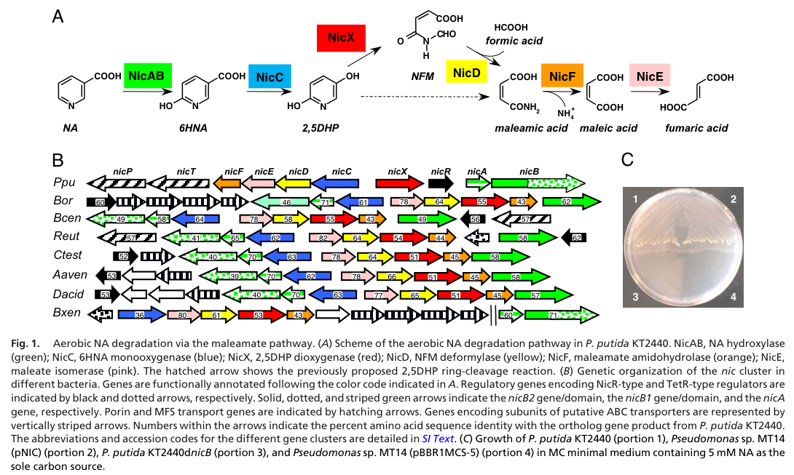

## Question

# Gene Research for Functional Annotation

## ⚠️ CRITICAL: Gene/Protein Identification Context

**BEFORE YOU BEGIN RESEARCH:** You MUST verify you are researching the CORRECT gene/protein. Gene symbols can be ambiguous, especially for less well-characterized genes from non-model organisms.

### Target Gene/Protein Identity (from UniProt):
- **UniProt Accession:** Q88FY3
- **Protein Description:** RecName: Full=N-formylmaleamate deformylase; EC=3.5.1.106; AltName: Full=Nicotinate degradation protein D;
- **Gene Information:** Name=nicD; OrderedLocusNames=PP_3943;
- **Organism (full):** Pseudomonas putida (strain ATCC 47054 / DSM 6125 / CFBP 8728 / NCIMB 11950 / KT2440).
- **Protein Family:** Not specified in UniProt
- **Key Domains:** AB_hydrolase_1. (IPR000073); AB_hydrolase_fold. (IPR029058); AB_hydrolase_sf. (IPR050266); Abhydrolase_1 (PF00561)

### MANDATORY VERIFICATION STEPS:

1. **Check if the gene symbol "nicD" matches the protein description above**
2. **Verify the organism is correct:** Pseudomonas putida (strain ATCC 47054 / DSM 6125 / CFBP 8728 / NCIMB 11950 / KT2440).
3. **Check if protein family/domains align with what you find in literature**
4. **If you find literature for a DIFFERENT gene with the same or similar symbol, STOP**

### If Gene Symbol is Ambiguous or You Cannot Find Relevant Literature:

**DO NOT PROCEED WITH RESEARCH ON A DIFFERENT GENE.** Instead:
- State clearly: "The gene symbol 'nicD' is ambiguous or literature is limited for this specific protein"
- Explain what you found (e.g., "Found extensive literature on a different gene with the same symbol in a different organism")
- Describe the protein based ONLY on the UniProt information provided above
- Suggest that the protein function can be inferred from domain/family information

### Research Target:

Please provide a comprehensive research report on the gene **nicD** (gene ID: nicD, UniProt: Q88FY3) in PSEPK.

The research report should be a detailed narrative explaining the function, biological processes, and localization of the gene product. Citations should be given for all claims.

You should prioritize authoritative reviews and primary scientific literature when conducting research. You can supplement
this with annotations you find in gene/protein databases, but these can be outdated or inaccurate.

We are specifically interested in the primary function of the gene - for enzymes, what reaction is catalyzed, and what is the substrate specificity? For transporters, what is the substrate? For structural proteins or adapters, what is the broader structural role? For signaling molecules, what is the role in the pathway.

We are interested in where in or outside the cell the gene product carries out its function.

We are also interested in the signaling or biochemical pathways in which the gene functions. We are less interested in broad pleiotropic effects, except where these elucidate the precise role.

Include evidence where possible. We are interested in both experimental evidence as well as inference from structure, evolution, or bioinformatic analysis. Precise studies should be prioritized over high-throughput, where available.

## Output

Question: You are an expert researcher providing comprehensive, well-cited information.

Provide detailed information focusing on:
1. Key concepts and definitions with current understanding
2. Recent developments and latest research (prioritize 2023-2024 sources)
3. Current applications and real-world implementations
4. Expert opinions and analysis from authoritative sources
5. Relevant statistics and data from recent studies

Format as a comprehensive research report with proper citations. Include URLs and publication dates where available.
Always prioritize recent, authoritative sources and provide specific citations for all major claims.

# Gene Research for Functional Annotation

## ⚠️ CRITICAL: Gene/Protein Identification Context

**BEFORE YOU BEGIN RESEARCH:** You MUST verify you are researching the CORRECT gene/protein. Gene symbols can be ambiguous, especially for less well-characterized genes from non-model organisms.

### Target Gene/Protein Identity (from UniProt):
- **UniProt Accession:** Q88FY3
- **Protein Description:** RecName: Full=N-formylmaleamate deformylase; EC=3.5.1.106; AltName: Full=Nicotinate degradation protein D;
- **Gene Information:** Name=nicD; OrderedLocusNames=PP_3943;
- **Organism (full):** Pseudomonas putida (strain ATCC 47054 / DSM 6125 / CFBP 8728 / NCIMB 11950 / KT2440).
- **Protein Family:** Not specified in UniProt
- **Key Domains:** AB_hydrolase_1. (IPR000073); AB_hydrolase_fold. (IPR029058); AB_hydrolase_sf. (IPR050266); Abhydrolase_1 (PF00561)

### MANDATORY VERIFICATION STEPS:

1. **Check if the gene symbol "nicD" matches the protein description above**
2. **Verify the organism is correct:** Pseudomonas putida (strain ATCC 47054 / DSM 6125 / CFBP 8728 / NCIMB 11950 / KT2440).
3. **Check if protein family/domains align with what you find in literature**
4. **If you find literature for a DIFFERENT gene with the same or similar symbol, STOP**

### If Gene Symbol is Ambiguous or You Cannot Find Relevant Literature:

**DO NOT PROCEED WITH RESEARCH ON A DIFFERENT GENE.** Instead:
- State clearly: "The gene symbol 'nicD' is ambiguous or literature is limited for this specific protein"
- Explain what you found (e.g., "Found extensive literature on a different gene with the same symbol in a different organism")
- Describe the protein based ONLY on the UniProt information provided above
- Suggest that the protein function can be inferred from domain/family information

### Research Target:

Please provide a comprehensive research report on the gene **nicD** (gene ID: nicD, UniProt: Q88FY3) in PSEPK.

The research report should be a detailed narrative explaining the function, biological processes, and localization of the gene product. Citations should be given for all claims.

You should prioritize authoritative reviews and primary scientific literature when conducting research. You can supplement
this with annotations you find in gene/protein databases, but these can be outdated or inaccurate.

We are specifically interested in the primary function of the gene - for enzymes, what reaction is catalyzed, and what is the substrate specificity? For transporters, what is the substrate? For structural proteins or adapters, what is the broader structural role? For signaling molecules, what is the role in the pathway.

We are interested in where in or outside the cell the gene product carries out its function.

We are also interested in the signaling or biochemical pathways in which the gene functions. We are less interested in broad pleiotropic effects, except where these elucidate the precise role.

Include evidence where possible. We are interested in both experimental evidence as well as inference from structure, evolution, or bioinformatic analysis. Precise studies should be prioritized over high-throughput, where available.

## Research Report: Functional Annotation of **nicD** (UniProt **Q88FY3**; locus **PP_3943**) in *Pseudomonas putida* KT2440

### 0. Identity verification (critical disambiguation)
The literature evidence used here explicitly matches the UniProt target: **NicD from *Pseudomonas putida* KT2440** (ordered locus **PP_3943**) encoding **N-formylmaleamate deformylase** (also called “nicotinate degradation protein D”), which functions in aerobic **nicotinic acid (nicotinate; NA) degradation via the maleamate pathway**. This directly aligns with the biochemical and genetic characterization of the KT2440 *nic* gene cluster. (jimenez2008decipheringthegenetic pages 1-2, jimenez2008decipheringthegenetic pages 5-6)

---

### 1. Key concepts and definitions (current understanding)

#### 1.1 Nicotinic acid (nicotinate) degradation via the maleamate pathway
In *P. putida* KT2440, aerobic NA catabolism proceeds through a sequence of oxidative and hydrolytic transformations that funnel NA carbon into central metabolism as **fumarate** (TCA cycle intermediate). The canonical intermediate sequence is **NA → 6-hydroxynicotinic acid (6HNA) → 2,5-dihydroxypyridine (2,5DHP) → N-formylmaleamic acid (NFM) → maleamic acid → maleic acid → fumaric acid**. (jimenez2008decipheringthegenetic media 4de9e495)

A key conceptual point established experimentally in KT2440 is that the extradiol dioxygenase **NicX** produces **NFM** as the *true ring-cleavage product* of 2,5DHP; earlier reports suggesting that dioxygenase directly formed maleamate/formate were explained by **contaminating deformylase activity**, now attributed to NicD. (jimenez2008decipheringthegenetic pages 4-5)

#### 1.2 N-formylmaleamate deformylase (NicD; EC 3.5.1.106)
**NicD** is the enzyme catalyzing **deformylation (hydrolytic removal of an N-formyl group)** from **N-formylmaleamic acid (NFM)**, yielding **maleamic acid + formic acid**. This step is essential for completing the maleamate pathway and enabling subsequent hydrolysis/isomerization steps that produce fumarate. (jimenez2008decipheringthegenetic pages 5-6, jimenez2008decipheringthegenetic media 4de9e495)

#### 1.3 Structural family concept: α/β-hydrolase (AB-hydrolase) fold
NicD is assigned to the **α/β-hydrolase-fold superfamily**. A notable concept from the KT2440 study is that deformylase activity (on NFM) was described as *previously unreported* within this broad fold family, expanding the known functional repertoire of α/β-hydrolases. (jimenez2008decipheringthegenetic pages 4-5, jimenez2008decipheringthegenetic pages 5-6)

---

### 2. Gene product function: reaction, specificity, and mechanism

#### 2.1 Primary biochemical function and reaction equation
**Reaction catalyzed (validated experimentally):**
- **N-formylmaleamic acid (NFM) + H2O → maleamic acid + formic acid**

In KT2440 NicD, this activity was shown by overexpressing *nicD* in *E. coli* and demonstrating conversion of NFM to **maleamic and formic acids**, verified by **HPLC** and **\u00b9H NMR**. (jimenez2008decipheringthegenetic pages 5-6)

**Substrate specificity:** within the retrieved KT2440 primary evidence, NicD is established on-pathway for **NFM** (produced by NicX). The corpus retrieved here does not provide a systematic substrate scope beyond NFM for KT2440 NicD; thus, substrate specificity is best stated conservatively as “NFM deformylation” based on direct biochemical evidence. (jimenez2008decipheringthegenetic pages 5-6, jimenez2008decipheringthegenetic pages 4-5)

#### 2.2 Catalytic residues and motif (mechanistic understanding)
KT2440 NicD contains a conserved α/β-hydrolase nucleophile motif **98-GHSMG-104**, consistent with a **serine nucleophile**-based mechanism in this fold. (jimenez2008decipheringthegenetic pages 5-6)

Site-directed mutagenesis identified an essential catalytic triad:
- **Ser101**, **Asp125**, **His245** are required for activity (Ala substitutions eliminated deformylase activity). (jimenez2008decipheringthegenetic pages 5-6)
- **Glu221** is not essential (E221A retained ~**70%** of wild-type activity), supporting the conclusion that Asp125 (not Glu221) acts as the catalytic acid in the triad. (jimenez2008decipheringthegenetic pages 5-6)

#### 2.3 Enzyme size and biochemical assay notes
NicD is ~**29 kDa** (predicted 29.1 kDa; observed ~29 kDa band upon overexpression). (jimenez2008decipheringthegenetic pages 5-6)

A NicD assay strategy described in the KT2440 work coupled deformylation-derived **formate** to formate dehydrogenase (NADH formation), providing an additional functional readout for NicD-catalyzed deformylation. (jimenez2008decipheringthegenetic pages 6-6)

---

### 3. Biological role, pathway context, and regulation

#### 3.1 Pathway placement and metabolic role
NicD is positioned **after NicX ring cleavage** and before downstream enzymes that complete funneling to fumarate:
- **NicX**: 2,5DHP → NFM (ring cleavage) (jimenez2008decipheringthegenetic pages 4-5)
- **NicD**: NFM → maleamic acid + formic acid (jimenez2008decipheringthegenetic pages 5-6)
- **NicF**: maleamate/maleamic acid → maleic acid + NH3 (jimenez2008decipheringthegenetic pages 5-6)
- **NicE**: maleic acid → fumaric acid (jimenez2008decipheringthegenetic pages 5-6)

This pathway organization is summarized visually in Figure 1 from Jiménez et al. (2008). (jimenez2008decipheringthegenetic media 4de9e495)

#### 3.2 Genetic organization and necessity for growth on nicotinate
The KT2440 *nic* genes are organized in a cluster and are required for NA utilization; disruption of pathway genes including *nicD* prevents growth on NA as sole carbon source, supporting a necessary role for NicD in aerobic NA catabolism. (jimenez2008decipheringthegenetic pages 1-2, jimenez2008decipheringthegenetic media 4de9e495)

#### 3.3 Regulation: FinR/NicR and operon-level control
A later KT2440 study (Xiao et al., 2018) analyzed the LysR-type regulator **FinR** and showed that FinR positively regulates NA-degradation operons, with transcriptomic/RT-qPCR evidence indicating decreased expression of multiple *nic* genes in a **ΔfinR** background.

Importantly for *nicD* specifically:
- *nicD* corresponds to **PP_3943** and appears in the FinR-responsive gene list; the study also states that *nicD* lies in the **nicCDEFTP operon** (NA-inducible; promoter Pc). (xiao2018finrregulatesexpression pages 3-4, xiao2018finrregulatesexpression pages 2-3)

In addition, comparative locus analyses note that *nic* clusters often include a MarR-family regulator **NicR** and nicotinate transport genes, indicating a broader regulatory/transport module commonly associated with this catabolic capability (not all regulatory interactions are experimentally assigned to *nicD* directly in the retrieved excerpts). (jimenez2008decipheringthegenetic pages 5-6, brickman2018thebordetellabronchiseptica pages 3-3)

---

### 4. Subcellular localization and cellular context
No direct cellular localization experiment (e.g., fluorescence tagging, fractionation in KT2440) was retrieved for NicD. However, functional activity was demonstrated in **crude soluble extracts** after heterologous overexpression, supporting an inference that NicD is a **cytosolic enzyme** participating in intracellular catabolism of pathway intermediates. This should be treated as an inference rather than a proven localization claim. (jimenez2008decipheringthegenetic pages 5-6)

---

### 5. Recent developments (prioritizing 2023–2024) and contemporary research context

#### 5.1 2023 applied microbiome/fermentation studies tracking EC 3.5.1.106 activity
Although no 2023–2024 primary mechanistic study specifically re-characterizing *P. putida* KT2440 NicD was retrieved in this tool run, recent applied microbial studies detect and track the **nicotinate degradation module**, including **EC 3.5.1.106** (N-formylmaleamate deformylase), in real-world fermentation ecosystems.

In cigar-leaf fermentation experiments with a Tremella aurantialba-derived fermentation medium, KEGG/pathway analyses indicated that enzymes in the nicotinate degradation pathway, including **NicX (EC 1.13.11.9)**, **NicD (EC 3.5.1.106)**, and **NicF (EC 3.5.1.107)**, followed similar temporal abundance trends during fermentation. This provides recent evidence that the NFM deformylation step is part of the functional gene repertoire engaged in complex microbial communities where nicotine/nicotinate chemistry influences product qualities. (zhang2023effectsofa pages 8-10)

#### 5.2 2023 systematic review: pathway step and EC number
A 2023 systematic review on nicotine and nicotine-derivative biology summarized late steps of bacterial nicotine catabolism and explicitly states that **N-formylmaleamate deformylase (Nfo)** converts NFM to maleamic acid + formic acid and provides the EC number **3.5.1.106**, contextualizing the same chemistry carried out by NicD orthologs (including the KT2440 NicD step in nicotinate degradation). (boiangiu2023insightsintopharmacological pages 11-14)

#### 5.3 2020 authoritative review: cross-pathway orthology and kinetic values for an ortholog
A review on hybrid nicotine catabolism described the analogous enzyme **Nfo** (~28.1 kDa) and reported that an Nfo (from *P. putida* S16 context) shows sequence identity to KT2440 NicD (reported as **58.2% identity**) and provided **kinetic parameters** for that ortholog (specific activity **1.1 U/mg**, apparent **Km 0.94 mM** for NFM at pH 6.7, 20°C). These values should be interpreted as *ortholog evidence* (not KT2440 NicD measurements). (huang2020physiologyofa pages 6-7)

---

### 6. Current applications and real-world implementations

#### 6.1 Industrial relevance of the overall nicotinate pathway module
The KT2440 *nic* system includes an NA hydroxylase step that was explicitly noted as industrially relevant for producing **6-hydroxynicotinic acid (6HNA)**, described as a precursor for insecticides/herbicides. While this point is upstream of NicD, NicD is part of the same catabolic module enabling complete NA assimilation rather than partial biotransformation. (jimenez2008decipheringthegenetic pages 3-4)

#### 6.2 Fermentation ecosystem implementation (2023)
In tobacco/cigar fermentation systems, enzymes of nicotinate degradation (including EC 3.5.1.106) were detected and tracked via functional metagenomic annotations, and nicotine/nicotinate-related metabolites were linked to sensory attributes via multivariate analysis and correlations, supporting an emerging “microbiome-enabled” approach to controlling alkaloid chemistry in food/agricultural processing. (zhang2023effectsofa pages 8-10, zhang2023effectsofa pages 12-14)

---

### 7. Expert interpretation and authoritative analysis (evidence-based)

1) **Mechanistic novelty within a known fold:** The KT2440 study interprets NicD as an α/β-hydrolase-fold enzyme performing a deformylation reaction that was not previously recognized in that superfamily, which is a strong indication that fold-based annotation alone may miss specialized chemistry in catabolic islands. (jimenez2008decipheringthegenetic pages 4-5, jimenez2008decipheringthegenetic pages 5-6)

2) **Clarifying pathway biochemistry through careful product identification:** The demonstration that NicX produces NFM and that the deformylation step is catalyzed by NicD (rather than being intrinsic to NicX) resolves a historical ambiguity in pyridine-ring cleavage chemistry and highlights the importance of purity controls in enzyme assignment. (jimenez2008decipheringthegenetic pages 4-5)

3) **Regulatory integration:** FinR-dependent transcriptional control of NA-degradation operons suggests that NA catabolism is integrated into broader oxidative-stress or metabolic regulatory networks in proteobacteria, though the direct mechanistic coupling of FinR to NicD expression/function remains largely operon- and transcript-level in the retrieved evidence. (xiao2018finrregulatesexpression pages 3-4, xiao2018finrregulatesexpression pages 2-3)

---

### 8. Statistics and quantitative data (from recent and foundational studies)

**KT2440 NicD mechanistic data (primary):**
- Mutagenesis: **E221A ~70% activity**, while **S101A/D125A/H245A abolish activity**, supporting the S101–D125–H245 catalytic triad. (jimenez2008decipheringthegenetic pages 5-6)

**Ortholog kinetic data (reviewed; not KT2440 direct):**
- For Nfo (ortholog context), **specific activity 1.1 U/mg** and **Km 0.94 mM** for NFM (pH 6.7, 20°C). (huang2020physiologyofa pages 6-7)

**Regulatory transcriptomics (KT2440, ΔfinR):**
- *nicD* (PP_3943) included among genes reduced in the finR mutant; the excerpt provides a log2 fold-change-like value (**2.694**) and a highly significant p-value (as formatted in the excerpt) supporting FinR-dependent expression differences (interpretation depends on the table’s sign convention; the evidence supports differential expression associated with FinR). (xiao2018finrregulatesexpression pages 2-3)

**Applied 2023 fermentation functional profiling:**
- Nicotinate pathway enzymes including **EC 3.5.1.106 (NicD)** tracked with temporal trends; correlation/network statistics include modularity index **0.452** for microbe–VFC associations and numerous significant Spearman correlations (p < 0.05) connecting taxa with nicotine/nicotinate-related products and sensory variables. (zhang2023effectsofa pages 8-10)

---

### 9. Summary table (curated functional annotation)
| Feature | Finding | Evidence (paper) |
|---|---|---|
| Verified identity | **nicD / PP_3943 / UniProt Q88FY3** in *Pseudomonas putida* KT2440 encodes **N-formylmaleamate deformylase** in the nicotinic acid (maleamate) pathway; overexpressed protein is ~**29 kDa** (predicted 29.1 kDa) and belongs to the **α/β-hydrolase (AB-hydrolase) fold** superfamily. | (jimenez2008decipheringthegenetic pages 5-6, jimenez2008decipheringthegenetic pages 1-2) |
| Enzymatic reaction | NicD catalyzes **N-formylmaleamic acid (NFM) → maleamic acid + formic acid**; this corresponds to **EC 3.5.1.106** (N-formylmaleamate deformylase) and removes the N-formyl group generated after pyridine-ring cleavage. | (jimenez2008decipheringthegenetic pages 4-5, jimenez2008decipheringthegenetic pages 5-6, jimenez2008decipheringthegenetic pages 1-2) |
| Pathway position | NicD acts **downstream of NicX** and **upstream of NicF** in aerobic nicotinic acid degradation: **NA —NicAB→ 6HNA —NicC→ 2,5DHP —NicX→ NFM —NicD→ maleamic acid —NicF→ maleic acid —NicE→ fumaric acid**. | (jimenez2008decipheringthegenetic pages 4-5, jimenez2008decipheringthegenetic pages 5-6, jimenez2008decipheringthegenetic pages 1-2, jimenez2008decipheringthegenetic media 4de9e495) |
| Key catalytic motif | NicD contains the conserved nucleophile motif **98-GHSMG-104**, matching the canonical serine-containing motif of α/β-hydrolases. | (jimenez2008decipheringthegenetic pages 5-6) |
| Catalytic triad | Site-directed mutagenesis supports **S101–D125–H245** as the catalytic triad; **S101A, D125A, H245A** abolished activity, whereas **E221A** retained ~**70%** of wild-type activity, arguing E221 is not the catalytic acid. | (jimenez2008decipheringthegenetic pages 5-6) |
| Structural/mechanistic interpretation | Homology modeling based on an **Aureobacterium** lactamase placed NicD in the **α/β-hydrolase fold** and showed that deformylase activity is an unusual function within this fold family. | (jimenez2008decipheringthegenetic pages 5-6, jimenez2008decipheringthegenetic pages 4-5) |
| Experimental evidence: biochemical function | **Overexpression in *E. coli*** produced a strong ~29-kDa band, and crude extracts transformed **NFM to maleamic acid + formic acid**, verified by **HPLC** and **¹H NMR**. | (jimenez2008decipheringthegenetic pages 5-6) |
| Experimental evidence: pathway assignment | The upstream product **NFM** was identified as the true product of **NicX** by **NMR/mass spectrometry**, resolving earlier confusion and directly establishing the substrate for NicD. | (jimenez2008decipheringthegenetic pages 4-5) |
| Experimental evidence: genetics/phenotype | Disruption of **nicD** prevented growth on **nicotinic acid** as sole carbon source, supporting an essential pathway role in KT2440; the nic cluster as a cassette restored NA utilization in nondegrading backgrounds. | (jimenez2008decipheringthegenetic pages 1-2, jimenez2008decipheringthegenetic pages 2-3, jimenez2008decipheringthegenetic media 4de9e495) |
| Regulation notes | **nicD** resides in the **nic** cluster, which is associated with **NicR** (MarR-type regulator) in KT2440 and related loci. Later work showed **FinR** positively affects expression of the **nicC** and **nicX** operons and NA/6HNA utilization; direct regulation of **nicD** specifically was not shown in the cited excerpts, so influence on NicD is best treated as **pathway-level/indirect**. | (brickman2018thebordetellabronchiseptica pages 3-3, jimenez2008decipheringthegenetic pages 5-6) |
| Localization | Best current annotation is **cytosolic**: NicD was assayed in **soluble crude extracts** after heterologous expression; no membrane segment, signal peptide, or export evidence is reported in the cited sources. This is therefore a **subcellular inference**, not a direct localization experiment. | (jimenez2008decipheringthegenetic pages 5-6) |
| Current limitations | The available primary sources establish function, pathway context, and catalytic residues, but do **not** provide NicD-specific high-resolution structure, detailed substrate range beyond **NFM**, or published NicD kinetic constants in the cited excerpts. | (jimenez2008decipheringthegenetic pages 4-5, jimenez2008decipheringthegenetic pages 5-6, jimenez2008decipheringthegenetic pages 6-6) |

*Table: This table summarizes the verified identity, enzymatic role, pathway context, catalytic residues, evidence base, regulation, and inferred localization of *Pseudomonas putida* KT2440 NicD (Q88FY3/PP_3943). It is useful as a concise, citation-backed functional annotation for the target gene.*

---

### 10. Key sources (URLs and publication dates)
- Jiménez et al. **2008-08-12**. *PNAS*. “Deciphering the genetic determinants for aerobic nicotinic acid degradation: The nic cluster from *Pseudomonas putida* KT2440.” https://doi.org/10.1073/pnas.0802273105 (jimenez2008decipheringthegenetic pages 5-6)
- Xiao et al. **2018-10**. *Applied and Environmental Microbiology*. “FinR regulates expression of nicC and nicX operons, involved in nicotinic acid degradation in *Pseudomonas putida* KT2440.” https://doi.org/10.1128/AEM.01210-18 (xiao2018finrregulatesexpression pages 3-4)
- Huang et al. **2020-11**. *Frontiers in Microbiology*. “Physiology of a hybrid pathway for nicotine catabolism in bacteria.” https://doi.org/10.3389/fmicb.2020.598207 (huang2020physiologyofa pages 6-7)
- Zhang et al. **2023-09**. *Frontiers in Microbiology*. “Effects of a novel microbial fermentation medium produced by *Tremella aurantialba* SCT-F3 on cigar filler leaf.” https://doi.org/10.3389/fmicb.2023.1267916 (zhang2023effectsofa pages 8-10)
- Boiangiu et al. **2023-12**. *Biomolecules*. “Insights into Pharmacological Activities of Nicotine and 6-Hydroxy-L-nicotine…” https://doi.org/10.3390/biom14010023 (boiangiu2023insightsintopharmacological pages 11-14)

---

### 11. Evidence gaps and limitations (to avoid over-interpretation)
- No KT2440 NicD-specific **high-resolution structure** (e.g., crystal/cryo-EM) or **full kinetic characterization** (Km/kcat for KT2440 NicD) was retrieved in the accessible corpus; the strongest residue-level mechanism evidence comes from **mutagenesis + homology modeling** in the 2008 primary study. (jimenez2008decipheringthegenetic pages 5-6, jimenez2008decipheringthegenetic pages 6-6)
- Subcellular localization is **inferred** from soluble activity assays; definitive localization would require targeted experiments (e.g., fractionation or imaging) not present in retrieved sources. (jimenez2008decipheringthegenetic pages 5-6)

References

1. (jimenez2008decipheringthegenetic pages 1-2): José I. Jiménez, Ángeles Canales, Jesús Jiménez-Barbero, Krzysztof Ginalski, Leszek Rychlewski, José L. García, and Eduardo Díaz. Deciphering the genetic determinants for aerobic nicotinic acid degradation: the nic cluster from pseudomonas putida kt2440. Proceedings of the National Academy of Sciences, 105:11329-11334, Aug 2008. URL: https://doi.org/10.1073/pnas.0802273105, doi:10.1073/pnas.0802273105. This article has 173 citations and is from a highest quality peer-reviewed journal.

2. (jimenez2008decipheringthegenetic pages 5-6): José I. Jiménez, Ángeles Canales, Jesús Jiménez-Barbero, Krzysztof Ginalski, Leszek Rychlewski, José L. García, and Eduardo Díaz. Deciphering the genetic determinants for aerobic nicotinic acid degradation: the nic cluster from pseudomonas putida kt2440. Proceedings of the National Academy of Sciences, 105:11329-11334, Aug 2008. URL: https://doi.org/10.1073/pnas.0802273105, doi:10.1073/pnas.0802273105. This article has 173 citations and is from a highest quality peer-reviewed journal.

3. (jimenez2008decipheringthegenetic media 4de9e495): José I. Jiménez, Ángeles Canales, Jesús Jiménez-Barbero, Krzysztof Ginalski, Leszek Rychlewski, José L. García, and Eduardo Díaz. Deciphering the genetic determinants for aerobic nicotinic acid degradation: the nic cluster from pseudomonas putida kt2440. Proceedings of the National Academy of Sciences, 105:11329-11334, Aug 2008. URL: https://doi.org/10.1073/pnas.0802273105, doi:10.1073/pnas.0802273105. This article has 173 citations and is from a highest quality peer-reviewed journal.

4. (jimenez2008decipheringthegenetic pages 4-5): José I. Jiménez, Ángeles Canales, Jesús Jiménez-Barbero, Krzysztof Ginalski, Leszek Rychlewski, José L. García, and Eduardo Díaz. Deciphering the genetic determinants for aerobic nicotinic acid degradation: the nic cluster from pseudomonas putida kt2440. Proceedings of the National Academy of Sciences, 105:11329-11334, Aug 2008. URL: https://doi.org/10.1073/pnas.0802273105, doi:10.1073/pnas.0802273105. This article has 173 citations and is from a highest quality peer-reviewed journal.

5. (jimenez2008decipheringthegenetic pages 6-6): José I. Jiménez, Ángeles Canales, Jesús Jiménez-Barbero, Krzysztof Ginalski, Leszek Rychlewski, José L. García, and Eduardo Díaz. Deciphering the genetic determinants for aerobic nicotinic acid degradation: the nic cluster from pseudomonas putida kt2440. Proceedings of the National Academy of Sciences, 105:11329-11334, Aug 2008. URL: https://doi.org/10.1073/pnas.0802273105, doi:10.1073/pnas.0802273105. This article has 173 citations and is from a highest quality peer-reviewed journal.

6. (xiao2018finrregulatesexpression pages 3-4): Yujie Xiao, Wenjing Zhu, Huizhong Liu, Hailing Nie, Wenli Chen, and Qiaoyun Huang. Finr regulates expression of <i>nicc</i> and <i>nicx</i> operons, involved in nicotinic acid degradation in pseudomonas putida kt2440. Applied and Environmental Microbiology, Oct 2018. URL: https://doi.org/10.1128/aem.01210-18, doi:10.1128/aem.01210-18. This article has 10 citations and is from a peer-reviewed journal.

7. (xiao2018finrregulatesexpression pages 2-3): Yujie Xiao, Wenjing Zhu, Huizhong Liu, Hailing Nie, Wenli Chen, and Qiaoyun Huang. Finr regulates expression of <i>nicc</i> and <i>nicx</i> operons, involved in nicotinic acid degradation in pseudomonas putida kt2440. Applied and Environmental Microbiology, Oct 2018. URL: https://doi.org/10.1128/aem.01210-18, doi:10.1128/aem.01210-18. This article has 10 citations and is from a peer-reviewed journal.

8. (brickman2018thebordetellabronchiseptica pages 3-3): Timothy J. Brickman and Sandra K. Armstrong. The bordetella bronchiseptica nic locus encodes a nicotinic acid degradation pathway and the 6‐hydroxynicotinate‐responsive regulator bpsr. Molecular Microbiology, 108:397-409, May 2018. URL: https://doi.org/10.1111/mmi.13943, doi:10.1111/mmi.13943. This article has 13 citations and is from a domain leading peer-reviewed journal.

9. (zhang2023effectsofa pages 8-10): Qianying Zhang, Shuanghong Yang, Zhenggang Yang, Tianfei Zheng, Pinhe Li, Quanwei Zhou, W. Cai, Yue Wang, Juan Zhang, Xiaoying Ji, and Dongliang Li. Effects of a novel microbial fermentation medium produced by tremella aurantialba sct-f3 on cigar filler leaf. Frontiers in Microbiology, Sep 2023. URL: https://doi.org/10.3389/fmicb.2023.1267916, doi:10.3389/fmicb.2023.1267916. This article has 22 citations and is from a peer-reviewed journal.

10. (boiangiu2023insightsintopharmacological pages 11-14): Razvan Stefan Boiangiu, Ion Brinza, Iasmina Honceriu, Marius Mihasan, and Lucian Hritcu. Insights into pharmacological activities of nicotine and 6-hydroxy-l-nicotine, a bacterial nicotine derivative: a systematic review. Biomolecules, 14:23, Dec 2023. URL: https://doi.org/10.3390/biom14010023, doi:10.3390/biom14010023. This article has 8 citations.

11. (huang2020physiologyofa pages 6-7): Haiyan Huang, Jinmeng Shang, and Shuning Wang. Physiology of a hybrid pathway for nicotine catabolism in bacteria. Frontiers in Microbiology, Nov 2020. URL: https://doi.org/10.3389/fmicb.2020.598207, doi:10.3389/fmicb.2020.598207. This article has 18 citations and is from a peer-reviewed journal.

12. (jimenez2008decipheringthegenetic pages 3-4): José I. Jiménez, Ángeles Canales, Jesús Jiménez-Barbero, Krzysztof Ginalski, Leszek Rychlewski, José L. García, and Eduardo Díaz. Deciphering the genetic determinants for aerobic nicotinic acid degradation: the nic cluster from pseudomonas putida kt2440. Proceedings of the National Academy of Sciences, 105:11329-11334, Aug 2008. URL: https://doi.org/10.1073/pnas.0802273105, doi:10.1073/pnas.0802273105. This article has 173 citations and is from a highest quality peer-reviewed journal.

13. (zhang2023effectsofa pages 12-14): Qianying Zhang, Shuanghong Yang, Zhenggang Yang, Tianfei Zheng, Pinhe Li, Quanwei Zhou, W. Cai, Yue Wang, Juan Zhang, Xiaoying Ji, and Dongliang Li. Effects of a novel microbial fermentation medium produced by tremella aurantialba sct-f3 on cigar filler leaf. Frontiers in Microbiology, Sep 2023. URL: https://doi.org/10.3389/fmicb.2023.1267916, doi:10.3389/fmicb.2023.1267916. This article has 22 citations and is from a peer-reviewed journal.

14. (jimenez2008decipheringthegenetic pages 2-3): José I. Jiménez, Ángeles Canales, Jesús Jiménez-Barbero, Krzysztof Ginalski, Leszek Rychlewski, José L. García, and Eduardo Díaz. Deciphering the genetic determinants for aerobic nicotinic acid degradation: the nic cluster from pseudomonas putida kt2440. Proceedings of the National Academy of Sciences, 105:11329-11334, Aug 2008. URL: https://doi.org/10.1073/pnas.0802273105, doi:10.1073/pnas.0802273105. This article has 173 citations and is from a highest quality peer-reviewed journal.

## Artifacts

- [Edison artifact artifact-00](nicD-deep-research-falcon_artifacts/artifact-00.md)

## Citations

1. jimenez2008decipheringthegenetic pages 4-5
2. jimenez2008decipheringthegenetic pages 5-6
3. jimenez2008decipheringthegenetic pages 6-6
4. zhang2023effectsofa pages 8-10
5. boiangiu2023insightsintopharmacological pages 11-14
6. huang2020physiologyofa pages 6-7
7. jimenez2008decipheringthegenetic pages 3-4
8. xiao2018finrregulatesexpression pages 2-3
9. xiao2018finrregulatesexpression pages 3-4
10. jimenez2008decipheringthegenetic pages 1-2
11. brickman2018thebordetellabronchiseptica pages 3-3
12. zhang2023effectsofa pages 12-14
13. jimenez2008decipheringthegenetic pages 2-3
14. https://doi.org/10.1073/pnas.0802273105
15. https://doi.org/10.1128/AEM.01210-18
16. https://doi.org/10.3389/fmicb.2020.598207
17. https://doi.org/10.3389/fmicb.2023.1267916
18. https://doi.org/10.3390/biom14010023
19. https://doi.org/10.1073/pnas.0802273105,
20. https://doi.org/10.1128/aem.01210-18,
21. https://doi.org/10.1111/mmi.13943,
22. https://doi.org/10.3389/fmicb.2023.1267916,
23. https://doi.org/10.3390/biom14010023,
24. https://doi.org/10.3389/fmicb.2020.598207,