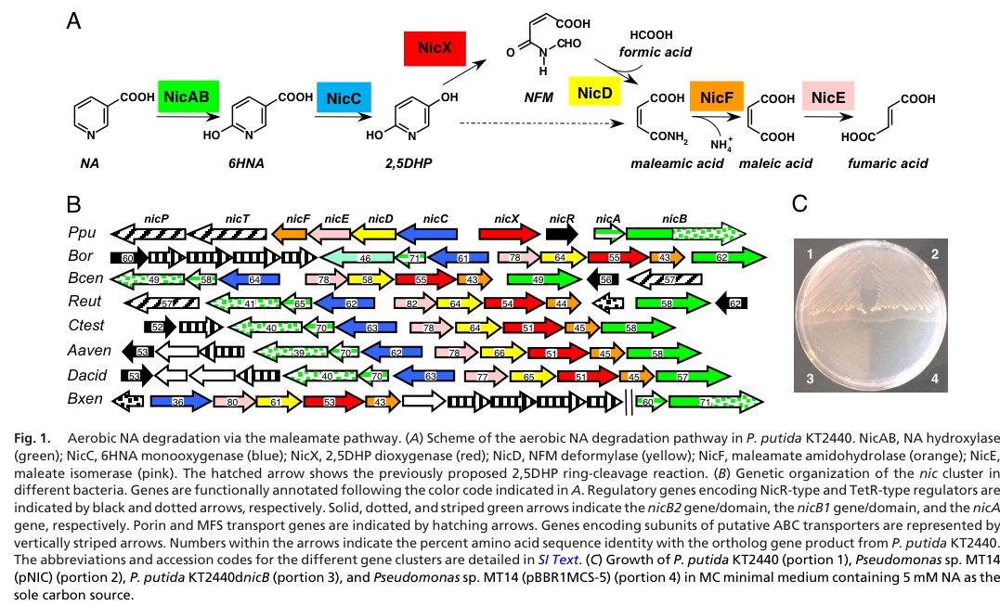

## Question

# Gene Research for Functional Annotation

## ⚠️ CRITICAL: Gene/Protein Identification Context

**BEFORE YOU BEGIN RESEARCH:** You MUST verify you are researching the CORRECT gene/protein. Gene symbols can be ambiguous, especially for less well-characterized genes from non-model organisms.

### Target Gene/Protein Identity (from UniProt):
- **UniProt Accession:** Q88FY5
- **Protein Description:** RecName: Full=Maleamate amidohydrolase; EC=3.5.1.107; AltName: Full=Nicotinate degradation protein F;
- **Gene Information:** Name=nicF; OrderedLocusNames=PP_3941;
- **Organism (full):** Pseudomonas putida (strain ATCC 47054 / DSM 6125 / CFBP 8728 / NCIMB 11950 / KT2440).
- **Protein Family:** Belongs to the isochorismatase family. .
- **Key Domains:** Isochorismatase-like_dom. (IPR000868); Isochorismatase-like_hydrls. (IPR050272); Isochorismatase-like_sf. (IPR036380); Isochorismatase (PF00857)

### MANDATORY VERIFICATION STEPS:

1. **Check if the gene symbol "nicF" matches the protein description above**
2. **Verify the organism is correct:** Pseudomonas putida (strain ATCC 47054 / DSM 6125 / CFBP 8728 / NCIMB 11950 / KT2440).
3. **Check if protein family/domains align with what you find in literature**
4. **If you find literature for a DIFFERENT gene with the same or similar symbol, STOP**

### If Gene Symbol is Ambiguous or You Cannot Find Relevant Literature:

**DO NOT PROCEED WITH RESEARCH ON A DIFFERENT GENE.** Instead:
- State clearly: "The gene symbol 'nicF' is ambiguous or literature is limited for this specific protein"
- Explain what you found (e.g., "Found extensive literature on a different gene with the same symbol in a different organism")
- Describe the protein based ONLY on the UniProt information provided above
- Suggest that the protein function can be inferred from domain/family information

### Research Target:

Please provide a comprehensive research report on the gene **nicF** (gene ID: nicF, UniProt: Q88FY5) in PSEPK.

The research report should be a detailed narrative explaining the function, biological processes, and localization of the gene product. Citations should be given for all claims.

You should prioritize authoritative reviews and primary scientific literature when conducting research. You can supplement
this with annotations you find in gene/protein databases, but these can be outdated or inaccurate.

We are specifically interested in the primary function of the gene - for enzymes, what reaction is catalyzed, and what is the substrate specificity? For transporters, what is the substrate? For structural proteins or adapters, what is the broader structural role? For signaling molecules, what is the role in the pathway.

We are interested in where in or outside the cell the gene product carries out its function.

We are also interested in the signaling or biochemical pathways in which the gene functions. We are less interested in broad pleiotropic effects, except where these elucidate the precise role.

Include evidence where possible. We are interested in both experimental evidence as well as inference from structure, evolution, or bioinformatic analysis. Precise studies should be prioritized over high-throughput, where available.

## Output

Question: You are an expert researcher providing comprehensive, well-cited information.

Provide detailed information focusing on:
1. Key concepts and definitions with current understanding
2. Recent developments and latest research (prioritize 2023-2024 sources)
3. Current applications and real-world implementations
4. Expert opinions and analysis from authoritative sources
5. Relevant statistics and data from recent studies

Format as a comprehensive research report with proper citations. Include URLs and publication dates where available.
Always prioritize recent, authoritative sources and provide specific citations for all major claims.

# Gene Research for Functional Annotation

## ⚠️ CRITICAL: Gene/Protein Identification Context

**BEFORE YOU BEGIN RESEARCH:** You MUST verify you are researching the CORRECT gene/protein. Gene symbols can be ambiguous, especially for less well-characterized genes from non-model organisms.

### Target Gene/Protein Identity (from UniProt):
- **UniProt Accession:** Q88FY5
- **Protein Description:** RecName: Full=Maleamate amidohydrolase; EC=3.5.1.107; AltName: Full=Nicotinate degradation protein F;
- **Gene Information:** Name=nicF; OrderedLocusNames=PP_3941;
- **Organism (full):** Pseudomonas putida (strain ATCC 47054 / DSM 6125 / CFBP 8728 / NCIMB 11950 / KT2440).
- **Protein Family:** Belongs to the isochorismatase family. .
- **Key Domains:** Isochorismatase-like_dom. (IPR000868); Isochorismatase-like_hydrls. (IPR050272); Isochorismatase-like_sf. (IPR036380); Isochorismatase (PF00857)

### MANDATORY VERIFICATION STEPS:

1. **Check if the gene symbol "nicF" matches the protein description above**
2. **Verify the organism is correct:** Pseudomonas putida (strain ATCC 47054 / DSM 6125 / CFBP 8728 / NCIMB 11950 / KT2440).
3. **Check if protein family/domains align with what you find in literature**
4. **If you find literature for a DIFFERENT gene with the same or similar symbol, STOP**

### If Gene Symbol is Ambiguous or You Cannot Find Relevant Literature:

**DO NOT PROCEED WITH RESEARCH ON A DIFFERENT GENE.** Instead:
- State clearly: "The gene symbol 'nicF' is ambiguous or literature is limited for this specific protein"
- Explain what you found (e.g., "Found extensive literature on a different gene with the same symbol in a different organism")
- Describe the protein based ONLY on the UniProt information provided above
- Suggest that the protein function can be inferred from domain/family information

### Research Target:

Please provide a comprehensive research report on the gene **nicF** (gene ID: nicF, UniProt: Q88FY5) in PSEPK.

The research report should be a detailed narrative explaining the function, biological processes, and localization of the gene product. Citations should be given for all claims.

You should prioritize authoritative reviews and primary scientific literature when conducting research. You can supplement
this with annotations you find in gene/protein databases, but these can be outdated or inaccurate.

We are specifically interested in the primary function of the gene - for enzymes, what reaction is catalyzed, and what is the substrate specificity? For transporters, what is the substrate? For structural proteins or adapters, what is the broader structural role? For signaling molecules, what is the role in the pathway.

We are interested in where in or outside the cell the gene product carries out its function.

We are also interested in the signaling or biochemical pathways in which the gene functions. We are less interested in broad pleiotropic effects, except where these elucidate the precise role.

Include evidence where possible. We are interested in both experimental evidence as well as inference from structure, evolution, or bioinformatic analysis. Precise studies should be prioritized over high-throughput, where available.

## Research report: Functional annotation of **nicF** (UniProt **Q88FY5**) in *Pseudomonas putida* KT2440

### 0. Target verification (critical disambiguation)
The literature retrieved here explicitly links **UniProt Q88FY5** to **NicF (maleamate amidohydrolase; nicotinate degradation protein F; EC 3.5.1.107)** in *Pseudomonas putida* strain KT2440 (ordered locus **PP_3941**) and places it in the canonical *nic* gene cluster for aerobic nicotinic acid (NA; nicotinate) catabolism. This is supported by (i) a genetic/biochemical characterization of the *nic* cluster in KT2440 (including explicit labeling of **nicF** as maleamate amidohydrolase) and (ii) independent comparative genomics work that maps the Swiss-Prot entry **NicF Q88FY5** to the maleamate pathway enzymes. (jimenez2008decipheringthegenetic pages 2-3, qiu2018anoveldegradation pages 2-4)

### 1. Key concepts and definitions (current understanding)

#### 1.1 Nicotinate (nicotinic acid, vitamin B3) aerobic degradation and the “maleamate pathway”
Aerobic bacterial nicotinate degradation in KT2440 proceeds via the **maleamate pathway**, a route that converts the pyridine ring to central metabolites through a sequence of hydroxylation, ring cleavage, and amide-processing steps, culminating in **fumarate** entry into the TCA cycle. In the KT2440 scheme, the late steps proceed through **maleamic acid → maleic acid → fumaric acid**, with **NicF** catalyzing the maleamate/maleamic acid amidase step and **NicE** (maleate cis/trans isomerase) converting maleate/maleic acid to fumarate. (jimenez2008decipheringthegenetic media f8ef396e, jimenez2008decipheringthegenetic pages 2-3)

#### 1.2 NicF enzyme class and family
NicF in KT2440 is predicted and supported to belong to the **isochorismatase superfamily**, which includes cysteine-dependent amide/ester hydrolases often featuring a **Cys–Asp–Lys** catalytic triad. In Jiménez et al. (2008), this family assignment was used to propose the catalytic residues and mechanism for NicF. (jimenez2008decipheringthegenetic pages 4-5)

### 2. Gene/protein function in KT2440: reaction, substrate specificity, and pathway role

#### 2.1 Primary enzymatic reaction catalyzed by NicF (EC 3.5.1.107)
**NicF is the maleamate (maleamic acid) amidohydrolase** of the *P. putida* KT2440 nicotinate degradation pathway, catalyzing hydrolysis of **maleamate/maleamic acid** to **maleate/maleic acid plus ammonia (NH3/NH4+)**. This role is directly assigned in the KT2440 *nic* cluster work, and it is consistent across comparative pathway reconstructions in other bacteria that possess analogous late-pathway enzymes. (jimenez2008decipheringthegenetic pages 5-6, jimenez2008decipheringthegenetic media f8ef396e, huang2020physiologyofa pages 6-7)

**Substrate specificity:** In the retrieved KT2440-focused primary source, the experimental assay specifically measures **maleamate amidohydrolase activity**; however, detailed substrate panels (alternative amides) and steady-state kinetic constants (Km, kcat) for KT2440 NicF were not reported in the available excerpts. Therefore, a confident evidence-based statement is that NicF acts on **maleamate/maleamic acid** in vivo, with specificity beyond that substrate not established from the retrieved KT2440 texts. (jimenez2008decipheringthegenetic pages 5-6, jimenez2008decipheringthegenetic pages 6-6)

#### 2.2 Quantitative biochemical evidence in KT2440
Jiménez et al. (PNAS, **Aug 2008**, https://doi.org/10.1073/pnas.0802273105) report heterologous expression of **KT2440 nicF** (pETNicF in *E. coli* BL21(DE3)) and detect maleamate amidohydrolase activity in crude extracts of **19.3 μmol·min⁻¹·mg⁻¹** protein. The assay quantified released ammonium by coupling NH4+ to glutamate dehydrogenase and monitoring NADPH oxidation at 340 nm. (jimenez2008decipheringthegenetic pages 5-6, jimenez2008decipheringthegenetic pages 6-6)

### 3. Genetic context: operon/cluster organization and pathway integration

#### 3.1 The KT2440 *nic* gene cluster and NicF placement
In KT2440, **nicF** is part of a multi-gene **nic cluster** that encodes enzymes for the full aerobic degradation of nicotinate (and associated regulation/transport). The cluster map shows **nicF adjacent to nicE**, consistent with their linked roles at the end of the pathway (maleamic acid → maleic acid → fumarate). (jimenez2008decipheringthegenetic pages 2-3, jimenez2008decipheringthegenetic media f8ef396e)

#### 3.2 Systems-level significance (growth and catabolic capability)
The KT2440 study frames NicF as one of the genes required for complete catabolic conversion of NA to central metabolites, supporting growth on NA as nutrient source; the cluster can be cloned as a cassette and is functionally coherent as a catabolic module. While the provided excerpts emphasize biochemical reconstitution and cluster organization, the explicit pathway placement of nicF as a terminal-step enzyme is clear. (jimenez2008decipheringthegenetic pages 2-3, jimenez2008decipheringthegenetic media f8ef396e)

### 4. Protein localization and cellular compartment
No direct experimental evidence (e.g., fractionation, microscopy, signal peptide validation) for NicF subcellular localization in KT2440 was found in the retrieved sources. However, NicF is presented as a **soluble intracellular catabolic enzyme** encoded within a chromosomal metabolic gene cluster, and the enzyme class/structural homologs discussed are soluble enzymes rather than membrane or secreted proteins; thus, the most evidence-consistent annotation is **cytosolic** activity within the catabolic pathway. (jimenez2008decipheringthegenetic pages 2-3, esquirol2018structuralandbiochemical pages 7-10)

### 5. Structural biology, catalytic mechanism, and authoritative mechanistic analysis

#### 5.1 Structural resources and homology to NicF structures
Structural comparisons in the isochorismatase-like hydrolase family cite NicF structures in the PDB, including **PDB IDs 3IRV and 3UAO** for **NicF (maleamate amidohydrolase; UniProt Q88FY5)**, demonstrating that NicF has been structurally characterized (at least in apo/unbound forms referenced by later authors). (esquirol2018structuralandbiochemical pages 7-10)

#### 5.2 Catalytic residues: Cys–Asp–Lys triad (experimental + comparative support)
For KT2440 NicF, Jiménez et al. infer conserved residues **D31, K121, C154** consistent with the isochorismatase superfamily catalytic triad. (jimenez2008decipheringthegenetic pages 4-5)

A mechanistic/structural discussion centered on a NicF ortholog (Bordetella NicF) references the **3UAO** crystal structure and describes a catalytic triad in that system (Asp29, Lys117, Cys150; with Cys150 observed as a sulfenate in the crystal) and notes that **no Zn(II)** was observed and that NicF functions efficiently **without a metal ion**, supporting metal independence of the catalytic strategy. (ion2019amultiscalecomputational pages 5-8)

#### 5.3 Current mechanistic model: metal-independent cysteine amidase with covalent intermediate
A detailed computational enzymology study (Ion et al., J. Phys. Chem. A, **Aug 2019**, https://doi.org/10.1021/acs.jpca.9b05914) supports a **nucleophilic addition–elimination** mechanism for NicF-family enzymes in which the catalytic cysteine attacks the maleamate carbonyl to form a tetrahedral intermediate, followed by C–N cleavage to yield a **covalent thioester enzyme intermediate**, and then hydrolysis of the thioester to release maleate. The study reports a computed rate-limiting barrier for thioester formation (≈ **88.8 kJ·mol⁻¹**) and identifies an **oxyanion hole** involving backbone NH donors (HN–Thr146, HN–Cys150) plus a stabilizing role for the Thr146 β-hydroxyl. These mechanistic details are not KT2440-specific experiments, but they provide authoritative, structure-grounded interpretation consistent with the KT2440 triad inference and the PDB structural context. (ion2019amultiscalecomputational pages 1-5, ion2019amultiscalecomputational pages 19-22)

### 6. Recent developments and latest research (prioritizing 2023–2024)

#### 6.1 2023: pathway-upstream mechanistic advances (NicC) refine understanding of flux into the NicF step
Although 2023–2024 publications did not (in the retrieved set) newly characterize KT2440 NicF itself, a major 2023 mechanistic advance for the same KT2440 *nic* cluster is the global transient-state kinetic dissection of **NicC (6-hydroxynicotinate 3-monooxygenase)**. Perkins et al. (Biochemistry, **May 2023**, https://doi.org/10.1021/acs.biochem.2c00514) report stopped-flow spectroscopy and global kinetic modeling defining multi-step substrate binding and flavin-oxygen intermediate formation (C4a-hydroperoxyflavin and C4a-hydroxyflavin) and provide quantitative constants including a weak encounter complex Kd1 ≈ **2.3 mM**, conformational tightening steps (k2 ≈ **110 s⁻1**, k−2 ≈ **21 s⁻1**) and net dissociation constants in the sub-millimolar range (example Kd,net ≈ **0.37 mM**). These upstream quantitative constraints refine pathway-level understanding of how flux enters the ring-cleavage and subsequent amide-processing steps that ultimately feed into the NicF-catalyzed maleamate hydrolysis. (perkins2023mechanismofthe pages 1-2, perkins2023mechanismofthe pages 6-7)

#### 6.2 2024: authoritative genomics context for KT2440 as a chassis (relevance to real-world deployment)
A 2024 FEMS Microbiology Reviews synthesis (Udaondo et al., **Oct 2024**, https://doi.org/10.1093/femsre/fuae025) provides high-level, quantitative genomics context for the *P. putida* group and emphasizes that KT2440 has been presented in the literature as a “robust metabolic chassis.” The review reports large-scale genome clustering and pangenome statistics (e.g., **26,363** Pseudomonas genomes classified into **435** species-level cliques; *P. putida* labels spread across **31** cliques; a pangenome of **>2.2 million proteins** and **>77,000 protein families** across 413 strains; and a core genome of **2,226** protein families). Such data are relevant when assessing portability and engineering of catabolic modules (including nicotinate degradation) across the group and highlight substantial strain-level variation that can affect functional annotation transfer. (udaondo2024unravelingthegenomic pages 1-2, udaondo2024unravelingthegenomic pages 2-3)

### 7. Current applications and real-world implementations

#### 7.1 Community/bioprocess evidence for nicotinate-degradation module activity (2023)
A 2023 real-world fermentation metagenomic/functional analysis of cigar filler leaf fermentation (Zhang et al., Frontiers in Microbiology, **Sep 2023**, https://doi.org/10.3389/fmicb.2023.1267916) detected KEGG functional signatures for nicotinate degradation (module M00622). The study specifically reports that enzymes annotated as **nicX (EC 1.13.11.9), nicD (EC 3.5.1.106), and nicF (EC 3.5.1.107)** shared a temporal trend in abundance (increase at an early timepoint “J0” followed by decline during fermentation), consistent with time-dependent engagement of nicotinate catabolism by the microbial community. While this does not isolate KT2440 NicF, it is direct evidence that the maleamate-pathway enzyme class (EC 3.5.1.107) is implemented in an applied microbial process. (zhang2023effectsofa pages 8-10)

#### 7.2 Bioremediation/bioconversion framing (authoritative perspective)
The 2023 NicC kinetic study explicitly motivates pathway enzymology by the “bioengineering potential for remediation of N-heterocyclic aromatic compounds,” positioning nicotinate-degrading enzymes as candidates for biocatalysis and environmental applications. (perkins2023mechanismofthe pages 1-2)

### 8. Expert opinions / authoritative analyses

#### 8.1 NicF as part of a modular catabolic cassette
The KT2440 *nic* cluster is presented as a genetically defined, portable set of determinants for aerobic NA degradation, implying that late-step enzymes including NicF function as part of a modular catabolic unit (enzymes + transport/regulation) that can be moved across hosts for phenotype transfer. This perspective supports treating NicF as an enzyme whose function is tightly coupled to the *nic* pathway context (rather than a promiscuous housekeeping amidase). (jimenez2008decipheringthegenetic pages 2-3)

#### 8.2 Mechanistic consensus: cysteine-based, metal-independent amidase in isochorismatase-like fold
Across mechanistic/structural discussions, a coherent expert-level view emerges: NicF-family enzymes are **isochorismatase-like hydrolases** that typically **lack a catalytic metal** and employ **cysteine nucleophilicity** (Cys–Asp–Lys triad) with covalent catalysis via a thioester intermediate. (esquirol2018structuralandbiochemical pages 7-10, ion2019amultiscalecomputational pages 5-8, ion2019amultiscalecomputational pages 1-5)

### 9. Evidence figure (pathway + gene cluster)
A key figure from Jiménez et al. (2008) shows both (i) the pathway step assigned to NicF (maleamic acid → maleic acid) and (ii) the physical placement of **nicF** within the KT2440 *nic* cluster.

(jimenez2008decipheringthegenetic media f8ef396e)

### 10. Summary table
| Item | Evidence-based finding | Key sources (with year/URL when known) |
|---|---|---|
| Target identity | **nicF / PP_3941 / UniProt Q88FY5** in *Pseudomonas putida* KT2440 is annotated as **maleamate amidohydrolase** (EC 3.5.1.107), also called nicotinate degradation protein F; independent comparative genomics work explicitly maps Q88FY5 to NicF. (jimenez2008decipheringthegenetic pages 5-6, qiu2018anoveldegradation pages 2-4) | Jiménez et al., 2008, PNAS, https://doi.org/10.1073/pnas.0802273105; Qiu et al., 2018, AEM, https://doi.org/10.1128/AEM.00910-18 |
| Reaction catalyzed | NicF hydrolyzes **maleamate (maleamic acid)** to **maleate (maleic acid)** plus **ammonia**; this is the penultimate nitrogen-removing step of aerobic nicotinate catabolism. (jimenez2008decipheringthegenetic pages 5-6, ion2019amultiscalecomputational pages 1-5, jimenez2008decipheringthegenetic media f8ef396e) | Jiménez et al., 2008, https://doi.org/10.1073/pnas.0802273105; Ion et al., 2019, https://doi.org/10.1021/acs.jpca.9b05914 |
| Pathway position | NicF acts in the **maleamate pathway** of aerobic nicotinic acid degradation, downstream of NicC/NicX/NicD and upstream of **NicE** (maleate isomerase), which converts maleate to fumarate. The nic cluster map places **nicF adjacent to nicE** in KT2440. (jimenez2008decipheringthegenetic pages 2-3, jimenez2008decipheringthegenetic media f8ef396e, perkins2023mechanismofthe pages 13-14) | Jiménez et al., 2008, https://doi.org/10.1073/pnas.0802273105; Perkins et al., 2023, https://doi.org/10.1021/acs.biochem.2c00514 |
| Catalytic residues / triad | Sequence and mechanistic analyses support a **Cys-Asp-Lys catalytic triad**. For KT2440 numbering, conserved residues were proposed as **D31, K121, C154**; structural/mechanistic studies in a close NicF ortholog use equivalent residues **Asp29, Lys117, Cys150**. (jimenez2008decipheringthegenetic pages 4-5, ion2019amultiscalecomputational pages 5-8) | Jiménez et al., 2008, https://doi.org/10.1073/pnas.0802273105; Ion et al., 2019, https://doi.org/10.1021/acs.jpca.9b05914 |
| Metal dependence | NicF is a **non-metal-dependent amidase**; structural comparisons and mechanistic work indicate **no catalytic metal ion is required**, distinguishing it from some other amidases/nicotinamidases. (ion2019amultiscalecomputational pages 1-5, ion2019amultiscalecomputational pages 5-8, esquirol2018structuralandbiochemical pages 7-10) | Ion et al., 2019, https://doi.org/10.1021/acs.jpca.9b05914; Esquirol et al., 2018, https://doi.org/10.1371/journal.pone.0192736 |
| Assay / activity for KT2440 NicF | KT2440 **nicF** was overexpressed in *E. coli*; crude extracts showed maleamate amidohydrolase activity of **19.3 μmol min⁻¹ mg⁻¹**. The assay coupled released **NH4+** to glutamate dehydrogenase and monitored **NADPH oxidation at 340 nm**. (jimenez2008decipheringthegenetic pages 5-6, jimenez2008decipheringthegenetic pages 6-6) | Jiménez et al., 2008, https://doi.org/10.1073/pnas.0802273105 |
| Structural evidence | NicF has associated crystal structures cited as **PDB 3IRV and 3UAO**; later structural/mechanistic discussion notes 3UAO and supports a cysteine-centered active site. Comparative structural work found close similarity of NicF to other isochorismatase-like hydrolases. (esquirol2018structuralandbiochemical pages 7-10, ion2019amultiscalecomputational pages 5-8) | Esquirol et al., 2018, https://doi.org/10.1371/journal.pone.0192736; Ion et al., 2019, https://doi.org/10.1021/acs.jpca.9b05914 |
| Mechanistic interpretation | Computational enzymology supports a **nucleophilic addition-elimination** mechanism with a **thioester enzyme intermediate**; formation of this intermediate was calculated as rate-limiting, and an oxyanion hole involving **Thr146/Cys150 backbone NHs** was proposed in the ortholog model. (ion2019amultiscalecomputational pages 1-5, ion2019amultiscalecomputational pages 19-22) | Ion et al., 2019, https://doi.org/10.1021/acs.jpca.9b05914 |
| Family / domain inference | Literature places NicF in the **isochorismatase superfamily**, consistent with the supplied UniProt/InterPro family assignment and with homologous amidases acting on linear amides. (jimenez2008decipheringthegenetic pages 4-5) | Jiménez et al., 2008, https://doi.org/10.1073/pnas.0802273105 |
| Localization / cellular context | No direct experimental localization was reported in the retrieved NicF-focused sources; available evidence supports NicF functioning as an **intracellular soluble catabolic enzyme** within the chromosomal **nic** cluster rather than a transporter or secreted protein. (jimenez2008decipheringthegenetic pages 2-3, jimenez2008decipheringthegenetic pages 5-6) | Jiménez et al., 2008, https://doi.org/10.1073/pnas.0802273105 |
| Recent application / omics evidence | In a **2023 tobacco fermentation** metagenomic/functional study, nicotinate-degradation enzymes **nicX, nicD, and nicF (EC 3.5.1.107)** were detected and showed a shared temporal trend: abundance **increased at J0 and then declined** over fermentation, indicating active community-level nicotinate catabolism in a real-world process. (zhang2023effectsofa pages 8-10) | Zhang et al., 2023, Frontiers in Microbiology, https://doi.org/10.3389/fmicb.2023.1267916 |

*Table: This table summarizes evidence-based functional annotation for *Pseudomonas putida* KT2440 NicF (UniProt Q88FY5), including its reaction, pathway role, catalytic features, structural evidence, and recent omics/application context. It is useful as a concise reference tying primary literature and recent studies to the specific target protein.*

### 11. Key gaps and what cannot be concluded from the retrieved evidence
* **Direct subcellular localization** for KT2440 NicF (experimentally demonstrated) was not present in the retrieved sources; cytosolic localization is therefore best treated as an inference consistent with enzyme class and gene-cluster context, not a confirmed measurement. (jimenez2008decipheringthegenetic pages 2-3, esquirol2018structuralandbiochemical pages 7-10)
* **Steady-state kinetics (Km, kcat) and substrate panels** for KT2440 NicF were not available in the retrieved excerpts. The strongest KT2440 quantitative datum is the crude-extract specific activity reported by Jiménez et al. (2008). (jimenez2008decipheringthegenetic pages 5-6)

### 12. Primary references (publication dates + URLs)
* Jiménez JI et al. **2008-08**. *Deciphering the genetic determinants for aerobic nicotinic acid degradation: The nic cluster from Pseudomonas putida KT2440.* PNAS. https://doi.org/10.1073/pnas.0802273105 (jimenez2008decipheringthegenetic pages 5-6, jimenez2008decipheringthegenetic pages 2-3)
* Esquirol L et al. **2018-02**. *Structural and biochemical characterization of the biuret hydrolase (BiuH)…* PLoS ONE. https://doi.org/10.1371/journal.pone.0192736 (mentions NicF PDBs 3irv/3uao). (esquirol2018structuralandbiochemical pages 7-10)
* Ion BF et al. **2019-08**. *A Multi-Scale Computational Study on the Catalytic Mechanism… (NicF).* J. Phys. Chem. A. https://doi.org/10.1021/acs.jpca.9b05914 (ion2019amultiscalecomputational pages 1-5, ion2019amultiscalecomputational pages 19-22)
* Perkins SW et al. **2023-05**. *Mechanism of the Multistep Catalytic Cycle of 6-Hydroxynicotinate 3-Monooxygenase…* Biochemistry. https://doi.org/10.1021/acs.biochem.2c00514 (perkins2023mechanismofthe pages 1-2, perkins2023mechanismofthe pages 6-7)
* Zhang Q et al. **2023-09**. *Effects of a novel microbial fermentation medium…* Frontiers in Microbiology. https://doi.org/10.3389/fmicb.2023.1267916 (community-level EC 3.5.1.107 trend). (zhang2023effectsofa pages 8-10)
* Udaondo Z et al. **2024-10**. *Unraveling the genomic diversity of the Pseudomonas putida group…* FEMS Microbiology Reviews. https://doi.org/10.1093/femsre/fuae025 (genome/pangenome statistics; chassis framing by citation). (udaondo2024unravelingthegenomic pages 1-2, udaondo2024unravelingthegenomic pages 17-18)

References

1. (jimenez2008decipheringthegenetic pages 2-3): José I. Jiménez, Ángeles Canales, Jesús Jiménez-Barbero, Krzysztof Ginalski, Leszek Rychlewski, José L. García, and Eduardo Díaz. Deciphering the genetic determinants for aerobic nicotinic acid degradation: the nic cluster from pseudomonas putida kt2440. Proceedings of the National Academy of Sciences, 105:11329-11334, Aug 2008. URL: https://doi.org/10.1073/pnas.0802273105, doi:10.1073/pnas.0802273105. This article has 173 citations and is from a highest quality peer-reviewed journal.

2. (qiu2018anoveldegradation pages 2-4): Jiguo Qiu, Bin Liu, Lingling Zhao, Yanting Zhang, Dan Cheng, Xin Yan, Jiandong Jiang, Qing Hong, and Jian He. A novel degradation mechanism for pyridine derivatives in alcaligenes faecalis jq135. Applied and Environmental Microbiology, Aug 2018. URL: https://doi.org/10.1128/aem.00910-18, doi:10.1128/aem.00910-18. This article has 41 citations and is from a peer-reviewed journal.

3. (jimenez2008decipheringthegenetic media f8ef396e): José I. Jiménez, Ángeles Canales, Jesús Jiménez-Barbero, Krzysztof Ginalski, Leszek Rychlewski, José L. García, and Eduardo Díaz. Deciphering the genetic determinants for aerobic nicotinic acid degradation: the nic cluster from pseudomonas putida kt2440. Proceedings of the National Academy of Sciences, 105:11329-11334, Aug 2008. URL: https://doi.org/10.1073/pnas.0802273105, doi:10.1073/pnas.0802273105. This article has 173 citations and is from a highest quality peer-reviewed journal.

4. (jimenez2008decipheringthegenetic pages 4-5): José I. Jiménez, Ángeles Canales, Jesús Jiménez-Barbero, Krzysztof Ginalski, Leszek Rychlewski, José L. García, and Eduardo Díaz. Deciphering the genetic determinants for aerobic nicotinic acid degradation: the nic cluster from pseudomonas putida kt2440. Proceedings of the National Academy of Sciences, 105:11329-11334, Aug 2008. URL: https://doi.org/10.1073/pnas.0802273105, doi:10.1073/pnas.0802273105. This article has 173 citations and is from a highest quality peer-reviewed journal.

5. (jimenez2008decipheringthegenetic pages 5-6): José I. Jiménez, Ángeles Canales, Jesús Jiménez-Barbero, Krzysztof Ginalski, Leszek Rychlewski, José L. García, and Eduardo Díaz. Deciphering the genetic determinants for aerobic nicotinic acid degradation: the nic cluster from pseudomonas putida kt2440. Proceedings of the National Academy of Sciences, 105:11329-11334, Aug 2008. URL: https://doi.org/10.1073/pnas.0802273105, doi:10.1073/pnas.0802273105. This article has 173 citations and is from a highest quality peer-reviewed journal.

6. (huang2020physiologyofa pages 6-7): Haiyan Huang, Jinmeng Shang, and Shuning Wang. Physiology of a hybrid pathway for nicotine catabolism in bacteria. Frontiers in Microbiology, Nov 2020. URL: https://doi.org/10.3389/fmicb.2020.598207, doi:10.3389/fmicb.2020.598207. This article has 18 citations and is from a peer-reviewed journal.

7. (jimenez2008decipheringthegenetic pages 6-6): José I. Jiménez, Ángeles Canales, Jesús Jiménez-Barbero, Krzysztof Ginalski, Leszek Rychlewski, José L. García, and Eduardo Díaz. Deciphering the genetic determinants for aerobic nicotinic acid degradation: the nic cluster from pseudomonas putida kt2440. Proceedings of the National Academy of Sciences, 105:11329-11334, Aug 2008. URL: https://doi.org/10.1073/pnas.0802273105, doi:10.1073/pnas.0802273105. This article has 173 citations and is from a highest quality peer-reviewed journal.

8. (esquirol2018structuralandbiochemical pages 7-10): Lygie Esquirol, Thomas S. Peat, Matthew Wilding, Del Lucent, Nigel G. French, Carol J. Hartley, Janet Newman, and Colin Scott. Structural and biochemical characterization of the biuret hydrolase (biuh) from the cyanuric acid catabolism pathway of rhizobium leguminasorum bv. viciae 3841. PLoS ONE, 13:e0192736, Feb 2018. URL: https://doi.org/10.1371/journal.pone.0192736, doi:10.1371/journal.pone.0192736. This article has 19 citations and is from a peer-reviewed journal.

9. (ion2019amultiscalecomputational pages 5-8): Bogdan F. Ion, Paul J. Meister, and James W. Gauld. A multi-scale computational study on the catalytic mechanism of the non-metallo amidase maleamate amidohydrolase (nicf). The journal of physical chemistry. A, 123:7710-7719, Aug 2019. URL: https://doi.org/10.1021/acs.jpca.9b05914, doi:10.1021/acs.jpca.9b05914. This article has 1 citations.

10. (ion2019amultiscalecomputational pages 1-5): Bogdan F. Ion, Paul J. Meister, and James W. Gauld. A multi-scale computational study on the catalytic mechanism of the non-metallo amidase maleamate amidohydrolase (nicf). The journal of physical chemistry. A, 123:7710-7719, Aug 2019. URL: https://doi.org/10.1021/acs.jpca.9b05914, doi:10.1021/acs.jpca.9b05914. This article has 1 citations.

11. (ion2019amultiscalecomputational pages 19-22): Bogdan F. Ion, Paul J. Meister, and James W. Gauld. A multi-scale computational study on the catalytic mechanism of the non-metallo amidase maleamate amidohydrolase (nicf). The journal of physical chemistry. A, 123:7710-7719, Aug 2019. URL: https://doi.org/10.1021/acs.jpca.9b05914, doi:10.1021/acs.jpca.9b05914. This article has 1 citations.

12. (perkins2023mechanismofthe pages 1-2): Scott W. Perkins, May Z. Hlaing, Katherine A. Hicks, Lauren J. Rajakovich, and Mark J. Snider. Mechanism of the multistep catalytic cycle of 6-hydroxynicotinate 3-monooxygenase revealed by global kinetic analysis. Biochemistry, 62:1553-1567, May 2023. URL: https://doi.org/10.1021/acs.biochem.2c00514, doi:10.1021/acs.biochem.2c00514. This article has 4 citations and is from a peer-reviewed journal.

13. (perkins2023mechanismofthe pages 6-7): Scott W. Perkins, May Z. Hlaing, Katherine A. Hicks, Lauren J. Rajakovich, and Mark J. Snider. Mechanism of the multistep catalytic cycle of 6-hydroxynicotinate 3-monooxygenase revealed by global kinetic analysis. Biochemistry, 62:1553-1567, May 2023. URL: https://doi.org/10.1021/acs.biochem.2c00514, doi:10.1021/acs.biochem.2c00514. This article has 4 citations and is from a peer-reviewed journal.

14. (udaondo2024unravelingthegenomic pages 1-2): Zulema Udaondo, Juan-Luis Ramos, and Kaleb Z. Abram. Unraveling the genomic diversity of the pseudomonas putida group: exploring taxonomy, core pangenome, and antibiotic resistance mechanisms. FEMS Microbiology Reviews, Oct 2024. URL: https://doi.org/10.1093/femsre/fuae025, doi:10.1093/femsre/fuae025. This article has 12 citations and is from a domain leading peer-reviewed journal.

15. (udaondo2024unravelingthegenomic pages 2-3): Zulema Udaondo, Juan-Luis Ramos, and Kaleb Z. Abram. Unraveling the genomic diversity of the pseudomonas putida group: exploring taxonomy, core pangenome, and antibiotic resistance mechanisms. FEMS Microbiology Reviews, Oct 2024. URL: https://doi.org/10.1093/femsre/fuae025, doi:10.1093/femsre/fuae025. This article has 12 citations and is from a domain leading peer-reviewed journal.

16. (zhang2023effectsofa pages 8-10): Qianying Zhang, Shuanghong Yang, Zhenggang Yang, Tianfei Zheng, Pinhe Li, Quanwei Zhou, W. Cai, Yue Wang, Juan Zhang, Xiaoying Ji, and Dongliang Li. Effects of a novel microbial fermentation medium produced by tremella aurantialba sct-f3 on cigar filler leaf. Frontiers in Microbiology, Sep 2023. URL: https://doi.org/10.3389/fmicb.2023.1267916, doi:10.3389/fmicb.2023.1267916. This article has 22 citations and is from a peer-reviewed journal.

17. (perkins2023mechanismofthe pages 13-14): Scott W. Perkins, May Z. Hlaing, Katherine A. Hicks, Lauren J. Rajakovich, and Mark J. Snider. Mechanism of the multistep catalytic cycle of 6-hydroxynicotinate 3-monooxygenase revealed by global kinetic analysis. Biochemistry, 62:1553-1567, May 2023. URL: https://doi.org/10.1021/acs.biochem.2c00514, doi:10.1021/acs.biochem.2c00514. This article has 4 citations and is from a peer-reviewed journal.

18. (udaondo2024unravelingthegenomic pages 17-18): Zulema Udaondo, Juan-Luis Ramos, and Kaleb Z. Abram. Unraveling the genomic diversity of the pseudomonas putida group: exploring taxonomy, core pangenome, and antibiotic resistance mechanisms. FEMS Microbiology Reviews, Oct 2024. URL: https://doi.org/10.1093/femsre/fuae025, doi:10.1093/femsre/fuae025. This article has 12 citations and is from a domain leading peer-reviewed journal.

## Artifacts

- [Edison artifact artifact-00](nicF-deep-research-falcon_artifacts/artifact-00.md)

## Citations

1. jimenez2008decipheringthegenetic pages 4-5
2. esquirol2018structuralandbiochemical pages 7-10
3. ion2019amultiscalecomputational pages 5-8
4. zhang2023effectsofa pages 8-10
5. perkins2023mechanismofthe pages 1-2
6. jimenez2008decipheringthegenetic pages 2-3
7. jimenez2008decipheringthegenetic pages 5-6
8. qiu2018anoveldegradation pages 2-4
9. huang2020physiologyofa pages 6-7
10. jimenez2008decipheringthegenetic pages 6-6
11. ion2019amultiscalecomputational pages 1-5
12. ion2019amultiscalecomputational pages 19-22
13. perkins2023mechanismofthe pages 6-7
14. udaondo2024unravelingthegenomic pages 1-2
15. udaondo2024unravelingthegenomic pages 2-3
16. perkins2023mechanismofthe pages 13-14
17. udaondo2024unravelingthegenomic pages 17-18
18. https://doi.org/10.1073/pnas.0802273105
19. https://doi.org/10.1021/acs.jpca.9b05914
20. https://doi.org/10.1021/acs.biochem.2c00514
21. https://doi.org/10.1093/femsre/fuae025
22. https://doi.org/10.3389/fmicb.2023.1267916
23. https://doi.org/10.1073/pnas.0802273105;
24. https://doi.org/10.1128/AEM.00910-18
25. https://doi.org/10.1021/acs.jpca.9b05914;
26. https://doi.org/10.1371/journal.pone.0192736
27. https://doi.org/10.1371/journal.pone.0192736;
28. https://doi.org/10.1073/pnas.0802273105,
29. https://doi.org/10.1128/aem.00910-18,
30. https://doi.org/10.3389/fmicb.2020.598207,
31. https://doi.org/10.1371/journal.pone.0192736,
32. https://doi.org/10.1021/acs.jpca.9b05914,
33. https://doi.org/10.1021/acs.biochem.2c00514,
34. https://doi.org/10.1093/femsre/fuae025,
35. https://doi.org/10.3389/fmicb.2023.1267916,