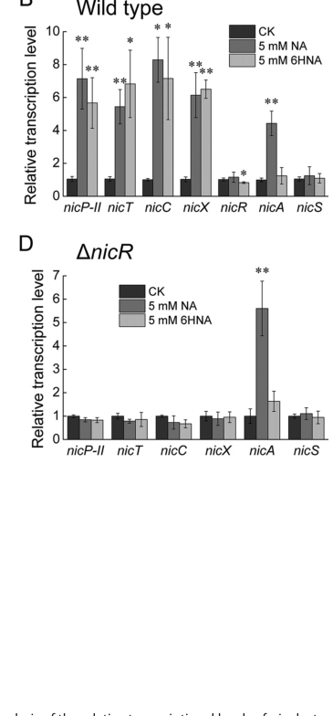

## Question

# Gene Research for Functional Annotation

## ⚠️ CRITICAL: Gene/Protein Identification Context

**BEFORE YOU BEGIN RESEARCH:** You MUST verify you are researching the CORRECT gene/protein. Gene symbols can be ambiguous, especially for less well-characterized genes from non-model organisms.

### Target Gene/Protein Identity (from UniProt):
- **UniProt Accession:** Q88FY0
- **Protein Description:** RecName: Full=HTH-type transcriptional repressor NicR; AltName: Full=Nicotinate degradation protein R;
- **Gene Information:** Name=nicR; OrderedLocusNames=PP_3946;
- **Organism (full):** Pseudomonas putida (strain ATCC 47054 / DSM 6125 / CFBP 8728 / NCIMB 11950 / KT2440).
- **Protein Family:** Not specified in UniProt
- **Key Domains:** HTH_MarR-typ. (IPR000835); MarR/SlyA-like. (IPR039422); WH-like_DNA-bd_sf. (IPR036388); WH_DNA-bd_sf. (IPR036390); MarR_2 (PF12802)

### MANDATORY VERIFICATION STEPS:

1. **Check if the gene symbol "nicR" matches the protein description above**
2. **Verify the organism is correct:** Pseudomonas putida (strain ATCC 47054 / DSM 6125 / CFBP 8728 / NCIMB 11950 / KT2440).
3. **Check if protein family/domains align with what you find in literature**
4. **If you find literature for a DIFFERENT gene with the same or similar symbol, STOP**

### If Gene Symbol is Ambiguous or You Cannot Find Relevant Literature:

**DO NOT PROCEED WITH RESEARCH ON A DIFFERENT GENE.** Instead:
- State clearly: "The gene symbol 'nicR' is ambiguous or literature is limited for this specific protein"
- Explain what you found (e.g., "Found extensive literature on a different gene with the same symbol in a different organism")
- Describe the protein based ONLY on the UniProt information provided above
- Suggest that the protein function can be inferred from domain/family information

### Research Target:

Please provide a comprehensive research report on the gene **nicR** (gene ID: nicR, UniProt: Q88FY0) in PSEPK.

The research report should be a detailed narrative explaining the function, biological processes, and localization of the gene product. Citations should be given for all claims.

You should prioritize authoritative reviews and primary scientific literature when conducting research. You can supplement
this with annotations you find in gene/protein databases, but these can be outdated or inaccurate.

We are specifically interested in the primary function of the gene - for enzymes, what reaction is catalyzed, and what is the substrate specificity? For transporters, what is the substrate? For structural proteins or adapters, what is the broader structural role? For signaling molecules, what is the role in the pathway.

We are interested in where in or outside the cell the gene product carries out its function.

We are also interested in the signaling or biochemical pathways in which the gene functions. We are less interested in broad pleiotropic effects, except where these elucidate the precise role.

Include evidence where possible. We are interested in both experimental evidence as well as inference from structure, evolution, or bioinformatic analysis. Precise studies should be prioritized over high-throughput, where available.

## Output

Question: You are an expert researcher providing comprehensive, well-cited information.

Provide detailed information focusing on:
1. Key concepts and definitions with current understanding
2. Recent developments and latest research (prioritize 2023-2024 sources)
3. Current applications and real-world implementations
4. Expert opinions and analysis from authoritative sources
5. Relevant statistics and data from recent studies

Format as a comprehensive research report with proper citations. Include URLs and publication dates where available.
Always prioritize recent, authoritative sources and provide specific citations for all major claims.

# Gene Research for Functional Annotation

## ⚠️ CRITICAL: Gene/Protein Identification Context

**BEFORE YOU BEGIN RESEARCH:** You MUST verify you are researching the CORRECT gene/protein. Gene symbols can be ambiguous, especially for less well-characterized genes from non-model organisms.

### Target Gene/Protein Identity (from UniProt):
- **UniProt Accession:** Q88FY0
- **Protein Description:** RecName: Full=HTH-type transcriptional repressor NicR; AltName: Full=Nicotinate degradation protein R;
- **Gene Information:** Name=nicR; OrderedLocusNames=PP_3946;
- **Organism (full):** Pseudomonas putida (strain ATCC 47054 / DSM 6125 / CFBP 8728 / NCIMB 11950 / KT2440).
- **Protein Family:** Not specified in UniProt
- **Key Domains:** HTH_MarR-typ. (IPR000835); MarR/SlyA-like. (IPR039422); WH-like_DNA-bd_sf. (IPR036388); WH_DNA-bd_sf. (IPR036390); MarR_2 (PF12802)

### MANDATORY VERIFICATION STEPS:

1. **Check if the gene symbol "nicR" matches the protein description above**
2. **Verify the organism is correct:** Pseudomonas putida (strain ATCC 47054 / DSM 6125 / CFBP 8728 / NCIMB 11950 / KT2440).
3. **Check if protein family/domains align with what you find in literature**
4. **If you find literature for a DIFFERENT gene with the same or similar symbol, STOP**

### If Gene Symbol is Ambiguous or You Cannot Find Relevant Literature:

**DO NOT PROCEED WITH RESEARCH ON A DIFFERENT GENE.** Instead:
- State clearly: "The gene symbol 'nicR' is ambiguous or literature is limited for this specific protein"
- Explain what you found (e.g., "Found extensive literature on a different gene with the same symbol in a different organism")
- Describe the protein based ONLY on the UniProt information provided above
- Suggest that the protein function can be inferred from domain/family information

### Research Target:

Please provide a comprehensive research report on the gene **nicR** (gene ID: nicR, UniProt: Q88FY0) in PSEPK.

The research report should be a detailed narrative explaining the function, biological processes, and localization of the gene product. Citations should be given for all claims.

You should prioritize authoritative reviews and primary scientific literature when conducting research. You can supplement
this with annotations you find in gene/protein databases, but these can be outdated or inaccurate.

We are specifically interested in the primary function of the gene - for enzymes, what reaction is catalyzed, and what is the substrate specificity? For transporters, what is the substrate? For structural proteins or adapters, what is the broader structural role? For signaling molecules, what is the role in the pathway.

We are interested in where in or outside the cell the gene product carries out its function.

We are also interested in the signaling or biochemical pathways in which the gene functions. We are less interested in broad pleiotropic effects, except where these elucidate the precise role.

Include evidence where possible. We are interested in both experimental evidence as well as inference from structure, evolution, or bioinformatic analysis. Precise studies should be prioritized over high-throughput, where available.

## Research report: Functional annotation of **nicR** (UniProt Q88FY0; PP_3946) in *Pseudomonas putida* KT2440

### 1) Gene/protein identity verification (disambiguation)

**Target confirmed:** The UniProt accession **Q88FY0** corresponds to **NicR**, annotated as an **HTH-type transcriptional repressor NicR** in *Pseudomonas putida* strain KT2440 (ordered locus **PP_3946**) and located in the **nicotinic acid (nicotinate; NA) catabolic gene cluster**. This NicR is a **MarR-family** regulator and is **distinct from “NicR2”** described in *P. putida* S16 that controls a nicotine-degradation gene cluster (nic2) (and is not functionally interchangeable with KT2440 nic promoters). (wang2014anunusualrepressor pages 13-14, wang2014anunusualrepressor pages 1-2)

### 2) Key concepts and definitions (current understanding)

#### 2.1 Nicotinate catabolism in bacteria (maleamate pathway)
In *P. putida* KT2440, **aerobic nicotinic acid (NA) degradation** proceeds via the **maleamate pathway**, generating **fumarate** (a TCA-cycle intermediate). A core pathway map described for KT2440 is:

**NA → 6-hydroxynicotinic acid (6HNA) → 2,5-dihydroxypyridine (2,5-DHP) → N-formylmaleamic acid (NFM) → maleamate → maleate → fumarate**. (jimenez2008decipheringthegenetic pages 1-2)

#### 2.2 Transcriptional repression by MarR-family regulators
MarR-family regulators are typically **homodimeric winged-helix (wHTH) DNA-binding proteins** that frequently act as **repressors**. They are commonly regulated by **small-molecule ligands** and environmental signals that allosterically reduce DNA binding, causing **derepression**. Reviews emphasize broad ligand diversity (aromatics such as salicylate/protocatechuate; metabolites such as urate; metals; oxidants) and multiple allosteric mechanisms (often involving ligand binding at dimer interfaces and/or cysteine oxidation). (nazaret2023marrfamilytranscriptional pages 1-2, nazaret2023marrfamilytranscriptional pages 2-4, capdevila2024bacterialmetallostasismetal pages 24-25)

### 3) NicR function in *P. putida* KT2440: pathway role, regulon context, and mechanism

#### 3.1 Genetic context: the *nic* cluster and encoded catabolic functions
A KT2440 genomic analysis and genetics/biochemistry study identified a dedicated *nic* gene cluster ordered as **nicTPFEDCXRAB** and showed it is required for aerobic NA utilization. Knockouts of **nicA, nicB, nicC, nicD, or nicX** prevented growth on NA as the sole carbon source, supporting that the cluster encodes the functional NA catabolic pathway. (jimenez2008decipheringthegenetic pages 1-2)

Within this cluster:
- **NicAB**: a two-component NA hydroxylase converting NA to 6HNA (jimenez2008decipheringthegenetic pages 2-3)
- **NicC**: 6HNA monooxygenase catalyzing oxidative decarboxylation (6HNA → 2,5-DHP) (jimenez2008decipheringthegenetic pages 3-4)
- **NicX**: Fe(II)-dependent dioxygenase opening the 2,5-DHP ring to NFM (jimenez2008decipheringthegenetic pages 4-5)
- **NicD**: N-formylmaleamate deformylase yielding formate + maleamate (jimenez2008decipheringthegenetic pages 5-6)
- **NicF/NicE**: last steps to fumarate via maleamate amidohydrolase and maleate isomerase (jimenez2008decipheringthegenetic pages 5-6)
- **nicP/nicT** encode transport-related proteins (porin/permease) associated with NA uptake. (jimenez2008decipheringthegenetic pages 1-2)

Later summaries describe functional transcriptional units such as **nicAB**, **nicCDEFTP**, and **nicXR**, and indicate that regulation involves **at least two repressors, NicS and NicR**. (das2023nicotinicacidcatabolism pages 1-2, brickman2018thebordetellabronchiseptica pages 1-2)

#### 3.2 Primary function of NicR (Q88FY0): transcriptional repression of nicC/nicX operons
Experimental evidence in KT2440 shows that **NicR functions as a transcriptional repressor of the nicC and nicX operons**.

- **Induction logic:** In the presence of NA/6HNA, **nicC and nicX** are induced in wild type but **not induced in a nicR mutant**, supporting NicR-dependent regulation of inducible expression. (xiao2018finrregulatesexpression pages 6-8)
- **Direct DNA binding:** Purified NicR binds promoter DNA upstream of **nicC** and **nicX** in vitro (EMSA), and **DNase I footprinting mapped NicR-protected sequences** on both promoters. (xiao2018finrregulatesexpression pages 6-8)

#### 3.3 NicR DNA-binding sites (operator-like elements)
DNase I footprinting identified NicR-protected sequences:
- **nicC promoter:** **GATTTAGAGCGTATACGCTA**
- **nicX promoter:** **AAGTAGGGTGTACACACTAT**

These protected regions are the best available experimentally mapped DNA binding elements for KT2440 NicR in the retrieved literature. (xiao2018finrregulatesexpression pages 6-8)

Figure-based evidence for induction and mapped protection is shown in Xiao et al. (2018) Figures 4–5. (xiao2018finrregulatesexpression media 08ca10f8, xiao2018finrregulatesexpression media 05a1f1f6, xiao2018finrregulatesexpression media 2baf848d)

#### 3.4 Inducers/effectors: NA and 6HNA, with 6HNA as physiological inducer for NicR-controlled operons
Multiple sources support that **NA and/or 6HNA act as inducers** of the nicotinate pathway; specifically, regulatory work in KT2440 indicates **6HNA is the physiological inducer** for the NicR-repressed **nicC/nicX** operons. (xiao2018finrregulatesexpression pages 8-10)

In Xiao et al. (2018), induction experiments used **5 mM NA or 5 mM 6HNA**, with results presented as mean ± SD from **three independent assays** and significance thresholds **P < 0.05 / P < 0.01**. (xiao2018finrregulatesexpression pages 6-8, xiao2018finrregulatesexpression pages 8-10)

#### 3.5 Regulatory network integration: cooperation with FinR
A KT2440 study of **FinR** (a LysR-type regulator) demonstrated that:
- FinR **positively regulates** nicC and nicX operons.
- **FinR deletion weakens induction** of nicC/nicX in the presence of NA/6HNA and impairs growth on NA/6HNA.
- Both **FinR and NicR bind** the nicC and nicX promoter regions in vitro.
- NicR repression is the “chief” regulatory input for nicC/nicX, while FinR is required for full induction. (xiao2018finrregulatesexpression pages 8-10, xiao2018finrregulatesexpression pages 6-8)

Quantitative transcriptomic context from this FinR study includes **189 genes** changed at |log2FC| ≥ 1 and **56 genes** at |log2FC| ≥ 2, and an initial call of **26 operons** altered >4-fold in the finR mutant analysis. (xiao2018finrregulatesexpression pages 2-3)

### 4) Cellular localization and where NicR acts

No subcellular localization experiment for NicR was identified in the retrieved texts. However, NicR’s **direct binding to promoter DNA** (EMSA/footprinting) and its classification as a **MarR-family transcription factor** support that it functions **intracellularly** in the **cytosol/nucleoid-associated compartment** to regulate transcription initiation at target promoters. (xiao2018finrregulatesexpression pages 6-8, xiao2018finrregulatesexpression pages 8-10, capdevila2024bacterialmetallostasismetal pages 24-25)

### 5) Recent developments (2023–2024) relevant to NicR/MarR regulators and nicotinate catabolism

Because KT2440 NicR itself has limited new primary publications in 2023–2024 within the retrieved corpus, recent advances are best captured through (i) **new mechanistic work on pathway enzymes** and (ii) **MarR-family regulatory/engineering advances**.

#### 5.1 2023 enzyme-mechanism advance: NicC kinetic mechanism (KT2440)
A 2023 Biochemistry study performed global transient-state kinetic analysis of **KT2440 NicC** (6-hydroxynicotinate 3-monooxygenase), which catalyzes a **decarboxylative hydroxylation** converting **6HNA → 2,5-DHP**. (perkins2023mechanismofthe pages 1-2)

Selected quantitative findings include:
- **Two-step substrate binding** with reported microscopic parameters (e.g., **Kd1 = 2.3 mM**, **k2 = 110 s−1**, **k−2 = 21 s−1**) and tighter net binding in the post-isomerization state (reported Kd,net values in the ~0.09–0.37 mM range across analyses). (perkins2023mechanismofthe pages 6-7)
- **High coupling efficiency:** **0.905 ± 0.002 mol 2,5-DHP per mol NADH**; **uncoupling** was low at **0.096 ± 0.02 mol H2O2 per mol NADH** (~10%). (perkins2023mechanismofthe pages 11-12)
- The mechanism proceeds via **C4a-hydroperoxy-FAD** and **C4a-hydroxy-FAD** intermediates; global analysis suggests steady-state turnover is partially limited by **substrate hydroxylation** and **C4a-hydroxy-FAD dehydration**. (perkins2023mechanismofthe pages 12-13)

These results deepen the mechanistic understanding of a key step that is transcriptionally controlled upstream by NicR-regulated operons.

#### 5.2 2023–2024 MarR-family mechanistic synthesis (authoritative reviews)
A 2023 review of MarR regulators in plant-interacting bacteria and a 2024 Chemical Reviews metallostasis synthesis highlight:
- Ligand-binding diversity and variable stoichiometries (e.g., examples of **multiple salicylate molecules per dimer**, up to **eight per dimer** in one cited system), emphasizing the complexity of MarR allostery. (nazaret2023marrfamilytranscriptional pages 2-4)
- Structural versatility: triangular homodimer scaffold, winged-helix DNA binding, and multiple mechanisms for allosteric inhibition/derepression including cysteine oxidation. (capdevila2024bacterialmetallostasismetal pages 24-25)

Although not NicR-specific, these authoritative sources contextualize NicR as a canonical MarR-like repressor likely subject to ligand-mediated derepression by nicotinate pathway intermediates (e.g., 6HNA).

#### 5.3 2024 structural advance in MarR-superfamily effector response
A 2024 Nucleic Acids Research paper on the MarR-superfamily UrtR regulators (urate-responsive) synthesizes multiple structural paradigms for effector-mediated DNA dissociation across MarR-like proteins and highlights that effector mechanisms can differ substantially from “global shift” models. (song2024structuralbasisof pages 14-14)

#### 5.4 2024 synthetic biology advance: mining ligand-inducible regulators (including MarR) for biosensors
Snowprint (Communications Biology, 2024) provides a computational pipeline for predicting regulator–operator pairs from a single protein identifier and demonstrated high functional success rates:
- Correct/near-correct operator predictions for **67 of 147** experimentally validated pairs (>45%) across multiple regulator families, including **MarR**. (d’oelsnitz2024snowprintapredictive pages 1-2)
- In E. coli, among 33 tested circuits, **28/33** reduced reporter expression by ≥50%, and **24/33** produced >20-fold dynamic range (top 24 had average dynamic range ~64-fold). (d’oelsnitz2024snowprintapredictive pages 4-5)
- Ligand screens yielded new sensors with induction ratios up to **10.7-fold** and specific examples of responsive ligands (olivetolic acid, geraniol, ursodiol, tetrahydropapaverine). (d’oelsnitz2024snowprintapredictive pages 5-7)

This is directly relevant to NicR-like regulators as parts of programmable catabolic control modules and biosensors.

### 6) Current applications and real-world implementations

#### 6.1 Biocatalytic synthesis of 6-hydroxynicotinic acid and related pyridine intermediates
A 2023 critical review describes nicotinate dehydrogenase / nicotinic acid hydroxylase (NDHase; EC 1.17.1.5) as an industrially relevant catalyst for regioselective hydroxylation of nicotinic acid and other pyridines, generating intermediates (e.g., **6HNA**, **3-cyano-6-hydroxypyridine**) used in **neonicotinoid pesticide** manufacturing. (chen2023sourcescomponentsstructure pages 2-3, chen2023sourcescomponentsstructure pages 6-7)

Reported implementation examples include:
- A cited “double catalytic coupling” process producing **50.38 g/L** 6-hydroxynicotinic acid and **5.77 g/L** 3-cyano-6-hydroxypyridine under described coupled conditions. (chen2023sourcescomponentsstructure pages 6-7)
- Mention of industrial commercialization of a biocatalytic route (Mitsubishi) for pyridine derivative production. (chen2023sourcescomponentsstructure pages 7-8, chen2023sourcescomponentsstructure pages 6-7)

While NDHase is distinct from NicR, **NicR-controlled nicotinate catabolism** shares intermediates (NA/6HNA) and highlights why tight transcriptional control is beneficial (balancing catabolic flux with NAD precursor homeostasis). (das2023nicotinicacidcatabolism pages 1-2)

#### 6.2 Wastewater treatment and bioremediation of N-heterocycles
The NDHase review emphasizes applications in **wastewater treatment**, where NDHase-producing strains can enhance removal of N-heterocyclic contaminants; it cites an example of **650 mg/L 6-methylquinoline degraded within 24 h at 28°C** by a *Pseudomonas putida* strain (QP2). (chen2023sourcescomponentsstructure pages 7-8)

#### 6.3 Practical use in metabolic engineering and regulatory circuit design
MarR-family regulators are increasingly mined/repurposed as **ligand-inducible switches** for engineered metabolism. Snowprint provides an example of scaling this discovery and domestication process, enabling faster translation of catabolic regulators (conceptually including NicR-like repressors) into biosensors and dynamic control systems. (d’oelsnitz2024snowprintapredictive pages 4-5, d’oelsnitz2024snowprintapredictive pages 5-7)

### 7) Expert opinions and analysis (authoritative synthesis)

1. **NicR as a canonical MarR-type derepressible repressor:** Primary KT2440 data support NicR as the main repressive input on nicC/nicX, with derepression by NA/6HNA and mapped operator-like sequences at both promoters. (xiao2018finrregulatesexpression pages 6-8, xiao2018finrregulatesexpression pages 8-10)
2. **Regulatory layering is common in catabolism:** FinR’s activating role illustrates a multi-regulator architecture—repression via NicR plus activation via FinR—consistent with systems-level control patterns often observed in bacterial catabolic networks. (xiao2018finrregulatesexpression pages 8-10)
3. **MarR family allostery is mechanistically diverse:** 2023–2024 reviews emphasize that MarR ligand response is not monolithic; different MarR-like regulators can show different binding stoichiometries and distinct allosteric pathways, implying that NicR’s NA/6HNA response may involve a specific structural mechanism that could be elucidated by future structural work. (nazaret2023marrfamilytranscriptional pages 2-4, capdevila2024bacterialmetallostasismetal pages 24-25)

### 8) Key statistics and data points (recent and foundational)

- **NicR binding sites (DNase I footprinting):** nicC: GATTTAGAGCGTATACGCTA; nicX: AAGTAGGGTGTACACACTAT. (xiao2018finrregulatesexpression pages 6-8)
- **Inducer concentrations in KT2440 regulatory assays:** **5 mM NA or 5 mM 6HNA**; **n=3** independent RT-qPCR assays; significance markers at **P < 0.05 / P < 0.01**. (xiao2018finrregulatesexpression pages 6-8, xiao2018finrregulatesexpression pages 8-10)
- **Transcriptomic scope (FinR study):** 189 genes |log2FC| ≥ 1; 56 genes |log2FC| ≥ 2; initial call of 26 operons >4-fold. (xiao2018finrregulatesexpression pages 2-3)
- **NicC kinetic/mechanistic parameters (2023):** examples include Kd1=2.3 mM; k2=110 s−1; k−2=21 s−1; coupling 0.905 mol product/mol NADH; ~10% uncoupling to H2O2. (perkins2023mechanismofthe pages 6-7, perkins2023mechanismofthe pages 11-12)
- **Snowprint (2024) quantitative outcomes:** 67/147 operator predictions correct/similar; 24/33 engineered circuits with >20-fold dynamic range; induction ratios up to 10.7-fold for new sensors. (d’oelsnitz2024snowprintapredictive pages 1-2, d’oelsnitz2024snowprintapredictive pages 4-5, d’oelsnitz2024snowprintapredictive pages 5-7)
- **NDHase application metrics (reviewed 2023):** example of 650 mg/L 6-methylquinoline degraded in 24 h at 28°C; example titers 50.38 g/L 6-hydroxynicotinic acid and 5.77 g/L 3-cyano-6-hydroxypyridine (cited in review). (chen2023sourcescomponentsstructure pages 7-8, chen2023sourcescomponentsstructure pages 6-7)

### 9) Summary of NicR functional annotation (actionable statement)

**NicR (UniProt Q88FY0; PP_3946) is an intracellular MarR-family HTH transcriptional repressor that directly binds operator-like sequences in the nicC and nicX promoter regions to repress expression of the downstream aerobic nicotinate (nicotinic acid) degradation machinery. Pathway intermediates (notably 6-hydroxynicotinic acid) act as inducers that relieve repression, enabling NA catabolism to fumarate.** (xiao2018finrregulatesexpression pages 6-8, xiao2018finrregulatesexpression pages 8-10, jimenez2008decipheringthegenetic pages 1-2)

---

### Evidence summary table

| Category | Finding | Evidence / quantitative details | Key source(s) |
|---|---|---|---|
| Target identity | **NicR** in *Pseudomonas putida* KT2440 corresponds to **UniProt Q88FY0**, gene **nicR**, locus **PP_3946**; it is the nicotinate-pathway regulator and should not be confused with nicotine-pathway **NicR2** from *P. putida* S16. | KT2440 papers and comparative studies distinguish KT2440 NicR from S16 NicR2 and place NicR in the nicotinate-degradation locus. (wang2014anunusualrepressor pages 13-14, brickman2018thebordetellabronchiseptica pages 3-3) | Jiménez et al., 2008, https://doi.org/10.1073/pnas.0802273105; Wang et al., 2014, https://doi.org/10.1111/mmi.12533; Brickman & Armstrong, 2018, https://doi.org/10.1111/mmi.13943 |
| Protein family / domains | **MarR-family** transcription factor with **HTH / winged-helix DNA-binding** architecture, consistent with the supplied UniProt/interpro context. | MarR-family assignment is explicitly reported for KT2440 NicR and aligns with homologous nic-pathway repressors. (wang2014anunusualrepressor pages 13-14, brickman2018thebordetellabronchiseptica pages 3-3) | Wang et al., 2014, https://doi.org/10.1111/mmi.12533; Jiménez et al., 2008, https://doi.org/10.1073/pnas.0802273105 |
| Primary function | **DNA-binding transcriptional repressor** of the **nicC** and **nicX** operons in aerobic **nicotinic acid (NA) degradation**. | Supported by promoter binding, footprinting, and induction/derepression experiments. (xiao2018finrregulatesexpression pages 6-8, xiao2018finrregulatesexpression pages 8-10, xiao2018finrregulatesexpression pages 1-2, das2023nicotinicacidcatabolism pages 1-2) | Xiao et al., 2018, https://doi.org/10.1128/AEM.01210-18; Das et al., 2023, https://doi.org/10.1128/spectrum.04457-22 |
| Pathway role | NicR acts in the **aerobic nicotinate catabolic pathway**: **NA → 6HNA → 2,5-DHP → N-formylmaleamate → maleamate → maleate → fumarate**. | The KT2440 nic cluster was experimentally defined as the pathway for aerobic NA degradation; structural-gene knockouts abolished growth on NA. (jimenez2008decipheringthegenetic pages 1-2) | Jiménez et al., 2008, https://doi.org/10.1073/pnas.0802273105 |
| Cluster / operon context | Canonical cluster reported as **nicTPFEDCXRAB**; later regulatory work describes functional organization as **nicAB**, **nicCDEFTP**, and **nicXR**. **NicR** represses **nicC/nicX**; **NicS** represses **nicAB**. | Cluster order and gene content were defined in the PNAS study; later summaries describe the three-operon organization and regulator split. (jimenez2008decipheringthegenetic pages 1-2, das2023nicotinicacidcatabolism pages 1-2, brickman2018thebordetellabronchiseptica pages 1-2, xiao2018finrregulatesexpression pages 1-2) | Jiménez et al., 2008, https://doi.org/10.1073/pnas.0802273105; Brickman & Armstrong, 2018, https://doi.org/10.1111/mmi.13943; Das et al., 2023, https://doi.org/10.1128/spectrum.04457-22 |
| Effectors / inducers | **NA and 6HNA** induce nic-pathway expression; **6HNA** is reported as the **physiological inducer** for NicR-controlled **nicC/nicX** regulation. | In KT2440, induction assays used **5 mM NA** or **5 mM 6HNA**. nicA responds to **NA but not 6HNA**, consistent with separate NicS control. (xiao2018finrregulatesexpression pages 6-8, xiao2018finrregulatesexpression pages 8-10, wang2014anunusualrepressor pages 13-14, brickman2018thebordetellabronchiseptica pages 1-2) | Xiao et al., 2018, https://doi.org/10.1128/AEM.01210-18; Wang et al., 2014, https://doi.org/10.1111/mmi.12533; Brickman & Armstrong, 2018, https://doi.org/10.1111/mmi.13943 |
| DNA binding sites | **nicC promoter** protected sequence: **GATTTAGAGCGTATACGCTA**; **nicX promoter** protected sequence: **AAGTAGGGTGTACACACTAT**. | Identified by **DNase I footprinting**; direct binding to both promoters was also shown by **EMSA**. (xiao2018finrregulatesexpression pages 6-8, xiao2018finrregulatesexpression pages 8-10) | Xiao et al., 2018, https://doi.org/10.1128/AEM.01210-18 |
| Regulatory mechanism | NicR provides the major **repressive** input on **nicC/nicX**; **FinR** provides a positive input required for full induction. Both proteins bind the two promoters. | In wild type and ΔfinR, **nicC/nicX** were induced by NA/6HNA; induction was not observed in ΔnicR or ΔfinRΔnicR under the reported conditions. ΔfinR weakened induction, and ΔfinRΔnicR expression was higher than WT but lower than ΔnicR. (xiao2018finrregulatesexpression pages 6-8, xiao2018finrregulatesexpression pages 8-10) | Xiao et al., 2018, https://doi.org/10.1128/AEM.01210-18 |
| Cellular localization / site of action | **Intracellular, cytosolic/nucleoid-associated transcription regulator** acting at promoter DNA; no evidence supports membrane or extracellular localization. | In vitro promoter binding and MarR-family regulator architecture support an intracellular DNA-binding role. (xiao2018finrregulatesexpression pages 6-8, brickman2018thebordetellabronchiseptica pages 3-3) | Xiao et al., 2018, https://doi.org/10.1128/AEM.01210-18; Jiménez et al., 2008, https://doi.org/10.1073/pnas.0802273105 |
| Key evidence types | Functional annotation is supported by **gene deletion**, **RT-qPCR**, **growth assays on NA/6HNA**, **EMSA**, and **DNase I footprinting**. | ΔfinR impaired growth on NA/6HNA and reduced **nicC/nicX** expression; NicR and FinR both shifted promoter DNA in EMSA; NicR footprints were mapped at both promoters. (xiao2018finrregulatesexpression pages 6-8, xiao2018finrregulatesexpression pages 1-2, xiao2018finrregulatesexpression pages 8-10) | Xiao et al., 2018, https://doi.org/10.1128/AEM.01210-18 |
| Quantitative / statistical details | In the **finR** RNA-seq study, **189 genes** changed at **\|log2FC\| ≥ 1**, **56 genes** at **\|log2FC\| ≥ 2**, and **26 operons** were initially called as **>4-fold** changed. Figure 4 induction assays used **5 mM NA/6HNA**, **n = 3 independent assays**, with **\* P < 0.05** and **\*\* P < 0.01**. | These are the clearest quantitative data available from the KT2440 NicR/FinR regulatory study. (xiao2018finrregulatesexpression pages 2-3, xiao2018finrregulatesexpression pages 6-8, xiao2018finrregulatesexpression pages 8-10) | Xiao et al., 2018, https://doi.org/10.1128/AEM.01210-18 |
| Disambiguation note | KT2440 **NicR** is the **nicotinate-pathway** MarR-family regulator; **NicR2** from *P. putida* S16 is a different **nicotine-pathway** regulator with different promoter specificity and regulatory behavior. | Cross-pathway comparisons explicitly state that KT2440 NicR and S16 NicR2 are distinct and not cross-functional. (wang2014anunusualrepressor pages 13-14, wang2014anunusualrepressor pages 1-2) | Wang et al., 2014, https://doi.org/10.1111/mmi.12533 |

*Table: This table summarizes the experimentally supported functional annotation of NicR (Q88FY0/PP_3946) in Pseudomonas putida KT2440, including identity, pathway role, effectors, DNA-binding sites, and evidence. It is useful as a compact reference linking the main biological claims to the primary literature and quantitative details.*

### Key figure evidence (cropped from primary paper)

- Induction of nic genes by NA/6HNA and NicR footprinting sites in nicC/nicX promoters: (xiao2018finrregulatesexpression media 08ca10f8, xiao2018finrregulatesexpression media 05a1f1f6, xiao2018finrregulatesexpression media 2baf848d)

References

1. (wang2014anunusualrepressor pages 13-14): Lijuan Wang, Hongzhi Tang, Hao Yu, Yuxiang Yao, and Ping Xu. An unusual repressor controls the expression of a crucial nicotine‐degrading gene cluster in pseudomonas putida s16. Molecular Microbiology, 91:1252-1269, Mar 2014. URL: https://doi.org/10.1111/mmi.12533, doi:10.1111/mmi.12533. This article has 37 citations and is from a domain leading peer-reviewed journal.

2. (wang2014anunusualrepressor pages 1-2): Lijuan Wang, Hongzhi Tang, Hao Yu, Yuxiang Yao, and Ping Xu. An unusual repressor controls the expression of a crucial nicotine‐degrading gene cluster in pseudomonas putida s16. Molecular Microbiology, 91:1252-1269, Mar 2014. URL: https://doi.org/10.1111/mmi.12533, doi:10.1111/mmi.12533. This article has 37 citations and is from a domain leading peer-reviewed journal.

3. (jimenez2008decipheringthegenetic pages 1-2): José I. Jiménez, Ángeles Canales, Jesús Jiménez-Barbero, Krzysztof Ginalski, Leszek Rychlewski, José L. García, and Eduardo Díaz. Deciphering the genetic determinants for aerobic nicotinic acid degradation: the nic cluster from pseudomonas putida kt2440. Proceedings of the National Academy of Sciences, 105:11329-11334, Aug 2008. URL: https://doi.org/10.1073/pnas.0802273105, doi:10.1073/pnas.0802273105. This article has 173 citations and is from a highest quality peer-reviewed journal.

4. (nazaret2023marrfamilytranscriptional pages 1-2): Fanny Nazaret, Geneviève Alloing, Karine Mandon, and Pierre Frendo. Marr family transcriptional regulators and their roles in plant-interacting bacteria. Microorganisms, 11:1936, Jul 2023. URL: https://doi.org/10.3390/microorganisms11081936, doi:10.3390/microorganisms11081936. This article has 14 citations.

5. (nazaret2023marrfamilytranscriptional pages 2-4): Fanny Nazaret, Geneviève Alloing, Karine Mandon, and Pierre Frendo. Marr family transcriptional regulators and their roles in plant-interacting bacteria. Microorganisms, 11:1936, Jul 2023. URL: https://doi.org/10.3390/microorganisms11081936, doi:10.3390/microorganisms11081936. This article has 14 citations.

6. (capdevila2024bacterialmetallostasismetal pages 24-25): Daiana A. Capdevila, Johnma J. Rondón, Katherine A. Edmonds, Joseph S. Rocchio, Matias Villarruel Dujovne, and David P. Giedroc. Bacterial metallostasis: metal sensing, metalloproteome remodeling, and metal trafficking. Chemical Reviews, 124:13574-13659, Dec 2024. URL: https://doi.org/10.1021/acs.chemrev.4c00264, doi:10.1021/acs.chemrev.4c00264. This article has 44 citations and is from a highest quality peer-reviewed journal.

7. (jimenez2008decipheringthegenetic pages 2-3): José I. Jiménez, Ángeles Canales, Jesús Jiménez-Barbero, Krzysztof Ginalski, Leszek Rychlewski, José L. García, and Eduardo Díaz. Deciphering the genetic determinants for aerobic nicotinic acid degradation: the nic cluster from pseudomonas putida kt2440. Proceedings of the National Academy of Sciences, 105:11329-11334, Aug 2008. URL: https://doi.org/10.1073/pnas.0802273105, doi:10.1073/pnas.0802273105. This article has 173 citations and is from a highest quality peer-reviewed journal.

8. (jimenez2008decipheringthegenetic pages 3-4): José I. Jiménez, Ángeles Canales, Jesús Jiménez-Barbero, Krzysztof Ginalski, Leszek Rychlewski, José L. García, and Eduardo Díaz. Deciphering the genetic determinants for aerobic nicotinic acid degradation: the nic cluster from pseudomonas putida kt2440. Proceedings of the National Academy of Sciences, 105:11329-11334, Aug 2008. URL: https://doi.org/10.1073/pnas.0802273105, doi:10.1073/pnas.0802273105. This article has 173 citations and is from a highest quality peer-reviewed journal.

9. (jimenez2008decipheringthegenetic pages 4-5): José I. Jiménez, Ángeles Canales, Jesús Jiménez-Barbero, Krzysztof Ginalski, Leszek Rychlewski, José L. García, and Eduardo Díaz. Deciphering the genetic determinants for aerobic nicotinic acid degradation: the nic cluster from pseudomonas putida kt2440. Proceedings of the National Academy of Sciences, 105:11329-11334, Aug 2008. URL: https://doi.org/10.1073/pnas.0802273105, doi:10.1073/pnas.0802273105. This article has 173 citations and is from a highest quality peer-reviewed journal.

10. (jimenez2008decipheringthegenetic pages 5-6): José I. Jiménez, Ángeles Canales, Jesús Jiménez-Barbero, Krzysztof Ginalski, Leszek Rychlewski, José L. García, and Eduardo Díaz. Deciphering the genetic determinants for aerobic nicotinic acid degradation: the nic cluster from pseudomonas putida kt2440. Proceedings of the National Academy of Sciences, 105:11329-11334, Aug 2008. URL: https://doi.org/10.1073/pnas.0802273105, doi:10.1073/pnas.0802273105. This article has 173 citations and is from a highest quality peer-reviewed journal.

11. (das2023nicotinicacidcatabolism pages 1-2): Joyati Das, Rahul Kumar, Sunil Kumar Yadav, and Gopaljee Jha. Nicotinic acid catabolism modulates bacterial mycophagy in burkholderia gladioli strain ngj1. Microbiology Spectrum, Jun 2023. URL: https://doi.org/10.1128/spectrum.04457-22, doi:10.1128/spectrum.04457-22. This article has 6 citations and is from a domain leading peer-reviewed journal.

12. (brickman2018thebordetellabronchiseptica pages 1-2): Timothy J. Brickman and Sandra K. Armstrong. The bordetella bronchiseptica nic locus encodes a nicotinic acid degradation pathway and the 6‐hydroxynicotinate‐responsive regulator bpsr. Molecular Microbiology, 108:397-409, May 2018. URL: https://doi.org/10.1111/mmi.13943, doi:10.1111/mmi.13943. This article has 13 citations and is from a domain leading peer-reviewed journal.

13. (xiao2018finrregulatesexpression pages 6-8): Yujie Xiao, Wenjing Zhu, Huizhong Liu, Hailing Nie, Wenli Chen, and Qiaoyun Huang. Finr regulates expression of <i>nicc</i> and <i>nicx</i> operons, involved in nicotinic acid degradation in pseudomonas putida kt2440. Applied and Environmental Microbiology, Oct 2018. URL: https://doi.org/10.1128/aem.01210-18, doi:10.1128/aem.01210-18. This article has 10 citations and is from a peer-reviewed journal.

14. (xiao2018finrregulatesexpression media 08ca10f8): Yujie Xiao, Wenjing Zhu, Huizhong Liu, Hailing Nie, Wenli Chen, and Qiaoyun Huang. Finr regulates expression of <i>nicc</i> and <i>nicx</i> operons, involved in nicotinic acid degradation in pseudomonas putida kt2440. Applied and Environmental Microbiology, Oct 2018. URL: https://doi.org/10.1128/aem.01210-18, doi:10.1128/aem.01210-18. This article has 10 citations and is from a peer-reviewed journal.

15. (xiao2018finrregulatesexpression media 05a1f1f6): Yujie Xiao, Wenjing Zhu, Huizhong Liu, Hailing Nie, Wenli Chen, and Qiaoyun Huang. Finr regulates expression of <i>nicc</i> and <i>nicx</i> operons, involved in nicotinic acid degradation in pseudomonas putida kt2440. Applied and Environmental Microbiology, Oct 2018. URL: https://doi.org/10.1128/aem.01210-18, doi:10.1128/aem.01210-18. This article has 10 citations and is from a peer-reviewed journal.

16. (xiao2018finrregulatesexpression media 2baf848d): Yujie Xiao, Wenjing Zhu, Huizhong Liu, Hailing Nie, Wenli Chen, and Qiaoyun Huang. Finr regulates expression of <i>nicc</i> and <i>nicx</i> operons, involved in nicotinic acid degradation in pseudomonas putida kt2440. Applied and Environmental Microbiology, Oct 2018. URL: https://doi.org/10.1128/aem.01210-18, doi:10.1128/aem.01210-18. This article has 10 citations and is from a peer-reviewed journal.

17. (xiao2018finrregulatesexpression pages 8-10): Yujie Xiao, Wenjing Zhu, Huizhong Liu, Hailing Nie, Wenli Chen, and Qiaoyun Huang. Finr regulates expression of <i>nicc</i> and <i>nicx</i> operons, involved in nicotinic acid degradation in pseudomonas putida kt2440. Applied and Environmental Microbiology, Oct 2018. URL: https://doi.org/10.1128/aem.01210-18, doi:10.1128/aem.01210-18. This article has 10 citations and is from a peer-reviewed journal.

18. (xiao2018finrregulatesexpression pages 2-3): Yujie Xiao, Wenjing Zhu, Huizhong Liu, Hailing Nie, Wenli Chen, and Qiaoyun Huang. Finr regulates expression of <i>nicc</i> and <i>nicx</i> operons, involved in nicotinic acid degradation in pseudomonas putida kt2440. Applied and Environmental Microbiology, Oct 2018. URL: https://doi.org/10.1128/aem.01210-18, doi:10.1128/aem.01210-18. This article has 10 citations and is from a peer-reviewed journal.

19. (perkins2023mechanismofthe pages 1-2): Scott W. Perkins, May Z. Hlaing, Katherine A. Hicks, Lauren J. Rajakovich, and Mark J. Snider. Mechanism of the multistep catalytic cycle of 6-hydroxynicotinate 3-monooxygenase revealed by global kinetic analysis. Biochemistry, 62:1553-1567, May 2023. URL: https://doi.org/10.1021/acs.biochem.2c00514, doi:10.1021/acs.biochem.2c00514. This article has 4 citations and is from a peer-reviewed journal.

20. (perkins2023mechanismofthe pages 6-7): Scott W. Perkins, May Z. Hlaing, Katherine A. Hicks, Lauren J. Rajakovich, and Mark J. Snider. Mechanism of the multistep catalytic cycle of 6-hydroxynicotinate 3-monooxygenase revealed by global kinetic analysis. Biochemistry, 62:1553-1567, May 2023. URL: https://doi.org/10.1021/acs.biochem.2c00514, doi:10.1021/acs.biochem.2c00514. This article has 4 citations and is from a peer-reviewed journal.

21. (perkins2023mechanismofthe pages 11-12): Scott W. Perkins, May Z. Hlaing, Katherine A. Hicks, Lauren J. Rajakovich, and Mark J. Snider. Mechanism of the multistep catalytic cycle of 6-hydroxynicotinate 3-monooxygenase revealed by global kinetic analysis. Biochemistry, 62:1553-1567, May 2023. URL: https://doi.org/10.1021/acs.biochem.2c00514, doi:10.1021/acs.biochem.2c00514. This article has 4 citations and is from a peer-reviewed journal.

22. (perkins2023mechanismofthe pages 12-13): Scott W. Perkins, May Z. Hlaing, Katherine A. Hicks, Lauren J. Rajakovich, and Mark J. Snider. Mechanism of the multistep catalytic cycle of 6-hydroxynicotinate 3-monooxygenase revealed by global kinetic analysis. Biochemistry, 62:1553-1567, May 2023. URL: https://doi.org/10.1021/acs.biochem.2c00514, doi:10.1021/acs.biochem.2c00514. This article has 4 citations and is from a peer-reviewed journal.

23. (song2024structuralbasisof pages 14-14): Wan Seok Song, Dong Uk Ki, Hye Yeon Cho, Oh Hyun Kwon, Hongbaek Cho, and Sung-il Yoon. Structural basis of transcriptional regulation by urtr in response to uric acid. Nucleic Acids Research, 52:13192-13205, Nov 2024. URL: https://doi.org/10.1093/nar/gkae922, doi:10.1093/nar/gkae922. This article has 12 citations and is from a highest quality peer-reviewed journal.

24. (d’oelsnitz2024snowprintapredictive pages 1-2): Simon d’Oelsnitz, Sarah K. Stofel, Joshua D. Love, and Andrew D. Ellington. Snowprint: a predictive tool for genetic biosensor discovery. Communications Biology, Feb 2024. URL: https://doi.org/10.1038/s42003-024-05849-8, doi:10.1038/s42003-024-05849-8. This article has 21 citations and is from a peer-reviewed journal.

25. (d’oelsnitz2024snowprintapredictive pages 4-5): Simon d’Oelsnitz, Sarah K. Stofel, Joshua D. Love, and Andrew D. Ellington. Snowprint: a predictive tool for genetic biosensor discovery. Communications Biology, Feb 2024. URL: https://doi.org/10.1038/s42003-024-05849-8, doi:10.1038/s42003-024-05849-8. This article has 21 citations and is from a peer-reviewed journal.

26. (d’oelsnitz2024snowprintapredictive pages 5-7): Simon d’Oelsnitz, Sarah K. Stofel, Joshua D. Love, and Andrew D. Ellington. Snowprint: a predictive tool for genetic biosensor discovery. Communications Biology, Feb 2024. URL: https://doi.org/10.1038/s42003-024-05849-8, doi:10.1038/s42003-024-05849-8. This article has 21 citations and is from a peer-reviewed journal.

27. (chen2023sourcescomponentsstructure pages 2-3): Zhi Chen, Xiangjing Xu, Xin Ju, Lishi Yan, Liangzhi Li, and Lin Yang. Sources, components, structure, catalytic mechanism and applications: a critical review on nicotinate dehydrogenase. Journal of Microbiology and Biotechnology, 33:707-714, Mar 2023. URL: https://doi.org/10.4014/jmb.2302.02011, doi:10.4014/jmb.2302.02011. This article has 1 citations and is from a peer-reviewed journal.

28. (chen2023sourcescomponentsstructure pages 6-7): Zhi Chen, Xiangjing Xu, Xin Ju, Lishi Yan, Liangzhi Li, and Lin Yang. Sources, components, structure, catalytic mechanism and applications: a critical review on nicotinate dehydrogenase. Journal of Microbiology and Biotechnology, 33:707-714, Mar 2023. URL: https://doi.org/10.4014/jmb.2302.02011, doi:10.4014/jmb.2302.02011. This article has 1 citations and is from a peer-reviewed journal.

29. (chen2023sourcescomponentsstructure pages 7-8): Zhi Chen, Xiangjing Xu, Xin Ju, Lishi Yan, Liangzhi Li, and Lin Yang. Sources, components, structure, catalytic mechanism and applications: a critical review on nicotinate dehydrogenase. Journal of Microbiology and Biotechnology, 33:707-714, Mar 2023. URL: https://doi.org/10.4014/jmb.2302.02011, doi:10.4014/jmb.2302.02011. This article has 1 citations and is from a peer-reviewed journal.

30. (brickman2018thebordetellabronchiseptica pages 3-3): Timothy J. Brickman and Sandra K. Armstrong. The bordetella bronchiseptica nic locus encodes a nicotinic acid degradation pathway and the 6‐hydroxynicotinate‐responsive regulator bpsr. Molecular Microbiology, 108:397-409, May 2018. URL: https://doi.org/10.1111/mmi.13943, doi:10.1111/mmi.13943. This article has 13 citations and is from a domain leading peer-reviewed journal.

31. (xiao2018finrregulatesexpression pages 1-2): Yujie Xiao, Wenjing Zhu, Huizhong Liu, Hailing Nie, Wenli Chen, and Qiaoyun Huang. Finr regulates expression of <i>nicc</i> and <i>nicx</i> operons, involved in nicotinic acid degradation in pseudomonas putida kt2440. Applied and Environmental Microbiology, Oct 2018. URL: https://doi.org/10.1128/aem.01210-18, doi:10.1128/aem.01210-18. This article has 10 citations and is from a peer-reviewed journal.

## Artifacts

- [Edison artifact artifact-00](nicR-deep-research-falcon_artifacts/artifact-00.md)

## Citations

1. jimenez2008decipheringthegenetic pages 1-2
2. jimenez2008decipheringthegenetic pages 2-3
3. jimenez2008decipheringthegenetic pages 3-4
4. jimenez2008decipheringthegenetic pages 4-5
5. jimenez2008decipheringthegenetic pages 5-6
6. xiao2018finrregulatesexpression pages 6-8
7. xiao2018finrregulatesexpression pages 8-10
8. xiao2018finrregulatesexpression pages 2-3
9. perkins2023mechanismofthe pages 1-2
10. perkins2023mechanismofthe pages 6-7
11. perkins2023mechanismofthe pages 11-12
12. perkins2023mechanismofthe pages 12-13
13. nazaret2023marrfamilytranscriptional pages 2-4
14. capdevila2024bacterialmetallostasismetal pages 24-25
15. song2024structuralbasisof pages 14-14
16. chen2023sourcescomponentsstructure pages 6-7
17. das2023nicotinicacidcatabolism pages 1-2
18. chen2023sourcescomponentsstructure pages 7-8
19. wang2014anunusualrepressor pages 13-14
20. wang2014anunusualrepressor pages 1-2
21. nazaret2023marrfamilytranscriptional pages 1-2
22. brickman2018thebordetellabronchiseptica pages 1-2
23. chen2023sourcescomponentsstructure pages 2-3
24. brickman2018thebordetellabronchiseptica pages 3-3
25. xiao2018finrregulatesexpression pages 1-2
26. https://doi.org/10.1073/pnas.0802273105;
27. https://doi.org/10.1111/mmi.12533;
28. https://doi.org/10.1111/mmi.13943
29. https://doi.org/10.1073/pnas.0802273105
30. https://doi.org/10.1128/AEM.01210-18;
31. https://doi.org/10.1128/spectrum.04457-22
32. https://doi.org/10.1111/mmi.13943;
33. https://doi.org/10.1128/AEM.01210-18
34. https://doi.org/10.1111/mmi.12533
35. https://doi.org/10.1111/mmi.12533,
36. https://doi.org/10.1073/pnas.0802273105,
37. https://doi.org/10.3390/microorganisms11081936,
38. https://doi.org/10.1021/acs.chemrev.4c00264,
39. https://doi.org/10.1128/spectrum.04457-22,
40. https://doi.org/10.1111/mmi.13943,
41. https://doi.org/10.1128/aem.01210-18,
42. https://doi.org/10.1021/acs.biochem.2c00514,
43. https://doi.org/10.1093/nar/gkae922,
44. https://doi.org/10.1038/s42003-024-05849-8,
45. https://doi.org/10.4014/jmb.2302.02011,