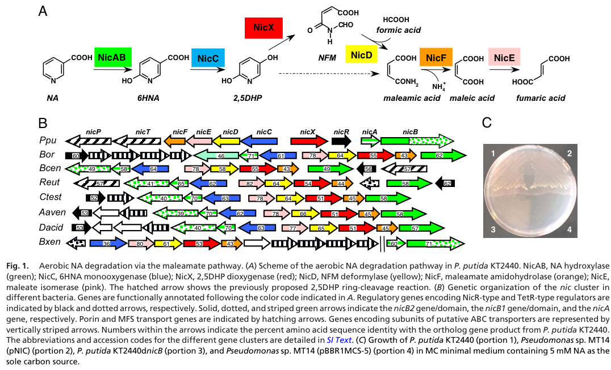

## Question

# Gene Research for Functional Annotation

## ⚠️ CRITICAL: Gene/Protein Identification Context

**BEFORE YOU BEGIN RESEARCH:** You MUST verify you are researching the CORRECT gene/protein. Gene symbols can be ambiguous, especially for less well-characterized genes from non-model organisms.

### Target Gene/Protein Identity (from UniProt):
- **UniProt Accession:** Q88FX7
- **Protein Description:** RecName: Full=HTH-type transcriptional repressor NicS; AltName: Full=Nicotinate degradation protein S;
- **Gene Information:** Name=nicS; OrderedLocusNames=PP_3949;
- **Organism (full):** Pseudomonas putida (strain ATCC 47054 / DSM 6125 / CFBP 8728 / NCIMB 11950 / KT2440).
- **Protein Family:** Not specified in UniProt
- **Key Domains:** Homeodomain-like_sf. (IPR009057); HTH-type_TetR-like_transc_reg. (IPR050109); HTH_TetR. (IPR001647); NicS_C. (IPR041474); Tet_transcr_reg_TetR-rel_C_sf. (IPR036271)

### MANDATORY VERIFICATION STEPS:

1. **Check if the gene symbol "nicS" matches the protein description above**
2. **Verify the organism is correct:** Pseudomonas putida (strain ATCC 47054 / DSM 6125 / CFBP 8728 / NCIMB 11950 / KT2440).
3. **Check if protein family/domains align with what you find in literature**
4. **If you find literature for a DIFFERENT gene with the same or similar symbol, STOP**

### If Gene Symbol is Ambiguous or You Cannot Find Relevant Literature:

**DO NOT PROCEED WITH RESEARCH ON A DIFFERENT GENE.** Instead:
- State clearly: "The gene symbol 'nicS' is ambiguous or literature is limited for this specific protein"
- Explain what you found (e.g., "Found extensive literature on a different gene with the same symbol in a different organism")
- Describe the protein based ONLY on the UniProt information provided above
- Suggest that the protein function can be inferred from domain/family information

### Research Target:

Please provide a comprehensive research report on the gene **nicS** (gene ID: nicS, UniProt: Q88FX7) in PSEPK.

The research report should be a detailed narrative explaining the function, biological processes, and localization of the gene product. Citations should be given for all claims.

You should prioritize authoritative reviews and primary scientific literature when conducting research. You can supplement
this with annotations you find in gene/protein databases, but these can be outdated or inaccurate.

We are specifically interested in the primary function of the gene - for enzymes, what reaction is catalyzed, and what is the substrate specificity? For transporters, what is the substrate? For structural proteins or adapters, what is the broader structural role? For signaling molecules, what is the role in the pathway.

We are interested in where in or outside the cell the gene product carries out its function.

We are also interested in the signaling or biochemical pathways in which the gene functions. We are less interested in broad pleiotropic effects, except where these elucidate the precise role.

Include evidence where possible. We are interested in both experimental evidence as well as inference from structure, evolution, or bioinformatic analysis. Precise studies should be prioritized over high-throughput, where available.

## Output

Question: You are an expert researcher providing comprehensive, well-cited information.

Provide detailed information focusing on:
1. Key concepts and definitions with current understanding
2. Recent developments and latest research (prioritize 2023-2024 sources)
3. Current applications and real-world implementations
4. Expert opinions and analysis from authoritative sources
5. Relevant statistics and data from recent studies

Format as a comprehensive research report with proper citations. Include URLs and publication dates where available.
Always prioritize recent, authoritative sources and provide specific citations for all major claims.

# Gene Research for Functional Annotation

## ⚠️ CRITICAL: Gene/Protein Identification Context

**BEFORE YOU BEGIN RESEARCH:** You MUST verify you are researching the CORRECT gene/protein. Gene symbols can be ambiguous, especially for less well-characterized genes from non-model organisms.

### Target Gene/Protein Identity (from UniProt):
- **UniProt Accession:** Q88FX7
- **Protein Description:** RecName: Full=HTH-type transcriptional repressor NicS; AltName: Full=Nicotinate degradation protein S;
- **Gene Information:** Name=nicS; OrderedLocusNames=PP_3949;
- **Organism (full):** Pseudomonas putida (strain ATCC 47054 / DSM 6125 / CFBP 8728 / NCIMB 11950 / KT2440).
- **Protein Family:** Not specified in UniProt
- **Key Domains:** Homeodomain-like_sf. (IPR009057); HTH-type_TetR-like_transc_reg. (IPR050109); HTH_TetR. (IPR001647); NicS_C. (IPR041474); Tet_transcr_reg_TetR-rel_C_sf. (IPR036271)

### MANDATORY VERIFICATION STEPS:

1. **Check if the gene symbol "nicS" matches the protein description above**
2. **Verify the organism is correct:** Pseudomonas putida (strain ATCC 47054 / DSM 6125 / CFBP 8728 / NCIMB 11950 / KT2440).
3. **Check if protein family/domains align with what you find in literature**
4. **If you find literature for a DIFFERENT gene with the same or similar symbol, STOP**

### If Gene Symbol is Ambiguous or You Cannot Find Relevant Literature:

**DO NOT PROCEED WITH RESEARCH ON A DIFFERENT GENE.** Instead:
- State clearly: "The gene symbol 'nicS' is ambiguous or literature is limited for this specific protein"
- Explain what you found (e.g., "Found extensive literature on a different gene with the same symbol in a different organism")
- Describe the protein based ONLY on the UniProt information provided above
- Suggest that the protein function can be inferred from domain/family information

### Research Target:

Please provide a comprehensive research report on the gene **nicS** (gene ID: nicS, UniProt: Q88FX7) in PSEPK.

The research report should be a detailed narrative explaining the function, biological processes, and localization of the gene product. Citations should be given for all claims.

You should prioritize authoritative reviews and primary scientific literature when conducting research. You can supplement
this with annotations you find in gene/protein databases, but these can be outdated or inaccurate.

We are specifically interested in the primary function of the gene - for enzymes, what reaction is catalyzed, and what is the substrate specificity? For transporters, what is the substrate? For structural proteins or adapters, what is the broader structural role? For signaling molecules, what is the role in the pathway.

We are interested in where in or outside the cell the gene product carries out its function.

We are also interested in the signaling or biochemical pathways in which the gene functions. We are less interested in broad pleiotropic effects, except where these elucidate the precise role.

Include evidence where possible. We are interested in both experimental evidence as well as inference from structure, evolution, or bioinformatic analysis. Precise studies should be prioritized over high-throughput, where available.

## Research report: **nicS** (UniProt Q88FX7; locus **PP_3949**) in *Pseudomonas putida* KT2440

### 1) Target verification (gene/protein identity)
The target protein specified by UniProt accession **Q88FX7** is annotated as an **HTH-type transcriptional repressor NicS** (also described as “nicotinate degradation protein S”) encoded by **nicS** with ordered locus name **PP_3949** in *Pseudomonas putida* strain KT2440 (ATCC 47054 / DSM 6125) (user-provided UniProt context). In the retrieved scientific literature discussing *P. putida* KT2440 nicotinate (nicotinic acid, NA) catabolism, **NicS** consistently refers to a **second transcriptional repressor distinct from NicR**, with a split regulatory architecture in which **NicS represses nicAB** (the NA hydroxylase genes), while **NicR represses downstream operons (nicC and nicX)**. (das2023nicotinicacidcatabolism pages 1-2, brickman2018thebordetellabronchiseptica pages 1-2)

### 2) Key concepts and definitions (current understanding)

#### Nicotinic acid (NA) degradation (“nic” pathway; maleamate pathway)
Aerobic NA degradation in *P. putida* KT2440 is a well-studied model for microbial catabolism of **N-heterocyclic aromatic compounds** and proceeds via the **maleamate pathway**, producing fumarate (a TCA cycle intermediate). The core pathway chemistry includes NA hydroxylation to 6-hydroxynicotinic acid (6HNA), oxidative decarboxylation to 2,5-dihydroxypyridine (2,5DHP), ring cleavage to N-formylmaleamic acid (NFM), and subsequent steps to maleamate/maleate/fumarate. (jimenez2008decipheringthegenetic pages 1-2, jimenez2008decipheringthegenetic pages 2-3)

A key organizing concept for functional annotation is that **NicS is not a catabolic enzyme**; rather, it is a **transcriptional regulator** that gates expression of the upstream NA hydroxylation step, thereby coordinating pathway induction with substrate availability and (likely) intracellular pyridine/NAD-related homeostasis. (das2023nicotinicacidcatabolism pages 1-2, brickman2018thebordetellabronchiseptica pages 1-2)

### 3) Pathway context: genes, reactions, and experimental evidence in *P. putida* KT2440

#### The nic gene cluster encodes a complete aerobic NA-degradation module
A seminal study defined and experimentally validated the *P. putida* KT2440 **nic gene cluster** responsible for aerobic NA degradation (gene set commonly presented as **nicTPFEDCXRAB**). Knockouts of multiple genes in this cluster (e.g., **nicA, nicB, nicC, nicD, nicX**) abolished growth on NA, and complementation restored NA utilization. (jimenez2008decipheringthegenetic pages 1-2, jimenez2008decipheringthegenetic pages 2-3)

**Figure support**: The pathway and cluster organization (including regulatory genes) are summarized in a canonical schematic (Figure 1) showing the maleamate pathway chemistry and the *nic* cluster gene order, including a **NicR-type regulator and a TetR-type regulator** within/adjacent to *nic* loci across bacteria. (jimenez2008decipheringthegenetic media 270ed9f5)

#### Enzymatic steps and quantitative properties (selected)
* **NicAB (nicA + nicB): NA hydroxylase** catalyzes **NA → 6HNA**. The enzyme is **highly specific for NA**, with activity maximal at **30°C** and **pH 7.5**, and activity depends on oxygen/electron acceptor context (e.g., phenazine methosulfate enhances activity in assays). (jimenez2008decipheringthegenetic pages 2-3)
* **NicC:** converts **6HNA → 2,5DHP** (oxidative decarboxylation) with experimental support from mutant phenotypes and recombinant expression assays. (jimenez2008decipheringthegenetic pages 3-4)
* **NicX:** catalyzes ring cleavage of **2,5DHP → NFM**. Purified NicX shows Fe(II)-dependent activity and strict substrate specificity. Reported parameters include **Km ≈ 70 μM** and **Vmax ≈ 2.3 (μM·min⁻¹·mg⁻¹ as reported)**, with oxygen consumption ~**1 mol O2 per mol 2,5DHP**; Fe(II) reactivation (e.g., 25 μM Fe2+) yields ~1 mol Fe per monomer based on ICP measurements. (jimenez2008decipheringthegenetic pages 4-5)
* **NicD:** converts **NFM → maleamate + formate**; catalytic residues were probed by mutagenesis supporting essential residues for activity. (jimenez2008decipheringthegenetic pages 5-6)
* **NicF/NicE:** catalyze later steps to fumarate (maleamate amidohydrolase and maleate isomerase, respectively), with direct enzyme activity demonstrated for NicF and sequence-supported assignment for NicE. (jimenez2008decipheringthegenetic pages 5-6)

These data establish that the *nic* system is a complete catabolic module that can be moved into heterologous Pseudomonas hosts (e.g., plasmid-borne cluster confers NA utilization). (jimenez2008decipheringthegenetic pages 2-3)

### 4) nicS functional annotation: molecular function, biological process, and localization

#### Molecular function
Across the retrieved literature, NicS is described as a **transcriptional repressor** involved in controlling NA catabolism genes in *P. putida* KT2440. A recent 2023 synthesis explicitly states a division of labor between repressors: **NicS represses nicAB**, while **NicR represses nicC and nicX** operons. (das2023nicotinicacidcatabolism pages 1-2)

An authoritative comparative discussion of the *P. putida* regulatory circuit reports **two distinct repressors (NicS and NicR)** whose repressor functions are inhibited by the substrate **nicotinate (NA)** and/or the first pathway intermediate **6HNA**. (brickman2018thebordetellabronchiseptica pages 1-2)

Because UniProt/InterPro (user-provided) annotate Q88FX7 as a **TetR-like HTH regulator** with a C-terminal ligand-binding-like domain (NicS_C), the most defensible current model is that NicS functions analogously to other **ligand-responsive HTH repressors**: binding an operator site near the **nicAB promoter** to block transcription until NA/6HNA (or a related pyridine intermediate) accumulates, causing an allosteric change that reduces DNA-binding affinity.

#### Biological process
The biological process is regulation of **aerobic nicotinate degradation** and coordination of entry into the maleamate pathway. The pathway converts NA to fumarate, enabling NA to serve as a **carbon/nitrogen/energy source** in KT2440. (jimenez2008decipheringthegenetic pages 1-2)

#### Cellular localization
NicS is a **soluble DNA-binding transcription factor**, therefore expected to localize to the **cytosol/nucleoid region** rather than membranes or extracellular space. This is consistent with its predicted HTH transcription-regulator architecture and its regulatory role on chromosomal promoters (inference supported by multiple examples of similar repressors acting by promoter binding; see mechanistic section below). (hu2019regulatorymechanismof pages 2-4, hu2019regulatorymechanismof pages 1-2)

### 5) Regulatory mechanism: what is known vs. inferred for NicS

#### What is directly stated for *P. putida* KT2440 NicS in retrieved literature
* Dual repression architecture: **NicS and NicR are distinct repressors** controlling the *nic* genes. (brickman2018thebordetellabronchiseptica pages 1-2)
* Target split: **NicS represses nicAB** (upstream NA hydroxylation), while **NicR represses downstream operons (nicC/nicX)**. (das2023nicotinicacidcatabolism pages 1-2)
* Induction/effector logic: repression by NicS/NicR is relieved/inhibited by **NA and/or 6HNA** (comparative summary of *P. putida* reports). (brickman2018thebordetellabronchiseptica pages 1-2)

#### Mechanistic inference from authoritative homologous systems (operator binding + ligand allostery)
Direct biochemical/structural characterization for **PP_3949/Q88FX7 NicS** itself was not obtained in the retrieved full texts; therefore, mechanistic annotation benefits from structurally characterized analogs:

1) **Ligand-controlled repression by 6HNA in a nic-cluster repressor (MarR family, Bordetella BpsR):**
Crystal structures of **BpsR** and **BpsR–6HNA** show **6HNA binding induces a conformational change that prevents DNA binding**, consistent with 6HNA acting as an allosteric derepressor. (Publication date: Nov 2019; URL: https://doi.org/10.1371/journal.pone.0223387). (booth2019structuralmechanismfor pages 1-2)
Reporter assays in Bordetella further support that 6HNA is the **actual in vivo inducer** of nic genes by preventing repressor-promoter binding. (Publication date: Jun 2018; URL: https://doi.org/10.1128/jb.00712-17). (guragain2018thetranscriptionalregulator pages 1-3)
While NicS is predicted TetR-like (not MarR-like), these studies provide strong support for the broader mechanistic principle that **the first pathway intermediate (6HNA) can serve as the physiological inducer** in nicotinate catabolism regulons.

2) **TetR-family HTH repressor mechanics in *Pseudomonas* nicotine catabolism (NicR2):**
A detailed mechanistic study of **NicR2** (a TetR-family repressor in *Pseudomonas putida* nicotine catabolism) shows a canonical regulatory logic that is plausible for NicS: the repressor binds **inverted repeat DNA sites** that overlap the **−35/−10** promoter elements, causing **direct competition with RNA polymerase**. (Publication date: Jun 2019; URL: https://doi.org/10.1128/mbio.00602-19). (hu2019regulatorymechanismof pages 1-2, hu2019regulatorymechanismof pages 2-4)
Crucially, NicR2 is controlled by small-molecule effectors (pathway intermediates) where a hydroxylated intermediate can act as an **antagonist that locks a derepressing conformation** and prevents reassociation with DNA, with quantitative differences in binding affinity depending on DNA-bound vs free repressor states (ITC-derived KD values reported in the text). (hu2019regulatorymechanismof pages 10-11)
These structural/biophysical features are directly relevant to annotating NicS because UniProt indicates NicS is a **TetR-like HTH repressor**, implying similar DNA-binding architecture and ligand-responsive allostery.

3) **Recent (2023) TetR-family example of hydroxylated pyridine ligand dissociating DNA binding:**
In nicotine catabolism of *Sphingomonas*, a TetR-family regulator (NdpR) is inhibited by **2,5-dihydroxypyridine**, which prevents binding to multiple promoters. (Publication date: May 2023; URL: https://doi.org/10.1128/aem.00324-23). (wang2023regulationmechanismof pages 1-2, wang2023regulationmechanismof pages 8-10)
This reinforces a generalizable motif: **hydroxylated pyridine intermediates are common effector ligands** for repressors controlling pyridine catabolism.

**Working model for NicS (PP_3949/Q88FX7):** NicS likely binds operator DNA in the **nicAB promoter region** (or nearby) and represses transcription until NA oxidation begins; rising **NA and/or 6HNA** then reduces NicS DNA affinity (allosteric derepression), coordinating pathway entry with substrate availability and minimizing unnecessary expression burden. This model is consistent with the reported NicS/NicR dual repression architecture and the established ligand-derepression logic in nic regulons. (das2023nicotinicacidcatabolism pages 1-2, brickman2018thebordetellabronchiseptica pages 1-2, booth2019structuralmechanismfor pages 1-2)

### 6) Recent developments (prioritizing 2023–2024)

#### 2023: explicit reaffirmation of dual-repressor control (NicS vs NicR)
A 2023 study analyzing nicotinate catabolism in *Burkholderia gladioli* (in the context of mycophagy) summarizes the *P. putida* KT2440 model and explicitly states that **NicR represses nicC/nicX** while **NicS represses nicAB**, highlighting a widely used conceptual framework for interpreting NA pool effects and catabolic regulation. (Publication date: Jun 2023; URL: https://doi.org/10.1128/spectrum.04457-22). (das2023nicotinicacidcatabolism pages 1-2)

#### 2024: evidence gap in the retrieved set for NicS-specific primary studies
Within the retrieved full texts, no 2024 primary paper directly characterizing **NicS (PP_3949/Q88FX7)** (e.g., operator mapping, ligand binding, structures) was obtained. Mechanistic insights therefore rely on (i) earlier KT2440 pathway genetics/biochemistry, (ii) 2018–2019 regulator mechanism studies in related systems, and (iii) 2023 mechanistic regulator work in other bacteria. (jimenez2008decipheringthegenetic pages 2-3, hu2019regulatorymechanismof pages 10-11, guragain2018thetranscriptionalregulator pages 1-3)

### 7) Current applications and real-world implementations

#### Industrial/biocatalytic production of 6-hydroxynicotinic acid (6HNA)
The KT2440 NA hydroxylase (NicAB) is explicitly described as being **used in industry to form 6HNA**, which is a **key precursor** of agrochemicals including insecticides and herbicides (examples named include imidacloprid and imazapyr). The paper emphasizes that cloning/heterologous expression of this enzyme is of **biotechnological interest**, including identifying suitable Pseudomonas expression hosts for enzymes requiring an unusual molybdenum cofactor. (Publication date: Aug 2008; URL: https://doi.org/10.1073/pnas.0802273105). (jimenez2008decipheringthegenetic pages 3-4)

#### Detoxification/bioremediation framing for N-heterocycles
The nicotinate pathway is framed as providing a **framework for developing detoxification/biotransformation processes** for N-heterocyclic aromatic pollutants and for producing valuable intermediates (6HNA, 2,5DHP) that can funnel degradation of toxic compounds such as nicotine and hydroxypyridines. (jimenez2008decipheringthegenetic pages 1-2)

### 8) Expert synthesis and authoritative interpretation

* **Pathway completeness and modularity:** The *P. putida* KT2440 nic cluster is a validated, transferable catabolic module capable of conferring NA utilization to other bacteria via plasmid carriage, supporting its use in engineered biodegradation/biotransformation contexts. (jimenez2008decipheringthegenetic pages 2-3)
* **Regulatory architecture:** Evidence supports a **layered regulatory design** (NicS upstream gate on nicAB; NicR downstream control), which is a common strategy to minimize burden while ensuring rapid inducibility when substrate/intermediate appears. (das2023nicotinicacidcatabolism pages 1-2)
* **Ligand logic:** Multiple systems support that **6HNA** (first intermediate) is a strong physiological signal for derepression in nic pathways (structural evidence from BpsR–6HNA; reporter evidence that 6HNA is “actual inducer”). (guragain2018thetranscriptionalregulator pages 1-3, booth2019structuralmechanismfor pages 1-2)

### 9) Key statistics/data points (from retrieved studies)
* **NicAB NA hydroxylase**: maximal activity at **30°C** and **pH 7.5**; activity is oxygen dependent and modulated by electron acceptors (assay values shown in the paper’s quantitative table/figure). (jimenez2008decipheringthegenetic pages 2-3)
* **NicX kinetics and cofactors**: **Km ≈ 70 μM**, **Vmax ≈ 2.3 (μM·min⁻¹·mg⁻¹ as reported)**; Fe(II)-dependent reactivation (25 μM Fe2+) yields ~1 mol Fe per monomer; ~1 mol O2 consumed per mol 2,5DHP. (jimenez2008decipheringthegenetic pages 4-5)
* **Regulatory induction (homolog system)**: In *Bordetella*, NA at **low micromolar** concentrations induces nic gene expression, and **6HNA inhibits repressor DNA binding** and is identified as the in vivo inducer (used here as mechanistic support for 6HNA-responsive control in nic regulons). (guragain2018thetranscriptionalregulator pages 1-3)

### 10) Consolidated evidence map
The following table consolidates gene-level roles, evidence types, and key citations for NicS (Q88FX7/PP_3949) and the associated nicotinate degradation module.

| Gene/protein | Role | Evidence type (genetics/biochem/binding/structure/inference) | Key finding | Primary source (author year) | URL |
|---|---|---|---|---|---|
| **NicS (Q88FX7 / PP_3949)** | Predicted HTH-type TetR-like transcriptional repressor in the *nic* system; likely cytosolic DNA-binding regulator | Inference; comparative genetics | Direct primary literature on PP_3949/NicS in *P. putida* KT2440 is limited in the retrieved set. UniProt/InterPro description identifies an HTH TetR-like regulator with NicS_C domain; comparative pathway literature indicates **NicS is the second repressor besides NicR** and specifically represses **nicAB** in *P. putida* KT2440, consistent with a soluble transcription factor rather than a membrane/secreted protein (das2023nicotinicacidcatabolism pages 1-2, brickman2018thebordetellabronchiseptica pages 1-2) | Das 2023; Brickman & Armstrong 2018 | https://doi.org/10.1128/spectrum.04457-22 ; https://doi.org/10.1111/mmi.13943 |
| **nicA** | Small subunit of nicotinic acid hydroxylase (NicAB) | Genetics; biochemistry | Disruption of **nicA** abolishes growth on nicotinate (NA) but not on 6-hydroxynicotinate (6HNA); with **nicB**, encodes the first step converting **NA → 6HNA** (jimenez2008decipheringthegenetic pages 2-3, jimenez2008decipheringthegenetic pages 1-2) | Jiménez et al. 2008 | https://doi.org/10.1073/pnas.0802273105 |
| **nicB** | Large subunit of nicotinic acid hydroxylase (NicAB), containing unusual cytochrome c domain | Genetics; biochemistry; structural inference | **NicB** forms a two-component NA hydroxylase with NicA; the enzyme is highly specific for NA and has a distinctive electron transport chain including a **cytochrome c domain**, supporting aerobic **NA → 6HNA** conversion (jimenez2008decipheringthegenetic pages 2-3, jimenez2008decipheringthegenetic pages 3-4) | Jiménez et al. 2008 | https://doi.org/10.1073/pnas.0802273105 |
| **nicC** | 6-hydroxynicotinate 3-monooxygenase | Genetics; biochemistry | **nicC** encodes the enzyme for oxidative decarboxylation of **6HNA → 2,5-dihydroxypyridine (2,5DHP)**; mutant cells accumulate 6HNA and recombinant expression confirms activity (jimenez2008decipheringthegenetic pages 3-4) | Jiménez et al. 2008 | https://doi.org/10.1073/pnas.0802273105 |
| **nicX** | 2,5-dihydroxypyridine dioxygenase | Genetics; biochemistry; structural modeling | **NicX** catalyzes ring cleavage of **2,5DHP → N-formylmaleamic acid (NFM)**; purified enzyme is Fe²⁺-dependent and was proposed as founding member of a new extradiol dioxygenase family (jimenez2008decipheringthegenetic pages 4-5) | Jiménez et al. 2008 | https://doi.org/10.1073/pnas.0802273105 |
| **nicD** | N-formylmaleamate deformylase | Genetics; biochemistry; catalytic-site mutagenesis | **NicD** converts **NFM → maleamate + formate**; site-directed mutagenesis supported a catalytic triad-like mechanism within an α/β-hydrolase fold enzyme (jimenez2008decipheringthegenetic pages 5-6) | Jiménez et al. 2008 | https://doi.org/10.1073/pnas.0802273105 |
| **nicF** | Maleamate amidohydrolase | Biochemistry; inference from sequence family | Recombinant **NicF** shows maleamate amidohydrolase activity, converting **maleamate → maleate + NH₄⁺** (jimenez2008decipheringthegenetic pages 5-6) | Jiménez et al. 2008 | https://doi.org/10.1073/pnas.0802273105 |
| **nicE** | Maleate isomerase | Sequence/function inference | **nicE** was assigned as the terminal pathway step, catalyzing **maleate → fumarate**, based on strong similarity to known maleate cis/trans-isomerases and conserved catalytic cysteines (jimenez2008decipheringthegenetic pages 5-6) | Jiménez et al. 2008 | https://doi.org/10.1073/pnas.0802273105 |
| **nicP** | Putative porin in nicotinate uptake | Genetics; inference | The *nic* cluster includes **nicP**, predicted to encode a porin involved in substrate uptake; no direct biochemical transport assay was captured in the retrieved evidence (jimenez2008decipheringthegenetic pages 1-2) | Jiménez et al. 2008 | https://doi.org/10.1073/pnas.0802273105 |
| **nicT** | Putative MFS permease in nicotinate uptake | Genetics; comparative genomics; inference | The *nic* cluster includes **nicT**, predicted to encode an MFS transporter for nicotinate-related uptake; orthologous clusters often retain MFS or ABC transport systems (jimenez2008decipheringthegenetic pages 5-6, jimenez2008decipheringthegenetic pages 1-2) | Jiménez et al. 2008 | https://doi.org/10.1073/pnas.0802273105 |
| **nicR** | MarR-type transcriptional repressor | Comparative genetics; transcriptomics; DNA binding | In *P. putida* KT2440, **NicR represses the nicC and nicX operons**; later work showed NicR directly binds both promoter regions and cooperates with FinR in NA/6HNA-responsive induction (xiao2018finrregulatesexpression pages 1-2, das2023nicotinicacidcatabolism pages 1-2) | Xiao et al. 2018; Das 2023 | https://doi.org/10.1128/AEM.01210-18 ; https://doi.org/10.1128/spectrum.04457-22 |
| **FinR** | Positive regulator cooperating with NicR in NA catabolism | Transcriptomics; genetics; direct DNA binding | Deleting **finR** decreased expression of **nicC** and **nicX**, impaired growth on **NA or 6HNA** as sole carbon sources, and in vitro assays showed FinR and NicR both bind the promoter regions directly (xiao2018finrregulatesexpression pages 1-2) | Xiao et al. 2018 | https://doi.org/10.1128/AEM.01210-18 |
| **NicR + NicS regulatory split** | Dual-repressor architecture of the *nic* system | Comparative genetics; pathway synthesis | Retrieved recent comparative literature states that in *P. putida* KT2440, **NicR represses nicC/nicX** while **NicS represses nicAB**, indicating regulatory separation of upstream NA hydroxylation from downstream catabolism (das2023nicotinicacidcatabolism pages 1-2) | Das 2023 | https://doi.org/10.1128/spectrum.04457-22 |
| **NA / 6HNA as effectors** | Pathway induction / relief of repression | Comparative genetics; ligand-response inference | Comparative literature summarizing *P. putida* reports that the two repressors **NicS and NicR are inhibited by NA and/or 6HNA**; in homologous Bordetella systems, **6HNA** is the direct inducer that inhibits DNA binding of the cognate repressor (brickman2018thebordetellabronchiseptica pages 1-2, booth2019structuralmechanismfor pages 1-2) | Brickman & Armstrong 2018; Booth et al. 2019 | https://doi.org/10.1111/mmi.13943 ; https://doi.org/10.1371/journal.pone.0223387 |
| **BpsR (Bordetella homolog)** | Structural analog informing NicS/NicR-like ligand control | Structure; ligand binding; DNA-binding mechanism | Crystal structures of **BpsR** showed **6HNA binding induces a conformational change that prevents DNA binding**, offering mechanistic support for 6HNA-responsive repression relief in homologous nicotinate regulators (booth2019structuralmechanismfor pages 1-2) | Booth et al. 2019 | https://doi.org/10.1371/journal.pone.0223387 |
| **Biotechnological relevance of nic pathway** | Catabolism of N-heterocycles; 6HNA production; chassis relevance | Review/analysis; primary biochemistry | The *nic* cluster enables aerobic nicotinate degradation to fumarate and provides enzymes for biotransformation of N-heterocyclic compounds; **NA hydroxylase/6HNA production** was explicitly noted as biotechnologically relevant, and KT2440 is highlighted as a robust metabolic chassis (jimenez2008decipheringthegenetic pages 1-2, jimenez2008decipheringthegenetic pages 3-4, belda2016therevisitedgenome pages 14-15) | Jiménez et al. 2008; Belda et al. 2016 | https://doi.org/10.1073/pnas.0802273105 ; https://doi.org/10.1111/1462-2920.13230 |

*Table: This table summarizes the predicted function of NicS (Q88FX7/PP_3949), the experimentally supported steps of the nicotinate degradation pathway in *Pseudomonas putida* KT2440, and the currently known regulatory architecture involving NicR, NicS, FinR, and small-molecule effectors. It is useful as a compact evidence map linking genes, reactions, regulatory roles, and source citations.*

### 11) Limitations and confidence assessment
*High confidence* exists for: (i) the biochemical steps and enzyme assignments of the KT2440 nic pathway; (ii) NicS being a transcriptional repressor in this pathway and acting alongside NicR; and (iii) the split regulation NicS→nicAB and NicR→nicC/nicX as stated in recent comparative synthesis. (das2023nicotinicacidcatabolism pages 1-2, jimenez2008decipheringthegenetic pages 1-2)

*Moderate confidence* exists for: the detailed molecular mechanism of NicS (operator sequence, oligomeric binding mode, and the specific physiological ligand), because direct NicS biochemical/structural experiments for PP_3949 were not captured in the retrieved texts; mechanistic statements are therefore presented as **inference** supported by structurally characterized homologous repressors and cross-species induction logic involving NA/6HNA. (brickman2018thebordetellabronchiseptica pages 1-2, hu2019regulatorymechanismof pages 10-11, booth2019structuralmechanismfor pages 1-2)

### Key cited sources (with publication dates and URLs)
* Jiménez et al. **2008-08**. *PNAS*. “Deciphering the genetic determinants for aerobic nicotinic acid degradation: The nic cluster from Pseudomonas putida KT2440.” https://doi.org/10.1073/pnas.0802273105 (jimenez2008decipheringthegenetic pages 2-3, jimenez2008decipheringthegenetic pages 4-5, jimenez2008decipheringthegenetic pages 1-2)
* Xiao et al. **2018-10**. *Applied and Environmental Microbiology*. “FinR regulates expression of nicC and nicX operons…” https://doi.org/10.1128/aem.01210-18 (xiao2018finrregulatesexpression pages 1-2)
* Brickman & Armstrong **2018-05**. *Molecular Microbiology*. “The Bordetella bronchiseptica nic locus…” https://doi.org/10.1111/mmi.13943 (brickman2018thebordetellabronchiseptica pages 1-2)
* Booth et al. **2019-11**. *PLoS ONE*. “Structural mechanism… by 6-hydroxynicotinic acid.” https://doi.org/10.1371/journal.pone.0223387 (booth2019structuralmechanismfor pages 1-2)
* Das et al. **2023-06**. *Microbiology Spectrum*. “Nicotinic Acid Catabolism Modulates Bacterial Mycophagy…” https://doi.org/10.1128/spectrum.04457-22 (das2023nicotinicacidcatabolism pages 1-2)
* Hu et al. **2019-06**. *mBio*. “Regulatory mechanism of nicotine degradation in Pseudomonas putida.” https://doi.org/10.1128/mbio.00602-19 (hu2019regulatorymechanismof pages 10-11)
* Guragain et al. **2018-06**. *Journal of Bacteriology*. “BpsR controls the growth… repressing genes involved in nicotinic acid degradation.” https://doi.org/10.1128/jb.00712-17 (guragain2018thetranscriptionalregulator pages 1-3)
* Wang et al. **2023-05**. *Applied and Environmental Microbiology*. “Regulation mechanism… by NdpR.” https://doi.org/10.1128/aem.00324-23 (wang2023regulationmechanismof pages 1-2)

References

1. (das2023nicotinicacidcatabolism pages 1-2): Joyati Das, Rahul Kumar, Sunil Kumar Yadav, and Gopaljee Jha. Nicotinic acid catabolism modulates bacterial mycophagy in burkholderia gladioli strain ngj1. Jun 2023. URL: https://doi.org/10.1128/spectrum.04457-22, doi:10.1128/spectrum.04457-22. This article has 6 citations and is from a domain leading peer-reviewed journal.

2. (brickman2018thebordetellabronchiseptica pages 1-2): Timothy J. Brickman and Sandra K. Armstrong. The bordetella bronchiseptica nic locus encodes a nicotinic acid degradation pathway and the 6‐hydroxynicotinate‐responsive regulator bpsr. Molecular Microbiology, 108:397-409, May 2018. URL: https://doi.org/10.1111/mmi.13943, doi:10.1111/mmi.13943. This article has 13 citations and is from a domain leading peer-reviewed journal.

3. (jimenez2008decipheringthegenetic pages 1-2): José I. Jiménez, Ángeles Canales, Jesús Jiménez-Barbero, Krzysztof Ginalski, Leszek Rychlewski, José L. García, and Eduardo Díaz. Deciphering the genetic determinants for aerobic nicotinic acid degradation: the nic cluster from pseudomonas putida kt2440. Proceedings of the National Academy of Sciences, 105:11329-11334, Aug 2008. URL: https://doi.org/10.1073/pnas.0802273105, doi:10.1073/pnas.0802273105. This article has 173 citations and is from a highest quality peer-reviewed journal.

4. (jimenez2008decipheringthegenetic pages 2-3): José I. Jiménez, Ángeles Canales, Jesús Jiménez-Barbero, Krzysztof Ginalski, Leszek Rychlewski, José L. García, and Eduardo Díaz. Deciphering the genetic determinants for aerobic nicotinic acid degradation: the nic cluster from pseudomonas putida kt2440. Proceedings of the National Academy of Sciences, 105:11329-11334, Aug 2008. URL: https://doi.org/10.1073/pnas.0802273105, doi:10.1073/pnas.0802273105. This article has 173 citations and is from a highest quality peer-reviewed journal.

5. (jimenez2008decipheringthegenetic media 270ed9f5): José I. Jiménez, Ángeles Canales, Jesús Jiménez-Barbero, Krzysztof Ginalski, Leszek Rychlewski, José L. García, and Eduardo Díaz. Deciphering the genetic determinants for aerobic nicotinic acid degradation: the nic cluster from pseudomonas putida kt2440. Proceedings of the National Academy of Sciences, 105:11329-11334, Aug 2008. URL: https://doi.org/10.1073/pnas.0802273105, doi:10.1073/pnas.0802273105. This article has 173 citations and is from a highest quality peer-reviewed journal.

6. (jimenez2008decipheringthegenetic pages 3-4): José I. Jiménez, Ángeles Canales, Jesús Jiménez-Barbero, Krzysztof Ginalski, Leszek Rychlewski, José L. García, and Eduardo Díaz. Deciphering the genetic determinants for aerobic nicotinic acid degradation: the nic cluster from pseudomonas putida kt2440. Proceedings of the National Academy of Sciences, 105:11329-11334, Aug 2008. URL: https://doi.org/10.1073/pnas.0802273105, doi:10.1073/pnas.0802273105. This article has 173 citations and is from a highest quality peer-reviewed journal.

7. (jimenez2008decipheringthegenetic pages 4-5): José I. Jiménez, Ángeles Canales, Jesús Jiménez-Barbero, Krzysztof Ginalski, Leszek Rychlewski, José L. García, and Eduardo Díaz. Deciphering the genetic determinants for aerobic nicotinic acid degradation: the nic cluster from pseudomonas putida kt2440. Proceedings of the National Academy of Sciences, 105:11329-11334, Aug 2008. URL: https://doi.org/10.1073/pnas.0802273105, doi:10.1073/pnas.0802273105. This article has 173 citations and is from a highest quality peer-reviewed journal.

8. (jimenez2008decipheringthegenetic pages 5-6): José I. Jiménez, Ángeles Canales, Jesús Jiménez-Barbero, Krzysztof Ginalski, Leszek Rychlewski, José L. García, and Eduardo Díaz. Deciphering the genetic determinants for aerobic nicotinic acid degradation: the nic cluster from pseudomonas putida kt2440. Proceedings of the National Academy of Sciences, 105:11329-11334, Aug 2008. URL: https://doi.org/10.1073/pnas.0802273105, doi:10.1073/pnas.0802273105. This article has 173 citations and is from a highest quality peer-reviewed journal.

9. (hu2019regulatorymechanismof pages 2-4): Haiyang Hu, Lijuan Wang, Weiwei Wang, Geng Wu, Fei Tao, Ping Xu, Zixin Deng, and Hongzhi Tang. Regulatory mechanism of nicotine degradation in <i>pseudomonas putida</i>. mBio, Jun 2019. URL: https://doi.org/10.1128/mbio.00602-19, doi:10.1128/mbio.00602-19. This article has 27 citations and is from a domain leading peer-reviewed journal.

10. (hu2019regulatorymechanismof pages 1-2): Haiyang Hu, Lijuan Wang, Weiwei Wang, Geng Wu, Fei Tao, Ping Xu, Zixin Deng, and Hongzhi Tang. Regulatory mechanism of nicotine degradation in <i>pseudomonas putida</i>. mBio, Jun 2019. URL: https://doi.org/10.1128/mbio.00602-19, doi:10.1128/mbio.00602-19. This article has 27 citations and is from a domain leading peer-reviewed journal.

11. (booth2019structuralmechanismfor pages 1-2): William T. Booth, Ryan R. Davis, Rajendar Deora, and Thomas Hollis. Structural mechanism for regulation of dna binding of bpsr, a bordetella regulator of biofilm formation, by 6-hydroxynicotinic acid. PLoS ONE, 14:e0223387, Nov 2019. URL: https://doi.org/10.1371/journal.pone.0223387, doi:10.1371/journal.pone.0223387. This article has 17 citations and is from a peer-reviewed journal.

12. (guragain2018thetranscriptionalregulator pages 1-3): Manita Guragain, Jamie Jennings-Gee, Natalia Cattelan, Mary Finger, Matt S. Conover, Thomas Hollis, and Rajendar Deora. The transcriptional regulator bpsr controls the growth of bordetella bronchiseptica by repressing genes involved in nicotinic acid degradation. Journal of Bacteriology, Jun 2018. URL: https://doi.org/10.1128/jb.00712-17, doi:10.1128/jb.00712-17. This article has 18 citations and is from a peer-reviewed journal.

13. (hu2019regulatorymechanismof pages 10-11): Haiyang Hu, Lijuan Wang, Weiwei Wang, Geng Wu, Fei Tao, Ping Xu, Zixin Deng, and Hongzhi Tang. Regulatory mechanism of nicotine degradation in <i>pseudomonas putida</i>. mBio, Jun 2019. URL: https://doi.org/10.1128/mbio.00602-19, doi:10.1128/mbio.00602-19. This article has 27 citations and is from a domain leading peer-reviewed journal.

14. (wang2023regulationmechanismof pages 1-2): Haixia Wang, Xiaoyu Wang, Qi Tang, Lvjing Wang, Chengyu Mei, Yunhai Shao, Ying Xu, Zhenmei Lu, and Weihong Zhong. Regulation mechanism of nicotine catabolism in sphingomonas melonis ty by a dual role transcriptional regulator ndpr. Applied and Environmental Microbiology, May 2023. URL: https://doi.org/10.1128/aem.00324-23, doi:10.1128/aem.00324-23. This article has 11 citations and is from a peer-reviewed journal.

15. (wang2023regulationmechanismof pages 8-10): Haixia Wang, Xiaoyu Wang, Qi Tang, Lvjing Wang, Chengyu Mei, Yunhai Shao, Ying Xu, Zhenmei Lu, and Weihong Zhong. Regulation mechanism of nicotine catabolism in sphingomonas melonis ty by a dual role transcriptional regulator ndpr. Applied and Environmental Microbiology, May 2023. URL: https://doi.org/10.1128/aem.00324-23, doi:10.1128/aem.00324-23. This article has 11 citations and is from a peer-reviewed journal.

16. (xiao2018finrregulatesexpression pages 1-2): Yujie Xiao, Wenjing Zhu, Huizhong Liu, Hailing Nie, Wenli Chen, and Qiaoyun Huang. Finr regulates expression of <i>nicc</i> and <i>nicx</i> operons, involved in nicotinic acid degradation in pseudomonas putida kt2440. Applied and Environmental Microbiology, Oct 2018. URL: https://doi.org/10.1128/aem.01210-18, doi:10.1128/aem.01210-18. This article has 10 citations and is from a peer-reviewed journal.

17. (belda2016therevisitedgenome pages 14-15): Eugeni Belda, Ruben G. A. van Heck, Maria José Lopez‐Sanchez, Stéphane Cruveiller, Valérie Barbe, Claire Fraser, Hans‐Peter Klenk, Jörn Petersen, Anne Morgat, Pablo I. Nikel, David Vallenet, Zoé Rouy, Agnieszka Sekowska, Vitor A. P. Martins dos Santos, Víctor de Lorenzo, Antoine Danchin, and Claudine Médigue. The revisited genome of pseudomonas putida kt2440 enlightens its value as a robust metabolic chassis. Environmental microbiology, 18 10:3403-3424, Oct 2016. URL: https://doi.org/10.1111/1462-2920.13230, doi:10.1111/1462-2920.13230. This article has 371 citations and is from a domain leading peer-reviewed journal.

## Artifacts

- [Edison artifact artifact-00](nicS-deep-research-falcon_artifacts/artifact-00.md)

## Citations

1. jimenez2008decipheringthegenetic pages 2-3
2. jimenez2008decipheringthegenetic pages 3-4
3. jimenez2008decipheringthegenetic pages 4-5
4. jimenez2008decipheringthegenetic pages 5-6
5. das2023nicotinicacidcatabolism pages 1-2
6. brickman2018thebordetellabronchiseptica pages 1-2
7. jimenez2008decipheringthegenetic pages 1-2
8. booth2019structuralmechanismfor pages 1-2
9. guragain2018thetranscriptionalregulator pages 1-3
10. hu2019regulatorymechanismof pages 10-11
11. xiao2018finrregulatesexpression pages 1-2
12. wang2023regulationmechanismof pages 1-2
13. hu2019regulatorymechanismof pages 2-4
14. hu2019regulatorymechanismof pages 1-2
15. wang2023regulationmechanismof pages 8-10
16. belda2016therevisitedgenome pages 14-15
17. https://doi.org/10.1371/journal.pone.0223387
18. https://doi.org/10.1128/jb.00712-17
19. https://doi.org/10.1128/mbio.00602-19
20. https://doi.org/10.1128/aem.00324-23
21. https://doi.org/10.1128/spectrum.04457-22
22. https://doi.org/10.1073/pnas.0802273105
23. https://doi.org/10.1111/mmi.13943
24. https://doi.org/10.1128/AEM.01210-18
25. https://doi.org/10.1111/1462-2920.13230
26. https://doi.org/10.1128/aem.01210-18
27. https://doi.org/10.1128/spectrum.04457-22,
28. https://doi.org/10.1111/mmi.13943,
29. https://doi.org/10.1073/pnas.0802273105,
30. https://doi.org/10.1128/mbio.00602-19,
31. https://doi.org/10.1371/journal.pone.0223387,
32. https://doi.org/10.1128/jb.00712-17,
33. https://doi.org/10.1128/aem.00324-23,
34. https://doi.org/10.1128/aem.01210-18,
35. https://doi.org/10.1111/1462-2920.13230,