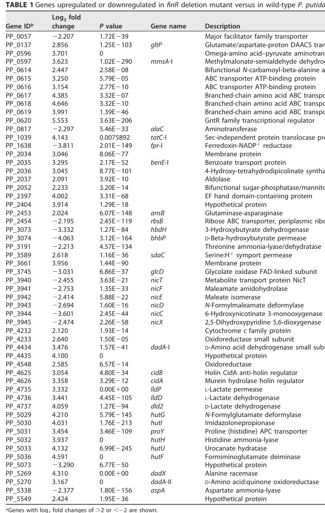

## Question

# Gene Research for Functional Annotation

## ⚠️ CRITICAL: Gene/Protein Identification Context

**BEFORE YOU BEGIN RESEARCH:** You MUST verify you are researching the CORRECT gene/protein. Gene symbols can be ambiguous, especially for less well-characterized genes from non-model organisms.

### Target Gene/Protein Identity (from UniProt):
- **UniProt Accession:** Q88FY6
- **Protein Description:** RecName: Full=Putative metabolite transport protein NicT; AltName: Full=Nicotinate degradation protein T;
- **Gene Information:** Name=nicT; OrderedLocusNames=PP_3940;
- **Organism (full):** Pseudomonas putida (strain ATCC 47054 / DSM 6125 / CFBP 8728 / NCIMB 11950 / KT2440).
- **Protein Family:** Belongs to the major facilitator superfamily.
- **Key Domains:** MFS. (IPR011701); MFS_dom. (IPR020846); MFS_trans_sf. (IPR036259); MFS_1 (PF07690)

### MANDATORY VERIFICATION STEPS:

1. **Check if the gene symbol "nicT" matches the protein description above**
2. **Verify the organism is correct:** Pseudomonas putida (strain ATCC 47054 / DSM 6125 / CFBP 8728 / NCIMB 11950 / KT2440).
3. **Check if protein family/domains align with what you find in literature**
4. **If you find literature for a DIFFERENT gene with the same or similar symbol, STOP**

### If Gene Symbol is Ambiguous or You Cannot Find Relevant Literature:

**DO NOT PROCEED WITH RESEARCH ON A DIFFERENT GENE.** Instead:
- State clearly: "The gene symbol 'nicT' is ambiguous or literature is limited for this specific protein"
- Explain what you found (e.g., "Found extensive literature on a different gene with the same symbol in a different organism")
- Describe the protein based ONLY on the UniProt information provided above
- Suggest that the protein function can be inferred from domain/family information

### Research Target:

Please provide a comprehensive research report on the gene **nicT** (gene ID: nicT, UniProt: Q88FY6) in PSEPK.

The research report should be a detailed narrative explaining the function, biological processes, and localization of the gene product. Citations should be given for all claims.

You should prioritize authoritative reviews and primary scientific literature when conducting research. You can supplement
this with annotations you find in gene/protein databases, but these can be outdated or inaccurate.

We are specifically interested in the primary function of the gene - for enzymes, what reaction is catalyzed, and what is the substrate specificity? For transporters, what is the substrate? For structural proteins or adapters, what is the broader structural role? For signaling molecules, what is the role in the pathway.

We are interested in where in or outside the cell the gene product carries out its function.

We are also interested in the signaling or biochemical pathways in which the gene functions. We are less interested in broad pleiotropic effects, except where these elucidate the precise role.

Include evidence where possible. We are interested in both experimental evidence as well as inference from structure, evolution, or bioinformatic analysis. Precise studies should be prioritized over high-throughput, where available.

## Output

Question: You are an expert researcher providing comprehensive, well-cited information.

Provide detailed information focusing on:
1. Key concepts and definitions with current understanding
2. Recent developments and latest research (prioritize 2023-2024 sources)
3. Current applications and real-world implementations
4. Expert opinions and analysis from authoritative sources
5. Relevant statistics and data from recent studies

Format as a comprehensive research report with proper citations. Include URLs and publication dates where available.
Always prioritize recent, authoritative sources and provide specific citations for all major claims.

# Gene Research for Functional Annotation

## ⚠️ CRITICAL: Gene/Protein Identification Context

**BEFORE YOU BEGIN RESEARCH:** You MUST verify you are researching the CORRECT gene/protein. Gene symbols can be ambiguous, especially for less well-characterized genes from non-model organisms.

### Target Gene/Protein Identity (from UniProt):
- **UniProt Accession:** Q88FY6
- **Protein Description:** RecName: Full=Putative metabolite transport protein NicT; AltName: Full=Nicotinate degradation protein T;
- **Gene Information:** Name=nicT; OrderedLocusNames=PP_3940;
- **Organism (full):** Pseudomonas putida (strain ATCC 47054 / DSM 6125 / CFBP 8728 / NCIMB 11950 / KT2440).
- **Protein Family:** Belongs to the major facilitator superfamily.
- **Key Domains:** MFS. (IPR011701); MFS_dom. (IPR020846); MFS_trans_sf. (IPR036259); MFS_1 (PF07690)

### MANDATORY VERIFICATION STEPS:

1. **Check if the gene symbol "nicT" matches the protein description above**
2. **Verify the organism is correct:** Pseudomonas putida (strain ATCC 47054 / DSM 6125 / CFBP 8728 / NCIMB 11950 / KT2440).
3. **Check if protein family/domains align with what you find in literature**
4. **If you find literature for a DIFFERENT gene with the same or similar symbol, STOP**

### If Gene Symbol is Ambiguous or You Cannot Find Relevant Literature:

**DO NOT PROCEED WITH RESEARCH ON A DIFFERENT GENE.** Instead:
- State clearly: "The gene symbol 'nicT' is ambiguous or literature is limited for this specific protein"
- Explain what you found (e.g., "Found extensive literature on a different gene with the same symbol in a different organism")
- Describe the protein based ONLY on the UniProt information provided above
- Suggest that the protein function can be inferred from domain/family information

### Research Target:

Please provide a comprehensive research report on the gene **nicT** (gene ID: nicT, UniProt: Q88FY6) in PSEPK.

The research report should be a detailed narrative explaining the function, biological processes, and localization of the gene product. Citations should be given for all claims.

You should prioritize authoritative reviews and primary scientific literature when conducting research. You can supplement
this with annotations you find in gene/protein databases, but these can be outdated or inaccurate.

We are specifically interested in the primary function of the gene - for enzymes, what reaction is catalyzed, and what is the substrate specificity? For transporters, what is the substrate? For structural proteins or adapters, what is the broader structural role? For signaling molecules, what is the role in the pathway.

We are interested in where in or outside the cell the gene product carries out its function.

We are also interested in the signaling or biochemical pathways in which the gene functions. We are less interested in broad pleiotropic effects, except where these elucidate the precise role.

Include evidence where possible. We are interested in both experimental evidence as well as inference from structure, evolution, or bioinformatic analysis. Precise studies should be prioritized over high-throughput, where available.

## Research report: **nicT** (PP_3940; UniProt **Q88FY6**) in *Pseudomonas putida* KT2440 (PSEPK)

### Executive summary
The *Pseudomonas putida* KT2440 gene **nicT** (locus **PP_3940**, UniProt **Q88FY6**) encodes a predicted **secondary transporter** in the **major facilitator superfamily (MFS)** that is genomically embedded in the **nicotinic acid (nicotinate; NA) degradation** gene cluster and is consistently annotated as a “metabolite transport protein NicT.” (xiao2018finrregulatesexpression pages 2-3). Although direct biochemical transport assays for **the KT2440 NicT protein itself** were not found in the retrieved literature, multiple lines of evidence support its assignment as a nicotinate-pathway-associated transporter: (i) conserved pathway/operon context (nicCDEFTP), (ii) FinR-dependent transcriptomic regulation of nicT, and (iii) strong functional precedent that **NiaP-family** MFS transporters transport **nicotinate** via energy-dependent uptake (xiao2018finrregulatesexpression pages 3-4, brickman2018thebordetellabronchiseptica pages 7-7, jeanguenin2012comparativegenomicsand pages 4-5).

### 1) Key concepts and definitions (current understanding)

#### Nicotinic acid (NA; nicotinate) catabolism
In aerobic bacteria, nicotinic acid can be used as a carbon/energy source by conversion through a pathway that ultimately yields **fumarate**, which feeds into the TCA cycle (das2023nicotinicacidcatabolism pages 1-2, brickman2018thebordetellabronchiseptica pages 4-4). In the widely cited KT2440 model, NA is converted to **6-hydroxynicotinic acid (6HNA)**, then to **2,5-dihydroxypyridine (2,5-DHP)**, and then ring-opened and processed to **fumarate** (das2023nicotinicacidcatabolism pages 1-2, brickman2018thebordetellabronchiseptica pages 4-4).

#### MFS transporters and NiaP-family nicotinate transport
The **major facilitator superfamily** comprises secondary transporters that commonly use **proton-motive force (H+ symport/antiport)** to move small molecules across the cytoplasmic membrane. A relevant MFS subgroup is the **NiaP family**, for which multiple members have been biochemically shown to mediate **concentrative, energy-dependent nicotinate uptake** with narrow specificity (jeanguenin2012comparativegenomicsand pages 6-7, jeanguenin2012comparativegenomicsand pages 4-5).

### 2) Verified gene/protein identity (mandatory verification)
* Organism: *Pseudomonas putida* KT2440 (ATCC 47054/DSM 6125/KT2440), consistent across the KT2440 nic-pathway literature used here (xiao2018finrregulatesexpression pages 2-3, brickman2018thebordetellabronchiseptica pages 7-7).
* Gene symbol–protein match: In KT2440, **PP_3940 is annotated as nicT (“Metabolite transport protein NicT”)** within the NA catabolic (nic) cluster (xiao2018finrregulatesexpression pages 2-3).
* Functional class: NicT is consistently treated as a pathway-associated transporter gene in the KT2440 nic locus (e.g., nicCDEFTP operon name includes nicT) (brickman2018thebordetellabronchiseptica pages 7-7, das2023nicotinicacidcatabolism pages 1-2).

### 3) Pathway context and where NicT fits

#### Canonical KT2440 nic locus organization
Multiple sources describe the KT2440 nic locus as three operons:
* **nicAB**: enzymes converting NA → 6HNA (das2023nicotinicacidcatabolism pages 1-2, brickman2018thebordetellabronchiseptica pages 7-7)
* **nicCDEFTP** (divergently transcribed relative to nicXR): includes **nicT** as part of the operon name and contains enzymes for downstream processing steps (brickman2018thebordetellabronchiseptica pages 7-7, das2023nicotinicacidcatabolism pages 1-2)
* **nicXR**: includes genes for ring cleavage/processing and regulation by MarR-type **NicR** (brickman2018thebordetellabronchiseptica pages 7-7, das2023nicotinicacidcatabolism pages 1-2)

#### Enzymatic steps (biochemical process map)
A consistent stepwise description is:
1. **NicA/NicB** convert NA to **6HNA** (das2023nicotinicacidcatabolism pages 1-2).
2. **NicC** (6-hydroxynicotinate 3-monooxygenase) converts 6HNA to **2,5-DHP** (das2023nicotinicacidcatabolism pages 1-2, brickman2018thebordetellabronchiseptica pages 4-4).
3. **NicX** catalyzes ring opening to **N-formylmaleamic acid**, then **NicD** (deformylase) yields **maleamic acid + formate**, **NicF** yields **maleic acid + NH3**, and **NicE** converts **maleic acid → fumarate** (brickman2018thebordetellabronchiseptica pages 4-4, das2023nicotinicacidcatabolism pages 1-2).

In this context, **NicT is best interpreted as a transport component** supporting NA catabolism—most plausibly mediating uptake of NA (or potentially a closely related precursor/intermediate)—but this remains an inference given the absence of KT2440 NicT uptake assays in retrieved papers (xiao2018finrregulatesexpression pages 2-3, das2023nicotinicacidcatabolism pages 1-2).

### 4) Regulation and expression evidence specific to KT2440 nicT

#### FinR-linked regulation of nicT (omics + statistics)
In *P. putida* KT2440, deletion of **finR** alters expression of multiple nic genes; importantly, **PP_3940/nicT** is significantly decreased in the ΔfinR background with RNA-seq **log2 fold change = −2.455** and **P = 3.63×10−21** (xiao2018finrregulatesexpression pages 3-4, xiao2018finrregulatesexpression media aa8f35ab). This supports that nicT is under regulatory control connected to NA catabolism, even if not the primary regulated promoter measured in that study.

#### Promoter activity assays for nicT
Xiao et al. constructed promoter–lacZ reporters for several nic promoters. However, **nicT promoter activity was “too low to be detected”** under the tested conditions (xiao2018finrregulatesexpression pages 3-4). The authors also interpret NA-independent expression patterns as consistent with **additional constitutive promoters upstream of nicS, nicT, and nicR**, suggesting nicT may not be strongly inducible in their reporter context or that the active promoter region was not captured in the construct (xiao2018finrregulatesexpression pages 3-4).

#### NA/6HNA induction evidence (cluster-level, not NicT-specific)
Xiao et al. provide direct evidence that NA/6HNA induce key catabolic operons (notably nicC and nicX) and that FinR and NicR bind those promoter regions, but NicT-specific binding/induction is not shown in the retrieved excerpts (xiao2018finrregulatesexpression pages 1-2). Independent pathway summaries also emphasize that **6HNA is the inducer of nicC expression** in the KT2440 pathway logic (brickman2018thebordetellabronchiseptica pages 7-7).

### 5) Substrate specificity: what does NicT likely transport?

#### Direct evidence is missing for KT2440 NicT
No retrieved paper provided a **transport assay** (radiolabeled uptake, growth rescue by transporter expression, or reconstitution) directly testing substrate(s) for *P. putida* KT2440 NicT (xiao2018finrregulatesexpression pages 2-3, brickman2018thebordetellabronchiseptica pages 7-7).

#### Strong mechanistic precedent from NiaP-family MFS nicotinate transporters
Jeanguenin et al. experimentally demonstrated that NiaP-family MFS transporters mediate **energy-dependent nicotinate uptake** using radiolabeled [14C]nicotinate in *Lactococcus lactis* expression assays (jeanguenin2012comparativegenomicsand pages 2-4, jeanguenin2012comparativegenomicsand pages 1-2). Key quantitative findings that define the functional signature of these transporters include:
* Uptake that is **>20-fold** higher than controls and saturates rapidly (≈60 s timescale in representative experiments) (jeanguenin2012comparativegenomicsand pages 2-4).
* **Concentrative transport**: ~**1.7 μM** external nicotinate to ~**65 μM** intracellular (≈**38-fold**) (jeanguenin2012comparativegenomicsand pages 4-5).
* **Energy dependence**: stimulated by glucose and inhibited by 2-deoxyglucose; inhibition is relieved by glucose, consistent with dependence on cellular energetic state/proton motive force (jeanguenin2012comparativegenomicsand pages 4-5).
* Proposed **H+ symport** as a plausible mechanism (common for MFS) (jeanguenin2012comparativegenomicsand pages 6-7).

Given NicT’s annotation as an MFS-family transporter embedded in the nicotinate degradation locus, the most parsimonious functional hypothesis is that **KT2440 NicT transports nicotinate (or a closely related NA-family compound)** into the cytoplasm to enable catabolism. This remains an **inference** until Q88FY6 is directly tested.

### 6) Cellular localization
Because NicT is an MFS transporter, its expected localization is the **inner (cytoplasmic) membrane** of this Gram-negative bacterium. While no NicT-specific localization experiment was retrieved, Jeanguenin et al. report plasma-membrane localization for plant NiaP homologs by GFP fusion, consistent with the general membrane-transporter nature of this family (jeanguenin2012comparativegenomicsand pages 6-7, jeanguenin2012comparativegenomicsand pages 7-9). This supports assigning NicT to the cytoplasmic membrane as the site of function.

### 7) Recent developments (prioritizing 2023–2024)

#### 2023: comparative/pathophysiology-relevant roles for NA catabolism and nicT homologs
A 2023 study in *Microbiology Spectrum* leveraged the established KT2440 model to interpret a Burkholderia nic cluster, reiterating that the KT2440 pathway is “elaborately characterized” and summarizing the operons **nicAB**, **nicCDEFTP**, and **nicXR** and the NA→fumarate route (das2023nicotinicacidcatabolism pages 1-2). Importantly, this work notes that **nicT in a homologous nic cluster encodes an MFS transporter**, reinforcing that nicT-like genes are commonly considered uptake components in nicotinate catabolic loci (das2023nicotinicacidcatabolism pages 2-5, das2023nicotinicacidcatabolism pages 5-7). Although not an experiment on KT2440 NicT, this is a recent, authoritative consolidation of the pathway context and transporter annotation.

#### 2024: limited direct advances specific to KT2440 nicT in retrieved sources
A 2024 thesis mentioning *P. putida* KT2440 and UniProt updates was retrieved, but it did not provide NicT-specific functional data in the available snippets (schultes2024oxyfunctionalizationreactionswith pages 1-6). Therefore, the latest *directly relevant* advances in the retrieved corpus primarily concern pathway-level comparative biology rather than new NicT transport biochemistry.

### 8) Current applications and real-world implementations
While the retrieved sources do not describe a direct industrial deployment of **NicT** as a standalone component, the KT2440 nicotinate degradation pathway is relevant to:
* **Environmental metabolism and biodegradation**: NA is a natural and anthropogenic compound; bacteria capable of using NA as sole carbon/energy source can contribute to nutrient cycling (brickman2018thebordetellabronchiseptica pages 3-3).
* **Systems and synthetic biology chassis considerations**: KT2440 is widely used as an engineering host. Understanding nicotinate uptake and degradation can matter for media formulation, metabolite cross-feeding, and robustness when NA or analogs are present.

### 9) Expert/authoritative interpretations and critical appraisal

#### What is strongly supported?
* **Pathway association**: nicT is in the KT2440 nic cluster and is represented in the canonical operon **nicCDEFTP** (xiao2018finrregulatesexpression pages 2-3, brickman2018thebordetellabronchiseptica pages 7-7).
* **Regulatory connection**: nicT transcript abundance decreases substantially in a ΔfinR mutant, consistent with co-regulation of nic genes tied to NA utilization (xiao2018finrregulatesexpression pages 3-4, xiao2018finrregulatesexpression media aa8f35ab).

#### What remains uncertain?
* **Exact substrate and directionality**: No direct assays demonstrate Q88FY6 transports NA, 6HNA, or another metabolite. The strongest substrate inference is nicotinate based on the consistent pathway annotation and the well-established nicotinate transport function of related MFS (NiaP) proteins (jeanguenin2012comparativegenomicsand pages 4-5, xiao2018finrregulatesexpression pages 2-3).
* **Regulatory architecture at the nicT promoter**: Reporter activity for the nicT promoter construct was undetectable, and the study emphasizes FinR/NicR action at nicC/nicX promoters rather than nicT-specific promoter regulation (xiao2018finrregulatesexpression pages 3-4, xiao2018finrregulatesexpression pages 1-2).

### 10) Key data points and statistics (recent studies prioritized where available)
* **ΔfinR transcriptomics (KT2440)**: nicT (PP_3940) log2FC **−2.455**, P **3.63E−21** (RNA-seq), indicating strong downregulation in ΔfinR (xiao2018finrregulatesexpression media aa8f35ab).
* **Promoter-reporter**: nicT promoter activity “too low to be detected” in lacZ fusion assays under conditions tested (xiao2018finrregulatesexpression pages 3-4).
* **NiaP-family transport benchmarks (mechanistic precedent)**: ~**38-fold** concentrative uptake (1.7 μM external → 65 μM internal), energy dependence, and >20× uptake over controls in radiotracer assays (jeanguenin2012comparativegenomicsand pages 4-5, jeanguenin2012comparativegenomicsand pages 2-4).

### Evidence summary table
The table below separates **direct KT2440 nicT evidence** from **comparative functional inference**.

| Claim/annotation | Evidence type (experimental/omics/comparative inference) | Key details (include quantitative values like log2FC and P-value; promoter activity notes; operon context) | Source (authors, year, journal) | URL | Pub date (month/year) | Citation ID |
|---|---|---|---|---|---|---|
| nicT is PP_3940 in *Pseudomonas putida* KT2440 and is annotated as “metabolite transport protein NicT” within the nicotinic acid degradation cluster | Omics/annotation | Table of differentially expressed genes identifies PP_3940 as **nicT**; part of the 11-gene nic cluster involved in aerobic nicotinic acid (NA) degradation | Xiao et al., 2018, *Applied and Environmental Microbiology* | https://doi.org/10.1128/AEM.01210-18 | 10/2018 | (xiao2018finrregulatesexpression pages 2-3) |
| nicT expression decreases in a ΔfinR mutant, linking nicT to FinR-dependent nic-cluster regulation | Omics with RT-qPCR-supported regulatory interpretation | RNA-seq reports **log2FC = -2.455**, **P = 3.63E-21** for PP_3940/nicT in the **finR** deletion background; authors interpret this as reduced nicT expression when FinR is absent | Xiao et al., 2018, *Applied and Environmental Microbiology* | https://doi.org/10.1128/AEM.01210-18 | 10/2018 | (xiao2018finrregulatesexpression pages 2-3, xiao2018finrregulatesexpression pages 3-4, xiao2018finrregulatesexpression media aa8f35ab) |
| nicT likely lies in/near a constitutively expressed nicTP transcriptional unit rather than a strongly inducible promoter detectable in reporter assays | Experimental promoter-reporter plus inference | Authors propose “additional constitutive promoters” upstream of **nicS, nicT, and nicR** because of NA-independent expression of **nicS, nicTP, and nicR** operons; in lacZ reporter assays, **nicT promoter activity was too low to detect** | Xiao et al., 2018, *Applied and Environmental Microbiology* | https://doi.org/10.1128/AEM.01210-18 | 10/2018 | (xiao2018finrregulatesexpression pages 3-4) |
| There is no direct NicT-specific evidence in Xiao et al. for NA/6HNA induction or FinR/NicR binding to the nicT promoter | Negative evidence from targeted experiments | FinR and NicR binding and NA/6HNA induction were demonstrated for **nicC** and **nicX** promoters, but the provided evidence does **not** report EMSA/binding data or direct induction data for **nicT**; nicT reporter signal was undetectable | Xiao et al., 2018, *Applied and Environmental Microbiology* | https://doi.org/10.1128/AEM.01210-18 | 10/2018 | (xiao2018finrregulatesexpression pages 3-4, xiao2018finrregulatesexpression pages 1-2) |
| In pathway summaries, nicT is part of the canonical *P. putida* KT2440 nic locus organized as **nicAB**, **nicCDEFTP**, and **nicXR** | Comparative/pathway literature synthesis | Recent review-like comparative papers cite KT2440 as the reference system and place **nicT** in the **nicCDEFTP** operon; the pathway converts NA → 6HNA → 2,5-DHP → fumarate | Das et al., 2023, *Microbiology Spectrum*; Brickman & Armstrong, 2018, *Molecular Microbiology* | https://doi.org/10.1128/spectrum.04457-22 ; https://doi.org/10.1111/mmi.13943 | 06/2023; 05/2018 | (das2023nicotinicacidcatabolism pages 1-2, brickman2018thebordetellabronchiseptica pages 7-7) |
| NicT is commonly described as an MFS-family transporter associated with nicotinate catabolism, but direct biochemical proof for *P. putida* NicT itself is limited | Comparative inference | Das et al. note **nicT** in a homologous nic cluster as encoding a **major facilitator superfamily (MFS) transporter**; for *P. putida* KT2440, the available excerpts support cluster membership and annotation, but no direct uptake assay for Q88FY6 is reported | Das et al., 2023, *Microbiology Spectrum*; Xiao et al., 2018, *Applied and Environmental Microbiology* | https://doi.org/10.1128/spectrum.04457-22 ; https://doi.org/10.1128/AEM.01210-18 | 06/2023; 10/2018 | (das2023nicotinicacidcatabolism pages 2-5, das2023nicotinicacidcatabolism pages 5-7, xiao2018finrregulatesexpression pages 2-3) |
| The strongest substrate-level evidence comes from NiaP-family transporters, a subgroup of MFS proteins that transport nicotinate via energy-dependent uptake; this supports, but does not prove, a nicotinate-transport role for NicT | Comparative functional inference | Heterologous expression of bacterial **NiaP** proteins in *Lactococcus lactis* showed rapid, energy-dependent **[^14C]nicotinate** uptake, >20-fold over controls; uptake was concentrative (**~1.7 µM external to ~65 µM intracellular; 38-fold**) and consistent with **H+ symport**. These data are for NiaP homologs, **not directly for PP_3940/Q88FY6** | Jeanguenin et al., 2012, *Functional & Integrative Genomics* | https://doi.org/10.1007/s10142-011-0255-y | 09/2012 | (jeanguenin2012comparativegenomicsand pages 2-4, jeanguenin2012comparativegenomicsand pages 6-7, jeanguenin2012comparativegenomicsand pages 4-5) |
| Cellular localization of NicT is inferred to be the inner membrane/plasma membrane from transporter family assignment, not directly shown for Q88FY6 in the retrieved literature | Comparative inference | NiaP-family proteins are MFS transporters and plant NiaP homologs localize to the **plasma membrane** by GFP fusion; NicT is therefore most plausibly a **membrane transporter** in KT2440, but no NicT-specific localization assay was found | Jeanguenin et al., 2012, *Functional & Integrative Genomics* | https://doi.org/10.1007/s10142-011-0255-y | 09/2012 | (jeanguenin2012comparativegenomicsand pages 6-7, jeanguenin2012comparativegenomicsand pages 7-9) |

*Table: This table compiles the strongest available evidence for nicT (PP_3940; UniProt Q88FY6) in *Pseudomonas putida* KT2440, separating direct organism-specific data from broader comparative inference. It is useful for assessing which aspects of NicT function are experimentally supported versus still inferred.*

### Figures/tables inspected (visual evidence)
Xiao et al. (2018) Table 1 and associated figures were visually inspected to confirm the ΔfinR differential expression statistics for PP_3940/nicT and the low/undetectable nicT promoter–lacZ activity reported in the study’s promoter assays (xiao2018finrregulatesexpression media aa8f35ab, xiao2018finrregulatesexpression media 6c2ec821, xiao2018finrregulatesexpression media 028c8b16).

### References (URLs and publication dates)
* Xiao Y, Zhu W, Liu H, Nie H, Chen W, Huang Q. **FinR regulates expression of nicC and nicX operons, involved in nicotinic acid degradation in *Pseudomonas putida* KT2440.** *Applied and Environmental Microbiology*. **Oct 2018**. https://doi.org/10.1128/AEM.01210-18 (xiao2018finrregulatesexpression pages 2-3, xiao2018finrregulatesexpression pages 3-4)
* Das J, Kumar R, Yadav SK, Jha G. **Nicotinic Acid Catabolism Modulates Bacterial Mycophagy in *Burkholderia gladioli* Strain NGJ1.** *Microbiology Spectrum*. **Jun 2023**. https://doi.org/10.1128/spectrum.04457-22 (das2023nicotinicacidcatabolism pages 1-2, das2023nicotinicacidcatabolism pages 2-5)
* Brickman TJ, Armstrong SK. **The *Bordetella bronchiseptica* nic locus encodes a nicotinic acid degradation pathway and the 6-hydroxynicotinate-responsive regulator BpsR.** *Molecular Microbiology*. **May 2018**. https://doi.org/10.1111/mmi.13943 (brickman2018thebordetellabronchiseptica pages 7-7, brickman2018thebordetellabronchiseptica pages 4-4)
* Jeanguenin L, Lara-Núñez A, Rodionov DA, Osterman AL, Komarova NY, Rentsch D, Gregory JF, Hanson AD. **Comparative genomics and functional analysis of the NiaP family uncover nicotinate transporters from bacteria, plants, and mammals.** *Functional & Integrative Genomics*. **Sep 2012**. https://doi.org/10.1007/s10142-011-0255-y (jeanguenin2012comparativegenomicsand pages 4-5, jeanguenin2012comparativegenomicsand pages 6-7)

### Conclusion
Within the currently retrievable evidence, **nicT (PP_3940; UniProt Q88FY6)** is best annotated as a **nicotinate-pathway-associated MFS transporter** in *P. putida* KT2440. The most defensible substrate hypothesis is **nicotinic acid (nicotinate)** uptake in support of NA catabolism, supported indirectly by operon/pathway context and strong biochemical evidence for nicotinate transport by closely related MFS (NiaP-family) transporters. However, direct substrate specificity and mechanism for Q88FY6 remain to be experimentally validated.

References

1. (xiao2018finrregulatesexpression pages 2-3): Yujie Xiao, Wenjing Zhu, Huizhong Liu, Hailing Nie, Wenli Chen, and Qiaoyun Huang. Finr regulates expression of <i>nicc</i> and <i>nicx</i> operons, involved in nicotinic acid degradation in pseudomonas putida kt2440. Applied and Environmental Microbiology, Oct 2018. URL: https://doi.org/10.1128/aem.01210-18, doi:10.1128/aem.01210-18. This article has 10 citations and is from a peer-reviewed journal.

2. (xiao2018finrregulatesexpression pages 3-4): Yujie Xiao, Wenjing Zhu, Huizhong Liu, Hailing Nie, Wenli Chen, and Qiaoyun Huang. Finr regulates expression of <i>nicc</i> and <i>nicx</i> operons, involved in nicotinic acid degradation in pseudomonas putida kt2440. Applied and Environmental Microbiology, Oct 2018. URL: https://doi.org/10.1128/aem.01210-18, doi:10.1128/aem.01210-18. This article has 10 citations and is from a peer-reviewed journal.

3. (brickman2018thebordetellabronchiseptica pages 7-7): Timothy J. Brickman and Sandra K. Armstrong. The bordetella bronchiseptica nic locus encodes a nicotinic acid degradation pathway and the 6‐hydroxynicotinate‐responsive regulator bpsr. Molecular Microbiology, 108:397-409, May 2018. URL: https://doi.org/10.1111/mmi.13943, doi:10.1111/mmi.13943. This article has 13 citations and is from a domain leading peer-reviewed journal.

4. (jeanguenin2012comparativegenomicsand pages 4-5): Linda Jeanguenin, Aurora Lara-Núñez, Dmitry A. Rodionov, Andrei L. Osterman, Nataliya Y. Komarova, Doris Rentsch, Jesse F. Gregory, and Andrew D. Hanson. Comparative genomics and functional analysis of the niap family uncover nicotinate transporters from bacteria, plants, and mammals. Functional & Integrative Genomics, 12:25-34, Sep 2012. URL: https://doi.org/10.1007/s10142-011-0255-y, doi:10.1007/s10142-011-0255-y. This article has 48 citations and is from a peer-reviewed journal.

5. (das2023nicotinicacidcatabolism pages 1-2): Joyati Das, Rahul Kumar, Sunil Kumar Yadav, and Gopaljee Jha. Nicotinic acid catabolism modulates bacterial mycophagy in burkholderia gladioli strain ngj1. Microbiology Spectrum, Jun 2023. URL: https://doi.org/10.1128/spectrum.04457-22, doi:10.1128/spectrum.04457-22. This article has 6 citations and is from a domain leading peer-reviewed journal.

6. (brickman2018thebordetellabronchiseptica pages 4-4): Timothy J. Brickman and Sandra K. Armstrong. The bordetella bronchiseptica nic locus encodes a nicotinic acid degradation pathway and the 6‐hydroxynicotinate‐responsive regulator bpsr. Molecular Microbiology, 108:397-409, May 2018. URL: https://doi.org/10.1111/mmi.13943, doi:10.1111/mmi.13943. This article has 13 citations and is from a domain leading peer-reviewed journal.

7. (jeanguenin2012comparativegenomicsand pages 6-7): Linda Jeanguenin, Aurora Lara-Núñez, Dmitry A. Rodionov, Andrei L. Osterman, Nataliya Y. Komarova, Doris Rentsch, Jesse F. Gregory, and Andrew D. Hanson. Comparative genomics and functional analysis of the niap family uncover nicotinate transporters from bacteria, plants, and mammals. Functional & Integrative Genomics, 12:25-34, Sep 2012. URL: https://doi.org/10.1007/s10142-011-0255-y, doi:10.1007/s10142-011-0255-y. This article has 48 citations and is from a peer-reviewed journal.

8. (xiao2018finrregulatesexpression media aa8f35ab): Yujie Xiao, Wenjing Zhu, Huizhong Liu, Hailing Nie, Wenli Chen, and Qiaoyun Huang. Finr regulates expression of <i>nicc</i> and <i>nicx</i> operons, involved in nicotinic acid degradation in pseudomonas putida kt2440. Applied and Environmental Microbiology, Oct 2018. URL: https://doi.org/10.1128/aem.01210-18, doi:10.1128/aem.01210-18. This article has 10 citations and is from a peer-reviewed journal.

9. (xiao2018finrregulatesexpression pages 1-2): Yujie Xiao, Wenjing Zhu, Huizhong Liu, Hailing Nie, Wenli Chen, and Qiaoyun Huang. Finr regulates expression of <i>nicc</i> and <i>nicx</i> operons, involved in nicotinic acid degradation in pseudomonas putida kt2440. Applied and Environmental Microbiology, Oct 2018. URL: https://doi.org/10.1128/aem.01210-18, doi:10.1128/aem.01210-18. This article has 10 citations and is from a peer-reviewed journal.

10. (jeanguenin2012comparativegenomicsand pages 2-4): Linda Jeanguenin, Aurora Lara-Núñez, Dmitry A. Rodionov, Andrei L. Osterman, Nataliya Y. Komarova, Doris Rentsch, Jesse F. Gregory, and Andrew D. Hanson. Comparative genomics and functional analysis of the niap family uncover nicotinate transporters from bacteria, plants, and mammals. Functional & Integrative Genomics, 12:25-34, Sep 2012. URL: https://doi.org/10.1007/s10142-011-0255-y, doi:10.1007/s10142-011-0255-y. This article has 48 citations and is from a peer-reviewed journal.

11. (jeanguenin2012comparativegenomicsand pages 1-2): Linda Jeanguenin, Aurora Lara-Núñez, Dmitry A. Rodionov, Andrei L. Osterman, Nataliya Y. Komarova, Doris Rentsch, Jesse F. Gregory, and Andrew D. Hanson. Comparative genomics and functional analysis of the niap family uncover nicotinate transporters from bacteria, plants, and mammals. Functional & Integrative Genomics, 12:25-34, Sep 2012. URL: https://doi.org/10.1007/s10142-011-0255-y, doi:10.1007/s10142-011-0255-y. This article has 48 citations and is from a peer-reviewed journal.

12. (jeanguenin2012comparativegenomicsand pages 7-9): Linda Jeanguenin, Aurora Lara-Núñez, Dmitry A. Rodionov, Andrei L. Osterman, Nataliya Y. Komarova, Doris Rentsch, Jesse F. Gregory, and Andrew D. Hanson. Comparative genomics and functional analysis of the niap family uncover nicotinate transporters from bacteria, plants, and mammals. Functional & Integrative Genomics, 12:25-34, Sep 2012. URL: https://doi.org/10.1007/s10142-011-0255-y, doi:10.1007/s10142-011-0255-y. This article has 48 citations and is from a peer-reviewed journal.

13. (das2023nicotinicacidcatabolism pages 2-5): Joyati Das, Rahul Kumar, Sunil Kumar Yadav, and Gopaljee Jha. Nicotinic acid catabolism modulates bacterial mycophagy in burkholderia gladioli strain ngj1. Microbiology Spectrum, Jun 2023. URL: https://doi.org/10.1128/spectrum.04457-22, doi:10.1128/spectrum.04457-22. This article has 6 citations and is from a domain leading peer-reviewed journal.

14. (das2023nicotinicacidcatabolism pages 5-7): Joyati Das, Rahul Kumar, Sunil Kumar Yadav, and Gopaljee Jha. Nicotinic acid catabolism modulates bacterial mycophagy in burkholderia gladioli strain ngj1. Microbiology Spectrum, Jun 2023. URL: https://doi.org/10.1128/spectrum.04457-22, doi:10.1128/spectrum.04457-22. This article has 6 citations and is from a domain leading peer-reviewed journal.

15. (brickman2018thebordetellabronchiseptica pages 3-3): Timothy J. Brickman and Sandra K. Armstrong. The bordetella bronchiseptica nic locus encodes a nicotinic acid degradation pathway and the 6‐hydroxynicotinate‐responsive regulator bpsr. Molecular Microbiology, 108:397-409, May 2018. URL: https://doi.org/10.1111/mmi.13943, doi:10.1111/mmi.13943. This article has 13 citations and is from a domain leading peer-reviewed journal.

16. (xiao2018finrregulatesexpression media 6c2ec821): Yujie Xiao, Wenjing Zhu, Huizhong Liu, Hailing Nie, Wenli Chen, and Qiaoyun Huang. Finr regulates expression of <i>nicc</i> and <i>nicx</i> operons, involved in nicotinic acid degradation in pseudomonas putida kt2440. Applied and Environmental Microbiology, Oct 2018. URL: https://doi.org/10.1128/aem.01210-18, doi:10.1128/aem.01210-18. This article has 10 citations and is from a peer-reviewed journal.

17. (xiao2018finrregulatesexpression media 028c8b16): Yujie Xiao, Wenjing Zhu, Huizhong Liu, Hailing Nie, Wenli Chen, and Qiaoyun Huang. Finr regulates expression of <i>nicc</i> and <i>nicx</i> operons, involved in nicotinic acid degradation in pseudomonas putida kt2440. Applied and Environmental Microbiology, Oct 2018. URL: https://doi.org/10.1128/aem.01210-18, doi:10.1128/aem.01210-18. This article has 10 citations and is from a peer-reviewed journal.

## Artifacts

- [Edison artifact artifact-00](nicT-deep-research-falcon_artifacts/artifact-00.md)

## Citations

1. xiao2018finrregulatesexpression pages 2-3
2. das2023nicotinicacidcatabolism pages 1-2
3. xiao2018finrregulatesexpression pages 3-4
4. xiao2018finrregulatesexpression pages 1-2
5. brickman2018thebordetellabronchiseptica pages 7-7
6. jeanguenin2012comparativegenomicsand pages 2-4
7. jeanguenin2012comparativegenomicsand pages 4-5
8. jeanguenin2012comparativegenomicsand pages 6-7
9. schultes2024oxyfunctionalizationreactionswith pages 1-6
10. brickman2018thebordetellabronchiseptica pages 3-3
11. brickman2018thebordetellabronchiseptica pages 4-4
12. jeanguenin2012comparativegenomicsand pages 1-2
13. jeanguenin2012comparativegenomicsand pages 7-9
14. das2023nicotinicacidcatabolism pages 2-5
15. das2023nicotinicacidcatabolism pages 5-7
16. 14C
17. ^14C
18. https://doi.org/10.1128/AEM.01210-18
19. https://doi.org/10.1128/spectrum.04457-22
20. https://doi.org/10.1111/mmi.13943
21. https://doi.org/10.1007/s10142-011-0255-y
22. https://doi.org/10.1128/aem.01210-18,
23. https://doi.org/10.1111/mmi.13943,
24. https://doi.org/10.1007/s10142-011-0255-y,
25. https://doi.org/10.1128/spectrum.04457-22,