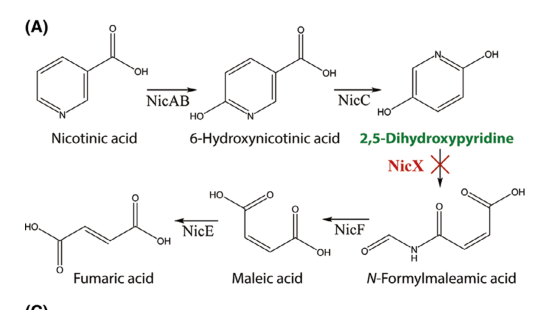

## Question

# Gene Research for Functional Annotation

## ⚠️ CRITICAL: Gene/Protein Identification Context

**BEFORE YOU BEGIN RESEARCH:** You MUST verify you are researching the CORRECT gene/protein. Gene symbols can be ambiguous, especially for less well-characterized genes from non-model organisms.

### Target Gene/Protein Identity (from UniProt):
- **UniProt Accession:** Q88FY1
- **Protein Description:** RecName: Full=2,5-dihydroxypyridine 5,6-dioxygenase; Short=2,5-DHP dioxygenase; EC=1.13.11.9; AltName: Full=Nicotinate degradation protein X;
- **Gene Information:** Name=nicX; OrderedLocusNames=PP_3945;
- **Organism (full):** Pseudomonas putida (strain ATCC 47054 / DSM 6125 / CFBP 8728 / NCIMB 11950 / KT2440).
- **Protein Family:** Not specified in UniProt
- **Key Domains:** M29_Exopeptidase. (IPR052170); NicX. (IPR058739); NicX (PF26233)

### MANDATORY VERIFICATION STEPS:

1. **Check if the gene symbol "nicX" matches the protein description above**
2. **Verify the organism is correct:** Pseudomonas putida (strain ATCC 47054 / DSM 6125 / CFBP 8728 / NCIMB 11950 / KT2440).
3. **Check if protein family/domains align with what you find in literature**
4. **If you find literature for a DIFFERENT gene with the same or similar symbol, STOP**

### If Gene Symbol is Ambiguous or You Cannot Find Relevant Literature:

**DO NOT PROCEED WITH RESEARCH ON A DIFFERENT GENE.** Instead:
- State clearly: "The gene symbol 'nicX' is ambiguous or literature is limited for this specific protein"
- Explain what you found (e.g., "Found extensive literature on a different gene with the same symbol in a different organism")
- Describe the protein based ONLY on the UniProt information provided above
- Suggest that the protein function can be inferred from domain/family information

### Research Target:

Please provide a comprehensive research report on the gene **nicX** (gene ID: nicX, UniProt: Q88FY1) in PSEPK.

The research report should be a detailed narrative explaining the function, biological processes, and localization of the gene product. Citations should be given for all claims.

You should prioritize authoritative reviews and primary scientific literature when conducting research. You can supplement
this with annotations you find in gene/protein databases, but these can be outdated or inaccurate.

We are specifically interested in the primary function of the gene - for enzymes, what reaction is catalyzed, and what is the substrate specificity? For transporters, what is the substrate? For structural proteins or adapters, what is the broader structural role? For signaling molecules, what is the role in the pathway.

We are interested in where in or outside the cell the gene product carries out its function.

We are also interested in the signaling or biochemical pathways in which the gene functions. We are less interested in broad pleiotropic effects, except where these elucidate the precise role.

Include evidence where possible. We are interested in both experimental evidence as well as inference from structure, evolution, or bioinformatic analysis. Precise studies should be prioritized over high-throughput, where available.

## Output

Question: You are an expert researcher providing comprehensive, well-cited information.

Provide detailed information focusing on:
1. Key concepts and definitions with current understanding
2. Recent developments and latest research (prioritize 2023-2024 sources)
3. Current applications and real-world implementations
4. Expert opinions and analysis from authoritative sources
5. Relevant statistics and data from recent studies

Format as a comprehensive research report with proper citations. Include URLs and publication dates where available.
Always prioritize recent, authoritative sources and provide specific citations for all major claims.

# Gene Research for Functional Annotation

## ⚠️ CRITICAL: Gene/Protein Identification Context

**BEFORE YOU BEGIN RESEARCH:** You MUST verify you are researching the CORRECT gene/protein. Gene symbols can be ambiguous, especially for less well-characterized genes from non-model organisms.

### Target Gene/Protein Identity (from UniProt):
- **UniProt Accession:** Q88FY1
- **Protein Description:** RecName: Full=2,5-dihydroxypyridine 5,6-dioxygenase; Short=2,5-DHP dioxygenase; EC=1.13.11.9; AltName: Full=Nicotinate degradation protein X;
- **Gene Information:** Name=nicX; OrderedLocusNames=PP_3945;
- **Organism (full):** Pseudomonas putida (strain ATCC 47054 / DSM 6125 / CFBP 8728 / NCIMB 11950 / KT2440).
- **Protein Family:** Not specified in UniProt
- **Key Domains:** M29_Exopeptidase. (IPR052170); NicX. (IPR058739); NicX (PF26233)

### MANDATORY VERIFICATION STEPS:

1. **Check if the gene symbol "nicX" matches the protein description above**
2. **Verify the organism is correct:** Pseudomonas putida (strain ATCC 47054 / DSM 6125 / CFBP 8728 / NCIMB 11950 / KT2440).
3. **Check if protein family/domains align with what you find in literature**
4. **If you find literature for a DIFFERENT gene with the same or similar symbol, STOP**

### If Gene Symbol is Ambiguous or You Cannot Find Relevant Literature:

**DO NOT PROCEED WITH RESEARCH ON A DIFFERENT GENE.** Instead:
- State clearly: "The gene symbol 'nicX' is ambiguous or literature is limited for this specific protein"
- Explain what you found (e.g., "Found extensive literature on a different gene with the same symbol in a different organism")
- Describe the protein based ONLY on the UniProt information provided above
- Suggest that the protein function can be inferred from domain/family information

### Research Target:

Please provide a comprehensive research report on the gene **nicX** (gene ID: nicX, UniProt: Q88FY1) in PSEPK.

The research report should be a detailed narrative explaining the function, biological processes, and localization of the gene product. Citations should be given for all claims.

You should prioritize authoritative reviews and primary scientific literature when conducting research. You can supplement
this with annotations you find in gene/protein databases, but these can be outdated or inaccurate.

We are specifically interested in the primary function of the gene - for enzymes, what reaction is catalyzed, and what is the substrate specificity? For transporters, what is the substrate? For structural proteins or adapters, what is the broader structural role? For signaling molecules, what is the role in the pathway.

We are interested in where in or outside the cell the gene product carries out its function.

We are also interested in the signaling or biochemical pathways in which the gene functions. We are less interested in broad pleiotropic effects, except where these elucidate the precise role.

Include evidence where possible. We are interested in both experimental evidence as well as inference from structure, evolution, or bioinformatic analysis. Precise studies should be prioritized over high-throughput, where available.

# Research Report: **nicX (PP_3945; UniProt Q88FY1)** in *Pseudomonas putida* KT2440

**Scope & identity verification.** This report concerns *Pseudomonas putida* strain KT2440 (PSEPK) **nicX (PP_3945; UniProt Q88FY1)**, annotated as **2,5-dihydroxypyridine 5,6-dioxygenase** (EC **1.13.11.9**). In the KT2440 nicotinic-acid (nicotinate; NA) catabolic gene cluster, **NicX catalyzes the ring-opening step converting 2,5-dihydroxypyridine (2,5-DHP) to N-formylmaleamic acid (NFM)**. This mapping is explicitly stated in KT2440-focused primary literature and matches the UniProt identity provided (jimenez2008decipheringthegenetic pages 1-2, xiao2018finrregulatesexpression pages 3-4, jimenez2008decipheringthegenetic pages 4-5).

## 1) Key concepts and current understanding

### 1.1 Definition and primary biochemical function
**NicX is an Fe(II)-dependent extradiol-type ring-cleavage dioxygenase** that catalyzes **dioxygenolytic cleavage** of **2,5-dihydroxypyridine (2,5-DHP)**, yielding **N-formylmaleamic acid (NFM)** as the product of ring opening (jimenez2008decipheringthegenetic pages 4-5). The reaction is positioned in the aerobic “**maleamate pathway**” for NA degradation: NA is converted to 6-hydroxynicotinate (6HNA), then to 2,5-DHP, which is then opened by NicX to NFM before downstream conversion to fumarate (jimenez2008decipheringthegenetic pages 1-2, xiao2018finrregulatesexpression pages 3-4).

A central current concept emerging from the KT2440 characterization is that **NicX is evolutionarily unusual** among ring-cleaving dioxygenases: it was proposed as **the founding member of a new family of extradiol ring-cleavage dioxygenases** with an active-site architecture inferred from modeling, rather than sequence similarity to classical extradiol dioxygenases (jimenez2008decipheringthegenetic pages 1-2, jimenez2008decipheringthegenetic pages 4-5).

### 1.2 Enzyme class, cofactor requirement, and catalytic motif
Experimental purification and metal analyses show **NicX requires Fe2+** for activity. Purified NicX initially lacked detectable metal but became active after Fe2+-dependent reactivation, at which point approximately **~1 mol Fe per mol monomer** was detected (jimenez2008decipheringthegenetic pages 4-5). Structural modeling identified a canonical **2-His-1-carboxylate** motif with putative ligands **H265, H318, and D320**, consistent with non-heme Fe(II)-dependent extradiol dioxygenases (jimenez2008decipheringthegenetic pages 4-5).

### 1.3 Pathway context in KT2440 (nicotinic acid degradation)
In KT2440, nic genes are organized as a cluster designated **nicTPFEDCXRAB** (jimenez2008decipheringthegenetic pages 1-2). Within this pathway:
- **NicC** converts **6HNA → 2,5-DHP** (xiao2018finrregulatesexpression pages 3-4, jimenez2008decipheringthegenetic pages 3-4).
- **NicX** converts **2,5-DHP → NFM** (ring cleavage) (xiao2018finrregulatesexpression pages 3-4, jimenez2008decipheringthegenetic pages 4-5).
- Downstream steps convert NFM through maleamate/maleate intermediates to **fumarate**, integrating into central metabolism (brickman2018thebordetellabronchiseptica pages 4-4, jimenez2008decipheringthegenetic pages 1-2).

## 2) Experimental evidence for nicX function (KT2440)

### 2.1 Genetic evidence (essentiality for growth on nicotinate)
In KT2440, **disruption of nicX prevents growth on nicotinic acid as the sole carbon source**, supporting that NicX is essential for aerobic NA catabolism under those conditions (jimenez2008decipheringthegenetic pages 1-2). This aligns with NicX being the unique ring-cleavage step in the pathway (jimenez2008decipheringthegenetic pages 1-2).

### 2.2 Biochemical evidence (expression, product identity, metal dependence)
Jiménez et al. expressed **nicX** in *E. coli*, purified the protein (~**39 kDa** by SDS-PAGE), and demonstrated dioxygenase activity in extracts (jimenez2008decipheringthegenetic pages 4-5). The **ring-cleavage product was identified as N-formylmaleamic acid (NFM)** using **NMR and mass spectrometry**, resolving earlier ambiguity in the literature about whether the dioxygenase produced NFM vs. downstream hydrolysis products (jimenez2008decipheringthegenetic pages 4-5). NicX catalysis consumes **~1 mol O2 per mol 2,5-DHP**, consistent with dioxygenolytic ring cleavage (jimenez2008decipheringthegenetic pages 6-6).

### 2.3 Quantitative kinetics and specificity
Reported kinetic parameters for purified NicX include:
- **K\u2098 ~ 70 \u03bcM** for 2,5-DHP
- **V\u2098\u2090\u2093 ~ 2.3 \u03bcmol min\u207b\u00b9 mg\u207b\u00b9**
- **Strict substrate specificity for 2,5-DHP** (within the tested panel) (jimenez2008decipheringthegenetic pages 4-5).

## 3) Genomic context, regulation, and cellular localization

### 3.1 Operon organization and promoters
Within the KT2440 nic cluster, **nicX is part of NA-inducible operons**, and one regulatory study specifically notes **nicXR is transcribed from the P\u2093 promoter** (xiao2018finrregulatesexpression pages 3-4).

### 3.2 Transcriptional regulation by FinR and NicR
A KT2440-focused regulatory study showed that:
- **FinR (a LysR-type regulator)** acts as a **positive regulator** of **nicC and nicX operons**.
- **NicR** is a repressor of the nic genes, with induction by NA/6HNA.
- **FinR deletion reduces induction of nicC/nicX by NA/6HNA**, and FinR and NicR each **bind nicX and nicC promoter regions directly** (xiao2018finrregulatesexpression pages 1-2, xiao2018finrregulatesexpression pages 2-3).

### 3.3 Cellular localization (evidence and inference)
Direct localization experiments (e.g., microscopy, fractionation with markers) were **not identified** in the retrieved KT2440 primary literature for NicX. However, NicX was **purified from soluble extracts** and acts on the intracellular intermediate **2,5-DHP**, supporting the interpretation that NicX functions as a **soluble intracellular (cytosolic) enzyme** (inference; strongest direct support is soluble purification/activity) (jimenez2008decipheringthegenetic pages 4-5).

## 4) Recent developments (prioritizing 2023–2024)

### 4.1 2024: nicX as a target for reversible base editing in Gram-negative bacteria
A 2024 genome-engineering toolkit paper used **nicX in *P. putida*** as a functional target in **cytidine/adenine base editing** workflows. Key reported implementation details include **nicotinic acid supplementation at 5 mM**, growth in **LB at 30°C with shaking (200 rpm)**, and use of base editors to introduce **premature stop codons** (functional knockouts) and then **revert** those edits using adenine base editors (kozaeva2024thepablo· pages 2-3).

### 4.2 2023: expert synthesis of EC 1.13.11.9 role across nicotine/nicotinate-related catabolism
A 2023 systematic review of nicotine-related bacterial metabolism describes **2,5-DHP 5,6-dioxygenase (EC 1.13.11.9; often called Hpo in nicotine pathways)** as an **Fe(II)-dependent ring-opening** enzyme acting on 2,5-DHP and funneling metabolites through N-formylmaleamic acid to maleamate/maleate and ultimately **fumarate feeding into the Krebs/TCA cycle** (boiangiu2023insightsintopharmacological pages 11-14). While this review centers on nicotine catabolism (not specifically KT2440 nicotinate catabolism), the enzymatic role and EC assignment are directly consistent with KT2440 NicX biochemical function (jimenez2008decipheringthegenetic pages 4-5, boiangiu2023insightsintopharmacological pages 11-14).

**Limitations on 2023–2024 nicX-specific mechanistic advances.** In the retrieved corpus, 2023–2024 sources primarily contribute (i) engineering implementation (base editing) and (ii) review-level consolidation of nicotine pathway steps; **new KT2440 NicX structures or new kinetic/mechanistic dissection specific to Q88FY1 were not found** in the available full text retrieved here.

## 5) Current applications and real-world implementations

### 5.1 nicX disruption as a visible/fluorescent phenotype for strain construction
In *P. putida* KT2440, **interrupting nicX causes accumulation of 2,5-DHP** and yields a distinctive **green-to-brown pigmented phenotype**, described as a dark green, fluorescent compound that can be observed **inside and outside** the cells and can **autoxidize to brown polymers** (wirth2020acceleratedgenomeengineering pages 9-10). This phenotype was exploited as a practical **screening readout** in genome-engineering demonstrations: mutant colonies were readily identified on **LB agar supplemented with 5 mM nicotinic acid** (wirth2020acceleratedgenomeengineering pages 10-11).

Figure evidence for the pathway step and phenotype is available from Wirth et al. (2020): the pathway schematic highlights the blockage at NicX and the plate image shows the pigmented colonies used for selection/screening (wirth2020acceleratedgenomeengineering media 60f6f149, wirth2020acceleratedgenomeengineering media b386a739).

### 5.2 Quantitative engineering outcomes
In the same genome engineering demonstration, the fraction of mutant colonies after recombination resolution was reported to be approximately **~50% (53%, 46%, 48%)** across different plasmid/vector setups (wirth2020acceleratedgenomeengineering pages 10-11).

### 5.3 Broader biodegradation/biotransformation context
The KT2440 nic cluster was framed as a “model system” for degradation of N-heterocyclic aromatic compounds, with potential relevance to environmental detoxification and biotransformations that proceed through 6HNA and 2,5-DHP intermediates (jimenez2008decipheringthegenetic pages 1-2). Cross-species work on nicotine degradation (reviewed in 2023) positions the EC 1.13.11.9 ring-opening step as a key junction to channel heteroaromatic metabolites toward central metabolism (boiangiu2023insightsintopharmacological pages 11-14).

## 6) Expert analysis and functional-annotation guidance

### 6.1 Functional annotation statement (recommended)
For functional annotation of UniProt **Q88FY1 / PP_3945 / nicX** in *P. putida* KT2440, the most defensible primary-function statement is:

> **2,5-dihydroxypyridine 5,6-dioxygenase (EC 1.13.11.9), Fe(II)-dependent extradiol ring-cleavage enzyme in nicotinic-acid (nicotinate) catabolism; catalyzes dioxygenolytic cleavage of 2,5-dihydroxypyridine to N-formylmaleamic acid.** (jimenez2008decipheringthegenetic pages 4-5, xiao2018finrregulatesexpression pages 3-4)

### 6.2 Pathway placement and operon/regulatory annotation
- Place NicX in the **maleamate pathway** downstream of NicC and upstream of NicD/NicF/NicE (jimenez2008decipheringthegenetic pages 1-2, brickman2018thebordetellabronchiseptica pages 4-4).
- Regulatory annotation: **FinR acts as a positive regulator** and **NicR as a repressor**, both binding nic promoters (xiao2018finrregulatesexpression pages 1-2).

### 6.3 Localization annotation (with evidence grading)
- Evidence-supported: **soluble enzyme purified from soluble extracts** (jimenez2008decipheringthegenetic pages 4-5).
- Inference: likely **cytosolic** (no direct localization experiment identified) (jimenez2008decipheringthegenetic pages 4-5).

## Summary table

| Feature | Summary |
|---|---|
| Gene/protein identity | **nicX = PP_3945 = UniProt Q88FY1** in *Pseudomonas putida* KT2440; encoded in the **nicTPFEDCXRAB** nicotinic-acid catabolic cluster and annotated as **2,5-dihydroxypyridine 5,6-dioxygenase** (EC 1.13.11.9) (jimenez2008decipheringthegenetic pages 1-2) |
| Enzymatic function | NicX catalyzes **dioxygenolytic ring cleavage** of **2,5-dihydroxypyridine (2,5-DHP)** between **C5 and C6** to yield **N-formylmaleamic acid (NFM)**; this is the ring-opening step after NicC forms 2,5-DHP from 6-hydroxynicotinic acid in aerobic nicotinate degradation (jimenez2008decipheringthegenetic pages 4-5, jimenez2008decipheringthegenetic pages 1-2) |
| Substrate specificity | Reported to have **strict substrate specificity for 2,5-DHP** in the biochemical characterization; no broader substrate activity was indicated in the cited KT2440 study (jimenez2008decipheringthegenetic pages 4-5) |
| Cofactor / metal dependence | NicX is a **Fe²⁺-dependent dioxygenase**. Purified enzyme initially lacked detectable metal but could be **reactivated with Fe²⁺**; ICP detected about **1 mol Fe per mol monomer** after reactivation. Modeling supports a canonical **2-His-1-carboxylate** metal-binding motif with putative residues **H265, H318, D320** (jimenez2008decipheringthegenetic pages 4-5) |
| Activation conditions | Reactivation of purified NicX was achieved using **10 mM DTT + 0.5 mM FeSO₄**; one cited excerpt also notes Fe²⁺-dependent reactivation at **25 μM Fe²⁺** in biochemical workup (jimenez2008decipheringthegenetic pages 6-6, jimenez2008decipheringthegenetic pages 4-5) |
| Key kinetic parameters | Reported biochemical parameters for purified NicX: **Km ≈ 70 μM**, **Vmax ≈ 2.3 μmol min⁻¹ mg⁻¹**, and **1 mol O₂ consumed per mol 2,5-DHP** (jimenez2008decipheringthegenetic pages 4-5) |
| Genetic evidence | **ΔnicX** mutants lacked 2,5-DHP dioxygenase activity, and disruption of **nicX** abolished growth of KT2440 on **nicotinic acid as sole carbon source**, demonstrating NicX is essential for aerobic nicotinate utilization (jimenez2008decipheringthegenetic pages 1-2, jimenez2008decipheringthegenetic pages 4-5) |
| Operon / genomic context | nicX lies within the **nic cluster** and is part of an **NA-inducible nicX operon**; one study states **nicXR is transcribed from the Px promoter** (xiao2018finrregulatesexpression pages 3-4, jimenez2008decipheringthegenetic pages 1-2) |
| Regulation | **FinR** positively regulates the **nicX** and **nicC** operons; **NicR** acts as a repressor, and both regulators bind the **nicX** promoter region directly. Deleting **finR** reduced nicX expression and impaired growth on **NA/6HNA**, while complementation restored expression/growth (xiao2018finrregulatesexpression pages 3-4, xiao2018finrregulatesexpression pages 1-2, xiao2018finrregulatesexpression pages 2-3) |
| Applied / engineering phenotype | Deleting **nicX** causes accumulation of **2,5-DHP**, producing a **dark green, fluorescent** compound that appears **inside and outside cells** and can autoxidize into **brown polymers**; colonies become **green-to-brown pigmented**, enabling visual identification of mutants (wirth2020acceleratedgenomeengineering pages 10-11, wirth2020acceleratedgenomeengineering pages 9-10, wirth2020acceleratedgenomeengineering media 60f6f149) |
| Engineering implementation details | In genome-engineering demonstrations, ΔnicX mutants were screened on **LB agar + 5 mM nicotinic acid**; mutant fraction after recombination resolution was reported as **~50%** (**53%, 46%, 48%** with different vectors) (wirth2020acceleratedgenomeengineering pages 10-11, wirth2020acceleratedgenomeengineering media 60f6f149) |
| 2024 base-editing use | In 2024 base-editing workflows in *P. putida*, **nicX** was used as a functional target for **premature-stop-codon editing** with PAM-relaxed **cytidine base editors**, with **nicotinic acid supplementation at 5 mM**; cultures were grown in **LB at 30°C, 200 rpm**, and edits could be reverted using **adenine base editors** (kozaeva2024thepablo· pages 2-3) |
| Cellular localization | No direct experimental subcellular localization for NicX was found in the cited KT2440 primary literature. Because NicX is purified from soluble extracts and functions on an intracellular pathway intermediate (2,5-DHP), the best-supported interpretation is that it is a **soluble intracellular/cytosolic enzyme**, but this remains an inference rather than a localization experiment (jimenez2008decipheringthegenetic pages 4-5, wirth2020acceleratedgenomeengineering pages 9-10) |

*Table: This table condenses the key experimentally supported facts about nicX/PP_3945/Q88FY1 in *Pseudomonas putida* KT2440, including catalytic function, metal dependence, kinetics, regulation, and practical engineering phenotypes. It is useful as a quick reference for functional annotation and pathway context.*

## Key figure evidence (pathway + phenotype)
- Nicotinate degradation pathway schematic highlighting the NicX-catalyzed step/blockage (wirth2020acceleratedgenomeengineering media 60f6f149).
- Plate phenotype showing green/brown pigmented colonies associated with *P. putida* **ΔnicX** (wirth2020acceleratedgenomeengineering media b386a739).

## URLs and publication dates (from retrieved sources)
- Jiménez et al., **2008-08-12** (PNAS). https://doi.org/10.1073/pnas.0802273105 (jimenez2008decipheringthegenetic pages 1-2)
- Xiao et al., **2018-10** (Applied and Environmental Microbiology). https://doi.org/10.1128/aem.01210-18 (xiao2018finrregulatesexpression pages 1-2)
- Wirth et al., **2020-03** (Microbial Biotechnology). https://doi.org/10.1111/1751-7915.13396 (wirth2020acceleratedgenomeengineering pages 10-11)
- Kozaeva et al., **2024-01** (Nucleic Acids Research). https://doi.org/10.1093/nar/gkad1236 (kozaeva2024thepablo· pages 2-3)
- Boiangiu et al., **2023-12** (Biomolecules). https://doi.org/10.3390/biom14010023 (boiangiu2023insightsintopharmacological pages 11-14)

References

1. (jimenez2008decipheringthegenetic pages 1-2): José I. Jiménez, Ángeles Canales, Jesús Jiménez-Barbero, Krzysztof Ginalski, Leszek Rychlewski, José L. García, and Eduardo Díaz. Deciphering the genetic determinants for aerobic nicotinic acid degradation: the nic cluster from pseudomonas putida kt2440. Proceedings of the National Academy of Sciences, 105:11329-11334, Aug 2008. URL: https://doi.org/10.1073/pnas.0802273105, doi:10.1073/pnas.0802273105. This article has 173 citations and is from a highest quality peer-reviewed journal.

2. (xiao2018finrregulatesexpression pages 3-4): Yujie Xiao, Wenjing Zhu, Huizhong Liu, Hailing Nie, Wenli Chen, and Qiaoyun Huang. Finr regulates expression of <i>nicc</i> and <i>nicx</i> operons, involved in nicotinic acid degradation in pseudomonas putida kt2440. Applied and Environmental Microbiology, Oct 2018. URL: https://doi.org/10.1128/aem.01210-18, doi:10.1128/aem.01210-18. This article has 10 citations and is from a peer-reviewed journal.

3. (jimenez2008decipheringthegenetic pages 4-5): José I. Jiménez, Ángeles Canales, Jesús Jiménez-Barbero, Krzysztof Ginalski, Leszek Rychlewski, José L. García, and Eduardo Díaz. Deciphering the genetic determinants for aerobic nicotinic acid degradation: the nic cluster from pseudomonas putida kt2440. Proceedings of the National Academy of Sciences, 105:11329-11334, Aug 2008. URL: https://doi.org/10.1073/pnas.0802273105, doi:10.1073/pnas.0802273105. This article has 173 citations and is from a highest quality peer-reviewed journal.

4. (jimenez2008decipheringthegenetic pages 3-4): José I. Jiménez, Ángeles Canales, Jesús Jiménez-Barbero, Krzysztof Ginalski, Leszek Rychlewski, José L. García, and Eduardo Díaz. Deciphering the genetic determinants for aerobic nicotinic acid degradation: the nic cluster from pseudomonas putida kt2440. Proceedings of the National Academy of Sciences, 105:11329-11334, Aug 2008. URL: https://doi.org/10.1073/pnas.0802273105, doi:10.1073/pnas.0802273105. This article has 173 citations and is from a highest quality peer-reviewed journal.

5. (brickman2018thebordetellabronchiseptica pages 4-4): Timothy J. Brickman and Sandra K. Armstrong. The bordetella bronchiseptica nic locus encodes a nicotinic acid degradation pathway and the 6‐hydroxynicotinate‐responsive regulator bpsr. Molecular Microbiology, 108:397-409, May 2018. URL: https://doi.org/10.1111/mmi.13943, doi:10.1111/mmi.13943. This article has 13 citations and is from a domain leading peer-reviewed journal.

6. (jimenez2008decipheringthegenetic pages 6-6): José I. Jiménez, Ángeles Canales, Jesús Jiménez-Barbero, Krzysztof Ginalski, Leszek Rychlewski, José L. García, and Eduardo Díaz. Deciphering the genetic determinants for aerobic nicotinic acid degradation: the nic cluster from pseudomonas putida kt2440. Proceedings of the National Academy of Sciences, 105:11329-11334, Aug 2008. URL: https://doi.org/10.1073/pnas.0802273105, doi:10.1073/pnas.0802273105. This article has 173 citations and is from a highest quality peer-reviewed journal.

7. (xiao2018finrregulatesexpression pages 1-2): Yujie Xiao, Wenjing Zhu, Huizhong Liu, Hailing Nie, Wenli Chen, and Qiaoyun Huang. Finr regulates expression of <i>nicc</i> and <i>nicx</i> operons, involved in nicotinic acid degradation in pseudomonas putida kt2440. Applied and Environmental Microbiology, Oct 2018. URL: https://doi.org/10.1128/aem.01210-18, doi:10.1128/aem.01210-18. This article has 10 citations and is from a peer-reviewed journal.

8. (xiao2018finrregulatesexpression pages 2-3): Yujie Xiao, Wenjing Zhu, Huizhong Liu, Hailing Nie, Wenli Chen, and Qiaoyun Huang. Finr regulates expression of <i>nicc</i> and <i>nicx</i> operons, involved in nicotinic acid degradation in pseudomonas putida kt2440. Applied and Environmental Microbiology, Oct 2018. URL: https://doi.org/10.1128/aem.01210-18, doi:10.1128/aem.01210-18. This article has 10 citations and is from a peer-reviewed journal.

9. (kozaeva2024thepablo· pages 2-3): Ekaterina Kozaeva, Zacharias S Nielsen, Manuel Nieto-Domínguez, and Pablo I Nikel. The pablo <b>·</b> pcasso self-curing vector toolset for unconstrained cytidine and adenine base-editing in gram-negative bacteria. Nucleic Acids Research, 52:e19-e19, Jan 2024. URL: https://doi.org/10.1093/nar/gkad1236, doi:10.1093/nar/gkad1236. This article has 34 citations and is from a highest quality peer-reviewed journal.

10. (boiangiu2023insightsintopharmacological pages 11-14): Razvan Stefan Boiangiu, Ion Brinza, Iasmina Honceriu, Marius Mihasan, and Lucian Hritcu. Insights into pharmacological activities of nicotine and 6-hydroxy-l-nicotine, a bacterial nicotine derivative: a systematic review. Biomolecules, 14:23, Dec 2023. URL: https://doi.org/10.3390/biom14010023, doi:10.3390/biom14010023. This article has 8 citations.

11. (wirth2020acceleratedgenomeengineering pages 9-10): Nicolas T. Wirth, Ekaterina Kozaeva, and Pablo I. Nikel. Accelerated genome engineering of pseudomonas putida by i‐scei―mediated recombination and crispr‐cas9 counterselection. Microbial Biotechnology, 13:233-249, Mar 2020. URL: https://doi.org/10.1111/1751-7915.13396, doi:10.1111/1751-7915.13396. This article has 168 citations and is from a peer-reviewed journal.

12. (wirth2020acceleratedgenomeengineering pages 10-11): Nicolas T. Wirth, Ekaterina Kozaeva, and Pablo I. Nikel. Accelerated genome engineering of pseudomonas putida by i‐scei―mediated recombination and crispr‐cas9 counterselection. Microbial Biotechnology, 13:233-249, Mar 2020. URL: https://doi.org/10.1111/1751-7915.13396, doi:10.1111/1751-7915.13396. This article has 168 citations and is from a peer-reviewed journal.

13. (wirth2020acceleratedgenomeengineering media 60f6f149): Nicolas T. Wirth, Ekaterina Kozaeva, and Pablo I. Nikel. Accelerated genome engineering of pseudomonas putida by i‐scei―mediated recombination and crispr‐cas9 counterselection. Microbial Biotechnology, 13:233-249, Mar 2020. URL: https://doi.org/10.1111/1751-7915.13396, doi:10.1111/1751-7915.13396. This article has 168 citations and is from a peer-reviewed journal.

14. (wirth2020acceleratedgenomeengineering media b386a739): Nicolas T. Wirth, Ekaterina Kozaeva, and Pablo I. Nikel. Accelerated genome engineering of pseudomonas putida by i‐scei―mediated recombination and crispr‐cas9 counterselection. Microbial Biotechnology, 13:233-249, Mar 2020. URL: https://doi.org/10.1111/1751-7915.13396, doi:10.1111/1751-7915.13396. This article has 168 citations and is from a peer-reviewed journal.

## Artifacts

- [Edison artifact artifact-00](nicX-deep-research-falcon_artifacts/artifact-00.md)

## Citations

1. jimenez2008decipheringthegenetic pages 4-5
2. jimenez2008decipheringthegenetic pages 1-2
3. jimenez2008decipheringthegenetic pages 6-6
4. xiao2018finrregulatesexpression pages 3-4
5. boiangiu2023insightsintopharmacological pages 11-14
6. wirth2020acceleratedgenomeengineering pages 9-10
7. wirth2020acceleratedgenomeengineering pages 10-11
8. xiao2018finrregulatesexpression pages 1-2
9. jimenez2008decipheringthegenetic pages 3-4
10. brickman2018thebordetellabronchiseptica pages 4-4
11. xiao2018finrregulatesexpression pages 2-3
12. https://doi.org/10.1073/pnas.0802273105
13. https://doi.org/10.1128/aem.01210-18
14. https://doi.org/10.1111/1751-7915.13396
15. https://doi.org/10.1093/nar/gkad1236
16. https://doi.org/10.3390/biom14010023
17. https://doi.org/10.1073/pnas.0802273105,
18. https://doi.org/10.1128/aem.01210-18,
19. https://doi.org/10.1111/mmi.13943,
20. https://doi.org/10.1093/nar/gkad1236,
21. https://doi.org/10.3390/biom14010023,
22. https://doi.org/10.1111/1751-7915.13396,