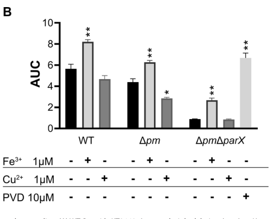

## Question

# Gene Research for Functional Annotation

## ⚠️ CRITICAL: Gene/Protein Identification Context

**BEFORE YOU BEGIN RESEARCH:** You MUST verify you are researching the CORRECT gene/protein. Gene symbols can be ambiguous, especially for less well-characterized genes from non-model organisms.

### Target Gene/Protein Identity (from UniProt):
- **UniProt Accession:** Q88F87
- **Protein Description:** RecName: Full=Pyoverdine export outer membrane protein OpmQ {ECO:0000305}; Flags: Precursor;
- **Gene Information:** Name=opmQ {ECO:0000303|PubMed:30346656}; OrderedLocusNames=PP_4211 {ECO:0000312|EMBL:AAN69792.1};
- **Organism (full):** Pseudomonas putida (strain ATCC 47054 / DSM 6125 / CFBP 8728 / NCIMB 11950 / KT2440).
- **Protein Family:** Belongs to the outer membrane factor (OMF) (TC 1.B.17)
- **Key Domains:** MdtP/NodT-like. (IPR010131); OMP_efflux. (IPR003423); OEP (PF02321)

### MANDATORY VERIFICATION STEPS:

1. **Check if the gene symbol "opmQ" matches the protein description above**
2. **Verify the organism is correct:** Pseudomonas putida (strain ATCC 47054 / DSM 6125 / CFBP 8728 / NCIMB 11950 / KT2440).
3. **Check if protein family/domains align with what you find in literature**
4. **If you find literature for a DIFFERENT gene with the same or similar symbol, STOP**

### If Gene Symbol is Ambiguous or You Cannot Find Relevant Literature:

**DO NOT PROCEED WITH RESEARCH ON A DIFFERENT GENE.** Instead:
- State clearly: "The gene symbol 'opmQ' is ambiguous or literature is limited for this specific protein"
- Explain what you found (e.g., "Found extensive literature on a different gene with the same symbol in a different organism")
- Describe the protein based ONLY on the UniProt information provided above
- Suggest that the protein function can be inferred from domain/family information

### Research Target:

Please provide a comprehensive research report on the gene **opmQ** (gene ID: opmQ, UniProt: Q88F87) in PSEPK.

The research report should be a detailed narrative explaining the function, biological processes, and localization of the gene product. Citations should be given for all claims.

You should prioritize authoritative reviews and primary scientific literature when conducting research. You can supplement
this with annotations you find in gene/protein databases, but these can be outdated or inaccurate.

We are specifically interested in the primary function of the gene - for enzymes, what reaction is catalyzed, and what is the substrate specificity? For transporters, what is the substrate? For structural proteins or adapters, what is the broader structural role? For signaling molecules, what is the role in the pathway.

We are interested in where in or outside the cell the gene product carries out its function.

We are also interested in the signaling or biochemical pathways in which the gene functions. We are less interested in broad pleiotropic effects, except where these elucidate the precise role.

Include evidence where possible. We are interested in both experimental evidence as well as inference from structure, evolution, or bioinformatic analysis. Precise studies should be prioritized over high-throughput, where available.

## Output

Question: You are an expert researcher providing comprehensive, well-cited information.

Provide detailed information focusing on:
1. Key concepts and definitions with current understanding
2. Recent developments and latest research (prioritize 2023-2024 sources)
3. Current applications and real-world implementations
4. Expert opinions and analysis from authoritative sources
5. Relevant statistics and data from recent studies

Format as a comprehensive research report with proper citations. Include URLs and publication dates where available.
Always prioritize recent, authoritative sources and provide specific citations for all major claims.

# Gene Research for Functional Annotation

## ⚠️ CRITICAL: Gene/Protein Identification Context

**BEFORE YOU BEGIN RESEARCH:** You MUST verify you are researching the CORRECT gene/protein. Gene symbols can be ambiguous, especially for less well-characterized genes from non-model organisms.

### Target Gene/Protein Identity (from UniProt):
- **UniProt Accession:** Q88F87
- **Protein Description:** RecName: Full=Pyoverdine export outer membrane protein OpmQ {ECO:0000305}; Flags: Precursor;
- **Gene Information:** Name=opmQ {ECO:0000303|PubMed:30346656}; OrderedLocusNames=PP_4211 {ECO:0000312|EMBL:AAN69792.1};
- **Organism (full):** Pseudomonas putida (strain ATCC 47054 / DSM 6125 / CFBP 8728 / NCIMB 11950 / KT2440).
- **Protein Family:** Belongs to the outer membrane factor (OMF) (TC 1.B.17)
- **Key Domains:** MdtP/NodT-like. (IPR010131); OMP_efflux. (IPR003423); OEP (PF02321)

### MANDATORY VERIFICATION STEPS:

1. **Check if the gene symbol "opmQ" matches the protein description above**
2. **Verify the organism is correct:** Pseudomonas putida (strain ATCC 47054 / DSM 6125 / CFBP 8728 / NCIMB 11950 / KT2440).
3. **Check if protein family/domains align with what you find in literature**
4. **If you find literature for a DIFFERENT gene with the same or similar symbol, STOP**

### If Gene Symbol is Ambiguous or You Cannot Find Relevant Literature:

**DO NOT PROCEED WITH RESEARCH ON A DIFFERENT GENE.** Instead:
- State clearly: "The gene symbol 'opmQ' is ambiguous or literature is limited for this specific protein"
- Explain what you found (e.g., "Found extensive literature on a different gene with the same symbol in a different organism")
- Describe the protein based ONLY on the UniProt information provided above
- Suggest that the protein function can be inferred from domain/family information

### Research Target:

Please provide a comprehensive research report on the gene **opmQ** (gene ID: opmQ, UniProt: Q88F87) in PSEPK.

The research report should be a detailed narrative explaining the function, biological processes, and localization of the gene product. Citations should be given for all claims.

You should prioritize authoritative reviews and primary scientific literature when conducting research. You can supplement
this with annotations you find in gene/protein databases, but these can be outdated or inaccurate.

We are specifically interested in the primary function of the gene - for enzymes, what reaction is catalyzed, and what is the substrate specificity? For transporters, what is the substrate? For structural proteins or adapters, what is the broader structural role? For signaling molecules, what is the role in the pathway.

We are interested in where in or outside the cell the gene product carries out its function.

We are also interested in the signaling or biochemical pathways in which the gene functions. We are less interested in broad pleiotropic effects, except where these elucidate the precise role.

Include evidence where possible. We are interested in both experimental evidence as well as inference from structure, evolution, or bioinformatic analysis. Precise studies should be prioritized over high-throughput, where available.

## Research report: **opmQ (UniProt Q88F87; locus PP_4211)** in *Pseudomonas putida* KT2440

### Executive summary
The *Pseudomonas putida* KT2440 gene **opmQ** (UniProt **Q88F87**, locus **PP_4211**) encodes an **outer membrane factor (OMF)/porin** that functions as the **outer-membrane exit duct** of the **PvdRT–OpmQ** tripartite exporter, an **ATP-driven (ABC-type) efflux system** implicated in the secretion (export) of the siderophore **pyoverdine** (PVD). The current best-supported physiological role is facilitating efficient secretion of pyoverdine from the periplasm to the extracellular environment, thereby supporting iron acquisition under iron limitation; however, pyoverdine export in KT2440 is **redundant** and distributed across multiple overlapping tripartite systems. (stein2023navigatingpyoverdineand pages 31-34, stein2023therndefflux pages 1-2, stein2023therndefflux pages 10-13)

### 1) Key concepts and definitions (current understanding)

#### 1.1 Pyoverdine and the iron-acquisition problem
Pyoverdine is the **primary siderophore** of many *Pseudomonas* spp., secreted under iron limitation to chelate Fe(III) in the environment and support growth when iron is scarce. Effective siderophore biology requires not only biosynthesis but also **export/secretion** and subsequent uptake of iron-loaded complexes. (stein2023therndefflux pages 1-2)

#### 1.2 Tripartite efflux exporters in Gram-negative bacteria
A key concept for opmQ annotation is the **tripartite efflux system** spanning the Gram-negative cell envelope. In the framework summarized for *P. putida* KT2440, tripartite exporters comprise: (i) an **inner membrane protein (IMP)** motor/transport component, (ii) a **periplasmic adaptor** (membrane fusion protein; PAP/MFP), and (iii) an **outer membrane porin/channel (OMP/OMF)** that forms the **exit duct** to the exterior. (stein2023navigatingpyoverdineand pages 29-31, stein2023navigatingpyoverdineand pages 25-29)

Within this architecture, **OpmQ** is the **outer membrane component**, and its primary mechanistic role is to provide the terminal conduit across the outer membrane for substrates moved by the inner-membrane and periplasmic components. (stein2023navigatingpyoverdineand pages 31-34, stein2023navigatingpyoverdineand pages 29-31)

#### 1.3 ABC-type MacB-like exporters and relevance to PvdRT–OpmQ
The PvdRT–OpmQ system is described as an **ABC-family tripartite efflux system** in *Pseudomonas*, conceptually similar to MacB–MacA–TolC systems. In MacB-centered assemblies, the functional complex can be described as a **MacB dimer** (inner-membrane ABC transporter), a **hexameric** periplasmic adaptor (MacA), and a **trimeric outer membrane channel** (TolC/OprM family). This provides a structural/functional template supporting the assignment of OpmQ as an OprM/TolC-like OM exit channel within an ATP-driven tripartite exporter. (girard2022transportergenemediatedtyping pages 1-2, stein2023navigatingpyoverdineand pages 25-29)

### 2) Target verification (critical gene/protein identification)

**Identity match to the user-provided UniProt context is supported by organism- and locus-specific literature.** In the *P. putida* KT2440-focused sources retrieved, **OpmQ is explicitly referred to as PP_4211** and described as the **outer membrane protein (OMP) component of the PvdRT–OpmQ operon**. (stein2023navigatingpyoverdineand pages 31-34, stein2023navigatingpyoverdineand pages 46-49)

This is consistent with the UniProt record that describes Q88F87 as a **precursor outer membrane pyoverdine export protein** and a member of the **outer membrane factor (OMF)** family.

### 3) Functional annotation: what OpmQ does

#### 3.1 Primary function: outer-membrane exit duct for pyoverdine export
In *P. putida* KT2440, the PvdRT–OpmQ system is repeatedly described as a pyoverdine secretion apparatus in which **OpmQ is the outer membrane component**. Tripartite exporter logic places OpmQ at the final step of envelope traversal, enabling pyoverdine (once matured in the periplasm) to reach the extracellular space. (stein2023therndefflux pages 1-2, stein2023navigatingpyoverdineand pages 31-34)

#### 3.2 Substrate specificity: strongest support for pyoverdine
The **best-supported physiological substrate** for the OpmQ-containing system is **pyoverdine**.

* Genetic/phenotypic support: deletion of PvdRT–OpmQ in pseudomonads is reported to reduce pyoverdine secretion by **~40–50%** and to cause **periplasmic accumulation** of the siderophore, consistent with a defect in the periplasm-to-outside secretion step that depends on an OM exit channel like OpmQ. (stein2023navigatingpyoverdineand pages 29-31)

* Biochemical support (system-level, not OpmQ-alone): biochemical characterization of PvdRT components in KT2440 provides evidence that pyoverdine directly interacts with the inner-membrane ABC component PvdT and stabilizes aspects of the PvdT–PvdR complex, consistent with pyoverdine being a ligand/substrate of the exporter that uses OpmQ as its OM duct. (stein2023navigatingpyoverdineand pages 43-46, stein2023navigatingpyoverdineand pages 46-49)

Given these data, OpmQ is best annotated as part of a **pyoverdine secretion/export pathway** rather than a general porin.

### 4) Cellular localization and envelope topology

OpmQ is functionally assigned to the **outer membrane** as the OMF/OMP component of a tripartite exporter. Tripartite efflux systems are described as bridging inner membrane → periplasm → outer membrane, with the OMP specifically "located in the outer membrane" and functioning as an "exit duct." (stein2023navigatingpyoverdineand pages 29-31, stein2023navigatingpyoverdineand pages 25-29)

Thus, the gene product’s **site of action** is the **outer membrane**, but its **biological function** is realized only as part of the **assembled tripartite complex** spanning the full cell envelope. (stein2023navigatingpyoverdineand pages 31-34)

### 5) Pathway context and network redundancy

#### 5.1 Overlapping secretion systems for pyoverdine
A central and recent mechanistic insight (KT2440-specific) is that pyoverdine secretion is **not mediated by a single pump**. In KT2440:

* Two tripartite systems—**PvdRT–OpmQ** and the RND-type **MdtABC–OpmB**—are implicated in pyoverdine secretion, and deletion of both does **not** fully abolish secretion, pointing to additional routes/systems. (stein2023navigatingpyoverdineand pages 29-31, stein2023navigatingpyoverdineand pages 31-34, stein2023therndefflux pages 10-13)

* A 2023 study identified **ParXY** as influencing pyoverdine secretion and growth under iron limitation in a background where the two primary secretion systems were inactive (Δpm), reinforcing the concept of a **network of overlapping tripartite efflux activities**. (stein2023therndefflux pages 1-2, stein2023therndefflux pages 10-13)

#### 5.2 Regulatory coupling to iron limitation and siderophore biology
Promoter-reporters in KT2440 show iron responsiveness of efflux/siderophore-linked systems: a parXY promoter fusion showed ~**7-fold** lower luminescence upon Fe(III) supplementation (10 µM FeCl3 in CAA) and ~**2-fold** higher luminescence in chelator-based iron limitation (1 mM bipyridyl in KB). These data support iron-regulated deployment of envelope export functions needed for siderophore physiology. (stein2023therndefflux pages 8-10)

### 6) Recent developments (prioritizing 2023–2024)

#### 6.1 2023: organism-specific genetic and quantitative mapping of the secretion network
A 2023 peer-reviewed study (Microbiology Spectrum) systematically dissected the **redundancy** of tripartite efflux systems influencing pyoverdine secretion in *P. putida* KT2440 via defined deletions and quantitative assays, moving beyond older “single system” narratives. It concluded that **PvdRT–OpmQ** is the **primary** pyoverdine secretion system, with MdtABC–OpmB as a secondary contributor, while ParXY can matter in specific genetic/physiological contexts. (stein2023therndefflux pages 10-13)

This updated view is important for functional annotation because it indicates that an opmQ knockout phenotype may be **partial**, context dependent, and buffered by alternative exporters. (stein2023therndefflux pages 10-13, stein2023navigatingpyoverdineand pages 29-31)

#### 6.2 2023: biochemical characterization of the ABC exporter components that require OpmQ
A 2023 dissertation compiling KT2440 efflux systems reported biochemical characterization of PvdRT components, including ATPase kinetics and pyoverdine effects on the transporter complex, providing mechanistic underpinning for the substrate assignment to the system containing OpmQ. (stein2023navigatingpyoverdineand pages 46-49, stein2023navigatingpyoverdineand pages 43-46)

#### 6.3 2024: limitations of direct OpmQ-specific primary literature availability in retrieved corpus
Within the retrieved sources, 2024 publications were not directly focused on OpmQ biochemistry/structure; thus, “latest research” here primarily refers to **2023** KT2440-specific experimental work. (stein2023therndefflux pages 10-13, stein2023navigatingpyoverdineand pages 46-49)

### 7) Quantitative data highlights (statistics from recent studies)

#### 7.1 Pyoverdine secretion and periplasmic accumulation phenotypes
In KT2440, disabling the two main pyoverdine secretion pumps (Δpm: PvdRT–OpmQ and MdtABC–OpmB) reduced extracellular pyoverdine in iron-limited medium, and adding ΔparX further reduced extracellular pyoverdine while increasing periplasmic accumulation, consistent with a secretion bottleneck. These quantitative comparisons are presented directly in the study’s figures. (stein2023therndefflux pages 5-8, stein2023therndefflux pages 8-10, stein2023therndefflux media a5aa54c7)

#### 7.2 Growth under iron limitation is rescued by iron or exogenous pyoverdine
In iron-limited CAA medium, growth defects of efflux-defective strains were rescued by addition of **FeCl3** (1 µM) and by exogenous **pyoverdine** (best rescue at 10 µM), but not by **CuSO4** (1 µM), tying the phenotype to iron acquisition rather than generalized metal stress. (stein2023therndefflux pages 8-10)

#### 7.3 Quantitative growth metric (AUC) in efflux mutant backgrounds
When evaluating growth in strong iron limitation, the ΔpmΔparX strain exhibited an AUC approximately **40%** of the Δpm strain, whereas a pyoverdine non-producer exhibited an AUC of approximately **2%** of Δpm; these values contextualize the magnitude of efflux-linked pyoverdine physiology and the residual capacity of alternative systems. (stein2023therndefflux pages 2-5)

#### 7.4 Transcriptional coupling among efflux and biosynthetic genes
Deletion of parX caused ~**2-fold** reduced expression of **mdtABC–opmB** and ~**2-fold** reduced expression of **pvdL**, and reciprocal compensation was observed (inactivation of one efflux system stimulates expression of the other), consistent with network-level regulation/compensation in pyoverdine secretion. (stein2023therndefflux pages 10-13)

#### 7.5 Biochemical kinetics for the PvdT/PvdRT ABC transporter with pyoverdine effects
ATPase kinetics reported for PpPvdT and the PpPvdRT complex show strong adaptor dependence and ligand effects. For example, in detergent, PvdT had Vmax ~**9.91** and KM ~**0.16 mM**, whereas the PvdRT complex had Vmax ~**69.97** and KM ~**2.58 mM**; addition of pyoverdine altered KM/Vmax and catalytic efficiency, supporting ligand-dependent modulation consistent with substrate coupling. (stein2023navigatingpyoverdineand pages 46-49)

### 8) Current applications and real-world implementations (inferred from function and recent expert analysis)

While OpmQ itself is not (in the retrieved corpus) a direct biotechnological target, its function sits at the intersection of two applied areas:

1. **Microbial competitiveness and biocontrol/soil fitness:** Pyoverdine secretion is a key determinant of growth under iron limitation typical of many niches, including soil/rhizosphere-like environments. Export capacity (including OpmQ) contributes to the organism’s ability to acquire iron and thus compete. (stein2023therndefflux pages 1-2, stein2023therndefflux pages 10-13)

2. **Efflux inhibition and antimicrobial strategy relevance:** Tripartite efflux systems are often discussed as targets for inhibitors. The 2023 KT2440 study emphasizes that multiple systems can overlap and partially substitute, a key consideration for designing efflux inhibitors or manipulating secretion phenotypes. (stein2023therndefflux pages 10-13)

### 9) Expert opinions and authoritative synthesis

Two authoritative syntheses—one peer-reviewed primary study and one comprehensive dissertation—converge on a **redundancy-aware** model: OpmQ is part of a major pyoverdine export route, but not sufficient alone to explain secretion; multiple envelope exporters contribute and can compensate depending on conditions and genetic background. (stein2023therndefflux pages 10-13, stein2023navigatingpyoverdineand pages 29-31)

### Evidence table (structured summary)

| Claim / annotation | Evidence type | Key experimental detail / quantitative result | Source | DOI / URL |
|---|---|---|---|---|
| **Identity verified:** OpmQ corresponds to **PP_4211** in *Pseudomonas putida* KT2440 and is the **outer membrane protein (OMP)** of the **PvdRT-OpmQ** tripartite efflux system | Genetic / operon context / dissertation synthesis | Stein identifies **PpOpmQ (locus PP_4211)** as the OMP component of the **PvdRT-OpmQ** operon in *P. putida* KT2440, alongside the adapter PvdR and ABC transporter PvdT; the system is described as spanning IM-periplasm-OM (stein2023navigatingpyoverdineand pages 31-34, stein2023navigatingpyoverdineand pages 46-49, stein2023navigatingpyoverdineand pages 1-8) | Stein, 2023, Dissertation | https://doi.org/10.5282/edoc.32605 |
| **Localization:** OpmQ is expected to reside in the **outer membrane** as the exit duct/channel of a tripartite exporter | Review / mechanistic inference from tripartite efflux architecture | Tripartite pumps are described as comprising an inner membrane motor, periplasmic adapter, and an **outer membrane porin/OMP** that forms the exterior exit duct; this architecture applies to **PvdRT-OpmQ** and MacAB-TolC-like systems (stein2023navigatingpyoverdineand pages 29-31, stein2023navigatingpyoverdineand pages 25-29, girard2022transportergenemediatedtyping pages 1-2) | Stein, 2023, Dissertation; Girard, 2022, *Applied and Environmental Microbiology* | https://doi.org/10.5282/edoc.32605; https://doi.org/10.1128/AEM.01869-21 |
| **Primary functional annotation:** OpmQ participates in **pyoverdine secretion/export** as part of **PvdRT-OpmQ** | Genetic / phenotypic | Deletion of **PvdRT-OpmQ** in pseudomonads reduces pyoverdine secretion by about **40–50%** and causes **periplasmic accumulation**, supporting a role in export but not as the only route (stein2023navigatingpyoverdineand pages 29-31) | Stein, 2023, Dissertation | https://doi.org/10.5282/edoc.32605 |
| **Substrate assignment:** the physiological substrate most strongly supported for the system containing OpmQ is **pyoverdine** | Biochemical + genetic | Biochemical work on the cognate PvdRT complex showed **pyoverdine increased catalytic efficiency** of PvdT/PvdRT and strengthened **PvdT–PvdR** interaction in SPR/DRaCALA-type assays, supporting pyoverdine as a physiological ligand/substrate for the exporter that requires OpmQ as OM component (stein2023navigatingpyoverdineand pages 46-49, stein2023navigatingpyoverdineand pages 43-46) | Stein, 2023, Dissertation | https://doi.org/10.5282/edoc.32605 |
| **Pathway context:** OpmQ functions in the **iron-acquisition / siderophore pathway**, specifically export of mature pyoverdine to the extracellular milieu | Genetic / physiological | Stein et al. state that in *P. putida* KT2440 the **PvdRT-OpmQ** and **MdtABC-OpmB** systems secrete the primary siderophore pyoverdine; pyoverdine maturation occurs in the **periplasm** before secretion, fitting a tripartite OM exit channel role for OpmQ (stein2023therndefflux pages 1-2, stein2023navigatingpyoverdineand pages 43-46) | Stein et al., 2023, *Microbiology Spectrum*; Stein, 2023, Dissertation | https://doi.org/10.1128/spectrum.02300-23; https://doi.org/10.5282/edoc.32605 |
| **Not the sole exporter:** OpmQ-containing PvdRT-OpmQ is important but **functionally redundant/overlapping** with other efflux systems | Genetic / mutant analysis | Even **double deletion** of **PvdRT-OpmQ** and **MdtABC-OpmB** still permits siderophore secretion, implying additional systems contribute; Stein et al. further implicate **ParXY** when the main systems are inactive (stein2023navigatingpyoverdineand pages 29-31, stein2023navigatingpyoverdineand pages 31-34, stein2023therndefflux pages 10-13, stein2023therndefflux pages 2-5) | Stein, 2023, Dissertation; Stein et al., 2023, *Microbiology Spectrum* | https://doi.org/10.5282/edoc.32605; https://doi.org/10.1128/spectrum.02300-23 |
| **Quantitative physiological impact:** loss of major pyoverdine export systems including the OpmQ-containing one compromises growth under iron limitation | Genetic / growth phenotype | In a background lacking **PvdRT-OpmQ** and **MdtABC-OpmB** (**Δpm**), growth under strong iron limitation was impaired relative to WT; adding **parX** deletion reduced AUC to about **40% of Δpm**, whereas a pyoverdine non-producer was about **2% of Δpm**; rescue by **FeCl3** or exogenous **pyoverdine** linked the defect to siderophore biology (stein2023therndefflux pages 2-5, stein2023therndefflux pages 5-8, stein2023therndefflux pages 8-10) | Stein et al., 2023, *Microbiology Spectrum* | https://doi.org/10.1128/spectrum.02300-23 |
| **Direct secretion phenotype:** when the OpmQ-containing system is absent, extracellular pyoverdine falls and intracellular/periplasmic pyoverdine rises | Genetic / secretion assay | Stein et al. measured pyoverdine fluorescence and found **Δpm** secreted significantly less pyoverdine into CAA medium than WT, while **ΔpmΔparX** secreted even less; both mutants accumulated more **periplasmic pyoverdine**, especially after 24 h (stein2023therndefflux pages 5-8, stein2023therndefflux pages 8-10, stein2023therndefflux media a5aa54c7) | Stein et al., 2023, *Microbiology Spectrum* | https://doi.org/10.1128/spectrum.02300-23 |
| **Family/domain-consistent inference:** OpmQ is best interpreted as an **OprM/TolC-like outer membrane factor** used by an ABC-type tripartite system | Review / comparative transporter biology | Girard et al. describe ATP-dependent tripartite systems as **MacB dimer + MacA hexamer + TolC/OprM trimer**, with the OprM-like protein serving as the OM channel; this is consistent with OpmQ’s annotation as an outer membrane factor in **PvdRT-OpmQ** (girard2022transportergenemediatedtyping pages 1-2, stein2023navigatingpyoverdineand pages 31-34) | Girard, 2022, *Applied and Environmental Microbiology*; Stein, 2023, Dissertation | https://doi.org/10.1128/AEM.01869-21; https://doi.org/10.5282/edoc.32605 |

*Table: This table summarizes the strongest gathered evidence for the identity, localization, function, substrate, and pathway context of OpmQ (UniProt Q88F87 / PP_4211) in *Pseudomonas putida* KT2440. It highlights where evidence is direct versus inferred from tripartite efflux system architecture and mutant phenotypes.*

### Key figure evidence (cropped from primary literature)
The following figure crops show quantitative secretion and growth phenotypes supporting the role of tripartite efflux systems in pyoverdine export (including the OpmQ-containing system). (stein2023therndefflux media a5aa54c7, stein2023therndefflux media 63bcd3b3)

### References (with URLs and publication dates)
* Stein, N.V.M. **Navigating pyoverdine and beyond: the role of tripartite efflux pumps in *Pseudomonas putida* KT2440**. Dissertation. **January 2023**. DOI: 10.5282/edoc.32605. URL: https://doi.org/10.5282/edoc.32605 (stein2023navigatingpyoverdineand pages 29-31, stein2023navigatingpyoverdineand pages 46-49)
* Stein, N.V., Eder, M., Burr, F., et al. **The RND efflux system ParXY affects siderophore secretion in *Pseudomonas putida* KT2440**. *Microbiology Spectrum*. **December 2023**. DOI: 10.1128/spectrum.02300-23. URL: https://doi.org/10.1128/spectrum.02300-23 (stein2023therndefflux pages 10-13, stein2023therndefflux pages 8-10)
* Girard, L., Geudens, N., Pauwels, B., et al. **Transporter gene-mediated typing for detection and genome mining of lipopeptide-producing *Pseudomonas***. *Applied and Environmental Microbiology*. **January 2022**. DOI: 10.1128/AEM.01869-21. URL: https://doi.org/10.1128/aem.01869-21 (girard2022transportergenemediatedtyping pages 1-2)

References

1. (stein2023navigatingpyoverdineand pages 31-34): Nicola Victoria Maria Stein. Navigating pyoverdine and beyond: the role of tripartite efflux pumps in pseudomonas putida kt2440. Dissertation, Jan 2023. URL: https://doi.org/10.5282/edoc.32605, doi:10.5282/edoc.32605. This article has 1 citations.

2. (stein2023therndefflux pages 1-2): Nicola Victoria Stein, Michelle Eder, Fabienne Burr, Sarah Stoss, Lorenz Holzner, Hans-Henning Kunz, and Heinrich Jung. The rnd efflux system parxy affects siderophore secretion in <i>pseudomonas putida</i> kt2440. Dec 2023. URL: https://doi.org/10.1128/spectrum.02300-23, doi:10.1128/spectrum.02300-23. This article has 8 citations and is from a domain leading peer-reviewed journal.

3. (stein2023therndefflux pages 10-13): Nicola Victoria Stein, Michelle Eder, Fabienne Burr, Sarah Stoss, Lorenz Holzner, Hans-Henning Kunz, and Heinrich Jung. The rnd efflux system parxy affects siderophore secretion in <i>pseudomonas putida</i> kt2440. Dec 2023. URL: https://doi.org/10.1128/spectrum.02300-23, doi:10.1128/spectrum.02300-23. This article has 8 citations and is from a domain leading peer-reviewed journal.

4. (stein2023navigatingpyoverdineand pages 29-31): Nicola Victoria Maria Stein. Navigating pyoverdine and beyond: the role of tripartite efflux pumps in pseudomonas putida kt2440. Dissertation, Jan 2023. URL: https://doi.org/10.5282/edoc.32605, doi:10.5282/edoc.32605. This article has 1 citations.

5. (stein2023navigatingpyoverdineand pages 25-29): Nicola Victoria Maria Stein. Navigating pyoverdine and beyond: the role of tripartite efflux pumps in pseudomonas putida kt2440. Dissertation, Jan 2023. URL: https://doi.org/10.5282/edoc.32605, doi:10.5282/edoc.32605. This article has 1 citations.

6. (girard2022transportergenemediatedtyping pages 1-2): Léa Girard, Niels Geudens, Brent Pauwels, Monica Höfte, José C. Martins, and René De Mot. Transporter gene-mediated typing for detection and genome mining of lipopeptide-producing pseudomonas. Jan 2022. URL: https://doi.org/10.1128/aem.01869-21, doi:10.1128/aem.01869-21. This article has 21 citations and is from a peer-reviewed journal.

7. (stein2023navigatingpyoverdineand pages 46-49): Nicola Victoria Maria Stein. Navigating pyoverdine and beyond: the role of tripartite efflux pumps in pseudomonas putida kt2440. Dissertation, Jan 2023. URL: https://doi.org/10.5282/edoc.32605, doi:10.5282/edoc.32605. This article has 1 citations.

8. (stein2023navigatingpyoverdineand pages 43-46): Nicola Victoria Maria Stein. Navigating pyoverdine and beyond: the role of tripartite efflux pumps in pseudomonas putida kt2440. Dissertation, Jan 2023. URL: https://doi.org/10.5282/edoc.32605, doi:10.5282/edoc.32605. This article has 1 citations.

9. (stein2023therndefflux pages 8-10): Nicola Victoria Stein, Michelle Eder, Fabienne Burr, Sarah Stoss, Lorenz Holzner, Hans-Henning Kunz, and Heinrich Jung. The rnd efflux system parxy affects siderophore secretion in <i>pseudomonas putida</i> kt2440. Dec 2023. URL: https://doi.org/10.1128/spectrum.02300-23, doi:10.1128/spectrum.02300-23. This article has 8 citations and is from a domain leading peer-reviewed journal.

10. (stein2023therndefflux pages 5-8): Nicola Victoria Stein, Michelle Eder, Fabienne Burr, Sarah Stoss, Lorenz Holzner, Hans-Henning Kunz, and Heinrich Jung. The rnd efflux system parxy affects siderophore secretion in <i>pseudomonas putida</i> kt2440. Dec 2023. URL: https://doi.org/10.1128/spectrum.02300-23, doi:10.1128/spectrum.02300-23. This article has 8 citations and is from a domain leading peer-reviewed journal.

11. (stein2023therndefflux media a5aa54c7): Nicola Victoria Stein, Michelle Eder, Fabienne Burr, Sarah Stoss, Lorenz Holzner, Hans-Henning Kunz, and Heinrich Jung. The rnd efflux system parxy affects siderophore secretion in <i>pseudomonas putida</i> kt2440. Dec 2023. URL: https://doi.org/10.1128/spectrum.02300-23, doi:10.1128/spectrum.02300-23. This article has 8 citations and is from a domain leading peer-reviewed journal.

12. (stein2023therndefflux pages 2-5): Nicola Victoria Stein, Michelle Eder, Fabienne Burr, Sarah Stoss, Lorenz Holzner, Hans-Henning Kunz, and Heinrich Jung. The rnd efflux system parxy affects siderophore secretion in <i>pseudomonas putida</i> kt2440. Dec 2023. URL: https://doi.org/10.1128/spectrum.02300-23, doi:10.1128/spectrum.02300-23. This article has 8 citations and is from a domain leading peer-reviewed journal.

13. (stein2023navigatingpyoverdineand pages 1-8): Nicola Victoria Maria Stein. Navigating pyoverdine and beyond: the role of tripartite efflux pumps in pseudomonas putida kt2440. Dissertation, Jan 2023. URL: https://doi.org/10.5282/edoc.32605, doi:10.5282/edoc.32605. This article has 1 citations.

14. (stein2023therndefflux media 63bcd3b3): Nicola Victoria Stein, Michelle Eder, Fabienne Burr, Sarah Stoss, Lorenz Holzner, Hans-Henning Kunz, and Heinrich Jung. The rnd efflux system parxy affects siderophore secretion in <i>pseudomonas putida</i> kt2440. Dec 2023. URL: https://doi.org/10.1128/spectrum.02300-23, doi:10.1128/spectrum.02300-23. This article has 8 citations and is from a domain leading peer-reviewed journal.

## Artifacts

- [Edison artifact artifact-00](opmQ-deep-research-falcon_artifacts/artifact-00.md)

## Citations

1. stein2023therndefflux pages 1-2
2. stein2023navigatingpyoverdineand pages 29-31
3. stein2023navigatingpyoverdineand pages 31-34
4. stein2023therndefflux pages 8-10
5. stein2023therndefflux pages 10-13
6. stein2023therndefflux pages 2-5
7. stein2023navigatingpyoverdineand pages 46-49
8. girard2022transportergenemediatedtyping pages 1-2
9. stein2023navigatingpyoverdineand pages 25-29
10. stein2023navigatingpyoverdineand pages 43-46
11. stein2023therndefflux pages 5-8
12. stein2023navigatingpyoverdineand pages 1-8
13. https://doi.org/10.5282/edoc.32605
14. https://doi.org/10.5282/edoc.32605;
15. https://doi.org/10.1128/AEM.01869-21
16. https://doi.org/10.1128/spectrum.02300-23;
17. https://doi.org/10.1128/spectrum.02300-23
18. https://doi.org/10.1128/AEM.01869-21;
19. https://doi.org/10.1128/aem.01869-21
20. https://doi.org/10.5282/edoc.32605,
21. https://doi.org/10.1128/spectrum.02300-23,
22. https://doi.org/10.1128/aem.01869-21,