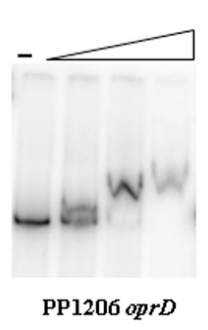

## Question

# Gene Research for Functional Annotation

## ⚠️ CRITICAL: Gene/Protein Identification Context

**BEFORE YOU BEGIN RESEARCH:** You MUST verify you are researching the CORRECT gene/protein. Gene symbols can be ambiguous, especially for less well-characterized genes from non-model organisms.

### Target Gene/Protein Identity (from UniProt):
- **UniProt Accession:** Q88NK1
- **Protein Description:** SubName: Full=Basic-amino-acid specific porin OprD {ECO:0000313|EMBL:AAN66830.1}; EC=3.4.21.- {ECO:0000313|EMBL:AAN66830.1};
- **Gene Information:** Name=oprD {ECO:0000313|EMBL:AAN66830.1}; OrderedLocusNames=PP_1206 {ECO:0000313|EMBL:AAN66830.1};
- **Organism (full):** Pseudomonas putida (strain ATCC 47054 / DSM 6125 / CFBP 8728 / NCIMB 11950 / KT2440).
- **Protein Family:** Belongs to the outer membrane porin (Opr) (TC 1.B.25)
- **Key Domains:** OM_porin_bac. (IPR005318); Porin_dom_sf. (IPR023614); OprD (PF03573)

### MANDATORY VERIFICATION STEPS:

1. **Check if the gene symbol "oprD" matches the protein description above**
2. **Verify the organism is correct:** Pseudomonas putida (strain ATCC 47054 / DSM 6125 / CFBP 8728 / NCIMB 11950 / KT2440).
3. **Check if protein family/domains align with what you find in literature**
4. **If you find literature for a DIFFERENT gene with the same or similar symbol, STOP**

### If Gene Symbol is Ambiguous or You Cannot Find Relevant Literature:

**DO NOT PROCEED WITH RESEARCH ON A DIFFERENT GENE.** Instead:
- State clearly: "The gene symbol 'oprD' is ambiguous or literature is limited for this specific protein"
- Explain what you found (e.g., "Found extensive literature on a different gene with the same symbol in a different organism")
- Describe the protein based ONLY on the UniProt information provided above
- Suggest that the protein function can be inferred from domain/family information

### Research Target:

Please provide a comprehensive research report on the gene **oprD** (gene ID: oprD, UniProt: Q88NK1) in PSEPK.

The research report should be a detailed narrative explaining the function, biological processes, and localization of the gene product. Citations should be given for all claims.

You should prioritize authoritative reviews and primary scientific literature when conducting research. You can supplement
this with annotations you find in gene/protein databases, but these can be outdated or inaccurate.

We are specifically interested in the primary function of the gene - for enzymes, what reaction is catalyzed, and what is the substrate specificity? For transporters, what is the substrate? For structural proteins or adapters, what is the broader structural role? For signaling molecules, what is the role in the pathway.

We are interested in where in or outside the cell the gene product carries out its function.

We are also interested in the signaling or biochemical pathways in which the gene functions. We are less interested in broad pleiotropic effects, except where these elucidate the precise role.

Include evidence where possible. We are interested in both experimental evidence as well as inference from structure, evolution, or bioinformatic analysis. Precise studies should be prioritized over high-throughput, where available.

## Output

Question: You are an expert researcher providing comprehensive, well-cited information.

Provide detailed information focusing on:
1. Key concepts and definitions with current understanding
2. Recent developments and latest research (prioritize 2023-2024 sources)
3. Current applications and real-world implementations
4. Expert opinions and analysis from authoritative sources
5. Relevant statistics and data from recent studies

Format as a comprehensive research report with proper citations. Include URLs and publication dates where available.
Always prioritize recent, authoritative sources and provide specific citations for all major claims.

# Gene Research for Functional Annotation

## ⚠️ CRITICAL: Gene/Protein Identification Context

**BEFORE YOU BEGIN RESEARCH:** You MUST verify you are researching the CORRECT gene/protein. Gene symbols can be ambiguous, especially for less well-characterized genes from non-model organisms.

### Target Gene/Protein Identity (from UniProt):
- **UniProt Accession:** Q88NK1
- **Protein Description:** SubName: Full=Basic-amino-acid specific porin OprD {ECO:0000313|EMBL:AAN66830.1}; EC=3.4.21.- {ECO:0000313|EMBL:AAN66830.1};
- **Gene Information:** Name=oprD {ECO:0000313|EMBL:AAN66830.1}; OrderedLocusNames=PP_1206 {ECO:0000313|EMBL:AAN66830.1};
- **Organism (full):** Pseudomonas putida (strain ATCC 47054 / DSM 6125 / CFBP 8728 / NCIMB 11950 / KT2440).
- **Protein Family:** Belongs to the outer membrane porin (Opr) (TC 1.B.25)
- **Key Domains:** OM_porin_bac. (IPR005318); Porin_dom_sf. (IPR023614); OprD (PF03573)

### MANDATORY VERIFICATION STEPS:

1. **Check if the gene symbol "oprD" matches the protein description above**
2. **Verify the organism is correct:** Pseudomonas putida (strain ATCC 47054 / DSM 6125 / CFBP 8728 / NCIMB 11950 / KT2440).
3. **Check if protein family/domains align with what you find in literature**
4. **If you find literature for a DIFFERENT gene with the same or similar symbol, STOP**

### If Gene Symbol is Ambiguous or You Cannot Find Relevant Literature:

**DO NOT PROCEED WITH RESEARCH ON A DIFFERENT GENE.** Instead:
- State clearly: "The gene symbol 'oprD' is ambiguous or literature is limited for this specific protein"
- Explain what you found (e.g., "Found extensive literature on a different gene with the same symbol in a different organism")
- Describe the protein based ONLY on the UniProt information provided above
- Suggest that the protein function can be inferred from domain/family information

### Research Target:

Please provide a comprehensive research report on the gene **oprD** (gene ID: oprD, UniProt: Q88NK1) in PSEPK.

The research report should be a detailed narrative explaining the function, biological processes, and localization of the gene product. Citations should be given for all claims.

You should prioritize authoritative reviews and primary scientific literature when conducting research. You can supplement
this with annotations you find in gene/protein databases, but these can be outdated or inaccurate.

We are specifically interested in the primary function of the gene - for enzymes, what reaction is catalyzed, and what is the substrate specificity? For transporters, what is the substrate? For structural proteins or adapters, what is the broader structural role? For signaling molecules, what is the role in the pathway.

We are interested in where in or outside the cell the gene product carries out its function.

We are also interested in the signaling or biochemical pathways in which the gene functions. We are less interested in broad pleiotropic effects, except where these elucidate the precise role.

Include evidence where possible. We are interested in both experimental evidence as well as inference from structure, evolution, or bioinformatic analysis. Precise studies should be prioritized over high-throughput, where available.

## Research report: Functional annotation of **oprD (PP_1206; UniProt Q88NK1)** in *Pseudomonas putida* KT2440

### 1) Target verification (gene/protein identity and ambiguity control)
The requested target (UniProt **Q88NK1**) corresponds to **oprD (PP_1206)** in *Pseudomonas putida* KT2440/KT2442 and encodes an **OprD-family outer membrane porin** annotated as a **“basic amino acid specific porin OprD.”** This mapping is explicitly used in *P. putida* CbrB regulon work where **PP1206 is listed as “oprD – basic amino acid specific porin OprD”**. (barroso2018thecbrbregulon pages 4-6)

Because “oprD” is extensively discussed in *P. aeruginosa* (especially for carbapenem susceptibility), I treat *P. aeruginosa* evidence strictly as **family-level mechanistic context** (OccD/Occ) and not as organism-specific evidence for KT2440 unless explicitly shown to generalize. (eren2012substratespecificitywithin pages 1-2, chevalier2017structurefunctionand pages 1-2)

### 2) Key concepts and current understanding

#### 2.1 What OprD is (porin vs transporter)
**OprD is an outer membrane porin**: a water-filled β-barrel channel that enables diffusion of certain small solutes across the Gram-negative outer membrane. In *Pseudomonas*, many outer membrane channels are **substrate-selective** rather than the wide, non-specific porins typical of Enterobacteriaceae, which makes specific porins important determinants of nutrient uptake and permeability. (eren2012substratespecificitywithin pages 1-2, chevalier2017structurefunctionand pages 1-2)

#### 2.2 OprD/Occ family nomenclature and substrate “rules”
A key update in the field is that the historical “OprD family” has been reframed as **Occ (Outer membrane carboxylate channels)** because many transported substrates require a **carboxyl group** for efficient transport. (eren2012substratespecificitywithin pages 1-2)

The Occ family splits into two major subfamilies with distinct preferences:
- **OccD** members: linked to uptake of **basic amino acids** (positively charged amino acids). (chevalier2017structurefunctionand pages 1-2)
- **OccK** members: linked to uptake of **negatively charged cyclic molecules** and other carboxylate-containing compounds. (chevalier2017structurefunctionand pages 1-2)

Within this framework, the archetype **OccD1 (historically OprD)** is considered a channel for **basic amino acids** and is also implicated as an entry route for **carbapenem β-lactam antibiotics** in *P. aeruginosa*. (eren2012substratespecificitywithin pages 1-2, ude2021outermembranepermeability pages 1-2)

#### 2.3 Structural determinants (how selectivity arises)
Occ/OprD-family channels are monomeric β-barrels with a constriction (“eyelet”) that is shaped by extracellular loops (notably **L3 and L7**) and barrel-wall residues. A conserved charged feature described for Occ channels is a **“basic ladder”** (arginine/lysine residues) at the constriction that contributes to electrostatic recognition and selectivity. (eren2012substratespecificitywithin pages 1-2, eren2012substratespecificitywithin pages 3-6)

Single-channel electrophysiology indicates **dynamic gating/substates**: for example, **OccD1/OccD2** show very small dominant conductances (~**15 pS**), while another OccD member (**OccD3**) can show much larger conductance states (~**700 pS**), implying that static pore size alone does not fully explain function and that conformational dynamics likely contribute to transport. (eren2012substratespecificitywithin pages 3-6)

### 3) Organism-specific function in *P. putida* KT2440/KT2442 (PP_1206 / Q88NK1)

#### 3.1 Cellular localization
By family definition and by how it is treated in *Pseudomonas* porin literature, OprD/Occ channels are **outer membrane proteins** mediating diffusion across the **outer membrane** (with passage into the periplasm). (eren2012substratespecificitywithin pages 1-2, chevalier2017structurefunctionand pages 1-2)

#### 3.2 Primary physiological function: uptake of basic amino acids
In a controlled chemostat multi-omics study in *P. putida* KT2442, the **porin family OprD (PP_1206)** was reported as **exclusively induced under dual (carbon+nitrogen) limitation**, and the authors note that the “specific porin OprD has been shown to be implicated in the uptake of basic amino acids, facilitating their diffusion across the membrane.” (pobletecastro2012themetabolicresponse pages 8-9)

Interpretation: in *P. putida*, PP_1206 likely supports **nutrient scavenging** and **outer membrane remodeling** under nutrient limitation, especially when uptake of nitrogenous solutes (including amino acids) becomes advantageous.

#### 3.3 Regulation: carbon limitation sensing (CbrAB/CbrB)
A key *P. putida*-specific regulatory result is that **CbrB** (a σ\N-dependent transcriptional activator in the CbrAB system) **binds directly to the PP1206 (oprD) promoter**:
- The study detected an EMSA mobility shift for the **PP1206 promoter fragment** as CbrB concentration increased (0, 0.5, 1, 2 μM CbrB), supporting direct binding. (barroso2018thecbrbregulon pages 6-8, barroso2018thecbrbregulon media 0a54c73d)
- PP1206 appears among ChIP-seq targets with **enrichment 3.45**. (barroso2018thecbrbregulon pages 4-6, barroso2018thecbrbregulon pages 3-4)
- RT-qPCR validation reported **fold change 0.3** (computed as KT2442 / ΔcbrB), with reported mRNA levels **1.71 ± 0.85** (WT) vs **5.77 ± 1.64** (ΔcbrB), i.e., higher transcript levels in the cbrB mutant in the tested condition. This indicates **CbrB-mediated repression** of oprD under those specific growth conditions (minimal medium with oxaloacetate, mid-exponential). (barroso2018thecbrbregulon pages 4-6, barroso2018thecbrbregulon media f1da5f95)

Taken together, PP_1206/oprD sits at the intersection of (i) nutrient limitation/transport remodeling in chemostats and (ii) global carbon status signaling via CbrAB/CbrB.

#### 3.4 What is *not* yet well supported specifically for KT2440 PP_1206
From the retrieved sources, I did **not** find direct KT2440 PP_1206-specific measurements of:
- purified-channel substrate flux (e.g., arginine or lysine diffusion rates) in *P. putida*
- genetic knockout phenotypes for PP_1206 alone (growth on defined basic amino acids, competitive fitness, permeability changes)
- antibiotic susceptibility consequences specifically attributable to PP_1206 in KT2440

Therefore, substrate specificity beyond “basic amino acid porin” remains primarily **inferred from family knowledge** and the *P. putida* omics/regulatory literature above.

### 4) Recent developments (prioritizing 2023–2024) and their relevance to OprD biology

Most 2023–2024 work is centered on *P. aeruginosa* (clinical relevance) rather than *P. putida*. These studies remain valuable to interpret OprD/OccD as a conserved porin family and to understand broader implications of modulating OprD-like porins.

#### 4.1 2024: OprD is not necessarily the only carbapenem entry route (porin redundancy)
Freed & Hanson (2024) investigated imipenem entry and AmpC induction in *P. aeruginosa* using **17 clinical isolates plus 3 laboratory strains** (20 total). They report that **all 20 isolates induced blaAmpC** under sublethal imipenem exposure, and **18 lacked detectable OprD protein**, supporting that **imipenem can enter even without detectable OprD** (alternative porins/paths exist). The study reports imipenem/relebactam non-susceptible MICs ranging **4–256 μg/mL**. (jr2024ampcinductionby pages 1-2)

Relevance to *P. putida* annotation: this underscores that OprD-family porins can be part of a **redundant permeability network**, so single-gene loss may not always yield a clear phenotype—consistent with the broader concept that specific assays (radiolabeled substrates, proteoliposomes) may be needed to quantify transport. (tamber2010physiologicalcontributionof pages 99-103, eren2012substratespecificitywithin pages 3-6)

#### 4.2 2024: Regulatory networks linking influx porins and efflux pumps as therapeutic targets
Wu et al. (2024) synthesize evidence that **downregulation of influx porins** (including OprD) and **upregulation of efflux pumps** are central inducible resistance mechanisms in *P. aeruginosa*, and discuss adjuvant strategies to modulate these systems. (wu2024antibioticinfluxand pages 1-2)

Relevance to *P. putida*: although KT2440 is not a pathogen, outer membrane permeability and selective porins can still constrain uptake of substrates/toxins; thus OprD-like porins are potential tuning points in strain engineering for bioprocess robustness.

### 5) Current applications and real-world implementations

#### 5.1 Clinical (pathogen-focused) application space: antibiotic uptake/resistance
In *Pseudomonas* pathogens, OprD/OccD porins are strongly tied to carbapenem permeability (especially in *P. aeruginosa*), and loss/downregulation is a canonical resistance mechanism; however, recent evidence emphasizes **alternative entry routes** and the need to consider combined mechanisms (β-lactamase induction, efflux). (ude2021outermembranepermeability pages 1-2, jr2024ampcinductionby pages 1-2, wu2024antibioticinfluxand pages 1-2)

#### 5.2 Industrial/biotechnology application space in *P. putida*
While PP_1206 itself is not directly engineered in the retrieved KT2440 strain-engineering papers, multiple lines of evidence position outer membrane porins as an actionable layer in *P. putida* chassis design:
- In chemostat-grown *P. putida* KT2442, induction of OprD (PP_1206) under dual limitation suggests that porins participate in **nutrient-limitation adaptation**, which is directly relevant to high-density and nutrient-managed industrial processes. (pobletecastro2012themetabolicresponse pages 8-9)
- Independent *P. putida* bioprocess engineering work uses porin abundance as a manipulable parameter (e.g., OprF/OprE overexpression for controlled disruption), supporting the general principle that porin composition is a practical engineering knob in KT2440. (pobletecastro2020engineeringtheosmotic pages 1-2)

### 6) Quantitative statistics and data points (recent and/or high-quality)

**P. putida-specific quantitative regulatory and expression data**
- **CbrB ChIP-seq enrichment at PP1206 promoter:** **3.45**. (barroso2018thecbrbregulon pages 4-6)
- **oprD RT-qPCR (WT vs ΔcbrB):** fold change **0.3** (KT2442 / ΔcbrB), with absolute values **1.71 ± 0.85** (WT) vs **5.77 ± 1.64** (ΔcbrB) under minimal medium with oxaloacetate. (barroso2018thecbrbregulon pages 4-6, barroso2018thecbrbregulon media f1da5f95)

**Family-level quantitative structural/biophysical data**
- Single-channel conductance states: OccD1/OccD2 ~**15 pS**; OccD3 up to ~**700 pS** (dynamic states). (eren2012substratespecificitywithin pages 3-6)

**2024 clinically motivated quantitative data (P. aeruginosa)**
- Freed & Hanson (2024): **20** strains/isolates tested; **18/20** lacked detectable OprD protein; MICs for imipenem/relebactam non-susceptible isolates **4–256 μg/mL**. (jr2024ampcinductionby pages 1-2)

### 7) Synthesis: Proposed functional annotation for UniProt Q88NK1 (PP_1206/oprD)

**Recommended primary functional statement (high confidence, *P. putida*-supported):**
PP_1206/oprD encodes a **substrate-selective outer membrane porin (OprD/OccD family)** that is implicated in the uptake/diffusion of **basic amino acids** across the outer membrane and is transcriptionally integrated into nutrient/carbon status regulatory networks (CbrAB/CbrB), with condition-dependent expression (e.g., induction under dual nutrient limitation). (pobletecastro2012themetabolicresponse pages 8-9, barroso2018thecbrbregulon pages 4-6, barroso2018thecbrbregulon media 0a54c73d)

**Recommended regulatory statement (high confidence, direct evidence):**
CbrB binds the oprD (PP1206) promoter (EMSA) and modulates its expression; under oxaloacetate minimal medium, oprD transcript levels are higher in a ΔcbrB mutant than in WT (RT-qPCR fold change 0.3 WT/ΔcbrB), consistent with CbrB-mediated repression in that condition. (barroso2018thecbrbregulon pages 4-6, barroso2018thecbrbregulon media 0a54c73d, barroso2018thecbrbregulon media f1da5f95)

**Recommended mechanistic inference (moderate confidence, family-based):**
Given OccD-family architecture and selectivity principles, OprD likely uses a loop-defined constriction (L3/L7) and charged features (“basic ladder”) to recognize small substrates that carry a **carboxylate** and appropriate complementary charge distribution, consistent with transport of basic amino acids and related solutes. (eren2012substratespecificitywithin pages 1-2, eren2012substratespecificitywithin pages 3-6)

### Evidence summary table
| Claim/Topic | Key details (include quantitative values) | Organism context | Evidence type | Primary source with publication year | URL/DOI | Citation ID |
|---|---|---|---|---|---|---|
| Gene identity of target oprD / PP_1206 | PP1206 is explicitly annotated as **“oprD – basic amino acid specific porin OprD”**; included among CbrB regulon targets with **ChIP-seq enrichment 3.45** | *Pseudomonas putida* KT2442/KT2440 background | ChIP-seq annotation / regulon mapping | Barroso et al., 2018 | https://doi.org/10.1371/journal.pone.0209191 | (barroso2018thecbrbregulon pages 4-6, barroso2018thecbrbregulon pages 3-4) |
| Direct binding of regulator CbrB to oprD promoter | EMSA showed a mobility shift for the **PP1206 (oprD) promoter** with increasing **CbrB concentrations 0, 0.5, 1, 2 μM**, supporting direct promoter binding | *P. putida* KT2442 | EMSA | Barroso et al., 2018 | https://doi.org/10.1371/journal.pone.0209191 | (barroso2018thecbrbregulon pages 6-8, barroso2018thecbrbregulon pages 2-3, barroso2018thecbrbregulon media 0a54c73d) |
| Regulatory direction of oprD by CbrB | RT-qPCR validation reported **fold change 0.3** for PP1206 when calculated as **KT2442 / ΔcbrB (MPO401)**, with expression values **1.71 ± 0.85** vs **5.77 ± 1.64**; indicates oprD was among targets validated as **repressed** under tested conditions | *P. putida* KT2442 grown in minimal medium with oxaloacetate | RT-qPCR | Barroso et al., 2018 | https://doi.org/10.1371/journal.pone.0209191 | (barroso2018thecbrbregulon pages 4-6, barroso2018thecbrbregulon pages 12-14, barroso2018thecbrbregulon media f1da5f95) |
| Condition-dependent induction of PP_1206/OprD | OprD (**PP_1206**) was **exclusively induced under dual carbon+nitrogen limitation**; paper identifies it as a **specific porin implicated in uptake of basic amino acids** | *P. putida* KT2442 chemostats under nutrient limitation | Proteomics / integrated omics | Poblete-Castro et al., 2012 | https://doi.org/10.1186/1475-2859-11-34 | (pobletecastro2012themetabolicresponse pages 8-9) |
| Functional annotation in P. putida omics literature | Nutrient-limitation study links outer membrane remodeling to transporter modulation and specifically notes that OprD facilitates diffusion of **basic amino acids** across the membrane | *P. putida* KT2442 | Omics interpretation / functional annotation | Poblete-Castro et al., 2012 | https://doi.org/10.1186/1475-2859-11-34 | (pobletecastro2012themetabolicresponse pages 8-9) |
| Family-level definition of OprD/Occ porins | OprD-family proteins were redefined as **Occ (outer membrane carboxylate) channels** because efficient substrates generally require a **carboxyl group**; family divided into **OccD** and **OccK** subfamilies | Primarily *P. aeruginosa* family model, relevant by homology to PP_1206 | Structural/functional primary study | Eren et al., 2012 | https://doi.org/10.1371/journal.pbio.1001242 | (eren2012substratespecificitywithin pages 1-2) |
| Archetypal function of OccD1/OprD | **OccD1 (formerly OprD)** is the archetype of the family and is thought to transport **basic amino acids** while also serving as an entry portal for **carbapenem β-lactams** | *P. aeruginosa* family model; used for inference to *P. putida* OprD family membership | Structural/functional primary study | Eren et al., 2012 | https://doi.org/10.1371/journal.pbio.1001242 | (eren2012substratespecificitywithin pages 1-2) |
| Structural determinants of specificity | Occ channels are monomeric β-barrels with a constriction formed by loops **L3 and L7**; conserved **basic ladder** helps define specificity | OprD/Occ family (Pseudomonas) | Structural biology / electrophysiology | Eren et al., 2012 | https://doi.org/10.1371/journal.pbio.1001242 | (eren2012substratespecificitywithin pages 3-6, eren2012substratespecificitywithin pages 11-12) |
| Quantitative channel behavior | Electrophysiology found very small dominant conductances for **OccD1/OccD2 (~15 pS)**, while **OccD3** could show much larger states **(~700 pS)**, highlighting dynamic pore behavior | OprD/Occ family in *P. aeruginosa* | Single-channel electrophysiology | Eren et al., 2012 | https://doi.org/10.1371/journal.pbio.1001242 | (eren2012substratespecificitywithin pages 3-6) |
| Transport assay evidence for substrate bias | Proteoliposome/vesicle uptake assays showed **OccK** channels transport carboxylate-containing substrates well (e.g., glucuronate), whereas **OccD1 arginine uptake was low but above background (>5-fold)**; supports highly selective, difficult-to-measure transport | OprD/Occ family in *P. aeruginosa* | Transport assays | Eren et al., 2012 | https://doi.org/10.1371/journal.pbio.1001242 | (eren2012substratespecificitywithin pages 3-6) |
| Expert synthesis on subfamily functions | Review states the family contains **19 members** in *P. aeruginosa*, split into **8 OccD** and **11 OccK**; **OccD** members are linked to uptake of **basic amino acids**, **OccK** to negatively charged cyclic molecules; channels typically pass small molecules **≤ ~200 Da** | Pseudomonas OprD/Occ family | Authoritative review | Chevalier et al., 2017 | https://doi.org/10.1093/femsre/fux020 | (chevalier2017structurefunctionand pages 1-2) |
| Porin context in Pseudomonas envelope biology | The review emphasizes very low outer-membrane permeability in *Pseudomonas* (**~8% of *E. coli***), explaining why substrate-specific porins like OprD/Occ are physiologically important | *P. aeruginosa* / genus-level context | Authoritative review | Chevalier et al., 2017 | https://doi.org/10.1093/femsre/fux020 | (chevalier2017structurefunctionand pages 1-2) |
| Physiological role of OprD-like subfamily | OprD-subgroup porins take up **amino acids and related molecules such as dipeptides**, whereas OpdK-like porins take up diverse **carboxylic acids**; expression is often **positively regulated by substrates** | *P. aeruginosa* OprD family; useful family-level inference for PP_1206 | Primary genetics/physiology study | Tamber et al., 2006 | https://doi.org/10.1128/JB.188.1.45-54.2006 | (tamber2006roleofthe pages 9-9) |
| Species repertoire context | Comparative analysis reported that *P. putida* harbors more **OpdK-like than OprD-like porins (13 vs 8)**, implying a broad specialized outer-membrane uptake network | *P. putida* species-level context | Comparative phylogeny / thesis synthesis | Tamber, 2010 | https://doi.org/10.14288/1.0093018 | (tamber2010physiologicalcontributionof pages 168-171) |
| Evidence for carbapenem link and porin redundancy | In a Δ40 porin background, reduced susceptibility to **meropenem and imipenem** could be attributed primarily to **OprD/OccD1**; other porins such as **OpdP/OccD3** may contribute under some conditions | *P. aeruginosa* | Functional physiology | Ude et al., 2021 | https://doi.org/10.1073/pnas.2107644118 | (ude2021outermembranepermeability pages 1-2) |
| 2024 update on clinical/biophysical significance | Study of **20** strains/isolates found **all 20 induced blaAmpC** after sublethal imipenem exposure and **18 lacked detectable OprD**, supporting that OprD is important but **not the only** route for carbapenem entry; reported imipenem/relebactam MICs **4–256 μg/mL** | *P. aeruginosa* clinical/lab isolates | 2024 primary study | Freed & Hanson, 2024 | https://doi.org/10.1128/spectrum.00142-24 | (jr2024ampcinductionby pages 1-2) |
| 2024 expert opinion on regulation and applications | Review highlights **downregulation of influx porins** and **upregulation of efflux pumps** as core inducible resistance mechanisms, and discusses therapeutic strategies that modulate porin/efflux expression to restore susceptibility | *P. aeruginosa* | 2024 review / expert analysis | Wu et al., 2024 | https://doi.org/10.1111/1751-7915.14487 | (wu2024antibioticinfluxand pages 1-2) |

*Table: This table compiles organism-specific evidence for Pseudomonas putida PP_1206/oprD together with authoritative family-level evidence for OprD/OccD porins. It highlights gene identity, regulation, likely substrate specificity, structural basis, and recent 2024 findings relevant to real-world applications such as antibiotic permeability and resistance.*

### Key URLs (with publication dates from retrieved sources)
- Barroso et al. (*P. putida* CbrB regulon; **2018-12-17**): https://doi.org/10.1371/journal.pone.0209191 (barroso2018thecbrbregulon pages 4-6)
- Poblete-Castro et al. (*P. putida* KT2442 nutrient-limitation multi-omics; **2012-03-??**): https://doi.org/10.1186/1475-2859-11-34 (pobletecastro2012themetabolicresponse pages 8-9)
- Eren et al. (Occ channel specificity; **2012-01**): https://doi.org/10.1371/journal.pbio.1001242 (eren2012substratespecificitywithin pages 1-2)
- Chevalier et al. (Porins review; **2017-09**): https://doi.org/10.1093/femsre/fux020 (chevalier2017structurefunctionand pages 1-2)
- Ude et al. (porins and carbapenem entry; **2021-07**): https://doi.org/10.1073/pnas.2107644118 (ude2021outermembranepermeability pages 1-2)
- Freed & Hanson (imipenem entry without detectable OprD; **2024-11**): https://doi.org/10.1128/spectrum.00142-24 (jr2024ampcinductionby pages 1-2)
- Wu et al. (influx/efflux regulation review; **2024-05**): https://doi.org/10.1111/1751-7915.14487 (wu2024antibioticinfluxand pages 1-2)

References

1. (barroso2018thecbrbregulon pages 4-6): Rocío Barroso, Sofía M. García-Mauriño, Laura Tomás-Gallardo, Eloísa Andújar, Mónica Pérez-Alegre, Eduardo Santero, and Inés Canosa. The cbrb regulon: promoter dissection reveals novel insights into the cbrab expression network in pseudomonas putida. PLoS ONE, 13:e0209191, Dec 2018. URL: https://doi.org/10.1371/journal.pone.0209191, doi:10.1371/journal.pone.0209191. This article has 15 citations and is from a peer-reviewed journal.

2. (eren2012substratespecificitywithin pages 1-2): Elif Eren, Jagamya Vijayaraghavan, Jiaming Liu, Belete R. Cheneke, Debra S. Touw, Bryan W. Lepore, Mridhu Indic, Liviu Movileanu, and Bert van den Berg. Substrate specificity within a family of outer membrane carboxylate channels. PLoS Biology, 10:e1001242, Jan 2012. URL: https://doi.org/10.1371/journal.pbio.1001242, doi:10.1371/journal.pbio.1001242. This article has 165 citations and is from a highest quality peer-reviewed journal.

3. (chevalier2017structurefunctionand pages 1-2): Sylvie Chevalier, Emeline Bouffartigues, Josselin Bodilis, Olivier Maillot, Olivier Lesouhaitier, Marc G. J. Feuilloley, Nicole Orange, Alain Dufour, and Pierre Cornelis. Structure, function and regulation of pseudomonas aeruginosa porins. Fems Microbiology Reviews, 41:698–722, Sep 2017. URL: https://doi.org/10.1093/femsre/fux020, doi:10.1093/femsre/fux020. This article has 577 citations and is from a domain leading peer-reviewed journal.

4. (ude2021outermembranepermeability pages 1-2): Johanna Ude, Vishwachi Tripathi, Julien M. Buyck, Sandra Söderholm, Olivier Cunrath, Joseph Fanous, Beatrice Claudi, Adrian Egli, Christian Schleberger, Sebastian Hiller, and Dirk Bumann. Outer membrane permeability: antimicrobials and diverse nutrients bypass porins in pseudomonas aeruginosa. Proceedings of the National Academy of Sciences of the United States of America, Jul 2021. URL: https://doi.org/10.1073/pnas.2107644118, doi:10.1073/pnas.2107644118. This article has 178 citations and is from a highest quality peer-reviewed journal.

5. (eren2012substratespecificitywithin pages 3-6): Elif Eren, Jagamya Vijayaraghavan, Jiaming Liu, Belete R. Cheneke, Debra S. Touw, Bryan W. Lepore, Mridhu Indic, Liviu Movileanu, and Bert van den Berg. Substrate specificity within a family of outer membrane carboxylate channels. PLoS Biology, 10:e1001242, Jan 2012. URL: https://doi.org/10.1371/journal.pbio.1001242, doi:10.1371/journal.pbio.1001242. This article has 165 citations and is from a highest quality peer-reviewed journal.

6. (pobletecastro2012themetabolicresponse pages 8-9): Ignacio Poblete-Castro, Isabel F Escapa, Christian Jäger, Jacek Puchalka, Carolyn Chi Lam, Dietmar Schomburg, María Prieto, and Vítor AP Martins dos Santos. The metabolic response of p. putida kt2442 producing high levels of polyhydroxyalkanoate under single- and multiple-nutrient-limited growth: highlights from a multi-level omics approach. Microbial Cell Factories, 11:34-34, Mar 2012. URL: https://doi.org/10.1186/1475-2859-11-34, doi:10.1186/1475-2859-11-34. This article has 156 citations and is from a peer-reviewed journal.

7. (barroso2018thecbrbregulon pages 6-8): Rocío Barroso, Sofía M. García-Mauriño, Laura Tomás-Gallardo, Eloísa Andújar, Mónica Pérez-Alegre, Eduardo Santero, and Inés Canosa. The cbrb regulon: promoter dissection reveals novel insights into the cbrab expression network in pseudomonas putida. PLoS ONE, 13:e0209191, Dec 2018. URL: https://doi.org/10.1371/journal.pone.0209191, doi:10.1371/journal.pone.0209191. This article has 15 citations and is from a peer-reviewed journal.

8. (barroso2018thecbrbregulon media 0a54c73d): Rocío Barroso, Sofía M. García-Mauriño, Laura Tomás-Gallardo, Eloísa Andújar, Mónica Pérez-Alegre, Eduardo Santero, and Inés Canosa. The cbrb regulon: promoter dissection reveals novel insights into the cbrab expression network in pseudomonas putida. PLoS ONE, 13:e0209191, Dec 2018. URL: https://doi.org/10.1371/journal.pone.0209191, doi:10.1371/journal.pone.0209191. This article has 15 citations and is from a peer-reviewed journal.

9. (barroso2018thecbrbregulon pages 3-4): Rocío Barroso, Sofía M. García-Mauriño, Laura Tomás-Gallardo, Eloísa Andújar, Mónica Pérez-Alegre, Eduardo Santero, and Inés Canosa. The cbrb regulon: promoter dissection reveals novel insights into the cbrab expression network in pseudomonas putida. PLoS ONE, 13:e0209191, Dec 2018. URL: https://doi.org/10.1371/journal.pone.0209191, doi:10.1371/journal.pone.0209191. This article has 15 citations and is from a peer-reviewed journal.

10. (barroso2018thecbrbregulon media f1da5f95): Rocío Barroso, Sofía M. García-Mauriño, Laura Tomás-Gallardo, Eloísa Andújar, Mónica Pérez-Alegre, Eduardo Santero, and Inés Canosa. The cbrb regulon: promoter dissection reveals novel insights into the cbrab expression network in pseudomonas putida. PLoS ONE, 13:e0209191, Dec 2018. URL: https://doi.org/10.1371/journal.pone.0209191, doi:10.1371/journal.pone.0209191. This article has 15 citations and is from a peer-reviewed journal.

11. (jr2024ampcinductionby pages 1-2): Jr Shawn Freed and Nancy D. Hanson. Ampc induction by imipenem in <i>pseudomonas aeruginosa</i> occurs in the absence of oprd and impacts imipenem/relebactam susceptibility. Nov 2024. URL: https://doi.org/10.1128/spectrum.00142-24, doi:10.1128/spectrum.00142-24. This article has 20 citations and is from a domain leading peer-reviewed journal.

12. (tamber2010physiologicalcontributionof pages 99-103): Sandeep Tamber. Physiological contribution of the pseudomonas aeruginosa oprd family of porins. ArXiv, Jan 2010. URL: https://doi.org/10.14288/1.0093018, doi:10.14288/1.0093018. This article has 0 citations.

13. (wu2024antibioticinfluxand pages 1-2): Weiyan Wu, Jiahui Huang, and Zeling Xu. Antibiotic influx and efflux in pseudomonas aeruginosa: regulation and therapeutic implications. Microbial Biotechnology, May 2024. URL: https://doi.org/10.1111/1751-7915.14487, doi:10.1111/1751-7915.14487. This article has 72 citations and is from a peer-reviewed journal.

14. (pobletecastro2020engineeringtheosmotic pages 1-2): Ignacio Poblete-Castro, Carla Aravena-Carrasco, Matias Orellana-Saez, Nicolás Pacheco, Alex Cabrera, and José Manuel Borrero-de Acuña. Engineering the osmotic state of pseudomonas putida kt2440 for efficient cell disruption and downstream processing of poly(3-hydroxyalkanoates). Frontiers in Bioengineering and Biotechnology, Mar 2020. URL: https://doi.org/10.3389/fbioe.2020.00161, doi:10.3389/fbioe.2020.00161. This article has 28 citations.

15. (barroso2018thecbrbregulon pages 2-3): Rocío Barroso, Sofía M. García-Mauriño, Laura Tomás-Gallardo, Eloísa Andújar, Mónica Pérez-Alegre, Eduardo Santero, and Inés Canosa. The cbrb regulon: promoter dissection reveals novel insights into the cbrab expression network in pseudomonas putida. PLoS ONE, 13:e0209191, Dec 2018. URL: https://doi.org/10.1371/journal.pone.0209191, doi:10.1371/journal.pone.0209191. This article has 15 citations and is from a peer-reviewed journal.

16. (barroso2018thecbrbregulon pages 12-14): Rocío Barroso, Sofía M. García-Mauriño, Laura Tomás-Gallardo, Eloísa Andújar, Mónica Pérez-Alegre, Eduardo Santero, and Inés Canosa. The cbrb regulon: promoter dissection reveals novel insights into the cbrab expression network in pseudomonas putida. PLoS ONE, 13:e0209191, Dec 2018. URL: https://doi.org/10.1371/journal.pone.0209191, doi:10.1371/journal.pone.0209191. This article has 15 citations and is from a peer-reviewed journal.

17. (eren2012substratespecificitywithin pages 11-12): Elif Eren, Jagamya Vijayaraghavan, Jiaming Liu, Belete R. Cheneke, Debra S. Touw, Bryan W. Lepore, Mridhu Indic, Liviu Movileanu, and Bert van den Berg. Substrate specificity within a family of outer membrane carboxylate channels. PLoS Biology, 10:e1001242, Jan 2012. URL: https://doi.org/10.1371/journal.pbio.1001242, doi:10.1371/journal.pbio.1001242. This article has 165 citations and is from a highest quality peer-reviewed journal.

18. (tamber2006roleofthe pages 9-9): Sandeep Tamber, Martina M. Ochs, and Robert E. W. Hancock. Role of the novel oprd family of porins in nutrient uptake in pseudomonas aeruginosa. Journal of Bacteriology, 188:45-54, Jan 2006. URL: https://doi.org/10.1128/jb.188.1.45-54.2006, doi:10.1128/jb.188.1.45-54.2006. This article has 224 citations and is from a peer-reviewed journal.

19. (tamber2010physiologicalcontributionof pages 168-171): Sandeep Tamber. Physiological contribution of the pseudomonas aeruginosa oprd family of porins. ArXiv, Jan 2010. URL: https://doi.org/10.14288/1.0093018, doi:10.14288/1.0093018. This article has 0 citations.

## Artifacts

- [Edison artifact artifact-00](oprD-deep-research-falcon_artifacts/artifact-00.md)

## Citations

1. barroso2018thecbrbregulon pages 4-6
2. eren2012substratespecificitywithin pages 1-2
3. chevalier2017structurefunctionand pages 1-2
4. eren2012substratespecificitywithin pages 3-6
5. pobletecastro2012themetabolicresponse pages 8-9
6. jr2024ampcinductionby pages 1-2
7. wu2024antibioticinfluxand pages 1-2
8. pobletecastro2020engineeringtheosmotic pages 1-2
9. tamber2006roleofthe pages 9-9
10. tamber2010physiologicalcontributionof pages 168-171
11. ude2021outermembranepermeability pages 1-2
12. barroso2018thecbrbregulon pages 6-8
13. barroso2018thecbrbregulon pages 3-4
14. tamber2010physiologicalcontributionof pages 99-103
15. barroso2018thecbrbregulon pages 2-3
16. barroso2018thecbrbregulon pages 12-14
17. eren2012substratespecificitywithin pages 11-12
18. https://doi.org/10.1371/journal.pone.0209191
19. https://doi.org/10.1186/1475-2859-11-34
20. https://doi.org/10.1371/journal.pbio.1001242
21. https://doi.org/10.1093/femsre/fux020
22. https://doi.org/10.1128/JB.188.1.45-54.2006
23. https://doi.org/10.14288/1.0093018
24. https://doi.org/10.1073/pnas.2107644118
25. https://doi.org/10.1128/spectrum.00142-24
26. https://doi.org/10.1111/1751-7915.14487
27. https://doi.org/10.1371/journal.pone.0209191,
28. https://doi.org/10.1371/journal.pbio.1001242,
29. https://doi.org/10.1093/femsre/fux020,
30. https://doi.org/10.1073/pnas.2107644118,
31. https://doi.org/10.1186/1475-2859-11-34,
32. https://doi.org/10.1128/spectrum.00142-24,
33. https://doi.org/10.14288/1.0093018,
34. https://doi.org/10.1111/1751-7915.14487,
35. https://doi.org/10.3389/fbioe.2020.00161,
36. https://doi.org/10.1128/jb.188.1.45-54.2006,