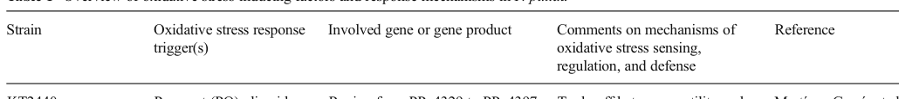

## Question

# Gene Research for Functional Annotation

## ⚠️ CRITICAL: Gene/Protein Identification Context

**BEFORE YOU BEGIN RESEARCH:** You MUST verify you are researching the CORRECT gene/protein. Gene symbols can be ambiguous, especially for less well-characterized genes from non-model organisms.

### Target Gene/Protein Identity (from UniProt):
- **UniProt Accession:** Q88C74
- **Protein Description:** SubName: Full=Oxidative and nitrosative stress transcriptional dual regulator {ECO:0000313|EMBL:AAN70874.1};
- **Gene Information:** Name=oxyR {ECO:0000313|EMBL:AAN70874.1}; OrderedLocusNames=PP_5309 {ECO:0000313|EMBL:AAN70874.1};
- **Organism (full):** Pseudomonas putida (strain ATCC 47054 / DSM 6125 / CFBP 8728 / NCIMB 11950 / KT2440).
- **Protein Family:** Belongs to the LysR transcriptional regulatory family.
- **Key Domains:** LysR_HTH_N. (IPR000847); LysR_subst-bd. (IPR005119); WH-like_DNA-bd_sf. (IPR036388); WH_DNA-bd_sf. (IPR036390); HTH_1 (PF00126)

### MANDATORY VERIFICATION STEPS:

1. **Check if the gene symbol "oxyR" matches the protein description above**
2. **Verify the organism is correct:** Pseudomonas putida (strain ATCC 47054 / DSM 6125 / CFBP 8728 / NCIMB 11950 / KT2440).
3. **Check if protein family/domains align with what you find in literature**
4. **If you find literature for a DIFFERENT gene with the same or similar symbol, STOP**

### If Gene Symbol is Ambiguous or You Cannot Find Relevant Literature:

**DO NOT PROCEED WITH RESEARCH ON A DIFFERENT GENE.** Instead:
- State clearly: "The gene symbol 'oxyR' is ambiguous or literature is limited for this specific protein"
- Explain what you found (e.g., "Found extensive literature on a different gene with the same symbol in a different organism")
- Describe the protein based ONLY on the UniProt information provided above
- Suggest that the protein function can be inferred from domain/family information

### Research Target:

Please provide a comprehensive research report on the gene **oxyR** (gene ID: oxyR, UniProt: Q88C74) in PSEPK.

The research report should be a detailed narrative explaining the function, biological processes, and localization of the gene product. Citations should be given for all claims.

You should prioritize authoritative reviews and primary scientific literature when conducting research. You can supplement
this with annotations you find in gene/protein databases, but these can be outdated or inaccurate.

We are specifically interested in the primary function of the gene - for enzymes, what reaction is catalyzed, and what is the substrate specificity? For transporters, what is the substrate? For structural proteins or adapters, what is the broader structural role? For signaling molecules, what is the role in the pathway.

We are interested in where in or outside the cell the gene product carries out its function.

We are also interested in the signaling or biochemical pathways in which the gene functions. We are less interested in broad pleiotropic effects, except where these elucidate the precise role.

Include evidence where possible. We are interested in both experimental evidence as well as inference from structure, evolution, or bioinformatic analysis. Precise studies should be prioritized over high-throughput, where available.

## Output

Question: You are an expert researcher providing comprehensive, well-cited information.

Provide detailed information focusing on:
1. Key concepts and definitions with current understanding
2. Recent developments and latest research (prioritize 2023-2024 sources)
3. Current applications and real-world implementations
4. Expert opinions and analysis from authoritative sources
5. Relevant statistics and data from recent studies

Format as a comprehensive research report with proper citations. Include URLs and publication dates where available.
Always prioritize recent, authoritative sources and provide specific citations for all major claims.

# Gene Research for Functional Annotation

## ⚠️ CRITICAL: Gene/Protein Identification Context

**BEFORE YOU BEGIN RESEARCH:** You MUST verify you are researching the CORRECT gene/protein. Gene symbols can be ambiguous, especially for less well-characterized genes from non-model organisms.

### Target Gene/Protein Identity (from UniProt):
- **UniProt Accession:** Q88C74
- **Protein Description:** SubName: Full=Oxidative and nitrosative stress transcriptional dual regulator {ECO:0000313|EMBL:AAN70874.1};
- **Gene Information:** Name=oxyR {ECO:0000313|EMBL:AAN70874.1}; OrderedLocusNames=PP_5309 {ECO:0000313|EMBL:AAN70874.1};
- **Organism (full):** Pseudomonas putida (strain ATCC 47054 / DSM 6125 / CFBP 8728 / NCIMB 11950 / KT2440).
- **Protein Family:** Belongs to the LysR transcriptional regulatory family.
- **Key Domains:** LysR_HTH_N. (IPR000847); LysR_subst-bd. (IPR005119); WH-like_DNA-bd_sf. (IPR036388); WH_DNA-bd_sf. (IPR036390); HTH_1 (PF00126)

### MANDATORY VERIFICATION STEPS:

1. **Check if the gene symbol "oxyR" matches the protein description above**
2. **Verify the organism is correct:** Pseudomonas putida (strain ATCC 47054 / DSM 6125 / CFBP 8728 / NCIMB 11950 / KT2440).
3. **Check if protein family/domains align with what you find in literature**
4. **If you find literature for a DIFFERENT gene with the same or similar symbol, STOP**

### If Gene Symbol is Ambiguous or You Cannot Find Relevant Literature:

**DO NOT PROCEED WITH RESEARCH ON A DIFFERENT GENE.** Instead:
- State clearly: "The gene symbol 'oxyR' is ambiguous or literature is limited for this specific protein"
- Explain what you found (e.g., "Found extensive literature on a different gene with the same symbol in a different organism")
- Describe the protein based ONLY on the UniProt information provided above
- Suggest that the protein function can be inferred from domain/family information

### Research Target:

Please provide a comprehensive research report on the gene **oxyR** (gene ID: oxyR, UniProt: Q88C74) in PSEPK.

The research report should be a detailed narrative explaining the function, biological processes, and localization of the gene product. Citations should be given for all claims.

You should prioritize authoritative reviews and primary scientific literature when conducting research. You can supplement
this with annotations you find in gene/protein databases, but these can be outdated or inaccurate.

We are specifically interested in the primary function of the gene - for enzymes, what reaction is catalyzed, and what is the substrate specificity? For transporters, what is the substrate? For structural proteins or adapters, what is the broader structural role? For signaling molecules, what is the role in the pathway.

We are interested in where in or outside the cell the gene product carries out its function.

We are also interested in the signaling or biochemical pathways in which the gene functions. We are less interested in broad pleiotropic effects, except where these elucidate the precise role.

Include evidence where possible. We are interested in both experimental evidence as well as inference from structure, evolution, or bioinformatic analysis. Precise studies should be prioritized over high-throughput, where available.

## Research report: Functional annotation of *Pseudomonas putida* KT2440 oxyR (UniProt Q88C74; locus PP_5309)

### 0) Mandatory identity verification (to avoid symbol ambiguity)

**Target identity.** The requested protein is **OxyR** from *Pseudomonas putida* strain KT2440 (ATCC 47054/DSM 6125/KT2440), UniProt **Q88C74**, gene **oxyR**, ordered locus **PP_5309**. A foundational KT2440 genome analysis explicitly links **PP5309** to an **OxyR-like LysR-family transcriptional regulator**: OxyR is described as sensing the **cytoplasmic redox state** and coordinating multigene oxidative-stress defense; “this determinant is likely to be **PP5309**,” and PP5309 shows high sequence identity to OxyR homologs in other *Pseudomonas* species (e.g., 93% identity over 308 aa to *P. syringae* putative OxyR; ~40% to *E. coli* OxyR). (santos2004insightsintothe pages 16-18)

**Family/domain alignment.** OxyR is a **LysR-type transcriptional regulator (LTTR)**, consistent with UniProt’s LysR-family assignment and LysR-like domain architecture (N-terminal winged HTH DNA-binding domain; C-terminal regulatory/oligomerization region). (demeester2024fundamentalsandexceptions pages 22-23, demeester2024fundamentalsandexceptions pages 4-5)

**Conclusion of verification.** The gene symbol **oxyR** in this report refers only to the KT2440 **PP_5309/Q88C74** regulator as above; other oxyR genes in other species are used strictly as comparative context and are explicitly labeled as such. (santos2004insightsintothe pages 16-18)

---

### 1) Key concepts and definitions (current understanding)

#### 1.1 Oxidative vs nitrosative stress
Oxidative stress in bacteria refers to damaging chemistry driven by reactive oxygen species (ROS), particularly **hydrogen peroxide (H2O2)** and derived radicals; defense requires coordinated transcriptional programs to detoxify peroxides and maintain thiol redox homeostasis. In *P. putida*, peroxide defense relies heavily on catalases, peroxiredoxins, and thioredoxin/glutathione recycling systems that maintain protein thiols and remove peroxides. (kim2014oxidativestressresponse pages 5-6)

Nitrosative stress is driven by reactive nitrogen species (RNS), e.g., nitric oxide (NO) donors. In the retrieved KT2440-focused sources, **direct, P. putida-specific evidence that OxyR (PP_5309) is a primary nitrosative-stress regulator was not found**; OxyR’s best-supported primary role in KT2440 is peroxide/oxidative-stress control. (kim2014oxidativestressresponse pages 5-6, santos2004insightsintothe pages 16-18)

#### 1.2 LysR-type transcriptional regulators (LTTRs): definition and canonical mechanism
LTTRs are the largest family of bacterial transcription factors and are widely used as natural “sensor–regulators.” The 2024 ACS Synthetic Biology review describes the canonical LTTR mechanism (“**sliding dimer**”), in which (i) dimers bind a high-affinity **regulatory site (RS)** and lower-affinity activation sites (**AS1/AS2**), (ii) tetramerization and DNA bending shape promoter accessibility, and (iii) signal/ligand-dependent conformational changes reposition dimers and reduce DNA bending to recruit RNA polymerase (RNAP) and activate transcription. The review also provides biosensor-centric design guidance: TF expression level, promoter architecture, and TF binding-site sequence can tune dynamic range and leakiness. (demeester2024fundamentalsandexceptions pages 6-7, demeester2024fundamentalsandexceptions pages 5-6)

#### 1.3 OxyR: definition and redox-switch mechanism
OxyR is a **redox-sensitive LTTR** that senses H2O2 through cysteine chemistry rather than binding a classical small-molecule effector. In *Pseudomonas* and other bacteria, oxidation results in an **intramolecular disulfide** and conformational changes that alter DNA binding and transcriptional activation. In KT2440-oriented literature, OxyR is described as **constitutively produced**, **oxidized by H2O2**, and the oxidized form **binds promoters and activates transcription** via RNAP contacts. (kim2014oxidativestressresponse pages 5-6, yeom2012atpdependentrecghelicase pages 1-2)

A recent LTTR review further emphasizes that OxyR’s H2O2 sensing has been captured in structural snapshots and involves disulfide formation and rapid disulfide-exchange reactions that change DNA contacts and dimer conformation. (demeester2024fundamentalsandexceptions pages 22-23)

---

### 2) Functional role of OxyR (PP_5309/Q88C74) in *Pseudomonas putida* KT2440

#### 2.1 Primary function
**Primary function (functional annotation):** OxyR (PP_5309) is a **transcriptional regulator** that coordinates the **hydrogen peroxide (H2O2) oxidative-stress response**, activating expression of peroxide-detoxifying enzymes and redox-homeostasis proteins. (kim2014oxidativestressresponse pages 5-6, santos2004insightsintothe pages 16-18)

Because OxyR is not an enzyme or transporter, the “substrate specificity” concept applies to its *signal* and regulatory targets: the primary activating signal is **H2O2/peroxide oxidation** of OxyR, and the principal output targets are genes encoding **catalases** and **peroxiredoxin/thiol-redox systems**. (kim2014oxidativestressresponse pages 5-6, yeom2012atpdependentrecghelicase pages 1-2)

#### 2.2 Cellular localization
OxyR is described as sensing the **cytoplasmic redox state**, consistent with a **cytoplasmic DNA-binding transcription factor** acting at chromosomal promoters. No evidence in the retrieved sources indicates membrane, periplasmic, or extracellular localization of OxyR itself. (santos2004insightsintothe pages 16-18)

#### 2.3 Key regulon targets in *P. putida*
Across KT2440/KT2442-focused sources, the best-supported OxyR-regulated genes are:

- **katA** and **katB** (major catalases) (kim2014oxidativestressresponse pages 5-6, kim2014oxidativestressresponse pages 2-4)
- **ahpC** and **ahpF** (alkyl hydroperoxide reductase/peroxiredoxin system) (hishinuma2008oxyrisinvolved pages 3-5)
- **trxB** (thioredoxin reductase; redox homeostasis) (hishinuma2008oxyrisinvolved pages 1-2, hishinuma2008oxyrisinvolved pages 3-5)

Additional OxyR-associated genes reported in KT2440 work include **trx-2**, **hslO**, and **PP0877** (reported as OxyR regulon members in the context of RecG-dependent induction). (kim2014oxidativestressresponse pages 5-6, yeom2012atpdependentrecghelicase pages 5-6)

A major ecological/physiological implication is that OxyR couples peroxide detoxification (catalases/peroxiredoxins) to maintenance of thiol-disulfide balance (thioredoxin reductase), enabling survival in pollutant-rich environments that generate oxidative stress. (kim2014oxidativestressresponse pages 5-6)

#### 2.4 Quantitative data from *P. putida* studies
Quantitative evidence supporting OxyR-linked oxidative defense in *P. putida* includes:

- **H2O2 induction of peroxide-defense genes:** In *P. putida* KT2442, H2O2 induces **ahpC** and **ahpF** at ~**15-fold** in wild-type cells. (hishinuma2008oxyrisinvolved pages 3-5)
- **OxyR perturbation alters antioxidant protein abundance:** In KT2442, an **oxyR1** allele (Phe106→Ile) increased protein levels of **KatA (~3.7-fold)**, **KatB (~10-fold)**, **AhpF (~7.5-fold)**, **TrxB (~5-fold)**, and **AhpC (~4–20-fold; reported as an imprecise estimate)** in proteomics measurements. (hishinuma2008oxyrisinvolved pages 3-5)
- **Physiological relevance of a key redox target (trxB):** In KT2440, **trxB mutants** are hypersensitive to superoxide-generating stress and show reduced growth rate under paraquat stress (µ = **0.56 ± 0.08 h−1** mutant vs **1.03 ± 0.16 h−1** wild type), linking the OxyR-controlled thioredoxin system to stress fitness. (yeom2012atpdependentrecghelicase pages 5-6)

These measurements support an annotation in which OxyR drives a coordinated program of peroxide detoxification and thiol redox maintenance, with measurable downstream growth/fitness consequences. (hishinuma2008oxyrisinvolved pages 3-5, yeom2012atpdependentrecghelicase pages 5-6)

---

### 3) Mechanism of regulation: OxyR and the RecG-dependent transcriptional architecture (KT2440)

A distinctive feature emphasized in KT2440 literature is that OxyR-dependent transcription can require **ATP-dependent RecG helicase** activity.

- **OxyR activation model in *P. putida***: OxyR is constitutively produced and becomes oxidized by H2O2; oxidized OxyR binds promoter regions and activates transcription via RNAP contacts. (kim2014oxidativestressresponse pages 5-6)
- **RecG partnership:** In *Pseudomonas* (including KT2440), **oxyR appears in an operon with recG**, and transcriptome/functional studies show many OxyR-controlled genes are **not induced under oxidative stress in recG mutants**, implying RecG is required for OxyR regulon induction. (kim2014oxidativestressresponse pages 5-6, yeom2012atpdependentrecghelicase pages 1-2)
- **Promoter/DNA structure mechanism:** OxyR binding sites are described as **palindromic**, and RecG (with single-strand binding protein, SSB) binds promoter regions containing palindromic sequences and can remodel non-linear DNA structures; this remodeling favors productive OxyR binding (including a tetrameric OxyR configuration) and transcriptional activation. (yeom2012atpdependentrecghelicase pages 5-6, yeom2012atpdependentrecghelicase pages 1-2)

The oxidative-stress response schematic and the curated KT2440/KT2442 stress-response table in Kim & Park (2014) visually summarize this OxyR–RecG cooperation and peroxide-defense targets (KatA/KatB/AhpC). (kim2014oxidativestressresponse media e2e2836b, kim2014oxidativestressresponse media b3bd9dad)

---

### 4) Genomic context in KT2440: PP_5309 and potential linkage to iron uptake

A KT2440 genome analysis reported PP5309 (OxyR-like regulator) is located within and **co-transcribed with exbBD and tonB genes** involved in ferric-siderophore uptake (TonB-dependent transport). This suggests an architectural linkage between redox regulation and iron acquisition systems in the KT2440 genome context (iron metabolism is tightly connected to oxidative stress because iron can potentiate Fenton chemistry). (santos2004insightsintothe pages 16-18)

**Important note:** Other KT2440-focused work emphasizes an oxyR–recG operon context in *Pseudomonas* species (including *P. putida*), reflecting possible differences in annotation focus, operon boundaries, or strain-to-strain genomic organization in the broader literature. The safest KT2440-specific conclusion from retrieved evidence is: PP_5309 is OxyR-like and sits in a neighborhood implicated in iron uptake (exbBD/tonB) and oxidative-stress defense; and functional OxyR-mediated induction can involve RecG-dependent promoter remodeling in *Pseudomonas*. (santos2004insightsintothe pages 16-18, yeom2012atpdependentrecghelicase pages 1-2)

---

### 5) Current applications and real-world implementations (with emphasis on 2023–2024)

Although not specific to KT2440 PP_5309, 2024 literature illustrates how OxyR/LTTR systems are leveraged in real engineering contexts.

#### 5.1 LTTRs as biosensor scaffolds (2024 review perspective)
A 2024 review frames LTTRs as promising biosensor inputs, emphasizing low leakiness and fast ligand-responsive activation in many LTTRs, and highlights that response curves can be tuned via regulator expression, promoter architecture, and TF binding-site engineering. (demeester2024fundamentalsandexceptions pages 5-6, demeester2024fundamentalsandexceptions pages 10-11)

This is directly relevant to OxyR because redox-responsive regulators can be used as transcriptional sensors for oxidative stress states in engineered microbes. (demeester2024fundamentalsandexceptions pages 14-14)

#### 5.2 OxyR-centered strain engineering to improve oxidative-stress tolerance (2024 primary research)
A 2024 Nucleic Acids Research study demonstrates a modern approach to rewiring oxidative-stress regulation using **iModulons** (machine-learning-defined co-regulated gene modules) as engineering “parts.” The study reports:

- **Constitutive OxyR module activation in evolved strains** (e.g., 36.3-fold OxyR iModulon activation at 0.4 mM H2O2 compared to WT),
- **Trade-offs** from constitutive activation (e.g., ~0.91-fold reduced growth; large reduction in transformation efficiency), and
- **Rebalancing modules** that preserve strong oxidative-stress tolerance while reducing trade-offs (e.g., tolerance at 5 mM H2O2 with reduced antibiotic-sensitivity trade-offs in engineered *E. coli*; multiple P-values reported). (shin2024modulatingbacterialfunction pages 10-11, shin2024modulatingbacterialfunction pages 11-12)

These results show OxyR-regulated programs are actionable levers for industrially relevant robustness engineering.

#### 5.3 Data-driven discovery of beneficial oxyR mutations for biomanufacturing (2024)
A 2024 ACS Synthetic Biology study integrates **7,670 adaptive laboratory evolution (ALE) mutations** across **59 experiments** (72 unique conditions) with iModulon activity data, identifying OxyR and other regulators as mutation “hotspots” under ROS conditions. As a motivating example, a melatonin-producing *E. coli* strain was unable to grow after 72 h in **10 mM H2O2** in minimal medium, while wild type grew similarly with/without peroxide, illustrating the industrial relevance of oxidative stress control. (phaneuf2024metaanalysisdrivenstrain pages 2-4)

---

### 6) Expert synthesis and interpretation (authoritative analysis)

1) **OxyR is the peroxide-stress “switchboard”**: In *P. putida*, the clearest direct evidence supports OxyR as a peroxide-responsive transcriptional activator controlling catalases (katA/katB), alkyl hydroperoxide reductase/peroxiredoxin (ahpC/ahpF), and thioredoxin reductase (trxB), coordinating peroxide detoxification with thiol redox homeostasis. (hishinuma2008oxyrisinvolved pages 3-5, kim2014oxidativestressresponse pages 5-6)

2) **Promoter architecture and DNA remodeling matter in *Pseudomonas***: KT2440-focused work highlights a non-canonical mechanistic layer—**RecG helicase-dependent promoter remodeling**—that can be necessary for OxyR regulon induction. This adds complexity beyond the “classic” LTTR sliding-dimer model and aligns with the 2024 LTTR review’s emphasis that many LTTRs deviate from a single canonical mechanism. (yeom2012atpdependentrecghelicase pages 1-2, demeester2024fundamentalsandexceptions pages 14-16)

3) **Linkage to iron uptake is plausible and biologically meaningful**: The KT2440 genome context places PP_5309 within a siderophore/TonB-associated region (exbBD/tonB), consistent with a broader theme that oxidative stress defense and iron homeostasis are intertwined (iron catalyzes ROS chemistry). This supports a hypothesis that OxyR’s local genomic context may integrate redox state with iron acquisition or vice versa in KT2440. (santos2004insightsintothe pages 16-18)

4) **Nitrosative-stress regulation by KT2440 OxyR remains under-supported in retrieved evidence**: While OxyR can participate in nitrosative stress responses in other bacteria (and the broader oxidative/nitrosative stress landscape is interconnected), the KT2440-specific texts retrieved here did not provide direct experimental evidence that PP_5309 is a primary NO/RNS-responsive regulator. The most defensible annotation from current evidence is “oxidative/peroxide stress transcriptional regulator,” with nitrosative stress listed as possible/indirect or species-dependent. (kim2014oxidativestressresponse pages 5-6, santos2004insightsintothe pages 16-18)

---

### 7) Evidence summary table (curation-ready)

| Aspect | Evidence summary | Key citations |
|---|---|---|
| identity | The target matches the requested protein: PP_5309 in *Pseudomonas putida* KT2440 is identified as the likely OxyR homolog, a LysR-family transcriptional regulator involved in oxidative-stress defense. The KT2440 genome paper reports 93% identity over 308 aa to putative OxyR proteins of *P. syringae* strains and ~40% identity to *E. coli* OxyR, supporting correct gene/protein assignment for UniProt Q88C74. | (santos2004insightsintothe pages 16-18) |
| family/domains | OxyR belongs to the LysR-type transcriptional regulator (LTTR) family. LTTRs have a conserved N-terminal winged helix-turn-helix DNA-binding domain and a C-terminal effector/redox-sensing and oligomerization domain; OxyR is a redox-sensing LTTR rather than a classical small-molecule-responsive one. | (demeester2024fundamentalsandexceptions pages 22-23, demeester2024fundamentalsandexceptions pages 6-7, demeester2024fundamentalsandexceptions pages 4-5) |
| sensing/activation | In *P. putida*, OxyR is constitutively present and becomes activated by oxidation in response to H2O2, after which the oxidized form binds promoters and activates transcription through RNA polymerase contacts. Broader OxyR literature describes cysteine-dependent disulfide formation/exchange as the biochemical basis of this redox switch. | (kim2014oxidativestressresponse pages 5-6, yeom2012atpdependentrecghelicase pages 1-2) |
| DNA-binding/promoter architecture | LTTRs typically act through a sliding-dimer/tetramer mechanism with RS/AS1/AS2 promoter sites and ligand- or signal-induced changes in DNA bending. In *P. putida*, OxyR binds palindromic promoter sequences; for trxB, OxyR binds roughly the −200 to −163 region, and RecG-dependent remodeling of palindromic/cruciform DNA promotes productive OxyR tetramer binding. | (demeester2024fundamentalsandexceptions pages 6-7, demeester2024fundamentalsandexceptions pages 11-13, yeom2012atpdependentrecghelicase pages 5-6) |
| key regulon targets | The best-supported *P. putida* OxyR targets are peroxide-defense and thiol-redox genes: katA, katB, ahpC, ahpF, and trxB; additional reported OxyR-associated genes include trx-2, hslO, and PP0877. These targets place OxyR at the center of peroxide detoxification and maintenance of cytoplasmic thiol-disulfide balance. | (kim2014oxidativestressresponse pages 5-6, kim2014oxidativestressresponse pages 4-5, hishinuma2008oxyrisinvolved pages 3-5) |
| operon/genomic context | Two genomic contexts are reported in the retrieved literature: (i) KT2440 genome analysis places PP5309 with exbBD/tonB ferric-siderophore uptake genes; (ii) functional studies in *Pseudomonas* show oxyR can be co-transcribed with recG, and RecG is required for induction of many OxyR targets. Together these findings suggest strain-specific or annotation-context complexity around the locus and caution against oversimplifying local operon structure. | (santos2004insightsintothe pages 16-18, kim2014oxidativestressresponse pages 5-6, yeom2012atpdependentrecghelicase pages 1-2) |
| quantitative data | Quantitative observations include ~15-fold H2O2 induction of ahpC/ahpF, and in an oxyR1 background protein abundance increases of ~3.7-fold (KatA), ~10-fold (KatB), ~7.5-fold (AhpF), ~5-fold (TrxB), and ~4–20-fold (AhpC; imprecise estimate). Under paraquat stress, a trxB mutant grew more slowly than wild type (0.56 ± 0.08 h−1 vs 1.03 ± 0.16 h−1). | (yeom2012atpdependentrecghelicase pages 5-6, hishinuma2008oxyrisinvolved pages 3-5) |
| localization | OxyR is described as sensing the cytoplasmatic redox state, implying a cytoplasmic transcription factor acting on chromosomal promoters. Its functional outputs regulate mainly cytoplasmic/periplasm-protective antioxidant systems, but the regulator itself is not reported as membrane or extracellular. | (santos2004insightsintothe pages 16-18) |
| pathways/biological role | The primary annotated role is transcriptional control of oxidative-stress defense, especially H2O2 detoxification via catalases/peroxiredoxins and redox-homeostasis pathways involving thioredoxin reductase. RecG coupling connects this response to DNA structural remodeling and likely stress-associated DNA repair/transcription coordination. | (kim2014oxidativestressresponse pages 5-6, yeom2012atpdependentrecghelicase pages 1-2) |
| applications/engineering relevance | Recent 2024 LTTR/OxyR work highlights practical relevance in biosensor design, oxidative-stress engineering, and data-driven strain optimization. LTTRs are being developed as transcription-factor biosensors, while OxyR-centered modules and oxyR* variants were used to rebalance oxidative-stress responses in engineered bacteria; meta-analysis of 7,670 ALE mutations across 59 experiments also identified OxyR as a recurrent oxidative-stress engineering target. | (demeester2024fundamentalsandexceptions pages 14-16, shin2024modulatingbacterialfunction pages 10-11, shin2024modulatingbacterialfunction pages 11-12, demeester2024fundamentalsandexceptions pages 5-6, phaneuf2024metaanalysisdrivenstrain pages 2-4) |
| notes/limitations | Direct *P. putida* KT2440 primary literature for PP_5309 is limited, and some quantitative/mechanistic evidence comes from KT2442 or broader *Pseudomonas* studies. The retrieved evidence supports OxyR as a peroxide-stress regulator, but did not provide strong *P. putida*-specific evidence for direct nitrosative-stress regulation by OxyR; nitrosative roles are better documented in other species. | (hishinuma2008oxyrisinvolved pages 1-2, hishinuma2008oxyrisinvolved pages 2-3, kim2014oxidativestressresponse pages 5-6, hishinuma2008oxyrisinvolved pages 3-5) |

*Table: This table summarizes the functional annotation of *Pseudomonas putida* KT2440 OxyR (UniProt Q88C74; oxyR; PP_5309), including identity, mechanism, regulon, genomic context, quantitative evidence, and current engineering relevance. It is designed as a compact evidence map for downstream reporting or curation.*

---

### 8) Visual evidence (figure/table extractions)

The following extracted figure/table regions from Kim & Park (2014) provide a visual schematic and curated stress-response mapping for KT2440/KT2442 that explicitly highlights OxyR cooperation with RecG and the peroxide-defense targets (KatA/KatB/AhpC): (kim2014oxidativestressresponse media e2e2836b, kim2014oxidativestressresponse media b3bd9dad)

---

### 9) URLs and publication dates (key sources used)

**KT2440/PP_5309 identity & context**
- Dos Santos et al., *Environmental Microbiology* (Dec 2004). “Insights into the genomic basis of niche specificity of *Pseudomonas putida* KT2440.” https://doi.org/10.1111/j.1462-2920.2004.00734.x (santos2004insightsintothe pages 16-18)

**Core *Pseudomonas* OxyR–RecG mechanism**
- Yeom et al., *Journal of Biological Chemistry* (Jul 2012). “ATP-dependent RecG Helicase Is Required for the Transcriptional Regulator OxyR Function in *Pseudomonas* species.” https://doi.org/10.1074/jbc.m112.356964 (yeom2012atpdependentrecghelicase pages 1-2, yeom2012atpdependentrecghelicase pages 5-6)

**OxyR targets and peroxide-defense network in *P. putida***
- Kim & Park, *Applied Microbiology and Biotechnology* (Jun 2014). “Oxidative stress response in *Pseudomonas putida*.” https://doi.org/10.1007/s00253-014-5883-4 (kim2014oxidativestressresponse pages 5-6, kim2014oxidativestressresponse media e2e2836b)
- Hishinuma et al., *FEMS Microbiology Letters* (Dec 2008). “OxyR is involved in the expression of thioredoxin reductase TrxB in *Pseudomonas putida*.” https://doi.org/10.1111/j.1574-6968.2008.01374.x (hishinuma2008oxyrisinvolved pages 1-2, hishinuma2008oxyrisinvolved pages 3-5)

**2024 LTTR and OxyR engineering/omics (latest developments & applications)**
- Demeester et al., *ACS Synthetic Biology* (Sep 2024). “Fundamentals and Exceptions of the LysR-type Transcriptional Regulators.” https://doi.org/10.1021/acssynbio.4c00219 (demeester2024fundamentalsandexceptions pages 6-7, demeester2024fundamentalsandexceptions pages 10-11)
- Shin et al., *Nucleic Acids Research* (Aug 2024). “Modulating bacterial function utilizing a knowledge base of transcriptional regulatory modules.” https://doi.org/10.1093/nar/gkae742 (shin2024modulatingbacterialfunction pages 10-11, shin2024modulatingbacterialfunction pages 11-12)
- Phaneuf et al., *ACS Synthetic Biology* (Jun 2024). “Meta-analysis Driven Strain Design for Mitigating Oxidative Stresses Important in Biomanufacturing.” https://doi.org/10.1021/acssynbio.3c00572 (phaneuf2024metaanalysisdrivenstrain pages 2-4)

---

### 10) Bottom-line functional annotation (for databases)

**Gene/product:** oxyR (PP_5309; UniProt Q88C74), LysR-family transcriptional regulator.

**Primary biological process:** peroxide/oxidative stress response; regulation of peroxide detoxification and thiol redox homeostasis.

**Mechanism:** H2O2-dependent oxidation activates OxyR, enabling promoter binding and transcription activation; in *Pseudomonas*, induction of many OxyR targets can require RecG helicase-dependent remodeling at palindromic promoter regions.

**Key targets (supported by evidence):** katA, katB, ahpC/ahpF, trxB; additional reported members include trx-2, hslO, PP0877.

**Localization:** cytoplasmic DNA-binding regulator.

**Notes:** KT2440-specific evidence for direct nitrosative-stress regulation by OxyR is limited in retrieved sources; annotate nitrosative roles cautiously.

References

1. (santos2004insightsintothe pages 16-18): V. A. P. Martins Dos Santos, S. Heim, E. R. B. Moore, M. Strätz, and K. N. Timmis. Insights into the genomic basis of niche specificity of pseudomonas putida kt2440. Environmental microbiology, 6 12:1264-86, Dec 2004. URL: https://doi.org/10.1111/j.1462-2920.2004.00734.x, doi:10.1111/j.1462-2920.2004.00734.x. This article has 339 citations and is from a domain leading peer-reviewed journal.

2. (demeester2024fundamentalsandexceptions pages 22-23): Wouter Demeester, Brecht De Paepe, and Marjan De Mey. Fundamentals and exceptions of the lysr-type transcriptional regulators. ACS synthetic biology, 13:3069-3092, Sep 2024. URL: https://doi.org/10.1021/acssynbio.4c00219, doi:10.1021/acssynbio.4c00219. This article has 23 citations and is from a domain leading peer-reviewed journal.

3. (demeester2024fundamentalsandexceptions pages 4-5): Wouter Demeester, Brecht De Paepe, and Marjan De Mey. Fundamentals and exceptions of the lysr-type transcriptional regulators. ACS synthetic biology, 13:3069-3092, Sep 2024. URL: https://doi.org/10.1021/acssynbio.4c00219, doi:10.1021/acssynbio.4c00219. This article has 23 citations and is from a domain leading peer-reviewed journal.

4. (kim2014oxidativestressresponse pages 5-6): Jisun Kim and Woojun Park. Oxidative stress response in pseudomonas putida. Applied Microbiology and Biotechnology, 98:6933-6946, Jun 2014. URL: https://doi.org/10.1007/s00253-014-5883-4, doi:10.1007/s00253-014-5883-4. This article has 143 citations and is from a domain leading peer-reviewed journal.

5. (demeester2024fundamentalsandexceptions pages 6-7): Wouter Demeester, Brecht De Paepe, and Marjan De Mey. Fundamentals and exceptions of the lysr-type transcriptional regulators. ACS synthetic biology, 13:3069-3092, Sep 2024. URL: https://doi.org/10.1021/acssynbio.4c00219, doi:10.1021/acssynbio.4c00219. This article has 23 citations and is from a domain leading peer-reviewed journal.

6. (demeester2024fundamentalsandexceptions pages 5-6): Wouter Demeester, Brecht De Paepe, and Marjan De Mey. Fundamentals and exceptions of the lysr-type transcriptional regulators. ACS synthetic biology, 13:3069-3092, Sep 2024. URL: https://doi.org/10.1021/acssynbio.4c00219, doi:10.1021/acssynbio.4c00219. This article has 23 citations and is from a domain leading peer-reviewed journal.

7. (yeom2012atpdependentrecghelicase pages 1-2): Jinki Yeom, Yunho Lee, and Woojun Park. Atp-dependent recg helicase is required for the transcriptional regulator oxyr function in pseudomonas species. Journal of Biological Chemistry, 287:24492-24504, Jul 2012. URL: https://doi.org/10.1074/jbc.m112.356964, doi:10.1074/jbc.m112.356964. This article has 30 citations and is from a domain leading peer-reviewed journal.

8. (kim2014oxidativestressresponse pages 2-4): Jisun Kim and Woojun Park. Oxidative stress response in pseudomonas putida. Applied Microbiology and Biotechnology, 98:6933-6946, Jun 2014. URL: https://doi.org/10.1007/s00253-014-5883-4, doi:10.1007/s00253-014-5883-4. This article has 143 citations and is from a domain leading peer-reviewed journal.

9. (hishinuma2008oxyrisinvolved pages 3-5): Sota Hishinuma, Iwao Ohtsu, Makoto Fujimura, and Fumiyasu Fukumori. Oxyr is involved in the expression of thioredoxin reductase trxb in pseudomonas putida. FEMS microbiology letters, 289 2:138-45, Dec 2008. URL: https://doi.org/10.1111/j.1574-6968.2008.01374.x, doi:10.1111/j.1574-6968.2008.01374.x. This article has 24 citations and is from a peer-reviewed journal.

10. (hishinuma2008oxyrisinvolved pages 1-2): Sota Hishinuma, Iwao Ohtsu, Makoto Fujimura, and Fumiyasu Fukumori. Oxyr is involved in the expression of thioredoxin reductase trxb in pseudomonas putida. FEMS microbiology letters, 289 2:138-45, Dec 2008. URL: https://doi.org/10.1111/j.1574-6968.2008.01374.x, doi:10.1111/j.1574-6968.2008.01374.x. This article has 24 citations and is from a peer-reviewed journal.

11. (yeom2012atpdependentrecghelicase pages 5-6): Jinki Yeom, Yunho Lee, and Woojun Park. Atp-dependent recg helicase is required for the transcriptional regulator oxyr function in pseudomonas species. Journal of Biological Chemistry, 287:24492-24504, Jul 2012. URL: https://doi.org/10.1074/jbc.m112.356964, doi:10.1074/jbc.m112.356964. This article has 30 citations and is from a domain leading peer-reviewed journal.

12. (kim2014oxidativestressresponse media e2e2836b): Jisun Kim and Woojun Park. Oxidative stress response in pseudomonas putida. Applied Microbiology and Biotechnology, 98:6933-6946, Jun 2014. URL: https://doi.org/10.1007/s00253-014-5883-4, doi:10.1007/s00253-014-5883-4. This article has 143 citations and is from a domain leading peer-reviewed journal.

13. (kim2014oxidativestressresponse media b3bd9dad): Jisun Kim and Woojun Park. Oxidative stress response in pseudomonas putida. Applied Microbiology and Biotechnology, 98:6933-6946, Jun 2014. URL: https://doi.org/10.1007/s00253-014-5883-4, doi:10.1007/s00253-014-5883-4. This article has 143 citations and is from a domain leading peer-reviewed journal.

14. (demeester2024fundamentalsandexceptions pages 10-11): Wouter Demeester, Brecht De Paepe, and Marjan De Mey. Fundamentals and exceptions of the lysr-type transcriptional regulators. ACS synthetic biology, 13:3069-3092, Sep 2024. URL: https://doi.org/10.1021/acssynbio.4c00219, doi:10.1021/acssynbio.4c00219. This article has 23 citations and is from a domain leading peer-reviewed journal.

15. (demeester2024fundamentalsandexceptions pages 14-14): Wouter Demeester, Brecht De Paepe, and Marjan De Mey. Fundamentals and exceptions of the lysr-type transcriptional regulators. ACS synthetic biology, 13:3069-3092, Sep 2024. URL: https://doi.org/10.1021/acssynbio.4c00219, doi:10.1021/acssynbio.4c00219. This article has 23 citations and is from a domain leading peer-reviewed journal.

16. (shin2024modulatingbacterialfunction pages 10-11): Jongoh Shin, Daniel C Zielinski, and Bernhard O Palsson. Modulating bacterial function utilizing a knowledge base of transcriptional regulatory modules. Nucleic Acids Research, 52:11362-11377, Aug 2024. URL: https://doi.org/10.1093/nar/gkae742, doi:10.1093/nar/gkae742. This article has 3 citations and is from a highest quality peer-reviewed journal.

17. (shin2024modulatingbacterialfunction pages 11-12): Jongoh Shin, Daniel C Zielinski, and Bernhard O Palsson. Modulating bacterial function utilizing a knowledge base of transcriptional regulatory modules. Nucleic Acids Research, 52:11362-11377, Aug 2024. URL: https://doi.org/10.1093/nar/gkae742, doi:10.1093/nar/gkae742. This article has 3 citations and is from a highest quality peer-reviewed journal.

18. (phaneuf2024metaanalysisdrivenstrain pages 2-4): PV Phaneuf, SH Kim, K. Rychel, C. Rode, F. Beulig, BO Palsson, and L. Yang. Meta-analysis driven strain design for mitigating oxidative stresses important in biomanufacturing. ACS Synthetic Biology, 13:2045-2059, Jun 2024. URL: https://doi.org/10.1021/acssynbio.3c00572, doi:10.1021/acssynbio.3c00572. This article has 3 citations and is from a domain leading peer-reviewed journal.

19. (demeester2024fundamentalsandexceptions pages 14-16): Wouter Demeester, Brecht De Paepe, and Marjan De Mey. Fundamentals and exceptions of the lysr-type transcriptional regulators. ACS synthetic biology, 13:3069-3092, Sep 2024. URL: https://doi.org/10.1021/acssynbio.4c00219, doi:10.1021/acssynbio.4c00219. This article has 23 citations and is from a domain leading peer-reviewed journal.

20. (demeester2024fundamentalsandexceptions pages 11-13): Wouter Demeester, Brecht De Paepe, and Marjan De Mey. Fundamentals and exceptions of the lysr-type transcriptional regulators. ACS synthetic biology, 13:3069-3092, Sep 2024. URL: https://doi.org/10.1021/acssynbio.4c00219, doi:10.1021/acssynbio.4c00219. This article has 23 citations and is from a domain leading peer-reviewed journal.

21. (kim2014oxidativestressresponse pages 4-5): Jisun Kim and Woojun Park. Oxidative stress response in pseudomonas putida. Applied Microbiology and Biotechnology, 98:6933-6946, Jun 2014. URL: https://doi.org/10.1007/s00253-014-5883-4, doi:10.1007/s00253-014-5883-4. This article has 143 citations and is from a domain leading peer-reviewed journal.

22. (hishinuma2008oxyrisinvolved pages 2-3): Sota Hishinuma, Iwao Ohtsu, Makoto Fujimura, and Fumiyasu Fukumori. Oxyr is involved in the expression of thioredoxin reductase trxb in pseudomonas putida. FEMS microbiology letters, 289 2:138-45, Dec 2008. URL: https://doi.org/10.1111/j.1574-6968.2008.01374.x, doi:10.1111/j.1574-6968.2008.01374.x. This article has 24 citations and is from a peer-reviewed journal.

## Artifacts

- [Edison artifact artifact-00](oxyR-deep-research-falcon_artifacts/artifact-00.md)

## Citations

1. santos2004insightsintothe pages 16-18
2. kim2014oxidativestressresponse pages 5-6
3. demeester2024fundamentalsandexceptions pages 22-23
4. hishinuma2008oxyrisinvolved pages 3-5
5. yeom2012atpdependentrecghelicase pages 5-6
6. demeester2024fundamentalsandexceptions pages 14-14
7. phaneuf2024metaanalysisdrivenstrain pages 2-4
8. demeester2024fundamentalsandexceptions pages 4-5
9. demeester2024fundamentalsandexceptions pages 6-7
10. demeester2024fundamentalsandexceptions pages 5-6
11. yeom2012atpdependentrecghelicase pages 1-2
12. kim2014oxidativestressresponse pages 2-4
13. hishinuma2008oxyrisinvolved pages 1-2
14. demeester2024fundamentalsandexceptions pages 10-11
15. shin2024modulatingbacterialfunction pages 10-11
16. shin2024modulatingbacterialfunction pages 11-12
17. demeester2024fundamentalsandexceptions pages 14-16
18. demeester2024fundamentalsandexceptions pages 11-13
19. kim2014oxidativestressresponse pages 4-5
20. hishinuma2008oxyrisinvolved pages 2-3
21. https://doi.org/10.1111/j.1462-2920.2004.00734.x
22. https://doi.org/10.1074/jbc.m112.356964
23. https://doi.org/10.1007/s00253-014-5883-4
24. https://doi.org/10.1111/j.1574-6968.2008.01374.x
25. https://doi.org/10.1021/acssynbio.4c00219
26. https://doi.org/10.1093/nar/gkae742
27. https://doi.org/10.1021/acssynbio.3c00572
28. https://doi.org/10.1111/j.1462-2920.2004.00734.x,
29. https://doi.org/10.1021/acssynbio.4c00219,
30. https://doi.org/10.1007/s00253-014-5883-4,
31. https://doi.org/10.1074/jbc.m112.356964,
32. https://doi.org/10.1111/j.1574-6968.2008.01374.x,
33. https://doi.org/10.1093/nar/gkae742,
34. https://doi.org/10.1021/acssynbio.3c00572,