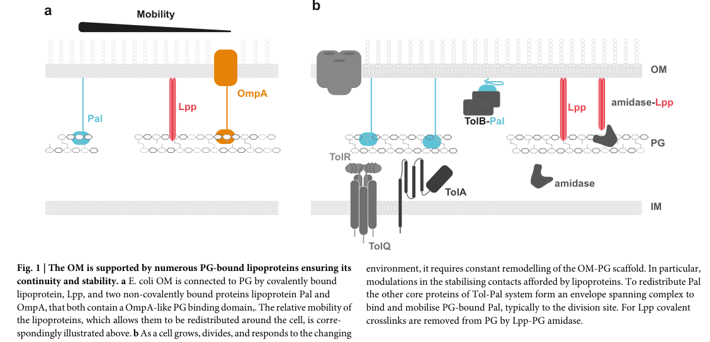

## Question

# Gene Research for Functional Annotation

## ⚠️ CRITICAL: Gene/Protein Identification Context

**BEFORE YOU BEGIN RESEARCH:** You MUST verify you are researching the CORRECT gene/protein. Gene symbols can be ambiguous, especially for less well-characterized genes from non-model organisms.

### Target Gene/Protein Identity (from UniProt):
- **UniProt Accession:** P0A138
- **Protein Description:** RecName: Full=Peptidoglycan-associated lipoprotein {ECO:0000255|HAMAP-Rule:MF_02204}; Short=PAL {ECO:0000255|HAMAP-Rule:MF_02204}; Flags: Precursor;
- **Gene Information:** Name=pal {ECO:0000255|HAMAP-Rule:MF_02204}; Synonyms=oprL, pal1; OrderedLocusNames=PP_1223;
- **Organism (full):** Pseudomonas putida (strain ATCC 47054 / DSM 6125 / CFBP 8728 / NCIMB 11950 / KT2440).
- **Protein Family:** Belongs to the Pal lipoprotein family. {ECO:0000255|HAMAP-
- **Key Domains:** Bact_OuterMem_StrucFunc. (IPR050330); OMP_bac. (IPR006664); OmpA-like. (IPR006665); OMPA-like_CS. (IPR006690); OmpA-like_sf. (IPR036737)

### MANDATORY VERIFICATION STEPS:

1. **Check if the gene symbol "pal" matches the protein description above**
2. **Verify the organism is correct:** Pseudomonas putida (strain ATCC 47054 / DSM 6125 / CFBP 8728 / NCIMB 11950 / KT2440).
3. **Check if protein family/domains align with what you find in literature**
4. **If you find literature for a DIFFERENT gene with the same or similar symbol, STOP**

### If Gene Symbol is Ambiguous or You Cannot Find Relevant Literature:

**DO NOT PROCEED WITH RESEARCH ON A DIFFERENT GENE.** Instead:
- State clearly: "The gene symbol 'pal' is ambiguous or literature is limited for this specific protein"
- Explain what you found (e.g., "Found extensive literature on a different gene with the same symbol in a different organism")
- Describe the protein based ONLY on the UniProt information provided above
- Suggest that the protein function can be inferred from domain/family information

### Research Target:

Please provide a comprehensive research report on the gene **pal** (gene ID: pal, UniProt: P0A138) in PSEPK.

The research report should be a detailed narrative explaining the function, biological processes, and localization of the gene product. Citations should be given for all claims.

You should prioritize authoritative reviews and primary scientific literature when conducting research. You can supplement
this with annotations you find in gene/protein databases, but these can be outdated or inaccurate.

We are specifically interested in the primary function of the gene - for enzymes, what reaction is catalyzed, and what is the substrate specificity? For transporters, what is the substrate? For structural proteins or adapters, what is the broader structural role? For signaling molecules, what is the role in the pathway.

We are interested in where in or outside the cell the gene product carries out its function.

We are also interested in the signaling or biochemical pathways in which the gene functions. We are less interested in broad pleiotropic effects, except where these elucidate the precise role.

Include evidence where possible. We are interested in both experimental evidence as well as inference from structure, evolution, or bioinformatic analysis. Precise studies should be prioritized over high-throughput, where available.

## Output

Question: You are an expert researcher providing comprehensive, well-cited information.

Provide detailed information focusing on:
1. Key concepts and definitions with current understanding
2. Recent developments and latest research (prioritize 2023-2024 sources)
3. Current applications and real-world implementations
4. Expert opinions and analysis from authoritative sources
5. Relevant statistics and data from recent studies

Format as a comprehensive research report with proper citations. Include URLs and publication dates where available.
Always prioritize recent, authoritative sources and provide specific citations for all major claims.

# Gene Research for Functional Annotation

## ⚠️ CRITICAL: Gene/Protein Identification Context

**BEFORE YOU BEGIN RESEARCH:** You MUST verify you are researching the CORRECT gene/protein. Gene symbols can be ambiguous, especially for less well-characterized genes from non-model organisms.

### Target Gene/Protein Identity (from UniProt):
- **UniProt Accession:** P0A138
- **Protein Description:** RecName: Full=Peptidoglycan-associated lipoprotein {ECO:0000255|HAMAP-Rule:MF_02204}; Short=PAL {ECO:0000255|HAMAP-Rule:MF_02204}; Flags: Precursor;
- **Gene Information:** Name=pal {ECO:0000255|HAMAP-Rule:MF_02204}; Synonyms=oprL, pal1; OrderedLocusNames=PP_1223;
- **Organism (full):** Pseudomonas putida (strain ATCC 47054 / DSM 6125 / CFBP 8728 / NCIMB 11950 / KT2440).
- **Protein Family:** Belongs to the Pal lipoprotein family. {ECO:0000255|HAMAP-
- **Key Domains:** Bact_OuterMem_StrucFunc. (IPR050330); OMP_bac. (IPR006664); OmpA-like. (IPR006665); OMPA-like_CS. (IPR006690); OmpA-like_sf. (IPR036737)

### MANDATORY VERIFICATION STEPS:

1. **Check if the gene symbol "pal" matches the protein description above**
2. **Verify the organism is correct:** Pseudomonas putida (strain ATCC 47054 / DSM 6125 / CFBP 8728 / NCIMB 11950 / KT2440).
3. **Check if protein family/domains align with what you find in literature**
4. **If you find literature for a DIFFERENT gene with the same or similar symbol, STOP**

### If Gene Symbol is Ambiguous or You Cannot Find Relevant Literature:

**DO NOT PROCEED WITH RESEARCH ON A DIFFERENT GENE.** Instead:
- State clearly: "The gene symbol 'pal' is ambiguous or literature is limited for this specific protein"
- Explain what you found (e.g., "Found extensive literature on a different gene with the same symbol in a different organism")
- Describe the protein based ONLY on the UniProt information provided above
- Suggest that the protein function can be inferred from domain/family information

### Research Target:

Please provide a comprehensive research report on the gene **pal** (gene ID: pal, UniProt: P0A138) in PSEPK.

The research report should be a detailed narrative explaining the function, biological processes, and localization of the gene product. Citations should be given for all claims.

You should prioritize authoritative reviews and primary scientific literature when conducting research. You can supplement
this with annotations you find in gene/protein databases, but these can be outdated or inaccurate.

We are specifically interested in the primary function of the gene - for enzymes, what reaction is catalyzed, and what is the substrate specificity? For transporters, what is the substrate? For structural proteins or adapters, what is the broader structural role? For signaling molecules, what is the role in the pathway.

We are interested in where in or outside the cell the gene product carries out its function.

We are also interested in the signaling or biochemical pathways in which the gene functions. We are less interested in broad pleiotropic effects, except where these elucidate the precise role.

Include evidence where possible. We are interested in both experimental evidence as well as inference from structure, evolution, or bioinformatic analysis. Precise studies should be prioritized over high-throughput, where available.

## Research Report: Functional Annotation of **pal / oprL** (UniProt **P0A138**) in *Pseudomonas putida* KT2440

### 0) Mandatory identity verification (to avoid symbol ambiguity)
The target protein specified by UniProt accession **P0A138** in *Pseudomonas putida* KT2440 is an **outer-membrane peptidoglycan-associated lipoprotein** that is explicitly referred to as **OprL** and equated with **Pal** in a 2024 *P. putida* proteomics study (publication date May 2024; URL: https://doi.org/10.1016/j.mcpro.2024.100765). (kelly2024comprehensiveproteomicsanalysis pages 1-3, kelly2024comprehensiveproteomicsanalysis pages 7-8)

This identity is consistent with current expert descriptions of **Pal** as the conserved, peptidoglycan-binding **outer-membrane (OM) lipoprotein** component of the **Tol–Pal** system, where Pal is mobilized to the division site to maintain OM–peptidoglycan (PG) connectivity (publication date Dec 2024; URL: https://doi.org/10.1038/s44259-024-00065-0). (szczepaniak2024thetolpal pages 2-3, szczepaniak2024thetolpal pages 1-2)

### 1) Key concepts, definitions, and current understanding (functional model)

#### 1.1 What “Pal/OprL” means
**Pal** (peptidoglycan-associated lipoprotein) is a **lipid-anchored OM protein** whose **periplasmic domain binds peptidoglycan** and thereby contributes to **tethering the OM to the cell wall**. In contemporary reviews, Pal is described as an OM-anchored lipoprotein with an **OmpA-like PG-binding domain** that forms a non-covalent OM–PG linkage. (szczepaniak2024thetolpal pages 2-3, szczepaniak2024thetolpal pages 1-2)

#### 1.2 Primary molecular function (non-enzymatic)
For the requested “primary function” framing: **Pal/OprL is not an enzyme** and does not catalyze a chemical reaction. Its primary role is **structural/mechanical**: stabilizing the Gram-negative envelope by **increasing OM–PG linkages**, particularly during division when the OM must invaginate in synchrony with PG remodeling. (szczepaniak2024thetolpal pages 2-3, szczepaniak2024thetolpal pages 3-4)

#### 1.3 Pathway context: the Tol–Pal system
The **Tol–Pal system** is an envelope-spanning machinery (core components typically **TolQ, TolR, TolA, TolB, Pal**) that uses **proton motive force (PMF)** at the inner membrane to drive periplasmic/OM events. In the widely cited mechanistic model summarized in 2024, **TolB binds and mobilizes Pal** (reducing its PG association during transport), and **TolQ/TolR/TolA** act to **strip TolB from Pal and deposit Pal at the division septum**, restoring Pal–PG tethering where it is needed to stabilize constriction. (szczepaniak2024thetolpal pages 2-3, szczepaniak2024thetolpal pages 3-4)

A figure from Szczepaniak & Webby (2024) schematizes (i) Pal-mediated OM–PG tethering and (ii) the Tol–Pal complex that mobilizes Pal to the division site. (szczepaniak2024thetolpal media 71f7337a)

### 2) Recent developments and latest research (priority 2023–2024)

#### 2.1 2024 (*P. putida* KT2440): OprL/Pal as a newly identified PHA “phasin”-associated factor
A May 2024 study of polyhydroxyalkanoate (PHA) biology in *P. putida* KT2440 reports that the **outer membrane lipoprotein OprL (Pal component of the Pal–Tol system)** is a **newly identified phasin-associated protein** that **localizes to PHA carbonosomes** and shows a PHA-related phenotype (URL: https://doi.org/10.1016/j.mcpro.2024.100765). This extends Pal/OprL’s context beyond classical envelope maintenance into a biotechnology-relevant cellular compartment associated with intracellular storage granules. (kelly2024comprehensiveproteomicsanalysis pages 1-3)

Quantitatively, in their AP–MS validation, P0A138 (OprL/Pal) was detected with at least **28% sequence coverage** (reported as a minimum in the excerpted validation discussion). (kelly2024comprehensiveproteomicsanalysis pages 7-8)

Interpretation: this does **not** contradict the established OM–PG tethering function; rather, it suggests Pal/OprL can be co-opted or spatially enriched at PHA-associated structures, potentially reflecting envelope–granule interface biology or a moonlighting association under PHA-producing conditions. (kelly2024comprehensiveproteomicsanalysis pages 1-3)

#### 2.2 2024 (expert synthesis): Tol–Pal framed as an antimicrobial target and envelope integration hub
A Dec 2024 expert review emphasizes Tol–Pal as an integrated system that connects the three-layered diderm envelope and positions it as an **attractive target for envelope-disrupting antimicrobials**, due to its centrality in OM stability and division-associated remodeling (URL: https://doi.org/10.1038/s44259-024-00065-0). (szczepaniak2024thetolpal pages 2-3)

#### 2.3 2024 (*Pseudomonas aeruginosa*): Pseudomonas-specific OprH–OprL interaction and chemical-genetic vulnerability
A March 2024 preprint reports that **OprL (called Pal in other Gram-negative bacteria)** is an **essential OM lipoprotein** in *P. aeruginosa* and identifies a **direct genetic and biochemical interaction between OprH and OprL**, forming an **OprH–OprL complex that bridges the OM and PG** (URL: https://doi.org/10.1101/2024.03.16.585348). The same study describes screening of ~**54,000 compounds** and discovery of **BRD1401**, which preferentially impacts an **oprL-depleted strain**, with mechanism implicating disruption of OprH–LPS organization and increased membrane fluidity. (poulsen2024“multiplexedscreenidentifies pages 1-5)

Interpretation for *P. putida* annotation: while this is not direct KT2440 evidence, it strengthens the concept that Pal/OprL-centered OM–PG tethering can involve **species-specific partner proteins** beyond the canonical Tol–Pal components, and that such partner interactions can be exploited by small molecules. (poulsen2024“multiplexedscreenidentifies pages 1-5)

### 3) Cellular localization and where the gene product acts
Pal/OprL is consistently described as an **outer-membrane-anchored lipoprotein** whose functional domain operates in the **periplasm** by binding **peptidoglycan**. Its envelope role is dynamic: it is distributed around the cell periphery in nondividing cells but is redistributed/accumulated at the **division site** through Tol–Pal activity. (szczepaniak2024thetolpal pages 2-3, szczepaniak2024thetolpal pages 1-2)

### 4) Phenotypes and functional evidence (what happens when Pal/Tol–Pal is perturbed)
Across Gram-negative model systems and summarized in reviews, loss of core tol-pal genes (including pal) leads to:
- **Defective OM invagination** during division and division defects (e.g., chaining) (szczepaniak2024thetolpal pages 3-4)
- **OM instability** manifesting as **blebbing** and **increased outer membrane vesicle release** (szczepaniak2024thetolpal pages 2-3)
- **Heightened sensitivity** to detergents and antibiotics (including polymyxins in review-level summaries) (szczepaniak2024thetolpal pages 2-3)

In *P. putida* KT2440 specifically, an OMV engineering study reports that **clean deletions of tolA, tolB, tolR, or pal/oprL could not be generated**, consistent with essential or near-essential envelope roles under the study conditions. In the same study, **CRISPRi knockdown of tolA or pal did not significantly increase membrane vesicle production**, making Tol–Pal perturbation unattractive for hypervesiculation in KT2440. (wilkes2025engineeredmembranevesicle pages 2-3)

### 5) Current applications and real-world implementations

#### 5.1 Industrial/biotech context: PHA production and carbonosome proteomics
*P. putida* KT2440 is used as an industrially relevant PHA producer, and OprL/Pal is reported as a newly identified phasin-associated factor localizing to PHA carbonosomes in a 2024 proteomics study (May 2024; https://doi.org/10.1016/j.mcpro.2024.100765). This creates a plausible handle for future engineering or monitoring of PHA granule biology that intersects with envelope proteins. (kelly2024comprehensiveproteomicsanalysis pages 1-3)

#### 5.2 OMV engineering for bioproduction (context for envelope-tethering constraints)
A 2024 study on engineered vesiculation in *P. putida* KT2440 reports that genetic triggering of vesiculation during natural product production (prodigiosin, violacein, phenazine-1-carboxylic acid, zeaxanthin) yields **up to 3-fold increased product yields** (Jul 2024; https://doi.org/10.1111/1751-7915.14312). (bitzenhofer2024exploringengineeredvesiculation pages 1-2)

Separately, quantitative vesiculation engineering comparisons (not Pal deletions themselves) report **4.0-fold MV increases** for ΔoprF and **1.5-fold MV increases** for ΔoprI in KT2440, illustrating that envelope structure can be tuned but also that Tol–Pal/Pal may not be a tractable deletion target in this chassis. (wilkes2025engineeredmembranevesicle pages 2-3)

#### 5.3 Antimicrobial discovery and targeting rationale
Recent expert synthesis positions the Tol–Pal system as a targetable hub for novel antimicrobials because its disruption leads to OM destabilization phenotypes and division-linked envelope failures. (szczepaniak2024thetolpal pages 2-3)

In *Pseudomonas* specifically, chemical-genetic screening uncovered a vulnerability of oprL-depleted strains via a compound (BRD1401) that disrupts OprH–LPS interactions and reveals an OprH–OprL OM–PG bridging complex, providing a concrete example of drug discovery logic centered on OM stability networks involving OprL/Pal. (poulsen2024“multiplexedscreenidentifies pages 1-5)

#### 5.4 Diagnostics note (scope limitation)
The broader clinical/environmental literature frequently uses **PCR targeting oprL** for *P. aeruginosa* detection and virulence gene panels, but the retrieved evidence excerpts did not contain authoritative diagnostic performance statistics (e.g., sensitivity/specificity, LOD) suitable for citation here. Therefore, only qualitative mention is warranted under the current evidence set. (szczepaniak2024thetolpal pages 8-9)

### 6) Expert opinions and analysis (authoritative synthesis)
The Tol–Pal system is increasingly described by experts as more than a static tether: it is an **energized, PMF-linked system** that **mobilizes and concentrates Pal at division sites** to coordinate OM stability with PG remodeling and envelope constriction, explaining the broad pleiotropic phenotypes of tol-pal mutants. This view is articulated both in a highly cited 2020 review (May 2020; https://doi.org/10.1093/femsre/fuaa018) and updated in a 2024 review emphasizing antimicrobial potential (Dec 2024; https://doi.org/10.1038/s44259-024-00065-0). (szczepaniak2020themultifariousroles pages 1-2, szczepaniak2024thetolpal pages 2-3)

### 7) Relevant statistics and data points (from recent studies)
- **Proteomics validation (KT2440, 2024):** P0A138 (OprL/Pal) identified with **≥28% sequence coverage** in AP–MS validation. (kelly2024comprehensiveproteomicsanalysis pages 7-8)
- **Chemical-genetic screen scale (P. aeruginosa, 2024):** mini-PROSPECT screen of ~**54,000 compounds**, yielding BRD1401 activity linked to oprL depletion and an OprH–OprL OM–PG complex. (poulsen2024“multiplexedscreenidentifies pages 1-5)
- **OMV engineering outcomes (KT2440, 2025):** ΔoprF yields **4.0-fold** MV particle increase; ΔoprI yields **1.5-fold** MV particle increase and **+22 nm** mean MV size; 50 μM PQS yields **1.9-fold** MV increase. Pal/oprL deletions were not obtainable in that study. (wilkes2025engineeredmembranevesicle pages 2-3)
- **Bioproduction via vesiculation (KT2440, 2024):** engineered vesiculation produced **up to 3-fold** increases in natural product yields. (bitzenhofer2024exploringengineeredvesiculation pages 1-2)

### 8) Summary (functional annotation statement)
**pal (oprL), UniProt P0A138** in *Pseudomonas putida* KT2440 encodes a **peptidoglycan-associated outer membrane lipoprotein (Pal/OprL)** whose primary function is **non-enzymatic tethering of the outer membrane to peptidoglycan**, thereby maintaining **cell envelope integrity** and supporting **outer membrane invagination during cell division** through the energized **Tol–Pal** pathway. In KT2440, recent evidence links OprL/Pal to **PHA carbonosome biology** (phasin-associated localization) and suggests **limited genetic tractability** for deletion (consistent with essential/near-essential envelope roles). Recent research in *Pseudomonas* also reveals species-specific partner interactions (OprH–OprL) that may be exploitable for antimicrobial development. (kelly2024comprehensiveproteomicsanalysis pages 1-3, szczepaniak2024thetolpal pages 2-3, wilkes2025engineeredmembranevesicle pages 2-3, poulsen2024“multiplexedscreenidentifies pages 1-5)

| Annotation area | Summary finding | Quantitative/statistical details | Evidence |
|---|---|---|---|
| Verified identity | UniProt P0A138 in *Pseudomonas putida* KT2440 corresponds to Pal, the peptidoglycan-associated lipoprotein; synonym OprL is explicitly used in recent *P. putida* proteomics, matching the supplied gene/protein identity. | Recent AP-MS validation identified P0A138 with at least 28% sequence coverage; study table reports OprL/Pal-associated values including 1004, 57, and 53.01 (contextual table values reported by authors). | (kelly2024comprehensiveproteomicsanalysis pages 1-3, kelly2024comprehensiveproteomicsanalysis pages 7-8) |
| Family/domain | Pal/OprL belongs to the OmpA-like peptidoglycan-binding lipoprotein family; recent Tol–Pal review describes Pal as carrying a periplasmic OmpA-like PG-binding domain. | No *P. putida*-specific residue map reported in the recent sources; mechanistic baseline from other bacteria maps a PG-binding region in Pal and supports OmpA-like fold/function. | (szczepaniak2024thetolpal pages 1-2, cascales2004deletionanalysesof pages 1-2) |
| Localization/topology | Pal/OprL is an outer-membrane-anchored lipoprotein with an N-terminal lipid anchor and a periplasmic PG-binding domain that noncovalently associates with peptidoglycan. In nondividing cells it is distributed around the cell periphery. | Qualitative localization; no absolute copy number given here. Figure models place Pal at the OM with periplasmic contact to PG. | (szczepaniak2024thetolpal pages 2-3, szczepaniak2024thetolpal pages 1-2, szczepaniak2024thetolpal media 71f7337a) |
| Primary molecular function | The primary function is structural, not enzymatic: Pal/OprL tethers the outer membrane to peptidoglycan, thereby stabilizing the Gram-negative envelope and helping maintain envelope integrity during growth and division. | No catalytic reaction/substrate specificity applies; binding function is toward PG, especially stem-peptide-containing PG material in the OmpA-like domain framework. | (szczepaniak2024thetolpal pages 2-3, szczepaniak2024thetolpal pages 3-4, szczepaniak2020themultifariousroles pages 1-2) |
| Pathway context | Pal is the OM component of the Tol–Pal system. Core components are TolQ, TolR, TolA, TolB, and Pal; TolQRA use proton motive force to mobilize TolB-bound Pal and concentrate/deposit it at the division site, restoring OM–PG linkage during septation. | PMF dependence is qualitative in the cited reviews; no rate constants reported here. | (szczepaniak2024thetolpal pages 3-4, szczepaniak2024thetolpal pages 2-3, szczepaniak2024thetolpal media 71f7337a) |
| Interaction partners | Functionally linked partners include TolB and TolA in the canonical Tol–Pal pathway; in *Pseudomonas*, a 2024 study additionally identified an OprH–OprL complex bridging the OM and PG. | 2024 chemical-genetic study identified a Pseudomonas-specific small molecule (BRD1401) whose activity is enhanced in an oprL hypomorph through disruption of OprH-associated envelope organization. | (poulsen2024“multiplexedscreenidentifies pages 1-5, cascales2004deletionanalysesof pages 1-2) |
| Biological process relevance | Pal/OprL contributes to outer-membrane invagination during cell division, envelope cooperativity across the three-layered diderm envelope, and proper positioning of PG-remodeling activities indirectly through Tol–Pal organization. | Recent reviews emphasize septal Pal redistribution as a central mechanistic theme rather than a fixed static tether. | (szczepaniak2024thetolpal pages 2-3, szczepaniak2024thetolpal pages 3-4, szczepaniak2024thetolpal pages 1-2) |
| Disruption phenotypes: general | Loss of Pal/Tol–Pal function in Gram-negative bacteria causes OM instability, blebbing, increased OMV release, periplasmic leakage, detergent and antibiotic hypersensitivity, and division defects such as chaining/filamentation. | Reported phenotype classes include increased susceptibility to vancomycin, β-lactams, novobiocin, and polymyxins depending on organism/study; exact fold-changes are not provided in the retrieved recent review contexts. | (szczepaniak2024thetolpal pages 2-3, cascales2004deletionanalysesof pages 1-2, szczepaniak2020themultifariousroles pages 1-2) |
| Disruption phenotypes: *P. putida* note | In *P. putida* KT2440, recent engineering work could not obtain clean deletions of pal/oprL (or tolA/tolB/tolR), suggesting these functions may be essential or near-essential under the tested conditions; CRISPRi knockdown of tolA or pal did not significantly increase vesicle formation. | Clean deletions of pal/oprL could not be generated; by comparison, ΔoprF caused a 4.0-fold MV increase, ΔoprI a 1.5-fold increase and +22 nm mean MV size, and 50 μM PQS caused a 1.9-fold MV increase. | (wilkes2025engineeredmembranevesicle pages 2-3) |
| *P. putida* 2024 development | A 2024 proteomics study identified OprL/Pal as a newly recognized phasin-associated protein in *P. putida* KT2440, enriched in PHA carbonosome-related preparations, expanding its functional context beyond classical envelope biology. | OprL/Pal was described as “highly enriched” in AP-MS and detected in carbonosome preparations; minimum validation coverage for P0A138 was 28%. | (kelly2024comprehensiveproteomicsanalysis pages 1-3, kelly2024comprehensiveproteomicsanalysis pages 7-8) |
| 2024 conceptual advance | A 2024 expert review reframed Tol–Pal as an integrated envelope maintenance system connecting outer membrane, peptidoglycan, and inner membrane processes, and highlighted it as an attractive target for envelope-disrupting antimicrobials. | Conceptual/statistical emphasis rather than new numeric data. | (szczepaniak2024thetolpal pages 2-3, szczepaniak2024thetolpal pages 1-2) |
| 2024 Pseudomonas-specific advance | In *Pseudomonas aeruginosa*, OprL was shown to participate in an OprH–OprL complex bridging OM and PG, revealing a Pseudomonas-specific interaction layer beyond the canonical Tol–Pal description. | Small molecule BRD1401 emerged from a multiplexed screen as a Pseudomonas-specific perturbagen acting through OprH-associated OM organization and selectively affecting oprL-depleted cells. | (poulsen2024“multiplexedscreenidentifies pages 1-5) |
| Overall annotation confidence | High confidence for identity, localization, structural role, and Tol–Pal pathway placement; moderate confidence for *P. putida*-specific mechanistic nuances because much direct mechanistic detail still derives from conserved Gram-negative models rather than dedicated KT2440 genetics. | Confidence supported by a 2024 *P. putida* primary study, a 2024 review, and foundational mechanistic literature. | (kelly2024comprehensiveproteomicsanalysis pages 1-3, szczepaniak2024thetolpal pages 2-3, cascales2004deletionanalysesof pages 1-2) |

*Table: This table summarizes the verified identity, localization, molecular role, pathway context, disruption phenotypes, and recent 2023–2024 developments for Pal/OprL (UniProt P0A138) in *Pseudomonas putida* KT2440. It is useful as a compact evidence map linking the KT2440 protein to the conserved Tol–Pal envelope-tethering system and highlighting recent Pseudomonas-specific findings.*

References

1. (kelly2024comprehensiveproteomicsanalysis pages 1-3): Siobhán Kelly, Jia-Lynn Tham, Kate McKeever, Eugène Dillon, David J. O’Connell, Dimitri Scholz, Jeremy C. Simpson, Kevin E O'Connor, T. Narančić, and Gerard Cagney. Comprehensive proteomics analysis of polyhydroxyalkanoate (pha) biology in pseudomonas putida kt2440: the outer membrane lipoprotein oprl is a newly identified phasin. Molecular &amp; Cellular Proteomics, 23:100765, May 2024. URL: https://doi.org/10.1016/j.mcpro.2024.100765, doi:10.1016/j.mcpro.2024.100765. This article has 11 citations and is from a domain leading peer-reviewed journal.

2. (kelly2024comprehensiveproteomicsanalysis pages 7-8): Siobhán Kelly, Jia-Lynn Tham, Kate McKeever, Eugène Dillon, David J. O’Connell, Dimitri Scholz, Jeremy C. Simpson, Kevin E O'Connor, T. Narančić, and Gerard Cagney. Comprehensive proteomics analysis of polyhydroxyalkanoate (pha) biology in pseudomonas putida kt2440: the outer membrane lipoprotein oprl is a newly identified phasin. Molecular &amp; Cellular Proteomics, 23:100765, May 2024. URL: https://doi.org/10.1016/j.mcpro.2024.100765, doi:10.1016/j.mcpro.2024.100765. This article has 11 citations and is from a domain leading peer-reviewed journal.

3. (szczepaniak2024thetolpal pages 2-3): Joanna Szczepaniak and Melissa N. Webby. The tol pal system integrates maintenance of the three layered cell envelope. npj Antimicrobials and Resistance, Dec 2024. URL: https://doi.org/10.1038/s44259-024-00065-0, doi:10.1038/s44259-024-00065-0. This article has 10 citations and is from a peer-reviewed journal.

4. (szczepaniak2024thetolpal pages 1-2): Joanna Szczepaniak and Melissa N. Webby. The tol pal system integrates maintenance of the three layered cell envelope. npj Antimicrobials and Resistance, Dec 2024. URL: https://doi.org/10.1038/s44259-024-00065-0, doi:10.1038/s44259-024-00065-0. This article has 10 citations and is from a peer-reviewed journal.

5. (szczepaniak2024thetolpal pages 3-4): Joanna Szczepaniak and Melissa N. Webby. The tol pal system integrates maintenance of the three layered cell envelope. npj Antimicrobials and Resistance, Dec 2024. URL: https://doi.org/10.1038/s44259-024-00065-0, doi:10.1038/s44259-024-00065-0. This article has 10 citations and is from a peer-reviewed journal.

6. (szczepaniak2024thetolpal media 71f7337a): Joanna Szczepaniak and Melissa N. Webby. The tol pal system integrates maintenance of the three layered cell envelope. npj Antimicrobials and Resistance, Dec 2024. URL: https://doi.org/10.1038/s44259-024-00065-0, doi:10.1038/s44259-024-00065-0. This article has 10 citations and is from a peer-reviewed journal.

7. (poulsen2024“multiplexedscreenidentifies pages 1-5): Bradley E. Poulsen, Thulasi Warrier, Sulyman Barkho, Josephine Bagnall, Keith P. Romano, Tiantian White, Xiao Yu, Tomohiko Kawate, Phuong H. Nguyen, Kyra Raines, Kristina Ferrara, Aaron Golas, Michael Fitzgerald, Andras Boeszoermenyi, Virendar Kaushik, Michael Serrano-Wu, Noam Shoresh, and Deborah T. Hung. “multiplexed screen identifies a pseudomonas aeruginosa-specific small molecule targeting the outer membrane protein oprh and its interaction with lps”. bioRxiv, Mar 2024. URL: https://doi.org/10.1101/2024.03.16.585348, doi:10.1101/2024.03.16.585348. This article has 1 citations.

8. (wilkes2025engineeredmembranevesicle pages 2-3): Rebecca A. Wilkes, Tarryn E. Miller, Jacob Waldbauer, Nanqing Zhou, Lichun Zhang, Beth N. DiBiase, Neha P. Kamat, Ludmilla Aristilde, Gregg T. Beckham, and Allison Z. Werner. Engineered membrane vesicle production via oprf or opri deletion has distinct phenotypic effects in pseudomonas putida. ACS Synthetic Biology, 14:2739-2752, Jul 2025. URL: https://doi.org/10.1021/acssynbio.5c00171, doi:10.1021/acssynbio.5c00171. This article has 3 citations and is from a domain leading peer-reviewed journal.

9. (bitzenhofer2024exploringengineeredvesiculation pages 1-2): Nora Lisa Bitzenhofer, Carolin Höfel, Stephan Thies, Andrea Jeanette Weiler, Christian Eberlein, Hermann J. Heipieper, Renu Batra‐Safferling, Pia Sundermeyer, Thomas Heidler, Carsten Sachse, Tobias Busche, Jörn Kalinowski, Thomke Belthle, Thomas Drepper, Karl‐Erich Jaeger, and Anita Loeschcke. Exploring engineered vesiculation by pseudomonas putida kt2440 for natural product biosynthesis. Microbial Biotechnology, Jul 2024. URL: https://doi.org/10.1111/1751-7915.14312, doi:10.1111/1751-7915.14312. This article has 13 citations and is from a peer-reviewed journal.

10. (szczepaniak2024thetolpal pages 8-9): Joanna Szczepaniak and Melissa N. Webby. The tol pal system integrates maintenance of the three layered cell envelope. npj Antimicrobials and Resistance, Dec 2024. URL: https://doi.org/10.1038/s44259-024-00065-0, doi:10.1038/s44259-024-00065-0. This article has 10 citations and is from a peer-reviewed journal.

11. (szczepaniak2020themultifariousroles pages 1-2): Joanna Szczepaniak, Cara Press, and Colin Kleanthous. The multifarious roles of tol-pal in gram-negative bacteria. FEMS Microbiology Reviews, 44:490-506, May 2020. URL: https://doi.org/10.1093/femsre/fuaa018, doi:10.1093/femsre/fuaa018. This article has 140 citations and is from a domain leading peer-reviewed journal.

12. (cascales2004deletionanalysesof pages 1-2): Eric Cascales and Roland Lloubès. Deletion analyses of the peptidoglycan‐associated lipoprotein pal reveals three independent binding sequences including a tola box. Molecular Microbiology, 51:873-885, Dec 2004. URL: https://doi.org/10.1046/j.1365-2958.2003.03881.x, doi:10.1046/j.1365-2958.2003.03881.x. This article has 100 citations and is from a domain leading peer-reviewed journal.

## Artifacts

- [Edison artifact artifact-00](pal-deep-research-falcon_artifacts/artifact-00.md)

## Citations

1. kelly2024comprehensiveproteomicsanalysis pages 1-3
2. kelly2024comprehensiveproteomicsanalysis pages 7-8
3. szczepaniak2024thetolpal pages 2-3
4. szczepaniak2024thetolpal pages 3-4
5. wilkes2025engineeredmembranevesicle pages 2-3
6. bitzenhofer2024exploringengineeredvesiculation pages 1-2
7. szczepaniak2024thetolpal pages 8-9
8. szczepaniak2024thetolpal pages 1-2
9. szczepaniak2020themultifariousroles pages 1-2
10. cascales2004deletionanalysesof pages 1-2
11. https://doi.org/10.1016/j.mcpro.2024.100765
12. https://doi.org/10.1038/s44259-024-00065-0
13. https://doi.org/10.1101/2024.03.16.585348
14. https://doi.org/10.1111/1751-7915.14312
15. https://doi.org/10.1093/femsre/fuaa018
16. https://doi.org/10.1016/j.mcpro.2024.100765,
17. https://doi.org/10.1038/s44259-024-00065-0,
18. https://doi.org/10.1101/2024.03.16.585348,
19. https://doi.org/10.1021/acssynbio.5c00171,
20. https://doi.org/10.1111/1751-7915.14312,
21. https://doi.org/10.1093/femsre/fuaa018,
22. https://doi.org/10.1046/j.1365-2958.2003.03881.x,