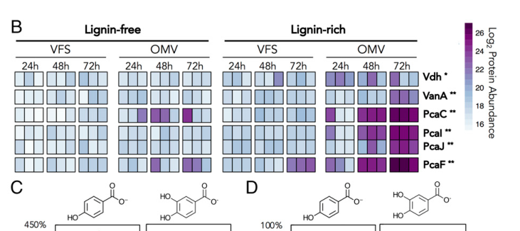

## Question

# Gene Research for Functional Annotation

## ⚠️ CRITICAL: Gene/Protein Identification Context

**BEFORE YOU BEGIN RESEARCH:** You MUST verify you are researching the CORRECT gene/protein. Gene symbols can be ambiguous, especially for less well-characterized genes from non-model organisms.

### Target Gene/Protein Identity (from UniProt):
- **UniProt Accession:** Q88N35
- **Protein Description:** RecName: Full=4-carboxymuconolactone decarboxylase {ECO:0000256|NCBIfam:TIGR02425}; EC=4.1.1.44 {ECO:0000256|NCBIfam:TIGR02425};
- **Gene Information:** Name=pcaC {ECO:0000313|EMBL:AAN67004.1}; OrderedLocusNames=PP_1381 {ECO:0000313|EMBL:AAN67004.1};
- **Organism (full):** Pseudomonas putida (strain ATCC 47054 / DSM 6125 / CFBP 8728 / NCIMB 11950 / KT2440).
- **Protein Family:** Not specified in UniProt
- **Key Domains:** 4CMD/NDH-1_regulator. (IPR052512); AhpD-like. (IPR029032); CMD-like. (IPR003779); Decarb_PcaC. (IPR012788); CMD (PF02627)

### MANDATORY VERIFICATION STEPS:

1. **Check if the gene symbol "pcaC" matches the protein description above**
2. **Verify the organism is correct:** Pseudomonas putida (strain ATCC 47054 / DSM 6125 / CFBP 8728 / NCIMB 11950 / KT2440).
3. **Check if protein family/domains align with what you find in literature**
4. **If you find literature for a DIFFERENT gene with the same or similar symbol, STOP**

### If Gene Symbol is Ambiguous or You Cannot Find Relevant Literature:

**DO NOT PROCEED WITH RESEARCH ON A DIFFERENT GENE.** Instead:
- State clearly: "The gene symbol 'pcaC' is ambiguous or literature is limited for this specific protein"
- Explain what you found (e.g., "Found extensive literature on a different gene with the same symbol in a different organism")
- Describe the protein based ONLY on the UniProt information provided above
- Suggest that the protein function can be inferred from domain/family information

### Research Target:

Please provide a comprehensive research report on the gene **pcaC** (gene ID: pcaC, UniProt: Q88N35) in PSEPK.

The research report should be a detailed narrative explaining the function, biological processes, and localization of the gene product. Citations should be given for all claims.

You should prioritize authoritative reviews and primary scientific literature when conducting research. You can supplement
this with annotations you find in gene/protein databases, but these can be outdated or inaccurate.

We are specifically interested in the primary function of the gene - for enzymes, what reaction is catalyzed, and what is the substrate specificity? For transporters, what is the substrate? For structural proteins or adapters, what is the broader structural role? For signaling molecules, what is the role in the pathway.

We are interested in where in or outside the cell the gene product carries out its function.

We are also interested in the signaling or biochemical pathways in which the gene functions. We are less interested in broad pleiotropic effects, except where these elucidate the precise role.

Include evidence where possible. We are interested in both experimental evidence as well as inference from structure, evolution, or bioinformatic analysis. Precise studies should be prioritized over high-throughput, where available.

## Output

Question: You are an expert researcher providing comprehensive, well-cited information.

Provide detailed information focusing on:
1. Key concepts and definitions with current understanding
2. Recent developments and latest research (prioritize 2023-2024 sources)
3. Current applications and real-world implementations
4. Expert opinions and analysis from authoritative sources
5. Relevant statistics and data from recent studies

Format as a comprehensive research report with proper citations. Include URLs and publication dates where available.
Always prioritize recent, authoritative sources and provide specific citations for all major claims.

# Gene Research for Functional Annotation

## ⚠️ CRITICAL: Gene/Protein Identification Context

**BEFORE YOU BEGIN RESEARCH:** You MUST verify you are researching the CORRECT gene/protein. Gene symbols can be ambiguous, especially for less well-characterized genes from non-model organisms.

### Target Gene/Protein Identity (from UniProt):
- **UniProt Accession:** Q88N35
- **Protein Description:** RecName: Full=4-carboxymuconolactone decarboxylase {ECO:0000256|NCBIfam:TIGR02425}; EC=4.1.1.44 {ECO:0000256|NCBIfam:TIGR02425};
- **Gene Information:** Name=pcaC {ECO:0000313|EMBL:AAN67004.1}; OrderedLocusNames=PP_1381 {ECO:0000313|EMBL:AAN67004.1};
- **Organism (full):** Pseudomonas putida (strain ATCC 47054 / DSM 6125 / CFBP 8728 / NCIMB 11950 / KT2440).
- **Protein Family:** Not specified in UniProt
- **Key Domains:** 4CMD/NDH-1_regulator. (IPR052512); AhpD-like. (IPR029032); CMD-like. (IPR003779); Decarb_PcaC. (IPR012788); CMD (PF02627)

### MANDATORY VERIFICATION STEPS:

1. **Check if the gene symbol "pcaC" matches the protein description above**
2. **Verify the organism is correct:** Pseudomonas putida (strain ATCC 47054 / DSM 6125 / CFBP 8728 / NCIMB 11950 / KT2440).
3. **Check if protein family/domains align with what you find in literature**
4. **If you find literature for a DIFFERENT gene with the same or similar symbol, STOP**

### If Gene Symbol is Ambiguous or You Cannot Find Relevant Literature:

**DO NOT PROCEED WITH RESEARCH ON A DIFFERENT GENE.** Instead:
- State clearly: "The gene symbol 'pcaC' is ambiguous or literature is limited for this specific protein"
- Explain what you found (e.g., "Found extensive literature on a different gene with the same symbol in a different organism")
- Describe the protein based ONLY on the UniProt information provided above
- Suggest that the protein function can be inferred from domain/family information

### Research Target:

Please provide a comprehensive research report on the gene **pcaC** (gene ID: pcaC, UniProt: Q88N35) in PSEPK.

The research report should be a detailed narrative explaining the function, biological processes, and localization of the gene product. Citations should be given for all claims.

You should prioritize authoritative reviews and primary scientific literature when conducting research. You can supplement
this with annotations you find in gene/protein databases, but these can be outdated or inaccurate.

We are specifically interested in the primary function of the gene - for enzymes, what reaction is catalyzed, and what is the substrate specificity? For transporters, what is the substrate? For structural proteins or adapters, what is the broader structural role? For signaling molecules, what is the role in the pathway.

We are interested in where in or outside the cell the gene product carries out its function.

We are also interested in the signaling or biochemical pathways in which the gene functions. We are less interested in broad pleiotropic effects, except where these elucidate the precise role.

Include evidence where possible. We are interested in both experimental evidence as well as inference from structure, evolution, or bioinformatic analysis. Precise studies should be prioritized over high-throughput, where available.

## Research report: **pcaC (UniProt Q88N35; locus PP_1381)** in *Pseudomonas putida* KT2440

### 1) Target verification (critical identity checks)
The target protein is **PcaC**, annotated as **4-carboxymuconolactone decarboxylase (EC 4.1.1.44)** in *Pseudomonas putida* **KT2440**, consistent with the UniProt entry (Q88N35) and the canonical **protocatechuate (PCA) branch of the β-ketoadipate pathway** described in KT2440-focused studies and pathway summaries. In this pathway context, PcaC is the decarboxylase acting **after PcaB** and **before PcaD**. (park2020responseofpseudomonas pages 8-11, chow2024confirmationofgenes pages 11-15)

### 2) Key concepts and current functional understanding

#### 2.1 Definition and biochemical role
**PcaC (4-carboxymuconolactone decarboxylase; EC 4.1.1.44)** catalyzes the decarboxylation of **4-carboxymuconolactone (γ-carboxymuconolactone)** to **3-oxoadipate enol-lactone (β-ketoadipate enol-lactone)**. (park2020responseofpseudomonas pages 8-11, chow2024confirmationofgenesb pages 11-15, chow2024confirmationofgenes pages 11-15)

This reaction is a core step within the bacterial PCA 3,4-cleavage route:
- **Protocatechuate** is cleaved by **PcaHG (protocatechuate 3,4-dioxygenase)** to yield **3-carboxy-cis,cis-muconate**.
- **PcaB** converts the muconate to **γ-carboxymuconolactone**.
- **PcaC** decarboxylates γ-carboxymuconolactone to **3-oxoadipate enol-lactone**.
- **PcaD** hydrolyzes the enol-lactone to **β-ketoadipate**, which is further processed (e.g., via **PcaIJ, PcaF**) toward TCA-cycle entry. (chow2024confirmationofgenesb pages 11-15, chow2024confirmationofgenes pages 11-15)

#### 2.2 Substrate specificity
Within the retrieved KT2440 literature, PcaC is consistently discussed as the enzyme responsible for the **γ/4-carboxymuconolactone → enol-lactone** step in the PCA branch, but **P. putida KT2440-specific kinetic constants (Km, kcat) or broader substrate panels were not found in the retrieved corpus**. Therefore, the most defensible statement from these sources is that the physiologic substrate is **4-carboxymuconolactone (γ-carboxymuconolactone)** generated by the upstream PcaB reaction in PCA catabolism. (park2020responseofpseudomonas pages 8-11, chow2024confirmationofgenesb pages 11-15, chow2024confirmationofgenes pages 11-15)

### 3) Cellular localization and where the enzyme acts

#### 3.1 Evidence for extracellular/vesicle association (OMVs)
A key recent mechanistic development for aromatic catabolism in KT2440 is evidence that **outer membrane vesicles (OMVs)** carry enzymes capable of turning over lignin-derived aromatics. Salvachúa et al. (PNAS, **Apr 2020**, URL: https://doi.org/10.1073/pnas.1921073117) present a heat map (their Fig. 4B) comparing protein abundance in **OMV** vs **vesicle-free supernatant (VFS)** fractions under lignin-rich vs lignin-free conditions. In this figure, **PcaC appears as a distinct row** in the β-ketoadipate pathway panel and is shown as **enriched in OMV fractions, especially in lignin-rich medium** across the time course. (salvachua2020outermembranevesicles media 4d5c9524)

This provides direct, figure-level evidence that (at least a fraction of) PcaC can be associated with **extracellular OMVs** under aromatic/lignin-relevant conditions in KT2440, supporting the broader conclusion that aromatic catabolic capacity can extend beyond the cytosol via vesicle-packaged enzymes. (salvachua2020outermembranevesicles pages 6-7, salvachua2020outermembranevesicles media 4d5c9524)

#### 3.2 Whole-cell proteomics under lignolysate conditions
In contrast to OMV-associated detection, Park et al. (ChemSusChem, **Apr 2020**, URL: https://doi.org/10.1002/cssc.202000268) report shotgun proteomics of KT2440 grown on base-catalyzed depolymerized lignin liquor (BCD lignolysate). In these datasets, multiple PCA-branch enzymes were induced, but **PcaC was not detected**. (park2020responseofpseudomonas pages 8-11, park2020responseofpseudomonas pages 11-15)

Interpretation: these findings are compatible with the idea that PcaC may be (i) expressed at levels below detection in some whole-cell proteomic workflows/conditions, (ii) conditionally produced, and/or (iii) partitioned into extracellular/vesicle fractions in a way that complicates its detection in standard cellular proteomes. The available evidence does not allow a definitive statement that PcaC is primarily cytosolic vs vesicle-associated; it does, however, provide **direct evidence of OMV association** under at least one experimental context. (park2020responseofpseudomonas pages 11-15, salvachua2020outermembranevesicles media 4d5c9524)

### 4) Pathways and biological processes

#### 4.1 Central pathway role: funneling aromatics to central metabolism
PcaC functions in the **central aromatic catabolic funnel** (β-ketoadipate pathway, PCA branch), which is critical for conversion of diverse lignin-derived and plant-derived aromatics into intermediates that enter central carbon metabolism. In KT2440, aromatic substrates can be funneled to **protocatechuate**, then processed through **PcaHG–PcaB–PcaC–PcaD** to β-ketoadipate and onward toward acetyl-CoA/succinyl-CoA equivalents. (chow2024confirmationofgenesb pages 11-15, chow2024confirmationofgenes pages 11-15)

### 5) Recent developments (prioritizing 2023–2024)

#### 5.1 2024 synthesis emphasizing pathway placement and valorization relevance
A 2024 pathway-focused synthesis reiterates the canonical bacterial ordering **pcaGH → pcaB → pcaC → pcaD**, explicitly stating that **γ-carboxymuconolactone is decarboxylated by 4-carboxymuconolactone decarboxylase (pcaC)** to form **3-oxoadipate enol-lactone**, situating pcaC in the bacterial PCA-to-β-ketoadipate conversion. This same source frames PCA metabolism as part of a broader lignin-valorization landscape, noting that PCA is a precursor to industrially relevant molecules (e.g., via cis,cis-muconate routes). (chow2024confirmationofgenesb pages 11-15, chow2024confirmationofgenesa pages 11-15)

#### 5.2 Continued focus on compartmentalization mechanisms for aromatic catabolism
Although published in 2020, the OMV catabolism result is a major conceptual advance that continues to influence current thinking about how KT2440 accesses and processes aromatics extracellularly. The direct inclusion of **PcaC** in the OMV/VFS abundance heat map supports the possibility that central pathway enzymes can participate in extracellular aromatic turnover via vesicle packaging, at least under lignin-relevant cultivation regimes. (salvachua2020outermembranevesicles pages 6-7, salvachua2020outermembranevesicles media 4d5c9524)

### 6) Current applications and real-world implementations

#### 6.1 PET upcycling to β-ketoadipic acid uses the native pca pathway including pcaC
A prominent real-world metabolic-engineering implementation uses the KT2440 PCA/β-ketoadipate pathway (including **PcaC**) as a central “funneling” module for polymer upcycling. Werner et al. (Metabolic Engineering, **Sep 2021**, URL: https://doi.org/10.1016/j.ymben.2021.07.005) engineered *P. putida* KT2440 to convert PET glycolysis products to **β-ketoadipic acid (βKA)** via **terephthalate → protocatechuate → PcaHG → PcaB → PcaC → PcaD → …**. (werner2021tandemchemicaldeconstruction pages 2-3, werner2021tandemchemicaldeconstruction pages 1-2)

Quantitative outcomes reported include:
- **15.1 ± 0.6 g/L βKA** from commercial BHET in bioreactors, at **76% molar yield**. (werner2021tandemchemicaldeconstruction pages 1-2)
- Downstream product recovery by acidification and organic extraction at **~98% yield** and **>99% purity**. (werner2021tandemchemicaldeconstruction pages 2-3)
- In shake flasks, conversion of **3.11 ± 0.06 mM BHET/MHET** to **1.39 ± 0.01 mM βKA** (reported **45 ± 1% molar yield**). (werner2021tandemchemicaldeconstruction pages 7-9)

These data illustrate that PcaC’s step is part of a practically deployed pathway module supporting high-titer production of a commodity-platform chemical (βKA) from plastic-derived feedstocks. (werner2021tandemchemicaldeconstruction pages 2-3, werner2021tandemchemicaldeconstruction pages 1-2)

### 7) Evidence-based statistics/data from studies in KT2440

#### 7.1 Proteomic induction of the PCA branch on lignolysate (BCD liquor)
Park et al. (ChemSusChem, **Apr 2020**, URL: https://doi.org/10.1002/cssc.202000268) provide quantitative proteomics showing strong induction of aromatic catabolism when KT2440 is grown on BCD lignolysate. Reported values include:
- **PobA (4-hydroxybenzoate hydroxylase)**: **6.8 log2 fold-change** (BCD vs glucose). (park2020responseofpseudomonas pages 8-11)
- **PcaHG/PcaB/PcaD**: induced with changes spanning roughly **1.4–6.0 log2 fold-change**. (park2020responseofpseudomonas pages 11-15, park2020responseofpseudomonas pages 8-11)
- Downstream **PcaIJ** and **PcaF**: approximately **3.0** and **2.9 log2 fold-change**, respectively. (park2020responseofpseudomonas pages 11-15, park2019theresponseof pages 8-11)
- **PcaC: not detected** in these datasets despite pathway induction of adjacent steps. (park2020responseofpseudomonas pages 11-15, park2020responseofpseudomonas pages 8-11)

These statistics support the centrality of the protocatechuate/β-ketoadipate pathway during lignin-derived aromatic utilization in KT2440, while also highlighting potential measurement/partitioning complexity for PcaC in whole-cell proteomics. (park2020responseofpseudomonas pages 11-15, salvachua2020outermembranevesicles media 4d5c9524)

### 8) Expert synthesis and analysis (authoritative interpretation)
Across KT2440-focused primary literature and pathway summaries, PcaC is consistently treated as a **core, conserved enzymatic step** in the PCA branch that links ring-fission chemistry to formation of β-ketoadipate-derived intermediates (i.e., the “central funnel” toward core metabolism). (park2020responseofpseudomonas pages 8-11, chow2024confirmationofgenesb pages 11-15, chow2024confirmationofgenes pages 11-15)

Two observations from authoritative KT2440 datasets are particularly informative for functional annotation:
1) **Condition-dependent detectability**: Whole-cell proteomics can strongly induce the PCA branch yet still not detect PcaC, suggesting low abundance, technical detectability limits, or non-canonical partitioning. (park2020responseofpseudomonas pages 11-15, park2020responseofpseudomonas pages 8-11)
2) **Extracellular association via OMVs**: OMV proteomics provides direct evidence that PcaC can be present/enriched in OMVs under lignin-relevant conditions, aligning with the broader model that OMVs can mediate extracellular aromatic processing. (salvachua2020outermembranevesicles media 4d5c9524)

### 9) Key gaps and limitations in the retrieved literature
- **Biochemical parameters (Km/kcat), structural mechanism, and substrate promiscuity** for *P. putida* KT2440 PcaC were **not retrieved** in the current evidence set; thus, this report cannot provide KT2440-specific enzyme kinetics or structural residue-level mechanism. (park2020responseofpseudomonas pages 8-11, chow2024confirmationofgenes pages 11-15)
- Genetic essentiality (e.g., growth phenotypes of a ΔpcaC mutant on protocatechuate) was likewise **not directly retrieved**; functional assignment here is strongly supported by pathway placement and multiple experimental contexts, but not by a direct knockout phenotype within the accessible documents. (park2020responseofpseudomonas pages 8-11, chow2024confirmationofgenes pages 11-15)

---

### Summary table
| Gene / protein | Enzymatic reaction | Pathway context | Evidence type | Key quantitative data |
|---|---|---|---|---|
| **pcaC**; **UniProt Q88N35**; **PP_1381** | 4-carboxymuconolactone (γ-carboxymuconolactone) → 3-oxoadipate enol-lactone / β-ketoadipate enol-lactone, catalyzed by 4-carboxymuconolactone decarboxylase (EC 4.1.1.44) (chow2024confirmationofgenes pages 11-15, chow2024confirmationofgenesb pages 11-15) | Central step in the **protocatechuate (PCA) branch of the β-ketoadipate pathway**, downstream of **PcaB** and upstream of **PcaD**, funneling aromatic/lignin-derived compounds toward TCA-cycle entry (park2020responseofpseudomonas pages 8-11, chow2024confirmationofgenesb pages 11-15, chow2024confirmationofgenes pages 11-15) | **Review / pathway description**: recent summaries and pathway-focused sources place pcaC in canonical bacterial PCA catabolism and lignin valorization contexts (chow2024confirmationofgenesb pages 11-15, chow2024confirmationofgenesa pages 11-15, chow2024confirmationofgenes pages 11-15) | No enzyme kinetics for **P. putida KT2440 PcaC** were retrieved from the available sources; function is consistently assigned by pathway annotation and comparative literature (chow2024confirmationofgenes pages 11-15) |
| **pcaC**; **P. putida KT2440** | Same reaction as above (park2020responseofpseudomonas pages 8-11, chow2024confirmationofgenes pages 11-15) | Induced aromatic catabolism during growth on biomass-derived aromatic fractions / lignolysate (park2020responseofpseudomonas pages 11-15, park2020responseofpseudomonas pages 8-11, park2019theresponseof pages 8-11) | **Proteomics induction context**: related PCA-branch proteins increased strongly, while **PcaC itself was not detected** in the Park et al. datasets (park2020responseofpseudomonas pages 11-15, park2020responseofpseudomonas pages 8-11, park2019theresponseof pages 8-11) | 504 proteins identified overall; induction thresholds **log2 FC > 1, p < 0.01**. **PobA** up to **6.8 / 6.75 log2 FC**; **PcaHG/PcaB/PcaD** ranged about **1.4–6.0 log2 FC** (or **1.41–5.96**); **PcaIJ ~3.0 / 3.04 log2 FC**; **PcaF ~2.9 / 2.88 log2 FC**; **PcaC not detected** (park2020responseofpseudomonas pages 11-15, park2020responseofpseudomonas pages 8-11, park2019theresponseof pages 8-11) |
| **pcaC**; **P. putida KT2440** | Same reaction as above (salvachua2020outermembranevesicles pages 6-7) | β-ketoadipate-pathway enzyme associated with extracellular aromatic-catabolic machinery in **outer membrane vesicles (OMVs)** / vesicle-free supernatant comparisons (salvachua2020outermembranevesicles pages 6-7, salvachua2020outermembranevesicles media 4d5c9524) | **OMV localization / association**: figure-based evidence indicates a **PcaC row** in the OMV/VFS heatmap, with **enrichment in OMVs, especially in lignin-rich medium**; the main text more broadly supports OMV-encapsulated aromatic-catabolic enzymes in KT2440 (salvachua2020outermembranevesicles pages 6-7, salvachua2020outermembranevesicles media 4d5c9524) | Figure 4B reports **log2 protein abundance** patterns across OMV and VFS fractions over **72 h**; direct numeric values for PcaC were not extracted, but qualitative OMV enrichment was reported from the image evidence (salvachua2020outermembranevesicles media 4d5c9524) |
| **pcaC** within engineered PCA-to-β-ketoadipate route | Included in engineered sequence **PcaHG → PcaB → PcaC → PcaD → PcaIJ** converting PCA to β-ketoadipic acid in PET-upcycling designs (werner2021tandemchemicaldeconstruction pages 2-3, werner2021tandemchemicaldeconstruction pages 1-2) | Used in **metabolic engineering / real-world implementation** to funnel PET-derived terephthalate via PCA to **β-ketoadipic acid (βKA)** in **P. putida KT2440** (werner2021tandemchemicaldeconstruction pages 2-3, werner2021tandemchemicaldeconstruction pages 1-2, werner2021tandemchemicaldeconstruction pages 7-9) | **Metabolic engineering**: PET/BHET-to-βKA pathway engineering explicitly includes pcaC as a native central-pathway step (werner2021tandemchemicaldeconstruction pages 2-3) | Bioreactor production reached **15.1 ± 0.6 g/L βKA** from commercial BHET; reported **76% molar yield** in bioreactors; downstream recovery **~98% yield** and **>99% purity**. In shake flasks, **3.11 ± 0.06 mM** BHET/MHET gave **1.39 ± 0.01 mM βKA** (**45 ± 1% molar yield**) (werner2021tandemchemicaldeconstruction pages 2-3, werner2021tandemchemicaldeconstruction pages 1-2, werner2021tandemchemicaldeconstruction pages 7-9) |

*Table: This table summarizes the verified identity, reaction, pathway placement, and major evidence streams for Pseudomonas putida KT2440 pcaC (UniProt Q88N35/PP_1381). It also highlights the main quantitative results available from proteomics and metabolic-engineering studies.*

### Key figure evidence (localization/association)
- Salvachúa et al. PNAS 2020 Fig. 4B heatmap showing **PcaC in OMV vs VFS fractions** under lignin-rich vs lignin-free conditions (salvachua2020outermembranevesicles media 4d5c9524).

References

1. (park2020responseofpseudomonas pages 8-11): Mee‐Rye Park, Yan Chen, Mitchell Thompson, Veronica T. Benites, Bonnie Fong, Christopher J. Petzold, Edward E. K. Baidoo, John M. Gladden, Paul D. Adams, Jay D. Keasling, Blake A. Simmons, and Steven W. Singer. Response of <i>pseudomonas putida</i> to complex, aromatic‐rich fractions from biomass. ChemSusChem, 13:4455-4467, Apr 2020. URL: https://doi.org/10.1002/cssc.202000268, doi:10.1002/cssc.202000268. This article has 30 citations and is from a domain leading peer-reviewed journal.

2. (chow2024confirmationofgenes pages 11-15): N Chow. Confirmation of genes involved in the degradation of protocatechuate in aspergillus niger through characterization of their encoded enzymes. Unknown journal, 2024.

3. (chow2024confirmationofgenesb pages 11-15): N Chow. Confirmation of genes involved in the degradation of protocatechuate in aspergillus niger through characterization of their encoded enzymes. Unknown journal, 2024.

4. (salvachua2020outermembranevesicles media 4d5c9524): Davinia Salvachúa, Allison Z. Werner, Isabel Pardo, Martyna Michalska, Brenna A. Black, Bryon S. Donohoe, Stefan J. Haugen, Rui Katahira, Sandra Notonier, Kelsey J. Ramirez, Antonella Amore, Samuel O. Purvine, Erika M. Zink, Paul E. Abraham, Richard J. Giannone, Suresh Poudel, Philip D. Laible, Robert L. Hettich, and Gregg T. Beckham. Outer membrane vesicles catabolize lignin-derived aromatic compounds in pseudomonas putida kt2440. Proceedings of the National Academy of Sciences, 117:9302-9310, Apr 2020. URL: https://doi.org/10.1073/pnas.1921073117, doi:10.1073/pnas.1921073117. This article has 158 citations and is from a highest quality peer-reviewed journal.

5. (salvachua2020outermembranevesicles pages 6-7): Davinia Salvachúa, Allison Z. Werner, Isabel Pardo, Martyna Michalska, Brenna A. Black, Bryon S. Donohoe, Stefan J. Haugen, Rui Katahira, Sandra Notonier, Kelsey J. Ramirez, Antonella Amore, Samuel O. Purvine, Erika M. Zink, Paul E. Abraham, Richard J. Giannone, Suresh Poudel, Philip D. Laible, Robert L. Hettich, and Gregg T. Beckham. Outer membrane vesicles catabolize lignin-derived aromatic compounds in pseudomonas putida kt2440. Proceedings of the National Academy of Sciences, 117:9302-9310, Apr 2020. URL: https://doi.org/10.1073/pnas.1921073117, doi:10.1073/pnas.1921073117. This article has 158 citations and is from a highest quality peer-reviewed journal.

6. (park2020responseofpseudomonas pages 11-15): Mee‐Rye Park, Yan Chen, Mitchell Thompson, Veronica T. Benites, Bonnie Fong, Christopher J. Petzold, Edward E. K. Baidoo, John M. Gladden, Paul D. Adams, Jay D. Keasling, Blake A. Simmons, and Steven W. Singer. Response of <i>pseudomonas putida</i> to complex, aromatic‐rich fractions from biomass. ChemSusChem, 13:4455-4467, Apr 2020. URL: https://doi.org/10.1002/cssc.202000268, doi:10.1002/cssc.202000268. This article has 30 citations and is from a domain leading peer-reviewed journal.

7. (chow2024confirmationofgenesa pages 11-15): N Chow. Confirmation of genes involved in the degradation of protocatechuate in aspergillus niger through characterization of their encoded enzymes. Unknown journal, 2024.

8. (werner2021tandemchemicaldeconstruction pages 2-3): Allison Z. Werner, Rita Clare, Thomas D. Mand, Isabel Pardo, Kelsey J. Ramirez, Stefan J. Haugen, Felicia Bratti, Gara N. Dexter, Joshua R. Elmore, Jay D. Huenemann, George L. Peabody, Christopher W. Johnson, Nicholas A. Rorrer, Davinia Salvachúa, Adam M. Guss, and Gregg T. Beckham. Tandem chemical deconstruction and biological upcycling of poly(ethylene terephthalate) to β-ketoadipic acid by pseudomonas putida kt2440. Sep 2021. URL: https://doi.org/10.1016/j.ymben.2021.07.005, doi:10.1016/j.ymben.2021.07.005. This article has 213 citations and is from a domain leading peer-reviewed journal.

9. (werner2021tandemchemicaldeconstruction pages 1-2): Allison Z. Werner, Rita Clare, Thomas D. Mand, Isabel Pardo, Kelsey J. Ramirez, Stefan J. Haugen, Felicia Bratti, Gara N. Dexter, Joshua R. Elmore, Jay D. Huenemann, George L. Peabody, Christopher W. Johnson, Nicholas A. Rorrer, Davinia Salvachúa, Adam M. Guss, and Gregg T. Beckham. Tandem chemical deconstruction and biological upcycling of poly(ethylene terephthalate) to β-ketoadipic acid by pseudomonas putida kt2440. Sep 2021. URL: https://doi.org/10.1016/j.ymben.2021.07.005, doi:10.1016/j.ymben.2021.07.005. This article has 213 citations and is from a domain leading peer-reviewed journal.

10. (werner2021tandemchemicaldeconstruction pages 7-9): Allison Z. Werner, Rita Clare, Thomas D. Mand, Isabel Pardo, Kelsey J. Ramirez, Stefan J. Haugen, Felicia Bratti, Gara N. Dexter, Joshua R. Elmore, Jay D. Huenemann, George L. Peabody, Christopher W. Johnson, Nicholas A. Rorrer, Davinia Salvachúa, Adam M. Guss, and Gregg T. Beckham. Tandem chemical deconstruction and biological upcycling of poly(ethylene terephthalate) to β-ketoadipic acid by pseudomonas putida kt2440. Sep 2021. URL: https://doi.org/10.1016/j.ymben.2021.07.005, doi:10.1016/j.ymben.2021.07.005. This article has 213 citations and is from a domain leading peer-reviewed journal.

11. (park2019theresponseof pages 8-11): Mee-Rye Park, Yan Chen, Mitchell Thompson, Veronica T. Benites, Bonnie Fong, Christopher J. Petzold, Edward E. K. Baidoo, John M. Gladden, Paul D. Adams, Jay D. Keasling, Blake A. Simmons, and Steven W. Singer. The response of pseudomonas putida to a complex lignolysate. bioRxiv, Sep 2019. URL: https://doi.org/10.1101/764399, doi:10.1101/764399. This article has 3 citations.

## Artifacts

- [Edison artifact artifact-00](pcaC-deep-research-falcon_artifacts/artifact-00.md)

## Citations

1. werner2021tandemchemicaldeconstruction pages 1-2
2. werner2021tandemchemicaldeconstruction pages 2-3
3. werner2021tandemchemicaldeconstruction pages 7-9
4. park2020responseofpseudomonas pages 8-11
5. chow2024confirmationofgenes pages 11-15
6. salvachua2020outermembranevesicles pages 6-7
7. chow2024confirmationofgenesb pages 11-15
8. park2020responseofpseudomonas pages 11-15
9. chow2024confirmationofgenesa pages 11-15
10. park2019theresponseof pages 8-11
11. https://doi.org/10.1073/pnas.1921073117
12. https://doi.org/10.1002/cssc.202000268
13. https://doi.org/10.1016/j.ymben.2021.07.005
14. https://doi.org/10.1002/cssc.202000268,
15. https://doi.org/10.1073/pnas.1921073117,
16. https://doi.org/10.1016/j.ymben.2021.07.005,
17. https://doi.org/10.1101/764399,