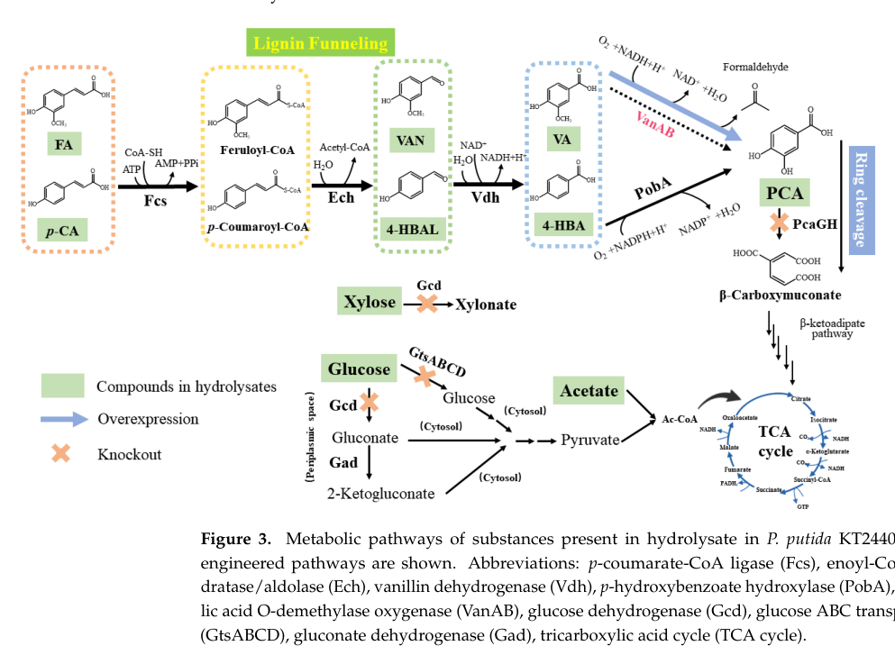

## Question

# Gene Research for Functional Annotation

## ⚠️ CRITICAL: Gene/Protein Identification Context

**BEFORE YOU BEGIN RESEARCH:** You MUST verify you are researching the CORRECT gene/protein. Gene symbols can be ambiguous, especially for less well-characterized genes from non-model organisms.

### Target Gene/Protein Identity (from UniProt):
- **UniProt Accession:** Q88E13
- **Protein Description:** SubName: Full=Protocatechuate 3,4-dioxygenase alpha chain {ECO:0000313|EMBL:AAN70228.1}; EC=1.13.11.3 {ECO:0000313|EMBL:AAN70228.1};
- **Gene Information:** Name=pcaG {ECO:0000313|EMBL:AAN70228.1}; OrderedLocusNames=PP_4655 {ECO:0000313|EMBL:AAN70228.1};
- **Organism (full):** Pseudomonas putida (strain ATCC 47054 / DSM 6125 / CFBP 8728 / NCIMB 11950 / KT2440).
- **Protein Family:** Belongs to the intradiol ring-cleavage dioxygenase family.
- **Key Domains:** Intradiol_dOase_C. (IPR000627); Intradiol_dOase_core. (IPR015889); Intradiol_RC_Dioxygenase. (IPR050770); Protocat_dOase_a. (IPR012786); Dioxygenase_C (PF00775)

### MANDATORY VERIFICATION STEPS:

1. **Check if the gene symbol "pcaG" matches the protein description above**
2. **Verify the organism is correct:** Pseudomonas putida (strain ATCC 47054 / DSM 6125 / CFBP 8728 / NCIMB 11950 / KT2440).
3. **Check if protein family/domains align with what you find in literature**
4. **If you find literature for a DIFFERENT gene with the same or similar symbol, STOP**

### If Gene Symbol is Ambiguous or You Cannot Find Relevant Literature:

**DO NOT PROCEED WITH RESEARCH ON A DIFFERENT GENE.** Instead:
- State clearly: "The gene symbol 'pcaG' is ambiguous or literature is limited for this specific protein"
- Explain what you found (e.g., "Found extensive literature on a different gene with the same symbol in a different organism")
- Describe the protein based ONLY on the UniProt information provided above
- Suggest that the protein function can be inferred from domain/family information

### Research Target:

Please provide a comprehensive research report on the gene **pcaG** (gene ID: pcaG, UniProt: Q88E13) in PSEPK.

The research report should be a detailed narrative explaining the function, biological processes, and localization of the gene product. Citations should be given for all claims.

You should prioritize authoritative reviews and primary scientific literature when conducting research. You can supplement
this with annotations you find in gene/protein databases, but these can be outdated or inaccurate.

We are specifically interested in the primary function of the gene - for enzymes, what reaction is catalyzed, and what is the substrate specificity? For transporters, what is the substrate? For structural proteins or adapters, what is the broader structural role? For signaling molecules, what is the role in the pathway.

We are interested in where in or outside the cell the gene product carries out its function.

We are also interested in the signaling or biochemical pathways in which the gene functions. We are less interested in broad pleiotropic effects, except where these elucidate the precise role.

Include evidence where possible. We are interested in both experimental evidence as well as inference from structure, evolution, or bioinformatic analysis. Precise studies should be prioritized over high-throughput, where available.

## Output

Question: You are an expert researcher providing comprehensive, well-cited information.

Provide detailed information focusing on:
1. Key concepts and definitions with current understanding
2. Recent developments and latest research (prioritize 2023-2024 sources)
3. Current applications and real-world implementations
4. Expert opinions and analysis from authoritative sources
5. Relevant statistics and data from recent studies

Format as a comprehensive research report with proper citations. Include URLs and publication dates where available.
Always prioritize recent, authoritative sources and provide specific citations for all major claims.

# Gene Research for Functional Annotation

## ⚠️ CRITICAL: Gene/Protein Identification Context

**BEFORE YOU BEGIN RESEARCH:** You MUST verify you are researching the CORRECT gene/protein. Gene symbols can be ambiguous, especially for less well-characterized genes from non-model organisms.

### Target Gene/Protein Identity (from UniProt):
- **UniProt Accession:** Q88E13
- **Protein Description:** SubName: Full=Protocatechuate 3,4-dioxygenase alpha chain {ECO:0000313|EMBL:AAN70228.1}; EC=1.13.11.3 {ECO:0000313|EMBL:AAN70228.1};
- **Gene Information:** Name=pcaG {ECO:0000313|EMBL:AAN70228.1}; OrderedLocusNames=PP_4655 {ECO:0000313|EMBL:AAN70228.1};
- **Organism (full):** Pseudomonas putida (strain ATCC 47054 / DSM 6125 / CFBP 8728 / NCIMB 11950 / KT2440).
- **Protein Family:** Belongs to the intradiol ring-cleavage dioxygenase family.
- **Key Domains:** Intradiol_dOase_C. (IPR000627); Intradiol_dOase_core. (IPR015889); Intradiol_RC_Dioxygenase. (IPR050770); Protocat_dOase_a. (IPR012786); Dioxygenase_C (PF00775)

### MANDATORY VERIFICATION STEPS:

1. **Check if the gene symbol "pcaG" matches the protein description above**
2. **Verify the organism is correct:** Pseudomonas putida (strain ATCC 47054 / DSM 6125 / CFBP 8728 / NCIMB 11950 / KT2440).
3. **Check if protein family/domains align with what you find in literature**
4. **If you find literature for a DIFFERENT gene with the same or similar symbol, STOP**

### If Gene Symbol is Ambiguous or You Cannot Find Relevant Literature:

**DO NOT PROCEED WITH RESEARCH ON A DIFFERENT GENE.** Instead:
- State clearly: "The gene symbol 'pcaG' is ambiguous or literature is limited for this specific protein"
- Explain what you found (e.g., "Found extensive literature on a different gene with the same symbol in a different organism")
- Describe the protein based ONLY on the UniProt information provided above
- Suggest that the protein function can be inferred from domain/family information

### Research Target:

Please provide a comprehensive research report on the gene **pcaG** (gene ID: pcaG, UniProt: Q88E13) in PSEPK.

The research report should be a detailed narrative explaining the function, biological processes, and localization of the gene product. Citations should be given for all claims.

You should prioritize authoritative reviews and primary scientific literature when conducting research. You can supplement
this with annotations you find in gene/protein databases, but these can be outdated or inaccurate.

We are specifically interested in the primary function of the gene - for enzymes, what reaction is catalyzed, and what is the substrate specificity? For transporters, what is the substrate? For structural proteins or adapters, what is the broader structural role? For signaling molecules, what is the role in the pathway.

We are interested in where in or outside the cell the gene product carries out its function.

We are also interested in the signaling or biochemical pathways in which the gene functions. We are less interested in broad pleiotropic effects, except where these elucidate the precise role.

Include evidence where possible. We are interested in both experimental evidence as well as inference from structure, evolution, or bioinformatic analysis. Precise studies should be prioritized over high-throughput, where available.

## Research report: *Pseudomonas putida* KT2440 **pcaG** (UniProt Q88E13; locus PP_4655)

### 1) Target verification (mandatory)
The UniProt accession **Q88E13** corresponds to **pcaG/PP_4655** in *Pseudomonas putida* KT2440 and encodes the **α-subunit of protocatechuate 3,4-dioxygenase (PcaGH; EC 1.13.11.3)**, the canonical intradiol ring-cleaving dioxygenase of the protocatechuate (PCA) branch of the **β-ketoadipate pathway**. This mapping is explicitly used in KT2440 metabolic-engineering work referring to **pcaGH (PP_4655–PP_4656)** as the protocatechuate 3,4-dioxygenase step. (jin2024biologicalvalorizationof pages 1-2, valderramagomez2020mechanisticmodelingof pages 33-36)

### 2) Key concepts and current functional understanding
#### 2.1 Definition and biochemical role
Protocatechuate 3,4-dioxygenase (PcaGH) catalyzes **intradiol (ortho) cleavage** of the aromatic ring of **protocatechuate (3,4-dihydroxybenzoate; PCA)**, producing **3-carboxy-cis,cis-muconate** (also termed **β-carboxy-cis,cis-muconate**), a central intermediate that is further metabolized toward TCA-cycle entry in the β-ketoadipate pathway. (chow2024confirmationofgenesa pages 11-15, valderramagomez2020mechanisticmodelingof pages 33-36)

A systems-level description of this enzymatic step is: 
- **PCA ⇌ β-carboxy-cis,cis-muconate** (PcaGH-catalyzed). (valderramagomez2020mechanisticmodelingof pages 33-36)

#### 2.2 Enzyme family, cofactor, and mechanistic features
PcaG belongs to the **intradiol ring-cleavage dioxygenase** family (intradiol dioxygenases / IDOs). Mechanistic structural work on protocatechuate 3,4-dioxygenase-type intradiol enzymes established that the catalytic metal is **Fe(III)** coordinated by a **2-His/2-Tyr ligand set**, and crystallography captured **alkylperoxo and anhydride intermediates** following O2 addition, supporting a detailed intradiol O2-activation mechanism. (knoot2015crystalstructuresof pages 1-3)

Although this mechanistic evidence is not specific to the KT2440 protein sequence, it represents the authoritative biochemical framework currently used to interpret PcaGH-class catalysis. (knoot2015crystalstructuresof pages 1-3)

#### 2.3 Substrate scope and specificity
The physiological substrate of PcaGH is protocatechuate; however, KT2440-focused work indicates PcaHG can also catalyze **intradiol cleavage of gallate**, and that such activity is relevant for engineered conversion of syringyl-derived intermediates (e.g., gallate, 3-methoxy-gallate-related metabolites) toward downstream products such as **2-pyrone-4,6-dicarboxylate (PDC)** via rearrangement/cyclization chemistry of ring-cleavage products. (dumalo2020dioxygenasesinthe pages 39-44, dumalo2020dioxygenasesinthe pages 32-39)

### 3) Genetic organization, regulation, and localization in *P. putida* KT2440
#### 3.1 Operon context and regulatory logic
A mechanistic modeling study of the protocatechuate pathway describes the relevant structural genes as being expressed from a **polycistronic mRNA (pcaBKCHG)** and highlights that protocatechuate uptake can involve **PcaK**, a transporter capable of importing PCA into the cell. (valderramagomez2020mechanisticmodelingof pages 33-36)

Regulation is mediated by **PcaU**, an **IclR-family** transcriptional regulator that functions as an **activator in the presence of the inducer protocatechuate** and as a **repressor in its absence** (i.e., a bidirectional regulator depending on ligand). This PCA-responsive regulation has been exploited for biosensor engineering in KT2440 (below). (valderramagomez2020mechanisticmodelingof pages 33-36, jha2018aprotocatechuatebiosensor pages 3-4)

#### 3.2 Cellular localization
All evidence in the retrieved KT2440 literature is consistent with PcaG functioning as an **intracellular (cytosolic) enzyme** in aromatic catabolism: ΔpcaGH blocks intracellular PCA catabolism and yields intracellular PCA accumulation phenotypes; additionally, PcaK is described as a PCA importer (implying intracellular metabolism). Direct microscopy-based localization experiments for KT2440 PcaG were not identified in the retrieved sources. (jha2018aprotocatechuatebiosensor pages 2-3, valderramagomez2020mechanisticmodelingof pages 33-36)

### 4) Recent developments (prioritizing 2023–2024) and latest research
#### 4.1 2024: Blocking pcaGH to accumulate protocatechuic acid from lignin-derived substrates
A 2024 metabolic-engineering study in *P. putida* KT2440 used **pcaGH deletion** to prevent ring cleavage of PCA and thereby **accumulate protocatechuic acid** from lignin-derived aromatic inputs (“biological funneling”). The work reports:
- From corncob hydrolysates: **253.88 mg/L PCA (70.85% yield)** and a maximum **433.72 mg/L PCA** without additional nutrients. (Jin et al., **2024-03**, *Molecules*, https://doi.org/10.3390/molecules29071555) (jin2024biologicalvalorizationof pages 1-2)
- In a ΔpcaGH strain (KT1), near-complete conversion of 1 g/L model phenolics to PCA with yields **97.7% (p-coumarate)**, **98.5% (4-hydroxybenzaldehyde)**, and **93.1% (4-hydroxybenzoate)** under the tested conditions. (jin2024biologicalvalorizationof pages 4-7)

The pathway-level rationale is visually summarized in the study’s pathway diagram, where **pcaGH** is the downstream ring-cleavage step whose removal diverts flux to PCA accumulation. (jin2024biologicalvalorizationof media 66b82404)

#### 4.2 2024: Integration with upstream funneling enzymes and carbon-source management
The same 2024 KT2440 engineering work also emphasizes that blocking PCA cleavage (ΔpcaGH) can be combined with modulation of upstream steps (e.g., vanillate O-demethylation and related conversions) to improve funneling from complex aromatic mixtures. The study reports that ΔpcaGH did not cause a discernible growth defect in glucose-supplemented conditions, suggesting that in some process designs cells can grow on alternative carbon sources while PCA accumulates as a product. (jin2024biologicalvalorizationof pages 7-9)

#### 4.3 2023–2024: Mechanistic understanding in the intradiol dioxygenase field
Within the retrieved corpus, the highest-resolution mechanistic evidence remains the crystallographic capture of catalytic intermediates in an intradiol ring-cleaving dioxygenase (PCD-type), including Fe(III) coordination and peroxo/anhydride intermediates. These data strongly inform how researchers interpret substrate scope, reaction intermediates, and potential engineering strategies (e.g., expanding substrate acceptance). (Knoot et al., **2015-12**, PNAS, https://doi.org/10.1073/pnas.1419118112) (knoot2015crystalstructuresof pages 1-3)

### 5) Current applications and real-world implementations
#### 5.1 Metabolic engineering: producing protocatechuic acid (PCA) from lignocellulosic hydrolysates
The most direct real-world application evidenced here is **bioproduction of PCA** from lignin-derived aromatics using engineered KT2440 strains with **ΔpcaGH** as the key flux-blocking modification, demonstrating production directly from complex biomass hydrolysates with quantified titers and yields. (jin2024biologicalvalorizationof pages 1-2)

A table and fermentation profiles in the 2024 study summarize PCA production outcomes across substrates and hydrolysates, providing an at-a-glance quantitative benchmark for process design. (jin2024biologicalvalorizationof media dc814145, jin2024biologicalvalorizationof media 7fa8d197)

#### 5.2 Biosensors and strain engineering workflows
A protocatechuate biosensor was ported and evolved in *P. putida* KT2440 by leveraging the PCA-responsive regulator **PcaU**. In KT2440 backgrounds engineered for PCA accumulation (ΔpcaHG strain CJ072), the best evolved variant (T147G/D148Y in PcaU) detected exogenous PCA **below 0.003 mM** with **>12-fold contrast ratio**, enabling high-throughput screening and pathway debugging for lignin-valorization strain engineering. (Jha et al., **2018-06**, *Metabolic Engineering Communications*, https://doi.org/10.1016/j.meteno.2018.03.001) (jha2018aprotocatechuatebiosensor pages 4-5)

#### 5.3 Alternate product: PDC via noncanonical substrates (gallate/syringate-derived intermediates)
KT2440 work on syringyl aromatic catabolism describes engineering strategies that include **overexpression of pcaHG** (e.g., chromosomal Ptac-driven pcaHG) and pathway blocking (e.g., ΔgalA) to increase production of **2-pyrone-4,6-dicarboxylate (PDC)** from syringate-related inputs, consistent with PcaHG’s capacity to cleave gallate and generate intermediates that can cyclize to PDC. (dumalo2020dioxygenasesinthe pages 32-39, dumalo2020dioxygenasesinthe pages 39-44)

### 6) Expert analysis and interpretation (authoritative synthesis)
#### 6.1 Why pcaG is a “control point” for aromatic carbon routing
The retrieved literature converges on a clear interpretation: **pcaGH is the commitment step that prevents PCA accumulation**, because once PCA is cleaved to carboxymuconate, flux is directed into the central β-ketoadipate pathway rather than remaining as an aromatic acid product. Therefore, **ΔpcaGH is a canonical chassis edit** to: 
- accumulate PCA as a product, or 
- enable PCA-dependent biosensors to report intracellular PCA, or 
- redirect flux from native mineralization toward value-added products.
This control-point logic is directly demonstrated by high-yield PCA accumulation upon ΔpcaGH in KT2440. (jin2024biologicalvalorizationof pages 4-7, jha2018aprotocatechuatebiosensor pages 4-5)

#### 6.2 Functionally important context for annotation: regulation and transport
For functional annotation, coupling enzymatic function (PcaGH) with **PcaU-mediated regulation** and **PcaK-mediated uptake** provides a coherent picture of a modular catabolic unit: PCA enters the cell (PcaK), induces the local regulator (PcaU), and is then cleaved by PcaGH, which is the key “ring-opening” bottleneck connecting lignin-derived aromatics to central metabolism. (valderramagomez2020mechanisticmodelingof pages 33-36)

### 7) Key statistics and data points (recent and foundational)
- **2024 hydrolysate valorization (KT2440):** 253.88 mg/L PCA at 70.85% yield; maximum 433.72 mg/L PCA from corncob hydrolysate without added nutrients. (jin2024biologicalvalorizationof pages 1-2)
- **2024 model substrate conversion (KT2440 ΔpcaGH):** PCA yields 97.7% (p-coumarate), 98.5% (4-hydroxybenzaldehyde), 93.1% (4-hydroxybenzoate). (jin2024biologicalvalorizationof pages 4-7)
- **Biosensor performance in KT2440:** detection <0.003 mM PCA; >12-fold contrast ratio. (jha2018aprotocatechuatebiosensor pages 4-5)
- **Mechanistic/biophysical parameters (intradiol PCD-type enzyme):** substrate binding Kd estimates and stopped-flow rates (e.g., Kd predicted ~88 µM; titration ~75 µM; observed steps 0.92/0.50/0.16 s−1) and Fe(III) 2-His/2-Tyr coordination. (knoot2015crystalstructuresof pages 1-3)

### Summary artifact
The following table consolidates key annotation facts, mechanism, regulation, localization, and application-relevant quantitative data.

| Aspect | Key points | Evidence/notes |
|---|---|---|
| Identity / verification | **pcaG = PP_4655 = α-subunit of protocatechuate 3,4-dioxygenase (PcaGH)** in *Pseudomonas putida* KT2440; enzyme is a heterodimeric/oligomeric intradiol dioxygenase with β-subunit **pcaH**. | KT2440 engineering papers explicitly refer to **pcaGH (PP_4655-4656)** as protocatechuate 3,4-dioxygenase; biosensor work identifies **pcaH/pcaG** as the two-subunit PCA 3,4-dioxygenase; modeling paper states α = **pcaG**, β = **pcaH**. (jin2024biologicalvalorizationof pages 1-2, jha2018aprotocatechuatebiosensor pages 2-3, valderramagomez2020mechanisticmodelingof pages 33-36) |
| Reaction | Catalyzes **intradiol 3,4-cleavage of protocatechuate (PCA)** to **3-carboxy-cis,cis-muconate** (also written β-carboxy-cis,cis-muconate). This is the ring-opening step of the PCA branch. | Bacterial PCA pathway summary names the product as 3-carboxy-cis,cis-muconic acid; modeling paper assigns reversible conversion PCA ↔ β-carboxy-cis,cis-muconate. (chow2024confirmationofgenesa pages 11-15, valderramagomez2020mechanisticmodelingof pages 33-36) |
| Enzyme class / mechanism | Member of the **intradiol ring-cleaving dioxygenase** family; mechanism proceeds through O2 addition and peroxo/anhydride intermediates characteristic of Fe-dependent intradiol cleavage chemistry. | Structural/mechanistic studies on 3,4-PCD captured alkylperoxo and anhydride intermediates and define it as an intradiol dioxygenase. (knoot2015crystalstructuresof pages 1-3) |
| Cofactor / active site | Active site contains **Fe3+** coordinated by a **2-His/2-Tyr** ligand set; tyrosines contribute ligand-to-metal charge transfer features. | High-confidence mechanistic evidence from crystal structures of 3,4-PCD. (knoot2015crystalstructuresof pages 1-3) |
| Substrates / specificity | Primary physiological substrate is **protocatechuate**. In KT2440-focused biochemical work, **PcaHG also cleaves gallate**, with expected lower specificity than for protocatechuate; products were investigated as **(Z)-OMAe and PDC** in engineering contexts. | KT2440 thesis work specifically tested protocatechuate and gallate, hypothesizing lower specificity for gallate and linking activity to PDC production. (dumalo2020dioxygenasesinthe pages 39-44, dumalo2020dioxygenasesinthe pages 32-39) |
| Quantitative mechanistic data | For 3,4-PCD with alternative substrate 4-fluorocatechol: observable stopped-flow steps had **RRTs 0.92, 0.50, and 0.16 s−1**; apparent **Kd ≈ 7.5 mM** for the initial weak complex; overall substrate **Kd predicted ≈ 88 μM**, direct titration **≈ 75 μM**. | These values come from a mechanistic 3,4-PCD study and are informative for enzyme behavior, though not KT2440-specific in vivo physiology. (knoot2015crystalstructuresof pages 1-3) |
| Pathway role | Central enzyme of the **β-ketoadipate / protocatechuate branch**, funnelling diverse aromatics after biological funneling to PCA toward central metabolism / TCA-cycle entry. | Reviews and KT2440 engineering papers place pcaGH at the PCA ring-cleavage step connecting lignin-derived aromatic catabolism to central carbon metabolism. (dumalo2020dioxygenasesinthe pages 32-39, jin2024biologicalvalorizationof pages 4-7, perez‐pantoja2012genomicanalysisof pages 10-12, jin2024biologicalvalorizationof media 66b82404) |
| Gene organization | pca catabolic genes in *Pseudomonas* are classically named **pcaGH, pcaB, pcaC, pcaD**; one systems model represents structural genes on a **polycistronic pcaBKCHG mRNA**. | Useful for functional annotation, though organization can vary across taxa and publications. (chow2024confirmationofgenesa pages 11-15, valderramagomez2020mechanisticmodelingof pages 33-36) |
| Regulation | **PcaU** is the local regulator: an **IclR-family** transcription factor that acts as **activator in the presence of protocatechuate** and **repressor in its absence**; PcaU-based regulatory parts were portable enough to engineer a PCA biosensor in KT2440. | Modeling and biosensor papers support PCA-responsive regulation through PcaU. (valderramagomez2020mechanisticmodelingof pages 33-36, jha2018aprotocatechuatebiosensor pages 3-4, jha2018aprotocatechuatebiosensor pages 1-2) |
| Transport context | **PcaK** can transport protocatechuate into the cell, coupling uptake to pca pathway function. | Relevant to interpreting intracellular PCA availability and pcaGH knockout phenotypes. (valderramagomez2020mechanisticmodelingof pages 33-36) |
| Cellular localization | Evidence supports an **intracellular/cytosolic** role in aromatic catabolism rather than secretion or membrane localization. | Biosensor/pathway studies describe intracellular PCA accumulation/catabolism; ring-cleavage enzymes in these studies are treated as intracellular pathway enzymes. Direct localization experiment for KT2440 PcaG was not identified in retrieved sources. (valderramagomez2020mechanisticmodelingof pages 33-36, jha2018aprotocatechuatebiosensor pages 2-3, jin2024biologicalvalorizationof pages 4-7) |
| KT2440 knockout phenotype | **ΔpcaGH** blocks PCA ring cleavage, allowing PCA accumulation and preventing further catabolism through the native β-ketoadipate pathway. In glucose-containing media, knockout reportedly had **no discernible impact on growth** in one study. | Seen in KT2440 strains used for PCA accumulation and sensor characterization. (jin2024biologicalvalorizationof pages 4-7, jin2024biologicalvalorizationof pages 7-9, jha2018aprotocatechuatebiosensor pages 3-4) |
| KT2440 engineering: PCA accumulation from model aromatics | In engineered KT2440 **KT1 (ΔpcaGH)**, PCA yields from 1 g/L substrates were **97.7% from p-coumarate**, **98.5% from 4-hydroxybenzaldehyde**, and **93.1% from 4-hydroxybenzoate**. | Demonstrates that blocking pcaGH efficiently diverts flux to PCA accumulation. (jin2024biologicalvalorizationof pages 4-7) |
| KT2440 engineering: vanAB overexpression with ΔpcaGH | In **KT2**, endogenous **vanAB** overexpression on top of **ΔpcaGH** increased PCA yield from **2.61% to 75.63%** for ferulic acid; strain also converted **10 g/L p-coumarate to 6.11 g/L PCA in 72 h**; with ferulate, **2.5 g/L consumed** and **1.9 g/L PCA** after 72 h. | Shows pcaGH deletion is a key chassis modification for lignin-monomer valorization. (jin2024biologicalvalorizationof pages 7-9) |
| KT2440 engineering: hydrolysate valorization | In 2024 hydrolysate work, engineered KT2440 produced **253.88 mg/L PCA** at **70.85% yield** from one corncob hydrolysate and **433.72 mg/L PCA** from another without added nutrients. | Figure/pathway summary explicitly shows **pcaGH knockout** as the enabling design feature. (jin2024biologicalvalorizationof pages 1-2, jin2024biologicalvalorizationof media 66b82404) |
| KT2440 engineering: gallate/PDC route | Chromosomal overexpression of **pcaHG** (e.g., **Ptac:pcaHG**) in KT2440 was used to enhance conversion of syringate/gallate-derived intermediates toward **2-pyrone-4,6-dicarboxylate (PDC)**. | Highlights that pcaG can be used both as a **knockout target** (to accumulate PCA) and an **overexpression target** (to drive ring-cleavage chemistry on noncanonical substrates). (dumalo2020dioxygenasesinthe pages 32-39, dumalo2020dioxygenasesinthe pages 39-44) |
| Biosensor application | A PcaU-based PCA biosensor evolved in KT2440 detected PCA at **<0.003 mM** with **>12-fold contrast ratio**; FACS selections used inductions from **0.01–10 mM PCA** and selected the **top 1%** induced cells after pre-clearing the bottom **40%** dark population. | While not measuring PcaG directly, this is a practical KT2440 application exploiting native PCA/pca regulation and ΔpcaGH backgrounds. (jha2018aprotocatechuatebiosensor pages 4-5, jha2018aprotocatechuatebiosensor pages 2-3) |
| Interpretation for annotation | Best-supported annotation for **Q88E13 / PP_4655**: intracellular α-subunit of the Fe(III)-dependent **protocatechuate 3,4-dioxygenase** that catalyzes intradiol ring opening of PCA in the β-ketoadipate pathway; highly relevant to lignin-derived aromatic catabolism and metabolic engineering in KT2440. | Consolidated from organism-specific and mechanistic sources. (jin2024biologicalvalorizationof pages 1-2, jin2024biologicalvalorizationof pages 4-7, valderramagomez2020mechanisticmodelingof pages 33-36, knoot2015crystalstructuresof pages 1-3, jin2024biologicalvalorizationof media 66b82404) |

*Table: This table summarizes the verified identity, biochemical function, pathway context, regulation, localization, and engineering relevance of *Pseudomonas putida* KT2440 pcaG (UniProt Q88E13/PP_4655). It also captures key numeric results from recent KT2440 metabolic-engineering studies and supporting mechanistic work.*

### Visual evidence (pathway and process outcomes)
- Pathway diagram showing PCA funneling and the role of **pcaGH** as the ring-cleavage step targeted for knockout in engineered KT2440 strains. (jin2024biologicalvalorizationof media 66b82404)
- Quantitative summary and fermentation profiles of PCA titers/yields from engineered KT2440 on real hydrolysates and mixed substrates. (jin2024biologicalvalorizationof media dc814145, jin2024biologicalvalorizationof media 7fa8d197)

References

1. (jin2024biologicalvalorizationof pages 1-2): Xinzhu Jin, Xiaoxia Li, Lihua Zou, Zhaojuan Zheng, and Jia Ouyang. Biological valorization of lignin-derived aromatics in hydrolysate to protocatechuic acid by engineered pseudomonas putida kt2440. Molecules, 29:1555, Mar 2024. URL: https://doi.org/10.3390/molecules29071555, doi:10.3390/molecules29071555. This article has 15 citations.

2. (valderramagomez2020mechanisticmodelingof pages 33-36): Miguel Á. Valderrama-Gómez, Jason G. Lomnitz, Rick A. Fasani, and Michael A. Savageau. Mechanistic modeling of biochemical systems without a priori parameter values using the design space toolbox v.3.0. iScience, 23:101200, Jun 2020. URL: https://doi.org/10.1016/j.isci.2020.101200, doi:10.1016/j.isci.2020.101200. This article has 15 citations and is from a peer-reviewed journal.

3. (chow2024confirmationofgenesa pages 11-15): N Chow. Confirmation of genes involved in the degradation of protocatechuate in aspergillus niger through characterization of their encoded enzymes. Unknown journal, 2024.

4. (knoot2015crystalstructuresof pages 1-3): Cory J. Knoot, Vincent M. Purpero, and John D. Lipscomb. Crystal structures of alkylperoxo and anhydride intermediates in an intradiol ring-cleaving dioxygenase. Proceedings of the National Academy of Sciences, 112:388-393, Dec 2015. URL: https://doi.org/10.1073/pnas.1419118112, doi:10.1073/pnas.1419118112. This article has 48 citations and is from a highest quality peer-reviewed journal.

5. (dumalo2020dioxygenasesinthe pages 39-44): Linda Dumalo. Dioxygenases in the catabolism of syringols in pseudomonas putida kt2440. ArXiv, Jan 2020. URL: https://doi.org/10.14288/1.0394310, doi:10.14288/1.0394310. This article has 0 citations.

6. (dumalo2020dioxygenasesinthe pages 32-39): Linda Dumalo. Dioxygenases in the catabolism of syringols in pseudomonas putida kt2440. ArXiv, Jan 2020. URL: https://doi.org/10.14288/1.0394310, doi:10.14288/1.0394310. This article has 0 citations.

7. (jha2018aprotocatechuatebiosensor pages 3-4): Ramesh K. Jha, Jeremy M. Bingen, Christopher W. Johnson, Theresa L. Kern, Payal Khanna, Daniel S. Trettel, Charlie E.M. Strauss, Gregg T. Beckham, and Taraka Dale. A protocatechuate biosensor for pseudomonas putida kt2440 via promoter and protein evolution. Jun 2018. URL: https://doi.org/10.1016/j.meteno.2018.03.001, doi:10.1016/j.meteno.2018.03.001. This article has 54 citations and is from a peer-reviewed journal.

8. (jha2018aprotocatechuatebiosensor pages 2-3): Ramesh K. Jha, Jeremy M. Bingen, Christopher W. Johnson, Theresa L. Kern, Payal Khanna, Daniel S. Trettel, Charlie E.M. Strauss, Gregg T. Beckham, and Taraka Dale. A protocatechuate biosensor for pseudomonas putida kt2440 via promoter and protein evolution. Jun 2018. URL: https://doi.org/10.1016/j.meteno.2018.03.001, doi:10.1016/j.meteno.2018.03.001. This article has 54 citations and is from a peer-reviewed journal.

9. (jin2024biologicalvalorizationof pages 4-7): Xinzhu Jin, Xiaoxia Li, Lihua Zou, Zhaojuan Zheng, and Jia Ouyang. Biological valorization of lignin-derived aromatics in hydrolysate to protocatechuic acid by engineered pseudomonas putida kt2440. Molecules, 29:1555, Mar 2024. URL: https://doi.org/10.3390/molecules29071555, doi:10.3390/molecules29071555. This article has 15 citations.

10. (jin2024biologicalvalorizationof media 66b82404): Xinzhu Jin, Xiaoxia Li, Lihua Zou, Zhaojuan Zheng, and Jia Ouyang. Biological valorization of lignin-derived aromatics in hydrolysate to protocatechuic acid by engineered pseudomonas putida kt2440. Molecules, 29:1555, Mar 2024. URL: https://doi.org/10.3390/molecules29071555, doi:10.3390/molecules29071555. This article has 15 citations.

11. (jin2024biologicalvalorizationof pages 7-9): Xinzhu Jin, Xiaoxia Li, Lihua Zou, Zhaojuan Zheng, and Jia Ouyang. Biological valorization of lignin-derived aromatics in hydrolysate to protocatechuic acid by engineered pseudomonas putida kt2440. Molecules, 29:1555, Mar 2024. URL: https://doi.org/10.3390/molecules29071555, doi:10.3390/molecules29071555. This article has 15 citations.

12. (jin2024biologicalvalorizationof media dc814145): Xinzhu Jin, Xiaoxia Li, Lihua Zou, Zhaojuan Zheng, and Jia Ouyang. Biological valorization of lignin-derived aromatics in hydrolysate to protocatechuic acid by engineered pseudomonas putida kt2440. Molecules, 29:1555, Mar 2024. URL: https://doi.org/10.3390/molecules29071555, doi:10.3390/molecules29071555. This article has 15 citations.

13. (jin2024biologicalvalorizationof media 7fa8d197): Xinzhu Jin, Xiaoxia Li, Lihua Zou, Zhaojuan Zheng, and Jia Ouyang. Biological valorization of lignin-derived aromatics in hydrolysate to protocatechuic acid by engineered pseudomonas putida kt2440. Molecules, 29:1555, Mar 2024. URL: https://doi.org/10.3390/molecules29071555, doi:10.3390/molecules29071555. This article has 15 citations.

14. (jha2018aprotocatechuatebiosensor pages 4-5): Ramesh K. Jha, Jeremy M. Bingen, Christopher W. Johnson, Theresa L. Kern, Payal Khanna, Daniel S. Trettel, Charlie E.M. Strauss, Gregg T. Beckham, and Taraka Dale. A protocatechuate biosensor for pseudomonas putida kt2440 via promoter and protein evolution. Jun 2018. URL: https://doi.org/10.1016/j.meteno.2018.03.001, doi:10.1016/j.meteno.2018.03.001. This article has 54 citations and is from a peer-reviewed journal.

15. (perez‐pantoja2012genomicanalysisof pages 10-12): Danilo Pérez‐Pantoja, Raúl Donoso, Loreine Agulló, Macarena Córdova, Michael Seeger, Dietmar H. Pieper, and Bernardo González. Genomic analysis of the potential for aromatic compounds biodegradation in burkholderiales. Environmental microbiology, 14 5:1091-117, May 2012. URL: https://doi.org/10.1111/j.1462-2920.2011.02613.x, doi:10.1111/j.1462-2920.2011.02613.x. This article has 416 citations and is from a domain leading peer-reviewed journal.

16. (jha2018aprotocatechuatebiosensor pages 1-2): Ramesh K. Jha, Jeremy M. Bingen, Christopher W. Johnson, Theresa L. Kern, Payal Khanna, Daniel S. Trettel, Charlie E.M. Strauss, Gregg T. Beckham, and Taraka Dale. A protocatechuate biosensor for pseudomonas putida kt2440 via promoter and protein evolution. Jun 2018. URL: https://doi.org/10.1016/j.meteno.2018.03.001, doi:10.1016/j.meteno.2018.03.001. This article has 54 citations and is from a peer-reviewed journal.

## Artifacts

- [Edison artifact artifact-00](pcaG-deep-research-falcon_artifacts/artifact-00.md)

## Citations

1. valderramagomez2020mechanisticmodelingof pages 33-36
2. knoot2015crystalstructuresof pages 1-3
3. jin2024biologicalvalorizationof pages 1-2
4. jin2024biologicalvalorizationof pages 4-7
5. jin2024biologicalvalorizationof pages 7-9
6. jha2018aprotocatechuatebiosensor pages 4-5
7. chow2024confirmationofgenesa pages 11-15
8. dumalo2020dioxygenasesinthe pages 39-44
9. dumalo2020dioxygenasesinthe pages 32-39
10. jha2018aprotocatechuatebiosensor pages 3-4
11. jha2018aprotocatechuatebiosensor pages 2-3
12. jha2018aprotocatechuatebiosensor pages 1-2
13. https://doi.org/10.3390/molecules29071555
14. https://doi.org/10.1073/pnas.1419118112
15. https://doi.org/10.1016/j.meteno.2018.03.001
16. https://doi.org/10.3390/molecules29071555,
17. https://doi.org/10.1016/j.isci.2020.101200,
18. https://doi.org/10.1073/pnas.1419118112,
19. https://doi.org/10.14288/1.0394310,
20. https://doi.org/10.1016/j.meteno.2018.03.001,
21. https://doi.org/10.1111/j.1462-2920.2011.02613.x,