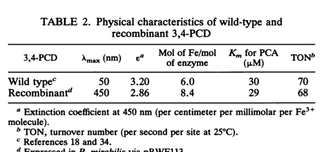

## Question

# Gene Research for Functional Annotation

## ⚠️ CRITICAL: Gene/Protein Identification Context

**BEFORE YOU BEGIN RESEARCH:** You MUST verify you are researching the CORRECT gene/protein. Gene symbols can be ambiguous, especially for less well-characterized genes from non-model organisms.

### Target Gene/Protein Identity (from UniProt):
- **UniProt Accession:** Q88E12
- **Protein Description:** SubName: Full=Protocatechuate 3,4-dioxygenase beta chain {ECO:0000313|EMBL:AAN70229.1}; EC=1.13.11.3 {ECO:0000313|EMBL:AAN70229.1};
- **Gene Information:** Name=pcaH {ECO:0000313|EMBL:AAN70229.1}; OrderedLocusNames=PP_4656 {ECO:0000313|EMBL:AAN70229.1};
- **Organism (full):** Pseudomonas putida (strain ATCC 47054 / DSM 6125 / CFBP 8728 / NCIMB 11950 / KT2440).
- **Protein Family:** Belongs to the intradiol ring-cleavage dioxygenase family.
- **Key Domains:** Intradiol_dOase_C. (IPR000627); Intradiol_dOase_core. (IPR015889); Intradiol_RC_Dioxygenase. (IPR050770); PCDO_beta_N. (IPR024756); Protocat_dOase_b. (IPR012785)

### MANDATORY VERIFICATION STEPS:

1. **Check if the gene symbol "pcaH" matches the protein description above**
2. **Verify the organism is correct:** Pseudomonas putida (strain ATCC 47054 / DSM 6125 / CFBP 8728 / NCIMB 11950 / KT2440).
3. **Check if protein family/domains align with what you find in literature**
4. **If you find literature for a DIFFERENT gene with the same or similar symbol, STOP**

### If Gene Symbol is Ambiguous or You Cannot Find Relevant Literature:

**DO NOT PROCEED WITH RESEARCH ON A DIFFERENT GENE.** Instead:
- State clearly: "The gene symbol 'pcaH' is ambiguous or literature is limited for this specific protein"
- Explain what you found (e.g., "Found extensive literature on a different gene with the same symbol in a different organism")
- Describe the protein based ONLY on the UniProt information provided above
- Suggest that the protein function can be inferred from domain/family information

### Research Target:

Please provide a comprehensive research report on the gene **pcaH** (gene ID: pcaH, UniProt: Q88E12) in PSEPK.

The research report should be a detailed narrative explaining the function, biological processes, and localization of the gene product. Citations should be given for all claims.

You should prioritize authoritative reviews and primary scientific literature when conducting research. You can supplement
this with annotations you find in gene/protein databases, but these can be outdated or inaccurate.

We are specifically interested in the primary function of the gene - for enzymes, what reaction is catalyzed, and what is the substrate specificity? For transporters, what is the substrate? For structural proteins or adapters, what is the broader structural role? For signaling molecules, what is the role in the pathway.

We are interested in where in or outside the cell the gene product carries out its function.

We are also interested in the signaling or biochemical pathways in which the gene functions. We are less interested in broad pleiotropic effects, except where these elucidate the precise role.

Include evidence where possible. We are interested in both experimental evidence as well as inference from structure, evolution, or bioinformatic analysis. Precise studies should be prioritized over high-throughput, where available.

## Output

Question: You are an expert researcher providing comprehensive, well-cited information.

Provide detailed information focusing on:
1. Key concepts and definitions with current understanding
2. Recent developments and latest research (prioritize 2023-2024 sources)
3. Current applications and real-world implementations
4. Expert opinions and analysis from authoritative sources
5. Relevant statistics and data from recent studies

Format as a comprehensive research report with proper citations. Include URLs and publication dates where available.
Always prioritize recent, authoritative sources and provide specific citations for all major claims.

# Gene Research for Functional Annotation

## ⚠️ CRITICAL: Gene/Protein Identification Context

**BEFORE YOU BEGIN RESEARCH:** You MUST verify you are researching the CORRECT gene/protein. Gene symbols can be ambiguous, especially for less well-characterized genes from non-model organisms.

### Target Gene/Protein Identity (from UniProt):
- **UniProt Accession:** Q88E12
- **Protein Description:** SubName: Full=Protocatechuate 3,4-dioxygenase beta chain {ECO:0000313|EMBL:AAN70229.1}; EC=1.13.11.3 {ECO:0000313|EMBL:AAN70229.1};
- **Gene Information:** Name=pcaH {ECO:0000313|EMBL:AAN70229.1}; OrderedLocusNames=PP_4656 {ECO:0000313|EMBL:AAN70229.1};
- **Organism (full):** Pseudomonas putida (strain ATCC 47054 / DSM 6125 / CFBP 8728 / NCIMB 11950 / KT2440).
- **Protein Family:** Belongs to the intradiol ring-cleavage dioxygenase family.
- **Key Domains:** Intradiol_dOase_C. (IPR000627); Intradiol_dOase_core. (IPR015889); Intradiol_RC_Dioxygenase. (IPR050770); PCDO_beta_N. (IPR024756); Protocat_dOase_b. (IPR012785)

### MANDATORY VERIFICATION STEPS:

1. **Check if the gene symbol "pcaH" matches the protein description above**
2. **Verify the organism is correct:** Pseudomonas putida (strain ATCC 47054 / DSM 6125 / CFBP 8728 / NCIMB 11950 / KT2440).
3. **Check if protein family/domains align with what you find in literature**
4. **If you find literature for a DIFFERENT gene with the same or similar symbol, STOP**

### If Gene Symbol is Ambiguous or You Cannot Find Relevant Literature:

**DO NOT PROCEED WITH RESEARCH ON A DIFFERENT GENE.** Instead:
- State clearly: "The gene symbol 'pcaH' is ambiguous or literature is limited for this specific protein"
- Explain what you found (e.g., "Found extensive literature on a different gene with the same symbol in a different organism")
- Describe the protein based ONLY on the UniProt information provided above
- Suggest that the protein function can be inferred from domain/family information

### Research Target:

Please provide a comprehensive research report on the gene **pcaH** (gene ID: pcaH, UniProt: Q88E12) in PSEPK.

The research report should be a detailed narrative explaining the function, biological processes, and localization of the gene product. Citations should be given for all claims.

You should prioritize authoritative reviews and primary scientific literature when conducting research. You can supplement
this with annotations you find in gene/protein databases, but these can be outdated or inaccurate.

We are specifically interested in the primary function of the gene - for enzymes, what reaction is catalyzed, and what is the substrate specificity? For transporters, what is the substrate? For structural proteins or adapters, what is the broader structural role? For signaling molecules, what is the role in the pathway.

We are interested in where in or outside the cell the gene product carries out its function.

We are also interested in the signaling or biochemical pathways in which the gene functions. We are less interested in broad pleiotropic effects, except where these elucidate the precise role.

Include evidence where possible. We are interested in both experimental evidence as well as inference from structure, evolution, or bioinformatic analysis. Precise studies should be prioritized over high-throughput, where available.

## Research Report: Functional Annotation of **pcaH** (UniProt Q88E12) in *Pseudomonas putida* KT2440 (PP_4656)

### 1) Target verification (gene/protein identity)
The UniProt target **Q88E12** corresponds to **pcaH** (ordered locus **PP_4656**) in *Pseudomonas putida* KT2440 and encodes the **β (beta) subunit** of **protocatechuate 3,4-dioxygenase** (also written 3,4-PCD; **EC 1.13.11.3**). In *P. putida*, **pcaG** and **pcaH** are adjacent ORFs encoding the two nonidentical structural subunits of protocatechuate 3,4-dioxygenase (PcaG = α; PcaH = β). (frazee1993cloningsequencingand pages 3-4, frazee1993cloningsequencingand pages 1-2)

### 2) Key concepts and definitions (current understanding)

#### 2.1 Protocatechuate 3,4-dioxygenase (PcaGH) and “intradiol/ortho” ring cleavage
Protocatechuate 3,4-dioxygenase is an **intradiol (ortho) ring-cleaving dioxygenase** that catalyzes cleavage of the aromatic ring of **protocatechuate / protocatechuic acid (PCA; 3,4-dihydroxybenzoate)** using molecular oxygen. The reaction incorporates both oxygen atoms from O2 and produces **β-carboxy-cis,cis-muconate** (also described as p-carboxy-cis,cis-muconic acid / carboxy-cis,cis-muconic acid). (iwagami1999proteinpurificationand pages 17-21, sodre2024sustainableproductionof pages 6-7)

#### 2.2 Role of PcaH (β subunit)
PcaH is not a standalone enzyme; it functions as the **β subunit within the PcaGH complex**, which has active sites at subunit interfaces and is composed of an equimolar assembly of the two subunits. In *P. putida*, purified enzyme shows two major polypeptides consistent with ~22.3 kDa (α) and ~26.6 kDa (β) subunits. (frazee1993cloningsequencingand pages 1-2, frazee1993cloningsequencingand pages 6-7)

### 3) Biochemical function, mechanism, and substrate specificity

#### 3.1 Catalyzed reaction and assay evidence
Frazee et al. cloned and expressed *P. putida* **pcaHG**, purified recombinant enzyme, and performed activity assays by **monitoring oxygen consumption** (oxygen electrode), consistent with an O2-dependent dioxygenase reaction on PCA. (frazee1993cloningsequencingand pages 2-3)

#### 3.2 Metal cofactor and active site chemistry
Protocatechuate 3,4-dioxygenase is a **non-heme Fe(III)-dependent** dioxygenase. A mechanistic description in the provided literature indicates a catalytic **Fe3+** located at the **subunit interface**, ligated by **two histidines and two tyrosines** (within the β subunit), and that the α subunit contributes to substrate binding. (iwagami1999proteinpurificationand pages 17-21)

Direct spectroscopic evidence in *P. putida* recombinant enzyme shows features characteristic of an Fe(III) center: a red chromophore with absorbance near ~450 nm (attributed to charge transfer involving Fe(III)–tyrosinate ligands), an O2-dependent spectral shift upon formation of an enzyme–substrate–O2 complex, and EPR signals consistent with **high-spin Fe(III)** (e.g., g ≈ 4.28 and 9.67). (frazee1993cloningsequencingand pages 6-7, frazee1993cloningsequencingand media ffb356d9)

#### 3.3 Quantitative kinetic parameters (PCA as native substrate)
For the recombinant *P. putida* enzyme, reported values include **Km ~29–30 μM** for PCA, turnover number values on the order of **~68–70**, and **specific activity ~57 U/mg** under the reported assay conditions (PCA range ~60 μM to 3 mM; O2 consumption-based assays). (frazee1993cloningsequencingand pages 2-3, frazee1993cloningsequencingand pages 6-7)

#### 3.4 Substrate scope / promiscuity
While PCA is the canonical substrate, a KT2440-focused biochemical study reported **promiscuous cleavage of gallate** by PcaHG but with **much lower catalytic efficiency** than for PCA (apparent kcat ~0.0675 s−1 for gallate vs ~0.95 s−1 for PCA; apparent specificity for gallate ~20% of that for PCA). In the same study, PcaHG showed **no detectable activity** on **3-O-methylgallate (3-MGA)** by oxygen consumption or UV–Vis spectral changes. (dumalo2020dioxygenasesinthe pages 48-55, dumalo2020dioxygenasesinthe pages 1-6)

### 4) Cellular localization (where the gene product acts)
No explicit experimental subcellular localization statement for **KT2440 PcaH** was found in the retrieved sources. However, the enzyme is routinely **purified from cell extracts** and characterized as a soluble enzyme using in vitro oxygen-electrode and spectroscopic assays, which is most consistent with an **intracellular (cytosolic) enzyme complex**. (frazee1993cloningsequencingand pages 2-3, li2016characterizationofa pages 6-8)

### 5) Pathway context in *P. putida*: the β-ketoadipate pathway (protocatechuate branch)

#### 5.1 Core pathway role
In *P. putida*, PcaGH is a key enzyme in the **protocatechuate branch of the β-ketoadipate (βKA) pathway**, converting PCA to ring-opened products that are subsequently processed toward β-ketoadipate and entry into central metabolism (TCA-cycle-linked metabolism). (frazee1993cloningsequencingand pages 1-2, sodre2024sustainableproductionof pages 6-7)

#### 5.2 Genetic organization (operon-level context)
Primary literature identifies **pcaH and pcaG as adjacent ORFs** within the pcaHG cluster encoding 3,4-PCD. In other bacteria with homologous pathways, pcaH is typically upstream of pcaG, consistent with conservation of the pcaHG unit. (frazee1993cloningsequencingand pages 1-2, iwagami2000characterizationofthe pages 6-7)

#### 5.3 Regulation (authoritative statements available in retrieved context)
A pathway-level regulatory description in the provided evidence indicates that in *P. putida* **cat genes** are positively regulated by **CatR** (a LysR-type regulator), while **PcaR** activates **pca** (βKA/protocatechuate-branch) gene expression. (iwagami1999proteinpurificationand pages 17-21)

### 6) Recent developments (prioritizing 2023–2024) and real-world implementations

Two 2023–2024 KT2440 primary studies highlight that pcaH/pcaHG is a practical “control point” for lignin-derived aromatic metabolism—either to **accelerate flux** through PCA (overexpression) or to **block PCA consumption** (knockout) for product accumulation.

#### 6.1 2023: High-titer β-ketoadipate production (metabolic engineering + bioprocess)
Werner et al. (Science Advances, **2023-09**, https://doi.org/10.1126/sciadv.adj0053) engineered *P. putida* KT2440 to convert lignin-related aromatic mixtures to **β-ketoadipate**, tuning expression of aromatic catabolism steps including ring opening at/near the protocatechuate node. The study reports that **Ptac-driven pcaHG expression** was included in an engineered strain (AW311). Quantitatively, the work achieved β-ketoadipate titers up to **44.5 g/L** and productivities up to **1.15 g/L/h** from model lignin-related compounds, and **25 g/L** at **0.66 g/L/h** from corn stover-derived lignin-related compounds. (werner2023ligninconversionto pages 2-4, werner2023ligninconversionto pages 1-2)

The authors’ strain comparisons indicate that protocatechuate processing can represent a metabolic constraint: pcaHG overexpression alone did not eliminate protocatechuate buildup, but in a multi-modification background it reduced protocatechuate accumulation, consistent with interaction among upstream/downstream steps and regulation. (werner2023ligninconversionto pages 5-7)

#### 6.2 2024: Protocatechuic acid (PCA) accumulation from lignin-derived aromatics and hydrolysates via pcaGH knockout
Jin et al. (Molecules, **2024-03**, https://doi.org/10.3390/molecules29071555) engineered *P. putida* KT2440 to **accumulate PCA** by **knocking out pcaGH**, explicitly stating that **pcaGH knockout is necessary for PCA accumulation** because hydrolysate aromatics are funneled to PCA and then “split” by pcaGH in the native pathway. (jin2024biologicalvalorizationof pages 4-7)

Quantitatively, the study reports PCA production from realistic biomass-derived streams: **253.88 mg/L PCA** (yield **70.85%**) from one corncob hydrolysate and **433.72 mg/L PCA** from another hydrolysate without additional nutrients. (jin2024biologicalvalorizationof pages 1-2)

From model lignin-derived aromatics, the engineered strain produced up to **6.11 g/L PCA** from **10 g/L p-coumarate** in 72 h, and substrate-dependent yields could be very high (e.g., ~93–98% yields from several H-lignin-related monomers under reported conditions). (jin2024biologicalvalorizationof pages 7-9, jin2024biologicalvalorizationof pages 4-7)

#### 6.3 2024 expert synthesis: using pcaHG as an engineering “switch”
A 2024 review by Sodré & Bugg (Chemical Communications, **2024-11**, https://doi.org/10.1039/d4cc05064a) emphasizes that pcaHG encodes the native **PCA ortho-cleavage** function, and describes metabolic engineering strategies in which **pcaHG is replaced with aroY** (a protocatechuate decarboxylase) in KT2440 to redirect PCA toward **catechol and cis,cis-muconate** production rather than native PCA 3,4-cleavage. (sodre2024sustainableproductionof pages 10-11, sodre2024sustainableproductionof pages 9-10)

### 7) Relevant statistics and data summary
Key quantitative data directly extracted from the provided sources include:
- **Enzyme kinetics (P. putida PcaGH):** Km for PCA ~29–30 μM; turnover number ~68–70; specific activity ~57 U/mg; high-spin Fe(III) EPR signatures. (frazee1993cloningsequencingand pages 6-7, frazee1993cloningsequencingand media ffb356d9)
- **Substrate promiscuity (KT2440 PcaGH):** apparent kcat (PCA) ~0.95 s−1 vs (gallate) ~0.0675 s−1; no activity detected on 3-MGA. (dumalo2020dioxygenasesinthe pages 48-55)
- **Engineered production (KT2440):** β-ketoadipate titers up to 44.5 g/L and productivity up to 1.15 g/L/h (Werner 2023). (werner2023ligninconversionto pages 2-4, werner2023ligninconversionto pages 1-2)
- **Engineered PCA accumulation (KT2440):** up to 433.72 mg/L PCA from corncob hydrolysate (Jin 2024) and up to 6.11 g/L PCA from 10 g/L p-coumarate. (jin2024biologicalvalorizationof pages 1-2, jin2024biologicalvalorizationof pages 7-9)

### 8) Summary tables
The following tables consolidate (i) mechanistic functional annotation and (ii) 2023–2024 KT2440-relevant application literature.

| Aspect | Key points | Best supporting citations (pqac ids) |
|---|---|---|
| identity/subunit | UniProt Q88E12 matches **pcaH** from *Pseudomonas putida* KT2440, encoding the **β subunit** of protocatechuate 3,4-dioxygenase (3,4-PCD; EC 1.13.11.3); companion gene **pcaG** encodes the α subunit. This assignment is consistent with the conserved pcaHG naming used in primary literature. | (frazee1993cloningsequencingand pages 3-4, frazee1993cloningsequencingand pages 1-2, iwagami2000characterizationofthe pages 6-7) |
| enzyme complex | PcaH functions only as part of the heteromultimeric **PcaGH enzyme complex**. 3,4-PCD is described as an equimolar assembly of two nonidentical subunits with active sites at subunit interfaces; for *P. putida* the subunits are ~26.6 kDa (β/PcaH) and ~22.3 kDa (α/PcaG). | (iwagami1999proteinpurificationand pages 17-21, frazee1993cloningsequencingand pages 1-2, frazee1993cloningsequencingand pages 6-7) |
| reaction | The PcaGH complex catalyzes **intradiol (ortho) ring cleavage** of **protocatechuate/protocatechuic acid (PCA)** using molecular oxygen to form **β-carboxy-cis,cis-muconate** (also written p-carboxy-cis,cis-muconic acid / carboxy-cis,cis-muconic acid), a key step in the protocatechuate branch of the β-ketoadipate pathway. | (iwagami1999proteinpurificationand pages 17-21, frazee1993cloningsequencingand pages 1-2, chow2024confirmationofgenes pages 11-15, sodre2024sustainableproductionof pages 6-7) |
| cofactors/active site | 3,4-PCD is a **non-heme Fe(III)-dependent** dioxygenase. The catalytic iron is located at the subunit interface and is ligated by **two histidines and two tyrosines**; the α subunit contributes to substrate binding. Spectroscopy/EPR in recombinant *P. putida* enzyme showed a red Fe(III)-associated chromophore, an O2-dependent spectral shift, and high-spin Fe(III) signals (g ≈ 4.28, 9.67). Ferrous ammonium sulfate supplementation was used during expression/purification. | (iwagami1999proteinpurificationand pages 17-21, frazee1993cloningsequencingand pages 2-3, frazee1993cloningsequencingand pages 6-7, frazee1993cloningsequencingand media ffb356d9) |
| kinetics | For recombinant *P. putida* 3,4-PCD, reported kinetic values for PCA were **Km ~29–30 μM**, **turnover number ~68–70**, and **specific activity ~57 U/mg**. Assays used PCA concentrations from about **60 μM to 3 mM** and monitored O2 consumption. | (frazee1993cloningsequencingand pages 2-3, frazee1993cloningsequencingand pages 6-7, frazee1993cloningsequencingand media ffb356d9) |
| substrate scope | Canonical substrate is **PCA**. In KT2440-focused work, PcaHG also showed **promiscuous but weaker activity toward gallate**: apparent kcat ~0.0675 s^-1 and Km ~15 μM versus PCA kcat ~0.95 s^-1 and Km ~33 μM, giving apparent specificity about **20% of that for PCA**. No measurable activity was detected toward **3-MGA** in that study. | (dumalo2020dioxygenasesinthe pages 48-55, dumalo2020dioxygenasesinthe pages 1-6, dumalo2020dioxygenasesinthe pages 39-44) |
| pathway role | PcaH/PcaGH performs the ring-cleavage step that commits PCA into the **β-ketoadipate/protocatechuate branch**, funneling diverse lignin- and aromatic-derived compounds toward β-ketoadipate and then central carbon metabolism. In metabolic engineering, **deleting pcaHG** prevents PCA consumption and enables PCA accumulation or rerouting to catechol/muconate; **overexpressing pcaHG** can relieve protocatechuate-processing bottlenecks in β-ketoadipate production. | (frazee1993cloningsequencingand pages 1-2, werner2023ligninconversionto pages 5-7, jin2024biologicalvalorizationof pages 4-7, sodre2024sustainableproductionof pages 10-11) |
| regulation notes | Broader pathway regulation in *Pseudomonas* places **pca genes under positive control by PcaR** (described as a PobR-family regulator), while catechol-branch genes are positively regulated by **CatR**. pca genes are generally clustered, and pcaG/pcaH are tightly linked; in related organisms pcaH is often upstream of pcaG. Direct KT2440-specific transcriptional regulation of **pcaH alone** was not resolved in the retrieved context. | (iwagami1999proteinpurificationand pages 17-21, iwagami2000characterizationofthe pages 6-7) |
| localization | No direct experimental subcellular localization statement for KT2440 PcaH was found in the retrieved context. Available evidence is most consistent with a **soluble intracellular/cytosolic enzyme complex**, based on recombinant purification from cell extracts, oxygen-electrode assays on soluble enzyme, and analogous cytosolic recovery in related bacteria. | (frazee1993cloningsequencingand pages 2-3, li2016characterizationofa pages 6-8) |

*Table: This table summarizes the key functional annotation points for *Pseudomonas putida* KT2440 PcaH (UniProt Q88E12), including its role as the β subunit of protocatechuate 3,4-dioxygenase, catalytic properties, pathway context, and engineering relevance. It condenses the main evidence from the provided source context into a citation-linked reference artifact.*

| Citation (first author, year) | Publication type | Goal/application | pcaHG intervention | Key quantitative results (titer, yield, productivity) | URL/DOI |
|---|---|---|---|---|---|
| Werner, 2023 | Primary study | Engineer *Pseudomonas putida* KT2440 for conversion of lignin-related compounds to β-ketoadipate | **Overexpression** of **pcaHG** under **Ptac** in KT2440 derivatives to relieve protocatechuate-processing bottlenecks (werner2023ligninconversionto pages 5-7, werner2023ligninconversionto pages 2-4, werner2023ligninconversionto pages 1-2) | AW299: **37.5 ± 1.7 mM (6.00 ± 0.27 g/L)** β-ketoadipate at **35 h**, molar yield **0.99 ± 0.04**; AW311: **35.9 ± 2.4 mM (5.75 ± 0.38 g/L)**, yield **0.91 ± 0.06**; fed-batch maxima **39.1 ± 0.06 g/L** and **30.4 ± 8.52 g/L** at **1.09 ± 0.002** and **0.85 ± 0.24 g/L/h**, respectively; broader process results reached **44.5 ± 1.85 g/L** at **0.85 ± 0.04 g/L/h** and **25 g/L** from corn stover-derived LRCs at **0.66 g/L/h** (werner2023ligninconversionto pages 5-7, werner2023ligninconversionto pages 2-4, werner2023ligninconversionto pages 1-2) | https://doi.org/10.1126/sciadv.adj0053 |
| Jin, 2024 | Primary study | Engineer *P. putida* KT2440 to accumulate protocatechuic acid (PCA) from lignin-derived aromatics and hydrolysates | **Knockout/deletion** of **pcaGH** to block PCA cleavage; combined with **vanAB overexpression** in later strains (jin2024biologicalvalorizationof pages 7-9, jin2024biologicalvalorizationof pages 4-7, jin2024biologicalvalorizationof pages 11-12) | From individual aromatics, KT2 produced up to **6.11 g/L PCA** from **10 g/L p-coumarate** in **72 h**; from ferulate, max **1.9 g/L PCA**; mixed substrate gave **0.8 g/L PCA** at **98.1% yield**; from corncob hydrolysate 1: **253.88 mg/L**, **70.85% yield**; from hydrolysate 2: **433.72 mg/L** PCA; H-lignin monomer yields reported at **97.7%**, **98.5%**, and **93.1%** for p-CA, 4-HBAL, and 4-HBA, respectively (jin2024biologicalvalorizationof pages 7-9, jin2024biologicalvalorizationof pages 4-7, jin2024biologicalvalorizationof pages 1-2) | https://doi.org/10.3390/molecules29071555 |
| Sodré, 2024 | Review | Review lignin bioconversion and metabolic engineering routes to aromatic chemicals | Describes **replacement of pcaHG with aroY** in KT2440 to redirect PCA from native ortho-cleavage toward catechol and cis,cis-muconic acid; also discusses **pcaHG knockouts** to reroute flux into alternative ring-cleavage branches (sodre2024sustainableproductionof pages 10-11, sodre2024sustainableproductionof pages 9-10, sodre2024sustainableproductionof pages 6-7) | Review summarizes engineered outcomes rather than presenting new KT2440 experiments; cites rerouting of PCA catabolism via **pcaHG replacement/knockout** as enabling muconate production and notes very large productivity gains in related engineered systems, but no single new 2024 KT2440 titer is directly reported in the provided excerpt (sodre2024sustainableproductionof pages 10-11, sodre2024sustainableproductionof pages 9-10, sodre2024sustainableproductionof pages 6-7) | https://doi.org/10.1039/d4cc05064a |
| Zhang, 2024 | Review | Review microbial upcycling of depolymerized lignin into value-added chemicals | Summarizes **deletion of pcaHG** (often with **catB**) and engineering at the **pcaHG locus** (e.g., expression of **aroY** and **ecdBD**) to prevent PCA breakdown and redirect carbon to cis,cis-muconic acid (zhang2024microbialupcyclingof pages 2-3) | Reports KT2440-related cis,cis-muconic acid results from summarized studies: **13.5 g/L** ccMA for a strain expressing **aroY** with **pcaHG/catB deletion**; process-optimized/fed-batch examples reached up to **50 g/L** and **3.7 g/L** ccMA in different setups (as summarized in the review) (zhang2024microbialupcyclingof pages 2-3) | https://doi.org/10.34133/bdr.0027 |

*Table: This table summarizes 2023-2024 *Pseudomonas putida* KT2440-focused studies and reviews involving pcaH/pcaHG, highlighting how the native protocatechuate 3,4-dioxygenase step is overexpressed, deleted, or replaced to redirect aromatic carbon flux. It is useful for connecting gene-level interventions to specific production outcomes such as PCA, β-ketoadipate, and cis,cis-muconate titers.*

### 9) Limitations of the retrieved evidence
1. **Subcellular localization:** No explicit experimental localization (e.g., cytosol vs periplasm) for KT2440 PcaH was identified in the retrieved texts; conclusions are based on biochemical purification context and analogy to other bacteria. (frazee1993cloningsequencingand pages 2-3, li2016characterizationofa pages 6-8)
2. **Domain architecture:** UniProt domain calls (intradiol ring-cleavage dioxygenase family domains) were provided by the user but were not directly validated against a domain-mapping experiment in the retrieved full texts; mechanistic conclusions here rely primarily on biochemical/sequence-family consensus and enzymology evidence. (iwagami1999proteinpurificationand pages 17-21, frazee1993cloningsequencingand pages 6-7)

### 10) Selected primary sources (with dates and URLs)
- Frazee RW et al. **1993-10**. *Journal of Bacteriology*. “Cloning, sequencing, and expression of the *Pseudomonas putida* protocatechuate 3,4-dioxygenase genes.” https://doi.org/10.1128/jb.175.19.6194-6202.1993 (frazee1993cloningsequencingand pages 3-4, frazee1993cloningsequencingand pages 2-3, frazee1993cloningsequencingand pages 6-7)
- Werner AZ et al. **2023-09**. *Science Advances*. “Lignin conversion to β-ketoadipic acid by *Pseudomonas putida* via metabolic engineering and bioprocess development.” https://doi.org/10.1126/sciadv.adj0053 (werner2023ligninconversionto pages 5-7, werner2023ligninconversionto pages 2-4, werner2023ligninconversionto pages 1-2)
- Jin X et al. **2024-03**. *Molecules*. “Biological Valorization of Lignin-Derived Aromatics in Hydrolysate to Protocatechuic Acid by Engineered *Pseudomonas putida* KT2440.” https://doi.org/10.3390/molecules29071555 (jin2024biologicalvalorizationof pages 1-2, jin2024biologicalvalorizationof pages 7-9, jin2024biologicalvalorizationof pages 4-7)
- Sodré V, Bugg TDH. **2024-11**. *Chemical Communications*. “Sustainable production of aromatic chemicals from lignin using enzymes and engineered microbes.” https://doi.org/10.1039/d4cc05064a (sodre2024sustainableproductionof pages 10-11, sodre2024sustainableproductionof pages 6-7)

References

1. (frazee1993cloningsequencingand pages 3-4): Richard W. Frazee, Dennis M Livingston, David C. LaPorte, and J. D. Lipscomb. Cloning, sequencing, and expression of the pseudomonas putida protocatechuate 3,4-dioxygenase genes. Journal of Bacteriology, 175:6194-6202, Oct 1993. URL: https://doi.org/10.1128/jb.175.19.6194-6202.1993, doi:10.1128/jb.175.19.6194-6202.1993. This article has 92 citations and is from a peer-reviewed journal.

2. (frazee1993cloningsequencingand pages 1-2): Richard W. Frazee, Dennis M Livingston, David C. LaPorte, and J. D. Lipscomb. Cloning, sequencing, and expression of the pseudomonas putida protocatechuate 3,4-dioxygenase genes. Journal of Bacteriology, 175:6194-6202, Oct 1993. URL: https://doi.org/10.1128/jb.175.19.6194-6202.1993, doi:10.1128/jb.175.19.6194-6202.1993. This article has 92 citations and is from a peer-reviewed journal.

3. (iwagami1999proteinpurificationand pages 17-21): SG Iwagami. Protein purification and genetic characterization of a streptomycete protocatechuate 3, 4-dioxygenase. Unknown journal, 1999.

4. (sodre2024sustainableproductionof pages 6-7): Victoria Sodré and Timothy D. H. Bugg. Sustainable production of aromatic chemicals from lignin using enzymes and engineered microbes. Chemical Communications (Cambridge, England), 60:14360-14375, Nov 2024. URL: https://doi.org/10.1039/d4cc05064a, doi:10.1039/d4cc05064a. This article has 18 citations.

5. (frazee1993cloningsequencingand pages 6-7): Richard W. Frazee, Dennis M Livingston, David C. LaPorte, and J. D. Lipscomb. Cloning, sequencing, and expression of the pseudomonas putida protocatechuate 3,4-dioxygenase genes. Journal of Bacteriology, 175:6194-6202, Oct 1993. URL: https://doi.org/10.1128/jb.175.19.6194-6202.1993, doi:10.1128/jb.175.19.6194-6202.1993. This article has 92 citations and is from a peer-reviewed journal.

6. (frazee1993cloningsequencingand pages 2-3): Richard W. Frazee, Dennis M Livingston, David C. LaPorte, and J. D. Lipscomb. Cloning, sequencing, and expression of the pseudomonas putida protocatechuate 3,4-dioxygenase genes. Journal of Bacteriology, 175:6194-6202, Oct 1993. URL: https://doi.org/10.1128/jb.175.19.6194-6202.1993, doi:10.1128/jb.175.19.6194-6202.1993. This article has 92 citations and is from a peer-reviewed journal.

7. (frazee1993cloningsequencingand media ffb356d9): Richard W. Frazee, Dennis M Livingston, David C. LaPorte, and J. D. Lipscomb. Cloning, sequencing, and expression of the pseudomonas putida protocatechuate 3,4-dioxygenase genes. Journal of Bacteriology, 175:6194-6202, Oct 1993. URL: https://doi.org/10.1128/jb.175.19.6194-6202.1993, doi:10.1128/jb.175.19.6194-6202.1993. This article has 92 citations and is from a peer-reviewed journal.

8. (dumalo2020dioxygenasesinthe pages 48-55): Linda Dumalo. Dioxygenases in the catabolism of syringols in pseudomonas putida kt2440. ArXiv, Jan 2020. URL: https://doi.org/10.14288/1.0394310, doi:10.14288/1.0394310. This article has 0 citations.

9. (dumalo2020dioxygenasesinthe pages 1-6): Linda Dumalo. Dioxygenases in the catabolism of syringols in pseudomonas putida kt2440. ArXiv, Jan 2020. URL: https://doi.org/10.14288/1.0394310, doi:10.14288/1.0394310. This article has 0 citations.

10. (li2016characterizationofa pages 6-8): Chao Li, Chunyang Zhang, Guanling Song, Hong Liu, Guihua Sheng, Zhongfeng Ding, Zhenglong Wang, Ying Sun, Yue Xu, and Jing Chen. Characterization of a protocatechuate catabolic gene cluster in rhodococcus ruber oa1 involved in naphthalene degradation. Annals of Microbiology, 66:469-478, Aug 2016. URL: https://doi.org/10.1007/s13213-015-1132-z, doi:10.1007/s13213-015-1132-z. This article has 41 citations and is from a peer-reviewed journal.

11. (iwagami2000characterizationofthe pages 6-7): Sakura G. Iwagami, Keqian Yang, and Julian Davies. Characterization of the protocatechuic acid catabolic gene cluster from streptomyces sp. strain 2065. Applied and Environmental Microbiology, 66:1499-1508, Apr 2000. URL: https://doi.org/10.1128/aem.66.4.1499-1508.2000, doi:10.1128/aem.66.4.1499-1508.2000. This article has 124 citations and is from a peer-reviewed journal.

12. (werner2023ligninconversionto pages 2-4): Allison Z. Werner, William T. Cordell, Ciaran W. Lahive, Bruno C. Klein, Christine A. Singer, Eric C. D. Tan, Morgan A. Ingraham, Kelsey J. Ramirez, Dong Hyun Kim, Jacob Nedergaard Pedersen, Christopher W. Johnson, Brian F. Pfleger, Gregg T. Beckham, and Davinia Salvachúa. Lignin conversion to β-ketoadipic acid by <i>pseudomonas putida</i> via metabolic engineering and bioprocess development. Science Advances, Sep 2023. URL: https://doi.org/10.1126/sciadv.adj0053, doi:10.1126/sciadv.adj0053. This article has 88 citations and is from a highest quality peer-reviewed journal.

13. (werner2023ligninconversionto pages 1-2): Allison Z. Werner, William T. Cordell, Ciaran W. Lahive, Bruno C. Klein, Christine A. Singer, Eric C. D. Tan, Morgan A. Ingraham, Kelsey J. Ramirez, Dong Hyun Kim, Jacob Nedergaard Pedersen, Christopher W. Johnson, Brian F. Pfleger, Gregg T. Beckham, and Davinia Salvachúa. Lignin conversion to β-ketoadipic acid by <i>pseudomonas putida</i> via metabolic engineering and bioprocess development. Science Advances, Sep 2023. URL: https://doi.org/10.1126/sciadv.adj0053, doi:10.1126/sciadv.adj0053. This article has 88 citations and is from a highest quality peer-reviewed journal.

14. (werner2023ligninconversionto pages 5-7): Allison Z. Werner, William T. Cordell, Ciaran W. Lahive, Bruno C. Klein, Christine A. Singer, Eric C. D. Tan, Morgan A. Ingraham, Kelsey J. Ramirez, Dong Hyun Kim, Jacob Nedergaard Pedersen, Christopher W. Johnson, Brian F. Pfleger, Gregg T. Beckham, and Davinia Salvachúa. Lignin conversion to β-ketoadipic acid by <i>pseudomonas putida</i> via metabolic engineering and bioprocess development. Science Advances, Sep 2023. URL: https://doi.org/10.1126/sciadv.adj0053, doi:10.1126/sciadv.adj0053. This article has 88 citations and is from a highest quality peer-reviewed journal.

15. (jin2024biologicalvalorizationof pages 4-7): Xinzhu Jin, Xiaoxia Li, Lihua Zou, Zhaojuan Zheng, and Jia Ouyang. Biological valorization of lignin-derived aromatics in hydrolysate to protocatechuic acid by engineered pseudomonas putida kt2440. Molecules, 29:1555, Mar 2024. URL: https://doi.org/10.3390/molecules29071555, doi:10.3390/molecules29071555. This article has 15 citations.

16. (jin2024biologicalvalorizationof pages 1-2): Xinzhu Jin, Xiaoxia Li, Lihua Zou, Zhaojuan Zheng, and Jia Ouyang. Biological valorization of lignin-derived aromatics in hydrolysate to protocatechuic acid by engineered pseudomonas putida kt2440. Molecules, 29:1555, Mar 2024. URL: https://doi.org/10.3390/molecules29071555, doi:10.3390/molecules29071555. This article has 15 citations.

17. (jin2024biologicalvalorizationof pages 7-9): Xinzhu Jin, Xiaoxia Li, Lihua Zou, Zhaojuan Zheng, and Jia Ouyang. Biological valorization of lignin-derived aromatics in hydrolysate to protocatechuic acid by engineered pseudomonas putida kt2440. Molecules, 29:1555, Mar 2024. URL: https://doi.org/10.3390/molecules29071555, doi:10.3390/molecules29071555. This article has 15 citations.

18. (sodre2024sustainableproductionof pages 10-11): Victoria Sodré and Timothy D. H. Bugg. Sustainable production of aromatic chemicals from lignin using enzymes and engineered microbes. Chemical Communications (Cambridge, England), 60:14360-14375, Nov 2024. URL: https://doi.org/10.1039/d4cc05064a, doi:10.1039/d4cc05064a. This article has 18 citations.

19. (sodre2024sustainableproductionof pages 9-10): Victoria Sodré and Timothy D. H. Bugg. Sustainable production of aromatic chemicals from lignin using enzymes and engineered microbes. Chemical Communications (Cambridge, England), 60:14360-14375, Nov 2024. URL: https://doi.org/10.1039/d4cc05064a, doi:10.1039/d4cc05064a. This article has 18 citations.

20. (chow2024confirmationofgenes pages 11-15): N Chow. Confirmation of genes involved in the degradation of protocatechuate in aspergillus niger through characterization of their encoded enzymes. Unknown journal, 2024.

21. (dumalo2020dioxygenasesinthe pages 39-44): Linda Dumalo. Dioxygenases in the catabolism of syringols in pseudomonas putida kt2440. ArXiv, Jan 2020. URL: https://doi.org/10.14288/1.0394310, doi:10.14288/1.0394310. This article has 0 citations.

22. (jin2024biologicalvalorizationof pages 11-12): Xinzhu Jin, Xiaoxia Li, Lihua Zou, Zhaojuan Zheng, and Jia Ouyang. Biological valorization of lignin-derived aromatics in hydrolysate to protocatechuic acid by engineered pseudomonas putida kt2440. Molecules, 29:1555, Mar 2024. URL: https://doi.org/10.3390/molecules29071555, doi:10.3390/molecules29071555. This article has 15 citations.

23. (zhang2024microbialupcyclingof pages 2-3): Yang Zhang, Cheng Cheng, Bixia Fu, Teng Long, Ning He, Jianqiang Fan, Zheyong Xue, Anqi Chen, and Jifeng Yuan. Microbial upcycling of depolymerized lignin into value-added chemicals. Jan 2024. URL: https://doi.org/10.34133/bdr.0027, doi:10.34133/bdr.0027. This article has 18 citations.

## Artifacts

- [Edison artifact artifact-00](pcaH-deep-research-falcon_artifacts/artifact-00.md)
- [Edison artifact artifact-01](pcaH-deep-research-falcon_artifacts/artifact-01.md)

## Citations

1. frazee1993cloningsequencingand pages 2-3
2. iwagami1999proteinpurificationand pages 17-21
3. werner2023ligninconversionto pages 5-7
4. jin2024biologicalvalorizationof pages 4-7
5. jin2024biologicalvalorizationof pages 1-2
6. dumalo2020dioxygenasesinthe pages 48-55
7. zhang2024microbialupcyclingof pages 2-3
8. frazee1993cloningsequencingand pages 3-4
9. frazee1993cloningsequencingand pages 1-2
10. sodre2024sustainableproductionof pages 6-7
11. frazee1993cloningsequencingand pages 6-7
12. dumalo2020dioxygenasesinthe pages 1-6
13. li2016characterizationofa pages 6-8
14. iwagami2000characterizationofthe pages 6-7
15. werner2023ligninconversionto pages 2-4
16. werner2023ligninconversionto pages 1-2
17. jin2024biologicalvalorizationof pages 7-9
18. sodre2024sustainableproductionof pages 10-11
19. sodre2024sustainableproductionof pages 9-10
20. chow2024confirmationofgenes pages 11-15
21. dumalo2020dioxygenasesinthe pages 39-44
22. jin2024biologicalvalorizationof pages 11-12
23. https://doi.org/10.1126/sciadv.adj0053
24. https://doi.org/10.3390/molecules29071555
25. https://doi.org/10.1039/d4cc05064a
26. https://doi.org/10.34133/bdr.0027
27. https://doi.org/10.1128/jb.175.19.6194-6202.1993
28. https://doi.org/10.1128/jb.175.19.6194-6202.1993,
29. https://doi.org/10.1039/d4cc05064a,
30. https://doi.org/10.14288/1.0394310,
31. https://doi.org/10.1007/s13213-015-1132-z,
32. https://doi.org/10.1128/aem.66.4.1499-1508.2000,
33. https://doi.org/10.1126/sciadv.adj0053,
34. https://doi.org/10.3390/molecules29071555,
35. https://doi.org/10.34133/bdr.0027,