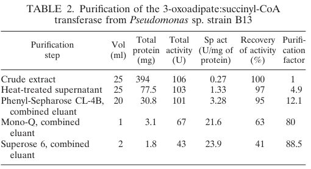

## Question

# Gene Research for Functional Annotation

## ⚠️ CRITICAL: Gene/Protein Identification Context

**BEFORE YOU BEGIN RESEARCH:** You MUST verify you are researching the CORRECT gene/protein. Gene symbols can be ambiguous, especially for less well-characterized genes from non-model organisms.

### Target Gene/Protein Identity (from UniProt):
- **UniProt Accession:** P0A101
- **Protein Description:** RecName: Full=3-oxoadipate CoA-transferase subunit B; EC=2.8.3.6; AltName: Full=Beta-ketoadipate:succinyl-CoA transferase subunit B;
- **Gene Information:** Name=pcaJ; OrderedLocusNames=PP_3952;
- **Organism (full):** Pseudomonas putida (strain ATCC 47054 / DSM 6125 / CFBP 8728 / NCIMB 11950 / KT2440).
- **Protein Family:** Belongs to the 3-oxoacid CoA-transferase subunit B family.
- **Key Domains:** 3-oxoacid_CoA-transf_B. (IPR012791); CoA_trans_fam_I. (IPR004165); CoA_transf_AS. (IPR004164); NagB/RpiA_transferase-like. (IPR037171); CoA_trans (PF01144)

### MANDATORY VERIFICATION STEPS:

1. **Check if the gene symbol "pcaJ" matches the protein description above**
2. **Verify the organism is correct:** Pseudomonas putida (strain ATCC 47054 / DSM 6125 / CFBP 8728 / NCIMB 11950 / KT2440).
3. **Check if protein family/domains align with what you find in literature**
4. **If you find literature for a DIFFERENT gene with the same or similar symbol, STOP**

### If Gene Symbol is Ambiguous or You Cannot Find Relevant Literature:

**DO NOT PROCEED WITH RESEARCH ON A DIFFERENT GENE.** Instead:
- State clearly: "The gene symbol 'pcaJ' is ambiguous or literature is limited for this specific protein"
- Explain what you found (e.g., "Found extensive literature on a different gene with the same symbol in a different organism")
- Describe the protein based ONLY on the UniProt information provided above
- Suggest that the protein function can be inferred from domain/family information

### Research Target:

Please provide a comprehensive research report on the gene **pcaJ** (gene ID: pcaJ, UniProt: P0A101) in PSEPK.

The research report should be a detailed narrative explaining the function, biological processes, and localization of the gene product. Citations should be given for all claims.

You should prioritize authoritative reviews and primary scientific literature when conducting research. You can supplement
this with annotations you find in gene/protein databases, but these can be outdated or inaccurate.

We are specifically interested in the primary function of the gene - for enzymes, what reaction is catalyzed, and what is the substrate specificity? For transporters, what is the substrate? For structural proteins or adapters, what is the broader structural role? For signaling molecules, what is the role in the pathway.

We are interested in where in or outside the cell the gene product carries out its function.

We are also interested in the signaling or biochemical pathways in which the gene functions. We are less interested in broad pleiotropic effects, except where these elucidate the precise role.

Include evidence where possible. We are interested in both experimental evidence as well as inference from structure, evolution, or bioinformatic analysis. Precise studies should be prioritized over high-throughput, where available.

## Output

Question: You are an expert researcher providing comprehensive, well-cited information.

Provide detailed information focusing on:
1. Key concepts and definitions with current understanding
2. Recent developments and latest research (prioritize 2023-2024 sources)
3. Current applications and real-world implementations
4. Expert opinions and analysis from authoritative sources
5. Relevant statistics and data from recent studies

Format as a comprehensive research report with proper citations. Include URLs and publication dates where available.
Always prioritize recent, authoritative sources and provide specific citations for all major claims.

# Gene Research for Functional Annotation

## ⚠️ CRITICAL: Gene/Protein Identification Context

**BEFORE YOU BEGIN RESEARCH:** You MUST verify you are researching the CORRECT gene/protein. Gene symbols can be ambiguous, especially for less well-characterized genes from non-model organisms.

### Target Gene/Protein Identity (from UniProt):
- **UniProt Accession:** P0A101
- **Protein Description:** RecName: Full=3-oxoadipate CoA-transferase subunit B; EC=2.8.3.6; AltName: Full=Beta-ketoadipate:succinyl-CoA transferase subunit B;
- **Gene Information:** Name=pcaJ; OrderedLocusNames=PP_3952;
- **Organism (full):** Pseudomonas putida (strain ATCC 47054 / DSM 6125 / CFBP 8728 / NCIMB 11950 / KT2440).
- **Protein Family:** Belongs to the 3-oxoacid CoA-transferase subunit B family.
- **Key Domains:** 3-oxoacid_CoA-transf_B. (IPR012791); CoA_trans_fam_I. (IPR004165); CoA_transf_AS. (IPR004164); NagB/RpiA_transferase-like. (IPR037171); CoA_trans (PF01144)

### MANDATORY VERIFICATION STEPS:

1. **Check if the gene symbol "pcaJ" matches the protein description above**
2. **Verify the organism is correct:** Pseudomonas putida (strain ATCC 47054 / DSM 6125 / CFBP 8728 / NCIMB 11950 / KT2440).
3. **Check if protein family/domains align with what you find in literature**
4. **If you find literature for a DIFFERENT gene with the same or similar symbol, STOP**

### If Gene Symbol is Ambiguous or You Cannot Find Relevant Literature:

**DO NOT PROCEED WITH RESEARCH ON A DIFFERENT GENE.** Instead:
- State clearly: "The gene symbol 'pcaJ' is ambiguous or literature is limited for this specific protein"
- Explain what you found (e.g., "Found extensive literature on a different gene with the same symbol in a different organism")
- Describe the protein based ONLY on the UniProt information provided above
- Suggest that the protein function can be inferred from domain/family information

### Research Target:

Please provide a comprehensive research report on the gene **pcaJ** (gene ID: pcaJ, UniProt: P0A101) in PSEPK.

The research report should be a detailed narrative explaining the function, biological processes, and localization of the gene product. Citations should be given for all claims.

You should prioritize authoritative reviews and primary scientific literature when conducting research. You can supplement
this with annotations you find in gene/protein databases, but these can be outdated or inaccurate.

We are specifically interested in the primary function of the gene - for enzymes, what reaction is catalyzed, and what is the substrate specificity? For transporters, what is the substrate? For structural proteins or adapters, what is the broader structural role? For signaling molecules, what is the role in the pathway.

We are interested in where in or outside the cell the gene product carries out its function.

We are also interested in the signaling or biochemical pathways in which the gene functions. We are less interested in broad pleiotropic effects, except where these elucidate the precise role.

Include evidence where possible. We are interested in both experimental evidence as well as inference from structure, evolution, or bioinformatic analysis. Precise studies should be prioritized over high-throughput, where available.

## Research report: functional annotation of **pcaJ** (UniProt **P0A101**; locus **PP_3952**) in *Pseudomonas putida* KT2440

### 1) Target verification (gene/protein identity)
The UniProt accession **P0A101** corresponds to *Pseudomonas putida* strain KT2440 protein **PcaJ**, which is annotated as **3-oxoadipate CoA-transferase subunit B** (β-ketoadipate:succinyl-CoA transferase subunit B; EC 2.8.3.6). In KT2440 proteomics, **pcaJ is explicitly mapped to PP_3952**, and is paired with **pcaI (PP_3951)**, consistent with the canonical two-subunit enzyme **PcaIJ** in the β-ketoadipate pathway. (yun2011proteomiccharacterizationof pages 4-5)

Across bacteria, the naming convention **pcaI/pcaJ** recurrently refers to the two subunits of **3-oxoadipate (β-ketoadipate):succinyl-CoA transferase**, further supporting that KT2440 PP_3952 is the same functional class of enzyme as UniProt describes. (xu2025pathwaycrosstalkenables pages 5-7)

### 2) Key concepts and definitions (current understanding)

#### The β-ketoadipate pathway
The **β-ketoadipate (βKA) pathway** is a central, convergent aerobic route by which many soil bacteria—especially *Pseudomonas*—funnel diverse aromatics (e.g., benzoate, 4-hydroxybenzoate, lignin-derived aromatics via protocatechuate/catechol branches) into central metabolism. In pathway summaries emphasizing *Pseudomonas putida* as a model, **PcaIJ and PcaF** are highlighted as the two CoA-dependent steps converting β-ketoadipate to **TCA-cycle linked metabolites** (succinate and acetyl-CoA). (dexter2024identificationandvalidation pages 31-37)

#### What PcaJ does
**PcaJ is the beta (B) subunit** of the two-subunit CoA-transferase **PcaIJ** (EC 2.8.3.6). In the β-ketoadipate pathway, PcaIJ catalyzes the **CoA-transfer step** that activates β-ketoadipate (3-oxoadipate) to a CoA thioester using **succinyl-CoA** as the CoA donor (producing succinate), enabling the next step catalyzed by **PcaF** (β-ketoadipyl-CoA thiolase) to cleave the activated intermediate toward central metabolites. (kaschabek2002degradationofaromatics pages 2-3, kaschabek2002degradationofaromatics pages 3-4, dexter2024identificationandvalidation pages 31-37)

A biochemical study in *Pseudomonas* sp. strain B13 (a close taxonomic context for *Pseudomonas* enzymes) directly supports this mechanistic role by demonstrating a **succinyl-CoA–dependent formation of 3-oxoadipyl-CoA** and subsequent thiolytic processing yielding central intermediates, consistent with the assigned PcaIJ/PcaF node. (kaschabek2002degradationofaromatics pages 2-3, kaschabek2002degradationofaromatics pages 3-4)

### 3) Enzymatic reaction and substrate specificity

#### Reaction (functional description)
The functional reaction catalyzed by **PcaIJ** is a CoA-transfer between succinyl-CoA and β-ketoadipate/3-oxoadipate, producing a β-ketoadipyl(3-oxoadipyl)-CoA thioester (and succinate). This is a key “gateway” step that commits the aromatic ring-fission product to CoA-dependent conversion into central carbon metabolism. (kaschabek2002degradationofaromatics pages 2-3, kaschabek2002degradationofaromatics pages 3-4, dexter2024identificationandvalidation pages 31-37)

#### Substrate specificity constraints (evidence)
In the purified *Pseudomonas* sp. B13 enzyme, the transferase showed **very low activity** on related dicarboxylic/oxoacid analogs such as **2-oxoadipate** and **3-oxoglutarate** (0.01–0.02% relative), and failed to further convert some chlorinated analogs, indicating **narrow specificity** consistent with its specialized role in aromatic-ring fission product processing rather than broad promiscuous CoA transfer. (kaschabek2002degradationofaromatics pages 5-6)

### 4) Cellular localization / where the gene product acts
Direct subcellular localization experiments for PcaJ were not retrieved here; however, KT2440 proteomics that quantified PcaJ was performed on a **cytosolic (soluble) protein fraction**, and PcaJ/PcaI were detected among soluble proteins induced by aromatic growth conditions. This supports that PcaJ functions primarily in the **cytosol** (as expected for most CoA-transferases acting on cytosolic CoA pools). (yun2011proteomiccharacterizationof pages 4-5)

### 5) Regulation and pathway control
In *P. putida*, the protocatechuate (β-ketoadipate) branch is described as being regulated by **PcaR** (IclR-type), a transcriptional activator controlling expression of pca operons; **β-ketoadipate** is reported as an inducer of these pca operons. (cao2008catabolicpathwaysand pages 10-11)

Consistent with this model, KT2440 proteomics detected strong induction of β-ketoadipate pathway enzymes during growth on an aromatic substrate (benzoate), including both subunits **PcaI/PcaJ**, consistent with transcriptional induction and pathway engagement under aromatic-catabolic conditions. (yun2011proteomiccharacterizationof pages 4-5)

### 6) Quantitative evidence and key data

#### KT2440 proteomic induction of PcaJ
In *P. putida* KT2440 grown on benzoate versus succinate, quantitative iTRAQ proteomics reported an induction ratio for **pcaJ (PP_3952) of 2.69** and for **pcaI (PP_3951) of 1.58** (benzoate/succinate), indicating that PcaJ is strongly upregulated when aromatics are catabolized through the β-ketoadipate pathway. (yun2011proteomiccharacterizationof pages 4-5)

#### Enzyme kinetics and inhibition (Pseudomonas homolog)
For the purified *Pseudomonas* sp. strain B13 3-oxoadipate:succinyl-CoA transferase, reported parameters included **Km(3-oxoadipyl-CoA) = 0.15 mM**, **Km(CoA) = 0.01 mM**, **kcat = 470 min−1**, and **pH optimum ≈ 7.8**; the enzyme was also reported to be inhibited by NADH (remaining activity ~90% at 0.4 mM and ~58% at 0.8 mM NADH in the assay conditions described). (kaschabek2002degradationofaromatics pages 5-6)

Purification data show strong enrichment of activity (e.g., specific activity increasing from ~0.27 U/mg crude extract to ~21.6 U/mg after Mono-Q), consistent with an inducible pathway enzyme abundant under aromatic growth. (kaschabek2002degradationofaromatics pages 3-4, kaschabek2002degradationofaromatics media f1b56e0a)

**Note:** these kinetic constants were not measured directly for KT2440 PcaIJ in the retrieved corpus; they are used here as high-confidence functional support from a closely related *Pseudomonas* enzyme performing the same EC 2.8.3.6 reaction. (kaschabek2002degradationofaromatics pages 5-6)

### 7) Recent developments (prioritizing 2023–2024)

#### 2023: lignin valorization to β-ketoadipate (direct relevance to pcaJ/pcaIJ)
A 2023 *Science Advances* study engineered *P. putida* KT2440 to convert mixed lignin-related aromatic compounds to **β-ketoadipate**, explicitly leveraging the organism’s native β-ketoadipate pathway and **manipulating pcaIJ** to accumulate product rather than fully catabolize it. (pqac-00000005; publication date in text: 6 Sep 2023 (werner2023ligninconversionto pages 7-8))

Key reported production metrics included:
- From corn stover-derived lignin-related compound (LRC) extractives: **25 g/L β-ketoadipate** with **0.66 g/L/h** maximum productivity, and yield reported as **1.2 g/g LRCs**, corresponding to **0.10 g β-ketoadipate per g total corn stover lignin** (in their accounting). (werner2023ligninconversionto pages 7-8)
- A technoeconomic analysis (TEA) using experimentally determined base-case metrics (40 g/L, 1.15 g/L/h, 1.0 mol/mol) predicted a **minimum selling price (MSP) ≈ $2.01/kg** for β-ketoadipate in their modeled facility scale, and they compared this to historical adipic acid prices ($1.10–1.80/kg). (werner2023ligninconversionto pages 7-8)
- Life-cycle assessment (LCA) for the modeled conversion process reported **GHG emissions ~1.99 kg CO2e/kg**, improved to **1.69 kg CO2e/kg** with ammonium sulfate coproduct recovery in their scenario analysis. (werner2023ligninconversionto pages 8-10)

These results demonstrate that the metabolic “decision point” governed by PcaIJ (and downstream PcaF) is a practical control knob for routing aromatic carbon either toward energy generation or toward accumulation of a valuable diacid intermediate. (werner2023ligninconversionto pages 1-2, werner2023ligninconversionto pages 7-8)

#### 2024: gene-function module discovery in KT2440 using RB-TnSeq + machine learning
A 2024 *mSystems* paper applied independent component analysis (ICA) to a compendium of **RB-TnSeq fitness data** (179 conditions) in KT2440 to define 84 functional gene modules (“fModules”). The authors report modules associated with **benzoate catabolism** and note that module members include genes participating in **protocatechuate catabolism toward β-ketoadipate enol-lactone**, connecting modern functional genomics/ML approaches to the β-ketoadipate network that includes pca genes. (borchert2024machinelearninganalysis pages 6-7)

The authors also provide a public companion resource for module membership and interpretation (https://fmodules.github.io/putida), and emphasize that transposon libraries can be subject to **polar effects in operons**, which is relevant when interpreting fitness effects for operonic genes such as pcaI/pcaJ. (borchert2024machinelearninganalysis pages 6-7)

### 8) Current applications and real-world implementations

1. **Bioprocessing / biomanufacturing of diacids and polymer precursors:** The 2023 work provides an example of near-term industrial relevance by converting lignin streams into **β-ketoadipate** as a polymer precursor, supported by TEA/LCA and process modeling, demonstrating a realistic engineering path using KT2440. (werner2023ligninconversionto pages 7-8, werner2023ligninconversionto pages 8-10)

2. **Environmental biodegradation and bioremediation:** The PcaIJ node is part of the “terminal” central aromatic catabolism enabling growth on benzoate/4-hydroxybenzoate and many lignin-related compounds; induction of pcaJ in benzoate-grown KT2440 supports its role under pollutant-relevant growth conditions. (yun2011proteomiccharacterizationof pages 4-5)

### 9) Expert interpretation and synthesis (authoritative analysis grounded in retrieved sources)

- **Functional essentiality within aromatic funneling:** PcaJ is not a peripheral aromatic-transforming enzyme; it sits at a central metabolic junction where ring-fission products are converted to CoA thioesters, enabling entry into central metabolism via PcaF. This explains why engineering strategies that target product accumulation often **block pcaIJ**: preventing CoA transfer keeps carbon in the β-ketoadipate pool rather than converting it onward to acetyl-CoA/succinate. (werner2023ligninconversionto pages 1-2, dexter2024identificationandvalidation pages 31-37)

- **Specificity is adaptive:** The observed narrow substrate scope (very low activity on 2-oxoadipate/3-oxoglutarate; poor processing of substituted analogs) is consistent with specialization for **β-ketoadipate-like ring-fission products**, reducing off-pathway CoA transfer that could perturb central metabolism. (kaschabek2002degradationofaromatics pages 5-6)

- **Regulatory alignment with aromatic availability:** The reported PcaR activation and induction by β-ketoadipate provides a mechanism for coordinating expression of the late β-ketoadipate pathway with the presence of upstream aromatic catabolic flux, consistent with proteomic induction in benzoate-grown cells. (cao2008catabolicpathwaysand pages 10-11, yun2011proteomiccharacterizationof pages 4-5)

### 10) Evidence limitations and what is still missing for a complete KT2440-specific annotation
Some critical KT2440-specific details were not directly retrievable in the current tool corpus:
- **Direct biochemical characterization of KT2440 PcaIJ (Km/kcat, substrate panel)** is not present here; the most complete kinetics come from a closely related *Pseudomonas* strain (B13). (kaschabek2002degradationofaromatics pages 5-6)
- **Direct operon mapping / transcription start sites / PcaR binding sites** for KT2440 pcaIJ were not recovered; regulation is supported by pathway-level *Pseudomonas* evidence and KT2440 protein-level induction. (cao2008catabolicpathwaysand pages 10-11, yun2011proteomiccharacterizationof pages 4-5)
- **Direct gene knockout phenotype for KT2440 pcaJ alone** was not retrieved; however, engineered strains that block pcaIJ to accumulate β-ketoadipate provide functional genetic evidence that loss of PcaIJ prevents downstream consumption of β-ketoadipate. (werner2023ligninconversionto pages 1-2)

### Summary statement for functional annotation
**pcaJ (PP_3952; UniProt P0A101)** in *Pseudomonas putida* KT2440 encodes the **beta subunit of the two-subunit 3-oxoadipate (β-ketoadipate):succinyl-CoA CoA-transferase (PcaIJ; EC 2.8.3.6)**. This cytosolic enzyme activates β-ketoadipate by CoA transfer from succinyl-CoA to form β-ketoadipyl-CoA, enabling conversion by downstream thiolase PcaF to central metabolic intermediates (acetyl-CoA/succinyl-CoA). Expression is induced during growth on aromatic substrates and is under β-ketoadipate pathway control involving **PcaR** and induction by β-ketoadipate. In metabolic engineering, disabling pcaIJ is an effective strategy to accumulate β-ketoadipate from lignin-derived aromatic mixtures at industrially relevant titers, with TEA/LCA indicating potential cost competitiveness for polymer-precursor production.

### Embedded evidence summary table
| Topic | Finding | Quantitative details | Citation |
|---|---|---|---|
| Gene/protein identity | In *Pseudomonas putida* KT2440, **pcaJ** corresponds to locus **PP_3952** and functions with **pcaI (PP_3951)** as the two-subunit 3-oxoadipate/β-ketoadipate CoA-transferase **PcaIJ**. | pcaJ = PP_3952; pcaI = PP_3951 | (yun2011proteomiccharacterizationof pages 4-5) |
| Enzymatic role in pathway | **PcaIJ (EC 2.8.3.6)** catalyzes the CoA-transfer step in the **β-ketoadipate pathway**, converting **β-ketoadipate (3-oxoadipate)** and **succinyl-CoA** to **3-oxoadipyl-CoA** and **succinate**; this CoA-activated intermediate is then cleaved by **PcaF** to central metabolites. | Pathway outcome: formation of TCA-linked products **acetyl-CoA** and **succinyl-CoA** after the subsequent PcaF step | (dexter2024identificationandvalidation pages 31-37, kaschabek2002degradationofaromatics pages 2-3, kaschabek2002degradationofaromatics pages 3-4) |
| KT2440 proteomic evidence | In benzoate-grown *P. putida* KT2440, both PcaIJ subunits were detected in soluble proteomics, supporting active use of the pathway. | iTRAQ induction ratio (benzoate/succinate): **pcaJ 2.69**, **pcaI 1.58** | (yun2011proteomiccharacterizationof pages 4-5) |
| Biochemical characterization of homologous enzyme | A closely related *Pseudomonas* 3-oxoadipate:succinyl-CoA transferase was purified and shown to be reversible, supporting the assigned function of PcaIJ. | **Km(3-oxoadipyl-CoA) = 0.15 mM**; **Km(CoA) = 0.01 mM**; **kcat = 470 min^-1**; **pH optimum ≈ 7.8**; subunit mass **~42 kDa** | (kaschabek2002degradationofaromatics pages 5-6) |
| Substrate specificity constraints | The homologous transferase showed narrow specificity consistent with aromatic-ring fission product processing rather than broad acyl transfer. | Relative activity with **2-oxoadipate** and **3-oxoglutarate** only **0.01–0.02%**; chlorinated/methylated analogs were poor or not further converted | (kaschabek2002degradationofaromatics pages 5-6) |
| Purification/activity data | Enzyme activity was strongly enriched during purification from benzoate-grown cells, indicating inducible aromatic-catabolic function. | Specific activity increased from **~0.27 U/mg** (crude extract) to **~21.6 U/mg** (Mono-Q fraction) | (kaschabek2002degradationofaromatics pages 3-4, kaschabek2002degradationofaromatics media f1b56e0a) |
| Regulation/pathway context | pca genes in pseudomonads are controlled within the protocatechuate branch by **PcaR**, and **β-ketoadipate** acts as an inducer of pca operons. | Qualitative regulatory evidence; no KT2440-specific fold-change for pcaJ transcription retrieved here | (cao2008catabolicpathwaysand pages 10-11) |
| 2023 metabolic engineering application | In 2023, KT2440 was engineered to accumulate **β-ketoadipate/β-ketoadipic acid** by blocking downstream consumption, including manipulation of **pcaIJ**, demonstrating direct applied relevance of this node. | Fed-batch titers: **44.5 g/L** (model lignin-related compounds) and **25 g/L** (corn stover-derived compounds); productivities: **1.15** and **0.66 g/L/h**; yield up to **1.0 mol/mol** | (werner2023ligninconversionto pages 1-2) |

*Table: This table summarizes the verified identity, biochemical role, key quantitative evidence, and recent engineering relevance of pcaJ/PcaIJ in the β-ketoadipate pathway. It is useful as a compact evidence map for functional annotation of PP_3952 in *Pseudomonas putida* KT2440.*

References

1. (yun2011proteomiccharacterizationof pages 4-5): Sung-Ho Yun, Gun Wook Park, Jin Young Kim, Sang Oh Kwon, Chi-Won Choi, Sun-Hee Leem, Kyung-Hoon Kwon, Jong Shin Yoo, Chulhyun Lee, Soohyun Kim, and Seung Il Kim. Proteomic characterization of the pseudomonas putida kt2440 global response to a monocyclic aromatic compound by itraq analysis and 1de-mudpit. Journal of proteomics, 74 5:620-8, May 2011. URL: https://doi.org/10.1016/j.jprot.2011.01.020, doi:10.1016/j.jprot.2011.01.020. This article has 50 citations and is from a peer-reviewed journal.

2. (xu2025pathwaycrosstalkenables pages 5-7): Huan-Wei Xu, Xiao-Yan Wang, Ying Wei, Yiqi Cao, Shu-Guang Wang, and Peng-Fei Xia. Pathway crosstalk enables degradation of aromatic compounds in marine roseobacter clade bacteria. Applied and environmental microbiology, pages e0097825, Aug 2025. URL: https://doi.org/10.1128/aem.00978-25, doi:10.1128/aem.00978-25. This article has 2 citations and is from a peer-reviewed journal.

3. (dexter2024identificationandvalidation pages 31-37): Gara Dexter. Identification and validation of acetovanillone catabolism in rhodococcus rhodochrous gd02. Text, Jan 2024. URL: https://doi.org/10.14288/1.0447452, doi:10.14288/1.0447452. This article has 0 citations and is from a peer-reviewed journal.

4. (kaschabek2002degradationofaromatics pages 2-3): Stefan R. Kaschabek, Bernd Kuhn, Dagmar Müller, Eberhard Schmidt, and Walter Reineke. Degradation of aromatics and chloroaromatics by pseudomonas sp. strain b13: purification and characterization of 3-oxoadipate:succinyl-coenzyme a (coa) transferase and 3-oxoadipyl-coa thiolase. Journal of Bacteriology, 184:207-215, Jan 2002. URL: https://doi.org/10.1128/jb.184.1.207-215.2002, doi:10.1128/jb.184.1.207-215.2002. This article has 41 citations and is from a peer-reviewed journal.

5. (kaschabek2002degradationofaromatics pages 3-4): Stefan R. Kaschabek, Bernd Kuhn, Dagmar Müller, Eberhard Schmidt, and Walter Reineke. Degradation of aromatics and chloroaromatics by pseudomonas sp. strain b13: purification and characterization of 3-oxoadipate:succinyl-coenzyme a (coa) transferase and 3-oxoadipyl-coa thiolase. Journal of Bacteriology, 184:207-215, Jan 2002. URL: https://doi.org/10.1128/jb.184.1.207-215.2002, doi:10.1128/jb.184.1.207-215.2002. This article has 41 citations and is from a peer-reviewed journal.

6. (kaschabek2002degradationofaromatics pages 5-6): Stefan R. Kaschabek, Bernd Kuhn, Dagmar Müller, Eberhard Schmidt, and Walter Reineke. Degradation of aromatics and chloroaromatics by pseudomonas sp. strain b13: purification and characterization of 3-oxoadipate:succinyl-coenzyme a (coa) transferase and 3-oxoadipyl-coa thiolase. Journal of Bacteriology, 184:207-215, Jan 2002. URL: https://doi.org/10.1128/jb.184.1.207-215.2002, doi:10.1128/jb.184.1.207-215.2002. This article has 41 citations and is from a peer-reviewed journal.

7. (cao2008catabolicpathwaysand pages 10-11): Bin Cao and Kai‐Chee Loh. Catabolic pathways and cellular responses of pseudomonas putida p8 during growth on benzoate with a proteomics approach. Biotechnology and Bioengineering, 101:1297-1312, Dec 2008. URL: https://doi.org/10.1002/bit.21997, doi:10.1002/bit.21997. This article has 56 citations and is from a domain leading peer-reviewed journal.

8. (kaschabek2002degradationofaromatics media f1b56e0a): Stefan R. Kaschabek, Bernd Kuhn, Dagmar Müller, Eberhard Schmidt, and Walter Reineke. Degradation of aromatics and chloroaromatics by pseudomonas sp. strain b13: purification and characterization of 3-oxoadipate:succinyl-coenzyme a (coa) transferase and 3-oxoadipyl-coa thiolase. Journal of Bacteriology, 184:207-215, Jan 2002. URL: https://doi.org/10.1128/jb.184.1.207-215.2002, doi:10.1128/jb.184.1.207-215.2002. This article has 41 citations and is from a peer-reviewed journal.

9. (werner2023ligninconversionto pages 7-8): Allison Z. Werner, William T. Cordell, Ciaran W. Lahive, Bruno C. Klein, Christine A. Singer, Eric C. D. Tan, Morgan A. Ingraham, Kelsey J. Ramirez, Dong Hyun Kim, Jacob Nedergaard Pedersen, Christopher W. Johnson, Brian F. Pfleger, Gregg T. Beckham, and Davinia Salvachúa. Lignin conversion to β-ketoadipic acid by <i>pseudomonas putida</i> via metabolic engineering and bioprocess development. Science Advances, Sep 2023. URL: https://doi.org/10.1126/sciadv.adj0053, doi:10.1126/sciadv.adj0053. This article has 88 citations and is from a highest quality peer-reviewed journal.

10. (werner2023ligninconversionto pages 1-2): Allison Z. Werner, William T. Cordell, Ciaran W. Lahive, Bruno C. Klein, Christine A. Singer, Eric C. D. Tan, Morgan A. Ingraham, Kelsey J. Ramirez, Dong Hyun Kim, Jacob Nedergaard Pedersen, Christopher W. Johnson, Brian F. Pfleger, Gregg T. Beckham, and Davinia Salvachúa. Lignin conversion to β-ketoadipic acid by <i>pseudomonas putida</i> via metabolic engineering and bioprocess development. Science Advances, Sep 2023. URL: https://doi.org/10.1126/sciadv.adj0053, doi:10.1126/sciadv.adj0053. This article has 88 citations and is from a highest quality peer-reviewed journal.

11. (werner2023ligninconversionto pages 8-10): Allison Z. Werner, William T. Cordell, Ciaran W. Lahive, Bruno C. Klein, Christine A. Singer, Eric C. D. Tan, Morgan A. Ingraham, Kelsey J. Ramirez, Dong Hyun Kim, Jacob Nedergaard Pedersen, Christopher W. Johnson, Brian F. Pfleger, Gregg T. Beckham, and Davinia Salvachúa. Lignin conversion to β-ketoadipic acid by <i>pseudomonas putida</i> via metabolic engineering and bioprocess development. Science Advances, Sep 2023. URL: https://doi.org/10.1126/sciadv.adj0053, doi:10.1126/sciadv.adj0053. This article has 88 citations and is from a highest quality peer-reviewed journal.

12. (borchert2024machinelearninganalysis pages 6-7): Andrew J. Borchert, Alissa C. Bleem, Hyun Gyu Lim, Kevin Rychel, Keven D. Dooley, Zoe A. Kellermyer, Tracy L. Hodges, Bernhard O. Palsson, and Gregg T. Beckham. Machine learning analysis of rb-tnseq fitness data predicts functional gene modules in <i>pseudomonas putida</i> kt2440. Mar 2024. URL: https://doi.org/10.1128/msystems.00942-23, doi:10.1128/msystems.00942-23. This article has 12 citations and is from a peer-reviewed journal.

## Artifacts

- [Edison artifact artifact-00](pcaJ-deep-research-falcon_artifacts/artifact-00.md)

## Citations

1. yun2011proteomiccharacterizationof pages 4-5
2. xu2025pathwaycrosstalkenables pages 5-7
3. dexter2024identificationandvalidation pages 31-37
4. kaschabek2002degradationofaromatics pages 5-6
5. cao2008catabolicpathwaysand pages 10-11
6. werner2023ligninconversionto pages 7-8
7. werner2023ligninconversionto pages 8-10
8. borchert2024machinelearninganalysis pages 6-7
9. werner2023ligninconversionto pages 1-2
10. kaschabek2002degradationofaromatics pages 2-3
11. kaschabek2002degradationofaromatics pages 3-4
12. https://fmodules.github.io/putida
13. https://doi.org/10.1016/j.jprot.2011.01.020,
14. https://doi.org/10.1128/aem.00978-25,
15. https://doi.org/10.14288/1.0447452,
16. https://doi.org/10.1128/jb.184.1.207-215.2002,
17. https://doi.org/10.1002/bit.21997,
18. https://doi.org/10.1126/sciadv.adj0053,
19. https://doi.org/10.1128/msystems.00942-23,