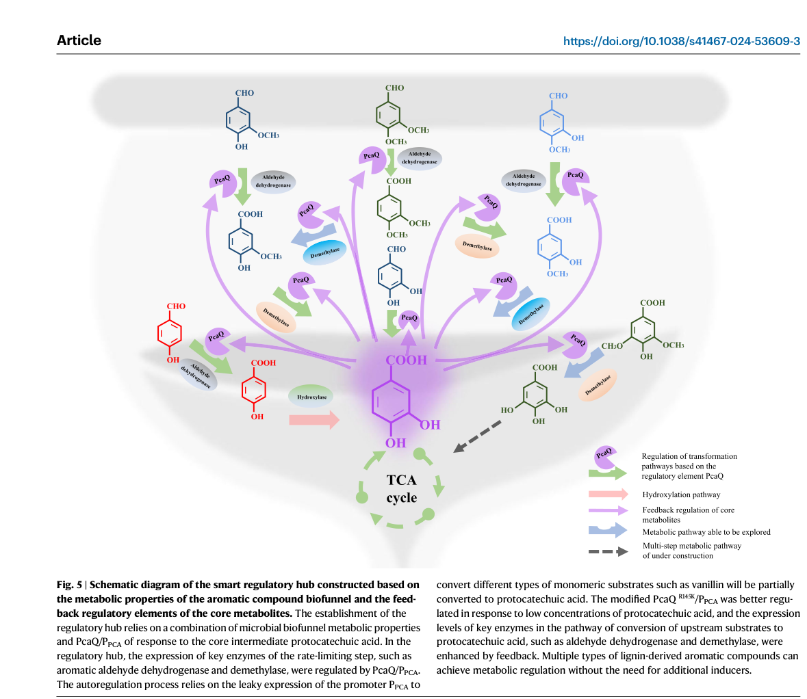

## Question

# Gene Research for Functional Annotation

## ⚠️ CRITICAL: Gene/Protein Identification Context

**BEFORE YOU BEGIN RESEARCH:** You MUST verify you are researching the CORRECT gene/protein. Gene symbols can be ambiguous, especially for less well-characterized genes from non-model organisms.

### Target Gene/Protein Identity (from UniProt):
- **UniProt Accession:** Q88M61
- **Protein Description:** SubName: Full=Transcriptional regulator PcaQ {ECO:0000313|EMBL:AAN67334.1};
- **Gene Information:** Name=pcaQ {ECO:0000313|EMBL:AAN67334.1}; OrderedLocusNames=PP_1713 {ECO:0000313|EMBL:AAN67334.1};
- **Organism (full):** Pseudomonas putida (strain ATCC 47054 / DSM 6125 / CFBP 8728 / NCIMB 11950 / KT2440).
- **Protein Family:** Belongs to the LysR transcriptional regulatory family.
- **Key Domains:** HTH-type_LysR_regulators. (IPR050950); LysR_HTH_N. (IPR000847); LysR_subst-bd. (IPR005119); TF_PcaQ. (IPR012787); WH-like_DNA-bd_sf. (IPR036388)

### MANDATORY VERIFICATION STEPS:

1. **Check if the gene symbol "pcaQ" matches the protein description above**
2. **Verify the organism is correct:** Pseudomonas putida (strain ATCC 47054 / DSM 6125 / CFBP 8728 / NCIMB 11950 / KT2440).
3. **Check if protein family/domains align with what you find in literature**
4. **If you find literature for a DIFFERENT gene with the same or similar symbol, STOP**

### If Gene Symbol is Ambiguous or You Cannot Find Relevant Literature:

**DO NOT PROCEED WITH RESEARCH ON A DIFFERENT GENE.** Instead:
- State clearly: "The gene symbol 'pcaQ' is ambiguous or literature is limited for this specific protein"
- Explain what you found (e.g., "Found extensive literature on a different gene with the same symbol in a different organism")
- Describe the protein based ONLY on the UniProt information provided above
- Suggest that the protein function can be inferred from domain/family information

### Research Target:

Please provide a comprehensive research report on the gene **pcaQ** (gene ID: pcaQ, UniProt: Q88M61) in PSEPK.

The research report should be a detailed narrative explaining the function, biological processes, and localization of the gene product. Citations should be given for all claims.

You should prioritize authoritative reviews and primary scientific literature when conducting research. You can supplement
this with annotations you find in gene/protein databases, but these can be outdated or inaccurate.

We are specifically interested in the primary function of the gene - for enzymes, what reaction is catalyzed, and what is the substrate specificity? For transporters, what is the substrate? For structural proteins or adapters, what is the broader structural role? For signaling molecules, what is the role in the pathway.

We are interested in where in or outside the cell the gene product carries out its function.

We are also interested in the signaling or biochemical pathways in which the gene functions. We are less interested in broad pleiotropic effects, except where these elucidate the precise role.

Include evidence where possible. We are interested in both experimental evidence as well as inference from structure, evolution, or bioinformatic analysis. Precise studies should be prioritized over high-throughput, where available.

## Output

Question: You are an expert researcher providing comprehensive, well-cited information.

Provide detailed information focusing on:
1. Key concepts and definitions with current understanding
2. Recent developments and latest research (prioritize 2023-2024 sources)
3. Current applications and real-world implementations
4. Expert opinions and analysis from authoritative sources
5. Relevant statistics and data from recent studies

Format as a comprehensive research report with proper citations. Include URLs and publication dates where available.
Always prioritize recent, authoritative sources and provide specific citations for all major claims.

# Gene Research for Functional Annotation

## ⚠️ CRITICAL: Gene/Protein Identification Context

**BEFORE YOU BEGIN RESEARCH:** You MUST verify you are researching the CORRECT gene/protein. Gene symbols can be ambiguous, especially for less well-characterized genes from non-model organisms.

### Target Gene/Protein Identity (from UniProt):
- **UniProt Accession:** Q88M61
- **Protein Description:** SubName: Full=Transcriptional regulator PcaQ {ECO:0000313|EMBL:AAN67334.1};
- **Gene Information:** Name=pcaQ {ECO:0000313|EMBL:AAN67334.1}; OrderedLocusNames=PP_1713 {ECO:0000313|EMBL:AAN67334.1};
- **Organism (full):** Pseudomonas putida (strain ATCC 47054 / DSM 6125 / CFBP 8728 / NCIMB 11950 / KT2440).
- **Protein Family:** Belongs to the LysR transcriptional regulatory family.
- **Key Domains:** HTH-type_LysR_regulators. (IPR050950); LysR_HTH_N. (IPR000847); LysR_subst-bd. (IPR005119); TF_PcaQ. (IPR012787); WH-like_DNA-bd_sf. (IPR036388)

### MANDATORY VERIFICATION STEPS:

1. **Check if the gene symbol "pcaQ" matches the protein description above**
2. **Verify the organism is correct:** Pseudomonas putida (strain ATCC 47054 / DSM 6125 / CFBP 8728 / NCIMB 11950 / KT2440).
3. **Check if protein family/domains align with what you find in literature**
4. **If you find literature for a DIFFERENT gene with the same or similar symbol, STOP**

### If Gene Symbol is Ambiguous or You Cannot Find Relevant Literature:

**DO NOT PROCEED WITH RESEARCH ON A DIFFERENT GENE.** Instead:
- State clearly: "The gene symbol 'pcaQ' is ambiguous or literature is limited for this specific protein"
- Explain what you found (e.g., "Found extensive literature on a different gene with the same symbol in a different organism")
- Describe the protein based ONLY on the UniProt information provided above
- Suggest that the protein function can be inferred from domain/family information

### Research Target:

Please provide a comprehensive research report on the gene **pcaQ** (gene ID: pcaQ, UniProt: Q88M61) in PSEPK.

The research report should be a detailed narrative explaining the function, biological processes, and localization of the gene product. Citations should be given for all claims.

You should prioritize authoritative reviews and primary scientific literature when conducting research. You can supplement
this with annotations you find in gene/protein databases, but these can be outdated or inaccurate.

We are specifically interested in the primary function of the gene - for enzymes, what reaction is catalyzed, and what is the substrate specificity? For transporters, what is the substrate? For structural proteins or adapters, what is the broader structural role? For signaling molecules, what is the role in the pathway.

We are interested in where in or outside the cell the gene product carries out its function.

We are also interested in the signaling or biochemical pathways in which the gene functions. We are less interested in broad pleiotropic effects, except where these elucidate the precise role.

Include evidence where possible. We are interested in both experimental evidence as well as inference from structure, evolution, or bioinformatic analysis. Precise studies should be prioritized over high-throughput, where available.

## Research Report: Functional annotation of **pcaQ** (UniProt **Q88M61**; locus **PP_1713**) in *Pseudomonas putida* KT2440

### 1) Target verification (mandatory disambiguation)
The target protein is **PcaQ** from *Pseudomonas putida* strain KT2440 (ATCC 47054), encoded by **pcaQ / PP_1713** and annotated as a **LysR-family transcriptional regulator** associated with **protocatechuate catabolism** (protocatechuate branch of aromatic metabolism). This is explicitly stated in KT2440 genomic-context literature (pcaQ, PP1713; protocatechuate catabolism). (santos2004insightsintothe pages 14-15)

**Important ambiguity note:** The symbol **pcaQ** is also used for homologous regulators in other bacteria (e.g., *Agrobacterium tumefaciens*, *Ralstonia eutropha*). In the retrieved corpus, the deepest mechanistic characterization of “PcaQ” comes from *A. tumefaciens*, and the most recent engineering/structural modeling comes from *R. eutropha*; these must be treated as **homology-based context**, not direct KT2440 evidence. (parke1996characterizationofpcaq pages 5-6, parke1996characterizationofpcaq pages 4-5, zhao2024ligninvalorizationto pages 6-7)

### 2) Key concepts and definitions (current understanding)

#### 2.1 LysR-type transcriptional regulators (LTTRs)
PcaQ belongs to the **LysR family** of bacterial transcriptional regulators, a large family frequently involved in controlling catabolic pathways, including aromatic compound degradation. KT2440 literature explicitly places **pcaQ (PP1713)** among LysR-family regulators linked to aromatic metabolism (protocatechuate catabolism). (santos2004insightsintothe pages 14-15)

Mechanistically, the best-described PcaQ homolog (*A. tumefaciens*) behaves as a **transcriptional activator** whose activity is modulated by **pathway intermediates (coeffectors/coinducers)**, and it can also exert **negative autoregulation** on its own promoter. (parke1996characterizationofpcaq pages 4-5)

#### 2.2 Protocatechuate (PCA) and the β-ketoadipate pathway
Protocatechuate (3,4-dihydroxybenzoate; PCA) is a central “hub” intermediate in aerobic aromatic compound degradation. Many lignin-derived or plant-derived aromatics can be converted into PCA and then further metabolized through the protocatechuate branch of the **β-ketoadipate pathway**, ultimately yielding central metabolites (e.g., acetyl-CoA, succinyl-CoA) that feed into core metabolism. This “hub” concept is exploited in modern synthetic biology designs that sense PCA as an intracellular signal of aromatic flux. (zhao2024ligninvalorizationto pages 6-7)

### 3) Molecular function of PcaQ in KT2440: what is known vs. what remains uncertain

#### 3.1 KT2440-specific evidence (direct)
From KT2440-focused genome context, **pcaQ (PP1713)** is identified as a **LysR-family regulator** associated with **protocatechuate catabolism**. (santos2004insightsintothe pages 14-15)

**Limitation:** In the retrieved KT2440 sources, explicit details are *not* provided for:
- the precise **pca operon(s)** controlled by KT2440 PcaQ,
- the **effector/coinducer** for KT2440 PcaQ,
- the **DNA-binding site** / operator sequence,
- direct genetics (ΔpcaQ phenotypes) or ChIP/EMSA evidence.

These missing details are critical for “gold-standard” functional annotation and would require KT2440-specific primary studies (not present in the retrieved set). This is consistent with a broader caution in comparative work: regulatory architectures for PCA catabolic clusters can differ across taxa/strains, so cross-species assumptions can be misleading. (romerosilva2013genomicandfunctional pages 11-12)

#### 3.2 Homology-based mechanistic inference (non-KT2440, but informative)
Because KT2440 PcaQ is annotated as an LTTR linked to PCA catabolism (direct), it is biologically plausible that it functions analogously to PcaQ homologs in other Proteobacteria. The best-described PcaQ homolog in the retrieved set is from *Agrobacterium tumefaciens*, where:
- **PcaQ is a LysR-type transcriptional activator** of protocatechuate-catabolic genes (notably a promoter controlling **pcaDCHGB**, which includes **pcaHG** encoding protocatechuate 3,4-dioxygenase subunits). (parke1995supraoperonicclusteringof pages 1-1, parke1996characterizationofpcaq pages 4-5)
- Activation depends on **coinducers** formed during PCA catabolism, including **β-carboxy-cis,cis-muconate** and **γ-carboxymuconolactone**. (parke1996characterizationofpcaq pages 5-6)
- **pcaQ is divergently transcribed** relative to the promoter it activates and exhibits **strong negative autoregulation** (ligand-dependent repression of its own promoter). (parke1996characterizationofpcaq pages 4-5)

These features are typical of many LTTR systems (divergent organization; effector-modulated activation; autoregulation), and they provide a *reasonable* mechanistic template when interpreting KT2440 PcaQ, while remaining explicitly non-definitive for KT2440 without direct experimentation. (parke1996characterizationofpcaq pages 4-5)

#### 3.3 Expert interpretation / authoritative synthesis (with uncertainty explicitly stated)
Taken together, the most supportable KT2440-specific functional annotation statement from the retrieved evidence is:

> **KT2440 PcaQ (PP_1713; Q88M61) is a LysR-family transcriptional regulator implicated in controlling protocatechuate catabolism (protocatechuate branch of aromatic metabolism).** (santos2004insightsintothe pages 14-15)

More granular mechanistic claims (specific operon targets, exact coinducer chemistry, binding-site architecture) are best presented as **homology-informed hypotheses**, supported by the *A. tumefaciens* PcaQ literature but requiring KT2440 validation. (parke1996characterizationofpcaq pages 4-5, parke1996characterizationofpcaq pages 5-6)

### 4) Cellular localization
As a LysR-family transcriptional regulator, PcaQ is expected to function as a **cytosolic DNA-binding protein** that regulates transcription by binding promoter/operator regions on the bacterial chromosome. This inference is consistent with the experimentally characterized PcaQ homolog being a transcriptional activator/autoregulator controlling promoter activity. (parke1996characterizationofpcaq pages 4-5)

### 5) Recent developments (prioritizing 2023–2024)

#### 5.1 2024: Engineering PcaQ as an aromatic “hub metabolite” sensor (PCA-responsive control)
A 2024 *Nature Communications* study implemented **PcaQ/PPCA** as a **PCA-responsive regulatory element** in an engineered **hub metabolite-based autoregulation (HMA)** system (in *Ralstonia eutropha* H16). PCA was validated as the effector, and the regulator also showed responsiveness to related aromatics (e.g., 4-hydroxybenzoate, vanillate, syringate). (zhao2024ligninvalorizationto pages 6-7)

Rational/design-guided engineering of PcaQ produced variants including **R145K**, which increased sensitivity/specificity toward PCA at low concentrations. Structural/docking analysis implicated PCA interactions including hydrogen bonding (e.g., Ser115) and hydrophobic contacts, and docking outputs reported binding energies on the order of **~−5.1 to −5.9 kcal/mol** (as shown in figure-associated extracts). (zhao2024ligninvalorizationto pages 9-10, zhao2024ligninvalorizationto pages 10-11)

The following figure crops support the regulatory-system schematic and the PCA-binding/docking model for PcaQ and R145K:
- HMA schematic / system context (zhao2024ligninvalorizationto media e0de5507)
- PcaQ–PCA docking / mutant comparison panels (zhao2024ligninvalorizationto media 8ac04529)

#### 5.2 2024: Operational constraint—catabolite repression limits aromatic catabolism in KT2440 (biotech relevance)
A 2024 *Microbial Biotechnology* paper demonstrates that **carbon catabolite repression (CCR)** strongly inhibits expression/usage of aromatic degradation pathways in *P. putida* KT2440, and that **inactivation of pyruvate dehydrogenase (aceE)** relieves CCR, enabling aromatic compound utilization even in the presence of preferred substrates (e.g., glucose). (moreno2024inactivationofpseudomonas pages 1-2, moreno2024inactivationofpseudomonas pages 10-11)

Quantitatively, in growth experiments with an added aromatic (3-methylbenzoate) and glucose:
- aceE mutant grew on **5 mM 3-methylbenzoate** to **A600 ~0.4**,
- wild type grew on **10 mM glucose** to **A600 ~0.9**,
- aceE mutant still reached **A600 ~0.4** with **10 mM glucose + 5 mM 3-methylbenzoate**, consistent with relieved CCR enabling induction/usage of the aromatic pathway despite glucose. (moreno2024inactivationofpseudomonas pages 7-9)

While this study does not isolate the protocatechuate branch or pcaQ specifically, it is directly relevant to real-world deployment of KT2440 aromatic catabolism because pca-regulon genes are among the pathways typically impacted by CCR in mixed-substrate environments. (moreno2024inactivationofpseudomonas pages 10-11)

### 6) Current applications and real-world implementations

#### 6.1 Synthetic biology: PCA-responsive genetic control modules (PcaQ-based)
The 2024 HMA system uses PcaQ as an internal sensor for aromatic “hub” flux: diverse lignin-derived aromatics are converted into PCA, which then feeds back to activate PcaQ/PPCA-regulated expression, implementing an autoregulatory control loop. This is a practical pattern for coupling pathway expression to intracellular substrate availability and can reduce burden/toxicity by lowering basal expression. (zhao2024ligninvalorizationto pages 6-7, zhao2024ligninvalorizationto media e0de5507)

#### 6.2 Biosensing in *P. putida* KT2440: PCA biosensor (note: PcaU, not PcaQ)
A widely used implementation of PCA sensing in KT2440 is a genetically encoded biosensor engineered around **PcaU** (IclR-family regulator) rather than PcaQ. The optimized sensor (PcaU variant with **T147G/D148Y**) detects PCA below **0.003 mM** with **>12-fold** contrast ratio and can be applied to strain/variant screening for aromatic funneling into PCA. (jha2018aprotocatechuatebiosensor pages 4-5)

This is included because PCA sensing is often conflated across regulators; for KT2440 functional annotation, it is essential not to misattribute PcaU biosensor properties to PcaQ. (jha2018aprotocatechuatebiosensor pages 4-5)

#### 6.3 Bioremediation/biotransformation operations: overcoming repression in mixed carbon sources
The 2024 aceE (PDH-null) work provides a concrete strategy to improve aromatic degradation in practical settings where mixtures of carbon sources exist (e.g., waste streams containing sugars/amino acids plus aromatics), by relieving CCR that otherwise suppresses aromatic catabolic gene expression. (moreno2024inactivationofpseudomonas pages 1-2)

### 7) Statistics and data (recent and relevant)

- **PCA biosensor sensitivity in KT2440 (PcaU-based):** detection below **0.003 mM PCA** and **>12-fold** contrast ratio; key mutations **T147G/D148Y**. (jha2018aprotocatechuatebiosensor pages 4-5)
- **PcaQ–PCA docking/engineering (2024):** docking free energies reported around **−5.1 to −5.9 kcal/mol** and mutation **R145K** improves low-PCA responsiveness. (zhao2024ligninvalorizationto pages 9-10)
- **KT2440 CCR relief phenotype (2024):** aceE mutant reached **A600 ~0.4** on **5 mM 3-methylbenzoate** even with **10 mM glucose**, whereas wild type grew on glucose to **A600 ~0.9** and typically exhibits CCR of aromatic pathways under preferred substrates. (moreno2024inactivationofpseudomonas pages 7-9, moreno2024inactivationofpseudomonas pages 10-11)

### 8) Evidence summary table (quick reference)
The table below consolidates what is KT2440-specific vs homology/application evidence.

| Claim / Concept | Organism & gene/protein | Evidence summary | Relevance to KT2440 PcaQ | Source (include year and DOI/URL if available) |
|---|---|---|---|---|
| KT2440 pcaQ = PP_1713, a LysR-family regulator linked to protocatechuate catabolism | *Pseudomonas putida* KT2440; **pcaQ / PP_1713 / UniProt Q88M61** | KT2440 genome analyses identify **pcaQ (PP1713)** as a **LysR-type transcriptional regulator** associated with **protocatechuate catabolism** / aromatic metabolism. The available KT2440 evidence is annotation-level and pathway-contextual; explicit regulated operons/effectors are not detailed in the retrieved KT2440 passages. (santos2004insightsintothe pages 14-15) | **Directly supports target identity** and confirms that the queried protein is the correct KT2440 PcaQ rather than a different similarly named regulator from another organism. | dos Santos et al., **2004**, *Environmental Microbiology*; DOI: **10.1111/j.1462-2920.2004.00734.x**; URL: https://doi.org/10.1111/j.1462-2920.2004.00734.x (santos2004insightsintothe pages 14-15) |
| Homologous mechanistic inference: PcaQ is a LysR activator with coinducer-dependent activation and strong autoregulation | *Agrobacterium tumefaciens*; **PcaQ** | In *A. tumefaciens*, PcaQ is a ~311 aa **LysR-type transcriptional activator** that activates transcription of **pcaD / pcaDCHGB**-associated protocatechuate-catabolic genes. Reported coinducers include **β-carboxy-cis,cis-muconate** and **γ-carboxymuconolactone**; activation can be ~100-fold, and **pcaQ is strongly negatively autoregulated**. PcaQ is divergently transcribed from the promoter it activates. (parke1996characterizationofpcaq pages 5-6, parke2006acquisitionreorganizationand pages 3-5, parke1996characterizationofpcaq pages 4-5) | **Mechanistic inference only** for KT2440: useful because Q88M61 is also a LysR regulator in protocatechuate catabolism, but these data are **not organism-specific proof** for KT2440 and should be cited as homologous context, not definitive KT2440 mechanism. | Parke, **1996**, *Journal of Bacteriology*; DOI: **10.1128/jb.178.1.266-272.1996**; URL: https://doi.org/10.1128/jb.178.1.266-272.1996 (parke1996characterizationofpcaq pages 5-6, parke1996characterizationofpcaq pages 4-5); Parke, **1997/2006 record**, *FEMS Microbiology Letters*; DOI: **10.1111/j.1574-6968.1997.tb10164.x**; URL: https://doi.org/10.1111/j.1574-6968.1997.tb10164.x (parke2006acquisitionreorganizationand pages 3-5) |
| Potential discrepancy / uncertainty: some *Pseudomonas* pca clusters are reported as IclR-regulated rather than PcaQ-regulated | *Pseudomonas* spp.; discussion includes *P. putida* PRS2000/KT2440 and other bacteria | A comparative analysis noted that in some *Pseudomonas* strains, including reports on **PRS2000 and KT2440**, the **pca gene cluster** is described as regulated by **IclR-type regulators**, while **PcaQ-type regulators** activate pca genes in other taxa such as *Agrobacterium* and *Sinorhizobium*. This indicates regulatory architecture may vary among taxa/strains and creates **uncertainty** around assigning detailed target operons to KT2440 PcaQ from cross-species literature alone. (romerosilva2013genomicandfunctional pages 11-12) | Important caution for annotation: KT2440 **does contain pcaQ/PP_1713**, but the exact **native regulon, coinducer, and promoter targets** require organism-specific evidence; cross-species PcaQ mechanisms cannot be assumed wholesale. | Romero-Silva et al., **2013**, genomic/functional analysis of protocatechuate pathway regulation; DOI/URL not clearly available in retrieved record. (romerosilva2013genomicandfunctional pages 11-12) |
| Application: PcaQ as a PCA-responsive regulatory element in an autoregulation system; engineered **R145K** improves response | *Ralstonia eutropha* H16 (not KT2440); **PcaQ/PPCA** | In a 2024 *Nature Communications* study, **PcaQ/PPCA** functioned as a **protocatechuic acid (PCA)-responsive regulatory element** for a hub metabolite-based autoregulation (HMA) system. PCA was validated as the effector; the **R145K** mutation improved binding/sensitivity, with reported docking free energies around **-5.1 to -5.9 kcal/mol** and stronger regulation at low PCA. PcaQ/PPCA also showed responsiveness to related aromatics. Figure contexts show PCA-binding models and regulatory comparisons of mutants. (zhao2024ligninvalorizationto pages 9-10, zhao2024ligninvalorizationto pages 10-11, zhao2024ligninvalorizationto pages 6-7, zhao2024ligninvalorizationto media e0de5507, zhao2024ligninvalorizationto media 8ac04529) | **Not the KT2440 protein**, but highly relevant as a **modern application of a PcaQ-family PCA sensor/regulator**. It supports the concept that PcaQ-family proteins can be repurposed for lignin-valorization control circuits, while remaining distinct from direct KT2440 functional proof. | Zhao et al., **2024**, *Nature Communications*; DOI: **10.1038/s41467-024-53609-3**; URL: https://doi.org/10.1038/s41467-024-53609-3 (zhao2024ligninvalorizationto pages 9-10, zhao2024ligninvalorizationto pages 10-11, zhao2024ligninvalorizationto pages 6-7, zhao2024ligninvalorizationto media e0de5507, zhao2024ligninvalorizationto media 8ac04529) |
| Distinguish from PcaQ: PcaU-based PCA biosensor engineered in *P. putida* KT2440 | *Pseudomonas putida* KT2440; **PcaU-based sensor** (not PcaQ) | A KT2440 whole-cell PCA biosensor was engineered around **PcaU**, not PcaQ. The optimized variant **pPcaU1.2** carried **T147G/D148Y** mutations and detected exogenous PCA below **0.003 mM** with **>12-fold** contrast ratio; the sensor also responded to catechol. The construct used an engineered promoter/operator on a broad-host-range plasmid with sfGFP output and was optimized by FACS. (jha2018aprotocatechuatebiosensor pages 4-5, jha2018aprotocatechuatebiosensor pages 4-4, jha2018aprotocatechuatebiosensor pages 3-4, jha2018aprotocatechuatebiosensor pages 2-3) | Highly relevant because it demonstrates **PCA sensing in KT2440**, but it should **not be misattributed to PcaQ**. This distinction is essential for correct functional annotation of **Q88M61/PP_1713**. | Jha et al., **2018**, *Metabolic Engineering Communications*; DOI: **10.1016/j.mec.2018.03.001**; URL: https://doi.org/10.1016/j.meteno.2018.03.001 (jha2018aprotocatechuatebiosensor pages 4-5, jha2018aprotocatechuatebiosensor pages 4-4, jha2018aprotocatechuatebiosensor pages 3-4, jha2018aprotocatechuatebiosensor pages 2-3) |

*Table: This table summarizes the strongest available evidence about the identity, function, mechanistic inference, and applications relevant to PcaQ/pcaQ (Q88M61; PP_1713). It also highlights key uncertainties and distinguishes PcaQ from the separate PcaU-based biosensor literature in Pseudomonas putida KT2440.*

### 9) Conclusions and annotation-ready statement (with evidence grading)

**High-confidence (KT2440-specific) functional annotation:**
- **PcaQ (PP_1713; UniProt Q88M61) is a LysR-family transcriptional regulator implicated in regulating protocatechuate catabolism in *P. putida* KT2440.** (santos2004insightsintothe pages 14-15)

**Moderate-confidence (homology-informed) mechanistic annotation candidates (require KT2440 validation):**
- PcaQ likely functions as an **effector/coinducer-responsive transcriptional activator** for protocatechuate-catabolic genes and may exhibit **negative autoregulation**, as demonstrated for a closely studied PcaQ homolog. (parke1996characterizationofpcaq pages 4-5, parke1996characterizationofpcaq pages 5-6)

**Key uncertainty:**
- A comparative analysis reports that, in some *Pseudomonas* contexts including KT2440/PRS2000, the pca cluster is described as regulated by **IclR-type regulators**, underscoring that regulatory wiring can vary and that KT2440 PcaQ’s precise regulon/effector cannot be asserted solely from non-KT2440 PcaQ studies. (romerosilva2013genomicandfunctional pages 11-12)

### 10) URLs and publication dates (for principal cited works)
- dos Santos et al., **Dec 2004**, *Environmental Microbiology*: https://doi.org/10.1111/j.1462-2920.2004.00734.x (santos2004insightsintothe pages 14-15)
- Parke, **Jan 1996**, *Journal of Bacteriology*: https://doi.org/10.1128/jb.178.1.266-272.1996 (parke1996characterizationofpcaq pages 4-5)
- Zhao et al., **Oct 2024**, *Nature Communications*: https://doi.org/10.1038/s41467-024-53609-3 (zhao2024ligninvalorizationto pages 6-7)
- Moreno et al., **Jun 2024**, *Microbial Biotechnology*: https://doi.org/10.1111/1751-7915.14514 (moreno2024inactivationofpseudomonas pages 1-2)
- Jha et al., **Jun 2018**, *Metabolic Engineering Communications*: https://doi.org/10.1016/j.meteno.2018.03.001 (jha2018aprotocatechuatebiosensor pages 4-5)

References

1. (santos2004insightsintothe pages 14-15): V. A. P. Martins Dos Santos, S. Heim, E. R. B. Moore, M. Strätz, and K. N. Timmis. Insights into the genomic basis of niche specificity of pseudomonas putida kt2440. Environmental microbiology, 6 12:1264-86, Dec 2004. URL: https://doi.org/10.1111/j.1462-2920.2004.00734.x, doi:10.1111/j.1462-2920.2004.00734.x. This article has 340 citations and is from a domain leading peer-reviewed journal.

2. (parke1996characterizationofpcaq pages 5-6): D. Parke. Characterization of pcaq, a lysr-type transcriptional activator required for catabolism of phenolic compounds, from agrobacterium tumefaciens. Journal of Bacteriology, 178:266-272, Jan 1996. URL: https://doi.org/10.1128/jb.178.1.266-272.1996, doi:10.1128/jb.178.1.266-272.1996. This article has 63 citations and is from a peer-reviewed journal.

3. (parke1996characterizationofpcaq pages 4-5): D. Parke. Characterization of pcaq, a lysr-type transcriptional activator required for catabolism of phenolic compounds, from agrobacterium tumefaciens. Journal of Bacteriology, 178:266-272, Jan 1996. URL: https://doi.org/10.1128/jb.178.1.266-272.1996, doi:10.1128/jb.178.1.266-272.1996. This article has 63 citations and is from a peer-reviewed journal.

4. (zhao2024ligninvalorizationto pages 6-7): Yiquan Zhao, Le Xue, Zhiyi Huang, Zixian Lei, Shiyu Xie, Zhenzhen Cai, Xinran Rao, Ze Zheng, Ning Xiao, Xiaoyu Zhang, Fuying Ma, Hongbo Yu, and Shangxian Xie. Lignin valorization to bioplastics with an aromatic hub metabolite-based autoregulation system. Nature Communications, Oct 2024. URL: https://doi.org/10.1038/s41467-024-53609-3, doi:10.1038/s41467-024-53609-3. This article has 46 citations and is from a highest quality peer-reviewed journal.

5. (romerosilva2013genomicandfunctional pages 11-12): MJ Romero-Silva, V Méndez, L Agullo, and M Seeger. Genomic and functional analyses of the gentisate and protocatechuate ring-cleavage pathways and related 3-hydroxybenzoate and 4-hydroxybenzoate peripheral …. Unknown journal, 2013.

6. (parke1995supraoperonicclusteringof pages 1-1): D. Parke. Supraoperonic clustering of pca genes for catabolism of the phenolic compound protocatechuate in agrobacterium tumefaciens. Journal of Bacteriology, 177:3808-3817, Jul 1995. URL: https://doi.org/10.1128/jb.177.13.3808-3817.1995, doi:10.1128/jb.177.13.3808-3817.1995. This article has 74 citations and is from a peer-reviewed journal.

7. (zhao2024ligninvalorizationto pages 9-10): Yiquan Zhao, Le Xue, Zhiyi Huang, Zixian Lei, Shiyu Xie, Zhenzhen Cai, Xinran Rao, Ze Zheng, Ning Xiao, Xiaoyu Zhang, Fuying Ma, Hongbo Yu, and Shangxian Xie. Lignin valorization to bioplastics with an aromatic hub metabolite-based autoregulation system. Nature Communications, Oct 2024. URL: https://doi.org/10.1038/s41467-024-53609-3, doi:10.1038/s41467-024-53609-3. This article has 46 citations and is from a highest quality peer-reviewed journal.

8. (zhao2024ligninvalorizationto pages 10-11): Yiquan Zhao, Le Xue, Zhiyi Huang, Zixian Lei, Shiyu Xie, Zhenzhen Cai, Xinran Rao, Ze Zheng, Ning Xiao, Xiaoyu Zhang, Fuying Ma, Hongbo Yu, and Shangxian Xie. Lignin valorization to bioplastics with an aromatic hub metabolite-based autoregulation system. Nature Communications, Oct 2024. URL: https://doi.org/10.1038/s41467-024-53609-3, doi:10.1038/s41467-024-53609-3. This article has 46 citations and is from a highest quality peer-reviewed journal.

9. (zhao2024ligninvalorizationto media e0de5507): Yiquan Zhao, Le Xue, Zhiyi Huang, Zixian Lei, Shiyu Xie, Zhenzhen Cai, Xinran Rao, Ze Zheng, Ning Xiao, Xiaoyu Zhang, Fuying Ma, Hongbo Yu, and Shangxian Xie. Lignin valorization to bioplastics with an aromatic hub metabolite-based autoregulation system. Nature Communications, Oct 2024. URL: https://doi.org/10.1038/s41467-024-53609-3, doi:10.1038/s41467-024-53609-3. This article has 46 citations and is from a highest quality peer-reviewed journal.

10. (zhao2024ligninvalorizationto media 8ac04529): Yiquan Zhao, Le Xue, Zhiyi Huang, Zixian Lei, Shiyu Xie, Zhenzhen Cai, Xinran Rao, Ze Zheng, Ning Xiao, Xiaoyu Zhang, Fuying Ma, Hongbo Yu, and Shangxian Xie. Lignin valorization to bioplastics with an aromatic hub metabolite-based autoregulation system. Nature Communications, Oct 2024. URL: https://doi.org/10.1038/s41467-024-53609-3, doi:10.1038/s41467-024-53609-3. This article has 46 citations and is from a highest quality peer-reviewed journal.

11. (moreno2024inactivationofpseudomonas pages 1-2): Renata Moreno, Luis Yuste, Gracia Morales, and Fernando Rojo. Inactivation of pseudomonas putida kt2440 pyruvate dehydrogenase relieves catabolite repression and improves the usefulness of this strain for degrading aromatic compounds. Microbial Biotechnology, Jun 2024. URL: https://doi.org/10.1111/1751-7915.14514, doi:10.1111/1751-7915.14514. This article has 7 citations and is from a peer-reviewed journal.

12. (moreno2024inactivationofpseudomonas pages 10-11): Renata Moreno, Luis Yuste, Gracia Morales, and Fernando Rojo. Inactivation of pseudomonas putida kt2440 pyruvate dehydrogenase relieves catabolite repression and improves the usefulness of this strain for degrading aromatic compounds. Microbial Biotechnology, Jun 2024. URL: https://doi.org/10.1111/1751-7915.14514, doi:10.1111/1751-7915.14514. This article has 7 citations and is from a peer-reviewed journal.

13. (moreno2024inactivationofpseudomonas pages 7-9): Renata Moreno, Luis Yuste, Gracia Morales, and Fernando Rojo. Inactivation of pseudomonas putida kt2440 pyruvate dehydrogenase relieves catabolite repression and improves the usefulness of this strain for degrading aromatic compounds. Microbial Biotechnology, Jun 2024. URL: https://doi.org/10.1111/1751-7915.14514, doi:10.1111/1751-7915.14514. This article has 7 citations and is from a peer-reviewed journal.

14. (jha2018aprotocatechuatebiosensor pages 4-5): Ramesh K. Jha, Jeremy M. Bingen, Christopher W. Johnson, Theresa L. Kern, Payal Khanna, Daniel S. Trettel, Charlie E.M. Strauss, Gregg T. Beckham, and Taraka Dale. A protocatechuate biosensor for pseudomonas putida kt2440 via promoter and protein evolution. Jun 2018. URL: https://doi.org/10.1016/j.meteno.2018.03.001, doi:10.1016/j.meteno.2018.03.001. This article has 54 citations and is from a peer-reviewed journal.

15. (parke2006acquisitionreorganizationand pages 3-5): Donna Parke. Acquisition, reorganization, and merger of genes: novel management of the β‐ketoadipate pathway in agrobacterium tumefaciens. Fems Microbiology Letters, 146:3-12, Jan 2006. URL: https://doi.org/10.1111/j.1574-6968.1997.tb10164.x, doi:10.1111/j.1574-6968.1997.tb10164.x. This article has 62 citations and is from a peer-reviewed journal.

16. (jha2018aprotocatechuatebiosensor pages 4-4): Ramesh K. Jha, Jeremy M. Bingen, Christopher W. Johnson, Theresa L. Kern, Payal Khanna, Daniel S. Trettel, Charlie E.M. Strauss, Gregg T. Beckham, and Taraka Dale. A protocatechuate biosensor for pseudomonas putida kt2440 via promoter and protein evolution. Jun 2018. URL: https://doi.org/10.1016/j.meteno.2018.03.001, doi:10.1016/j.meteno.2018.03.001. This article has 54 citations and is from a peer-reviewed journal.

17. (jha2018aprotocatechuatebiosensor pages 3-4): Ramesh K. Jha, Jeremy M. Bingen, Christopher W. Johnson, Theresa L. Kern, Payal Khanna, Daniel S. Trettel, Charlie E.M. Strauss, Gregg T. Beckham, and Taraka Dale. A protocatechuate biosensor for pseudomonas putida kt2440 via promoter and protein evolution. Jun 2018. URL: https://doi.org/10.1016/j.meteno.2018.03.001, doi:10.1016/j.meteno.2018.03.001. This article has 54 citations and is from a peer-reviewed journal.

18. (jha2018aprotocatechuatebiosensor pages 2-3): Ramesh K. Jha, Jeremy M. Bingen, Christopher W. Johnson, Theresa L. Kern, Payal Khanna, Daniel S. Trettel, Charlie E.M. Strauss, Gregg T. Beckham, and Taraka Dale. A protocatechuate biosensor for pseudomonas putida kt2440 via promoter and protein evolution. Jun 2018. URL: https://doi.org/10.1016/j.meteno.2018.03.001, doi:10.1016/j.meteno.2018.03.001. This article has 54 citations and is from a peer-reviewed journal.

## Artifacts

- [Edison artifact artifact-00](pcaQ-deep-research-falcon_artifacts/artifact-00.md)

## Citations

1. santos2004insightsintothe pages 14-15
2. parke1996characterizationofpcaq pages 4-5
3. zhao2024ligninvalorizationto pages 6-7
4. romerosilva2013genomicandfunctional pages 11-12
5. parke1996characterizationofpcaq pages 5-6
6. moreno2024inactivationofpseudomonas pages 7-9
7. moreno2024inactivationofpseudomonas pages 10-11
8. jha2018aprotocatechuatebiosensor pages 4-5
9. moreno2024inactivationofpseudomonas pages 1-2
10. zhao2024ligninvalorizationto pages 9-10
11. parke2006acquisitionreorganizationand pages 3-5
12. parke1995supraoperonicclusteringof pages 1-1
13. zhao2024ligninvalorizationto pages 10-11
14. jha2018aprotocatechuatebiosensor pages 4-4
15. jha2018aprotocatechuatebiosensor pages 3-4
16. jha2018aprotocatechuatebiosensor pages 2-3
17. https://doi.org/10.1111/j.1462-2920.2004.00734.x
18. https://doi.org/10.1128/jb.178.1.266-272.1996
19. https://doi.org/10.1111/j.1574-6968.1997.tb10164.x
20. https://doi.org/10.1038/s41467-024-53609-3
21. https://doi.org/10.1016/j.meteno.2018.03.001
22. https://doi.org/10.1111/1751-7915.14514
23. https://doi.org/10.1111/j.1462-2920.2004.00734.x,
24. https://doi.org/10.1128/jb.178.1.266-272.1996,
25. https://doi.org/10.1038/s41467-024-53609-3,
26. https://doi.org/10.1128/jb.177.13.3808-3817.1995,
27. https://doi.org/10.1111/1751-7915.14514,
28. https://doi.org/10.1016/j.meteno.2018.03.001,
29. https://doi.org/10.1111/j.1574-6968.1997.tb10164.x,