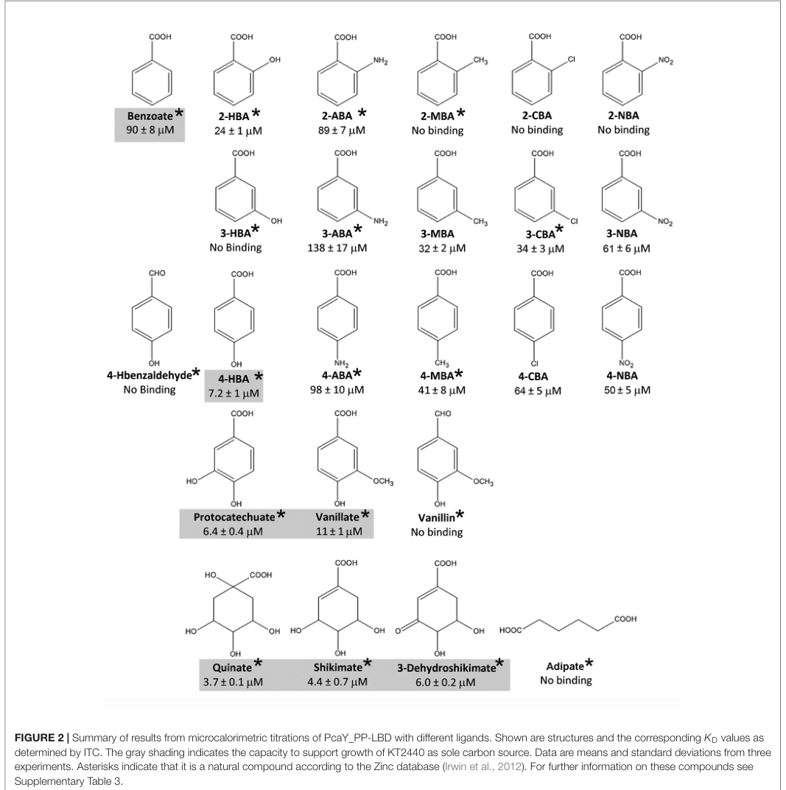

## Question

# Gene Research for Functional Annotation

## ⚠️ CRITICAL: Gene/Protein Identification Context

**BEFORE YOU BEGIN RESEARCH:** You MUST verify you are researching the CORRECT gene/protein. Gene symbols can be ambiguous, especially for less well-characterized genes from non-model organisms.

### Target Gene/Protein Identity (from UniProt):
- **UniProt Accession:** Q88JK6
- **Protein Description:** RecName: Full=Methyl-accepting chemotaxis protein PcaY {ECO:0000305}; AltName: Full=PcaY_PP {ECO:0000303|PubMed:28620365};
- **Gene Information:** Name=pcaY {ECO:0000303|PubMed:12534463}; OrderedLocusNames=PP_2643 {ECO:0000312|EMBL:AAN68251.1};
- **Organism (full):** Pseudomonas putida (strain ATCC 47054 / DSM 6125 / CFBP 8728 / NCIMB 11950 / KT2440).
- **Protein Family:** Belongs to the methyl-accepting chemotaxis (MCP) protein
- **Key Domains:** Chemotax_Me-accpt_rcpt. (IPR004090); HAMP_dom. (IPR003660); MCPsignal_dom. (IPR004089); Tar_rcpt_lig-bd. (IPR003122); HAMP (PF00672)

### MANDATORY VERIFICATION STEPS:

1. **Check if the gene symbol "pcaY" matches the protein description above**
2. **Verify the organism is correct:** Pseudomonas putida (strain ATCC 47054 / DSM 6125 / CFBP 8728 / NCIMB 11950 / KT2440).
3. **Check if protein family/domains align with what you find in literature**
4. **If you find literature for a DIFFERENT gene with the same or similar symbol, STOP**

### If Gene Symbol is Ambiguous or You Cannot Find Relevant Literature:

**DO NOT PROCEED WITH RESEARCH ON A DIFFERENT GENE.** Instead:
- State clearly: "The gene symbol 'pcaY' is ambiguous or literature is limited for this specific protein"
- Explain what you found (e.g., "Found extensive literature on a different gene with the same symbol in a different organism")
- Describe the protein based ONLY on the UniProt information provided above
- Suggest that the protein function can be inferred from domain/family information

### Research Target:

Please provide a comprehensive research report on the gene **pcaY** (gene ID: pcaY, UniProt: Q88JK6) in PSEPK.

The research report should be a detailed narrative explaining the function, biological processes, and localization of the gene product. Citations should be given for all claims.

You should prioritize authoritative reviews and primary scientific literature when conducting research. You can supplement
this with annotations you find in gene/protein databases, but these can be outdated or inaccurate.

We are specifically interested in the primary function of the gene - for enzymes, what reaction is catalyzed, and what is the substrate specificity? For transporters, what is the substrate? For structural proteins or adapters, what is the broader structural role? For signaling molecules, what is the role in the pathway.

We are interested in where in or outside the cell the gene product carries out its function.

We are also interested in the signaling or biochemical pathways in which the gene functions. We are less interested in broad pleiotropic effects, except where these elucidate the precise role.

Include evidence where possible. We are interested in both experimental evidence as well as inference from structure, evolution, or bioinformatic analysis. Precise studies should be prioritized over high-throughput, where available.

## Output

Question: You are an expert researcher providing comprehensive, well-cited information.

Provide detailed information focusing on:
1. Key concepts and definitions with current understanding
2. Recent developments and latest research (prioritize 2023-2024 sources)
3. Current applications and real-world implementations
4. Expert opinions and analysis from authoritative sources
5. Relevant statistics and data from recent studies

Format as a comprehensive research report with proper citations. Include URLs and publication dates where available.
Always prioritize recent, authoritative sources and provide specific citations for all major claims.

# Gene Research for Functional Annotation

## ⚠️ CRITICAL: Gene/Protein Identification Context

**BEFORE YOU BEGIN RESEARCH:** You MUST verify you are researching the CORRECT gene/protein. Gene symbols can be ambiguous, especially for less well-characterized genes from non-model organisms.

### Target Gene/Protein Identity (from UniProt):
- **UniProt Accession:** Q88JK6
- **Protein Description:** RecName: Full=Methyl-accepting chemotaxis protein PcaY {ECO:0000305}; AltName: Full=PcaY_PP {ECO:0000303|PubMed:28620365};
- **Gene Information:** Name=pcaY {ECO:0000303|PubMed:12534463}; OrderedLocusNames=PP_2643 {ECO:0000312|EMBL:AAN68251.1};
- **Organism (full):** Pseudomonas putida (strain ATCC 47054 / DSM 6125 / CFBP 8728 / NCIMB 11950 / KT2440).
- **Protein Family:** Belongs to the methyl-accepting chemotaxis (MCP) protein
- **Key Domains:** Chemotax_Me-accpt_rcpt. (IPR004090); HAMP_dom. (IPR003660); MCPsignal_dom. (IPR004089); Tar_rcpt_lig-bd. (IPR003122); HAMP (PF00672)

### MANDATORY VERIFICATION STEPS:

1. **Check if the gene symbol "pcaY" matches the protein description above**
2. **Verify the organism is correct:** Pseudomonas putida (strain ATCC 47054 / DSM 6125 / CFBP 8728 / NCIMB 11950 / KT2440).
3. **Check if protein family/domains align with what you find in literature**
4. **If you find literature for a DIFFERENT gene with the same or similar symbol, STOP**

### If Gene Symbol is Ambiguous or You Cannot Find Relevant Literature:

**DO NOT PROCEED WITH RESEARCH ON A DIFFERENT GENE.** Instead:
- State clearly: "The gene symbol 'pcaY' is ambiguous or literature is limited for this specific protein"
- Explain what you found (e.g., "Found extensive literature on a different gene with the same symbol in a different organism")
- Describe the protein based ONLY on the UniProt information provided above
- Suggest that the protein function can be inferred from domain/family information

### Research Target:

Please provide a comprehensive research report on the gene **pcaY** (gene ID: pcaY, UniProt: Q88JK6) in PSEPK.

The research report should be a detailed narrative explaining the function, biological processes, and localization of the gene product. Citations should be given for all claims.

You should prioritize authoritative reviews and primary scientific literature when conducting research. You can supplement
this with annotations you find in gene/protein databases, but these can be outdated or inaccurate.

We are specifically interested in the primary function of the gene - for enzymes, what reaction is catalyzed, and what is the substrate specificity? For transporters, what is the substrate? For structural proteins or adapters, what is the broader structural role? For signaling molecules, what is the role in the pathway.

We are interested in where in or outside the cell the gene product carries out its function.

We are also interested in the signaling or biochemical pathways in which the gene functions. We are less interested in broad pleiotropic effects, except where these elucidate the precise role.

Include evidence where possible. We are interested in both experimental evidence as well as inference from structure, evolution, or bioinformatic analysis. Precise studies should be prioritized over high-throughput, where available.

## Research report: functional annotation of **pcaY** (UniProt **Q88JK6**) in *Pseudomonas putida* KT2440 (PP_2643 / PcaY_PP)

### 1) Mandatory identity verification (gene/protein disambiguation)
The UniProt target (Q88JK6) is described as **methyl-accepting chemotaxis protein PcaY** from *Pseudomonas putida* strain **KT2440**, with ordered locus name **PP_2643**. The primary literature that explicitly matches this KT2440 locus is the characterization of **ORF PP2643**, named **PcaY_PP**, in *P. putida* KT2440 (the same strain context as UniProt Q88JK6) (fernandez2017metabolicvaluechemoattractants pages 2-3, fernandez2017metabolicvaluechemoattractants pages 3-5). In this work, PP2643 is treated as a **chemoreceptor** homologous to **PcaY** from *P. putida* F1 (fernandez2017metabolicvaluechemoattractants pages 2-3). Therefore, literature on **PcaY_PP/PP2643** in KT2440 is directly relevant to UniProt Q88JK6, while papers referring to “pcaY” in other *Pseudomonas* strains (e.g., *P. putida* F1) should be used only as **supporting homolog context** (fernandez2017metabolicvaluechemoattractants pages 2-3, luu2019hybridtwocomponentsensors pages 8-9).

### 2) Key concepts and definitions (current understanding)
**Methyl-accepting chemotaxis proteins (MCPs)** are chemoreceptors that detect extracellular (or intracellular) cues and feed signals into chemosensory pathways controlling **flagellum-based chemotaxis**. MCPs typically comprise: (i) an **input/ligand-binding domain (LBD)**, frequently periplasmic and flanked by transmembrane helices; (ii) a **HAMP** signal-conversion module; and (iii) a cytosolic **methyl-accepting/adaptation and signaling** region that interacts with CheA/CheW and undergoes reversible methylation (ahmad2020bacterialchemotaxisa pages 5-7).

A key contemporary structural concept is that chemoreceptor LBDs often fall into recurring folds, including **four-helix bundle (4HB)** and **dCache** domains; signal transduction is frequently initiated via **direct ligand binding** to these LBDs (matilla2024bacterialaminoacid pages 2-5, matilla2024bacterialaminoacid pages 1-2). Broad-ligand-range receptors exist that bind multiple structurally related compounds, and receptor–ligand affinity can quantitatively track chemotactic output (fernandez2017metabolicvaluechemoattractants pages 1-2, fernandez2017metabolicvaluechemoattractants pages 11-12).

### 3) Protein product overview (PcaY_PP/Q88JK6): function, process, and localization
#### 3.1 Primary function
The best-supported primary function of KT2440 PcaY_PP (PP2643; UniProt Q88JK6) is as an **MCP chemoreceptor required for chemoattraction to a panel of C6-ring-containing carboxylic acids** (including aromatic and non-aromatic carboxylates) via **direct ligand binding** to its periplasmic LBD (fernandez2017metabolicvaluechemoattractants pages 1-2, fernandez2017metabolicvaluechemoattractants pages 3-5, fernandez2017metabolicvaluechemoattractants pages 11-12).

A central mechanistic finding is that the recombinant **PcaY_PP ligand-binding domain** binds **17 different C6-ring-containing carboxylic acids** with **micromolar dissociation constants (KD)** spanning **3.7–138 μM**, and ligand affinity correlates with the magnitude of chemotaxis in capillary assays (fernandez2017metabolicvaluechemoattractants pages 1-2, fernandez2017metabolicvaluechemoattractants pages 11-12, fernandez2017metabolicvaluechemoattractants media 4d61c4bc, fernandez2017metabolicvaluechemoattractants media 0c26638f). Genetic evidence further supports receptor function: a **pp2643::mini-Tn5-Km** mutant (disrupting pcaY_PP/PP2643) **abolished chemotaxis** to these ligands and complementation restored responses (fernandez2017metabolicvaluechemoattractants pages 1-2, fernandez2017metabolicvaluechemoattractants pages 3-5).

#### 3.2 Ligand specificity and biochemical “substrate” (chemoeffector) spectrum
PcaY_PP is a **broad ligand range** chemoreceptor whose tightest-binding ligands were reported as **quinate, shikimate, 3-dehydroshikimate, and protocatechuate** (fernandez2017metabolicvaluechemoattractants pages 11-12). These compounds lie at the interface between the **shikimate biosynthetic pathway** and **quinate/shikimate-related catabolic routes**, suggesting that PcaY_PP helps cells navigate toward metabolically valuable aromatic-related intermediates present in soil/rhizosphere contexts (fernandez2017metabolicvaluechemoattractants pages 11-12).

In addition to KT2440 PcaY_PP, homologous PcaY receptors (e.g., in *P. putida* F1) have been linked to responses to aromatic acids such as **benzoate, 4-hydroxybenzoate, protocatechuate, vanillate/vanillin**, and related molecules—supporting a conserved “aromatic-acid/carboxylate chemotaxis receptor” role across strains (fernandez2017metabolicvaluechemoattractants pages 2-3, luu2019hybridtwocomponentsensors pages 1-2, luu2019hybridtwocomponentsensors pages 8-9).

#### 3.3 Cellular localization and topology
PcaY_PP is a membrane chemoreceptor with a **periplasmic ligand-binding domain** between two predicted transmembrane helices; in KT2440 PcaY_PP, the LBD was operationally defined as **aa 44–196** between transmembrane regions (fernandez2017metabolicvaluechemoattractants pages 2-3). Heterologous expression studies with PcaY fusions show predominant **membrane localization** (and polar localization consistent with chemosensory arrays) in a large fraction of cells, supporting its role as a cell-surface chemoreceptor (roggo2018heterologousexpressionof pages 9-11).

### 4) Experimental evidence and quantitative data (key statistics)
#### 4.1 Ligand binding and structure–function coupling
Isothermal titration calorimetry measurements show binding of 17 ligands with **KD = 3.7–138 μM** (fernandez2017metabolicvaluechemoattractants pages 1-2, fernandez2017metabolicvaluechemoattractants media 4d61c4bc). Analytical ultracentrifugation indicated that ligand-free PcaY_PP-LBD exists in a **monomer–dimer equilibrium** with self-association **KD = 57.5 μM**, and that ligand binding shifts the population fully to the **dimeric** state, a behavior described as a general feature of **four-helix bundle LBDs** (fernandez2017metabolicvaluechemoattractants pages 1-2).

#### 4.2 Chemotaxis assays and genotype–phenotype mapping
Quantitative capillary chemotaxis assays show that **chemoeffector affinity correlates with response magnitude**, and disruption of **pcaY_PP/PP2643** eliminates chemotaxis to the receptor’s ligand panel, with complementation restoring chemotaxis (fernandez2017metabolicvaluechemoattractants pages 1-2, fernandez2017metabolicvaluechemoattractants pages 3-5, fernandez2017metabolicvaluechemoattractants media 0c26638f).

#### 4.3 Metabolic integration: growth relationships
Only **7** of the tested PcaY_PP ligands supported growth as sole carbon sources, and the study reports that growth-supporting ligands tended to bind with **higher affinity** and that KD values correlated with **lag phase length**, linking ligand recognition to “metabolic value” (fernandez2017metabolicvaluechemoattractants pages 1-2).

### 5) Pathway context and biological role in *P. putida*
#### 5.1 Chemosensory pathways and ecological context (rhizosphere/soil)
*P. putida* KT2440 is a soil/rhizosphere bacterium with a substantial chemoreceptor repertoire (reported as **27 chemoreceptors**), supporting navigation in chemically complex habitats such as plant root exudate gradients (lopezfarfan2019concentrationdependenteffect pages 1-2). Chemotaxis toward root exudates is described as an important prerequisite for efficient root colonization, and KT2440 contains multiple cheA paralogs that link chemosensory signaling to distinct outputs (chemotaxis versus c-di-GMP/biofilm-related signaling) (lopezfarfan2019concentrationdependenteffect pages 1-2).

PcaY_PP’s ligand spectrum (C6-ring carboxylates including protocatechuate and shikimate-related compounds) is consistent with *Pseudomonas* strategies to locate aromatic- and plant-derived molecules present in soil and rhizosphere environments, potentially facilitating access to nutrients and/or catabolic substrates (fernandez2017metabolicvaluechemoattractants pages 11-12, matilla2024bacterialaminoacid pages 1-2).

### 6) Recent developments (prioritizing 2023–2024)
Direct 2023–2024 primary research specifically on **KT2440 PcaY_PP/PP2643** was not retrieved in the current tool-based search; however, 2024 expert review literature strengthens the mechanistic framework used to interpret PcaY_PP function.

A 2024 review on amino-acid chemotaxis emphasizes that chemoreceptor signaling is commonly initiated by direct ligand binding to **four-helix bundle** and **dCache** LBDs, and highlights broad ecological roles (biofilm formation, root/seed colonization, and more), situating *P. putida* among soil/plant-associated bacteria for which chemotaxis is ecologically important (matilla2024bacterialaminoacid pages 1-2). The same review provides up-to-date structural interpretation for 4HB-type LBDs (ligand binding at a dimer interface, dimer stabilization, cooperativity), which is conceptually aligned with PcaY_PP observations of ligand-induced dimer stabilization in the LBD (fernandez2017metabolicvaluechemoattractants pages 1-2, matilla2024bacterialaminoacid pages 2-5).

### 7) Current applications and real-world implementations
#### 7.1 Biosensing and synthetic biology (heterologous receptor deployment)
PcaY-family receptors have been used to reprogram chemotaxis specificity in *E. coli* by heterologous expression. In a peer-reviewed implementation, *E. coli* expressing PcaY displayed a statistically significant chemotactic response to **benzoate** (e.g., ~**1.5-fold** attraction in a Tsr-deficient background) and PcaY-mCherry localized to the membrane/poles in **~50–70%** of cells, supporting feasibility for chemotaxis-based biosensing of aromatic acids (roggo2018heterologousexpressionof pages 7-9, roggo2018heterologousexpressionof pages 9-11). This provides a concrete real-world direction: deploying PcaY-like MCPs to engineer bacterial taxis for environmental chemical sensing and potentially pollutant targeting (roggo2018heterologousexpressionof pages 7-9).

#### 7.2 Biodegradation context
A widely cited review of chemotaxis and aromatic-compound biodegradation highlights that chemotaxis can increase bioavailability of hydrophobic aromatic pollutants and underscores the importance of identifying MCP–ligand pairs for biodegradation-linked behaviors (ahmad2020bacterialchemotaxisa pages 5-7). Within *Pseudomonas*, PcaY-like receptors that sense aromatic acids provide a mechanistic entry point to connect chemotactic foraging with downstream aromatic catabolism where these substrates are present (fernandez2017metabolicvaluechemoattractants pages 2-3, ahmad2020bacterialchemotaxisa pages 5-7).

### 8) Expert opinion and analysis (authoritative interpretation)
The most direct expert interpretation of PcaY_PP’s physiological logic comes from its detailed biophysical/genetic characterization: receptor–ligand affinity was reported to correlate with both chemotactic response magnitude and growth-associated parameters (lag phase) among growth-supporting ligands, supporting the hypothesis that **metabolic potential** influences ligand prioritization by broad-range receptors (fernandez2017metabolicvaluechemoattractants pages 1-2). This aligns with modern review perspectives that chemotaxis frequently provides a nutrient-access advantage, especially in complex environments such as rhizospheres (matilla2024bacterialaminoacid pages 1-2).

### 9) Evidence map of key properties (for functional annotation)
The following evidence table consolidates the most actionable properties for annotating UniProt Q88JK6 / PP_2643.

| Property | Experimentally supported finding |
|---|---|
| Gene/protein identity | **PcaY_PP** is the **PP2643** chemoreceptor of *Pseudomonas putida* KT2440, described as homologous to **PcaY** from *P. putida* F1; the KT2440 transposon mutant is reported as **pp2643::mini-Tn5-Km**, linking locus **PP2643** to **pcaY_PP** (user-specified correspondence to UniProt **Q88JK6**) (fernandez2017metabolicvaluechemoattractants pages 2-3, fernandez2017metabolicvaluechemoattractants pages 3-5) |
| Receptor type / family | **Methyl-accepting chemotaxis protein (MCP)** / chemoreceptor with **broad ligand range** for C6-ring carboxylic acids; classified as a **40H / four-helix-bundle-type** receptor family in later comparative work (fernandez2017metabolicvaluechemoattractants pages 1-2, roggo2018heterologousexpressionof pages 9-11, luu2019hybridtwocomponentsensors pages 15-16) |
| Cellular localization / topology | The ligand-binding region is a **periplasmic LBD** defined as **aa 44–196**, located **between two predicted transmembrane helices**; UniProt/domain context and MCP architecture are consistent with a membrane receptor containing **HAMP** and a **cytosolic methyl-accepting signaling domain** (fernandez2017metabolicvaluechemoattractants pages 2-3, ahmad2020bacterialchemotaxisa pages 5-7) |
| Direct ligand recognition | The recombinant **PcaY_PP-LBD directly recognizes 17 C6-ring-containing carboxylic acids** by ITC; receptor activation is reported to occur by **direct chemoeffector binding** to the LBD (fernandez2017metabolicvaluechemoattractants pages 1-2, fernandez2017metabolicvaluechemoattractants pages 11-12) |
| Binding affinity range | Measured **KD = 3.7–138 µM** across the ligand set, demonstrating micromolar affinity spanning tight to moderate binding (fernandez2017metabolicvaluechemoattractants pages 1-2, fernandez2017metabolicvaluechemoattractants media 4d61c4bc) |
| Tightest-binding ligands | The strongest binders reported were **quinate, shikimate, 3-dehydroshikimate, and protocatechuate**, compounds at the intersection of **quinate catabolism** and **shikimate biosynthesis** (fernandez2017metabolicvaluechemoattractants pages 1-2, fernandez2017metabolicvaluechemoattractants pages 11-12) |
| Functional ligand spectrum | Ligands include both **aromatic and non-aromatic** C6-ring carboxylates; related PcaY studies and hybrid-receptor assays support responses to **4-hydroxybenzoate, benzoate, protocatechuate, vanillate, vanillin, quinate, and shikimate** (fernandez2017metabolicvaluechemoattractants pages 3-5, luu2019hybridtwocomponentsensors pages 1-2, luu2019hybridtwocomponentsensors pages 8-9) |
| Genetic evidence for function | **Mutation of pcaY_PP abolished chemotaxis** to the tested PcaY_PP ligands, and **gene complementation restored** the phenotype, providing direct genetic evidence that PcaY_PP is required for these chemotactic responses (fernandez2017metabolicvaluechemoattractants pages 1-2, fernandez2017metabolicvaluechemoattractants pages 3-5) |
| Chemotaxis-response relationship | **Chemoeffector affinity correlated with chemotactic response magnitude**, linking ligand binding strength to signaling output in capillary assays (fernandez2017metabolicvaluechemoattractants pages 1-2, fernandez2017metabolicvaluechemoattractants pages 11-12, fernandez2017metabolicvaluechemoattractants media 0c26638f) |
| Oligomeric behavior / signaling-relevant biophysics | **Ligand-free PcaY_PP-LBD** exists in a **monomer–dimer equilibrium** with self-association **KD = 57.5 µM**; ligand binding shifted the population to the **dimeric state**, a behavior noted as characteristic of **four-helix-bundle LBDs** (fernandez2017metabolicvaluechemoattractants pages 1-2) |
| Growth/metabolic context | Only **7 ligands supported growth** as sole carbon sources; ligands that supported growth generally had **lower KD** values, suggesting preferential recognition of compounds with higher **metabolic value** (fernandez2017metabolicvaluechemoattractants pages 1-2) |
| Core assay methods | **Isothermal titration calorimetry (ITC)** for ligand binding, **quantitative capillary chemotaxis assays** for behavioral responses, **analytical ultracentrifugation** for oligomerization, plus **mutant/complementation genetics** (fernandez2017metabolicvaluechemoattractants pages 1-2, fernandez2017metabolicvaluechemoattractants media 4d61c4bc, fernandez2017metabolicvaluechemoattractants media 0c26638f) |

*Table: This table summarizes the main experimentally supported properties of the *Pseudomonas putida* KT2440 chemoreceptor PcaY_PP/PP2643, including identity, topology, ligand spectrum, affinity, genetic evidence, and methods. It is useful as a compact evidence map for functional annotation of UniProt Q88JK6.*

### 10) Summary annotation (recommended)
**Gene/protein:** pcaY (PP_2643; UniProt Q88JK6)

**Recommended primary function:** Membrane-bound **methyl-accepting chemotaxis protein (MCP)** that mediates chemoattraction by **direct binding** of multiple **C6-ring carboxylic acids** (including aromatic acids), with micromolar affinities and experimentally validated requirement for chemotaxis in KT2440 (fernandez2017metabolicvaluechemoattractants pages 1-2, fernandez2017metabolicvaluechemoattractants pages 3-5, fernandez2017metabolicvaluechemoattractants media 4d61c4bc).

**Cellular location:** Inner membrane with a **periplasmic LBD** (aa 44–196) between two transmembrane helices and a cytosolic signaling region (fernandez2017metabolicvaluechemoattractants pages 2-3, ahmad2020bacterialchemotaxisa pages 5-7).

**Biological process/pathway:** Chemosensory signaling controlling chemotaxis toward aromatic-related metabolites (e.g., protocatechuate; quinate/shikimate pathway intermediates) that are relevant to soil/rhizosphere chemical landscapes and metabolic foraging (fernandez2017metabolicvaluechemoattractants pages 11-12, lopezfarfan2019concentrationdependenteffect pages 1-2).

### Figures/tables used as primary quantitative evidence
The ligand-binding (ITC KD values) and chemotaxis assay results were extracted from the PcaY_PP characterization study figures summarizing ligand KD values and capillary chemotaxis responses (fernandez2017metabolicvaluechemoattractants media 4d61c4bc, fernandez2017metabolicvaluechemoattractants media 0c26638f).

References

1. (fernandez2017metabolicvaluechemoattractants pages 2-3): Matilde Fernández, Miguel A. Matilla, Álvaro Ortega, and Tino Krell. Metabolic value chemoattractants are preferentially recognized at broad ligand range chemoreceptor of pseudomonas putida kt2440. Frontiers in Microbiology, May 2017. URL: https://doi.org/10.3389/fmicb.2017.00990, doi:10.3389/fmicb.2017.00990. This article has 50 citations and is from a peer-reviewed journal.

2. (fernandez2017metabolicvaluechemoattractants pages 3-5): Matilde Fernández, Miguel A. Matilla, Álvaro Ortega, and Tino Krell. Metabolic value chemoattractants are preferentially recognized at broad ligand range chemoreceptor of pseudomonas putida kt2440. Frontiers in Microbiology, May 2017. URL: https://doi.org/10.3389/fmicb.2017.00990, doi:10.3389/fmicb.2017.00990. This article has 50 citations and is from a peer-reviewed journal.

3. (luu2019hybridtwocomponentsensors pages 8-9): Rita A. Luu, Rebecca A. Schomer, Ceanne N. Brunton, Richard Truong, Albert P. Ta, Watumesa A. Tan, Juanito V. Parales, Yu-Jing Wang, Yu-Wen Huo, Shuang-Jiang Liu, Jayna L. Ditty, Valley Stewart, and Rebecca E. Parales. Hybrid two-component sensors for identification of bacterial chemoreceptor function. Applied and Environmental Microbiology, Nov 2019. URL: https://doi.org/10.1128/aem.01626-19, doi:10.1128/aem.01626-19. This article has 30 citations and is from a peer-reviewed journal.

4. (ahmad2020bacterialchemotaxisa pages 5-7): Fiaz Ahmad, Daochen Zhu, and Jianzhong Sun. Bacterial chemotaxis: a way forward to aromatic compounds biodegradation. Environmental Sciences Europe, 32:1-18, Mar 2020. URL: https://doi.org/10.1186/s12302-020-00329-2, doi:10.1186/s12302-020-00329-2. This article has 76 citations and is from a peer-reviewed journal.

5. (matilla2024bacterialaminoacid pages 2-5): Miguel A. Matilla and Tino Krell. Bacterial amino acid chemotaxis: a widespread strategy with multiple physiological and ecological roles. Journal of Bacteriology, Oct 2024. URL: https://doi.org/10.1128/jb.00300-24, doi:10.1128/jb.00300-24. This article has 19 citations and is from a peer-reviewed journal.

6. (matilla2024bacterialaminoacid pages 1-2): Miguel A. Matilla and Tino Krell. Bacterial amino acid chemotaxis: a widespread strategy with multiple physiological and ecological roles. Journal of Bacteriology, Oct 2024. URL: https://doi.org/10.1128/jb.00300-24, doi:10.1128/jb.00300-24. This article has 19 citations and is from a peer-reviewed journal.

7. (fernandez2017metabolicvaluechemoattractants pages 1-2): Matilde Fernández, Miguel A. Matilla, Álvaro Ortega, and Tino Krell. Metabolic value chemoattractants are preferentially recognized at broad ligand range chemoreceptor of pseudomonas putida kt2440. Frontiers in Microbiology, May 2017. URL: https://doi.org/10.3389/fmicb.2017.00990, doi:10.3389/fmicb.2017.00990. This article has 50 citations and is from a peer-reviewed journal.

8. (fernandez2017metabolicvaluechemoattractants pages 11-12): Matilde Fernández, Miguel A. Matilla, Álvaro Ortega, and Tino Krell. Metabolic value chemoattractants are preferentially recognized at broad ligand range chemoreceptor of pseudomonas putida kt2440. Frontiers in Microbiology, May 2017. URL: https://doi.org/10.3389/fmicb.2017.00990, doi:10.3389/fmicb.2017.00990. This article has 50 citations and is from a peer-reviewed journal.

9. (fernandez2017metabolicvaluechemoattractants media 4d61c4bc): Matilde Fernández, Miguel A. Matilla, Álvaro Ortega, and Tino Krell. Metabolic value chemoattractants are preferentially recognized at broad ligand range chemoreceptor of pseudomonas putida kt2440. Frontiers in Microbiology, May 2017. URL: https://doi.org/10.3389/fmicb.2017.00990, doi:10.3389/fmicb.2017.00990. This article has 50 citations and is from a peer-reviewed journal.

10. (fernandez2017metabolicvaluechemoattractants media 0c26638f): Matilde Fernández, Miguel A. Matilla, Álvaro Ortega, and Tino Krell. Metabolic value chemoattractants are preferentially recognized at broad ligand range chemoreceptor of pseudomonas putida kt2440. Frontiers in Microbiology, May 2017. URL: https://doi.org/10.3389/fmicb.2017.00990, doi:10.3389/fmicb.2017.00990. This article has 50 citations and is from a peer-reviewed journal.

11. (luu2019hybridtwocomponentsensors pages 1-2): Rita A. Luu, Rebecca A. Schomer, Ceanne N. Brunton, Richard Truong, Albert P. Ta, Watumesa A. Tan, Juanito V. Parales, Yu-Jing Wang, Yu-Wen Huo, Shuang-Jiang Liu, Jayna L. Ditty, Valley Stewart, and Rebecca E. Parales. Hybrid two-component sensors for identification of bacterial chemoreceptor function. Applied and Environmental Microbiology, Nov 2019. URL: https://doi.org/10.1128/aem.01626-19, doi:10.1128/aem.01626-19. This article has 30 citations and is from a peer-reviewed journal.

12. (roggo2018heterologousexpressionof pages 9-11): Clémence Roggo, Estelle Emilie Clerc, Noushin Hadadi, Nicolas Carraro, Roman Stocker, and Jan Roelof van der Meer. Heterologous expression of pseudomonas putida methyl-accepting chemotaxis proteins yields escherichia coli cells chemotactic to aromatic compounds. Applied and Environmental Microbiology, Sep 2018. URL: https://doi.org/10.1128/aem.01362-18, doi:10.1128/aem.01362-18. This article has 12 citations and is from a peer-reviewed journal.

13. (lopezfarfan2019concentrationdependenteffect pages 1-2): Diana López-Farfán, José A. Reyes-Darias, Miguel A. Matilla, and Tino Krell. Concentration dependent effect of plant root exudates on the chemosensory systems of pseudomonas putida kt2440. Frontiers in Microbiology, Jan 2019. URL: https://doi.org/10.3389/fmicb.2019.00078, doi:10.3389/fmicb.2019.00078. This article has 76 citations and is from a peer-reviewed journal.

14. (roggo2018heterologousexpressionof pages 7-9): Clémence Roggo, Estelle Emilie Clerc, Noushin Hadadi, Nicolas Carraro, Roman Stocker, and Jan Roelof van der Meer. Heterologous expression of pseudomonas putida methyl-accepting chemotaxis proteins yields escherichia coli cells chemotactic to aromatic compounds. Applied and Environmental Microbiology, Sep 2018. URL: https://doi.org/10.1128/aem.01362-18, doi:10.1128/aem.01362-18. This article has 12 citations and is from a peer-reviewed journal.

15. (luu2019hybridtwocomponentsensors pages 15-16): Rita A. Luu, Rebecca A. Schomer, Ceanne N. Brunton, Richard Truong, Albert P. Ta, Watumesa A. Tan, Juanito V. Parales, Yu-Jing Wang, Yu-Wen Huo, Shuang-Jiang Liu, Jayna L. Ditty, Valley Stewart, and Rebecca E. Parales. Hybrid two-component sensors for identification of bacterial chemoreceptor function. Applied and Environmental Microbiology, Nov 2019. URL: https://doi.org/10.1128/aem.01626-19, doi:10.1128/aem.01626-19. This article has 30 citations and is from a peer-reviewed journal.

## Artifacts

- [Edison artifact artifact-00](pcaY-deep-research-falcon_artifacts/artifact-00.md)

## Citations

1. fernandez2017metabolicvaluechemoattractants pages 2-3
2. ahmad2020bacterialchemotaxisa pages 5-7
3. fernandez2017metabolicvaluechemoattractants pages 11-12
4. roggo2018heterologousexpressionof pages 9-11
5. fernandez2017metabolicvaluechemoattractants pages 1-2
6. lopezfarfan2019concentrationdependenteffect pages 1-2
7. matilla2024bacterialaminoacid pages 1-2
8. roggo2018heterologousexpressionof pages 7-9
9. fernandez2017metabolicvaluechemoattractants pages 3-5
10. luu2019hybridtwocomponentsensors pages 8-9
11. matilla2024bacterialaminoacid pages 2-5
12. luu2019hybridtwocomponentsensors pages 1-2
13. luu2019hybridtwocomponentsensors pages 15-16
14. https://doi.org/10.3389/fmicb.2017.00990,
15. https://doi.org/10.1128/aem.01626-19,
16. https://doi.org/10.1186/s12302-020-00329-2,
17. https://doi.org/10.1128/jb.00300-24,
18. https://doi.org/10.1128/aem.01362-18,
19. https://doi.org/10.3389/fmicb.2019.00078,