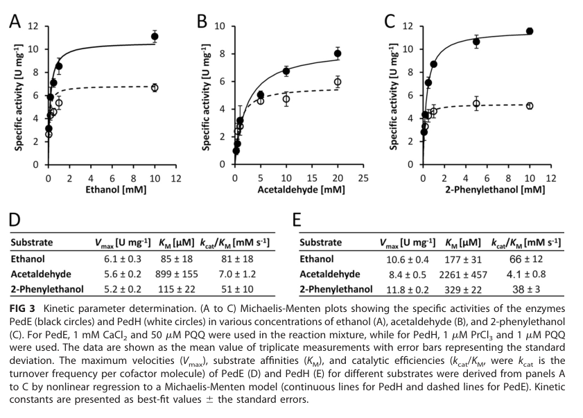

## Question

# Gene Research for Functional Annotation

## ⚠️ CRITICAL: Gene/Protein Identification Context

**BEFORE YOU BEGIN RESEARCH:** You MUST verify you are researching the CORRECT gene/protein. Gene symbols can be ambiguous, especially for less well-characterized genes from non-model organisms.

### Target Gene/Protein Identity (from UniProt):
- **UniProt Accession:** Q88JH0
- **Protein Description:** RecName: Full=Quinoprotein alcohol dehydrogenase PedH {ECO:0000305|PubMed:28655819, ECO:0000305|Ref.3}; EC=1.1.2.- {ECO:0000305|PubMed:28655819, ECO:0000305|Ref.3}; AltName: Full=Lanthanide-dependent pyrroloquinoline quinone-dependent alcohol dehydrogenase {ECO:0000303|PubMed:28655819}; Short=Lanthanide-dependent PQQ-ADH {ECO:0000303|PubMed:28655819}; Flags: Precursor;
- **Gene Information:** Name=pedH {ECO:0000303|PubMed:28655819, ECO:0000303|Ref.3}; Synonyms=qedH-II {ECO:0000312|EMBL:AAN68287.1}; OrderedLocusNames=PP_2679 {ECO:0000312|EMBL:AAN68287.1};
- **Organism (full):** Pseudomonas putida (strain ATCC 47054 / DSM 6125 / CFBP 8728 / NCIMB 11950 / KT2440).
- **Protein Family:** Belongs to the bacterial PQQ dehydrogenase family.
- **Key Domains:** ADHI. (IPR034119); PQQ_b-propeller_rpt. (IPR018391); PQQ_MeOH/EtOH_DH. (IPR017512); PQQ_rpt_dom. (IPR002372); Quinoprotein_ADH-like_sf. (IPR011047)

### MANDATORY VERIFICATION STEPS:

1. **Check if the gene symbol "pedH" matches the protein description above**
2. **Verify the organism is correct:** Pseudomonas putida (strain ATCC 47054 / DSM 6125 / CFBP 8728 / NCIMB 11950 / KT2440).
3. **Check if protein family/domains align with what you find in literature**
4. **If you find literature for a DIFFERENT gene with the same or similar symbol, STOP**

### If Gene Symbol is Ambiguous or You Cannot Find Relevant Literature:

**DO NOT PROCEED WITH RESEARCH ON A DIFFERENT GENE.** Instead:
- State clearly: "The gene symbol 'pedH' is ambiguous or literature is limited for this specific protein"
- Explain what you found (e.g., "Found extensive literature on a different gene with the same symbol in a different organism")
- Describe the protein based ONLY on the UniProt information provided above
- Suggest that the protein function can be inferred from domain/family information

### Research Target:

Please provide a comprehensive research report on the gene **pedH** (gene ID: pedH, UniProt: Q88JH0) in PSEPK.

The research report should be a detailed narrative explaining the function, biological processes, and localization of the gene product. Citations should be given for all claims.

You should prioritize authoritative reviews and primary scientific literature when conducting research. You can supplement
this with annotations you find in gene/protein databases, but these can be outdated or inaccurate.

We are specifically interested in the primary function of the gene - for enzymes, what reaction is catalyzed, and what is the substrate specificity? For transporters, what is the substrate? For structural proteins or adapters, what is the broader structural role? For signaling molecules, what is the role in the pathway.

We are interested in where in or outside the cell the gene product carries out its function.

We are also interested in the signaling or biochemical pathways in which the gene functions. We are less interested in broad pleiotropic effects, except where these elucidate the precise role.

Include evidence where possible. We are interested in both experimental evidence as well as inference from structure, evolution, or bioinformatic analysis. Precise studies should be prioritized over high-throughput, where available.

## Output

Question: You are an expert researcher providing comprehensive, well-cited information.

Provide detailed information focusing on:
1. Key concepts and definitions with current understanding
2. Recent developments and latest research (prioritize 2023-2024 sources)
3. Current applications and real-world implementations
4. Expert opinions and analysis from authoritative sources
5. Relevant statistics and data from recent studies

Format as a comprehensive research report with proper citations. Include URLs and publication dates where available.
Always prioritize recent, authoritative sources and provide specific citations for all major claims.

# Gene Research for Functional Annotation

## ⚠️ CRITICAL: Gene/Protein Identification Context

**BEFORE YOU BEGIN RESEARCH:** You MUST verify you are researching the CORRECT gene/protein. Gene symbols can be ambiguous, especially for less well-characterized genes from non-model organisms.

### Target Gene/Protein Identity (from UniProt):
- **UniProt Accession:** Q88JH0
- **Protein Description:** RecName: Full=Quinoprotein alcohol dehydrogenase PedH {ECO:0000305|PubMed:28655819, ECO:0000305|Ref.3}; EC=1.1.2.- {ECO:0000305|PubMed:28655819, ECO:0000305|Ref.3}; AltName: Full=Lanthanide-dependent pyrroloquinoline quinone-dependent alcohol dehydrogenase {ECO:0000303|PubMed:28655819}; Short=Lanthanide-dependent PQQ-ADH {ECO:0000303|PubMed:28655819}; Flags: Precursor;
- **Gene Information:** Name=pedH {ECO:0000303|PubMed:28655819, ECO:0000303|Ref.3}; Synonyms=qedH-II {ECO:0000312|EMBL:AAN68287.1}; OrderedLocusNames=PP_2679 {ECO:0000312|EMBL:AAN68287.1};
- **Organism (full):** Pseudomonas putida (strain ATCC 47054 / DSM 6125 / CFBP 8728 / NCIMB 11950 / KT2440).
- **Protein Family:** Belongs to the bacterial PQQ dehydrogenase family.
- **Key Domains:** ADHI. (IPR034119); PQQ_b-propeller_rpt. (IPR018391); PQQ_MeOH/EtOH_DH. (IPR017512); PQQ_rpt_dom. (IPR002372); Quinoprotein_ADH-like_sf. (IPR011047)

### MANDATORY VERIFICATION STEPS:

1. **Check if the gene symbol "pedH" matches the protein description above**
2. **Verify the organism is correct:** Pseudomonas putida (strain ATCC 47054 / DSM 6125 / CFBP 8728 / NCIMB 11950 / KT2440).
3. **Check if protein family/domains align with what you find in literature**
4. **If you find literature for a DIFFERENT gene with the same or similar symbol, STOP**

### If Gene Symbol is Ambiguous or You Cannot Find Relevant Literature:

**DO NOT PROCEED WITH RESEARCH ON A DIFFERENT GENE.** Instead:
- State clearly: "The gene symbol 'pedH' is ambiguous or literature is limited for this specific protein"
- Explain what you found (e.g., "Found extensive literature on a different gene with the same symbol in a different organism")
- Describe the protein based ONLY on the UniProt information provided above
- Suggest that the protein function can be inferred from domain/family information

### Research Target:

Please provide a comprehensive research report on the gene **pedH** (gene ID: pedH, UniProt: Q88JH0) in PSEPK.

The research report should be a detailed narrative explaining the function, biological processes, and localization of the gene product. Citations should be given for all claims.

You should prioritize authoritative reviews and primary scientific literature when conducting research. You can supplement
this with annotations you find in gene/protein databases, but these can be outdated or inaccurate.

We are specifically interested in the primary function of the gene - for enzymes, what reaction is catalyzed, and what is the substrate specificity? For transporters, what is the substrate? For structural proteins or adapters, what is the broader structural role? For signaling molecules, what is the role in the pathway.

We are interested in where in or outside the cell the gene product carries out its function.

We are also interested in the signaling or biochemical pathways in which the gene functions. We are less interested in broad pleiotropic effects, except where these elucidate the precise role.

Include evidence where possible. We are interested in both experimental evidence as well as inference from structure, evolution, or bioinformatic analysis. Precise studies should be prioritized over high-throughput, where available.

## Research report: Functional annotation of **pedH** (UniProt **Q88JH0**, locus **PP_2679**) in *Pseudomonas putida* KT2440

### 1) Target verification (gene/protein identity)
The target is **PedH**, encoded by **pedH** (ordered locus **PP_2679**) in *Pseudomonas putida* (KT2440), and described as a **lanthanide-dependent pyrroloquinoline quinone (PQQ)-dependent alcohol/ethanol dehydrogenase**. This exact locus tag (PP_2679) and function are consistently used in primary studies on the KT2440 PedE/PedH system, matching the UniProt accession **Q88JH0** context provided by the user. (wehrmann2018thepeds2pedr2twocomponent pages 2-3, wehrmann2017functionalroleofa pages 4-7, wehrmann2017functionalroleofa pages 1-2)

### 2) Key concepts and current understanding

#### 2.1 Quinoprotein PQQ-dependent alcohol dehydrogenases (PQQ-ADHs)
PedH belongs to a family of periplasmic **quinoprotein** alcohol dehydrogenases that use the redox cofactor **PQQ** to catalyze oxidation of alcohols (and in some cases aldehydes). In *P. putida* KT2440, PedH and its paralog PedE constitute a **periplasmic oxidation system** important for detoxification and catabolism of volatile alcohols/aldehydes. (wehrmann2017functionalroleofa pages 1-2, wehrmann2019rareearthelement pages 1-2)

#### 2.2 Lanthanide-dependent versus calcium-dependent paralogs; the REE/lanthanide switch
KT2440 encodes two functionally redundant but metal-differentiated enzymes:
- **PedE (PP_2674)**: Ca2+-dependent PQQ-ADH
- **PedH (PP_2679)**: Ln3+-dependent PQQ-ADH

Their expression is **inversely regulated** by rare earth element (REE; lanthanide) availability (“REE switch” / “lanthanide switch”), enabling the organism to deploy the metal-appropriate enzyme depending on which metals are bioavailable. (wehrmann2018thepeds2pedr2twocomponent pages 2-3, wehrmann2019rareearthelement pages 2-3)

### 3) Primary biochemical function of PedH

#### 3.1 Reaction and substrate scope
PedH is a **PQQ-dependent alcohol dehydrogenase** (EC 1.1.2.- class context) functioning in the periplasmic oxidation system. It oxidizes a **broad range** of alcohol substrates, including **linear and aromatic primary and secondary alcohols**, and can show activity with some aldehydes, with substrate scope broadly similar to the Ca-dependent PedE. (wehrmann2017functionalroleofa pages 4-7, wehrmann2017functionalroleofa pages 2-4)

Experimentally supported substrates and pathway contexts in KT2440 include:
- **2-phenylethanol** (growth-linked; periplasmic oxidation system) (wehrmann2019rareearthelement pages 1-2, wehrmann2018thepeds2pedr2twocomponent pages 2-3)
- **glycerol** (initiates an auxiliary glycerol catabolic route; see below) (wehrmann2020thecellularresponse pages 4-6)
- **(2S,3S)-2,3-butanediol → acetoin** (PedE/PedH responsible for the dehydrogenation step; acetoin then enters metabolism via the acetoin dehydrogenase system) (liu2021dehydrogenationmechanismof pages 1-2)

In vitro assays in the glycerol study detected PedE/PedH activity with **2-phenylethanol and glycerol** but not with citrate or glucose under the tested conditions. (wehrmann2020thecellularresponse pages 4-6)

#### 3.2 Lanthanide requirement and specificity (cofactor dependence)
PedH is catalytically active **only in the presence of trivalent lanthanides (Ln3+)** and is inactive with several tested heavy lanthanides/other trivalent metals. In purified-enzyme assays, activity was observed with light-to-mid lanthanides such as **La3+, Ce3+, Pr3+, Nd3+, Sm3+, Gd3+, Tb3+**, while **Er3+, Yb3+, Y3+, Sc3+** did not support activity under the reported assay conditions; the highest activities were reported with **Pr3+ and Nd3+**. (wehrmann2017functionalroleofa pages 4-7, wehrmann2017functionalroleofa pages 2-4)

These metal preferences are visualized in the lanthanide-dependence figure for PedH activity across rare earth metal ions. (wehrmann2017functionalroleof media a288382e)

#### 3.3 Quantitative kinetic and binding parameters (selected)
A key mechanistic distinction between PedH and PedE is PedH’s **much higher affinity** for lanthanides than PedE’s affinity for Ca2+.

From purified-enzyme measurements (selected examples):
- **Lanthanide binding affinity (PedH):** KD ~**25–75 nM**; enzyme active over **~10 nM to 100 µM** Ln, with peak around **~1 µM** (wehrmann2017functionalroleofa pages 4-7, wehrmann2017functionalroleof pages 6-10)
- **Ethanol kinetics (PedH vs PedE):** Vmax(PedH) ≈ **10.6 U·mg−1** vs Vmax(PedE) ≈ **6.1 U·mg−1**; KM(PedH) ~**177 µM** vs KM(PedE) ~**85 µM** (wehrmann2017functionalroleofa pages 4-7)

The kinetic parameter panel/table for PedH is shown in the retrieved figure crop. (wehrmann2017functionalroleof media 5ce5386c)

#### 3.4 Structural/sequence features supporting Ln coordination
PedH contains a **conserved active-site Asp** (contrasting with a Ser in PedE) that is associated with **Ln3+ coordination** in lanthanide-dependent quinoprotein dehydrogenases. (wehrmann2017functionalroleofa pages 2-4)

### 4) Cellular localization and physiological role

#### 4.1 Subcellular localization
PedH is explicitly described as part of a **periplasmic oxidation system** (together with PedE) that supports growth on alcoholic substrates and influences substrate-dependent physiology (e.g., glycerol growth behavior). (wehrmann2019rareearthelement pages 1-2, wehrmann2020thecellularresponse pages 4-6)

#### 4.2 Pathway integration and ecological/physiological roles

**Growth on volatile alcohols (e.g., 2-phenylethanol):** 
PedH is required for efficient growth in conditions where lanthanides drive the system toward PedH usage. For example, in the presence of lanthanides (La3+), a **ΔpedH** strain fails to grow on 2-phenylethanol under conditions where the REE switch represses reliance on PedE, demonstrating the ecological role of PedH as the Ln-dependent branch of the periplasmic oxidation system. (wehrmann2018thepeds2pedr2twocomponent pages 2-3, wehrmann2018thepeds2pedr2twocomponent pages 3-5)

**Glycerol metabolism (auxiliary route):** 
A substrate-specific lanthanum response study linked PedE/PedH activity to a **novel glycerol route**: oxidation of glycerol to glyceraldehyde and then to glycerate, followed by phosphorylation by **GarK**, providing an advantage in lag-phase behavior. PedE/PedH form the “periplasmic oxidation system” implicated in initiating this alternative route. (wehrmann2020thecellularresponse pages 4-6, wehrmann2020thecellularresponse pages 2-4)

**2,3-butanediol catabolism:**
PedH and PedE were confirmed as the enzymes responsible for dehydrogenation of **(2S,3S)-2,3-butanediol to acetoin**, feeding acetoin into central metabolism via the acetoin dehydrogenase complex. (liu2021dehydrogenationmechanismof pages 1-2)

### 5) Regulation and signaling: mechanistic understanding of the REE switch

#### 5.1 PedS2/PedR2 two-component system
A central mechanistic advance for KT2440 is that the REE switch is orchestrated by the **PedS2/PedR2** two-component system (TCS):
- **No lanthanides:** PedS2 phosphorylates PedR2; phosphorylated PedR2 activates **pedE** transcription and represses **pedH**.
- **Lanthanides present:** PedS2 kinase activity is reduced (possibly by Ln binding to the periplasmic region), decreasing PedR2 phosphorylation; this relieves pedH repression and shifts the cell toward PedH-dependent oxidation (with additional positive feedback proposed for PedH). (wehrmann2018thepeds2pedr2twocomponent pages 2-3, wehrmann2018thepeds2pedr2twocomponent pages 8-9)

#### 5.2 Quantitative genetic evidence for the regulatory model
Adaptive evolution of a ΔpedH strain under La3+ selection produced suppressors with **pedS2** mutations (e.g., S178P in a HAMP domain), which restored growth and decoupled pedE promoter activity from La3+ availability. For the PedS2 S178P allele, pedE promoter activities were reported as nearly identical ±La3+ (ratio ~**0.89 ± 0.02**) and increased **>24-fold** relative to the parental ΔpedH in the absence of La3+. (wehrmann2018thepeds2pedr2twocomponent pages 3-5)

#### 5.3 Lanthanide uptake and metal competition
Efficient growth on 2-phenylethanol at low (nanomolar) lanthanide concentrations depends on an **ABC-type transporter** encoded by **pedA1A2BC**; without it, ~**100-fold higher La3+** is needed for PedH-dependent growth (while repression of PedE can still occur). Iron (and other metals) can strongly influence the effective Ln threshold for switching, consistent with mismetallation/competition affecting sensing proteins such as PedS2. (wehrmann2019rareearthelement pages 2-3)

### 6) Recent developments (prioritizing 2023–2024)

#### 6.1 2024 transcriptome-scale “fine-tuning” view of the lanthanide switch
A major 2024 update is that the PedE/PedH lanthanide switch behaves as **element-dependent transcript-pool tuning** rather than a simple binary “PedE off / PedH on” response.

In *Pseudomonas alloputida* KT2440 (same KT2440 strain lineage used widely in the PedH literature), Gorniak et al. (published **Oct 2024**) showed:
- **Growth effects at low La:** maximal growth rate **1.64 ± 0.13 h−1** and minimum doubling time **0.42 ± 0.03 h** at **10–50 nM La**, compared to **0.88 ± 0.06 h−1** without added Ln (gorniak2024changesingrowth pages 2-5)
- **Element-specific transcriptional tuning:** pedE transcript abundance varied dramatically by Ln; for example pedE RPKM was **410.28 ± 56.55** (no Ln), **210.45 ± 27.53** (Er), and **3.25–4.45** (light Ln La–Nd), and pedH expression increased **~1.9–4.2×** (Nd–La) (gorniak2024changesingrowth pages 9-11)
- **Light vs heavy Ln:** heavy Ln (e.g., Er) behave differently from light Ln in gene expression and growth; because PedH is inactive with heavy Ln such as Er/Yb, heavy Ln can impose fitness costs potentially via mismetallation and interference with Ln sensing/signaling (gorniak2024changesingrowth pages 9-11)

#### 6.2 Quantitative lanthanide binding/association at the single-cell level (2024)
The same 2024 work quantified cell-associated lanthanides after exposure to 1 µM Ln using single-cell ICP-MS, reporting (examples): **0.058 ± 0.055 fg La/cell**, **0.125 ± 0.086 fg Nd/cell**, **0.152 ± 0.106 fg Er/cell**, corresponding to ~**0.0025%–0.0068%** of wet weight. (gorniak2024changesingrowth pages 2-5, gorniak2024changesingrowth pages 11-13)

### 7) Current applications and real-world implementation potential

#### 7.1 Enzyme and organism-level applications (biotechnology)
PedH-like lanthanide-dependent PQQ-ADHs have been explicitly proposed as enabling technologies: **biocatalysts**, **biosensors**, and microbial platforms for **biomining/bioleaching/recycling** of rare earth metals. (wehrmann2017functionalroleofa pages 2-4, wehrmann2017functionalroleof pages 1-6)

In KT2440 specifically, PedH (and the REE switch) provides a tunable periplasmic oxidation capability supporting growth on volatile alcohols and modulating glycerol physiology; these attributes are relevant for industrial biotechnology contexts where *P. putida* is used as a robust chassis and where media metal composition can affect performance. (wehrmann2020thecellularresponse pages 4-6, wehrmann2019rareearthelement pages 2-3)

#### 7.2 Ecosystem-scale prevalence supports sourcing and biomining concepts
A recent global-ocean metagenomic analysis (preprint 2023; journal publication **Jul 2025**) found **6,886 PQQ dehydrogenases** in ocean metagenomes, with **56%** containing a lanthanide-binding motif, and lanthanide-dependent genes in ~**20%** of resolved microbial genomes; the authors note some organisms may be targets for lanthanophore-based **biomining and purification**. While not specific to PedH in KT2440, these statistics strengthen the case that lanthanide-dependent PQQ-DHs are widespread “real-world” biological implementations and potential resources for biotechnology. (voutsinos2025extensiveanddiverse pages 1-3)

### 8) Expert synthesis and interpretation (evidence-based)

1. **Functional core:** PedH is best understood as a **periplasmic, lanthanide-activated PQQ alcohol dehydrogenase** that broadens KT2440’s ability to oxidize diverse alcohols under environmentally realistic Ln conditions, with higher catalytic capacity and much tighter metal binding than the Ca-dependent paralog PedE. (wehrmann2017functionalroleofa pages 4-7, wehrmann2019rareearthelement pages 1-2)

2. **Metal-driven niche adaptation:** The PedE/PedH system is not simply redundant; it is regulated by a dedicated sensory TCS (PedS2/PedR2) and appears tuned for fluctuating metal microenvironments (e.g., rhizosphere/soil), enabling rapid switching to the metal that yields higher fitness on available substrates. (wehrmann2018thepeds2pedr2twocomponent pages 2-3, wehrmann2019rareearthelement pages 2-3)

3. **2024 refinement:** The latest KT2440 work shows the “lanthanide switch” is **element-discriminating** and quantitatively tuned at transcript and growth levels; this is consistent with a model where sensing/signaling and enzyme metallation can be perturbed by non-utilizable heavy lanthanides, potentially causing mismetallation and suboptimal expression of PedE. (gorniak2024changesingrowth pages 9-11, gorniak2024changesingrowth pages 2-5)

### 9) Key quantitative data highlights (recent and foundational)
- **Enzyme kinetics/affinity (PedH):** KD(Ln) ~**25–75 nM**; Vmax(ethanol) ≈ **10.6 U·mg−1**; KM(ethanol) ~**177 µM** (wehrmann2017functionalroleofa pages 4-7)
- **Metal specificity:** Active with **La/Ce/Pr/Nd/Sm/Gd/Tb**, inactive with **Er/Yb/Y/Sc** under tested conditions (wehrmann2017functionalroleofa pages 4-7)
- **2024 growth benefit:** growth rate **1.64 ± 0.13 h−1** at **10–50 nM La** vs **0.88 ± 0.06 h−1** without Ln (gorniak2024changesingrowth pages 2-5)
- **2024 transcript tuning:** pedE RPKM **410.28 ± 56.55** (no Ln) vs **3.25–4.45** (light Ln); pedH **~1.9–4.2×** higher with light Ln; pedE:pedH ratio flips toward pedH with La/Nd/mix (gorniak2024changesingrowth pages 9-11)
- **2024 single-cell Ln association:** **0.058 ± 0.055 fg La/cell** (examples) after 1 µM exposure (gorniak2024changesingrowth pages 2-5)

### Summary table
The following table compiles the main functional and regulatory claims, quantitative parameters, and 2024 updates with URLs/DOIs.

| Category | Specific findings (with numbers) | Evidence/source (first author year journal) | URL/DOI |
|---|---|---|---|
| Identity | **pedH = PP_2679 = UniProt Q88JH0** in *Pseudomonas putida* KT2440; characterized as a **lanthanide-dependent PQQ alcohol/ethanol dehydrogenase** that is inversely regulated with **PedE (PP_2674)**. (wehrmann2018thepeds2pedr2twocomponent pages 2-3, wehrmann2017functionalroleofa pages 1-2) | Wehrmann 2017 *mBio*; Wehrmann 2018 *mSphere* | https://doi.org/10.1128/mbio.00570-17; https://doi.org/10.1128/msphere.00376-18 |
| Core biochemical function | Periplasmic **PQQ-dependent alcohol dehydrogenase** in a periplasmic oxidation system; catalyzes oxidation of alcohols/aldehydes important for growth on alcoholic volatiles, including **2-phenylethanol**. (wehrmann2019rareearthelement pages 1-2, wehrmann2017functionalroleofa pages 1-2) | Wehrmann 2019 *Front. Microbiol.*; Wehrmann 2017 *mBio* | https://doi.org/10.3389/fmicb.2019.02494; https://doi.org/10.1128/mbio.00570-17 |
| Metal cofactor requirement | PedH is active **only with Ln³⁺**; active with **La³⁺, Ce³⁺, Pr³⁺, Nd³⁺, Sm³⁺, Gd³⁺, Tb³⁺**; inactive with **Er³⁺, Yb³⁺, Y³⁺, Sc³⁺** under tested conditions. Peak activity reported with **Pr³⁺/Nd³⁺**. (wehrmann2017functionalroleofa pages 4-7, wehrmann2017functionalroleofa pages 2-4) | Wehrmann 2017 *mBio* | https://doi.org/10.1128/mbio.00570-17 |
| Substrate scope | Broad substrate range similar to PedE: **linear and aromatic primary/secondary alcohols** and some **aldehydes**; example substrates include **ethanol, 1-butanol, 2-phenylethanol, glycerol, 2,3-butanediol**. Methanol is a poor substrate. (wehrmann2017functionalroleofa pages 2-4, wehrmann2020thecellularresponse pages 4-6, liu2021dehydrogenationmechanismof pages 1-2) | Wehrmann 2017 *mBio*; Wehrmann 2020 *mBio*; Liu 2021 *Front. Bioeng. Biotechnol.* | https://doi.org/10.1128/mbio.00570-17; https://doi.org/10.1128/mbio.00516-20; https://doi.org/10.3389/fbioe.2021.728767 |
| Kinetics and affinity | Under optimized assays, **Vmax ≈ 10.6 U mg⁻¹** for ethanol vs **6.1 U mg⁻¹** for PedE; **Km(ethanol) ≈ 177 µM** vs PedE **≈ 85 µM**; Ln binding **Kd ≈ 25–75 nM**, far tighter than PedE Ca²⁺ binding (**~64 µM**). PedH active from **10 nM to 100 µM Ln**, peak around **1 µM**. (wehrmann2017functionalroleofa pages 4-7, wehrmann2017functionalroleof pages 6-10, wehrmann2017functionalroleof media 5ce5386c) | Wehrmann 2017 *mBio* | https://doi.org/10.1128/mbio.00570-17 |
| Representative specific activities | Example activities higher than PedE for several substrates: **ethanol ~11.0 vs 6.7 U mg⁻¹**, **1-butanol ~11.5 vs 5.8 U mg⁻¹** (PedH vs PedE). On glycerol, PedH **0.9 ± 0.1 U mg⁻¹** vs PedE **0.3 ± 0.1 U mg⁻¹**. (wehrmann2017functionalroleofa pages 2-4, wehrmann2020thecellularresponse pages 4-6) | Wehrmann 2017 *mBio*; Wehrmann 2020 *mBio* | https://doi.org/10.1128/mbio.00570-17; https://doi.org/10.1128/mbio.00516-20 |
| Localization / cell compartment | Explicitly described as part of a **periplasmic oxidation system**; PedE/PedH periplasmic oxidation contributes to detoxification/catabolism of volatile alcohols and glycerol-related metabolism. (wehrmann2020thecellularresponse pages 4-6, wehrmann2019rareearthelement pages 1-2, wehrmann2017functionalroleofa pages 1-2) | Wehrmann 2020 *mBio*; Wehrmann 2019 *Front. Microbiol.*; Wehrmann 2017 *mBio* | https://doi.org/10.1128/mbio.00516-20; https://doi.org/10.3389/fmicb.2019.02494; https://doi.org/10.1128/mbio.00570-17 |
| Pathway context: volatile alcohols | Expression of **either PedE or PedH is required** for efficient growth on volatile alcohols; **ΔpedH** shows impaired/no growth on **2-phenylethanol** when La³⁺ is present, consistent with the Ln switch forcing dependence on PedH. (wehrmann2018thepeds2pedr2twocomponent pages 2-3, wehrmann2017functionalroleofa pages 4-7) | Wehrmann 2018 *mSphere*; Wehrmann 2017 *mBio* | https://doi.org/10.1128/msphere.00376-18; https://doi.org/10.1128/mbio.00570-17 |
| Pathway context: glycerol | PedE/PedH initiate a **novel glycerol route** parallel to **glpFKRD**: glycerol oxidation proceeds via **glyceraldehyde → glycerate**, then **GarK** phosphorylates glycerate for entry into central metabolism. Presence of PedH shortens lag on glycerol. (wehrmann2020thecellularresponse pages 2-4, wehrmann2020thecellularresponse pages 4-6) | Wehrmann 2020 *mBio* | https://doi.org/10.1128/mbio.00516-20 |
| Pathway context: 2,3-butanediol | PedE/PedH are responsible for **(2S,3S)-2,3-butanediol dehydrogenation to acetoin**; acetoin then enters metabolism via the **acetoin dehydrogenase enzyme system**. (liu2021dehydrogenationmechanismof pages 1-2) | Liu 2021 *Front. Bioeng. Biotechnol.* | https://doi.org/10.3389/fbioe.2021.728767 |
| REE switch regulation | **PedS2/PedR2** is the key two-component system for the rare-earth-element switch. In **no Ln**, PedS2 phosphorylates PedR2, which **activates pedE** and **represses pedH**; with Ln, PedS2 kinase activity drops, relieving pedH repression and shifting cells toward PedH-dependent oxidation. (wehrmann2018thepeds2pedr2twocomponent pages 2-3) | Wehrmann 2018 *mSphere* | https://doi.org/10.1128/msphere.00376-18 |
| Quantitative regulation / mutants | In a **ΔpedH** background, suppressor mutations in **pedS2** restore growth with La³⁺; the **PedS2 S178P** allele gave nearly identical **pedE promoter activity with vs without La³⁺ (ratio ~0.89 ± 0.02)** and **>24-fold** higher activity than the ΔpedH parent; ΔpedH otherwise showed no growth within **72 h** under tested La³⁺ conditions. (wehrmann2018thepeds2pedr2twocomponent pages 3-5) | Wehrmann 2018 *mSphere* | https://doi.org/10.1128/msphere.00376-18 |
| Lanthanide uptake / metal homeostasis | Efficient PedH-dependent growth at low Ln requires **PedA1A2BC ABC transporter**; without it, about **~100-fold higher La³⁺** is needed for PedH-dependent growth on 2-phenylethanol. Iron, copper, and zinc alter the REE switch, likely via mismetallation/competition. (wehrmann2019rareearthelement pages 2-3, gorniak2024changesingrowth pages 11-13) | Wehrmann 2019 *Front. Microbiol.*; Gorniak 2024 *mSphere* | https://doi.org/10.3389/fmicb.2019.02494; https://doi.org/10.1128/msphere.00685-24 |
| 2024 update: growth effects of light vs heavy Ln | In KT2440, the Ln switch is **element-specific**. **La/Ce/Nd** and an Ln mix improved growth; **heavy Ln** impaired growth. Best performance occurred at **10–50 nM La**, with **growth rate 1.64 ± 0.13 h⁻¹** and **doubling time 0.42 ± 0.03 h**, versus **0.88 ± 0.06 h⁻¹** without Ln. **Er** caused little benefit and could impair fitness. (gorniak2024changesingrowth pages 2-5) | Gorniak 2024 *mSphere* | https://doi.org/10.1128/msphere.00685-24 |
| 2024 update: pedE/pedH transcript tuning | 2024 RNA-seq showed the switch is a **fine-tuning of pedE/pedH transcript pools**, not a binary on/off. **pedE RPKM**: **410.28 ± 56.55** (no Ln), **210.45 ± 27.53** (Er), **3.25–4.45** (La–Nd). **pedE:pedH ratio**: ~**6** (no Ln), ~**2** (Er), shifted toward **pedH** with La/Nd/mix; **pedH increased 1.9–4.2×**, and RT-qPCR showed **2.4-fold** pedH increase with La. (gorniak2024changesingrowth pages 9-11) | Gorniak 2024 *mSphere* | https://doi.org/10.1128/msphere.00685-24 |
| 2024 update: cell-associated lanthanides | Single-cell ICP-MS after 1 µM exposure measured **0.058 ± 0.055 fg La/cell**, **0.125 ± 0.086 fg Nd/cell**, **0.152 ± 0.106 fg Er/cell**, corresponding to about **0.0025%–0.0068%** wet weight. Heavy-Ln effects were interpreted as possible **mismetallation** and altered sensing/signaling. (gorniak2024changesingrowth pages 2-5, gorniak2024changesingrowth pages 11-13) | Gorniak 2024 *mSphere* | https://doi.org/10.1128/msphere.00685-24 |
| Structural/sequence inference | PedH contains an **active-site Asp** (vs Ser in Ca²⁺-dependent PedE), a hallmark associated with **Ln³⁺ coordination** in XoxF/ExaF/PedH-type quinoprotein dehydrogenases. (wehrmann2017functionalroleofa pages 2-4) | Wehrmann 2017 *mBio* | https://doi.org/10.1128/mbio.00570-17 |
| Application relevance | PedH-like Ln-dependent PQQ-ADHs are discussed as candidates for **biocatalysts**, **biosensors**, and for microbial **biomining/bioleaching/recycling** of rare earth elements. Broader studies indicate Ln-dependent PQQ-DHs are widespread: **6,886** PQQ-DH proteins detected in ocean metagenomes, **56%** with the Ln-binding motif, and Ln-dependent genes in **~20%** of resolved genomes. (wehrmann2017functionalroleof pages 1-6, voutsinos2025extensiveanddiverse pages 1-3, skovran2019lanthanidesinmethylotrophy pages 1-2) | Wehrmann 2017 *mBio*; Voutsinos 2025 *ISME J.*; Skovran 2019 *Curr. Issues Mol. Biol.* | https://doi.org/10.1128/mbio.00570-17; https://doi.org/10.1101/2023.07.25.550467; https://doi.org/10.21775/cimb.033.101 |

*Table: This table condenses the key functional, biochemical, regulatory, and recent 2024 findings for PedH (PP_2679/Q88JH0) in Pseudomonas putida KT2440. It is designed as a data-rich reference linking each major claim to specific primary sources and URLs/DOIs.*

### Notes on evidence limits
The provided evidence set supports periplasmic localization and broad biochemical activity, but does not fully resolve the *in vivo* physiological electron acceptor chain (e.g., specific cytochromes or membrane electron carriers) for PedH in KT2440; the studies commonly use DCPIP-based assays for activity quantification and focus on growth/regulation outcomes rather than the complete periplasmic electron transfer network. (wehrmann2020thecellularresponse pages 4-6)

References

1. (wehrmann2018thepeds2pedr2twocomponent pages 2-3): Matthias Wehrmann, Charlotte Berthelot, Patrick Billard, and Janosch Klebensberger. The peds2/pedr2 two-component system is crucial for the rare earth element switch in pseudomonas putida kt2440. mSphere, Aug 2018. URL: https://doi.org/10.1128/msphere.00376-18, doi:10.1128/msphere.00376-18. This article has 41 citations and is from a peer-reviewed journal.

2. (wehrmann2017functionalroleofa pages 4-7): Matthias Wehrmann, Patrick Billard, Audrey Martin-Meriadec, Asfaw Zegeye, and Janosch Klebensberger. Functional role of lanthanides in enzymatic activity and transcriptional regulation of pyrroloquinoline quinone-dependent alcohol dehydrogenases in <i>pseudomonas putida</i> kt2440. mBio, Jul 2017. URL: https://doi.org/10.1128/mbio.00570-17, doi:10.1128/mbio.00570-17. This article has 218 citations and is from a domain leading peer-reviewed journal.

3. (wehrmann2017functionalroleofa pages 1-2): Matthias Wehrmann, Patrick Billard, Audrey Martin-Meriadec, Asfaw Zegeye, and Janosch Klebensberger. Functional role of lanthanides in enzymatic activity and transcriptional regulation of pyrroloquinoline quinone-dependent alcohol dehydrogenases in <i>pseudomonas putida</i> kt2440. mBio, Jul 2017. URL: https://doi.org/10.1128/mbio.00570-17, doi:10.1128/mbio.00570-17. This article has 218 citations and is from a domain leading peer-reviewed journal.

4. (wehrmann2019rareearthelement pages 1-2): Matthias Wehrmann, Charlotte Berthelot, Patrick Billard, and Janosch Klebensberger. Rare earth element (ree)-dependent growth of pseudomonas putida kt2440 relies on the abc-transporter peda1a2bc and is influenced by iron availability. Frontiers in Microbiology, Oct 2019. URL: https://doi.org/10.3389/fmicb.2019.02494, doi:10.3389/fmicb.2019.02494. This article has 40 citations and is from a peer-reviewed journal.

5. (wehrmann2019rareearthelement pages 2-3): Matthias Wehrmann, Charlotte Berthelot, Patrick Billard, and Janosch Klebensberger. Rare earth element (ree)-dependent growth of pseudomonas putida kt2440 relies on the abc-transporter peda1a2bc and is influenced by iron availability. Frontiers in Microbiology, Oct 2019. URL: https://doi.org/10.3389/fmicb.2019.02494, doi:10.3389/fmicb.2019.02494. This article has 40 citations and is from a peer-reviewed journal.

6. (wehrmann2017functionalroleofa pages 2-4): Matthias Wehrmann, Patrick Billard, Audrey Martin-Meriadec, Asfaw Zegeye, and Janosch Klebensberger. Functional role of lanthanides in enzymatic activity and transcriptional regulation of pyrroloquinoline quinone-dependent alcohol dehydrogenases in <i>pseudomonas putida</i> kt2440. mBio, Jul 2017. URL: https://doi.org/10.1128/mbio.00570-17, doi:10.1128/mbio.00570-17. This article has 218 citations and is from a domain leading peer-reviewed journal.

7. (wehrmann2020thecellularresponse pages 4-6): Matthias Wehrmann, Maxime Toussaint, Jens Pfannstiel, Patrick Billard, and Janosch Klebensberger. The cellular response to lanthanum is substrate specific and reveals a novel route for glycerol metabolism in pseudomonas putida kt2440. mBio, Apr 2020. URL: https://doi.org/10.1128/mbio.00516-20, doi:10.1128/mbio.00516-20. This article has 29 citations and is from a domain leading peer-reviewed journal.

8. (liu2021dehydrogenationmechanismof pages 1-2): Yidong Liu, Xiuqing Wang, Liting Ma, Min Lü, Wen Zhang, Chuanjuan Lü, Chao Gao, Ping Xu, and Cuiqing Ma. Dehydrogenation mechanism of three stereoisomers of butane-2,3-diol in pseudomonas putida kt2440. Frontiers in Bioengineering and Biotechnology, Aug 2021. URL: https://doi.org/10.3389/fbioe.2021.728767, doi:10.3389/fbioe.2021.728767. This article has 6 citations.

9. (wehrmann2017functionalroleof media a288382e): Matthias Wehrmann, Patrick Billard, Audrey Martin-Meriadec, Asfaw Zegeye, and Janosch Klebensberger. Functional role of lanthanides in enzymatic activity and transcriptional regulation of pyrroloquinoline quinone-dependent alcohol dehydrogenases in <i>pseudomonas putida</i> kt2440. mBio, Jul 2017. URL: https://doi.org/10.1128/mbio.00570-17, doi:10.1128/mbio.00570-17. This article has 218 citations and is from a domain leading peer-reviewed journal.

10. (wehrmann2017functionalroleof pages 6-10): Matthias Wehrmann, Patrick Billard, Audrey Martin Meriadec, Asfaw Zegeye, and Janosch Klebensberger. Functional role of lanthanides in enzymatic activity and transcriptional regulation of pqq-dependent alcohol dehydrogenases in pseudomonas putida kt2440. bioRxiv, May 2017. URL: https://doi.org/10.1101/140046, doi:10.1101/140046. This article has 1 citations.

11. (wehrmann2017functionalroleof media 5ce5386c): Matthias Wehrmann, Patrick Billard, Audrey Martin-Meriadec, Asfaw Zegeye, and Janosch Klebensberger. Functional role of lanthanides in enzymatic activity and transcriptional regulation of pyrroloquinoline quinone-dependent alcohol dehydrogenases in <i>pseudomonas putida</i> kt2440. mBio, Jul 2017. URL: https://doi.org/10.1128/mbio.00570-17, doi:10.1128/mbio.00570-17. This article has 218 citations and is from a domain leading peer-reviewed journal.

12. (wehrmann2018thepeds2pedr2twocomponent pages 3-5): Matthias Wehrmann, Charlotte Berthelot, Patrick Billard, and Janosch Klebensberger. The peds2/pedr2 two-component system is crucial for the rare earth element switch in pseudomonas putida kt2440. mSphere, Aug 2018. URL: https://doi.org/10.1128/msphere.00376-18, doi:10.1128/msphere.00376-18. This article has 41 citations and is from a peer-reviewed journal.

13. (wehrmann2020thecellularresponse pages 2-4): Matthias Wehrmann, Maxime Toussaint, Jens Pfannstiel, Patrick Billard, and Janosch Klebensberger. The cellular response to lanthanum is substrate specific and reveals a novel route for glycerol metabolism in pseudomonas putida kt2440. mBio, Apr 2020. URL: https://doi.org/10.1128/mbio.00516-20, doi:10.1128/mbio.00516-20. This article has 29 citations and is from a domain leading peer-reviewed journal.

14. (wehrmann2018thepeds2pedr2twocomponent pages 8-9): Matthias Wehrmann, Charlotte Berthelot, Patrick Billard, and Janosch Klebensberger. The peds2/pedr2 two-component system is crucial for the rare earth element switch in pseudomonas putida kt2440. mSphere, Aug 2018. URL: https://doi.org/10.1128/msphere.00376-18, doi:10.1128/msphere.00376-18. This article has 41 citations and is from a peer-reviewed journal.

15. (gorniak2024changesingrowth pages 2-5): Linda Gorniak, Sarah Luise Bucka, Bayan Nasr, Jialan Cao, Steffen Hellmann, Thorsten Schäfer, Martin Westermann, Julia Bechwar, and Carl-Eric Wegner. Changes in growth, lanthanide binding, and gene expression in <i>pseudomonas alloputida</i> kt2440 in response to light and heavy lanthanides. Oct 2024. URL: https://doi.org/10.1128/msphere.00685-24, doi:10.1128/msphere.00685-24. This article has 5 citations and is from a peer-reviewed journal.

16. (gorniak2024changesingrowth pages 9-11): Linda Gorniak, Sarah Luise Bucka, Bayan Nasr, Jialan Cao, Steffen Hellmann, Thorsten Schäfer, Martin Westermann, Julia Bechwar, and Carl-Eric Wegner. Changes in growth, lanthanide binding, and gene expression in <i>pseudomonas alloputida</i> kt2440 in response to light and heavy lanthanides. Oct 2024. URL: https://doi.org/10.1128/msphere.00685-24, doi:10.1128/msphere.00685-24. This article has 5 citations and is from a peer-reviewed journal.

17. (gorniak2024changesingrowth pages 11-13): Linda Gorniak, Sarah Luise Bucka, Bayan Nasr, Jialan Cao, Steffen Hellmann, Thorsten Schäfer, Martin Westermann, Julia Bechwar, and Carl-Eric Wegner. Changes in growth, lanthanide binding, and gene expression in <i>pseudomonas alloputida</i> kt2440 in response to light and heavy lanthanides. Oct 2024. URL: https://doi.org/10.1128/msphere.00685-24, doi:10.1128/msphere.00685-24. This article has 5 citations and is from a peer-reviewed journal.

18. (wehrmann2017functionalroleof pages 1-6): Matthias Wehrmann, Patrick Billard, Audrey Martin Meriadec, Asfaw Zegeye, and Janosch Klebensberger. Functional role of lanthanides in enzymatic activity and transcriptional regulation of pqq-dependent alcohol dehydrogenases in pseudomonas putida kt2440. bioRxiv, May 2017. URL: https://doi.org/10.1101/140046, doi:10.1101/140046. This article has 1 citations.

19. (voutsinos2025extensiveanddiverse pages 1-3): Marcos Y. Voutsinos, Jillian F. Banfield, and Harry-Luke O. McClelland. Extensive and diverse lanthanide-dependent metabolism in the ocean. The ISME Journal, Jul 2025. URL: https://doi.org/10.1101/2023.07.25.550467, doi:10.1101/2023.07.25.550467. This article has 10 citations.

20. (skovran2019lanthanidesinmethylotrophy pages 1-2): Elizabeth Skovran, Charumathi Raghuraman, and Norma Cecilia Martinez-Gomez. Lanthanides in methylotrophy. Current issues in molecular biology, 33:101-116, Jan 2019. URL: https://doi.org/10.21775/cimb.033.101, doi:10.21775/cimb.033.101. This article has 49 citations.

## Artifacts

- [Edison artifact artifact-00](pedH-deep-research-falcon_artifacts/artifact-00.md)

## Citations

1. wehrmann2020thecellularresponse pages 4-6
2. liu2021dehydrogenationmechanismof pages 1-2
3. wehrmann2017functionalroleofa pages 4-7
4. wehrmann2017functionalroleofa pages 2-4
5. wehrmann2019rareearthelement pages 2-3
6. gorniak2024changesingrowth pages 2-5
7. gorniak2024changesingrowth pages 9-11
8. voutsinos2025extensiveanddiverse pages 1-3
9. wehrmann2017functionalroleofa pages 1-2
10. wehrmann2019rareearthelement pages 1-2
11. wehrmann2017functionalroleof pages 6-10
12. wehrmann2020thecellularresponse pages 2-4
13. gorniak2024changesingrowth pages 11-13
14. wehrmann2017functionalroleof pages 1-6
15. skovran2019lanthanidesinmethylotrophy pages 1-2
16. https://doi.org/10.1128/mbio.00570-17;
17. https://doi.org/10.1128/msphere.00376-18
18. https://doi.org/10.3389/fmicb.2019.02494;
19. https://doi.org/10.1128/mbio.00570-17
20. https://doi.org/10.1128/mbio.00516-20;
21. https://doi.org/10.3389/fbioe.2021.728767
22. https://doi.org/10.1128/mbio.00516-20
23. https://doi.org/10.1128/msphere.00376-18;
24. https://doi.org/10.1128/msphere.00685-24
25. https://doi.org/10.1101/2023.07.25.550467;
26. https://doi.org/10.21775/cimb.033.101
27. https://doi.org/10.1128/msphere.00376-18,
28. https://doi.org/10.1128/mbio.00570-17,
29. https://doi.org/10.3389/fmicb.2019.02494,
30. https://doi.org/10.1128/mbio.00516-20,
31. https://doi.org/10.3389/fbioe.2021.728767,
32. https://doi.org/10.1101/140046,
33. https://doi.org/10.1128/msphere.00685-24,
34. https://doi.org/10.1101/2023.07.25.550467,
35. https://doi.org/10.21775/cimb.033.101,