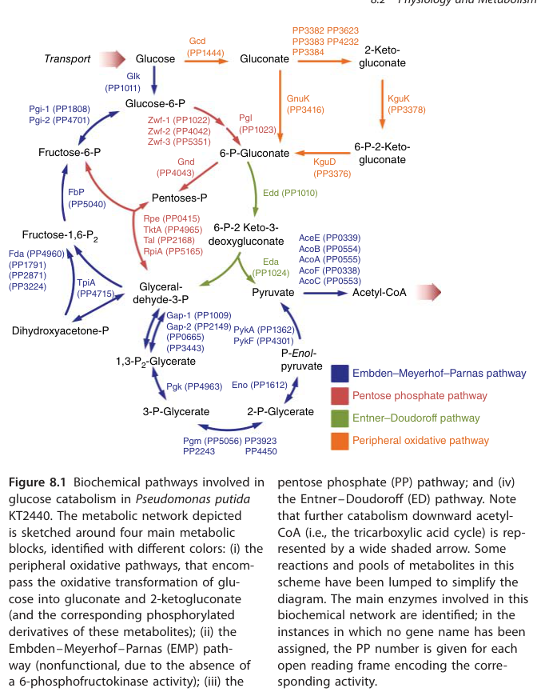

## Question

# Gene Research for Functional Annotation

## ⚠️ CRITICAL: Gene/Protein Identification Context

**BEFORE YOU BEGIN RESEARCH:** You MUST verify you are researching the CORRECT gene/protein. Gene symbols can be ambiguous, especially for less well-characterized genes from non-model organisms.

### Target Gene/Protein Identity (from UniProt):
- **UniProt Accession:** Q88D64
- **Protein Description:** RecName: Full=Phosphoglycerate kinase {ECO:0000255|HAMAP-Rule:MF_00145}; EC=2.7.2.3 {ECO:0000255|HAMAP-Rule:MF_00145};
- **Gene Information:** Name=pgk {ECO:0000255|HAMAP-Rule:MF_00145}; OrderedLocusNames=PP_4963;
- **Organism (full):** Pseudomonas putida (strain ATCC 47054 / DSM 6125 / CFBP 8728 / NCIMB 11950 / KT2440).
- **Protein Family:** Belongs to the phosphoglycerate kinase family.
- **Key Domains:** Phosphoglycerate_kinase. (IPR001576); Phosphoglycerate_kinase_CS. (IPR015911); Phosphoglycerate_kinase_N. (IPR015824); Phosphoglycerate_kinase_sf. (IPR036043); PGK (PF00162)

### MANDATORY VERIFICATION STEPS:

1. **Check if the gene symbol "pgk" matches the protein description above**
2. **Verify the organism is correct:** Pseudomonas putida (strain ATCC 47054 / DSM 6125 / CFBP 8728 / NCIMB 11950 / KT2440).
3. **Check if protein family/domains align with what you find in literature**
4. **If you find literature for a DIFFERENT gene with the same or similar symbol, STOP**

### If Gene Symbol is Ambiguous or You Cannot Find Relevant Literature:

**DO NOT PROCEED WITH RESEARCH ON A DIFFERENT GENE.** Instead:
- State clearly: "The gene symbol 'pgk' is ambiguous or literature is limited for this specific protein"
- Explain what you found (e.g., "Found extensive literature on a different gene with the same symbol in a different organism")
- Describe the protein based ONLY on the UniProt information provided above
- Suggest that the protein function can be inferred from domain/family information

### Research Target:

Please provide a comprehensive research report on the gene **pgk** (gene ID: pgk, UniProt: Q88D64) in PSEPK.

The research report should be a detailed narrative explaining the function, biological processes, and localization of the gene product. Citations should be given for all claims.

You should prioritize authoritative reviews and primary scientific literature when conducting research. You can supplement
this with annotations you find in gene/protein databases, but these can be outdated or inaccurate.

We are specifically interested in the primary function of the gene - for enzymes, what reaction is catalyzed, and what is the substrate specificity? For transporters, what is the substrate? For structural proteins or adapters, what is the broader structural role? For signaling molecules, what is the role in the pathway.

We are interested in where in or outside the cell the gene product carries out its function.

We are also interested in the signaling or biochemical pathways in which the gene functions. We are less interested in broad pleiotropic effects, except where these elucidate the precise role.

Include evidence where possible. We are interested in both experimental evidence as well as inference from structure, evolution, or bioinformatic analysis. Precise studies should be prioritized over high-throughput, where available.

## Output

Question: You are an expert researcher providing comprehensive, well-cited information.

Provide detailed information focusing on:
1. Key concepts and definitions with current understanding
2. Recent developments and latest research (prioritize 2023-2024 sources)
3. Current applications and real-world implementations
4. Expert opinions and analysis from authoritative sources
5. Relevant statistics and data from recent studies

Format as a comprehensive research report with proper citations. Include URLs and publication dates where available.
Always prioritize recent, authoritative sources and provide specific citations for all major claims.

# Gene Research for Functional Annotation

## ⚠️ CRITICAL: Gene/Protein Identification Context

**BEFORE YOU BEGIN RESEARCH:** You MUST verify you are researching the CORRECT gene/protein. Gene symbols can be ambiguous, especially for less well-characterized genes from non-model organisms.

### Target Gene/Protein Identity (from UniProt):
- **UniProt Accession:** Q88D64
- **Protein Description:** RecName: Full=Phosphoglycerate kinase {ECO:0000255|HAMAP-Rule:MF_00145}; EC=2.7.2.3 {ECO:0000255|HAMAP-Rule:MF_00145};
- **Gene Information:** Name=pgk {ECO:0000255|HAMAP-Rule:MF_00145}; OrderedLocusNames=PP_4963;
- **Organism (full):** Pseudomonas putida (strain ATCC 47054 / DSM 6125 / CFBP 8728 / NCIMB 11950 / KT2440).
- **Protein Family:** Belongs to the phosphoglycerate kinase family.
- **Key Domains:** Phosphoglycerate_kinase. (IPR001576); Phosphoglycerate_kinase_CS. (IPR015911); Phosphoglycerate_kinase_N. (IPR015824); Phosphoglycerate_kinase_sf. (IPR036043); PGK (PF00162)

### MANDATORY VERIFICATION STEPS:

1. **Check if the gene symbol "pgk" matches the protein description above**
2. **Verify the organism is correct:** Pseudomonas putida (strain ATCC 47054 / DSM 6125 / CFBP 8728 / NCIMB 11950 / KT2440).
3. **Check if protein family/domains align with what you find in literature**
4. **If you find literature for a DIFFERENT gene with the same or similar symbol, STOP**

### If Gene Symbol is Ambiguous or You Cannot Find Relevant Literature:

**DO NOT PROCEED WITH RESEARCH ON A DIFFERENT GENE.** Instead:
- State clearly: "The gene symbol 'pgk' is ambiguous or literature is limited for this specific protein"
- Explain what you found (e.g., "Found extensive literature on a different gene with the same symbol in a different organism")
- Describe the protein based ONLY on the UniProt information provided above
- Suggest that the protein function can be inferred from domain/family information

### Research Target:

Please provide a comprehensive research report on the gene **pgk** (gene ID: pgk, UniProt: Q88D64) in PSEPK.

The research report should be a detailed narrative explaining the function, biological processes, and localization of the gene product. Citations should be given for all claims.

You should prioritize authoritative reviews and primary scientific literature when conducting research. You can supplement
this with annotations you find in gene/protein databases, but these can be outdated or inaccurate.

We are specifically interested in the primary function of the gene - for enzymes, what reaction is catalyzed, and what is the substrate specificity? For transporters, what is the substrate? For structural proteins or adapters, what is the broader structural role? For signaling molecules, what is the role in the pathway.

We are interested in where in or outside the cell the gene product carries out its function.

We are also interested in the signaling or biochemical pathways in which the gene functions. We are less interested in broad pleiotropic effects, except where these elucidate the precise role.

Include evidence where possible. We are interested in both experimental evidence as well as inference from structure, evolution, or bioinformatic analysis. Precise studies should be prioritized over high-throughput, where available.

## Research report: **pgk** (PP_4963; UniProt Q88D64) in *Pseudomonas putida* KT2440

### 0) Target verification (critical identity check)
The target gene symbol **pgk** in *Pseudomonas putida* KT2440 is explicitly annotated as **phosphoglycerate kinase** with locus tag **PP_4963** in a KT2440 central carbon metabolism map, matching the provided UniProt identity (Q88D64; PGK family). Pgk is placed at the **1,3-bisphosphoglycerate ↔ 3-phosphoglycerate** step (canonical PGK step) in the pathway diagram for KT2440. (poblete‐castro2017hostorganismpseudomonas pages 1-3, poblete‐castro2017hostorganismpseudomonas media daeb7766)

### 1) Key concepts, definitions, and current understanding

#### 1.1 Enzyme identity and primary biochemical function
**Phosphoglycerate kinase (PGK; EC 2.7.2.3)** is a conserved, typically ~45 kDa enzyme that catalyzes a reversible phosphoryl-transfer reaction between the triose-derived acyl-phosphate metabolite **1,3-bisphosphoglycerate (1,3-BPG)** and **ADP**:

- **1,3-BPG + ADP ⇌ 3-phosphoglycerate (3-PG) + ATP**

In the **glycolytic direction**, PGK performs **substrate-level phosphorylation** to produce ATP. In the **gluconeogenic direction**, it runs in reverse to generate 1,3-BPG for upstream biosynthesis. (serimbetov2018thestructureand pages 56-63, rojaspirela2020phosphoglyceratekinasestructural pages 4-5)

#### 1.2 Substrate specificity
Across organisms, the canonical PGK reaction couples **adenine nucleotide (ADP/ATP)** chemistry with the phosphorylated glycerate intermediates **1,3-BPG/3-PG**. The available KT2440-focused excerpts do not report organism-specific deviations in substrate specificity for Pgk (PP_4963); thus, functional annotation is best supported by strong family conservation and the pathway placement of Pgk at the 1,3-BPG ↔ 3-PG step. (poblete‐castro2017hostorganismpseudomonas pages 1-3, poblete‐castro2017hostorganismpseudomonas media daeb7766, rojaspirela2020phosphoglyceratekinasestructural pages 4-5)

#### 1.3 Mechanism and structural determinants (expert-level current view)
PGK is a classic **two-domain hinge-bending enzyme**:

- **Architecture:** two Rossmann-like α/β domains separated by a cleft; the **N-terminal domain** binds 3-PG/1,3-BPG and the **C-terminal domain** binds MgADP/MgATP. (serimbetov2018thestructureand pages 26-32, rojaspirela2020phosphoglyceratekinasestructural pages 4-5)
- **Catalytic motion:** catalysis requires large **domain closure**, reported as ~**56°** hinge rotation, bringing substrates from ~**16 Å** apart to ~**4 Å**, and PGK spends only ~**7%** of its time in a fully closed conformation during turnover. (serimbetov2018thestructureand pages 26-32)
- **Electrostatics/transition-state stabilization:** **Mg2+** coordination is central to activity, helping shield negative charge and stabilize the phosphoryl-transfer transition state; conserved basic residues in the N-terminal “basic patch” contribute to binding/stabilization of the phosphorylated glycerate substrate. (rojaspirela2020phosphoglyceratekinasestructural pages 7-8)

These properties provide a mechanistic basis for functional inference for Pgk (PP_4963) in *P. putida* KT2440.

### 2) *P. putida* KT2440 pathway context: biological processes and where Pgk acts

#### 2.1 Central carbon metabolism in KT2440: incomplete EMP and strong ED/peripheral oxidation
A key systems-level fact in KT2440 is that the classical Embden–Meyerhof–Parnas (EMP) glycolytic route is **incomplete in the forward glycolytic direction** because KT2440 lacks **6-phosphofructokinase (Pfk)**, rendering the EMP glycolytic pathway nonfunctional as a full glucose-to-pyruvate route. (poblete‐castro2017hostorganismpseudomonas pages 1-3)

Accordingly, KT2440 glucose catabolism heavily relies on:
- **Peripheral periplasmic oxidation** (e.g., glucose → gluconate; gluconate → 2-ketogluconate), and
- **Entner–Doudoroff (ED)** and pentose phosphate (PP) pathway connections. (poblete‐castro2017hostorganismpseudomonas pages 1-3, chen2024gnurrepressesthe pages 1-3)

Within this architecture, **Pgk (PP_4963)** is still present and positioned in the **lower part of the EMP / gluconeogenesis module** at the 1,3-BPG ↔ 3-PG step (Figure evidence). (poblete‐castro2017hostorganismpseudomonas pages 1-3, poblete‐castro2017hostorganismpseudomonas media daeb7766)

#### 2.2 Biological process interpretation
Given its reaction, Pgk contributes to:
- **Energy metabolism** via substrate-level phosphorylation (ATP generation when operating in the glycolytic direction) and
- **Gluconeogenic biosynthesis** via reverse flux to produce 1,3-BPG when building upper glycolytic intermediates. (serimbetov2018thestructureand pages 56-63, rojaspirela2020phosphoglyceratekinasestructural pages 4-5)

In KT2440 specifically, because glucose flux preferentially enters via periplasmic oxidation and ED (and EMP is incomplete in the forward direction), Pgk’s physiological importance is best viewed as supporting **lower-glycolysis segment function, energy balance, and gluconeogenic flux** rather than supporting a full canonical EMP glycolysis. (poblete‐castro2017hostorganismpseudomonas pages 1-3, chen2024gnurrepressesthe pages 1-3)

### 3) Cellular localization: where the Pgk protein acts
Pgk is depicted as part of the **intracellular central carbon network** (lower glycolysis/gluconeogenesis) in KT2440 pathway maps. The periplasmic oxidation steps (glucose→gluconate→2-ketogluconate) are explicitly distinguished as periplasmic processes in KT2440-focused discussions, while Pgk sits in the cytosolic/lower central carbon portion of the network. However, the retrieved excerpts do not provide a direct experimental localization assay for Pgk; thus, localization is inferred from metabolic role and pathway compartmentation presented in the KT2440 pathway map. (poblete‐castro2017hostorganismpseudomonas pages 1-3, poblete‐castro2017hostorganismpseudomonas media daeb7766, chen2024gnurrepressesthe pages 1-3)

### 4) Gene-specific evidence in *P. putida* KT2440: expression and proteomics

#### 4.1 Transcriptomics (direct Pgk/PP_4963 measurement)
In transcriptome profiling connected to PHA-oriented metabolic engineering, **Pgk (PP4963)** is listed under “glycolysis/gluconeogenesis” and shows **fold-change ~1.0** and **1.1** in two engineered strains versus wild type, i.e., Pgk transcription was essentially unchanged in those genetic backgrounds/conditions. (pobletecastro2013insilicodrivenmetabolicengineering pages 6-7)

#### 4.2 Proteomics under anoxic bioelectrochemical conditions
In a bioelectrochemical system (BES) study of anoxic electrode-driven **fructose** catabolism, proteomics detected 2,377 proteins (~43.5% of predicted ORFs). Many glycolytic enzymes were downregulated, while proteins of **lower central carbon metabolism** generally increased; however, the authors explicitly list **phosphoglycerate kinase (Pgk)** among a small set of **exceptions** at peak current—implying Pgk was **not significantly upregulated** (using fold-change ≥2 and p ≤ 0.05) in that condition/time point. (nguyen2021theanoxicelectrode‐driven pages 4-5)

Interpretation: Pgk appears to be a “stable core” enzyme in some contexts (transcriptome unchanged in certain engineered strains; not strongly induced in BES fructose proteomics), consistent with its role as a conserved housekeeping enzyme in central metabolism, though the exact regulation may be condition-specific.

### 5) Recent developments (2023–2024 prioritized): regulation, fluxes, and electrogenic applications

#### 5.1 Regulatory discoveries controlling upstream supply to the Pgk-containing lower network (2024)
A 2024 study dissected regulation of glucose/gluconate catabolism in KT2440 and defined the **GnuR regulon**, reporting that **GnuR directly represses genes involved in the ED pathway and peripheral glucose/gluconate metabolism**, and proposing an incoherent feedforward regulatory motif. (chen2024gnurrepressesthe pages 1-3)

This matters for Pgk functional context because the ED/peripheral modules determine carbon flow into the lower central carbon “trunk” where Pgk resides, especially in a bacterium with incomplete forward EMP. (chen2024gnurrepressesthe pages 1-3)

Quantitative pathway split reported in this work underscores the peripheral bias:
- ~**90%** of periplasmic glucose is oxidized to **gluconate**,
- ~**10%** is transported directly into the cytoplasm,
- ~**11%** of periplasmic gluconate is oxidized to **2-ketogluconate**. (chen2024gnurrepressesthe pages 1-3)

#### 5.2 Fluxomics and energy accounting under electrogenic/anoxic conditions (2024)
A 2024 BES study quantified central carbon fluxes and ATP generation under electrogenic conditions (WT and uptake-route mutants). Key quantitative results include:
- Estimated maximum ATP generation in WT: **147 μmol ATP·gCDW⁻1·h⁻1**.
- Very low ED flux to pyruvate under BES: **3.4, 6.5, 3.9 μmol·gCDW⁻1·h⁻1** (WT, KT-GL, KT-KG).
- Acetate production ~**8–14 μmol·gCDW⁻1·h⁻1**.
- Acetate 13C-enrichment (SFL) ~**26%–50%** depending on strain.
This study explicitly frames **substrate-level phosphorylation “at the level of phosphoglycerate and pyruvate kinase”** as central to ATP supply, directly implicating the PGK step conceptually in the energy balance even when gene-level Pgk values are not reported. (pause2024anaerobicglucoseuptake pages 9-11)

#### 5.3 Real-world implementation: electrogenic bioproduction of 2-ketogluconate (2KG) (2024)
Multi-omics and metabolic engineering studies in 2024 show KT2440 can sustain long-term metabolic activity in an anoxic BES, oxidizing glucose predominantly in the periplasm and producing valuable oxidized sugars (notably **2-ketogluconate**). (weimer2024systemsbiologyof pages 1-2)

Quantitative engineering outcomes reported include:
- **Acetate pathway deletions** (e.g., ΔaldBI ΔaldBII) reduced acetate by ~**80%**, doubled glucose conversion with complete consumption in ~**200 h**, and achieved **2KG yield = 0.96 mol·mol⁻1 (glucose)** with minimal gluconate accumulation. (weimer2024systemsmetabolicengineering pages 79-83, weimer2024systemsmetabolicengineeringa pages 79-83)
- In peer-reviewed multi-omics reporting, the best mutant produced 2KG nearly **twice as fast** and with **fivefold less acetate**, also reporting **0.96 mol·mol⁻1** yield. (weimer2024systemsbiologyof pages 12-14)
- **OprF overexpression** improved BES performance: early current **1.0 mA vs 0.44 mA**, glucose consumption **0.089 vs 0.048 mM·h⁻1**, peak current **2.83 vs 1.93 mA**, and gluconate accumulation rate **0.051 vs 0.015 mM·h⁻1 (3.5-fold)** before gluconate re-consumption and 2KG predominance. (weimer2024systemsmetabolicengineering pages 101-105)

Relevance to Pgk: these implementations highlight that KT2440’s productivity under anoxic electrogenic conditions depends on how carbon is routed through peripheral oxidation/ED and how ATP is balanced between respiration and substrate-level phosphorylation steps that include the Pgk reaction. (pause2024anaerobicglucoseuptake pages 9-11, chen2024gnurrepressesthe pages 1-3)

### 6) Expert synthesis and functional annotation for Pgk (PP_4963)

#### 6.1 Most defensible functional statement
Based on direct KT2440 pathway annotation and strong enzyme-family conservation, the primary function of **Pgk (PP_4963; UniProt Q88D64)** in *P. putida* KT2440 is:

- **Catalyze the reversible phosphoryl transfer between 1,3-bisphosphoglycerate and ADP to produce 3-phosphoglycerate and ATP (and the reverse in gluconeogenesis)**, contributing to substrate-level phosphorylation and supporting central carbon flux in the lower glycolysis/gluconeogenesis segment. (poblete‐castro2017hostorganismpseudomonas pages 1-3, poblete‐castro2017hostorganismpseudomonas media daeb7766, serimbetov2018thestructureand pages 56-63, rojaspirela2020phosphoglyceratekinasestructural pages 4-5)

#### 6.2 Pathway placement and physiological framing in KT2440
In KT2440, Pgk should be annotated within **central carbon metabolism (lower glycolysis / gluconeogenesis)**, with an explicit note that:
- KT2440’s forward EMP is incomplete due to missing Pfk, and carbon commonly enters the central network through **peripheral oxidation and ED**, not through a canonical full glycolysis chain. (poblete‐castro2017hostorganismpseudomonas pages 1-3, chen2024gnurrepressesthe pages 1-3)

#### 6.3 Regulation and condition dependence
Available evidence suggests pgk may not be among the most dynamically regulated central enzymes under certain perturbations:
- Transcript levels ~unchanged in some engineered strains (fold-change ~1.0–1.1). (pobletecastro2013insilicodrivenmetabolicengineering pages 6-7)
- In BES fructose proteomics, Pgk is mentioned as an “exception” to the general upregulation of lower central carbon proteins at peak current, implying it was not significantly induced (FC ≥2). (nguyen2021theanoxicelectrode‐driven pages 4-5)

This pattern is consistent with Pgk functioning as a **housekeeping enzyme** whose control may occur more through substrate availability, allostery, and network-level flux partitioning than through large transcriptional swings (though this conclusion should be treated as provisional because it is drawn from limited contexts and the evidence does not provide Pgk-specific fold changes in proteomics). (nguyen2021theanoxicelectrode‐driven pages 4-5)

### 7) Evidence map (high-value summary table)
The following table compiles the most directly relevant, citable evidence for identity, function, pathway context, and quantitative findings.

| Item | Evidence summary | Source (with citation id) | Publication (author year) | URL if present |
|---|---|---|---|---|
| Verified identity | In *Pseudomonas putida* KT2440, Pgk is explicitly annotated as phosphoglycerate kinase with locus tag PP_4963, matching the target gene/protein identity (UniProt Q88D64; gene **pgk**). It is shown in the central carbon pathway map as Pgk (PP_4963). | Pathway figure and text annotation (poblete‐castro2017hostorganismpseudomonas pages 1-3, poblete‐castro2017hostorganismpseudomonas media daeb7766) | Poblete-Castro et al. 2017 | https://doi.org/10.1002/9783527807796.ch8 |
| Enzymatic reaction and pathway role | PGK (EC 2.7.2.3) catalyzes the reversible reaction **1,3-bisphosphoglycerate + ADP ⇌ 3-phosphoglycerate + ATP**. In glycolysis it performs substrate-level phosphorylation to generate ATP; in gluconeogenesis it runs in reverse to form 1,3-bisphosphoglycerate. | Mechanistic/structural reviews and bacterial metabolism reference (serimbetov2018thestructureand pages 56-63, rojaspirela2020phosphoglyceratekinasestructural pages 4-5) | Serimbetov 2018; Rojas-Pirela et al. 2020 | https://doi.org/10.1098/rsob.200302 |
| Structural/mechanistic features | PGK is typically a ~45 kDa monomer with two Rossmann-like α/β domains separated by a cleft; the N-domain binds 3PG/1,3-BPG and the C-domain binds ADP/ATP. Catalysis requires hinge-bending domain closure that brings substrates from ~16 Å to ~4 Å proximity. Mg2+ is required to coordinate nucleotide phosphates and stabilize the charged transition state during direct phosphoryl transfer. | Structural analyses (rojaspirela2020phosphoglyceratekinasestructural pages 7-8, serimbetov2018thestructureand pages 26-32, rojaspirela2020phosphoglyceratekinasestructural pages 8-9) | Rojas-Pirela et al. 2020; Serimbetov 2018 | https://doi.org/10.1098/rsob.200302 |
| Organism-specific pathway context | Although Pgk is present, *P. putida* KT2440 lacks 6-phosphofructokinase, so the Embden-Meyerhof-Parnas (EMP) pathway is incomplete/nonfunctional in the glycolytic direction. KT2440 relies heavily on peripheral oxidative glucose metabolism and the Entner-Doudoroff pathway; Pgk therefore operates as part of lower glycolysis/gluconeogenesis rather than a full classical EMP glycolysis. | KT2440 pathway map and regulatory review excerpts (poblete‐castro2017hostorganismpseudomonas pages 1-3, chen2024gnurrepressesthe pages 1-3) | Poblete-Castro et al. 2017; Chen et al. 2024 | https://doi.org/10.1002/9783527807796.ch8; https://doi.org/10.1111/1751-7915.70059 |
| Pgk expression data | In transcriptome profiling of engineered *P. putida* strains for PHA production, **Pgk (PP4963)** showed minimal change: fold change **1.0** in Δgcd and **1.1** in Δgcd-pgl versus wild type, consistent with the authors’ conclusion that central metabolic pathway genes were “rather unaffected.” | Table 3 transcript data (pobletecastro2013insilicodrivenmetabolicengineering pages 6-7) | Poblete-Castro et al. 2013 | https://doi.org/10.1016/j.ymben.2012.10.004 |
| Quantitative physiology: glucose oxidation bias | In KT2440, most periplasmic glucose is oxidized to gluconate (**~90%**) and a smaller fraction to 2-ketogluconate (**~11%**), underscoring the dominance of peripheral oxidation over classical glycolysis. | Regulatory/pathway analysis excerpt (chen2024gnurrepressesthe pages 1-3) | Chen et al. 2024 | https://doi.org/10.1111/1751-7915.70059 |
| Quantitative physiology: electrogenic bioproduction | In an anoxic bioelectrochemical system, engineered *P. putida* mutants with reduced acetate formation improved 2-ketogluconate production; the best mutant reached a **2KG yield of 0.96 mol/mol glucose** and, in one report, accumulated 2KG at roughly **twice the wild-type rate**. | Multi-omics/electrogenic studies (weimer2024systemsbiologyof pages 12-14, weimer2024systemsbiologyof pages 1-2) | Weimer et al. 2024 | https://doi.org/10.1186/s12934-024-02509-8 |
| Quantitative physiology: carbon sourcing under anoxic electrogenesis | ^13C tracing showed acetate had **single-fraction labeling (SFL) 39.4%**, indicating only part of acetate originated from glucose and a substantial fraction came from biomass/lipid turnover; this supports major remodeling around acetyl-CoA rather than Pgk-specific regulation. | ^13C-metabolic analysis (weimer2024systemsmetabolicengineering pages 65-69, weimer2024systemsbiologyof pages 10-12) | Weimer et al. 2024 | https://doi.org/10.1186/s12934-024-02509-8 |
| Quantitative physiology: energy status | Under anoxic electrogenic conditions, KT2440 maintained an **adenylate energy charge (AEC) of 0.52 ± 0.01** despite reduced ATP, consistent with large-scale energy-conserving remodeling of central metabolism. | Multi-omics physiology excerpt (weimer2024systemsbiologyof pages 10-12) | Weimer et al. 2024 | https://doi.org/10.1186/s12934-024-02509-8 |
| Evidence gap specific to Pgk | Recent 2023–2024 *P. putida* systems studies discuss lower glycolytic ATP formation “at the level of phosphoglycerate and pyruvate kinase” and broad central carbon remodeling, but the provided excerpts do **not** report Pgk-specific proteomic abundances, fluxes, or mutant phenotypes for PP_4963. | BES flux/omics excerpts (pause2024anaerobicglucoseuptake pages 9-11, weimer2024systemsbiologyof pages 12-14, weimer2024systemsbiologyof pages 1-2) | Pause et al. 2024; Weimer et al. 2024 | https://doi.org/10.1111/1751-7915.14375; https://doi.org/10.1186/s12934-024-02509-8 |

*Table: This table compiles the verified identity, biochemical role, mechanistic features, pathway context, and key quantitative findings relevant to Pgk (PP_4963; UniProt Q88D64) in *Pseudomonas putida* KT2440. It is useful as a compact evidence map distinguishing direct Pgk-specific evidence from broader central-metabolism context.*

### 8) Key evidence gaps and what remains unresolved
- **Pgk-specific kinetics in *P. putida* KT2440** (Km/kcat for 1,3-BPG, 3-PG, ADP/ATP; metal dependence) were not found in the retrieved sources; structural/mechanistic parameters used here come from general PGK literature. (rojaspirela2020phosphoglyceratekinasestructural pages 7-8, serimbetov2018thestructureand pages 26-32)
- **Direct localization assays** (e.g., fractionation, fluorescent fusions) for Pgk (PP_4963) were not present in the retrieved excerpts; cytosolic action is inferred from pathway context. (poblete‐castro2017hostorganismpseudomonas media daeb7766, chen2024gnurrepressesthe pages 1-3)
- **Gene essentiality** for pgk/PP_4963 in KT2440 was not obtained from accessible transposon/essentiality datasets in this run.

### 9) References (URLs and publication dates)
- Poblete-Castro et al. “Host organism: *Pseudomonas putida*.” (Nov 2017). https://doi.org/10.1002/9783527807796.ch8 (poblete‐castro2017hostorganismpseudomonas pages 1-3, poblete‐castro2017hostorganismpseudomonas media daeb7766)
- Poblete-Castro et al. “In-silico-driven metabolic engineering of *Pseudomonas putida* for enhanced production of PHAs.” *Metabolic Engineering* (Jan 2013). https://doi.org/10.1016/j.ymben.2012.10.004 (pobletecastro2013insilicodrivenmetabolicengineering pages 6-7)
- Rojas-Pirela et al. “Phosphoglycerate kinase: structural aspects and functions…” *Open Biology* (Nov 2020). https://doi.org/10.1098/rsob.200302 (rojaspirela2020phosphoglyceratekinasestructural pages 7-8, rojaspirela2020phosphoglyceratekinasestructural pages 8-9, rojaspirela2020phosphoglyceratekinasestructural pages 4-5)
- Nguyen et al. “The anoxic electrode-driven fructose catabolism of *P. putida* KT2440.” *Microbial Biotechnology* (Jun 2021). https://doi.org/10.1111/1751-7915.13862 (nguyen2021theanoxicelectrode‐driven pages 4-5)
- Chen et al. “GnuR represses the expression of glucose and gluconate catabolism in *P. putida* KT2440.” *Microbial Biotechnology* (Nov 2024). https://doi.org/10.1111/1751-7915.70059 (chen2024gnurrepressesthe pages 1-3)
- Pause et al. “Anaerobic glucose uptake in *P. putida* KT2440 in a bioelectrochemical system.” *Microbial Biotechnology* (Nov 2024). https://doi.org/10.1111/1751-7915.14375 (pause2024anaerobicglucoseuptake pages 9-11)
- Weimer et al. “Systems biology of electrogenic *Pseudomonas putida*… for enhanced 2-ketogluconate production.” *Microbial Cell Factories* (Sep 2024). https://doi.org/10.1186/s12934-024-02509-8 (weimer2024systemsbiologyof pages 1-2, weimer2024systemsbiologyof pages 12-14)

References

1. (poblete‐castro2017hostorganismpseudomonas pages 1-3): Ignacio Poblete‐Castro, José M. Borrero‐de Acuña, Pablo I. Nikel, Michael Kohlstedt, and Christoph Wittmann. Host organism: pseudomonas putida. ArXiv, pages 299-326, Nov 2017. URL: https://doi.org/10.1002/9783527807796.ch8, doi:10.1002/9783527807796.ch8. This article has 49 citations.

2. (poblete‐castro2017hostorganismpseudomonas media daeb7766): Ignacio Poblete‐Castro, José M. Borrero‐de Acuña, Pablo I. Nikel, Michael Kohlstedt, and Christoph Wittmann. Host organism: pseudomonas putida. ArXiv, pages 299-326, Nov 2017. URL: https://doi.org/10.1002/9783527807796.ch8, doi:10.1002/9783527807796.ch8. This article has 49 citations.

3. (serimbetov2018thestructureand pages 56-63): Z Serimbetov. The structure and dynamics of phosphoglycerate kinase along its catalytic cycle. Unknown journal, 2018.

4. (rojaspirela2020phosphoglyceratekinasestructural pages 4-5): Maura Rojas-Pirela, Diego Andrade-Alviárez, Verónica Rojas, Ulrike Kemmerling, Ana J. Cáceres, Paul A. Michels, Juan Luis Concepción, and Wilfredo Quiñones. Phosphoglycerate kinase: structural aspects and functions, with special emphasis on the enzyme from kinetoplastea. Open Biology, Nov 2020. URL: https://doi.org/10.1098/rsob.200302, doi:10.1098/rsob.200302. This article has 91 citations and is from a peer-reviewed journal.

5. (serimbetov2018thestructureand pages 26-32): Z Serimbetov. The structure and dynamics of phosphoglycerate kinase along its catalytic cycle. Unknown journal, 2018.

6. (rojaspirela2020phosphoglyceratekinasestructural pages 7-8): Maura Rojas-Pirela, Diego Andrade-Alviárez, Verónica Rojas, Ulrike Kemmerling, Ana J. Cáceres, Paul A. Michels, Juan Luis Concepción, and Wilfredo Quiñones. Phosphoglycerate kinase: structural aspects and functions, with special emphasis on the enzyme from kinetoplastea. Open Biology, Nov 2020. URL: https://doi.org/10.1098/rsob.200302, doi:10.1098/rsob.200302. This article has 91 citations and is from a peer-reviewed journal.

7. (chen2024gnurrepressesthe pages 1-3): Wenbo Chen, Rao Ma, Yong Feng, Yunzhu Xiao, Agnieszka Sekowska, Antoine Danchin, and Conghui You. Gnur represses the expression of glucose and gluconate catabolism in pseudomonas putida kt2440. Microbial Biotechnology, Nov 2024. URL: https://doi.org/10.1111/1751-7915.70059, doi:10.1111/1751-7915.70059. This article has 2 citations and is from a peer-reviewed journal.

8. (pobletecastro2013insilicodrivenmetabolicengineering pages 6-7): Ignacio Poblete-Castro, Danielle Binger, Andre Rodrigues, Judith Becker, Vitor A.P. Martins dos Santos, and Christoph Wittmann. In-silico-driven metabolic engineering of pseudomonas putida for enhanced production of poly-hydroxyalkanoates. Metabolic engineering, 15:113-23, Jan 2013. URL: https://doi.org/10.1016/j.ymben.2012.10.004, doi:10.1016/j.ymben.2012.10.004. This article has 205 citations and is from a domain leading peer-reviewed journal.

9. (nguyen2021theanoxicelectrode‐driven pages 4-5): Anh Vu Nguyen, Bin Lai, Lorenz Adrian, and Jens O. Krömer. The anoxic electrode‐driven fructose catabolism of pseudomonas putida kt2440. Microbial Biotechnology, 14:1784-1796, Jun 2021. URL: https://doi.org/10.1111/1751-7915.13862, doi:10.1111/1751-7915.13862. This article has 13 citations and is from a peer-reviewed journal.

10. (pause2024anaerobicglucoseuptake pages 9-11): Laura Pause, Anna Weimer, Nicolas T. Wirth, Anh Vu Nguyen, Claudius Lenz, Michael Kohlstedt, Christoph Wittmann, Pablo I. Nikel, Bin Lai, and Jens O. Krömer. Anaerobic glucose uptake in pseudomonas putida kt2440 in a bioelectrochemical system. Microbial Biotechnology, Nov 2024. URL: https://doi.org/10.1111/1751-7915.14375, doi:10.1111/1751-7915.14375. This article has 11 citations and is from a peer-reviewed journal.

11. (weimer2024systemsbiologyof pages 1-2): Anna Weimer, Laura Pause, Fabian Ries, Michael Kohlstedt, Lorenz Adrian, Jens Krömer, Bin Lai, and Christoph Wittmann. Systems biology of electrogenic pseudomonas putida - multi-omics insights and metabolic engineering for enhanced 2-ketogluconate production. Microbial Cell Factories, Sep 2024. URL: https://doi.org/10.1186/s12934-024-02509-8, doi:10.1186/s12934-024-02509-8. This article has 7 citations and is from a peer-reviewed journal.

12. (weimer2024systemsmetabolicengineering pages 79-83): ALA Weimer. Systems metabolic engineering of electrogenic anaerobic pseudomonas putida for enhanced 2-ketogluconate production. Unknown journal, 2024.

13. (weimer2024systemsmetabolicengineeringa pages 79-83): ALA Weimer. Systems metabolic engineering of electrogenic anaerobic pseudomonas putida for enhanced 2-ketogluconate production. Unknown journal, 2024.

14. (weimer2024systemsbiologyof pages 12-14): Anna Weimer, Laura Pause, Fabian Ries, Michael Kohlstedt, Lorenz Adrian, Jens Krömer, Bin Lai, and Christoph Wittmann. Systems biology of electrogenic pseudomonas putida - multi-omics insights and metabolic engineering for enhanced 2-ketogluconate production. Microbial Cell Factories, Sep 2024. URL: https://doi.org/10.1186/s12934-024-02509-8, doi:10.1186/s12934-024-02509-8. This article has 7 citations and is from a peer-reviewed journal.

15. (weimer2024systemsmetabolicengineering pages 101-105): ALA Weimer. Systems metabolic engineering of electrogenic anaerobic pseudomonas putida for enhanced 2-ketogluconate production. Unknown journal, 2024.

16. (rojaspirela2020phosphoglyceratekinasestructural pages 8-9): Maura Rojas-Pirela, Diego Andrade-Alviárez, Verónica Rojas, Ulrike Kemmerling, Ana J. Cáceres, Paul A. Michels, Juan Luis Concepción, and Wilfredo Quiñones. Phosphoglycerate kinase: structural aspects and functions, with special emphasis on the enzyme from kinetoplastea. Open Biology, Nov 2020. URL: https://doi.org/10.1098/rsob.200302, doi:10.1098/rsob.200302. This article has 91 citations and is from a peer-reviewed journal.

17. (weimer2024systemsmetabolicengineering pages 65-69): ALA Weimer. Systems metabolic engineering of electrogenic anaerobic pseudomonas putida for enhanced 2-ketogluconate production. Unknown journal, 2024.

18. (weimer2024systemsbiologyof pages 10-12): Anna Weimer, Laura Pause, Fabian Ries, Michael Kohlstedt, Lorenz Adrian, Jens Krömer, Bin Lai, and Christoph Wittmann. Systems biology of electrogenic pseudomonas putida - multi-omics insights and metabolic engineering for enhanced 2-ketogluconate production. Microbial Cell Factories, Sep 2024. URL: https://doi.org/10.1186/s12934-024-02509-8, doi:10.1186/s12934-024-02509-8. This article has 7 citations and is from a peer-reviewed journal.

## Artifacts

- [Edison artifact artifact-00](pgk-deep-research-falcon_artifacts/artifact-00.md)

## Citations

1. serimbetov2018thestructureand pages 26-32
2. rojaspirela2020phosphoglyceratekinasestructural pages 7-8
3. pobletecastro2013insilicodrivenmetabolicengineering pages 6-7
4. chen2024gnurrepressesthe pages 1-3
5. pause2024anaerobicglucoseuptake pages 9-11
6. weimer2024systemsbiologyof pages 1-2
7. weimer2024systemsbiologyof pages 12-14
8. weimer2024systemsmetabolicengineering pages 101-105
9. weimer2024systemsbiologyof pages 10-12
10. serimbetov2018thestructureand pages 56-63
11. rojaspirela2020phosphoglyceratekinasestructural pages 4-5
12. weimer2024systemsmetabolicengineering pages 79-83
13. weimer2024systemsmetabolicengineeringa pages 79-83
14. rojaspirela2020phosphoglyceratekinasestructural pages 8-9
15. weimer2024systemsmetabolicengineering pages 65-69
16. https://doi.org/10.1002/9783527807796.ch8
17. https://doi.org/10.1098/rsob.200302
18. https://doi.org/10.1002/9783527807796.ch8;
19. https://doi.org/10.1111/1751-7915.70059
20. https://doi.org/10.1016/j.ymben.2012.10.004
21. https://doi.org/10.1186/s12934-024-02509-8
22. https://doi.org/10.1111/1751-7915.14375;
23. https://doi.org/10.1111/1751-7915.13862
24. https://doi.org/10.1111/1751-7915.14375
25. https://doi.org/10.1002/9783527807796.ch8,
26. https://doi.org/10.1098/rsob.200302,
27. https://doi.org/10.1111/1751-7915.70059,
28. https://doi.org/10.1016/j.ymben.2012.10.004,
29. https://doi.org/10.1111/1751-7915.13862,
30. https://doi.org/10.1111/1751-7915.14375,
31. https://doi.org/10.1186/s12934-024-02509-8,