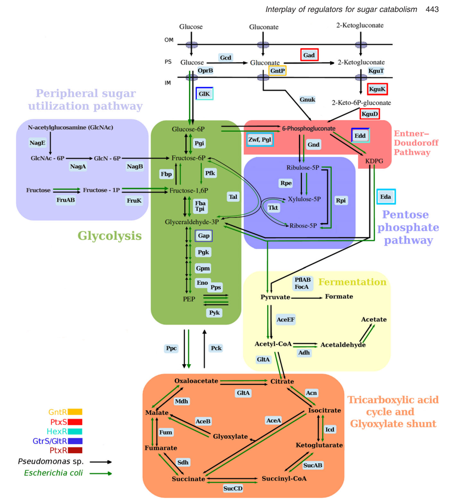

## Question

# Gene Research for Functional Annotation

## ⚠️ CRITICAL: Gene/Protein Identification Context

**BEFORE YOU BEGIN RESEARCH:** You MUST verify you are researching the CORRECT gene/protein. Gene symbols can be ambiguous, especially for less well-characterized genes from non-model organisms.

### Target Gene/Protein Identity (from UniProt):
- **UniProt Accession:** Q88P30
- **Protein Description:** RecName: Full=6-phosphogluconolactonase {ECO:0000256|ARBA:ARBA00020337, ECO:0000256|RuleBase:RU365095}; Short=6PGL {ECO:0000256|RuleBase:RU365095}; EC=3.1.1.31 {ECO:0000256|ARBA:ARBA00013198, ECO:0000256|RuleBase:RU365095};
- **Gene Information:** Name=pgl {ECO:0000256|RuleBase:RU365095, ECO:0000313|EMBL:AAN66648.1}; OrderedLocusNames=PP_1023 {ECO:0000313|EMBL:AAN66648.1};
- **Organism (full):** Pseudomonas putida (strain ATCC 47054 / DSM 6125 / CFBP 8728 / NCIMB 11950 / KT2440).
- **Protein Family:** Belongs to the glucosamine/galactosamine-6-phosphate
- **Key Domains:** 6-phosphogluconolactonase_DevB. (IPR005900); 6PGL. (IPR039104); Glc/Gal-6P_isomerase. (IPR006148); NagB/RpiA_transferase-like. (IPR037171); Glucosamine_iso (PF01182)

### MANDATORY VERIFICATION STEPS:

1. **Check if the gene symbol "pgl" matches the protein description above**
2. **Verify the organism is correct:** Pseudomonas putida (strain ATCC 47054 / DSM 6125 / CFBP 8728 / NCIMB 11950 / KT2440).
3. **Check if protein family/domains align with what you find in literature**
4. **If you find literature for a DIFFERENT gene with the same or similar symbol, STOP**

### If Gene Symbol is Ambiguous or You Cannot Find Relevant Literature:

**DO NOT PROCEED WITH RESEARCH ON A DIFFERENT GENE.** Instead:
- State clearly: "The gene symbol 'pgl' is ambiguous or literature is limited for this specific protein"
- Explain what you found (e.g., "Found extensive literature on a different gene with the same symbol in a different organism")
- Describe the protein based ONLY on the UniProt information provided above
- Suggest that the protein function can be inferred from domain/family information

### Research Target:

Please provide a comprehensive research report on the gene **pgl** (gene ID: pgl, UniProt: Q88P30) in PSEPK.

The research report should be a detailed narrative explaining the function, biological processes, and localization of the gene product. Citations should be given for all claims.

You should prioritize authoritative reviews and primary scientific literature when conducting research. You can supplement
this with annotations you find in gene/protein databases, but these can be outdated or inaccurate.

We are specifically interested in the primary function of the gene - for enzymes, what reaction is catalyzed, and what is the substrate specificity? For transporters, what is the substrate? For structural proteins or adapters, what is the broader structural role? For signaling molecules, what is the role in the pathway.

We are interested in where in or outside the cell the gene product carries out its function.

We are also interested in the signaling or biochemical pathways in which the gene functions. We are less interested in broad pleiotropic effects, except where these elucidate the precise role.

Include evidence where possible. We are interested in both experimental evidence as well as inference from structure, evolution, or bioinformatic analysis. Precise studies should be prioritized over high-throughput, where available.

## Output

Question: You are an expert researcher providing comprehensive, well-cited information.

Provide detailed information focusing on:
1. Key concepts and definitions with current understanding
2. Recent developments and latest research (prioritize 2023-2024 sources)
3. Current applications and real-world implementations
4. Expert opinions and analysis from authoritative sources
5. Relevant statistics and data from recent studies

Format as a comprehensive research report with proper citations. Include URLs and publication dates where available.
Always prioritize recent, authoritative sources and provide specific citations for all major claims.

# Gene Research for Functional Annotation

## ⚠️ CRITICAL: Gene/Protein Identification Context

**BEFORE YOU BEGIN RESEARCH:** You MUST verify you are researching the CORRECT gene/protein. Gene symbols can be ambiguous, especially for less well-characterized genes from non-model organisms.

### Target Gene/Protein Identity (from UniProt):
- **UniProt Accession:** Q88P30
- **Protein Description:** RecName: Full=6-phosphogluconolactonase {ECO:0000256|ARBA:ARBA00020337, ECO:0000256|RuleBase:RU365095}; Short=6PGL {ECO:0000256|RuleBase:RU365095}; EC=3.1.1.31 {ECO:0000256|ARBA:ARBA00013198, ECO:0000256|RuleBase:RU365095};
- **Gene Information:** Name=pgl {ECO:0000256|RuleBase:RU365095, ECO:0000313|EMBL:AAN66648.1}; OrderedLocusNames=PP_1023 {ECO:0000313|EMBL:AAN66648.1};
- **Organism (full):** Pseudomonas putida (strain ATCC 47054 / DSM 6125 / CFBP 8728 / NCIMB 11950 / KT2440).
- **Protein Family:** Belongs to the glucosamine/galactosamine-6-phosphate
- **Key Domains:** 6-phosphogluconolactonase_DevB. (IPR005900); 6PGL. (IPR039104); Glc/Gal-6P_isomerase. (IPR006148); NagB/RpiA_transferase-like. (IPR037171); Glucosamine_iso (PF01182)

### MANDATORY VERIFICATION STEPS:

1. **Check if the gene symbol "pgl" matches the protein description above**
2. **Verify the organism is correct:** Pseudomonas putida (strain ATCC 47054 / DSM 6125 / CFBP 8728 / NCIMB 11950 / KT2440).
3. **Check if protein family/domains align with what you find in literature**
4. **If you find literature for a DIFFERENT gene with the same or similar symbol, STOP**

### If Gene Symbol is Ambiguous or You Cannot Find Relevant Literature:

**DO NOT PROCEED WITH RESEARCH ON A DIFFERENT GENE.** Instead:
- State clearly: "The gene symbol 'pgl' is ambiguous or literature is limited for this specific protein"
- Explain what you found (e.g., "Found extensive literature on a different gene with the same symbol in a different organism")
- Describe the protein based ONLY on the UniProt information provided above
- Suggest that the protein function can be inferred from domain/family information

### Research Target:

Please provide a comprehensive research report on the gene **pgl** (gene ID: pgl, UniProt: Q88P30) in PSEPK.

The research report should be a detailed narrative explaining the function, biological processes, and localization of the gene product. Citations should be given for all claims.

You should prioritize authoritative reviews and primary scientific literature when conducting research. You can supplement
this with annotations you find in gene/protein databases, but these can be outdated or inaccurate.

We are specifically interested in the primary function of the gene - for enzymes, what reaction is catalyzed, and what is the substrate specificity? For transporters, what is the substrate? For structural proteins or adapters, what is the broader structural role? For signaling molecules, what is the role in the pathway.

We are interested in where in or outside the cell the gene product carries out its function.

We are also interested in the signaling or biochemical pathways in which the gene functions. We are less interested in broad pleiotropic effects, except where these elucidate the precise role.

Include evidence where possible. We are interested in both experimental evidence as well as inference from structure, evolution, or bioinformatic analysis. Precise studies should be prioritized over high-throughput, where available.

## Comprehensive functional annotation report: **pgl** (PP_1023; UniProt **Q88P30**) in *Pseudomonas putida* KT2440

### 1) Gene/protein identity verification (critical disambiguation)
The UniProt target **Q88P30** corresponds to *Pseudomonas putida* strain KT2440 locus **PP_1023**, gene **pgl**, annotated as **6-phosphogluconolactonase (6PGL)**. In *P. putida* KT2440, **pgl is genomically and transcriptionally linked to zwfA and eda** in a conserved **zwfA–pgl–eda** operon, placing it unambiguously in upper glucose catabolism (oxidative PPP / ED entry) rather than any unrelated “pgl” symbol used in other organisms (volke2021cofactorspecificityof pages 9-11, udaondo2018regulationofcarbohydrate pages 5-6).

### 2) Key concepts and definitions (current understanding)

#### 2.1 Enzymatic function and reaction
**6-Phosphogluconolactonase (Pgl; EC 3.1.1.31)** catalyzes hydrolysis of the cyclic ester **6-phosphoglucono-δ-lactone (6PGLac)** to **6-phosphogluconate (6PG; also written 6P-Gluc)**. In the canonical cytosolic phosphorylative route, **Zwf (glucose-6-phosphate dehydrogenase)** converts glucose-6-phosphate (G6P) to 6-phosphogluconolactone, and **Pgl performs the subsequent lactonase step to yield 6PG**, which is the branch-point metabolite feeding the Entner–Doudoroff (ED) pathway and pentose phosphate pathway (PPP) (chen2024gnurrepressesthe pages 1-3, udaondo2018regulationofcarbohydrate pages 5-6).

#### 2.2 Pathway context in *Pseudomonas putida*: the 6PG node and the “three-pronged” glucose system
A defining feature of glucose assimilation in *Pseudomonas* (including KT2440) is that glucose can be converted to **6PG via multiple routes**, yielding a “three-pronged” system converging on the 6PG node (udaondo2018regulationofcarbohydrate pages 1-5). One major route involves periplasmic oxidation of glucose to gluconate/2-ketogluconate and subsequent cytosolic steps; another involves cytosolic uptake and phosphorylation to G6P followed by **Zwf + Pgl** to reach 6PG (udaondo2018regulationofcarbohydrate pages 5-6, udaondo2018regulationofcarbohydrate pages 1-5). The 6PG node then links ED, PPP, and broader central metabolism (chen2024gnurrepressesthe pages 1-3).

### 3) Molecular/pathway role of **Pgl** in KT2440

#### 3.1 Placement in the zwfA–pgl–eda operon
In KT2440, **pgl is co-transcribed with zwfA and eda** (zwfA–pgl–eda operon). This arrangement couples the first oxidative step (Zwf), the lactone hydrolysis step (Pgl), and the downstream ED cleavage step (Eda), consistent with coordinated control of upper glucose catabolism (volke2021cofactorspecificityof pages 9-11, udaondo2018regulationofcarbohydrate pages 5-6). The operon organization and its role in glucose metabolism are schematized in the Udaondo et al. review figures (udaondo2018regulationofcarbohydrate media 6481cb1b, udaondo2018regulationofcarbohydrate media 52940a6c).

#### 3.2 Quantitative pathway usage around the Pgl-controlled node (recently used statistics)
Evidence available in this run provides quantitative context at/around the **6PG** branch point (rather than purified Pgl kinetics in KT2440):

* A 2024 synthesis/summary focused on *Pseudomonas* glucose metabolism describes that in *P. putida* KT2440 **>90% of consumed sugar is converted to 6PG** and is **predominantly routed through the ED pathway**, with **<10%** entering the PPP (sun2024thefunctionalcharacterization pages 1-3).
* A classic ^13C metabolic flux analysis in KT2440 reported that **~91% of the 6PG pool** was funneled into the **ED pathway**, with the remaining fraction entering the PP pathway through Gnd; and that only **~14–17% of total 6PG originated from G6P via Zwf** under the analyzed glucose condition—highlighting the dominance of peripheral oxidation routes to 6PG relative to the Zwf/Pgl cytosolic route under those conditions (nikel2015pseudomonasputidakt2440 pages 7-8).

These quantitative constraints are important for interpreting the physiological impact of pgl: even if the Zwf/Pgl route contributes a minority of 6PG flux under some conditions, **Pgl is part of a regulated, conserved operon that enables the intracellular phosphorylative entry route and contributes to redox and carbon partitioning** (volke2021cofactorspecificityof pages 9-11, nikel2015pseudomonasputidakt2440 pages 7-8).

### 4) Regulation and control of **pgl** expression (expert model and recent developments)

#### 4.1 HexR regulation (authoritative regulatory model)
A widely cited model for KT2440 places the zwf/pgl/eda operon under control of **HexR**, an **RpiR-family** transcriptional regulator divergently oriented relative to the operon (udaondo2018regulationofcarbohydrate pages 5-6, udaondo2018regulationofcarbohydrate pages 6-8). HexR binds an operator motif reported as **5′-TTGT–N7/8–ACAA-3′** in target promoters (e.g., zwf), functioning primarily as a **repressor**; binding of the ED intermediate **KDPG (2-keto-3-deoxy-6-phosphogluconate)** acts as an effector that triggers derepression (HexR dissociation) and increased transcription of the operon (udaondo2018regulationofcarbohydrate pages 6-8). The operon architecture and HexR-centered network are shown in Udaondo et al. figures (udaondo2018regulationofcarbohydrate media 52940a6c, udaondo2018regulationofcarbohydrate media 5a64ace2).

In KT2440 reporter experiments (from a systems-level study of glucose catabolism), deletion of hexR increased activity from a **PzwfA reporter by ~2.5-fold**, consistent with HexR-mediated repression of the operon under tested conditions (volke2021cofactorspecificityof pages 9-11).

#### 4.2 2024: additional regulatory integration around glucose/gluconate catabolism
A 2024 multi-omics and physiology study emphasized that **pgl (with zwfA) contributes to conversion of G6P to 6P-Gluc (6PG)** and framed 6PG as a central intermediate connecting ED/EMP/PP pathways in KT2440; the authors reported that glucose-catabolic genes and multiple related TF genes were induced by glucose and gluconate and that regulatory differentiation could be probed using a **gcd deletion mutant** (chen2024gnurrepressesthe pages 1-3). While the extracted sections do not provide pgl-specific fold-changes, the study supports the modern view that **glucose and gluconate catabolism in KT2440 is controlled by multiple TFs and is best interpreted as an integrated, multi-route network converging on 6PG** (chen2024gnurrepressesthe pages 1-3).

### 5) Cellular localization and where the gene product acts
Direct experimental localization of KT2440 Pgl (e.g., fluorescence localization) was not retrieved in this run. However, multiple sources consistently place Pgl function in the **cytosolic phosphorylative route**: glucose transported into the cytoplasm is phosphorylated by Glk to G6P and then processed by **Zwf and Pgl** to 6PG (sun2024thefunctionalcharacterization pages 1-3, udaondo2018regulationofcarbohydrate pages 5-6). This provides strong inference that the catalysis occurs in the **cytoplasm**, in contrast to **periplasmic** glucose oxidation steps (Gcd/Gad) upstream of alternative 6PG-generating routes (udaondo2018regulationofcarbohydrate pages 5-6, udaondo2018regulationofcarbohydrate pages 1-5).

### 6) Recent developments and latest research (2023–2024 prioritized)

#### 6.1 2024 systems regulation: inducible glucose/gluconate program
The 2024 study of KT2440 glucose/gluconate regulation positions **zwfA and pgl** as key enzymatic steps in producing 6PG and emphasizes the induction of glucose catabolism genes under glucose and gluconate, alongside regulon definition for a glucose/gluconate-associated TF (chen2024gnurrepressesthe pages 1-3, chen2024gnurrepressesthe pages 12-13). This represents a contemporary shift toward **multi-omics + physiology** approaches for reconstructing condition-specific catabolic regulation.

#### 6.2 2024 metabolic engineering contexts highlight the practical importance of the Zwf/Pgl entry route
Two 2024 works in applied contexts underscore that the Zwf/Pgl steps are considered a manipulable entry point for carbon/redox control in *Pseudomonas* metabolism:

* In an industrial *Pseudomonas* strain context, an ED/PPP-focused study reiterates that in KT2440 glucose is phosphorylated to G6P and converted to 6PG via **Zwf + Pgl**, and that ED routing dominates downstream (sun2024thefunctionalcharacterization pages 1-3).
* A 2024 metabolic engineering report aiming to improve biopolymer (mcl-PHA) synthesis explicitly references the Zwf/Pgl conversion of G6P toward 6PG in *P. putida* glucose metabolism and uses regulatory interventions (e.g., hexR inactivation) to reshape flux from glucose to acetyl-CoA in an applied production setting (sun2024thefunctionalcharacterization pages 1-3).

### 7) Current applications and real-world implementations

#### 7.1 P. putida as a biotechnology chassis: engineering glucose catabolism
*P. putida* KT2440 is widely used as a chassis for bioproduction and bioconversion. In such designs, the **upper glucose assimilation nodes** (including the **Zwf/Pgl step producing 6PG**) are central because they influence entry into ED/PPP and impact redox cofactor generation (NAD(P)H) and precursor supply. Engineering studies targeting glucose catabolism and its regulators (notably HexR) demonstrate that **modulating repression/derepression of the zwf-pgl-eda module** is a practical route to adjust metabolic flux (volke2021cofactorspecificityof pages 9-11, udaondo2018regulationofcarbohydrate pages 6-8).

#### 7.2 Regulatory design principles (expert analysis)
The regulatory architecture reviewed by Udaondo et al. highlights a recurrent design principle in *Pseudomonas*: transcription factors respond to **pathway intermediates** (e.g., **KDPG**) and regulate operons that define route choice and catabolite repression. In that framework, the zwf/pgl/eda module is not only a metabolic unit but also part of a signaling-controlled logic circuit coordinating glucose, gluconate, and related sugar catabolism (udaondo2018regulationofcarbohydrate pages 6-8, udaondo2018regulationofcarbohydrate media 5a64ace2).

### 8) Evidence-based statistics and data highlights
* **HexR repression strength (reporter):** ΔhexR increases **PzwfA** promoter activity ~**2.5-fold** in KT2440, supporting HexR repression of the zwfA–pgl–eda operon under tested conditions (Volke et al., 2021; https://doi.org/10.1128/msystems.00014-21; published **Apr 2021**) (volke2021cofactorspecificityof pages 9-11).
* **Flux partitioning at 6PG node (glucose growth):** **~91% of 6PG** is funneled into the **ED pathway**, and only **~14–17% of total 6PG** originates from the G6P→(Zwf/Pgl) route (Nikel et al., 2015; https://doi.org/10.1074/jbc.M115.687749; published **Oct 2015**) (nikel2015pseudomonasputidakt2440 pages 7-8).
* **Route dominance summary:** in KT2440, glucose metabolism can be described as converging to 6PG, with ED dominance downstream and relatively smaller PPP routing (Udaondo et al., 2018; https://doi.org/10.1111/1751-7915.13263; published **Apr 2018**) (udaondo2018regulationofcarbohydrate pages 1-5, udaondo2018regulationofcarbohydrate pages 5-6).

### 9) Visual evidence (figures) supporting operon/pathway placement
Udaondo et al. provide schematics that directly support pgl’s pathway placement and regulation: (i) a glucose metabolism map highlighting Zwf/Pgl/Eda; (ii) the conserved **hexR-zwf-pgl-eda** genomic arrangement; and (iii) a regulatory network with **HexR** and the **KDPG effector** (udaondo2018regulationofcarbohydrate media 6481cb1b, udaondo2018regulationofcarbohydrate media 52940a6c, udaondo2018regulationofcarbohydrate media 5a64ace2).

### 10) Limitations and gaps identified in this run
* **Purified-enzyme biochemistry for KT2440 Pgl** (e.g., kinetic constants, substrate specificity beyond the canonical lactone, structural mechanism) was not recovered in the retrieved corpus. Therefore, substrate specificity is reported at the level supported by pathway evidence (6-phosphogluconolactone → 6-phosphogluconate) and UniProt-provided EC annotation, rather than KT2440-specific kinetic measurements.
* **Direct experimental localization** (e.g., subcellular fractionation of Pgl) was not retrieved; localization is inferred strongly from pathway placement in the cytosolic phosphorylative route (sun2024thefunctionalcharacterization pages 1-3, udaondo2018regulationofcarbohydrate pages 5-6).

### Summary table
The following table condenses the evidence-backed functional annotation for quick reference.

| Aspect | Summary |
|---|---|
| identity | **Gene/protein verified as the requested target:** *Pseudomonas putida* KT2440 **pgl** = **PP_1023**, annotated as **6-phosphogluconolactonase / 6-phosphogluconate lactonase (6PGL)** in the **zwfA-pgl-eda** operon; literature context matches UniProt Q88P30 and not an unrelated pgl gene from another organism/system (volke2021cofactorspecificityof pages 9-11, chen2024gnurrepressesthe pages 1-3, udaondo2018regulationofcarbohydrate pages 5-6) |
| reaction/EC | Catalyzes the **lactonase step** between Zwf and downstream 6-phosphogluconate metabolism: Zwf generates **6-phosphogluconolactone** from glucose-6-phosphate, and **Pgl hydrolyzes this intermediate to 6-phosphogluconate**; consistent with **EC 3.1.1.31** and the enzyme name 6-phosphogluconolactonase (sun2024thefunctionalcharacterization pages 1-3, chen2024gnurrepressesthe pages 1-3, udaondo2018regulationofcarbohydrate pages 5-6) |
| substrate/product | **Substrate:** 6-phosphogluconolactone (the Zwf product from G6P). **Product:** 6-phosphogluconate (6PG, also denoted 6P-Gluc), the central branch-point metabolite linking ED, PPP, and EDEMP glucose catabolism in KT2440 (sun2024thefunctionalcharacterization pages 1-3, chen2024gnurrepressesthe pages 1-3, udaondo2018regulationofcarbohydrate pages 5-6) |
| pathway role | Pgl functions in the **cytosolic phosphorylative branch** of glucose assimilation and feeds the **6PG node**, which then predominantly enters the **Entner-Doudoroff (ED) pathway** while a smaller fraction enters the **pentose phosphate pathway (PPP)**. Reviews and flux papers place Pgl as a key upper-pathway step in the three-pronged glucose-to-6PG network of *Pseudomonas* (sun2024thefunctionalcharacterization pages 1-3, nikel2015pseudomonasputidakt2440 pages 7-8, udaondo2018regulationofcarbohydrate pages 1-5) |
| operon context | **Operon:** **zwfA-pgl-eda**. This genomic arrangement couples the first oxidative PPP/ED step (**Zwf**), the lactonase step (**Pgl**), and KDPG aldol cleavage (**Eda**), reflecting coordinated function in upper glucose catabolism (volke2021cofactorspecificityof pages 9-11, udaondo2018regulationofcarbohydrate pages 5-6, udaondo2018regulationofcarbohydrate media 6481cb1b) |
| regulation | **HexR-dependent repression/derepression:** HexR is an **RpiR-family** regulator divergently transcribed from the operon and binds a consensus **TTGT-N7/8-ACAA** operator in target promoters such as **zwf**; the ED intermediate **KDPG** acts as the effector that causes HexR dissociation and transcriptional activation. In reporter assays, **ΔhexR increased PzwfA activity ~2.5-fold**, supporting repression of the operon under tested conditions (volke2021cofactorspecificityof pages 9-11, udaondo2018regulationofcarbohydrate pages 6-8, udaondo2018regulationofcarbohydrate media 52940a6c) |
| localization inference | Available evidence supports **cytoplasmic/cytosolic localization** for Pgl activity: it acts in the intracellular branch where glucose imported into the cytoplasm is phosphorylated by **Glk**, oxidized by **Zwf**, and then processed by **Pgl** to 6PG. This contrasts with **periplasmic** oxidation steps catalyzed by **Gcd/Gad** upstream of alternative routes (sun2024thefunctionalcharacterization pages 1-3, udaondo2018regulationofcarbohydrate pages 5-6, bujdos2021inženýrstvípseudomonasputida pages 40-43) |
| quantitative data/statistics | Recent and foundational studies provide pathway-level numbers rather than purified Pgl kinetics in KT2440: **>90%** of consumed sugar was reported to be converted to **6PG** and then **predominantly routed through ED**, with **<10%** entering PPP in one recent summary; ^13C flux analysis estimated **91% of the 6PG pool** was funneled into **ED**, while only **~14-17% of total 6PG** originated from **G6P via Zwf** under the analyzed glucose condition; another source summarized glucose uptake as roughly **~67% periplasmic oxidation** vs **~33% direct cytoplasmic transport/phosphorylation** (sun2024thefunctionalcharacterization pages 1-3, nikel2015pseudomonasputidakt2440 pages 7-8, bujdos2021inženýrstvípseudomonasputida pages 40-43) |
| key references w/ year and URL | **Chen et al., 2024**, *Microbial Biotechnology* — https://doi.org/10.1111/1751-7915.70059; **Volke et al., 2021**, *mSystems* — https://doi.org/10.1128/msystems.00014-21; **Udaondo et al., 2018**, *Microbial Biotechnology* — https://doi.org/10.1111/1751-7915.13263; **Nikel et al., 2015**, *J. Biol. Chem.* — https://doi.org/10.1074/jbc.M115.687749; pathway/operon schematics in Udaondo review Figures 1-3 (volke2021cofactorspecificityof pages 9-11, nikel2015pseudomonasputidakt2440 pages 7-8, udaondo2018regulationofcarbohydrate media 6481cb1b, udaondo2018regulationofcarbohydrate media 52940a6c) |

*Table: This table summarizes the verified identity, enzymatic role, pathway placement, regulation, localization inference, and quantitative pathway data for *Pseudomonas putida* KT2440 pgl (PP_1023; UniProt Q88P30). It is useful as a compact evidence-backed functional annotation reference for the gene.*

References

1. (volke2021cofactorspecificityof pages 9-11): Daniel Christoph Volke, Karel Olavarría, and Pablo Iván Nikel. Cofactor specificity of glucose-6-phosphate dehydrogenase isozymes in pseudomonas putida reveals a general principle underlying glycolytic strategies in bacteria. mSystems, Apr 2021. URL: https://doi.org/10.1128/msystems.00014-21, doi:10.1128/msystems.00014-21. This article has 41 citations and is from a peer-reviewed journal.

2. (udaondo2018regulationofcarbohydrate pages 5-6): Zulema Udaondo, Juan‐Luis Ramos, Ana Segura, Tino Krell, and Abdelali Daddaoua. Regulation of carbohydrate degradation pathways in pseudomonas involves a versatile set of transcriptional regulators. Microbial Biotechnology, 11:442-454, Apr 2018. URL: https://doi.org/10.1111/1751-7915.13263, doi:10.1111/1751-7915.13263. This article has 78 citations and is from a peer-reviewed journal.

3. (chen2024gnurrepressesthe pages 1-3): Wenbo Chen, Rao Ma, Yong Feng, Yunzhu Xiao, Agnieszka Sekowska, Antoine Danchin, and Conghui You. Gnur represses the expression of glucose and gluconate catabolism in pseudomonas putida kt2440. Microbial Biotechnology, Nov 2024. URL: https://doi.org/10.1111/1751-7915.70059, doi:10.1111/1751-7915.70059. This article has 2 citations and is from a peer-reviewed journal.

4. (udaondo2018regulationofcarbohydrate pages 1-5): Zulema Udaondo, Juan‐Luis Ramos, Ana Segura, Tino Krell, and Abdelali Daddaoua. Regulation of carbohydrate degradation pathways in pseudomonas involves a versatile set of transcriptional regulators. Microbial Biotechnology, 11:442-454, Apr 2018. URL: https://doi.org/10.1111/1751-7915.13263, doi:10.1111/1751-7915.13263. This article has 78 citations and is from a peer-reviewed journal.

5. (udaondo2018regulationofcarbohydrate media 6481cb1b): Zulema Udaondo, Juan‐Luis Ramos, Ana Segura, Tino Krell, and Abdelali Daddaoua. Regulation of carbohydrate degradation pathways in pseudomonas involves a versatile set of transcriptional regulators. Microbial Biotechnology, 11:442-454, Apr 2018. URL: https://doi.org/10.1111/1751-7915.13263, doi:10.1111/1751-7915.13263. This article has 78 citations and is from a peer-reviewed journal.

6. (udaondo2018regulationofcarbohydrate media 52940a6c): Zulema Udaondo, Juan‐Luis Ramos, Ana Segura, Tino Krell, and Abdelali Daddaoua. Regulation of carbohydrate degradation pathways in pseudomonas involves a versatile set of transcriptional regulators. Microbial Biotechnology, 11:442-454, Apr 2018. URL: https://doi.org/10.1111/1751-7915.13263, doi:10.1111/1751-7915.13263. This article has 78 citations and is from a peer-reviewed journal.

7. (sun2024thefunctionalcharacterization pages 1-3): Wen-Jing Sun, Qian-Nan Zhang, Lu-Lu Li, Meng-Xin Qu, Xin-Yi Zan, Feng-Jie Cui, Qiang Zhou, Da-Ming Wang, and Lei Sun. The functional characterization of the 6-phosphogluconate dehydratase operon in 2-ketogluconic acid industrial producing strain pseudomonas plecoglossicida juim01. Foods, 13:3444, Oct 2024. URL: https://doi.org/10.3390/foods13213444, doi:10.3390/foods13213444. This article has 3 citations.

8. (nikel2015pseudomonasputidakt2440 pages 7-8): Pablo I. Nikel, Max Chavarría, Tobias Fuhrer, Uwe Sauer, and Víctor de Lorenzo. Pseudomonas putida kt2440 strain metabolizes glucose through a cycle formed by enzymes of the entner-doudoroff, embden-meyerhof-parnas, and pentose phosphate pathways. Journal of Biological Chemistry, 290:25920-25932, Oct 2015. URL: https://doi.org/10.1074/jbc.m115.687749, doi:10.1074/jbc.m115.687749. This article has 440 citations and is from a domain leading peer-reviewed journal.

9. (udaondo2018regulationofcarbohydrate pages 6-8): Zulema Udaondo, Juan‐Luis Ramos, Ana Segura, Tino Krell, and Abdelali Daddaoua. Regulation of carbohydrate degradation pathways in pseudomonas involves a versatile set of transcriptional regulators. Microbial Biotechnology, 11:442-454, Apr 2018. URL: https://doi.org/10.1111/1751-7915.13263, doi:10.1111/1751-7915.13263. This article has 78 citations and is from a peer-reviewed journal.

10. (udaondo2018regulationofcarbohydrate media 5a64ace2): Zulema Udaondo, Juan‐Luis Ramos, Ana Segura, Tino Krell, and Abdelali Daddaoua. Regulation of carbohydrate degradation pathways in pseudomonas involves a versatile set of transcriptional regulators. Microbial Biotechnology, 11:442-454, Apr 2018. URL: https://doi.org/10.1111/1751-7915.13263, doi:10.1111/1751-7915.13263. This article has 78 citations and is from a peer-reviewed journal.

11. (chen2024gnurrepressesthe pages 12-13): Wenbo Chen, Rao Ma, Yong Feng, Yunzhu Xiao, Agnieszka Sekowska, Antoine Danchin, and Conghui You. Gnur represses the expression of glucose and gluconate catabolism in pseudomonas putida kt2440. Microbial Biotechnology, Nov 2024. URL: https://doi.org/10.1111/1751-7915.70059, doi:10.1111/1751-7915.70059. This article has 2 citations and is from a peer-reviewed journal.

12. (bujdos2021inženýrstvípseudomonasputida pages 40-43): D Bujdoš. Inženýrství pseudomonas putida pro ko-utilizaci a zužitkování celobiózy s glukózou. Unknown journal, 2021.

## Artifacts

- [Edison artifact artifact-00](pgl-deep-research-falcon_artifacts/artifact-00.md)

## Citations

1. udaondo2018regulationofcarbohydrate pages 1-5
2. chen2024gnurrepressesthe pages 1-3
3. sun2024thefunctionalcharacterization pages 1-3
4. udaondo2018regulationofcarbohydrate pages 6-8
5. volke2021cofactorspecificityof pages 9-11
6. udaondo2018regulationofcarbohydrate pages 5-6
7. chen2024gnurrepressesthe pages 12-13
8. https://doi.org/10.1128/msystems.00014-21;
9. https://doi.org/10.1074/jbc.M115.687749;
10. https://doi.org/10.1111/1751-7915.13263;
11. https://doi.org/10.1111/1751-7915.70059;
12. https://doi.org/10.1128/msystems.00014-21,
13. https://doi.org/10.1111/1751-7915.13263,
14. https://doi.org/10.1111/1751-7915.70059,
15. https://doi.org/10.3390/foods13213444,
16. https://doi.org/10.1074/jbc.m115.687749,