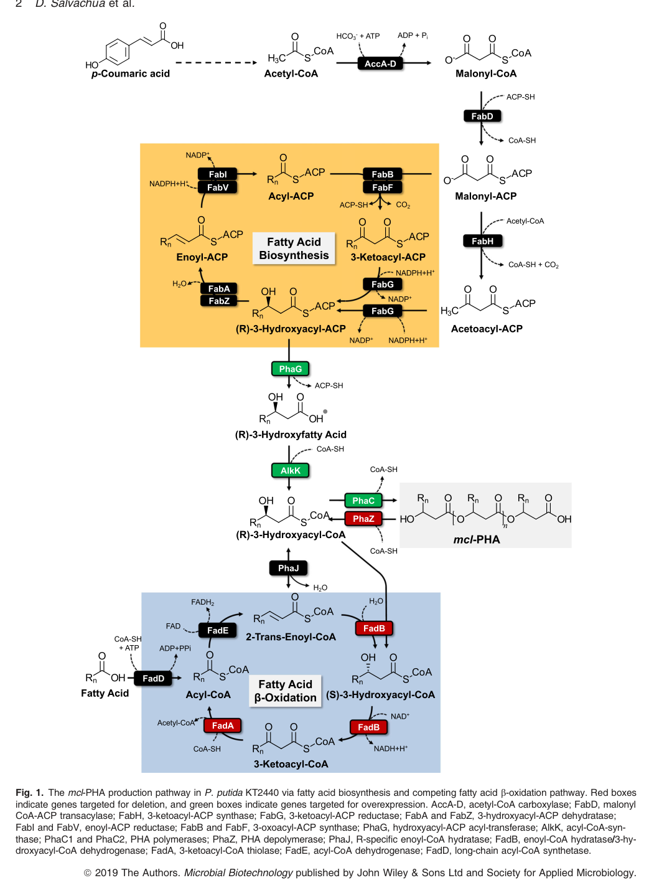

## Question

# Gene Research for Functional Annotation

## ⚠️ CRITICAL: Gene/Protein Identification Context

**BEFORE YOU BEGIN RESEARCH:** You MUST verify you are researching the CORRECT gene/protein. Gene symbols can be ambiguous, especially for less well-characterized genes from non-model organisms.

### Target Gene/Protein Identity (from UniProt):
- **UniProt Accession:** Q88D23
- **Protein Description:** SubName: Full=Poly(3-hydroxyalkanoate) polymerase 2 {ECO:0000313|EMBL:AAN70571.1}; EC=2.3.1.- {ECO:0000313|EMBL:AAN70571.1};
- **Gene Information:** Name=phaC-II {ECO:0000313|EMBL:AAN70571.1}; OrderedLocusNames=PP_5005 {ECO:0000313|EMBL:AAN70571.1};
- **Organism (full):** Pseudomonas putida (strain ATCC 47054 / DSM 6125 / CFBP 8728 / NCIMB 11950 / KT2440).
- **Protein Family:** Not specified in UniProt
- **Key Domains:** AB_hydrolase_fold. (IPR029058); PHA/PHB_synthase. (IPR051321); PHA_synth_II. (IPR011287); PhaC_N. (IPR010941); PhaC_N (PF07167)

### MANDATORY VERIFICATION STEPS:

1. **Check if the gene symbol "phaC-II" matches the protein description above**
2. **Verify the organism is correct:** Pseudomonas putida (strain ATCC 47054 / DSM 6125 / CFBP 8728 / NCIMB 11950 / KT2440).
3. **Check if protein family/domains align with what you find in literature**
4. **If you find literature for a DIFFERENT gene with the same or similar symbol, STOP**

### If Gene Symbol is Ambiguous or You Cannot Find Relevant Literature:

**DO NOT PROCEED WITH RESEARCH ON A DIFFERENT GENE.** Instead:
- State clearly: "The gene symbol 'phaC-II' is ambiguous or literature is limited for this specific protein"
- Explain what you found (e.g., "Found extensive literature on a different gene with the same symbol in a different organism")
- Describe the protein based ONLY on the UniProt information provided above
- Suggest that the protein function can be inferred from domain/family information

### Research Target:

Please provide a comprehensive research report on the gene **phaC-II** (gene ID: phaC, UniProt: Q88D23) in PSEPK.

The research report should be a detailed narrative explaining the function, biological processes, and localization of the gene product. Citations should be given for all claims.

You should prioritize authoritative reviews and primary scientific literature when conducting research. You can supplement
this with annotations you find in gene/protein databases, but these can be outdated or inaccurate.

We are specifically interested in the primary function of the gene - for enzymes, what reaction is catalyzed, and what is the substrate specificity? For transporters, what is the substrate? For structural proteins or adapters, what is the broader structural role? For signaling molecules, what is the role in the pathway.

We are interested in where in or outside the cell the gene product carries out its function.

We are also interested in the signaling or biochemical pathways in which the gene functions. We are less interested in broad pleiotropic effects, except where these elucidate the precise role.

Include evidence where possible. We are interested in both experimental evidence as well as inference from structure, evolution, or bioinformatic analysis. Precise studies should be prioritized over high-throughput, where available.

## Output

Question: You are an expert researcher providing comprehensive, well-cited information.

Provide detailed information focusing on:
1. Key concepts and definitions with current understanding
2. Recent developments and latest research (prioritize 2023-2024 sources)
3. Current applications and real-world implementations
4. Expert opinions and analysis from authoritative sources
5. Relevant statistics and data from recent studies

Format as a comprehensive research report with proper citations. Include URLs and publication dates where available.
Always prioritize recent, authoritative sources and provide specific citations for all major claims.

# Gene Research for Functional Annotation

## ⚠️ CRITICAL: Gene/Protein Identification Context

**BEFORE YOU BEGIN RESEARCH:** You MUST verify you are researching the CORRECT gene/protein. Gene symbols can be ambiguous, especially for less well-characterized genes from non-model organisms.

### Target Gene/Protein Identity (from UniProt):
- **UniProt Accession:** Q88D23
- **Protein Description:** SubName: Full=Poly(3-hydroxyalkanoate) polymerase 2 {ECO:0000313|EMBL:AAN70571.1}; EC=2.3.1.- {ECO:0000313|EMBL:AAN70571.1};
- **Gene Information:** Name=phaC-II {ECO:0000313|EMBL:AAN70571.1}; OrderedLocusNames=PP_5005 {ECO:0000313|EMBL:AAN70571.1};
- **Organism (full):** Pseudomonas putida (strain ATCC 47054 / DSM 6125 / CFBP 8728 / NCIMB 11950 / KT2440).
- **Protein Family:** Not specified in UniProt
- **Key Domains:** AB_hydrolase_fold. (IPR029058); PHA/PHB_synthase. (IPR051321); PHA_synth_II. (IPR011287); PhaC_N. (IPR010941); PhaC_N (PF07167)

### MANDATORY VERIFICATION STEPS:

1. **Check if the gene symbol "phaC-II" matches the protein description above**
2. **Verify the organism is correct:** Pseudomonas putida (strain ATCC 47054 / DSM 6125 / CFBP 8728 / NCIMB 11950 / KT2440).
3. **Check if protein family/domains align with what you find in literature**
4. **If you find literature for a DIFFERENT gene with the same or similar symbol, STOP**

### If Gene Symbol is Ambiguous or You Cannot Find Relevant Literature:

**DO NOT PROCEED WITH RESEARCH ON A DIFFERENT GENE.** Instead:
- State clearly: "The gene symbol 'phaC-II' is ambiguous or literature is limited for this specific protein"
- Explain what you found (e.g., "Found extensive literature on a different gene with the same symbol in a different organism")
- Describe the protein based ONLY on the UniProt information provided above
- Suggest that the protein function can be inferred from domain/family information

### Research Target:

Please provide a comprehensive research report on the gene **phaC-II** (gene ID: phaC, UniProt: Q88D23) in PSEPK.

The research report should be a detailed narrative explaining the function, biological processes, and localization of the gene product. Citations should be given for all claims.

You should prioritize authoritative reviews and primary scientific literature when conducting research. You can supplement
this with annotations you find in gene/protein databases, but these can be outdated or inaccurate.

We are specifically interested in the primary function of the gene - for enzymes, what reaction is catalyzed, and what is the substrate specificity? For transporters, what is the substrate? For structural proteins or adapters, what is the broader structural role? For signaling molecules, what is the role in the pathway.

We are interested in where in or outside the cell the gene product carries out its function.

We are also interested in the signaling or biochemical pathways in which the gene functions. We are less interested in broad pleiotropic effects, except where these elucidate the precise role.

Include evidence where possible. We are interested in both experimental evidence as well as inference from structure, evolution, or bioinformatic analysis. Precise studies should be prioritized over high-throughput, where available.

# Research Report: Functional Annotation of **phaC-II / phaC2** (UniProt **Q88D23**, locus **PP_5005**) in *Pseudomonas putida* KT2440

## 0) Executive summary
The UniProt entry **Q88D23** corresponds to **PhaC2 (phaC-II; PP_5005)**, one of two class II PHA synthases in *Pseudomonas putida* KT2440. PhaC2 is a **granule-associated polymerase** that catalyzes intracellular polymerization of **(R)-3-hydroxyacyl-CoA** monomers into **medium-chain-length polyhydroxyalkanoates (mcl-PHAs)**, typically containing **C6–C14** monomers depending on substrate. PhaC2 functions within an integrated **PHA cycle** (synthesis by PhaC, depolymerization by PhaZ, and re-activation of released monomers), connecting fatty-acid metabolism and central carbon/redox balancing. Engineering efforts that include **phaC2 overexpression** in KT2440 (alongside other PHA-pathway modifications) substantially increase mcl-PHA titer and yield, while recent (2023–2024) work demonstrates KT2440- and *Pseudomonas*-based PHA production from alternative feedstocks and for biomedical formulations. (mezzina2021engineeringnativeand pages 7-10, manoli2022syntheticcontrolof pages 1-2, salvachua2020metabolicengineeringof pages 1-3, nuratomal2024tailoringpseudomonasputida pages 1-3)

## 1) Mandatory identity verification (gene/protein disambiguation)
### 1.1 Mapping of names and locus identifiers
Multiple KT2440-focused sources describe the **pha** cluster as encoding **two PHA synthases/polymerases**, **PhaC1 (PP_5003)** and **PhaC2 (PP_5005)**. This matches the user-provided UniProt context for **phaC-II / PP_5005 / Q88D23** and indicates that the gene symbol **phaC-II** is used in KT2440 to denote the second class II PHA synthase, commonly written as **phaC2**. (mezzina2021engineeringnativeand pages 7-10)

### 1.2 Domain/family alignment and function-class consistency
The retrieved KT2440 literature consistently places PhaC2 in the **class II PhaC** family responsible for **mcl-PHA** production in pseudomonads, which is consistent with UniProt’s functional description “poly(3-hydroxyalkanoate) polymerase” and the presence of PHA synthase-associated domains in the UniProt entry. (vilchis2024productionofmediumchainlength pages 55-58, mezzina2021engineeringnativeand pages 7-10)

## 2) Key concepts and definitions (current understanding)
### 2.1 What PhaC2 is
PhaC2 is a **polyhydroxyalkanoate synthase (PhaC)**, also called a **PHA polymerase**, which catalyzes PHA chain elongation by polymerizing activated hydroxyacid monomers. In *Pseudomonas putida* KT2440, PhaC2 is one of the two polymerases constituting the core PHA biosynthetic machinery. (mezzina2021engineeringnativeand pages 7-10, manoli2022syntheticcontrolof pages 1-2)

### 2.2 Catalyzed reaction and substrates
In KT2440, PhaC polymerases (including PhaC2) use **(R)-3-hydroxyacyl-CoA** substrates to synthesize intracellular PHA polyesters. This reaction is the committed polymerization step converting the soluble monomer pool into stored polymer. (manoli2022syntheticcontrolof pages 1-2, salvachua2020metabolicengineeringof media b8c1d810)

### 2.3 Product definition: mcl-PHA and chain-length range
KT2440 is described as producing **medium-chain-length PHA copolymers** with monomers **ranging from C6 to C14** depending on carbon source. This range is widely used as an operational definition for pseudomonad mcl-PHAs and contextualizes the substrate range that PhaC2 draws upon in vivo. (mezzina2021engineeringnativeand pages 7-10, salvachua2020metabolicengineeringof pages 1-3)

### 2.4 Genetic organization of the KT2440 pha locus
A KT2440-specific review describes two primary operons: one containing **phaC1 (PP_5003)**, **phaZ (PP_5004)**, **phaC2 (PP_5005)**, and **phaD (PP_5006)**; and an adjacent, oppositely oriented operon encoding phasins **phaF (PP_5007)** and **phaI (PP_5008)**. This organization supports the interpretation of PhaC2 as part of a granule-centered functional module with both synthetic and turnover components. (mezzina2021engineeringnativeand pages 7-10)

## 3) Cellular localization and role in the cell
### 3.1 Intracellular PHA granule association
PhaC proteins in *P. putida* are described as **granule-associated proteins (GAPs)** that coat cytoplasmic PHA storage granules along with other GAPs (e.g., depolymerase and phasins). This supports functional localization of PhaC2 at the **surface of intracellular PHA granules**, consistent with polymer growth occurring at the granule interface. (manoli2022syntheticcontrolof pages 1-2)

### 3.2 The PHA cycle as a physiological module
The **PHA cycle** is described as simultaneous synthesis and degradation of PHA, linking carbon storage to central metabolism and robustness. In this framework, PhaC polymerases (including PhaC2) synthesize PHA, while depolymerase activity releases (R)-hydroxyalkanoates that can be reactivated (ATP-dependent) back to CoA thioesters for re-entry into metabolism. This positions PhaC2 as a key node in carbon/redox buffering rather than a standalone “storage-only” enzyme. (manoli2022syntheticcontrolof pages 1-2)

## 4) Pathway context and monomer supply routes
### 4.1 Two primary monomer-supply routes feeding PhaC2
Evidence from KT2440 pathway descriptions and schematics supports that (R)-3-hydroxyacyl-CoA monomers used by PhaC (including PhaC2) arise from:
1) **β-oxidation** of fatty acids (supplying intermediates that can be routed to (R)-3-hydroxyacyl-CoA), and
2) **de novo fatty acid synthesis** coupled to PHA synthesis via **PhaG** and **AlkK**.

In particular, a pathway schematic highlights **PhaG** converting (R)-3-hydroxyacyl-ACP to (R)-3-hydroxyfatty acids and **AlkK** ligating these to **(R)-3-hydroxyacyl-CoA**, which is then polymerized by **PhaC (PhaC1/PhaC2)** into mcl-PHA. (salvachua2020metabolicengineeringof media b8c1d810, salvachua2020metabolicengineeringof pages 1-3)

### 4.2 Visual evidence: KT2440 mcl-PHA pathway schematic
The following figure provides direct pathway-level evidence of the substrate supply to PhaC polymerization in KT2440, including the PhaG/AlkK route and competing β-oxidation and depolymerization steps. (salvachua2020metabolicengineeringof media b8c1d810)

## 5) Experimental evidence and quantitative data relevant to PhaC2
### 5.1 Genetic/engineering perturbations involving phaC2
A KT2440 engineering study increased mcl-PHA production from lignin-derived aromatics by combining: **phaZ knockout**, **fadBA1/fadBA2 deletions**, and overexpression of **phaG, alkK, phaC1, and phaC2 (PP_5005)**. The fully engineered strain showed **53% (p-coumaric acid) and 200% (lignin) increases in mcl-PHA titer**, and **20% and 100% increases in yield**, respectively, versus wild type. While these outcomes are not attributable solely to phaC2, they provide strong evidence that **increasing PhaC dosage (including PhaC2)** is part of effective strategies to raise mcl-PHA flux in KT2440. (salvachua2020metabolicengineeringof pages 1-3)

### 5.2 Reported KT2440 production metrics (2024) linking metabolism to PHA output
A 2024 KT2440-focused study evaluated mixed feedstocks (fatty acids with glucose derived from food waste) and reported that **50% glucose substitution in a F12 (dodecanoate) feedstock** led to **66% PHA/CDW**, **~6 g/L CDW**, and **~4 g/L PHA**. The same work cites shake-flask yields (from prior literature) of up to **0.6 g/L** for glucose-only, and **1.8–2.0 g/L** for fatty-acid substrates (F10/F12). This provides recent, quantitative, real-world-relevant performance benchmarks for KT2440-based PHA production (with polymerization ultimately executed by PhaC1/PhaC2). (nuratomal2024tailoringpseudomonasputida pages 1-3)

### 5.3 Engineered KT2440 producing tailored (heterologous) PHAs (2023)
In 2023, KT2440 was engineered with heterologous PHA modules to constitutively produce scl-PHAs, reporting **23%–84% PHA/CDW**, with a chromosomally integrated design reaching **68% PHA/CDW**, and tunable PHBV with **0.6%–19% C5 incorporation**. The study also reports an inverse relationship between PhaC synthase dosage and PHA granule size distribution, reinforcing the concept that PhaC dosage impacts granule-level phenotypes. (manoli2023heterologousconstitutiveproduction pages 1-3)

### 5.4 Broader process benchmarks and expert synthesis (2024)
A 2024 Current Opinion in Biotechnology review emphasizes that feedstock can contribute **up to ~50%** of PHA production costs and reports industrially relevant benchmarks including a fed-batch **Pseudomonas putida** case (5 L, 32 h) with **98.0 g/L cell titer** and **31.4 g/L PHA titer**. Although not necessarily KT2440, these values contextualize the scale of performance achievable in pseudomonads whose polymerization relies on class II PhaC enzymes homologous to PhaC2. (chacon2024geneticandprocess pages 1-3)

## 6) Recent developments (prioritizing 2023–2024)
### 6.1 Feedstock tailoring and biomedical formulation (2024)
A 2024 ACS Sustainable Chemistry & Engineering study connects upstream fermentation choices to downstream material use by producing KT2440 mcl-PHA from mixed feedstocks and converting these polymers into **biomedical nanoemulsions** (reported droplet sizes ~120–350 nm, PDI < 0.2, and pH-dependent stability). This illustrates an end-to-end research direction from pathway function (PhaC-driven polymerization) to real-world formulation. (nuratomal2024tailoringpseudomonasputida pages 1-3)

### 6.2 Metabolic engineering for higher titers on sugars (2024)
A 2024 metabolic engineering study in *P. putida* (QSRZ-derived strains) reports multi-gene modifications to direct glucose toward acetyl-CoA, achieving up to **59.1 wt% PHA** and **6.8 g/L** titer after shaker-flask feeding optimization. This reinforces current research direction: raising precursor pools and flux into polymerization, in which PhaC enzymes (including PhaC2 homologs) are the terminal polymer-forming step. (dong2024modificationofglucose pages 1-2)

### 6.3 Synthetic biology for tailored PHAs (2023)
The 2023 KT2440 study using modular DNA assembly to implement orthogonal PHA switches demonstrates ongoing movement toward **programmable polymer composition**, where the synthase module and dosage are design variables that influence polymer amount and granule phenotypes. (manoli2023heterologousconstitutiveproduction pages 1-3)

## 7) Current applications and real-world implementations
### 7.1 Bioplastics and materials
mcl-PHAs are positioned as biodegradable alternatives to petroleum plastics, with *Pseudomonas* mcl-PHAs highlighted as more flexible/elastic (lower crystallinity) due to monomer composition (C6–C14). This material property linkage is central to why *P. putida* PhaC1/PhaC2 systems are widely used in applied studies. (chacon2024geneticandprocess pages 1-3, nuratomal2024tailoringpseudomonasputida pages 1-3)

### 7.2 Biomedical implementations
Recent KT2440 work specifically targets **drug delivery/nanoemulsion** use, arguing that amphiphilic PHA structures support nanostructures that can encapsulate drugs and may have favorable degradation profiles. This is a concrete example of real-world implementation of mcl-PHAs beyond commodity plastics. (nuratomal2024tailoringpseudomonasputida pages 1-3)

### 7.3 Waste/upcycled feedstocks
Recent expert synthesis emphasizes using low-cost waste (e.g., food waste) to address the cost structure of PHA production, and demonstrates that pseudomonads can reach high titers in fed-batch settings. (chacon2024geneticandprocess pages 1-3)

## 8) Expert interpretation and limitations of current evidence for PhaC2-specific biochemistry
### 8.1 What is well supported for Q88D23
From KT2440-focused sources, the strongest supported functional statements for **PhaC2/Q88D23** are:
- it is a **class II PHA synthase/polymerase** in the KT2440 pha locus (PP_5005), (mezzina2021engineeringnativeand pages 7-10)
- it polymerizes **(R)-3-hydroxyacyl-CoA** into intracellular **mcl-PHA**, (manoli2022syntheticcontrolof pages 1-2, salvachua2020metabolicengineeringof media b8c1d810)
- it is **granule-associated** and embedded in a **PHA cycle** that couples synthesis and degradation, (manoli2022syntheticcontrolof pages 1-2)
- it operates on monomer pools that commonly yield **C6–C14** monomers in KT2440, depending on substrate. (mezzina2021engineeringnativeand pages 7-10)

### 8.2 What remains underdetermined in the retrieved corpus
No retrieved text snippet provided **PhaC2-only** kinetic constants, purified-enzyme substrate preference measurements, or **single-gene phaC2 deletion/complementation phenotypes** in KT2440. Consequently, any fine-grained statements about whether KT2440 PhaC2 differs from PhaC1 in chain-length preference or catalytic efficiency cannot be made from the current evidence set without additional targeted primary enzymology studies. (mezzina2021engineeringnativeand pages 7-10, salvachua2020metabolicengineeringof pages 1-3)

## 9) Evidence-backed annotation summary table
| Evidence-supported property | Specific annotation for PhaC2/Q88D23 | Key supporting sources (with year, DOI URL) |
|---|---|---|
| Gene/protein identifiers | **PhaC2 / phaC-II**, ordered locus **PP_5005**, one of two PHA polymerases in the **Pseudomonas putida KT2440** pha locus; corresponds to the target UniProt entry **Q88D23** based on consistent PP_5005 mapping in KT2440 literature. (mezzina2021engineeringnativeand pages 7-10, salvachua2020metabolicengineeringof pages 1-3) | Mezzina et al., 2021, https://doi.org/10.1002/biot.202000165; Salvachúa et al., 2020, https://doi.org/10.1111/1751-7915.13481 |
| Enzyme class | **Class II PHA synthase / polymerase** involved in **medium-chain-length (mcl)-PHA** biosynthesis. (vilchis2024productionofmediumchainlength pages 55-58, mezzina2021engineeringnativeand pages 7-10) | Vilchis, 2024; Mezzina et al., 2021, https://doi.org/10.1002/biot.202000165 |
| Catalytic reaction | Catalyzes polymerization of **(R)-3-hydroxyacyl-CoA** monomers into intracellular **mcl-PHA** polyester granules; literature places PhaC2 in the polymerization step of the peripheral PHA pathway. (mezzina2021engineeringnativeand pages 7-10, manoli2022syntheticcontrolof pages 1-2, salvachua2020metabolicengineeringof media b8c1d810) | Mezzina et al., 2021, https://doi.org/10.1002/biot.202000165; Manoli et al., 2022, https://doi.org/10.1128/mbio.01794-21; Salvachúa et al., 2020 Fig. 1, https://doi.org/10.1111/1751-7915.13481 |
| Substrate specificity/range | Evidence supports use of **(R)-3-hydroxyacyl-CoA** substrates from the **mcl** pool; KT2440 mcl-PHA compositions reported in pathway reviews span roughly **C6-C14** monomers depending on carbon source, but direct KT2440 PhaC2-only kinetic specificity was **not** extracted from the gathered snippets. (mezzina2021engineeringnativeand pages 7-10, manoli2022syntheticcontrolof pages 1-2) | Mezzina et al., 2021, https://doi.org/10.1002/biot.202000165; Manoli et al., 2022, https://doi.org/10.1128/mbio.01794-21 |
| Pathway context (β-oxidation vs de novo FA via PhaG/AlkK) | PhaC2 acts downstream of two monomer-supply routes: **β-oxidation**, which generates (R)-3-hydroxyacyl-CoA intermediates from fatty acids, and **de novo fatty-acid synthesis**, where **PhaG** converts (R)-3-hydroxyacyl-ACP to (R)-3-hydroxyfatty acid and **AlkK** ligates this to **(R)-3-hydroxyacyl-CoA**, the substrate polymerized by PhaC. (salvachua2020metabolicengineeringof pages 1-3, salvachua2020metabolicengineeringof media b8c1d810, mezzina2021engineeringnativeand pages 7-10) | Salvachúa et al., 2020, https://doi.org/10.1111/1751-7915.13481; Mezzina et al., 2021, https://doi.org/10.1002/biot.202000165 |
| Cellular localization | PhaC2 belongs to the **granule-associated protein (GAP)** set that coats **cytoplasmic PHA storage granules** in P. putida; this supports intracellular localization at the PHA granule surface rather than secretion or membrane transport function. (manoli2022syntheticcontrolof pages 1-2) | Manoli et al., 2022, https://doi.org/10.1128/mbio.01794-21 |
| Regulation/physiological role | PhaC2 functions in the **PHA cycle**, a dynamic synthesis/degradation system linked to central carbon metabolism and metabolic robustness. PHA accumulation is associated with **carbon excess and nutrient limitation** (e.g., N or P limitation), placing PhaC2 in carbon-storage and stress-adaptation physiology. (manoli2022syntheticcontrolof pages 1-2) | Manoli et al., 2022, https://doi.org/10.1128/mbio.01794-21 |
| Engineering/phenotype quantitative data | In a KT2440 engineering study, **overexpression of phaC2 together with phaG, alkK, and phaC1** plus deletions in **phaZ, fadBA1, fadBA2** increased mcl-PHA performance versus wild type by **53% (p-coumaric acid) and 200% (lignin) in titer**, and **20% and 100% in yield**, respectively; this supports PhaC2 as a productive polymerase target, although the effect is from a multi-gene intervention rather than isolated phaC2 overexpression. (salvachua2020metabolicengineeringof pages 1-3) | Salvachúa et al., 2020, https://doi.org/10.1111/1751-7915.13481 |

*Table: This table summarizes evidence-supported functional annotation for Pseudomonas putida KT2440 PhaC2 (phaC-II; PP_5005; UniProt Q88D23). It highlights identity, catalytic role, pathway context, localization, and quantitative engineering evidence using only the gathered sources.*

## 10) Key references (publication date and URL)
- Salvachúa D. et al. (Aug **2020**). *Microbial Biotechnology*. “Metabolic engineering of *Pseudomonas putida* for increased polyhydroxyalkanoate production from lignin.” https://doi.org/10.1111/1751-7915.13481 (salvachua2020metabolicengineeringof pages 1-3)
- Mezzina M.P. et al. (Nov **2021**). *Biotechnology Journal*. “Engineering Native and Synthetic Pathways in *Pseudomonas putida* for the Production of Tailored Polyhydroxyalkanoates.” https://doi.org/10.1002/biot.202000165 (mezzina2021engineeringnativeand pages 7-10)
- Manoli M.-T. et al. (Feb **2022**). *mBio*. “Synthetic control of metabolic states in *Pseudomonas putida* by tuning polyhydroxyalkanoate cycle.” https://doi.org/10.1128/mbio.01794-21 (manoli2022syntheticcontrolof pages 1-2)
- Manoli M.-T. et al. (Nov **2023**). *Frontiers in Bioengineering and Biotechnology*. “Heterologous constitutive production of short-chain-length polyhydroxyalkanoates in *Pseudomonas putida* KT2440…” https://doi.org/10.3389/fbioe.2023.1275036 (manoli2023heterologousconstitutiveproduction pages 1-3)
- Chacón M. et al. (Feb **2024**). *Current Opinion in Biotechnology*. “Genetic and process engineering for polyhydroxyalkanoate production from pre- and post-consumer food waste.” https://doi.org/10.1016/j.copbio.2023.103024 (chacon2024geneticandprocess pages 1-3)
- Nur-A-Tomal M.S. et al. (Jul **2024**). *ACS Sustainable Chemistry & Engineering*. “Tailoring *Pseudomonas putida* feedstocks for enhanced mcl-PHA production and biomedical nanoemulsion applications.” https://doi.org/10.1021/acssuschemeng.4c02156 (nuratomal2024tailoringpseudomonasputida pages 1-3)
- Dong Y. et al. (Nov **2024**). *Current Issues in Molecular Biology*. “Modification of glucose metabolic pathway to enhance polyhydroxyalkanoate synthesis in *Pseudomonas putida*.” https://doi.org/10.3390/cimb46110761 (dong2024modificationofglucose pages 1-2)

References

1. (mezzina2021engineeringnativeand pages 7-10): Mariela P. Mezzina, María Tsampika Manoli, M. Auxiliadora Prieto, and Pablo I. Nikel. Engineering native and synthetic pathways in <i>pseudomonas putida</i> for the production of tailored polyhydroxyalkanoates. Biotechnology Journal, Nov 2021. URL: https://doi.org/10.1002/biot.202000165, doi:10.1002/biot.202000165. This article has 146 citations and is from a peer-reviewed journal.

2. (manoli2022syntheticcontrolof pages 1-2): Maria-Tsampika Manoli, Juan Nogales, and Auxiliadora Prieto. Synthetic control of metabolic states in pseudomonas putida by tuning polyhydroxyalkanoate cycle. Feb 2022. URL: https://doi.org/10.1128/mbio.01794-21, doi:10.1128/mbio.01794-21. This article has 28 citations and is from a domain leading peer-reviewed journal.

3. (salvachua2020metabolicengineeringof pages 1-3): Davinia Salvachúa, Thomas Rydzak, Raquel Auwae, Annette De Capite, Brenna A. Black, Jason T. Bouvier, Nicholas S. Cleveland, Joshua R. Elmore, Anna Furches, Jay D. Huenemann, Rui Katahira, William E. Michener, Darren J. Peterson, Holly Rohrer, Derek R. Vardon, Gregg T. Beckham, and Adam M. Guss. Metabolic engineering of pseudomonas putida for increased polyhydroxyalkanoate production from lignin. Microbial Biotechnology, 13:290-298, Aug 2020. URL: https://doi.org/10.1111/1751-7915.13481, doi:10.1111/1751-7915.13481. This article has 240 citations and is from a peer-reviewed journal.

4. (nuratomal2024tailoringpseudomonasputida pages 1-3): Md. Shahruk Nur-A-Tomal, Edward Attenborough, Zihnil A. I. Mazrad, Zhexuan Yang, Hualiang Zeng, Phillip Holt, Mark M. Banaszak Holl, Neil R. Cameron, Kristian Kempe, and Leonie van ’t Hag. Tailoring pseudomonas putida feedstocks for enhanced medium-chain-length polyhydroxyalkanoate production and biomedical nanoemulsion applications. ACS Sustainable Chemistry &amp; Engineering, 12:14590-14600, Jul 2024. URL: https://doi.org/10.1021/acssuschemeng.4c02156, doi:10.1021/acssuschemeng.4c02156. This article has 9 citations and is from a peer-reviewed journal.

5. (vilchis2024productionofmediumchainlength pages 55-58): I Vital Vilchis. Production of medium-chain-length polyhydroxyalkanoates from engineered bacteria. Unknown journal, 2024.

6. (salvachua2020metabolicengineeringof media b8c1d810): Davinia Salvachúa, Thomas Rydzak, Raquel Auwae, Annette De Capite, Brenna A. Black, Jason T. Bouvier, Nicholas S. Cleveland, Joshua R. Elmore, Anna Furches, Jay D. Huenemann, Rui Katahira, William E. Michener, Darren J. Peterson, Holly Rohrer, Derek R. Vardon, Gregg T. Beckham, and Adam M. Guss. Metabolic engineering of pseudomonas putida for increased polyhydroxyalkanoate production from lignin. Microbial Biotechnology, 13:290-298, Aug 2020. URL: https://doi.org/10.1111/1751-7915.13481, doi:10.1111/1751-7915.13481. This article has 240 citations and is from a peer-reviewed journal.

7. (manoli2023heterologousconstitutiveproduction pages 1-3): Maria-Tsampika Manoli, Francisco G. Blanco, Virginia Rivero-Buceta, Ryan Kniewel, Sandra Herrera Alarcon, Sergio Salgado, and M. Auxiliadora Prieto. Heterologous constitutive production of short-chain-length polyhydroxyalkanoates in pseudomonas putida kt2440: the involvement of ibpa inclusion body protein. Frontiers in Bioengineering and Biotechnology, Nov 2023. URL: https://doi.org/10.3389/fbioe.2023.1275036, doi:10.3389/fbioe.2023.1275036. This article has 13 citations.

8. (chacon2024geneticandprocess pages 1-3): Micaela Chacón, Phavit Wongsirichot, James Winterburn, and Neil Dixon. Genetic and process engineering for polyhydroxyalkanoate production from pre- and post-consumer food waste. Current Opinion in Biotechnology, 85:103024, Feb 2024. URL: https://doi.org/10.1016/j.copbio.2023.103024, doi:10.1016/j.copbio.2023.103024. This article has 27 citations and is from a peer-reviewed journal.

9. (dong2024modificationofglucose pages 1-2): Yue Dong, Keyao Zhai, Yatao Li, Zhen Lv, Mengyao Zhao, Tian Gan, and Yuchao Ma. Modification of glucose metabolic pathway to enhance polyhydroxyalkanoate synthesis in pseudomonas putida. Current Issues in Molecular Biology, 46:12784-12799, Nov 2024. URL: https://doi.org/10.3390/cimb46110761, doi:10.3390/cimb46110761. This article has 4 citations.

## Artifacts

- [Edison artifact artifact-00](phaC-deep-research-falcon_artifacts/artifact-00.md)

## Citations

1. mezzina2021engineeringnativeand pages 7-10
2. manoli2022syntheticcontrolof pages 1-2
3. salvachua2020metabolicengineeringof pages 1-3
4. nuratomal2024tailoringpseudomonasputida pages 1-3
5. manoli2023heterologousconstitutiveproduction pages 1-3
6. chacon2024geneticandprocess pages 1-3
7. dong2024modificationofglucose pages 1-2
8. vilchis2024productionofmediumchainlength pages 55-58
9. https://doi.org/10.1002/biot.202000165;
10. https://doi.org/10.1111/1751-7915.13481
11. https://doi.org/10.1002/biot.202000165
12. https://doi.org/10.1128/mbio.01794-21;
13. https://doi.org/10.1128/mbio.01794-21
14. https://doi.org/10.1111/1751-7915.13481;
15. https://doi.org/10.3389/fbioe.2023.1275036
16. https://doi.org/10.1016/j.copbio.2023.103024
17. https://doi.org/10.1021/acssuschemeng.4c02156
18. https://doi.org/10.3390/cimb46110761
19. https://doi.org/10.1002/biot.202000165,
20. https://doi.org/10.1128/mbio.01794-21,
21. https://doi.org/10.1111/1751-7915.13481,
22. https://doi.org/10.1021/acssuschemeng.4c02156,
23. https://doi.org/10.3389/fbioe.2023.1275036,
24. https://doi.org/10.1016/j.copbio.2023.103024,
25. https://doi.org/10.3390/cimb46110761,