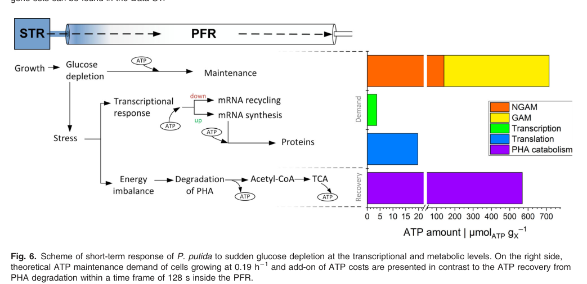

## Question

# Gene Research for Functional Annotation

## ⚠️ CRITICAL: Gene/Protein Identification Context

**BEFORE YOU BEGIN RESEARCH:** You MUST verify you are researching the CORRECT gene/protein. Gene symbols can be ambiguous, especially for less well-characterized genes from non-model organisms.

### Target Gene/Protein Identity (from UniProt):
- **UniProt Accession:** Q88D24
- **Protein Description:** SubName: Full=Poly(3-hydroxyalkanoate) depolymerase {ECO:0000313|EMBL:AAN70570.1}; EC=3.1.1.- {ECO:0000313|EMBL:AAN70570.1};
- **Gene Information:** Name=phaB {ECO:0000313|EMBL:AAN70570.1}; OrderedLocusNames=PP_5004 {ECO:0000313|EMBL:AAN70570.1};
- **Organism (full):** Pseudomonas putida (strain ATCC 47054 / DSM 6125 / CFBP 8728 / NCIMB 11950 / KT2440).
- **Protein Family:** Not specified in UniProt
- **Key Domains:** AB_hydrolase. (IPR050471); AB_hydrolase_1. (IPR000073); AB_hydrolase_fold. (IPR029058); PHA_depoly_arom. (IPR011942); Abhydrolase_1 (PF00561)

### MANDATORY VERIFICATION STEPS:

1. **Check if the gene symbol "phaB" matches the protein description above**
2. **Verify the organism is correct:** Pseudomonas putida (strain ATCC 47054 / DSM 6125 / CFBP 8728 / NCIMB 11950 / KT2440).
3. **Check if protein family/domains align with what you find in literature**
4. **If you find literature for a DIFFERENT gene with the same or similar symbol, STOP**

### If Gene Symbol is Ambiguous or You Cannot Find Relevant Literature:

**DO NOT PROCEED WITH RESEARCH ON A DIFFERENT GENE.** Instead:
- State clearly: "The gene symbol 'phaB' is ambiguous or literature is limited for this specific protein"
- Explain what you found (e.g., "Found extensive literature on a different gene with the same symbol in a different organism")
- Describe the protein based ONLY on the UniProt information provided above
- Suggest that the protein function can be inferred from domain/family information

### Research Target:

Please provide a comprehensive research report on the gene **phaB** (gene ID: phaZ, UniProt: Q88D24) in PSEPK.

The research report should be a detailed narrative explaining the function, biological processes, and localization of the gene product. Citations should be given for all claims.

You should prioritize authoritative reviews and primary scientific literature when conducting research. You can supplement
this with annotations you find in gene/protein databases, but these can be outdated or inaccurate.

We are specifically interested in the primary function of the gene - for enzymes, what reaction is catalyzed, and what is the substrate specificity? For transporters, what is the substrate? For structural proteins or adapters, what is the broader structural role? For signaling molecules, what is the role in the pathway.

We are interested in where in or outside the cell the gene product carries out its function.

We are also interested in the signaling or biochemical pathways in which the gene functions. We are less interested in broad pleiotropic effects, except where these elucidate the precise role.

Include evidence where possible. We are interested in both experimental evidence as well as inference from structure, evolution, or bioinformatic analysis. Precise studies should be prioritized over high-throughput, where available.

## Output

Question: You are an expert researcher providing comprehensive, well-cited information.

Provide detailed information focusing on:
1. Key concepts and definitions with current understanding
2. Recent developments and latest research (prioritize 2023-2024 sources)
3. Current applications and real-world implementations
4. Expert opinions and analysis from authoritative sources
5. Relevant statistics and data from recent studies

Format as a comprehensive research report with proper citations. Include URLs and publication dates where available.
Always prioritize recent, authoritative sources and provide specific citations for all major claims.

# Gene Research for Functional Annotation

## ⚠️ CRITICAL: Gene/Protein Identification Context

**BEFORE YOU BEGIN RESEARCH:** You MUST verify you are researching the CORRECT gene/protein. Gene symbols can be ambiguous, especially for less well-characterized genes from non-model organisms.

### Target Gene/Protein Identity (from UniProt):
- **UniProt Accession:** Q88D24
- **Protein Description:** SubName: Full=Poly(3-hydroxyalkanoate) depolymerase {ECO:0000313|EMBL:AAN70570.1}; EC=3.1.1.- {ECO:0000313|EMBL:AAN70570.1};
- **Gene Information:** Name=phaB {ECO:0000313|EMBL:AAN70570.1}; OrderedLocusNames=PP_5004 {ECO:0000313|EMBL:AAN70570.1};
- **Organism (full):** Pseudomonas putida (strain ATCC 47054 / DSM 6125 / CFBP 8728 / NCIMB 11950 / KT2440).
- **Protein Family:** Not specified in UniProt
- **Key Domains:** AB_hydrolase. (IPR050471); AB_hydrolase_1. (IPR000073); AB_hydrolase_fold. (IPR029058); PHA_depoly_arom. (IPR011942); Abhydrolase_1 (PF00561)

### MANDATORY VERIFICATION STEPS:

1. **Check if the gene symbol "phaB" matches the protein description above**
2. **Verify the organism is correct:** Pseudomonas putida (strain ATCC 47054 / DSM 6125 / CFBP 8728 / NCIMB 11950 / KT2440).
3. **Check if protein family/domains align with what you find in literature**
4. **If you find literature for a DIFFERENT gene with the same or similar symbol, STOP**

### If Gene Symbol is Ambiguous or You Cannot Find Relevant Literature:

**DO NOT PROCEED WITH RESEARCH ON A DIFFERENT GENE.** Instead:
- State clearly: "The gene symbol 'phaB' is ambiguous or literature is limited for this specific protein"
- Explain what you found (e.g., "Found extensive literature on a different gene with the same symbol in a different organism")
- Describe the protein based ONLY on the UniProt information provided above
- Suggest that the protein function can be inferred from domain/family information

### Research Target:

Please provide a comprehensive research report on the gene **phaB** (gene ID: phaZ, UniProt: Q88D24) in PSEPK.

The research report should be a detailed narrative explaining the function, biological processes, and localization of the gene product. Citations should be given for all claims.

You should prioritize authoritative reviews and primary scientific literature when conducting research. You can supplement
this with annotations you find in gene/protein databases, but these can be outdated or inaccurate.

We are specifically interested in the primary function of the gene - for enzymes, what reaction is catalyzed, and what is the substrate specificity? For transporters, what is the substrate? For structural proteins or adapters, what is the broader structural role? For signaling molecules, what is the role in the pathway.

We are interested in where in or outside the cell the gene product carries out its function.

We are also interested in the signaling or biochemical pathways in which the gene functions. We are less interested in broad pleiotropic effects, except where these elucidate the precise role.

Include evidence where possible. We are interested in both experimental evidence as well as inference from structure, evolution, or bioinformatic analysis. Precise studies should be prioritized over high-throughput, where available.

## Research Report: Functional Annotation of *Pseudomonas putida* KT2440 PP_5004 (UniProt Q88D24) — intracellular PHA depolymerase (PhaZ)

### 0) Target verification (critical identity check)
**UniProt Q88D24** is annotated as a **poly(3-hydroxyalkanoate) depolymerase** in *Pseudomonas putida* KT2440, with ordered locus name **PP_5004** (strain ATCC 47054 / DSM 6125 / NCIMB 11950 / KT2440). Multiple *P. putida* KT2440-focused sources identify PP_5004 as **phaZ**, an intracellular PHA depolymerase located in the canonical *pha* gene region with the class II mcl-PHA synthases (*phaC1* PP_5003 and *phaC2* PP_5005). (mezzina2021engineeringnativeand pages 7-10)

**Symbol ambiguity note (phaB vs phaZ):** some literature refers to the depolymerase as “phaB” even while describing depolymerase function (not the canonical biosynthetic reductase usually called phaB), creating a nomenclature collision. For example, a KT2440 industrial-stress transcriptomics study describes PHA monomers being released by “PHA depolymerase (phaB)” in the PHA cycle context, consistent with PP_5004’s depolymerase function rather than classical phaB reductase function. (ankenbauer2020pseudomonasputidakt2440 pages 10-12)

### 1) Key concepts and definitions (current understanding)
#### 1.1 Polyhydroxyalkanoates (PHAs) and intracellular granules
PHAs are **intracellular storage polyesters** accumulated as **granules (inclusion bodies)**, commonly under carbon excess with limitation of other nutrients, and serve as reserves of carbon/energy and redox buffering. (mukherjee2023microbialpolyhydroxyalkanoate(pha) pages 6-7)

PHA granules are described as intracellular structures with a surface (phospholipid monolayer) bearing **granule-associated proteins (GAPs)**, including biosynthetic enzymes (e.g., PhaC), structural proteins (phasins), regulators, and **depolymerases (PhaZ)** involved in mobilization and degradation of stored polymer. (vicente2023theroleof pages 8-10)

#### 1.2 PhaZ (intracellular PHA depolymerase) vs extracellular depolymerases
For *Pseudomonas* mcl-PHA systems, the KT2440 enzyme is described as an **intracellular mcl-PHA depolymerase** (PhaZKT) and is contrasted with extracellular PHA depolymerases: PhaZKT is reported to have an **α/β-hydrolase fold** and a **lid domain** that is emphasized as a key structural determinant associated with intracellular action and substrate specificity. (eugenio2025revealingtheessential pages 1-2)

### 2) Protein-level functional annotation of PP_5004 / Q88D24
A compact evidence-backed annotation is provided in the table below.

| Attribute | Evidence summary | Best supporting citations |
|---|---|---|
| Gene symbol / identity | For UniProt Q88D24 in *Pseudomonas putida* KT2440, the literature consistently identifies locus PP_5004 as **phaZ**, the intracellular PHA depolymerase in the canonical *pha* region with *phaC1* (PP_5003) and *phaC2* (PP_5005). A 2020 systems study also refers to the same depolymerase as “PHA depolymerase (phaB),” indicating annotation/symbol ambiguity rather than a different function. | (mezzina2021engineeringnativeand pages 7-10, ankenbauer2020pseudomonasputidakt2440 pages 10-12) |
| Symbol ambiguity: phaB vs phaZ | The symbol **phaB** is classically used in many bacteria for acetoacetyl-CoA reductase in the biosynthetic *phaABC* pathway, whereas **phaZ** denotes PHA depolymerase. Reviews distinguishing biosynthetic clusters from degradative enzymes support that a depolymerase assignment for PP_5004 aligns with **phaZ**, not canonical biosynthetic **phaB**. | (vicente2023theroleof pages 8-10, mezzina2021engineeringnativeand pages 7-10) |
| Locus tag | PP_5004 is the KT2440 ordered locus name linked to the depolymerase gene situated between the two class II mcl-PHA synthase genes in the *pha* cluster. This genomic context strongly supports its role in mcl-PHA turnover rather than de novo monomer biosynthesis. | (mezzina2021engineeringnativeand pages 7-10) |
| Protein name | The protein product is an **intracellular medium-chain-length polyhydroxyalkanoate depolymerase** (PhaZKT), described as a model enzyme for intracellular mcl-PHA mobilization in *P. putida* KT2440. | (eugenio2025revealingtheessential pages 2-4, eugenio2025revealingtheessential pages 1-2) |
| Enzyme class / EC | Functionally, PP_5004 is a **hydrolase/esterase-type depolymerase** that cleaves ester bonds in intracellular PHA granules to release 3-hydroxyalkanoate monomers. The supplied UniProt annotation gives EC 3.1.1.-, which is consistent with a carboxylic ester hydrolase assignment. | (ren2010influenceofgrowth pages 2-5, ren2010influenceofgrowth pages 1-2) |
| Domains / fold | PhaZKT is reported to adopt an **α/β-hydrolase fold** and to contain a **lid domain** covering the active site, a structural feature highlighted as important for intracellular mcl-PHA depolymerases and contrasted with many extracellular depolymerases that lack such a lid. | (eugenio2025revealingtheessential pages 2-4, eugenio2025revealingtheessential pages 1-2) |
| Catalytic residues | A catalytic triad of **Ser102, Asp221, and His248** has been identified for the KT2440 intracellular depolymerase. Mutational work further indicates that lid integrity is essential for catalytic function. | (eugenio2025revealingtheessential pages 2-4, eugenio2025revealingtheessential pages 1-2) |
| Substrate specificity | The enzyme is described as acting **almost exclusively on mcl-PHAs**, not broadly on short-chain-length PHAs. In assays with *Pseudomonas* depolymerase activity, major released products included **3-hydroxyoctanoate** with minor **3-hydroxyhexanoate**, matching mcl-PHA derived from octanoate-grown cells. | (eugenio2025revealingtheessential pages 1-2, ren2010influenceofgrowth pages 2-5) |
| Cellular localization | Evidence places PhaZ as an **intracellular, granule-associated** enzyme acting on the surface of PHA inclusions rather than a secreted extracellular depolymerase. Reviews of PHA granule biology also list PhaZ among granule-surface proteins. | (ren2010influenceofgrowth pages 1-2, vicente2023theroleof pages 8-10) |
| Reaction / immediate products | In vitro assays measured **release of 3-hydroxy fatty acid monomers** from PHA by PhaZ-containing extracts, whereas a *phaZ* mutant lacked this activity. These released 3-HAs can then be activated to hydroxyacyl-CoAs for downstream metabolism. | (ren2010influenceofgrowth pages 2-5, ankenbauer2020pseudomonasputidakt2440 pages 10-12) |
| Pathway role | PP_5004 functions in **PHA mobilization**, coupling polymer breakdown to carbon and energy homeostasis. The released 3-HAs/hydroxyacyl intermediates can be reactivated and either re-enter the PHA cycle or feed β-oxidation and central metabolism, giving the PHA cycle both anabolic and catabolic roles. | (mezzina2021engineeringnativeand pages 7-10, ankenbauer2020pseudomonasputidakt2440 pages 10-12) |
| Physiological context | Under transient glucose starvation, *P. putida* KT2440 is proposed to rapidly access intracellular PHA stores; 3-HA degradation is presented as a short-term survival program that helps restore adenylate energy charge and maintain ATP supply. This aligns with prior work framing PHA turnover as central to carbon/energy balance. | (ankenbauer2020pseudomonasputidakt2440 pages 10-12, ankenbauer2020pseudomonasputidakt2440 pages 9-10, eugenio2025revealingtheessential pages 1-2) |
| Experimental evidence for function | A knockout study in *P. putida* U showed that crude extracts from a **PhaZ-deficient mutant did not release 3-hydroxy fatty acids**, directly supporting depolymerase function. In KT2440, targeted lid deletions abolished depolymerase activity, providing additional structure-function evidence. | (ren2010influenceofgrowth pages 2-5, eugenio2025revealingtheessential pages 1-2) |
| Enzyme regulation / granule context | PhaZ activity coexists with PhaC activity on PHA granules, supporting simultaneous synthesis and degradation. Changes in phasin abundance on granules influence this metabolic cycle, indicating that PP_5004 acts within a regulated granule-associated protein network. | (ren2010influenceofgrowth pages 1-2, mezzina2021engineeringnativeand pages 7-10) |
| Key quantitative data | In *P. putida* U, **PhaZ activity increased ~1.5-fold during growth** and was measured at roughly **5–10 U g⁻¹ total protein**; released monomers were mainly 3-hydroxyoctanoate with some 3-hydroxyhexanoate. In KT2440 under glucose limitation, intracellular 3-HAs were reported at about **1.1% of biomass**, and theoretical ATP recovery from 3-HA oxidation was estimated to cover **~79.6% to ~100%** of maintenance demand depending on P/O assumptions. | (ren2010influenceofgrowth pages 2-5, ankenbauer2020pseudomonasputidakt2440 pages 9-10) |

*Table: This table summarizes the verified identity and function of UniProt Q88D24 / PP_5004 in *Pseudomonas putida* KT2440, emphasizing that the protein is best supported as the intracellular mcl-PHA depolymerase PhaZ. It also flags the important phaB/phaZ symbol ambiguity and compiles the strongest evidence for substrate specificity, localization, pathway role, and quantitative physiology.*

#### 2.1 Enzymatic function and reaction
PP_5004 (PhaZ) is supported as a **hydrolase/esterase-type depolymerase** that cleaves ester bonds in intracellular PHA to release **3-hydroxyalkanoate (3-HA) monomers**, which can then be metabolically activated and oxidized. Experimental evidence for depolymerase activity includes an in vitro assay where depolymerase activity is quantified as release of 3-hydroxy fatty acids (GC after methanolysis), and a PhaZ-deficient mutant lacks detectable monomer release. (ren2010influenceofgrowth pages 2-5)

#### 2.2 Substrate specificity (mcl-PHA preference)
In the context of *Pseudomonas* mcl-PHA granules, depolymerase activity releases predominantly **3-hydroxyoctanoate** with minor **3-hydroxyhexanoate** under the tested conditions, consistent with turnover of **medium-chain-length PHA** accumulated from octanoate. (ren2010influenceofgrowth pages 2-5)

Structural/functional analysis of the KT2440 depolymerase describes it as **highly substrate-specific**, acting **almost exclusively on mcl-PHAs**. (eugenio2025revealingtheessential pages 1-2)

#### 2.3 Structural features and catalytic residues
PhaZKT is described as an **α/β-hydrolase-fold enzyme** with a **lid domain**. A catalytic triad is reported as **Ser102–Asp221–His248**, and mutational analysis shows that perturbing the lid region can abolish depolymerase activity, supporting the lid’s functional necessity for polymer depolymerization (not merely generic esterase activity). (eugenio2025revealingtheessential pages 2-4, eugenio2025revealingtheessential pages 1-2)

#### 2.4 Subcellular localization
Multiple sources place PhaZ function at the **intracellular PHA granule surface** (granule-associated), rather than as a secreted depolymerase. (ren2010influenceofgrowth pages 1-2, vicente2023theroleof pages 8-10)

### 3) Pathway role in *P. putida* physiology (PHA mobilization and energy balance)
PHA metabolism in *P. putida* is commonly interpreted as a **dynamic cycle** that can simultaneously support polymer synthesis and polymer mobilization, tuning carbon and energy fluxes in response to environmental conditions. A KT2440 review highlights that *pha* gene products govern fluxes toward either PHA accumulation or polymer hydrolysis and frames this cycle as central to global carbon metabolism. (mezzina2021engineeringnativeand pages 7-10)

A key physiological framing in KT2440 under industrially relevant heterogeneous mixing is that intracellular **3-HAs/PHA-derived intermediates** act as rapidly accessible energy buffers during transient carbon starvation. The study proposes that 3-HAs released from PHA granules by the depolymerase (referred to there as “phaB”) are activated (acyl-CoA synthetases) and can either re-enter polymerization or feed catabolism (β-oxidation, acetyl-CoA, TCA cycle), emphasizing a dual anabolic/catabolic PHA cycle. (ankenbauer2020pseudomonasputidakt2440 pages 10-12)

The same study reports **quantitative estimates** supporting this energy-buffer model: intracellular 3-HAs were measured at ~**1.1% of biomass** under glucose-limited conditions and theoretical ATP recovery from 3-HA oxidation was estimated to cover **~79.6%** of ATP maintenance demand under one P/O assumption, and approximately **100%** under higher P/O ratios. (ankenbauer2020pseudomonasputidakt2440 pages 9-10)

A schematic of this short-term starvation response, including **PHA degradation toward acetyl-CoA and ATP recovery**, is shown in Figure 6 of Ankenbauer et al. 2020. (ankenbauer2020pseudomonasputidakt2440 media c3763504)

### 4) Recent developments (prioritizing 2023–2024)
#### 4.1 2024 proteomics/network biology in KT2440: PhaZ in a “PHA-centered” interaction screen
A 2024 Molecular & Cellular Proteomics study built a KT2440 PHA-centered protein interaction map using affinity purification–mass spectrometry (AP-MS) with eYFP-tagged baits, including **PhaZ (Q88D24)**. In the primary screen, PhaZ yielded a small set of candidate interactors (“four proteins including the bait”), and the authors caution that many hits (e.g., lipoproteins, ribosomal proteins) can be artefactual and require independent validation; overall, canonical PHA pathway proteins showed limited mutual interconnections in this dataset. (kelly2024comprehensiveproteomicsanalysis pages 7-8)

The same work notes PhaZ is **previously shown to be granule-associated** but lacks a canonical phasin domain, and it focuses on nominating other high-confidence granule-associated proteins (e.g., identifying OprL as a new phasin), rather than redefining PhaZ function. (kelly2024comprehensiveproteomicsanalysis pages 5-7)

**Interpretation:** for PP_5004 annotation, Kelly et al. 2024 primarily reinforces that PhaZ is treated as a central PHA operon protein in KT2440 systems-level datasets, while also illustrating that interaction networks around carbonosomes/PHA granules remain incompletely resolved and can be noisy without orthogonal validation. (kelly2024comprehensiveproteomicsanalysis pages 7-8, kelly2024comprehensiveproteomicsanalysis pages 5-7)

#### 4.2 2024 metabolic engineering: using ΔphaZ backgrounds to increase PHA accumulation from sugars
Dong et al. (Nov 2024) engineered *Pseudomonas putida* strains for improved mcl-PHA synthesis from glucose, using a base strain already carrying **ΔphaZ** (and ΔhsdR). In this background, multiple pathway modifications increased mcl-PHA titers; the authors report, for example, a strain reaching **57.3 wt%** mcl-PHA and **2.5 g/L** titer, and after optimization **59.1 wt%** and **6.8 g/L**. (dong2024modificationofglucose pages 1-2)

**Interpretation:** although this study is not a direct functional characterization of PhaZ enzyme chemistry, it reflects current applied consensus that removing depolymerase activity can improve net intracellular polymer accumulation in engineered production strains. (dong2024modificationofglucose pages 1-2)

#### 4.3 2024 review synthesis: phaZ deletion as a widely used strategy (with quantitative examples)
A 2024 comprehensive review explicitly states that **phaZ encodes a PHA depolymerase involved in PHA degradation**, and that **phaZ deletion is often used to strengthen polymer accumulation**; it compiles multiple quantitative examples across organisms. (gonzalezrojo2024advancesinmicrobial pages 7-9)

Notable quantitative examples relevant to *Pseudomonas* include an increase in *P. putida* KTMQ01 mcl-PHA from **66 wt% to 86 wt%** upon phaZ deletion, and reported KT2440 cases where removing phaZ in an engineered context increased mcl-PHA titer **3.3-fold (116 ± 35 mg/L vs 35 ± 5 mg/L)** and increased accumulation **100% (17.7% vs 8.9%)** on lignin. (gonzalezrojo2024advancesinmicrobial pages 7-9)

### 5) Applications and real-world implementations
#### 5.1 Industrial bioplastic production and strain design
Current industrially oriented PHA strain engineering frequently includes eliminating **PHA depolymerase activity (ΔphaZ)** to increase intracellular polymer yields and titers, often combined with flux redirection strategies. This is explicitly described as a common approach with industrial scaling potential in the 2024 review literature. (gonzalezrojo2024advancesinmicrobial pages 7-9)

#### 5.2 Process resilience under industrial-scale stress
Ankenbauer et al. (2020) connects PHA/3-HA mobilization to *P. putida* KT2440’s ability to withstand **industrial-scale heterogeneous mixing / repeated glucose starvation**, proposing that rapid access to intracellular carbon buffers supports restoration of adenylate energy charge and maintenance energy under short-term carbon shortage. (ankenbauer2020pseudomonasputidakt2440 pages 10-12, ankenbauer2020pseudomonasputidakt2440 pages 9-10)

### 6) Expert opinions and authoritative synthesis
Across authoritative reviews, three convergent expert-level points emerge:
1) PHA granules are intracellular organelles whose surfaces host enzymes for both synthesis and degradation, including PhaZ depolymerases. (vicente2023theroleof pages 8-10)
2) Genetic deletion of phaZ is widely used in applied biotechnology to increase net polymer accumulation, but outcomes can be context-dependent across organisms and growth conditions. (gonzalezrojo2024advancesinmicrobial pages 7-9)
3) For end-of-life and biodegradation, PHA degradation ultimately yields benign end products: **CO2 + water (aerobic)** and **CO2 + methane (anaerobic)**, linking PHA metabolism and depolymerase biology to circular-economy framing. (vicente2023theroleof pages 8-10, mukherjee2023microbialpolyhydroxyalkanoate(pha) pages 6-7)

### 7) Quantitative/statistical highlights (recent and foundational)
- **KT2440 stress physiology:** intracellular 3-HAs measured at ~**1.1% biomass**, and theoretical ATP recovery from 3-HA oxidation estimated at **~79.6% to ~100%** of ATP maintenance demand depending on assumed P/O ratio. (ankenbauer2020pseudomonasputidakt2440 pages 9-10)
- **PhaZ activity assay (experimental enzyme function):** PhaZ activity measurable in crude extracts; a PhaZ mutant lacked detectable monomer release in the depolymerase assay (direct functional evidence for depolymerase role). (ren2010influenceofgrowth pages 2-5)
- **2024 engineered production outcomes in ΔphaZ background:** up to **59.1 wt%** mcl-PHA and **6.8 g/L** titer after process optimization in a 2024 study. (dong2024modificationofglucose pages 1-2)
- **2024 compiled engineering statistics (review):** multiple quantitative improvements associated with phaZ deletion, including *P. putida* cases (e.g., **66→86 wt%** mcl-PHA; **3.3× titer** and **100%** accumulation increase in an engineered KT2440 lignin context). (gonzalezrojo2024advancesinmicrobial pages 7-9)

### 8) Practical functional annotation statement (recommended)
**PP_5004 (UniProt Q88D24) in *Pseudomonas putida* KT2440 should be annotated as:**
- **Gene:** *phaZ* (synonym used in some sources: *phaB* in depolymerase context; treat as nomenclature ambiguity) (mezzina2021engineeringnativeand pages 7-10, ankenbauer2020pseudomonasputidakt2440 pages 10-12)
- **Product:** intracellular medium-chain-length PHA depolymerase (granule-associated) (eugenio2025revealingtheessential pages 1-2, ren2010influenceofgrowth pages 1-2)
- **Molecular function:** carboxylic-ester hydrolase acting on intracellular mcl-PHA, releasing 3-hydroxyalkanoate monomers; catalytic triad Ser102–Asp221–His248; α/β-hydrolase fold with essential lid domain (ren2010influenceofgrowth pages 2-5, eugenio2025revealingtheessential pages 1-2)
- **Biological process:** PHA mobilization/turnover contributing to carbon and energy homeostasis, especially under transient starvation (mezzina2021engineeringnativeand pages 7-10, ankenbauer2020pseudomonasputidakt2440 pages 10-12)
- **Cellular component:** PHA granule surface (granule-associated, intracellular) (vicente2023theroleof pages 8-10, ren2010influenceofgrowth pages 1-2)

### Key cited sources (with dates and URLs)
- Ankenbauer A. et al. **Apr 2020**. *Microbial Biotechnology*. “*Pseudomonas putida* KT2440 is naturally endowed to withstand industrial-scale stress conditions.” https://doi.org/10.1111/1751-7915.13571 (ankenbauer2020pseudomonasputidakt2440 pages 10-12, ankenbauer2020pseudomonasputidakt2440 pages 9-10, ankenbauer2020pseudomonasputidakt2440 media c3763504)
- Kelly S. et al. **May 2024**. *Molecular & Cellular Proteomics*. “Comprehensive Proteomics Analysis of PHA Biology in *P. putida* KT2440…” https://doi.org/10.1016/j.mcpro.2024.100765 (kelly2024comprehensiveproteomicsanalysis pages 7-8, kelly2024comprehensiveproteomicsanalysis pages 5-7)
- Dong Y. et al. **Nov 2024**. *Current Issues in Molecular Biology*. “Modification of Glucose Metabolic Pathway to Enhance PHA Synthesis in *Pseudomonas putida*.” https://doi.org/10.3390/cimb46110761 (dong2024modificationofglucose pages 1-2)
- González-Rojo S. et al. **Aug 2024**. *Microorganisms*. “Advances in Microbial Biotechnology… A Comprehensive Review of PHA Production.” https://doi.org/10.3390/microorganisms12081668 (gonzalezrojo2024advancesinmicrobial pages 7-9)
- Vicente D. et al. **Feb 2023**. *Int. J. Environ. Res. Public Health*. “The Role of Bacterial PHA in a Sustainable Future…” https://doi.org/10.3390/ijerph20042959 (vicente2023theroleof pages 8-10)
- Mukherjee A., Koller M. **Jul 2023**. *Bioengineering*. “Microbial PHA Biopolymers—Intrinsically Natural.” https://doi.org/10.3390/bioengineering10070855 (mukherjee2023microbialpolyhydroxyalkanoate(pha) pages 6-7)
- Ren Q. et al. **Oct 2010**. *BMC Microbiology*. “Influence of growth stage on activities of PHA polymerase and PHA depolymerase in *Pseudomonas putida* U.” https://doi.org/10.1186/1471-2180-10-254 (ren2010influenceofgrowth pages 2-5, ren2010influenceofgrowth pages 1-2)
- Mezzina M.P. et al. **Nov 2021**. *Biotechnology Journal* (review). “Engineering Native and Synthetic Pathways in *P. putida* for the Production of Tailored PHAs.” https://doi.org/10.1002/biot.202000165 (mezzina2021engineeringnativeand pages 7-10)

References

1. (mezzina2021engineeringnativeand pages 7-10): Mariela P. Mezzina, María Tsampika Manoli, M. Auxiliadora Prieto, and Pablo I. Nikel. Engineering native and synthetic pathways in <i>pseudomonas putida</i> for the production of tailored polyhydroxyalkanoates. Biotechnology Journal, Nov 2021. URL: https://doi.org/10.1002/biot.202000165, doi:10.1002/biot.202000165. This article has 146 citations and is from a peer-reviewed journal.

2. (ankenbauer2020pseudomonasputidakt2440 pages 10-12): Andreas Ankenbauer, Richard A. Schäfer, Sandra C. Viegas, Vânia Pobre, Björn Voß, Cecília M. Arraiano, and Ralf Takors. Pseudomonas putida kt2440 is naturally endowed to withstand industrial‐scale stress conditions. Microbial Biotechnology, 13:1145-1161, Apr 2020. URL: https://doi.org/10.1111/1751-7915.13571, doi:10.1111/1751-7915.13571. This article has 94 citations and is from a peer-reviewed journal.

3. (mukherjee2023microbialpolyhydroxyalkanoate(pha) pages 6-7): Anindya Mukherjee and Martin Koller. Microbial polyhydroxyalkanoate (pha) biopolymers—intrinsically natural. Bioengineering, 10:855, Jul 2023. URL: https://doi.org/10.3390/bioengineering10070855, doi:10.3390/bioengineering10070855. This article has 83 citations.

4. (vicente2023theroleof pages 8-10): Diogo Vicente, Diogo Neves Proença, and Paula V. Morais. The role of bacterial polyhydroalkanoate (pha) in a sustainable future: a review on the biological diversity. International Journal of Environmental Research and Public Health, 20:2959, Feb 2023. URL: https://doi.org/10.3390/ijerph20042959, doi:10.3390/ijerph20042959. This article has 200 citations.

5. (eugenio2025revealingtheessential pages 1-2): Laura Isabel de Eugenio, José Daniel Jiménez, Elena Ramos, Lara Serrano-Aguirre, Jesus M. Sanz, and M. Auxiliadora Prieto. Revealing the essential role of the lid in mclpha intracellular depolymerase from pseudomonas putida kt2440. Applied Microbiology and Biotechnology, Oct 2025. URL: https://doi.org/10.1007/s00253-025-13605-z, doi:10.1007/s00253-025-13605-z. This article has 2 citations and is from a domain leading peer-reviewed journal.

6. (eugenio2025revealingtheessential pages 2-4): Laura Isabel de Eugenio, José Daniel Jiménez, Elena Ramos, Lara Serrano-Aguirre, Jesus M. Sanz, and M. Auxiliadora Prieto. Revealing the essential role of the lid in mclpha intracellular depolymerase from pseudomonas putida kt2440. Applied Microbiology and Biotechnology, Oct 2025. URL: https://doi.org/10.1007/s00253-025-13605-z, doi:10.1007/s00253-025-13605-z. This article has 2 citations and is from a domain leading peer-reviewed journal.

7. (ren2010influenceofgrowth pages 2-5): Qun Ren, Guy de Roo, Bernard Witholt, Manfred Zinn, and Linda Thöny-Meyer. Influence of growth stage on activities of polyhydroxyalkanoate (pha) polymerase and pha depolymerase in pseudomonas putida u. BMC Microbiology, 10:254-254, Oct 2010. URL: https://doi.org/10.1186/1471-2180-10-254, doi:10.1186/1471-2180-10-254. This article has 41 citations and is from a peer-reviewed journal.

8. (ren2010influenceofgrowth pages 1-2): Qun Ren, Guy de Roo, Bernard Witholt, Manfred Zinn, and Linda Thöny-Meyer. Influence of growth stage on activities of polyhydroxyalkanoate (pha) polymerase and pha depolymerase in pseudomonas putida u. BMC Microbiology, 10:254-254, Oct 2010. URL: https://doi.org/10.1186/1471-2180-10-254, doi:10.1186/1471-2180-10-254. This article has 41 citations and is from a peer-reviewed journal.

9. (ankenbauer2020pseudomonasputidakt2440 pages 9-10): Andreas Ankenbauer, Richard A. Schäfer, Sandra C. Viegas, Vânia Pobre, Björn Voß, Cecília M. Arraiano, and Ralf Takors. Pseudomonas putida kt2440 is naturally endowed to withstand industrial‐scale stress conditions. Microbial Biotechnology, 13:1145-1161, Apr 2020. URL: https://doi.org/10.1111/1751-7915.13571, doi:10.1111/1751-7915.13571. This article has 94 citations and is from a peer-reviewed journal.

10. (ankenbauer2020pseudomonasputidakt2440 media c3763504): Andreas Ankenbauer, Richard A. Schäfer, Sandra C. Viegas, Vânia Pobre, Björn Voß, Cecília M. Arraiano, and Ralf Takors. Pseudomonas putida kt2440 is naturally endowed to withstand industrial‐scale stress conditions. Microbial Biotechnology, 13:1145-1161, Apr 2020. URL: https://doi.org/10.1111/1751-7915.13571, doi:10.1111/1751-7915.13571. This article has 94 citations and is from a peer-reviewed journal.

11. (kelly2024comprehensiveproteomicsanalysis pages 7-8): Siobhán Kelly, Jia-Lynn Tham, Kate McKeever, Eugène Dillon, David J. O’Connell, Dimitri Scholz, Jeremy C. Simpson, Kevin E O'Connor, T. Narančić, and Gerard Cagney. Comprehensive proteomics analysis of polyhydroxyalkanoate (pha) biology in pseudomonas putida kt2440: the outer membrane lipoprotein oprl is a newly identified phasin. Molecular &amp; Cellular Proteomics, 23:100765, May 2024. URL: https://doi.org/10.1016/j.mcpro.2024.100765, doi:10.1016/j.mcpro.2024.100765. This article has 11 citations and is from a domain leading peer-reviewed journal.

12. (kelly2024comprehensiveproteomicsanalysis pages 5-7): Siobhán Kelly, Jia-Lynn Tham, Kate McKeever, Eugène Dillon, David J. O’Connell, Dimitri Scholz, Jeremy C. Simpson, Kevin E O'Connor, T. Narančić, and Gerard Cagney. Comprehensive proteomics analysis of polyhydroxyalkanoate (pha) biology in pseudomonas putida kt2440: the outer membrane lipoprotein oprl is a newly identified phasin. Molecular &amp; Cellular Proteomics, 23:100765, May 2024. URL: https://doi.org/10.1016/j.mcpro.2024.100765, doi:10.1016/j.mcpro.2024.100765. This article has 11 citations and is from a domain leading peer-reviewed journal.

13. (dong2024modificationofglucose pages 1-2): Yue Dong, Keyao Zhai, Yatao Li, Zhen Lv, Mengyao Zhao, Tian Gan, and Yuchao Ma. Modification of glucose metabolic pathway to enhance polyhydroxyalkanoate synthesis in pseudomonas putida. Current Issues in Molecular Biology, 46:12784-12799, Nov 2024. URL: https://doi.org/10.3390/cimb46110761, doi:10.3390/cimb46110761. This article has 4 citations.

14. (gonzalezrojo2024advancesinmicrobial pages 7-9): Silvia González-Rojo, Ana Isabel Paniagua-García, and Rebeca Díez-Antolínez. Advances in microbial biotechnology for sustainable alternatives to petroleum-based plastics: a comprehensive review of polyhydroxyalkanoate production. Microorganisms, 12:1668, Aug 2024. URL: https://doi.org/10.3390/microorganisms12081668, doi:10.3390/microorganisms12081668. This article has 32 citations.

## Artifacts

- [Edison artifact artifact-00](phaZ-deep-research-falcon_artifacts/artifact-00.md)

## Citations

1. mezzina2021engineeringnativeand pages 7-10
2. vicente2023theroleof pages 8-10
3. eugenio2025revealingtheessential pages 1-2
4. ren2010influenceofgrowth pages 2-5
5. kelly2024comprehensiveproteomicsanalysis pages 7-8
6. kelly2024comprehensiveproteomicsanalysis pages 5-7
7. dong2024modificationofglucose pages 1-2
8. gonzalezrojo2024advancesinmicrobial pages 7-9
9. eugenio2025revealingtheessential pages 2-4
10. ren2010influenceofgrowth pages 1-2
11. https://doi.org/10.1111/1751-7915.13571
12. https://doi.org/10.1016/j.mcpro.2024.100765
13. https://doi.org/10.3390/cimb46110761
14. https://doi.org/10.3390/microorganisms12081668
15. https://doi.org/10.3390/ijerph20042959
16. https://doi.org/10.3390/bioengineering10070855
17. https://doi.org/10.1186/1471-2180-10-254
18. https://doi.org/10.1002/biot.202000165
19. https://doi.org/10.1002/biot.202000165,
20. https://doi.org/10.1111/1751-7915.13571,
21. https://doi.org/10.3390/bioengineering10070855,
22. https://doi.org/10.3390/ijerph20042959,
23. https://doi.org/10.1007/s00253-025-13605-z,
24. https://doi.org/10.1186/1471-2180-10-254,
25. https://doi.org/10.1016/j.mcpro.2024.100765,
26. https://doi.org/10.3390/cimb46110761,
27. https://doi.org/10.3390/microorganisms12081668,