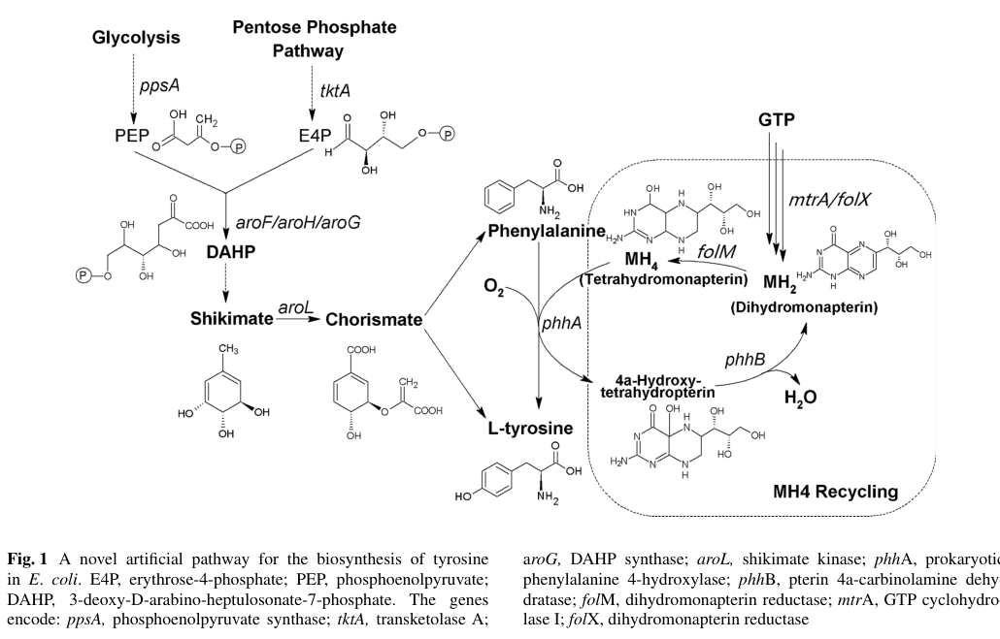

## Question

# Gene Research for Functional Annotation

## ⚠️ CRITICAL: Gene/Protein Identification Context

**BEFORE YOU BEGIN RESEARCH:** You MUST verify you are researching the CORRECT gene/protein. Gene symbols can be ambiguous, especially for less well-characterized genes from non-model organisms.

### Target Gene/Protein Identity (from UniProt):
- **UniProt Accession:** Q88EH2
- **Protein Description:** RecName: Full=Pterin-4-alpha-carbinolamine dehydratase; Short=PHS {ECO:0000255|HAMAP-Rule:MF_00434}; EC=4.2.1.96 {ECO:0000255|HAMAP-Rule:MF_00434}; AltName: Full=4-alpha-hydroxy-tetrahydropterin dehydratase {ECO:0000255|HAMAP-Rule:MF_00434}; AltName: Full=Pterin carbinolamine dehydratase {ECO:0000255|HAMAP-Rule:MF_00434}; Short=PCD {ECO:0000255|HAMAP-Rule:MF_00434};
- **Gene Information:** Name=phhB; OrderedLocusNames=PP_4491;
- **Organism (full):** Pseudomonas putida (strain ATCC 47054 / DSM 6125 / CFBP 8728 / NCIMB 11950 / KT2440).
- **Protein Family:** Belongs to the pterin-4-alpha-carbinolamine dehydratase
- **Key Domains:** PCD_sf. (IPR036428); Pterin-4-alpha-carb_dehyd. (IPR050376); Pterin_deHydtase. (IPR001533); Pterin_4a (PF01329)

### MANDATORY VERIFICATION STEPS:

1. **Check if the gene symbol "phhB" matches the protein description above**
2. **Verify the organism is correct:** Pseudomonas putida (strain ATCC 47054 / DSM 6125 / CFBP 8728 / NCIMB 11950 / KT2440).
3. **Check if protein family/domains align with what you find in literature**
4. **If you find literature for a DIFFERENT gene with the same or similar symbol, STOP**

### If Gene Symbol is Ambiguous or You Cannot Find Relevant Literature:

**DO NOT PROCEED WITH RESEARCH ON A DIFFERENT GENE.** Instead:
- State clearly: "The gene symbol 'phhB' is ambiguous or literature is limited for this specific protein"
- Explain what you found (e.g., "Found extensive literature on a different gene with the same symbol in a different organism")
- Describe the protein based ONLY on the UniProt information provided above
- Suggest that the protein function can be inferred from domain/family information

### Research Target:

Please provide a comprehensive research report on the gene **phhB** (gene ID: phhB, UniProt: Q88EH2) in PSEPK.

The research report should be a detailed narrative explaining the function, biological processes, and localization of the gene product. Citations should be given for all claims.

You should prioritize authoritative reviews and primary scientific literature when conducting research. You can supplement
this with annotations you find in gene/protein databases, but these can be outdated or inaccurate.

We are specifically interested in the primary function of the gene - for enzymes, what reaction is catalyzed, and what is the substrate specificity? For transporters, what is the substrate? For structural proteins or adapters, what is the broader structural role? For signaling molecules, what is the role in the pathway.

We are interested in where in or outside the cell the gene product carries out its function.

We are also interested in the signaling or biochemical pathways in which the gene functions. We are less interested in broad pleiotropic effects, except where these elucidate the precise role.

Include evidence where possible. We are interested in both experimental evidence as well as inference from structure, evolution, or bioinformatic analysis. Precise studies should be prioritized over high-throughput, where available.

## Output

Question: You are an expert researcher providing comprehensive, well-cited information.

Provide detailed information focusing on:
1. Key concepts and definitions with current understanding
2. Recent developments and latest research (prioritize 2023-2024 sources)
3. Current applications and real-world implementations
4. Expert opinions and analysis from authoritative sources
5. Relevant statistics and data from recent studies

Format as a comprehensive research report with proper citations. Include URLs and publication dates where available.
Always prioritize recent, authoritative sources and provide specific citations for all major claims.

# Gene Research for Functional Annotation

## ⚠️ CRITICAL: Gene/Protein Identification Context

**BEFORE YOU BEGIN RESEARCH:** You MUST verify you are researching the CORRECT gene/protein. Gene symbols can be ambiguous, especially for less well-characterized genes from non-model organisms.

### Target Gene/Protein Identity (from UniProt):
- **UniProt Accession:** Q88EH2
- **Protein Description:** RecName: Full=Pterin-4-alpha-carbinolamine dehydratase; Short=PHS {ECO:0000255|HAMAP-Rule:MF_00434}; EC=4.2.1.96 {ECO:0000255|HAMAP-Rule:MF_00434}; AltName: Full=4-alpha-hydroxy-tetrahydropterin dehydratase {ECO:0000255|HAMAP-Rule:MF_00434}; AltName: Full=Pterin carbinolamine dehydratase {ECO:0000255|HAMAP-Rule:MF_00434}; Short=PCD {ECO:0000255|HAMAP-Rule:MF_00434};
- **Gene Information:** Name=phhB; OrderedLocusNames=PP_4491;
- **Organism (full):** Pseudomonas putida (strain ATCC 47054 / DSM 6125 / CFBP 8728 / NCIMB 11950 / KT2440).
- **Protein Family:** Belongs to the pterin-4-alpha-carbinolamine dehydratase
- **Key Domains:** PCD_sf. (IPR036428); Pterin-4-alpha-carb_dehyd. (IPR050376); Pterin_deHydtase. (IPR001533); Pterin_4a (PF01329)

### MANDATORY VERIFICATION STEPS:

1. **Check if the gene symbol "phhB" matches the protein description above**
2. **Verify the organism is correct:** Pseudomonas putida (strain ATCC 47054 / DSM 6125 / CFBP 8728 / NCIMB 11950 / KT2440).
3. **Check if protein family/domains align with what you find in literature**
4. **If you find literature for a DIFFERENT gene with the same or similar symbol, STOP**

### If Gene Symbol is Ambiguous or You Cannot Find Relevant Literature:

**DO NOT PROCEED WITH RESEARCH ON A DIFFERENT GENE.** Instead:
- State clearly: "The gene symbol 'phhB' is ambiguous or literature is limited for this specific protein"
- Explain what you found (e.g., "Found extensive literature on a different gene with the same symbol in a different organism")
- Describe the protein based ONLY on the UniProt information provided above
- Suggest that the protein function can be inferred from domain/family information

### Research Target:

Please provide a comprehensive research report on the gene **phhB** (gene ID: phhB, UniProt: Q88EH2) in PSEPK.

The research report should be a detailed narrative explaining the function, biological processes, and localization of the gene product. Citations should be given for all claims.

You should prioritize authoritative reviews and primary scientific literature when conducting research. You can supplement
this with annotations you find in gene/protein databases, but these can be outdated or inaccurate.

We are specifically interested in the primary function of the gene - for enzymes, what reaction is catalyzed, and what is the substrate specificity? For transporters, what is the substrate? For structural proteins or adapters, what is the broader structural role? For signaling molecules, what is the role in the pathway.

We are interested in where in or outside the cell the gene product carries out its function.

We are also interested in the signaling or biochemical pathways in which the gene functions. We are less interested in broad pleiotropic effects, except where these elucidate the precise role.

Include evidence where possible. We are interested in both experimental evidence as well as inference from structure, evolution, or bioinformatic analysis. Precise studies should be prioritized over high-throughput, where available.

## Research Report: Functional annotation of **phhB** (UniProt **Q88EH2**, locus **PP_4491**) in *Pseudomonas putida* KT2440

### 0) Scope, identity verification, and limitations
This report is restricted to the protein specified by the user: UniProt accession **Q88EH2** from *Pseudomonas putida* strain KT2440, annotated as **pterin-4α-carbinolamine dehydratase** (PCD), enzyme class **EC 4.2.1.96** (also called PHS/PCD in bacterial literature). Direct KT2440-specific biochemical characterization of PP_4491/Q88EH2 was not retrieved with the current tool-enabled corpus; therefore, organism-specific conclusions are inferred from strong, direct experimental evidence in closely related bacterial systems (particularly *Pseudomonas aeruginosa* phhB) and from comparative/phylogenomic evidence for the conserved COG2154/PCD family. (naponelli2008phylogenomicandfunctional pages 1-2, thony2000tetrahydrobiopterinbiosynthesisregeneration pages 12-13)

### 1) Key concepts and definitions (current understanding)
#### 1.1 What is PhhB / pterin-4α-carbinolamine dehydratase (PCD)?
**Pterin-4α-carbinolamine dehydratase (PCD; PhhB)** is an enzyme that catalyzes a **dehydration** step in the recycling of reduced pterin cofactors used by **aromatic amino acid hydroxylases** (AAHs), including phenylalanine hydroxylase (PhhA/PAH). In AAH chemistry, the reduced tetrahydropterin cofactor is oxidized during substrate hydroxylation to a **4a-carbinolamine** intermediate; PCD dehydrates this intermediate to a **quinonoid dihydropterin** (q-dihydropterin), which is then reduced back to the tetrahydropterin by a **quinonoid dihydropterin reductase (DHPR/qDHPR)** using NAD(P)H. (naponelli2008phylogenomicandfunctional pages 1-2, thony2000tetrahydrobiopterinbiosynthesisregeneration pages 9-10, pribat2010folxandfolm pages 2-3)

A compact conceptual summary is:
- **AAH (e.g., PhhA)** performs amino-acid hydroxylation and generates a **4a-carbinolamine** pterin intermediate.
- **PhhB (PCD)** dehydrates the 4a-carbinolamine to a **quinonoid dihydropterin**.
- **DHPR/qDHPR** reduces quinonoid dihydropterin back to the active tetrahydropterin pool.

This role is described in both foundational biochemical reviews and phylogenomic synthesis of the bacterial PCD family. (thony2000tetrahydrobiopterinbiosynthesisregeneration pages 9-10, naponelli2008phylogenomicandfunctional pages 1-2)

#### 1.2 Reaction chemistry and substrate specificity
The PCD reaction is typically described as **dehydration of tetrahydropterin-4a-carbinolamine → quinonoid dihydropterin + H2O** in the cofactor regeneration cycle. (thony2000tetrahydrobiopterinbiosynthesisregeneration pages 9-10)

Mechanistic/structural studies of PCD in well-studied systems show that conserved histidines are crucial for catalysis; for example, the enzyme active site has been described as containing three essential conserved histidines (His-61, His-62, His-79 in human/rat numbering), where His-61 and His-79 act as general acid catalysts for elimination of the 4a-hydroxy group, and His-62 contributes primarily to substrate binding and base catalysis. (thony2000tetrahydrobiopterinbiosynthesisregeneration pages 9-10)

Although these mechanistic residue numbers come from mammalian PCD/DCoH, bacterial PCDs are described as homologous enzymes with conserved catalytic motifs, and bacterial PCDs are generally dimeric (whereas mammalian PCD/DCoH is tetrameric). (thony2000tetrahydrobiopterinbiosynthesisregeneration pages 10-12, naponelli2008phylogenomicandfunctional pages 1-2)

#### 1.3 BH4 versus MH4 (tetrahydrobiopterin versus tetrahydromonapterin)
In mammals the canonical reduced cofactor is **tetrahydrobiopterin (BH4)**, whereas in many bacteria the physiological reduced pterin cofactor for phenylalanine hydroxylase is proposed and experimentally supported to be **tetrahydromonapterin (H4-MPt; MH4)**. (naponelli2008phylogenomicandfunctional pages 1-2, pribat2010folxandfolm pages 1-2)

In a *Pseudomonas aeruginosa*–*E. coli* experimental system, genetic and pterin-measurement evidence supported **H4-MPt as the physiological cofactor** needed for bacterial phenylalanine hydroxylase function, implying that PhhB in pseudomonads is commonly embedded in an **MH4-based** cofactor cycle rather than a BH4-based cycle. (pribat2010folxandfolm pages 1-2, pribat2010folxandfolm pages 4-5)

### 2) Functional annotation of *P. putida* KT2440 PhhB (UniProt Q88EH2)
#### 2.1 Primary molecular function
For *P. putida* KT2440, the best-supported functional annotation for Q88EH2 is:
- **Enzymatic function:** pterin-4α-carbinolamine dehydratase (**EC 4.2.1.96**)
- **Biochemical role:** regenerates reduced tetrahydropterin cofactor by dehydrating **pterin-4α-carbinolamine** to **quinonoid dihydropterin**, enabling continued turnover of tetrahydropterin-dependent hydroxylases. (naponelli2008phylogenomicandfunctional pages 1-2, thony2000tetrahydrobiopterinbiosynthesisregeneration pages 9-10)

This assignment is consistent with bacterial phhB usage and the conserved COG2154/PCD family function. (naponelli2008phylogenomicandfunctional pages 1-2, naponelli2008phylogenomicandfunctional pages 1-1)

#### 2.2 Biological process / pathway context in pseudomonads
In *Pseudomonas* species, phenylalanine hydroxylase–associated pathways are commonly **catabolic**, converting **Phe → Tyr**, which can then be degraded via the **homogentisate pathway**. Phylogenomic analysis notes that in bacteria containing both AAH and COG2154/PCD genes, these genes are often adjacent and sometimes cluster with homogentisate pathway genes—supporting a metabolic module in aromatic amino acid catabolism. (naponelli2008phylogenomicandfunctional pages 1-2)

A canonical pseudomonad example is *P. aeruginosa*, where **phhB** occurs in a **multigene operon** with **phhA** (phenylalanine hydroxylase) and **phhC** (aromatic aminotransferase), i.e., a phhABC unit; and **PhhB is required for in vivo function of PhhA** (with functional substitution by mammalian PCD/DCoH). (thony2000tetrahydrobiopterinbiosynthesisregeneration pages 12-13)

For *P. putida* KT2440 specifically, operon structure and phenylalanine induction for PP_4491 were not retrieved here; nonetheless, the *Pseudomonas* phhABC paradigm provides the closest experimentally backed neighborhood model for interpreting Q88EH2. (thony2000tetrahydrobiopterinbiosynthesisregeneration pages 12-13, naponelli2008phylogenomicandfunctional pages 1-2)

#### 2.3 Subcellular localization (inference)
No direct subcellular localization experiment for *P. putida* Q88EH2 was retrieved. Given the chemistry (soluble cofactor recycling supporting cytosolic hydroxylases) and lack of evidence for signal peptides or membrane association in the retrieved literature, the most defensible working annotation is **intracellular (cytosolic) enzyme**. This should be considered an inference rather than a confirmed experimental localization for KT2440. (pribat2010folxandfolm pages 2-3, naponelli2008phylogenomicandfunctional pages 1-2)

### 3) Experimental evidence supporting the functional assignment (authoritative sources)
#### 3.1 Genetic evidence coupling PhhB to phenylalanine hydroxylase activity
A strong experimental linkage between PhhB and phenylalanine hydroxylase function comes from bacterial genetics and heterologous complementation:
- In *E. coli*, expression of *P. aeruginosa* **PhhA plus PhhB** can rescue **tyrosine auxotrophy**, demonstrating that a hydroxylase plus pterin recycling components can supply Tyr. (pribat2010folxandfolm pages 1-2)
- This rescue is **abrogated** when **folX** or **folM** are deleted (genes required for H4-MPt formation) and restored by complementation, tying the hydroxylation module to tetrahydromonapterin availability. (pribat2010folxandfolm pages 1-2, pribat2010folxandfolm pages 3-4)

#### 3.2 Quantitative pterin data supporting MH4/H4-MPt dominance in the bacterial cofactor system
Pribat et al. quantified pterin pools in *E. coli* and showed that tetrahydromonapterin-related flux can dominate pterin biosynthesis:
- Total pterins: **10.4 nmol/mg protein (WT)** vs **2.3 nmol/mg protein (ΔfolX)**; FolX-dependent difference ≈ **8.1 nmol/mg protein**.
- The FolX-mediated flux was reported as **~6-fold higher** than flux to folates (1.3 nmol/mg protein).
- A striking distribution: **~99%** of MPt and **~98%** of total pterin were extracellular in the measurements reported, indicating abundant production and export/accumulation outside cells in that assay context. (pribat2010folxandfolm pages 4-5)

These quantitative findings support the idea that in many bacteria, the tetrahydromonapterin system is substantial enough to support robust hydroxylase activity, and PhhB is a key component of maintaining reduced cofactor turnover. (pribat2010folxandfolm pages 4-5, pribat2010folxandfolm pages 3-4)

### 4) Recent developments and latest research (prioritize 2023–2024)
Direct 2023–2024 papers focusing specifically on bacterial **phhB** in *Pseudomonas putida* KT2440 were not retrieved. However, recent authoritative reviews updated the broader **BH4 recycling** framework and explicitly position **PCD** as a key recycling enzyme:

#### 4.1 2023: BH4 recycling framed as a tightly regulated, multi-pathway system
A 2023 review (Antioxidants) emphasizes that intracellular BH4 concentrations are maintained by three interacting routes (de novo, salvage, and recycling) and explicitly identifies **PCD** as part of the recycling pathway that forms **quinonoid dihydrobiopterin (qBH2)**, coupled to **DHPR** for regeneration of BH4. While focused on mammalian physiology, it provides current synthesis of how the PCD step fits into the broader cellular cofactor-maintenance logic. (eichwald2023tetrahydrobiopterinbeyondits pages 1-3, eichwald2023tetrahydrobiopterinbeyondits pages 7-9)

#### 4.2 2023: Continued clinical genetics emphasis reinforces the centrality of PCD in BH4 metabolism
A 2023 review (Genes) on inherited neurotransmitter disorders explicitly lists **PCD** among enzymes participating in BH4 synthesis/regeneration needed for phenylalanine, tyrosine, and tryptophan hydroxylases. This reinforces PCD’s central pathway placement in authoritative 2023 synthesis, although it is not bacterial-specific. (mastrangelo2023phenotypesandgenotypes pages 1-2)

**Interpretation for bacterial annotation:** Even though these 2023 sources focus on BH4 (not MH4) and on humans, they reaffirm the conceptual invariants relevant to bacterial PhhB homologs: (i) the 4a-carbinolamine dehydration step is essential for efficient cofactor cycling, and (ii) the dehydratase is functionally coupled to a reductase step (DHPR/qDHPR). (eichwald2023tetrahydrobiopterinbeyondits pages 1-3, eichwald2023tetrahydrobiopterinbeyondits pages 7-9)

### 5) Current applications and real-world implementations
#### 5.1 Metabolic engineering for tyrosine production (biotechnology implementation)
A practical implementation of bacterial phenylalanine hydroxylation with pterin recycling uses a phenylalanine hydroxylase (P4H/PhhA-type) plus an MH4 recycling system that includes **PhhB**:
- In engineered *E. coli*, expression of a bacterial phenylalanine 4-hydroxylase together with an MH4 recycling system including **pterin 4a-carbinolamine dehydratase from *P. aeruginosa*** enabled tyrosine accumulation to **262 mg/L after 48 h**.
- With additional engineering (including enhancing MH4 biosynthetic pathway expression), tyrosine production was elevated to **401 mg/L** in shake flasks in that study. (huang2015productionoftyrosine pages 1-3)

This is a clear, real-world use case where PhhB (PCD activity) is a functional module enabling sustained hydroxylation flux by maintaining reduced pterin cofactor turnover. (huang2015productionoftyrosine pages 1-3)

A pathway schematic explicitly placing **phhB** in this engineered module is shown in the study’s Figure 1. (huang2015productionoftyrosine media 73e4b1e8)

#### 5.2 Systems-level implication: PCD genes may have additional roles beyond AAH coupling
Phylogenomic work shows that many microbial COG2154 genes encode proteins with PCD activity even in genomes lacking aromatic amino acid hydroxylases, implying PCD-family proteins can persist without a canonical AAH partner and may support other pterin-dependent processes (hypothesized roles include interactions with other pterin-like cofactors such as molybdenum cofactor metabolism in some lineages). While this is not validated specifically for *P. putida* Q88EH2 in the retrieved corpus, it is an important caution in annotation: **presence of phhB/PCD does not guarantee presence of an AAH partner**, and conversely, PCD may have secondary functions in some organisms. (naponelli2008phylogenomicandfunctional pages 6-7, naponelli2008phylogenomicandfunctional pages 8-9)

### 6) Expert opinion and analysis (authoritative synthesis)
#### 6.1 Consensus view of PhhB function in bacteria
Across foundational biochemical review literature and comparative-genomics synthesis, the consensus is that PCD/PhhB is a **cofactor recycling enzyme** that supports tetrahydropterin-dependent hydroxylation by rapidly converting the 4a-carbinolamine intermediate to a reducible quinonoid dihydropterin species. (thony2000tetrahydrobiopterinbiosynthesisregeneration pages 9-10, naponelli2008phylogenomicandfunctional pages 1-2)

This consensus is reinforced by direct genetic evidence in pseudomonads: *P. aeruginosa* **PhhB is required for in vivo function** of phenylalanine hydroxylase PhhA and is encoded alongside phhA and phhC in an operon, supporting its role as part of a functional phenylalanine catabolic module. (thony2000tetrahydrobiopterinbiosynthesisregeneration pages 12-13)

#### 6.2 Enzyme-family signals for correct functional annotation
A key expert-level caution is that many genome annotations label COG2154 proteins as PCD without checking motif conservation and functional evidence; phylogenomic work provides an expanded conserved motif signature to better identify catalytically competent PCDs. This matters for robust annotation of Q88EH2-like proteins in bacteria, including distinguishing likely active PCD enzymes from more divergent family members. (naponelli2008phylogenomicandfunctional pages 1-2, naponelli2008phylogenomicandfunctional pages 8-9)

### 7) Relevant statistics and data (from recent or highly informative studies)
- **Tyrosine production enabled by PhhB-containing recycling:** 262 mg/L tyrosine at 48 h in engineered *E. coli* expressing bacterial phenylalanine hydroxylase plus MH4 recycling including *Pseudomonas* PhhB; up to 401 mg/L with additional engineering. (huang2015productionoftyrosine pages 1-3)
- **Bacterial pterin pool magnitudes/fluxes:** total pterins 10.4 nmol/mg protein (WT) vs 2.3 nmol/mg (ΔfolX), FolX-dependent difference ~8.1 nmol/mg protein; FolX-mediated MPt flux ~6-fold higher than folate flux; ~99% MPt and ~98% total pterin extracellular in reported measurements. (pribat2010folxandfolm pages 4-5)
- **Mechanistic inhibition relationship:** in PCD mechanistic studies, the quinonoid dihydropterin product can inhibit PCD with Ki ≈ one-half of Km (reported in the BH4 context). (thony2000tetrahydrobiopterinbiosynthesisregeneration pages 9-10)

### 8) Summary annotation for Q88EH2 (phhB) in *P. putida* KT2440
**Most likely primary function:** soluble **pterin-4α-carbinolamine dehydratase** (EC 4.2.1.96) that supports tetrahydropterin-dependent hydroxylation by recycling the oxidized 4a-carbinolamine intermediate to a quinonoid dihydropterin, enabling reduction back to active tetrahydropterin. (naponelli2008phylogenomicandfunctional pages 1-2, thony2000tetrahydrobiopterinbiosynthesisregeneration pages 9-10)

**Most likely pathway role in pseudomonads:** component of a phenylalanine hydroxylase-linked module converting **Phe → Tyr** feeding aromatic catabolism (often associated with homogentisate pathway gene clustering in bacteria that carry AAH+PCD modules). (naponelli2008phylogenomicandfunctional pages 1-2)

**Cofactor context:** bacterial hydroxylation systems in *Pseudomonas* commonly use **tetrahydromonapterin (H4-MPt; MH4)** rather than BH4 as the physiological reduced pterin cofactor; therefore, PhhB in *P. putida* is most plausibly part of an **MH4** cofactor recycling system. (pribat2010folxandfolm pages 1-2, pribat2010folxandfolm pages 4-5)

**Localization:** likely cytosolic/intracellular; not experimentally verified for KT2440 in retrieved sources. (pribat2010folxandfolm pages 2-3)

### Key figure supporting pathway role
The following figure visually summarizes the engineered bacterial phenylalanine-to-tyrosine hydroxylation module including **phhB** as the pterin 4a-carbinolamine dehydratase component of MH4 recycling. (huang2015productionoftyrosine media 73e4b1e8)

### Evidence map table (quick reference)
| Aspect | Summary for bacterial PhhB/PCD relevant to *Pseudomonas putida* KT2440 Q88EH2 | Evidence / quantitative details |
|---|---|---|
| Enzyme identity | PhhB is pterin-4a-carbinolamine dehydratase (PCD; also called pterin carbinolamine dehydratase), EC 4.2.1.96; bacterial homologs are typically dimeric, unlike tetrameric mammalian PCD/DCoH. This matches the UniProt assignment for Q88EH2 and the conserved bacterial PCD family. (naponelli2008phylogenomicandfunctional pages 1-2, thony2000tetrahydrobiopterinbiosynthesisregeneration pages 10-12) | Conserved catalytic motif summarized for canonical PCDs as approximately [DE]-x(3)-H-H-P-x(5)-[YW]-x(9)-H-x(8)-D; broader active-family motif proposed from phylogenomic analysis. (naponelli2008phylogenomicandfunctional pages 1-2, naponelli2008phylogenomicandfunctional pages 8-9) |
| Catalyzed reaction | PhhB/PCD dehydrates the 4a-carbinolamine formed after aromatic amino acid hydroxylase turnover, converting pterin-4a-carbinolamine to quinonoid dihydropterin (q-dihydropterin). In the phenylalanine hydroxylase system this follows PhhA-catalyzed hydroxylation of Phe to Tyr. (naponelli2008phylogenomicandfunctional pages 1-2, thony2000tetrahydrobiopterinbiosynthesisregeneration pages 9-10) | Reaction sequence: tetrahydropterin + O2 + amino acid hydroxylase → 4a-carbinolamine intermediate; PhhB dehydrates this intermediate; qDHPR/DHPR then reduces quinonoid dihydropterin back to tetrahydropterin. (naponelli2008phylogenomicandfunctional pages 1-2, pribat2010folxandfolm pages 2-3) |
| Pathway role with PhhA and qDHPR/DHPR | Core role is cofactor recycling for bacterial phenylalanine hydroxylase (PhhA), sustaining Phe → Tyr conversion and downstream catabolism through the homogentisate pathway in pseudomonads and related bacteria. (naponelli2008phylogenomicandfunctional pages 1-2) | In *P. aeruginosa*, PhhB is required for in vivo PhhA function; mammalian PCD/DCoH can substitute functionally, supporting conserved biochemical role. (thony2000tetrahydrobiopterinbiosynthesisregeneration pages 12-13) |
| Cofactor context | Mammalian aromatic amino acid hydroxylases use tetrahydrobiopterin (BH4), whereas bacterial systems such as *Pseudomonas* are inferred and experimentally supported to use tetrahydromonapterin (MH4/H4-MPt) as the physiological cofactor. (naponelli2008phylogenomicandfunctional pages 1-2, pribat2010folxandfolm pages 1-2, pribat2010folxandfolm pages 3-4) | *Pribat et al.* established H4-MPt as the physiological cofactor for *P. aeruginosa* PhhA using folX/folM genetics and pterin measurements. (pribat2010folxandfolm pages 1-2, pribat2010folxandfolm pages 3-4) |
| Genetic evidence | Heterologous expression of *P. aeruginosa* PhhA plus PhhB rescues tyrosine auxotrophy in *E. coli*; this rescue is abolished by deleting folX or folM and restored by complementation, linking PhhB-dependent hydroxylation to MH4 biosynthesis/recycling. (pribat2010folxandfolm pages 1-2, pribat2010folxandfolm pages 3-4) | In *P. aeruginosa*, a tyrA mutant is tyrosine prototrophic, but tyrA folX becomes auxotrophic, showing that the phenylalanine hydroxylase route depends on tetrahydromonapterin supply. (pribat2010folxandfolm pages 1-2) |
| Biochemical / mechanistic evidence | PCD was identified because it stimulates phenylalanine hydroxylation by catalyzing dehydration of the 4a-carbinolamine intermediate; bacterial and mammalian data support the same core chemistry. (thony2000tetrahydrobiopterinbiosynthesisregeneration pages 9-10, thony2000tetrahydrobiopterinbiosynthesisregeneration pages 12-13) | Mechanistic residues from the well-studied PCD system: His-61 and His-79 act as general acid catalysts for elimination of the 4a(R) and 4a(S) hydroxy groups, respectively; His-62 primarily binds substrate and contributes base catalysis; His61Ala/His62Ala double mutant is inactive. Product quinonoid dihydrobiopterin inhibits PCD with Ki about one-half of Km. (thony2000tetrahydrobiopterinbiosynthesisregeneration pages 9-10) |
| Comparative-genomics evidence | COG2154/PCD genes frequently co-occur with aromatic amino acid hydroxylase genes in bacteria and are often adjacent; in pseudomonads they may also cluster with homogentisate pathway genes, supporting a catabolic Phe → Tyr → homogentisate route. (naponelli2008phylogenomicandfunctional pages 1-2) | Phylogenomic analysis also showed many microbial COG2154 proteins have PCD activity even without adjacent AAH genes, implying possible secondary functions beyond PhhA support. (naponelli2008phylogenomicandfunctional pages 1-1, naponelli2008phylogenomicandfunctional pages 8-9) |
| Operon / neighborhood notes | Authoritative review evidence places *P. aeruginosa* phhB in a multigene operon with phhA (phenylalanine hydroxylase) and phhC (aromatic aminotransferase), i.e., phhABC. This is the closest experimentally characterized neighborhood model for interpreting *P. putida* phhB. (thony2000tetrahydrobiopterinbiosynthesisregeneration pages 12-13) | Comparative-genomics review further notes adjacency of bacterial PCD and AAH genes and occasional clustering with homogentisate genes. Direct *P. putida* KT2440 operon validation was not found in the retrieved literature. (naponelli2008phylogenomicandfunctional pages 1-2) |
| Localization | No direct experimental subcellular localization for *P. putida* Q88EH2 was found in the retrieved literature. Given its role in soluble tetrahydropterin recycling for cytosolic PhhA chemistry and lack of membrane-targeting evidence in the cited work, the most defensible annotation is intracellular/cytosolic enzyme. (thony2000tetrahydrobiopterinbiosynthesisregeneration pages 12-13, pribat2010folxandfolm pages 2-3) | Evidence is inferential rather than direct for *P. putida*; no periplasmic/export or membrane association data were retrieved. (thony2000tetrahydrobiopterinbiosynthesisregeneration pages 12-13, pribat2010folxandfolm pages 2-3) |
| Quantitative pterin data | In *E. coli* model experiments supporting the *Pseudomonas* pathway, total pterins were 10.4 nmol/mg protein in wild type versus 2.3 nmol/mg in a folX deletant; FolX-dependent difference was ~8.1 nmol/mg protein, about 6-fold higher than flux to folates. Nearly all MPt/total pterin was extracellular: ~95–99% MPt and ~98% total pterin extracellular. (pribat2010folxandfolm pages 4-5, pribat2010folxandfolm pages 3-4) | These data strongly support abundant H4-MPt production and turnover in the bacterial cofactor context used by PhhA/PhhB. (pribat2010folxandfolm pages 4-5, pribat2010folxandfolm pages 3-4) |
| Quantitative application data | In engineered *E. coli*, expression of bacterial phenylalanine 4-hydroxylase with MH4 recycling enzymes including PhhB enabled tyrosine accumulation to 262 mg/L after 48 h; with additional pathway engineering, tyrosine reached 401 mg/L in shake flasks. (huang2015productionoftyrosine pages 1-3) | Figure-based pathway depiction explicitly places phhB in the artificial MH4 recycling module with phhA, folM, and folX. (huang2015productionoftyrosine pages 1-3, huang2015productionoftyrosine media 73e4b1e8) |
| Functional-annotation take-home | For *P. putida* KT2440 Q88EH2, the best-supported annotation is a soluble pterin-4a-carbinolamine dehydratase that recycles the tetrahydropterin cofactor used by bacterial phenylalanine hydroxylase, most likely in an MH4-dependent Phe-to-Tyr catabolic context analogous to characterized *Pseudomonas* systems. (naponelli2008phylogenomicandfunctional pages 1-2, thony2000tetrahydrobiopterinbiosynthesisregeneration pages 12-13, pribat2010folxandfolm pages 1-2) | Limitation: direct *P. putida* KT2440 biochemical characterization was not recovered; annotation rests on UniProt identity plus strong cross-species evidence from *Pseudomonas* and broader bacterial PCD literature. (naponelli2008phylogenomicandfunctional pages 1-2, thony2000tetrahydrobiopterinbiosynthesisregeneration pages 12-13) |

*Table: This table condenses the main functional-annotation facts for bacterial PhhB/PCD relevant to *Pseudomonas putida* KT2440 Q88EH2, including reaction chemistry, pathway role, genomic context, and quantitative evidence. It is useful as a quick evidence map linking the UniProt assignment to primary and review literature.*

References

1. (naponelli2008phylogenomicandfunctional pages 1-2): Valeria Naponelli, Alexandre Noiriel, Michael J. Ziemak, Stephen M. Beverley, Lon-Fye Lye, Andrew M. Plume, José Ramon Botella, Karen Loizeau, Stéphane Ravanel, Fabrice Rébeillé, Valérie de Crécy-Lagard, and Andrew D. Hanson. Phylogenomic and functional analysis of pterin-4a-carbinolamine dehydratase family (cog2154) proteins in plants and microorganisms. Plant Physiology, 146:1515-1527, Feb 2008. URL: https://doi.org/10.1104/pp.107.114090, doi:10.1104/pp.107.114090. This article has 43 citations and is from a highest quality peer-reviewed journal.

2. (thony2000tetrahydrobiopterinbiosynthesisregeneration pages 12-13): Beat THÖNY, Günter AUERBACH, and Nenad BLAU. Tetrahydrobiopterin biosynthesis, regeneration and functions. The Biochemical journal, 347 Pt 1:1-16, Apr 2000. URL: https://doi.org/10.1042/bj3470001, doi:10.1042/bj3470001. This article has 1113 citations.

3. (thony2000tetrahydrobiopterinbiosynthesisregeneration pages 9-10): Beat THÖNY, Günter AUERBACH, and Nenad BLAU. Tetrahydrobiopterin biosynthesis, regeneration and functions. The Biochemical journal, 347 Pt 1:1-16, Apr 2000. URL: https://doi.org/10.1042/bj3470001, doi:10.1042/bj3470001. This article has 1113 citations.

4. (pribat2010folxandfolm pages 2-3): Anne Pribat, Ian K. Blaby, Aurora Lara-Núñez, Jesse F. Gregory, Valérie de Crécy-Lagard, and Andrew D. Hanson. Folx and folm are essential for tetrahydromonapterin synthesis in <i>escherichia coli</i> and <i>pseudomonas aeruginosa</i>. Journal of Bacteriology, 192:475-482, Jan 2010. URL: https://doi.org/10.1128/jb.01198-09, doi:10.1128/jb.01198-09. This article has 71 citations and is from a peer-reviewed journal.

5. (thony2000tetrahydrobiopterinbiosynthesisregeneration pages 10-12): Beat THÖNY, Günter AUERBACH, and Nenad BLAU. Tetrahydrobiopterin biosynthesis, regeneration and functions. The Biochemical journal, 347 Pt 1:1-16, Apr 2000. URL: https://doi.org/10.1042/bj3470001, doi:10.1042/bj3470001. This article has 1113 citations.

6. (pribat2010folxandfolm pages 1-2): Anne Pribat, Ian K. Blaby, Aurora Lara-Núñez, Jesse F. Gregory, Valérie de Crécy-Lagard, and Andrew D. Hanson. Folx and folm are essential for tetrahydromonapterin synthesis in <i>escherichia coli</i> and <i>pseudomonas aeruginosa</i>. Journal of Bacteriology, 192:475-482, Jan 2010. URL: https://doi.org/10.1128/jb.01198-09, doi:10.1128/jb.01198-09. This article has 71 citations and is from a peer-reviewed journal.

7. (pribat2010folxandfolm pages 4-5): Anne Pribat, Ian K. Blaby, Aurora Lara-Núñez, Jesse F. Gregory, Valérie de Crécy-Lagard, and Andrew D. Hanson. Folx and folm are essential for tetrahydromonapterin synthesis in <i>escherichia coli</i> and <i>pseudomonas aeruginosa</i>. Journal of Bacteriology, 192:475-482, Jan 2010. URL: https://doi.org/10.1128/jb.01198-09, doi:10.1128/jb.01198-09. This article has 71 citations and is from a peer-reviewed journal.

8. (naponelli2008phylogenomicandfunctional pages 1-1): Valeria Naponelli, Alexandre Noiriel, Michael J. Ziemak, Stephen M. Beverley, Lon-Fye Lye, Andrew M. Plume, José Ramon Botella, Karen Loizeau, Stéphane Ravanel, Fabrice Rébeillé, Valérie de Crécy-Lagard, and Andrew D. Hanson. Phylogenomic and functional analysis of pterin-4a-carbinolamine dehydratase family (cog2154) proteins in plants and microorganisms. Plant Physiology, 146:1515-1527, Feb 2008. URL: https://doi.org/10.1104/pp.107.114090, doi:10.1104/pp.107.114090. This article has 43 citations and is from a highest quality peer-reviewed journal.

9. (pribat2010folxandfolm pages 3-4): Anne Pribat, Ian K. Blaby, Aurora Lara-Núñez, Jesse F. Gregory, Valérie de Crécy-Lagard, and Andrew D. Hanson. Folx and folm are essential for tetrahydromonapterin synthesis in <i>escherichia coli</i> and <i>pseudomonas aeruginosa</i>. Journal of Bacteriology, 192:475-482, Jan 2010. URL: https://doi.org/10.1128/jb.01198-09, doi:10.1128/jb.01198-09. This article has 71 citations and is from a peer-reviewed journal.

10. (eichwald2023tetrahydrobiopterinbeyondits pages 1-3): Tuany Eichwald, Lucila de Bortoli da da Silva, Ananda Christina Staats Staats Pires, Laís Niero, Erick Schnorrenberger, Clovis Colpani Filho, Gisele Espíndola, Wei-Lin Huang, Gilles J. Guillemin, José E. Abdenur, and Alexandra Latini. Tetrahydrobiopterin: beyond its traditional role as a cofactor. Antioxidants, 12:1037, May 2023. URL: https://doi.org/10.3390/antiox12051037, doi:10.3390/antiox12051037. This article has 88 citations.

11. (eichwald2023tetrahydrobiopterinbeyondits pages 7-9): Tuany Eichwald, Lucila de Bortoli da da Silva, Ananda Christina Staats Staats Pires, Laís Niero, Erick Schnorrenberger, Clovis Colpani Filho, Gisele Espíndola, Wei-Lin Huang, Gilles J. Guillemin, José E. Abdenur, and Alexandra Latini. Tetrahydrobiopterin: beyond its traditional role as a cofactor. Antioxidants, 12:1037, May 2023. URL: https://doi.org/10.3390/antiox12051037, doi:10.3390/antiox12051037. This article has 88 citations.

12. (mastrangelo2023phenotypesandgenotypes pages 1-2): Mario Mastrangelo, Manuela Tolve, Cristiana Artiola, Rossella Bove, Claudia Carducci, Carla Carducci, Antonio Angeloni, Francesco Pisani, and Vincenzo Leuzzi. Phenotypes and genotypes of inherited disorders of biogenic amine neurotransmitter metabolism. Genes, 14:263, Jan 2023. URL: https://doi.org/10.3390/genes14020263, doi:10.3390/genes14020263. This article has 9 citations.

13. (huang2015productionoftyrosine pages 1-3): Jin Huang, Yuheng Lin, Qipeng Yuan, and Yajun Yan. Production of tyrosine through phenylalanine hydroxylation bypasses the intrinsic feedback inhibition in <i>escherichia coli</i>. Journal of Industrial Microbiology and Biotechnology, 42:655-659, Apr 2015. URL: https://doi.org/10.1007/s10295-015-1591-z, doi:10.1007/s10295-015-1591-z. This article has 16 citations and is from a peer-reviewed journal.

14. (huang2015productionoftyrosine media 73e4b1e8): Jin Huang, Yuheng Lin, Qipeng Yuan, and Yajun Yan. Production of tyrosine through phenylalanine hydroxylation bypasses the intrinsic feedback inhibition in <i>escherichia coli</i>. Journal of Industrial Microbiology and Biotechnology, 42:655-659, Apr 2015. URL: https://doi.org/10.1007/s10295-015-1591-z, doi:10.1007/s10295-015-1591-z. This article has 16 citations and is from a peer-reviewed journal.

15. (naponelli2008phylogenomicandfunctional pages 6-7): Valeria Naponelli, Alexandre Noiriel, Michael J. Ziemak, Stephen M. Beverley, Lon-Fye Lye, Andrew M. Plume, José Ramon Botella, Karen Loizeau, Stéphane Ravanel, Fabrice Rébeillé, Valérie de Crécy-Lagard, and Andrew D. Hanson. Phylogenomic and functional analysis of pterin-4a-carbinolamine dehydratase family (cog2154) proteins in plants and microorganisms. Plant Physiology, 146:1515-1527, Feb 2008. URL: https://doi.org/10.1104/pp.107.114090, doi:10.1104/pp.107.114090. This article has 43 citations and is from a highest quality peer-reviewed journal.

16. (naponelli2008phylogenomicandfunctional pages 8-9): Valeria Naponelli, Alexandre Noiriel, Michael J. Ziemak, Stephen M. Beverley, Lon-Fye Lye, Andrew M. Plume, José Ramon Botella, Karen Loizeau, Stéphane Ravanel, Fabrice Rébeillé, Valérie de Crécy-Lagard, and Andrew D. Hanson. Phylogenomic and functional analysis of pterin-4a-carbinolamine dehydratase family (cog2154) proteins in plants and microorganisms. Plant Physiology, 146:1515-1527, Feb 2008. URL: https://doi.org/10.1104/pp.107.114090, doi:10.1104/pp.107.114090. This article has 43 citations and is from a highest quality peer-reviewed journal.

## Artifacts

- [Edison artifact artifact-00](phhB-deep-research-falcon_artifacts/artifact-00.md)

## Citations

1. thony2000tetrahydrobiopterinbiosynthesisregeneration pages 9-10
2. naponelli2008phylogenomicandfunctional pages 1-2
3. thony2000tetrahydrobiopterinbiosynthesisregeneration pages 12-13
4. pribat2010folxandfolm pages 1-2
5. pribat2010folxandfolm pages 4-5
6. mastrangelo2023phenotypesandgenotypes pages 1-2
7. huang2015productionoftyrosine pages 1-3
8. pribat2010folxandfolm pages 2-3
9. thony2000tetrahydrobiopterinbiosynthesisregeneration pages 10-12
10. naponelli2008phylogenomicandfunctional pages 1-1
11. pribat2010folxandfolm pages 3-4
12. eichwald2023tetrahydrobiopterinbeyondits pages 1-3
13. eichwald2023tetrahydrobiopterinbeyondits pages 7-9
14. naponelli2008phylogenomicandfunctional pages 6-7
15. naponelli2008phylogenomicandfunctional pages 8-9
16. DE
17. YW
18. https://doi.org/10.1104/pp.107.114090,
19. https://doi.org/10.1042/bj3470001,
20. https://doi.org/10.1128/jb.01198-09,
21. https://doi.org/10.3390/antiox12051037,
22. https://doi.org/10.3390/genes14020263,
23. https://doi.org/10.1007/s10295-015-1591-z,