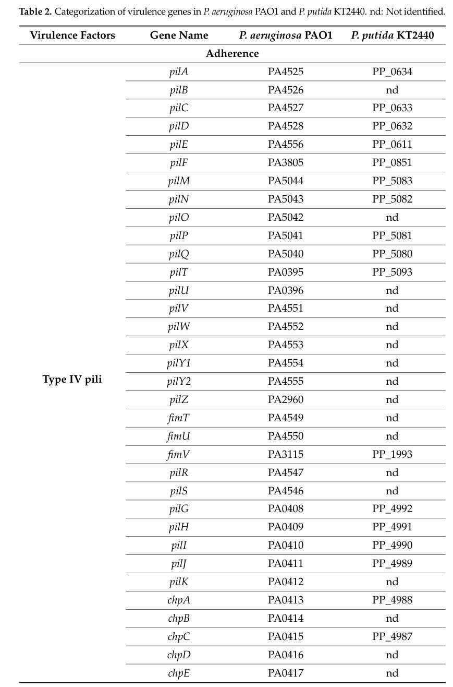

## Question

# Gene Research for Functional Annotation

## ⚠️ CRITICAL: Gene/Protein Identification Context

**BEFORE YOU BEGIN RESEARCH:** You MUST verify you are researching the CORRECT gene/protein. Gene symbols can be ambiguous, especially for less well-characterized genes from non-model organisms.

### Target Gene/Protein Identity (from UniProt):
- **UniProt Accession:** Q88Q62
- **Protein Description:** RecName: Full=Pilin {ECO:0000256|ARBA:ARBA00029638};
- **Gene Information:** Name=pilA {ECO:0000313|EMBL:AAN66259.1}; OrderedLocusNames=PP_0634 {ECO:0000313|EMBL:AAN66259.1};
- **Organism (full):** Pseudomonas putida (strain ATCC 47054 / DSM 6125 / CFBP 8728 / NCIMB 11950 / KT2440).
- **Protein Family:** Belongs to the N-Me-Phe pilin family.
- **Key Domains:** GSPG_pilin. (IPR000983); N_methyl_site. (IPR012902); Pilin. (IPR001082); Pilin-like. (IPR045584); N_methyl (PF07963)

### MANDATORY VERIFICATION STEPS:

1. **Check if the gene symbol "pilA" matches the protein description above**
2. **Verify the organism is correct:** Pseudomonas putida (strain ATCC 47054 / DSM 6125 / CFBP 8728 / NCIMB 11950 / KT2440).
3. **Check if protein family/domains align with what you find in literature**
4. **If you find literature for a DIFFERENT gene with the same or similar symbol, STOP**

### If Gene Symbol is Ambiguous or You Cannot Find Relevant Literature:

**DO NOT PROCEED WITH RESEARCH ON A DIFFERENT GENE.** Instead:
- State clearly: "The gene symbol 'pilA' is ambiguous or literature is limited for this specific protein"
- Explain what you found (e.g., "Found extensive literature on a different gene with the same symbol in a different organism")
- Describe the protein based ONLY on the UniProt information provided above
- Suggest that the protein function can be inferred from domain/family information

### Research Target:

Please provide a comprehensive research report on the gene **pilA** (gene ID: pilA, UniProt: Q88Q62) in PSEPK.

The research report should be a detailed narrative explaining the function, biological processes, and localization of the gene product. Citations should be given for all claims.

You should prioritize authoritative reviews and primary scientific literature when conducting research. You can supplement
this with annotations you find in gene/protein databases, but these can be outdated or inaccurate.

We are specifically interested in the primary function of the gene - for enzymes, what reaction is catalyzed, and what is the substrate specificity? For transporters, what is the substrate? For structural proteins or adapters, what is the broader structural role? For signaling molecules, what is the role in the pathway.

We are interested in where in or outside the cell the gene product carries out its function.

We are also interested in the signaling or biochemical pathways in which the gene functions. We are less interested in broad pleiotropic effects, except where these elucidate the precise role.

Include evidence where possible. We are interested in both experimental evidence as well as inference from structure, evolution, or bioinformatic analysis. Precise studies should be prioritized over high-throughput, where available.

## Output

Question: You are an expert researcher providing comprehensive, well-cited information.

Provide detailed information focusing on:
1. Key concepts and definitions with current understanding
2. Recent developments and latest research (prioritize 2023-2024 sources)
3. Current applications and real-world implementations
4. Expert opinions and analysis from authoritative sources
5. Relevant statistics and data from recent studies

Format as a comprehensive research report with proper citations. Include URLs and publication dates where available.
Always prioritize recent, authoritative sources and provide specific citations for all major claims.

# Gene Research for Functional Annotation

## ⚠️ CRITICAL: Gene/Protein Identification Context

**BEFORE YOU BEGIN RESEARCH:** You MUST verify you are researching the CORRECT gene/protein. Gene symbols can be ambiguous, especially for less well-characterized genes from non-model organisms.

### Target Gene/Protein Identity (from UniProt):
- **UniProt Accession:** Q88Q62
- **Protein Description:** RecName: Full=Pilin {ECO:0000256|ARBA:ARBA00029638};
- **Gene Information:** Name=pilA {ECO:0000313|EMBL:AAN66259.1}; OrderedLocusNames=PP_0634 {ECO:0000313|EMBL:AAN66259.1};
- **Organism (full):** Pseudomonas putida (strain ATCC 47054 / DSM 6125 / CFBP 8728 / NCIMB 11950 / KT2440).
- **Protein Family:** Belongs to the N-Me-Phe pilin family.
- **Key Domains:** GSPG_pilin. (IPR000983); N_methyl_site. (IPR012902); Pilin. (IPR001082); Pilin-like. (IPR045584); N_methyl (PF07963)

### MANDATORY VERIFICATION STEPS:

1. **Check if the gene symbol "pilA" matches the protein description above**
2. **Verify the organism is correct:** Pseudomonas putida (strain ATCC 47054 / DSM 6125 / CFBP 8728 / NCIMB 11950 / KT2440).
3. **Check if protein family/domains align with what you find in literature**
4. **If you find literature for a DIFFERENT gene with the same or similar symbol, STOP**

### If Gene Symbol is Ambiguous or You Cannot Find Relevant Literature:

**DO NOT PROCEED WITH RESEARCH ON A DIFFERENT GENE.** Instead:
- State clearly: "The gene symbol 'pilA' is ambiguous or literature is limited for this specific protein"
- Explain what you found (e.g., "Found extensive literature on a different gene with the same symbol in a different organism")
- Describe the protein based ONLY on the UniProt information provided above
- Suggest that the protein function can be inferred from domain/family information

### Research Target:

Please provide a comprehensive research report on the gene **pilA** (gene ID: pilA, UniProt: Q88Q62) in PSEPK.

The research report should be a detailed narrative explaining the function, biological processes, and localization of the gene product. Citations should be given for all claims.

You should prioritize authoritative reviews and primary scientific literature when conducting research. You can supplement
this with annotations you find in gene/protein databases, but these can be outdated or inaccurate.

We are specifically interested in the primary function of the gene - for enzymes, what reaction is catalyzed, and what is the substrate specificity? For transporters, what is the substrate? For structural proteins or adapters, what is the broader structural role? For signaling molecules, what is the role in the pathway.

We are interested in where in or outside the cell the gene product carries out its function.

We are also interested in the signaling or biochemical pathways in which the gene functions. We are less interested in broad pleiotropic effects, except where these elucidate the precise role.

Include evidence where possible. We are interested in both experimental evidence as well as inference from structure, evolution, or bioinformatic analysis. Precise studies should be prioritized over high-throughput, where available.

## Research report: Functional annotation of **pilA** (UniProt **Q88Q62**; locus **PP_0634**) in *Pseudomonas putida* KT2440

### Executive summary
**PilA (PP_0634; UniProt Q88Q62)** in *Pseudomonas putida* KT2440 is the predicted **major type IV pilin** subunit (N‑methyl‑phenylalanine pilin family) that polymerizes into **type IV pili (T4P)**—dynamic extracellular filaments involved broadly in **surface adhesion, twitching motility, biofilm development, and DNA uptake** in many bacteria. Direct KT2440 experimental characterization of PilA itself was limited in the retrieved corpus; however, KT2440-specific genome analyses map **pilA → PP_0634** and indicate KT2440 retains a **partial T4P gene set**, including **pilA, pilC, pilD**, and **pilT**, while lacking some canonical components such as **pilB** (with a hypothesis of functional compensation by **xcpR** in the type II secretion machinery). Mechanistic details of PilA maturation, localization, and function are well-established in authoritative T4P literature and align with the UniProt family/domain annotation for Q88Q62. (udaondo2025transcriptionalregulatorysystems pages 12-14, udaondo2025transcriptionalregulatorysystems media 6adbec71, santos2004insightsintothe pages 10-11, mattick2002typeivpili pages 8-10, burrows2012pseudomonasaeruginosatwitching pages 11-13, little2024typeivpili pages 6-8)

---

### 1) Mandatory verification: correct gene/protein identity (disambiguation)

**Gene symbol ambiguity:** “pilA” is widely used across bacteria for major pilin proteins; therefore, KT2440-specific mapping is required.

**KT2440 mapping to PP_0634 (target confirmation):** A comparative table of type IV pili genes explicitly maps *P. putida* KT2440 **pilA** to locus tag **PP_0634** (with *P. aeruginosa* PAO1 pilA = PA4525), confirming that KT2440 “pilA” corresponds to **PP_0634** and thus supports the UniProt-provided target identity (Q88Q62). (udaondo2025transcriptionalregulatorysystems pages 12-14, udaondo2025transcriptionalregulatorysystems media 6adbec71)

**Scope control:** All evidence about “pilA/PilA” from other organisms (e.g., *P. aeruginosa*, Enterobacteriaceae) is used **only** to support conserved mechanistic inference about major pilins; it is not treated as direct KT2440 PilA experimentation. (mattick2002typeivpili pages 8-10, burrows2012pseudomonasaeruginosatwitching pages 11-13, little2024typeivpili pages 6-8)

---

### 2) Key concepts and definitions (current understanding)

#### 2.1 What is PilA?
PilA is generally the **major pilin** subunit of type IV pili: a small protein (~145–160 aa typical) that polymerizes to form a long helical surface filament. (mattick2002typeivpili pages 8-10)

#### 2.2 Type IV pili (T4P) as a system
T4P are retractile surface filaments used for multiple functions. Canonical associations include **twitching motility** (surface translocation), **adhesion**, **microcolony/biofilm formation**, and **DNA uptake** (natural transformation) in many species. (mattick2002typeivpili pages 8-10, little2024typeivpili pages 2-4)

#### 2.3 Structural parameters
T4P filaments are typically ~**5–7 nm** in diameter with ~**5 subunits per helical turn** (reviewed for type IV pili and twitching motility). (mattick2002typeivpili pages 8-10)

---

### 3) PilA maturation, processing, and biochemical features

PilA is synthesized as a **prepilin** with an N-terminal leader peptide that must be processed for assembly.

**Leader cleavage and N-methylation by PilD:** Authoritative reviews describe the dedicated **prepilin peptidase PilD** as performing (i) cleavage of the N-terminal leader peptide and (ii) **N-methylation** of the newly exposed N-terminus. (mattick2002typeivpili pages 8-10, burrows2012pseudomonasaeruginosatwitching pages 11-13, little2024typeivpili pages 6-8)

**N-methyl-phenylalanine hallmark:** In many type IVa systems, the mature pilin N-terminus is frequently **N‑methyl‑phenylalanine**, consistent with the UniProt statement that KT2440 Q88Q62 belongs to the **N‑Me‑Phe pilin family**. (mattick2002typeivpili pages 8-10, little2024typeivpili pages 6-8)

**Conserved Glu5:** Major pilins commonly possess a conserved acidic residue at position +5 (often **Glu5**) important for assembly and efficient processing/methylation in multiple systems. (mattick2002typeivpili pages 8-10, little2024typeivpili pages 6-8, mattick2002typeivpili pages 12-14)

**Implication for KT2440 Q88Q62:** While the retrieved texts do not provide the KT2440 PilA sequence, the UniProt-described family/domain membership and the KT2440 presence of **pilD (PP_0632)** (see KT2440 gene context below) support inference that KT2440 PilA follows the same prepilin processing logic. (udaondo2025transcriptionalregulatorysystems pages 12-14)

---

### 4) Cellular localization and biological role of PilA/T4P

**Membrane pool and assembly into extracellular filament:** Major pilins are initially stored as **inner-membrane** proteins via their hydrophobic N-termini; during pilus biogenesis, they are polymerized into an extracellular filament that traverses the periplasm and exits through an outer membrane pore (secretin). (little2024typeivpili pages 4-6, little2024typeivpili pages 6-8)

**Functional roles (conserved across systems):** T4P mediate adhesion and surface motility via cycles of extension and retraction and can participate in DNA binding/uptake in competence-like contexts. (mattick2002typeivpili pages 8-10, little2024typeivpili pages 2-4)

**Expert structural view (Pseudomonas pilins):** Structural work on *P. aeruginosa* PilA emphasizes a long hydrophobic N-terminal α-helix and a globular C-terminal domain with a disulfide-bonded loop implicated in adhesive interactions and/or intersubunit contacts; these provide motifs to expect in a homolog like KT2440 PilA but are not KT2440-specific experiments. (harvey2009singleresiduechangesin pages 1-2)

---

### 5) KT2440-specific genomic context and pathway placement

#### 5.1 KT2440 type IV pili gene set and PP_0634 context
A KT2440/PAO1 comparison table lists KT2440 orthologs for multiple T4P components and explicitly includes **pilA = PP_0634**, alongside **pilC = PP_0633** and **pilD = PP_0632**, and other components such as **pilQ = PP_5080** and **pilT = PP_5093** (while many pil/chp genes are “not identified” in that analysis). (udaondo2025transcriptionalregulatorysystems pages 12-14)

A KT2440 genome/ecology paper also states KT2440 has a **type IV fimbrial biogenesis gene set** supporting attachment/surface interactions. (santos2004insightsintothe pages 10-11)

#### 5.2 Notable KT2440 difference: pilB absence and proposed compensation
The KT2440 genome analysis reports that KT2440 **lacks pilB**, described there as a nucleotide-binding pilus assembly protein considered essential for pilus assembly in other organisms, and proposes that this deficiency might be compensated by **xcpR (PP1047)** in the general secretion machinery (type II secretion backbone). (santos2004insightsintothe pages 10-11)

**Interpretation for annotation:** This creates uncertainty about the exact architecture/operation of the KT2440 T4P assembly motor relative to canonical models. The safest KT2440-specific annotation is therefore: **PilA (PP_0634) is a major pilin homolog encoded in a partial T4P biogenesis context; assembly may use non-canonical or shared ATPase components (hypothesized xcpR involvement) in KT2440**. (santos2004insightsintothe pages 10-11, udaondo2025transcriptionalregulatorysystems pages 12-14)

---

### 6) Expression and regulation evidence (P. putida evidence and limits)

#### 6.1 Surface-associated induction of PilA in P. putida (non-KT2440 strain)
In *Pseudomonas putida* **ATCC 39168** (not KT2440), PilA protein was detected after surface attachment and during biofilm growth but not in planktonic cultures; this was supported by immunoblotting, and several pilus-related genes were upregulated within hours of attachment (e.g., within 6 h). (sauer2001characterizationofphenotypic pages 6-8, sauer2001characterizationofphenotypic pages 8-9, sauer2001characterizationofphenotypic pages 1-2, sauer2001characterizationofphenotypic pages 5-6)

**Relevance to KT2440:** This is strong genus/species-level evidence that PilA expression can be **surface/biofilm induced** in *P. putida*, but it is not direct KT2440 PilA expression evidence. (sauer2001characterizationofphenotypic pages 1-2)

---

### 7) Recent developments (prioritizing 2023–2024) and real-world implementations

#### 7.1 KT2440 as a synthetic biology chassis (2024)
A 2024 *Journal of Bacteriology* review describes *P. putida* KT2440’s evolution into a **synthetic biology chassis** and highlights engineering strategies that explicitly include modifications of **surface traits** and **conditional biofilm generation** as useful for immobilization and catalysis; it also discusses “surface-naked” derivatives optimized for surface display applications. This underscores that appendages and surface structures (including pili in general) are practical levers for industrial design, even though the excerpt does not discuss pilA/PP_0634 specifically. (lorenzo2024pseudomonasputidakt2440 pages 7-9)

**URL/date:** https://doi.org/10.1128/jb.00136-24 (July 2024). (lorenzo2024pseudomonasputidakt2440 pages 7-9)

#### 7.2 Quantitative engineering example in P. putida affecting pili-related machinery (2024; non-KT2440)
A 2024 applied study engineered *P. putida* (strain PCL1760) to reduce biofilm formation and motility by deleting **pilQ** (outer membrane secretin for pili), **flhA** (flagellar export), and **algA** (alginate-related). Although this is not KT2440 and not pilA-specific, it is a direct real-world implementation that targets the **pili/attachment/biofilm apparatus** for fermentation robustness. (frolov2024constructionofthe pages 5-8)

Key quantitative outcomes:
- Motility diameter decreased from **32 ± 2 mm** (wild type) to **5 ± 1 mm** (flhA-containing deletion strains) on soft agar assays. (frolov2024constructionofthe pages 5-8)
- Biofilm reduction: **20–30%** lower at 24 h; for the triple deletion LN6160, **33.3%** lower at 48 h and **40%** lower at 72 h. (frolov2024constructionofthe pages 5-8)
- Growth kinetics were similar/slightly improved: µ = **0.74 ± 0.04 h⁻¹** (WT) vs **0.79 ± 0.03 h⁻¹** (mutant); doubling times ~0.94 h vs ~0.90 h. (frolov2024constructionofthe pages 5-8)

**URL/date:** https://doi.org/10.3390/fermentation10120606 (Nov 2024). (frolov2024constructionofthe pages 5-8)

#### 7.3 Updated 2024 synthesis of type IV pilin concepts (mechanistic, not KT2440-specific)
A 2024 EcoSal Plus review provides updated synthesis of major pilin processing and conserved motifs (e.g., Glu5, N-methylated N-termini), and emphasizes roles in adhesion, biofilms, and DNA uptake; while focused on Enterobacteriaceae, it integrates cross-system knowledge relevant for functional inference for KT2440 PilA. (little2024typeivpili pages 2-4, little2024typeivpili pages 6-8)

**URL/date:** https://doi.org/10.1128/ecosalplus.esp-0003-2023 (Dec 2024). (little2024typeivpili pages 2-4)

---

### 8) Expert opinions / authoritative analysis

**Consensus view of T4P function and PilA’s role:** Highly cited reviews characterize PilA as a major pilus subunit whose processing by PilD and incorporation into dynamic filaments underlies twitching motility and adhesion-related phenotypes. (mattick2002typeivpili pages 8-10, burrows2012pseudomonasaeruginosatwitching pages 11-13)

**KT2440 ecological framing:** KT2440 is portrayed as environmentally adapted with many genes associated with cell surface components and attachment capacity, including a type IV fimbrial biogenesis gene set, supporting the plausibility that PilA contributes to surface-associated lifestyle features in soil/rhizosphere contexts. (santos2004insightsintothe pages 10-11)

---

### 9) Practical functional annotation for **KT2440 PilA (PP_0634; Q88Q62)**

#### 9.1 Primary function (most defensible statement)
**Structural subunit of a type IV pilus:** KT2440 pilA (PP_0634; Q88Q62) encodes a **major pilin** predicted to be processed by a prepilin peptidase (PilD-like) and polymerized into a surface filament that mediates surface-associated behaviors typical of T4P systems. This is directly supported for identity (PP_0634 mapping) and gene context (T4P gene set) in KT2440, and mechanistically supported by authoritative T4P reviews. (udaondo2025transcriptionalregulatorysystems pages 12-14, udaondo2025transcriptionalregulatorysystems media 6adbec71, santos2004insightsintothe pages 10-11, mattick2002typeivpili pages 8-10, little2024typeivpili pages 6-8)

#### 9.2 Localization
- **Pre-assembly:** inner membrane (hydrophobic N-terminus) as part of a membrane pilin pool. (little2024typeivpili pages 6-8, little2024typeivpili pages 4-6)
- **Post-assembly:** extracellular pilus filament on the cell surface, extruded through an outer membrane secretin pore (PilQ in canonical systems). (little2024typeivpili pages 4-6)

#### 9.3 Pathways and interacting modules
- **Type IV pilus biogenesis pathway:** KT2440 retains multiple pil genes including pilA (PP_0634), pilC (PP_0633), pilD (PP_0632), pilQ (PP_5080), and pilT (PP_5093) in comparative annotation. (udaondo2025transcriptionalregulatorysystems pages 12-14)
- **Non-canonical assembly hypothesis:** KT2440 lacks pilB (in one genome analysis), with possible compensation by xcpR (PP1047) in general secretion (type II secretion) machinery, implying possible cross-talk or component sharing between pilus and secretion systems in KT2440. (santos2004insightsintothe pages 10-11)

#### 9.4 Evidence limitations (important for downstream curation)
- No KT2440-specific study in the retrieved set directly reports **PilA deletion phenotypes**, **PilA-dependent twitching motility**, **PilA localization imaging**, or **PilA post-translational modification** state for PP_0634/Q88Q62.
- Surface/biofilm induction of PilA is supported in *P. putida* ATCC 39168 (non-KT2440), and is reasonable but should be labeled as **species-level** rather than KT2440-strain-level evidence. (sauer2001characterizationofphenotypic pages 6-8, sauer2001characterizationofphenotypic pages 1-2)

---

### Evidence summary table

| Evidence type | Key finding | Strain/organism | Source (year, DOI/URL) |
|---|---|---|---|
| Identity mapping | KT2440 **pilA** is explicitly mapped to **PP_0634** in a type IV pili gene comparison table, supporting correspondence to UniProt **Q88Q62** and confirming the correct target gene/protein identity. (udaondo2025transcriptionalregulatorysystems pages 12-14, udaondo2025transcriptionalregulatorysystems media 6adbec71) | *Pseudomonas putida* KT2440 | Udaondo et al., 2025, https://doi.org/10.3390/ijms26104677 |
| Gene context | KT2440 contains a **type IV fimbrial biogenesis gene set** associated with attachment/surface colonization. (santos2004insightsintothe pages 10-11) | *Pseudomonas putida* KT2440 | dos Santos et al., 2004, https://doi.org/10.1111/j.1462-2920.2004.00734.x |
| Gene presence/absence | In a comparative table, KT2440 retains **pilA/PP_0634, pilC/PP_0633, pilD/PP_0632, pilE/PP_0611, pilF/PP_0851, pilQ/PP_5080, pilT/PP_5093**, while many canonical pil/chp genes are annotated as **not identified**, including **pilB**. (udaondo2025transcriptionalregulatorysystems pages 12-14) | *Pseudomonas putida* KT2440 | Udaondo et al., 2025, https://doi.org/10.3390/ijms26104677 |
| Possible compensation for missing pilB | KT2440 lacks **pilB**, considered important for pilus assembly in other species; the genome paper proposes possible compensation by **xcpR (PP1047)** in the general secretion machinery. (santos2004insightsintothe pages 10-11) | *Pseudomonas putida* KT2440 | dos Santos et al., 2004, https://doi.org/10.1111/j.1462-2920.2004.00734.x |
| Mechanistic processing | Major type IV pilins are synthesized as **prepilins**; **PilD** cleaves the N-terminal leader peptide and **N-methylates** the newly exposed N-terminus. Mature T4a pilins commonly begin with **N-methyl-phenylalanine**. (mattick2002typeivpili pages 8-10, burrows2012pseudomonasaeruginosatwitching pages 11-13, little2024typeivpili pages 6-8) | General T4P/Pseudomonas background, relevant to KT2440 PilA family | Mattick, 2002, https://doi.org/10.1146/annurev.micro.56.012302.160938; Burrows, 2012, https://doi.org/10.1146/annurev-micro-092611-150055; Little et al., 2024, https://doi.org/10.1128/ecosalplus.esp-0003-2023 |
| Conserved motifs / family inference | Major pilins typically contain a conserved hydrophobic N-terminal helix and an acidic residue at **position +5 (often Glu5)** required for efficient assembly; these features align with UniProt annotation placing Q88Q62 in the **N-Me-Phe pilin family**. (mattick2002typeivpili pages 8-10, little2024typeivpili pages 6-8, mattick2002typeivpili pages 12-14) | General T4P/Pseudomonas background, relevant to KT2440 PilA family | Mattick, 2002, https://doi.org/10.1146/annurev.micro.56.012302.160938; Little et al., 2024, https://doi.org/10.1128/ecosalplus.esp-0003-2023 |
| Localization / structural role | Before assembly (and after retraction), pilins reside in the **inner membrane** via their hydrophobic N-termini; after polymerization they become the major subunits of the **cell-surface pilus filament**, which mediates adhesion and twitching motility. (little2024typeivpili pages 2-4, little2024typeivpili pages 6-8, little2024typeivpili pages 4-6) | General T4P background, applicable by inference to KT2440 PilA | Little et al., 2024, https://doi.org/10.1128/ecosalplus.esp-0003-2023 |
| Expression / regulation | In *P. putida* biofilms, **PilA was not detected in planktonic culture but was detected after surface attachment and throughout biofilm development**; four pilus-related genes were upregulated within **6 h** of attachment. This is strong *P. putida* evidence, but from **ATCC 39168**, not KT2440. (sauer2001characterizationofphenotypic pages 6-8, sauer2001characterizationofphenotypic pages 8-9, sauer2001characterizationofphenotypic pages 1-2, sauer2001characterizationofphenotypic pages 5-6) | *Pseudomonas putida* ATCC 39168 | Sauer & Camper, 2001, https://doi.org/10.1128/jb.183.22.6579-6589.2001 |
| Quantitative application / engineering | In a 2024 *P. putida* engineering study, deletion of **pilQ, flhA, algA** reduced biofilm formation by **20–30% at 24 h**, **33.3% at 48 h**, and **40% at 72 h**; motility diameters dropped from **32 ± 2 mm** (WT) to **5 ± 1 mm** in strains carrying **flhA** deletion; growth rates were **0.74 ± 0.04 h⁻¹** (WT) vs **0.79 ± 0.03 h⁻¹** (mutant). This study is informative for pili-associated phenotypes but was done in **PCL1760**, not KT2440. (frolov2024constructionofthe pages 5-8, frolov2024constructionofthe pages 1-2) | *Pseudomonas putida* PCL1760-derived strains | Frolov et al., 2024, https://doi.org/10.3390/fermentation10120606 |
| Expert / applications context | Recent KT2440 review literature emphasizes active engineering of **surface structures**, including conditional biofilm generation and “surface-naked” chassis strains for display/adhesion applications, underscoring the practical relevance of appendages such as pili in chassis design even when **pilA** itself is not directly tested. (lorenzo2024pseudomonasputidakt2440 pages 7-9) | *Pseudomonas putida* KT2440 | de Lorenzo et al., 2024, https://doi.org/10.1128/jb.00136-24 |

*Table: This table compiles the strongest retrieved evidence for PilA/PP_0634 in Pseudomonas putida KT2440, separating direct KT2440 genomic evidence from broader mechanistic inference and non-KT2440 functional data. It is useful for building a careful functional annotation with explicit limits on strain-specific evidence.*

---

### Key references (URLs; publication dates)
- Mattick JS. *Type IV pili and twitching motility.* **Annual Review of Microbiology**. **Oct 2002**. https://doi.org/10.1146/annurev.micro.56.012302.160938 (mattick2002typeivpili pages 8-10)
- Burrows LL. *Pseudomonas aeruginosa twitching motility: Type IV pili in action.* **Annual Review of Microbiology**. **Oct 2012**. https://doi.org/10.1146/annurev-micro-092611-150055 (burrows2012pseudomonasaeruginosatwitching pages 11-13)
- Little JI et al. *Type IV pili of Enterobacteriaceae species.* **EcoSal Plus**. **Dec 2024**. https://doi.org/10.1128/ecosalplus.esp-0003-2023 (little2024typeivpili pages 2-4)
- dos Santos VAPM et al. *Insights into the genomic basis of niche specificity of Pseudomonas putida KT2440.* **Environmental Microbiology**. **Dec 2004**. https://doi.org/10.1111/j.1462-2920.2004.00734.x (santos2004insightsintothe pages 10-11)
- de Lorenzo V et al. *Pseudomonas putida KT2440: the long journey… to become a synthetic biology chassis.* **Journal of Bacteriology**. **Jul 2024**. https://doi.org/10.1128/jb.00136-24 (lorenzo2024pseudomonasputidakt2440 pages 7-9)
- Frolov M et al. *Construction of the Pseudomonas putida strain with low motility and reduced biofilm formation for application in fermentation.* **Fermentation (MDPI)**. **Nov 2024**. https://doi.org/10.3390/fermentation10120606 (frolov2024constructionofthe pages 5-8)

---

### Conclusion
The best-supported functional annotation for **PilA (PP_0634; UniProt Q88Q62)** in *P. putida* KT2440 is that it encodes a **major type IV pilin** subunit of a T4P-like system, likely processed by **PilD** and incorporated into a surface filament involved in **surface-associated colonization behaviors**. KT2440 genomics show a **partial but identifiable T4P gene set** and suggest a potentially **non-canonical assembly solution** due to **pilB absence** with hypothesized **xcpR compensation**. Recent (2024) KT2440 literature emphasizes engineering of surface traits/biofilm control in SynBio applications, and recent quantitative strain engineering in *P. putida* demonstrates practical benefits of tuning pili-related machinery to reduce biofilm and motility in fermentation contexts. (udaondo2025transcriptionalregulatorysystems media 6adbec71, udaondo2025transcriptionalregulatorysystems pages 12-14, santos2004insightsintothe pages 10-11, lorenzo2024pseudomonasputidakt2440 pages 7-9, frolov2024constructionofthe pages 5-8)

References

1. (udaondo2025transcriptionalregulatorysystems pages 12-14): Zulema Udaondo, Kelsey Aguirre Schilder, Ana Rosa Márquez Blesa, Mireia Tena-Garitaonaindia, José Canto Mangana, and Abdelali Daddaoua. Transcriptional regulatory systems in pseudomonas: a comparative analysis of helix-turn-helix domains and two-component signal transduction networks. International Journal of Molecular Sciences, 26:4677, May 2025. URL: https://doi.org/10.3390/ijms26104677, doi:10.3390/ijms26104677. This article has 1 citations.

2. (udaondo2025transcriptionalregulatorysystems media 6adbec71): Zulema Udaondo, Kelsey Aguirre Schilder, Ana Rosa Márquez Blesa, Mireia Tena-Garitaonaindia, José Canto Mangana, and Abdelali Daddaoua. Transcriptional regulatory systems in pseudomonas: a comparative analysis of helix-turn-helix domains and two-component signal transduction networks. International Journal of Molecular Sciences, 26:4677, May 2025. URL: https://doi.org/10.3390/ijms26104677, doi:10.3390/ijms26104677. This article has 1 citations.

3. (santos2004insightsintothe pages 10-11): V. A. P. Martins Dos Santos, S. Heim, E. R. B. Moore, M. Strätz, and K. N. Timmis. Insights into the genomic basis of niche specificity of pseudomonas putida kt2440. Environmental microbiology, 6 12:1264-86, Dec 2004. URL: https://doi.org/10.1111/j.1462-2920.2004.00734.x, doi:10.1111/j.1462-2920.2004.00734.x. This article has 339 citations and is from a domain leading peer-reviewed journal.

4. (mattick2002typeivpili pages 8-10): John S. Mattick. Type iv pili and twitching motility. Annual review of microbiology, 56:289-314, Oct 2002. URL: https://doi.org/10.1146/annurev.micro.56.012302.160938, doi:10.1146/annurev.micro.56.012302.160938. This article has 1744 citations and is from a peer-reviewed journal.

5. (burrows2012pseudomonasaeruginosatwitching pages 11-13): Lori L. Burrows. <i>pseudomonas aeruginosa</i> twitching motility: type iv pili in action. Annual Review of Microbiology, 66:493-520, Oct 2012. URL: https://doi.org/10.1146/annurev-micro-092611-150055, doi:10.1146/annurev-micro-092611-150055. This article has 966 citations and is from a peer-reviewed journal.

6. (little2024typeivpili pages 6-8): Janay I. Little, Pradip K. Singh, Jinlei Zhao, Shakeera Dunn, Hanover Matz, and Michael S. Donnenberg. Type iv pili of <i>enterobacteriaceae</i> species. EcoSal Plus, Dec 2024. URL: https://doi.org/10.1128/ecosalplus.esp-0003-2023, doi:10.1128/ecosalplus.esp-0003-2023. This article has 11 citations.

7. (little2024typeivpili pages 2-4): Janay I. Little, Pradip K. Singh, Jinlei Zhao, Shakeera Dunn, Hanover Matz, and Michael S. Donnenberg. Type iv pili of <i>enterobacteriaceae</i> species. EcoSal Plus, Dec 2024. URL: https://doi.org/10.1128/ecosalplus.esp-0003-2023, doi:10.1128/ecosalplus.esp-0003-2023. This article has 11 citations.

8. (mattick2002typeivpili pages 12-14): John S. Mattick. Type iv pili and twitching motility. Annual review of microbiology, 56:289-314, Oct 2002. URL: https://doi.org/10.1146/annurev.micro.56.012302.160938, doi:10.1146/annurev.micro.56.012302.160938. This article has 1744 citations and is from a peer-reviewed journal.

9. (little2024typeivpili pages 4-6): Janay I. Little, Pradip K. Singh, Jinlei Zhao, Shakeera Dunn, Hanover Matz, and Michael S. Donnenberg. Type iv pili of <i>enterobacteriaceae</i> species. EcoSal Plus, Dec 2024. URL: https://doi.org/10.1128/ecosalplus.esp-0003-2023, doi:10.1128/ecosalplus.esp-0003-2023. This article has 11 citations.

10. (harvey2009singleresiduechangesin pages 1-2): Hanjeong Harvey, Marc Habash, Francisca Aidoo, and Lori L. Burrows. Single-residue changes in the c-terminal disulfide-bonded loop of the<i>pseudomonas aeruginosa</i>type iv pilin influence pilus assembly and twitching motility. Nov 2009. URL: https://doi.org/10.1128/jb.00943-09, doi:10.1128/jb.00943-09. This article has 57 citations and is from a peer-reviewed journal.

11. (sauer2001characterizationofphenotypic pages 6-8): Karin Sauer and Anne K. Camper. Characterization of phenotypic changes inpseudomonas putida in response to surface-associated growth. Journal of Bacteriology, 183:6579-6589, Nov 2001. URL: https://doi.org/10.1128/jb.183.22.6579-6589.2001, doi:10.1128/jb.183.22.6579-6589.2001. This article has 553 citations and is from a peer-reviewed journal.

12. (sauer2001characterizationofphenotypic pages 8-9): Karin Sauer and Anne K. Camper. Characterization of phenotypic changes inpseudomonas putida in response to surface-associated growth. Journal of Bacteriology, 183:6579-6589, Nov 2001. URL: https://doi.org/10.1128/jb.183.22.6579-6589.2001, doi:10.1128/jb.183.22.6579-6589.2001. This article has 553 citations and is from a peer-reviewed journal.

13. (sauer2001characterizationofphenotypic pages 1-2): Karin Sauer and Anne K. Camper. Characterization of phenotypic changes inpseudomonas putida in response to surface-associated growth. Journal of Bacteriology, 183:6579-6589, Nov 2001. URL: https://doi.org/10.1128/jb.183.22.6579-6589.2001, doi:10.1128/jb.183.22.6579-6589.2001. This article has 553 citations and is from a peer-reviewed journal.

14. (sauer2001characterizationofphenotypic pages 5-6): Karin Sauer and Anne K. Camper. Characterization of phenotypic changes inpseudomonas putida in response to surface-associated growth. Journal of Bacteriology, 183:6579-6589, Nov 2001. URL: https://doi.org/10.1128/jb.183.22.6579-6589.2001, doi:10.1128/jb.183.22.6579-6589.2001. This article has 553 citations and is from a peer-reviewed journal.

15. (lorenzo2024pseudomonasputidakt2440 pages 7-9): Victor de Lorenzo, Danilo Pérez-Pantoja, and Pablo I. Nikel. <i>pseudomonas putida</i> kt2440: the long journey of a soil-dweller to become a synthetic biology chassis. Journal of Bacteriology, Jul 2024. URL: https://doi.org/10.1128/jb.00136-24, doi:10.1128/jb.00136-24. This article has 78 citations and is from a peer-reviewed journal.

16. (frolov2024constructionofthe pages 5-8): Mikhail Frolov, Galim Alimzhanovich Kungurov, Emil Elmirovich Valiakhmetov, Artur Sergeyevich Gogov, Natalia Viktorovna Trachtmann, and Shamil Zavdatovich Validov. Construction of the pseudomonas putida strain with low motility and reduced biofilm formation for application in fermentation. Fermentation, 10:606, Nov 2024. URL: https://doi.org/10.3390/fermentation10120606, doi:10.3390/fermentation10120606. This article has 2 citations.

17. (frolov2024constructionofthe pages 1-2): Mikhail Frolov, Galim Alimzhanovich Kungurov, Emil Elmirovich Valiakhmetov, Artur Sergeyevich Gogov, Natalia Viktorovna Trachtmann, and Shamil Zavdatovich Validov. Construction of the pseudomonas putida strain with low motility and reduced biofilm formation for application in fermentation. Fermentation, 10:606, Nov 2024. URL: https://doi.org/10.3390/fermentation10120606, doi:10.3390/fermentation10120606. This article has 2 citations.

## Artifacts

- [Edison artifact artifact-00](pilA-deep-research-falcon_artifacts/artifact-00.md)

## Citations

1. mattick2002typeivpili pages 8-10
2. udaondo2025transcriptionalregulatorysystems pages 12-14
3. harvey2009singleresiduechangesin pages 1-2
4. santos2004insightsintothe pages 10-11
5. sauer2001characterizationofphenotypic pages 1-2
6. frolov2024constructionofthe pages 5-8
7. little2024typeivpili pages 2-4
8. little2024typeivpili pages 4-6
9. burrows2012pseudomonasaeruginosatwitching pages 11-13
10. little2024typeivpili pages 6-8
11. mattick2002typeivpili pages 12-14
12. sauer2001characterizationofphenotypic pages 6-8
13. sauer2001characterizationofphenotypic pages 8-9
14. sauer2001characterizationofphenotypic pages 5-6
15. frolov2024constructionofthe pages 1-2
16. https://doi.org/10.1128/jb.00136-24
17. https://doi.org/10.3390/fermentation10120606
18. https://doi.org/10.1128/ecosalplus.esp-0003-2023
19. https://doi.org/10.3390/ijms26104677
20. https://doi.org/10.1111/j.1462-2920.2004.00734.x
21. https://doi.org/10.1146/annurev.micro.56.012302.160938;
22. https://doi.org/10.1146/annurev-micro-092611-150055;
23. https://doi.org/10.1128/jb.183.22.6579-6589.2001
24. https://doi.org/10.1146/annurev.micro.56.012302.160938
25. https://doi.org/10.1146/annurev-micro-092611-150055
26. https://doi.org/10.3390/ijms26104677,
27. https://doi.org/10.1111/j.1462-2920.2004.00734.x,
28. https://doi.org/10.1146/annurev.micro.56.012302.160938,
29. https://doi.org/10.1146/annurev-micro-092611-150055,
30. https://doi.org/10.1128/ecosalplus.esp-0003-2023,
31. https://doi.org/10.1128/jb.00943-09,
32. https://doi.org/10.1128/jb.183.22.6579-6589.2001,
33. https://doi.org/10.1128/jb.00136-24,
34. https://doi.org/10.3390/fermentation10120606,