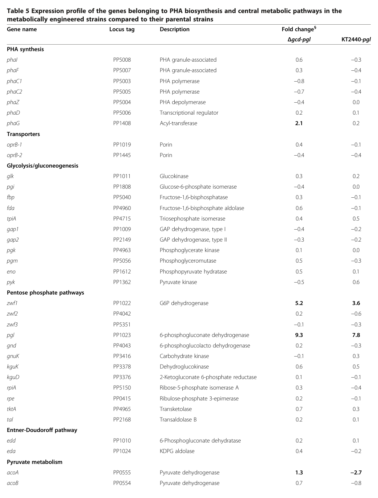

## Question

# Gene Research for Functional Annotation

## ⚠️ CRITICAL: Gene/Protein Identification Context

**BEFORE YOU BEGIN RESEARCH:** You MUST verify you are researching the CORRECT gene/protein. Gene symbols can be ambiguous, especially for less well-characterized genes from non-model organisms.

### Target Gene/Protein Identity (from UniProt):
- **UniProt Accession:** Q88MR4
- **Protein Description:** RecName: Full=Phosphoenolpyruvate carboxylase {ECO:0000255|HAMAP-Rule:MF_00595}; Short=PEPC {ECO:0000255|HAMAP-Rule:MF_00595}; Short=PEPCase {ECO:0000255|HAMAP-Rule:MF_00595}; EC=4.1.1.31 {ECO:0000255|HAMAP-Rule:MF_00595};
- **Gene Information:** Name=ppc {ECO:0000255|HAMAP-Rule:MF_00595}; OrderedLocusNames=PP_1505;
- **Organism (full):** Pseudomonas putida (strain ATCC 47054 / DSM 6125 / CFBP 8728 / NCIMB 11950 / KT2440).
- **Protein Family:** Belongs to the PEPCase type 1 family. {ECO:0000255|HAMAP-
- **Key Domains:** PEP_COase. (IPR021135); PEP_COase_bac/pln-type. (IPR022805); PEP_COase_Lys_AS. (IPR018129); PEPCASE_His_AS. (IPR033129); Pyrv/PenolPyrv_kinase-like_dom. (IPR015813)

### MANDATORY VERIFICATION STEPS:

1. **Check if the gene symbol "ppc" matches the protein description above**
2. **Verify the organism is correct:** Pseudomonas putida (strain ATCC 47054 / DSM 6125 / CFBP 8728 / NCIMB 11950 / KT2440).
3. **Check if protein family/domains align with what you find in literature**
4. **If you find literature for a DIFFERENT gene with the same or similar symbol, STOP**

### If Gene Symbol is Ambiguous or You Cannot Find Relevant Literature:

**DO NOT PROCEED WITH RESEARCH ON A DIFFERENT GENE.** Instead:
- State clearly: "The gene symbol 'ppc' is ambiguous or literature is limited for this specific protein"
- Explain what you found (e.g., "Found extensive literature on a different gene with the same symbol in a different organism")
- Describe the protein based ONLY on the UniProt information provided above
- Suggest that the protein function can be inferred from domain/family information

### Research Target:

Please provide a comprehensive research report on the gene **ppc** (gene ID: ppc, UniProt: Q88MR4) in PSEPK.

The research report should be a detailed narrative explaining the function, biological processes, and localization of the gene product. Citations should be given for all claims.

You should prioritize authoritative reviews and primary scientific literature when conducting research. You can supplement
this with annotations you find in gene/protein databases, but these can be outdated or inaccurate.

We are specifically interested in the primary function of the gene - for enzymes, what reaction is catalyzed, and what is the substrate specificity? For transporters, what is the substrate? For structural proteins or adapters, what is the broader structural role? For signaling molecules, what is the role in the pathway.

We are interested in where in or outside the cell the gene product carries out its function.

We are also interested in the signaling or biochemical pathways in which the gene functions. We are less interested in broad pleiotropic effects, except where these elucidate the precise role.

Include evidence where possible. We are interested in both experimental evidence as well as inference from structure, evolution, or bioinformatic analysis. Precise studies should be prioritized over high-throughput, where available.

## Output

Question: You are an expert researcher providing comprehensive, well-cited information.

Provide detailed information focusing on:
1. Key concepts and definitions with current understanding
2. Recent developments and latest research (prioritize 2023-2024 sources)
3. Current applications and real-world implementations
4. Expert opinions and analysis from authoritative sources
5. Relevant statistics and data from recent studies

Format as a comprehensive research report with proper citations. Include URLs and publication dates where available.
Always prioritize recent, authoritative sources and provide specific citations for all major claims.

# Gene Research for Functional Annotation

## ⚠️ CRITICAL: Gene/Protein Identification Context

**BEFORE YOU BEGIN RESEARCH:** You MUST verify you are researching the CORRECT gene/protein. Gene symbols can be ambiguous, especially for less well-characterized genes from non-model organisms.

### Target Gene/Protein Identity (from UniProt):
- **UniProt Accession:** Q88MR4
- **Protein Description:** RecName: Full=Phosphoenolpyruvate carboxylase {ECO:0000255|HAMAP-Rule:MF_00595}; Short=PEPC {ECO:0000255|HAMAP-Rule:MF_00595}; Short=PEPCase {ECO:0000255|HAMAP-Rule:MF_00595}; EC=4.1.1.31 {ECO:0000255|HAMAP-Rule:MF_00595};
- **Gene Information:** Name=ppc {ECO:0000255|HAMAP-Rule:MF_00595}; OrderedLocusNames=PP_1505;
- **Organism (full):** Pseudomonas putida (strain ATCC 47054 / DSM 6125 / CFBP 8728 / NCIMB 11950 / KT2440).
- **Protein Family:** Belongs to the PEPCase type 1 family. {ECO:0000255|HAMAP-
- **Key Domains:** PEP_COase. (IPR021135); PEP_COase_bac/pln-type. (IPR022805); PEP_COase_Lys_AS. (IPR018129); PEPCASE_His_AS. (IPR033129); Pyrv/PenolPyrv_kinase-like_dom. (IPR015813)

### MANDATORY VERIFICATION STEPS:

1. **Check if the gene symbol "ppc" matches the protein description above**
2. **Verify the organism is correct:** Pseudomonas putida (strain ATCC 47054 / DSM 6125 / CFBP 8728 / NCIMB 11950 / KT2440).
3. **Check if protein family/domains align with what you find in literature**
4. **If you find literature for a DIFFERENT gene with the same or similar symbol, STOP**

### If Gene Symbol is Ambiguous or You Cannot Find Relevant Literature:

**DO NOT PROCEED WITH RESEARCH ON A DIFFERENT GENE.** Instead:
- State clearly: "The gene symbol 'ppc' is ambiguous or literature is limited for this specific protein"
- Explain what you found (e.g., "Found extensive literature on a different gene with the same symbol in a different organism")
- Describe the protein based ONLY on the UniProt information provided above
- Suggest that the protein function can be inferred from domain/family information

### Research Target:

Please provide a comprehensive research report on the gene **ppc** (gene ID: ppc, UniProt: Q88MR4) in PSEPK.

The research report should be a detailed narrative explaining the function, biological processes, and localization of the gene product. Citations should be given for all claims.

You should prioritize authoritative reviews and primary scientific literature when conducting research. You can supplement
this with annotations you find in gene/protein databases, but these can be outdated or inaccurate.

We are specifically interested in the primary function of the gene - for enzymes, what reaction is catalyzed, and what is the substrate specificity? For transporters, what is the substrate? For structural proteins or adapters, what is the broader structural role? For signaling molecules, what is the role in the pathway.

We are interested in where in or outside the cell the gene product carries out its function.

We are also interested in the signaling or biochemical pathways in which the gene functions. We are less interested in broad pleiotropic effects, except where these elucidate the precise role.

Include evidence where possible. We are interested in both experimental evidence as well as inference from structure, evolution, or bioinformatic analysis. Precise studies should be prioritized over high-throughput, where available.

# Functional annotation research report: **ppc** (PP_1505; UniProt Q88MR4) in *Pseudomonas putida* KT2440

## 1. Target verification (gene/protein identity and disambiguation)
The UniProt target Q88MR4 is annotated as **phosphoenolpyruvate carboxylase** (PEPC/Ppc; **EC 4.1.1.31**) encoded by **ppc** and mapped to the ordered locus **PP_1505** in *Pseudomonas putida* KT2440. This mapping is supported by KT2440 transcriptomics tables in a peer‑reviewed study, where **ppc is explicitly listed as “Phosphoenolpyruvate carboxylase” with locus tag PP1505**. (acuna2014productionofmedium pages 9-10, acuna2014productionofmedium pages 10-12)

Because the symbol **ppc** can refer to different genes in other organisms, only literature explicitly addressing **phosphoenolpyruvate carboxylase (EC 4.1.1.31)** and/or explicitly mapping to **PP_1505** (or clearly to Ppc/PEPC at the PEP–OAA node) is used here. (koendjbiharie2021thepeppyruvateoxaloacetatenode pages 6-6, acuna2014productionofmedium pages 9-10)

## 2. Key concepts, definitions, and current understanding

### 2.1 Enzymatic function (reaction and biochemical role)
**Phosphoenolpyruvate carboxylase (PEPC/Ppc; EC 4.1.1.31)** catalyzes the carboxylation of phosphoenolpyruvate (PEP) using bicarbonate, producing oxaloacetate (OAA) and inorganic phosphate:

- **PEP + HCO3− ⇌ OAA + Pi**

This reaction is described as highly exergonic (ΔrG′m reported) and **effectively irreversible under physiological conditions**, functioning as a major route of bicarbonate fixation into central carbon metabolism to generate OAA. (koendjbiharie2021thepeppyruvateoxaloacetatenode pages 6-6)

In bacterial central carbon metabolism, OAA is a key entry point into the **TCA cycle** and also a precursor for biosynthesis (e.g., aspartate family amino acids). Accordingly, PEPC/Ppc is widely treated as an **anaplerotic enzyme** replenishing OAA when TCA cycle intermediates are drained for biosynthesis. (yin2024recentadvancesin pages 2-4, yin2024recentadvancesin pages 1-2)

### 2.2 Position in metabolic network (PEP–pyruvate–oxaloacetate node)
Reviews of the **PEP–pyruvate–oxaloacetate (PPO/POP) node** emphasize that flux partitioning among PEP, pyruvate, and OAA is central to bacterial growth, energetics, and precursor supply. In this context, PEPC/Ppc provides a direct anaplerotic connection from PEP to OAA. (koendjbiharie2021thepeppyruvateoxaloacetatenode pages 6-6, yin2024recentadvancesin pages 1-2)

### 2.3 Regulation (bacterial PEPC allostery and physiological logic)
Bacterial PEPCs commonly exhibit multi-effector allostery. In the bacterial PEPC regulatory scheme summarized in a PPO-node review:

- **Activators:** fructose‑1,6‑bisphosphate (F1,6BP) and acetyl‑CoA
- **Inhibitors:** aspartate and malate

These effectors integrate glycolytic state (F1,6BP), acetyl‑CoA availability, and product/branchpoint signals (aspartate/malate) to tune anaplerotic OAA formation. (koendjbiharie2021thepeppyruvateoxaloacetatenode pages 6-7)

A 2024 review focused on engineering the POP node likewise summarizes that PEPC is **activated by acetyl‑CoA and fructose‑1,6‑bisphosphate and inhibited by aspartate and malate** in model bacteria (e.g., *E. coli* and *C. glutamicum*), underscoring conservation of this regulation logic across bacteria. (yin2024recentadvancesin pages 2-4)

**Implication for KT2440 (inference):** given that KT2440 PP_1505 is annotated as a canonical bacterial PEPC/Ppc and belongs to the bacterial/plant-type PEPC family, these regulatory principles are a strong prior for KT2440 Ppc function, even though KT2440-specific biochemical effector measurements were not retrieved in the accessible text set. (koendjbiharie2021thepeppyruvateoxaloacetatenode pages 6-7, acuna2014productionofmedium pages 9-10)

## 3. *Pseudomonas putida* KT2440-specific functional context

### 3.1 Evidence for KT2440 ppc (PP_1505) being engaged during metabolic rewiring
In a KT2440 metabolic engineering study aimed at improving **medium-chain-length polyhydroxyalkanoate (mcl-PHA)** production from glucose, transcriptome profiling identified that **“induction of the phosphoenolpyruvate carboxylase gene ppc was detected”**, and the locus is explicitly referenced as **PP_1505** in the discussion of pyruvate metabolism changes. (acuna2014productionofmedium pages 7-9)

Quantitatively, the same work reports PP_1505/ppc expression values in central metabolism gene-expression tables (engineered strains vs parental backgrounds). In **Table 5**, **ppc (PP1505)** fold changes are reported as **0.0** (Δgcd‑pgl) and **1.4** (KT2440‑pgl). (acuna2014productionofmedium pages 10-12)

Visual evidence for these tabulated values is available in the cropped Table 5 images. (acuna2014productionofmedium media e91fc827, acuna2014productionofmedium media d4d2fe46)

### 3.2 Phenotypic/bioprocess context where ppc induction was observed
While ppc itself was not the engineered target in the mcl‑PHA study, the ppc induction occurred within strains engineered by **pgl overexpression** (and in some cases **gcd deletion**) and was discussed alongside rearrangements in pyruvate metabolism.

For two pgl-overexpressing strains, quantitative physiological outcomes were reported:

- **KT2440‑pgl:** μmax = **0.33 h−1**; biomass yield YX/S = **0.21 g/g**; gluconate yield Ygluconate/S = **0.55 g/g**; PHA yield YPHA/S = **0.05 g/g**.
- **KT2440Δgcd‑pgl:** μmax = **0.21 h−1**; YX/S = **0.24 g/g**; YPHA/S = **0.08 g/g**.

In this context, ppc induction is best interpreted as part of a broader central metabolism response (likely affecting anaplerosis and pyruvate/PEP balance) accompanying the engineered perturbations that changed redox and carbon partitioning. (acuna2014productionofmedium pages 7-9)

### 3.3 Recent (2024) proteomics evidence implicating Ppc during adaptation/engineering
A 2024 *Nature Communications* study investigating “synthetically‑primed adaptation” of KT2440 to D‑xylose includes a central metabolism proteomics map where **Ppc (phosphoenolpyruvate carboxylase)** is annotated with a statistically significant **log2 fold change of −1.01** (adjusted p ≤ 0.05), indicating decreased abundance in one of the reported comparisons. (dvorak2024syntheticallyprimedadaptationof pages 10-11)

This supports the view that Ppc abundance is condition-dependent in KT2440 during major metabolic rewiring (engineering + adaptive evolution), consistent with Ppc being an adjustable anaplerotic/POP-node lever rather than a constitutively fixed activity. (dvorak2024syntheticallyprimedadaptationof pages 10-11)

## 4. Recent developments and latest research (prioritizing 2023–2024)

### 4.1 2024: Central-node engineering framed for production of POP-node–derived products
A 2024 review on engineering the POP node for amino acid production summarizes that PEPC is a key enzymatic “handle” to route carbon from PEP toward OAA and downstream products; it highlights conserved **allosteric regulation** (activation by acetyl‑CoA/F1,6BP; inhibition by malate/aspartate) and frames PEPC as a frequent target in metabolic engineering strategies when OAA supply is limiting. (yin2024recentadvancesin pages 2-4, yin2024recentadvancesin pages 1-2)

### 4.2 2024: Proteomics-linked system-level analysis in KT2440
The 2024 KT2440 xylose adaptation study exemplifies a current trend: rather than focusing on single-enzyme characterization, it uses **multi-level analysis (including proteomics)** to interpret how central metabolism shifts under engineering and evolution. Within this systems context, Ppc abundance changes (log2FC −1.01) provide measurable evidence that anaplerotic routing via Ppc is remodeled under non-native substrate assimilation. (dvorak2024syntheticallyprimedadaptationof pages 10-11)

## 5. Current applications and real-world implementations

### 5.1 Biopolymer (mcl‑PHA) production in *P. putida*
The mcl‑PHA production study provides a direct **bioprocess/industrial biotechnology** setting in which KT2440’s ppc responds transcriptionally during strain engineering on glucose, and reports quantitative growth and product-yield metrics in engineered strains. This supports functional annotation of ppc as part of the tunable central carbon module that influences precursor supply/redox balance for polymer synthesis (even when not directly engineered). (acuna2014productionofmedium pages 7-9)

### 5.2 General metabolic engineering logic for the POP node
Across bacterial systems, PEPC is repeatedly highlighted as a key intervention point for improving yields of PEP/OAA/pyruvate-derived products and rebalancing precursor supply, because it directly controls OAA replenishment from PEP and therefore impacts the TCA cycle and biosynthetic precursor pools. (yin2024recentadvancesin pages 2-4, yin2024recentadvancesin pages 1-2)

## 6. Expert opinions and authoritative analysis (interpretation anchored in reviews)

Two convergent review-level perspectives underpin the most confident functional annotation statements for KT2440 PP_1505 Ppc:

1. **Biochemistry-first view (PPO-node review):** PEPC reaction stoichiometry, irreversibility, and conserved effector logic imply Ppc is a central anaplerotic gatekeeper that integrates carbon status (F1,6BP), acetyl‑CoA, and product signals (malate/aspartate). (koendjbiharie2021thepeppyruvateoxaloacetatenode pages 6-6, koendjbiharie2021thepeppyruvateoxaloacetatenode pages 6-7)
2. **Engineering-first view (POP-node engineering review):** PEPC is a recurring metabolic engineering target for improving OAA supply and POP-node flux partitioning, with regulation constraints (feedback/activation) being key considerations in strain design. (yin2024recentadvancesin pages 2-4, yin2024recentadvancesin pages 1-2)

For KT2440 specifically, these general principles are strengthened by direct condition-dependent transcription/protein-abundance evidence for PP_1505/ppc, consistent with the gene functioning at a regulated metabolic bottleneck rather than a peripheral pathway. (acuna2014productionofmedium pages 7-9, dvorak2024syntheticallyprimedadaptationof pages 10-11)

## 7. Quantitative summary (statistics/data)

A compact quantitative summary is provided in the table below.

| Claim/Parameter | Value/Observation | Organism/Context | Source (first author year) | URL | Evidence citation id |
|---|---|---|---|---|---|
| Target identity | **ppc / PP_1505 / UniProt Q88MR4** annotated as **phosphoenolpyruvate carboxylase (PEPC/Ppc; EC 4.1.1.31)** | *Pseudomonas putida* KT2440; transcriptomics tables list locus as **PP1505** under pyruvate metabolism | Acuña 2014 | https://doi.org/10.1186/1475-2859-13-88 | (acuna2014productionofmedium pages 9-10, acuna2014productionofmedium pages 10-12) |
| Reaction stoichiometry | **Phosphoenolpyruvate + HCO3- ⇌ oxaloacetate + Pi**; described as an essentially irreversible bicarbonate-fixation reaction in vivo | Bacterial/plant-type PEPC general biochemistry | Koendjbiharie 2021 | https://doi.org/10.1093/femsre/fuaa061 | (koendjbiharie2021thepeppyruvateoxaloacetatenode pages 6-6) |
| Core function | Produces **oxaloacetate (OAA)** from **PEP**, supplying the **PEP-pyruvate-oxaloacetate node** | General bacterial central metabolism | Yin 2024 | https://doi.org/10.3390/molecules29122893 | (yin2024recentadvancesin pages 1-2) |
| Biological role | **Anaplerotic enzyme** that replenishes the **TCA cycle** by converting PEP to OAA | Bacteria including *E. coli* and *Corynebacterium glutamicum*; relevant inference for KT2440 Ppc family member | Yin 2024 | https://doi.org/10.3390/molecules29122893 | (yin2024recentadvancesin pages 2-4, yin2024recentadvancesin pages 1-2) |
| Typical bacterial activators | **Fructose-1,6-bisphosphate** and **acetyl-CoA** activate bacterial PEPC | General bacterial PEPC regulation | Koendjbiharie 2021 | https://doi.org/10.1093/femsre/fuaa061 | (koendjbiharie2021thepeppyruvateoxaloacetatenode pages 6-7) |
| Typical bacterial inhibitors | **Aspartate** and **malate** inhibit bacterial PEPC | General bacterial PEPC regulation | Koendjbiharie 2021 | https://doi.org/10.1093/femsre/fuaa061 | (yin2024recentadvancesin pages 2-4, koendjbiharie2021thepeppyruvateoxaloacetatenode pages 6-7) |
| KT2440 transcriptomic observation | **ppc induction detected** in engineered KT2440 with **pgl** overexpression; discussed as part of altered pyruvate metabolism | *P. putida* KT2440 engineering study on mcl-PHA production | Acuña 2014 | https://doi.org/10.1186/1475-2859-13-88 | (acuna2014productionofmedium pages 7-9) |
| KT2440 Table 4 value | **ppc (PP1505)** expression values reported as **0.5** and **0.4**; table note indicates these entries were **not bolded** (not marked as differentiated expression in that table) | *P. putida* KT2440 engineered strains vs parental strains | Acuña 2014 | https://doi.org/10.1186/1475-2859-13-88 | (acuna2014productionofmedium pages 9-10) |
| KT2440 Table 5 values | **ppc (PP1505)** fold-change values reported as **0.0** for **Δgcd-pgl** and **1.4** for **KT2440-pgl** | *P. putida* KT2440 engineered strains vs parental strains | Acuña 2014 | https://doi.org/10.1186/1475-2859-13-88 | (acuna2014productionofmedium pages 10-12) |
| Localization inference | No organism-specific localization data were retrieved here; as a canonical bacterial PEPC in central carbon metabolism, Ppc is most consistently interpreted as a **cytosolic enzyme** rather than membrane or secreted | Inference from enzyme class and pathway role; direct KT2440 localization evidence not retrieved in cited contexts | Koendjbiharie 2021; Yin 2024 | https://doi.org/10.1093/femsre/fuaa061 ; https://doi.org/10.3390/molecules29122893 | (koendjbiharie2021thepeppyruvateoxaloacetatenode pages 6-6, yin2024recentadvancesin pages 1-2) |

*Table: This table compiles the key functional-annotation facts for Pseudomonas putida KT2440 ppc/PP_1505, including the PEPC reaction, anaplerotic role, canonical bacterial regulation, and KT2440-specific transcriptomic observations from Acuña et al. 2014.*

Key primary quantitative points (KT2440):

- **ppc (PP1505) transcript fold-changes** reported as **0.0** (Δgcd‑pgl) and **1.4** (KT2440‑pgl) in Table 5; see Table 5 image crops. (acuna2014productionofmedium pages 10-12, acuna2014productionofmedium media e91fc827, acuna2014productionofmedium media d4d2fe46)
- **Ppc protein abundance change** in 2024 proteomics map: **log2FC = −1.01** (adjusted p ≤ 0.05). (dvorak2024syntheticallyprimedadaptationof pages 10-11)
- **Engineered strain phenotypes** in the setting where ppc induction was reported include μmax and yields (e.g., KT2440‑pgl μmax 0.33 h−1; YPHA/S 0.05 g/g; KT2440Δgcd‑pgl μmax 0.21 h−1; YPHA/S 0.08 g/g). (acuna2014productionofmedium pages 7-9)

## 8. Subcellular localization
Direct KT2440 experimental localization data were not retrieved in the accessible corpus. However, given that Ppc/PEPC catalyzes a soluble central carbon reaction (PEP carboxylation to OAA) and is discussed as part of cytosolic metabolic network models and node reviews, the most consistent interpretation is that KT2440 Ppc is a **cytosolic enzyme** participating in central metabolism rather than a membrane or secreted protein (inference consistent with enzyme class and pathway location). (koendjbiharie2021thepeppyruvateoxaloacetatenode pages 6-6, yin2024recentadvancesin pages 1-2)

## 9. Evidence gaps and recommended next steps (for deeper annotation)

Despite strong support for core function and regulation logic from authoritative reviews, the following KT2440-specific details were not obtained from the current retrieved full texts and therefore should be treated as **not yet evidenced for this specific protein**:

- **KT2440-specific enzyme kinetics (Km, kcat), metal requirements, and detailed substrate specificity**.
- **Direct experimental verification of KT2440 Ppc allosteric effectors** (acetyl‑CoA/F1,6BP/aspartate/malate) rather than inference from bacterial consensus.
- **ppc knockout/overexpression phenotypes in KT2440** explicitly tied to growth on specific substrates or to fluxomics results.

Recommended next retrieval targets would include (i) KT2440-specific biochemical characterization papers of PEPC/Ppc (if available), and (ii) KT2440 genome-scale model/fluxomics studies that explicitly quantify the **Ppc anaplerotic flux** or examine **ppc deletion**.

---

## Key references (with URLs and publication dates)
- Koendjbiharie JG et al. **“The PEP-pyruvate-oxaloacetate node: variation at the heart of metabolism”** (*FEMS Microbiology Reviews*), **Dec 2021**. https://doi.org/10.1093/femsre/fuaa061 (koendjbiharie2021thepeppyruvateoxaloacetatenode pages 6-6, koendjbiharie2021thepeppyruvateoxaloacetatenode pages 6-7)
- Yin L et al. **“Recent Advances in Metabolic Engineering for the Biosynthesis of Phosphoenol Pyruvate–Oxaloacetate–Pyruvate-Derived Amino Acids”** (*Molecules*), **Jun 2024**. https://doi.org/10.3390/molecules29122893 (yin2024recentadvancesin pages 2-4, yin2024recentadvancesin pages 1-2)
- Borrero-de Acuña JM et al. **“Production of medium chain length polyhydroxyalkanoate in metabolic flux optimized Pseudomonas putida”** (*Microbial Cell Factories*), **Jun 2014**. https://doi.org/10.1186/1475-2859-13-88 (acuna2014productionofmedium pages 9-10, acuna2014productionofmedium pages 10-12, acuna2014productionofmedium pages 7-9)
- Dvořák P et al. **“Synthetically-primed adaptation of Pseudomonas putida to a non-native substrate D-xylose”** (*Nature Communications*), **Mar 2024**. https://doi.org/10.1038/s41467-024-46812-9 (dvorak2024syntheticallyprimedadaptationof pages 10-11)

References

1. (acuna2014productionofmedium pages 9-10): José Manuel Borrero-de Acuña, Agata Bielecka, Susanne Häussler, Max Schobert, Martina Jahn, Christoph Wittmann, Dieter Jahn, and Ignacio Poblete-Castro. Production of medium chain length polyhydroxyalkanoate in metabolic flux optimized pseudomonas putida. Microbial Cell Factories, 13:88-88, Jun 2014. URL: https://doi.org/10.1186/1475-2859-13-88, doi:10.1186/1475-2859-13-88. This article has 150 citations and is from a peer-reviewed journal.

2. (acuna2014productionofmedium pages 10-12): José Manuel Borrero-de Acuña, Agata Bielecka, Susanne Häussler, Max Schobert, Martina Jahn, Christoph Wittmann, Dieter Jahn, and Ignacio Poblete-Castro. Production of medium chain length polyhydroxyalkanoate in metabolic flux optimized pseudomonas putida. Microbial Cell Factories, 13:88-88, Jun 2014. URL: https://doi.org/10.1186/1475-2859-13-88, doi:10.1186/1475-2859-13-88. This article has 150 citations and is from a peer-reviewed journal.

3. (koendjbiharie2021thepeppyruvateoxaloacetatenode pages 6-6): Jeroen G Koendjbiharie, Richard van Kranenburg, and Servé W M Kengen. The pep-pyruvate-oxaloacetate node: variation at the heart of metabolism. FEMS Microbiology Reviews, Dec 2021. URL: https://doi.org/10.1093/femsre/fuaa061, doi:10.1093/femsre/fuaa061. This article has 79 citations and is from a domain leading peer-reviewed journal.

4. (yin2024recentadvancesin pages 2-4): Lianghong Yin, Yanan Zhou, Nana Ding, and Yu Fang. Recent advances in metabolic engineering for the biosynthesis of phosphoenol pyruvate–oxaloacetate–pyruvate-derived amino acids. Molecules, 29:2893, Jun 2024. URL: https://doi.org/10.3390/molecules29122893, doi:10.3390/molecules29122893. This article has 14 citations.

5. (yin2024recentadvancesin pages 1-2): Lianghong Yin, Yanan Zhou, Nana Ding, and Yu Fang. Recent advances in metabolic engineering for the biosynthesis of phosphoenol pyruvate–oxaloacetate–pyruvate-derived amino acids. Molecules, 29:2893, Jun 2024. URL: https://doi.org/10.3390/molecules29122893, doi:10.3390/molecules29122893. This article has 14 citations.

6. (koendjbiharie2021thepeppyruvateoxaloacetatenode pages 6-7): Jeroen G Koendjbiharie, Richard van Kranenburg, and Servé W M Kengen. The pep-pyruvate-oxaloacetate node: variation at the heart of metabolism. FEMS Microbiology Reviews, Dec 2021. URL: https://doi.org/10.1093/femsre/fuaa061, doi:10.1093/femsre/fuaa061. This article has 79 citations and is from a domain leading peer-reviewed journal.

7. (acuna2014productionofmedium pages 7-9): José Manuel Borrero-de Acuña, Agata Bielecka, Susanne Häussler, Max Schobert, Martina Jahn, Christoph Wittmann, Dieter Jahn, and Ignacio Poblete-Castro. Production of medium chain length polyhydroxyalkanoate in metabolic flux optimized pseudomonas putida. Microbial Cell Factories, 13:88-88, Jun 2014. URL: https://doi.org/10.1186/1475-2859-13-88, doi:10.1186/1475-2859-13-88. This article has 150 citations and is from a peer-reviewed journal.

8. (acuna2014productionofmedium media e91fc827): José Manuel Borrero-de Acuña, Agata Bielecka, Susanne Häussler, Max Schobert, Martina Jahn, Christoph Wittmann, Dieter Jahn, and Ignacio Poblete-Castro. Production of medium chain length polyhydroxyalkanoate in metabolic flux optimized pseudomonas putida. Microbial Cell Factories, 13:88-88, Jun 2014. URL: https://doi.org/10.1186/1475-2859-13-88, doi:10.1186/1475-2859-13-88. This article has 150 citations and is from a peer-reviewed journal.

9. (acuna2014productionofmedium media d4d2fe46): José Manuel Borrero-de Acuña, Agata Bielecka, Susanne Häussler, Max Schobert, Martina Jahn, Christoph Wittmann, Dieter Jahn, and Ignacio Poblete-Castro. Production of medium chain length polyhydroxyalkanoate in metabolic flux optimized pseudomonas putida. Microbial Cell Factories, 13:88-88, Jun 2014. URL: https://doi.org/10.1186/1475-2859-13-88, doi:10.1186/1475-2859-13-88. This article has 150 citations and is from a peer-reviewed journal.

10. (dvorak2024syntheticallyprimedadaptationof pages 10-11): Pavel Dvořák, Barbora Burýšková, Barbora Popelářová, Birgitta Elisabeth Ebert, Tibor Botka, Dalimil Bujdoš, Alberto Sánchez-Pascuala, Hannah Schöttler, Heiko Hayen, Víctor de Lorenzo, Lars M. Blank, and Martin Benešík. Synthetically-primed adaptation of pseudomonas putida to a non-native substrate d-xylose. Nature Communications, Mar 2024. URL: https://doi.org/10.1038/s41467-024-46812-9, doi:10.1038/s41467-024-46812-9. This article has 37 citations and is from a highest quality peer-reviewed journal.

## Artifacts

- [Edison artifact artifact-00](ppc-deep-research-falcon_artifacts/artifact-00.md)

## Citations

1. koendjbiharie2021thepeppyruvateoxaloacetatenode pages 6-6
2. koendjbiharie2021thepeppyruvateoxaloacetatenode pages 6-7
3. yin2024recentadvancesin pages 2-4
4. acuna2014productionofmedium pages 7-9
5. acuna2014productionofmedium pages 10-12
6. dvorak2024syntheticallyprimedadaptationof pages 10-11
7. yin2024recentadvancesin pages 1-2
8. acuna2014productionofmedium pages 9-10
9. https://doi.org/10.1186/1475-2859-13-88
10. https://doi.org/10.1093/femsre/fuaa061
11. https://doi.org/10.3390/molecules29122893
12. https://doi.org/10.1038/s41467-024-46812-9
13. https://doi.org/10.1186/1475-2859-13-88,
14. https://doi.org/10.1093/femsre/fuaa061,
15. https://doi.org/10.3390/molecules29122893,
16. https://doi.org/10.1038/s41467-024-46812-9,