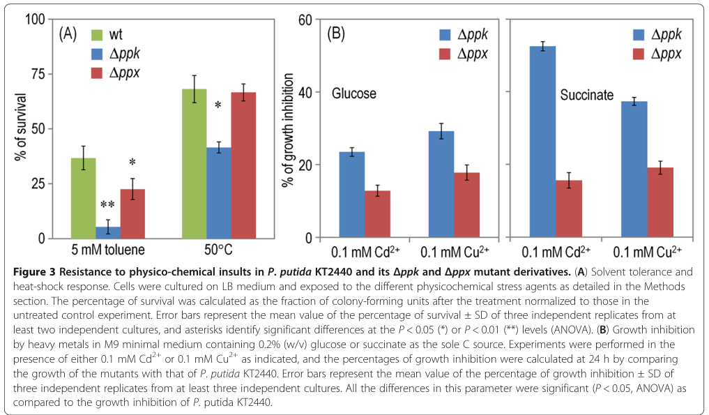

## Question

# Gene Research for Functional Annotation

## ⚠️ CRITICAL: Gene/Protein Identification Context

**BEFORE YOU BEGIN RESEARCH:** You MUST verify you are researching the CORRECT gene/protein. Gene symbols can be ambiguous, especially for less well-characterized genes from non-model organisms.

### Target Gene/Protein Identity (from UniProt):
- **UniProt Accession:** Q88CG4
- **Protein Description:** RecName: Full=Polyphosphate kinase {ECO:0000255|HAMAP-Rule:MF_00347}; EC=2.7.4.1 {ECO:0000255|HAMAP-Rule:MF_00347}; AltName: Full=ATP-polyphosphate phosphotransferase {ECO:0000255|HAMAP-Rule:MF_00347}; AltName: Full=Polyphosphoric acid kinase {ECO:0000255|HAMAP-Rule:MF_00347};
- **Gene Information:** Name=ppk {ECO:0000255|HAMAP-Rule:MF_00347}; OrderedLocusNames=PP_5217;
- **Organism (full):** Pseudomonas putida (strain ATCC 47054 / DSM 6125 / CFBP 8728 / NCIMB 11950 / KT2440).
- **Protein Family:** Belongs to the polyphosphate kinase 1 (PPK1) family.
- **Key Domains:** PP_kinase. (IPR003414); PP_kinase_C_1. (IPR041108); PP_kinase_middle. (IPR024953); PP_kinase_middle_dom_sf. (IPR036830); PPK_C_dom2. (IPR025200)

### MANDATORY VERIFICATION STEPS:

1. **Check if the gene symbol "ppk" matches the protein description above**
2. **Verify the organism is correct:** Pseudomonas putida (strain ATCC 47054 / DSM 6125 / CFBP 8728 / NCIMB 11950 / KT2440).
3. **Check if protein family/domains align with what you find in literature**
4. **If you find literature for a DIFFERENT gene with the same or similar symbol, STOP**

### If Gene Symbol is Ambiguous or You Cannot Find Relevant Literature:

**DO NOT PROCEED WITH RESEARCH ON A DIFFERENT GENE.** Instead:
- State clearly: "The gene symbol 'ppk' is ambiguous or literature is limited for this specific protein"
- Explain what you found (e.g., "Found extensive literature on a different gene with the same symbol in a different organism")
- Describe the protein based ONLY on the UniProt information provided above
- Suggest that the protein function can be inferred from domain/family information

### Research Target:

Please provide a comprehensive research report on the gene **ppk** (gene ID: ppk, UniProt: Q88CG4) in PSEPK.

The research report should be a detailed narrative explaining the function, biological processes, and localization of the gene product. Citations should be given for all claims.

You should prioritize authoritative reviews and primary scientific literature when conducting research. You can supplement
this with annotations you find in gene/protein databases, but these can be outdated or inaccurate.

We are specifically interested in the primary function of the gene - for enzymes, what reaction is catalyzed, and what is the substrate specificity? For transporters, what is the substrate? For structural proteins or adapters, what is the broader structural role? For signaling molecules, what is the role in the pathway.

We are interested in where in or outside the cell the gene product carries out its function.

We are also interested in the signaling or biochemical pathways in which the gene functions. We are less interested in broad pleiotropic effects, except where these elucidate the precise role.

Include evidence where possible. We are interested in both experimental evidence as well as inference from structure, evolution, or bioinformatic analysis. Precise studies should be prioritized over high-throughput, where available.

## Output

Question: You are an expert researcher providing comprehensive, well-cited information.

Provide detailed information focusing on:
1. Key concepts and definitions with current understanding
2. Recent developments and latest research (prioritize 2023-2024 sources)
3. Current applications and real-world implementations
4. Expert opinions and analysis from authoritative sources
5. Relevant statistics and data from recent studies

Format as a comprehensive research report with proper citations. Include URLs and publication dates where available.
Always prioritize recent, authoritative sources and provide specific citations for all major claims.

# Gene Research for Functional Annotation

## ⚠️ CRITICAL: Gene/Protein Identification Context

**BEFORE YOU BEGIN RESEARCH:** You MUST verify you are researching the CORRECT gene/protein. Gene symbols can be ambiguous, especially for less well-characterized genes from non-model organisms.

### Target Gene/Protein Identity (from UniProt):
- **UniProt Accession:** Q88CG4
- **Protein Description:** RecName: Full=Polyphosphate kinase {ECO:0000255|HAMAP-Rule:MF_00347}; EC=2.7.4.1 {ECO:0000255|HAMAP-Rule:MF_00347}; AltName: Full=ATP-polyphosphate phosphotransferase {ECO:0000255|HAMAP-Rule:MF_00347}; AltName: Full=Polyphosphoric acid kinase {ECO:0000255|HAMAP-Rule:MF_00347};
- **Gene Information:** Name=ppk {ECO:0000255|HAMAP-Rule:MF_00347}; OrderedLocusNames=PP_5217;
- **Organism (full):** Pseudomonas putida (strain ATCC 47054 / DSM 6125 / CFBP 8728 / NCIMB 11950 / KT2440).
- **Protein Family:** Belongs to the polyphosphate kinase 1 (PPK1) family.
- **Key Domains:** PP_kinase. (IPR003414); PP_kinase_C_1. (IPR041108); PP_kinase_middle. (IPR024953); PP_kinase_middle_dom_sf. (IPR036830); PPK_C_dom2. (IPR025200)

### MANDATORY VERIFICATION STEPS:

1. **Check if the gene symbol "ppk" matches the protein description above**
2. **Verify the organism is correct:** Pseudomonas putida (strain ATCC 47054 / DSM 6125 / CFBP 8728 / NCIMB 11950 / KT2440).
3. **Check if protein family/domains align with what you find in literature**
4. **If you find literature for a DIFFERENT gene with the same or similar symbol, STOP**

### If Gene Symbol is Ambiguous or You Cannot Find Relevant Literature:

**DO NOT PROCEED WITH RESEARCH ON A DIFFERENT GENE.** Instead:
- State clearly: "The gene symbol 'ppk' is ambiguous or literature is limited for this specific protein"
- Explain what you found (e.g., "Found extensive literature on a different gene with the same symbol in a different organism")
- Describe the protein based ONLY on the UniProt information provided above
- Suggest that the protein function can be inferred from domain/family information

### Research Target:

Please provide a comprehensive research report on the gene **ppk** (gene ID: ppk, UniProt: Q88CG4) in PSEPK.

The research report should be a detailed narrative explaining the function, biological processes, and localization of the gene product. Citations should be given for all claims.

You should prioritize authoritative reviews and primary scientific literature when conducting research. You can supplement
this with annotations you find in gene/protein databases, but these can be outdated or inaccurate.

We are specifically interested in the primary function of the gene - for enzymes, what reaction is catalyzed, and what is the substrate specificity? For transporters, what is the substrate? For structural proteins or adapters, what is the broader structural role? For signaling molecules, what is the role in the pathway.

We are interested in where in or outside the cell the gene product carries out its function.

We are also interested in the signaling or biochemical pathways in which the gene functions. We are less interested in broad pleiotropic effects, except where these elucidate the precise role.

Include evidence where possible. We are interested in both experimental evidence as well as inference from structure, evolution, or bioinformatic analysis. Precise studies should be prioritized over high-throughput, where available.

## Research report: *ppk* (PP_5217; UniProt Q88CG4) in *Pseudomonas putida* KT2440 (PPK1 family)

### Executive summary
The *Pseudomonas putida* KT2440 gene **ppk** (locus **PP_5217**; UniProt **Q88CG4**) encodes the organism’s principal **polyphosphate kinase 1 (PPK1)**, a cytoplasmic enzyme that synthesizes inorganic polyphosphate (polyP) primarily by transferring terminal phosphate from ATP (and in general NTPs) onto a growing polyP chain. Genetic deletion of *ppk* causes a ~**70–90%** decrease in intracellular polyP, establishing PP_5217/Q88CG4 as the major polyP polymerase in this strain (nikel2013accumulationofinorganic pages 2-4). In KT2440, PPK1/polyP contributes to stress endurance (UV, antibiotics, solvents, metals, heat), stationary-phase survival via effects on **RpoS** regulation, and “catalytic vigor” during oxidative biotransformations such as m-xylene biodegradation (nikel2013accumulationofinorganic pages 1-2, nikel2013accumulationofinorganic pages 5-7). 

---

## 1) Key concepts and definitions (current understanding)

### 1.1 Inorganic polyphosphate (polyP)
PolyP is a **linear polymer** of inorganic phosphate residues linked by high-energy phosphoanhydride bonds. PolyP can function as a phosphorus reserve and as a high-energy phosphate/ATP buffer, and is implicated in a wide range of bacterial physiological processes (nikel2013accumulationofinorganic pages 1-2, hofmann2023polyphosphatemetabolismand pages 32-34).

### 1.2 Polyphosphate kinase 1 (PPK1; EC 2.7.4.1)
**PPK1** is the canonical bacterial polyP polymerase. In *P. putida* KT2440 and other bacteria, PPK1 catalyzes **reversible polymerization** of terminal phosphate from ATP (and more generally NTPs) into polyP, producing NDP as the coproduct; Nikel et al. explicitly describe the core reaction as **NTP + polyP(n−1) → polyP(n) + NDP**, and polyP turnover includes reversible hydrolysis steps within the broader metabolic scheme (nikel2013accumulationofinorganic pages 1-2, nikel2013accumulationofinorganic pages 2-4). A recent review summarizes that PPK family enzymes (PPK1/PPK2) reversibly catalyze polymerization of ATP terminal phosphate into a nascent polyP chain; PPK1 is described as being present in the **bacterial cytoplasm** (schoeppe2024anupdateon pages 2-4).

### 1.3 PPK1 vs PPK2 (avoid symbol ambiguity)
The gene symbol “*ppk*” is used in diverse bacteria and can refer to different enzyme families. In the KT2440 study, the authors distinguish **PPK1** (polyP synthesis from ATP/NTP) from **PPK2**, which is “supposed to preferentially” catalyze conversion of polyP back into NTPs (especially GTP) (nikel2013accumulationofinorganic pages 1-2). This distinction is important for ensuring that claims are mapped to **PP_5217/Q88CG4 (PPK1)** rather than unrelated PPK2 paralogs (sometimes annotated as *ppkB* or similar).

### 1.4 Mechanistic/structural inference (from 2023 synthesis)
A 2023 synthesis summarizes PPK1 as typically ~75 kDa, highly processive, with a **conserved histidine autophosphorylation** step required for catalysis and a strong preference for polyP synthesis relative to the reverse direction; it also notes strict ATP preference for synthesis and that polyP chains can be hundreds to >1,000 residues in cells depending on system and conditions (neville2023polyphosphateanew pages 18-24). While this is not *P. putida*-specific biochemistry, it supports mechanistic inference for the PPK1 family member Q88CG4.

---

## 2) Target-gene verification (Q88CG4 = PP_5217 = *ppk* in KT2440)

Nikel et al. (2013; Microbial Cell Factories; published May 2013; https://doi.org/10.1186/1475-2859-12-50) identify **ORF PP_5217** as encoding a **polyphosphate kinase (Ppk)** (727 aa; ~34% identity to *E. coli* Ppk) and show that deleting *ppk* reduces intracellular polyP by **~70–90%**, thereby “accrediting” its role in polymer synthesis (nikel2013accumulationofinorganic pages 2-4). This evidence anchors the functional annotation of UniProt Q88CG4 as the **PPK1-family polyP polymerase** responsible for the bulk of polyP accumulation in this strain.

---

## 3) Primary function: reaction catalyzed, substrate specificity, and pathway placement

### 3.1 Catalyzed reaction and substrates
For the KT2440 PP_5217 gene product, the best-supported primary catalytic function is **ATP (NTP)-dependent polyP synthesis**, summarized in the primary KT2440 work as: 
- **NTP + polyP(n−1) → polyP(n) + NDP** (polyP chain elongation), with reversible/polyP turnover framed as part of the pathway scheme (nikel2013accumulationofinorganic pages 2-4, nikel2013accumulationofinorganic pages 1-2).

Substrate specificity in the KT2440 paper is not reported as purified-enzyme kinetics. However, the authors present PPK1 as the enzyme transferring terminal phosphate from ATP to polyP (and general NTP notation is used), consistent with PPK1’s known ATP preference (nikel2013accumulationofinorganic pages 1-2, neville2023polyphosphateanew pages 18-24).

### 3.2 PolyP homeostasis pathway partners in KT2440
Nikel et al. also identify **PP_5216** as the adjacent (convergently oriented) **exopolyphosphatase (Ppx)** in KT2440, and note that (unlike the classic *ppk-ppx* operon of enterobacteria) in *P. putida* the ORFs are convergent/overlapping, implying different transcriptional regulation (nikel2013accumulationofinorganic pages 2-4). PolyP can serve as a high-energy phosphate donor for ATP formation under some conditions; the KT2440 study discusses phenotypes consistent with altered “high-energy Pi traffic between the polymer and ATP” when PPK is deleted (nikel2013accumulationofinorganic pages 7-8).

### 3.3 Cellular localization
A 2024 review explicitly summarizes bacterial PPK1 as cytoplasmic (schoeppe2024anupdateon pages 2-4). The KT2440 paper operationally treats PPK as a cytosolic polyP polymerase affecting intracellular polyP pools and associated phenotypes (nikel2013accumulationofinorganic pages 2-4, nikel2013accumulationofinorganic pages 1-2).

---

## 4) Biological roles in *P. putida* KT2440 supported by experimental evidence

### 4.1 PolyP accumulation dynamics and dependence on PPK1
In KT2440, deletion of *ppk* produces a strong low-polyP phenotype (70–90% decrease) across growth conditions, indicating PPK (PP_5217) is the principal polymerase (nikel2013accumulationofinorganic pages 2-4). Residual polyP suggests minor PPK-independent polyP sources (nikel2013accumulationofinorganic pages 2-4).

### 4.2 Stress endurance phenotypes (UV, antibiotics, metals, solvents, heat)
Cells lacking PPK in KT2440 are reported to be **more sensitive** to multiple stresses including **UV irradiation**, **β-lactam antibiotics**, and heavy metals (**Cd2+**, **Cu2+**), and also show decreased tolerance to **solvents** and **high temperature** (nikel2013accumulationofinorganic pages 1-2, nikel2013accumulationofinorganic pages 4-5, nikel2013accumulationofinorganic pages 5-7). This is consistent with polyP functioning as a stress-linked energy/phosphate buffer and a metal-ion chelator (nikel2013accumulationofinorganic pages 4-5, nikel2013accumulationofinorganic pages 5-7).

Visual evidence: Figures retrieved from the KT2440 study include a schematic of polyP metabolism and panels demonstrating reduced polyP levels and impaired phenotypes in Δppk versus wild type (nikel2013accumulationofinorganic media ea4d7481, nikel2013accumulationofinorganic media e4b45cd0, nikel2013accumulationofinorganic media 04a0cb41).

### 4.3 Motility and biofilm formation
The KT2440 Δppk mutant shows **very limited flagellar activity** in swimming assays and **significantly worse surface colonization/biofilm formation**, consistent with motility being ATP-demanding and thus sensitive to impaired polyP↔ATP buffering (nikel2013accumulationofinorganic pages 4-5).

### 4.4 Stationary-phase survival and RpoS linkage
Nikel et al. connect PPK/polyP to stationary-phase physiology through regulation of **rpoS**: Δppk reduced PrpoS→lacZ reporter activity by **~40–50%**, and stationary-phase cultures had increased PI-positive (non-viable) cells and lower viable counts compared with wild type (nikel2013accumulationofinorganic pages 5-7, nikel2013accumulationofinorganic pages 7-8). This provides a pathway-level link: **PPK1/polyP → RpoS-dependent stationary-phase programs**, contributing to stress tolerance and long-term survival.

### 4.5 “Catalytic vigor” in oxidative biotransformation / m-xylene biodegradation
In the KT2440 strain carrying the TOL plasmid for m-xylene biodegradation, deletion of *ppk* reduced growth/catalytic performance to about **50% of wild-type** and caused an extended lag phase; expression of *ppk* in trans restored performance (nikel2013accumulationofinorganic pages 1-2, nikel2013accumulationofinorganic pages 7-8). The authors interpret this as an energy-phosphate buffering role for polyP/PPK in supporting oxidative metabolism under demanding conditions (nikel2013accumulationofinorganic pages 1-2).

---

## 5) Recent developments (prioritizing 2023–2024)

Although direct 2023–2024 primary studies specifically on *P. putida* KT2440 PP_5217 are limited in the retrieved corpus, recent high-authority studies in other bacteria and current reviews sharpen mechanistic understanding and translational relevance of PPK1-family enzymes.

### 5.1 Starvation and envelope remodeling (2024)
Baijal et al. (2024; PLOS Biology; published Mar 2024; https://doi.org/10.1371/journal.pbio.3002558) used label-free proteomics under starvation to show that loss of *ppk* alters cellular programs and prevents induction of lipid A modification enzymes (Arn/EptA), eliminating key lipid A modifications and affecting polymyxin resistance. The study reports **92 proteins** significantly differentially expressed between wild type and Δppk, indicating broad systems-level regulation of starvation adaptation by PPK/polyP (baijal2024polyphosphatekinaseregulates pages 1-2). Although performed in *E. coli*, this work is relevant for functional inference because it demonstrates specific molecular pathways (BasRS–Arn/EptA) that can be polyP/PPK-dependent during starvation (baijal2024polyphosphatekinaseregulates pages 1-2, baijal2024polyphosphatekinaseregulates pages 11-13).

### 5.2 PPK1 as an antibacterial/anti-virulence target (2024)
Chugh et al. (2024; PNAS; published Jan 2024; https://doi.org/10.1073/pnas.2309664121) show that mycobacterial PPK-1 influences bacterial/host metabolic pathways and virulence phenotypes. They also performed a compound screen (1,280 compounds), identifying **60 inhibitors** achieving ≥50% inhibition at 100 µM and showing reductions of intracellular polyP by **~35–65%** for prioritized compounds (chugh2024polyphosphatekinase1regulates pages 6-7). This reinforces a consensus view that PPK1 is a plausible antimicrobial target because it is microbe-specific and impacts persistence/virulence-related physiology (chugh2024polyphosphatekinase1regulates pages 1-2, chugh2024polyphosphatekinase1regulates pages 6-7).

Song et al. (2024; Microbial Cell Factories; published Oct 2024; https://doi.org/10.1186/s12934-024-02540-9) report **scutellarein** as a PPK1 inhibitor with in vivo efficacy: a **~35% increase** in *Galleria mellonella* survival at 20 mg/kg in an *Acinetobacter baumannii* infection model (song2024invitroand pages 1-2).

### 5.3 Updated overview of polyP biology and methods (2024)
Schoeppe et al. (2024; Biomolecules; published Aug 2024; https://doi.org/10.3390/biom14080937) summarize current understanding of polyP metabolism, including bacterial PPK1 localization (cytoplasmic) and methodological thresholds (e.g., dye/probe detection chain-length requirements), which is relevant for designing functional assays in KT2440 (schoeppe2024anupdateon pages 2-4, schoeppe2024anupdateon pages 8-9).

---

## 6) Current applications and real-world implementations

### 6.1 Industrial biotechnology and process robustness (*P. putida* KT2440)
Ankenbauer et al. (2020; Microbial Biotechnology; published Apr 2020; https://doi.org/10.1111/1751-7915.13571) studied KT2440 under industrial-like scale-down mixing with repeated glucose shortage and found significant upregulation of **polyphosphate kinase-related genes**, interpreted as part of a rapid response to balance ATP drops and as a stringent-response–like program (ankenbauer2020pseudomonasputidakt2440 pages 10-12). This supports a real-world implementation perspective: polyP/PPK is part of the physiological toolkit that enables *P. putida* to withstand industrially relevant fluctuations.

### 6.2 Wastewater phosphorus cycling / EBPR systems (2024)
Hong et al. (2024; Frontiers in Microbiology; published Jun 2024; https://doi.org/10.3389/fmicb.2024.1424938) provide application-relevant data for polyP metabolism in activated sludge under Fe(III) exposure. Under chronic Fe(III) exposure (155 days), intracellular phosphorus storage ranged from **3.11–7.67 mg/g VSS** (only **26.01–64.13%** of control), consistent with a shift away from polyphosphate-accumulating metabolism, while functional genes related to polyP metabolism (PPK/PPX) were altered (hong2024inhibitionofphosphorus pages 9-10). Although not *P. putida*-specific, this contextualizes why *ppk* genes are widely monitored as functional markers in engineered phosphorus-removal ecosystems.

### 6.3 Anti-virulence drug development (2024)
The 2024 PNAS and Microbial Cell Factories studies illustrate real-world translational applications: screening/repurposing of inhibitors (1,280-compound screen; prioritized inhibitors lowering polyP by ~35–65%) and demonstration of efficacy in infection models (e.g., scutellarein increasing larval survival by ~35%) (chugh2024polyphosphatekinase1regulates pages 6-7, song2024invitroand pages 1-2).

---

## 7) Expert opinion and synthesis (authoritative perspectives)

Two convergent expert-level interpretations emerge from the KT2440-focused work and more general recent literature:

1) **In *P. putida* KT2440, PPK1/polyP is typically not essential for central metabolism but provides measurable fitness and performance advantages under stress and starvation.** Nikel et al. emphasize that while effects are “moderate” compared to some other bacteria, the polymer’s main value in KT2440 may be ensuring an energy reserve during prolonged starvation and supporting stress tolerance, motility, and biodegradation performance (nikel2013accumulationofinorganic pages 1-2).

2) **Across bacteria, PPK1/polyP is increasingly viewed as a mechanistically specific stress/starvation regulator and a druggable node.** Systems-level starvation proteomics connects PPK to envelope remodeling and antibiotic resistance in *E. coli* (Baijal 2024), while mycobacterial work demonstrates PPK-1 involvement in virulence/metabolic rewiring and supports inhibitor discovery efforts (Chugh 2024) (baijal2024polyphosphatekinaseregulates pages 1-2, chugh2024polyphosphatekinase1regulates pages 6-7).

---

## 8) Key statistics and quantitative data points (recent + KT2440-specific)

- **KT2440 polyP depletion:** Δppk reduces polyP by **~70–90%** across conditions (primary KT2440 evidence) (nikel2013accumulationofinorganic pages 2-4).
- **KT2440 RpoS linkage:** PrpoS reporter activity reduced **~40–50%** in Δppk (nikel2013accumulationofinorganic pages 5-7).
- **KT2440 biodegradation performance:** Δppk reduces m-xylene catalytic vigor to **~50%** of wild type (nikel2013accumulationofinorganic pages 1-2).
- **Starvation proteomics (2024, *E. coli*):** **92** significantly differentially expressed proteins (WT vs Δppk) (baijal2024polyphosphatekinaseregulates pages 1-2).
- **PPK1 inhibitor screening (2024, *M. tuberculosis*):** Screened **1,280** compounds; **60** inhibited PPK-1 activity ≥50% at 100 µM; prioritized compounds reduced intracellular polyP by **~35–65%** (chugh2024polyphosphatekinase1regulates pages 6-7).
- **In vivo PPK1 inhibitor effect (2024, *A. baumannii*):** scutellarein increased *Galleria mellonella* survival by **~35%** at 20 mg/kg (song2024invitroand pages 1-2).
- **EBPR/activated sludge (2024):** chronic Fe(III) exposure (155 days) reduced intracellular P storage to **3.11–7.67 mg/g VSS** (26.01–64.13% of control) (hong2024inhibitionofphosphorus pages 9-10).

---

## Evidence map table
The following table consolidates the core evidence, including organism specificity, dates, URLs, and quantitative endpoints.

| Topic | Key finding | Organism/system | Year | Source URL | Notes/quantitative data | Citation ID |
|---|---|---|---|---|---|---|
| Identity mapping | The target gene **ppk = PP_5217** in *Pseudomonas putida* KT2440 encodes the main **polyphosphate kinase (PPK1)** corresponding to UniProt **Q88CG4**; the encoded protein is reported as 727 aa and ~34% identical to *E. coli* Ppk. | *Pseudomonas putida* KT2440 | 2013 | https://doi.org/10.1186/1475-2859-12-50 | Deleting **ppk** caused a **70–90% decrease** in intracellular polyP, experimentally validating PP_5217 as the principal polyP-synthesizing enzyme; distinct from **PPK2**, which preferentially uses polyP to regenerate NTPs, especially GTP. | (nikel2013accumulationofinorganic pages 2-4, nikel2013accumulationofinorganic pages 1-2) |
| Enzymatic reaction and core role | PPK1 catalyzes reversible transfer of the terminal phosphate of ATP/NTP to a growing polyphosphate chain: effectively **ATP + polyP(n) → ADP + polyP(n+1)**, with the reaction reversible in principle. | Bacteria; directly relevant to *P. putida* PPK1 | 2013, 2024 | https://doi.org/10.1186/1475-2859-12-50; https://doi.org/10.3390/biom14080937 | PPK1 is the primary polymerase for cytoplasmic polyP formation; polyP functions as a phosphate/energy reserve, ATP buffer, and stress-protective polymer. Recent summaries note bacterial PPK1 is cytoplasmic and works with PPX in polyP homeostasis. | (nikel2013accumulationofinorganic pages 1-2, schoeppe2024anupdateon pages 2-4) |
| Domain/family-based functional inference | PPK1 proteins are large polyP polymerases with strong ATP preference for synthesis and a mechanism involving an autophosphorylated conserved histidine; PPK1 generally favors synthesis over reverse reaction. | Bacterial PPK1 family | 2023 | N/A | Review-level synthesis reports PPK1 as ~75 kDa, four-domain, Mg2+-dependent, highly processive, and typically producing long chains; useful functional inference for Q88CG4 when direct biochemical data for the *P. putida* enzyme are limited. | (neville2023polyphosphateanew pages 18-24) |
| Cellular localization / pathway context | PPK1 operates in the **cytoplasm**, where it collaborates functionally with PPX and other polyP-utilizing enzymes to maintain intracellular polyP pools. | Bacteria; applicable to *P. putida* | 2024 | https://doi.org/10.3390/biom14080937 | In *P. putida*, **ppk (PP_5217)** and **ppx (PP_5216)** are convergent/overlapping rather than arranged in the classic bicistronic operon seen in enterobacteria, implying different transcriptional control. | (schoeppe2024anupdateon pages 2-4, nikel2013accumulationofinorganic pages 2-4) |
| P. putida mutant phenotype: polyP pool | **Δppk** causes a strong low-polyP phenotype in *P. putida* KT2440. | *P. putida* KT2440 | 2013 | https://doi.org/10.1186/1475-2859-12-50 | PolyP decreased by **~70–90%** across tested conditions; Δppk retained only a minor residual pool (~15–20%), implying limited Ppk-independent polyP synthesis. | (nikel2013accumulationofinorganic pages 2-4, nikel2013accumulationofinorganic pages 8-10) |
| P. putida mutant phenotype: motility and biofilm | Loss of **ppk** reduces swimming motility and impairs biofilm/surface colonization. | *P. putida* KT2440 | 2013 | https://doi.org/10.1186/1475-2859-12-50 | Described as “very limited flagellar activity” and significantly poorer abiotic-surface colonization, consistent with reduced access to high-energy phosphate. | (nikel2013accumulationofinorganic pages 4-5, nikel2013accumulationofinorganic media ea4d7481) |
| P. putida mutant phenotype: stress tolerance | **Δppk** is more sensitive to multiple stresses, including UV, β-lactam antibiotics, heavy metals, solvent stress, and heat. | *P. putida* KT2440 | 2013 | https://doi.org/10.1186/1475-2859-12-50 | Reported stressors include **Cd2+**, **Cu2+**, toluene/solvents, heat shock, and β-lactams; some growth-inhibition differences were significant at **P < 0.05**. | (nikel2013accumulationofinorganic pages 1-2, nikel2013accumulationofinorganic pages 4-5, nikel2013accumulationofinorganic pages 5-7, nikel2013accumulationofinorganic media ea4d7481) |
| P. putida mutant phenotype: stationary phase and regulation | **Δppk** lowers survival in stationary phase and decreases **rpoS** expression. | *P. putida* KT2440 | 2013 | https://doi.org/10.1186/1475-2859-12-50 | Stationary-phase cultures showed more PI-positive cells and lower viable counts; **PrpoS** activity fell by about **40–50%** in Δppk. | (nikel2013accumulationofinorganic pages 5-7, nikel2013accumulationofinorganic pages 1-2, nikel2013accumulationofinorganic pages 7-8) |
| P. putida mutant phenotype: catalytic vigor / biodegradation | **Δppk** reduces catalytic performance during oxidative biotransformation/biodegradation. | *P. putida* KT2440 carrying TOL plasmid pWW0 | 2013 | https://doi.org/10.1186/1475-2859-12-50 | Growth/catalytic vigor on **m-xylene** dropped to about **50% of wild type** and the mutant showed a longer lag phase; complementation with **ppk** restored the phenotype. | (nikel2013accumulationofinorganic pages 1-2, nikel2013accumulationofinorganic pages 7-8) |
| Industrial-scale transcriptional response | Under repeated glucose limitation / industrial-like mixing stress, **ppk** and related polyphosphate kinase genes are significantly upregulated as part of a rapid energy-buffering response. | *P. putida* KT2440 in STR-PFR scale-down system | 2020 | https://doi.org/10.1111/1751-7915.13571 | Interpreted as a stringent-response–like program supporting ATP homeostasis; context includes rapid starvation pulses, **128 s** PFR exit timepoint, and 3-HA/PHA-derived buffering with ~**1.1% biomass** as 3-HA. | (ankenbauer2020pseudomonasputidakt2440 pages 10-12) |
| Latest development: starvation/LPS remodeling | PPK controls starvation-linked outer membrane remodeling by enabling lipid A modifications required for polymyxin resistance. | *Escherichia coli* | 2024 | https://doi.org/10.1371/journal.pbio.3002558 | Label-free proteomics identified **92 significantly differentially expressed proteins** between WT and Δppk; Arn/EptA-dependent **L-Ara4N** and **pEtN** lipid A modifications were lost in Δppk. | (baijal2024polyphosphatekinaseregulates pages 1-2) |
| Latest development: metabolic/pathogenesis links and inhibitor discovery | PPK1 was linked to metabolic rewiring and virulence, and compound screening yielded small-molecule inhibitors. | *Mycobacterium tuberculosis* | 2024 | https://doi.org/10.1073/pnas.2309664121 | Screen of **1,280 compounds** found **60** inhibiting PPK-1 activity by **≥50% at 100 µM**; prioritized compounds reduced intracellular polyP by **~35–65%**. | (chugh2024polyphosphatekinase1regulates pages 6-7) |
| Latest development: anti-virulence inhibitor in vivo | **Scutellarein** was identified as a PPK1 inhibitor that reduced virulence-associated traits and improved infection outcomes. | *Acinetobacter baumannii* | 2024 | https://doi.org/10.1186/s12934-024-02540-9 | In *Galleria mellonella*, treatment at **20 mg/kg** improved survival by about **35%**; assays also used **32–64 µg/mL** in vitro. | (song2024invitroand pages 1-2) |
| Application: phosphorus-removal biotechnology | PolyP metabolism genes including **ppk/ppx** are informative markers of phosphorus-removal performance and stress responses in wastewater systems. | Activated sludge / EBPR-like systems | 2024 | https://doi.org/10.3389/fmicb.2024.1424938 | Chronic Fe(III) exposure over **155 days** shifted metabolism away from Poly-P-centered phosphorus cycling; intracellular P storage fell to **3.11–7.67 mg/g VSS** (**26.01–64.13%** of control). | (hong2024inhibitionofphosphorus pages 9-10) |
| Application: broader functional annotation relevance | The *P. putida* PPK1/polyP system is best interpreted as an energy/phosphate buffering module that supports stress endurance and industrial robustness rather than an essential central metabolic enzyme. | *P. putida* KT2440 and comparative bacterial systems | 2013–2024 | https://doi.org/10.1186/1475-2859-12-50; https://doi.org/10.1111/1751-7915.13571 | Expert interpretation from the *P. putida* literature emphasizes moderate but reproducible stress and performance phenotypes, supporting annotation as a cytoplasmic PPK1 in polyP homeostasis, starvation adaptation, and stress-linked fitness. | (nikel2013accumulationofinorganic pages 1-2, ankenbauer2020pseudomonasputidakt2440 pages 10-12, hofmann2023polyphosphatemetabolismand pages 32-34) |

*Table: This table compiles the accession-specific identity, core biochemistry, organism-specific phenotypes, and recent translational developments relevant to Pseudomonas putida KT2440 ppk/PP_5217 (UniProt Q88CG4). It is useful as a compact evidence map for functional annotation and recent literature context.*

---

## Functional-annotation conclusion for UniProt Q88CG4 (PP_5217; *ppk*)

**Recommended primary function annotation:** Cytoplasmic **polyphosphate kinase 1 (PPK1)** catalyzing **ATP (NTP)-dependent polyP synthesis** (reversible in principle), serving as the dominant polyP polymerase in *P. putida* KT2440 (nikel2013accumulationofinorganic pages 2-4, schoeppe2024anupdateon pages 2-4). 

**Recommended biological process annotations (evidence-supported in KT2440):** polyP biosynthetic process; phosphate/energy reserve utilization; stationary-phase survival and stress response (including solvent/metal/UV/heat tolerance); motility and biofilm formation; support of oxidative biotransformation performance (m-xylene biodegradation context) (nikel2013accumulationofinorganic pages 1-2, nikel2013accumulationofinorganic pages 4-5, nikel2013accumulationofinorganic pages 5-7).

**Localization:** cytoplasm (schoeppe2024anupdateon pages 2-4).

**Pathway context:** polyP homeostasis module including PPK (PP_5217) and exopolyphosphatase Ppx (PP_5216) with non-operonic convergent gene arrangement in KT2440; functional linkage to RpoS regulation in stationary phase (nikel2013accumulationofinorganic pages 2-4, nikel2013accumulationofinorganic pages 5-7).

References

1. (nikel2013accumulationofinorganic pages 2-4): Pablo I Nikel, Max Chavarría, Esteban Martínez-García, Anne C Taylor, and Víctor de Lorenzo. Accumulation of inorganic polyphosphate enables stress endurance and catalytic vigour in pseudomonas putida kt2440. Microbial Cell Factories, 12:50-50, May 2013. URL: https://doi.org/10.1186/1475-2859-12-50, doi:10.1186/1475-2859-12-50. This article has 102 citations and is from a peer-reviewed journal.

2. (nikel2013accumulationofinorganic pages 1-2): Pablo I Nikel, Max Chavarría, Esteban Martínez-García, Anne C Taylor, and Víctor de Lorenzo. Accumulation of inorganic polyphosphate enables stress endurance and catalytic vigour in pseudomonas putida kt2440. Microbial Cell Factories, 12:50-50, May 2013. URL: https://doi.org/10.1186/1475-2859-12-50, doi:10.1186/1475-2859-12-50. This article has 102 citations and is from a peer-reviewed journal.

3. (nikel2013accumulationofinorganic pages 5-7): Pablo I Nikel, Max Chavarría, Esteban Martínez-García, Anne C Taylor, and Víctor de Lorenzo. Accumulation of inorganic polyphosphate enables stress endurance and catalytic vigour in pseudomonas putida kt2440. Microbial Cell Factories, 12:50-50, May 2013. URL: https://doi.org/10.1186/1475-2859-12-50, doi:10.1186/1475-2859-12-50. This article has 102 citations and is from a peer-reviewed journal.

4. (hofmann2023polyphosphatemetabolismand pages 32-34): Polyphosphate metabolism and profiling of myristoylation in Sulfolobus acidocaldarius This article has 0 citations and is from a peer-reviewed journal.

5. (schoeppe2024anupdateon pages 2-4): Robert Schoeppe, Moritz Waldmann, Henning J. Jessen, and Thomas Renné. An update on polyphosphate in vivo activities. Biomolecules, 14:937, Aug 2024. URL: https://doi.org/10.3390/biom14080937, doi:10.3390/biom14080937. This article has 16 citations.

6. (neville2023polyphosphateanew pages 18-24): NA Neville. Polyphosphate: a new target to fight bacterial infections and regulate eukaryotic protein activity. Unknown journal, 2023.

7. (nikel2013accumulationofinorganic pages 7-8): Pablo I Nikel, Max Chavarría, Esteban Martínez-García, Anne C Taylor, and Víctor de Lorenzo. Accumulation of inorganic polyphosphate enables stress endurance and catalytic vigour in pseudomonas putida kt2440. Microbial Cell Factories, 12:50-50, May 2013. URL: https://doi.org/10.1186/1475-2859-12-50, doi:10.1186/1475-2859-12-50. This article has 102 citations and is from a peer-reviewed journal.

8. (nikel2013accumulationofinorganic pages 4-5): Pablo I Nikel, Max Chavarría, Esteban Martínez-García, Anne C Taylor, and Víctor de Lorenzo. Accumulation of inorganic polyphosphate enables stress endurance and catalytic vigour in pseudomonas putida kt2440. Microbial Cell Factories, 12:50-50, May 2013. URL: https://doi.org/10.1186/1475-2859-12-50, doi:10.1186/1475-2859-12-50. This article has 102 citations and is from a peer-reviewed journal.

9. (nikel2013accumulationofinorganic media ea4d7481): Pablo I Nikel, Max Chavarría, Esteban Martínez-García, Anne C Taylor, and Víctor de Lorenzo. Accumulation of inorganic polyphosphate enables stress endurance and catalytic vigour in pseudomonas putida kt2440. Microbial Cell Factories, 12:50-50, May 2013. URL: https://doi.org/10.1186/1475-2859-12-50, doi:10.1186/1475-2859-12-50. This article has 102 citations and is from a peer-reviewed journal.

10. (nikel2013accumulationofinorganic media e4b45cd0): Pablo I Nikel, Max Chavarría, Esteban Martínez-García, Anne C Taylor, and Víctor de Lorenzo. Accumulation of inorganic polyphosphate enables stress endurance and catalytic vigour in pseudomonas putida kt2440. Microbial Cell Factories, 12:50-50, May 2013. URL: https://doi.org/10.1186/1475-2859-12-50, doi:10.1186/1475-2859-12-50. This article has 102 citations and is from a peer-reviewed journal.

11. (nikel2013accumulationofinorganic media 04a0cb41): Pablo I Nikel, Max Chavarría, Esteban Martínez-García, Anne C Taylor, and Víctor de Lorenzo. Accumulation of inorganic polyphosphate enables stress endurance and catalytic vigour in pseudomonas putida kt2440. Microbial Cell Factories, 12:50-50, May 2013. URL: https://doi.org/10.1186/1475-2859-12-50, doi:10.1186/1475-2859-12-50. This article has 102 citations and is from a peer-reviewed journal.

12. (baijal2024polyphosphatekinaseregulates pages 1-2): Kanchi Baijal, Iryna Abramchuk, Carmen M. Herrera, Thien-Fah Mah, M. Stephen Trent, Mathieu Lavallée-Adam, and Michael Downey. Polyphosphate kinase regulates lps structure and polymyxin resistance during starvation in e. coli. PLOS Biology, 22:e3002558, Mar 2024. URL: https://doi.org/10.1371/journal.pbio.3002558, doi:10.1371/journal.pbio.3002558. This article has 8 citations and is from a highest quality peer-reviewed journal.

13. (baijal2024polyphosphatekinaseregulates pages 11-13): Kanchi Baijal, Iryna Abramchuk, Carmen M. Herrera, Thien-Fah Mah, M. Stephen Trent, Mathieu Lavallée-Adam, and Michael Downey. Polyphosphate kinase regulates lps structure and polymyxin resistance during starvation in e. coli. PLOS Biology, 22:e3002558, Mar 2024. URL: https://doi.org/10.1371/journal.pbio.3002558, doi:10.1371/journal.pbio.3002558. This article has 8 citations and is from a highest quality peer-reviewed journal.

14. (chugh2024polyphosphatekinase1regulates pages 6-7): Saurabh Chugh, Prabhakar Tiwari, Charu Suri, Sonu Kumar Gupta, Padam Singh, Rania Bouzeyen, Saqib Kidwai, Mitul Srivastava, Nagender Rao Rameshwaram, Yashwant Kumar, Shailendra Asthana, and Ramandeep Singh. Polyphosphate kinase-1 regulates bacterial and host metabolic pathways involved in pathogenesis of mycobacterium tuberculosis. Proceedings of the National Academy of Sciences of the United States of America, Jan 2024. URL: https://doi.org/10.1073/pnas.2309664121, doi:10.1073/pnas.2309664121. This article has 22 citations and is from a highest quality peer-reviewed journal.

15. (chugh2024polyphosphatekinase1regulates pages 1-2): Saurabh Chugh, Prabhakar Tiwari, Charu Suri, Sonu Kumar Gupta, Padam Singh, Rania Bouzeyen, Saqib Kidwai, Mitul Srivastava, Nagender Rao Rameshwaram, Yashwant Kumar, Shailendra Asthana, and Ramandeep Singh. Polyphosphate kinase-1 regulates bacterial and host metabolic pathways involved in pathogenesis of mycobacterium tuberculosis. Proceedings of the National Academy of Sciences of the United States of America, Jan 2024. URL: https://doi.org/10.1073/pnas.2309664121, doi:10.1073/pnas.2309664121. This article has 22 citations and is from a highest quality peer-reviewed journal.

16. (song2024invitroand pages 1-2): Yuping Song, Hongfa Lv, Lei Xu, Zhiying Liu, Jianfeng Wang, Tianqi Fang, Xuming Deng, Yonglin Zhou, and Dan Li. In vitro and in vivo activities of scutellarein, a novel polyphosphate kinase 1 inhibitor against acinetobacter baumannii infection. Microbial Cell Factories, Oct 2024. URL: https://doi.org/10.1186/s12934-024-02540-9, doi:10.1186/s12934-024-02540-9. This article has 10 citations and is from a peer-reviewed journal.

17. (schoeppe2024anupdateon pages 8-9): Robert Schoeppe, Moritz Waldmann, Henning J. Jessen, and Thomas Renné. An update on polyphosphate in vivo activities. Biomolecules, 14:937, Aug 2024. URL: https://doi.org/10.3390/biom14080937, doi:10.3390/biom14080937. This article has 16 citations.

18. (ankenbauer2020pseudomonasputidakt2440 pages 10-12): Andreas Ankenbauer, Richard A. Schäfer, Sandra C. Viegas, Vânia Pobre, Björn Voß, Cecília M. Arraiano, and Ralf Takors. Pseudomonas putida kt2440 is naturally endowed to withstand industrial‐scale stress conditions. Microbial Biotechnology, 13:1145-1161, Apr 2020. URL: https://doi.org/10.1111/1751-7915.13571, doi:10.1111/1751-7915.13571. This article has 94 citations and is from a peer-reviewed journal.

19. (hong2024inhibitionofphosphorus pages 9-10): Yiyihui Hong, Hong Cheng, Xiaoliu Huangfu, Lin Li, and Qiang He. Inhibition of phosphorus removal performance in activated sludge by fe(iii) exposure: transitions in dominant metabolic pathways. Frontiers in Microbiology, Jun 2024. URL: https://doi.org/10.3389/fmicb.2024.1424938, doi:10.3389/fmicb.2024.1424938. This article has 9 citations and is from a peer-reviewed journal.

20. (nikel2013accumulationofinorganic pages 8-10): Pablo I Nikel, Max Chavarría, Esteban Martínez-García, Anne C Taylor, and Víctor de Lorenzo. Accumulation of inorganic polyphosphate enables stress endurance and catalytic vigour in pseudomonas putida kt2440. Microbial Cell Factories, 12:50-50, May 2013. URL: https://doi.org/10.1186/1475-2859-12-50, doi:10.1186/1475-2859-12-50. This article has 102 citations and is from a peer-reviewed journal.

## Artifacts

- [Edison artifact artifact-00](ppk-deep-research-falcon_artifacts/artifact-00.md)

## Citations

1. nikel2013accumulationofinorganic pages 2-4
2. schoeppe2024anupdateon pages 2-4
3. nikel2013accumulationofinorganic pages 1-2
4. neville2023polyphosphateanew pages 18-24
5. nikel2013accumulationofinorganic pages 7-8
6. nikel2013accumulationofinorganic pages 4-5
7. baijal2024polyphosphatekinaseregulates pages 1-2
8. song2024invitroand pages 1-2
9. hong2024inhibitionofphosphorus pages 9-10
10. nikel2013accumulationofinorganic pages 5-7
11. hofmann2023polyphosphatemetabolismand pages 32-34
12. baijal2024polyphosphatekinaseregulates pages 11-13
13. schoeppe2024anupdateon pages 8-9
14. nikel2013accumulationofinorganic pages 8-10
15. https://doi.org/10.1186/1475-2859-12-50
16. https://doi.org/10.1371/journal.pbio.3002558
17. https://doi.org/10.1073/pnas.2309664121
18. https://doi.org/10.1186/s12934-024-02540-9
19. https://doi.org/10.3390/biom14080937
20. https://doi.org/10.1111/1751-7915.13571
21. https://doi.org/10.3389/fmicb.2024.1424938
22. https://doi.org/10.1186/1475-2859-12-50;
23. https://doi.org/10.1186/1475-2859-12-50,
24. https://doi.org/10.3390/biom14080937,
25. https://doi.org/10.1371/journal.pbio.3002558,
26. https://doi.org/10.1073/pnas.2309664121,
27. https://doi.org/10.1186/s12934-024-02540-9,
28. https://doi.org/10.1111/1751-7915.13571,
29. https://doi.org/10.3389/fmicb.2024.1424938,