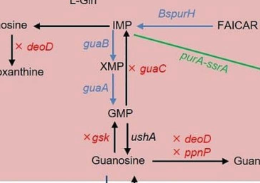

## Question

# Gene Research for Functional Annotation

## ⚠️ CRITICAL: Gene/Protein Identification Context

**BEFORE YOU BEGIN RESEARCH:** You MUST verify you are researching the CORRECT gene/protein. Gene symbols can be ambiguous, especially for less well-characterized genes from non-model organisms.

### Target Gene/Protein Identity (from UniProt):
- **UniProt Accession:** Q88F51
- **Protein Description:** RecName: Full=Pyrimidine/purine nucleoside phosphorylase {ECO:0000255|HAMAP-Rule:MF_01537}; EC=2.4.2.1 {ECO:0000255|HAMAP-Rule:MF_01537}; EC=2.4.2.2 {ECO:0000255|HAMAP-Rule:MF_01537}; AltName: Full=Adenosine phosphorylase {ECO:0000255|HAMAP-Rule:MF_01537}; AltName: Full=Cytidine phosphorylase {ECO:0000255|HAMAP-Rule:MF_01537}; AltName: Full=Guanosine phosphorylase {ECO:0000255|HAMAP-Rule:MF_01537}; AltName: Full=Inosine phosphorylase {ECO:0000255|HAMAP-Rule:MF_01537}; AltName: Full=Thymidine phosphorylase {ECO:0000255|HAMAP-Rule:MF_01537}; AltName: Full=Uridine phosphorylase {ECO:0000255|HAMAP-Rule:MF_01537}; AltName: Full=Xanthosine phosphorylase {ECO:0000255|HAMAP-Rule:MF_01537};
- **Gene Information:** Name=ppnP {ECO:0000255|HAMAP-Rule:MF_01537}; OrderedLocusNames=PP_4248;
- **Organism (full):** Pseudomonas putida (strain ATCC 47054 / DSM 6125 / CFBP 8728 / NCIMB 11950 / KT2440).
- **Protein Family:** Belongs to the nucleoside phosphorylase PpnP family.
- **Key Domains:** Ppnp. (IPR009664); RmlC-like_jellyroll. (IPR014710); RmlC_Cupin_sf. (IPR011051); Ppnp (PF06865)

### MANDATORY VERIFICATION STEPS:

1. **Check if the gene symbol "ppnP" matches the protein description above**
2. **Verify the organism is correct:** Pseudomonas putida (strain ATCC 47054 / DSM 6125 / CFBP 8728 / NCIMB 11950 / KT2440).
3. **Check if protein family/domains align with what you find in literature**
4. **If you find literature for a DIFFERENT gene with the same or similar symbol, STOP**

### If Gene Symbol is Ambiguous or You Cannot Find Relevant Literature:

**DO NOT PROCEED WITH RESEARCH ON A DIFFERENT GENE.** Instead:
- State clearly: "The gene symbol 'ppnP' is ambiguous or literature is limited for this specific protein"
- Explain what you found (e.g., "Found extensive literature on a different gene with the same symbol in a different organism")
- Describe the protein based ONLY on the UniProt information provided above
- Suggest that the protein function can be inferred from domain/family information

### Research Target:

Please provide a comprehensive research report on the gene **ppnP** (gene ID: ppnP, UniProt: Q88F51) in PSEPK.

The research report should be a detailed narrative explaining the function, biological processes, and localization of the gene product. Citations should be given for all claims.

You should prioritize authoritative reviews and primary scientific literature when conducting research. You can supplement
this with annotations you find in gene/protein databases, but these can be outdated or inaccurate.

We are specifically interested in the primary function of the gene - for enzymes, what reaction is catalyzed, and what is the substrate specificity? For transporters, what is the substrate? For structural proteins or adapters, what is the broader structural role? For signaling molecules, what is the role in the pathway.

We are interested in where in or outside the cell the gene product carries out its function.

We are also interested in the signaling or biochemical pathways in which the gene functions. We are less interested in broad pleiotropic effects, except where these elucidate the precise role.

Include evidence where possible. We are interested in both experimental evidence as well as inference from structure, evolution, or bioinformatic analysis. Precise studies should be prioritized over high-throughput, where available.

## Output

Question: You are an expert researcher providing comprehensive, well-cited information.

Provide detailed information focusing on:
1. Key concepts and definitions with current understanding
2. Recent developments and latest research (prioritize 2023-2024 sources)
3. Current applications and real-world implementations
4. Expert opinions and analysis from authoritative sources
5. Relevant statistics and data from recent studies

Format as a comprehensive research report with proper citations. Include URLs and publication dates where available.
Always prioritize recent, authoritative sources and provide specific citations for all major claims.

# Gene Research for Functional Annotation

## ⚠️ CRITICAL: Gene/Protein Identification Context

**BEFORE YOU BEGIN RESEARCH:** You MUST verify you are researching the CORRECT gene/protein. Gene symbols can be ambiguous, especially for less well-characterized genes from non-model organisms.

### Target Gene/Protein Identity (from UniProt):
- **UniProt Accession:** Q88F51
- **Protein Description:** RecName: Full=Pyrimidine/purine nucleoside phosphorylase {ECO:0000255|HAMAP-Rule:MF_01537}; EC=2.4.2.1 {ECO:0000255|HAMAP-Rule:MF_01537}; EC=2.4.2.2 {ECO:0000255|HAMAP-Rule:MF_01537}; AltName: Full=Adenosine phosphorylase {ECO:0000255|HAMAP-Rule:MF_01537}; AltName: Full=Cytidine phosphorylase {ECO:0000255|HAMAP-Rule:MF_01537}; AltName: Full=Guanosine phosphorylase {ECO:0000255|HAMAP-Rule:MF_01537}; AltName: Full=Inosine phosphorylase {ECO:0000255|HAMAP-Rule:MF_01537}; AltName: Full=Thymidine phosphorylase {ECO:0000255|HAMAP-Rule:MF_01537}; AltName: Full=Uridine phosphorylase {ECO:0000255|HAMAP-Rule:MF_01537}; AltName: Full=Xanthosine phosphorylase {ECO:0000255|HAMAP-Rule:MF_01537};
- **Gene Information:** Name=ppnP {ECO:0000255|HAMAP-Rule:MF_01537}; OrderedLocusNames=PP_4248;
- **Organism (full):** Pseudomonas putida (strain ATCC 47054 / DSM 6125 / CFBP 8728 / NCIMB 11950 / KT2440).
- **Protein Family:** Belongs to the nucleoside phosphorylase PpnP family.
- **Key Domains:** Ppnp. (IPR009664); RmlC-like_jellyroll. (IPR014710); RmlC_Cupin_sf. (IPR011051); Ppnp (PF06865)

### MANDATORY VERIFICATION STEPS:

1. **Check if the gene symbol "ppnP" matches the protein description above**
2. **Verify the organism is correct:** Pseudomonas putida (strain ATCC 47054 / DSM 6125 / CFBP 8728 / NCIMB 11950 / KT2440).
3. **Check if protein family/domains align with what you find in literature**
4. **If you find literature for a DIFFERENT gene with the same or similar symbol, STOP**

### If Gene Symbol is Ambiguous or You Cannot Find Relevant Literature:

**DO NOT PROCEED WITH RESEARCH ON A DIFFERENT GENE.** Instead:
- State clearly: "The gene symbol 'ppnP' is ambiguous or literature is limited for this specific protein"
- Explain what you found (e.g., "Found extensive literature on a different gene with the same symbol in a different organism")
- Describe the protein based ONLY on the UniProt information provided above
- Suggest that the protein function can be inferred from domain/family information

### Research Target:

Please provide a comprehensive research report on the gene **ppnP** (gene ID: ppnP, UniProt: Q88F51) in PSEPK.

The research report should be a detailed narrative explaining the function, biological processes, and localization of the gene product. Citations should be given for all claims.

You should prioritize authoritative reviews and primary scientific literature when conducting research. You can supplement
this with annotations you find in gene/protein databases, but these can be outdated or inaccurate.

We are specifically interested in the primary function of the gene - for enzymes, what reaction is catalyzed, and what is the substrate specificity? For transporters, what is the substrate? For structural proteins or adapters, what is the broader structural role? For signaling molecules, what is the role in the pathway.

We are interested in where in or outside the cell the gene product carries out its function.

We are also interested in the signaling or biochemical pathways in which the gene functions. We are less interested in broad pleiotropic effects, except where these elucidate the precise role.

Include evidence where possible. We are interested in both experimental evidence as well as inference from structure, evolution, or bioinformatic analysis. Precise studies should be prioritized over high-throughput, where available.

## Research Report: Functional annotation of **ppnP** (UniProt **Q88F51**; locus **PP_4248**) in *Pseudomonas putida* KT2440

### 1) Identity verification (critical disambiguation)
The UniProt target (Q88F51) is annotated as a **pyrimidine/purine nucleoside phosphorylase** (often abbreviated PPNP or PpnP), i.e., an enzyme that performs **phosphorolysis of nucleosides** to generate **α-D-ribose-1-phosphate** plus a free nucleobase. This is distinct from the unrelated enzyme **polynucleotide phosphorylase (PNPase; gene symbol commonly pnp)**, which acts on RNA and is frequently confused due to the similar abbreviation “PNP”. The defining PPNP chemistry (nucleoside + phosphate → ribose-1-phosphate + base) is explicitly described for PPNP/cupin-family proteins (lee2017backbonenmrassignments pages 1-2), and PpnP is explicitly described as a broad-specificity pyrimidine/purine nucleoside phosphorylase in bacterial purine salvage context (rodionova2021identificationofa pages 1-2).

**Evidence gap note (KT2440/Q88F51-specific):** within the retrieved full-text corpus for this run, no primary study explicitly mentions **PP_4248**, **UniProt Q88F51**, or directly biochemically characterizes the *P. putida* KT2440 enzyme (e.g., purified enzyme kinetics/structures or knockout phenotypes). Therefore, organism-specific claims below are framed as **family- and ortholog-supported inference**, not direct KT2440 experimental proof (rodionova2021identificationofa pages 1-2, lee2017backbonenmrassignments pages 1-2).

### 2) Key concepts and definitions (current understanding)
#### 2.1 Nucleoside phosphorylases (NPs) and the PpnP/PPNP concept
Nucleoside phosphorylases catalyze **phosphorolysis of the N-glycosidic bond** in nucleosides, using inorganic phosphate to produce **α-D-ribose-1-phosphate** plus the corresponding nucleobase (lee2017backbonenmrassignments pages 1-2). This reaction positions nucleoside phosphorylases as central components of **nucleoside salvage**, allowing cells to:
- recycle bases back into nucleotide pools via salvage enzymes, and
- channel ribose-1-phosphate into broader metabolism.

A commonly cited example is **inosine phosphorolysis**:
**inosine + phosphate → hypoxanthine + D-ribose-1-phosphate** (rodionova2021identificationofa pages 1-2).

#### 2.2 Mechanism and enzymology context
Purine nucleoside phosphorylase (PNP) enzymes have been described as using an **SN1-like mechanism** with an oxocarbenium-like transition state; in some systems, “arsenolysis” can be used experimentally to probe the reaction coordinate (chaikuad2009conservationofstructure pages 1-3). While that work is not on *Pseudomonas*, it provides authoritative mechanistic context for nucleoside phosphorylase catalysis (chaikuad2009conservationofstructure pages 1-3).

#### 2.3 Structural family: cupin / jelly-roll-like fold
A bacterial protein proposed to have pyrimidine/purine nucleoside phosphorylase activity (E. coli YaiE) was structurally characterized as a **cupin-family** protein with a **β-barrel (jelly-roll-like) fold** (lee2017backbonenmrassignments pages 1-2). This supports the interpretation that PpnP-family nucleoside phosphorylases can be **cupin-like enzymes**, consistent with a “cupin/jelly-roll” domain architecture (lee2017backbonenmrassignments pages 1-2).

### 3) Primary function of PpnP/ppnP: reaction and substrate specificity
#### 3.1 Reaction class
PpnP is described as a **broad-specificity pyrimidine/purine nucleoside phosphorylase** that cleaves nucleosides with phosphate to yield a nucleobase and D-ribose-1-phosphate (rodionova2021identificationofa pages 1-2).

#### 3.2 Substrate specificity (broad range)
In a bacterial salvage/regulation context, PpnP is explicitly reported to act on multiple nucleosides, including:
**inosine, uridine, adenosine, guanosine, cytidine, thymidine, and xanthosine** (rodionova2021identificationofa pages 1-2).

For *P. putida* KT2440 Q88F51, the most defensible conclusion from the available evidence is that the enzyme’s **primary role is broad nucleoside phosphorolysis** in purine/pyrimidine salvage, and that its substrate range is likely broad in a similar manner, because this broad specificity is a defining feature attributed to PpnP (rodionova2021identificationofa pages 1-2).

### 4) Biological processes, pathways, and regulatory integration
#### 4.1 Nucleoside salvage pathway placement
PpnP participates in **purine/pyrimidine salvage** downstream of nucleoside uptake, producing bases and ribose-1-phosphate for reuse (rodionova2021identificationofa pages 1-2, rodionova2021identificationofa pages 2-3).

A mechanistic/regulatory model described in *E. coli* connects extracellular nucleosides to intracellular regulation: extracellular **adenosine** can be converted by **adenosine deaminase (Add)** to **inosine**, which is then cleaved by PpnP to produce **hypoxanthine** (rodionova2021anoveltranscription pages 4-6, rodionova2021identificationofa pages 2-3). Hypoxanthine (and guanine) acts as a cytoplasmic signal for the transcriptional regulator **PurR**, repressing de novo purine biosynthesis when salvage-derived purines are sufficient (rodionova2021anoveltranscription pages 4-6, rodionova2021anoveltranscription pages 1-4).

Although these regulatory details are shown in *E. coli*, they provide an expert-supported framework for interpreting why broad-specificity nucleoside phosphorylases matter physiologically: they tie **nutrient scavenging** to **purine homeostasis** through a metabolite-sensing regulator (rodionova2021anoveltranscription pages 4-6, rodionova2021identificationofa pages 2-3).

#### 4.2 Pseudomonas-related context (conservation of uptake-regulon architecture)
Comparative genomics in a purine/nucleoside uptake study reported conserved regulator/operator motifs and homologs “in various groups of Enterobacteria and **Pseudomonas spp.**” (rodionova2021identificationofa pages 3-5), and also discussed a *Pseudomonas simiae* PunC homolog relevant to adenine utilization (rodionova2021identificationofa pages 2-3). This does **not** directly establish ppnP regulation in *P. putida* KT2440, but supports that the broader ecological niche of purine/nucleoside uptake and salvage is conserved in pseudomonads (rodionova2021identificationofa pages 3-5, rodionova2021identificationofa pages 2-3).

### 5) Cellular localization (where the gene product acts)
Direct subcellular localization of Q88F51 was not found in the retrieved sources. However, pathway organization strongly suggests **cytoplasmic function**: nucleosides are imported by membrane transporters and then processed into hypoxanthine and ribose-1-phosphate, with hypoxanthine acting as a **cytoplasmic** regulatory signal (PurR effector) (rodionova2021anoveltranscription pages 4-6, rodionova2021identificationofa pages 2-3). Thus, the most evidence-consistent annotation is **intracellular (cytosolic) enzyme participating in salvage metabolism** rather than a secreted/periplasmic activity (rodionova2021anoveltranscription pages 4-6, rodionova2021identificationofa pages 2-3).

### 6) Recent developments (prioritizing 2023–2024) and real-world implementations
#### 6.1 2024 metabolic engineering: ppnP as a guanosine catabolism target
A 2024 metabolic-engineering study in *E. coli* treated **ppnP** as one of the **guanosine phosphorylases** in guanosine degradation (along with deoD) and deleted it to block product catabolism (zhang2024efficientproductionof pages 4-6). Quantitatively, after 72 h fermentation:
- Deleting **deoD** alone produced **13.1 mg/L** guanosine (strain MQ9) (zhang2024efficientproductionof pages 4-6).
- Additional deletions including **ppnP** and **gsk** increased titres; e.g., strains after ppnP/gsk knockouts reached **16.2 mg/L** and **23.2 mg/L** (zhang2024efficientproductionof pages 4-6).
- A **triple deletion (ΔdeoD ΔppnP Δgsk)** produced **41.5 mg/L** guanosine (MQ19), reported as a **78.9% increase** vs a comparator strain (zhang2024efficientproductionof pages 4-6, zhang2024efficientproductionof pages 6-10).
- The final engineered strain achieved **134.9 mg/L** guanosine, and **289.8 mg/L** after 72 h in fed-batch shake-flask fermentation (zhang2024efficientproductionof pages 1-3).

These results demonstrate a concrete, real-world implementation: ppnP function is sufficiently central to nucleoside catabolism that its deletion measurably increases nucleoside product titres in industrially relevant fermentation contexts (zhang2024efficientproductionof pages 4-6, zhang2024efficientproductionof pages 1-3).

**Visual evidence:** the extracted figure panels show ppnP/deoD/gsk in guanosine catabolism and the corresponding titre changes across engineered strains (zhang2024efficientproductionof media f444095c, zhang2024efficientproductionof media 6bf8db44).

#### 6.2 2023 work on salvage in other organisms (contextual, not PpnP-specific)
A 2023 JBC study on *Trichomonas vaginalis* highlights how nucleoside transport and intracellular salvage enzymes integrate to maintain nucleotide pools, including nucleoside phosphorylase directionality considerations and coupling to ribose-1-phosphate (patrone2023aribosidehydrolase pages 1-2). While not about bacterial PpnP specifically, it reinforces the broader contemporary view that salvage pathways are shaped by transporter availability and intracellular metabolite constraints (patrone2023aribosidehydrolase pages 1-2).

### 7) Expert synthesis and analysis (authoritative interpretation)
1. **Most defensible functional call for *P. putida* KT2440 Q88F51:** a **broad-specificity nucleoside phosphorylase** supporting **purine and pyrimidine nucleoside salvage**, catalyzing nucleoside + phosphate → base + α-D-ribose-1-phosphate (lee2017backbonenmrassignments pages 1-2, rodionova2021identificationofa pages 1-2).
2. **Substrate breadth** is a key differentiator: PpnP is described as broad-specificity across multiple purine/pyrimidine nucleosides, making it a likely “generalist” salvage enzyme rather than a narrow deoxynucleoside- or single-base-specific phosphorylase (rodionova2021identificationofa pages 1-2).
3. **Systems role:** PpnP’s products (e.g., hypoxanthine) can connect salvage flux to transcriptional regulation (PurR) in bacteria, providing a plausible link between environmental nucleoside availability and metabolic homeostasis; this frames PpnP as not just catabolic but also indirectly regulatory via metabolite signals (rodionova2021anoveltranscription pages 4-6, rodionova2021identificationofa pages 2-3).
4. **Applied relevance:** in engineered microbes, ppnP is a rational knockout target when the desired product is a nucleoside (e.g., guanosine) because it constitutes a competing catabolic sink (zhang2024efficientproductionof pages 4-6, zhang2024efficientproductionof pages 6-10).

### 8) Summary table of evidence
The following table captures the strongest retrieved evidence elements while explicitly flagging what is inference versus direct KT2440 validation.

| Claim/annotation element | Best-supported evidence snippet (paraphrased) | Organism context | Publication (with year, journal) | URL/DOI | Citation ID |
|---|---|---|---|---|---|
| Verified identity / disambiguation | PpnP is a **pyrimidine/purine nucleoside phosphorylase** that cleaves nucleosides with phosphate to yield a free base plus **α-D-ribose-1-phosphate**; this distinguishes it from unrelated **polynucleotide phosphorylase (pnp/PNPase)** RNA enzymes. | Broad bacterial PPNP concept; relevant for annotating *P. putida* Q88F51 by family | Lee et al., 2017, *Journal of the Korean Magnetic Resonance Society* | https://doi.org/10.6564/jkmrs.2017.21.2.050 | (lee2017backbonenmrassignments pages 1-2) |
| Core reaction | Example reaction given for PpnP: **inosine + phosphate → hypoxanthine + D-ribose-1-phosphate**; this is the canonical phosphorolysis chemistry expected for the family. | *Escherichia coli* pathway context; used as closest characterized ortholog evidence | Rodionova et al., 2021, *Communications Biology* | https://doi.org/10.1038/s42003-021-02516-0 | (rodionova2021identificationofa pages 1-2) |
| Substrate specificity | PpnP is described as **broad-specificity**, acting not only on inosine but also **uridine, adenosine, guanosine, cytidine, thymidine, and xanthosine**. | *E. coli* ortholog/pathway context; supports broad-substrate annotation of Q88F51 family | Rodionova et al., 2021, *Communications Biology* | https://doi.org/10.1038/s42003-021-02516-0 | (rodionova2021identificationofa pages 1-2) |
| Structural family / fold | A putative PPNP cupin protein (YaiE) was characterized as a **cupin-family** protein with a **β-barrel / jelly-roll-like fold**, supporting assignment of PpnP-family enzymes to a cupin-like structural class. | *E. coli* YaiE as structural proxy for PPNP family; aligns with UniProt domain calls for Q88F51 | Lee et al., 2017, *Journal of the Korean Magnetic Resonance Society* | https://doi.org/10.6564/jkmrs.2017.21.2.050 | (lee2017backbonenmrassignments pages 1-2) |
| Mechanistic context | Nucleoside phosphorylases catalyze phosphorolysis through an **SN1-like mechanism** with an oxocarbenium-like transition state; broad-specificity purine nucleoside phosphorylases are central to salvage metabolism. | General nucleoside phosphorylase enzymology; family-level support | Chaikuad & Brady, 2009, *BMC Structural Biology* | https://doi.org/10.1186/1472-6807-9-42 | (chaikuad2009conservationofstructure pages 1-3) |
| Pathway role | PpnP functions in **purine/pyrimidine salvage** downstream of nucleoside uptake; imported nucleosides are cleaved into reusable bases plus ribose-1-phosphate. | *E. coli* salvage network; conservative pathway inference for *P. putida* Q88F51 | Rodionova et al., 2021, *Communications Biology* | https://doi.org/10.1038/s42003-021-02516-0 | (rodionova2021identificationofa pages 1-2, rodionova2021identificationofa pages 2-3) |
| Regulatory integration | In extracellular adenosine utilization, **Add** converts adenosine to inosine, then **PpnP** generates **hypoxanthine**, which acts as a cytoplasmic signal for **PurR-mediated repression** of de novo purine biosynthesis and some transport genes. | *E. coli* regulatory model; indicates how PpnP activity can couple salvage to transcriptional control | Rodionova et al., 2021, *Communications Biology*; Rodionova et al., 2021, preprint | https://doi.org/10.1038/s42003-021-02516-0 ; https://doi.org/10.21203/rs.3.rs-146218/v1 | (rodionova2021anoveltranscription pages 4-6, rodionova2021identificationofa pages 2-3) |
| Likely localization | Although direct localization was not experimentally shown for Q88F51, pathway organization implies **cytoplasmic localization**, because nucleosides are first imported by membrane transporters and PpnP products feed intracellular regulation/metabolism. | Inference from bacterial salvage pathway architecture | Rodionova et al., 2021, *Communications Biology* | https://doi.org/10.1038/s42003-021-02516-0 | (rodionova2021identificationofa pages 1-2, rodionova2021identificationofa pages 2-3) |
| Pseudomonas-related comparative context | Comparative genomics in a purine/nucleoside uptake study identified conserved **PunR/PunC-related motifs in Pseudomonas spp.**, indicating that the broader uptake/salvage framework linked to PpnP is conserved in pseudomonads, though Q88F51 itself was not directly tested. | *Pseudomonas* spp. comparative genomics, not direct *P. putida* KT2440 biochemistry | Rodionova et al., 2021, *Communications Biology* | https://doi.org/10.1038/s42003-021-02516-0 | (rodionova2021identificationofa pages 3-5, rodionova2021identificationofa pages 2-3) |
| Application / real-world implementation | In metabolic engineering for guanosine production, **ppnP deletion** was used to block guanosine catabolism; a strain with **ΔdeoD ΔppnP Δgsk** reached **41.5 mg/L** guanosine after 72 h, and the final optimized strain reached **289.8 mg/L** in fed-batch shake-flask fermentation. | *E. coli* biotechnology implementation showing ppnP as a catabolic nucleoside phosphorylase target | Zhang et al., 2024, *Microbial Cell Factories* | https://doi.org/10.1186/s12934-024-02452-8 | (zhang2024efficientproductionof pages 4-6, zhang2024efficientproductionof pages 10-13, zhang2024efficientproductionof pages 1-3) |
| Visual pathway/quantitation support | Extracted figure panels show **deoD, ppnP, and gsk** on the guanosine catabolic map and the associated titre increases after their deletion, providing compact visual support for ppnP’s catabolic role. | *E. coli* engineering figure evidence | Zhang et al., 2024, *Microbial Cell Factories* | https://doi.org/10.1186/s12934-024-02452-8 | (zhang2024efficientproductionof media f444095c, zhang2024efficientproductionof media 6bf8db44) |
| Evidence-gap note for Q88F51 | No retrieved primary study directly characterized **PP_4248 / UniProt Q88F51 in *Pseudomonas putida* KT2440**; therefore annotation should be treated as **family-based inference supported by ortholog and pathway evidence**, not direct KT2440 biochemical proof. | *P. putida* KT2440 specific evidence gap | No direct retrieved paper for Q88F51/PP_4248 | N/A | (rodionova2021identificationofa pages 1-2, lee2017backbonenmrassignments pages 1-2) |

*Table: This table summarizes the strongest retrieved evidence relevant to annotating ppnP/PpnP for UniProt Q88F51 in Pseudomonas putida KT2440. It emphasizes what is directly supported by family-level and ortholog data, while explicitly noting the absence of a retrieved Q88F51-specific biochemical study.*

### 9) Key references (with publication dates and URLs)
- Zhang K. et al. **“Efficient production of guanosine in *Escherichia coli* by combinatorial metabolic engineering.”** *Microbial Cell Factories* (Jun 2024). https://doi.org/10.1186/s12934-024-02452-8 (zhang2024efficientproductionof pages 4-6, zhang2024efficientproductionof pages 1-3)
- Rodionova I.A. et al. **“Identification of a transcription factor, PunR, that regulates the purine and purine nucleoside transporter PunC in *E. coli*.”** *Communications Biology* (Aug 2021). https://doi.org/10.1038/s42003-021-02516-0 (rodionova2021identificationofa pages 1-2, rodionova2021identificationofa pages 3-5)
- Lee S.-H. et al. **“Backbone NMR Assignments and Secondary Structure Determination of a Cupin-family Protein YaiE from *Escherichia coli*.”** *J. Korean Magnetic Resonance Society* (Jun 2017). https://doi.org/10.6564/jkmrs.2017.21.2.050 (lee2017backbonenmrassignments pages 1-2)
- Chaikuad A. & Brady R.L. **“Conservation of structure and activity in *Plasmodium* purine nucleoside phosphorylases.”** *BMC Structural Biology* (Jul 2009). https://doi.org/10.1186/1472-6807-9-42 (chaikuad2009conservationofstructure pages 1-3)
- Patrone M. et al. **“A riboside hydrolase that salvages both nucleobases and nicotinamide in the auxotrophic parasite *Trichomonas vaginalis*.”** *Journal of Biological Chemistry* (Sep 2023). https://doi.org/10.1016/j.jbc.2023.105077 (patrone2023aribosidehydrolase pages 1-2)

### 10) Explicit limitations and recommended next steps (for rigorous KT2440-specific annotation)
Because direct biochemical/physiological studies for **Q88F51/PP_4248** were not retrieved here, the report’s KT2440-specific claims remain **inferred** from family/ortholog literature (rodionova2021identificationofa pages 1-2). For definitive annotation, the strongest next steps would be (i) targeted retrieval of *P. putida* KT2440 genome-scale metabolic/gene essentiality resources mentioning PP_4248, and/or (ii) enzymatic characterization of the purified protein to quantify kcat/KM across nucleoside substrates and confirm oligomeric state and active-site residues.

References

1. (lee2017backbonenmrassignments pages 1-2): Sung-Hee Lee, Dae-Won Sim, Eun-Hee Kim, Ji-Hun Kim, and Hyung-Sik Won. Backbone nmr assignments and secondary structure determination of a cupin-family protein yaie from escherichia coli. Journal of the Korean magnetic resonance society, 21:50-54, Jun 2017. URL: https://doi.org/10.6564/jkmrs.2017.21.2.050, doi:10.6564/jkmrs.2017.21.2.050. This article has 0 citations.

2. (rodionova2021identificationofa pages 1-2): Irina A. Rodionova, Ye Gao, Anand Sastry, Ying Hefner, Hyun Gyu Lim, Dmitry A. Rodionov, Milton H. Saier, and Bernhard O. Palsson. Identification of a transcription factor, punr, that regulates the purine and purine nucleoside transporter punc in e. coli. Communications Biology, Aug 2021. URL: https://doi.org/10.1038/s42003-021-02516-0, doi:10.1038/s42003-021-02516-0. This article has 26 citations and is from a peer-reviewed journal.

3. (chaikuad2009conservationofstructure pages 1-3): Apirat Chaikuad, Apirat Chaikuad, and R. L. Brady. Conservation of structure and activity in plasmodium purine nucleoside phosphorylases. BMC Structural Biology, 9:42-42, Jul 2009. URL: https://doi.org/10.1186/1472-6807-9-42, doi:10.1186/1472-6807-9-42. This article has 23 citations and is from a peer-reviewed journal.

4. (rodionova2021identificationofa pages 2-3): Irina A. Rodionova, Ye Gao, Anand Sastry, Ying Hefner, Hyun Gyu Lim, Dmitry A. Rodionov, Milton H. Saier, and Bernhard O. Palsson. Identification of a transcription factor, punr, that regulates the purine and purine nucleoside transporter punc in e. coli. Communications Biology, Aug 2021. URL: https://doi.org/10.1038/s42003-021-02516-0, doi:10.1038/s42003-021-02516-0. This article has 26 citations and is from a peer-reviewed journal.

5. (rodionova2021anoveltranscription pages 4-6): Irina Rodionova, Ye Gao, Anand Sastry, Ying Hefner, Reo Yoo, Dmitry Rodionov, Milton Saier, and Bernhard Palsson. A novel transcription factor punr and nac are involved in purine and purine nucleoside transporter punc regulation in e. coli. ArXiv, Feb 2021. URL: https://doi.org/10.21203/rs.3.rs-146218/v1, doi:10.21203/rs.3.rs-146218/v1. This article has 3 citations.

6. (rodionova2021anoveltranscription pages 1-4): Irina Rodionova, Ye Gao, Anand Sastry, Ying Hefner, Reo Yoo, Dmitry Rodionov, Milton Saier, and Bernhard Palsson. A novel transcription factor punr and nac are involved in purine and purine nucleoside transporter punc regulation in e. coli. ArXiv, Feb 2021. URL: https://doi.org/10.21203/rs.3.rs-146218/v1, doi:10.21203/rs.3.rs-146218/v1. This article has 3 citations.

7. (rodionova2021identificationofa pages 3-5): Irina A. Rodionova, Ye Gao, Anand Sastry, Ying Hefner, Hyun Gyu Lim, Dmitry A. Rodionov, Milton H. Saier, and Bernhard O. Palsson. Identification of a transcription factor, punr, that regulates the purine and purine nucleoside transporter punc in e. coli. Communications Biology, Aug 2021. URL: https://doi.org/10.1038/s42003-021-02516-0, doi:10.1038/s42003-021-02516-0. This article has 26 citations and is from a peer-reviewed journal.

8. (zhang2024efficientproductionof pages 4-6): Kun Zhang, Mengxing Qin, Yu Hou, Wenwen Zhang, Zhenyu Wang, and Hailei Wang. Efficient production of guanosine in escherichia coli by combinatorial metabolic engineering. Microbial Cell Factories, Jun 2024. URL: https://doi.org/10.1186/s12934-024-02452-8, doi:10.1186/s12934-024-02452-8. This article has 13 citations and is from a peer-reviewed journal.

9. (zhang2024efficientproductionof pages 6-10): Kun Zhang, Mengxing Qin, Yu Hou, Wenwen Zhang, Zhenyu Wang, and Hailei Wang. Efficient production of guanosine in escherichia coli by combinatorial metabolic engineering. Microbial Cell Factories, Jun 2024. URL: https://doi.org/10.1186/s12934-024-02452-8, doi:10.1186/s12934-024-02452-8. This article has 13 citations and is from a peer-reviewed journal.

10. (zhang2024efficientproductionof pages 1-3): Kun Zhang, Mengxing Qin, Yu Hou, Wenwen Zhang, Zhenyu Wang, and Hailei Wang. Efficient production of guanosine in escherichia coli by combinatorial metabolic engineering. Microbial Cell Factories, Jun 2024. URL: https://doi.org/10.1186/s12934-024-02452-8, doi:10.1186/s12934-024-02452-8. This article has 13 citations and is from a peer-reviewed journal.

11. (zhang2024efficientproductionof media f444095c): Kun Zhang, Mengxing Qin, Yu Hou, Wenwen Zhang, Zhenyu Wang, and Hailei Wang. Efficient production of guanosine in escherichia coli by combinatorial metabolic engineering. Microbial Cell Factories, Jun 2024. URL: https://doi.org/10.1186/s12934-024-02452-8, doi:10.1186/s12934-024-02452-8. This article has 13 citations and is from a peer-reviewed journal.

12. (zhang2024efficientproductionof media 6bf8db44): Kun Zhang, Mengxing Qin, Yu Hou, Wenwen Zhang, Zhenyu Wang, and Hailei Wang. Efficient production of guanosine in escherichia coli by combinatorial metabolic engineering. Microbial Cell Factories, Jun 2024. URL: https://doi.org/10.1186/s12934-024-02452-8, doi:10.1186/s12934-024-02452-8. This article has 13 citations and is from a peer-reviewed journal.

13. (patrone2023aribosidehydrolase pages 1-2): Marco Patrone, Gregory S. Galasyn, Fiona Kerin, Mattias M. Nyitray, David W. Parkin, Brian J. Stockman, and Massimo Degano. A riboside hydrolase that salvages both nucleobases and nicotinamide in the auxotrophic parasite trichomonas vaginalis. Journal of Biological Chemistry, 299:105077, Sep 2023. URL: https://doi.org/10.1016/j.jbc.2023.105077, doi:10.1016/j.jbc.2023.105077. This article has 3 citations and is from a domain leading peer-reviewed journal.

14. (zhang2024efficientproductionof pages 10-13): Kun Zhang, Mengxing Qin, Yu Hou, Wenwen Zhang, Zhenyu Wang, and Hailei Wang. Efficient production of guanosine in escherichia coli by combinatorial metabolic engineering. Microbial Cell Factories, Jun 2024. URL: https://doi.org/10.1186/s12934-024-02452-8, doi:10.1186/s12934-024-02452-8. This article has 13 citations and is from a peer-reviewed journal.

## Artifacts

- [Edison artifact artifact-00](ppnP-deep-research-falcon_artifacts/artifact-00.md)

## Citations

1. lee2017backbonenmrassignments pages 1-2
2. rodionova2021identificationofa pages 1-2
3. chaikuad2009conservationofstructure pages 1-3
4. rodionova2021identificationofa pages 3-5
5. rodionova2021identificationofa pages 2-3
6. zhang2024efficientproductionof pages 4-6
7. zhang2024efficientproductionof pages 1-3
8. patrone2023aribosidehydrolase pages 1-2
9. rodionova2021anoveltranscription pages 4-6
10. rodionova2021anoveltranscription pages 1-4
11. zhang2024efficientproductionof pages 6-10
12. zhang2024efficientproductionof pages 10-13
13. https://doi.org/10.6564/jkmrs.2017.21.2.050
14. https://doi.org/10.1038/s42003-021-02516-0
15. https://doi.org/10.1186/1472-6807-9-42
16. https://doi.org/10.21203/rs.3.rs-146218/v1
17. https://doi.org/10.1186/s12934-024-02452-8
18. https://doi.org/10.1016/j.jbc.2023.105077
19. https://doi.org/10.6564/jkmrs.2017.21.2.050,
20. https://doi.org/10.1038/s42003-021-02516-0,
21. https://doi.org/10.1186/1472-6807-9-42,
22. https://doi.org/10.21203/rs.3.rs-146218/v1,
23. https://doi.org/10.1186/s12934-024-02452-8,
24. https://doi.org/10.1016/j.jbc.2023.105077,