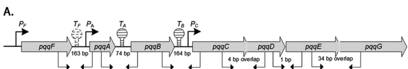

## Question

# Gene Research for Functional Annotation

## ⚠️ CRITICAL: Gene/Protein Identification Context

**BEFORE YOU BEGIN RESEARCH:** You MUST verify you are researching the CORRECT gene/protein. Gene symbols can be ambiguous, especially for less well-characterized genes from non-model organisms.

### Target Gene/Protein Identity (from UniProt):
- **UniProt Accession:** Q88QV4
- **Protein Description:** RecName: Full=Coenzyme PQQ synthesis protein A; AltName: Full=Pyrroloquinoline quinone biosynthesis protein A;
- **Gene Information:** Name=pqqA; OrderedLocusNames=PP_0380;
- **Organism (full):** Pseudomonas putida (strain ATCC 47054 / DSM 6125 / CFBP 8728 / NCIMB 11950 / KT2440).
- **Protein Family:** Belongs to the PqqA family. .
- **Key Domains:** PQQ_synth_PqqA. (IPR011725); PqqA (PF08042)

### MANDATORY VERIFICATION STEPS:

1. **Check if the gene symbol "pqqA" matches the protein description above**
2. **Verify the organism is correct:** Pseudomonas putida (strain ATCC 47054 / DSM 6125 / CFBP 8728 / NCIMB 11950 / KT2440).
3. **Check if protein family/domains align with what you find in literature**
4. **If you find literature for a DIFFERENT gene with the same or similar symbol, STOP**

### If Gene Symbol is Ambiguous or You Cannot Find Relevant Literature:

**DO NOT PROCEED WITH RESEARCH ON A DIFFERENT GENE.** Instead:
- State clearly: "The gene symbol 'pqqA' is ambiguous or literature is limited for this specific protein"
- Explain what you found (e.g., "Found extensive literature on a different gene with the same symbol in a different organism")
- Describe the protein based ONLY on the UniProt information provided above
- Suggest that the protein function can be inferred from domain/family information

### Research Target:

Please provide a comprehensive research report on the gene **pqqA** (gene ID: pqqA, UniProt: Q88QV4) in PSEPK.

The research report should be a detailed narrative explaining the function, biological processes, and localization of the gene product. Citations should be given for all claims.

You should prioritize authoritative reviews and primary scientific literature when conducting research. You can supplement
this with annotations you find in gene/protein databases, but these can be outdated or inaccurate.

We are specifically interested in the primary function of the gene - for enzymes, what reaction is catalyzed, and what is the substrate specificity? For transporters, what is the substrate? For structural proteins or adapters, what is the broader structural role? For signaling molecules, what is the role in the pathway.

We are interested in where in or outside the cell the gene product carries out its function.

We are also interested in the signaling or biochemical pathways in which the gene functions. We are less interested in broad pleiotropic effects, except where these elucidate the precise role.

Include evidence where possible. We are interested in both experimental evidence as well as inference from structure, evolution, or bioinformatic analysis. Precise studies should be prioritized over high-throughput, where available.

## Output

Question: You are an expert researcher providing comprehensive, well-cited information.

Provide detailed information focusing on:
1. Key concepts and definitions with current understanding
2. Recent developments and latest research (prioritize 2023-2024 sources)
3. Current applications and real-world implementations
4. Expert opinions and analysis from authoritative sources
5. Relevant statistics and data from recent studies

Format as a comprehensive research report with proper citations. Include URLs and publication dates where available.
Always prioritize recent, authoritative sources and provide specific citations for all major claims.

# Gene Research for Functional Annotation

## ⚠️ CRITICAL: Gene/Protein Identification Context

**BEFORE YOU BEGIN RESEARCH:** You MUST verify you are researching the CORRECT gene/protein. Gene symbols can be ambiguous, especially for less well-characterized genes from non-model organisms.

### Target Gene/Protein Identity (from UniProt):
- **UniProt Accession:** Q88QV4
- **Protein Description:** RecName: Full=Coenzyme PQQ synthesis protein A; AltName: Full=Pyrroloquinoline quinone biosynthesis protein A;
- **Gene Information:** Name=pqqA; OrderedLocusNames=PP_0380;
- **Organism (full):** Pseudomonas putida (strain ATCC 47054 / DSM 6125 / CFBP 8728 / NCIMB 11950 / KT2440).
- **Protein Family:** Belongs to the PqqA family. .
- **Key Domains:** PQQ_synth_PqqA. (IPR011725); PqqA (PF08042)

### MANDATORY VERIFICATION STEPS:

1. **Check if the gene symbol "pqqA" matches the protein description above**
2. **Verify the organism is correct:** Pseudomonas putida (strain ATCC 47054 / DSM 6125 / CFBP 8728 / NCIMB 11950 / KT2440).
3. **Check if protein family/domains align with what you find in literature**
4. **If you find literature for a DIFFERENT gene with the same or similar symbol, STOP**

### If Gene Symbol is Ambiguous or You Cannot Find Relevant Literature:

**DO NOT PROCEED WITH RESEARCH ON A DIFFERENT GENE.** Instead:
- State clearly: "The gene symbol 'pqqA' is ambiguous or literature is limited for this specific protein"
- Explain what you found (e.g., "Found extensive literature on a different gene with the same symbol in a different organism")
- Describe the protein based ONLY on the UniProt information provided above
- Suggest that the protein function can be inferred from domain/family information

### Research Target:

Please provide a comprehensive research report on the gene **pqqA** (gene ID: pqqA, UniProt: Q88QV4) in PSEPK.

The research report should be a detailed narrative explaining the function, biological processes, and localization of the gene product. Citations should be given for all claims.

You should prioritize authoritative reviews and primary scientific literature when conducting research. You can supplement
this with annotations you find in gene/protein databases, but these can be outdated or inaccurate.

We are specifically interested in the primary function of the gene - for enzymes, what reaction is catalyzed, and what is the substrate specificity? For transporters, what is the substrate? For structural proteins or adapters, what is the broader structural role? For signaling molecules, what is the role in the pathway.

We are interested in where in or outside the cell the gene product carries out its function.

We are also interested in the signaling or biochemical pathways in which the gene functions. We are less interested in broad pleiotropic effects, except where these elucidate the precise role.

Include evidence where possible. We are interested in both experimental evidence as well as inference from structure, evolution, or bioinformatic analysis. Precise studies should be prioritized over high-throughput, where available.

# Research report: **pqqA (PP_0380; UniProt Q88QV4)** in *Pseudomonas putida* KT2440

## 1. Target verification (critical identity checks)

**Target gene/protein**: UniProt **Q88QV4**, gene **pqqA**, locus **PP_0380**, organism *Pseudomonas putida* KT2440 (ATCC 47054 / DSM 6125 / KT2440). In the KT2440 literature, **pqqA is explicitly identified as PP_0380 and as the peptide precursor for PQQ biosynthesis**, consistent with the UniProt record and membership in the PqqA family. (thompson2020fattyacidand pages 9-12)

**Notably, PqqA is not an enzyme**; it is a short ribosomally synthesized precursor peptide that is post-translationally modified and processed to generate the small-molecule redox cofactor pyrroloquinoline quinone (PQQ). (ellerhorst2025recentinsightsinto pages 4-6, ellerhorst2025recentinsightsinto pages 3-4, an2016studiesonregulation pages 62-67)

## 2. Key concepts and definitions (current understanding)

### 2.1 What is PQQ and why does PqqA matter?

**Pyrroloquinoline quinone (PQQ)** is a **peptide-derived redox cofactor** used by quinoprotein dehydrogenases; in Gram-negative bacteria these quinoproteins are typically **periplasmic**, where they catalyze oxidative conversions (e.g., glucose oxidation) that couple to the respiratory chain. (ellerhorst2025recentinsightsinto pages 3-4)

In PQQ producers, the pathway follows a **RiPP-like logic**: a ribosomal peptide precursor (PqqA) is enzymatically modified, trimmed, and oxidatively matured into the final small-molecule cofactor. (ellerhorst2025recentinsightsinto pages 4-6, ellerhorst2025recentinsightsinto pages 3-4)

### 2.2 What does PqqA do (primary molecular function)?

**Primary function of PqqA (Q88QV4/PP_0380)**: It is the **substrate/precursor peptide** from which PQQ is biosynthesized. The conserved **glutamate (E)** and **tyrosine (Y)** in the PqqA “core” provide the atoms that become cross-linked and transformed into the PQQ scaffold. (ellerhorst2025recentinsightsinto pages 4-6, yao2026radicalenzymaticpeptide pages 6-7, ellerhorst2025recentinsightsinto pages 3-4, an2016studiesonregulation pages 62-67)

Accordingly, classical “substrate specificity” for PqqA is best described as **sequence/position specificity**: the pathway enzymes recognize and transform the **Tyr–Glu-containing core region** of the PqqA peptide rather than a diffusible small-molecule substrate. (ellerhorst2025recentinsightsinto pages 4-6, yao2026radicalenzymaticpeptide pages 6-7)

## 3. Biosynthetic pathway context (from PqqA to PQQ)

### 3.1 Canonical enzymatic steps and roles

Mechanistic and biochemical work across PQQ-producing bacteria supports the following conserved sequence of events:

1. **Ribosomal synthesis of PqqA** (precursor peptide). (ellerhorst2025recentinsightsinto pages 4-6, ellerhorst2025recentinsightsinto pages 3-4)
2. **PqqD chaperoning / substrate presentation**: PqqD binds PqqA and forms a complex with PqqE to position the PqqA core for chemistry. (ellerhorst2025recentinsightsinto pages 4-6, ongpipattanakul2021investigationsintothe pages 91-94)
3. **PqqE radical-SAM crosslinking (first committed step)**: PqqE catalyzes a **regioselective C–C coupling** between the conserved glutamate and tyrosine in PqqA, initiating PQQ-core formation. (ellerhorst2025recentinsightsinto pages 4-6, yao2026radicalenzymaticpeptide pages 6-7, ongpipattanakul2021investigationsintothe pages 91-94)
4. **Proteolytic excision/trimming of the modified core**: In systems that encode them, PqqF/G can excise the modified core from PqqA; in other contexts, “cell-associated” or non-specific proteases may substitute. (ellerhorst2025recentinsightsinto pages 4-6, thompson2020fattyacidand pages 9-12)
5. **Late-stage oxygenation and oxidation**: PqqB is described as an Fe(II)-dependent hydroxylase acting on PQQ intermediates, and **PqqC is a cofactorless oxidase** that completes oxidation of AHQQ to PQQ (oxygen-dependent). (ellerhorst2025recentinsightsinto pages 4-6, yao2026radicalenzymaticpeptide pages 6-7)

### 3.2 KT2440 pqq locus organization and regulation

In *P. putida* KT2440, the PQQ locus is commonly described as **pqqFABCDEG**. RT-PCR mapping indicates **suboperonic transcription**, where **pqqF is transcribed independently**, while **pqqCDEG are cotranscribed**; connectivity between **pqqA–pqqB** and **pqqB–pqqC** is condition-dependent, consistent with termination/promoter elements around pqqA/pqqB and a promoter upstream of pqqC. (an2016regulationofpyrroloquinoline pages 7-8, an2016regulationofpyrroloquinoline pages 1-2)

A figure depicting the operon architecture in KT2440 is provided in An & Moe 2016 (AEM) (Figure 1A). (an2016regulationofpyrroloquinoline media 0f482e24)

## 4. Cellular localization: where does PqqA act?

### 4.1 Compartment for PqqA synthesis and maturation

Because PqqA is **ribosomally translated**, it is synthesized in the **cytosol**. (ellerhorst2025recentinsightsinto pages 4-6, ellerhorst2025recentinsightsinto pages 3-4)

The early maturation steps requiring protein complexes (PqqD/PqqE) operate on the peptide substrate and are therefore also assigned to the **intracellular (cytosolic) compartment**. (ellerhorst2025recentinsightsinto pages 4-6, ongpipattanakul2021investigationsintothe pages 91-94)

### 4.2 Compartment for PQQ function (downstream physiology)

In Gram-negative bacteria, PQQ typically functions as a **non-covalently bound cofactor of periplasmic quinoproteins**, including PQQ-dependent dehydrogenases. Thus, while PqqA is a cytosolic precursor peptide, its product PQQ is mainly deployed in **periplasmic oxidation reactions** connected to electron transport. (ellerhorst2025recentinsightsinto pages 3-4)

## 5. Experimental evidence in *P. putida* KT2440 connecting pqqA to phenotype

### 5.1 Quantitative regulation: phosphate availability controls PQQ output and GDH activity

In KT2440 grown in NBRIP medium, soluble phosphate level modulated both **PQQ production** and **PQQ-dependent glucose dehydrogenase (GDH) activity**, consistent with a regulatory link between environmental phosphate and PQQ-dependent mineral phosphate solubilization.

Measured values (An & Moe 2016, Applied and Environmental Microbiology; Table 4) (an2016regulationofpyrroloquinoline media 0f482e24):
- **No soluble P**: **PQQ 0.861 ± 0.007 µM**; **GDH specific activity 1809.01 U/mg**. (an2016regulationofpyrroloquinoline pages 7-8)
- **Low P (1 mM K2HPO4)**: **PQQ 0.633 ± 0.013 µM**; **GDH specific activity 1569.70 U/mg**. (an2016regulationofpyrroloquinoline pages 7-8)
- **High P (50 mM K2HPO4)**: **PQQ 0.488 ± 0.014 µM**; **GDH specific activity 1375.76 U/mg**. (an2016regulationofpyrroloquinoline pages 7-8)

The same study reports that **gcd/pqq gene expression was ~1.5–3-fold higher** under zero versus high soluble phosphate, consistent with phosphate-responsive regulation of the PQQ-GDH system. (an2016regulationofpyrroloquinoline pages 7-8)

### 5.2 Functional supplementation experiment: PQQ can be limiting for phosphate solubilization

In KT2440, supplementation with **10 µM exogenous PQQ** increased the phosphate-solubilization rate from **4.4 mg·L⁻¹·h⁻¹** to **5.4 mg·L⁻¹·h⁻¹** and accelerated acidification (pH decline) without changing cell density, supporting the idea that PQQ availability (and thus pqqA-dependent biosynthesis) can limit functional output under some conditions. (an2016regulationofpyrroloquinoline pages 5-7)

### 5.3 Genome-scale fitness evidence linking PQQ biosynthesis genes to quinoprotein metabolism

Random-barcode transposon sequencing in *P. putida* KT2440 found that PQQ-biosynthetic genes **pqqE, pqqF, and pqqC** showed fitness defects on alcohol substrates similar to those observed for **pedF** mutants, supporting a functional linkage between PQQ biosynthesis and PQQ-dependent dehydrogenase systems. The study explicitly identifies **pqqA (PP_0380)** as the peptide precursor for PQQ, but notes that pqqA-specific fitness calls are less certain due to limited transposon insertion density in small genes. (thompson2020fattyacidand pages 9-12)

## 6. Recent developments (prioritizing 2023–2024)

### 6.1 2024: PQQ gene clusters as biomarkers and functional predictors in soils

A 2024 genome-based study of phosphate-solubilizing bacterial isolates concluded that intact **pqqABCDE** gene clusters (including **pqqA**) are central genomic features for phosphate solubilization via PQQ-dependent glucose oxidation to gluconic acid/2-keto-D-gluconic acid. In one strain, **P release was strongly correlated with pqqA abundance/expression (Pearson r = 0.946; p < 0.05)**, and 2-keto-D-gluconic acid correlated especially strongly with pqq genes (e.g., pqqC r = 0.995; p < 0.01), supporting the mechanistic chain: pqq genes → PQQ → PQQ-GDH → organic acid production → phosphate mobilization. (chen2024genomebasedidentificationof pages 7-9, chen2024genomebasedidentificationof pages 5-7)

A 2024 Current Genetics study emphasized that **pqqA, pqqC, pqqD, and pqqE are essential** elements of the PQQ operon in Gram-negative phosphate-solubilizing bacteria and proposed **pqqE** as a practical molecular marker for traceability of inoculant strains in soils (while noting pqqF/pqqG can be labile). (anzuay2024employmentofpqqe pages 2-4)

A highly cited 2024 review synthesized broader evidence that pqq-associated mechanisms (especially pqqE and gcd/PQQGDH) are important for phosphate solubilization and can translate to agricultural benefit in inoculation contexts. (pang2024soilphosphorustransformation pages 6-7)

### 6.2 2023: PQQ pathways as transferable “metabolic upgrade” modules

A 2023 preprint reported that heterologous expression of a **pqqABCDE** operon in *Streptomyces coelicolor* increased actinorhodin production by **~1.8–2.2-fold (60–72 h)** and altered host redox/energy state (intracellular ATP +32%; NADPH:NADP ratio +392%; NADH:NAD ratio +253%). While not a KT2440 study, it highlights an emerging synthetic-biology direction: using the PQQ module (ultimately originating from the PqqA precursor peptide) to broadly enhance redox metabolism and natural-product yields. (wang2023thenaturalproduct pages 5-7)

## 7. Current applications and real-world implementations

### 7.1 Agriculture / soil biofertilizers and monitoring

The PQQ pathway is widely leveraged (and increasingly genomically screened) in **phosphate-solubilizing microorganisms** used or proposed as **bioinoculants**. 2024 work specifically positions pqq gene clusters as **biomarkers** for phosphate-solubilizing potential, aiding selection of strains for field development. (chen2024genomebasedidentificationof pages 5-7)

Traceability in complex soil communities is a practical constraint for inoculants; the 2024 marker-focused study positions **pqqE** detection/phylogeny as a tool to track Gram-negative phosphate-solubilizers in rhizosphere samples. (anzuay2024employmentofpqqe pages 1-2, anzuay2024employmentofpqqe pages 2-4)

### 7.2 KT2440: rhizosphere-relevant phosphate solubilization via PQQ-GDH

In the KT2440 model, PQQ levels and PQQ-dependent GDH activity respond to phosphate availability, and exogenous PQQ increases phosphate solubilization rate. These data directly support a mechanistic implementation where pqqA-dependent PQQ biosynthesis tunes the magnitude of organic-acid mediated phosphate mobilization in the rhizosphere. (an2016regulationofpyrroloquinoline pages 7-8, an2016regulationofpyrroloquinoline pages 5-7)

### 7.3 Industrial and metabolic engineering

The 2023 Streptomyces engineering study illustrates a transferable application: adding a PQQ gene module can increase polyketide titers and activate silent biosynthetic gene clusters, presumably by improving cellular redox capacity. This establishes PQQ (and thus PqqA) as a targetable component in industrial strain optimization. (wang2023thenaturalproduct pages 5-7)

## 8. Expert synthesis and analysis (authoritative interpretation)

1. **Functional annotation of pqqA should be peptide-centric**: in KT2440, pqqA is best annotated as a **ribosomally synthesized precursor peptide** whose conserved Tyr/Glu core is remodeled into PQQ, rather than as an enzyme catalyzing a classical substrate-to-product reaction. (ellerhorst2025recentinsightsinto pages 4-6, yao2026radicalenzymaticpeptide pages 6-7, an2016studiesonregulation pages 62-67, thompson2020fattyacidand pages 9-12)

2. **Regulatory architecture is modular**, consistent with a need to adjust PQQ supply under changing ecological conditions: KT2440 exhibits **suboperonic transcription** (independent pqqF; cotranscribed pqqCDEG; conditional coupling around pqqA/pqqB), and PQQ output changes with phosphate availability and carbon source. (an2016regulationofpyrroloquinoline pages 7-8, an2016regulationofpyrroloquinoline pages 1-2)

3. **Localization is split between biosynthesis and function**, a common pattern in Gram-negative metabolism: the precursor peptide is synthesized and modified intracellularly, while mature PQQ primarily supports **periplasmic quinoprotein catalysis** (e.g., glucose oxidation) with extracellular consequences (acidification, phosphate mobilization). (ellerhorst2025recentinsightsinto pages 3-4, an2016regulationofpyrroloquinoline pages 7-8, an2016regulationofpyrroloquinoline pages 5-7)

## 9. Key statistics and data (recent and KT2440-specific)

- KT2440 PQQ levels and GDH specific activity (NBRIP medium) decrease with increasing phosphate: **PQQ 0.861 → 0.488 µM** and **GDH 1809 → 1376 U/mg** from no-P to high-P conditions. (an2016regulationofpyrroloquinoline pages 7-8, an2016regulationofpyrroloquinoline media 0f482e24)
- KT2440 functional supplementation: **10 µM PQQ** increases phosphate-solubilization rate from **4.4 to 5.4 mg·L⁻¹·h⁻¹**. (an2016regulationofpyrroloquinoline pages 5-7)
- 2024 soil isolate study: strong correlation of P release with pqq genes (example **P release vs pqqA r = 0.946**; p < 0.05). (chen2024genomebasedidentificationof pages 7-9)
- 2023 engineering study: heterologous pqqABCDE increases actinorhodin **~1.8–2.2×**, ATP **+32%**, NADPH:NADP **+392%**, NADH:NAD **+253%**. (wang2023thenaturalproduct pages 5-7)

## 10. Evidence summary artifact

The following table consolidates pathway steps, KT2440 operon/regulatory evidence, localization, and quantitative values.

| Topic | Component / condition | Summary | Evidence type | Compartment / localization note |
|---|---|---|---|---|
| Gene/protein identity | **PqqA** in *Pseudomonas putida* KT2440 | UniProt **Q88QV4**; ordered locus **PP_0380**; small **PqqA-family** peptide precursor in the **PQQ_synth_PqqA / PqqA** family. In KT2440, the broader biosynthetic locus is described as **pqqFABCDEG**, with pqqA embedded in the operon architecture analyzed experimentally. (an2016regulationofpyrroloquinoline pages 7-8, an2016studiesonregulation pages 62-67, an2016regulationofpyrroloquinoline pages 1-2) | Genome annotation, operon mapping, comparative bioinformatics | PqqA itself is synthesized ribosomally in the **cytosol** before maturation. (ellerhorst2025recentinsightsinto pages 4-6, ellerhorst2025recentinsightsinto pages 3-4) |
| Primary molecular role | **PqqA precursor peptide** | PqqA is the **ribosomally synthesized precursor peptide** for pyrroloquinoline quinone (PQQ), a peptide-derived redox cofactor. The conserved **Glu** and **Tyr** residues in the PqqA core are the atoms ultimately transformed into the PQQ scaffold. PqqA is therefore **not a catalytic enzyme** but the biosynthetic substrate for the pathway. (ellerhorst2025recentinsightsinto pages 4-6, yao2026radicalenzymaticpeptide pages 6-7, ellerhorst2025recentinsightsinto pages 3-4, an2016studiesonregulation pages 62-67) | Biochemistry, genetics, pathway reconstruction, RiPP-style mechanistic inference | Initial maturation occurs on the peptide precursor in the **cytosol**; mature PQQ is then used mainly by **periplasmic quinoproteins** in Gram-negative bacteria. (ellerhorst2025recentinsightsinto pages 4-6, ellerhorst2025recentinsightsinto pages 3-4) |
| Pathway recognition factor | **PqqD** | PqqD is a **peptide chaperone/recognition protein** that binds PqqA and presents it to PqqE, forming a ternary **PqqA–PqqD–PqqE** complex required for efficient substrate positioning. (ellerhorst2025recentinsightsinto pages 4-6, ongpipattanakul2021investigationsintothe pages 91-94) | Biochemical reconstitution, protein–peptide interaction studies, structural/computational models | Acts with PqqA/PqqE during precursor modification, thus **cytosolic**. (ellerhorst2025recentinsightsinto pages 4-6, ongpipattanakul2021investigationsintothe pages 91-94) |
| First committed tailoring step | **PqqE** | PqqE is a **SPASM-domain radical SAM enzyme** that catalyzes the key **C–C cross-link** between conserved Glu and Tyr residues in PqqA, initiating PQQ core formation via radical chemistry. (ellerhorst2025recentinsightsinto pages 4-6, yao2026radicalenzymaticpeptide pages 6-7, ongpipattanakul2021investigationsintothe pages 91-94) | Radical-SAM biochemistry, isotope/mechanistic studies, structural analysis | **Cytosolic** maturation step on precursor peptide. (ellerhorst2025recentinsightsinto pages 4-6, yao2026radicalenzymaticpeptide pages 6-7) |
| Proteolytic processing | **PqqF / PqqG** | After cross-linking, the modified PqqA core must be **excised proteolytically**. In systems encoding them, **PqqF/G** carry out this trimming; evidence also indicates that **PqqF may function without PqqG** in some bacteria, and in some contexts nonspecific proteases may substitute. In KT2440, **pqqF** is transcribed independently, while **pqqCDEG** are cotranscribed; pqqA shows conditional cotranscription with downstream genes. (ellerhorst2025recentinsightsinto pages 4-6, an2016regulationofpyrroloquinoline pages 7-8, an2016studiesonregulation pages 62-67, thompson2020fattyacidand pages 9-12, an2016regulationofpyrroloquinoline pages 1-2) | Operon analysis, genetics, pathway biochemistry, fitness profiling | Proteolytic liberation of the core is inferred to occur in the **cytosol** or by **cell-associated proteases** before mature cofactor deployment. (ellerhorst2025recentinsightsinto pages 4-6) |
| Late-stage oxidation / hydroxylation | **PqqB** | PqqB is now understood as an **Fe2+-dependent oxygenase / hydroxylase** acting on late PQQ intermediates after peptide excision. In KT2440 regulation studies, expression of **pqqB** tracked closely with PQQ output across conditions, suggesting an important control point for pathway flux. (ellerhorst2025recentinsightsinto pages 4-6, yao2026radicalenzymaticpeptide pages 6-7, an2016studiesonregulation pages 62-67, an2016regulationofpyrroloquinoline pages 1-2) | Biochemical characterization, expression/phenotype correlation | Late maturation step is assigned to the **cytosolic biosynthetic pathway**. (ellerhorst2025recentinsightsinto pages 4-6, yao2026radicalenzymaticpeptide pages 6-7) |
| Final maturation step | **PqqC** | PqqC is a **cofactorless oxidase** that catalyzes the final oxidation of AHQQ to **PQQ**, consuming multiple O2 equivalents. In KT2440, **pqqCDEG** form a cotranscript, and perturbation of PQQ biosynthesis genes impairs downstream PQQ-dependent physiology. (ellerhorst2025recentinsightsinto pages 4-6, yao2026radicalenzymaticpeptide pages 6-7, an2016regulationofpyrroloquinoline pages 7-8, an2016regulationofpyrroloquinoline pages 1-2) | Enzymology, operon mapping, genetics | Final biosynthetic conversion occurs before PQQ is used by **periplasmic** dehydrogenases. (ellerhorst2025recentinsightsinto pages 4-6, ellerhorst2025recentinsightsinto pages 3-4) |
| Operon organization in KT2440 | **pqq locus architecture** | In *P. putida* KT2440, RT-PCR supports at least **two independent transcriptional units** within **pqqFABCDEG**: **pqqF** is independently transcribed; **pqqCDEG** are cotranscribed; **pqqA–pqqB** and **pqqB–pqqC** connectivity is condition-dependent, consistent with suboperonic regulation and predicted terminators after pqqA and/or pqqB. (an2016regulationofpyrroloquinoline pages 7-8, an2016studiesonregulation pages 62-67, an2016regulationofpyrroloquinoline pages 1-2, an2016regulationofpyrroloquinoline media 0f482e24) | RT-PCR operon mapping, promoter/terminator prediction | Transcriptional control concerns the **cytosolic biosynthetic genes** that supply PQQ to extra-cytosolic quinoprotein metabolism. (an2016regulationofpyrroloquinoline pages 7-8, an2016regulationofpyrroloquinoline pages 1-2) |
| Physiological linkage | **PQQ-dependent dehydrogenases** | The biosynthetic output of pqqA and partner genes supplies PQQ to **PQQ-dependent dehydrogenases**, including **glucose dehydrogenase (Gcd)** and alcohol dehydrogenase systems functionally linked through **PedF/PedE/PedH**. In Gram-negative bacteria these quinoproteins are typically **periplasmic**, so PqqA’s cytosolic maturation ultimately supports **periplasmic oxidation chemistry**. (ellerhorst2025recentinsightsinto pages 3-4, an2016regulationofpyrroloquinoline pages 7-8, an2016regulationofpyrroloquinoline pages 5-7, thompson2020fattyacidand pages 9-12) | Physiology, fitness profiling, enzymology | **Cofactor biosynthesis: cytosol**; **cofactor use: mainly periplasmic quinoproteins**. (ellerhorst2025recentinsightsinto pages 3-4, thompson2020fattyacidand pages 9-12) |
| KT2440 quantitative data | **No P (0 mM soluble phosphate)** | In NBRIP medium, **PQQ = 0.861 ± 0.007 µM** and **GDH specific activity = 1809.01 U/mg** under phosphate deprivation; this was the highest condition tested, indicating phosphate limitation increases PQQ-associated glucose oxidation potential. (an2016regulationofpyrroloquinoline pages 7-8, an2016studiesonregulation pages 62-67, an2016regulationofpyrroloquinoline media 0f482e24) | Direct biochemical measurement | Reflects total cellular production supporting **periplasmic Gcd** activity. (an2016regulationofpyrroloquinoline pages 7-8) |
| KT2440 quantitative data | **Low P (1 mM K2HPO4)** | **PQQ = 0.633 ± 0.013 µM** and **GDH specific activity = 1569.70 U/mg**. (an2016regulationofpyrroloquinoline pages 7-8, an2016studiesonregulation pages 62-67, an2016regulationofpyrroloquinoline media 0f482e24) | Direct biochemical measurement | Same interpretation: biosynthetic output feeding **periplasmic Gcd**. (an2016regulationofpyrroloquinoline pages 7-8) |
| KT2440 quantitative data | **High P (50 mM K2HPO4)** | **PQQ = 0.488 ± 0.014 µM** and **GDH specific activity = 1375.76 U/mg**, the lowest among the tested phosphate regimes. (an2016regulationofpyrroloquinoline pages 7-8, an2016studiesonregulation pages 62-67, an2016regulationofpyrroloquinoline media 0f482e24) | Direct biochemical measurement | Same interpretation: reduced PQQ supply correlates with lower **periplasmic Gcd** activity. (an2016regulationofpyrroloquinoline pages 7-8) |
| KT2440 regulation / phenotype | **Carbon source and phosphate response** | In KT2440, **gcd/pqq expression increases ~1.5–3-fold** under zero vs high soluble phosphate, and **PQQ exudation is higher in glucose** than in glycerol or citrate; addition of **10 µM exogenous PQQ** increased phosphate-solubilization rate from **4.4 to 5.4 mg L⁻¹ h⁻¹** without changing cell density, supporting PQQ limitation under some conditions. (an2016regulationofpyrroloquinoline pages 7-8, an2016regulationofpyrroloquinoline pages 5-7) | Gene expression analysis, biochemical assays, physiological supplementation | Regulation acts at biosynthesis and cofactor-availability levels; functional readout is periplasmic glucose oxidation and phosphate solubilization. (an2016regulationofpyrroloquinoline pages 7-8, an2016regulationofpyrroloquinoline pages 5-7) |
| KT2440 / Pseudomonas evidence strength | **What is directly shown vs inferred** | Direct evidence strongly supports PqqA as the **small precursor peptide** in KT2440 and in bacterial PQQ systems broadly; exact residue-level chemistry and enzyme order derive from broader biochemical studies across PQQ-producing bacteria, while KT2440-specific studies contribute **operon structure, regulation, PQQ/GDH quantitative phenotypes, and functional links to quinoprotein metabolism**. (ellerhorst2025recentinsightsinto pages 4-6, an2016regulationofpyrroloquinoline pages 7-8, an2016studiesonregulation pages 62-67, thompson2020fattyacidand pages 9-12) | Integrated genetics, biochemistry, structural/comparative evidence | Overall model: **biosynthesis in cytosol, usage in periplasm**. (ellerhorst2025recentinsightsinto pages 4-6, ellerhorst2025recentinsightsinto pages 3-4, thompson2020fattyacidand pages 9-12) |

*Table: This table summarizes the identity, biosynthetic role, pathway context, and localization of PqqA (Q88QV4/PP_0380) in Pseudomonas putida KT2440. It also includes the key quantitative KT2440 data linking phosphate availability to PQQ production and GDH activity from An & Moe 2016.*

## 11. Key sources (with URLs and publication dates)

- **An & Moe (2016-08)**. *Applied and Environmental Microbiology*: “Regulation of Pyrroloquinoline Quinone-Dependent Glucose Dehydrogenase Activity in the Model Rhizosphere-Dwelling Bacterium *Pseudomonas putida* KT2440.” https://doi.org/10.1128/aem.00813-16 (an2016regulationofpyrroloquinoline pages 7-8, an2016regulationofpyrroloquinoline pages 5-7, an2016regulationofpyrroloquinoline pages 1-2, an2016regulationofpyrroloquinoline media 0f482e24)
- **Thompson et al. (2020-10)**. *Applied and Environmental Microbiology*: RB-TnSeq functional analysis linking PQQ biosynthesis genes to alcohol metabolism phenotypes; explicitly identifies **pqqA (PP_0380)** as precursor peptide. https://doi.org/10.1128/aem.01665-20 (thompson2020fattyacidand pages 9-12)
- **Chen et al. (2024-07)**. *AMB Express*: genome-based identification of phosphate-solubilizing capacity; quantitative correlation of **pqqA** with P release. https://doi.org/10.1186/s13568-024-01745-w (chen2024genomebasedidentificationof pages 7-9, chen2024genomebasedidentificationof pages 5-7)
- **Anzuay et al. (2024-08)**. *Current Genetics*: pqq operon essentiality framing and use of **pqqE** as traceability marker. https://doi.org/10.1007/s00294-024-01296-4 (anzuay2024employmentofpqqe pages 1-2, anzuay2024employmentofpqqe pages 2-4)
- **Pang et al. (2024-03)**. *Frontiers in Microbiology*: review of soil phosphorus transformation by phosphate-solubilizing microorganisms highlighting pqq/gcd-linked mechanisms and agricultural impacts. https://doi.org/10.3389/fmicb.2024.1383813 (pang2024soilphosphorustransformation pages 6-7)
- **Wang et al. (2023-04)**. Research Square preprint: heterologous pqqABCDE improves Streptomyces polyketide production and redox state. https://doi.org/10.21203/rs.3.rs-2734079/v1 (wang2023thenaturalproduct pages 5-7)

## 12. Limitations of available evidence for pqqA specifically

Direct, KT2440-specific biochemical reconstitution of the **PqqA peptide-processing reactions** (e.g., PqqE-catalyzed crosslinking on the KT2440 PqqA sequence) was not available in the retrieved KT2440-focused papers; mechanistic enzymology is therefore drawn from conserved, cross-species PQQ literature and should be interpreted as **high-confidence functional inference** rather than strain-specific kinetic characterization. (ellerhorst2025recentinsightsinto pages 4-6, yao2026radicalenzymaticpeptide pages 6-7, ongpipattanakul2021investigationsintothe pages 91-94)

References

1. (thompson2020fattyacidand pages 9-12): Mitchell G. Thompson, Matthew R. Incha, Allison N. Pearson, Matthias Schmidt, William A. Sharpless, Christopher B. Eiben, Pablo Cruz-Morales, Jacquelyn M. Blake-Hedges, Yuzhong Liu, Catharine A. Adams, Robert W. Haushalter, Rohith N. Krishna, Patrick Lichtner, Lars M. Blank, Aindrila Mukhopadhyay, Adam M. Deutschbauer, Patrick M. Shih, and Jay D. Keasling. Fatty acid and alcohol metabolism in pseudomonas putida: functional analysis using random barcode transposon sequencing. Oct 2020. URL: https://doi.org/10.1128/aem.01665-20, doi:10.1128/aem.01665-20. This article has 111 citations and is from a peer-reviewed journal.

2. (ellerhorst2025recentinsightsinto pages 4-6): Mark Ellerhorst, Vadim Nikitushkin, Walid K. Al-Jammal, Lucas Gregor, Ivan Vilotijević, and Gerald Lackner. Recent insights into the biosynthesis and biological activities of the peptide-derived redox cofactor mycofactocin. Natural product reports, May 2025. URL: https://doi.org/10.1039/d5np00012b, doi:10.1039/d5np00012b. This article has 1 citations and is from a peer-reviewed journal.

3. (ellerhorst2025recentinsightsinto pages 3-4): Mark Ellerhorst, Vadim Nikitushkin, Walid K. Al-Jammal, Lucas Gregor, Ivan Vilotijević, and Gerald Lackner. Recent insights into the biosynthesis and biological activities of the peptide-derived redox cofactor mycofactocin. Natural product reports, May 2025. URL: https://doi.org/10.1039/d5np00012b, doi:10.1039/d5np00012b. This article has 1 citations and is from a peer-reviewed journal.

4. (an2016studiesonregulation pages 62-67): Ran An. Studies on regulation of pqq-dependent phosphate solubilization among rhizosphere dwelling bacteria. ArXiv, Jan 2016. URL: https://doi.org/10.13023/etd.2016.408, doi:10.13023/etd.2016.408. This article has 7 citations.

5. (yao2026radicalenzymaticpeptide pages 6-7): Ziwei Yao and Brandon I. Morinaka. Radical enzymatic peptide cyclization in natural product biosynthesis. Chemical Society reviews, Feb 2026. URL: https://doi.org/10.1039/d5cs00585j, doi:10.1039/d5cs00585j. This article has 3 citations and is from a highest quality peer-reviewed journal.

6. (ongpipattanakul2021investigationsintothe pages 91-94): C Ongpipattanakul. Investigations into the molecular basis of enzyme-catalyzed reactions in natural product biosynthesis. Unknown journal, 2021.

7. (an2016regulationofpyrroloquinoline pages 7-8): Ran An and Luke A. Moe. Regulation of pyrroloquinoline quinone-dependent glucose dehydrogenase activity in the model rhizosphere-dwelling bacterium pseudomonas putida kt2440. Applied and Environmental Microbiology, 82:4955-4964, Aug 2016. URL: https://doi.org/10.1128/aem.00813-16, doi:10.1128/aem.00813-16. This article has 164 citations and is from a peer-reviewed journal.

8. (an2016regulationofpyrroloquinoline pages 1-2): Ran An and Luke A. Moe. Regulation of pyrroloquinoline quinone-dependent glucose dehydrogenase activity in the model rhizosphere-dwelling bacterium pseudomonas putida kt2440. Applied and Environmental Microbiology, 82:4955-4964, Aug 2016. URL: https://doi.org/10.1128/aem.00813-16, doi:10.1128/aem.00813-16. This article has 164 citations and is from a peer-reviewed journal.

9. (an2016regulationofpyrroloquinoline media 0f482e24): Ran An and Luke A. Moe. Regulation of pyrroloquinoline quinone-dependent glucose dehydrogenase activity in the model rhizosphere-dwelling bacterium pseudomonas putida kt2440. Applied and Environmental Microbiology, 82:4955-4964, Aug 2016. URL: https://doi.org/10.1128/aem.00813-16, doi:10.1128/aem.00813-16. This article has 164 citations and is from a peer-reviewed journal.

10. (an2016regulationofpyrroloquinoline pages 5-7): Ran An and Luke A. Moe. Regulation of pyrroloquinoline quinone-dependent glucose dehydrogenase activity in the model rhizosphere-dwelling bacterium pseudomonas putida kt2440. Applied and Environmental Microbiology, 82:4955-4964, Aug 2016. URL: https://doi.org/10.1128/aem.00813-16, doi:10.1128/aem.00813-16. This article has 164 citations and is from a peer-reviewed journal.

11. (chen2024genomebasedidentificationof pages 7-9): Xiaoqing Chen, Yiting Zhao, Shasha Huang, Josep Peñuelas, Jordi Sardans, Lei Wang, and Bangxiao Zheng. Genome-based identification of phosphate-solubilizing capacities of soil bacterial isolates. AMB Express, Jul 2024. URL: https://doi.org/10.1186/s13568-024-01745-w, doi:10.1186/s13568-024-01745-w. This article has 21 citations and is from a peer-reviewed journal.

12. (chen2024genomebasedidentificationof pages 5-7): Xiaoqing Chen, Yiting Zhao, Shasha Huang, Josep Peñuelas, Jordi Sardans, Lei Wang, and Bangxiao Zheng. Genome-based identification of phosphate-solubilizing capacities of soil bacterial isolates. AMB Express, Jul 2024. URL: https://doi.org/10.1186/s13568-024-01745-w, doi:10.1186/s13568-024-01745-w. This article has 21 citations and is from a peer-reviewed journal.

13. (anzuay2024employmentofpqqe pages 2-4): María Soledad Anzuay, Mario Hernán Chiatti, Ariana Belén Intelangelo, Liliana Mercedes Ludueña, Natalia Pin Viso, Jorge Guillermo Angelini, and Tania Taurian. Employment of pqqe gene as molecular marker for the traceability of gram negative phosphate solubilizing bacteria associated to plants. Current genetics, 70 1:12, Aug 2024. URL: https://doi.org/10.1007/s00294-024-01296-4, doi:10.1007/s00294-024-01296-4. This article has 4 citations and is from a peer-reviewed journal.

14. (pang2024soilphosphorustransformation pages 6-7): Fei Pang, Qing Li, Manoj Kumar Solanki, Zhen Wang, Yong-Xiu Xing, and Deng-Feng Dong. Soil phosphorus transformation and plant uptake driven by phosphate-solubilizing microorganisms. Frontiers in Microbiology, Mar 2024. URL: https://doi.org/10.3389/fmicb.2024.1383813, doi:10.3389/fmicb.2024.1383813. This article has 302 citations and is from a peer-reviewed journal.

15. (wang2023thenaturalproduct pages 5-7): Xinran Wang, Ningxin Chen, Pablo Cruz-Morales, Biming Zhong, Yangming Zhang, Suneil Acharya, Zhibo Li, Huaxiang Deng, Xiaozhou Luo, and Jay Keasling. The natural product co-evolved pyrroloquinoline quinone gene enhances their production when heterologously expressed in a variety of streptomycetes. Apr 2023. URL: https://doi.org/10.21203/rs.3.rs-2734079/v1, doi:10.21203/rs.3.rs-2734079/v1.

16. (anzuay2024employmentofpqqe pages 1-2): María Soledad Anzuay, Mario Hernán Chiatti, Ariana Belén Intelangelo, Liliana Mercedes Ludueña, Natalia Pin Viso, Jorge Guillermo Angelini, and Tania Taurian. Employment of pqqe gene as molecular marker for the traceability of gram negative phosphate solubilizing bacteria associated to plants. Current genetics, 70 1:12, Aug 2024. URL: https://doi.org/10.1007/s00294-024-01296-4, doi:10.1007/s00294-024-01296-4. This article has 4 citations and is from a peer-reviewed journal.

## Artifacts

- [Edison artifact artifact-00](pqqA-deep-research-falcon_artifacts/artifact-00.md)

## Citations

1. thompson2020fattyacidand pages 9-12
2. ellerhorst2025recentinsightsinto pages 3-4
3. an2016regulationofpyrroloquinoline pages 7-8
4. an2016regulationofpyrroloquinoline pages 5-7
5. anzuay2024employmentofpqqe pages 2-4
6. pang2024soilphosphorustransformation pages 6-7
7. wang2023thenaturalproduct pages 5-7
8. chen2024genomebasedidentificationof pages 5-7
9. chen2024genomebasedidentificationof pages 7-9
10. ellerhorst2025recentinsightsinto pages 4-6
11. an2016studiesonregulation pages 62-67
12. yao2026radicalenzymaticpeptide pages 6-7
13. ongpipattanakul2021investigationsintothe pages 91-94
14. an2016regulationofpyrroloquinoline pages 1-2
15. anzuay2024employmentofpqqe pages 1-2
16. https://doi.org/10.1128/aem.00813-16
17. https://doi.org/10.1128/aem.01665-20
18. https://doi.org/10.1186/s13568-024-01745-w
19. https://doi.org/10.1007/s00294-024-01296-4
20. https://doi.org/10.3389/fmicb.2024.1383813
21. https://doi.org/10.21203/rs.3.rs-2734079/v1
22. https://doi.org/10.1128/aem.01665-20,
23. https://doi.org/10.1039/d5np00012b,
24. https://doi.org/10.13023/etd.2016.408,
25. https://doi.org/10.1039/d5cs00585j,
26. https://doi.org/10.1128/aem.00813-16,
27. https://doi.org/10.1186/s13568-024-01745-w,
28. https://doi.org/10.1007/s00294-024-01296-4,
29. https://doi.org/10.3389/fmicb.2024.1383813,
30. https://doi.org/10.21203/rs.3.rs-2734079/v1,