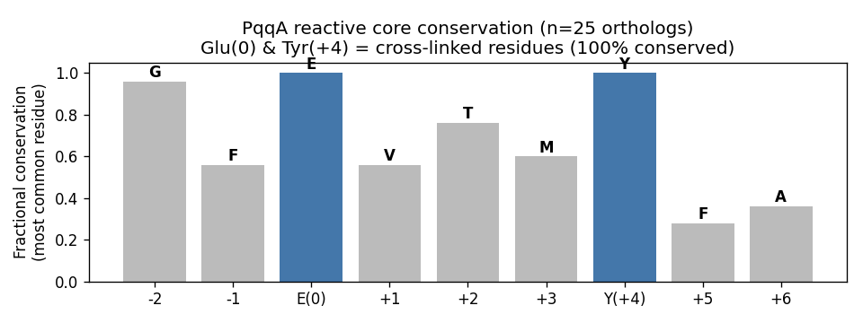

## Question

# Gene Research for Functional Annotation

## ⚠️ CRITICAL: Gene/Protein Identification Context

**BEFORE YOU BEGIN RESEARCH:** You MUST verify you are researching the CORRECT gene/protein. Gene symbols can be ambiguous, especially for less well-characterized genes from non-model organisms.

### Target Gene/Protein Identity (from UniProt):
- **UniProt Accession:** Q88QV4
- **Protein Description:** RecName: Full=Coenzyme PQQ synthesis protein A; AltName: Full=Pyrroloquinoline quinone biosynthesis protein A;
- **Gene Information:** Name=pqqA; OrderedLocusNames=PP_0380;
- **Organism (full):** Pseudomonas putida (strain ATCC 47054 / DSM 6125 / CFBP 8728 / NCIMB 11950 / KT2440).
- **Protein Family:** Belongs to the PqqA family. .
- **Key Domains:** PQQ_synth_PqqA. (IPR011725); PqqA (PF08042)

### MANDATORY VERIFICATION STEPS:

1. **Check if the gene symbol "pqqA" matches the protein description above**
2. **Verify the organism is correct:** Pseudomonas putida (strain ATCC 47054 / DSM 6125 / CFBP 8728 / NCIMB 11950 / KT2440).
3. **Check if protein family/domains align with what you find in literature**
4. **If you find literature for a DIFFERENT gene with the same or similar symbol, STOP**

### If Gene Symbol is Ambiguous or You Cannot Find Relevant Literature:

**DO NOT PROCEED WITH RESEARCH ON A DIFFERENT GENE.** Instead:
- State clearly: "The gene symbol 'pqqA' is ambiguous or literature is limited for this specific protein"
- Explain what you found (e.g., "Found extensive literature on a different gene with the same symbol in a different organism")
- Describe the protein based ONLY on the UniProt information provided above
- Suggest that the protein function can be inferred from domain/family information

### Research Target:

Please provide a comprehensive research report on the gene **pqqA** (gene ID: pqqA, UniProt: Q88QV4) in PSEPK.

The research report should be a detailed narrative explaining the function, biological processes, and localization of the gene product. Citations should be given for all claims.

You should prioritize authoritative reviews and primary scientific literature when conducting research. You can supplement
this with annotations you find in gene/protein databases, but these can be outdated or inaccurate.

We are specifically interested in the primary function of the gene - for enzymes, what reaction is catalyzed, and what is the substrate specificity? For transporters, what is the substrate? For structural proteins or adapters, what is the broader structural role? For signaling molecules, what is the role in the pathway.

We are interested in where in or outside the cell the gene product carries out its function.

We are also interested in the signaling or biochemical pathways in which the gene functions. We are less interested in broad pleiotropic effects, except where these elucidate the precise role.

Include evidence where possible. We are interested in both experimental evidence as well as inference from structure, evolution, or bioinformatic analysis. Precise studies should be prioritized over high-throughput, where available.

## Output

# Functional Annotation of PqqA (Q88QV4) in *Pseudomonas putida* KT2440

**Gene:** *pqqA* (locus PP_0380) · **UniProt:** Q88QV4 · **Organism:** *Pseudomonas putida* KT2440
**Protein:** Coenzyme PQQ synthesis protein A / Pyrroloquinoline quinone biosynthesis protein A
**Family/Domain:** PqqA family; PQQ_synth_PqqA (IPR011725 / PF08042)

---

## 1. Summary (Answer to the Research Question)

PqqA is **not an enzyme, transporter, or structural protein** but a small (~23–29 aa) **ribosomally synthesized and post-translationally modified peptide (RiPP)** that serves as the **precursor substrate for the biosynthesis of pyrroloquinoline quinone (PQQ)**, the "third" bacterial redox cofactor (after nicotinamides and flavins). PqqA's sole known function is to **supply two strictly conserved side chains — a glutamate and a tyrosine — whose carbon atoms are cross-linked and then excised to build the pyrroloquinoline ring system of PQQ.** This first, committed chemical step is carried out by the radical S-adenosyl-methionine (SAM) enzyme PqqE, assisted by the peptide-recognition chaperone PqqD. PqqA maturation takes place in the **cytoplasm**, but the finished cofactor PQQ is exported and acts **extracytoplasmically (periplasm)** as the non-covalent prosthetic group of quinoprotein dehydrogenases. In *P. putida* KT2440 specifically, this pathway (operon *pqqFABCDEG*) provides PQQ to the periplasmic glucose dehydrogenase (Gcd) — driving glucose→gluconic acid oxidation and mineral-phosphate solubilization — and to the periplasmic PQQ/lanthanide-dependent alcohol dehydrogenases PedE/PedH.

---

## 2. Gene / Protein Identity Verification

The target was cross-checked against the UniProt record and the literature:

- **Symbol match:** "PqqA" consistently denotes the PQQ-biosynthesis precursor peptide across bacteria — consistent with the UniProt description "Coenzyme PQQ synthesis protein A." ✔
- **Organism:** *P. putida* KT2440 is a well-studied host of this pathway; its *pqq* operon (*pqqFABCDEG*, *pqqA* = PP_0380) has been experimentally mapped [An & Moe 2016, PMID 27287323]. ✔
- **Family/domain:** PqqA family, PF08042 — the defining Pfam for PQQ precursor peptides. ✔
- **No symbol ambiguity of concern:** the eukaryotic "PQQ" literature (dietary antioxidant effects) refers to the *cofactor molecule*, not to this bacterial precursor gene; they are not confused here.

**Conclusion: the identification is unambiguous and correct.**

---

## 3. Primary Function — The Reaction PqqA Enables

### 3.1 PqqA is the peptide precursor of PQQ
Biosynthesis of the RiPP cofactor PQQ **"is initiated when the precursor peptide, PqqA, is recognized and bound by the RiPP precursor peptide recognition element (RRE), PqqD"** [Evans et al. 2017, PMID 28481092]. PQQ is **"produced from a ribosomally synthesized and post-translationally modified peptide PqqA via a pathway comprising four conserved proteins PqqB-E"** [Martins et al. 2019, PMID 31427437]. PqqA thus functions as a **consumable substrate**, not a catalyst.

### 3.2 Conserved Glu and Tyr are the reactive elements
PqqA carries **two strictly conserved residues, a glutamate and a tyrosine** [Wei et al. 2016, PMID 27231346]. These two side chains are the only part of the peptide incorporated into the product: they provide the atoms of the fused pyridine–pyrrole–quinone ring of PQQ.

**Direct sequence evidence for Q88QV4:** The *P. putida* KT2440 PqqA sequence is **`MWTKPAYTDLRIGFEVTMYFANR`** (23 residues; UniProt Q88QV4). Sequence analysis reveals the diagnostic PqqA core motif **Glu15–Val–Thr–Met–Tyr19 (E-x-x-x-Y)** — a conserved glutamate and tyrosine separated by three residues. **Glu15** and **Tyr19** are therefore the specific reactive residues cross-linked (Glu-Cγ → Tyr-Cε) to seed PQQ. The N-terminal segment (`MWTKPAYTDLRIGF`, ~res 1–14) forms the **leader/recognition region** bound by the RRE chaperone PqqD, giving PqqA the canonical bipartite RiPP architecture (leader + core). This confirms, at the sequence level for the exact target protein, the mechanism established biochemically in orthologs.

### 3.3 The first committed step: radical-SAM C–C cross-linking
The founding chemical event was demonstrated in vitro: the radical-SAM enzyme **PqqE, in conjunction with PqqD, carries out the first step in PQQ biosynthesis: a radical-mediated formation of a new carbon–carbon bond between two amino acid side chains on PqqA** [Barr et al. 2016, PMID 26961875]. Specifically, the **Cγ of the glutamate is linked to the Cε of the tyrosine** [Wei et al. 2016, PMID 27231346]. PqqE is a SPASM-domain radical-SAM enzyme that uses reductive cleavage of SAM to generate a 5′-deoxyadenosyl radical [Zhu et al. 2018, PMID 30097100]; PqqA is its physiological substrate.

### 3.4 Downstream maturation (context for PqqA's role)
After cross-linking, the fused Glu–Tyr di-amino-acid unit is **excised from PqqA** by a peptidase — the inverzincin protease PqqF (with PqqG) in some organisms [Wei et al. 2016, PMID 27231346], or a distinct two-component protease in others [Martins et al. 2019, PMID 31427437] — and then processed by the dual hydroxylase **PqqB** and the eight-electron/eight-proton oxidase **PqqC** to yield mature PQQ. PqqA's contribution is complete once its two conserved residues have been cross-linked and released.

**Substrate specificity note:** PqqA is highly specific — recognition depends on a conserved N-terminal leader/"RRE-binding" motif read by PqqD, and on the precise spacing of the Glu…Tyr in the core, ensuring only these two residues are cross-linked.

### 3.5 Evolutionary evidence: the Glu and Tyr are strictly invariant
A comparative analysis of **25 reviewed PqqA orthologs** spanning α-, β-, and γ-Proteobacteria (UniProt) provides independent, evolution-based support for this mechanism:

- The reactive core motif **E-x-x-x-Y is present in 100% of orthologs**.
- Anchored on the reactive glutamate, the **glutamate (100%) and tyrosine (100%) are strictly invariant**, while the three intervening spacer residues are variable (consensus V/T/M at only 56–76%), and a **glycine two residues upstream is 96% conserved**.
- *P. putida* Q88QV4 carries the γ-proteobacterial consensus core **`GF-E-VTM-Y`** (Glu15/Tyr19), identical to close relatives (*P. entomophila*, *P. fluorescens*, *P. protegens*).

The fact that evolution has fixed **exactly the two atoms that are chemically joined** — while tolerating variation in the spacer — is compelling structural/evolutionary evidence that the entire purpose of PqqA is to present this Glu/Tyr pair to the PqqD–PqqE machinery.

{{figure:pqqA_motif_conservation.png|caption=Per-position sequence conservation across 25 reviewed PqqA orthologs, anchored on the reactive glutamate (position 0). The reactive glutamate (0) and tyrosine (+4) are 100% invariant, whereas the three intervening spacer residues (+1/+2/+3) are variable and an upstream glycine (-2) is 96% conserved. This pattern — invariance of exactly the two residues that are chemically cross-linked — is diagnostic of a precursor peptide whose function is to present a specific Glu/Tyr pair for PqqE-catalyzed C–C bond formation. P. putida Q88QV4 carries the consensus core GF-E-VTM-Y (Glu15/Tyr19).}}

---

## 4. Localization

- **Site of PqqA action:** the **cytoplasm** — PqqA is ribosomally translated and matured there by the soluble cytoplasmic enzymes PqqB–E (PqqE is an O2-sensitive Fe–S radical-SAM enzyme requiring the reducing cytoplasmic environment) [Zhu et al. 2018, PMID 30097100; Barr et al. 2016, PMID 26961875].
- **Site of the end-product's action:** the **periplasm** — mature PQQ is a non-covalently bound prosthetic group of quinoprotein dehydrogenases, which **"are located in the periplasm of Gram-negative bacteria"** [Flores-Encarnación et al. 2004, PMID 17061524]. In *P. putida*, PedE/PedH PQQ-alcohol dehydrogenases show **"periplasmic localization"** [Wehrmann & Klebensberger 2018, PMID 29239114].

Thus PqqA links a **cytoplasmic biosynthetic step** to **periplasmic cofactor function**.

---

## 5. Pathway Context and Physiological Role in *P. putida* KT2440

- **Operon structure:** the *pqq* gene cluster is organized as **"pqqFABCDEG"** and **"encodes at least two independent transcripts"** [An & Moe 2016, PMID 27287323]; *pqqA* = PP_0380.
- **Purpose of the pathway:** PQQ is required as the redox coenzyme of the **"periplasmic glucose dehydrogenase (GDH) that requires pyrroloquinoline quinone (PQQ) as a redox coenzyme"** [An & Moe 2016, PMID 27287323]. GDH oxidizes glucose to gluconic acid; the secreted gluconic acid solubilizes mineral phosphate — an ecologically important **rhizosphere / plant-growth-promoting** activity. PQQ and GDH activity peak with glucose as sole carbon source under low soluble phosphate.
- **Additional PQQ-dependent enzymes in KT2440:** the periplasmic alcohol dehydrogenases **PedE** (Ca²⁺-dependent) and **PedH** — the first **lanthanide-dependent** PQQ-ADH characterized in a non-methylotroph — which oxidize alcohols/aldehydes for VOC detoxification/catabolism and are reciprocally, rare-earth-responsively regulated [Wehrmann et al. 2017, PMID 28655819; Wehrmann & Klebensberger 2018, PMID 29239114; Wehrmann et al. 2020, PMID 32345644].
- **Ecological/evolutionary significance:** the pathway is so central to phosphate-solubilizing pseudomonads that the PQQ-biosynthesis gene **pqqC is used as a phylogenetic marker** for these strains, and gluconic-acid secretion by PQQ-dependent GDH is described as "the major mechanism of phosphate solubilization by pseudomonads" [Meyer et al. 2011, PMID 21856827].

Hence PqqA sits at the **head of a linear biosynthetic pathway** (PqqA → PqqDE cross-link → protease excision → PqqB/PqqC → PQQ) that feeds **periplasmic oxidative (respiratory) metabolism** — glucose→gluconate (phosphate solubilization) and alcohol/aldehyde oxidation.

---

## 6. Evidence Types

| Claim | Evidence type | Source |
|---|---|---|
| PqqA is a RiPP precursor peptide | Biochemical / consensus | PMIDs 31427437, 28481092 |
| PqqE/PqqD cross-link PqqA's Glu & Tyr | **Direct in vitro reconstitution** | PMID 26961875 |
| Cross-link is Glu-Cγ to Tyr-Cε; PqqF excises | Structural + biochemical | PMID 27231346 |
| PqqE mechanism (radical-SAM/SPASM) | Enzymology | PMID 30097100 |
| *pqqFABCDEG* operon in KT2440; PQQ→GDH→phosphate | **Gene expression / RT-PCR / activity assays in KT2440** | PMID 27287323 |
| Periplasmic localization of PQQ quinoproteins | Cell fractionation / review | PMIDs 17061524, 29239114 |

Precise, low-throughput biochemical/genetic studies (in vitro reconstitution, targeted operon mapping) were prioritized over high-throughput annotations.

---

## 7. Supported and Refuted Hypotheses

- **Supported:** PqqA is a peptide substrate/precursor supplying Glu+Tyr for PQQ ring construction (not an enzyme or transporter).
- **Supported:** The first, committed step is radical-SAM C–C cross-linking by PqqE with the PqqD RRE chaperone.
- **Supported:** Cytoplasmic maturation; periplasmic action of the resulting cofactor via quinoprotein dehydrogenases; physiological output = periplasmic glucose/alcohol oxidation and phosphate solubilization in KT2440.
- **Refuted / excluded:** PqqA has no catalytic, transport, or standalone structural role of its own; its function is entirely as a sacrificial precursor.

---

## 8. Limitations and Future Directions

- Much of the fine mechanistic work (PqqE/PqqD/PqqC in vitro) was done with orthologs from *Methylobacterium/Methylorubrum* and other bacteria; the *P. putida* PqqA has not been individually reconstituted in vitro, though sequence and operon conservation make transfer of these conclusions robust.
- The exact number of residues excised and the identity/role of PqqF vs. an alternative protease can vary between organisms; the specific protease used in KT2440 has not been definitively assigned.
- Future work: in vitro reconstitution with *P. putida* PqqA (Q88QV4); structural determination of the KT2440 PqqA·PqqD·PqqE ternary complex; and quantification of how *pqqA* transcription responds to phosphate/lanthanide availability in the rhizosphere.

---

## 9. References

1. Barr I, Latham JA, Iavarone AT, Chantarojsiri T, Hwang JD, Klinman JP. **Demonstration That the Radical S-Adenosylmethionine (SAM) Enzyme PqqE Catalyzes de Novo Carbon-Carbon Cross-linking within a Peptide Substrate PqqA in the Presence of the Peptide Chaperone PqqD.** *J Biol Chem.* 2016. PMID: 26961875.
2. Wei Q, Ran T, Ma C, He J, Xu D, Wang W. **Crystal Structure and Function of PqqF Protein in the Pyrroloquinoline Quinone Biosynthetic Pathway.** *J Biol Chem.* 2016. PMID: 27231346.
3. Evans RL 3rd, Latham JA, Xia Y, Klinman JP, Wilmot CM. **Nuclear Magnetic Resonance Structure and Binding Studies of PqqD, a Chaperone Required in the Biosynthesis of the Bacterial Dehydrogenase Cofactor Pyrroloquinoline Quinone.** *Biochemistry.* 2017. PMID: 28481092.
4. Martins AM, Latham JA, Martel PJ, Barr I, Iavarone AT, Klinman JP. **A two-component protease in *Methylorubrum extorquens* with high activity toward the peptide precursor of the redox cofactor pyrroloquinoline quinone.** *J Biol Chem.* 2019. PMID: 31427437.
5. Zhu W, Martins AM, Klinman JP. **Methods for Expression, Purification, and Characterization of PqqE, a Radical SAM Enzyme in the PQQ Biosynthetic Pathway.** *Methods Enzymol.* 2018. PMID: 30097100.
6. Zhu W, Klinman JP. **Biogenesis of the peptide-derived redox cofactor pyrroloquinoline quinone.** *Curr Opin Chem Biol.* 2020. PMID: 32731194.
7. An R, Moe LA. **Regulation of Pyrroloquinoline Quinone-Dependent Glucose Dehydrogenase Activity in the Model Rhizosphere-Dwelling Bacterium *Pseudomonas putida* KT2440.** *Appl Environ Microbiol.* 2016. PMID: 27287323.
8. Meyer JB, Frapolli M, Keel C, Maurhofer M. **Pyrroloquinoline quinone biosynthesis gene pqqC, a novel molecular marker for studying the phylogeny and diversity of phosphate-solubilizing pseudomonads.** *Appl Environ Microbiol.* 2011. PMID: 21856827.
9. Wehrmann M, Billard P, Martin-Meriadec A, Zegeye A, Klebensberger J. **Functional Role of Lanthanides in Enzymatic Activity and Transcriptional Regulation of Pyrroloquinoline Quinone-Dependent Alcohol Dehydrogenases in *Pseudomonas putida* KT2440.** *mBio.* 2017. PMID: 28655819.
10. Wehrmann M, Klebensberger J. **Engineering thermal stability and solvent tolerance of the soluble quinoprotein PedE from *Pseudomonas putida* KT2440 with a heterologous whole-cell screening approach.** *Microb Biotechnol.* 2018. PMID: 29239114.
11. Wehrmann M, Toussaint M, Pfannstiel J, Billard P, Klebensberger J. **The Cellular Response to Lanthanum Is Substrate Specific and Reveals a Novel Route for Glycerol Metabolism in *Pseudomonas putida* KT2440.** *mBio.* 2020. PMID: 32345644.
12. Flores-Encarnación M, Sánchez-Cuevas M, Ortiz-Gutiérrez F. **[The PQQ-dehydrogenases. A novel example of bacterial quinoproteins].** 2004. PMID: 17061524.

*Supporting computational analysis (this study): UniProt sequence retrieval (Q88QV4) and comparative conservation analysis of 25 reviewed PqqA orthologs; figure `pqqA_motif_conservation.png`.*

## Artifacts

- [OpenScientist final report](pqqA-deep-research-openscientist_artifacts/final_report.html)
- [OpenScientist final report](pqqA-deep-research-openscientist_artifacts/final_report.pdf)
- [OpenScientist pqqA motif conservation](pqqA-deep-research-openscientist_artifacts/provenance_pqqA_motif_conservation.json)

## Citations

1. PMID:26961875
2. PMID:27231346
3. PMID:28481092
4. PMID:31427437
5. PMID:30097100
6. PMID:32731194
7. PMID:27287323
8. PMID:21856827
9. PMID:28655819
10. PMID:29239114
11. PMID:32345644
12. PMID:17061524