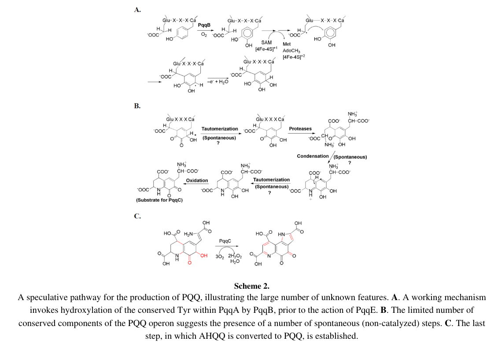

## Question

# Gene Research for Functional Annotation

## ⚠️ CRITICAL: Gene/Protein Identification Context

**BEFORE YOU BEGIN RESEARCH:** You MUST verify you are researching the CORRECT gene/protein. Gene symbols can be ambiguous, especially for less well-characterized genes from non-model organisms.

### Target Gene/Protein Identity (from UniProt):
- **UniProt Accession:** Q88QV5
- **Protein Description:** RecName: Full=Coenzyme PQQ synthesis protein B {ECO:0000255|HAMAP-Rule:MF_00653}; AltName: Full=Pyrroloquinoline quinone biosynthesis protein B {ECO:0000255|HAMAP-Rule:MF_00653};
- **Gene Information:** Name=pqqB {ECO:0000255|HAMAP-Rule:MF_00653}; OrderedLocusNames=PP_0379;
- **Organism (full):** Pseudomonas putida (strain ATCC 47054 / DSM 6125 / CFBP 8728 / NCIMB 11950 / KT2440).
- **Protein Family:** Belongs to the PqqB family. {ECO:0000255|HAMAP-
- **Key Domains:** Metallo-B-lactamas. (IPR001279); PQQ_synth_PqqB. (IPR011842); RibonucZ/Hydroxyglut_hydro. (IPR036866); Lactamase_B_2 (PF12706)

### MANDATORY VERIFICATION STEPS:

1. **Check if the gene symbol "pqqB" matches the protein description above**
2. **Verify the organism is correct:** Pseudomonas putida (strain ATCC 47054 / DSM 6125 / CFBP 8728 / NCIMB 11950 / KT2440).
3. **Check if protein family/domains align with what you find in literature**
4. **If you find literature for a DIFFERENT gene with the same or similar symbol, STOP**

### If Gene Symbol is Ambiguous or You Cannot Find Relevant Literature:

**DO NOT PROCEED WITH RESEARCH ON A DIFFERENT GENE.** Instead:
- State clearly: "The gene symbol 'pqqB' is ambiguous or literature is limited for this specific protein"
- Explain what you found (e.g., "Found extensive literature on a different gene with the same symbol in a different organism")
- Describe the protein based ONLY on the UniProt information provided above
- Suggest that the protein function can be inferred from domain/family information

### Research Target:

Please provide a comprehensive research report on the gene **pqqB** (gene ID: pqqB, UniProt: Q88QV5) in PSEPK.

The research report should be a detailed narrative explaining the function, biological processes, and localization of the gene product. Citations should be given for all claims.

You should prioritize authoritative reviews and primary scientific literature when conducting research. You can supplement
this with annotations you find in gene/protein databases, but these can be outdated or inaccurate.

We are specifically interested in the primary function of the gene - for enzymes, what reaction is catalyzed, and what is the substrate specificity? For transporters, what is the substrate? For structural proteins or adapters, what is the broader structural role? For signaling molecules, what is the role in the pathway.

We are interested in where in or outside the cell the gene product carries out its function.

We are also interested in the signaling or biochemical pathways in which the gene functions. We are less interested in broad pleiotropic effects, except where these elucidate the precise role.

Include evidence where possible. We are interested in both experimental evidence as well as inference from structure, evolution, or bioinformatic analysis. Precise studies should be prioritized over high-throughput, where available.

## Output

Question: You are an expert researcher providing comprehensive, well-cited information.

Provide detailed information focusing on:
1. Key concepts and definitions with current understanding
2. Recent developments and latest research (prioritize 2023-2024 sources)
3. Current applications and real-world implementations
4. Expert opinions and analysis from authoritative sources
5. Relevant statistics and data from recent studies

Format as a comprehensive research report with proper citations. Include URLs and publication dates where available.
Always prioritize recent, authoritative sources and provide specific citations for all major claims.

# Gene Research for Functional Annotation

## ⚠️ CRITICAL: Gene/Protein Identification Context

**BEFORE YOU BEGIN RESEARCH:** You MUST verify you are researching the CORRECT gene/protein. Gene symbols can be ambiguous, especially for less well-characterized genes from non-model organisms.

### Target Gene/Protein Identity (from UniProt):
- **UniProt Accession:** Q88QV5
- **Protein Description:** RecName: Full=Coenzyme PQQ synthesis protein B {ECO:0000255|HAMAP-Rule:MF_00653}; AltName: Full=Pyrroloquinoline quinone biosynthesis protein B {ECO:0000255|HAMAP-Rule:MF_00653};
- **Gene Information:** Name=pqqB {ECO:0000255|HAMAP-Rule:MF_00653}; OrderedLocusNames=PP_0379;
- **Organism (full):** Pseudomonas putida (strain ATCC 47054 / DSM 6125 / CFBP 8728 / NCIMB 11950 / KT2440).
- **Protein Family:** Belongs to the PqqB family. {ECO:0000255|HAMAP-
- **Key Domains:** Metallo-B-lactamas. (IPR001279); PQQ_synth_PqqB. (IPR011842); RibonucZ/Hydroxyglut_hydro. (IPR036866); Lactamase_B_2 (PF12706)

### MANDATORY VERIFICATION STEPS:

1. **Check if the gene symbol "pqqB" matches the protein description above**
2. **Verify the organism is correct:** Pseudomonas putida (strain ATCC 47054 / DSM 6125 / CFBP 8728 / NCIMB 11950 / KT2440).
3. **Check if protein family/domains align with what you find in literature**
4. **If you find literature for a DIFFERENT gene with the same or similar symbol, STOP**

### If Gene Symbol is Ambiguous or You Cannot Find Relevant Literature:

**DO NOT PROCEED WITH RESEARCH ON A DIFFERENT GENE.** Instead:
- State clearly: "The gene symbol 'pqqB' is ambiguous or literature is limited for this specific protein"
- Explain what you found (e.g., "Found extensive literature on a different gene with the same symbol in a different organism")
- Describe the protein based ONLY on the UniProt information provided above
- Suggest that the protein function can be inferred from domain/family information

### Research Target:

Please provide a comprehensive research report on the gene **pqqB** (gene ID: pqqB, UniProt: Q88QV5) in PSEPK.

The research report should be a detailed narrative explaining the function, biological processes, and localization of the gene product. Citations should be given for all claims.

You should prioritize authoritative reviews and primary scientific literature when conducting research. You can supplement
this with annotations you find in gene/protein databases, but these can be outdated or inaccurate.

We are specifically interested in the primary function of the gene - for enzymes, what reaction is catalyzed, and what is the substrate specificity? For transporters, what is the substrate? For structural proteins or adapters, what is the broader structural role? For signaling molecules, what is the role in the pathway.

We are interested in where in or outside the cell the gene product carries out its function.

We are also interested in the signaling or biochemical pathways in which the gene functions. We are less interested in broad pleiotropic effects, except where these elucidate the precise role.

Include evidence where possible. We are interested in both experimental evidence as well as inference from structure, evolution, or bioinformatic analysis. Precise studies should be prioritized over high-throughput, where available.

## Research Report: Functional Annotation of **pqqB** (UniProt Q88QV5; locus **PP_0379**) in *Pseudomonas putida* KT2440

### 0) Target verification (MANDATORY)
The target protein is **coenzyme PQQ synthesis protein B (PqqB)** encoded by **pqqB** with ordered locus name **PP_0379** in *Pseudomonas putida* strain KT2440. In *P. putida* KT2440, PP_0379 is explicitly annotated as **pqqB** and is genomically adjacent to **pqqC (PP0378)** and **pqqA (PP0380)** in a clustered region implicated in PQQ biosynthesis. (fernandez2012mechanismsofresistance pages 10-15)

### 1) Key concepts and definitions (current understanding)

#### Pyrroloquinoline quinone (PQQ)
PQQ is an enzymatic redox cofactor (a “quinocofactor”) used by multiple bacterial dehydrogenases. The biosynthesis of PQQ is genetically encoded by a dedicated **pqq operon**; a canonical example contains **pqqA–F**. (klinman2014intriguesandintricacies pages 2-4)

#### Overview of PQQ biosynthesis and the role of PqqB
PQQ is synthesized from a **small peptide precursor PqqA**, with conserved residues (notably **Glu and Tyr**) contributing to the final cofactor structure. A mechanistic working model proposes that **PqqB acts early**, likely by **hydroxylating the conserved Tyr within PqqA**, prior to radical-SAM chemistry by PqqE; later, PqqC catalyzes a multi-step oxidation/ring-closure converting an advanced intermediate (AHQQ) to PQQ. (klinman2014intriguesandintricacies pages 26-37, klinman2014intriguesandintricacies media 63b6eef5)

The PqqB step remains one of the less directly validated transformations in the pathway, with some genetic data historically described as ambiguous regarding absolute essentiality, while structural/bioinformatic evidence supports a key role. (klinman2014intriguesandintricacies pages 2-4)

### 2) Molecular function of PqqB: biochemical role, reaction type, and substrate specificity

#### Best-supported functional model
The strongest synthesis from authoritative review and structural inference is:
- **Reaction type (proposed):** oxygen-dependent hydroxylation chemistry (non-heme metallo-oxygenase-like)
- **Putative substrate:** the PqqA peptide (specifically the conserved Tyr sidechain)
- **Pathway position:** early step, upstream of PqqE radical-SAM-mediated C–C bond formation

This proposed Tyr hydroxylation step is explicitly depicted in the pathway scheme and described as part of a “working mechanism.” (klinman2014intriguesandintricacies pages 26-37, klinman2014intriguesandintricacies media 63b6eef5)

#### Structural/domain evidence supporting oxygenase-like function
PqqB proteins are homologous to the **metallo-β-lactamase fold** superfamily and have an X-ray structure (review cites **PDB 3JXP**). Structural comparison to the metallo-β-lactamase-family enzyme PhnP suggests PqqB retains the overall fold but differs in metal-binding architecture. Critically, PqqB retains residues forming a **2-His/1-carboxylate ‘facial triad’**, a motif typical of **non-heme metal-binding oxygenases**, supporting an oxygenase-like hypothesis rather than β-lactam hydrolysis. (klinman2014intriguesandintricacies pages 2-4, klinman2014intriguesandintricacies pages 37-50)

PqqB also appears to contain a **structural Zn²⁺ site** (conserved cysteine motif) that may stabilize the protein rather than directly catalyze the primary chemistry; notably, the presumed catalytic metal (e.g., Fe) was not observed at the active site in the solved structure, which could reflect metal lability or purification/crystallization conditions. (klinman2014intriguesandintricacies pages 2-4, klinman2014intriguesandintricacies pages 37-50, he2008towardthestructure pages 70-78)

#### Substrate specificity and enzymatic kinetics: current limitations
Within the retrieved corpus, **direct biochemical assays defining PqqB substrate specificity, kinetic parameters, or a chemically confirmed product** for KT2440 PqqB were not found. Therefore, the “PqqA Tyr hydroxylase/non-heme oxygenase” assignment should be treated as **structure- and pathway-model-supported**, rather than fully enzyme-assay-proven, for this specific protein. (klinman2014intriguesandintricacies pages 2-4, klinman2014intriguesandintricacies pages 37-50)

### 3) Genomic context, regulation, and pathway integration in *P. putida* KT2440

#### Operon/neighborhood context in KT2440
In *P. putida* KT2440, **pqqC–pqqB–pqqA** occur as an adjacent cluster **PP0378–PP0380**, consistent with a coordinated biosynthetic module. (fernandez2012mechanismsofresistance pages 10-15)

A separate pqq gene component is located elsewhere: **pqqD** is encoded at **PP2681**, indicating that in KT2440 the PQQ pathway genes can be distributed across the genome rather than forming one contiguous pqqA–F operon. (fernandez2012mechanismsofresistance pages 10-15)

#### Expression/regulatory evidence in KT2440
In a chloramphenicol stress condition, the KT2440 pqqCBA region shows coordinated transcriptional induction: **pqqA 4.5-fold**, **pqqC 2.8-fold**, **pqqB 2.2-fold** upregulation. (fernandez2012mechanismsofresistance pages 28-33)

The same study links a regulator (AgmR) to expression changes that include pqqA, suggesting regulatory wiring that can modulate PQQ biosynthesis under stress. (fernandez2012mechanismsofresistance pages 10-15)

#### Phenotypic evidence from gene disruption
Insertional disruption of **pqqB (PP_0379)** and **pqqC (PP_0378)** is associated with compromised growth under chloramphenicol and reduced MIC values relative to parental strain in that assay system, consistent with PQQ-pathway contributions to cellular physiology under stress. (fernandez2012mechanismsofresistance pages 28-33, fernandez2012mechanismsofresistance pages 10-15)

### 4) Cellular localization (where PqqB acts)
Direct experimental localization (e.g., fractionation, microscopy, signal peptide validation) for KT2440 **PqqB** was not found in the retrieved texts. However, PQQ-dependent enzymes that use PQQ as a cofactor (e.g., quinoprotein dehydrogenases) are commonly associated with the **periplasmic space** in Gram-negative bacteria, implying that PQQ biosynthesis must provide cofactor to periplasm-facing redox systems. This background does **not** directly localize PqqB itself, but it motivates the expectation that PQQ biosynthesis is functionally linked to envelope-associated redox metabolism. (klinman2014intriguesandintricacies pages 1-2)

Accordingly, the most defensible statement from retrieved evidence is: KT2440 PqqB is a **PQQ-biosynthesis enzyme** encoded in a pqq gene cluster (PP0378–PP0380), but its precise subcellular compartment remains **undetermined** here. (fernandez2012mechanismsofresistance pages 10-15)

### 5) Recent developments (prioritizing 2023–2024) and real-world implementations

#### 5.1 Agricultural biotechnology: phosphate solubilization (2024)
A major application area for PQQ biosynthesis genes (including pqqB) is **phosphate solubilization** by soil and plant-associated bacteria.

**Mechanistic link:** PQQ is required as a cofactor for membrane-bound **glucose dehydrogenase (GDH)** that produces gluconic acid (and related acids), acidifying the environment and mobilizing insoluble phosphate. (anzuay2024employmentofpqqe pages 1-2, chen2024genomebasedidentificationof pages 1-2)

**Quantitative evidence (2024):** In a genome-guided analysis of phosphate-solubilizing bacteria, 76 PSB genomes were analyzed and 73 strains were experimentally assessed; phosphate release varied widely (example values reported include ~92–96 µg/mL for strong solubilizers under specific conditions) and was associated with decreased medium pH (~4.2–5.2 for strong solubilizers in examples). The study used qPCR to detect pqq gene clusters with a threshold **Ct < 30**. (chen2024genomebasedidentificationof pages 2-3)

In a highlighted strain (51-Y1415) across a **144-h** cultivation time course, phosphate release showed strong correlations with pqq gene abundance, including **P release vs pqqB: r = 0.902** (statistically significant as reported), and phosphate release correlated with **2-keto-D-gluconic acid** (r ≈ 0.903). (chen2024genomebasedidentificationof pages 5-7, chen2024genomebasedidentificationof pages 7-9)

These 2024 data support the practical use of pqq genes as **screening markers** for identifying high-performing phosphate-solubilizing strains, even though the work emphasizes pqqC most strongly for marker utility. (chen2024genomebasedidentificationof pages 2-3, chen2024genomebasedidentificationof pages 7-9)

#### 5.2 Environmental monitoring/traceability of PSB (2024)
A 2024 study developed **pqqE** as a molecular marker to trace Gram-negative phosphate-solubilizing bacteria in environmental samples, noting that pqqA–E are commonly found together as an operon in studied strains while pqqF can be separated and more variable. This provides an applied framework where the presence of core pqq genes (including pqqB) is used to infer capacity for PQQ-dependent phosphate solubilization. (anzuay2024employmentofpqqe pages 1-2)

#### 5.3 Expert opinion and authoritative synthesis
The authoritative Chemical Reviews analysis emphasizes the pathway’s mechanistic uncertainties while highlighting strong structural inference for PqqB (metallo-β-lactamase fold, oxygenase-like facial triad) and proposing a specific role (Tyr hydroxylation of PqqA). This is a leading expert synthesis, but it explicitly reflects that parts of the pathway are not fully resolved and that some steps may occur spontaneously rather than enzymatically, underscoring ongoing open questions in PQQ biosynthesis. (klinman2014intriguesandintricacies pages 26-37, klinman2014intriguesandintricacies pages 2-4)

### 6) Visual evidence: pathway placement of PqqB
A key scheme summarizing the proposed pathway places PqqB at the step of hydroxylating the conserved Tyr in PqqA. (klinman2014intriguesandintricacies media 63b6eef5)

### 7) Summary and recommended interpretation for functional annotation

#### High-confidence annotations (supported directly in KT2440)
- **Gene/protein identity:** PP_0379 is **pqqB** in *P. putida* KT2440; clustered with pqqC and pqqA. (fernandez2012mechanismsofresistance pages 10-15)
- **Pathway membership:** PqqB is part of PQQ biosynthesis and is transcriptionally co-induced with neighboring pqq genes under antibiotic stress. (fernandez2012mechanismsofresistance pages 28-33)
- **Physiological relevance:** pqqB disruption affects stress tolerance phenotypes in an antibiotic exposure assay. (fernandez2012mechanismsofresistance pages 28-33)

#### Mechanistic function (best current model; qualified)
- **Likely biochemical role:** non-heme metallo-oxygenase-like enzyme proposed to hydroxylate PqqA Tyr early in PQQ biosynthesis. (klinman2014intriguesandintricacies pages 26-37, klinman2014intriguesandintricacies pages 2-4)
- **Structural rationale:** metallo-β-lactamase fold with oxygenase-like facial triad; structural Zn²⁺ site. (klinman2014intriguesandintricacies pages 2-4, he2008towardthestructure pages 70-78)

#### Key evidence gap
- Direct enzyme assay evidence for KT2440 PqqB substrate specificity and product formation is not present in the retrieved sources; therefore, the catalytic assignment should be recorded as **inference supported by structure and pathway models**, pending targeted biochemical validation. (klinman2014intriguesandintricacies pages 2-4, klinman2014intriguesandintricacies pages 37-50)

---

### Evidence summary tables
The following tables consolidate the key evidence and recent developments in a citable format.

| Claim (what PqqB does) | Evidence type (experiment/structure/bioinformatics) | Key details (e.g., locus, fold change, motifs) | Source (author/year) | URL/DOI | Citation ID |
|---|---|---|---|---|---|
| PP_0379 in *Pseudomonas putida* KT2440 is **pqqB**, a coenzyme PQQ synthesis protein | Experiment/annotation | PP_0379 annotated as **pqqB**; adjacent to **pqqC (PP0378)** and **pqqA (PP0380)** in a clustered region | Fernández et al. 2012 | https://doi.org/10.1128/AAC.05398-11 | (fernandez2012mechanismsofresistance pages 10-15) |
| pqqB participates in a coordinately regulated **pqqCBA** biosynthetic region in KT2440 | Transcriptomics/experiment | In chloramphenicol-containing medium, **pqqB upregulated 2.2-fold**, with **pqqC 2.8-fold** and **pqqA 4.5-fold**, supporting pathway co-regulation | Fernández et al. 2012 | https://doi.org/10.1128/AAC.05398-11 | (fernandez2012mechanismsofresistance pages 28-33) |
| Disrupting **pqqB** affects a measurable cellular phenotype in KT2440, supporting functional importance of the gene | Mutant phenotype/experiment | **mut::pqqB** showed reduced chloramphenicol MIC relative to parental KT2440R and impaired growth under stress, consistent with a physiologically relevant PQQ-biosynthesis role | Fernández et al. 2012 | https://doi.org/10.1128/AAC.05398-11 | (fernandez2012mechanismsofresistance pages 28-33, fernandez2012mechanismsofresistance pages 10-15) |
| PqqB belongs to a **metallo-β-lactamase-fold** protein family rather than a classical β-lactamase enzyme | Structure/bioinformatics | Review notes PqqB is homologous to metallo-β-lactamase family proteins; crystal structure available (**PDB 3JXP**) | Klinman & Bonnot 2014 | https://doi.org/10.1021/cr400475g | (klinman2014intriguesandintricacies pages 2-4) |
| PqqB likely acts as a **non-heme metallo-oxygenase** in PQQ biosynthesis | Structure-based functional inference | Putative active site retains a **2-His/1-carboxylate facial triad**, characteristic of non-heme oxygenases; comparison made to **PhnP** | Klinman & Bonnot 2014 | https://doi.org/10.1021/cr400475g | (klinman2014intriguesandintricacies pages 2-4, klinman2014intriguesandintricacies pages 37-50) |
| PqqB likely binds a **structural Zn²⁺** and may require a different catalytic metal at the active site | Structure/comparative analysis | Crystal structure shows **Zn²⁺ at a structural site**; active-site metal absent in solved structure; conserved cysteines support structural Zn-binding motif | Klinman & Bonnot 2014; He 2008 | https://doi.org/10.1021/cr400475g ; https://doi.org/10.4236/jbpc.2012.32023 | (klinman2014intriguesandintricacies pages 2-4, klinman2014intriguesandintricacies pages 37-50, he2008towardthestructure pages 70-78) |
| The leading mechanistic model is that PqqB **hydroxylates the conserved Tyr residue in PqqA** early in the pathway | Mechanistic inference/review | Proposed step occurs **before PqqE** radical-SAM chemistry; highlighted in pathway scheme and review discussion | Klinman & Bonnot 2014 | https://doi.org/10.1021/cr400475g | (klinman2014intriguesandintricacies pages 26-37, klinman2014intriguesandintricacies media 63b6eef5) |
| Recent literature continues to place PqqB in the core **PQQ biosynthetic enzyme set** and sometimes describes it as a hydroxylase | Recent review/application-oriented synthesis | 2024 study describes PQQ formation via **PqqE, PqqD, PqqB (dual hydroxylase), and PqqC**; emphasizes linkage to PQQ-dependent GDH and phosphate solubilization | Chen et al. 2024 | https://doi.org/10.1186/s13568-024-01745-w | (chen2024genomebasedidentificationof pages 7-9) |
| Abundance of **pqqB** tracks with phosphate-solubilization output in a 2024 PSB study, supporting pathway relevance in applied settings | Quantitative correlation/application | In strain 51-Y1415 over **144 h**, correlation of **P release vs pqqB abundance = 0.902***; P release also correlated with **2-keto-D-gluconic acid** production | Chen et al. 2024 | https://doi.org/10.1186/s13568-024-01745-w | (chen2024genomebasedidentificationof pages 5-7, chen2024genomebasedidentificationof pages 7-9) |
| Direct biochemical substrate specificity of **P. putida** PqqB remains unresolved despite strong family-level inference | Evidence gap/assessment | Retrieved sources support pathway membership and structure-based oxygenase hypothesis, but do **not** provide direct kinetics or purified-enzyme substrate specificity for KT2440 PqqB | Synthesis from retrieved evidence | https://doi.org/10.1021/cr400475g ; https://doi.org/10.1128/AAC.05398-11 | (fernandez2012mechanismsofresistance pages 10-15, klinman2014intriguesandintricacies pages 2-4, klinman2014intriguesandintricacies pages 37-50) |

*Table: This table summarizes the main experimental, structural, and bioinformatic evidence supporting the annotation and likely pathway role of PqqB (PP_0379; UniProt Q88QV5) in *Pseudomonas putida* KT2440. It is useful for distinguishing direct strain-specific evidence from broader family-level functional inference.*

| Study (year) | System/organism | What was done (application) | Key quantitative results | Relevance to pqqB/PQQ pathway | URL/DOI | Citation ID |
|---|---|---|---|---|---|---|
| Chen et al. (2024) | 76 soil phosphate-solubilizing bacterial isolates; highlighted strain *Burkholderia cepacia* 51-Y1415 | Genome-guided screening of PSB using pqq gene clusters as markers for agricultural phosphate-solubilizer discovery | 76 genomes analyzed; 73 strains experimentally assessed; P release examples included 96.32 ± 27.05 µg mL⁻¹ and 92.03 µg mL⁻¹ for strong solubilizers; medium pH for strong strains ~4.2–5.2; qPCR presence threshold Ct < 30 (chen2024genomebasedidentificationof pages 2-3, chen2024genomebasedidentificationof pages 1-2) | Positions the pqq cluster as an actionable screening target for PSB; supports applied importance of core pathway genes including pqqB, though pqqC was emphasized as the strongest marker (chen2024genomebasedidentificationof pages 2-3, chen2024genomebasedidentificationof pages 1-2) | https://doi.org/10.1186/s13568-024-01745-w | (chen2024genomebasedidentificationof pages 2-3, chen2024genomebasedidentificationof pages 1-2) |
| Chen et al. (2024) | *Burkholderia cepacia* 51-Y1415 | Time-course linkage of pqqABCDE expression to phosphate release and organic-acid output for candidate biofertilizer selection | 144-h cultivation; P release vs gene abundance correlations: pqqA 0.946*, pqqB 0.902*, pqqC 0.940*, pqqD 0.897*, pqqE 0.872; P release vs 2-keto-D-gluconic acid 0.903*; pqqA–E vs 2-keto-D-gluconic acid 0.988**–0.995** (chen2024genomebasedidentificationof pages 5-7, chen2024genomebasedidentificationof pages 7-9) | Directly ties pqqB abundance to functional output in an application setting; supports using pqq genes as practical predictors of PQQ-dependent GDH-driven phosphate solubilization (chen2024genomebasedidentificationof pages 5-7, chen2024genomebasedidentificationof pages 7-9) | https://doi.org/10.1186/s13568-024-01745-w | (chen2024genomebasedidentificationof pages 5-7, chen2024genomebasedidentificationof pages 7-9) |
| Anzuay et al. (2024) | Gram-negative plant-associated phosphate-solubilizing bacteria; mixed cultures and peanut rhizosphere samples | Developed pqqE-based molecular traceability approach for monitoring beneficial PSB in environmental samples | pqqE amplification detected in all Gram-negative PSB analyzed; tested across pure cultures, mixed cultures, inoculated and uninoculated rhizosphere DNA preparations (anzuay2024employmentofpqqe pages 1-2) | Relevant because pqqA–E are typically organized together; pqqB is part of the same core biosynthetic module whose presence underpins PQQ-dependent phosphate solubilization (anzuay2024employmentofpqqe pages 1-2) | https://doi.org/10.1007/s00294-024-01296-4 | (anzuay2024employmentofpqqe pages 1-2) |
| Pan & Cai (2023) | Review of phosphate-solubilizing bacteria in agriculture | Synthesized physiological and molecular mechanisms by which PSB mobilize soil phosphorus for crop use | Global soil total phosphorus cited as 400–1000 mg/kg, but only 1.00–2.50% plant-available (from review synthesis) (paper metadata) | Frames the applied importance of PQQ biosynthesis genes, including pqqB, because PQQ-dependent GDH/gluconic acid production is a major acidolysis mechanism in PSB (paper metadata; supported in 2024 mechanistic summaries) | https://doi.org/10.3390/microorganisms11122904 | (chen2024genomebasedidentificationof pages 1-2, chen2024genomebasedidentificationof pages 7-9) |
| Pang et al. (2024) | Review of phosphate-solubilizing microorganisms in soil-plant systems | Summarized current implementations of PSMs for improving plant phosphorus uptake and sustainability | Review emphasizes PSM-mediated activation of insoluble P via organic acids and highlights PQQ synthesis genes as major molecular drivers; no single pqqB-specific metric reported in retrieved excerpt (chen2024genomebasedidentificationof pages 1-2) | Supports real-world relevance of the PQQ pathway for agricultural bioinoculants; pqqB belongs to the six-core-gene biosynthetic framework discussed for PQQ production (chen2024genomebasedidentificationof pages 1-2) | https://doi.org/10.3389/fmicb.2024.1383813 | (chen2024genomebasedidentificationof pages 1-2) |
| Gorniak et al. (2024) | *Pseudomonas alloputida* KT2440 | Transcriptome-level study of lanthanide effects on PQQ-dependent alcohol dehydrogenase physiology | Light lanthanides (La, Ce, Nd) improved growth, whereas heavy lanthanides imposed fitness costs; transcriptome-wide effects examined in strain KT2440 during growth on 2-phenylethanol (paper metadata) | Demonstrates a modern biotechnology context in which endogenous PQQ supply is operationally important because PedE/PedH are PQQ-dependent enzymes; thus pqqB remains relevant as an upstream biosynthetic gene even though it was not the direct focus (paper metadata) | https://doi.org/10.1128/msphere.00685-24 | (klinman2014intriguesandintricacies pages 1-2) |
| Pause et al. (2024) | *Pseudomonas putida* KT2440 in a bioelectrochemical system | Tested glucose uptake routes under anaerobic electro-fermentation to improve oxidative bioprocessing | About half of secreted acetate originated from inoculation biomass and half from substrate; deletion of individual sugar uptake routes did not significantly alter secreted acetate concentrations among strains (paper metadata) | Relevant because PQQ-dependent periplasmic oxidation is part of KT2440 carbon processing architecture; performance of such systems depends indirectly on intact PQQ biosynthesis, to which pqqB contributes (paper metadata) | https://doi.org/10.1111/1751-7915.14375 | (klinman2014intriguesandintricacies pages 1-2) |
| Liang et al. (2024) | *Hyphomicrobium denitrificans* H4-45 mutant AE-9 | Strain improvement for industrial PQQ production using UV-LiCl mutagenesis, ALE, and fermentation optimization | Nearly 400 generations of mutagenesis/ALE; mutant PQQ titer increased 80.4%; cell density increased 14.9%; final PQQ reached 307 mg/L with productivity 4.26 mg/L/h in a 3.7-L bioreactor (paper metadata) | Although not pqqB-specific, this is a direct real-world implementation of the PQQ biosynthetic pathway as a production platform, underscoring the industrial value of understanding genes such as pqqB (paper metadata) | https://doi.org/10.1007/s00253-024-13053-1 | (chen2024genomebasedidentificationof pages 1-2, chen2024genomebasedidentificationof pages 7-9) |

*Table: This table summarizes recent application-oriented studies and reviews relevant to PQQ biosynthesis genes, including quantitative results where available. It highlights how pqq genes, including pqqB, are being used as markers or enabling components in phosphate-solubilization, environmental tracing, and biotechnology contexts.*

References

1. (fernandez2012mechanismsofresistance pages 10-15): Matilde Fernández, Susana Conde, Jesús de la Torre, Carlos Molina-Santiago, Juan-Luis Ramos, and Estrella Duque. Mechanisms of resistance to chloramphenicol in pseudomonas putida kt2440. Antimicrobial Agents and Chemotherapy, 56:1001-1009, Feb 2012. URL: https://doi.org/10.1128/aac.05398-11, doi:10.1128/aac.05398-11. This article has 181 citations and is from a highest quality peer-reviewed journal.

2. (klinman2014intriguesandintricacies pages 2-4): Judith P. Klinman and Florence Bonnot. Intrigues and intricacies of the biosynthetic pathways for the enzymatic quinocofactors: pqq, ttq, ctq, tpq, and ltq. Chemical reviews, 114 8:4343-65, Apr 2014. URL: https://doi.org/10.1021/cr400475g, doi:10.1021/cr400475g. This article has 225 citations and is from a highest quality peer-reviewed journal.

3. (klinman2014intriguesandintricacies pages 26-37): Judith P. Klinman and Florence Bonnot. Intrigues and intricacies of the biosynthetic pathways for the enzymatic quinocofactors: pqq, ttq, ctq, tpq, and ltq. Chemical reviews, 114 8:4343-65, Apr 2014. URL: https://doi.org/10.1021/cr400475g, doi:10.1021/cr400475g. This article has 225 citations and is from a highest quality peer-reviewed journal.

4. (klinman2014intriguesandintricacies media 63b6eef5): Judith P. Klinman and Florence Bonnot. Intrigues and intricacies of the biosynthetic pathways for the enzymatic quinocofactors: pqq, ttq, ctq, tpq, and ltq. Chemical reviews, 114 8:4343-65, Apr 2014. URL: https://doi.org/10.1021/cr400475g, doi:10.1021/cr400475g. This article has 225 citations and is from a highest quality peer-reviewed journal.

5. (klinman2014intriguesandintricacies pages 37-50): Judith P. Klinman and Florence Bonnot. Intrigues and intricacies of the biosynthetic pathways for the enzymatic quinocofactors: pqq, ttq, ctq, tpq, and ltq. Chemical reviews, 114 8:4343-65, Apr 2014. URL: https://doi.org/10.1021/cr400475g, doi:10.1021/cr400475g. This article has 225 citations and is from a highest quality peer-reviewed journal.

6. (he2008towardthestructure pages 70-78): SM He. Toward the structure and function of carbon-phosphorus lyase enzymes. Unknown journal, 2008.

7. (fernandez2012mechanismsofresistance pages 28-33): Matilde Fernández, Susana Conde, Jesús de la Torre, Carlos Molina-Santiago, Juan-Luis Ramos, and Estrella Duque. Mechanisms of resistance to chloramphenicol in pseudomonas putida kt2440. Antimicrobial Agents and Chemotherapy, 56:1001-1009, Feb 2012. URL: https://doi.org/10.1128/aac.05398-11, doi:10.1128/aac.05398-11. This article has 181 citations and is from a highest quality peer-reviewed journal.

8. (klinman2014intriguesandintricacies pages 1-2): Judith P. Klinman and Florence Bonnot. Intrigues and intricacies of the biosynthetic pathways for the enzymatic quinocofactors: pqq, ttq, ctq, tpq, and ltq. Chemical reviews, 114 8:4343-65, Apr 2014. URL: https://doi.org/10.1021/cr400475g, doi:10.1021/cr400475g. This article has 225 citations and is from a highest quality peer-reviewed journal.

9. (anzuay2024employmentofpqqe pages 1-2): María Soledad Anzuay, Mario Hernán Chiatti, Ariana Belén Intelangelo, Liliana Mercedes Ludueña, Natalia Pin Viso, Jorge Guillermo Angelini, and Tania Taurian. Employment of pqqe gene as molecular marker for the traceability of gram negative phosphate solubilizing bacteria associated to plants. Current genetics, 70 1:12, Aug 2024. URL: https://doi.org/10.1007/s00294-024-01296-4, doi:10.1007/s00294-024-01296-4. This article has 4 citations and is from a peer-reviewed journal.

10. (chen2024genomebasedidentificationof pages 1-2): Xiaoqing Chen, Yiting Zhao, Shasha Huang, Josep Peñuelas, Jordi Sardans, Lei Wang, and Bangxiao Zheng. Genome-based identification of phosphate-solubilizing capacities of soil bacterial isolates. AMB Express, Jul 2024. URL: https://doi.org/10.1186/s13568-024-01745-w, doi:10.1186/s13568-024-01745-w. This article has 21 citations and is from a peer-reviewed journal.

11. (chen2024genomebasedidentificationof pages 2-3): Xiaoqing Chen, Yiting Zhao, Shasha Huang, Josep Peñuelas, Jordi Sardans, Lei Wang, and Bangxiao Zheng. Genome-based identification of phosphate-solubilizing capacities of soil bacterial isolates. AMB Express, Jul 2024. URL: https://doi.org/10.1186/s13568-024-01745-w, doi:10.1186/s13568-024-01745-w. This article has 21 citations and is from a peer-reviewed journal.

12. (chen2024genomebasedidentificationof pages 5-7): Xiaoqing Chen, Yiting Zhao, Shasha Huang, Josep Peñuelas, Jordi Sardans, Lei Wang, and Bangxiao Zheng. Genome-based identification of phosphate-solubilizing capacities of soil bacterial isolates. AMB Express, Jul 2024. URL: https://doi.org/10.1186/s13568-024-01745-w, doi:10.1186/s13568-024-01745-w. This article has 21 citations and is from a peer-reviewed journal.

13. (chen2024genomebasedidentificationof pages 7-9): Xiaoqing Chen, Yiting Zhao, Shasha Huang, Josep Peñuelas, Jordi Sardans, Lei Wang, and Bangxiao Zheng. Genome-based identification of phosphate-solubilizing capacities of soil bacterial isolates. AMB Express, Jul 2024. URL: https://doi.org/10.1186/s13568-024-01745-w, doi:10.1186/s13568-024-01745-w. This article has 21 citations and is from a peer-reviewed journal.

## Artifacts

- [Edison artifact artifact-00](pqqB-deep-research-falcon_artifacts/artifact-00.md)
- [Edison artifact artifact-01](pqqB-deep-research-falcon_artifacts/artifact-01.md)

## Citations

1. fernandez2012mechanismsofresistance pages 10-15
2. klinman2014intriguesandintricacies pages 2-4
3. fernandez2012mechanismsofresistance pages 28-33
4. klinman2014intriguesandintricacies pages 1-2
5. chen2024genomebasedidentificationof pages 2-3
6. anzuay2024employmentofpqqe pages 1-2
7. chen2024genomebasedidentificationof pages 7-9
8. chen2024genomebasedidentificationof pages 1-2
9. klinman2014intriguesandintricacies pages 26-37
10. klinman2014intriguesandintricacies pages 37-50
11. he2008towardthestructure pages 70-78
12. chen2024genomebasedidentificationof pages 5-7
13. https://doi.org/10.1128/AAC.05398-11
14. https://doi.org/10.1021/cr400475g
15. https://doi.org/10.4236/jbpc.2012.32023
16. https://doi.org/10.1186/s13568-024-01745-w
17. https://doi.org/10.1007/s00294-024-01296-4
18. https://doi.org/10.3390/microorganisms11122904
19. https://doi.org/10.3389/fmicb.2024.1383813
20. https://doi.org/10.1128/msphere.00685-24
21. https://doi.org/10.1111/1751-7915.14375
22. https://doi.org/10.1007/s00253-024-13053-1
23. https://doi.org/10.1128/aac.05398-11,
24. https://doi.org/10.1021/cr400475g,
25. https://doi.org/10.1007/s00294-024-01296-4,
26. https://doi.org/10.1186/s13568-024-01745-w,