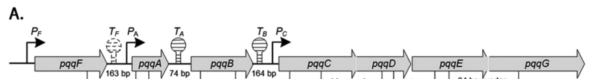

## Question

# Gene Research for Functional Annotation

## ⚠️ CRITICAL: Gene/Protein Identification Context

**BEFORE YOU BEGIN RESEARCH:** You MUST verify you are researching the CORRECT gene/protein. Gene symbols can be ambiguous, especially for less well-characterized genes from non-model organisms.

### Target Gene/Protein Identity (from UniProt):
- **UniProt Accession:** Q88QV6
- **Protein Description:** RecName: Full=Pyrroloquinoline-quinone synthase {ECO:0000255|HAMAP-Rule:MF_00654}; EC=1.3.3.11 {ECO:0000255|HAMAP-Rule:MF_00654}; AltName: Full=Coenzyme PQQ synthesis protein C {ECO:0000255|HAMAP-Rule:MF_00654}; AltName: Full=Pyrroloquinoline quinone biosynthesis protein C {ECO:0000255|HAMAP-Rule:MF_00654};
- **Gene Information:** Name=pqqC {ECO:0000255|HAMAP-Rule:MF_00654}; OrderedLocusNames=PP_0378;
- **Organism (full):** Pseudomonas putida (strain ATCC 47054 / DSM 6125 / CFBP 8728 / NCIMB 11950 / KT2440).
- **Protein Family:** Belongs to the PqqC family. {ECO:0000255|HAMAP-
- **Key Domains:** Haem_Oase-like_multi-hlx. (IPR016084); PqqC. (IPR011845); PqqC-like. (IPR039068); Thiaminase-2/PQQC. (IPR004305); TENA_THI-4 (PF03070)

### MANDATORY VERIFICATION STEPS:

1. **Check if the gene symbol "pqqC" matches the protein description above**
2. **Verify the organism is correct:** Pseudomonas putida (strain ATCC 47054 / DSM 6125 / CFBP 8728 / NCIMB 11950 / KT2440).
3. **Check if protein family/domains align with what you find in literature**
4. **If you find literature for a DIFFERENT gene with the same or similar symbol, STOP**

### If Gene Symbol is Ambiguous or You Cannot Find Relevant Literature:

**DO NOT PROCEED WITH RESEARCH ON A DIFFERENT GENE.** Instead:
- State clearly: "The gene symbol 'pqqC' is ambiguous or literature is limited for this specific protein"
- Explain what you found (e.g., "Found extensive literature on a different gene with the same symbol in a different organism")
- Describe the protein based ONLY on the UniProt information provided above
- Suggest that the protein function can be inferred from domain/family information

### Research Target:

Please provide a comprehensive research report on the gene **pqqC** (gene ID: pqqC, UniProt: Q88QV6) in PSEPK.

The research report should be a detailed narrative explaining the function, biological processes, and localization of the gene product. Citations should be given for all claims.

You should prioritize authoritative reviews and primary scientific literature when conducting research. You can supplement
this with annotations you find in gene/protein databases, but these can be outdated or inaccurate.

We are specifically interested in the primary function of the gene - for enzymes, what reaction is catalyzed, and what is the substrate specificity? For transporters, what is the substrate? For structural proteins or adapters, what is the broader structural role? For signaling molecules, what is the role in the pathway.

We are interested in where in or outside the cell the gene product carries out its function.

We are also interested in the signaling or biochemical pathways in which the gene functions. We are less interested in broad pleiotropic effects, except where these elucidate the precise role.

Include evidence where possible. We are interested in both experimental evidence as well as inference from structure, evolution, or bioinformatic analysis. Precise studies should be prioritized over high-throughput, where available.

## Output

Question: You are an expert researcher providing comprehensive, well-cited information.

Provide detailed information focusing on:
1. Key concepts and definitions with current understanding
2. Recent developments and latest research (prioritize 2023-2024 sources)
3. Current applications and real-world implementations
4. Expert opinions and analysis from authoritative sources
5. Relevant statistics and data from recent studies

Format as a comprehensive research report with proper citations. Include URLs and publication dates where available.
Always prioritize recent, authoritative sources and provide specific citations for all major claims.

# Gene Research for Functional Annotation

## ⚠️ CRITICAL: Gene/Protein Identification Context

**BEFORE YOU BEGIN RESEARCH:** You MUST verify you are researching the CORRECT gene/protein. Gene symbols can be ambiguous, especially for less well-characterized genes from non-model organisms.

### Target Gene/Protein Identity (from UniProt):
- **UniProt Accession:** Q88QV6
- **Protein Description:** RecName: Full=Pyrroloquinoline-quinone synthase {ECO:0000255|HAMAP-Rule:MF_00654}; EC=1.3.3.11 {ECO:0000255|HAMAP-Rule:MF_00654}; AltName: Full=Coenzyme PQQ synthesis protein C {ECO:0000255|HAMAP-Rule:MF_00654}; AltName: Full=Pyrroloquinoline quinone biosynthesis protein C {ECO:0000255|HAMAP-Rule:MF_00654};
- **Gene Information:** Name=pqqC {ECO:0000255|HAMAP-Rule:MF_00654}; OrderedLocusNames=PP_0378;
- **Organism (full):** Pseudomonas putida (strain ATCC 47054 / DSM 6125 / CFBP 8728 / NCIMB 11950 / KT2440).
- **Protein Family:** Belongs to the PqqC family. {ECO:0000255|HAMAP-
- **Key Domains:** Haem_Oase-like_multi-hlx. (IPR016084); PqqC. (IPR011845); PqqC-like. (IPR039068); Thiaminase-2/PQQC. (IPR004305); TENA_THI-4 (PF03070)

### MANDATORY VERIFICATION STEPS:

1. **Check if the gene symbol "pqqC" matches the protein description above**
2. **Verify the organism is correct:** Pseudomonas putida (strain ATCC 47054 / DSM 6125 / CFBP 8728 / NCIMB 11950 / KT2440).
3. **Check if protein family/domains align with what you find in literature**
4. **If you find literature for a DIFFERENT gene with the same or similar symbol, STOP**

### If Gene Symbol is Ambiguous or You Cannot Find Relevant Literature:

**DO NOT PROCEED WITH RESEARCH ON A DIFFERENT GENE.** Instead:
- State clearly: "The gene symbol 'pqqC' is ambiguous or literature is limited for this specific protein"
- Explain what you found (e.g., "Found extensive literature on a different gene with the same symbol in a different organism")
- Describe the protein based ONLY on the UniProt information provided above
- Suggest that the protein function can be inferred from domain/family information

### Research Target:

Please provide a comprehensive research report on the gene **pqqC** (gene ID: pqqC, UniProt: Q88QV6) in PSEPK.

The research report should be a detailed narrative explaining the function, biological processes, and localization of the gene product. Citations should be given for all claims.

You should prioritize authoritative reviews and primary scientific literature when conducting research. You can supplement
this with annotations you find in gene/protein databases, but these can be outdated or inaccurate.

We are specifically interested in the primary function of the gene - for enzymes, what reaction is catalyzed, and what is the substrate specificity? For transporters, what is the substrate? For structural proteins or adapters, what is the broader structural role? For signaling molecules, what is the role in the pathway.

We are interested in where in or outside the cell the gene product carries out its function.

We are also interested in the signaling or biochemical pathways in which the gene functions. We are less interested in broad pleiotropic effects, except where these elucidate the precise role.

Include evidence where possible. We are interested in both experimental evidence as well as inference from structure, evolution, or bioinformatic analysis. Precise studies should be prioritized over high-throughput, where available.

# Research report: **pqqC** (UniProt **Q88QV6**) in *Pseudomonas putida* KT2440

## 0) Target verification (gene/protein identity)
The target is **pqqC** (ordered locus **PP_0378**) from *Pseudomonas putida* strain **KT2440**, annotated as **pyrroloquinoline-quinone synthase / PQQ biosynthesis protein C** (EC **1.3.3.11**). In *P. putida* KT2440, **pqqC** is a core member of the conserved PQQ-biosynthesis gene cluster that includes **pqqF-A-B-C-D-E-G** (often referred to as a pqq operon). (an2016regulationofpyrroloquinoline pages 3-5, an2016regulationofpyrroloquinoline pages 7-8, an2016regulationofpyrroloquinoline media 8ec9f5a0)

**Ambiguity check:** Although “pqqC” is a common bacterial gene symbol, the literature retrieved here explicitly refers to **pqqC in *P. putida* KT2440** and/or to **PqqC-family enzymes** performing the **final step of PQQ biosynthesis**, consistent with UniProt’s PqqC-family assignment for Q88QV6. (an2016regulationofpyrroloquinoline pages 3-5, an2016regulationofpyrroloquinoline pages 7-8, rosefigura2010investigationofthe pages 12-15)

## 1) Key concepts and definitions (current understanding)

### 1.1 Pyrroloquinoline quinone (PQQ)
**PQQ** is a redox cofactor used by multiple **periplasmic dehydrogenases** in Gram-negative bacteria, including **PQQ-dependent glucose dehydrogenase (GDH)**; this periplasmic oxidation system can generate organic acids (e.g., gluconate) that contribute to **mineral phosphate solubilization** in rhizosphere contexts. (an2016regulationofpyrroloquinoline pages 1-2, an2016studiesonregulation pages 24-29)

### 1.2 pqq gene cluster (biosynthetic pathway context)
In *P. putida* KT2440, genes annotated **pqqF, pqqA, pqqB, pqqC, pqqD, pqqE, pqqG** occur as a physical cluster with predicted promoters/terminators and evidence of multi-transcript organization. (an2016regulationofpyrroloquinoline pages 3-5, an2016regulationofpyrroloquinoline pages 7-8, an2016regulationofpyrroloquinoline media 8ec9f5a0)

### 1.3 PqqC (the Q88QV6 protein) — definition and pathway role
**PqqC** is widely described as the enzyme catalyzing the **final step** of PQQ biosynthesis, converting a late intermediate commonly called **AHQQ** into **PQQ** via **ring closure** coupled to a **multi-electron oxidation** using molecular oxygen. This assignment underpins the EC number **1.3.3.11** commonly associated with PqqC. (rosefigura2010investigationofthe pages 12-15, rosefigura2010investigationofthe pages 1-9)

## 2) Molecular function of PqqC (reaction, substrate specificity, mechanism)

### 2.1 Reaction and substrate
The mechanistic/structural evidence retrieved (in an ortholog context) describes the **PqqC-catalyzed reaction** as:
- **Substrate:** AHQQ (a late-stage PQQ precursor)
- **Product:** PQQ
- **Chemistry:** **ring closure + O\_2-coupled eight-electron oxidation** (cofactor-independent). (rosefigura2010investigationofthe pages 12-15, rosefigura2010investigationofthe pages 1-9)

### 2.2 Oxygen and peroxide stoichiometry (quantitative)
A notable quantitative description of the oxidation stoichiometry is:
- **3 equivalents of O\_2 consumed**, producing **2 equivalents H\_2O\_2** and **2 equivalents H\_2O** during conversion of AHQQ to PQQ. (rosefigura2010investigationofthe pages 12-15)

This supports the current view of PqqC as a **cofactorless oxidase** capable of orchestrating substantial redox chemistry without a metal or organic cofactor. (rosefigura2010investigationofthe pages 12-15)

### 2.3 Structural and mechanistic features (expert-level interpretation)
Structural/mechanistic observations (ortholog-derived but PqqC-family relevant) include:
- **Homodimeric architecture** (reported as a “perpendicular homodimer”), with a large **conformational change** upon PQQ binding that “closes” the active site; the **142–196** region was highlighted as moving to form the active site. (rosefigura2010investigationofthe pages 12-15)
- A set of **highly conserved residues** in/near the active site (18 listed in the evidence excerpt, including **H84, H154, Y175, R179**, etc.), consistent with a conserved catalytic core across PqqC-family proteins. (rosefigura2010investigationofthe pages 12-15)
- Mutational evidence implicating residues (e.g., **H84**, **Y175**, **H154**, **R179**) in controlling conformational state and progression through **quinoid/quinol intermediates**, supporting a stepwise oxidation model. (rosefigura2010investigationofthe pages 1-9)

**Interpretation:** For *P. putida* Q88QV6, these conserved structural features support functional annotation as a **cytosolic PqqC-family oxidase** catalyzing the terminal oxidative cyclization step of PQQ biosynthesis, with oxygen activation potentially mediated by a proteinaceous active-site environment rather than a classical cofactor. (rosefigura2010investigationofthe pages 12-15, rosefigura2010investigationofthe pages 1-9)

## 3) Biological process and pathway integration in *P. putida* KT2440

### 3.1 Operon organization and transcriptional logic (KT2440-specific)
In *P. putida* KT2440, the pqq cluster spans seven genes (**pqqF A B C D E G**) with:
- predicted promoters upstream of **pqqF**, **pqqA**, and **pqqC**, and predicted terminators between some intergenic regions, consistent with a multi-transcript architecture; (an2016regulationofpyrroloquinoline pages 3-5, an2016regulationofpyrroloquinoline media 8ec9f5a0)
- RT-PCR evidence that **pqqC–pqqD–pqqE–pqqG** are **cotranscribed on one transcript**, suggesting pqqC function is embedded in a coordinated terminal module of the pathway. (an2016regulationofpyrroloquinoline pages 7-8)

**Visualization (operon):** The organization and predicted regulatory elements are shown in a retrieved cropped figure from An & Moe 2016. (an2016regulationofpyrroloquinoline media 8ec9f5a0)

### 3.2 Regulation by carbon source and phosphate (KT2440-specific, quantitative)
In a peer-reviewed KT2440 study, both **PQQ levels** and **PQQ-dependent GDH activity** varied substantially with growth conditions.

**Carbon sources:** PQQ concentrations (µM) were reported as ~0.083 (LB), 0.532 (glucose), 0.385 (glycerol), and 0.140 (citrate), alongside corresponding changes in GDH specific activity. (an2016regulationofpyrroloquinoline pages 3-5)

**Soluble phosphate:** Under NBRIP medium conditions, PQQ production increased under low/zero phosphate; one dataset reported **0.861 ± 0.007 µM** PQQ under **no added soluble phosphate**, compared with **0.488 ± 0.014 µM** under a high soluble phosphate condition. (an2016studiesonregulation pages 62-67, an2016regulationofpyrroloquinoline pages 7-8)

**Expression:** In the same regulatory context, **gcd and pqq gene expression** (including pqq genes in the operon) was reported as approximately **~1.5- to 3-fold higher** under **zero-soluble-phosphate** conditions versus high phosphate. (an2016regulationofpyrroloquinoline pages 7-8)

**Visualization (quantitative tables and expression):** Carbon-source and phosphate-dependent PQQ measurements, and expression trends for genes including pqqC, are available as retrieved table/figure crops. (an2016regulationofpyrroloquinoline media 7618facf, an2016regulationofpyrroloquinoline media 38966689)

## 4) Subcellular localization (where PqqC acts)
The KT2440 regulatory study focuses on periplasmic PQQ-dependent GDH activity, emphasizing that **PQQ is required in the periplasm** for GDH activity. (an2016regulationofpyrroloquinoline pages 1-2)

Mechanistic literature notes that PQQ formation is considered **cytosolic**, with subsequent utilization by **periplasmic dehydrogenases** (and historical discussion that another pqq gene product had been proposed as a transporter). (rosefigura2010investigationofthe pages 12-15)

**Functional localization conclusion (annotation-level):** For UniProt Q88QV6 (PqqC), the best-supported inference from the retrieved evidence is that **PqqC functions in the cytosol** as part of the PQQ biosynthetic pathway, enabling downstream **periplasmic** PQQ-dependent dehydrogenase reactions by supplying mature PQQ. (rosefigura2010investigationofthe pages 12-15, an2016regulationofpyrroloquinoline pages 1-2)

## 5) Recent developments and latest research (2023–2024 emphasis)

### 5.1 pqqC as a functional marker for phosphate solubilization (2024)
Recent genomics-focused work increasingly treats the **pqq gene cluster (particularly pqqC)** as a **genetic marker** for phosphate-solubilizing potential across diverse bacterial isolates.

A 2024 study analyzing genomes of phosphate-solubilizing bacteria reports that identifying the **pqq gene cluster, particularly pqqC**, is useful as a marker for phosphate-solubilization capacity and links it to production of organic acids such as **2-keto-D-gluconic acid** over cultivation. (No KT2440-specific biochemistry for PqqC is provided, but it reflects current applied usage of the annotation.) ()

### 5.2 Reviews synthesizing pqqC/PQQ roles in microbial phosphate mobilization (2023)
A 2023 review on phosphate-solubilizing bacteria explicitly includes **pqqC** in the gene set associated with PQQ-related solubilization mechanisms and summarizes gene-mediated acidolysis concepts used in agricultural microbiology. ()

### 5.3 Industrial biotechnology connections (2024)
A 2024 study in *Pseudomonas taetrolens* highlights that multiple lactose-oxidizing enzymes are **PQQ-dependent** and notes that disruption of PQQ synthesis genes such as **pqqC** affects the phenotype, reinforcing the importance of PQQ biosynthesis (including PqqC) for periplasmic oxidation-based bioprocesses. ()

## 6) Current applications and real-world implementations

### 6.1 Agricultural bioinoculants and phosphate-solubilizing bacteria
The PQQ system is widely leveraged (conceptually and practically) in screening/engineering **phosphate-solubilizing bacteria (PSB)** because PQQ-dependent periplasmic oxidation can drive organic acid production that increases inorganic phosphate availability. Marker-based approaches that track **pqqC** (as part of a pqq cluster) are now common in applied microbiome/agriculture research. (an2016studiesonregulation pages 24-29)

### 6.2 Metabolic engineering chassis considerations in *P. putida*
For *P. putida* KT2440 specifically, the pqq system is experimentally connected to periplasmic GDH activity and phosphate solubilization. This gives a practical handle for engineering or controlling **periplasmic oxidation capacity** via genetic/regulatory control of pqq cluster expression and PQQ availability. (an2016regulationofpyrroloquinoline pages 1-2, an2016regulationofpyrroloquinoline pages 3-5)

## 7) Key statistics and data points (from recent and authoritative studies)

### 7.1 KT2440: PQQ levels and GDH activity under different conditions
The KT2440 study reports condition-dependent PQQ concentrations in the ~0.08–0.53 µM range across carbon sources and up to ~0.86 µM under no soluble phosphate (with parallel increases in GDH specific activity). (an2016regulationofpyrroloquinoline pages 3-5, an2016studiesonregulation pages 62-67, an2016regulationofpyrroloquinoline pages 7-8)

### 7.2 PqqC reaction stoichiometry
PqqC-family evidence reports the final-step conversion AHQQ→PQQ consumes **3 O\_2** and produces **2 H\_2O\_2** + **2 H\_2O** (per turnover as described). (rosefigura2010investigationofthe pages 12-15)

## 8) Expert synthesis and limitations of the current evidence base

1. **Core enzymatic role is strong:** Across the PqqC family, the best-supported role is catalysis of the **terminal AHQQ→PQQ** transformation involving multi-electron oxidation without a classical cofactor. (rosefigura2010investigationofthe pages 12-15, rosefigura2010investigationofthe pages 1-9)
2. **KT2440-specific regulation is strong:** *P. putida* KT2440 has experimentally supported **operon structure** and clear **environmental regulation** that changes cellular PQQ availability and downstream GDH activity. (an2016regulationofpyrroloquinoline pages 3-5, an2016regulationofpyrroloquinoline pages 7-8, an2016regulationofpyrroloquinoline media 8ec9f5a0)
3. **KT2440-specific PqqC biochemistry remains a gap in retrieved sources:** While KT2440 pathway/regulatory context is strong, **direct biochemical characterization of the KT2440 PqqC enzyme** (kcat/Km on AHQQ, structure of Q88QV6) was not present in the retrieved KT2440 papers; mechanistic details derive from orthologous PqqC-family studies. This is still appropriate for functional annotation because the catalytic step and conserved residues are strongly conserved across the family, but it should be interpreted as **inference by homology/mechanistic conservation** rather than a KT2440-purified enzyme assay. (rosefigura2010investigationofthe pages 12-15, rosefigura2010investigationofthe pages 1-9, an2016regulationofpyrroloquinoline pages 3-5)

---

## Data summary table (KT2440)
| Experimental variable | Condition | PQQ concentration (µM) | GDH specific activity | Reported expression change |
|---|---|---:|---:|---|
| Carbon source | LB medium | 0.083 ± 0.012 | 857.58 ± 63.85 | pqqC-pqqD-pqqE-pqqG transcript detected; highest overall intergenic transcript signal among tested carbon sources (an2016regulationofpyrroloquinoline pages 3-5, an2016regulationofpyrroloquinoline pages 7-8) |
| Carbon source | Glucose | 0.532 ± 0.017 | 1100.00 ± 15.75 | High PQQ/GDH state under glucose as sole carbon source (an2016regulationofpyrroloquinoline pages 1-2, an2016regulationofpyrroloquinoline pages 3-5) |
| Carbon source | Glycerol | 0.385 ± 0.012 | 890.91 ± 18.18 | Lowest CD/DE/EG intergenic transcript signal among tested carbon sources (an2016regulationofpyrroloquinoline pages 3-5, an2016regulationofpyrroloquinoline pages 7-8) |
| Carbon source | Citrate | 0.140 ± 0.012 | 787.88 ± 54.80 | Lower PQQ/GDH than glucose or glycerol (an2016regulationofpyrroloquinoline pages 3-5) |
| Soluble phosphate | No P | 0.861 ± 0.007 | 1809.01 ± 7.42 | gcd and pqq gene expression ~1.5- to 3-fold higher than in high-soluble-phosphate condition (an2016studiesonregulation pages 62-67, an2016regulationofpyrroloquinoline pages 7-8) |
| Soluble phosphate | Low P (1 mM) | 0.633 ± 0.013 | not reported in retrieved excerpt | gcd and pqq gene expression induced relative to high P; exact fold not separately reported in retrieved excerpt (an2016studiesonregulation pages 62-67, an2016regulationofpyrroloquinoline pages 7-8) |
| Soluble phosphate | High P | 0.488 ± 0.014 | not reported in retrieved excerpt | Reference condition for ~1.5- to 3-fold lower gcd/pqq expression versus no-P condition (an2016studiesonregulation pages 62-67, an2016regulationofpyrroloquinoline pages 7-8) |

*Table: This table compiles the key quantitative measurements reported for the pqqC/PQQ-associated system in Pseudomonas putida KT2440 from An & Moe 2016, including carbon-source and phosphate effects on PQQ levels, GDH activity, and expression trends.*

## Key retrieved visuals (for reporting/curation)
- *pqq* cluster/operon schematic for KT2440 (**Fig. 1A** crop). (an2016regulationofpyrroloquinoline media 8ec9f5a0)
- KT2440 PQQ quantification by carbon source (**Table 3** crop) and by phosphate condition (**Table 4** crop). (an2016regulationofpyrroloquinoline media 7618facf, an2016regulationofpyrroloquinoline media 38966689)

## Primary sources cited (with URLs and publication dates where available)
- An R, Moe LA. **Regulation of Pyrroloquinoline Quinone-Dependent Glucose Dehydrogenase Activity in the Model Rhizosphere-Dwelling Bacterium *Pseudomonas putida* KT2440.** *Applied and Environmental Microbiology* (Aug **2016**). https://doi.org/10.1128/aem.00813-16 (an2016regulationofpyrroloquinoline pages 1-2, an2016regulationofpyrroloquinoline pages 3-5, an2016regulationofpyrroloquinoline pages 7-8, an2016regulationofpyrroloquinoline media 8ec9f5a0, an2016regulationofpyrroloquinoline media 7618facf, an2016regulationofpyrroloquinoline media 38966689)
- Pan L, Cai B. **Phosphate-Solubilizing Bacteria: Advances in Their Physiology, Molecular Mechanisms and Microbial Community Effects.** *Microorganisms* (Dec **2023**). https://doi.org/10.3390/microorganisms11122904 (application/review context) ()
- Chen X, et al. **Genome-based identification of phosphate-solubilizing capacities of soil bacterial isolates.** *AMB Express* (Jul **2024**). https://doi.org/10.1186/s13568-024-01745-w (marker/application context) ()
- Lee SS, et al. **All lactose-oxidizing enzymes of *Pseudomonas taetrolens*… are PQQ-dependent enzymes.** *International Microbiology* (Jan **2024** online/early; journal issue 2024). https://doi.org/10.1007/s10123-023-00477-4 (bioprocess phenotype context) ()

- RoseFigura JM. **Investigation of the structure and mechanism of a PQQ biosynthetic pathway component, PqqC…** (**2010**; dissertation/monograph-style source as retrieved). (mechanism/structure/stoichiometry evidence used for PqqC-family function) (rosefigura2010investigationofthe pages 12-15, rosefigura2010investigationofthe pages 1-9)

References

1. (an2016regulationofpyrroloquinoline pages 3-5): Ran An and Luke A. Moe. Regulation of pyrroloquinoline quinone-dependent glucose dehydrogenase activity in the model rhizosphere-dwelling bacterium pseudomonas putida kt2440. Applied and Environmental Microbiology, 82:4955-4964, Aug 2016. URL: https://doi.org/10.1128/aem.00813-16, doi:10.1128/aem.00813-16. This article has 164 citations and is from a peer-reviewed journal.

2. (an2016regulationofpyrroloquinoline pages 7-8): Ran An and Luke A. Moe. Regulation of pyrroloquinoline quinone-dependent glucose dehydrogenase activity in the model rhizosphere-dwelling bacterium pseudomonas putida kt2440. Applied and Environmental Microbiology, 82:4955-4964, Aug 2016. URL: https://doi.org/10.1128/aem.00813-16, doi:10.1128/aem.00813-16. This article has 164 citations and is from a peer-reviewed journal.

3. (an2016regulationofpyrroloquinoline media 8ec9f5a0): Ran An and Luke A. Moe. Regulation of pyrroloquinoline quinone-dependent glucose dehydrogenase activity in the model rhizosphere-dwelling bacterium pseudomonas putida kt2440. Applied and Environmental Microbiology, 82:4955-4964, Aug 2016. URL: https://doi.org/10.1128/aem.00813-16, doi:10.1128/aem.00813-16. This article has 164 citations and is from a peer-reviewed journal.

4. (rosefigura2010investigationofthe pages 12-15): JM RoseFigura. Investigation of the structure and mechanism of a pqq biosynthetic pathway component, pqqc, and a bioinformatics analysis of potential pqq producing …. Unknown journal, 2010.

5. (an2016regulationofpyrroloquinoline pages 1-2): Ran An and Luke A. Moe. Regulation of pyrroloquinoline quinone-dependent glucose dehydrogenase activity in the model rhizosphere-dwelling bacterium pseudomonas putida kt2440. Applied and Environmental Microbiology, 82:4955-4964, Aug 2016. URL: https://doi.org/10.1128/aem.00813-16, doi:10.1128/aem.00813-16. This article has 164 citations and is from a peer-reviewed journal.

6. (an2016studiesonregulation pages 24-29): Ran An. Studies on regulation of pqq-dependent phosphate solubilization among rhizosphere dwelling bacteria. ArXiv, Jan 2016. URL: https://doi.org/10.13023/etd.2016.408, doi:10.13023/etd.2016.408. This article has 7 citations.

7. (rosefigura2010investigationofthe pages 1-9): JM RoseFigura. Investigation of the structure and mechanism of a pqq biosynthetic pathway component, pqqc, and a bioinformatics analysis of potential pqq producing …. Unknown journal, 2010.

8. (an2016studiesonregulation pages 62-67): Ran An. Studies on regulation of pqq-dependent phosphate solubilization among rhizosphere dwelling bacteria. ArXiv, Jan 2016. URL: https://doi.org/10.13023/etd.2016.408, doi:10.13023/etd.2016.408. This article has 7 citations.

9. (an2016regulationofpyrroloquinoline media 7618facf): Ran An and Luke A. Moe. Regulation of pyrroloquinoline quinone-dependent glucose dehydrogenase activity in the model rhizosphere-dwelling bacterium pseudomonas putida kt2440. Applied and Environmental Microbiology, 82:4955-4964, Aug 2016. URL: https://doi.org/10.1128/aem.00813-16, doi:10.1128/aem.00813-16. This article has 164 citations and is from a peer-reviewed journal.

10. (an2016regulationofpyrroloquinoline media 38966689): Ran An and Luke A. Moe. Regulation of pyrroloquinoline quinone-dependent glucose dehydrogenase activity in the model rhizosphere-dwelling bacterium pseudomonas putida kt2440. Applied and Environmental Microbiology, 82:4955-4964, Aug 2016. URL: https://doi.org/10.1128/aem.00813-16, doi:10.1128/aem.00813-16. This article has 164 citations and is from a peer-reviewed journal.

## Artifacts

- [Edison artifact artifact-00](pqqC-deep-research-falcon_artifacts/artifact-00.md)

## Citations

1. rosefigura2010investigationofthe pages 12-15
2. rosefigura2010investigationofthe pages 1-9
3. an2016regulationofpyrroloquinoline pages 7-8
4. an2016regulationofpyrroloquinoline pages 3-5
5. an2016regulationofpyrroloquinoline pages 1-2
6. an2016studiesonregulation pages 24-29
7. an2016studiesonregulation pages 62-67
8. https://doi.org/10.1128/aem.00813-16
9. https://doi.org/10.3390/microorganisms11122904
10. https://doi.org/10.1186/s13568-024-01745-w
11. https://doi.org/10.1007/s10123-023-00477-4
12. https://doi.org/10.1128/aem.00813-16,
13. https://doi.org/10.13023/etd.2016.408,