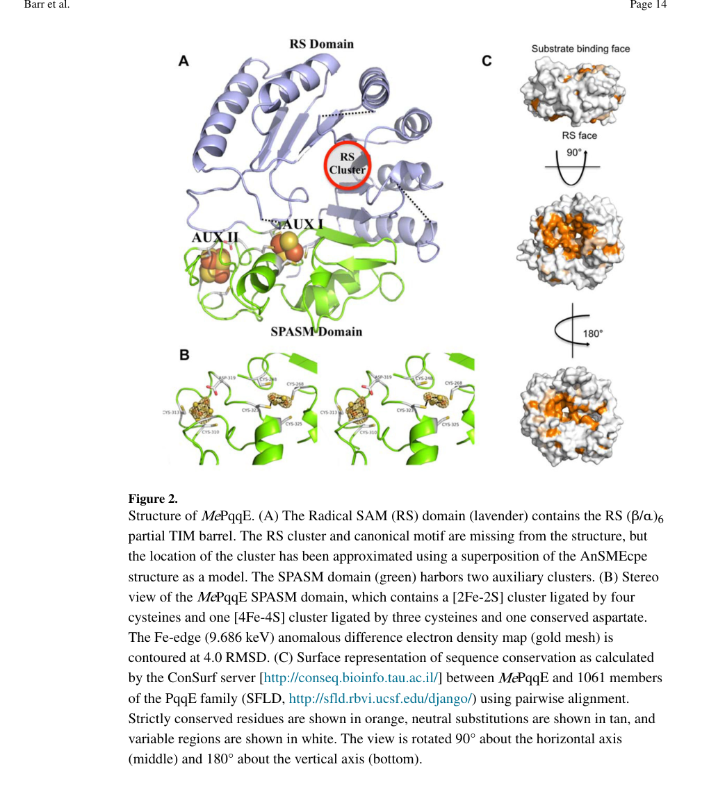

## Question

# Gene Research for Functional Annotation

## ⚠️ CRITICAL: Gene/Protein Identification Context

**BEFORE YOU BEGIN RESEARCH:** You MUST verify you are researching the CORRECT gene/protein. Gene symbols can be ambiguous, especially for less well-characterized genes from non-model organisms.

### Target Gene/Protein Identity (from UniProt):
- **UniProt Accession:** Q88QV8
- **Protein Description:** RecName: Full=PqqA peptide cyclase {ECO:0000255|HAMAP-Rule:MF_00660}; EC=1.21.98.4 {ECO:0000255|HAMAP-Rule:MF_00660}; AltName: Full=Coenzyme PQQ synthesis protein E {ECO:0000255|HAMAP-Rule:MF_00660}; AltName: Full=Pyrroloquinoline quinone biosynthesis protein E {ECO:0000255|HAMAP-Rule:MF_00660};
- **Gene Information:** Name=pqqE {ECO:0000255|HAMAP-Rule:MF_00660}; OrderedLocusNames=PP_0376;
- **Organism (full):** Pseudomonas putida (strain ATCC 47054 / DSM 6125 / CFBP 8728 / NCIMB 11950 / KT2440).
- **Protein Family:** Belongs to the radical SAM superfamily. PqqE family.
- **Key Domains:** 4Fe4S-binding_SPASM_dom. (IPR023885); Aldolase_TIM. (IPR013785); Elp3/MiaA/NifB-like_rSAM. (IPR006638); MoaA_NifB_PqqE_Fe-S-bd_CS. (IPR000385); PQQ_synth_PqqE_bac. (IPR011843)

### MANDATORY VERIFICATION STEPS:

1. **Check if the gene symbol "pqqE" matches the protein description above**
2. **Verify the organism is correct:** Pseudomonas putida (strain ATCC 47054 / DSM 6125 / CFBP 8728 / NCIMB 11950 / KT2440).
3. **Check if protein family/domains align with what you find in literature**
4. **If you find literature for a DIFFERENT gene with the same or similar symbol, STOP**

### If Gene Symbol is Ambiguous or You Cannot Find Relevant Literature:

**DO NOT PROCEED WITH RESEARCH ON A DIFFERENT GENE.** Instead:
- State clearly: "The gene symbol 'pqqE' is ambiguous or literature is limited for this specific protein"
- Explain what you found (e.g., "Found extensive literature on a different gene with the same symbol in a different organism")
- Describe the protein based ONLY on the UniProt information provided above
- Suggest that the protein function can be inferred from domain/family information

### Research Target:

Please provide a comprehensive research report on the gene **pqqE** (gene ID: pqqE, UniProt: Q88QV8) in PSEPK.

The research report should be a detailed narrative explaining the function, biological processes, and localization of the gene product. Citations should be given for all claims.

You should prioritize authoritative reviews and primary scientific literature when conducting research. You can supplement
this with annotations you find in gene/protein databases, but these can be outdated or inaccurate.

We are specifically interested in the primary function of the gene - for enzymes, what reaction is catalyzed, and what is the substrate specificity? For transporters, what is the substrate? For structural proteins or adapters, what is the broader structural role? For signaling molecules, what is the role in the pathway.

We are interested in where in or outside the cell the gene product carries out its function.

We are also interested in the signaling or biochemical pathways in which the gene functions. We are less interested in broad pleiotropic effects, except where these elucidate the precise role.

Include evidence where possible. We are interested in both experimental evidence as well as inference from structure, evolution, or bioinformatic analysis. Precise studies should be prioritized over high-throughput, where available.

## Output

Question: You are an expert researcher providing comprehensive, well-cited information.

Provide detailed information focusing on:
1. Key concepts and definitions with current understanding
2. Recent developments and latest research (prioritize 2023-2024 sources)
3. Current applications and real-world implementations
4. Expert opinions and analysis from authoritative sources
5. Relevant statistics and data from recent studies

Format as a comprehensive research report with proper citations. Include URLs and publication dates where available.
Always prioritize recent, authoritative sources and provide specific citations for all major claims.

# Gene Research for Functional Annotation

## ⚠️ CRITICAL: Gene/Protein Identification Context

**BEFORE YOU BEGIN RESEARCH:** You MUST verify you are researching the CORRECT gene/protein. Gene symbols can be ambiguous, especially for less well-characterized genes from non-model organisms.

### Target Gene/Protein Identity (from UniProt):
- **UniProt Accession:** Q88QV8
- **Protein Description:** RecName: Full=PqqA peptide cyclase {ECO:0000255|HAMAP-Rule:MF_00660}; EC=1.21.98.4 {ECO:0000255|HAMAP-Rule:MF_00660}; AltName: Full=Coenzyme PQQ synthesis protein E {ECO:0000255|HAMAP-Rule:MF_00660}; AltName: Full=Pyrroloquinoline quinone biosynthesis protein E {ECO:0000255|HAMAP-Rule:MF_00660};
- **Gene Information:** Name=pqqE {ECO:0000255|HAMAP-Rule:MF_00660}; OrderedLocusNames=PP_0376;
- **Organism (full):** Pseudomonas putida (strain ATCC 47054 / DSM 6125 / CFBP 8728 / NCIMB 11950 / KT2440).
- **Protein Family:** Belongs to the radical SAM superfamily. PqqE family.
- **Key Domains:** 4Fe4S-binding_SPASM_dom. (IPR023885); Aldolase_TIM. (IPR013785); Elp3/MiaA/NifB-like_rSAM. (IPR006638); MoaA_NifB_PqqE_Fe-S-bd_CS. (IPR000385); PQQ_synth_PqqE_bac. (IPR011843)

### MANDATORY VERIFICATION STEPS:

1. **Check if the gene symbol "pqqE" matches the protein description above**
2. **Verify the organism is correct:** Pseudomonas putida (strain ATCC 47054 / DSM 6125 / CFBP 8728 / NCIMB 11950 / KT2440).
3. **Check if protein family/domains align with what you find in literature**
4. **If you find literature for a DIFFERENT gene with the same or similar symbol, STOP**

### If Gene Symbol is Ambiguous or You Cannot Find Relevant Literature:

**DO NOT PROCEED WITH RESEARCH ON A DIFFERENT GENE.** Instead:
- State clearly: "The gene symbol 'pqqE' is ambiguous or literature is limited for this specific protein"
- Explain what you found (e.g., "Found extensive literature on a different gene with the same symbol in a different organism")
- Describe the protein based ONLY on the UniProt information provided above
- Suggest that the protein function can be inferred from domain/family information

### Research Target:

Please provide a comprehensive research report on the gene **pqqE** (gene ID: pqqE, UniProt: Q88QV8) in PSEPK.

The research report should be a detailed narrative explaining the function, biological processes, and localization of the gene product. Citations should be given for all claims.

You should prioritize authoritative reviews and primary scientific literature when conducting research. You can supplement
this with annotations you find in gene/protein databases, but these can be outdated or inaccurate.

We are specifically interested in the primary function of the gene - for enzymes, what reaction is catalyzed, and what is the substrate specificity? For transporters, what is the substrate? For structural proteins or adapters, what is the broader structural role? For signaling molecules, what is the role in the pathway.

We are interested in where in or outside the cell the gene product carries out its function.

We are also interested in the signaling or biochemical pathways in which the gene functions. We are less interested in broad pleiotropic effects, except where these elucidate the precise role.

Include evidence where possible. We are interested in both experimental evidence as well as inference from structure, evolution, or bioinformatic analysis. Precise studies should be prioritized over high-throughput, where available.

# Research Report: Functional Annotation of **pqqE** (UniProt **Q88QV8**) in *Pseudomonas putida* KT2440

## Executive summary (identity verification and scope)
The UniProt target (Q88QV8; gene **pqqE**, locus **PP_0376**) is annotated as **PqqA peptide cyclase / coenzyme PQQ biosynthesis protein E** and a member of the **radical S-adenosylmethionine (radical SAM; rSAM) RS-SPASM** enzyme family. The most direct mechanistic evidence available in the retrieved literature is from experimentally characterized PqqE homologs (not explicitly labeled as *P. putida* KT2440/Q88QV8 within the retrieved corpus). Nevertheless, the defining functional properties—**rSAM-mediated C–C cross-link formation in PqqA requiring PqqD and auxiliary Fe–S clusters**—are consistent across authoritative primary papers and reviews, and they match the UniProt-provided family/domain assignment for Q88QV8 (RS-SPASM with auxiliary Fe–S clusters). (zhu2018methodsforexpression pages 1-4, latham2017attheconfluence pages 1-2, barr2018xrayandepr pages 1-3)

## 1. Key concepts and current understanding

### 1.1 Pyrroloquinoline quinone (PQQ) biosynthesis as a RiPP-derived cofactor pathway
PQQ is a **peptide-derived redox cofactor** made from a short ribosomally produced precursor peptide (**PqqA**) that is post-translationally modified by dedicated enzymes, including **PqqE** and **PqqD**. In this conceptual framework, PQQ biosynthesis resembles ribosomally synthesized and post-translationally modified peptide (RiPP) pathways: a genetically encoded precursor peptide is “tailored” by specialized enzymes to generate a small-molecule product. (latham2017attheconfluence pages 1-2)

### 1.2 Definition of PqqE function
**PqqE is the initiating enzyme** in the PQQ pathway, catalyzing the first committed chemical transformation: **formation of a new intramolecular carbon–carbon bond within PqqA between a conserved glutamate and tyrosine** (often described as coupling the glutamate side-chain carbon to an aromatic carbon of tyrosine). (barr2016demonstrationthatthe pages 6-7, zhu2018methodsforexpression pages 1-4, barr2018xrayandepr pages 1-3)

### 1.3 Radical SAM / RS-SPASM enzymes and auxiliary Fe–S clusters
PqqE is a **radical SAM enzyme**, meaning it uses a **[4Fe–4S] cluster** to reductively cleave **S-adenosyl-L-methionine (SAM)** to generate a **5′-deoxyadenosyl radical (5′-dAdo•)** that initiates substrate radical chemistry. (latham2017attheconfluence pages 1-2, zhu2018methodsforexpression pages 1-4, barr2018xrayandepr pages 1-3)

PqqE belongs to the **RS-SPASM subfamily**, characterized by additional Fe–S clusters in a C-terminal SPASM domain. Structural/spectroscopic characterization in a homolog shows PqqE contains:
- **RS cluster:** [4Fe–4S] (SAM-binding/cleaving)
- **AuxI:** an unusual **[2Fe–2S]** cluster in the SPASM domain
- **AuxII:** a **[4Fe–4S]** cluster ligated by **3 Cys + 1 Asp (Asp ligand)**
These features are depicted in the structural figures (domain architecture, ligand geometry, and topology schematic). (barr2018xrayandepr pages 1-3, barr2018xrayandepr pages 6-8, barr2018xrayandepr media 0e376f62)

## 2. Biochemical reaction catalyzed by PqqE (substrate specificity, mechanism, cofactors)

### 2.1 Reaction and substrate specificity
PqqE catalyzes **de novo intrapeptide C–C cross-linking** within **PqqA**. The experimentally observed modification produces a **−2 Da mass shift** in PqqA consistent with formation of a new bond and net loss of two H atoms (re-aromatization step). (barr2016demonstrationthatthe pages 4-6)

MS/MS evidence supports cross-linking in the region consistent with a **Glu15–Tyr19 linkage** (position numbering in the studied PqqA substrate). (barr2016demonstrationthatthe pages 6-7)

### 2.2 Enzyme partners and cofactors
**PqqD is required** for productive catalysis. In vitro assays show that omitting PqqD abolishes detectable PqqA modification. (barr2016demonstrationthatthe pages 4-6)

A quantitative interaction model has been established:
- PqqD binds PqqA tightly with **KD ≈ 200 nM**.
- PqqD binds PqqE with **KD ≈ 12 µM** (1:1 stoichiometry).
- The ternary PqqA–PqqD–PqqE complex forms with **KD ≈ 5 µM** (reported for binding to PqqE). (latham2015pqqdisa pages 1-2, latham2017attheconfluence pages 1-2)

Electron delivery conditions matter strongly: productive turnover required a physiological-style reductant system (flavodoxin/FNR/NADPH), whereas common chemical reductants (e.g., dithionite or Ti(III) citrate) failed under the reported conditions and can yield **uncoupled SAM cleavage**. (barr2016demonstrationthatthe pages 4-6, barr2016demonstrationthatthe pages 6-7)

### 2.3 Mechanistic model (current consensus)
A widely cited mechanistic model is:
1. One-electron reduction of the RS [4Fe–4S] cluster enables SAM cleavage to methionine + 5′-dAdo•.
2. 5′-dAdo• abstracts H from the glutamate side chain on PqqA, generating a peptide-centered radical.
3. Radical coupling to the tyrosine ring forms the new C–C bond.
4. Auxiliary SPASM clusters likely participate in controlled electron transfer/oxidation state management to complete the net oxidation required for cross-link formation.
This pathway-level and mechanistic description is supported by authoritative review discussion and primary biochemical demonstration. (latham2017attheconfluence pages 1-2, barr2016demonstrationthatthe pages 6-7, barr2018xrayandepr pages 1-3)

## 3. Structural and spectroscopic evidence (auxiliary clusters, domain organization)

### 3.1 Cluster identities and ligation
Structural/spectroscopic work provides strong evidence for distinct auxiliary clusters:
- **AuxI:** observed as **[2Fe–2S]**, ligated by four cysteines.
- **AuxII:** observed as **[4Fe–4S]**, ligated by three cysteines and an aspartate ligand (Asp319 in one homolog).
Mössbauer/EPR data also indicate mixed Fe–S populations (e.g., ~80% [4Fe–4S]2+ and ~20% [2Fe–2S]2+ in one preparation), reinforcing the presence of an atypical AuxI cluster state in PqqE. (barr2018xrayandepr pages 6-8)

The cluster architecture and ligand topology are shown directly in the published structural figures, including a schematic of ligand placement and an atomic view of cluster environments. (barr2018xrayandepr media 0e376f62, barr2018xrayandepr media c8b0798a)

### 3.2 Quantitative metal content supporting multiple clusters
Elemental analysis in the initial functional demonstration reported **13.0 ± 0.1 Fe and 12.2 ± 0.5 sulfides per polypeptide**, consistent with an enzyme housing multiple Fe–S clusters (RS + auxiliary cluster(s)). (barr2016demonstrationthatthe pages 4-6)

## 4. Cellular localization and pathway placement (KT2440-focused inference)
Direct subcellular localization experiments for *P. putida* KT2440 Q88QV8 were not retrieved. However, because PqqE acts on a **ribosomally synthesized intracellular peptide substrate (PqqA)** and requires interaction with the intracellular chaperone PqqD, the most parsimonious localization for catalytic action is **cytosolic**, prior to subsequent processing steps that yield the diffusible cofactor PQQ. (latham2017attheconfluence pages 1-2, zhu2018methodsforexpression pages 1-4)

At the operon/pathway level, reviews emphasize a **conserved pqq gene ordering (pqqA–E)** across organisms, with optional inclusion of peptidase genes (e.g., pqqF in some taxa) and occasional gene fusions; this conserved context supports functional annotation of Q88QV8 as the pathway’s radical SAM cross-linking enzyme rather than an unrelated enzyme with a similar symbol. (latham2017attheconfluence pages 1-2, zhu2018methodsforexpression pages 1-4)

## 5. Recent developments (prioritizing 2023–2024) relevant to PqqE annotation
While 2023–2024 papers in the retrieved set do not focus specifically on *P. putida* KT2440 PqqE, they provide **new methods and interpretive frameworks** that improve functional annotation and mechanistic testing of RS-SPASM enzymes like PqqE.

### 5.1 2023: Catalytic-site-proximity profiling for rSAM functional prediction
A 2023 study compiled ~15,000 RiPP-associated rSAM proteins and introduced “**catalytic site proximity**” profiling (sequence + structure prediction) to improve functional assignment beyond global sequence similarity, validated by MS and mutagenesis. This is directly relevant to distinguishing RS-SPASM subclasses and identifying residues likely to govern PqqE-like cross-linking chemistry. (precord2023catalyticsiteproximity pages 1-2)

**Publication:** Precord et al., *ACS Bio & Med Chem Au*, March 2023. **URL:** https://doi.org/10.1021/acsbiomedchemau.2c00085 (precord2023catalyticsiteproximity pages 1-2)

### 5.2 2023: Directly observing substrate–auxiliary cluster interactions using SeCys + Se XAS
A 2023 JACS paper introduced **selenocysteine substitution in peptide substrates** combined with **Se K-edge XAS/EXAFS** to detect direct interactions between substrate and auxiliary clusters in SPASM/twitch rSAM maturases. This experimental strategy could be adapted to PqqE/PqqA to test whether PqqA directly coordinates (or approaches) AuxI/AuxII during catalysis. (rush2023peptideselenocysteinesubstitutions pages 1-2)

**Publication:** Rush et al., *Journal of the American Chemical Society*, April 2023. **URL:** https://doi.org/10.1021/jacs.3c00831 (rush2023peptideselenocysteinesubstitutions pages 1-2)

### 5.3 2024: RS-SPASM structural/biochemical expansion highlighting noncanonical auxiliary ligation
A 2024 ACS Chemical Biology paper expanded RS-SPASM enzyme families using RadicalSAM.org, sequence similarity networks, crystal structures, and biochemical verification; it identified a case where a **tyrosine** ligates an auxiliary [4Fe–4S] cluster and is essential for activity. This reinforces a key point for annotating PqqE-family enzymes: **auxiliary-cluster coordination chemistry can deviate from canonical cysteine-only ligation**, consistent with PqqE’s known Asp ligation and AuxI atypical state. (lien2024structuralbiochemicaland pages 1-2)

**Publication:** Lien et al., *ACS Chemical Biology*, January 2024. **URL:** https://doi.org/10.1021/acschembio.3c00583 (lien2024structuralbiochemicaland pages 1-2)

## 6. Current applications and real-world implementations (PQQ pathway relevance)
The practical significance of PqqE typically arises through its role in producing PQQ, which supports **PQQ-dependent dehydrogenases** that generate organic acids used in mineral solubilization and other bioprocesses.

### 6.1 Agricultural biotechnology: phosphate solubilization and plant growth promotion
A 2024 genome-based study of **76 phosphate-solubilizing bacterial isolates** links pqq gene clusters to phosphate solubilization via organic-acid production (gluconic acid and especially 2-keto-D-gluconic acid, 2-KDG). Importantly, phosphate release correlated strongly with abundance of multiple pqq genes including **pqqE (r = 0.872)**, and 2-KDG levels correlated extremely strongly with pqq gene abundance (**r ≈ 0.988–0.995** across pqq genes in the reported analysis). These data support real-world screening strategies where the presence/abundance of pqq genes is used as a marker for phosphate solubilization potential in candidate bioinoculants. (chen2024genomebasedidentificationof pages 7-9, chen2024genomebasedidentificationof pages 1-2)

**Publication:** Chen et al., *AMB Express*, July 2024. **URL:** https://doi.org/10.1186/s13568-024-01745-w (chen2024genomebasedidentificationof pages 7-9)

A 2023 rhizosphere isolate survey reported a high-performing phosphate-solubilizing isolate with **phosphate solubilization index 4.75 ± 0.06** and quantitative solubilization **891.38 ± 18.55 µg mL−1**, and supported the PQQ-mediated mechanism by amplifying pqq genes (pqqA and pqqC in that study). (joshi2023functionalcharacterizationand pages 10-10)

**Publication:** Joshi et al., *Scientific Reports*, April 2023. **URL:** https://doi.org/10.1038/s41598-023-33217-9 (joshi2023functionalcharacterizationand pages 10-10)

A 2023 study on *Rhodopseudomonas palustris* further illustrates applied contexts where PQQ production is linked to plant-beneficial traits (phosphorus solubilization, siderophore activity), and it enumerates the core pqq genes including pqqE. (lo2023characterizationofthe pages 1-2, lo2023characterizationofthe pages 13-15)

**Publication:** Lo et al., *International Journal of Molecular Sciences*, September 2023. **URL:** https://doi.org/10.3390/ijms241814080 (lo2023characterizationofthe pages 1-2)

## 7. Expert opinions and authoritative analysis (what is well-established vs open)
Reviews emphasize that PqqE is a **foundational model RS-SPASM enzyme** for understanding how auxiliary clusters influence radical transformations on peptide substrates and how peptide chaperones (PqqD) enable productive turnover in RiPP-like pathways. (latham2017attheconfluence pages 1-2)

However, authoritative discussions also note that **auxiliary-cluster roles remain incompletely resolved** across SPASM/twitch enzymes, motivating continued use of EPR/Mössbauer, redox measurements, mutagenesis, and substrate-interaction probes to define whether these clusters primarily serve as electron sinks, conduits, structural anchors, or transient substrate-binding sites. (balo2022characterizingspasmtwitchdomaincontaining pages 1-4)

## 8. Consolidated evidence table
The table below compiles key mechanistic facts, 2023–2024 developments, and application-relevant statistics.

| Topic | Key findings (1-2 sentences) | Quantitative/statistical details | Source (first author year, journal) | Publication date (month year) | URL/DOI |
|---|---|---|---|---|---|
| Reaction catalyzed | PqqE is the radical SAM/SPASM enzyme that initiates PQQ biosynthesis by forming the first intramolecular C–C cross-link in the RiPP precursor PqqA, between a conserved glutamate side chain and tyrosine ring carbon; productive catalysis requires PqqD-bound substrate. This functional assignment matches the UniProt annotation of Q88QV8 as a PqqA peptide cyclase/PQQ biosynthesis protein E, although most mechanistic studies were done in homologs rather than explicitly in *P. putida* KT2440. (zhu2018methodsforexpression pages 1-4, barr2016demonstrationthatthe pages 1-2) | Productive modification gave a −2 Da mass shift in PqqA, consistent with cross-link formation plus loss of two H atoms. MS/MS supported a Glu15–Tyr19 cross-link in the tested homolog system. (barr2016demonstrationthatthe pages 4-6, barr2016demonstrationthatthe pages 6-7) | Barr 2016, *Journal of Biological Chemistry*; Zhu 2018, *Methods in Enzymology* | Apr 2016; Jan 2018 | https://doi.org/10.1074/jbc.c115.699918 ; https://doi.org/10.1016/bs.mie.2018.04.002 |
| Radical SAM mechanism | PqqE uses the canonical N-terminal [4Fe–4S] radical SAM cluster to reductively cleave SAM and generate 5'-deoxyadenosyl radical, which abstracts H from the glutamate side chain to trigger C–C bond formation with tyrosine. Reviews and methods papers converge on this mechanism as the current model for EC 1.21.98.4 chemistry. (latham2017attheconfluence pages 1-2, zhu2018methodsforexpression pages 1-4, barr2018xrayandepr pages 1-3) | 5'-dA formation is observed; deuterium-labeling work summarized in later expert review supports direct H-abstraction from the glutamate β-position and a significant kinetic isotope effect on 5'-dAdoH formation. (yao2026radicalenzymaticpeptide pages 6-7) | Latham 2017, *Journal of Biological Chemistry*; Barr 2018, *Biochemistry* | Oct 2017; Feb 2018 | https://doi.org/10.1074/jbc.r117.797399 ; https://doi.org/10.1021/acs.biochem.7b01097 |
| PqqD chaperone | PqqD is a dedicated peptide chaperone that binds PqqA and delivers it to PqqE, enabling formation of a ternary PqqA–PqqD–PqqE complex required for efficient catalysis. This is a defining feature of PQQ RiPP biosynthesis and explains why PqqE alone often shows uncoupled SAM cleavage or no productive turnover. (latham2015pqqdisa pages 1-2, latham2017attheconfluence pages 1-2, zhu2018methodsforexpression pages 1-4) | PqqD binds PqqA with KD ≈ 200 nM; PqqD binds PqqE with KD ≈ 12 µM; ternary complex binding to PqqE is reported at KD ≈ 5 µM. Omission of PqqD abolishes detectable PqqA modification in vitro. (latham2015pqqdisa pages 1-2, barr2016demonstrationthatthe pages 4-6) | Latham 2015, *Journal of Biological Chemistry*; Barr 2016, *Journal of Biological Chemistry* | May 2015; Apr 2016 | https://doi.org/10.1074/jbc.m115.646521 ; https://doi.org/10.1074/jbc.c115.699918 |
| Fe–S clusters / SPASM domain | PqqE belongs to the RS-SPASM family and carries the RS cluster plus auxiliary Fe–S centers in its C-terminal SPASM region. Structural/spectroscopic work found an unusual AuxI [2Fe–2S] cluster and an AuxII [4Fe–4S] cluster with an Asp ligand, indicating atypical cluster chemistry relative to many other SPASM enzymes. (barr2018xrayandepr pages 1-3, barr2018xrayandepr pages 6-8) | Mössbauer analysis in one homolog showed ~80% of Fe in [4Fe–4S]2+ form and ~20% in [2Fe–2S]2+ form; elemental analysis found 13.0 ± 0.1 Fe and 12.2 ± 0.5 sulfides per polypeptide in reconstituted enzyme, consistent with three Fe–S clusters overall. D319 was implicated as the AuxII Asp ligand. (barr2016demonstrationthatthe pages 4-6, barr2018xrayandepr pages 6-8) | Barr 2018, *Biochemistry* | Feb 2018 | https://doi.org/10.1021/acs.biochem.7b01097 |
| Quantitative catalytic behavior | In vitro turnover is chemically demanding and sensitive to reductant choice and cluster reconstitution. Native flavodoxin/FNR/NADPH systems support productive coupling better than nonphysiological reductants, consistent with strict control of electron delivery during catalysis. (barr2016demonstrationthatthe pages 4-6, barr2016demonstrationthatthe pages 6-7) | Modified PqqA yield was estimated at ~4% after 24 h in the initial demonstration. Supplementing enzyme reconstitution with additional iron and using physiological electron-transfer partners improved coupling relative to dithionite or Ti(III) citrate, which failed to give modified PqqA under the reported conditions. (barr2016demonstrationthatthe pages 4-6, barr2016demonstrationthatthe pages 6-7) | Barr 2016, *Journal of Biological Chemistry* | Apr 2016 | https://doi.org/10.1074/jbc.c115.699918 |
| Operon/pathway context | PqqE is one component of the conserved pqq operon, commonly pqqA–E with optional peptidase genes such as pqqF/G depending on species; after PqqE/PqqD-mediated cross-linking, downstream enzymes process the peptide and complete PQQ maturation. This pathway logic supports annotation of PP_0376/Q88QV8 as a biosynthetic enzyme rather than a transporter or regulator. (latham2017attheconfluence pages 1-2, zhu2018methodsforexpression pages 1-4, lo2023characterizationofthe pages 1-2) | Reviews note strongly conserved pqqA–E ordering across genomes, with some gene fusions in certain taxa. (latham2017attheconfluence pages 1-2) | Latham 2017, *Journal of Biological Chemistry*; Lo 2023, *International Journal of Molecular Sciences* | Oct 2017; Sep 2023 | https://doi.org/10.1074/jbc.r117.797399 ; https://doi.org/10.3390/ijms241814080 |
| Cellular localization / biological role | By function, PqqE acts in the cytosol on the ribosomally synthesized precursor peptide PqqA before mature PQQ is used by periplasmic PQQ-dependent dehydrogenases. The literature retrieved did not provide direct localization experiments for *P. putida* KT2440 PqqE specifically, so localization is inferred from enzyme class, substrate, and pathway organization. (zhu2018methodsforexpression pages 1-4, chen2024genomebasedidentificationof pages 1-2, lo2023characterizationofthe pages 1-2) | No direct *P. putida* KT2440 localization measurement was retrieved; inference is based on intracellular peptide modification preceding export/use of the small-molecule cofactor. (zhu2018methodsforexpression pages 1-4, lo2023characterizationofthe pages 1-2) | Zhu 2018, *Methods in Enzymology*; Chen 2024, *AMB Express* | Jan 2018; Jul 2024 | https://doi.org/10.1016/bs.mie.2018.04.002 ; https://doi.org/10.1186/s13568-024-01745-w |
| 2023–2024 methods advances relevant to PqqE | Recent RS-SPASM studies introduced methods that sharpen interpretation of PqqE: catalytic-site-proximity bioinformatics for better functional assignment of diverse rSAM enzymes; SeCys substitution with Se K-edge XAS/EXAFS to directly test substrate–auxiliary-cluster interactions; and new RS-SPASM crystal structures revealing noncanonical auxiliary-cluster ligation. These advances are directly applicable to resolving how PqqE auxiliary clusters bind substrate and mediate electron flow. (rush2023peptideselenocysteinesubstitutions pages 1-2, lien2024structuralbiochemicaland pages 1-2, precord2023catalyticsiteproximity pages 1-2) | Precord et al. analyzed ~15,000 RiPP-associated rSAM proteins; Rush et al. directly observed substrate–auxiliary-cluster interactions in related maturases; Lien et al. identified a conserved GYW motif and essential tyrosyl ligation to AuxI in a distinct RS-SPASM family. (rush2023peptideselenocysteinesubstitutions pages 1-2, lien2024structuralbiochemicaland pages 1-2, precord2023catalyticsiteproximity pages 1-2) | Precord 2023, *ACS Bio & Med Chem Au*; Rush 2023, *JACS*; Lien 2024, *ACS Chemical Biology* | Mar 2023; Apr 2023; Jan 2024 | https://doi.org/10.1021/acsbiomedchemau.2c00085 ; https://doi.org/10.1021/jacs.3c00831 ; https://doi.org/10.1021/acschembio.3c00583 |
| Applications / phosphate-solubilizing bacteria (PSB) | The main real-world importance of PqqE is indirect: it helps synthesize PQQ, the redox cofactor required by glucose dehydrogenase for gluconic acid/2-ketogluconic acid production, a major mechanism of mineral phosphate solubilization and plant-growth promotion. Recent agricultural studies therefore use pqq genes as genomic markers and engineering targets for PSB deployment. (chen2024genomebasedidentificationof pages 7-9, chen2024genomebasedidentificationof pages 1-2, lo2023characterizationofthe pages 1-2, lo2023characterizationofthe pages 13-15) | In 76 PSB genomes, P release correlated strongly with pqq genes, including pqqE (r = 0.872) and pqqA (0.946), pqqB (0.902), pqqC (0.940), pqqD (0.897); 2-KDG correlated even more strongly with pqq gene abundance (r = 0.988–0.995). One rhizosphere isolate showed a phosphate solubilization index of 4.75 ± 0.06 and quantitative solubilization of 891.38 ± 18.55 µg mL−1. (chen2024genomebasedidentificationof pages 7-9, chen2024genomebasedidentificationof pages 1-2, joshi2023functionalcharacterizationand pages 10-10) | Chen 2024, *AMB Express*; Joshi 2023, *Scientific Reports* | Jul 2024; Apr 2023 | https://doi.org/10.1186/s13568-024-01745-w ; https://doi.org/10.1038/s41598-023-33217-9 |
| Expert interpretation / confidence limits | Expert reviews treat PqqE as a founding RS-SPASM RiPP cyclase and a key model for understanding auxiliary-cluster chemistry, but they also note that the exact electron-transfer roles of AuxI/AuxII and some late PQQ-pathway steps remain incompletely resolved. For the specific *P. putida* KT2440 protein Q88QV8, direct strain-specific mechanistic literature appears limited, so annotation relies partly on strong homology plus conserved domain architecture. (latham2017attheconfluence pages 1-2, balo2022characterizingspasmtwitchdomaincontaining pages 1-4) | Reviews emphasize that auxiliary-cluster function is still an active area of inquiry; no contradictory evidence suggesting a different biochemical role for Q88QV8 was retrieved. (latham2017attheconfluence pages 1-2, balo2022characterizingspasmtwitchdomaincontaining pages 1-4) | Latham 2017, *Journal of Biological Chemistry*; Balo 2022, *Applied Magnetic Resonance* | Oct 2017; Aug 2022 | https://doi.org/10.1074/jbc.r117.797399 ; https://doi.org/10.1007/s00723-021-01406-2 |

*Table: This table compiles the main evidence for PqqE function, mechanism, auxiliary-cluster chemistry, and applied significance of the PQQ pathway. It highlights both established mechanistic findings and recent 2023–2024 advances relevant to functional annotation of UniProt Q88QV8.*

## 9. Evidence-backed conclusions for annotation of *P. putida* KT2440 Q88QV8 (PqqE)

1. **Primary molecular function:** PqqE is best annotated as a **radical SAM/SPASM peptide cyclase** that catalyzes **intrapeptide C–C bond formation within PqqA** (initiating PQQ biosynthesis). (barr2016demonstrationthatthe pages 6-7, zhu2018methodsforexpression pages 1-4)
2. **Substrate specificity:** The direct substrate is the **PqqA precursor peptide** (as a PqqD-bound complex), and the chemical transformation couples **glutamate and tyrosine side chains** (cross-link with net −2 Da mass change). (barr2016demonstrationthatthe pages 4-6, latham2017attheconfluence pages 1-2)
3. **Cofactors and requirements:** Requires **SAM** and multiple **Fe–S clusters** (RS plus auxiliary clusters) and depends on appropriate electron delivery; productive turnover requires **PqqD**. (latham2015pqqdisa pages 1-2, barr2018xrayandepr pages 1-3)
4. **Likely cellular site of action:** Most consistent with an **intracellular/cytosolic** enzyme acting on a ribosomally produced peptide substrate prior to maturation into the freely diffusible cofactor PQQ (localization inferred; direct KT2440 evidence not retrieved). (latham2017attheconfluence pages 1-2, zhu2018methodsforexpression pages 1-4)
5. **Pathway/physiological role:** Enables production of PQQ, a cofactor supporting PQQ-dependent dehydrogenase activities that can contribute to ecological/biotechnological functions (e.g., organic-acid mediated phosphate solubilization). (chen2024genomebasedidentificationof pages 7-9, lo2023characterizationofthe pages 1-2)

## Figure evidence (structural support)
Representative figures illustrating the RS-SPASM architecture and AuxI/AuxII cluster ligation in PqqE are available from the Barr et al. 2018 primary study. (barr2018xrayandepr media 0e376f62, barr2018xrayandepr media c8b0798a, barr2018xrayandepr media 7d640328)

---

### Limitations of the current evidence package
- The retrieved corpus provides strong **mechanistic and structural evidence** for PqqE function in multiple bacteria, but does **not explicitly mention UniProt Q88QV8/PP_0376 or *P. putida* KT2440** in the quoted passages; therefore, KT2440-specific claims (regulation, phenotype, localization) cannot be stated as experimentally proven here.
- Functional annotation for Q88QV8 is thus supported primarily by **conserved pathway logic** and **highly specific, experimentally validated mechanism** of the PqqE family. (latham2017attheconfluence pages 1-2, zhu2018methodsforexpression pages 1-4, barr2018xrayandepr pages 1-3)

References

1. (zhu2018methodsforexpression pages 1-4): Wen Zhu, Ana M. Martins, and Judith P. Klinman. Methods for expression, purification, and characterization of pqqe, a radical sam enzyme in the pqq biosynthetic pathway. Methods in enzymology, 606:389-420, Jan 2018. URL: https://doi.org/10.1016/bs.mie.2018.04.002, doi:10.1016/bs.mie.2018.04.002. This article has 24 citations and is from a peer-reviewed journal.

2. (latham2017attheconfluence pages 1-2): John A. Latham, Ian Barr, and Judith P. Klinman. At the confluence of ribosomally synthesized peptide modification and radical s-adenosylmethionine (sam) enzymology. Journal of Biological Chemistry, 292:16397-16405, Oct 2017. URL: https://doi.org/10.1074/jbc.r117.797399, doi:10.1074/jbc.r117.797399. This article has 29 citations and is from a domain leading peer-reviewed journal.

3. (barr2018xrayandepr pages 1-3): Ian Barr, Troy A. Stich, Anthony S. Gizzi, Tyler L. Grove, Jeffrey B. Bonanno, John A. Latham, Tyler Chung, Carrie M. Wilmot, R. David Britt, Steven C. Almo, and Judith P. Klinman. X-ray and epr characterization of the auxiliary fe-s clusters in the radical sam enzyme pqqe. Biochemistry, 57 8:1306-1315, Feb 2018. URL: https://doi.org/10.1021/acs.biochem.7b01097, doi:10.1021/acs.biochem.7b01097. This article has 49 citations and is from a peer-reviewed journal.

4. (barr2016demonstrationthatthe pages 6-7): Ian Barr, John A. Latham, Anthony T. Iavarone, Teera Chantarojsiri, Jennifer D. Hwang, and Judith P. Klinman. Demonstration that the radical s-adenosylmethionine (sam) enzyme pqqe catalyzes de novo carbon-carbon cross-linking within a peptide substrate pqqa in the presence of the peptide chaperone pqqd. Journal of Biological Chemistry, 291:8877-8884, Apr 2016. URL: https://doi.org/10.1074/jbc.c115.699918, doi:10.1074/jbc.c115.699918. This article has 139 citations and is from a domain leading peer-reviewed journal.

5. (barr2018xrayandepr pages 6-8): Ian Barr, Troy A. Stich, Anthony S. Gizzi, Tyler L. Grove, Jeffrey B. Bonanno, John A. Latham, Tyler Chung, Carrie M. Wilmot, R. David Britt, Steven C. Almo, and Judith P. Klinman. X-ray and epr characterization of the auxiliary fe-s clusters in the radical sam enzyme pqqe. Biochemistry, 57 8:1306-1315, Feb 2018. URL: https://doi.org/10.1021/acs.biochem.7b01097, doi:10.1021/acs.biochem.7b01097. This article has 49 citations and is from a peer-reviewed journal.

6. (barr2018xrayandepr media 0e376f62): Ian Barr, Troy A. Stich, Anthony S. Gizzi, Tyler L. Grove, Jeffrey B. Bonanno, John A. Latham, Tyler Chung, Carrie M. Wilmot, R. David Britt, Steven C. Almo, and Judith P. Klinman. X-ray and epr characterization of the auxiliary fe-s clusters in the radical sam enzyme pqqe. Biochemistry, 57 8:1306-1315, Feb 2018. URL: https://doi.org/10.1021/acs.biochem.7b01097, doi:10.1021/acs.biochem.7b01097. This article has 49 citations and is from a peer-reviewed journal.

7. (barr2016demonstrationthatthe pages 4-6): Ian Barr, John A. Latham, Anthony T. Iavarone, Teera Chantarojsiri, Jennifer D. Hwang, and Judith P. Klinman. Demonstration that the radical s-adenosylmethionine (sam) enzyme pqqe catalyzes de novo carbon-carbon cross-linking within a peptide substrate pqqa in the presence of the peptide chaperone pqqd. Journal of Biological Chemistry, 291:8877-8884, Apr 2016. URL: https://doi.org/10.1074/jbc.c115.699918, doi:10.1074/jbc.c115.699918. This article has 139 citations and is from a domain leading peer-reviewed journal.

8. (latham2015pqqdisa pages 1-2): John A. Latham, Anthony T. Iavarone, Ian Barr, Prerak V. Juthani, and Judith P. Klinman. Pqqd is a novel peptide chaperone that forms a ternary complex with the radical s-adenosylmethionine protein pqqe in the pyrroloquinoline quinone biosynthetic pathway. Journal of Biological Chemistry, 290:12908-12918, May 2015. URL: https://doi.org/10.1074/jbc.m115.646521, doi:10.1074/jbc.m115.646521. This article has 105 citations and is from a domain leading peer-reviewed journal.

9. (barr2018xrayandepr media c8b0798a): Ian Barr, Troy A. Stich, Anthony S. Gizzi, Tyler L. Grove, Jeffrey B. Bonanno, John A. Latham, Tyler Chung, Carrie M. Wilmot, R. David Britt, Steven C. Almo, and Judith P. Klinman. X-ray and epr characterization of the auxiliary fe-s clusters in the radical sam enzyme pqqe. Biochemistry, 57 8:1306-1315, Feb 2018. URL: https://doi.org/10.1021/acs.biochem.7b01097, doi:10.1021/acs.biochem.7b01097. This article has 49 citations and is from a peer-reviewed journal.

10. (precord2023catalyticsiteproximity pages 1-2): Timothy W. Precord, Sangeetha Ramesh, Shravan R. Dommaraju, Lonnie A. Harris, Bryce L. Kille, and Douglas A. Mitchell. Catalytic site proximity profiling for functional unification of sequence-diverse radical s-adenosylmethionine enzymes. ACS Bio & Med Chem Au, 3:240-251, Mar 2023. URL: https://doi.org/10.1021/acsbiomedchemau.2c00085, doi:10.1021/acsbiomedchemau.2c00085. This article has 15 citations.

11. (rush2023peptideselenocysteinesubstitutions pages 1-2): Katherine W. Rush, Karsten A. S. Eastman, William M. Kincannon, Ninian J. Blackburn, and Vahe Bandarian. Peptide selenocysteine substitutions reveal direct substrate–enzyme interactions at auxiliary clusters in radical s-adenosyl-l-methionine maturases. Journal of the American Chemical Society, 145:10167-10177, Apr 2023. URL: https://doi.org/10.1021/jacs.3c00831, doi:10.1021/jacs.3c00831. This article has 15 citations and is from a highest quality peer-reviewed journal.

12. (lien2024structuralbiochemicaland pages 1-2): Yi Lien, Jake C. Lachowicz, Aigera Mendauletova, Cynthia Zizola, Thacien Ngendahimana, Anastasiia Kostenko, Sandra S. Eaton, John A. Latham, and Tyler L. Grove. Structural, biochemical, and bioinformatic basis for identifying radical sam cyclopropyl synthases. ACS Chemical Biology, 19:370-379, Jan 2024. URL: https://doi.org/10.1021/acschembio.3c00583, doi:10.1021/acschembio.3c00583. This article has 11 citations and is from a domain leading peer-reviewed journal.

13. (chen2024genomebasedidentificationof pages 7-9): Xiaoqing Chen, Yiting Zhao, Shasha Huang, Josep Peñuelas, Jordi Sardans, Lei Wang, and Bangxiao Zheng. Genome-based identification of phosphate-solubilizing capacities of soil bacterial isolates. AMB Express, Jul 2024. URL: https://doi.org/10.1186/s13568-024-01745-w, doi:10.1186/s13568-024-01745-w. This article has 21 citations and is from a peer-reviewed journal.

14. (chen2024genomebasedidentificationof pages 1-2): Xiaoqing Chen, Yiting Zhao, Shasha Huang, Josep Peñuelas, Jordi Sardans, Lei Wang, and Bangxiao Zheng. Genome-based identification of phosphate-solubilizing capacities of soil bacterial isolates. AMB Express, Jul 2024. URL: https://doi.org/10.1186/s13568-024-01745-w, doi:10.1186/s13568-024-01745-w. This article has 21 citations and is from a peer-reviewed journal.

15. (joshi2023functionalcharacterizationand pages 10-10): Samiksha Joshi, Saurabh Gangola, Vandana Jaggi, and Manvika Sahgal. Functional characterization and molecular fingerprinting of potential phosphate solubilizing bacterial candidates from shisham rhizosphere. Scientific Reports, Apr 2023. URL: https://doi.org/10.1038/s41598-023-33217-9, doi:10.1038/s41598-023-33217-9. This article has 47 citations and is from a peer-reviewed journal.

16. (lo2023characterizationofthe pages 1-2): Shou-Chen Lo, Shang-Yieng Tsai, Wei-Hsiang Chang, I-Chen Wu, Nga-Lai Sou, Shih-Hsun Walter Hung, En-Pei Isabel Chiang, and Chieh-Chen Huang. Characterization of the pyrroloquinoline quinone producing rhodopseudomonas palustris as a plant growth-promoting bacterium under photoautotrophic and photoheterotrophic culture conditions. International Journal of Molecular Sciences, 24:14080, Sep 2023. URL: https://doi.org/10.3390/ijms241814080, doi:10.3390/ijms241814080. This article has 21 citations.

17. (lo2023characterizationofthe pages 13-15): Shou-Chen Lo, Shang-Yieng Tsai, Wei-Hsiang Chang, I-Chen Wu, Nga-Lai Sou, Shih-Hsun Walter Hung, En-Pei Isabel Chiang, and Chieh-Chen Huang. Characterization of the pyrroloquinoline quinone producing rhodopseudomonas palustris as a plant growth-promoting bacterium under photoautotrophic and photoheterotrophic culture conditions. International Journal of Molecular Sciences, 24:14080, Sep 2023. URL: https://doi.org/10.3390/ijms241814080, doi:10.3390/ijms241814080. This article has 21 citations.

18. (balo2022characterizingspasmtwitchdomaincontaining pages 1-4): Aidin R. Balo, Lizhi Tao, and R. David Britt. Characterizing spasm/twitch domain-containing radical sam enzymes by epr spectroscopy. Applied Magnetic Resonance, 53:809-820, Aug 2022. URL: https://doi.org/10.1007/s00723-021-01406-2, doi:10.1007/s00723-021-01406-2. This article has 16 citations and is from a peer-reviewed journal.

19. (barr2016demonstrationthatthe pages 1-2): Ian Barr, John A. Latham, Anthony T. Iavarone, Teera Chantarojsiri, Jennifer D. Hwang, and Judith P. Klinman. Demonstration that the radical s-adenosylmethionine (sam) enzyme pqqe catalyzes de novo carbon-carbon cross-linking within a peptide substrate pqqa in the presence of the peptide chaperone pqqd. Journal of Biological Chemistry, 291:8877-8884, Apr 2016. URL: https://doi.org/10.1074/jbc.c115.699918, doi:10.1074/jbc.c115.699918. This article has 139 citations and is from a domain leading peer-reviewed journal.

20. (yao2026radicalenzymaticpeptide pages 6-7): Ziwei Yao and Brandon I. Morinaka. Radical enzymatic peptide cyclization in natural product biosynthesis. Chemical Society reviews, Feb 2026. URL: https://doi.org/10.1039/d5cs00585j, doi:10.1039/d5cs00585j. This article has 3 citations and is from a highest quality peer-reviewed journal.

21. (barr2018xrayandepr media 7d640328): Ian Barr, Troy A. Stich, Anthony S. Gizzi, Tyler L. Grove, Jeffrey B. Bonanno, John A. Latham, Tyler Chung, Carrie M. Wilmot, R. David Britt, Steven C. Almo, and Judith P. Klinman. X-ray and epr characterization of the auxiliary fe-s clusters in the radical sam enzyme pqqe. Biochemistry, 57 8:1306-1315, Feb 2018. URL: https://doi.org/10.1021/acs.biochem.7b01097, doi:10.1021/acs.biochem.7b01097. This article has 49 citations and is from a peer-reviewed journal.

## Artifacts

- [Edison artifact artifact-00](pqqE-deep-research-falcon_artifacts/artifact-00.md)

## Citations

1. latham2017attheconfluence pages 1-2
2. barr2016demonstrationthatthe pages 4-6
3. barr2016demonstrationthatthe pages 6-7
4. barr2018xrayandepr pages 6-8
5. precord2023catalyticsiteproximity pages 1-2
6. rush2023peptideselenocysteinesubstitutions pages 1-2
7. lien2024structuralbiochemicaland pages 1-2
8. chen2024genomebasedidentificationof pages 7-9
9. joshi2023functionalcharacterizationand pages 10-10
10. lo2023characterizationofthe pages 1-2
11. balo2022characterizingspasmtwitchdomaincontaining pages 1-4
12. yao2026radicalenzymaticpeptide pages 6-7
13. zhu2018methodsforexpression pages 1-4
14. barr2018xrayandepr pages 1-3
15. latham2015pqqdisa pages 1-2
16. chen2024genomebasedidentificationof pages 1-2
17. lo2023characterizationofthe pages 13-15
18. barr2016demonstrationthatthe pages 1-2
19. 4Fe–4S
20. 2Fe–2S
21. https://doi.org/10.1021/acsbiomedchemau.2c00085
22. https://doi.org/10.1021/jacs.3c00831
23. https://doi.org/10.1021/acschembio.3c00583
24. https://doi.org/10.1186/s13568-024-01745-w
25. https://doi.org/10.1038/s41598-023-33217-9
26. https://doi.org/10.3390/ijms241814080
27. https://doi.org/10.1074/jbc.c115.699918
28. https://doi.org/10.1016/bs.mie.2018.04.002
29. https://doi.org/10.1074/jbc.r117.797399
30. https://doi.org/10.1021/acs.biochem.7b01097
31. https://doi.org/10.1074/jbc.m115.646521
32. https://doi.org/10.1007/s00723-021-01406-2
33. https://doi.org/10.1016/bs.mie.2018.04.002,
34. https://doi.org/10.1074/jbc.r117.797399,
35. https://doi.org/10.1021/acs.biochem.7b01097,
36. https://doi.org/10.1074/jbc.c115.699918,
37. https://doi.org/10.1074/jbc.m115.646521,
38. https://doi.org/10.1021/acsbiomedchemau.2c00085,
39. https://doi.org/10.1021/jacs.3c00831,
40. https://doi.org/10.1021/acschembio.3c00583,
41. https://doi.org/10.1186/s13568-024-01745-w,
42. https://doi.org/10.1038/s41598-023-33217-9,
43. https://doi.org/10.3390/ijms241814080,
44. https://doi.org/10.1007/s00723-021-01406-2,
45. https://doi.org/10.1039/d5cs00585j,