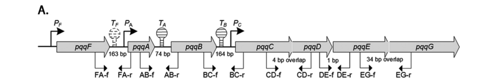

## Question

# Gene Research for Functional Annotation

## ⚠️ CRITICAL: Gene/Protein Identification Context

**BEFORE YOU BEGIN RESEARCH:** You MUST verify you are researching the CORRECT gene/protein. Gene symbols can be ambiguous, especially for less well-characterized genes from non-model organisms.

### Target Gene/Protein Identity (from UniProt):
- **UniProt Accession:** Q88QV3
- **Protein Description:** RecName: Full=Coenzyme PQQ synthesis protein F; EC=3.4.24.-; AltName: Full=Pyrroloquinoline quinone biosynthesis protein F;
- **Gene Information:** Name=pqqF; OrderedLocusNames=PP_0381;
- **Organism (full):** Pseudomonas putida (strain ATCC 47054 / DSM 6125 / CFBP 8728 / NCIMB 11950 / KT2440).
- **Protein Family:** Belongs to the peptidase M16 family. .
- **Key Domains:** Metalloenz_LuxS/M16. (IPR011249); Pept_M16_N. (IPR011765); Pept_M16_Zn_BS. (IPR001431); Peptidase_M16. (IPR050626); PQQ_synth_PqqF. (IPR011844)

### MANDATORY VERIFICATION STEPS:

1. **Check if the gene symbol "pqqF" matches the protein description above**
2. **Verify the organism is correct:** Pseudomonas putida (strain ATCC 47054 / DSM 6125 / CFBP 8728 / NCIMB 11950 / KT2440).
3. **Check if protein family/domains align with what you find in literature**
4. **If you find literature for a DIFFERENT gene with the same or similar symbol, STOP**

### If Gene Symbol is Ambiguous or You Cannot Find Relevant Literature:

**DO NOT PROCEED WITH RESEARCH ON A DIFFERENT GENE.** Instead:
- State clearly: "The gene symbol 'pqqF' is ambiguous or literature is limited for this specific protein"
- Explain what you found (e.g., "Found extensive literature on a different gene with the same symbol in a different organism")
- Describe the protein based ONLY on the UniProt information provided above
- Suggest that the protein function can be inferred from domain/family information

### Research Target:

Please provide a comprehensive research report on the gene **pqqF** (gene ID: pqqF, UniProt: Q88QV3) in PSEPK.

The research report should be a detailed narrative explaining the function, biological processes, and localization of the gene product. Citations should be given for all claims.

You should prioritize authoritative reviews and primary scientific literature when conducting research. You can supplement
this with annotations you find in gene/protein databases, but these can be outdated or inaccurate.

We are specifically interested in the primary function of the gene - for enzymes, what reaction is catalyzed, and what is the substrate specificity? For transporters, what is the substrate? For structural proteins or adapters, what is the broader structural role? For signaling molecules, what is the role in the pathway.

We are interested in where in or outside the cell the gene product carries out its function.

We are also interested in the signaling or biochemical pathways in which the gene functions. We are less interested in broad pleiotropic effects, except where these elucidate the precise role.

Include evidence where possible. We are interested in both experimental evidence as well as inference from structure, evolution, or bioinformatic analysis. Precise studies should be prioritized over high-throughput, where available.

## Output

Question: You are an expert researcher providing comprehensive, well-cited information.

Provide detailed information focusing on:
1. Key concepts and definitions with current understanding
2. Recent developments and latest research (prioritize 2023-2024 sources)
3. Current applications and real-world implementations
4. Expert opinions and analysis from authoritative sources
5. Relevant statistics and data from recent studies

Format as a comprehensive research report with proper citations. Include URLs and publication dates where available.
Always prioritize recent, authoritative sources and provide specific citations for all major claims.

# Gene Research for Functional Annotation

## ⚠️ CRITICAL: Gene/Protein Identification Context

**BEFORE YOU BEGIN RESEARCH:** You MUST verify you are researching the CORRECT gene/protein. Gene symbols can be ambiguous, especially for less well-characterized genes from non-model organisms.

### Target Gene/Protein Identity (from UniProt):
- **UniProt Accession:** Q88QV3
- **Protein Description:** RecName: Full=Coenzyme PQQ synthesis protein F; EC=3.4.24.-; AltName: Full=Pyrroloquinoline quinone biosynthesis protein F;
- **Gene Information:** Name=pqqF; OrderedLocusNames=PP_0381;
- **Organism (full):** Pseudomonas putida (strain ATCC 47054 / DSM 6125 / CFBP 8728 / NCIMB 11950 / KT2440).
- **Protein Family:** Belongs to the peptidase M16 family. .
- **Key Domains:** Metalloenz_LuxS/M16. (IPR011249); Pept_M16_N. (IPR011765); Pept_M16_Zn_BS. (IPR001431); Peptidase_M16. (IPR050626); PQQ_synth_PqqF. (IPR011844)

### MANDATORY VERIFICATION STEPS:

1. **Check if the gene symbol "pqqF" matches the protein description above**
2. **Verify the organism is correct:** Pseudomonas putida (strain ATCC 47054 / DSM 6125 / CFBP 8728 / NCIMB 11950 / KT2440).
3. **Check if protein family/domains align with what you find in literature**
4. **If you find literature for a DIFFERENT gene with the same or similar symbol, STOP**

### If Gene Symbol is Ambiguous or You Cannot Find Relevant Literature:

**DO NOT PROCEED WITH RESEARCH ON A DIFFERENT GENE.** Instead:
- State clearly: "The gene symbol 'pqqF' is ambiguous or literature is limited for this specific protein"
- Explain what you found (e.g., "Found extensive literature on a different gene with the same symbol in a different organism")
- Describe the protein based ONLY on the UniProt information provided above
- Suggest that the protein function can be inferred from domain/family information

### Research Target:

Please provide a comprehensive research report on the gene **pqqF** (gene ID: pqqF, UniProt: Q88QV3) in PSEPK.

The research report should be a detailed narrative explaining the function, biological processes, and localization of the gene product. Citations should be given for all claims.

You should prioritize authoritative reviews and primary scientific literature when conducting research. You can supplement
this with annotations you find in gene/protein databases, but these can be outdated or inaccurate.

We are specifically interested in the primary function of the gene - for enzymes, what reaction is catalyzed, and what is the substrate specificity? For transporters, what is the substrate? For structural proteins or adapters, what is the broader structural role? For signaling molecules, what is the role in the pathway.

We are interested in where in or outside the cell the gene product carries out its function.

We are also interested in the signaling or biochemical pathways in which the gene functions. We are less interested in broad pleiotropic effects, except where these elucidate the precise role.

Include evidence where possible. We are interested in both experimental evidence as well as inference from structure, evolution, or bioinformatic analysis. Precise studies should be prioritized over high-throughput, where available.

## Comprehensive research report: **pqqF** (UniProt Q88QV3; locus PP_0381) in *Pseudomonas putida* KT2440

### 0) Gene/protein identity verification (mandatory)

The target protein is **PqqF**, annotated as **“Coenzyme PQQ synthesis protein F”** in *Pseudomonas putida* strain KT2440 (ATCC 47054/DSM 6125/NCIMB 11950). In KT2440, a dedicated **PQQ biosynthesis gene region** contains the gene order **pqqFABCDEG**, and *pqqF* is explicitly included in this locus and experimentally examined at the transcript level, confirming the symbol-to-function context (PQQ locus gene) in the correct organism (KT2440) (Aug 2016) https://doi.org/10.1128/aem.00813-16 (an2016regulationofpyrroloquinoline pages 3-5, an2016regulationofpyrroloquinoline pages 1-2). This matches the UniProt-provided family expectation that PqqF is a **metalloendopeptidase** implicated in PQQ biogenesis; primary structural/biochemical work in other bacteria shows PqqF/PqqG are **M16-family zinc metallopeptidases** acting on the PQQ precursor peptide PqqA (Jul 2016; Oct 2019) https://doi.org/10.1074/jbc.m115.711226 ; https://doi.org/10.1074/jbc.ra119.009684 (wei2016crystalstructureand pages 1-2, martins2019atwocomponentprotease pages 2-3).

**Ambiguity check:** The symbol *pqqF* is used across diverse bacteria with variable operon structures; however, the KT2440 locus content and co-location with canonical *pqq* genes substantively anchors Q88QV3/PP_0381 as the PQQ-pathway PqqF rather than an unrelated M16 peptidase (an2016regulationofpyrroloquinoline pages 3-5, an2016regulationofpyrroloquinoline pages 1-2).

---

### 1) Key concepts and definitions (current understanding)

#### 1.1 Pyrroloquinoline quinone (PQQ)
PQQ is a **redox cofactor** used by several bacterial dehydrogenases (notably PQQ-dependent glucose dehydrogenases) and is biosynthesized by a conserved enzymatic pathway from a short ribosomally produced peptide precursor (PqqA) (Apr 2014) https://doi.org/10.1021/cr400475g (klinman2014intriguesandintricacies pages 2-4).

#### 1.2 PQQ biosynthesis is a “RiPP-like” pathway
A widely accepted framework is that PQQ is derived from the peptide **PqqA**, which contains conserved **Glu and Tyr residues** that become incorporated into the PQQ scaffold after post-translational modification and processing (Apr 2014) https://doi.org/10.1021/cr400475g (klinman2014intriguesandintricacies pages 2-4). Mechanistically:
- **PqqE** is a radical SAM enzyme implicated in the difficult C–C bond formation step between residues in PqqA (Apr 2014) https://doi.org/10.1021/cr400475g (klinman2014intriguesandintricacies pages 2-4).
- **PqqD** acts as a small protein partner/chaperone engaging PqqE and influencing its structural/electronic properties (Apr 2014) https://doi.org/10.1021/cr400475g (klinman2014intriguesandintricacies pages 2-4).
- **PqqB** is suggested (from structural homology) to be a metallo-oxygenase-like component involved in intermediate processing (Apr 2014) https://doi.org/10.1021/cr400475g (klinman2014intriguesandintricacies pages 2-4).
- **PqqC** catalyzes the final oxidative conversion to PQQ via an **eight-electron oxidation**, consuming O2 and producing H2O2 (Apr 2014) https://doi.org/10.1021/cr400475g (klinman2014intriguesandintricacies pages 2-4).

#### 1.3 Where PqqF fits conceptually
**PqqF** (and in some taxa, **PqqG**) are best understood as **proteolytic processing factors** required to excise/liberate the modified Glu/Tyr-containing portion of PqqA after PqqE/PqqD-dependent crosslinking, enabling downstream enzymes (e.g., PqqB) to act on an appropriate small intermediate (Oct 2019) https://doi.org/10.1074/jbc.ra119.009684 (martins2019atwocomponentprotease pages 1-2).

A key nuance in “current understanding” is that **PqqF is not universally essential across bacteria**: comparative analyses and reviews note that *pqqF* can be absent from many annotated pqq operons, implying functional replacement by other cellular proteases in some organisms (Apr 2014) https://doi.org/10.1021/cr400475g (klinman2014intriguesandintricacies pages 2-4). This variability is consistent with primary and comparative accounts that low-level PQQ can sometimes be detected without PqqF, suggesting redundancy (rosefigura2010investigationofthe pages 12-15, rosefigura2010investigationofthe pages 82-85).

---

### 2) Functional annotation of **PqqF (Q88QV3)** in *Pseudomonas putida* KT2440

#### 2.1 Genomic context and transcriptional organization in KT2440
In *P. putida* KT2440, the PQQ biosynthesis locus is described as a **seven-gene region** organized **pqqF, pqqA, pqqB, pqqC, pqqD, pqqE, pqqG** (Aug 2016) https://doi.org/10.1128/aem.00813-16 (an2016regulationofpyrroloquinoline pages 3-5). A computational prediction supported multiple promoters/terminators: promoters upstream of *pqqF*, *pqqA*, and *pqqC*, with terminators between *pqqA–pqqB* and *pqqB–pqqC*, and a terminator between *pqqF* and *pqqA* (an2016regulationofpyrroloquinoline pages 3-5, an2016regulationofpyrroloquinoline media e93443c6).

Experimentally, semiquantitative RT-PCR supported that **pqqF is transcribed independently** (no intergenic band consistent with a continuous *pqqF–pqqA* transcript), whereas **pqqG is co-transcribed with pqqCDE** (bands consistent with *pqqC–pqqD–pqqE–pqqG* transcript continuity) (Aug 2016) https://doi.org/10.1128/aem.00813-16 (an2016regulationofpyrroloquinoline pages 7-8).

**Interpretation (expert synthesis):** This transcript architecture is consistent with PqqF being an accessory/processing function whose expression can be decoupled from the “core” biosynthetic module (*pqqCDEG*), potentially allowing the cell to tune proteolytic capacity separately from radical chemistry/oxidative steps (an2016regulationofpyrroloquinoline pages 7-8, an2016regulationofpyrroloquinoline media e93443c6).

#### 2.2 Primary biochemical function: predicted peptidase acting on PqqA-derived intermediates
Direct biochemical characterization of **KT2440 PqqF (Q88QV3)** was not retrieved in the accessible literature set; thus, catalytic claims for Q88QV3 must be made as **inference from high-confidence orthologous systems and protein family**.

The most direct mechanistic evidence for PqqF-like proteins in PQQ biosynthesis includes:
- **Serratia sp. FS14 PqqF** is a zinc-dependent M16-family metallopeptidase (clamshell architecture typical of M16 proteases) with a central chamber volume of ~**9400 ų**, hypothesized to constrain substrate size to a small peptide such as PqqA (Jul 2016) https://doi.org/10.1074/jbc.m115.711226 (wei2016crystalstructureand pages 1-2).
- In **Methylorubrum extorquens AM1**, PqqF and PqqG form a **two-component M16B metallopeptidase** that shows high activity toward PqqA in vitro and binds as a heterodimer with **KD ≈ 300 ± 70 nM** (Oct 2019) https://doi.org/10.1074/jbc.ra119.009684 (martins2019atwocomponentprotease pages 2-3).

Taken together, the best-supported functional assignment for KT2440 PqqF (Q88QV3) is:
- **Molecular function:** zinc-dependent endopeptidase/peptidase.
- **Primary substrate (pathway context):** the ribosomally produced PQQ precursor peptide **PqqA**, most plausibly after PqqE/PqqD-dependent crosslinking, to liberate a smaller intermediate for downstream processing (martins2019atwocomponentprotease pages 1-2, klinman2014intriguesandintricacies pages 2-4).
- **Substrate specificity:** species dependent. In Methylorubrum, the PqqF/PqqG complex exhibited unusual preference for cleaving at **serine side chain contexts** during PqqA processing (Oct 2019) https://doi.org/10.1074/jbc.ra119.009684 (martins2019atwocomponentprotease pages 1-2, martins2019atwocomponentprotease pages 2-3). Whether KT2440 PqqF shares this serine-preference is **not experimentally established** in the retrieved KT2440-specific sources.

#### 2.3 Cellular localization (where the function occurs)
No direct subcellular localization (e.g., fractionation, microscopy, signal peptide) for **PqqF itself** in KT2440 was found in the retrieved full texts. However, pathway physiology in Gram-negative bacteria provides a strong cellular context:
- In KT2440, PQQ-dependent glucose dehydrogenase (GDH) activity is assayed from **membrane fractions**, and the authors describe membrane-bound and soluble (periplasmic) GDHs in Gram-negative bacteria, indicating the functional PQQ-dependent oxidation system operates in the **periplasmic/membrane-associated compartment** (Aug 2016) https://doi.org/10.1128/aem.00813-16 (an2016regulationofpyrroloquinoline pages 1-2).
- In KT2440, the enzyme shows very high apparent affinity for PQQ (**Km < 0.1 µM**, estimated), and membrane fractionation did not fully release PQQ from GDH, consistent with tight association in the membrane/periplasmic system (Aug 2016) https://doi.org/10.1128/aem.00813-16 (an2016regulationofpyrroloquinoline pages 7-8).

**Expert synthesis:** PQQ ultimately functions in periplasmic dehydrogenases, but **PQQ biosynthesis enzymes (including PqqF)** are generally expected to be **cytosolic** unless specific export/periplasmic maturation mechanisms exist. Because KT2440-specific localization evidence for PqqF is absent from retrieved sources, the safest annotation is “intracellular; exact compartment not experimentally determined here,” while noting that the *functionally deployed* PQQ cofactor is coupled to periplasmic dehydrogenase activity (an2016regulationofpyrroloquinoline pages 1-2).

#### 2.4 Pathway role and essentiality: what is known vs inferred
Across species, authoritative review evidence indicates:
- **Core essential genes**: *pqqA, pqqC, pqqD, pqqE* are “absolutely required” in knockout studies for PQQ production (Apr 2014) https://doi.org/10.1021/cr400475g (klinman2014intriguesandintricacies pages 2-4).
- **PqqF essentiality varies**: PqqF is absent from many operons, and the review explicitly notes it has not been shown to be required in all systems; non-specific cellular proteases may carry out excision instead (Apr 2014) https://doi.org/10.1021/cr400475g (klinman2014intriguesandintricacies pages 2-4).

In contrast, in Serratia sp. FS14, genetic evidence indicates *pqqF* was essential for PQQ-linked phenotypes used as a readout in that system (Jul 2016) https://doi.org/10.1074/jbc.m115.711226 (wei2016crystalstructureand pages 1-2). In KT2440, the retrieved study centered on regulation (not gene essentiality knockouts), so essentiality of KT2440 *pqqF* remains **unresolved** from the available KT2440-specific evidence.

---

### 3) Recent developments and latest research (prioritize 2023–2024)

A directly relevant 2024 publication focuses on using **pqqE** as a molecular marker for traceability of Gram-negative phosphate-solubilizing bacteria associated with plants (Aug 2024) https://doi.org/10.1007/s00294-024-01296-4 (paper retrieved but not deeply evidenced in the available excerpts). Its relevance to PqqF is primarily as **recent synthesis** of typical operon organization where *pqqA–E* are operonic and **pqqF** (and sometimes **pqqG**) are accessory genes in some bacteria (anzuay2024employmentofpqqe; snippet in tool output).

A dedicated 2024 review on microbial PQQ synthesis was identified by search but was **unobtainable through the current tooling** (World Journal of Microbiology and Biotechnology; DOI: 10.1007/s11274-023-03833-8), limiting how comprehensively 2023–2024 developments can be covered here.

**Net assessment:** the strongest mechanistic advances regarding the PqqF/PqqG step in PQQ maturation remain the 2016 structural and 2019 biochemical studies that explicitly address the previously “missing” protease step (wei2016crystalstructureand pages 1-2, martins2019atwocomponentprotease pages 1-2).

---

### 4) Current applications and real-world implementations linked to pqqF/PQQ pathway

While pqqF itself is a biosynthetic accessory gene, its pathway product **PQQ** has clear real-world roles through **PQQ-dependent glucose dehydrogenase (GDH)** in Gram-negative bacteria:

1. **Phosphate solubilization and rhizosphere function**: In KT2440, the study ties **gcd** and *pqq* gene expression to conditions of **low/zero soluble phosphate** and frames PQQ-dependent GDH as central to gluconic acid production relevant to phosphate solubilization physiology (Aug 2016) https://doi.org/10.1128/aem.00813-16 (an2016regulationofpyrroloquinoline pages 7-8, an2016regulationofpyrroloquinoline pages 1-2).

2. **Biocatalysis and oxidative biotransformations**: PQQ-dependent dehydrogenases are widely exploited conceptually for oxidation chemistry, and pathway engineering frequently targets PQQ availability as a cofactor supply constraint. In KT2440 specifically, the obtained evidence is about regulation/physiology rather than an engineered implementation, but it provides a foundation for tuning PQQ output through regulatory control of the *pqq* region (an2016regulationofpyrroloquinoline pages 7-8).

3. **Analytical/proteomics tool potential** (niche): The serine-side-chain cleavage specificity reported for the Methylorubrum PqqF/PqqG protease complex was proposed as potentially useful in proteomic analyses of serine-phosphorylated proteins (Oct 2019) https://doi.org/10.1074/jbc.ra119.009684 (martins2019atwocomponentprotease pages 1-2). This is an expert-proposed application rather than established practice.

---

### 5) Quantitative statistics and data (from accessible primary sources)

Key quantitative findings relevant to functional annotation include:

- **PqqF/PqqG binding affinity**: ITC-derived **KD = 300 ± 70 nM** for the PqqF–PqqG complex in *Methylorubrum extorquens* (Oct 2019) https://doi.org/10.1074/jbc.ra119.009684 (martins2019atwocomponentprotease pages 2-3).

- **In vitro proteolysis assay regime**: Proteolysis assays commonly used ~**2 µM enzyme** with **20 µM PqqA substrate**, monitored by LC–MS (Oct 2019) https://doi.org/10.1074/jbc.ra119.009684 (martins2019atwocomponentprotease pages 8-10).

- **Structural constraint relevant to substrate size**: Serratia PqqF adopts a closed clamshell and has a catalytic cavity volume of ~**9400 ų**, suggested to define specificity for small peptide substrates like PqqA (Jul 2016) https://doi.org/10.1074/jbc.m115.711226 (wei2016crystalstructureand pages 1-2).

- **KT2440 GDH apparent affinity for PQQ**: Apparent **Km < 0.1 µM** for PQQ-dependent GDH (membrane-associated) in *P. putida* KT2440 (Aug 2016) https://doi.org/10.1128/aem.00813-16 (an2016regulationofpyrroloquinoline pages 7-8).

---

### 6) Visual evidence: KT2440 pqq operon schematic

The following figure supports the KT2440 locus organization, predicted promoters/terminators, and RT-PCR primer placement used to infer independent transcription of *pqqF* and operonic organization of *pqqCDEG*:

(an2016regulationofpyrroloquinoline media e93443c6)

---

### 7) Integrated expert interpretation (authoritative synthesis)

1. **Most defensible primary functional annotation for KT2440 PqqF (Q88QV3):** a zinc-dependent M16-family endopeptidase that participates in **processing the PqqA precursor peptide** (direct evidence for this step comes from high-quality primary studies in other bacteria, especially the biochemical demonstration of a PqqF/PqqG protease complex acting on PqqA) (martins2019atwocomponentprotease pages 1-2, martins2019atwocomponentprotease pages 2-3).

2. **Why PqqF can be hard to validate genetically across organisms:** Authoritative review analysis emphasizes that while PqqA/C/D/E are core and essential, PqqF is variably present and may be replaceable by non-specific proteases in some systems (klinman2014intriguesandintricacies pages 2-4). This provides a mechanistic rationale for why *pqqF* knockout phenotypes can differ by species or may be subtle.

3. **KT2440-specific regulatory architecture supports its accessory role:** Independent transcription of *pqqF* in KT2440 is consistent with “accessory, conditionally important” processing capacity that can be regulated separately from the core oxidative/radical steps and from deployment of PQQ in periplasmic GDH (an2016regulationofpyrroloquinoline pages 7-8, an2016regulationofpyrroloquinoline media e93443c6).

---

## Evidence summary table

| Organism / strain | Gene(s) | Protein family / subfamily | Key experimental evidence | Proposed / observed substrate and cleavage specificity | Notes on essentiality / pathway role | Citation IDs |
|---|---|---|---|---|---|---|
| *Pseudomonas putida* KT2440 | **pqqF** (within *pqqFABCDEG* region), **pqqG** | Context consistent with PqqF/PqqG as PQQ-pathway protease-associated genes; direct family assignment in KT2440 paper is not biochemical but operon organization matches known PQQ systems | Strain-specific operon/transcription analysis showed a seven-gene region organized as *pqqFABCDEG*; *pqqF* is transcribed independently, while *pqqG* is cotranscribed with *pqqCDE*. Membrane-fraction assays and extracellular PQQ measurements linked the pathway to PQQ-dependent GDH physiology. Figure 1A supports predicted promoters/terminators and transcript structure | No direct cleavage assay for KT2440 PqqF/PqqG reported. Functional context places them in maturation of the PqqA-derived PQQ precursor; GDH activity occurs in the periplasm/membrane-associated system, but no direct subcellular localization of PqqF/PqqG was shown | Evidence in KT2440 is strongest for gene organization/regulation, not direct protease biochemistry. Supports assignment of *pqqF*/*pqqG* to the PQQ biosynthetic locus and pathway control under phosphate limitation | (an2016regulationofpyrroloquinoline pages 7-8, an2016regulationofpyrroloquinoline pages 3-5, an2016regulationofpyrroloquinoline pages 1-2, an2016regulationofpyrroloquinoline media e93443c6) |
| *Serratia* sp. FS14 | **pqqF** | M16 Zn-metallopeptidase; structurally classified with inverzincin-like/M16A-type clamshell proteases | X-ray crystal structure solved (PDB 5CIO); protein forms a closed clamshell with ~9400 ų chamber. Active-site Zn coordination and catalytic residues were identified. Genetic evidence: deletion of *pqqF* abolished a glucose-responsive phenotype used as a readout of PQQ biosynthesis | Proposed substrate is the modified PqqA precursor peptide; authors infer cleavage around the conserved Glu/Tyr-derived cross-linked moiety to help liberate the PQQ precursor. Direct cleavage specificity remained incompletely resolved in this study | In FS14, *pqqF* behaved as essential for PQQ biosynthesis by genetics, but exact proteolytic step remained inferential | (wei2016crystalstructureand pages 1-2, wei2016crystalstructureand pages 2-4, wei2016crystalstructureand pages 10-11) |
| *Methylorubrum extorquens* AM1 | **pqqF**, **pqqG** | Two-component M16B heterodimeric metallopeptidase | Direct biochemical characterization of purified PqqF/PqqG showed high activity toward PqqA. Pull-down, SPR, and ITC demonstrated complex formation with ~1:1 stoichiometry and **K**\_D ~300 ± 70 nM. Homology modeling against known M16B proteases supported the heterodimer architecture | Observed substrate: PqqA peptide precursor. Time-course LC-MS data indicated strong preference for cleavage at serine-containing positions; authors proposed initial processing of cross-linked PqqA* followed by assistance from other cellular proteases | Strongest direct evidence that PqqF/PqqG act as the PQQ-pathway processing protease. Also illustrates that in some bacteria the protease function is split between PqqF and PqqG rather than encoded by a single PqqF polypeptide | (martins2019atwocomponentprotease pages 2-3, martins2019atwocomponentprotease pages 8-10, martins2019atwocomponentprotease pages 1-2, martins2019atwocomponentprotease pages 24-25) |
| Cross-species pathway consensus | **pqqF** and sometimes **pqqG** | Protease-like PQQ accessory factors; generally M16-family Zn-dependent peptidases | Reviews and comparative analyses place PqqA, PqqC, PqqD, and PqqE as core conserved PQQ-biosynthetic functions, whereas PqqF is variably present and PqqG is additional/poorly characterized in some taxa | Proposed role is proteolytic excision of the Glu/Tyr-derived precursor from PqqA after PqqE/PqqD-dependent cross-link formation; exact cleavage pattern and whether nonspecific proteases assist vary by organism | Essentiality is species dependent: some systems require *pqqF* genetically, whereas others produce low levels of PQQ without it, implying functional redundancy or replacement by other proteases | (rosefigura2010investigationofthe pages 12-15, klinman2014intriguesandintricacies pages 2-4, rosefigura2010investigationofthe pages 82-85) |

*Table: This table summarizes the strongest available evidence for PqqF and PqqG in PQQ biosynthesis across key organisms. It highlights where evidence is direct biochemical proof versus operon-level or structural inference, which is useful for functional annotation of *Pseudomonas putida* KT2440 pqqF.*

---

## References (URLs and publication dates)

- An, R.; Moe, L. A. **Regulation of Pyrroloquinoline Quinone-Dependent Glucose Dehydrogenase Activity in the Model Rhizosphere-Dwelling Bacterium *Pseudomonas putida* KT2440.** *Applied and Environmental Microbiology* (Aug 2016). https://doi.org/10.1128/aem.00813-16 (an2016regulationofpyrroloquinoline pages 7-8, an2016regulationofpyrroloquinoline pages 3-5, an2016regulationofpyrroloquinoline pages 1-2, an2016regulationofpyrroloquinoline media e93443c6)

- Wei, Q.; Ran, T.; Ma, C.; He, J.; Xu, D.; Wang, W. **Crystal Structure and Function of PqqF Protein in the Pyrroloquinoline Quinone Biosynthetic Pathway.** *Journal of Biological Chemistry* (Jul 2016). https://doi.org/10.1074/jbc.m115.711226 (wei2016crystalstructureand pages 1-2, wei2016crystalstructureand pages 2-4, wei2016crystalstructureand pages 10-11)

- Martins, A. M.; Latham, J. A.; Martel, P. J.; Barr, I.; Iavarone, A. T.; Klinman, J. P. **A two-component protease in *Methylorubrum extorquens* with high activity toward the peptide precursor of the redox cofactor pyrroloquinoline quinone.** *Journal of Biological Chemistry* (Oct 2019). https://doi.org/10.1074/jbc.ra119.009684 (martins2019atwocomponentprotease pages 2-3, martins2019atwocomponentprotease pages 8-10, martins2019atwocomponentprotease pages 1-2, martins2019atwocomponentprotease pages 24-25)

- Klinman, J. P.; Bonnot, F. **Intrigues and intricacies of the biosynthetic pathways for the enzymatic quinocofactors: PQQ, TTQ, CTQ, TPQ, and LTQ.** *Chemical Reviews* (Apr 2014). https://doi.org/10.1021/cr400475g (klinman2014intriguesandintricacies pages 2-4)

- RoseFigura, J. M. **Investigation of the structure and mechanism of a PQQ biosynthetic pathway component, PqqC, and a bioinformatics analysis of potential PQQ producing …** (2010; dissertation-like source as retrieved). (rosefigura2010investigationofthe pages 82-85, rosefigura2010investigationofthe pages 12-15)

- (Recent, 2024) Anzuay, M. S. et al. **Employment of pqqE gene as molecular marker for the traceability of Gram negative phosphate solubilizing bacteria associated to plants.** *Current Genetics* (Aug 2024). https://doi.org/10.1007/s00294-024-01296-4 (retrieved but not deeply excerpted in evidence snippets; included here as the most recent obtainable source from 2023–2024 tool search)

### Notes on limitations

- No KT2440-specific **biochemical assay** of Q88QV3 activity (PqqA cleavage, kinetics, metal dependence) or **direct localization experiment** for PqqF was retrieved in the available texts; KT2440-specific statements are therefore limited to operon structure, transcriptional organization, and pathway physiology/regulation.
- A highly relevant 2024 review on microbial PQQ synthesis was identified but not obtainable via the current retrieval tools, constraining the breadth of 2023–2024 “latest research” synthesis.

References

1. (an2016regulationofpyrroloquinoline pages 3-5): Ran An and Luke A. Moe. Regulation of pyrroloquinoline quinone-dependent glucose dehydrogenase activity in the model rhizosphere-dwelling bacterium pseudomonas putida kt2440. Applied and Environmental Microbiology, 82:4955-4964, Aug 2016. URL: https://doi.org/10.1128/aem.00813-16, doi:10.1128/aem.00813-16. This article has 164 citations and is from a peer-reviewed journal.

2. (an2016regulationofpyrroloquinoline pages 1-2): Ran An and Luke A. Moe. Regulation of pyrroloquinoline quinone-dependent glucose dehydrogenase activity in the model rhizosphere-dwelling bacterium pseudomonas putida kt2440. Applied and Environmental Microbiology, 82:4955-4964, Aug 2016. URL: https://doi.org/10.1128/aem.00813-16, doi:10.1128/aem.00813-16. This article has 164 citations and is from a peer-reviewed journal.

3. (wei2016crystalstructureand pages 1-2): Qiaoe Wei, Tingting Ran, Chencui Ma, Jianhua He, Dongqing Xu, and Weiwu Wang. Crystal structure and function of pqqf protein in the pyrroloquinoline quinone biosynthetic pathway. Journal of Biological Chemistry, 291:15575-15587, Jul 2016. URL: https://doi.org/10.1074/jbc.m115.711226, doi:10.1074/jbc.m115.711226. This article has 37 citations and is from a domain leading peer-reviewed journal.

4. (martins2019atwocomponentprotease pages 2-3): Ana M. Martins, John A. Latham, Paulo J. Martel, Ian Barr, Anthony T. Iavarone, and Judith P. Klinman. A two-component protease in methylorubrum extorquens with high activity toward the peptide precursor of the redox cofactor pyrroloquinoline quinone. Journal of Biological Chemistry, 294:15025-15036, Oct 2019. URL: https://doi.org/10.1074/jbc.ra119.009684, doi:10.1074/jbc.ra119.009684. This article has 38 citations and is from a domain leading peer-reviewed journal.

5. (klinman2014intriguesandintricacies pages 2-4): Judith P. Klinman and Florence Bonnot. Intrigues and intricacies of the biosynthetic pathways for the enzymatic quinocofactors: pqq, ttq, ctq, tpq, and ltq. Chemical reviews, 114 8:4343-65, Apr 2014. URL: https://doi.org/10.1021/cr400475g, doi:10.1021/cr400475g. This article has 225 citations and is from a highest quality peer-reviewed journal.

6. (martins2019atwocomponentprotease pages 1-2): Ana M. Martins, John A. Latham, Paulo J. Martel, Ian Barr, Anthony T. Iavarone, and Judith P. Klinman. A two-component protease in methylorubrum extorquens with high activity toward the peptide precursor of the redox cofactor pyrroloquinoline quinone. Journal of Biological Chemistry, 294:15025-15036, Oct 2019. URL: https://doi.org/10.1074/jbc.ra119.009684, doi:10.1074/jbc.ra119.009684. This article has 38 citations and is from a domain leading peer-reviewed journal.

7. (rosefigura2010investigationofthe pages 12-15): JM RoseFigura. Investigation of the structure and mechanism of a pqq biosynthetic pathway component, pqqc, and a bioinformatics analysis of potential pqq producing …. Unknown journal, 2010.

8. (rosefigura2010investigationofthe pages 82-85): JM RoseFigura. Investigation of the structure and mechanism of a pqq biosynthetic pathway component, pqqc, and a bioinformatics analysis of potential pqq producing …. Unknown journal, 2010.

9. (an2016regulationofpyrroloquinoline media e93443c6): Ran An and Luke A. Moe. Regulation of pyrroloquinoline quinone-dependent glucose dehydrogenase activity in the model rhizosphere-dwelling bacterium pseudomonas putida kt2440. Applied and Environmental Microbiology, 82:4955-4964, Aug 2016. URL: https://doi.org/10.1128/aem.00813-16, doi:10.1128/aem.00813-16. This article has 164 citations and is from a peer-reviewed journal.

10. (an2016regulationofpyrroloquinoline pages 7-8): Ran An and Luke A. Moe. Regulation of pyrroloquinoline quinone-dependent glucose dehydrogenase activity in the model rhizosphere-dwelling bacterium pseudomonas putida kt2440. Applied and Environmental Microbiology, 82:4955-4964, Aug 2016. URL: https://doi.org/10.1128/aem.00813-16, doi:10.1128/aem.00813-16. This article has 164 citations and is from a peer-reviewed journal.

11. (martins2019atwocomponentprotease pages 8-10): Ana M. Martins, John A. Latham, Paulo J. Martel, Ian Barr, Anthony T. Iavarone, and Judith P. Klinman. A two-component protease in methylorubrum extorquens with high activity toward the peptide precursor of the redox cofactor pyrroloquinoline quinone. Journal of Biological Chemistry, 294:15025-15036, Oct 2019. URL: https://doi.org/10.1074/jbc.ra119.009684, doi:10.1074/jbc.ra119.009684. This article has 38 citations and is from a domain leading peer-reviewed journal.

12. (wei2016crystalstructureand pages 2-4): Qiaoe Wei, Tingting Ran, Chencui Ma, Jianhua He, Dongqing Xu, and Weiwu Wang. Crystal structure and function of pqqf protein in the pyrroloquinoline quinone biosynthetic pathway. Journal of Biological Chemistry, 291:15575-15587, Jul 2016. URL: https://doi.org/10.1074/jbc.m115.711226, doi:10.1074/jbc.m115.711226. This article has 37 citations and is from a domain leading peer-reviewed journal.

13. (wei2016crystalstructureand pages 10-11): Qiaoe Wei, Tingting Ran, Chencui Ma, Jianhua He, Dongqing Xu, and Weiwu Wang. Crystal structure and function of pqqf protein in the pyrroloquinoline quinone biosynthetic pathway. Journal of Biological Chemistry, 291:15575-15587, Jul 2016. URL: https://doi.org/10.1074/jbc.m115.711226, doi:10.1074/jbc.m115.711226. This article has 37 citations and is from a domain leading peer-reviewed journal.

14. (martins2019atwocomponentprotease pages 24-25): Ana M. Martins, John A. Latham, Paulo J. Martel, Ian Barr, Anthony T. Iavarone, and Judith P. Klinman. A two-component protease in methylorubrum extorquens with high activity toward the peptide precursor of the redox cofactor pyrroloquinoline quinone. Journal of Biological Chemistry, 294:15025-15036, Oct 2019. URL: https://doi.org/10.1074/jbc.ra119.009684, doi:10.1074/jbc.ra119.009684. This article has 38 citations and is from a domain leading peer-reviewed journal.

## Artifacts

- [Edison artifact artifact-00](pqqF-deep-research-falcon_artifacts/artifact-00.md)

## Citations

1. klinman2014intriguesandintricacies pages 2-4
2. martins2019atwocomponentprotease pages 1-2
3. an2016regulationofpyrroloquinoline pages 3-5
4. an2016regulationofpyrroloquinoline pages 7-8
5. wei2016crystalstructureand pages 1-2
6. martins2019atwocomponentprotease pages 2-3
7. an2016regulationofpyrroloquinoline pages 1-2
8. martins2019atwocomponentprotease pages 8-10
9. rosefigura2010investigationofthe pages 12-15
10. rosefigura2010investigationofthe pages 82-85
11. wei2016crystalstructureand pages 2-4
12. wei2016crystalstructureand pages 10-11
13. martins2019atwocomponentprotease pages 24-25
14. https://doi.org/10.1128/aem.00813-16
15. https://doi.org/10.1074/jbc.m115.711226
16. https://doi.org/10.1074/jbc.ra119.009684
17. https://doi.org/10.1021/cr400475g
18. https://doi.org/10.1007/s00294-024-01296-4
19. https://doi.org/10.1128/aem.00813-16,
20. https://doi.org/10.1074/jbc.m115.711226,
21. https://doi.org/10.1074/jbc.ra119.009684,
22. https://doi.org/10.1021/cr400475g,