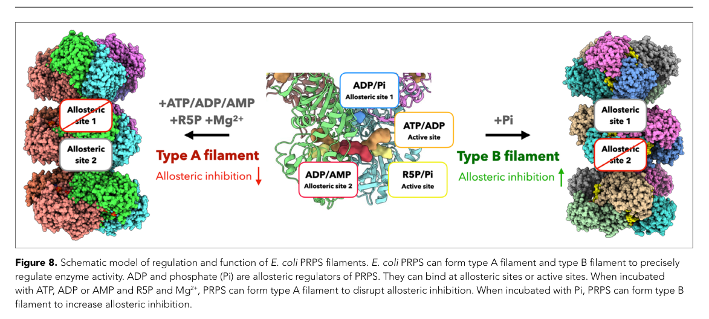

## Question

# Gene Research for Functional Annotation

## ⚠️ CRITICAL: Gene/Protein Identification Context

**BEFORE YOU BEGIN RESEARCH:** You MUST verify you are researching the CORRECT gene/protein. Gene symbols can be ambiguous, especially for less well-characterized genes from non-model organisms.

### Target Gene/Protein Identity (from UniProt):
- **UniProt Accession:** Q88PX6
- **Protein Description:** RecName: Full=Ribose-phosphate pyrophosphokinase {ECO:0000255|HAMAP-Rule:MF_00583}; Short=RPPK {ECO:0000255|HAMAP-Rule:MF_00583}; EC=2.7.6.1 {ECO:0000255|HAMAP-Rule:MF_00583}; AltName: Full=5-phospho-D-ribosyl alpha-1-diphosphate synthase {ECO:0000255|HAMAP-Rule:MF_00583}; AltName: Full=Phosphoribosyl diphosphate synthase {ECO:0000255|HAMAP-Rule:MF_00583}; AltName: Full=Phosphoribosyl pyrophosphate synthase {ECO:0000255|HAMAP-Rule:MF_00583}; Short=P-Rib-PP synthase {ECO:0000255|HAMAP-Rule:MF_00583}; Short=PRPP synthase {ECO:0000255|HAMAP-Rule:MF_00583}; Short=PRPPase {ECO:0000255|HAMAP-Rule:MF_00583};
- **Gene Information:** Name=prs {ECO:0000255|HAMAP-Rule:MF_00583}; Synonyms=prsA; OrderedLocusNames=PP_0722;
- **Organism (full):** Pseudomonas putida (strain ATCC 47054 / DSM 6125 / CFBP 8728 / NCIMB 11950 / KT2440).
- **Protein Family:** Belongs to the ribose-phosphate pyrophosphokinase family.
- **Key Domains:** PRib_PP_synth_CS. (IPR000842); Pribosyltran_N. (IPR029099); PRTase-like. (IPR029057); PRTase_dom. (IPR000836); Rib-P_diPkinase. (IPR005946)

### MANDATORY VERIFICATION STEPS:

1. **Check if the gene symbol "prs" matches the protein description above**
2. **Verify the organism is correct:** Pseudomonas putida (strain ATCC 47054 / DSM 6125 / CFBP 8728 / NCIMB 11950 / KT2440).
3. **Check if protein family/domains align with what you find in literature**
4. **If you find literature for a DIFFERENT gene with the same or similar symbol, STOP**

### If Gene Symbol is Ambiguous or You Cannot Find Relevant Literature:

**DO NOT PROCEED WITH RESEARCH ON A DIFFERENT GENE.** Instead:
- State clearly: "The gene symbol 'prs' is ambiguous or literature is limited for this specific protein"
- Explain what you found (e.g., "Found extensive literature on a different gene with the same symbol in a different organism")
- Describe the protein based ONLY on the UniProt information provided above
- Suggest that the protein function can be inferred from domain/family information

### Research Target:

Please provide a comprehensive research report on the gene **prs** (gene ID: prs, UniProt: Q88PX6) in PSEPK.

The research report should be a detailed narrative explaining the function, biological processes, and localization of the gene product. Citations should be given for all claims.

You should prioritize authoritative reviews and primary scientific literature when conducting research. You can supplement
this with annotations you find in gene/protein databases, but these can be outdated or inaccurate.

We are specifically interested in the primary function of the gene - for enzymes, what reaction is catalyzed, and what is the substrate specificity? For transporters, what is the substrate? For structural proteins or adapters, what is the broader structural role? For signaling molecules, what is the role in the pathway.

We are interested in where in or outside the cell the gene product carries out its function.

We are also interested in the signaling or biochemical pathways in which the gene functions. We are less interested in broad pleiotropic effects, except where these elucidate the precise role.

Include evidence where possible. We are interested in both experimental evidence as well as inference from structure, evolution, or bioinformatic analysis. Precise studies should be prioritized over high-throughput, where available.

## Output

Question: You are an expert researcher providing comprehensive, well-cited information.

Provide detailed information focusing on:
1. Key concepts and definitions with current understanding
2. Recent developments and latest research (prioritize 2023-2024 sources)
3. Current applications and real-world implementations
4. Expert opinions and analysis from authoritative sources
5. Relevant statistics and data from recent studies

Format as a comprehensive research report with proper citations. Include URLs and publication dates where available.
Always prioritize recent, authoritative sources and provide specific citations for all major claims.

# Gene Research for Functional Annotation

## ⚠️ CRITICAL: Gene/Protein Identification Context

**BEFORE YOU BEGIN RESEARCH:** You MUST verify you are researching the CORRECT gene/protein. Gene symbols can be ambiguous, especially for less well-characterized genes from non-model organisms.

### Target Gene/Protein Identity (from UniProt):
- **UniProt Accession:** Q88PX6
- **Protein Description:** RecName: Full=Ribose-phosphate pyrophosphokinase {ECO:0000255|HAMAP-Rule:MF_00583}; Short=RPPK {ECO:0000255|HAMAP-Rule:MF_00583}; EC=2.7.6.1 {ECO:0000255|HAMAP-Rule:MF_00583}; AltName: Full=5-phospho-D-ribosyl alpha-1-diphosphate synthase {ECO:0000255|HAMAP-Rule:MF_00583}; AltName: Full=Phosphoribosyl diphosphate synthase {ECO:0000255|HAMAP-Rule:MF_00583}; AltName: Full=Phosphoribosyl pyrophosphate synthase {ECO:0000255|HAMAP-Rule:MF_00583}; Short=P-Rib-PP synthase {ECO:0000255|HAMAP-Rule:MF_00583}; Short=PRPP synthase {ECO:0000255|HAMAP-Rule:MF_00583}; Short=PRPPase {ECO:0000255|HAMAP-Rule:MF_00583};
- **Gene Information:** Name=prs {ECO:0000255|HAMAP-Rule:MF_00583}; Synonyms=prsA; OrderedLocusNames=PP_0722;
- **Organism (full):** Pseudomonas putida (strain ATCC 47054 / DSM 6125 / CFBP 8728 / NCIMB 11950 / KT2440).
- **Protein Family:** Belongs to the ribose-phosphate pyrophosphokinase family.
- **Key Domains:** PRib_PP_synth_CS. (IPR000842); Pribosyltran_N. (IPR029099); PRTase-like. (IPR029057); PRTase_dom. (IPR000836); Rib-P_diPkinase. (IPR005946)

### MANDATORY VERIFICATION STEPS:

1. **Check if the gene symbol "prs" matches the protein description above**
2. **Verify the organism is correct:** Pseudomonas putida (strain ATCC 47054 / DSM 6125 / CFBP 8728 / NCIMB 11950 / KT2440).
3. **Check if protein family/domains align with what you find in literature**
4. **If you find literature for a DIFFERENT gene with the same or similar symbol, STOP**

### If Gene Symbol is Ambiguous or You Cannot Find Relevant Literature:

**DO NOT PROCEED WITH RESEARCH ON A DIFFERENT GENE.** Instead:
- State clearly: "The gene symbol 'prs' is ambiguous or literature is limited for this specific protein"
- Explain what you found (e.g., "Found extensive literature on a different gene with the same symbol in a different organism")
- Describe the protein based ONLY on the UniProt information provided above
- Suggest that the protein function can be inferred from domain/family information

### Research Target:

Please provide a comprehensive research report on the gene **prs** (gene ID: prs, UniProt: Q88PX6) in PSEPK.

The research report should be a detailed narrative explaining the function, biological processes, and localization of the gene product. Citations should be given for all claims.

You should prioritize authoritative reviews and primary scientific literature when conducting research. You can supplement
this with annotations you find in gene/protein databases, but these can be outdated or inaccurate.

We are specifically interested in the primary function of the gene - for enzymes, what reaction is catalyzed, and what is the substrate specificity? For transporters, what is the substrate? For structural proteins or adapters, what is the broader structural role? For signaling molecules, what is the role in the pathway.

We are interested in where in or outside the cell the gene product carries out its function.

We are also interested in the signaling or biochemical pathways in which the gene functions. We are less interested in broad pleiotropic effects, except where these elucidate the precise role.

Include evidence where possible. We are interested in both experimental evidence as well as inference from structure, evolution, or bioinformatic analysis. Precise studies should be prioritized over high-throughput, where available.

## Research report: *Pseudomonas putida* KT2440 **prs** (UniProt Q88PX6; locus PP_0722) — ribose-phosphate pyrophosphokinase / PRPP synthase (EC 2.7.6.1)

### Executive summary
The *prs* gene product in bacteria is phosphoribosyl pyrophosphate (PRPP) synthase (ribose-phosphate pyrophosphokinase; EC 2.7.6.1), which catalyzes the formation of PRPP from ribose-5-phosphate and ATP, producing AMP; PRPP is a central “activated ribose” donor that supplies ribose-phosphate to multiple biosynthetic pathways, including purine/pyrimidine nucleotides, NAD/NADP cofactors, and (in many bacteria) histidine and tryptophan pathways. (ugbogu2022contributionofmodel pages 1-2, laux2024livinginmangroves pages 14-16)

**Critical limitation for gene-specific annotation:** using the available tool-based literature retrieval, I did **not** recover any primary article that explicitly mentions *P. putida* KT2440 locus **PP_0722** or UniProt **Q88PX6**. Therefore, KT2440-specific claims (e.g., essentiality, regulation strength, kinetic constants, expression patterns, or subcellular localization measurements) cannot be supported here; the report instead provides (i) high-confidence **family/EC-level** functional annotation consistent with UniProt’s curated identity and (ii) organism-general mechanistic insights from authoritative sources. (ugbogu2022contributionofmodel pages 1-2, karst2021biosynthesisandutilisation pages 26-29, hu2022filamentationmodulatesallosteric pages 1-2)

---

### 1) Key concepts and definitions (current understanding)

#### 1.1 Enzyme name, EC number, and reaction definition
Bacterial Prs/PRPP synthase (EC **2.7.6.1**) catalyzes an essentially irreversible diphosphoryl transfer from ATP to ribose-5-phosphate (R5P) to produce **5-phospho-D-ribosyl-α-1-diphosphate (PRPP)** and **AMP**. (ugbogu2022contributionofmodel pages 1-2, hu2022filamentationmodulatesallosteric pages 1-2)

**Reaction (canonical):**
- Substrates: ribose-5-phosphate + ATP
- Products: PRPP + AMP

This reaction is commonly described as “transfer of diphosphate from ATP to ribose-5-phosphate,” emphasizing that PRPP is the “activated” ribose donor that enables ribose-phosphate incorporation in downstream pathways. (hu2022filamentationmodulatesallosteric pages 1-2)

#### 1.2 PRPP as a metabolic branch-point
PRPP is broadly required for:
- **Purine and pyrimidine nucleotide biosynthesis** and salvage pathways (central precursor supply). (ugbogu2022contributionofmodel pages 1-2, hu2022filamentationmodulatesallosteric pages 1-2)
- **NAD and NADP** cofactor biosynthesis. (laux2024livinginmangroves pages 14-16, ugbogu2022contributionofmodel pages 1-2)
- In bacteria including *E. coli*, **histidine and tryptophan** biosynthesis, reflecting PRPP’s role as a ribose donor in these amino-acid pathways. (ugbogu2022contributionofmodel pages 1-2, laux2024livinginmangroves pages 14-16)

A 2024 metagenomic metabolic reconstruction similarly emphasized the PRPP-synthesizing reaction (R5P → PRPP) and linked PRPP to biosynthesis of histidine/tryptophan, NAD/NADP, and purine/pyrimidine nucleotides. (laux2024livinginmangroves pages 14-16)

#### 1.3 Metal and phosphate requirements (class I bacterial PRPP synthases)
A biochemical synthesis/utilization summary of bacterial PRPP synthase (referred to as ribose-phosphate diphosphokinase/RPPK) notes that class I enzymes require divalent cations, including **Mg2+** (in addition to MgATP) and a second metal (e.g., **Mn2+**) coordinated during catalysis. (karst2021biosynthesisandutilisation pages 26-29)

Many bacterial class I PRPP synthases are also **phosphate (Pi)-activated**, with Pi acting as an activator that is intertwined with allosteric regulation. (hu2022filamentationmodulatesallosteric pages 1-2)

#### 1.4 Regulation and inhibition (feedback and allostery)
A 2022 review summarizes that PRPP synthase activity is subject to **feedback inhibition** by adenine/guanine nucleotides, listing **AMP, ADP, and GDP** as inhibitors. (ugbogu2022contributionofmodel pages 1-2)

A high-impact mechanistic study further states that class I PRPP synthases are allosterically inhibited by **ADP**, and that ADP can compete with phosphate and ATP at regulatory/active sites (described at the level of bacterial class I enzymes). (hu2022filamentationmodulatesallosteric pages 1-2)

#### 1.5 Cellular localization (what can be stated with evidence)
The retrieved evidence does not provide a KT2440-specific localization experiment for Prs. However, all biochemical/structural evidence discussed treats bacterial PRPP synthase as a **soluble cytosolic enzyme** acting on central metabolites (R5P, ATP) and forming regulated enzyme assemblies in the cytosol in some organisms. (hu2022filamentationmodulatesallosteric pages 1-2)

Accordingly, for Q88PX6 a cytosolic localization is the most consistent functional inference, but it should be considered **inferred** rather than directly measured in *P. putida* KT2440 in the present evidence set.

---

### 2) Recent developments and latest research (prioritizing 2023–2024)

#### 2.1 Systems-level pathway context (2024)
A 2024 metabolic reconstruction from metagenome-assembled genomes explicitly describes ribose-phosphate pyrophosphokinase (EC 2.7.6.1) as converting ribose-5-phosphate to PRPP and emphasizes PRPP’s ubiquity as a precursor for nucleotides, NAD/NADP, and histidine/tryptophan. (laux2024livinginmangroves pages 14-16)

Although not specific to *P. putida* KT2440, this 2024 work reflects current practice: PRPP synthase is routinely annotated as a key node in integrated network reconstructions and flux interpretations of microbial communities. (laux2024livinginmangroves pages 14-16)

#### 2.2 Structural/mechanistic paradigm: ligand-controlled filamentation (cytoophidia)
A major mechanistic advance (cryo-EM and biochemistry) showed that bacterial PRPP synthase can form **filamentous assemblies (cytoophidia)** both in vitro and in vivo, and that distinct filament types form depending on bound ligands; critically, one filament type can be **resistant to allosteric inhibition**, indicating that supramolecular assembly itself is a regulatory layer for PRPP metabolism. (hu2022filamentationmodulatesallosteric pages 1-2)

The retrieved figure panels provide a concise regulatory model where ligand binding (adenine nucleotides vs Pi) drives different filament forms and alters inhibition sensitivity. (hu2022filamentationmodulatesallosteric media 8218b197, hu2022filamentationmodulatesallosteric media 64c0e530, hu2022filamentationmodulatesallosteric media f4004a8f)

**Interpretation for *P. putida* KT2440 Q88PX6:** filamentation has not been shown for the KT2440 enzyme in the retrieved evidence. Nevertheless, since the mechanism is demonstrated in bacteria and linked to class I PRPP synthase regulation, it is a plausible regulatory strategy in other bacterial Prs enzymes and a concrete hypothesis for *P. putida* that can be tested experimentally (native microscopy, crosslinking, cryo-EM, or mutational disruption of filament interfaces). (hu2022filamentationmodulatesallosteric pages 1-2)

---

### 3) Current applications and real-world implementations

#### 3.1 PRPP generation for engineered biochemical systems
Because PRPP is costly and unstable to procure as a reagent, enzyme-cascade approaches are used to generate PRPP in situ for engineered pathways. A detailed biochemical summary (focused on PRPP biosynthesis/utilization and cofactor regeneration) describes cloning/using ribose-phosphate pyrophosphokinase (EC 2.7.6.1) as a PRPP supply module and places it in the context of engineered PRPP-dependent systems. (karst2021biosynthesisandutilisation pages 26-29)

This illustrates an application-relevant theme: **Prs is a leverage point** for tuning PRPP availability to support PRPP-consuming enzymes (phosphoribosyltransferases) in cell-free biocatalysis, synthetic biology, and metabolic engineering.

#### 3.2 Metabolic engineering logic (expert synthesis)
A broad review on PRPP metabolism and model-organism work emphasizes that PRPP synthase is “rate-limiting” for PRPP formation and that PRPP availability determines flux into nucleotide/cofactor biosynthesis and related cellular processes; such expert synthesis motivates why PRPP synthase is frequently targeted for metabolic rewiring and why dysregulation has strong phenotypic consequences. (ugbogu2022contributionofmodel pages 1-2)

---

### 4) Expert opinions and analysis (authoritative synthesis)

#### 4.1 Consensus view: essentiality and centrality
An authoritative 2022 review argues that PRPP synthesis is essential for free-living organisms and that bacteria must encode at least one functional PRPP synthase for survival, consistent with historical genetic evidence where prs defects produce multiple auxotrophies tied to nucleotide and amino-acid precursor shortages. (ugbogu2022contributionofmodel pages 1-2, ugbogu2022contributionofmodel pages 28-30)

**Caveat for *P. putida* KT2440:** while essentiality is plausible for KT2440, the present evidence set does not include a KT2440 transposon essentiality map or deletion study for PP_0722/Q88PX6.

#### 4.2 Regulation as a multi-layer system
The mechanistic study of bacterial PRPP synthase filamentation provides expert-level evidence that PRPP supply can be regulated not only by classic allosteric ligands (Pi, ADP/AMP-like effectors) but also by assembly into higher-order structures that change inhibitor susceptibility. (hu2022filamentationmodulatesallosteric pages 1-2)

This model aligns with a broader trend in metabolic regulation: enzyme self-assembly can serve as a rapid, reversible switch integrating metabolite signals and protein-protein interactions.

---

### 5) Relevant statistics and data from recent studies

**Quantitative/statistical limitation:** within the retrieved evidence corpus, there were few KT2440-specific quantitative datasets (e.g., kinetic constants, expression fold-changes, fitness coefficients) for prs/PP_0722/Q88PX6.

The strongest data-driven claim available here is qualitative-but-mechanistic: bacterial PRPP synthase filament types differ in **resistance to allosteric inhibition**, supported by biochemical assays and structural models in the mechanistic study, and visually summarized in the retrieved figures. (hu2022filamentationmodulatesallosteric pages 1-2, hu2022filamentationmodulatesallosteric media 8218b197, hu2022filamentationmodulatesallosteric media 64c0e530, hu2022filamentationmodulatesallosteric media f4004a8f)

---

## Functional annotation for UniProt Q88PX6 (KT2440 PP_0722): evidence-backed statement set

| Claim/Annotation element | Evidence summary | Source (first author, year) | URL | Notes/Limitations |
|---|---|---|---|---|
| Verified target family/function for Q88PX6 | UniProt-provided identity for Q88PX6 in *Pseudomonas putida* KT2440 is **ribose-phosphate pyrophosphokinase / PRPP synthase (Prs)**, EC 2.7.6.1, in the ribose-phosphate pyrophosphokinase family; retrieved literature on bacterial PRPP synthase is consistent with this family-level annotation, but retrieved texts did not contain a KT2440-specific primary characterization of PP_0722. (ugbogu2022contributionofmodel pages 28-30) | Ugbogu, 2022 | https://doi.org/10.3390/cells11121909 | Identity match is strong at family/EC level, but direct strain-specific experimental evidence for Q88PX6/PP_0722 was not retrieved. |
| Catalytic reaction | PRPP synthase catalyzes the essentially irreversible transfer of diphosphate from ATP to ribose-5-phosphate, producing **5-phospho-D-ribosyl-α-1-diphosphate (PRPP)** and AMP. (ugbogu2022contributionofmodel pages 1-2, karst2021biosynthesisandutilisation pages 26-29, hu2022filamentationmodulatesallosteric pages 1-2, laux2024livinginmangroves pages 14-16) | Ugbogu, 2022 | https://doi.org/10.3390/cells11121909 | Reaction is well supported across reviews and biochemical summaries, but not directly measured for *P. putida* KT2440 in retrieved texts. |
| Substrates and products | Canonical substrates are **ribose-5-phosphate + ATP**; products are **PRPP + AMP**. Structural/biochemical summaries support R5P and an NTP donor (usually ATP) as the canonical reactants. (ugbogu2022contributionofmodel pages 1-2, ugbogu2022contributionofmodel pages 32-34, karst2021biosynthesisandutilisation pages 26-29, hu2022filamentationmodulatesallosteric pages 1-2) | Karst, 2021 | https://doi.org/10.6094/unifr/234252 | Some PRPP synthase classes outside the typical bacterial class I enzyme can vary in donor specificity; annotation for Q88PX6 is most consistent with a class I bacterial enzyme. |
| Cofactor requirements | Class I bacterial PRPP synthases require **divalent cations**; summaries specifically note **Mg2+** (in excess beyond MgATP) and a second metal such as **Mn2+** coordinated during catalysis. (karst2021biosynthesisandutilisation pages 26-29) | Karst, 2021 | https://doi.org/10.6094/unifr/234252 | Metal requirements are drawn from bacterial class I enzymes generally; no KT2440-specific metal-dependence experiment was retrieved. |
| Core pathway role: nucleotide precursor supply | PRPP is a central branch-point metabolite required for **purine and pyrimidine nucleotide biosynthesis** and salvage metabolism; therefore Prs supports cellular nucleotide pool homeostasis. (ugbogu2022contributionofmodel pages 1-2, hu2022filamentationmodulatesallosteric pages 1-2, laux2024livinginmangroves pages 14-16) | Ugbogu, 2022 | https://doi.org/10.3390/cells11121909 | Strong consensus function across organisms; directly relevant to annotating Q88PX6 as a central metabolic enzyme. |
| Additional pathway roles: NAD/NADP and amino acids | PRPP is also required for biosynthesis of **NAD+/NADP+** and, in bacteria including *E. coli*, for **histidine and tryptophan** biosynthesis; metagenomic reconstruction likewise describes PRPP as precursor for histidine, tryptophan, NAD and NADP. (ugbogu2022contributionofmodel pages 1-2, laux2024livinginmangroves pages 14-16) | Laux, 2024 | https://doi.org/10.1186/s12866-024-03390-6 | Role is inferred for bacterial Prs broadly; direct flux or knockout evidence for PP_0722 in KT2440 was not found. |
| Essentiality/physiological importance | Reviews summarize that PRPP synthesis is essential for free-living organisms and that bacteria require at least one functional PRS for survival; classic *E. coli* genetics support central physiological importance with multiple auxotrophies upon prs defects. (ugbogu2022contributionofmodel pages 1-2, ugbogu2022contributionofmodel pages 28-30) | Ugbogu, 2022 | https://doi.org/10.3390/cells11121909 | This supports likely essentiality or near-essentiality of Q88PX6, but no KT2440 transposon or deletion study was retrieved. |
| Regulation by phosphate | Class I PRPP synthase is **phosphate-activated**; phosphate is required for full activity in many bacterial enzymes. (karst2021biosynthesisandutilisation pages 26-29, hu2022filamentationmodulatesallosteric pages 1-2) | Hu, 2022 | https://doi.org/10.7554/elife.79552 | Regulation is described for class I PRPS generally, not specifically measured in *P. putida* KT2440. |
| Inhibition by adenine/guanine nucleotides | PRS activity is regulated by feedback inhibition from adenine/guanine nucleotide products; summaries cite **AMP, ADP, and GDP** as inhibitors, and class I PRPS is described as allosterically inhibited by **ADP**. (ugbogu2022contributionofmodel pages 1-2, karst2021biosynthesisandutilisation pages 26-29, hu2022filamentationmodulatesallosteric pages 1-2) | Ugbogu, 2022 | https://doi.org/10.3390/cells11121909 | Inhibitor spectrum can vary by species/enzyme class; retrieved evidence is family-level rather than KT2440-specific. |
| Mechanistic/regulatory detail for ADP inhibition | In bacterial class I PRPS, **ADP** can compete with phosphate and ATP at regulatory/active sites; a regulatory flexible loop influences inhibitor and ATP binding. (hu2022filamentationmodulatesallosteric pages 1-2) | Hu, 2022 | https://doi.org/10.7554/elife.79552 | Mechanistic insight comes from *E. coli* PRPS cryo-EM, not from *P. putida* enzyme structures. |
| Filamentation/cytoophidia | PRPS can assemble into **filamentous cytoophidia** in prokaryotes and eukaryotes; two ligand-dependent filament types were resolved for bacterial PRPS. (hu2022filamentationmodulatesallosteric pages 1-2, ugbogu2022contributionofmodel pages 32-34) | Hu, 2022 | https://doi.org/10.7554/elife.79552 | Filamentation has not been shown for Q88PX6 in KT2440 in retrieved sources, so this should be treated as informed comparative biology rather than direct annotation. |
| Filamentation and inhibition resistance | One bacterial PRPS filament type was reported to be **resistant to allosteric inhibition**, indicating supramolecular assembly can modulate enzyme regulation. (hu2022filamentationmodulatesallosteric pages 1-2) | Hu, 2022 | https://doi.org/10.7554/elife.79552 | Important recent mechanistic insight, but no evidence yet ties this property specifically to *P. putida* Prs. |
| Application relevance | PRPP synthase is used in **cell-free/artificial-cell and cofactor-regeneration systems** to generate PRPP from ribose-derived intermediates, reflecting its practical value in engineered nucleotide/cofactor biosynthesis. (karst2021biosynthesisandutilisation pages 26-29) | Karst, 2021 | https://doi.org/10.6094/unifr/234252 | Application evidence is generic and not specific to Q88PX6 or KT2440. |
| Annotation confidence and main limitation | Best-supported annotation for Q88PX6 is **cytosolic bacterial PRPP synthase/Prs**, supplying PRPP for nucleotide, NAD/NADP, histidine, and tryptophan metabolism, with class I-like phosphate activation and nucleotide inhibition expected. However, **retrieved texts lacked KT2440-specific primary evidence** on PP_0722 localization, kinetics, regulation, or mutant phenotype. (laux2024livinginmangroves pages 14-16, ugbogu2022contributionofmodel pages 1-2, karst2021biosynthesisandutilisation pages 26-29, hu2022filamentationmodulatesallosteric pages 1-2) | Multiple sources | https://doi.org/10.3390/cells11121909 | Final annotation is robust at family/function level but remains partly inferential for the exact *P. putida* KT2440 protein. |

*Table: This table summarizes the strongest literature-supported functional annotation facts for bacterial PRPP synthase relevant to *Pseudomonas putida* KT2440 Q88PX6. It distinguishes well-supported family-level biochemical inferences from the current lack of strain-specific primary evidence in the retrieved texts.*

### Primary function (high confidence)
Prs (ribose-phosphate pyrophosphokinase; PRPP synthase; EC 2.7.6.1) catalyzes ribose-5-phosphate + ATP → PRPP + AMP to generate PRPP, a central activated ribose donor. (ugbogu2022contributionofmodel pages 1-2, hu2022filamentationmodulatesallosteric pages 1-2)

### Substrate specificity and cofactors (moderate confidence; inferred from class I bacterial enzymes)
The canonical substrates are ribose-5-phosphate and ATP, with Mg2+ and (in many class I bacterial enzymes) an additional divalent metal such as Mn2+ supporting catalysis; Pi is commonly an activator in class I PRPP synthases. (karst2021biosynthesisandutilisation pages 26-29, hu2022filamentationmodulatesallosteric pages 1-2)

### Pathways supported by Prs activity (high confidence at pathway level)
By supplying PRPP, Prs supports:
- Purine/pyrimidine nucleotide biosynthesis and salvage (PRPP-dependent steps). (ugbogu2022contributionofmodel pages 1-2, hu2022filamentationmodulatesallosteric pages 1-2)
- NAD/NADP biosynthesis (PRPP as a phosphoribosyl donor precursor). (laux2024livinginmangroves pages 14-16, ugbogu2022contributionofmodel pages 1-2)
- Histidine and tryptophan biosynthesis in many bacteria. (ugbogu2022contributionofmodel pages 1-2, laux2024livinginmangroves pages 14-16)

### Likely cellular compartment (inferred)
Prs is most consistent with a cytosolic enzyme acting on central metabolites and potentially participating in cytosolic enzyme assemblies under some conditions; direct KT2440 localization evidence was not retrieved. (hu2022filamentationmodulatesallosteric pages 1-2)

### Regulation (moderate–high confidence; species-specific parameters unknown)
Prs activity is commonly regulated by phosphate activation and feedback inhibition by adenine/guanine nucleotides (notably ADP, and reported inhibitors AMP and GDP), and can be additionally tuned by filamentation/assembly that changes inhibitor sensitivity (shown in bacteria). (ugbogu2022contributionofmodel pages 1-2, hu2022filamentationmodulatesallosteric pages 1-2, hu2022filamentationmodulatesallosteric media 8218b197, hu2022filamentationmodulatesallosteric media 64c0e530, hu2022filamentationmodulatesallosteric media f4004a8f)

---

## Source list (URLs and publication dates)
- Laux et al. **June 2024**. *BMC Microbiology*. “Living in mangroves: a syntrophic scenario unveiling a resourceful microbiome.” https://doi.org/10.1186/s12866-024-03390-6 (laux2024livinginmangroves pages 14-16)
- Ugbogu et al. **June 2022**. *Cells*. “Contribution of Model Organisms to Investigating the Far-Reaching Consequences of PRPP Metabolism on Human Health and Well-Being.” https://doi.org/10.3390/cells11121909 (ugbogu2022contributionofmodel pages 1-2, ugbogu2022contributionofmodel pages 32-34, ugbogu2022contributionofmodel pages 28-30)
- Hu et al. **June 2022**. *eLife*. “Filamentation modulates allosteric regulation of PRPS.” https://doi.org/10.7554/eLife.79552 (hu2022filamentationmodulatesallosteric pages 1-2, hu2022filamentationmodulatesallosteric media 8218b197, hu2022filamentationmodulatesallosteric media 64c0e530, hu2022filamentationmodulatesallosteric media f4004a8f)
- Karst. **January 2021**. Dissertation/monograph. “Biosynthesis and utilisation of PRPP and application to a cofactor regeneration system.” https://doi.org/10.6094/unifr/234252 (karst2021biosynthesisandutilisation pages 26-29)

---

## Conclusions for annotation of *P. putida* KT2440 Q88PX6
Within the constraints of tool-retrieved primary literature, the most defensible functional annotation is that Q88PX6 encodes a **class I–like bacterial PRPP synthase (Prs; EC 2.7.6.1)** supplying PRPP for nucleotide, NAD/NADP, and (in many bacteria) histidine/tryptophan biosynthesis, with regulation expected via phosphate activation and nucleotide feedback inhibition; recent mechanistic work supports an additional regulatory layer via filamentation that may generalize across bacteria but has not been directly demonstrated for KT2440. (ugbogu2022contributionofmodel pages 1-2, karst2021biosynthesisandutilisation pages 26-29, hu2022filamentationmodulatesallosteric pages 1-2, laux2024livinginmangroves pages 14-16)

References

1. (ugbogu2022contributionofmodel pages 1-2): Eziuche A. Ugbogu, Lilian M. Schweizer, and Michael Schweizer. Contribution of model organisms to investigating the far-reaching consequences of prpp metabolism on human health and well-being. Cells, 11:1909, Jun 2022. URL: https://doi.org/10.3390/cells11121909, doi:10.3390/cells11121909. This article has 14 citations.

2. (laux2024livinginmangroves pages 14-16): Marcele Laux, Luciane Prioli Ciapina, Fabíola Marques de Carvalho, Alexandra Lehmkuhl Gerber, Ana Paula C. Guimarães, Moacir Apolinário, Jorge Eduardo Santos Paes, Célio Roberto Jonck, and Ana Tereza R. de Vasconcelos. Living in mangroves: a syntrophic scenario unveiling a resourceful microbiome. BMC Microbiology, Jun 2024. URL: https://doi.org/10.1186/s12866-024-03390-6, doi:10.1186/s12866-024-03390-6. This article has 14 citations and is from a peer-reviewed journal.

3. (karst2021biosynthesisandutilisation pages 26-29): Lukas Christian Karst. Biosynthesis and utilisation of prpp and application to a cofactor regeneration system. Jan 2021. URL: https://doi.org/10.6094/unifr/234252, doi:10.6094/unifr/234252. This article has 0 citations.

4. (hu2022filamentationmodulatesallosteric pages 1-2): Huan-Huan Hu, Guang-Ming Lu, Chia-Chun Chang, Yilan Li, Jiale Zhong, Chen-Jun Guo, Xian Zhou, Boqi Yin, Tianyi Zhang, and Ji-Long Liu. Filamentation modulates allosteric regulation of prps. eLife, Jun 2022. URL: https://doi.org/10.7554/elife.79552, doi:10.7554/elife.79552. This article has 25 citations and is from a domain leading peer-reviewed journal.

5. (hu2022filamentationmodulatesallosteric media 8218b197): Huan-Huan Hu, Guang-Ming Lu, Chia-Chun Chang, Yilan Li, Jiale Zhong, Chen-Jun Guo, Xian Zhou, Boqi Yin, Tianyi Zhang, and Ji-Long Liu. Filamentation modulates allosteric regulation of prps. eLife, Jun 2022. URL: https://doi.org/10.7554/elife.79552, doi:10.7554/elife.79552. This article has 25 citations and is from a domain leading peer-reviewed journal.

6. (hu2022filamentationmodulatesallosteric media 64c0e530): Huan-Huan Hu, Guang-Ming Lu, Chia-Chun Chang, Yilan Li, Jiale Zhong, Chen-Jun Guo, Xian Zhou, Boqi Yin, Tianyi Zhang, and Ji-Long Liu. Filamentation modulates allosteric regulation of prps. eLife, Jun 2022. URL: https://doi.org/10.7554/elife.79552, doi:10.7554/elife.79552. This article has 25 citations and is from a domain leading peer-reviewed journal.

7. (hu2022filamentationmodulatesallosteric media f4004a8f): Huan-Huan Hu, Guang-Ming Lu, Chia-Chun Chang, Yilan Li, Jiale Zhong, Chen-Jun Guo, Xian Zhou, Boqi Yin, Tianyi Zhang, and Ji-Long Liu. Filamentation modulates allosteric regulation of prps. eLife, Jun 2022. URL: https://doi.org/10.7554/elife.79552, doi:10.7554/elife.79552. This article has 25 citations and is from a domain leading peer-reviewed journal.

8. (ugbogu2022contributionofmodel pages 28-30): Eziuche A. Ugbogu, Lilian M. Schweizer, and Michael Schweizer. Contribution of model organisms to investigating the far-reaching consequences of prpp metabolism on human health and well-being. Cells, 11:1909, Jun 2022. URL: https://doi.org/10.3390/cells11121909, doi:10.3390/cells11121909. This article has 14 citations.

9. (ugbogu2022contributionofmodel pages 32-34): Eziuche A. Ugbogu, Lilian M. Schweizer, and Michael Schweizer. Contribution of model organisms to investigating the far-reaching consequences of prpp metabolism on human health and well-being. Cells, 11:1909, Jun 2022. URL: https://doi.org/10.3390/cells11121909, doi:10.3390/cells11121909. This article has 14 citations.

## Artifacts

- [Edison artifact artifact-00](prs-deep-research-falcon_artifacts/artifact-00.md)

## Citations

1. hu2022filamentationmodulatesallosteric pages 1-2
2. laux2024livinginmangroves pages 14-16
3. karst2021biosynthesisandutilisation pages 26-29
4. ugbogu2022contributionofmodel pages 1-2
5. ugbogu2022contributionofmodel pages 28-30
6. ugbogu2022contributionofmodel pages 32-34
7. https://doi.org/10.3390/cells11121909
8. https://doi.org/10.6094/unifr/234252
9. https://doi.org/10.1186/s12866-024-03390-6
10. https://doi.org/10.7554/elife.79552
11. https://doi.org/10.7554/eLife.79552
12. https://doi.org/10.3390/cells11121909,
13. https://doi.org/10.1186/s12866-024-03390-6,
14. https://doi.org/10.6094/unifr/234252,
15. https://doi.org/10.7554/elife.79552,