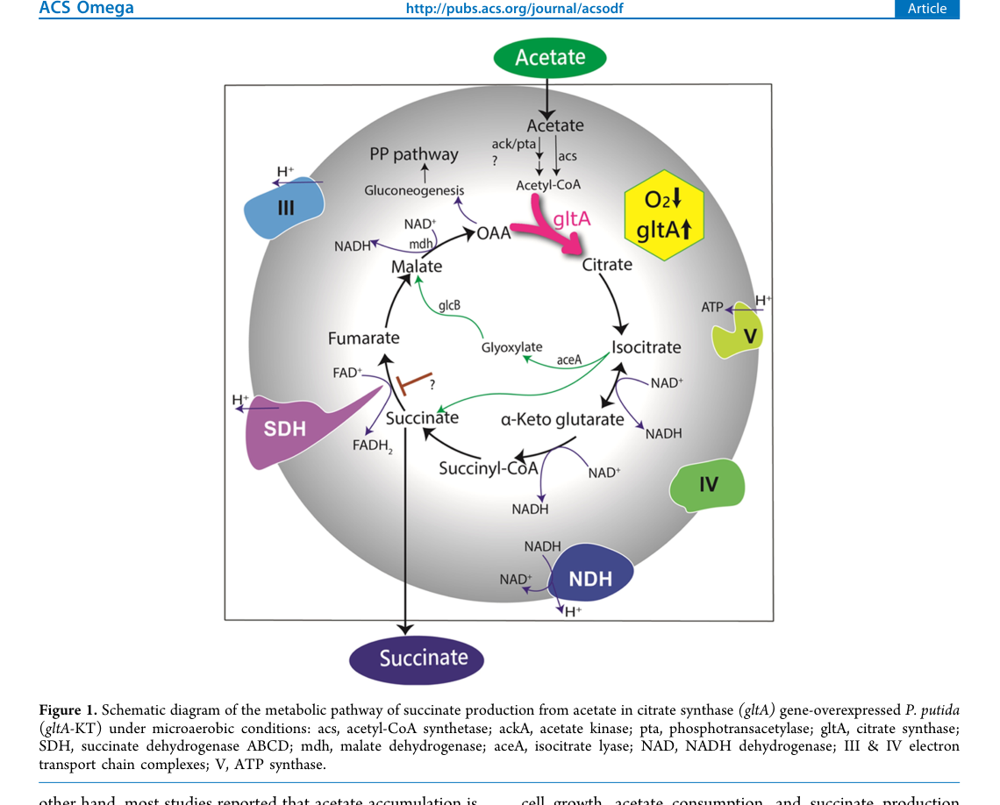
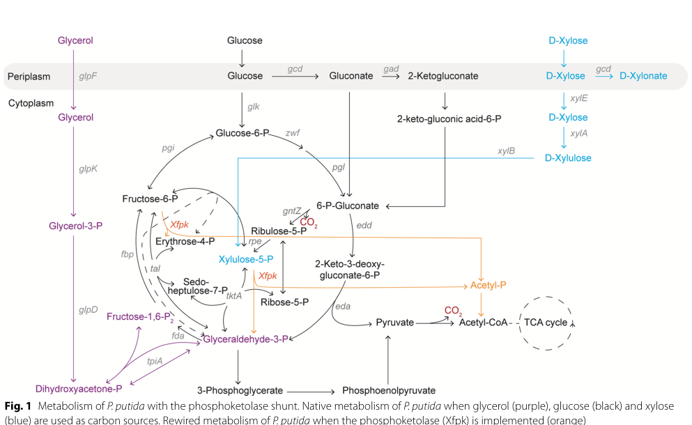

## Question

# Gene Research for Functional Annotation

## ⚠️ CRITICAL: Gene/Protein Identification Context

**BEFORE YOU BEGIN RESEARCH:** You MUST verify you are researching the CORRECT gene/protein. Gene symbols can be ambiguous, especially for less well-characterized genes from non-model organisms.

### Target Gene/Protein Identity (from UniProt):
- **UniProt Accession:** Q88PS4
- **Protein Description:** RecName: Full=Phosphate acetyltransferase; EC=2.3.1.8; AltName: Full=Phosphotransacetylase;
- **Gene Information:** Name=pta; OrderedLocusNames=PP_0774;
- **Organism (full):** Pseudomonas putida (strain ATCC 47054 / DSM 6125 / CFBP 8728 / NCIMB 11950 / KT2440).
- **Protein Family:** In the C-terminal section; belongs to the phosphate
- **Key Domains:** DRTGG. (IPR010766); P-Actrans_bac. (IPR016475); P-loop_NTPase. (IPR027417); P_AcTrfase. (IPR004614); P_AcTrfase_dom1. (IPR042113)

### MANDATORY VERIFICATION STEPS:

1. **Check if the gene symbol "pta" matches the protein description above**
2. **Verify the organism is correct:** Pseudomonas putida (strain ATCC 47054 / DSM 6125 / CFBP 8728 / NCIMB 11950 / KT2440).
3. **Check if protein family/domains align with what you find in literature**
4. **If you find literature for a DIFFERENT gene with the same or similar symbol, STOP**

### If Gene Symbol is Ambiguous or You Cannot Find Relevant Literature:

**DO NOT PROCEED WITH RESEARCH ON A DIFFERENT GENE.** Instead:
- State clearly: "The gene symbol 'pta' is ambiguous or literature is limited for this specific protein"
- Explain what you found (e.g., "Found extensive literature on a different gene with the same symbol in a different organism")
- Describe the protein based ONLY on the UniProt information provided above
- Suggest that the protein function can be inferred from domain/family information

### Research Target:

Please provide a comprehensive research report on the gene **pta** (gene ID: pta, UniProt: Q88PS4) in PSEPK.

The research report should be a detailed narrative explaining the function, biological processes, and localization of the gene product. Citations should be given for all claims.

You should prioritize authoritative reviews and primary scientific literature when conducting research. You can supplement
this with annotations you find in gene/protein databases, but these can be outdated or inaccurate.

We are specifically interested in the primary function of the gene - for enzymes, what reaction is catalyzed, and what is the substrate specificity? For transporters, what is the substrate? For structural proteins or adapters, what is the broader structural role? For signaling molecules, what is the role in the pathway.

We are interested in where in or outside the cell the gene product carries out its function.

We are also interested in the signaling or biochemical pathways in which the gene functions. We are less interested in broad pleiotropic effects, except where these elucidate the precise role.

Include evidence where possible. We are interested in both experimental evidence as well as inference from structure, evolution, or bioinformatic analysis. Precise studies should be prioritized over high-throughput, where available.

## Output

Question: You are an expert researcher providing comprehensive, well-cited information.

Provide detailed information focusing on:
1. Key concepts and definitions with current understanding
2. Recent developments and latest research (prioritize 2023-2024 sources)
3. Current applications and real-world implementations
4. Expert opinions and analysis from authoritative sources
5. Relevant statistics and data from recent studies

Format as a comprehensive research report with proper citations. Include URLs and publication dates where available.
Always prioritize recent, authoritative sources and provide specific citations for all major claims.

# Gene Research for Functional Annotation

## ⚠️ CRITICAL: Gene/Protein Identification Context

**BEFORE YOU BEGIN RESEARCH:** You MUST verify you are researching the CORRECT gene/protein. Gene symbols can be ambiguous, especially for less well-characterized genes from non-model organisms.

### Target Gene/Protein Identity (from UniProt):
- **UniProt Accession:** Q88PS4
- **Protein Description:** RecName: Full=Phosphate acetyltransferase; EC=2.3.1.8; AltName: Full=Phosphotransacetylase;
- **Gene Information:** Name=pta; OrderedLocusNames=PP_0774;
- **Organism (full):** Pseudomonas putida (strain ATCC 47054 / DSM 6125 / CFBP 8728 / NCIMB 11950 / KT2440).
- **Protein Family:** In the C-terminal section; belongs to the phosphate
- **Key Domains:** DRTGG. (IPR010766); P-Actrans_bac. (IPR016475); P-loop_NTPase. (IPR027417); P_AcTrfase. (IPR004614); P_AcTrfase_dom1. (IPR042113)

### MANDATORY VERIFICATION STEPS:

1. **Check if the gene symbol "pta" matches the protein description above**
2. **Verify the organism is correct:** Pseudomonas putida (strain ATCC 47054 / DSM 6125 / CFBP 8728 / NCIMB 11950 / KT2440).
3. **Check if protein family/domains align with what you find in literature**
4. **If you find literature for a DIFFERENT gene with the same or similar symbol, STOP**

### If Gene Symbol is Ambiguous or You Cannot Find Relevant Literature:

**DO NOT PROCEED WITH RESEARCH ON A DIFFERENT GENE.** Instead:
- State clearly: "The gene symbol 'pta' is ambiguous or literature is limited for this specific protein"
- Explain what you found (e.g., "Found extensive literature on a different gene with the same symbol in a different organism")
- Describe the protein based ONLY on the UniProt information provided above
- Suggest that the protein function can be inferred from domain/family information

### Research Target:

Please provide a comprehensive research report on the gene **pta** (gene ID: pta, UniProt: Q88PS4) in PSEPK.

The research report should be a detailed narrative explaining the function, biological processes, and localization of the gene product. Citations should be given for all claims.

You should prioritize authoritative reviews and primary scientific literature when conducting research. You can supplement
this with annotations you find in gene/protein databases, but these can be outdated or inaccurate.

We are specifically interested in the primary function of the gene - for enzymes, what reaction is catalyzed, and what is the substrate specificity? For transporters, what is the substrate? For structural proteins or adapters, what is the broader structural role? For signaling molecules, what is the role in the pathway.

We are interested in where in or outside the cell the gene product carries out its function.

We are also interested in the signaling or biochemical pathways in which the gene functions. We are less interested in broad pleiotropic effects, except where these elucidate the precise role.

Include evidence where possible. We are interested in both experimental evidence as well as inference from structure, evolution, or bioinformatic analysis. Precise studies should be prioritized over high-throughput, where available.

## Research report: Functional annotation of **pta** (UniProt **Q88PS4**; locus **PP_0774**) in *Pseudomonas putida* KT2440

### Scope and identity verification (critical disambiguation)
The target protein is **phosphate acetyltransferase / phosphotransacetylase** (**Pta**, **EC 2.3.1.8**) encoded by **pta** with ordered locus name **PP_0774** in *Pseudomonas putida* strain KT2440. This identity is directly supported by a KT2440 study that maps the **pta locus as PP0774** and experimentally measures **phosphotransacetylase activity** that is abolished by a **pta::mini-Tn5** disruption, confirming that PP_0774 encodes the functional Pta enzyme in this organism (nikel2013engineeringananaerobic pages 6-7, nikel2013engineeringananaerobic pages 7-8). Recent KT2440 metabolic-engineering papers also use the same gene symbol **pta** to denote phosphotransacetylase in acetate/acetyl-phosphate/acetyl-CoA interconversion (mutyala2023citratesynthaseoverexpression pages 1-3, bruinsma2023increasingcellularfitness pages 2-5).

### 1) Key concepts and current understanding

#### 1.1 Enzyme definition and reaction
**Phosphotransacetylase (Pta)** catalyzes the reversible transfer of an acetyl group between CoA and inorganic phosphate:

- **Acetyl-CoA + Pi ⇄ acetyl-phosphate (AcP) + CoA**

In *P. putida* KT2440, Pta is experimentally described as catalyzing phosphorylation of acetyl-CoA (generated by the native pyruvate dehydrogenase complex) to yield **acetyl-phosphate and free CoA** (nikel2013engineeringananaerobic pages 6-7). In broader bacterial acetate metabolism, the AckA–Pta pair is widely treated as a **reversible two-step route** connecting acetate and acetyl-CoA via acetyl-phosphate, contrasting with the **Acs** route (acetyl-CoA synthetase), which is typically considered **irreversible and more ATP-expensive** (kutscha2020microbialupgradingof pages 3-6).

#### 1.2 Pathway context in central metabolism
Pta sits at a key junction (“acetate node”) connecting:

- **Acetyl-CoA** (central carbon precursor feeding TCA cycle, glyoxylate shunt, biosynthesis)
- **Acetyl-phosphate** (energy-rich intermediate; also implicated in global regulation and non-enzymatic lysine acetylation in many bacteria)
- **Acetate** (overflow/fermentation end product in many organisms; also a C2 carbon source)

A 2023 *P. putida* study on acetate-to-succinate bioconversion depicts acetate assimilation to acetyl-CoA through both **ackA/pta** and **acs**, placing pta explicitly as a component of acetate assimilation into central metabolism (mutyala2023citratesynthaseoverexpression media afd2fae1).

#### 1.3 Cellular localization
No retrieved *P. putida* KT2440 study directly measured Pta subcellular localization. However, the enzyme’s role as a soluble central-metabolism catalyst acting on acetyl-CoA, acetyl-phosphate, and Pi implies a **cytosolic localization**; this inference is consistent with the experimental use of **cell-free extracts** for Pta activity quantification in KT2440 (nikel2013engineeringananaerobic pages 6-7).

### 2) Experimental evidence in *P. putida* KT2440 (most authoritative for functional annotation)

#### 2.1 Direct enzymatic activity and gene-dependence (loss-of-function)
Nikel & de Lorenzo (2013) quantified **specific Pta activity** in **cell-free extracts** of *P. putida* KT2440 grown aerobically on glucose minimal medium, and found that:

- Pta activity increased **2.2-fold** at the transition from log phase to stationary phase.
- A **pta::mini-Tn5** mutant showed **no significant detectable Pta activity**, indicating activity depends on an intact pta gene.
- Pta activity in *P. putida* was **lower** than in *E. coli* BW25113 under similar conditions; *E. coli* peaked at **12.5 ± 0.9 U mg protein⁻¹** at onset of stationary phase (nikel2013engineeringananaerobic pages 6-7).

This provides strong organism-specific evidence that PP_0774 encodes an active phosphotransacetylase.

#### 2.2 Functional coupling to acetate kinase via acetyl-phosphate (pathway complementation)
In the same KT2440 work, the authors introduced **ackA from *E. coli*** to test whether acetyl-phosphate generated by native Pta can fuel acetate kinase to generate ATP by substrate-level phosphorylation under anoxic incubation. Key data:

- Upon inducing heterologous AckA, acetate kinase activity reached **17.8 ± 1.3 U mg protein⁻¹** (nikel2013engineeringananaerobic pages 7-8).
- The strain secreted up to **12.9 ± 0.6 mM acetate**, while control supernatants remained **< 1 mM** (nikel2013engineeringananaerobic pages 7-8).
- Expressing ackA in a **pta::mini-Tn5 background** eliminated the acetate-secretion phenotype (reverted to control-like), confirming acetate production depended on acetyl-phosphate derived from the native Pta reaction (nikel2013engineeringananaerobic pages 7-8).

These results functionally validate the **acetyl-CoA → acetyl-phosphate** direction of the Pta reaction in KT2440 under the tested conditions and establish that the acetyl-phosphate pool can be tapped for energy generation if an AckA step is present.

#### 2.3 Energetic consequences under anoxic incubation (physiology)
Under 24 h anoxic incubation:

- ATP/ADP ratio in the AckA-expressing strain was **6.2 ± 0.8**, a **1.3-fold** increase vs. vector control (nikel2013engineeringananaerobic pages 7-8).
- Adenylate energy charge (AEC) decreased to **0.28 ± 0.04** in control but remained **~0.62–0.69** in the AckA-expressing strain, consistent with improved cellular energy state (nikel2013engineeringananaerobic pages 7-8).

Although this is not a direct pta knockout phenotype under all conditions, it is strong pathway-level evidence for Pta’s ability to supply acetyl-phosphate in KT2440.

### 3) Recent developments and latest research (prioritizing 2023–2024)

#### 3.1 2023: Carbon-conserving phosphoketolase shunt that relies on Pta
Bruinsma et al. (published Jan 2023) engineered *P. putida* KT2440 to express a phosphoketolase (Xfpk) that produces acetyl-phosphate from sugar phosphates. The study explicitly states that **acetyl-phosphate is converted by Pta to acetyl-CoA** in this engineered route (bruinsma2023increasingcellularfitness pages 2-5). Quantitative highlights:

- In cell-free extract assays, Xfpk variants produced **1.26** and **1.19 mM AcP/OD600** (control **0.80 mM**), while the selected **B. breve** Xfpk produced **36.25 mM AcP/OD600** (~30-fold higher) (bruinsma2023increasingcellularfitness pages 2-5).
- On glycerol, Xfpk increased specific growth rate **0.12 → 0.18 h⁻¹** (**+44.3%**) and max OD600 **4.4 → 6.6** (**+50%**) (bruinsma2023increasingcellularfitness pages 2-5).
- Acetyl-CoA-derived product yields increased: flaviolin reporter yield **+38.5%** and mevalonate yield **0.011 → 0.015 mol/mol** (**+25.9%**) (bruinsma2023increasingcellularfitness pages 2-5).
- On engineered xylose metabolism, growth rate increased **0.02 → 0.05 h⁻¹** (**+167%**) and final OD600 increased **5.73 → 7.4** (**+30.2%**) (bruinsma2023increasingcellularfitness pages 5-6).

Interpretation: while this work does not directly perturb pta, it provides modern applied evidence that **Pta-mediated conversion of acetyl-phosphate to acetyl-CoA** is an enabling step for carbon-conserving acetyl-CoA supply in *P. putida* bioproduction (bruinsma2023increasingcellularfitness pages 2-5).

#### 3.2 2023: Acetate-to-succinate conversion pathway explicitly includes ackA/pta
Mutyala et al. (received Apr 13 2023; published Jul 17 2023) studied succinate production from acetate under microaerobic conditions and presents a pathway schematic in which acetate is assimilated to acetyl-CoA via **ackA/pta** and **acs**, then routed through central metabolism toward succinate (mutyala2023citratesynthaseoverexpression media afd2fae1). Key quantitative results:

- gltA overexpression showed **~50%** improvement in succinate production.
- At pH 7.5, succinate accumulated to **4.73 ± 0.6 mM in 36 h**, reported as **~400% higher** than wild type.
- Overall yield was **9.5% of maximum theoretical yield** on acetate minimal medium (mutyala2023citratesynthaseoverexpression pages 1-3).

Interpretation: this provides recent, application-oriented evidence that the **pta node** is considered part of acetate assimilation architecture in KT2440, relevant to bio-based production from C2 feedstocks (mutyala2023citratesynthaseoverexpression media afd2fae1).

#### 3.3 2024: Systems metabolic engineering context (electrogenic anaerobic *P. putida*)
A 2024 dissertation on electrogenic anaerobic *P. putida* emphasizes that KT2440 is strictly aerobic and discusses constraints in anaerobic energy conservation, citing that *P. putida* lacks parts of classical acetate fermentation energy generation (AckA-Pta ATP-generating step) (weimer2024systemsmetabolicengineering pages 1-8). While this source did not yield extractable pta-specific quantitative outcomes in the retrieved sections, it situates Pta in broader discussions of *P. putida* energy metabolism engineering (weimer2024systemsmetabolicengineering pages 1-8).

### 4) Regulation and systems-level roles (expert synthesis from authoritative sources)

#### 4.1 Growth-phase dependence and possible acetyl-CoA overflow control
In KT2440, Pta activity was **growth-phase dependent** (2.2-fold increase into stationary phase), consistent with a role in responding to changing acetyl-CoA availability during transitions in metabolic state (nikel2013engineeringananaerobic pages 6-7). This is compatible with the idea (demonstrated extensively in other bacteria) that the acetate/acetyl-phosphate node contributes to balancing carbon flux and CoA availability.

#### 4.2 Regulatory context in Pseudomonas spp. (review-level)
A 2023 mini-review summarizing bacterial acetate metabolism reports that in some bacteria including **Pseudomonas spp.**, **ackA-pta expression** under anaerobic/fermentative growth has been linked to the global anaerobic regulator **Anr (Fnr homolog)** and **integration host factor subunit alpha (IhfA/LhfA)** (hosmer2023bacterialacetatemetabolism pages 3-5). The same review notes additional acetate-node regulation (e.g., **CrbS/R** for acetate consumption via ACS) and emphasizes that acetate metabolism can cause intracellular acidification/respiratory inhibition and influence protein acetylation through acetyl-CoA and acetyl-phosphate pools (hosmer2023bacterialacetatemetabolism pages 3-5).

Because this is not KT2440-specific experimentation, these points should be treated as **likely regulatory hypotheses** rather than confirmed KT2440 regulatory facts.

### 5) Structure/function evidence supporting conserved Pta enzymology
A 2023 structure-function study of a bacterial Pta (TP0094 from *Treponema pallidum*) reports strong conservation of substrate-contacting residues and identifies likely catalytic residues (S314, R315, D321 in TP0094 numbering), and shows the enzyme is predominantly **dimeric** in solution (brautigam2023biophysicalandbiochemical pages 9-11). While not from *P. putida*, this supports the broader interpretation that Pta proteins are conserved enzymes with a stable oligomeric state and conserved active-site chemistry (brautigam2023biophysicalandbiochemical pages 9-11).

### 6) Current applications and real-world implementations

1. **Industrial biotechnology / cell-factory engineering**: The 2023 phosphoketolase shunt work uses Pta as a key step to convert acetyl-phosphate to acetyl-CoA to improve yields of acetyl-CoA-derived products (mevalonate, malonyl-CoA-derived pigment) and growth on glycerol/xylose—feedstocks relevant to industrial fermentation (bruinsma2023increasingcellularfitness pages 2-5, bruinsma2023increasingcellularfitness pages 5-6).
2. **C2 feedstock upgrading**: The acetate-to-succinate work positions acetate as an industrially relevant feedstock and directly includes ackA/pta among assimilation routes to acetyl-CoA in KT2440 (mutyala2023citratesynthaseoverexpression pages 1-3, mutyala2023citratesynthaseoverexpression media afd2fae1).
3. **Biopolymer precursor routing (mcl-PHA)**: A consortium/metabolic engineering study reports strengthening acetate assimilation in KT2440 by overexpressing **acs** and constructing an **ackA-pta** pathway; it cites an engineered *P. putida* producing **0.674 g/L mcl-PHA from acetate**, suggesting practical use of the acetate node for product formation (qin2022reconstructionandoptimization pages 2-4).

### 7) Key statistics/data points (recent and organism-specific)
- **Pta activity in KT2440**: growth-phase dependent; **2.2-fold increase** from log to stationary; abolished in **pta::mini-Tn5** (nikel2013engineeringananaerobic pages 6-7).
- **Acetyl-phosphate-driven acetate secretion** when AckA is introduced: **12.9 ± 0.6 mM acetate** secreted; AckA activity **17.8 ± 1.3 U mg protein⁻¹**; requires intact pta (nikel2013engineeringananaerobic pages 7-8).
- **Engineered shunt AcP production**: up to **36.25 mM AcP/OD600** in cell-free extracts (bruinsma2023increasingcellularfitness pages 2-5).
- **Growth and yield improvements in 2023 P. putida engineering** (Xfpk shunt): growth rate up to **+167%** on xylose; mevalonate yield **+25.9%** on glycerol; mevalonate yield **+48.7%** on xylose (bruinsma2023increasingcellularfitness pages 2-5, bruinsma2023increasingcellularfitness pages 5-6).
- **Succinate from acetate** (2023): **4.73 ± 0.6 mM in 36 h**; **9.5%** theoretical yield; **~400%** vs WT at pH 7.5 (mutyala2023citratesynthaseoverexpression pages 1-3).

### 8) Visual evidence (figures)
- A KT2440 acetate-to-succinate pathway schematic explicitly showing acetate assimilation routes including **ackA/pta/acs** is available (mutyala2023citratesynthaseoverexpression media afd2fae1).
- A KT2440 phosphoketolase-shunt schematic depicts the engineered route producing acetyl-phosphate and its conversion toward acetyl-CoA (attributed to Pta in the text), along with an acetyl-phosphate quantification assay figure (bruinsma2023increasingcellularfitness media cac9d612, bruinsma2023increasingcellularfitness media 64ac7a49).

### 9) Limitations and gaps specific to this retrieval
- No direct UniProt/InterPro record text for Q88PS4 was retrieved through the tools in this run; therefore, domain-level claims (e.g., exact InterPro accessions) are not re-cited here from primary database evidence.
- No KT2440-specific, 2023–2024 primary study was retrieved that reports a direct **pta deletion/overexpression phenotype under standard aerobic conditions** beyond the 2013 work; more recent work tends to treat pta as part of pathway schematics or as an enabling step in engineered routes.

### Evidence summary table
| Evidence type | Claim (reaction/pathway/localization/regulation) | Key quantitative data | Organism/strain context | Source and URL |
|---|---|---|---|---|
| Biochemical + genetic | **PP_0774/pta encodes active phosphotransacetylase (Pta)** in *P. putida* KT2440; locus organization shown as **PP0773–PP0774(pta)–PP0775**. Pta catalyzes **acetyl-CoA + Pi ⇄ acetyl-phosphate + CoA**, with native activity detected in oxic glucose-grown cells and lost in a **pta::mini-Tn5** mutant; activity increases at transition to stationary phase, supporting a role in acetyl-CoA/acetyl-phosphate metabolism rather than a misassigned gene. No localization experiment was reported; function is consistent with a **cytosolic metabolic enzyme**. | Pta activity increased **2.2-fold** from log to stationary phase; **no significant activity** in **pta::mini-Tn5** mutant; *E. coli* comparator peaked at **12.5 ± 0.9 U mg protein⁻¹**. In oxic glucose minimal medium, **Δpta (E. coli)** comparator showed **2.3-fold lower specific growth rate** and **1.6-fold lower final biomass** than parent. (nikel2013engineeringananaerobic pages 6-7) | *Pseudomonas putida* KT2440; mini-Tn5 mutant derivative; glucose-grown cells in M9 minimal medium. | Nikel & de Lorenzo 2013, *Metabolic Engineering*. https://doi.org/10.1016/j.ymben.2012.09.006 (nikel2013engineeringananaerobic pages 6-7) |
| Biochemical + engineering | Native **Pta-generated acetyl-phosphate** in *P. putida* can feed heterologous **AckA** to produce **acetate + ATP** by substrate-level phosphorylation under anoxic conditions, functionally confirming the **Pta → acetyl-P** step in KT2440. This places Pta in the **AckA-Pta acetate node** linking pyruvate dehydrogenase-derived acetyl-CoA to acetyl-phosphate. | Upon **ackA** expression from *E. coli*, acetate kinase activity reached **17.8 ± 1.3 U mg protein⁻¹**; acetate secretion reached **12.9 ± 0.6 mM** vs **<1 mM** in vector control; in **pta::mini-Tn5** background, acetate secretion reverted to control-like levels. ATP/ADP ratio after 24 h anoxia was **6.2 ± 0.8**, a **1.3-fold** increase over control. AEC under anoxia fell to **0.28 ± 0.04** in control but remained **~0.62–0.69** with heterologous AckA. (nikel2013engineeringananaerobic pages 6-7, nikel2013engineeringananaerobic pages 7-8) | *P. putida* KT2440 carrying **Ptrc::ackA** from *E. coli* MG1655; compared with **pta::mini-Tn5** derivative under anoxic incubation. | Nikel & de Lorenzo 2013, *Metabolic Engineering*. https://doi.org/10.1016/j.ymben.2012.09.006 (nikel2013engineeringananaerobic pages 6-7, nikel2013engineeringananaerobic pages 7-8) |
| Engineering | In an engineered **phosphoketolase (Xfpk) shunt**, **Pta converts acetyl-phosphate to acetyl-CoA** in *P. putida*, bypassing pyruvate decarboxylation/carboxylation-associated carbon loss and improving carbon conservation into biomass and acetyl-CoA-derived products. | Xfpk candidates generated **1.26**, **1.19**, and **36.25 mM AcP/OD600** (empty-vector control **0.80 mM**); best enzyme was ~**30-fold** higher than weaker candidates. On glycerol, Xfpk increased growth rate **0.12 → 0.18 h⁻¹** (**+44.3%**) and max OD600 **4.4 → 6.6** (**+50%**). Product yields increased: flaviolin reporter **0.002 → 0.003** (**+38.5%**) and mevalonate **0.011 → 0.015 mol/mol** (**+25.9%**). On xylose, growth rate **0.02 → 0.05 h⁻¹** (**+167%**), final OD600 **5.73 → 7.4** (**+30.2%**), flaviolin **+49.4%**, mevalonate **0.022 → 0.042 mol/mol** (**+48.7%**). (bruinsma2023increasingcellularfitness pages 2-5, bruinsma2023increasingcellularfitness pages 5-6) | *P. putida* KT2440-derived strains (**ΔglpR**, **Δgcd-xylABE**) expressing heterologous **xfpk**. | Bruinsma et al. 2023, *Microbial Cell Factories*. https://doi.org/10.1186/s12934-022-02015-9 (bruinsma2023increasingcellularfitness pages 2-5, bruinsma2023increasingcellularfitness pages 5-6) |
| Pathway/physiology + application | Succinate-from-acetate work places **pta** with **ackA** and **acs** as entry routes from acetate to acetyl-CoA/TCA-glyoxylate metabolism in *P. putida*. This supports functional annotation of Pta in **acetate assimilation/acetyl-CoA supply**, even though this study did not directly manipulate **pta**. | **gltA** overexpression gave **~50%** improvement in succinate production; at pH 7.5, succinate reached **4.73 ± 0.6 mM in 36 h**, about **~400%** of wild type; yield was **9.5% of maximum theoretical** on acetate minimal medium. Figure 1 explicitly depicts **ackA/pta/acs** feeding acetyl-CoA from acetate. (mutyala2023citratesynthaseoverexpression pages 1-3, mutyala2023citratesynthaseoverexpression media afd2fae1) | *P. putida* KT2440 and **gltA-overexpressing** derivative under microaerobic growth on acetate as sole carbon source. | Mutyala et al. 2023, *ACS Omega*. https://doi.org/10.1021/acsomega.3c02520 (mutyala2023citratesynthaseoverexpression pages 1-3, mutyala2023citratesynthaseoverexpression media afd2fae1) |
| Engineering/application | For acetate-based **mcl-PHA** production, *P. putida* KT2440 was engineered by strengthening acetate assimilation via **acs overexpression** and constructing an **ackA-pta** pathway, indicating practical exploitation of the Pta node to channel acetate/acetyl-phosphate toward acetyl-CoA and product formation. | Engineered *P. putida* produced **0.674 g/L mcl-PHA from acetate**; later consortium optimization reported **1.32 g/L** maximum mcl-PHA from mixed glucose/xylose after further pathway engineering. The study explicitly states that in 2019 they strengthened acetate assimilation by overexpressing **acs** and constructing the **ackA-pta** pathway. (qin2022reconstructionandoptimization pages 2-4) | *P. putida* KT2440 in monoculture and in a designed *P. putida–E. coli* consortium for lignocellulose conversion. | Qin et al. 2022, *Frontiers in Bioengineering and Biotechnology*. https://doi.org/10.3389/fbioe.2022.1023325 (qin2022reconstructionandoptimization pages 2-4) |
| Review/regulation | In **Pseudomonas spp.**, **ackA-pta** expression is linked to anaerobic/fermentative regulation by **Anr** (Fnr homolog) and **IHF/LhfA**; acetate consumption is additionally controlled by **CrbS/R** through **Acs**, while **CidR** regulates acetate production via pyruvate:menaquinone oxidoreductase. This frames likely regulatory context for KT2440 Pta, but is not a KT2440-specific direct experiment. | No direct KT2440 enzyme kinetics given; review emphasizes that acetate metabolism can impair growth via intracellular acidification/respiratory inhibition and that **Ac-CoA/acetyl-phosphate** can alter **non-enzymatic protein acetylation**. (hosmer2023bacterialacetatemetabolism pages 3-5) | Review of bacteria including *Pseudomonas* spp.; regulatory context relevant to *P. putida* but not a direct KT2440 perturbation study. | Hosmer et al. 2023, *Emerging Topics in Life Sciences*. https://doi.org/10.1042/ETLS20220092 (hosmer2023bacterialacetatemetabolism pages 3-5) |

*Table: This table compiles organism-specific and closely relevant pathway evidence supporting functional annotation of *Pseudomonas putida* KT2440 pta (UniProt Q88PS4; PP_0774). It emphasizes direct biochemical/genetic support from Nikel & de Lorenzo and recent engineering studies that place Pta in acetyl-phosphate/acetyl-CoA metabolism.*

References

1. (nikel2013engineeringananaerobic pages 6-7): Pablo I. Nikel and Víctor de Lorenzo. Engineering an anaerobic metabolic regime in pseudomonas putida kt2440 for the anoxic biodegradation of 1,3-dichloroprop-1-ene. Metabolic Engineering, 15:98-112, Jan 2013. URL: https://doi.org/10.1016/j.ymben.2012.09.006, doi:10.1016/j.ymben.2012.09.006. This article has 134 citations and is from a domain leading peer-reviewed journal.

2. (nikel2013engineeringananaerobic pages 7-8): Pablo I. Nikel and Víctor de Lorenzo. Engineering an anaerobic metabolic regime in pseudomonas putida kt2440 for the anoxic biodegradation of 1,3-dichloroprop-1-ene. Metabolic Engineering, 15:98-112, Jan 2013. URL: https://doi.org/10.1016/j.ymben.2012.09.006, doi:10.1016/j.ymben.2012.09.006. This article has 134 citations and is from a domain leading peer-reviewed journal.

3. (mutyala2023citratesynthaseoverexpression pages 1-3): Sakuntala Mutyala, Shuwei Li, Himanshu Khandelwal, Da Seul Kong, and Jung Rae Kim. Citrate synthase overexpression of <i>pseudomonas putida</i> increases succinate production from acetate in microaerobic cultivation. ACS Omega, 8:26231-26242, Jul 2023. URL: https://doi.org/10.1021/acsomega.3c02520, doi:10.1021/acsomega.3c02520. This article has 13 citations and is from a peer-reviewed journal.

4. (bruinsma2023increasingcellularfitness pages 2-5): Lyon Bruinsma, Maria Martin-Pascual, Kesi Kurnia, Marieken Tack, Simon Hendriks, Richard van Kranenburg, and Vitor A. P. Martins dos Santos. Increasing cellular fitness and product yields in pseudomonas putida through an engineered phosphoketolase shunt. Microbial Cell Factories, Jan 2023. URL: https://doi.org/10.1186/s12934-022-02015-9, doi:10.1186/s12934-022-02015-9. This article has 15 citations and is from a peer-reviewed journal.

5. (kutscha2020microbialupgradingof pages 3-6): Regina Kutscha and Stefan Pflügl. Microbial upgrading of acetate into value-added products—examining microbial diversity, bioenergetic constraints and metabolic engineering approaches. International Journal of Molecular Sciences, 21:8777, Nov 2020. URL: https://doi.org/10.3390/ijms21228777, doi:10.3390/ijms21228777. This article has 68 citations.

6. (mutyala2023citratesynthaseoverexpression media afd2fae1): Sakuntala Mutyala, Shuwei Li, Himanshu Khandelwal, Da Seul Kong, and Jung Rae Kim. Citrate synthase overexpression of <i>pseudomonas putida</i> increases succinate production from acetate in microaerobic cultivation. ACS Omega, 8:26231-26242, Jul 2023. URL: https://doi.org/10.1021/acsomega.3c02520, doi:10.1021/acsomega.3c02520. This article has 13 citations and is from a peer-reviewed journal.

7. (bruinsma2023increasingcellularfitness pages 5-6): Lyon Bruinsma, Maria Martin-Pascual, Kesi Kurnia, Marieken Tack, Simon Hendriks, Richard van Kranenburg, and Vitor A. P. Martins dos Santos. Increasing cellular fitness and product yields in pseudomonas putida through an engineered phosphoketolase shunt. Microbial Cell Factories, Jan 2023. URL: https://doi.org/10.1186/s12934-022-02015-9, doi:10.1186/s12934-022-02015-9. This article has 15 citations and is from a peer-reviewed journal.

8. (weimer2024systemsmetabolicengineering pages 1-8): ALA Weimer. Systems metabolic engineering of electrogenic anaerobic pseudomonas putida for enhanced 2-ketogluconate production. Unknown journal, 2024.

9. (hosmer2023bacterialacetatemetabolism pages 3-5): Jennifer Hosmer, A. McEwan, and U. Kappler. Bacterial acetate metabolism and its influence on human epithelia. Emerging Topics in Life Sciences, 8:1-13, Mar 2023. URL: https://doi.org/10.1042/etls20220092, doi:10.1042/etls20220092. This article has 107 citations.

10. (brautigam2023biophysicalandbiochemical pages 9-11): Chad A. Brautigam, Ranjit K. Deka, Shih-Chia Tso, Wei Z. Liu, and Michael V. Norgard. Biophysical and biochemical studies support tp0094 as a phosphotransacetylase in an acetogenic energy-conservation pathway in treponema pallidum. PLOS ONE, 18:e0283952, May 2023. URL: https://doi.org/10.1371/journal.pone.0283952, doi:10.1371/journal.pone.0283952. This article has 3 citations and is from a peer-reviewed journal.

11. (qin2022reconstructionandoptimization pages 2-4): Ruolin Qin, Yinzhuang Zhu, Mingmei Ai, and Xiaoqiang Jia. Reconstruction and optimization of a pseudomonas putida-escherichia coli microbial consortium for mcl-pha production from lignocellulosic biomass. Frontiers in Bioengineering and Biotechnology, Oct 2022. URL: https://doi.org/10.3389/fbioe.2022.1023325, doi:10.3389/fbioe.2022.1023325. This article has 28 citations.

12. (bruinsma2023increasingcellularfitness media cac9d612): Lyon Bruinsma, Maria Martin-Pascual, Kesi Kurnia, Marieken Tack, Simon Hendriks, Richard van Kranenburg, and Vitor A. P. Martins dos Santos. Increasing cellular fitness and product yields in pseudomonas putida through an engineered phosphoketolase shunt. Microbial Cell Factories, Jan 2023. URL: https://doi.org/10.1186/s12934-022-02015-9, doi:10.1186/s12934-022-02015-9. This article has 15 citations and is from a peer-reviewed journal.

13. (bruinsma2023increasingcellularfitness media 64ac7a49): Lyon Bruinsma, Maria Martin-Pascual, Kesi Kurnia, Marieken Tack, Simon Hendriks, Richard van Kranenburg, and Vitor A. P. Martins dos Santos. Increasing cellular fitness and product yields in pseudomonas putida through an engineered phosphoketolase shunt. Microbial Cell Factories, Jan 2023. URL: https://doi.org/10.1186/s12934-022-02015-9, doi:10.1186/s12934-022-02015-9. This article has 15 citations and is from a peer-reviewed journal.

## Artifacts

- [Edison artifact artifact-00](pta-deep-research-falcon_artifacts/artifact-00.md)

## Citations

1. nikel2013engineeringananaerobic pages 6-7
2. kutscha2020microbialupgradingof pages 3-6
3. nikel2013engineeringananaerobic pages 7-8
4. bruinsma2023increasingcellularfitness pages 2-5
5. bruinsma2023increasingcellularfitness pages 5-6
6. mutyala2023citratesynthaseoverexpression pages 1-3
7. weimer2024systemsmetabolicengineering pages 1-8
8. hosmer2023bacterialacetatemetabolism pages 3-5
9. brautigam2023biophysicalandbiochemical pages 9-11
10. qin2022reconstructionandoptimization pages 2-4
11. https://doi.org/10.1016/j.ymben.2012.09.006
12. https://doi.org/10.1186/s12934-022-02015-9
13. https://doi.org/10.1021/acsomega.3c02520
14. https://doi.org/10.3389/fbioe.2022.1023325
15. https://doi.org/10.1042/ETLS20220092
16. https://doi.org/10.1016/j.ymben.2012.09.006,
17. https://doi.org/10.1021/acsomega.3c02520,
18. https://doi.org/10.1186/s12934-022-02015-9,
19. https://doi.org/10.3390/ijms21228777,
20. https://doi.org/10.1042/etls20220092,
21. https://doi.org/10.1371/journal.pone.0283952,
22. https://doi.org/10.3389/fbioe.2022.1023325,