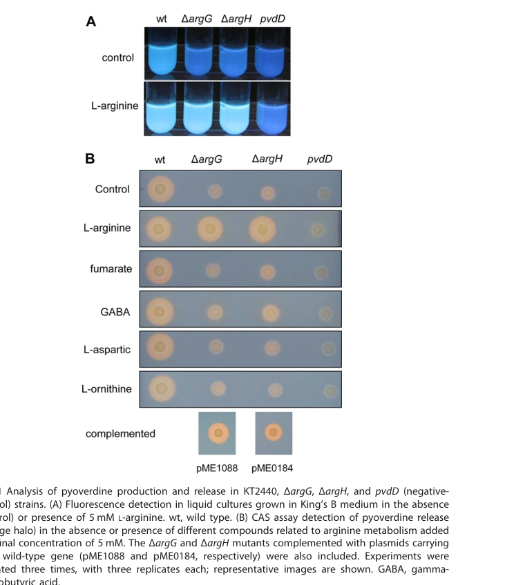

## Question

# Gene Research for Functional Annotation

## ⚠️ CRITICAL: Gene/Protein Identification Context

**BEFORE YOU BEGIN RESEARCH:** You MUST verify you are researching the CORRECT gene/protein. Gene symbols can be ambiguous, especially for less well-characterized genes from non-model organisms.

### Target Gene/Protein Identity (from UniProt):
- **UniProt Accession:** Q88GC8
- **Protein Description:** SubName: Full=L-ornithine 5-monooxygenase {ECO:0000313|EMBL:AAN69390.1}; EC=1.13.12.- {ECO:0000313|EMBL:AAN69390.1};
- **Gene Information:** Name=pvdA {ECO:0000313|EMBL:AAN69390.1}; OrderedLocusNames=PP_3796 {ECO:0000313|EMBL:AAN69390.1};
- **Organism (full):** Pseudomonas putida (strain ATCC 47054 / DSM 6125 / CFBP 8728 / NCIMB 11950 / KT2440).
- **Protein Family:** Belongs to the lysine N(6)-hydroxylase/L-ornithine N(5)-
- **Key Domains:** FAD/NAD-bd_sf. (IPR036188); Lys/Orn_oxygenase. (IPR025700); Lys_Orn_oxgnase (PF13434)

### MANDATORY VERIFICATION STEPS:

1. **Check if the gene symbol "pvdA" matches the protein description above**
2. **Verify the organism is correct:** Pseudomonas putida (strain ATCC 47054 / DSM 6125 / CFBP 8728 / NCIMB 11950 / KT2440).
3. **Check if protein family/domains align with what you find in literature**
4. **If you find literature for a DIFFERENT gene with the same or similar symbol, STOP**

### If Gene Symbol is Ambiguous or You Cannot Find Relevant Literature:

**DO NOT PROCEED WITH RESEARCH ON A DIFFERENT GENE.** Instead:
- State clearly: "The gene symbol 'pvdA' is ambiguous or literature is limited for this specific protein"
- Explain what you found (e.g., "Found extensive literature on a different gene with the same symbol in a different organism")
- Describe the protein based ONLY on the UniProt information provided above
- Suggest that the protein function can be inferred from domain/family information

### Research Target:

Please provide a comprehensive research report on the gene **pvdA** (gene ID: pvdA, UniProt: Q88GC8) in PSEPK.

The research report should be a detailed narrative explaining the function, biological processes, and localization of the gene product. Citations should be given for all claims.

You should prioritize authoritative reviews and primary scientific literature when conducting research. You can supplement
this with annotations you find in gene/protein databases, but these can be outdated or inaccurate.

We are specifically interested in the primary function of the gene - for enzymes, what reaction is catalyzed, and what is the substrate specificity? For transporters, what is the substrate? For structural proteins or adapters, what is the broader structural role? For signaling molecules, what is the role in the pathway.

We are interested in where in or outside the cell the gene product carries out its function.

We are also interested in the signaling or biochemical pathways in which the gene functions. We are less interested in broad pleiotropic effects, except where these elucidate the precise role.

Include evidence where possible. We are interested in both experimental evidence as well as inference from structure, evolution, or bioinformatic analysis. Precise studies should be prioritized over high-throughput, where available.

## Output

Question: You are an expert researcher providing comprehensive, well-cited information.

Provide detailed information focusing on:
1. Key concepts and definitions with current understanding
2. Recent developments and latest research (prioritize 2023-2024 sources)
3. Current applications and real-world implementations
4. Expert opinions and analysis from authoritative sources
5. Relevant statistics and data from recent studies

Format as a comprehensive research report with proper citations. Include URLs and publication dates where available.
Always prioritize recent, authoritative sources and provide specific citations for all major claims.

# Gene Research for Functional Annotation

## ⚠️ CRITICAL: Gene/Protein Identification Context

**BEFORE YOU BEGIN RESEARCH:** You MUST verify you are researching the CORRECT gene/protein. Gene symbols can be ambiguous, especially for less well-characterized genes from non-model organisms.

### Target Gene/Protein Identity (from UniProt):
- **UniProt Accession:** Q88GC8
- **Protein Description:** SubName: Full=L-ornithine 5-monooxygenase {ECO:0000313|EMBL:AAN69390.1}; EC=1.13.12.- {ECO:0000313|EMBL:AAN69390.1};
- **Gene Information:** Name=pvdA {ECO:0000313|EMBL:AAN69390.1}; OrderedLocusNames=PP_3796 {ECO:0000313|EMBL:AAN69390.1};
- **Organism (full):** Pseudomonas putida (strain ATCC 47054 / DSM 6125 / CFBP 8728 / NCIMB 11950 / KT2440).
- **Protein Family:** Belongs to the lysine N(6)-hydroxylase/L-ornithine N(5)-
- **Key Domains:** FAD/NAD-bd_sf. (IPR036188); Lys/Orn_oxygenase. (IPR025700); Lys_Orn_oxgnase (PF13434)

### MANDATORY VERIFICATION STEPS:

1. **Check if the gene symbol "pvdA" matches the protein description above**
2. **Verify the organism is correct:** Pseudomonas putida (strain ATCC 47054 / DSM 6125 / CFBP 8728 / NCIMB 11950 / KT2440).
3. **Check if protein family/domains align with what you find in literature**
4. **If you find literature for a DIFFERENT gene with the same or similar symbol, STOP**

### If Gene Symbol is Ambiguous or You Cannot Find Relevant Literature:

**DO NOT PROCEED WITH RESEARCH ON A DIFFERENT GENE.** Instead:
- State clearly: "The gene symbol 'pvdA' is ambiguous or literature is limited for this specific protein"
- Explain what you found (e.g., "Found extensive literature on a different gene with the same symbol in a different organism")
- Describe the protein based ONLY on the UniProt information provided above
- Suggest that the protein function can be inferred from domain/family information

### Research Target:

Please provide a comprehensive research report on the gene **pvdA** (gene ID: pvdA, UniProt: Q88GC8) in PSEPK.

The research report should be a detailed narrative explaining the function, biological processes, and localization of the gene product. Citations should be given for all claims.

You should prioritize authoritative reviews and primary scientific literature when conducting research. You can supplement
this with annotations you find in gene/protein databases, but these can be outdated or inaccurate.

We are specifically interested in the primary function of the gene - for enzymes, what reaction is catalyzed, and what is the substrate specificity? For transporters, what is the substrate? For structural proteins or adapters, what is the broader structural role? For signaling molecules, what is the role in the pathway.

We are interested in where in or outside the cell the gene product carries out its function.

We are also interested in the signaling or biochemical pathways in which the gene functions. We are less interested in broad pleiotropic effects, except where these elucidate the precise role.

Include evidence where possible. We are interested in both experimental evidence as well as inference from structure, evolution, or bioinformatic analysis. Precise studies should be prioritized over high-throughput, where available.

## Research report: functional annotation of **pvdA** (UniProt **Q88GC8**, locus **PP_3796**) in *Pseudomonas putida* KT2440

### 1) Target identity verification and definitions
**Target verified.** The UniProt accession **Q88GC8** corresponds to **pvdA / PP_3796** from *Pseudomonas putida* strain KT2440 and is functionally described as an **L-ornithine N5-monooxygenase (ornithine hydroxylase)**, consistent with the pyoverdine (PVD) biosynthesis gene naming used across fluorescent pseudomonads. In the pyoverdine literature, **pvdA** is consistently used for the enzyme that produces **N5-hydroxyornithine**, a hydroxamate precursor required for the pyoverdine peptide backbone. (dell’anno2022novelinsightson pages 8-9, rice2010characterizationofan pages 24-27, barrientosmoreno2019argininebiosynthesismodulates pages 8-10)

**Key terms.**
- **Pyoverdine (PVD):** a high-affinity siderophore produced by many *Pseudomonas* spp. to chelate Fe(III) under iron limitation; pyoverdines are nonribosomal peptides with a conserved chromophore and strain-specific peptide backbone. (dell’anno2022novelinsightson pages 4-8)
- **N-hydroxylating monooxygenase (NMO):** a **flavin-dependent** enzyme subclass that hydroxylates amine nitrogens (here, L-ornithine N5), often in siderophore biosynthesis. (chocklett2009biochemicalcharacterizationof pages 20-25, rice2010characterizationofan pages 37-42)

### 2) Primary biochemical function: reaction, substrate specificity, and mechanism
#### 2.1 Catalyzed reaction and substrate
**pvdA encodes the enzyme catalyzing the N5-hydroxylation of L-ornithine** to produce **N5-hydroxyornithine**, which is subsequently **formylated by PvdF** to yield **N5-formyl-N5-hydroxyornithine (L-fOHOrn)**. This modified amino acid is incorporated by NRPS enzymes into the pyoverdine peptide backbone, contributing hydroxamate ligands used for iron binding. (schalk2025bacterialsiderophoresdiversity pages 4-7, dell’anno2022novelinsightson pages 8-9, rice2010characterizationofan pages 24-27)

#### 2.2 Cofactors and catalytic cycle (current understanding)
PvdA belongs to the **flavin-dependent N-hydroxylating monooxygenase / Class B flavin monooxygenase** family. Mechanistic work on this enzyme family indicates:
- dependence on **FAD** as a flavin cofactor and **molecular oxygen** as the oxygen donor, proceeding through **C4a-peroxy/hydroperoxyflavin** intermediates that effect oxygen transfer to the substrate amine; (chocklett2009biochemicalcharacterizationof pages 20-25, rice2010characterizationofan pages 37-42)
- use of a reducing cofactor (typically **NADPH**) to reduce FAD during the reductive half reaction, consistent with Class B monooxygenase behavior; (rice2010characterizationofan pages 37-42)
- bacterial PvdA-family enzymes can be partially flavin-deficient after purification, with activity restored by adding **exogenous FAD** in assays (a practical point for biochemical reconstitution). (chocklett2009biochemicalcharacterizationof pages 20-25)

A kinetic/mechanistic observation for **PvdA** highlighted in recent syntheses is that **substrate binding triggers O2 addition but not flavin reduction**, consistent with gating of the oxidative half-reaction by L-ornithine binding (mechanistic specialization among NMOs). (manko2024pvdlorchestratesthe pages 13-14, schalk2025bacterialsiderophoresdiversity pages 23-27)

**Evidence limitations for the exact KT2440 protein.** In the retrieved corpus, **direct kinetic constants (kcat, KM) for *P. putida* KT2440 PvdA (Q88GC8)** were not found; mechanistic inferences rely chiefly on biochemical characterization of close homologs (notably *P. aeruginosa* PvdA) and broader NMO family evidence. (chocklett2009biochemicalcharacterizationof pages 20-25, schalk2025bacterialsiderophoresdiversity pages 23-27, rice2010characterizationofan pages 37-42)

### 3) Pathway placement, cellular localization, and cellular context
#### 3.1 Pathway role in pyoverdine biosynthesis
Pyoverdine biosynthesis initiates in the **cytoplasm** with assembly of a precursor (often described in the literature as ferribactin-like intermediates) by large **nonribosomal peptide synthetases (NRPSs)** together with accessory tailoring enzymes; later steps include **periplasmic maturation** and secretion. Within this framework, PvdA supplies a specialized building block needed for NRPS assembly. (manko2024pvdlorchestratesthe pages 1-2, dell’anno2022novelinsightson pages 8-9, dell’anno2022novelinsightson pages 9-11)

#### 3.2 Spatial organization and multi-enzyme complexes (“siderosomes”)
A major recent conceptual development is the view that pyoverdine biosynthesis enzymes are organized in **multi-enzyme assemblies**. In *P. aeruginosa* (the best-studied system), in-cell interaction and microscopy approaches support that:
- **PvdA physically interacts with all four pyoverdine NRPSs**; and
- components can associate with **membrane-linked supramolecular biosynthetic machineries** (“siderosomes”), although complete in vitro reconstitution/isolation remains challenging. (manko2024pvdlorchestratesthe pages 1-2, schalk2025bacterialsiderophoresdiversity pages 4-7)

These spatial/organizational findings are important for functional annotation because they imply PvdA acts not as a freely diffusing enzyme only, but as a participant in a coordinated biosynthetic system with metabolite channeling or spatial coupling to downstream steps. (schalk2025bacterialsiderophoresdiversity pages 4-7, manko2024pvdlorchestratesthe pages 1-2)

### 4) Regulation in *P. putida* KT2440 and physiological roles
#### 4.1 Iron limitation as the dominant signal
The pyoverdine system is fundamentally an **iron starvation response**, often governed by **Fur-mediated control** and iron-responsive sigma-factor networks in pseudomonads (reviewed broadly for the pvd regulon). (rice2010characterizationofan pages 24-27)

#### 4.2 pvdA expression and pyoverdine homeostasis links to oxidative stress (KT2440 evidence)
In *P. putida* KT2440, genetic perturbations in arginine biosynthesis (ΔargG, ΔargH) demonstrated that pyoverdine production/secretion can be decoupled from structural gene transcription:
- **pvdA** and **pvdD** expression increased in these mutants, while **pvdE** (an inner-membrane transporter needed for immature pyoverdine handling) decreased, consistent with impaired maturation/export rather than simple failure to induce biosynthesis; (barrientosmoreno2019argininebiosynthesismodulates pages 8-10)
- figure-level evidence shows these transcriptional trends (qRT-PCR) and accompanying phenotypes, including altered pyoverdine distribution. (barrientosmoreno2019argininebiosynthesismodulates media 53ef4128)

These mutants showed **reduced extracellular pyoverdine with intracellular retention** and increased oxidative stress (CellROX readout), supporting a model in which iron capture, intracellular siderophore handling, and oxidative stress defenses are functionally intertwined. (barrientosmoreno2019argininebiosynthesismodulates pages 8-10, barrientosmoreno2019argininebiosynthesismodulates media 79b5b256, barrientosmoreno2019argininebiosynthesismodulates media 12115201)

### 5) Real-world implementation: secretion systems and quantitative phenotypes (2023 KT2440 study)
A key KT2440-specific, recent implementation-level insight is that pyoverdine-mediated iron acquisition depends on a **network of overlapping tripartite efflux systems**.

**Core secretion systems and ParXY as an additional contributor (Stein et al., 2023-12; Microbiology Spectrum).** Pyoverdine in *P. putida* KT2440 is secreted primarily via **PvdRT–OpmQ** and **MdtABC–OpmB**, and Stein et al. showed the **RND efflux system ParXY** affects siderophore secretion and growth under iron limitation. (stein2023therndefflux pages 1-2, stein2023therndefflux pages 10-13)

**Quantitative data from Stein et al. 2023 (selected):**
- Under strong iron limitation, adding **parX deletion** to the double-secretion mutant background (ΔpvdRT-opmQ ΔmdtA; “Δpm”) produced a major additional growth defect: **AUC of ΔpmΔparX ≈ 40% of Δpm**, while a pyoverdine non-producer was ~**2%** of Δpm (indicating pyoverdine-dependent growth is severely compromised). (stein2023therndefflux pages 2-5)
- Rescue experiments supported iron-specific causality: **1 µM FeCl3** restored growth of ΔpmΔparX to Δpm levels, and **10 µM pyoverdine** gave the best rescue; **1 µM CuSO4** did not rescue. (stein2023therndefflux pages 8-10)
- Regulatory readouts: a **parXY promoter-lux fusion** showed iron responsiveness—**10 µM FeCl3 reduced luminescence ~7-fold**, while **1 mM bipyridyl increased luminescence ~2-fold**, indicating induction under iron limitation. (stein2023therndefflux pages 8-10)
- Deletion of parX caused approximately **twofold reduced expression** of both **mdtABC-opmB** and **pvdL** (a pyoverdine NRPS gene), consistent with coupling between efflux capacity and biosynthetic program. (stein2023therndefflux pages 10-13)

These data demonstrate that even though **pvdA** is a biosynthetic gene, its pathway output (pyoverdine availability for iron uptake) is strongly shaped by **export/recycling capacity**, which in turn impacts growth under iron scarcity—a key ecological and applied phenotype for KT2440 as an environmental bacterium. (stein2023therndefflux pages 2-5, stein2023therndefflux pages 8-10)

### 6) Recent developments (prioritizing 2023–2024)
#### 6.1 2024: supramolecular organization of the pyoverdine NRPS machinery
Single-molecule microscopy and interaction-focused approaches described in 2024 work on *P. aeruginosa* reinforce the emerging model of **organized biosynthetic machineries** and place PvdA among enzymes that interact with NRPSs in vivo. While not KT2440-specific, these studies are influential for the “current understanding” of how PvdA functions in cells beyond its catalytic activity. (manko2024pvdlorchestratesthe pages 1-2)

#### 6.2 2024: signaling-to-siderophore transcriptional control (conservation across Pseudomonas)
A 2024 study identified a two-component system (**BfmRS**) in *P. aeruginosa* that regulates siderophore gene clusters under osmotic stress and reported conservation and promoter binding by BfmR homologs from *Pseudomonas* species including *P. putida* KT2440, suggesting a conserved regulatory logic linking environmental stress to siderophore gene expression (including pvd clusters). ()

#### 6.3 2023: secretion systems as a network (KT2440)
The 2023 KT2440 work emphasizes “overlapping activities” and partial functional redundancy among tripartite efflux systems for siderophore secretion—an important practical constraint when attempting to inhibit secretion (e.g., antimicrobial adjuvants) or engineer pyoverdine flux in biotechnology. (stein2023therndefflux pages 1-2, stein2023therndefflux pages 10-13)

### 7) Applications and expert synthesis
Recent reviews highlight pyoverdines as multifunctional molecules beyond iron uptake, with relevance to biofilms, microbial interactions, and biotechnology. (schalk2025bacterialsiderophoresdiversity pages 23-27, dell’anno2022novelinsightson pages 8-9)

**Biotechnological and translational relevance of the pvdA step.** Because PvdA contributes to generating hydroxamate-containing residues critical for metal binding, it is a plausible control point for:
- **metabolic/synthetic biology engineering** of siderophore pathways (tuning iron acquisition, metal-binding specificity, or production yields); and
- **anti-virulence strategies** in pathogenic pseudomonads by blocking siderophore biosynthesis (PvdA-family NMOs are commonly cited as key enzymes in this logic). (schalk2025bacterialsiderophoresdiversity pages 23-27, chocklett2009biochemicalcharacterizationof pages 20-25, rice2010characterizationofan pages 24-27)

**Expert perspective on system-level constraints.** Authoritative synthesis emphasizes that siderophore function in vivo depends on not only biosynthesis but also membrane trafficking, periplasmic maturation, and secretion/recycling systems; thus, interpreting “pvdA function” in real-world settings (soil, host-associated environments, engineered bioprocesses) requires integrating catalysis with **cellular organization** and **export networks**. (schalk2025bacterialsiderophoresdiversity pages 4-7, dell’anno2022novelinsightson pages 9-11, stein2023therndefflux pages 8-10)

### 8) Evidence-backed statistics and data points (from recent and key studies)
- **parXY promoter activity:** ~**7-fold** repression by **10 µM FeCl3**, ~**2-fold** induction by **1 mM bipyridyl** (iron chelation) in reporter assays. (stein2023therndefflux pages 8-10)
- **Growth under iron limitation:** ΔpmΔparX AUC ≈ **40%** of Δpm; pyoverdine non-producer ≈ **2%** of Δpm in a strong iron-limited condition, supporting that efflux network integrity is essential for siderophore-mediated iron acquisition. (stein2023therndefflux pages 2-5)
- **Rescue experiments:** **1 µM FeCl3** or **10 µM pyoverdine** rescued growth deficits consistent with impaired pyoverdine-mediated iron uptake; **1 µM CuSO4** did not. (stein2023therndefflux pages 8-10)
- **KT2440 arginine mutants:** figure-based qRT-PCR and phenotyping show **pvdA/pvdD up**, **pvdE down**, altered extracellular vs intracellular pyoverdine partitioning, and elevated ROS. (barrientosmoreno2019argininebiosynthesismodulates media 53ef4128, barrientosmoreno2019argininebiosynthesismodulates media 79b5b256, barrientosmoreno2019argininebiosynthesismodulates media 12115201)

### 9) Summary table (functional annotation at a glance)
The following table consolidates the functional annotation, pathway placement, regulation, phenotypes, and recent developments for *P. putida* KT2440 **pvdA (Q88GC8)**.

| Category | Key points | Best supporting sources (with year and DOI/URL where available) |
|---|---|---|
| Identity | **Target verified:** UniProt **Q88GC8** in *Pseudomonas putida* KT2440 corresponds to **pvdA / PP_3796**, an **L-ornithine N5-monooxygenase (ornithine hydroxylase)** in pyoverdine biosynthesis; this matches the UniProt description and the broader Pseudomonas pyoverdine literature. *P. putida* studies treat **pvdA** as a pyoverdine structural gene, while foundational biochemical characterization is mainly from the close homolog in *P. aeruginosa*. (rice2010characterizationofan pages 24-27, barrientosmoreno2019argininebiosynthesismodulates pages 8-10) | Barrientos-Moreno et al., **2019**, *J Bacteriol*; DOI: https://doi.org/10.1128/jb.00454-19. Rice, **2010** (primary characterization thesis/article excerpt). |
| Reaction | **Primary function:** catalyzes **N5-hydroxylation of L-ornithine** to make **N5-hydroxyornithine**, which is then **formylated by PvdF** to produce **L-fOHOrn** for incorporation into the pyoverdine peptide backbone. This is an early, committed tailoring step in pyoverdine assembly. (schalk2025bacterialsiderophoresdiversity pages 4-7, dell’anno2022novelinsightson pages 8-9, rice2010characterizationofan pages 24-27) | Dell’Anno et al., **2022**, DOI: https://doi.org/10.3390/ijms231911507. Schalk, **2025**, DOI: https://doi.org/10.1038/s41579-024-01090-6. |
| Cofactors & mechanism | PvdA belongs to the **flavin-dependent N-hydroxylating monooxygenase / Class B FMO** family. Mechanistic evidence from *Pseudomonas* and related homologs indicates use of **FAD**, **molecular oxygen**, and typically **NADPH** as reductant; catalysis proceeds through a **C4a-hydroperoxyflavin** intermediate. Purified bacterial NMOs can require **exogenous FAD** because recombinant proteins may be partially flavin-deficient. A kinetic study cited in recent reviews reports that in PvdA, **substrate binding triggers O2 addition but not flavin reduction**. (chocklett2009biochemicalcharacterizationof pages 20-25, manko2024pvdlorchestratesthe pages 13-14, schalk2025bacterialsiderophoresdiversity pages 23-27, rice2010characterizationofan pages 37-42) | Chocklett, **2009** (mechanistic NMO background). Rice, **2010** (PvdA characterization excerpt). Schalk, **2025**, DOI: https://doi.org/10.1038/s41579-024-01090-6. |
| Pathway role | PvdA functions in the **cytoplasmic phase** of **pyoverdine siderophore biosynthesis**, supplying a modified amino acid building block needed by the **NRPS assembly line**. Pyoverdine is the major/specific siderophore used by fluorescent pseudomonads for **high-affinity Fe(III) acquisition**; the mature siderophore has extremely high ferric affinity (~**10^-32 M^-1** reported in the pathway literature). (manko2024pvdlorchestratesthe pages 1-2, dell’anno2022novelinsightson pages 8-9, dell’anno2022novelinsightson pages 4-8, dell’anno2022novelinsightson pages 9-11, stein2023therndefflux pages 1-2) | Dell’Anno et al., **2022**, DOI: https://doi.org/10.3390/ijms231911507. Manko et al., **2024**, DOI: https://doi.org/10.3390/ijms25116013. Stein et al., **2023**, DOI: https://doi.org/10.1128/spectrum.02300-23. |
| Cellular localization & complex context | Pyoverdine biosynthesis starts in the **cytoplasm**, with later **periplasmic maturation** and secretion. Recent cell-biological studies in *P. aeruginosa* indicate that PvdA can **physically interact with all four pyoverdine NRPSs** and is part of a **membrane-associated multienzyme “siderosome” context**; Schalk’s review also notes an **N-terminal hydrophobic inner-membrane-anchoring region** and varying interaction stoichiometries with NRPS partners. Direct isolation of the full complex remains incomplete. (schalk2025bacterialsiderophoresdiversity pages 4-7, manko2024pvdlorchestratesthe pages 1-2, dell’anno2022novelinsightson pages 8-9) | Manko et al., **2024**, DOI: https://doi.org/10.3390/ijms25116013. Dell’Anno et al., **2022**, DOI: https://doi.org/10.3390/ijms231911507. Schalk, **2025**, DOI: https://doi.org/10.1038/s41579-024-01090-6. |
| Regulation & conditions | pvdA is embedded in the canonical **iron-starvation-responsive pyoverdine regulon**, typically controlled by **Fur** and pyoverdine sigma-factor circuitry in pseudomonads. In *P. putida* KT2440, **arginine biosynthesis defects** alter pyoverdine gene expression: **pvdA** and **pvdD** increase, but **pvdE** decreases, consistent with impaired maturation/export rather than simple biosynthetic shutdown. Recent 2024 work in *P. aeruginosa* identified **BfmRS** as a direct regulator of siderophore genes under **osmotic stress**; homologous BfmR from *P. putida* KT2440 could bind promoters of key siderophore genes, suggesting conservation of this regulatory logic across pseudomonads. Also, **parXY** expression is iron responsive: **10 µM FeCl3** reduced parXY promoter activity by ~**7-fold**, whereas **1 mM bipyridyl** increased it ~**2-fold**. (rice2010characterizationofan pages 24-27, barrientosmoreno2019argininebiosynthesismodulates pages 8-10, stein2023therndefflux pages 10-13, stein2023therndefflux pages 8-10) | Barrientos-Moreno et al., **2019**, DOI: https://doi.org/10.1128/jb.00454-19. Song et al., **2024**, DOI: https://doi.org/10.1038/s42003-024-05995-z. Stein et al., **2023**, DOI: https://doi.org/10.1128/spectrum.02300-23. |
| Phenotypes & quantitative data | In *P. putida* KT2440, pyoverdine homeostasis is tightly linked to secretion and stress adaptation. **ΔargG/ΔargH** mutants show **higher pvdA/pvdD expression** but **reduced extracellular pyoverdine** with **intracellular retention**, and **higher ROS** by CellROX assays; figure-based evidence shows increased intracellular vs extracellular pyoverdine and reduced **pvdE** expression. For secretion, Stein et al. found that in a **ΔpvdRT-opmQ ΔmdtA** background (**Δpm**), adding **ΔparX** caused the strongest extra defect under iron limitation: **AUC ~40% of Δpm**, while a pyoverdine-nonproducer was ~**2% of Δpm**. **1 µM FeCl3** rescued the triple-mutant growth defect to Δpm levels, and **10 µM pyoverdine** gave the best rescue; **1 µM CuSO4** did not. parX deletion also caused ~**2-fold** lower **mdtABC-opmB** and **pvdL** expression in reporter assays. (barrientosmoreno2019argininebiosynthesismodulates pages 8-10, barrientosmoreno2019argininebiosynthesismodulates media bdcc705a, stein2023therndefflux pages 2-5, stein2023therndefflux pages 10-13, stein2023therndefflux pages 8-10) | Barrientos-Moreno et al., **2019**, DOI: https://doi.org/10.1128/jb.00454-19. Stein et al., **2023**, DOI: https://doi.org/10.1128/spectrum.02300-23. |
| Recent developments & applications | **2023–2024** work has shifted from simple gene-function assignment to **pathway organization and export control**: (i) **ParXY** was added to the network of overlapping pyoverdine secretion systems in *P. putida* KT2440; (ii) **PvdL/NRPS spatial organization** and PvdA interactions were visualized in live cells; (iii) **BfmRS** linked environmental stress to siderophore regulation. Reviews emphasize broader applications of pyoverdine biology in **biotechnology, synthetic biology, antimicrobial targeting, and environmental metal acquisition**, making PvdA relevant both as a **biosynthetic engineering node** and as a potential **anti-virulence target** by blocking siderophore production. (schalk2025bacterialsiderophoresdiversity pages 23-27, manko2024pvdlorchestratesthe pages 1-2, stein2023therndefflux pages 1-2) | Stein et al., **2023**, DOI: https://doi.org/10.1128/spectrum.02300-23. Manko et al., **2024**, DOI: https://doi.org/10.3390/ijms25116013. Dell’Anno et al., **2022**, DOI: https://doi.org/10.3390/ijms231911507. Schalk, **2025**, DOI: https://doi.org/10.1038/s41579-024-01090-6. |

*Table: This table summarizes the best-supported functional annotation for *Pseudomonas putida* KT2440 pvdA (UniProt Q88GC8), integrating organism-specific evidence with mechanistic data from closely characterized homologs. It highlights reaction chemistry, pathway role, localization, regulation, phenotypes, and recent 2023–2024 developments.*

### 10) Practical implications for functional annotation pipelines
For annotation of Q88GC8 in KT2440-like genomes, the strongest evidence-supported statements are:
1) **Enzyme function:** L-ornithine N5-hydroxylase producing N5-hydroxyornithine for pyoverdine biosynthesis (with PvdF yielding formylated product). (dell’anno2022novelinsightson pages 8-9, rice2010characterizationofan pages 24-27)
2) **Pathway role:** pyoverdine siderophore biosynthesis (iron acquisition) with downstream dependence on periplasmic processing and secretion. (dell’anno2022novelinsightson pages 9-11, stein2023therndefflux pages 8-10)
3) **Cellular context:** cytoplasmic biosynthetic stage; evidence from Pseudomonas indicates integration into multienzyme biosynthetic assemblies, likely membrane-associated. (manko2024pvdlorchestratesthe pages 1-2, schalk2025bacterialsiderophoresdiversity pages 4-7)
4) **Physiology:** critical for iron-limited growth and tied to oxidative stress balance through iron/siderophore homeostasis. (barrientosmoreno2019argininebiosynthesismodulates pages 8-10, barrientosmoreno2019argininebiosynthesismodulates media 12115201)

### References (URLs and publication dates where available)
- Stein NV et al. **2023-12**. *Microbiology Spectrum*: “The RND efflux system ParXY affects siderophore secretion in *Pseudomonas putida* KT2440.” https://doi.org/10.1128/spectrum.02300-23 (stein2023therndefflux pages 1-2, stein2023therndefflux pages 2-5, stein2023therndefflux pages 10-13, stein2023therndefflux pages 8-10)
- Song Y et al. **2024-03**. *Communications Biology*: “Molecular mechanism of siderophore regulation by the *Pseudomonas aeruginosa* BfmRS two-component system in response to osmotic stress.” https://doi.org/10.1038/s42003-024-05995-z ()
- Manko H et al. **2024-05**. *Int J Mol Sci*: “PvdL orchestrates the assembly of the NRPSs involved in pyoverdine biosynthesis in *P. aeruginosa*.” https://doi.org/10.3390/ijms25116013 (manko2024pvdlorchestratesthe pages 1-2)
- Dell’Anno F et al. **2022-09**. *Int J Mol Sci*: “Novel insights on pyoverdine: from biosynthesis to biotechnological application.” https://doi.org/10.3390/ijms231911507 (dell’anno2022novelinsightson pages 8-9, dell’anno2022novelinsightson pages 4-8, dell’anno2022novelinsightson pages 9-11)
- Barrientos-Moreno L et al. **2019-11**. *Journal of Bacteriology*: “Arginine biosynthesis modulates pyoverdine production and release in *Pseudomonas putida* … adaptation to oxidative stress.” https://doi.org/10.1128/jb.00454-19 (barrientosmoreno2019argininebiosynthesismodulates pages 8-10, barrientosmoreno2019argininebiosynthesismodulates media bdcc705a, barrientosmoreno2019argininebiosynthesismodulates media 53ef4128, barrientosmoreno2019argininebiosynthesismodulates media 79b5b256, barrientosmoreno2019argininebiosynthesismodulates media 12115201)
- Schalk IJ. **2025-09** (DOI indicates 2024 record). *Nature Reviews Microbiology*: “Bacterial siderophores: diversity, uptake pathways and applications.” https://doi.org/10.1038/s41579-024-01090-6 (schalk2025bacterialsiderophoresdiversity pages 23-27, schalk2025bacterialsiderophoresdiversity pages 4-7)
- Rice LJ. **2010**. “Characterization of … PvdA involved in pyoverdine biosynthesis in *P. aeruginosa* …” (primary characterization excerpt). (rice2010characterizationofan pages 24-27, rice2010characterizationofan pages 37-42)
- Chocklett SW. **2009**. “Biochemical characterization of *Aspergillus fumigatus* SidA: a flavin-dependent N-hydroxylating enzyme.” (mechanistic NMO background relevant to PvdA family). (chocklett2009biochemicalcharacterizationof pages 20-25)

References

1. (dell’anno2022novelinsightson pages 8-9): Filippo Dell’Anno, Giovanni Andrea Vitale, Carmine Buonocore, Laura Vitale, Fortunato Palma Esposito, Daniela Coppola, Gerardo Della Sala, Pietro Tedesco, and Donatella de Pascale. Novel insights on pyoverdine: from biosynthesis to biotechnological application. International Journal of Molecular Sciences, 23:11507, Sep 2022. URL: https://doi.org/10.3390/ijms231911507, doi:10.3390/ijms231911507. This article has 40 citations.

2. (rice2010characterizationofan pages 24-27): LJ Rice. Characterization of an ntn-hydrolase, pvdq, and an l-ornithine n5-monooxygenase, pvda, involved in pyoverdine biosynthesis in pseudomonas aeruginosa …. Unknown journal, 2010.

3. (barrientosmoreno2019argininebiosynthesismodulates pages 8-10): Laura Barrientos-Moreno, María Antonia Molina-Henares, Marta Pastor-García, María Isabel Ramos-González, and Manuel Espinosa-Urgel. Arginine biosynthesis modulates pyoverdine production and release in pseudomonas putida as part of the mechanism of adaptation to oxidative stress. Journal of Bacteriology, Nov 2019. URL: https://doi.org/10.1128/jb.00454-19, doi:10.1128/jb.00454-19. This article has 44 citations and is from a peer-reviewed journal.

4. (dell’anno2022novelinsightson pages 4-8): Filippo Dell’Anno, Giovanni Andrea Vitale, Carmine Buonocore, Laura Vitale, Fortunato Palma Esposito, Daniela Coppola, Gerardo Della Sala, Pietro Tedesco, and Donatella de Pascale. Novel insights on pyoverdine: from biosynthesis to biotechnological application. International Journal of Molecular Sciences, 23:11507, Sep 2022. URL: https://doi.org/10.3390/ijms231911507, doi:10.3390/ijms231911507. This article has 40 citations.

5. (chocklett2009biochemicalcharacterizationof pages 20-25): SW Chocklett. Biochemical characterization of aspergillus fumigatus sida: a flavin-dependent n-hydroxylating enzyme. Unknown journal, 2009.

6. (rice2010characterizationofan pages 37-42): LJ Rice. Characterization of an ntn-hydrolase, pvdq, and an l-ornithine n5-monooxygenase, pvda, involved in pyoverdine biosynthesis in pseudomonas aeruginosa …. Unknown journal, 2010.

7. (schalk2025bacterialsiderophoresdiversity pages 4-7): Isabelle J. Schalk. Bacterial siderophores: diversity, uptake pathways and applications. Nature reviews. Microbiology, 23:24-40, Sep 2025. URL: https://doi.org/10.1038/s41579-024-01090-6, doi:10.1038/s41579-024-01090-6. This article has 211 citations.

8. (manko2024pvdlorchestratesthe pages 13-14): Hanna Manko, Tania Steffan, Véronique Gasser, Yves Mély, Isabelle Schalk, and Julien Godet. Pvdl orchestrates the assembly of the nonribosomal peptide synthetases involved in pyoverdine biosynthesis in pseudomonas aeruginosa. International Journal of Molecular Sciences, 25:6013, May 2024. URL: https://doi.org/10.3390/ijms25116013, doi:10.3390/ijms25116013. This article has 6 citations.

9. (schalk2025bacterialsiderophoresdiversity pages 23-27): Isabelle J. Schalk. Bacterial siderophores: diversity, uptake pathways and applications. Nature reviews. Microbiology, 23:24-40, Sep 2025. URL: https://doi.org/10.1038/s41579-024-01090-6, doi:10.1038/s41579-024-01090-6. This article has 211 citations.

10. (manko2024pvdlorchestratesthe pages 1-2): Hanna Manko, Tania Steffan, Véronique Gasser, Yves Mély, Isabelle Schalk, and Julien Godet. Pvdl orchestrates the assembly of the nonribosomal peptide synthetases involved in pyoverdine biosynthesis in pseudomonas aeruginosa. International Journal of Molecular Sciences, 25:6013, May 2024. URL: https://doi.org/10.3390/ijms25116013, doi:10.3390/ijms25116013. This article has 6 citations.

11. (dell’anno2022novelinsightson pages 9-11): Filippo Dell’Anno, Giovanni Andrea Vitale, Carmine Buonocore, Laura Vitale, Fortunato Palma Esposito, Daniela Coppola, Gerardo Della Sala, Pietro Tedesco, and Donatella de Pascale. Novel insights on pyoverdine: from biosynthesis to biotechnological application. International Journal of Molecular Sciences, 23:11507, Sep 2022. URL: https://doi.org/10.3390/ijms231911507, doi:10.3390/ijms231911507. This article has 40 citations.

12. (barrientosmoreno2019argininebiosynthesismodulates media 53ef4128): Laura Barrientos-Moreno, María Antonia Molina-Henares, Marta Pastor-García, María Isabel Ramos-González, and Manuel Espinosa-Urgel. Arginine biosynthesis modulates pyoverdine production and release in pseudomonas putida as part of the mechanism of adaptation to oxidative stress. Journal of Bacteriology, Nov 2019. URL: https://doi.org/10.1128/jb.00454-19, doi:10.1128/jb.00454-19. This article has 44 citations and is from a peer-reviewed journal.

13. (barrientosmoreno2019argininebiosynthesismodulates media 79b5b256): Laura Barrientos-Moreno, María Antonia Molina-Henares, Marta Pastor-García, María Isabel Ramos-González, and Manuel Espinosa-Urgel. Arginine biosynthesis modulates pyoverdine production and release in pseudomonas putida as part of the mechanism of adaptation to oxidative stress. Journal of Bacteriology, Nov 2019. URL: https://doi.org/10.1128/jb.00454-19, doi:10.1128/jb.00454-19. This article has 44 citations and is from a peer-reviewed journal.

14. (barrientosmoreno2019argininebiosynthesismodulates media 12115201): Laura Barrientos-Moreno, María Antonia Molina-Henares, Marta Pastor-García, María Isabel Ramos-González, and Manuel Espinosa-Urgel. Arginine biosynthesis modulates pyoverdine production and release in pseudomonas putida as part of the mechanism of adaptation to oxidative stress. Journal of Bacteriology, Nov 2019. URL: https://doi.org/10.1128/jb.00454-19, doi:10.1128/jb.00454-19. This article has 44 citations and is from a peer-reviewed journal.

15. (stein2023therndefflux pages 1-2): Nicola Victoria Stein, Michelle Eder, Fabienne Burr, Sarah Stoss, Lorenz Holzner, Hans-Henning Kunz, and Heinrich Jung. The rnd efflux system parxy affects siderophore secretion in <i>pseudomonas putida</i> kt2440. Dec 2023. URL: https://doi.org/10.1128/spectrum.02300-23, doi:10.1128/spectrum.02300-23. This article has 8 citations and is from a domain leading peer-reviewed journal.

16. (stein2023therndefflux pages 10-13): Nicola Victoria Stein, Michelle Eder, Fabienne Burr, Sarah Stoss, Lorenz Holzner, Hans-Henning Kunz, and Heinrich Jung. The rnd efflux system parxy affects siderophore secretion in <i>pseudomonas putida</i> kt2440. Dec 2023. URL: https://doi.org/10.1128/spectrum.02300-23, doi:10.1128/spectrum.02300-23. This article has 8 citations and is from a domain leading peer-reviewed journal.

17. (stein2023therndefflux pages 2-5): Nicola Victoria Stein, Michelle Eder, Fabienne Burr, Sarah Stoss, Lorenz Holzner, Hans-Henning Kunz, and Heinrich Jung. The rnd efflux system parxy affects siderophore secretion in <i>pseudomonas putida</i> kt2440. Dec 2023. URL: https://doi.org/10.1128/spectrum.02300-23, doi:10.1128/spectrum.02300-23. This article has 8 citations and is from a domain leading peer-reviewed journal.

18. (stein2023therndefflux pages 8-10): Nicola Victoria Stein, Michelle Eder, Fabienne Burr, Sarah Stoss, Lorenz Holzner, Hans-Henning Kunz, and Heinrich Jung. The rnd efflux system parxy affects siderophore secretion in <i>pseudomonas putida</i> kt2440. Dec 2023. URL: https://doi.org/10.1128/spectrum.02300-23, doi:10.1128/spectrum.02300-23. This article has 8 citations and is from a domain leading peer-reviewed journal.

19. (barrientosmoreno2019argininebiosynthesismodulates media bdcc705a): Laura Barrientos-Moreno, María Antonia Molina-Henares, Marta Pastor-García, María Isabel Ramos-González, and Manuel Espinosa-Urgel. Arginine biosynthesis modulates pyoverdine production and release in pseudomonas putida as part of the mechanism of adaptation to oxidative stress. Journal of Bacteriology, Nov 2019. URL: https://doi.org/10.1128/jb.00454-19, doi:10.1128/jb.00454-19. This article has 44 citations and is from a peer-reviewed journal.

## Artifacts

- [Edison artifact artifact-00](pvdA-deep-research-falcon_artifacts/artifact-00.md)

## Citations

1. rice2010characterizationofan pages 37-42
2. chocklett2009biochemicalcharacterizationof pages 20-25
3. rice2010characterizationofan pages 24-27
4. barrientosmoreno2019argininebiosynthesismodulates pages 8-10
5. stein2023therndefflux pages 2-5
6. stein2023therndefflux pages 8-10
7. stein2023therndefflux pages 10-13
8. manko2024pvdlorchestratesthe pages 1-2
9. schalk2025bacterialsiderophoresdiversity pages 4-7
10. manko2024pvdlorchestratesthe pages 13-14
11. schalk2025bacterialsiderophoresdiversity pages 23-27
12. stein2023therndefflux pages 1-2
13. https://doi.org/10.1128/jb.00454-19.
14. https://doi.org/10.3390/ijms231911507.
15. https://doi.org/10.1038/s41579-024-01090-6.
16. https://doi.org/10.3390/ijms25116013.
17. https://doi.org/10.1128/spectrum.02300-23.
18. https://doi.org/10.1038/s42003-024-05995-z.
19. https://doi.org/10.1128/spectrum.02300-23
20. https://doi.org/10.1038/s42003-024-05995-z
21. https://doi.org/10.3390/ijms25116013
22. https://doi.org/10.3390/ijms231911507
23. https://doi.org/10.1128/jb.00454-19
24. https://doi.org/10.1038/s41579-024-01090-6
25. https://doi.org/10.3390/ijms231911507,
26. https://doi.org/10.1128/jb.00454-19,
27. https://doi.org/10.1038/s41579-024-01090-6,
28. https://doi.org/10.3390/ijms25116013,
29. https://doi.org/10.1128/spectrum.02300-23,