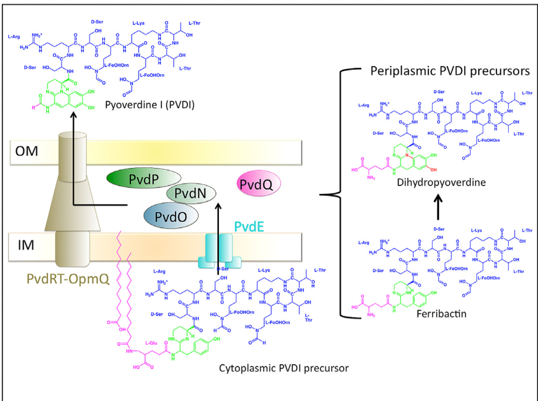

## Question

# Gene Research for Functional Annotation

## ⚠️ CRITICAL: Gene/Protein Identification Context

**BEFORE YOU BEGIN RESEARCH:** You MUST verify you are researching the CORRECT gene/protein. Gene symbols can be ambiguous, especially for less well-characterized genes from non-model organisms.

### Target Gene/Protein Identity (from UniProt):
- **UniProt Accession:** Q88F79
- **Protein Description:** SubName: Full=Non-ribosomal peptide synthetase {ECO:0000313|EMBL:AAN69800.1};
- **Gene Information:** Name=pvdD {ECO:0000313|EMBL:AAN69800.1}; OrderedLocusNames=PP_4219 {ECO:0000313|EMBL:AAN69800.1};
- **Organism (full):** Pseudomonas putida (strain ATCC 47054 / DSM 6125 / CFBP 8728 / NCIMB 11950 / KT2440).
- **Protein Family:** Belongs to the ATP-dependent AMP-binding enzyme family.
- **Key Domains:** AA_adenyl_dom. (IPR010071); AB_hydrolase_fold. (IPR029058); ACP-like_sf. (IPR036736); AMP-bd_C. (IPR025110); AMP-bd_C_sf. (IPR045851)

### MANDATORY VERIFICATION STEPS:

1. **Check if the gene symbol "pvdD" matches the protein description above**
2. **Verify the organism is correct:** Pseudomonas putida (strain ATCC 47054 / DSM 6125 / CFBP 8728 / NCIMB 11950 / KT2440).
3. **Check if protein family/domains align with what you find in literature**
4. **If you find literature for a DIFFERENT gene with the same or similar symbol, STOP**

### If Gene Symbol is Ambiguous or You Cannot Find Relevant Literature:

**DO NOT PROCEED WITH RESEARCH ON A DIFFERENT GENE.** Instead:
- State clearly: "The gene symbol 'pvdD' is ambiguous or literature is limited for this specific protein"
- Explain what you found (e.g., "Found extensive literature on a different gene with the same symbol in a different organism")
- Describe the protein based ONLY on the UniProt information provided above
- Suggest that the protein function can be inferred from domain/family information

### Research Target:

Please provide a comprehensive research report on the gene **pvdD** (gene ID: pvdD, UniProt: Q88F79) in PSEPK.

The research report should be a detailed narrative explaining the function, biological processes, and localization of the gene product. Citations should be given for all claims.

You should prioritize authoritative reviews and primary scientific literature when conducting research. You can supplement
this with annotations you find in gene/protein databases, but these can be outdated or inaccurate.

We are specifically interested in the primary function of the gene - for enzymes, what reaction is catalyzed, and what is the substrate specificity? For transporters, what is the substrate? For structural proteins or adapters, what is the broader structural role? For signaling molecules, what is the role in the pathway.

We are interested in where in or outside the cell the gene product carries out its function.

We are also interested in the signaling or biochemical pathways in which the gene functions. We are less interested in broad pleiotropic effects, except where these elucidate the precise role.

Include evidence where possible. We are interested in both experimental evidence as well as inference from structure, evolution, or bioinformatic analysis. Precise studies should be prioritized over high-throughput, where available.

## Output

Question: You are an expert researcher providing comprehensive, well-cited information.

Provide detailed information focusing on:
1. Key concepts and definitions with current understanding
2. Recent developments and latest research (prioritize 2023-2024 sources)
3. Current applications and real-world implementations
4. Expert opinions and analysis from authoritative sources
5. Relevant statistics and data from recent studies

Format as a comprehensive research report with proper citations. Include URLs and publication dates where available.
Always prioritize recent, authoritative sources and provide specific citations for all major claims.

# Gene Research for Functional Annotation

## ⚠️ CRITICAL: Gene/Protein Identification Context

**BEFORE YOU BEGIN RESEARCH:** You MUST verify you are researching the CORRECT gene/protein. Gene symbols can be ambiguous, especially for less well-characterized genes from non-model organisms.

### Target Gene/Protein Identity (from UniProt):
- **UniProt Accession:** Q88F79
- **Protein Description:** SubName: Full=Non-ribosomal peptide synthetase {ECO:0000313|EMBL:AAN69800.1};
- **Gene Information:** Name=pvdD {ECO:0000313|EMBL:AAN69800.1}; OrderedLocusNames=PP_4219 {ECO:0000313|EMBL:AAN69800.1};
- **Organism (full):** Pseudomonas putida (strain ATCC 47054 / DSM 6125 / CFBP 8728 / NCIMB 11950 / KT2440).
- **Protein Family:** Belongs to the ATP-dependent AMP-binding enzyme family.
- **Key Domains:** AA_adenyl_dom. (IPR010071); AB_hydrolase_fold. (IPR029058); ACP-like_sf. (IPR036736); AMP-bd_C. (IPR025110); AMP-bd_C_sf. (IPR045851)

### MANDATORY VERIFICATION STEPS:

1. **Check if the gene symbol "pvdD" matches the protein description above**
2. **Verify the organism is correct:** Pseudomonas putida (strain ATCC 47054 / DSM 6125 / CFBP 8728 / NCIMB 11950 / KT2440).
3. **Check if protein family/domains align with what you find in literature**
4. **If you find literature for a DIFFERENT gene with the same or similar symbol, STOP**

### If Gene Symbol is Ambiguous or You Cannot Find Relevant Literature:

**DO NOT PROCEED WITH RESEARCH ON A DIFFERENT GENE.** Instead:
- State clearly: "The gene symbol 'pvdD' is ambiguous or literature is limited for this specific protein"
- Explain what you found (e.g., "Found extensive literature on a different gene with the same symbol in a different organism")
- Describe the protein based ONLY on the UniProt information provided above
- Suggest that the protein function can be inferred from domain/family information

### Research Target:

Please provide a comprehensive research report on the gene **pvdD** (gene ID: pvdD, UniProt: Q88F79) in PSEPK.

The research report should be a detailed narrative explaining the function, biological processes, and localization of the gene product. Citations should be given for all claims.

You should prioritize authoritative reviews and primary scientific literature when conducting research. You can supplement
this with annotations you find in gene/protein databases, but these can be outdated or inaccurate.

We are specifically interested in the primary function of the gene - for enzymes, what reaction is catalyzed, and what is the substrate specificity? For transporters, what is the substrate? For structural proteins or adapters, what is the broader structural role? For signaling molecules, what is the role in the pathway.

We are interested in where in or outside the cell the gene product carries out its function.

We are also interested in the signaling or biochemical pathways in which the gene functions. We are less interested in broad pleiotropic effects, except where these elucidate the precise role.

Include evidence where possible. We are interested in both experimental evidence as well as inference from structure, evolution, or bioinformatic analysis. Precise studies should be prioritized over high-throughput, where available.

# Research Report: Functional Annotation of **pvdD** (UniProt Q88F79; locus **PP_4219**) in *Pseudomonas putida* KT2440

## 1) Target verification and disambiguation

**Verified target:** UniProt **Q88F79** corresponds to **pvdD** / ordered locus **PP_4219** in *Pseudomonas putida* strain KT2440. In a KT2440-focused experimental study, **pvdD is explicitly identified as PP_4219 encoding a pyoverdine nonribosomal peptide synthetase (NRPS)**, and a **pvdD mutant is used as a non-pyoverdine-producing control**, supporting that this symbol refers to the pyoverdine NRPS in this strain (not a different “pvdD” in another organism). (barrientosmoreno2019argininebiosynthesismodulates pages 2-5)

**Ambiguity note (controlled):** “pvdD” is used across multiple *Pseudomonas* species/strains for a pyoverdine-pathway NRPS. Mechanistic details (module-by-module residue assignment, NRPS complex architecture) are best established in *P. aeruginosa* and are used here **as homologous inference** where KT2440-specific biochemical evidence is not available; such inferences are explicitly labeled. (schalk2013pyoverdinebiosynthesisand pages 2-3)

## 2) Key concepts and definitions (current understanding)

### 2.1 Pyoverdine and ferribactin
Pyoverdines are fluorescent siderophores produced by many fluorescent pseudomonads to acquire iron under iron limitation. Biosynthesis proceeds via a **non-fluorescent, acylated precursor (“ferribactin” / cytoplasmic precursor)** assembled by NRPS enzymes; subsequent maturation steps yield fluorescent pyoverdine. (dell’anno2022novelinsightson pages 8-9, schalk2013pyoverdinebiosynthesisand pages 2-3)

### 2.2 Nonribosomal peptide synthetases (NRPSs)
NRPSs are large modular enzymes that assemble peptides via a thiotemplate mechanism. A typical module contains:
- **Adenylation (A) domain:** selects/activates a monomer substrate.
- **Peptidyl carrier protein (PCP/T) domain:** covalently tethers the activated monomer on a phosphopantetheine arm.
- **Condensation (C) domain:** forms peptide bonds.
Termination modules often include a **thioesterase (TE) domain** to release the product. (dell’anno2022novelinsightson pages 8-9, schalk2013pyoverdinebiosynthesisand pages 2-3)

## 3) Primary function of **PvdD (Q88F79 / PP_4219)** in KT2440

### 3.1 Functional role in the pathway
**PvdD is a pyoverdine-pathway NRPS required for pyoverdine production** in *P. putida* KT2440. A pvdD mutant “does not produce pyoverdine,” consistent with PvdD being an essential biosynthetic enzyme for siderophore formation under iron limitation. (barrientosmoreno2019argininebiosynthesismodulates pages 2-5)

### 3.2 Enzyme class and domain logic
The pathway literature establishes that pyoverdine precursor assembly is performed by multimodular NRPSs (PvdL/PvdI/PvdJ/PvdD in canonical systems), each module incorporating a defined residue; **the final product is released by a thioesterase domain in the termination module**. (dell’anno2022novelinsightson pages 8-9, schalk2013pyoverdinebiosynthesisand pages 2-3)

Although KT2440-specific module mapping for Q88F79 is not provided in the retrieved KT2440 papers, the identification of pvdD as an NRPS in KT2440 and the UniProt-provided domain family context (AMP-binding/A-domain and carrier-like features) is consistent with this conserved NRPS mechanism. (barrientosmoreno2019argininebiosynthesismodulates pages 2-5, dell’anno2022novelinsightson pages 8-9)

### 3.3 Substrate specificity: what does PvdD incorporate?
**Direct KT2440 biochemical substrate-assignment for Q88F79 was not found** in the retrieved KT2440 experimental literature.

**Homologous/consensus inference from well-characterized systems:** In *P. aeruginosa* PAO1 and related models, PvdD is consistently described as the **terminal NRPS** and is commonly associated with incorporation of terminal residues and product release by TE. In a 2013 review, **PvdD is described as the only pyoverdine NRPS ending with a TE domain**, arguing for its role in release at the end of assembly. (schalk2013pyoverdinebiosynthesisand pages 2-3)

A 2022 review further reports that **PvdJ and PvdD catalyze addition of L-Lys, L-hfOrn, and two L-Thr residues** in a representative biosynthetic scheme; this assigns PvdD to late-stage incorporation steps (species-context dependent). (dell’anno2022novelinsightson pages 8-9)

**A-domain specificity evidence (mechanistic insight from 2024):** Engineering work on *P. aeruginosa* PvdD identifies specificity-code positions in a PvdD adenylation domain and notes a residue (Trp194) “frequently present in Thr specific A-domain,” supporting Thr-like specificity features in at least one PvdD A-domain in that system. (puja2024biosynthesisofa pages 9-10)

## 4) Cellular localization and where PvdD carries out function

### 4.1 Compartmentalization of pyoverdine biosynthesis
A widely accepted model is that **pyoverdine synthesis begins in the cytoplasm** (NRPS assembly of the non-fluorescent precursor) and **ends in the periplasm**, where maturation/tailoring reactions occur; mature pyoverdine is then secreted to the extracellular milieu. (dell’anno2022novelinsightson pages 8-9, schalk2013pyoverdinebiosynthesisand pages 2-3)

In this model, the cytoplasmic precursor is exported across the inner membrane by the **ABC transporter PvdE** into the periplasm for maturation steps. (dell’anno2022novelinsightson pages 8-9, stein2023therndefflux pages 10-13)

### 4.2 NRPS organization (“siderosome”) and PvdD localization (recent 2024 evidence)
High-resolution single-molecule imaging in *P. aeruginosa* (homology-based evidence) supports a spatial organization in which NRPSs form discrete puncta and partially co-localize. PvdL is predominantly inner-membrane-associated, while **PvdI/PvdJ/PvdD explore the cytoplasm** and show partial co-localization with PvdL, consistent with dynamic NRPS complexes. (manko2024pvdlorchestratesthe pages 2-5, manko2024pvdlorchestratesthe pages 1-2)

Quantitative interaction evidence includes:
- **FLIM-FRET** showing a **PvdL–PvdD interaction**: τd ≈ 2.3 ns vs τda ≈ 2.0 ns; **FRET efficiency ≈ 0.13**. (manko2024pvdlorchestratesthe pages 8-10)
- **DNA-PAINT co-localization**: median **Mander’s overlap coefficients** for PvdL/PvdD ≈ **0.4** (and PvdL/PvdI ≈ 0.6; PvdL/PvdJ ≈ 0.3), supporting partial co-localization rather than a fully stable complex. (manko2024pvdlorchestratesthe pages 8-10)

**Inference for KT2440:** While these imaging results are in *P. aeruginosa*, they support a plausible conserved principle: **PvdD functions on the cytoplasmic side** (where peptide assembly occurs) and may participate in dynamic multi-enzyme assemblies near the inner membrane. (schalk2013pyoverdinebiosynthesisand pages 2-3, manko2024pvdlorchestratesthe pages 8-10)

## 5) Regulation and physiology in *P. putida* KT2440 (experimental evidence)

### 5.1 pvdD is essential for pyoverdine-dependent iron acquisition
In KT2440, **pvdD disruption abolishes pyoverdine production** (phenotypic control). (barrientosmoreno2019argininebiosynthesismodulates pages 2-5)

In iron-uptake measurements, the **pvdD mutant leaves more iron in supernatants than wild type**, indicating reduced iron incorporation; differences were statistically significant (**P ≤ 0.01**, Student’s t test). (barrientosmoreno2019argininebiosynthesismodulates pages 2-5)

### 5.2 Transcriptional response links pvdD to iron/oxidative-stress homeostasis
In KT2440 arginine-biosynthesis mutants (ΔargG, ΔargH), **pvdD and pvdA expression increased ~3–5×**, while **pvdE decreased ~2.5×**, demonstrating condition-dependent regulation of structural genes and export machinery. (barrientosmoreno2019argininebiosynthesismodulates pages 2-5)

## 6) Recent developments (prioritizing 2023–2024)

### 6.1 2023: Pyoverdine secretion redundancy in KT2440 (real-world physiology)
A 2023 study in *P. putida* KT2440 emphasizes that pyoverdine is synthesized in the cytosol and matures in the periplasm, with export relying on **overlapping tripartite efflux systems**. PvdRT-OpmQ is highlighted as a major secretion system, with MdtABC-OpmB and ParXY contributing under certain conditions—illustrating that pyoverdine production (including PvdD-dependent synthesis) must be interpreted together with secretion capacity. (stein2023therndefflux pages 10-13, stein2023therndefflux pages 1-2)

### 6.2 2024: Quantitative cellular organization of NRPSs (mechanistic cell biology)
Single-molecule microscopy and quantitative co-localization/FRET data provide an updated view of how pyoverdine NRPSs (including PvdD) are spatially organized and interact in vivo (in *P. aeruginosa*). This supports the “siderosome” concept as a **dynamic mixture of co-localized and freely diffusing NRPS fractions**. (manko2024pvdlorchestratesthe pages 2-5, manko2024pvdlorchestratesthe pages 8-10)

### 6.3 2024: PvdD adenylation-domain engineering enabling “clickable” pyoverdine
A 2024 synthetic biology study engineered the PvdD adenylation domain (in *P. aeruginosa*) to incorporate an unnatural amino acid (azido-L-homoalanine), producing an **azide-functionalized pyoverdine** that supports **copper-free click chemistry** and remains recognized/transported by the native uptake machinery. This work demonstrates that PvdD A-domain specificity is engineerable in vivo and provides a route to functionalized siderophores for conjugation applications. (puja2024biosynthesisofa pages 1-2, puja2024biosynthesisofa pages 10-12)

## 7) Current applications and real-world implementations (with emphasis on 2022–2024)

### 7.1 Diagnostics and imaging
A 2022 review reports **Gallium-68-labeled pyoverdine** evaluated for **PET imaging** to localize infections, with specific accumulation in infected tissue and favorable distribution compared with common tracers (qualitative summary). (dell’anno2022novelinsightson pages 12-13)

### 7.2 “Trojan horse” antibiotic vectorization
The same review summarizes **pyoverdine–antibiotic conjugates**, including historical pyoverdine–ampicillin conjugates tested against ampicillin-resistant *P. aeruginosa* strains (qualitative summary), and discusses the rationale for siderophore-mediated uptake as a delivery vector. (dell’anno2022novelinsightson pages 12-13)

### 7.3 Clickable pyoverdines for modular conjugation (2024)
The 2024 engineering study provides a concrete implementation: click conjugation to generate a **pyoverdine–payload conjugate**, with recovery of **4.9 mg conjugate** (reported in the excerpt) and retention of iron chelation and uptake. (puja2024biosynthesisofa pages 10-12)

### 7.4 Analytical/industrial constraints and opportunities
The 2022 review highlights that broad implementation is limited by production and analytics: commercial availability is scarce (example price **~200 €/mg** for one pyoverdine), motivating engineered non-pathogenic production hosts and improved high-throughput detection. (dell’anno2022novelinsightson pages 17-19)

It also reports an analytical performance statistic for LC-ICP-MS workflows: sensitivity better than **<1 picomole of iron**, and characteristic MS fragments used for identification in complex matrices. (dell’anno2022novelinsightson pages 17-19)

## 8) Expert opinions / authoritative synthesis

Two authoritative reviews provide consensus “expert synthesis” that informs functional annotation of PvdD:
- Pyoverdine biosynthesis is a **compartmentalized assembly line**: cytoplasmic NRPS assembly followed by periplasmic maturation and secretion. (dell’anno2022novelinsightson pages 8-9, schalk2013pyoverdinebiosynthesisand pages 2-3)
- Pathway diversity among *Pseudomonas* strains largely arises from **NRPS adenylation-domain substrate specificities**, meaning residue assignments can vary by strain; therefore, KT2440-specific substrate specificity should ideally be verified by direct biochemical/structural characterization of Q88F79. (schalk2013pyoverdinebiosynthesisand pages 2-3)

## 9) Consolidated evidence table (traceable claims)

| Evidence item | Functional claim | System/organism (KT2440 vs P. aeruginosa) | Key mechanistic detail (domains/modules/substrates/localization) | Primary citation (with year and DOI/URL) |
|---|---|---|---|---|
| Gene identity and mutant phenotype | **pvdD = PP_4219 / UniProt Q88F79** encodes a pyoverdine nonribosomal peptide synthetase required for pyoverdine production | **P. putida KT2440** | In KT2440, a **pvdD mutant does not produce pyoverdine** and was used as a negative control in pyoverdine fluorescence/CAS assays; supports direct role in siderophore biosynthesis under iron limitation (barrientosmoreno2019argininebiosynthesismodulates pages 2-5) | Barrientos-Moreno et al., **2019**, *J Bacteriol*; DOI: **10.1128/JB.00454-19**; https://doi.org/10.1128/JB.00454-19 |
| Iron-related phenotype | pvdD contributes to efficient iron acquisition via pyoverdine production | **P. putida KT2440** | In iron-uptake assays, the **pvdD mutant left more iron in supernatants than wild type** with significant differences (**P ≤ 0.01**), consistent with impaired pyoverdine-mediated iron capture (barrientosmoreno2019argininebiosynthesismodulates pages 2-5) | Barrientos-Moreno et al., **2019**, *J Bacteriol*; DOI: **10.1128/JB.00454-19**; https://doi.org/10.1128/JB.00454-19 |
| Regulatory response | pvdD transcription is responsive to metabolic/iron-stress context | **P. putida KT2440** | In arginine-biosynthesis mutants, **pvdD expression increased ~3–5-fold** relative to wild type, linking pyoverdine NRPS expression to iron/oxidative-stress homeostasis (barrientosmoreno2019argininebiosynthesismodulates pages 2-5) | Barrientos-Moreno et al., **2019**, *J Bacteriol*; DOI: **10.1128/JB.00454-19**; https://doi.org/10.1128/JB.00454-19 |
| Enzyme class | PvdD is an **NRPS** in the ATP-dependent AMP-binding enzyme family | **KT2440 target; broader Pseudomonas context** | Reviews describe pyoverdine biosynthesis as driven by **large modular NRPSs** with **A (adenylation), PCP/T (carrier), and C (condensation)** domains; the provided UniProt domain set for Q88F79 is consistent with this architecture (dell’anno2022novelinsightson pages 8-9, schalk2013pyoverdinebiosynthesisand pages 2-3) | Dell’Anno et al., **2022**, *Int J Mol Sci*; DOI: **10.3390/ijms231911507**; https://doi.org/10.3390/ijms231911507 |
| Terminal assembly-line role | PvdD functions as the **terminal pyoverdine NRPS** in the assembly line | **Evidence from P. aeruginosa; used as homologous inference for KT2440** | In the best-characterized pyoverdine system, peptide assembly proceeds through **PvdL → PvdI → PvdJ → PvdD**, and **PvdD is the only NRPS ending in a thioesterase domain**, supporting product release at the end of assembly (schalk2013pyoverdinebiosynthesisand pages 2-3) | Schalk & Guillon, **2013**, *Environ Microbiol*; DOI: **10.1111/1462-2920.12013**; https://doi.org/10.1111/1462-2920.12013 |
| Substrate incorporation | PvdD is implicated in adding the **final threonine residue(s)** of pyoverdine/ferribactin | **Evidence from P. aeruginosa; likely homologous inference for KT2440** | One review states that **PvdJ + PvdD add L-Lys, L-hfOrn, and two L-Thr residues**; engineering studies further describe **PvdD as a bimodular terminal NRPS incorporating the final two L-Thr residues** (dell’anno2022novelinsightson pages 8-9, messenger2019ahighthroughputapproach pages 18-21) | Dell’Anno et al., **2022**, *Int J Mol Sci*; DOI: **10.3390/ijms231911507**; https://doi.org/10.3390/ijms231911507 |
| Adenylation-domain specificity | At least one PvdD A-domain has **Thr-type specificity features** and can be engineered | **Evidence from P. aeruginosa; mechanistic inference only** | A 2024 study identifies **Trp194** in **PvdD(A1)** as one of the 8 canonical specificity-code residues and notes it is common in **Thr-specific A-domains**; engineered mutants enabled incorporation of **azido-L-homoalanine** into pyoverdine analogs (puja2024biosynthesisofa pages 1-2, puja2024biosynthesisofa pages 9-10) | Puja et al., **2024**, *Microb Cell Fact*; DOI: **10.1186/s12934-024-02472-4**; https://doi.org/10.1186/s12934-024-02472-4 |
| Cellular localization | PvdD-mediated peptide assembly occurs in the **cytoplasm**, before precursor export and **periplasmic maturation** | **General Pseudomonas model; applicable by homology to KT2440 pyoverdine pathway** | Pyoverdine synthesis **begins in the cytoplasm and ends in the periplasm**; NRPSs assemble the non-fluorescent precursor, which is exported by **PvdE**, then matured in the periplasm by enzymes such as **PvdQ/PvdP/PvdO** (dell’anno2022novelinsightson pages 8-9, schalk2013pyoverdinebiosynthesisand pages 2-3, ringel2018thebiosynthesisof pages 6-7) | Ringel & Brüser, **2018**, *Microbial Cell*; DOI: **10.15698/mic2018.10.649**; https://doi.org/10.15698/mic2018.10.649 |
| Pathway context in KT2440 | pvdD is part of the **KT2440 pyoverdine circuit**, whose product is secreted by overlapping efflux systems | **P. putida KT2440** | KT2440 uses pyoverdine as its main siderophore; recent work shows secretion involves **PvdRT-OpmQ**, **MdtABC-OpmB**, and conditionally **ParXY**, placing pvdD in a validated siderophore biosynthesis/export network (schalk2013pyoverdinebiosynthesisand media e1e1d8e3) | Stein et al., **2023**, *Microbiology Spectrum*; DOI: **10.1128/spectrum.02300-23**; https://doi.org/10.1128/spectrum.02300-23 |
| Confidence/limitation note | Core function in KT2440 is well supported, but **exact residue assignment for Q88F79 in KT2440 is inferred mainly from homologous pyoverdine systems** | **Mixed: direct KT2440 + homologous Pseudomonas evidence** | Direct KT2440 evidence demonstrates **necessity for pyoverdine production and iron-related fitness**; detailed **module/residue assignment** derives largely from **P. aeruginosa** and comparative pyoverdine biosynthesis reviews rather than a KT2440-specific biochemical assay (barrientosmoreno2019argininebiosynthesismodulates pages 2-5, schalk2013pyoverdinebiosynthesisand pages 2-3) | Schalk & Guillon, **2013**, *Environ Microbiol*; DOI: **10.1111/1462-2920.12013**; https://doi.org/10.1111/1462-2920.12013 |

*Table: This table summarizes the evidence-supported functional annotation of PvdD (Q88F79/PP_4219) in Pseudomonas putida KT2440, separating direct KT2440 findings from homologous mechanistic inferences from better-characterized Pseudomonas pyoverdine systems. It is useful for tracing which claims are experimentally established in KT2440 versus inferred from conserved NRPS biology.*

## 10) Visual evidence: pathway + NRPS organization schematic

Schalk & Guillon (2013) provide a schematic of pyoverdine biosynthesis/secretion and NRPS modular organization (Figure 1/3), supporting the cytoplasm→periplasm compartment model and the terminal NRPS/TE logic often ascribed to PvdD. (schalk2013pyoverdinebiosynthesisand media e1e1d8e3, schalk2013pyoverdinebiosynthesisand media f6364666, schalk2013pyoverdinebiosynthesisand media c73ae716, schalk2013pyoverdinebiosynthesisand media ebdca93f, schalk2013pyoverdinebiosynthesisand media fc34c916)

## 11) Summary functional annotation statement (for Q88F79 / KT2440)

**PvdD (UniProt Q88F79; PP_4219) is an essential cytoplasmic NRPS in *Pseudomonas putida* KT2440 required for biosynthesis of the pyoverdine siderophore, thereby enabling high-affinity iron acquisition under iron limitation.** Experimental KT2440 evidence demonstrates loss of pyoverdine production and impaired iron incorporation when pvdD is disrupted, and shows that pvdD transcription is condition-responsive in iron/oxidative-stress-linked contexts. Mechanistically, based on conserved pyoverdine NRPS assembly lines characterized in *Pseudomonas*, PvdD likely functions late in precursor assembly and (in many systems) participates in product release via a termination thioesterase, with adenylation-domain determinants that can be engineered to alter substrate incorporation. (barrientosmoreno2019argininebiosynthesismodulates pages 2-5, schalk2013pyoverdinebiosynthesisand pages 2-3, puja2024biosynthesisofa pages 1-2)

---

## Key references (publication dates + URLs)

- Barrientos-Moreno L. et al. **2019-11**. *Journal of Bacteriology*. “Arginine Biosynthesis Modulates Pyoverdine Production and Release in *Pseudomonas putida*…” https://doi.org/10.1128/JB.00454-19 (barrientosmoreno2019argininebiosynthesismodulates pages 2-5)
- Stein N.V. et al. **2023-12**. *Microbiology Spectrum*. “The RND efflux system ParXY affects siderophore secretion in *Pseudomonas putida* KT2440.” https://doi.org/10.1128/spectrum.02300-23 (stein2023therndefflux pages 10-13, stein2023therndefflux pages 1-2)
- Manko H. et al. **2024-05**. *International Journal of Molecular Sciences*. “PvdL Orchestrates the Assembly of the Nonribosomal Peptide Synthetases…” https://doi.org/10.3390/ijms25116013 (manko2024pvdlorchestratesthe pages 2-5, manko2024pvdlorchestratesthe pages 8-10)
- Puja H. et al. **2024-07**. *Microbial Cell Factories*. “Biosynthesis of a clickable pyoverdine via in vivo enzyme engineering of an adenylation domain.” https://doi.org/10.1186/s12934-024-02472-4 (puja2024biosynthesisofa pages 1-2, puja2024biosynthesisofa pages 10-12)
- Schalk I.J. & Guillon L. **2013-06**. *Environmental Microbiology*. “Pyoverdine biosynthesis and secretion in *Pseudomonas aeruginosa*…” https://doi.org/10.1111/1462-2920.12013 (schalk2013pyoverdinebiosynthesisand pages 2-3, schalk2013pyoverdinebiosynthesisand media e1e1d8e3)
- Ringel M.T. & Brüser T. **2018-10**. *Microbial Cell*. “The biosynthesis of pyoverdines.” https://doi.org/10.15698/mic2018.10.649 (ringel2018thebiosynthesisof pages 6-7, ringel2018thebiosynthesisof pages 7-8)
- Dell’Anno F. et al. **2022-09**. *International Journal of Molecular Sciences*. “Novel Insights on Pyoverdine: From Biosynthesis to Biotechnological Application.” https://doi.org/10.3390/ijms231911507 (dell’anno2022novelinsightson pages 8-9, dell’anno2022novelinsightson pages 17-19, dell’anno2022novelinsightson pages 12-13)

References

1. (barrientosmoreno2019argininebiosynthesismodulates pages 2-5): Laura Barrientos-Moreno, María Antonia Molina-Henares, Marta Pastor-García, María Isabel Ramos-González, and Manuel Espinosa-Urgel. Arginine biosynthesis modulates pyoverdine production and release in pseudomonas putida as part of the mechanism of adaptation to oxidative stress. Journal of Bacteriology, Nov 2019. URL: https://doi.org/10.1128/jb.00454-19, doi:10.1128/jb.00454-19. This article has 44 citations and is from a peer-reviewed journal.

2. (schalk2013pyoverdinebiosynthesisand pages 2-3): Isabelle J. Schalk and Laurent Guillon. Pyoverdine biosynthesis and secretion in pseudomonas aeruginosa: implications for metal homeostasis. Environmental microbiology, 15 6:1661-73, Jun 2013. URL: https://doi.org/10.1111/1462-2920.12013, doi:10.1111/1462-2920.12013. This article has 296 citations and is from a domain leading peer-reviewed journal.

3. (dell’anno2022novelinsightson pages 8-9): Filippo Dell’Anno, Giovanni Andrea Vitale, Carmine Buonocore, Laura Vitale, Fortunato Palma Esposito, Daniela Coppola, Gerardo Della Sala, Pietro Tedesco, and Donatella de Pascale. Novel insights on pyoverdine: from biosynthesis to biotechnological application. International Journal of Molecular Sciences, 23:11507, Sep 2022. URL: https://doi.org/10.3390/ijms231911507, doi:10.3390/ijms231911507. This article has 40 citations.

4. (puja2024biosynthesisofa pages 9-10): Hélène Puja, Laurent Bianchetti, Johan Revol-Tissot, Nicolas Simon, Anastasiia Shatalova, Julian Nommé, Sarah Fritsch, Roland H. Stote, Gaëtan L. A. Mislin, Noëlle Potier, Annick Dejaegere, and Coraline Rigouin. Biosynthesis of a clickable pyoverdine via in vivo enzyme engineering of an adenylation domain. Microbial Cell Factories, Jul 2024. URL: https://doi.org/10.1186/s12934-024-02472-4, doi:10.1186/s12934-024-02472-4. This article has 6 citations and is from a peer-reviewed journal.

5. (stein2023therndefflux pages 10-13): Nicola Victoria Stein, Michelle Eder, Fabienne Burr, Sarah Stoss, Lorenz Holzner, Hans-Henning Kunz, and Heinrich Jung. The rnd efflux system parxy affects siderophore secretion in <i>pseudomonas putida</i> kt2440. Microbiology Spectrum, Dec 2023. URL: https://doi.org/10.1128/spectrum.02300-23, doi:10.1128/spectrum.02300-23. This article has 8 citations and is from a domain leading peer-reviewed journal.

6. (manko2024pvdlorchestratesthe pages 2-5): Hanna Manko, Tania Steffan, Véronique Gasser, Yves Mély, Isabelle Schalk, and Julien Godet. Pvdl orchestrates the assembly of the nonribosomal peptide synthetases involved in pyoverdine biosynthesis in pseudomonas aeruginosa. International Journal of Molecular Sciences, 25:6013, May 2024. URL: https://doi.org/10.3390/ijms25116013, doi:10.3390/ijms25116013. This article has 6 citations.

7. (manko2024pvdlorchestratesthe pages 1-2): Hanna Manko, Tania Steffan, Véronique Gasser, Yves Mély, Isabelle Schalk, and Julien Godet. Pvdl orchestrates the assembly of the nonribosomal peptide synthetases involved in pyoverdine biosynthesis in pseudomonas aeruginosa. International Journal of Molecular Sciences, 25:6013, May 2024. URL: https://doi.org/10.3390/ijms25116013, doi:10.3390/ijms25116013. This article has 6 citations.

8. (manko2024pvdlorchestratesthe pages 8-10): Hanna Manko, Tania Steffan, Véronique Gasser, Yves Mély, Isabelle Schalk, and Julien Godet. Pvdl orchestrates the assembly of the nonribosomal peptide synthetases involved in pyoverdine biosynthesis in pseudomonas aeruginosa. International Journal of Molecular Sciences, 25:6013, May 2024. URL: https://doi.org/10.3390/ijms25116013, doi:10.3390/ijms25116013. This article has 6 citations.

9. (stein2023therndefflux pages 1-2): Nicola Victoria Stein, Michelle Eder, Fabienne Burr, Sarah Stoss, Lorenz Holzner, Hans-Henning Kunz, and Heinrich Jung. The rnd efflux system parxy affects siderophore secretion in <i>pseudomonas putida</i> kt2440. Microbiology Spectrum, Dec 2023. URL: https://doi.org/10.1128/spectrum.02300-23, doi:10.1128/spectrum.02300-23. This article has 8 citations and is from a domain leading peer-reviewed journal.

10. (puja2024biosynthesisofa pages 1-2): Hélène Puja, Laurent Bianchetti, Johan Revol-Tissot, Nicolas Simon, Anastasiia Shatalova, Julian Nommé, Sarah Fritsch, Roland H. Stote, Gaëtan L. A. Mislin, Noëlle Potier, Annick Dejaegere, and Coraline Rigouin. Biosynthesis of a clickable pyoverdine via in vivo enzyme engineering of an adenylation domain. Microbial Cell Factories, Jul 2024. URL: https://doi.org/10.1186/s12934-024-02472-4, doi:10.1186/s12934-024-02472-4. This article has 6 citations and is from a peer-reviewed journal.

11. (puja2024biosynthesisofa pages 10-12): Hélène Puja, Laurent Bianchetti, Johan Revol-Tissot, Nicolas Simon, Anastasiia Shatalova, Julian Nommé, Sarah Fritsch, Roland H. Stote, Gaëtan L. A. Mislin, Noëlle Potier, Annick Dejaegere, and Coraline Rigouin. Biosynthesis of a clickable pyoverdine via in vivo enzyme engineering of an adenylation domain. Microbial Cell Factories, Jul 2024. URL: https://doi.org/10.1186/s12934-024-02472-4, doi:10.1186/s12934-024-02472-4. This article has 6 citations and is from a peer-reviewed journal.

12. (dell’anno2022novelinsightson pages 12-13): Filippo Dell’Anno, Giovanni Andrea Vitale, Carmine Buonocore, Laura Vitale, Fortunato Palma Esposito, Daniela Coppola, Gerardo Della Sala, Pietro Tedesco, and Donatella de Pascale. Novel insights on pyoverdine: from biosynthesis to biotechnological application. International Journal of Molecular Sciences, 23:11507, Sep 2022. URL: https://doi.org/10.3390/ijms231911507, doi:10.3390/ijms231911507. This article has 40 citations.

13. (dell’anno2022novelinsightson pages 17-19): Filippo Dell’Anno, Giovanni Andrea Vitale, Carmine Buonocore, Laura Vitale, Fortunato Palma Esposito, Daniela Coppola, Gerardo Della Sala, Pietro Tedesco, and Donatella de Pascale. Novel insights on pyoverdine: from biosynthesis to biotechnological application. International Journal of Molecular Sciences, 23:11507, Sep 2022. URL: https://doi.org/10.3390/ijms231911507, doi:10.3390/ijms231911507. This article has 40 citations.

14. (messenger2019ahighthroughputapproach pages 18-21): Sarah L. Messenger. A high-throughput approach to nrps domain substitution for generation of novel peptides. ArXiv, 2019. URL: https://doi.org/10.26686/wgtn.22777238, doi:10.26686/wgtn.22777238. This article has 1 citations.

15. (ringel2018thebiosynthesisof pages 6-7): Michael T. Ringel and Thomas Brüser. The biosynthesis of pyoverdines. Microbial Cell, 5:424-437, Oct 2018. URL: https://doi.org/10.15698/mic2018.10.649, doi:10.15698/mic2018.10.649. This article has 195 citations.

16. (schalk2013pyoverdinebiosynthesisand media e1e1d8e3): Isabelle J. Schalk and Laurent Guillon. Pyoverdine biosynthesis and secretion in pseudomonas aeruginosa: implications for metal homeostasis. Environmental microbiology, 15 6:1661-73, Jun 2013. URL: https://doi.org/10.1111/1462-2920.12013, doi:10.1111/1462-2920.12013. This article has 296 citations and is from a domain leading peer-reviewed journal.

17. (schalk2013pyoverdinebiosynthesisand media f6364666): Isabelle J. Schalk and Laurent Guillon. Pyoverdine biosynthesis and secretion in pseudomonas aeruginosa: implications for metal homeostasis. Environmental microbiology, 15 6:1661-73, Jun 2013. URL: https://doi.org/10.1111/1462-2920.12013, doi:10.1111/1462-2920.12013. This article has 296 citations and is from a domain leading peer-reviewed journal.

18. (schalk2013pyoverdinebiosynthesisand media c73ae716): Isabelle J. Schalk and Laurent Guillon. Pyoverdine biosynthesis and secretion in pseudomonas aeruginosa: implications for metal homeostasis. Environmental microbiology, 15 6:1661-73, Jun 2013. URL: https://doi.org/10.1111/1462-2920.12013, doi:10.1111/1462-2920.12013. This article has 296 citations and is from a domain leading peer-reviewed journal.

19. (schalk2013pyoverdinebiosynthesisand media ebdca93f): Isabelle J. Schalk and Laurent Guillon. Pyoverdine biosynthesis and secretion in pseudomonas aeruginosa: implications for metal homeostasis. Environmental microbiology, 15 6:1661-73, Jun 2013. URL: https://doi.org/10.1111/1462-2920.12013, doi:10.1111/1462-2920.12013. This article has 296 citations and is from a domain leading peer-reviewed journal.

20. (schalk2013pyoverdinebiosynthesisand media fc34c916): Isabelle J. Schalk and Laurent Guillon. Pyoverdine biosynthesis and secretion in pseudomonas aeruginosa: implications for metal homeostasis. Environmental microbiology, 15 6:1661-73, Jun 2013. URL: https://doi.org/10.1111/1462-2920.12013, doi:10.1111/1462-2920.12013. This article has 296 citations and is from a domain leading peer-reviewed journal.

21. (ringel2018thebiosynthesisof pages 7-8): Michael T. Ringel and Thomas Brüser. The biosynthesis of pyoverdines. Microbial Cell, 5:424-437, Oct 2018. URL: https://doi.org/10.15698/mic2018.10.649, doi:10.15698/mic2018.10.649. This article has 195 citations.

## Artifacts

- [Edison artifact artifact-00](pvdD-deep-research-falcon_artifacts/artifact-00.md)

## Citations

1. barrientosmoreno2019argininebiosynthesismodulates pages 2-5
2. schalk2013pyoverdinebiosynthesisand pages 2-3
3. puja2024biosynthesisofa pages 9-10
4. manko2024pvdlorchestratesthe pages 8-10
5. puja2024biosynthesisofa pages 10-12
6. stein2023therndefflux pages 10-13
7. manko2024pvdlorchestratesthe pages 2-5
8. manko2024pvdlorchestratesthe pages 1-2
9. stein2023therndefflux pages 1-2
10. puja2024biosynthesisofa pages 1-2
11. messenger2019ahighthroughputapproach pages 18-21
12. ringel2018thebiosynthesisof pages 6-7
13. ringel2018thebiosynthesisof pages 7-8
14. https://doi.org/10.1128/JB.00454-19
15. https://doi.org/10.3390/ijms231911507
16. https://doi.org/10.1111/1462-2920.12013
17. https://doi.org/10.1186/s12934-024-02472-4
18. https://doi.org/10.15698/mic2018.10.649
19. https://doi.org/10.1128/spectrum.02300-23
20. https://doi.org/10.3390/ijms25116013
21. https://doi.org/10.1128/jb.00454-19,
22. https://doi.org/10.1111/1462-2920.12013,
23. https://doi.org/10.3390/ijms231911507,
24. https://doi.org/10.1186/s12934-024-02472-4,
25. https://doi.org/10.1128/spectrum.02300-23,
26. https://doi.org/10.3390/ijms25116013,
27. https://doi.org/10.26686/wgtn.22777238,
28. https://doi.org/10.15698/mic2018.10.649,