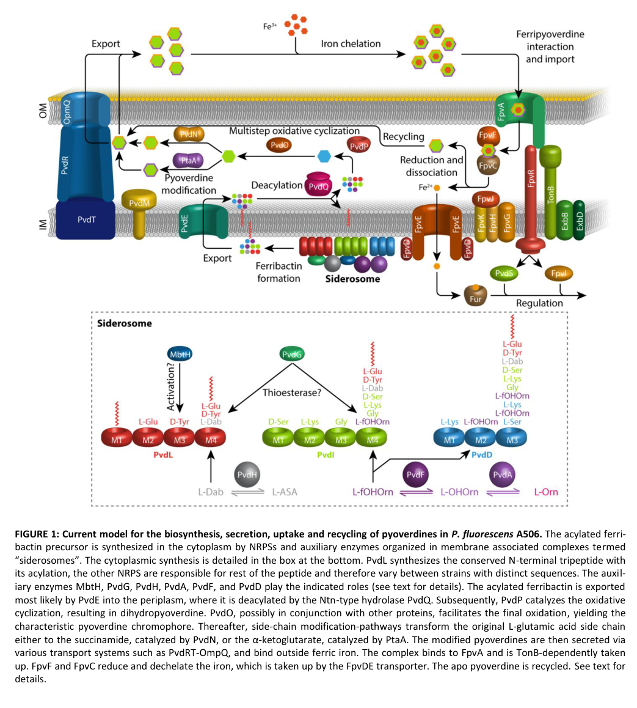

## Question

# Gene Research for Functional Annotation

## ⚠️ CRITICAL: Gene/Protein Identification Context

**BEFORE YOU BEGIN RESEARCH:** You MUST verify you are researching the CORRECT gene/protein. Gene symbols can be ambiguous, especially for less well-characterized genes from non-model organisms.

### Target Gene/Protein Identity (from UniProt):
- **UniProt Accession:** Q88F75
- **Protein Description:** SubName: Full=Diaminobutyrate-2-oxoglutarate transaminase {ECO:0000313|EMBL:AAN69804.1}; EC=2.6.1.76 {ECO:0000313|EMBL:AAN69804.1};
- **Gene Information:** Name=pvdH {ECO:0000313|EMBL:AAN69804.1}; OrderedLocusNames=PP_4223 {ECO:0000313|EMBL:AAN69804.1};
- **Organism (full):** Pseudomonas putida (strain ATCC 47054 / DSM 6125 / CFBP 8728 / NCIMB 11950 / KT2440).
- **Protein Family:** Belongs to the class-III pyridoxal-phosphate-dependent
- **Key Domains:** Aminotrans_3. (IPR005814); Aminotrans_3_PPA_site. (IPR049704); Dat. (IPR004637); PyrdxlP-dep_Trfase. (IPR015424); PyrdxlP-dep_Trfase_major. (IPR015421)

### MANDATORY VERIFICATION STEPS:

1. **Check if the gene symbol "pvdH" matches the protein description above**
2. **Verify the organism is correct:** Pseudomonas putida (strain ATCC 47054 / DSM 6125 / CFBP 8728 / NCIMB 11950 / KT2440).
3. **Check if protein family/domains align with what you find in literature**
4. **If you find literature for a DIFFERENT gene with the same or similar symbol, STOP**

### If Gene Symbol is Ambiguous or You Cannot Find Relevant Literature:

**DO NOT PROCEED WITH RESEARCH ON A DIFFERENT GENE.** Instead:
- State clearly: "The gene symbol 'pvdH' is ambiguous or literature is limited for this specific protein"
- Explain what you found (e.g., "Found extensive literature on a different gene with the same symbol in a different organism")
- Describe the protein based ONLY on the UniProt information provided above
- Suggest that the protein function can be inferred from domain/family information

### Research Target:

Please provide a comprehensive research report on the gene **pvdH** (gene ID: pvdH, UniProt: Q88F75) in PSEPK.

The research report should be a detailed narrative explaining the function, biological processes, and localization of the gene product. Citations should be given for all claims.

You should prioritize authoritative reviews and primary scientific literature when conducting research. You can supplement
this with annotations you find in gene/protein databases, but these can be outdated or inaccurate.

We are specifically interested in the primary function of the gene - for enzymes, what reaction is catalyzed, and what is the substrate specificity? For transporters, what is the substrate? For structural proteins or adapters, what is the broader structural role? For signaling molecules, what is the role in the pathway.

We are interested in where in or outside the cell the gene product carries out its function.

We are also interested in the signaling or biochemical pathways in which the gene functions. We are less interested in broad pleiotropic effects, except where these elucidate the precise role.

Include evidence where possible. We are interested in both experimental evidence as well as inference from structure, evolution, or bioinformatic analysis. Precise studies should be prioritized over high-throughput, where available.

## Output

Question: You are an expert researcher providing comprehensive, well-cited information.

Provide detailed information focusing on:
1. Key concepts and definitions with current understanding
2. Recent developments and latest research (prioritize 2023-2024 sources)
3. Current applications and real-world implementations
4. Expert opinions and analysis from authoritative sources
5. Relevant statistics and data from recent studies

Format as a comprehensive research report with proper citations. Include URLs and publication dates where available.
Always prioritize recent, authoritative sources and provide specific citations for all major claims.

# Gene Research for Functional Annotation

## ⚠️ CRITICAL: Gene/Protein Identification Context

**BEFORE YOU BEGIN RESEARCH:** You MUST verify you are researching the CORRECT gene/protein. Gene symbols can be ambiguous, especially for less well-characterized genes from non-model organisms.

### Target Gene/Protein Identity (from UniProt):
- **UniProt Accession:** Q88F75
- **Protein Description:** SubName: Full=Diaminobutyrate-2-oxoglutarate transaminase {ECO:0000313|EMBL:AAN69804.1}; EC=2.6.1.76 {ECO:0000313|EMBL:AAN69804.1};
- **Gene Information:** Name=pvdH {ECO:0000313|EMBL:AAN69804.1}; OrderedLocusNames=PP_4223 {ECO:0000313|EMBL:AAN69804.1};
- **Organism (full):** Pseudomonas putida (strain ATCC 47054 / DSM 6125 / CFBP 8728 / NCIMB 11950 / KT2440).
- **Protein Family:** Belongs to the class-III pyridoxal-phosphate-dependent
- **Key Domains:** Aminotrans_3. (IPR005814); Aminotrans_3_PPA_site. (IPR049704); Dat. (IPR004637); PyrdxlP-dep_Trfase. (IPR015424); PyrdxlP-dep_Trfase_major. (IPR015421)

### MANDATORY VERIFICATION STEPS:

1. **Check if the gene symbol "pvdH" matches the protein description above**
2. **Verify the organism is correct:** Pseudomonas putida (strain ATCC 47054 / DSM 6125 / CFBP 8728 / NCIMB 11950 / KT2440).
3. **Check if protein family/domains align with what you find in literature**
4. **If you find literature for a DIFFERENT gene with the same or similar symbol, STOP**

### If Gene Symbol is Ambiguous or You Cannot Find Relevant Literature:

**DO NOT PROCEED WITH RESEARCH ON A DIFFERENT GENE.** Instead:
- State clearly: "The gene symbol 'pvdH' is ambiguous or literature is limited for this specific protein"
- Explain what you found (e.g., "Found extensive literature on a different gene with the same symbol in a different organism")
- Describe the protein based ONLY on the UniProt information provided above
- Suggest that the protein function can be inferred from domain/family information

### Research Target:

Please provide a comprehensive research report on the gene **pvdH** (gene ID: pvdH, UniProt: Q88F75) in PSEPK.

The research report should be a detailed narrative explaining the function, biological processes, and localization of the gene product. Citations should be given for all claims.

You should prioritize authoritative reviews and primary scientific literature when conducting research. You can supplement
this with annotations you find in gene/protein databases, but these can be outdated or inaccurate.

We are specifically interested in the primary function of the gene - for enzymes, what reaction is catalyzed, and what is the substrate specificity? For transporters, what is the substrate? For structural proteins or adapters, what is the broader structural role? For signaling molecules, what is the role in the pathway.

We are interested in where in or outside the cell the gene product carries out its function.

We are also interested in the signaling or biochemical pathways in which the gene functions. We are less interested in broad pleiotropic effects, except where these elucidate the precise role.

Include evidence where possible. We are interested in both experimental evidence as well as inference from structure, evolution, or bioinformatic analysis. Precise studies should be prioritized over high-throughput, where available.

## Research report: functional annotation of **pvdH** (UniProt **Q88F75**; locus **PP_4223**) in *Pseudomonas putida* KT2440

### Executive summary
UniProt Q88F75 in *Pseudomonas putida* KT2440 is annotated as **diaminobutyrate-2-oxoglutarate transaminase** (gene **pvdH**, locus **PP_4223**), an **Aminotrans_3 / class-III PLP-dependent aminotransferase** (EC **2.6.1.76**) that supplies **L-2,4-diaminobutyrate (L‑Dab)** for **pyoverdine** (fluorescent siderophore) biosynthesis. Across authoritative pyoverdine reviews and primary studies in fluorescent pseudomonads, **PvdH is consistently defined as the enzyme producing L‑Dab from L‑aspartate‑β‑semialdehyde (L‑ASA)** during the **cytoplasmic** stage of ferribactin/pyoverdine precursor assembly, prior to periplasmic maturation and secretion. (schalk2013pyoverdinebiosynthesisand pages 3-5, schalk2020anoverviewof pages 4-6, dell’anno2022novelinsightson pages 8-9)

A key limitation for this specific KT2440 protein is that **direct biochemical characterization (kinetics, substrate panel) of PP_4223 itself** was not retrieved from accessible full texts in this run; the functional annotation therefore relies on (i) high-confidence pathway conservation and (ii) established EC 2.6.1.76 chemistry and Aminotrans_3 structural principles. (schalk2025bacterialsiderophoresdiversity pages 4-7, rausch2013crystalstructureof pages 6-8, rausch2013crystalstructureof pages 3-4)

### 0) Mandatory identity verification (to avoid symbol ambiguity)

#### 0.1 Mapping of the gene name to the correct KT2440 locus
A comparative regulatory-systems analysis table explicitly maps **pvdH** to **PP_4223** in *P. putida* KT2440 (and to PA2413 in *P. aeruginosa*), matching the user-provided UniProt locus and confirming that the symbol “pvdH” in the siderophore literature corresponds to the KT2440 gene of interest. (udaondo2025transcriptionalregulatorysystems pages 20-22)

#### 0.2 Match between gene symbol and protein description
In pyoverdine biosynthesis literature, **PvdH** is the aminotransferase that **produces L‑Dab**, a non-proteinogenic residue incorporated into the pyoverdine/ferribactin peptide backbone. (schalk2013pyoverdinebiosynthesisand pages 3-5, schalk2020anoverviewof pages 4-6, dell’anno2022novelinsightson pages 8-9)

This matches UniProt Q88F75’s description as **diaminobutyrate-2-oxoglutarate transaminase** (EC 2.6.1.76) and membership in a **PLP-dependent aminotransferase family** (Aminotrans_3/class III), which is the expected enzyme class for this transamination chemistry. (rausch2013crystalstructureof pages 6-8, rausch2013crystalstructureof pages 3-4)

### 1) Key concepts and definitions (current understanding)

#### 1.1 What is PvdH?
**PvdH** is an aminotransferase that supplies **L‑2,4-diaminobutyrate (L‑Dab)** used as a building block for the **nonribosomal peptide** precursor of **pyoverdine**. (schalk2020anoverviewof pages 4-6, schalk2013pyoverdinebiosynthesisand pages 3-5)

#### 1.2 Pyoverdine (PVD) and ferribactin
Pyoverdines are fluorescent siderophores produced by fluorescent pseudomonads; their biosynthesis begins with assembly of a **ferribactin** (pyoverdine precursor) peptide in the **cytoplasm**, followed by **periplasmic maturation** to the fluorescent chromophore and secretion. (ringel2018thebiosynthesisof pages 1-3, schalk2020anoverviewof pages 4-6)

#### 1.3 Compartmentalized biosynthesis and “siderosomes”
Multiple reviews describe pyoverdine biosynthesis as **compartmentalized**: cytoplasmic/inner-membrane-associated assembly of an acylated precursor by NRPSs and auxiliary enzymes, followed by export to the **periplasm** for maturation. This organized biosynthetic machinery is often discussed as a membrane-associated multienzyme complex (“**siderosome**”). (schalk2020anoverviewof pages 4-6, schalk2020anoverviewof pages 12-13, ringel2018thebiosynthesisof pages 3-5)

### 2) Enzymatic function and mechanism of PvdH

#### 2.1 Reaction catalyzed (substrates/products; physiological direction)
An authoritative review of pyoverdine biosynthesis states that **PvdH catalyzes an aminotransferase reaction interconverting L‑aspartate‑β‑semialdehyde (L‑ASA) and L‑2,4‑diaminobutyrate (L‑Dab)**. (schalk2013pyoverdinebiosynthesisand pages 3-5)

A broader class-III aminotransferase structural/phylogenetic analysis explicitly states the EC 2.6.1.76 chemistry (in the context of Acinetobacter DABA-AT): **L‑2,4‑diaminobutyrate + α‑ketoglutarate → L‑aspartate‑β‑semialdehyde + L‑glutamate**. This provides the canonical donor/acceptor pair associated with EC 2.6.1.76. (rausch2013crystalstructureof pages 3-4)

Together, these support the standard annotation for KT2440 PvdH (Q88F75): a PLP-dependent transamination that supplies L‑Dab for pyoverdine precursor biosynthesis. (schalk2020anoverviewof pages 4-6, dell’anno2022novelinsightson pages 8-9)

#### 2.2 Cofactor and protein family (PLP; Aminotrans_3/class III)
Although not all pyoverdine pathway reviews explicitly restate the cofactor for PvdH, the enzyme family assignment to **class III (Aminotrans_3) PLP-dependent aminotransferases** strongly supports **pyridoxal-5′-phosphate (PLP)** dependence. Structural work on class III aminotransferases shows PLP bound at the interface of small and large domains and covalently linked (Schiff base) to a **conserved lysine**, a hallmark of PLP aminotransferases. (rausch2013crystalstructureof pages 6-8, rausch2013crystalstructureof pages 1-2)

#### 2.3 Substrate specificity considerations
Within pyoverdine biogenesis, PvdH’s biologically relevant specificity is production of **L‑Dab** from **L‑ASA** (and the reciprocal direction using α‑ketoglutarate as acceptor), enabling incorporation of L‑Dab into the NRPS-assembled peptide. (schalk2020anoverviewof pages 4-6, schalk2013pyoverdinebiosynthesisand pages 3-5)

General structural determinants of substrate selectivity in class III aminotransferases include a two-pocket model (S and L pockets) and conserved residues controlling recognition and stereoselectivity; these principles provide a mechanistic basis for expecting defined ω-amino acid handling in PvdH-like enzymes, but do not replace direct KT2440 enzyme assays. (rausch2013crystalstructureof pages 6-8, rausch2013crystalstructureof pages 8-11)

### 3) Pathway role and cellular localization

#### 3.1 Where does PvdH act?
Pyoverdine precursor assembly is described as a **cytoplasmic** process (often associated with the cytoplasmic face of the inner membrane), while maturation occurs in the **periplasm** after export. In this framework, PvdH is placed among **cytoplasmic auxiliary enzymes** that supply atypical amino acids before periplasmic processing. (ringel2018thebiosynthesisof pages 1-3, schalk2020anoverviewof pages 4-6, ringel2018thebiosynthesisof pages 3-5)

A Nature Reviews Microbiology article further notes that while PvdH is the aminotransferase synthesizing L‑Dab, **direct data on PvdH localization/association are not available**, emphasizing that some aspects of its physical organization remain inferential. (schalk2025bacterialsiderophoresdiversity pages 4-7)

#### 3.2 How PvdH connects to the rest of pyoverdine biogenesis
A widely cited biosynthesis review (with a pathway schematic) depicts cytoplasmic “siderosome” steps that include **PvdH-mediated L‑Dab production**, followed by **PvdE-mediated export** of the acylated precursor to the periplasm and subsequent periplasmic maturation steps. (ringel2018thebiosynthesisof media 6478c406, ringel2018thebiosynthesisof pages 3-5)

Downstream periplasmic maturation includes deacylation by **PvdQ** and oxidative steps involving **PvdP** and **PvdO** to generate the fluorescent chromophore. (ringel2018thebiosynthesisof pages 3-5, dell’anno2022novelinsightson pages 8-9)

#### 3.3 Regulation (iron control and pathway-level regulators)
Pyoverdine genes are described as tightly regulated by iron. Under iron-replete conditions, **Fur–Fe²⁺** represses iron-acquisition and siderophore genes; under iron limitation, repression is relieved, enabling expression of the pyoverdine biosynthesis machinery and positive feedback loops. (schalk2020anoverviewof pages 12-13, ringel2018thebiosynthesisof pages 7-8)

This evidence is pathway-level; gene-specific experiments for **pvdH/PP_4223 regulation in *P. putida* KT2440** were not retrieved in the accessible texts during this run. (schalk2020anoverviewof pages 12-13, udaondo2025transcriptionalregulatorysystems pages 20-22)

### 4) Recent developments and latest research (prioritizing 2023–2024)

#### 4.1 2024: single-molecule microscopy reveals NRPS spatial organization (“siderosome” behavior)
A 2024 study used single-molecule and super-resolution microscopy approaches to resolve how NRPSs involved in pyoverdine peptide assembly organize in cells under iron limitation. The study notes that **PvdH (with PvdA and PvdF)** provides modified amino acids for the pathway, and focuses on organization and interactions among NRPSs (PvdL, PvdI, PvdJ, PvdD). (manko2024pvdlorchestratesthe pages 2-5)

Quantitatively, FLIM-FRET and DNA-PAINT analyses reported measurable proximity/interaction for specific NRPS pairs (e.g., PvdL–PvdD FRET efficiency 0.13; PvdL–PvdI 0.04), and partial co-localization metrics (median Mander’s overlap coefficients up to ~0.6 for PvdL/PvdI). These findings strengthen the current model that pyoverdine synthesis occurs in organized, membrane-associated assemblies, providing an updated cellular context for where PvdH-produced L‑Dab is consumed by NRPSs. (manko2024pvdlorchestratesthe pages 8-10, manko2024pvdlorchestratesthe pages 10-11)

### 5) Applications and real-world implementations

#### 5.1 Medical diagnostics and therapeutics (“Trojan horse” and imaging)
A 2022 review reports **Gallium-68-labelled pyoverdine** for PET imaging of *Pseudomonas* infections, showing specific accumulation in infected tissues. The same review describes “**Trojan Horse**” antibiotic delivery strategies, including early pyoverdine–ampicillin conjugates active against ampicillin-resistant *P. aeruginosa*, and notes development of pyoverdine analogues suitable for conjugation to antibiotic moieties. (dell’anno2022novelinsightson pages 12-13)

The review also summarizes antivirulence approaches targeting pyoverdine pathways, including compounds that quench pyoverdine fluorescence and affect pyoverdine-dependent gene expression, and enzymatic inhibitors (e.g., PvdP-directed inhibition) as strategies to reduce siderophore-mediated virulence. (dell’anno2022novelinsightson pages 12-13)

#### 5.2 Agriculture, aquaculture, and environmental/industrial uses
A recent Nature Reviews Microbiology article (published 2025; DOI indicates 2024 online release) lists broad application areas for siderophores including **agriculture (biofertilizers/biopesticides)**, **bioremediation**, **metal recovery**, and medical applications, and provides examples where siderophore-producing microbes suppress pathogens or chelate environmental metals/radionuclides. (schalk2025bacterialsiderophoresdiversity pages 12-14)

#### 5.3 Implementation considerations: analytical and production bottlenecks
A 2022 review emphasizes that real-world exploitation of pyoverdines is limited by analytical and production constraints, arguing that improved high-throughput identification and “microbial cell factories” are critical for broader biotechnological deployment. (dell’anno2022novelinsightson pages 19-20)

### 6) Quantitative statistics and data relevant to pvdH / pyoverdine pathways

#### 6.1 Transcriptomic modulation of pvd genes including pvdH
A transcriptomic study of *P. aeruginosa* grown in trauma-patient blood versus healthy volunteer blood reports that **nine pyoverdine biosynthesis/transport genes were significantly downregulated by ~1.6- to 2.3-fold**, with pvdS down by 1.6-fold, in a context where trauma-patient serum iron was significantly higher than in healthy volunteers. The table includes a pvdH entry among reported locus-level values. (elmassry2019pseudomonasaeruginosaalters pages 11-13)

A separate table of **Log2 fold changes** reports strong upregulation of many pyoverdine genes, including **pvdH Log2FC = 5.6**, alongside pvdS (5.7) and multiple biosynthesis/transport genes. (krell2021histamineabacterial pages 4-5)

#### 6.2 Quantitative single-molecule interaction/co-localization metrics (2024)
Quantitative NRPS interaction and co-localization values from 2024 (FRET efficiencies; Mander overlap coefficients) support a physically organized assembly environment for precursor synthesis. These measurements do not assay PvdH directly but constrain the spatial context in which PvdH-produced L‑Dab is utilized. (manko2024pvdlorchestratesthe pages 8-10)

### 7) Evidence-based functional annotation summary

| Entity | Annotation for PvdH (UniProt Q88F75; gene pvdH/PP_4223) | Evidence / citation |
|---|---|---|
| Organism context | **Pseudomonas putida KT2440** (ordered locus **PP_4223**) ortholog of the pyoverdine-biosynthetic aminotransferase **PvdH**; literature support for function is strongest from conserved Pseudomonas pyoverdine studies, with reviews explicitly discussing **P. putida KT2440** pyoverdine organization and PvdH as one of the conserved auxiliary enzymes. | Schalk et al., 2020, *Environmental Microbiology* (https://doi.org/10.1111/1462-2920.14937) (schalk2020anoverviewof pages 4-6, schalk2020anoverviewof pages 12-13) |
| Enzyme name / EC | **Diaminobutyrate-2-oxoglutarate transaminase**; commonly called **PvdH**; **EC 2.6.1.76**. In pyoverdine literature, PvdH is the aminotransferase that supplies **L-2,4-diaminobutyrate (L-Dab)** for the siderophore peptide. | Schalk & Guillon, 2013, *Environmental Microbiology* (https://doi.org/10.1111/1462-2920.12013) (schalk2013pyoverdinebiosynthesisand pages 3-5); Schalk, 2025, *Nature Reviews Microbiology* (https://doi.org/10.1038/s41579-024-01090-6) (schalk2025bacterialsiderophoresdiversity pages 4-7) |
| Catalyzed reaction | PvdH catalyzes the aminotransferase reaction interconverting **L-aspartate-β-semialdehyde (L-ASA)** and **L-2,4-diaminobutyrate (L-Dab)**. For EC 2.6.1.76 more generally, the reaction is **L-2,4-diaminobutyrate + 2-oxoglutarate ⇌ L-aspartate-β-semialdehyde + L-glutamate**; in the pyoverdine pathway this is used physiologically in the **L-Dab-forming direction**. | Schalk & Guillon, 2013 (https://doi.org/10.1111/1462-2920.12013) (schalk2013pyoverdinebiosynthesisand pages 3-5); Rausch et al., 2013 (https://doi.org/10.1002/prot.24233) (rausch2013crystalstructureof pages 3-4); Dell’Anno et al., 2022 (https://doi.org/10.3390/ijms231911507) (dell’anno2022novelinsightson pages 8-9) |
| Cofactor / family | Predicted and annotated as a **PLP-dependent class III aminotransferase** (**Aminotrans_3** family). Class III aminotransferases use **pyridoxal 5'-phosphate (PLP)** bound via a conserved catalytic lysine in a homodimeric fold; this family assignment supports PLP dependence for PvdH/Q88F75. | Rausch et al., 2013, *Proteins* (https://doi.org/10.1002/prot.24233) (rausch2013crystalstructureof pages 13-14, rausch2013crystalstructureof pages 6-8, rausch2013crystalstructureof pages 1-2) |
| Substrate specificity / biochemical role | Functional specificity in siderophore biosynthesis is the production of **L-Dab**, a non-proteinogenic amino acid incorporated into the conserved ferribactin/pyoverdine precursor peptide. Reviews consistently identify PvdH, together with PvdA and PvdF, as the enzymes that generate unusual amino acid building blocks for pyoverdine assembly. | Schalk & Guillon, 2013 (https://doi.org/10.1111/1462-2920.12013) (schalk2013pyoverdinebiosynthesisand pages 3-5); Ringel & Brüser, 2018 (https://doi.org/10.15698/mic2018.10.649) (ringel2018thebiosynthesisof pages 1-3, ringel2018thebiosynthesisof pages 3-5); Schalk et al., 2020 (https://doi.org/10.1111/1462-2920.14937) (schalk2020anoverviewof pages 4-6) |
| Pathway role | **Upstream cytoplasmic biosynthetic enzyme** in **pyoverdine/ferribactin biosynthesis**. PvdH supplies **L-Dab** used during nonribosomal assembly of the ferribactin precursor; after export to the periplasm, later enzymes such as **PvdQ, PvdP, and PvdO** complete pyoverdine maturation. | Ringel & Brüser, 2018 (https://doi.org/10.15698/mic2018.10.649) (ringel2018thebiosynthesisof pages 1-3, ringel2018thebiosynthesisof pages 3-5, ringel2018thebiosynthesisof media 6478c406); Dell’Anno et al., 2022 (https://doi.org/10.3390/ijms231911507) (dell’anno2022novelinsightson pages 8-9) |
| Cellular compartment | Best-supported localization is **cytoplasmic**, likely acting in the **inner-membrane-associated siderosome / cytoplasmic face of the inner membrane** where early pyoverdine precursor assembly occurs. Reviews note that direct localization data for **PvdH itself** are limited, but it is placed among the **cytoplasmic auxiliary enzymes** active before periplasmic maturation. | Ringel & Brüser, 2018 (https://doi.org/10.15698/mic2018.10.649) (ringel2018thebiosynthesisof pages 1-3, ringel2018thebiosynthesisof pages 3-5); Schalk et al., 2020 (https://doi.org/10.1111/1462-2920.14937) (schalk2020anoverviewof pages 4-6, schalk2020anoverviewof pages 12-13); Schalk, 2025 (https://doi.org/10.1038/s41579-024-01090-6) (schalk2025bacterialsiderophoresdiversity pages 4-7) |
| Regulation | Pyoverdine biosynthetic genes in fluorescent pseudomonads are broadly controlled by **iron availability**. **Fur-Fe²⁺** represses pyoverdine/iron-acquisition genes under iron-replete conditions; under iron limitation this repression is relieved, allowing basal expression and activation via pyoverdine regulatory circuitry including **PvdS** in pseudomonads. Direct gene-specific regulatory experiments for **P. putida pvdH/PP_4223** were not identified here, so this is pathway-level inference. | Schalk et al., 2020 (https://doi.org/10.1111/1462-2920.14937) (schalk2020anoverviewof pages 12-13); Ringel & Brüser, 2018 (https://doi.org/10.15698/mic2018.10.649) (ringel2018thebiosynthesisof pages 7-8); Schalk, 2025 (https://doi.org/10.1038/s41579-024-01090-6) (schalk2025bacterialsiderophoresdiversity pages 4-7) |
| Evidence strength / caveat | Identity is consistent: **pvdH** in pyoverdine literature denotes the **L-Dab-supplying aminotransferase**, matching UniProt **Q88F75** annotation (**diaminobutyrate-2-oxoglutarate transaminase**). However, most direct biochemical characterization cited is from other **Pseudomonas** species or general EC 2.6.1.76 family studies rather than a dedicated biochemical paper on **P. putida KT2440 PP_4223** itself. | Schalk & Guillon, 2013 (https://doi.org/10.1111/1462-2920.12013) (schalk2013pyoverdinebiosynthesisand pages 3-5); Schalk et al., 2020 (https://doi.org/10.1111/1462-2920.14937) (schalk2020anoverviewof pages 4-6); Dell’Anno et al., 2022 (https://doi.org/10.3390/ijms231911507) (dell’anno2022novelinsightson pages 8-9) |

*Table: This table summarizes the most relevant functional annotation for PvdH/PP_4223 in Pseudomonas putida KT2440, including reaction, cofactor, pathway role, localization, and regulation. It is useful as a compact evidence map linking UniProt annotation to the pyoverdine biosynthesis literature.*

### 8) Quantitative metrics summary (latest mechanistic context)

| Metric category | Pair / comparison | Quantitative data | Interpretation / note | Source |
|---|---|---|---|---|
| FRET-FLIM | PvdL–PvdJ | Donor/acceptor lifetimes: 2.3 ns / 2.3 ns; FRET efficiency: 0.00 | No detectable interaction signal in this assay; reflects NRPS organization, not PvdH directly | Manko et al., 2024, IJMS, https://doi.org/10.3390/ijms25116013 (manko2024pvdlorchestratesthe pages 8-10) |
| FRET-FLIM | PvdJ–PvdL (reciprocal construct) | Donor/acceptor lifetimes: 2.3 ns / 2.3 ns; FRET efficiency: 0.00 | Reciprocal measurement also showed no detectable FRET; concerns NRPS spatial proximity rather than PvdH function | Manko et al., 2024, IJMS, https://doi.org/10.3390/ijms25116013 (manko2024pvdlorchestratesthe pages 8-10) |
| FRET-FLIM | PvdL–PvdD | Donor/acceptor lifetimes: 2.3 ns / 2.0 ns; FRET efficiency: 0.13 | Detectable interaction/proximity in live cells; supports PvdL-centered NRPS assembly model | Manko et al., 2024, IJMS, https://doi.org/10.3390/ijms25116013 (manko2024pvdlorchestratesthe pages 8-10) |
| FRET-FLIM | PvdL–PvdI | Donor/acceptor lifetimes: 2.3 ns / 2.2 ns; FRET efficiency: 0.04 | Weak but measurable proximity; indicates partial interaction within pyoverdine biosynthetic machinery | Manko et al., 2024, IJMS, https://doi.org/10.3390/ijms25116013 (manko2024pvdlorchestratesthe pages 8-10) |
| DNA-PAINT co-localization | PvdL / PvdJ | Median Mander’s overlap coefficients (M1/M2): ~0.30 / ~0.30 | Partial co-localization; IQRs reported in paper but not fully extractable from available excerpt | Manko et al., 2024, IJMS, https://doi.org/10.3390/ijms25116013 (manko2024pvdlorchestratesthe pages 8-10) |
| DNA-PAINT co-localization | PvdJ / PvdL (reciprocal) | Median Mander’s overlap coefficients (M1/M2): ~0.20 / ~0.25 | Partial reciprocal overlap; quantitative support for non-identical but overlapping NRPS distributions | Manko et al., 2024, IJMS, https://doi.org/10.3390/ijms25116013 (manko2024pvdlorchestratesthe pages 8-10) |
| DNA-PAINT co-localization | PvdL / PvdD | Median Mander’s overlap coefficient: ~0.40 | Greater overlap than with PvdJ; consistent with FRET-detected PvdL–PvdD interaction | Manko et al., 2024, IJMS, https://doi.org/10.3390/ijms25116013 (manko2024pvdlorchestratesthe pages 8-10) |
| DNA-PAINT co-localization | PvdL / PvdI | Median Mander’s overlap coefficient: ~0.60 | Highest overlap among listed pairs; supports close spatial association in NRPS ensemble | Manko et al., 2024, IJMS, https://doi.org/10.3390/ijms25116013 (manko2024pvdlorchestratesthe pages 8-10) |
| Qualitative spatial organization | Free fractions of NRPSs | PvdI, PvdJ, PvdD: mainly cytoplasmic diffusion; PvdL: almost exclusively inner-membrane-associated; all share a very low-mobility diffusion regime | Spatial organization data are informative for the pyoverdine assembly environment in which auxiliary enzymes such as PvdH operate, but they do not measure PvdH directly | Manko et al., 2024, IJMS, https://doi.org/10.3390/ijms25116013 (manko2024pvdlorchestratesthe pages 2-5, manko2024pvdlorchestratesthe pages 10-11, manko2024pvdlorchestratesthe pages 1-2) |

*Table: This table compiles quantitative single-molecule measurements from Manko et al. 2024 relevant to the spatial organization of pyoverdine biosynthesis. These metrics inform the membrane-associated NRPS assembly context surrounding PvdH’s pathway role, although they do not directly assay PvdH itself.*

### 9) Figure: pathway schematic including PvdH step
A pathway schematic showing the cytoplasmic “siderosome” stage (including the PvdH step for L‑Dab production) and downstream periplasmic maturation is available from Ringel & Brüser (2018). (ringel2018thebiosynthesisof media 6478c406)

### 10) Key conclusions for annotation of *P. putida* KT2440 PvdH (Q88F75)
1. **Primary molecular function:** PLP-dependent aminotransferase (EC 2.6.1.76) producing **L‑Dab** from **L‑ASA** (with α‑ketoglutarate / glutamate as acceptor/product pair in the canonical reaction). (schalk2013pyoverdinebiosynthesisand pages 3-5, rausch2013crystalstructureof pages 3-4)
2. **Biological process:** Provides an essential atypical amino-acid building block for **pyoverdine/ferribactin nonribosomal peptide assembly** under iron limitation. (schalk2020anoverviewof pages 4-6, dell’anno2022novelinsightson pages 8-9)
3. **Cellular location:** Functionally placed in the **cytoplasmic** stage of pyoverdine biosynthesis, likely in proximity to membrane-associated NRPS “siderosomes”; direct localization data for PvdH itself are limited in current literature. (ringel2018thebiosynthesisof pages 1-3, schalk2025bacterialsiderophoresdiversity pages 4-7, schalk2020anoverviewof pages 12-13)
4. **Regulation:** Pyoverdine pathway genes are under **iron/Fur** control (and associated sigma-factor regulation such as PvdS in pseudomonads); KT2440 pvdH-specific regulatory parameters remain to be directly validated. (schalk2020anoverviewof pages 12-13, ringel2018thebiosynthesisof pages 7-8, udaondo2025transcriptionalregulatorysystems pages 20-22)

### References (URLs and publication dates)
- Schalk IJ & Guillon L. **Jun 2013.** “Pyoverdine biosynthesis and secretion in *Pseudomonas aeruginosa*: implications for metal homeostasis.” *Environmental Microbiology*. https://doi.org/10.1111/1462-2920.12013 (schalk2013pyoverdinebiosynthesisand pages 3-5)
- Ringel MT & Brüser T. **Oct 2018.** “The biosynthesis of pyoverdines.” *Microbial Cell*. https://doi.org/10.15698/mic2018.10.649 (ringel2018thebiosynthesisof pages 1-3, ringel2018thebiosynthesisof pages 3-5)
- Schalk IJ et al. **Feb 2020.** “An overview of siderophore biosynthesis among fluorescent Pseudomonads and new insights into their complex cellular organization.” *Environmental Microbiology*. https://doi.org/10.1111/1462-2920.14937 (schalk2020anoverviewof pages 4-6, schalk2020anoverviewof pages 12-13)
- Dell’Anno F et al. **Sep 2022.** “Novel Insights on Pyoverdine: From Biosynthesis to Biotechnological Application.” *International Journal of Molecular Sciences*. https://doi.org/10.3390/ijms231911507 (dell’anno2022novelinsightson pages 8-9, dell’anno2022novelinsightson pages 12-13)
- Manko H et al. **May 2024.** “PvdL Orchestrates the Assembly of the Nonribosomal Peptide Synthetases Involved in Pyoverdine Biosynthesis in *Pseudomonas aeruginosa*.” *International Journal of Molecular Sciences*. https://doi.org/10.3390/ijms25116013 (manko2024pvdlorchestratesthe pages 8-10, manko2024pvdlorchestratesthe pages 2-5)
- Rausch C et al. **May 2013.** “Crystal structure of the ω-aminotransferase from *Paracoccus denitrificans*…” *Proteins*. https://doi.org/10.1002/prot.24233 (rausch2013crystalstructureof pages 6-8, rausch2013crystalstructureof pages 3-4)
- Elmassry MM et al. **Aug 2019.** “*Pseudomonas aeruginosa* Alters Its Transcriptome…” *mSystems*. https://doi.org/10.1128/msystems.00312-18 (elmassry2019pseudomonasaeruginosaalters pages 11-13)
- Krell T et al. **Jun 2021.** “Histamine: A Bacterial Signal Molecule.” *International Journal of Molecular Sciences*. https://doi.org/10.3390/ijms22126312 (krell2021histamineabacterial pages 4-5)
- Schalk IJ. **Sep 2025** (DOI suggests 2024 online). “Bacterial siderophores: diversity, uptake pathways and applications.” *Nature Reviews Microbiology*. https://doi.org/10.1038/s41579-024-01090-6 (schalk2025bacterialsiderophoresdiversity pages 12-14)
- Udaondo Z et al. **May 2025.** “Transcriptional Regulatory Systems in *Pseudomonas*…” *International Journal of Molecular Sciences*. https://doi.org/10.3390/ijms26104677 (udaondo2025transcriptionalregulatorysystems pages 20-22)

References

1. (schalk2013pyoverdinebiosynthesisand pages 3-5): Isabelle J. Schalk and Laurent Guillon. Pyoverdine biosynthesis and secretion in pseudomonas aeruginosa: implications for metal homeostasis. Environmental microbiology, 15 6:1661-73, Jun 2013. URL: https://doi.org/10.1111/1462-2920.12013, doi:10.1111/1462-2920.12013. This article has 296 citations and is from a domain leading peer-reviewed journal.

2. (schalk2020anoverviewof pages 4-6): Isabelle J. Schalk, Coraline Rigouin, and Julien Godet. An overview of siderophore biosynthesis among fluorescent pseudomonads and new insights into their complex cellular organization. Environmental Microbiology, 22:1447-1466, Feb 2020. URL: https://doi.org/10.1111/1462-2920.14937, doi:10.1111/1462-2920.14937. This article has 121 citations and is from a domain leading peer-reviewed journal.

3. (dell’anno2022novelinsightson pages 8-9): Filippo Dell’Anno, Giovanni Andrea Vitale, Carmine Buonocore, Laura Vitale, Fortunato Palma Esposito, Daniela Coppola, Gerardo Della Sala, Pietro Tedesco, and Donatella de Pascale. Novel insights on pyoverdine: from biosynthesis to biotechnological application. International Journal of Molecular Sciences, 23:11507, Sep 2022. URL: https://doi.org/10.3390/ijms231911507, doi:10.3390/ijms231911507. This article has 40 citations.

4. (schalk2025bacterialsiderophoresdiversity pages 4-7): Isabelle J. Schalk. Bacterial siderophores: diversity, uptake pathways and applications. Nature reviews. Microbiology, 23:24-40, Sep 2025. URL: https://doi.org/10.1038/s41579-024-01090-6, doi:10.1038/s41579-024-01090-6. This article has 211 citations.

5. (rausch2013crystalstructureof pages 6-8): Christian Rausch, Alexandra Lerchner, André Schiefner, and Arne Skerra. Crystal structure of the ω‐aminotransferase from paracoccus denitrificans and its phylogenetic relationship with other class iii amino‐ transferases that have biotechnological potential. Proteins: Structure, 81:774-787, May 2013. URL: https://doi.org/10.1002/prot.24233, doi:10.1002/prot.24233. This article has 69 citations.

6. (rausch2013crystalstructureof pages 3-4): Christian Rausch, Alexandra Lerchner, André Schiefner, and Arne Skerra. Crystal structure of the ω‐aminotransferase from paracoccus denitrificans and its phylogenetic relationship with other class iii amino‐ transferases that have biotechnological potential. Proteins: Structure, 81:774-787, May 2013. URL: https://doi.org/10.1002/prot.24233, doi:10.1002/prot.24233. This article has 69 citations.

7. (udaondo2025transcriptionalregulatorysystems pages 20-22): Zulema Udaondo, Kelsey Aguirre Schilder, Ana Rosa Márquez Blesa, Mireia Tena-Garitaonaindia, José Canto Mangana, and Abdelali Daddaoua. Transcriptional regulatory systems in pseudomonas: a comparative analysis of helix-turn-helix domains and two-component signal transduction networks. International Journal of Molecular Sciences, 26:4677, May 2025. URL: https://doi.org/10.3390/ijms26104677, doi:10.3390/ijms26104677. This article has 1 citations.

8. (ringel2018thebiosynthesisof pages 1-3): Michael T. Ringel and Thomas Brüser. The biosynthesis of pyoverdines. Microbial Cell, 5:424-437, Oct 2018. URL: https://doi.org/10.15698/mic2018.10.649, doi:10.15698/mic2018.10.649. This article has 195 citations.

9. (schalk2020anoverviewof pages 12-13): Isabelle J. Schalk, Coraline Rigouin, and Julien Godet. An overview of siderophore biosynthesis among fluorescent pseudomonads and new insights into their complex cellular organization. Environmental Microbiology, 22:1447-1466, Feb 2020. URL: https://doi.org/10.1111/1462-2920.14937, doi:10.1111/1462-2920.14937. This article has 121 citations and is from a domain leading peer-reviewed journal.

10. (ringel2018thebiosynthesisof pages 3-5): Michael T. Ringel and Thomas Brüser. The biosynthesis of pyoverdines. Microbial Cell, 5:424-437, Oct 2018. URL: https://doi.org/10.15698/mic2018.10.649, doi:10.15698/mic2018.10.649. This article has 195 citations.

11. (rausch2013crystalstructureof pages 1-2): Christian Rausch, Alexandra Lerchner, André Schiefner, and Arne Skerra. Crystal structure of the ω‐aminotransferase from paracoccus denitrificans and its phylogenetic relationship with other class iii amino‐ transferases that have biotechnological potential. Proteins: Structure, 81:774-787, May 2013. URL: https://doi.org/10.1002/prot.24233, doi:10.1002/prot.24233. This article has 69 citations.

12. (rausch2013crystalstructureof pages 8-11): Christian Rausch, Alexandra Lerchner, André Schiefner, and Arne Skerra. Crystal structure of the ω‐aminotransferase from paracoccus denitrificans and its phylogenetic relationship with other class iii amino‐ transferases that have biotechnological potential. Proteins: Structure, 81:774-787, May 2013. URL: https://doi.org/10.1002/prot.24233, doi:10.1002/prot.24233. This article has 69 citations.

13. (ringel2018thebiosynthesisof media 6478c406): Michael T. Ringel and Thomas Brüser. The biosynthesis of pyoverdines. Microbial Cell, 5:424-437, Oct 2018. URL: https://doi.org/10.15698/mic2018.10.649, doi:10.15698/mic2018.10.649. This article has 195 citations.

14. (ringel2018thebiosynthesisof pages 7-8): Michael T. Ringel and Thomas Brüser. The biosynthesis of pyoverdines. Microbial Cell, 5:424-437, Oct 2018. URL: https://doi.org/10.15698/mic2018.10.649, doi:10.15698/mic2018.10.649. This article has 195 citations.

15. (manko2024pvdlorchestratesthe pages 2-5): Hanna Manko, Tania Steffan, Véronique Gasser, Yves Mély, Isabelle Schalk, and Julien Godet. Pvdl orchestrates the assembly of the nonribosomal peptide synthetases involved in pyoverdine biosynthesis in pseudomonas aeruginosa. International Journal of Molecular Sciences, 25:6013, May 2024. URL: https://doi.org/10.3390/ijms25116013, doi:10.3390/ijms25116013. This article has 6 citations.

16. (manko2024pvdlorchestratesthe pages 8-10): Hanna Manko, Tania Steffan, Véronique Gasser, Yves Mély, Isabelle Schalk, and Julien Godet. Pvdl orchestrates the assembly of the nonribosomal peptide synthetases involved in pyoverdine biosynthesis in pseudomonas aeruginosa. International Journal of Molecular Sciences, 25:6013, May 2024. URL: https://doi.org/10.3390/ijms25116013, doi:10.3390/ijms25116013. This article has 6 citations.

17. (manko2024pvdlorchestratesthe pages 10-11): Hanna Manko, Tania Steffan, Véronique Gasser, Yves Mély, Isabelle Schalk, and Julien Godet. Pvdl orchestrates the assembly of the nonribosomal peptide synthetases involved in pyoverdine biosynthesis in pseudomonas aeruginosa. International Journal of Molecular Sciences, 25:6013, May 2024. URL: https://doi.org/10.3390/ijms25116013, doi:10.3390/ijms25116013. This article has 6 citations.

18. (dell’anno2022novelinsightson pages 12-13): Filippo Dell’Anno, Giovanni Andrea Vitale, Carmine Buonocore, Laura Vitale, Fortunato Palma Esposito, Daniela Coppola, Gerardo Della Sala, Pietro Tedesco, and Donatella de Pascale. Novel insights on pyoverdine: from biosynthesis to biotechnological application. International Journal of Molecular Sciences, 23:11507, Sep 2022. URL: https://doi.org/10.3390/ijms231911507, doi:10.3390/ijms231911507. This article has 40 citations.

19. (schalk2025bacterialsiderophoresdiversity pages 12-14): Isabelle J. Schalk. Bacterial siderophores: diversity, uptake pathways and applications. Nature reviews. Microbiology, 23:24-40, Sep 2025. URL: https://doi.org/10.1038/s41579-024-01090-6, doi:10.1038/s41579-024-01090-6. This article has 211 citations.

20. (dell’anno2022novelinsightson pages 19-20): Filippo Dell’Anno, Giovanni Andrea Vitale, Carmine Buonocore, Laura Vitale, Fortunato Palma Esposito, Daniela Coppola, Gerardo Della Sala, Pietro Tedesco, and Donatella de Pascale. Novel insights on pyoverdine: from biosynthesis to biotechnological application. International Journal of Molecular Sciences, 23:11507, Sep 2022. URL: https://doi.org/10.3390/ijms231911507, doi:10.3390/ijms231911507. This article has 40 citations.

21. (elmassry2019pseudomonasaeruginosaalters pages 11-13): Moamen M. Elmassry, Nithya S. Mudaliar, Kameswara Rao Kottapalli, Sharmila Dissanaike, John A. Griswold, Michael J. San Francisco, Jane A. Colmer-Hamood, and Abdul N. Hamood. Pseudomonas aeruginosa alters its transcriptome related to carbon metabolism and virulence as a possible survival strategy in blood from trauma patients. Aug 2019. URL: https://doi.org/10.1128/msystems.00312-18, doi:10.1128/msystems.00312-18. This article has 19 citations and is from a peer-reviewed journal.

22. (krell2021histamineabacterial pages 4-5): Tino Krell, José A. Gavira, Félix Velando, Matilde Fernández, Amalia Roca, Elizabet Monteagudo-Cascales, and Miguel A. Matilla. Histamine: a bacterial signal molecule. International Journal of Molecular Sciences, 22:6312, Jun 2021. URL: https://doi.org/10.3390/ijms22126312, doi:10.3390/ijms22126312. This article has 46 citations.

23. (rausch2013crystalstructureof pages 13-14): Christian Rausch, Alexandra Lerchner, André Schiefner, and Arne Skerra. Crystal structure of the ω‐aminotransferase from paracoccus denitrificans and its phylogenetic relationship with other class iii amino‐ transferases that have biotechnological potential. Proteins: Structure, 81:774-787, May 2013. URL: https://doi.org/10.1002/prot.24233, doi:10.1002/prot.24233. This article has 69 citations.

24. (manko2024pvdlorchestratesthe pages 1-2): Hanna Manko, Tania Steffan, Véronique Gasser, Yves Mély, Isabelle Schalk, and Julien Godet. Pvdl orchestrates the assembly of the nonribosomal peptide synthetases involved in pyoverdine biosynthesis in pseudomonas aeruginosa. International Journal of Molecular Sciences, 25:6013, May 2024. URL: https://doi.org/10.3390/ijms25116013, doi:10.3390/ijms25116013. This article has 6 citations.

## Artifacts

- [Edison artifact artifact-00](pvdH-deep-research-falcon_artifacts/artifact-00.md)
- [Edison artifact artifact-01](pvdH-deep-research-falcon_artifacts/artifact-01.md)

## Citations

1. udaondo2025transcriptionalregulatorysystems pages 20-22
2. schalk2013pyoverdinebiosynthesisand pages 3-5
3. rausch2013crystalstructureof pages 3-4
4. schalk2025bacterialsiderophoresdiversity pages 4-7
5. manko2024pvdlorchestratesthe pages 2-5
6. schalk2025bacterialsiderophoresdiversity pages 12-14
7. elmassry2019pseudomonasaeruginosaalters pages 11-13
8. krell2021histamineabacterial pages 4-5
9. manko2024pvdlorchestratesthe pages 8-10
10. schalk2020anoverviewof pages 4-6
11. schalk2020anoverviewof pages 12-13
12. ringel2018thebiosynthesisof pages 7-8
13. rausch2013crystalstructureof pages 6-8
14. ringel2018thebiosynthesisof pages 1-3
15. ringel2018thebiosynthesisof pages 3-5
16. rausch2013crystalstructureof pages 1-2
17. rausch2013crystalstructureof pages 8-11
18. manko2024pvdlorchestratesthe pages 10-11
19. rausch2013crystalstructureof pages 13-14
20. manko2024pvdlorchestratesthe pages 1-2
21. https://doi.org/10.1111/1462-2920.14937
22. https://doi.org/10.1111/1462-2920.12013
23. https://doi.org/10.1038/s41579-024-01090-6
24. https://doi.org/10.1002/prot.24233
25. https://doi.org/10.3390/ijms231911507
26. https://doi.org/10.15698/mic2018.10.649
27. https://doi.org/10.3390/ijms25116013
28. https://doi.org/10.1128/msystems.00312-18
29. https://doi.org/10.3390/ijms22126312
30. https://doi.org/10.3390/ijms26104677
31. https://doi.org/10.1111/1462-2920.12013,
32. https://doi.org/10.1111/1462-2920.14937,
33. https://doi.org/10.3390/ijms231911507,
34. https://doi.org/10.1038/s41579-024-01090-6,
35. https://doi.org/10.1002/prot.24233,
36. https://doi.org/10.3390/ijms26104677,
37. https://doi.org/10.15698/mic2018.10.649,
38. https://doi.org/10.3390/ijms25116013,
39. https://doi.org/10.1128/msystems.00312-18,
40. https://doi.org/10.3390/ijms22126312,