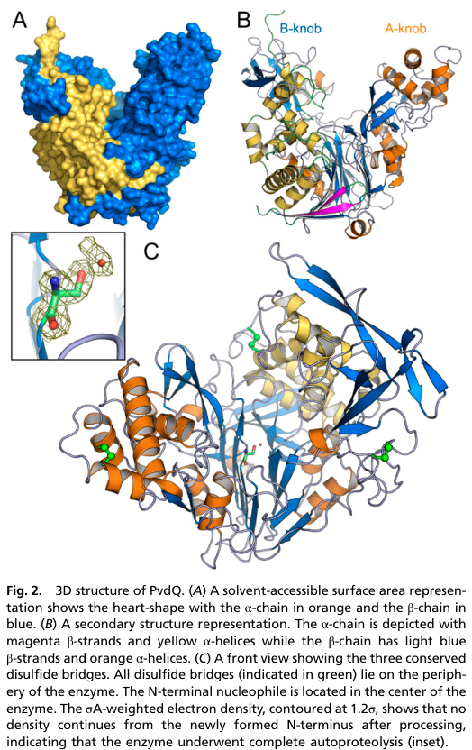

## Question

# Gene Research for Functional Annotation

## ⚠️ CRITICAL: Gene/Protein Identification Context

**BEFORE YOU BEGIN RESEARCH:** You MUST verify you are researching the CORRECT gene/protein. Gene symbols can be ambiguous, especially for less well-characterized genes from non-model organisms.

### Target Gene/Protein Identity (from UniProt):
- **UniProt Accession:** Q88IU8
- **Protein Description:** RecName: Full=Acyl-homoserine lactone acylase PvdQ; Short=AHL acylase PvdQ; Short=Acyl-HSL acylase PvdQ; EC=3.5.1.97; Contains: RecName: Full=Acyl-homoserine lactone acylase PvdQ subunit alpha; Short=Acyl-HSL acylase PvdQ subunit alpha; Contains: RecName: Full=Acyl-homoserine lactone acylase PvdQ subunit beta; Short=Acyl-HSL acylase PvdQ subunit beta; Flags: Precursor;
- **Gene Information:** Name=pvdQ; OrderedLocusNames=PP_2901;
- **Organism (full):** Pseudomonas putida (strain ATCC 47054 / DSM 6125 / CFBP 8728 / NCIMB 11950 / KT2440).
- **Protein Family:** Belongs to the peptidase S45 family. .
- **Key Domains:** Ntn_hydrolases_N. (IPR029055); Penicillin_amidase_A-knob. (IPR043147); Penicillin_amidase_dom1. (IPR023343); Penicillin_amidase_N_B-knob. (IPR043146); S45. (IPR002692)

### MANDATORY VERIFICATION STEPS:

1. **Check if the gene symbol "pvdQ" matches the protein description above**
2. **Verify the organism is correct:** Pseudomonas putida (strain ATCC 47054 / DSM 6125 / CFBP 8728 / NCIMB 11950 / KT2440).
3. **Check if protein family/domains align with what you find in literature**
4. **If you find literature for a DIFFERENT gene with the same or similar symbol, STOP**

### If Gene Symbol is Ambiguous or You Cannot Find Relevant Literature:

**DO NOT PROCEED WITH RESEARCH ON A DIFFERENT GENE.** Instead:
- State clearly: "The gene symbol 'pvdQ' is ambiguous or literature is limited for this specific protein"
- Explain what you found (e.g., "Found extensive literature on a different gene with the same symbol in a different organism")
- Describe the protein based ONLY on the UniProt information provided above
- Suggest that the protein function can be inferred from domain/family information

### Research Target:

Please provide a comprehensive research report on the gene **pvdQ** (gene ID: pvdQ, UniProt: Q88IU8) in PSEPK.

The research report should be a detailed narrative explaining the function, biological processes, and localization of the gene product. Citations should be given for all claims.

You should prioritize authoritative reviews and primary scientific literature when conducting research. You can supplement
this with annotations you find in gene/protein databases, but these can be outdated or inaccurate.

We are specifically interested in the primary function of the gene - for enzymes, what reaction is catalyzed, and what is the substrate specificity? For transporters, what is the substrate? For structural proteins or adapters, what is the broader structural role? For signaling molecules, what is the role in the pathway.

We are interested in where in or outside the cell the gene product carries out its function.

We are also interested in the signaling or biochemical pathways in which the gene functions. We are less interested in broad pleiotropic effects, except where these elucidate the precise role.

Include evidence where possible. We are interested in both experimental evidence as well as inference from structure, evolution, or bioinformatic analysis. Precise studies should be prioritized over high-throughput, where available.

## Output

Question: You are an expert researcher providing comprehensive, well-cited information.

Provide detailed information focusing on:
1. Key concepts and definitions with current understanding
2. Recent developments and latest research (prioritize 2023-2024 sources)
3. Current applications and real-world implementations
4. Expert opinions and analysis from authoritative sources
5. Relevant statistics and data from recent studies

Format as a comprehensive research report with proper citations. Include URLs and publication dates where available.
Always prioritize recent, authoritative sources and provide specific citations for all major claims.

# Gene Research for Functional Annotation

## ⚠️ CRITICAL: Gene/Protein Identification Context

**BEFORE YOU BEGIN RESEARCH:** You MUST verify you are researching the CORRECT gene/protein. Gene symbols can be ambiguous, especially for less well-characterized genes from non-model organisms.

### Target Gene/Protein Identity (from UniProt):
- **UniProt Accession:** Q88IU8
- **Protein Description:** RecName: Full=Acyl-homoserine lactone acylase PvdQ; Short=AHL acylase PvdQ; Short=Acyl-HSL acylase PvdQ; EC=3.5.1.97; Contains: RecName: Full=Acyl-homoserine lactone acylase PvdQ subunit alpha; Short=Acyl-HSL acylase PvdQ subunit alpha; Contains: RecName: Full=Acyl-homoserine lactone acylase PvdQ subunit beta; Short=Acyl-HSL acylase PvdQ subunit beta; Flags: Precursor;
- **Gene Information:** Name=pvdQ; OrderedLocusNames=PP_2901;
- **Organism (full):** Pseudomonas putida (strain ATCC 47054 / DSM 6125 / CFBP 8728 / NCIMB 11950 / KT2440).
- **Protein Family:** Belongs to the peptidase S45 family. .
- **Key Domains:** Ntn_hydrolases_N. (IPR029055); Penicillin_amidase_A-knob. (IPR043147); Penicillin_amidase_dom1. (IPR023343); Penicillin_amidase_N_B-knob. (IPR043146); S45. (IPR002692)

### MANDATORY VERIFICATION STEPS:

1. **Check if the gene symbol "pvdQ" matches the protein description above**
2. **Verify the organism is correct:** Pseudomonas putida (strain ATCC 47054 / DSM 6125 / CFBP 8728 / NCIMB 11950 / KT2440).
3. **Check if protein family/domains align with what you find in literature**
4. **If you find literature for a DIFFERENT gene with the same or similar symbol, STOP**

### If Gene Symbol is Ambiguous or You Cannot Find Relevant Literature:

**DO NOT PROCEED WITH RESEARCH ON A DIFFERENT GENE.** Instead:
- State clearly: "The gene symbol 'pvdQ' is ambiguous or literature is limited for this specific protein"
- Explain what you found (e.g., "Found extensive literature on a different gene with the same symbol in a different organism")
- Describe the protein based ONLY on the UniProt information provided above
- Suggest that the protein function can be inferred from domain/family information

### Research Target:

Please provide a comprehensive research report on the gene **pvdQ** (gene ID: pvdQ, UniProt: Q88IU8) in PSEPK.

The research report should be a detailed narrative explaining the function, biological processes, and localization of the gene product. Citations should be given for all claims.

You should prioritize authoritative reviews and primary scientific literature when conducting research. You can supplement
this with annotations you find in gene/protein databases, but these can be outdated or inaccurate.

We are specifically interested in the primary function of the gene - for enzymes, what reaction is catalyzed, and what is the substrate specificity? For transporters, what is the substrate? For structural proteins or adapters, what is the broader structural role? For signaling molecules, what is the role in the pathway.

We are interested in where in or outside the cell the gene product carries out its function.

We are also interested in the signaling or biochemical pathways in which the gene functions. We are less interested in broad pleiotropic effects, except where these elucidate the precise role.

Include evidence where possible. We are interested in both experimental evidence as well as inference from structure, evolution, or bioinformatic analysis. Precise studies should be prioritized over high-throughput, where available.

## Research report: **pvdQ (UniProt Q88IU8; PP_2901)** in *Pseudomonas putida* KT2440

### Executive summary (identity-verified)
The target protein **PvdQ** (UniProt **Q88IU8**; gene **pvdQ**; locus **PP_2901**) is annotated as an **acyl-homoserine lactone acylase** (AHL acylase; **EC 3.5.1.97**) belonging to the **N-terminal nucleophile (Ntn) hydrolase / peptidase S45 family**, produced as a precursor that maturates into **α/β subunits**. In the tool-retrieved literature set, **direct experimental characterization in *P. putida* KT2440 is limited**; most mechanistic/biochemical detail comes from the **homologous, extensively studied PvdQ from *Pseudomonas aeruginosa***, which is commonly used as the reference for this enzyme family. All *P. aeruginosa* claims below are explicitly treated as **orthology-based functional inference** for *P. putida* Q88IU8 unless otherwise stated. (bokhove2010thequorumquenchingnacyl pages 1-2, bitzenhofer2024exploringengineeredvesiculation pages 10-11)

---

## 1) Key concepts and definitions (current understanding)

### 1.1 Quorum sensing (QS) and quorum quenching (QQ)
Gram-negative bacteria frequently coordinate group behaviors (e.g., biofilm maturation, secreted factors) using **N-acyl-L-homoserine lactones (AHLs)** as diffusible QS signals. **Quorum quenching** refers to chemical disruption of QS signals; enzymatic QQ includes **AHL lactonases** (ring opening) and **AHL acylases** (amide-bond cleavage). (utari2017decipheringphysiologicalfunctions pages 2-4)

### 1.2 AHL acylases and EC 3.5.1.97
**AHL acylases (EC 3.5.1.97)** catalyze **irreversible amide hydrolysis** of AHLs, producing **homoserine lactone** and the corresponding **fatty acid**. This chemistry is central to the established function of PvdQ-family enzymes and is emphasized in modern engineering studies focused on measuring real-time homoserine lactone product formation. (sompiyachoke2024engineeringquorumquenching pages 1-5, sompiyachoke2024engineeringquorumquenching pages 9-12)

### 1.3 N-terminal nucleophile (Ntn) hydrolases (peptidase S45 family)
PvdQ-family enzymes are **Ntn hydrolases**: they are typically translated as **inactive precursors** that undergo **autoproteolysis** to generate active **α- and β-subunits**, exposing an N-terminal catalytic nucleophile (often **Ser/Thr/Cys**) at the start of the β-chain. This activation mechanism and the α/β architecture are highlighted for AHL-acylase families in authoritative reviews. (utari2017decipheringphysiologicalfunctions pages 2-4)

---

## 2) Gene/protein function: reaction, substrate specificity, and mechanism

### 2.1 Primary molecular function (best-supported)
**Most defensible functional assignment for *P. putida* Q88IU8** based on domain/family identity and strong homology is:

- **Enzyme class:** AHL acylase / amidohydrolase (EC 3.5.1.97) (inference by homology)
- **Reaction:** hydrolysis of the **amide bond** linking the AHL acyl chain to the homoserine lactone core (inference by homology)
- **Likely substrate preference:** **long-chain AHLs** (inference by homology)

This assignment is mechanistically anchored by high-resolution structural and catalytic data for homologous PvdQ (see below), but **direct enzymology for KT2440 Q88IU8 was not retrieved** in this run. (bokhove2010thequorumquenchingnacyl pages 1-2, bokhove2010thequorumquenchingnacyl pages 2-3)

### 2.2 Structural/mechanistic evidence from the reference PvdQ (homolog; *P. aeruginosa*)
A landmark structure solved at **1.8 Å** demonstrated that PvdQ is an **α/β heterodimeric Ntn hydrolase** that undergoes **complete autoproteolysis** into an **α-chain (~171 aa)** and **β-chain (~546 aa)**; the **N-terminal serine of the β-chain (Serβ1)** is the catalytic nucleophile. (bokhove2010thequorumquenchingnacyl pages 2-3)

The same work showed a **deep hydrophobic substrate pocket** specialized for accommodating **long fatty-acid–like acyl chains** of AHLs (e.g., C12), including an **induced-fit gate** involving **Pheβ24** that opens upon substrate/product binding. (bokhove2010thequorumquenchingnacyl pages 2-3)

**Visual structural evidence** in that study includes: (i) the overall α/β heterodimer fold, (ii) the long-chain binding pocket with bound ligands, and (iii) active-site details and a covalent intermediate consistent with Ntn-hydrolase catalysis. (bokhove2010thequorumquenchingnacyl media 88afd601, bokhove2010thequorumquenchingnacyl media b51a75cc, bokhove2010thequorumquenchingnacyl media 58576db1, bokhove2010thequorumquenchingnacyl media 35e54e16)

### 2.3 Cellular localization and maturation (homolog-based inference to Q88IU8)
Multiple sources describe PvdQ as **periplasmic** in the reference system and link this to a **signal peptide / Sec-dependent export** and maturation to α/β subunits characteristic of Ntn hydrolases. (rice2010characterizationofan pages 32-37, drake2011structuralcharacterizationand pages 1-2, utari2017decipheringphysiologicalfunctions pages 2-4)

The disulfide-rich nature of the crystallized enzyme is also consistent with periplasmic localization (oxidizing environment), and conservation of these features among *Pseudomonas* homologs is emphasized in the structural work. (bokhove2010thequorumquenchingnacyl pages 2-3)

**For *P. putida* KT2440 Q88IU8**, periplasmic localization is therefore best treated as a **strong inference** from family biology and precursor annotation; however, **no KT2440-specific localization experiment** was retrieved here. (utari2017decipheringphysiologicalfunctions pages 2-4, bokhove2010thequorumquenchingnacyl pages 2-3)

---

## 3) Biological processes and pathway context

### 3.1 Nexus of quorum signaling and iron uptake (evidence primarily from *P. aeruginosa*)
PvdQ is widely discussed as a protein positioned at the intersection of:

1. **Quorum quenching:** cleavage of long-chain AHLs to reduce QS signal strength (evidence in reference homolog). (bokhove2010thequorumquenchingnacyl pages 1-2, clevenger2015investigationandengineering pages 28-34)
2. **Siderophore/pyoverdine pathway:** PvdQ is described as a **periplasmic hydrolase required for pyoverdine production**, with evidence that it can remove a **myristoyl/fatty-acyl moiety** from an acylated pyoverdine precursor (PVDIq) in the periplasm (evidence in reference homolog). (drake2011structuralcharacterizationand pages 1-2, clevenger2015investigationandengineering pages 28-34)

Because the gene name **pvdQ** is embedded in “pyoverdine (pvd)” gene clusters in fluorescent pseudomonads, these roles are often discussed together; nonetheless, **direct demonstration of pyoverdine precursor deacylation by Q88IU8 in KT2440 was not retrieved**. (drake2011structuralcharacterizationand pages 1-2, bitzenhofer2024exploringengineeredvesiculation pages 10-11)

### 3.2 Direct *P. putida* KT2440 phenotype evidence (2024)
A 2024 *Microbial Biotechnology* study investigating engineered vesiculation in *P. putida* KT2440 reported that **downregulation of pvdQ by CRISPRi** and a **pvdQ deletion mutant** both yielded increased signals consistent with **enhanced outer membrane vesicle (OMV) production** (hypervesiculation), measured across vesiculation assays (protein/lipid signals and other OMV-related readouts in their screen). This establishes that KT2440 pvdQ (PP_2901) measurably affects envelope/vesicle physiology under the tested conditions, though it does not identify the molecular substrate(s) in KT2440. (bitzenhofer2024exploringengineeredvesiculation pages 10-11)

---

## 4) Recent developments (prioritizing 2023–2024) and latest research

### 4.1 2024 enzyme engineering: stability, assay innovation, and formulation
A 2024 *Protein Science* study engineered AHL acylases (including **PvdQ**) to improve properties important for real-world use (e.g., coatings, solvent exposure). Key advances include:

- **Assay development:** a time-course kinetic assay monitoring **homoserine lactone production** in real time, addressing a bottleneck in low-throughput acylase measurements. (sompiyachoke2024engineeringquorumquenching pages 1-5)
- **Thermostabilization:** designed PvdQ variants increased melting temperature by up to **+13.2 °C** compared with WT (WT ~48.8–48.9 °C; variants +9.2, +11.7, +13.2 °C). (sompiyachoke2024engineeringquorumquenching pages 5-9)
- **Solvent tolerance and formulation:** variants maintained higher activity than WT under organic solvent exposure; in one example **P3 retained >80% activity at 15% ethanol** and showed **>2×** WT activity under that condition. When formulated into a silicone paint base, variants retained substantial activity over time (e.g., after 21 days, P1 ~60% vs WT nearly inactive). (sompiyachoke2024engineeringquorumquenching pages 9-12)
- **Catalytic efficiency reporting:** the same study reports **kcat/KM** values for WT PvdQ (e.g., **2.22×10^4 s−1 M−1** for 3-oxo-C12-HSL; **1.75×10^3 s−1 M−1** for C8-HSL in their assay format) and contrasts these with earlier literature values. (sompiyachoke2024engineeringquorumquenching pages 9-12)

Although the engineered PvdQ used in this study is not explicitly stated (in the extracted evidence) to be derived from *P. putida* KT2440, the work is highly relevant to **PvdQ-family enzymes**, and it provides current expert-level mechanistic framing and performance metrics. (sompiyachoke2024engineeringquorumquenching pages 1-5, sompiyachoke2024engineeringquorumquenching pages 9-12)

### 4.2 Mechanistic reinforcement: catalytic intermediates
The 2024 engineering study also reports crystallographic capture of acyl-enzyme intermediates in related AHL acylases (and discusses analogous intermediates for PvdQ), supporting the Ntn-hydrolase catalytic framework in which the β-chain N-terminal serine participates directly in catalysis. (sompiyachoke2024engineeringquorumquenching pages 18-22)

### 4.3 2024 systems-level KT2440 connection
The 2024 vesiculation study provides a current KT2440-specific experimental anchor: pvdQ is a manipulable determinant influencing OMV production and may therefore be relevant in **industrial chassis strain engineering** where vesiculation can affect secretion, stress tolerance, and product yields. (bitzenhofer2024exploringengineeredvesiculation pages 10-11)

---

## 5) Current applications and real-world implementations

### 5.1 Anti-biofilm and anti-virulence strategies (quorum quenching)
PvdQ is frequently treated as a prototype enzyme for **non-antibiotic anti-virulence** strategies: rather than killing bacteria, it reduces QS signal availability by **irreversible AHL cleavage**, which can suppress QS-regulated phenotypes such as biofilm-associated traits (general framing). (utari2017decipheringphysiologicalfunctions pages 2-4)

A practical, formulation-oriented direction is to incorporate AHL acylases into **materials and coatings** (e.g., silicone-based formulations). The 2024 engineering study explicitly targeted this need, demonstrating improved enzyme robustness after formulation in a silicone paint base. (sompiyachoke2024engineeringquorumquenching pages 9-12)

### 5.2 Enzyme engineering for deployment
Engineering improvements that increase **thermal stability, solvent resistance, and coating compatibility** directly address deployment constraints for immobilized enzymes on device or industrial surfaces. The 2024 study’s stabilizing substitutions (PROSS-designed variants) provide a concrete example of this translational path. (sompiyachoke2024engineeringquorumquenching pages 5-9, sompiyachoke2024engineeringquorumquenching pages 9-12)

### 5.3 KT2440 as a biotechnological chassis (indirect relevance)
The 2024 KT2440 vesiculation work used pvdQ manipulation as part of a chassis-optimization strategy; pvdQ deletion increased vesicle-associated protein and lipid signals, suggesting a potential lever for engineering envelope/secretory phenotypes in industrial *P. putida* KT2440 contexts. (bitzenhofer2024exploringengineeredvesiculation pages 10-11)

---

## 6) Expert opinions and authoritative analysis

A focused review on AHL acylases emphasizes that these enzymes are broadly distributed across taxa and that **substrate specificity (often chain-length preference)** and **cellular compartmentalization (frequently periplasmic maturation/export)** shape physiological roles. This review explicitly uses PvdQ as an exemplar of Ntn-hydrolase AHL acylases, describing common maturation logic (precursor → α/β) and structural determinants of long-chain specificity. (utari2017decipheringphysiologicalfunctions pages 2-4)

High-impact primary structural biology work positions PvdQ as a canonical example of a quorum-quenching AHL acylase with an “unusual” substrate-binding pocket adapted to long acyl chains, providing the mechanistic explanation for specificity. (bokhove2010thequorumquenchingnacyl pages 2-3)

---

## 7) Relevant statistics and quantitative data (recent and foundational)

Key quantitative points extracted from the retrieved literature:

- **Crystal structure resolution:** 1.8 Å for reference PvdQ structure (foundational mechanistic evidence). (bokhove2010thequorumquenchingnacyl pages 2-3)
- **Maturation products:** α-chain ~171 aa and β-chain ~546 aa after autoproteolysis (reference homolog). (bokhove2010thequorumquenchingnacyl pages 2-3)
- **Thermal stability improvements (2024):** PvdQ engineered variants with **Tm increases up to +13.2 °C** vs WT. (sompiyachoke2024engineeringquorumquenching pages 5-9)
- **Catalytic efficiency (2024):** WT PvdQ **kcat/KM ~2.22×10^4 s−1 M−1** (3-oxo-C12-HSL) and **~1.75×10^3 s−1 M−1** (C8-HSL) in the study’s assay conditions. (sompiyachoke2024engineeringquorumquenching pages 9-12)
- **Formulation durability (2024):** in silicone paint base, variants retained **>60% activity after 4 days** while WT lost ~70%; by **21 days**, P1 retained ~60% while WT was nearly inactive. (sompiyachoke2024engineeringquorumquenching pages 9-12)

---

## 8) Evidence limitations specific to *P. putida* KT2440 Q88IU8

Despite strong functional inference from family/orthology, the retrieved corpus in this run did **not** include:

- a KT2440-specific biochemical assay showing Q88IU8 hydrolyzes particular AHLs,
- a KT2440-specific localization experiment (e.g., periplasmic fractionation), or
- a KT2440-specific demonstration of a pyoverdine precursor deacylation substrate.

Accordingly, the report separates:

- **Direct KT2440 evidence:** pvdQ deletion/downregulation affects OMV vesiculation phenotypes (2024). (bitzenhofer2024exploringengineeredvesiculation pages 10-11)
- **Homology-backed functional inference:** AHL acylase activity, long-chain specificity, Ntn-hydrolase processing, periplasmic localization, and active-site mechanism largely established in *P. aeruginosa* PvdQ structural/biochemical studies. (bokhove2010thequorumquenchingnacyl pages 2-3, drake2011structuralcharacterizationand pages 1-2, utari2017decipheringphysiologicalfunctions pages 2-4)

---

## Summary table (evidence-scoped)
The following table consolidates functional annotation elements and explicitly flags whether evidence is direct for KT2440 or inferred from homologs.

| Aspect | Key details | Key references | URL/DOI |
|---|---|---|---|
| Reaction | **UniProt Q88IU8 / pvdQ / PP_2901** is annotated as **acyl-homoserine lactone acylase PvdQ (EC 3.5.1.97)**. The catalyzed reaction is **amide-bond hydrolysis** of N-acyl-L-homoserine lactones to release **homoserine lactone + the corresponding fatty acid**; this is the established chemistry for PvdQ-family AHL acylases, but **not directly biochemically demonstrated for the P. putida KT2440 protein in the retrieved literature**. Direct enzymology is from homologous **P. aeruginosa** PvdQ and engineered PvdQ studies (bokhove2010thequorumquenchingnacyl pages 1-2, sompiyachoke2024engineeringquorumquenching pages 1-5). | Bokhove 2010, *PNAS*; Sompiyachoke & Elias 2024, *Protein Science* | https://doi.org/10.1073/pnas.0911839107; https://doi.org/10.1002/pro.4954 |
| Substrates | PvdQ shows preference for **long-chain AHLs**. Structural and biochemical work on homologous **P. aeruginosa** PvdQ supports activity toward **C12-HSL and 3-oxo-C12-HSL**; review/engineering sources summarize preference for **acyl chains >8 carbons** and earlier reports of activity on **C8-HSL, C12-HSL, 3-oxo-C12-HSL** but not **C4-HSL** in that species. For **Q88IU8 in P. putida**, substrate range is **inferred by homology**, not directly shown in the retrieved primary literature (clevenger2015investigationandengineering pages 28-34, utari2017decipheringphysiologicalfunctions pages 2-4, bokhove2010thequorumquenchingnacyl pages 1-2, sompiyachoke2024engineeringquorumquenching pages 1-5, sompiyachoke2024engineeringquorumquenching pages 5-9). | Bokhove 2010, *PNAS*; Utari et al. 2017, *Front. Microbiol.*; Sompiyachoke & Elias 2024, *Protein Science* | https://doi.org/10.1073/pnas.0911839107; https://doi.org/10.3389/fmicb.2017.01123; https://doi.org/10.1002/pro.4954 |
| Mechanism | PvdQ is an **N-terminal nucleophile (Ntn) hydrolase**. The mature catalytic nucleophile is **Serβ1**; the **oxyanion hole** includes **Valβ70** and **Asnβ269/278** (numbering differs slightly by source). A **covalent acyl-enzyme intermediate** and induced-fit opening of the acyl pocket gated by **Pheβ24** were observed in structural studies. A high-resolution homolog structure was solved at **1.8 Å**. These mechanistic data are from **P. aeruginosa PvdQ / engineered PvdQ**, and are **inferred for P. putida Q88IU8** because UniProt/domain architecture matches the same S45/Ntn-hydrolase family (bokhove2010thequorumquenchingnacyl pages 2-3, bokhove2010thequorumquenchingnacyl pages 1-2, sompiyachoke2024engineeringquorumquenching pages 18-22, bokhove2010thequorumquenchingnacyl media 88afd601). | Bokhove 2010, *PNAS*; Sompiyachoke & Elias 2024, *Protein Science* | https://doi.org/10.1073/pnas.0911839107; https://doi.org/10.1002/pro.4954 |
| Processing | PvdQ is synthesized as a **single precursor** that undergoes **autoproteolytic maturation** to an **α/β heterodimer**. Reported sizes for the homologous mature enzyme are approximately **α-chain 171 aa / ~18 kDa** and **β-chain 546 aa / ~60 kDa**, generated after excision of a short linker/prosegment (including a reported **23-residue prosegment** in structural work). This processing is experimentally demonstrated for **P. aeruginosa** PvdQ and strongly supported for **P. putida Q88IU8** by the UniProt precursor annotation and conserved family assignment, but direct maturation data for KT2440 were not retrieved (bokhove2010thequorumquenchingnacyl pages 2-3, rice2010characterizationofan pages 32-37, utari2017decipheringphysiologicalfunctions pages 2-4, bokhove2010thequorumquenchingnacyl pages 1-2). | Bokhove 2010, *PNAS*; Rice 2010 thesis; Utari et al. 2017, *Front. Microbiol.* | https://doi.org/10.1073/pnas.0911839107; https://doi.org/10.3389/fmicb.2017.01123 |
| Localization | Multiple lines of homolog evidence indicate **periplasmic localization**: presence of an **N-terminal signal peptide / Sec-type export motif**, disulfide-bond-rich mature structure, and explicit reports that PvdQ acts as a **periplasmic hydrolase**. For **P. putida Q88IU8**, localization is therefore **best interpreted as periplasmic, inferred from strong homology and precursor/signal-peptide annotation**, but no direct KT2440 localization experiment was retrieved (bokhove2010thequorumquenchingnacyl pages 2-3, rice2010characterizationofan pages 32-37, drake2011structuralcharacterizationand pages 1-2, rice2010characterizationofan pages 37-42, utari2017decipheringphysiologicalfunctions pages 2-4). | Rice 2010 thesis; Drake & Gulick 2011, *ACS Chem. Biol.*; Bokhove 2010, *PNAS* | https://doi.org/10.1021/cb2002973; https://doi.org/10.1073/pnas.0911839107 |
| Pathway role | **Important disambiguation:** the symbol **pvdQ** is associated with pyoverdine gene clusters in fluorescent pseudomonads, but the **best direct pathway evidence is from P. aeruginosa**, where PvdQ removes a **myristoyl/fatty-acyl group** from an acylated pyoverdine precursor (**PVDIq**) in the **periplasm**, linking the enzyme to **pyoverdine maturation** as well as quorum-quenching. For **P. putida KT2440 Q88IU8**, a pyoverdine-related role is **plausible by orthology/name**, but the retrieved literature did **not** provide direct biochemical demonstration in KT2440 (clevenger2015investigationandengineering pages 28-34, drake2011structuralcharacterizationand pages 1-2). | Drake & Gulick 2011, *ACS Chem. Biol.*; Clevenger 2015 thesis | https://doi.org/10.1021/cb2002973; https://doi.org/10.15781/t2j35z |
| Evidence in *P. putida* | **Direct species-specific evidence for KT2440 is limited in the retrieved set.** A 2024 study experimentally **deleted pvdQ in P. putida KT2440** and found that loss/downregulation caused **increased outer-membrane-vesicle-associated protein and lipid signal** (hypervesiculation phenotype) in a vesiculation screen. This supports that **PP_2901 is an active cellular determinant in envelope/vesicle physiology**, but it does **not directly establish its biochemical substrate or reaction** in KT2440 (bitzenhofer2024exploringengineeredvesiculation pages 10-11). | Bitzenhofer et al. 2024, *Microbial Biotechnology* | https://doi.org/10.1111/1751-7915.14312 |
| Evidence in *P. aeruginosa* / other | The homologous **P. aeruginosa** enzyme is extensively characterized: **1.8 Å** structure; long-chain AHL-binding pocket; **α/β maturation**; **Serβ1** catalytic nucleophile; role in **pyoverdine precursor deacylation**; quorum-quenching activity against **long-chain AHLs**. Engineering work further quantified performance: WT-PvdQ **kcat/KM ~2.22×10^4 s^-1 M^-1 for 3-oxo-C12-HSL** and **~1.75×10^3 s^-1 M^-1 for C8-HSL** in one 2024 assay format; designed variants increased **Tm by 9.2, 11.7, and 13.2 °C** and improved solvent/coating robustness. These data are the main basis for **functional inference to Q88IU8** (bokhove2010thequorumquenchingnacyl pages 2-3, drake2011structuralcharacterizationand pages 1-2, bokhove2010thequorumquenchingnacyl pages 1-2, sompiyachoke2024engineeringquorumquenching pages 9-12, sompiyachoke2024engineeringquorumquenching pages 5-9). | Bokhove 2010, *PNAS*; Drake & Gulick 2011, *ACS Chem. Biol.*; Sompiyachoke & Elias 2024, *Protein Science* | https://doi.org/10.1073/pnas.0911839107; https://doi.org/10.1021/cb2002973; https://doi.org/10.1002/pro.4954 |

*Table: This table summarizes the most relevant functional annotation points for UniProt Q88IU8 (Pseudomonas putida KT2440 pvdQ/PP_2901), separating direct evidence in P. putida from stronger mechanistic and biochemical evidence available for homologous PvdQ proteins, especially from P. aeruginosa.*

---

## Key sources (URLs and publication dates)
- Bokhove M. et al. **2010-12**. *PNAS*. “The quorum-quenching N-acyl homoserine lactone acylase PvdQ is an Ntn-hydrolase with an unusual substrate-binding pocket.” https://doi.org/10.1073/pnas.0911839107 (bokhove2010thequorumquenchingnacyl pages 2-3)
- Drake EJ & Gulick AM. **2011-11**. *ACS Chemical Biology*. “Structural characterization and high-throughput screening of inhibitors of PvdQ, an NTN hydrolase involved in pyoverdine synthesis.” https://doi.org/10.1021/cb2002973 (drake2011structuralcharacterizationand pages 1-2)
- Utari PD. et al. **2017-06**. *Frontiers in Microbiology*. “Deciphering Physiological Functions of AHL Quorum Quenching Acylases.” https://doi.org/10.3389/fmicb.2017.01123 (utari2017decipheringphysiologicalfunctions pages 2-4)
- Bitzenhofer NL. et al. **2024-07**. *Microbial Biotechnology*. “Exploring engineered vesiculation by Pseudomonas putida KT2440 for natural product biosynthesis.” https://doi.org/10.1111/1751-7915.14312 (bitzenhofer2024exploringengineeredvesiculation pages 10-11)
- Sompiyachoke K & Elias MH. **2024-03**. *Protein Science*. “Engineering quorum quenching acylases with improved kinetic and biochemical properties.” https://doi.org/10.1002/pro.4954 (sompiyachoke2024engineeringquorumquenching pages 1-5)

References

1. (bokhove2010thequorumquenchingnacyl pages 1-2): Marcel Bokhove, Pol Nadal Jimenez, Wim J. Quax, and Bauke W. Dijkstra. The quorum-quenching n-acyl homoserine lactone acylase pvdq is an ntn-hydrolase with an unusual substrate-binding pocket. Proceedings of the National Academy of Sciences, 107:686-691, Dec 2010. URL: https://doi.org/10.1073/pnas.0911839107, doi:10.1073/pnas.0911839107. This article has 182 citations and is from a highest quality peer-reviewed journal.

2. (bitzenhofer2024exploringengineeredvesiculation pages 10-11): Nora Lisa Bitzenhofer, Carolin Höfel, Stephan Thies, Andrea Jeanette Weiler, Christian Eberlein, Hermann J. Heipieper, Renu Batra‐Safferling, Pia Sundermeyer, Thomas Heidler, Carsten Sachse, Tobias Busche, Jörn Kalinowski, Thomke Belthle, Thomas Drepper, Karl‐Erich Jaeger, and Anita Loeschcke. Exploring engineered vesiculation by pseudomonas putida kt2440 for natural product biosynthesis. Microbial Biotechnology, Jul 2024. URL: https://doi.org/10.1111/1751-7915.14312, doi:10.1111/1751-7915.14312. This article has 13 citations and is from a peer-reviewed journal.

3. (utari2017decipheringphysiologicalfunctions pages 2-4): Putri D. Utari, Jan Vogel, and Wim J. Quax. Deciphering physiological functions of ahl quorum quenching acylases. Frontiers in Microbiology, Jun 2017. URL: https://doi.org/10.3389/fmicb.2017.01123, doi:10.3389/fmicb.2017.01123. This article has 107 citations and is from a peer-reviewed journal.

4. (sompiyachoke2024engineeringquorumquenching pages 1-5): Kitty Sompiyachoke and Mikael H. Elias. Engineering quorum quenching acylases with improved kinetic and biochemical properties. Protein Science : A Publication of the Protein Society, Mar 2024. URL: https://doi.org/10.1002/pro.4954, doi:10.1002/pro.4954. This article has 14 citations.

5. (sompiyachoke2024engineeringquorumquenching pages 9-12): Kitty Sompiyachoke and Mikael H. Elias. Engineering quorum quenching acylases with improved kinetic and biochemical properties. Protein Science : A Publication of the Protein Society, Mar 2024. URL: https://doi.org/10.1002/pro.4954, doi:10.1002/pro.4954. This article has 14 citations.

6. (bokhove2010thequorumquenchingnacyl pages 2-3): Marcel Bokhove, Pol Nadal Jimenez, Wim J. Quax, and Bauke W. Dijkstra. The quorum-quenching n-acyl homoserine lactone acylase pvdq is an ntn-hydrolase with an unusual substrate-binding pocket. Proceedings of the National Academy of Sciences, 107:686-691, Dec 2010. URL: https://doi.org/10.1073/pnas.0911839107, doi:10.1073/pnas.0911839107. This article has 182 citations and is from a highest quality peer-reviewed journal.

7. (bokhove2010thequorumquenchingnacyl media 88afd601): Marcel Bokhove, Pol Nadal Jimenez, Wim J. Quax, and Bauke W. Dijkstra. The quorum-quenching n-acyl homoserine lactone acylase pvdq is an ntn-hydrolase with an unusual substrate-binding pocket. Proceedings of the National Academy of Sciences, 107:686-691, Dec 2010. URL: https://doi.org/10.1073/pnas.0911839107, doi:10.1073/pnas.0911839107. This article has 182 citations and is from a highest quality peer-reviewed journal.

8. (bokhove2010thequorumquenchingnacyl media b51a75cc): Marcel Bokhove, Pol Nadal Jimenez, Wim J. Quax, and Bauke W. Dijkstra. The quorum-quenching n-acyl homoserine lactone acylase pvdq is an ntn-hydrolase with an unusual substrate-binding pocket. Proceedings of the National Academy of Sciences, 107:686-691, Dec 2010. URL: https://doi.org/10.1073/pnas.0911839107, doi:10.1073/pnas.0911839107. This article has 182 citations and is from a highest quality peer-reviewed journal.

9. (bokhove2010thequorumquenchingnacyl media 58576db1): Marcel Bokhove, Pol Nadal Jimenez, Wim J. Quax, and Bauke W. Dijkstra. The quorum-quenching n-acyl homoserine lactone acylase pvdq is an ntn-hydrolase with an unusual substrate-binding pocket. Proceedings of the National Academy of Sciences, 107:686-691, Dec 2010. URL: https://doi.org/10.1073/pnas.0911839107, doi:10.1073/pnas.0911839107. This article has 182 citations and is from a highest quality peer-reviewed journal.

10. (bokhove2010thequorumquenchingnacyl media 35e54e16): Marcel Bokhove, Pol Nadal Jimenez, Wim J. Quax, and Bauke W. Dijkstra. The quorum-quenching n-acyl homoserine lactone acylase pvdq is an ntn-hydrolase with an unusual substrate-binding pocket. Proceedings of the National Academy of Sciences, 107:686-691, Dec 2010. URL: https://doi.org/10.1073/pnas.0911839107, doi:10.1073/pnas.0911839107. This article has 182 citations and is from a highest quality peer-reviewed journal.

11. (rice2010characterizationofan pages 32-37): LJ Rice. Characterization of an ntn-hydrolase, pvdq, and an l-ornithine n5-monooxygenase, pvda, involved in pyoverdine biosynthesis in pseudomonas aeruginosa …. Unknown journal, 2010.

12. (drake2011structuralcharacterizationand pages 1-2): Eric J. Drake and Andrew M. Gulick. Structural characterization and high-throughput screening of inhibitors of pvdq, an ntn hydrolase involved in pyoverdine synthesis. ACS chemical biology, 6 11:1277-86, Nov 2011. URL: https://doi.org/10.1021/cb2002973, doi:10.1021/cb2002973. This article has 98 citations and is from a domain leading peer-reviewed journal.

13. (clevenger2015investigationandengineering pages 28-34): Kenneth David Clevenger. Investigation and engineering of pvdq, a pseudomonas aeruginosa enzyme at the nexus of quorum sensing and iron uptake pathways. Unknown, Jan 2015. URL: https://doi.org/10.15781/t2j35z, doi:10.15781/t2j35z. This article has 0 citations.

14. (sompiyachoke2024engineeringquorumquenching pages 5-9): Kitty Sompiyachoke and Mikael H. Elias. Engineering quorum quenching acylases with improved kinetic and biochemical properties. Protein Science : A Publication of the Protein Society, Mar 2024. URL: https://doi.org/10.1002/pro.4954, doi:10.1002/pro.4954. This article has 14 citations.

15. (sompiyachoke2024engineeringquorumquenching pages 18-22): Kitty Sompiyachoke and Mikael H. Elias. Engineering quorum quenching acylases with improved kinetic and biochemical properties. Protein Science : A Publication of the Protein Society, Mar 2024. URL: https://doi.org/10.1002/pro.4954, doi:10.1002/pro.4954. This article has 14 citations.

16. (rice2010characterizationofan pages 37-42): LJ Rice. Characterization of an ntn-hydrolase, pvdq, and an l-ornithine n5-monooxygenase, pvda, involved in pyoverdine biosynthesis in pseudomonas aeruginosa …. Unknown journal, 2010.

## Artifacts

- [Edison artifact artifact-00](pvdQ-deep-research-falcon_artifacts/artifact-00.md)

## Citations

1. utari2017decipheringphysiologicalfunctions pages 2-4
2. bokhove2010thequorumquenchingnacyl pages 2-3
3. bitzenhofer2024exploringengineeredvesiculation pages 10-11
4. sompiyachoke2024engineeringquorumquenching pages 1-5
5. sompiyachoke2024engineeringquorumquenching pages 5-9
6. sompiyachoke2024engineeringquorumquenching pages 9-12
7. sompiyachoke2024engineeringquorumquenching pages 18-22
8. drake2011structuralcharacterizationand pages 1-2
9. bokhove2010thequorumquenchingnacyl pages 1-2
10. rice2010characterizationofan pages 32-37
11. clevenger2015investigationandengineering pages 28-34
12. rice2010characterizationofan pages 37-42
13. https://doi.org/10.1073/pnas.0911839107;
14. https://doi.org/10.1002/pro.4954
15. https://doi.org/10.3389/fmicb.2017.01123;
16. https://doi.org/10.3389/fmicb.2017.01123
17. https://doi.org/10.1021/cb2002973;
18. https://doi.org/10.1073/pnas.0911839107
19. https://doi.org/10.15781/t2j35z
20. https://doi.org/10.1111/1751-7915.14312
21. https://doi.org/10.1021/cb2002973
22. https://doi.org/10.1073/pnas.0911839107,
23. https://doi.org/10.1111/1751-7915.14312,
24. https://doi.org/10.3389/fmicb.2017.01123,
25. https://doi.org/10.1002/pro.4954,
26. https://doi.org/10.1021/cb2002973,
27. https://doi.org/10.15781/t2j35z,