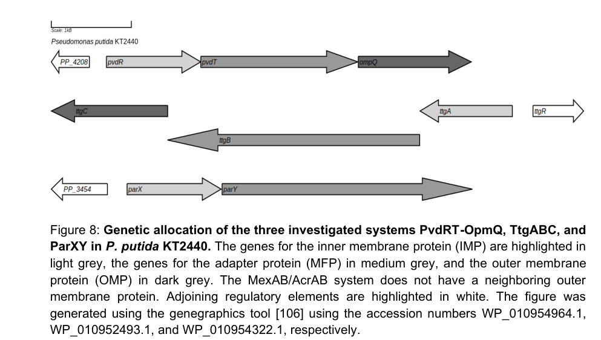

## Question

# Gene Research for Functional Annotation

## ⚠️ CRITICAL: Gene/Protein Identification Context

**BEFORE YOU BEGIN RESEARCH:** You MUST verify you are researching the CORRECT gene/protein. Gene symbols can be ambiguous, especially for less well-characterized genes from non-model organisms.

### Target Gene/Protein Identity (from UniProt):
- **UniProt Accession:** Q88F88
- **Protein Description:** RecName: Full=Pyoverdine export ATP-binding/permease protein PvdT {ECO:0000305}; EC=7.6.2.- {ECO:0000305|PubMed:36807028};
- **Gene Information:** Name=pvdT {ECO:0000303|PubMed:30346656}; OrderedLocusNames=PP_4210 {ECO:0000312|EMBL:AAN69791.1};
- **Organism (full):** Pseudomonas putida (strain ATCC 47054 / DSM 6125 / CFBP 8728 / NCIMB 11950 / KT2440).
- **Protein Family:** Belongs to the ABC transporter superfamily. Macrolide
- **Key Domains:** AAA+_ATPase. (IPR003593); ABC3_permease_C. (IPR003838); ABC_transporter-like_ATP-bd. (IPR003439); ABC_transporter-like_CS. (IPR017871); MacB-like_ATP-bd. (IPR017911)

### MANDATORY VERIFICATION STEPS:

1. **Check if the gene symbol "pvdT" matches the protein description above**
2. **Verify the organism is correct:** Pseudomonas putida (strain ATCC 47054 / DSM 6125 / CFBP 8728 / NCIMB 11950 / KT2440).
3. **Check if protein family/domains align with what you find in literature**
4. **If you find literature for a DIFFERENT gene with the same or similar symbol, STOP**

### If Gene Symbol is Ambiguous or You Cannot Find Relevant Literature:

**DO NOT PROCEED WITH RESEARCH ON A DIFFERENT GENE.** Instead:
- State clearly: "The gene symbol 'pvdT' is ambiguous or literature is limited for this specific protein"
- Explain what you found (e.g., "Found extensive literature on a different gene with the same symbol in a different organism")
- Describe the protein based ONLY on the UniProt information provided above
- Suggest that the protein function can be inferred from domain/family information

### Research Target:

Please provide a comprehensive research report on the gene **pvdT** (gene ID: pvdT, UniProt: Q88F88) in PSEPK.

The research report should be a detailed narrative explaining the function, biological processes, and localization of the gene product. Citations should be given for all claims.

You should prioritize authoritative reviews and primary scientific literature when conducting research. You can supplement
this with annotations you find in gene/protein databases, but these can be outdated or inaccurate.

We are specifically interested in the primary function of the gene - for enzymes, what reaction is catalyzed, and what is the substrate specificity? For transporters, what is the substrate? For structural proteins or adapters, what is the broader structural role? For signaling molecules, what is the role in the pathway.

We are interested in where in or outside the cell the gene product carries out its function.

We are also interested in the signaling or biochemical pathways in which the gene functions. We are less interested in broad pleiotropic effects, except where these elucidate the precise role.

Include evidence where possible. We are interested in both experimental evidence as well as inference from structure, evolution, or bioinformatic analysis. Precise studies should be prioritized over high-throughput, where available.

## Output

Question: You are an expert researcher providing comprehensive, well-cited information.

Provide detailed information focusing on:
1. Key concepts and definitions with current understanding
2. Recent developments and latest research (prioritize 2023-2024 sources)
3. Current applications and real-world implementations
4. Expert opinions and analysis from authoritative sources
5. Relevant statistics and data from recent studies

Format as a comprehensive research report with proper citations. Include URLs and publication dates where available.
Always prioritize recent, authoritative sources and provide specific citations for all major claims.

# Gene Research for Functional Annotation

## ⚠️ CRITICAL: Gene/Protein Identification Context

**BEFORE YOU BEGIN RESEARCH:** You MUST verify you are researching the CORRECT gene/protein. Gene symbols can be ambiguous, especially for less well-characterized genes from non-model organisms.

### Target Gene/Protein Identity (from UniProt):
- **UniProt Accession:** Q88F88
- **Protein Description:** RecName: Full=Pyoverdine export ATP-binding/permease protein PvdT {ECO:0000305}; EC=7.6.2.- {ECO:0000305|PubMed:36807028};
- **Gene Information:** Name=pvdT {ECO:0000303|PubMed:30346656}; OrderedLocusNames=PP_4210 {ECO:0000312|EMBL:AAN69791.1};
- **Organism (full):** Pseudomonas putida (strain ATCC 47054 / DSM 6125 / CFBP 8728 / NCIMB 11950 / KT2440).
- **Protein Family:** Belongs to the ABC transporter superfamily. Macrolide
- **Key Domains:** AAA+_ATPase. (IPR003593); ABC3_permease_C. (IPR003838); ABC_transporter-like_ATP-bd. (IPR003439); ABC_transporter-like_CS. (IPR017871); MacB-like_ATP-bd. (IPR017911)

### MANDATORY VERIFICATION STEPS:

1. **Check if the gene symbol "pvdT" matches the protein description above**
2. **Verify the organism is correct:** Pseudomonas putida (strain ATCC 47054 / DSM 6125 / CFBP 8728 / NCIMB 11950 / KT2440).
3. **Check if protein family/domains align with what you find in literature**
4. **If you find literature for a DIFFERENT gene with the same or similar symbol, STOP**

### If Gene Symbol is Ambiguous or You Cannot Find Relevant Literature:

**DO NOT PROCEED WITH RESEARCH ON A DIFFERENT GENE.** Instead:
- State clearly: "The gene symbol 'pvdT' is ambiguous or literature is limited for this specific protein"
- Explain what you found (e.g., "Found extensive literature on a different gene with the same symbol in a different organism")
- Describe the protein based ONLY on the UniProt information provided above
- Suggest that the protein function can be inferred from domain/family information

### Research Target:

Please provide a comprehensive research report on the gene **pvdT** (gene ID: pvdT, UniProt: Q88F88) in PSEPK.

The research report should be a detailed narrative explaining the function, biological processes, and localization of the gene product. Citations should be given for all claims.

You should prioritize authoritative reviews and primary scientific literature when conducting research. You can supplement
this with annotations you find in gene/protein databases, but these can be outdated or inaccurate.

We are specifically interested in the primary function of the gene - for enzymes, what reaction is catalyzed, and what is the substrate specificity? For transporters, what is the substrate? For structural proteins or adapters, what is the broader structural role? For signaling molecules, what is the role in the pathway.

We are interested in where in or outside the cell the gene product carries out its function.

We are also interested in the signaling or biochemical pathways in which the gene functions. We are less interested in broad pleiotropic effects, except where these elucidate the precise role.

Include evidence where possible. We are interested in both experimental evidence as well as inference from structure, evolution, or bioinformatic analysis. Precise studies should be prioritized over high-throughput, where available.

## Research report: Functional annotation of **pvdT** (UniProt **Q88F88**; locus **PP_4210**) in *Pseudomonas putida* KT2440

### 0) Target verification (gene/protein identity)
The evidence gathered here pertains specifically to *Pseudomonas putida* KT2440 and to the **PvdRT–OpmQ** tripartite efflux pump implicated in **pyoverdine (PVD) secretion/recycling**, in which **PvdT is the inner-membrane ABC (MacB-like) ATPase/permease component**. This matches the UniProt-provided identity context for Q88F88 (pvdT/PP_4210) as a MacB-like ABC transporter subunit involved in pyoverdine export. (stein2023navigatingpyoverdineand pages 29-31, stein2023therndefflux pages 1-2)

### 1) Key concepts and current understanding

#### 1.1 Pyoverdine and the “export/recycling” concept
Pyoverdine is a high-affinity siderophore used by fluorescent pseudomonads to acquire iron under iron-limiting conditions. After iron capture and uptake, the siderophore can be **re-exported** for reuse (“recycling”), enabling repeated iron-scavenging cycles. A recent authoritative review summarizes this recycling logic for *Pseudomonas* pyoverdines, in which the siderophore is not chemically modified during iron release and is directed back to an efflux pump for export. (schalk2025bacterialsiderophoresdiversity pages 46-46)

#### 1.2 Tripartite efflux pumps and the role of PvdT
Tripartite efflux pumps in Gram-negative bacteria span the **inner membrane**, **periplasm**, and **outer membrane**, consisting of an inner-membrane transporter, a periplasmic adaptor protein, and an outer-membrane channel. In *P. putida* KT2440, the **ABC-type** tripartite pump **PvdRT–OpmQ** is described as a transporter responsible for secretion of **newly synthesized and recycled pyoverdine**. (stein2023therndefflux pages 1-2)

Within this system, **PvdT** is identified as the **inner-membrane ABC ATPase component** (MacB-like architecture) that energizes export by ATP hydrolysis and forms a functional complex with the periplasmic adaptor **PvdR** (and the outer-membrane channel **OpmQ** for full tripartite transport). (stein2023navigatingpyoverdineand pages 29-31, stein2023navigatingpyoverdineand pages 43-46)

### 2) Mechanism, substrate specificity, pathway role, and localization (evidence-driven)

#### 2.1 Substrate/function: pyoverdine export and recycling
Multiple sources in the retrieved corpus explicitly frame **PvdRT–OpmQ as mediating pyoverdine secretion**, including both “newly synthesized” and “recycled” pyoverdine in *P. putida* KT2440. (stein2023therndefflux pages 1-2)

Biochemical experiments described in a 2023 dissertation provide **direct interaction/ligand evidence** consistent with pyoverdine as the relevant substrate/ligand for the PvdT-containing complex. Specifically, pyoverdine affected ATPase kinetics and strengthened interaction parameters between the inner-membrane component (PvdT) and adaptor protein (PvdR), consistent with substrate-stabilized assembly and/or coupling. (stein2023navigatingpyoverdineand pages 46-49)

#### 2.2 Cellular localization and complex architecture
PvdT is an **inner-membrane** component of the PvdRT–OpmQ exporter; together with PvdR (periplasmic adaptor) and OpmQ (outer-membrane channel), the complex supports export to the extracellular milieu. This is visually summarized in schematic models of efflux-pump organization and pyoverdine secretion networks in KT2440. (stein2023navigatingpyoverdineand pages 29-31, stein2023navigatingpyoverdineand media 41401d62, stein2023navigatingpyoverdineand media 1c3e68be)

#### 2.3 Quantitative biochemical evidence (ATPase kinetics; effect of pyoverdine)
A key recent biochemical result is quantitative ATPase characterization showing that complex formation and pyoverdine presence measurably alter catalytic parameters:

* **PvdT alone (detergent):** Vmax 9.91; KM(ATP) 0.16 mM; kcat 0.08 s−1; kcat/KM 583.6 M−1 s−1. (stein2023navigatingpyoverdineand pages 46-49)
* **PvdRT (PvdT complexed with PvdR):** Vmax 69.97; KM(ATP) 2.58 mM; kcat 0.58 s−1; kcat/KM 214.2 M−1 s−1. (stein2023navigatingpyoverdineand pages 46-49)
* **With pyoverdine:** PvdT+PVD Vmax 6.43; KM(ATP) 0.06 mM; kcat 0.05 s−1; kcat/KM 955.9 M−1 s−1; and PvdRT+PVD Vmax 40.41; KM(ATP) 1.30 mM; kcat 0.34 s−1; kcat/KM 241.7 M−1 s−1. (stein2023navigatingpyoverdineand pages 46-49)

Interpreting these results at the functional-annotation level: (i) PvdT is an ATP-hydrolyzing component consistent with an ABC exporter; (ii) adaptor complexation changes ATPase behavior; and (iii) pyoverdine can modulate these parameters, consistent with it being a cognate ligand/substrate that couples to complex assembly and/or transport activity. (stein2023navigatingpyoverdineand pages 46-49)

#### 2.4 Genetic/physiological evidence: partial dependence and redundancy
Deletion/inactivation evidence indicates PvdRT–OpmQ is **important but not unique** for pyoverdine export:

* Deletion of **PvdRT–OpmQ** reduces pyoverdine secretion by **~50–60%** and leads to **periplasmic accumulation** of pyoverdine, consistent with a major role in export/recycling but incomplete loss due to compensatory pathways. (stein2023navigatingpyoverdineand pages 29-31)
* A peer-reviewed 2023 study emphasizes that in KT2440, pyoverdine secretion reflects a **network of overlapping tripartite systems**, where deletion of other systems (e.g., the ParXY RND-type system) can reveal conditional phenotypes under iron limitation, and PvdRT–OpmQ and MdtABC–OpmB are highlighted as primary secretion routes. (stein2023therndefflux pages 1-2)

### 3) Recent developments (prioritizing 2023–2024)

#### 3.1 2023: Biochemical “first evidence” for interaction and kinetic modulation
A 2023 KT2440-focused body of work reports biochemical interaction evidence between the PvdRT–OpmQ system and pyoverdine and provides quantitative ATPase kinetics (above), supporting a substrate-coupled transporter model for PvdT within this exporter. (stein2023navigatingpyoverdineand pages 46-49, stein2023navigatingpyoverdineand pages 43-46)

#### 3.2 2023: Systems view—multiple efflux pumps contribute to siderophore secretion
A 2023 peer-reviewed study (Microbiology Spectrum) frames pyoverdine export as a property of **overlapping efflux systems**, and emphasizes that phenotypes can be masked unless multiple exporters are perturbed—important context for annotation and for experimental design (e.g., interpreting partial secretion phenotypes). (stein2023therndefflux pages 1-2)

#### 3.3 2024: Continued emphasis on secretion as a key knowledge gap and an application lever
A 2024 review highlights that secretion mechanisms remain incompletely understood across organisms and argues for deeper genetic and mechanistic study of siderophore synthesis/secretion genes as a route to applications across agriculture, medicine, and environmental contexts. (xie2024exploringthebiological pages 13-15)

### 4) Current applications and real-world implementations (connected to pyoverdine/export systems)
Direct “productized” deployments specifically requiring *P. putida* **PvdT** are not established in the retrieved corpus; however, pyoverdine/siderophore production and (by implication) effective export are repeatedly positioned as enabling technologies in multiple domains:

* **Environmental sensing/bioremediation concepts:** pyoverdine has been used as a biosensor component (example given: fluorescence quenching-based detection of the carcinogen furazolidone). (stein2023navigatingpyoverdineand pages 22-25)
* **Environmental remediation and metal handling:** siderophores’ ability to chelate metals is repeatedly described as enabling removal/management of toxic metals and radionuclides and recovery of valuable elements (e.g., rare earths), with multiple organism examples. (schalk2025bacterialsiderophoresdiversity pages 12-14, schalk2025bacterialsiderophoresdiversity pages 38-42)
* **Agriculture/biocontrol:** siderophore-producing microbes are described as potential **biofertilizers/biopesticides** by improving plant metal nutrition and disrupting pathogen iron acquisition. (schalk2025bacterialsiderophoresdiversity pages 38-42, schalk2025bacterialsiderophoresdiversity pages 12-14)
* **Biomedical/therapeutic concepts:** siderophore pathways can be leveraged for targeted delivery (Trojan-horse-like strategies) and for diagnostics/imaging agent development, in addition to siderophores’ roles in pathogenesis/virulence contexts. (xie2024exploringthebiological pages 15-17, schalk2025bacterialsiderophoresdiversity pages 38-42)

Because export is required to place siderophores in the extracellular environment, PvdT-mediated function is best understood as an **upstream enabler** of these siderophore-dependent phenomena (iron capture, competition, and siderophore-based technologies), even when PvdT is not named in application papers. (stein2023therndefflux pages 1-2, stein2023navigatingpyoverdineand pages 22-25)

### 5) Expert opinions/authoritative synthesis

* A high-authority, recent review presents pyoverdine recycling as a **structured pathway** in which pyoverdine is directed back to an efflux pump for re-export, highlighting export/recycling as an integral part of siderophore-mediated iron acquisition cycles. (schalk2025bacterialsiderophoresdiversity pages 46-46)
* KT2440-focused primary literature emphasizes **redundancy/overlap** among tripartite exporters affecting pyoverdine secretion, implying that “one-gene” knockout phenotypes may be incomplete and that functional annotation should consider network context. (stein2023therndefflux pages 1-2, stein2023navigatingpyoverdineand pages 29-31)

### 6) Practical functional annotation summary (for databases / genome annotation)

**Gene:** pvdT (PP_4210; UniProt Q88F88)

**Recommended functional name:** Pyoverdine export ATP-binding/permease protein PvdT (inner-membrane ABC/MacB-like subunit of PvdRT–OpmQ)

**Primary function:** ATP-dependent component of a tripartite exporter required for efficient secretion/export and recycling of pyoverdine in *P. putida* KT2440. (stein2023therndefflux pages 1-2, stein2023navigatingpyoverdineand pages 29-31)

**Substrate (best supported):** Pyoverdine (siderophore), supported by biochemical modulation of ATPase kinetics by pyoverdine and complex stabilization effects. (stein2023navigatingpyoverdineand pages 46-49)

**Cellular localization:** Inner membrane (as the ABC ATPase/TMD component of the tripartite system spanning inner membrane → periplasm (PvdR) → outer membrane (OpmQ)). (stein2023navigatingpyoverdineand pages 29-31, stein2023navigatingpyoverdineand media 41401d62)

**Pathway role:** Siderophore secretion/export and recycling within pyoverdine-mediated iron acquisition; contributes substantially but redundantly (overlapping with other efflux systems). (stein2023therndefflux pages 1-2, stein2023navigatingpyoverdineand pages 29-31)

### Evidence map (key sources)
| Source (first author, year) | Publication type | Organism/strain | What it says about PvdT/PvdRT-OpmQ (function/substrate/localization) | Key quantitative data | URL/DOI |
|---|---|---|---|---|---|
| Stein, 2023 | Dissertation | *Pseudomonas putida* KT2440 | Identifies PvdT as the inner-membrane ABC ATPase component of the tripartite exporter PvdRT-OpmQ. The system is described as a MacB-like/ABC tripartite exporter involved in export and recycling of the siderophore pyoverdine; PvdT works with periplasmic adapter PvdR and outer-membrane channel OpmQ to move substrate to the exterior. Biochemical interaction data support pyoverdine as a ligand/substrate and support PvdT-PvdR complex formation. Deletion phenotypes are consistent with a major but non-exclusive role in pyoverdine secretion. (stein2023navigatingpyoverdineand pages 46-49, stein2023navigatingpyoverdineand pages 29-31, stein2023navigatingpyoverdineand pages 43-46, stein2023navigatingpyoverdineand pages 49-52) | Deletion of PvdRT-OpmQ reduces pyoverdine secretion by ~50–60%; purification yielded 0.2–0.4 mg PvdR/PvdT from 45 mg total membrane protein. ATPase kinetics reported for PvdT and PvdRT with/without pyoverdine: PvdT Vmax 9.91, KM 0.16 mM, kcat 0.08 s-1, kcat/KM 583.6 M-1 s-1; PvdRT Vmax 69.97, KM 2.58 mM, kcat 0.58 s-1, kcat/KM 214.2 M-1 s-1; PvdT+pyoverdine Vmax 6.43, KM 0.06 mM, kcat 0.05 s-1, kcat/KM 955.9 M-1 s-1; PvdRT+pyoverdine Vmax 40.41, KM 1.30 mM, kcat 0.34 s-1, kcat/KM 241.7 M-1 s-1. (stein2023navigatingpyoverdineand pages 46-49, stein2023navigatingpyoverdineand pages 29-31, stein2023navigatingpyoverdineand pages 43-46) | https://doi.org/10.5282/edoc.32605 |
| Stein, 2023 | Peer-reviewed research article (*Microbiology Spectrum*) | *Pseudomonas putida* KT2440 | States that the ABC-type tripartite efflux system PvdRT-OpmQ mediates secretion of newly synthesized and recycled pyoverdine. Loss of these systems impairs pyoverdine secretion and growth under iron limitation, but effects are partial because of redundancy with other tripartite exporters such as MdtABC-OpmB and ParXY. The excerpt does not resolve subunit-level localization beyond the general tripartite architecture spanning inner membrane, periplasm, and outer membrane. (stein2023therndefflux pages 15-16, stein2023therndefflux pages 1-2) | No PvdT-specific kinetic or binding values in the available snippet; qualitative evidence indicates impaired secretion and iron-limited growth upon inactivation of relevant systems, with partial redundancy. (stein2023therndefflux pages 15-16, stein2023therndefflux pages 1-2) | https://doi.org/10.1128/spectrum.02300-23 |

*Table: This table summarizes the source-backed evidence available in context for PvdT/PvdRT-OpmQ in *Pseudomonas putida* KT2440. It highlights what each source supports about transporter function, substrate, localization, and any quantitative data useful for functional annotation.*

### Limitations of this evidence set
A 2023 FEBS Letters primary article on purification/initial characterization of PvdRT–OpmQ in KT2440 is referenced within the retrieved corpus but was not directly obtainable in this run; thus, the report relies on the 2023 dissertation’s quantitative biochemical data and a 2023 peer-reviewed study’s contextual and genetic claims for KT2440, plus recent high-authority reviews for broader pathway synthesis. (stein2023therndefflux pages 15-16, stein2023navigatingpyoverdineand pages 46-49, schalk2025bacterialsiderophoresdiversity pages 46-46)

References

1. (stein2023navigatingpyoverdineand pages 29-31): Nicola Victoria Maria Stein. Navigating pyoverdine and beyond: the role of tripartite efflux pumps in pseudomonas putida kt2440. Dissertation, Jan 2023. URL: https://doi.org/10.5282/edoc.32605, doi:10.5282/edoc.32605. This article has 1 citations.

2. (stein2023therndefflux pages 1-2): Nicola Victoria Stein, Michelle Eder, Fabienne Burr, Sarah Stoss, Lorenz Holzner, Hans-Henning Kunz, and Heinrich Jung. The rnd efflux system parxy affects siderophore secretion in <i>pseudomonas putida</i> kt2440. Dec 2023. URL: https://doi.org/10.1128/spectrum.02300-23, doi:10.1128/spectrum.02300-23. This article has 8 citations and is from a domain leading peer-reviewed journal.

3. (schalk2025bacterialsiderophoresdiversity pages 46-46): Isabelle J. Schalk. Bacterial siderophores: diversity, uptake pathways and applications. Nature reviews. Microbiology, 23:24-40, Sep 2025. URL: https://doi.org/10.1038/s41579-024-01090-6, doi:10.1038/s41579-024-01090-6. This article has 211 citations.

4. (stein2023navigatingpyoverdineand pages 43-46): Nicola Victoria Maria Stein. Navigating pyoverdine and beyond: the role of tripartite efflux pumps in pseudomonas putida kt2440. Dissertation, Jan 2023. URL: https://doi.org/10.5282/edoc.32605, doi:10.5282/edoc.32605. This article has 1 citations.

5. (stein2023navigatingpyoverdineand pages 46-49): Nicola Victoria Maria Stein. Navigating pyoverdine and beyond: the role of tripartite efflux pumps in pseudomonas putida kt2440. Dissertation, Jan 2023. URL: https://doi.org/10.5282/edoc.32605, doi:10.5282/edoc.32605. This article has 1 citations.

6. (stein2023navigatingpyoverdineand media 41401d62): Nicola Victoria Maria Stein. Navigating pyoverdine and beyond: the role of tripartite efflux pumps in pseudomonas putida kt2440. Dissertation, Jan 2023. URL: https://doi.org/10.5282/edoc.32605, doi:10.5282/edoc.32605. This article has 1 citations.

7. (stein2023navigatingpyoverdineand media 1c3e68be): Nicola Victoria Maria Stein. Navigating pyoverdine and beyond: the role of tripartite efflux pumps in pseudomonas putida kt2440. Dissertation, Jan 2023. URL: https://doi.org/10.5282/edoc.32605, doi:10.5282/edoc.32605. This article has 1 citations.

8. (xie2024exploringthebiological pages 13-15): Benkang Xie, Xinpei Wei, Chu Wan, Wei Zhao, Renfeng Song, Shuquan Xin, and Kai Song. Exploring the biological pathways of siderophores and their multidisciplinary applications: a comprehensive review. Molecules, 29:2318, May 2024. URL: https://doi.org/10.3390/molecules29102318, doi:10.3390/molecules29102318. This article has 75 citations.

9. (stein2023navigatingpyoverdineand pages 22-25): Nicola Victoria Maria Stein. Navigating pyoverdine and beyond: the role of tripartite efflux pumps in pseudomonas putida kt2440. Dissertation, Jan 2023. URL: https://doi.org/10.5282/edoc.32605, doi:10.5282/edoc.32605. This article has 1 citations.

10. (schalk2025bacterialsiderophoresdiversity pages 12-14): Isabelle J. Schalk. Bacterial siderophores: diversity, uptake pathways and applications. Nature reviews. Microbiology, 23:24-40, Sep 2025. URL: https://doi.org/10.1038/s41579-024-01090-6, doi:10.1038/s41579-024-01090-6. This article has 211 citations.

11. (schalk2025bacterialsiderophoresdiversity pages 38-42): Isabelle J. Schalk. Bacterial siderophores: diversity, uptake pathways and applications. Nature reviews. Microbiology, 23:24-40, Sep 2025. URL: https://doi.org/10.1038/s41579-024-01090-6, doi:10.1038/s41579-024-01090-6. This article has 211 citations.

12. (xie2024exploringthebiological pages 15-17): Benkang Xie, Xinpei Wei, Chu Wan, Wei Zhao, Renfeng Song, Shuquan Xin, and Kai Song. Exploring the biological pathways of siderophores and their multidisciplinary applications: a comprehensive review. Molecules, 29:2318, May 2024. URL: https://doi.org/10.3390/molecules29102318, doi:10.3390/molecules29102318. This article has 75 citations.

13. (stein2023navigatingpyoverdineand pages 49-52): Nicola Victoria Maria Stein. Navigating pyoverdine and beyond: the role of tripartite efflux pumps in pseudomonas putida kt2440. Dissertation, Jan 2023. URL: https://doi.org/10.5282/edoc.32605, doi:10.5282/edoc.32605. This article has 1 citations.

14. (stein2023therndefflux pages 15-16): Nicola Victoria Stein, Michelle Eder, Fabienne Burr, Sarah Stoss, Lorenz Holzner, Hans-Henning Kunz, and Heinrich Jung. The rnd efflux system parxy affects siderophore secretion in <i>pseudomonas putida</i> kt2440. Dec 2023. URL: https://doi.org/10.1128/spectrum.02300-23, doi:10.1128/spectrum.02300-23. This article has 8 citations and is from a domain leading peer-reviewed journal.

## Artifacts

- [Edison artifact artifact-00](pvdT-deep-research-falcon_artifacts/artifact-00.md)

## Citations

1. schalk2025bacterialsiderophoresdiversity pages 46-46
2. stein2023therndefflux pages 1-2
3. stein2023navigatingpyoverdineand pages 46-49
4. stein2023navigatingpyoverdineand pages 29-31
5. xie2024exploringthebiological pages 13-15
6. stein2023navigatingpyoverdineand pages 22-25
7. stein2023navigatingpyoverdineand pages 43-46
8. schalk2025bacterialsiderophoresdiversity pages 12-14
9. schalk2025bacterialsiderophoresdiversity pages 38-42
10. xie2024exploringthebiological pages 15-17
11. stein2023navigatingpyoverdineand pages 49-52
12. stein2023therndefflux pages 15-16
13. https://doi.org/10.5282/edoc.32605
14. https://doi.org/10.1128/spectrum.02300-23
15. https://doi.org/10.5282/edoc.32605,
16. https://doi.org/10.1128/spectrum.02300-23,
17. https://doi.org/10.1038/s41579-024-01090-6,
18. https://doi.org/10.3390/molecules29102318,