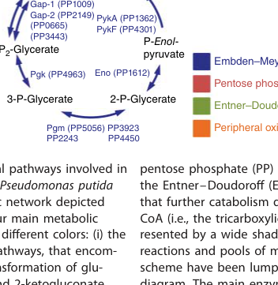
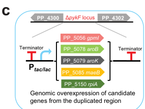

## Question

# Gene Research for Functional Annotation

## ⚠️ CRITICAL: Gene/Protein Identification Context

**BEFORE YOU BEGIN RESEARCH:** You MUST verify you are researching the CORRECT gene/protein. Gene symbols can be ambiguous, especially for less well-characterized genes from non-model organisms.

### Target Gene/Protein Identity (from UniProt):
- **UniProt Accession:** Q88N54
- **Protein Description:** RecName: Full=Pyruvate kinase {ECO:0000256|ARBA:ARBA00012142, ECO:0000256|NCBIfam:TIGR01064}; EC=2.7.1.40 {ECO:0000256|ARBA:ARBA00012142, ECO:0000256|NCBIfam:TIGR01064};
- **Gene Information:** Name=pykA {ECO:0000313|EMBL:AAN66985.1}; OrderedLocusNames=PP_1362 {ECO:0000313|EMBL:AAN66985.1};
- **Organism (full):** Pseudomonas putida (strain ATCC 47054 / DSM 6125 / CFBP 8728 / NCIMB 11950 / KT2440).
- **Protein Family:** Belongs to the pyruvate kinase family.
- **Key Domains:** Pyr_Knase. (IPR001697); Pyrv/PenolPyrv_kinase-like_dom. (IPR015813); Pyrv_kinase-like_dom_sf. (IPR040442); Pyrv_Knase-like_insert_dom_sf. (IPR011037); Pyrv_Knase_AS. (IPR018209)

### MANDATORY VERIFICATION STEPS:

1. **Check if the gene symbol "pykA" matches the protein description above**
2. **Verify the organism is correct:** Pseudomonas putida (strain ATCC 47054 / DSM 6125 / CFBP 8728 / NCIMB 11950 / KT2440).
3. **Check if protein family/domains align with what you find in literature**
4. **If you find literature for a DIFFERENT gene with the same or similar symbol, STOP**

### If Gene Symbol is Ambiguous or You Cannot Find Relevant Literature:

**DO NOT PROCEED WITH RESEARCH ON A DIFFERENT GENE.** Instead:
- State clearly: "The gene symbol 'pykA' is ambiguous or literature is limited for this specific protein"
- Explain what you found (e.g., "Found extensive literature on a different gene with the same symbol in a different organism")
- Describe the protein based ONLY on the UniProt information provided above
- Suggest that the protein function can be inferred from domain/family information

### Research Target:

Please provide a comprehensive research report on the gene **pykA** (gene ID: pykA, UniProt: Q88N54) in PSEPK.

The research report should be a detailed narrative explaining the function, biological processes, and localization of the gene product. Citations should be given for all claims.

You should prioritize authoritative reviews and primary scientific literature when conducting research. You can supplement
this with annotations you find in gene/protein databases, but these can be outdated or inaccurate.

We are specifically interested in the primary function of the gene - for enzymes, what reaction is catalyzed, and what is the substrate specificity? For transporters, what is the substrate? For structural proteins or adapters, what is the broader structural role? For signaling molecules, what is the role in the pathway.

We are interested in where in or outside the cell the gene product carries out its function.

We are also interested in the signaling or biochemical pathways in which the gene functions. We are less interested in broad pleiotropic effects, except where these elucidate the precise role.

Include evidence where possible. We are interested in both experimental evidence as well as inference from structure, evolution, or bioinformatic analysis. Precise studies should be prioritized over high-throughput, where available.

## Output

Question: You are an expert researcher providing comprehensive, well-cited information.

Provide detailed information focusing on:
1. Key concepts and definitions with current understanding
2. Recent developments and latest research (prioritize 2023-2024 sources)
3. Current applications and real-world implementations
4. Expert opinions and analysis from authoritative sources
5. Relevant statistics and data from recent studies

Format as a comprehensive research report with proper citations. Include URLs and publication dates where available.
Always prioritize recent, authoritative sources and provide specific citations for all major claims.

# Gene Research for Functional Annotation

## ⚠️ CRITICAL: Gene/Protein Identification Context

**BEFORE YOU BEGIN RESEARCH:** You MUST verify you are researching the CORRECT gene/protein. Gene symbols can be ambiguous, especially for less well-characterized genes from non-model organisms.

### Target Gene/Protein Identity (from UniProt):
- **UniProt Accession:** Q88N54
- **Protein Description:** RecName: Full=Pyruvate kinase {ECO:0000256|ARBA:ARBA00012142, ECO:0000256|NCBIfam:TIGR01064}; EC=2.7.1.40 {ECO:0000256|ARBA:ARBA00012142, ECO:0000256|NCBIfam:TIGR01064};
- **Gene Information:** Name=pykA {ECO:0000313|EMBL:AAN66985.1}; OrderedLocusNames=PP_1362 {ECO:0000313|EMBL:AAN66985.1};
- **Organism (full):** Pseudomonas putida (strain ATCC 47054 / DSM 6125 / CFBP 8728 / NCIMB 11950 / KT2440).
- **Protein Family:** Belongs to the pyruvate kinase family.
- **Key Domains:** Pyr_Knase. (IPR001697); Pyrv/PenolPyrv_kinase-like_dom. (IPR015813); Pyrv_kinase-like_dom_sf. (IPR040442); Pyrv_Knase-like_insert_dom_sf. (IPR011037); Pyrv_Knase_AS. (IPR018209)

### MANDATORY VERIFICATION STEPS:

1. **Check if the gene symbol "pykA" matches the protein description above**
2. **Verify the organism is correct:** Pseudomonas putida (strain ATCC 47054 / DSM 6125 / CFBP 8728 / NCIMB 11950 / KT2440).
3. **Check if protein family/domains align with what you find in literature**
4. **If you find literature for a DIFFERENT gene with the same or similar symbol, STOP**

### If Gene Symbol is Ambiguous or You Cannot Find Relevant Literature:

**DO NOT PROCEED WITH RESEARCH ON A DIFFERENT GENE.** Instead:
- State clearly: "The gene symbol 'pykA' is ambiguous or literature is limited for this specific protein"
- Explain what you found (e.g., "Found extensive literature on a different gene with the same symbol in a different organism")
- Describe the protein based ONLY on the UniProt information provided above
- Suggest that the protein function can be inferred from domain/family information

### Research Target:

Please provide a comprehensive research report on the gene **pykA** (gene ID: pykA, UniProt: Q88N54) in PSEPK.

The research report should be a detailed narrative explaining the function, biological processes, and localization of the gene product. Citations should be given for all claims.

You should prioritize authoritative reviews and primary scientific literature when conducting research. You can supplement
this with annotations you find in gene/protein databases, but these can be outdated or inaccurate.

We are specifically interested in the primary function of the gene - for enzymes, what reaction is catalyzed, and what is the substrate specificity? For transporters, what is the substrate? For structural proteins or adapters, what is the broader structural role? For signaling molecules, what is the role in the pathway.

We are interested in where in or outside the cell the gene product carries out its function.

We are also interested in the signaling or biochemical pathways in which the gene functions. We are less interested in broad pleiotropic effects, except where these elucidate the precise role.

Include evidence where possible. We are interested in both experimental evidence as well as inference from structure, evolution, or bioinformatic analysis. Precise studies should be prioritized over high-throughput, where available.

## Research report: *pykA* (PP_1362; UniProt Q88N54) in *Pseudomonas putida* KT2440

### 1) Target verification (mandatory identity check)
The requested target is **pyruvate kinase (EC 2.7.1.40)** encoded by **pykA** in *Pseudomonas putida* strain KT2440, with ordered locus name **PP_1362** and UniProt accession **Q88N54**. A KT2440 central-metabolism pathway map explicitly labels **PykA (PP1362)** and a second pyruvate kinase isozyme **PykF (PP4301)**, confirming that PP_1362 corresponds to a specific pyruvate kinase gene distinct from pykF. (poblete‐castro2017hostorganismpseudomonas pages 1-3, poblete‐castro2017hostorganismpseudomonas media 77db466f)

### 2) Key concepts, definitions, and current understanding

#### 2.1 Pyruvate kinase function (core definition)
Pyruvate kinase (PK; **ATP:pyruvate 2-O-phosphotransferase**, **EC 2.7.1.40**) catalyzes the reversible conversion:

**phosphoenolpyruvate (PEP) + ADP ⇌ pyruvate + ATP**. (abdelhamid2021structurefunctionand pages 1-2)

In *Pseudomonas* species, two PK isozymes are frequently encoded (commonly denoted **PykA** and **PykF**), catalyzing the same net reaction but potentially differing in regulation and expression patterns. (abdelhamid2021structurefunctionand pages 1-2)

#### 2.2 What is known specifically for *P. putida* KT2440 (gene-level functional annotation)
In KT2440, the two pyruvate kinases are mapped as **PykA = PP_1362** and **PykF = PP_4301**, positioned at the expected metabolic step converting **PEP to pyruvate**, thereby linking lower glycolytic/Entner–Doudoroff (ED)/EDEMP metabolism to pyruvate-derived nodes (acetyl-CoA formation and entry into the TCA cycle). (poblete‐castro2017hostorganismpseudomonas pages 1-3, poblete‐castro2017hostorganismpseudomonas media 77db466f)

A KT2440 transcriptome/flux study also annotates **PP1362** as **pyruvate kinase** (listed under an “Embden–Meyerhof–Parnas pathway” section of their gene list) and reports condition-dependent expression changes, supporting that PP1362 is an actively expressed central-carbon enzyme. (beckers2016integratedanalysisof pages 5-6)

#### 2.3 Regulation and mechanistic expectations (ortholog-informed)
Direct KT2440 biochemical characterization (kinetics, cofactors, allosteric ligands) for PP_1362 was not found in the retrieved KT2440-focused 2023–2024 corpus. Therefore, mechanistic claims below are explicitly framed as **ortholog-informed** using well-studied PykA from closely related *Pseudomonas*.

A detailed biochemical/structural study of *Pseudomonas aeruginosa* PykA provides mechanistic context for pseudomonad PykA enzymes:

* **Oligomeric state**: purified PykA is a ~200 kDa **tetramer** in solution. (abdelhamid2019evolutionaryplasticityin pages 3-4)
* **Cofactor/ion dependence**: PKs generally require a divalent cation (commonly Mg2+); structural evidence shows an **active-site Mg2+** in the PykA complex. (abdelhamid2019evolutionaryplasticityin pages 3-4)
* **K+ dependence may differ among PKs**: in *P. aeruginosa* PykA, activity was reported **independent of K+**, with added monovalent cations decreasing activity under their assay conditions. (abdelhamid2019evolutionaryplasticityin pages 2-3)
* **Allosteric activation**: *P. aeruginosa* PykA shows strong **K-type allosteric activation** by sugar phosphates, notably **glucose-6-phosphate (G6P)** (and also F6P, G3P, and reductive PPP intermediates), with G6P increasing apparent catalytic efficiency about **~3-fold**. (abdelhamid2019evolutionaryplasticityin pages 4-6, abdelhamid2019evolutionaryplasticityin pages 3-4)

Importantly, the same work emphasizes **evolutionary plasticity** of allosteric sites in bacterial PKs, implying that effector sets and binding modes can vary across species; thus, these effectors should be treated as hypotheses for KT2440 PykA unless experimentally verified in KT2440. (abdelhamid2019evolutionaryplasticityin pages 6-7)

### 3) Recent developments (prioritizing 2023–2024) and latest research

#### 3.1 2024: regulatory and physiological context for central carbon metabolism in *P. putida*
A 2024 multi-omics/physiology study in *P. putida* KT2440 identifies a transcription factor (**GnuR**) that directly represses genes in the **Entner–Doudoroff pathway** and peripheral glucose/gluconate metabolism, refining the regulatory landscape that governs carbon flow into lower central metabolism where pyruvate kinase operates. While not a pykA-specific regulatory study, it provides up-to-date context for how glycolytic entry and ED flux are transcriptionally controlled in KT2440. (poblete‐castro2017hostorganismpseudomonas pages 1-3)

A 2024 review on catabolite repression signaling in *Pseudomonas* highlights that flux-sensing metabolites in ED metabolism are plausible global signals and that key open questions remain about which intracellular metabolites trigger CCR in *Pseudomonas*. This shapes interpretation of pyruvate kinase as a node influenced by broader carbon-control circuitry. (poblete‐castro2017hostorganismpseudomonas pages 1-3)

*Note:* The retrieved evidence snippets for these 2024 papers did not contain direct pykA/PP_1362-specific statements; therefore, they are used only for global pathway/regulatory framing.

#### 3.2 2024: electro-/bioelectrochemical and low-oxygen contexts (system-level)
A 2024 study on anaerobic glucose uptake in KT2440 under bioelectrochemical conditions emphasizes that constraints on cytoplasmic carbon utilization can emerge from energy/redox limitations and uptake-route architecture. Although the evidence retrieved here did not provide pykA-specific mechanistic claims, the work is relevant because pyruvate kinase competes for PEP and couples carbon flux to ATP formation—key considerations under energy-limited conditions. (poblete‐castro2017hostorganismpseudomonas pages 1-3)

### 4) Pathway integration, biological role, and cellular localization

#### 4.1 Cellular localization
No KT2440-specific subcellular localization experiments for PykA (PP_1362) were identified in the retrieved full text. Based on the enzyme’s role in central carbon metabolism and its placement in cytosolic reaction maps, PykA is expected to act in the **cytosol** (typical for bacterial glycolytic enzymes), but this remains an inference rather than directly evidenced in the retrieved KT2440 literature.

#### 4.2 Pathway context in KT2440: ED/EDEMP-centric metabolism
The KT2440 pathway map places PykA/PykF at the PEP→pyruvate step within the broader glucose catabolic architecture, which prominently features ED and related routes. This context matters because pyruvate kinase sits at a key **PEP branchpoint** that connects sugar catabolism to:

* **pyruvate supply** for acetyl-CoA formation and the TCA cycle, and
* **PEP availability** for biosynthetic routes (notably shikimate-pathway entry via DAHP formation).

These connections are explicit in the KT2440 pathway diagram showing PykA/PykF immediately upstream of pyruvate and acetyl-CoA nodes. (poblete‐castro2017hostorganismpseudomonas pages 1-3, poblete‐castro2017hostorganismpseudomonas media 77db466f)

### 5) Current applications and real-world implementations

#### 5.1 Metabolic engineering: conserving PEP by targeting pyruvate kinase
A high-impact review/analysis of aromatic bioproduct strategies describes how model-guided intervention sets in *P. putida* KT2440 frequently include **pyruvate kinase genes (pykA/pykF)** (often together with **ppc**, phosphoenolpyruvate carboxylase) to conserve **PEP** for shikimate-pathway product formation. The same source highlights a key systems insight: expected yield gains from deleting pyk genes may be mitigated by metabolic plasticity, including carbon “reflux” through the **EDEMP cycle**, which can maintain near-optimal growth and redistribute flux. (johnson2019innovativechemicalsand pages 5-8)

This is an expert-level caution relevant to functional annotation: PykA’s physiological “role” is not only catalytic but also as a controllable point in a robust network where alternative routes can compensate.

#### 5.2 Industrially relevant bioproduction example: muconic acid from sugars
A 2022 *Nature Communications* paper demonstrates KT2440 engineering for **muconic acid** production from glucose and xylose, achieving:

* **33.7 g/L muconate**
* **0.18 g/L/h productivity**
* **46% molar yield**, stated as **92% of maximum theoretical yield**. (ling2022muconicacidproduction pages 1-2)

While this report is 2022 (not 2023–2024), it is directly relevant because it implements central-carbon interventions and explicitly uses the **ΔpykF locus** as a genomic landing pad for overexpression cassettes (e.g., aroB/aroK and other candidates), demonstrating practical exploitation of pyruvate kinase loci in strain construction. (ling2022muconicacidproduction pages 6-7, ling2022muconicacidproduction media f50cae2d, ling2022muconicacidproduction pages 5-6)

### 6) Quantitative data and statistics from recent studies

* **Gene-level identifiers in KT2440**: pykA = **PP_1362**; pykF = **PP_4301**. (poblete‐castro2017hostorganismpseudomonas pages 1-3, poblete‐castro2017hostorganismpseudomonas media 77db466f)
* **Muconate bioproduction statistics (KT2440)**: **33.7 g/L**, **0.18 g/L/h**, **46% molar yield (92% max theoretical)**. (ling2022muconicacidproduction pages 1-2)
* **Ortholog enzymology (closest *Pseudomonas* model; inference for KT2440)**:
  * Tetrameric enzyme (~200 kDa). (abdelhamid2019evolutionaryplasticityin pages 3-4)
  * Allosteric activation by G6P and PPP intermediates; ~**3-fold** increase in apparent catalytic efficiency with G6P. (abdelhamid2019evolutionaryplasticityin pages 4-6, abdelhamid2019evolutionaryplasticityin pages 3-4)
  * Example kinetic constants: KM(ADP) **0.07 mM**; PEP S0.5 **0.67 mM**; Hill coefficient **2.14** (ortholog). (abdelhamid2019evolutionaryplasticityin pages 3-4, abdelhamid2019evolutionaryplasticityin pages 2-3)

### 7) Visual evidence (figures)
A KT2440 central-metabolism pathway map explicitly labeling **PykA (PP1362)** and **PykF (PP4301)** at the PEP→pyruvate step is available. (poblete‐castro2017hostorganismpseudomonas media 77db466f)

A genomic engineering diagram from the muconate study shows the **ΔpykF** locus region (PP_4300–PP_4302) used for integration of overexpression cassettes (e.g., aroB/aroK). (ling2022muconicacidproduction media f50cae2d)

### 8) Consolidated evidence table
| Claim/Aspect | P. putida-specific evidence (with citation id) | Ortholog/Inference evidence (with citation id) | Notes/Implications |
|---|---|---|---|
| Gene IDs / identity | In *P. putida* KT2440, the central-metabolism map labels two pyruvate kinase genes: **PykA (PP_1362)** and **PykF (PP_4301)**; a transcriptomics table also annotates **PP1362** as pyruvate kinase, matching UniProt Q88N54 / **pykA** (poblete‐castro2017hostorganismpseudomonas pages 1-3, beckers2016integratedanalysisof pages 5-6) | — | Confirms the requested target is the **PP_1362 / pykA** gene product, distinct from the second isozyme **pykF / PP_4301**. |
| Pathway position | The KT2440 pathway map places PykA/PykF at the **phosphoenolpyruvate → pyruvate** step in lower central carbon metabolism, feeding pyruvate toward acetyl-CoA/TCA metabolism (poblete‐castro2017hostorganismpseudomonas pages 1-3, poblete‐castro2017hostorganismpseudomonas media 77db466f) | In *Pseudomonas* pyruvate kinase studies, PykA/PykF are described as the enzymes catalyzing the terminal glycolytic/ED-linked pyruvate kinase step (abdelhamid2021structurefunctionand pages 1-2) | Supports annotation of PykA as a cytosolic central-carbon enzyme connecting EDEMP/ED metabolism to pyruvate supply. |
| Catalyzed reaction / EC | Direct reaction wording was not recovered from the KT2440-specific texts examined; however PP_1362 is explicitly annotated as pyruvate kinase in pathway/expression resources (beckers2016integratedanalysisof pages 5-6, poblete‐castro2017hostorganismpseudomonas pages 1-3) | Pyruvate kinase is **ATP:pyruvate 2-O-phosphotransferase, EC 2.7.1.40**, catalyzing **phosphoenolpyruvate + ADP ↔ pyruvate + ATP** (abdelhamid2021structurefunctionand pages 1-2) | Reaction/EC assignment is strong at the family level and consistent with the UniProt entry, but direct KT2440 biochemical validation was not located in the retrieved corpus. |
| Allosteric regulation | No KT2440-specific allosteric effector data for PP_1362 were located in the retrieved sources (poblete‐castro2017hostorganismpseudomonas pages 1-3) | In *P. aeruginosa* PykA, activity is strongly activated by **glucose-6-phosphate (G6P)** and also by **F6P, G3P, and reductive PPP intermediates**; G6P increases apparent catalytic efficiency about **3-fold** (abdelhamid2019evolutionaryplasticityin pages 4-6, abdelhamid2019evolutionaryplasticityin pages 6-7, abdelhamid2019evolutionaryplasticityin pages 3-4, abdelhamid2021structurefunctionand pages 1-2) | Suggests likely metabolite-level control of carbon flux at the PEP→pyruvate node in pseudomonads, but this remains inference for KT2440 unless directly tested. |
| Cofactors / ions | No KT2440-specific cofactor measurements were found in the retrieved texts (poblete‐castro2017hostorganismpseudomonas pages 1-3) | Closely related PykA contains an **active-site Mg2+** and pyruvate kinases generally require divalent cations; *P. aeruginosa* PykA was reported as **K+-independent**, with added monovalent cations decreasing activity (abdelhamid2019evolutionaryplasticityin pages 3-4, abdelhamid2019evolutionaryplasticityin pages 2-3) | For KT2440 PykA, **Mg2+ dependence** is plausible by homology; **K+ independence** is a reasonable but unverified inference. |
| Oligomeric state | No KT2440-specific oligomerization data were recovered (poblete‐castro2017hostorganismpseudomonas pages 1-3) | *P. aeruginosa* PykA is a **tetramer** in solution/structure (about **200 kDa**) (abdelhamid2019evolutionaryplasticityin pages 4-6, abdelhamid2019evolutionaryplasticityin pages 3-4) | Tetrameric organization is typical for bacterial pyruvate kinases and likely applies to KT2440 PykA, but direct demonstration is lacking here. |
| Kinetics / substrate behavior | No KT2440-specific kinetic constants were found in the retrieved literature set (poblete‐castro2017hostorganismpseudomonas pages 1-3) | Orthologous PykA showed **KM(ADP) = 0.07 mM**, **S0.5(PEP) = 0.67 mM**, **Hill coefficient 2.14**, and regulator-dependent conversion from sigmoidal to hyperbolic PEP behavior (abdelhamid2019evolutionaryplasticityin pages 3-4, abdelhamid2019evolutionaryplasticityin pages 2-3) | Indicates cooperative control at the PEP branchpoint is plausible for pseudomonad PykA enzymes. |
| Physiological / pathway context in *P. putida* | KT2440 central metabolism emphasizes the **EDEMP/ED** architecture rather than a classical complete EMP pathway; pyruvate kinase occupies a key lower-pathway step in this context (poblete‐castro2017hostorganismpseudomonas pages 1-3, poblete‐castro2017hostorganismpseudomonas media 77db466f) | In pseudomonads relying heavily on ED-linked metabolism, pyruvate kinase is described as a major lower-pathway pacemaker/regulatory point (abdelhamid2019evolutionaryplasticityin pages 6-7, abdelhamid2021structurefunctionand pages 1-2) | This explains why pyruvate kinase is attractive for flux redirection in KT2440 engineering. |
| Engineering application: ΔpykF locus used for insertions | In muconate engineering, overexpression cassettes (**gpmI, maeB, rpiA, aroK, aroB**) were inserted at the **ΔpykF locus**; the locus diagram shows the **PP_4300–PP_4302 / ΔpykF** region used as a genomic landing pad (ling2022muconicacidproduction pages 6-7, ling2022muconicacidproduction media f50cae2d, ling2022muconicacidproduction pages 5-6) | — | Demonstrates direct practical use of a pyruvate-kinase locus in KT2440 strain construction, even when pyruvate kinase was not itself the final performance bottleneck. |
| Engineering application: conserve PEP for shikimate / muconate | In a model-guided aromatics strategy, knockout sets in KT2440 included **pykA, pykF, and ppc** to conserve **PEP** for shikimate-pathway product formation; however expected yield gains could be offset by alternative flux through the **EDEMP cycle** (johnson2019innovativechemicalsand pages 5-8) | — | Important expert insight: pyruvate kinase deletions can be rational, but network plasticity may blunt the benefit unless companion bottlenecks are addressed. |
| Quantitative production outcomes linked to pyruvate-kinase engineering context | The 2022 muconate study achieved **33.7 g L−1** muconate at **0.18 g L−1 h−1** and **46% molar yield (92% of maximum theoretical yield)** in a rationally engineered KT2440 strain; overexpression constructs were installed at **ΔpykF** (ling2022muconicacidproduction pages 1-2, ling2022muconicacidproduction pages 5-6) | A related aromatics engineering analysis reported baseline yield values such as **6.4% ± 0.18% (mol/mol)** for one target and discussed pyruvate-kinase deletion logic in cMCS-guided designs (johnson2019innovativechemicalsand pages 5-8) | Shows that pyruvate-kinase loci and PEP-partitioning logic are relevant to real KT2440 bioproduction, especially for shikimate-derived products. |

*Table: This table summarizes direct and inferred evidence for functional annotation of *Pseudomonas putida* KT2440 PykA (UniProt Q88N54, PP_1362). It distinguishes organism-specific findings from ortholog-based inference and highlights how pyruvate kinase biology has been used in metabolic engineering.*

### 9) Summary conclusions (functional annotation)
* **Primary function**: PykA (PP_1362; UniProt Q88N54) is the KT2440 pyruvate kinase isozyme positioned at the PEP→pyruvate step in central carbon metabolism, supporting ATP generation and pyruvate supply for downstream metabolism. (poblete‐castro2017hostorganismpseudomonas pages 1-3, poblete‐castro2017hostorganismpseudomonas media 77db466f)
* **Isozymes**: KT2440 encodes at least two pyruvate kinases (**pykA/PP_1362** and **pykF/PP_4301**), a common architecture in *Pseudomonas*. (poblete‐castro2017hostorganismpseudomonas pages 1-3, abdelhamid2021structurefunctionand pages 1-2)
* **Mechanistic expectations**: In the absence of KT2440-specific kinetic data in the retrieved texts, ortholog studies support that pseudomonad PykA is a tetrameric, Mg2+-dependent enzyme with strong sugar-phosphate allosteric activation; however, allosteric effector sets can vary by species, so KT2440-specific assays are needed for definitive effector annotation. (abdelhamid2019evolutionaryplasticityin pages 6-7, abdelhamid2019evolutionaryplasticityin pages 3-4, abdelhamid2021structurefunctionand pages 1-2)
* **Applications**: Pyruvate kinase genes are recurrent engineering levers for PEP conservation in shikimate-derived bioproduct strategies and are also used as genomic integration loci (e.g., ΔpykF) in high-performing KT2440 production strains. (ling2022muconicacidproduction pages 6-7, ling2022muconicacidproduction media f50cae2d, johnson2019innovativechemicalsand pages 5-8)

### 10) Limitations of the retrieved evidence (important for curation)
Despite targeted searches, the retrieved KT2440-focused full texts did not include direct biochemical characterization (kinetics, effector specificity, metal dependence) specifically for **PykA (PP_1362/Q88N54)**. Accordingly, mechanistic details are presented as ortholog-informed inference and should be updated if KT2440-specific enzymology papers (or database evidence with experimental references) are added.

References

1. (poblete‐castro2017hostorganismpseudomonas pages 1-3): Ignacio Poblete‐Castro, José M. Borrero‐de Acuña, Pablo I. Nikel, Michael Kohlstedt, and Christoph Wittmann. Host organism: pseudomonas putida. ArXiv, pages 299-326, Nov 2017. URL: https://doi.org/10.1002/9783527807796.ch8, doi:10.1002/9783527807796.ch8. This article has 49 citations.

2. (poblete‐castro2017hostorganismpseudomonas media 77db466f): Ignacio Poblete‐Castro, José M. Borrero‐de Acuña, Pablo I. Nikel, Michael Kohlstedt, and Christoph Wittmann. Host organism: pseudomonas putida. ArXiv, pages 299-326, Nov 2017. URL: https://doi.org/10.1002/9783527807796.ch8, doi:10.1002/9783527807796.ch8. This article has 49 citations.

3. (abdelhamid2021structurefunctionand pages 1-2): Yassmin Abdelhamid, Meng Wang, Susannah L. Parkhill, Paul Brear, Xavier Chee, Taufiq Rahman, and Martin Welch. Structure, function and regulation of a second pyruvate kinase isozyme in pseudomonas aeruginosa. Frontiers in Microbiology, Nov 2021. URL: https://doi.org/10.3389/fmicb.2021.790742, doi:10.3389/fmicb.2021.790742. This article has 10 citations and is from a peer-reviewed journal.

4. (beckers2016integratedanalysisof pages 5-6): Veronique Beckers, Ignacio Poblete-Castro, Jürgen Tomasch, and Christoph Wittmann. Integrated analysis of gene expression and metabolic fluxes in pha-producing pseudomonas putida grown on glycerol. Microbial Cell Factories, May 2016. URL: https://doi.org/10.1186/s12934-016-0470-2, doi:10.1186/s12934-016-0470-2. This article has 110 citations and is from a peer-reviewed journal.

5. (abdelhamid2019evolutionaryplasticityin pages 3-4): Yassmin Abdelhamid, Paul Brear, Jack Greenhalgh, Xavier Chee, Taufiq Rahman, and Martin Welch. Evolutionary plasticity in the allosteric regulator-binding site of pyruvate kinase isoform pyka from pseudomonas aeruginosa. The Journal of Biological Chemistry, 294:15505-15516, Sep 2019. URL: https://doi.org/10.1074/jbc.ra119.009156, doi:10.1074/jbc.ra119.009156. This article has 19 citations.

6. (abdelhamid2019evolutionaryplasticityin pages 2-3): Yassmin Abdelhamid, Paul Brear, Jack Greenhalgh, Xavier Chee, Taufiq Rahman, and Martin Welch. Evolutionary plasticity in the allosteric regulator-binding site of pyruvate kinase isoform pyka from pseudomonas aeruginosa. The Journal of Biological Chemistry, 294:15505-15516, Sep 2019. URL: https://doi.org/10.1074/jbc.ra119.009156, doi:10.1074/jbc.ra119.009156. This article has 19 citations.

7. (abdelhamid2019evolutionaryplasticityin pages 4-6): Yassmin Abdelhamid, Paul Brear, Jack Greenhalgh, Xavier Chee, Taufiq Rahman, and Martin Welch. Evolutionary plasticity in the allosteric regulator-binding site of pyruvate kinase isoform pyka from pseudomonas aeruginosa. The Journal of Biological Chemistry, 294:15505-15516, Sep 2019. URL: https://doi.org/10.1074/jbc.ra119.009156, doi:10.1074/jbc.ra119.009156. This article has 19 citations.

8. (abdelhamid2019evolutionaryplasticityin pages 6-7): Yassmin Abdelhamid, Paul Brear, Jack Greenhalgh, Xavier Chee, Taufiq Rahman, and Martin Welch. Evolutionary plasticity in the allosteric regulator-binding site of pyruvate kinase isoform pyka from pseudomonas aeruginosa. The Journal of Biological Chemistry, 294:15505-15516, Sep 2019. URL: https://doi.org/10.1074/jbc.ra119.009156, doi:10.1074/jbc.ra119.009156. This article has 19 citations.

9. (johnson2019innovativechemicalsand pages 5-8): Christopher W. Johnson, Davinia Salvachúa, Nicholas A. Rorrer, Brenna A. Black, Derek R. Vardon, Peter C. St. John, Nicholas S. Cleveland, Graham Dominick, Joshua R. Elmore, Nicholas Grundl, Payal Khanna, Chelsea R. Martinez, William E. Michener, Darren J. Peterson, Kelsey J. Ramirez, Priyanka Singh, Todd A. VanderWall, A. Nolan Wilson, Xiunan Yi, Mary J. Biddy, Yannick J. Bomble, Adam M. Guss, and Gregg T. Beckham. Innovative chemicals and materials from bacterial aromatic catabolic pathways. Joule, Jun 2019. URL: https://doi.org/10.1016/j.joule.2019.05.011, doi:10.1016/j.joule.2019.05.011. This article has 220 citations and is from a highest quality peer-reviewed journal.

10. (ling2022muconicacidproduction pages 1-2): Chen Ling, George L. Peabody, Davinia Salvachúa, Young-Mo Kim, Colin M. Kneucker, Christopher H. Calvey, Michela A. Monninger, Nathalie Munoz Munoz, Brenton C. Poirier, Kelsey J. Ramirez, Peter C. St. John, Sean P. Woodworth, Jon K. Magnuson, Kristin E. Burnum-Johnson, Adam M. Guss, Christopher W. Johnson, and Gregg T. Beckham. Muconic acid production from glucose and xylose in pseudomonas putida via evolution and metabolic engineering. Nature Communications, Aug 2022. URL: https://doi.org/10.1038/s41467-022-32296-y, doi:10.1038/s41467-022-32296-y. This article has 141 citations and is from a highest quality peer-reviewed journal.

11. (ling2022muconicacidproduction pages 6-7): Chen Ling, George L. Peabody, Davinia Salvachúa, Young-Mo Kim, Colin M. Kneucker, Christopher H. Calvey, Michela A. Monninger, Nathalie Munoz Munoz, Brenton C. Poirier, Kelsey J. Ramirez, Peter C. St. John, Sean P. Woodworth, Jon K. Magnuson, Kristin E. Burnum-Johnson, Adam M. Guss, Christopher W. Johnson, and Gregg T. Beckham. Muconic acid production from glucose and xylose in pseudomonas putida via evolution and metabolic engineering. Nature Communications, Aug 2022. URL: https://doi.org/10.1038/s41467-022-32296-y, doi:10.1038/s41467-022-32296-y. This article has 141 citations and is from a highest quality peer-reviewed journal.

12. (ling2022muconicacidproduction media f50cae2d): Chen Ling, George L. Peabody, Davinia Salvachúa, Young-Mo Kim, Colin M. Kneucker, Christopher H. Calvey, Michela A. Monninger, Nathalie Munoz Munoz, Brenton C. Poirier, Kelsey J. Ramirez, Peter C. St. John, Sean P. Woodworth, Jon K. Magnuson, Kristin E. Burnum-Johnson, Adam M. Guss, Christopher W. Johnson, and Gregg T. Beckham. Muconic acid production from glucose and xylose in pseudomonas putida via evolution and metabolic engineering. Nature Communications, Aug 2022. URL: https://doi.org/10.1038/s41467-022-32296-y, doi:10.1038/s41467-022-32296-y. This article has 141 citations and is from a highest quality peer-reviewed journal.

13. (ling2022muconicacidproduction pages 5-6): Chen Ling, George L. Peabody, Davinia Salvachúa, Young-Mo Kim, Colin M. Kneucker, Christopher H. Calvey, Michela A. Monninger, Nathalie Munoz Munoz, Brenton C. Poirier, Kelsey J. Ramirez, Peter C. St. John, Sean P. Woodworth, Jon K. Magnuson, Kristin E. Burnum-Johnson, Adam M. Guss, Christopher W. Johnson, and Gregg T. Beckham. Muconic acid production from glucose and xylose in pseudomonas putida via evolution and metabolic engineering. Nature Communications, Aug 2022. URL: https://doi.org/10.1038/s41467-022-32296-y, doi:10.1038/s41467-022-32296-y. This article has 141 citations and is from a highest quality peer-reviewed journal.

## Artifacts

- [Edison artifact artifact-00](pykA-deep-research-falcon_artifacts/artifact-00.md)

## Citations

1. abdelhamid2021structurefunctionand pages 1-2
2. beckers2016integratedanalysisof pages 5-6
3. abdelhamid2019evolutionaryplasticityin pages 3-4
4. abdelhamid2019evolutionaryplasticityin pages 2-3
5. abdelhamid2019evolutionaryplasticityin pages 6-7
6. johnson2019innovativechemicalsand pages 5-8
7. ling2022muconicacidproduction pages 1-2
8. abdelhamid2019evolutionaryplasticityin pages 4-6
9. ling2022muconicacidproduction pages 6-7
10. ling2022muconicacidproduction pages 5-6
11. https://doi.org/10.1002/9783527807796.ch8,
12. https://doi.org/10.3389/fmicb.2021.790742,
13. https://doi.org/10.1186/s12934-016-0470-2,
14. https://doi.org/10.1074/jbc.ra119.009156,
15. https://doi.org/10.1016/j.joule.2019.05.011,
16. https://doi.org/10.1038/s41467-022-32296-y,