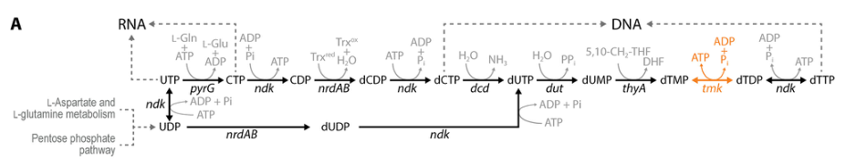

## Question

# Gene Research for Functional Annotation

## ⚠️ CRITICAL: Gene/Protein Identification Context

**BEFORE YOU BEGIN RESEARCH:** You MUST verify you are researching the CORRECT gene/protein. Gene symbols can be ambiguous, especially for less well-characterized genes from non-model organisms.

### Target Gene/Protein Identity (from UniProt):
- **UniProt Accession:** Q88MG1
- **Protein Description:** RecName: Full=CTP synthase {ECO:0000255|HAMAP-Rule:MF_01227}; EC=6.3.4.2 {ECO:0000255|HAMAP-Rule:MF_01227}; AltName: Full=Cytidine 5'-triphosphate synthase {ECO:0000255|HAMAP-Rule:MF_01227}; AltName: Full=Cytidine triphosphate synthetase {ECO:0000255|HAMAP-Rule:MF_01227}; Short=CTP synthetase {ECO:0000255|HAMAP-Rule:MF_01227}; Short=CTPS {ECO:0000255|HAMAP-Rule:MF_01227}; AltName: Full=UTP--ammonia ligase {ECO:0000255|HAMAP-Rule:MF_01227};
- **Gene Information:** Name=pyrG {ECO:0000255|HAMAP-Rule:MF_01227}; OrderedLocusNames=PP_1610;
- **Organism (full):** Pseudomonas putida (strain ATCC 47054 / DSM 6125 / CFBP 8728 / NCIMB 11950 / KT2440).
- **Protein Family:** Belongs to the CTP synthase family. {ECO:0000255|HAMAP-
- **Key Domains:** Class_I_gatase-like. (IPR029062); CTP_synthase. (IPR004468); CTP_synthase_N. (IPR017456); GATASE. (IPR017926); GATase1_CTP_Synthase. (IPR033828)

### MANDATORY VERIFICATION STEPS:

1. **Check if the gene symbol "pyrG" matches the protein description above**
2. **Verify the organism is correct:** Pseudomonas putida (strain ATCC 47054 / DSM 6125 / CFBP 8728 / NCIMB 11950 / KT2440).
3. **Check if protein family/domains align with what you find in literature**
4. **If you find literature for a DIFFERENT gene with the same or similar symbol, STOP**

### If Gene Symbol is Ambiguous or You Cannot Find Relevant Literature:

**DO NOT PROCEED WITH RESEARCH ON A DIFFERENT GENE.** Instead:
- State clearly: "The gene symbol 'pyrG' is ambiguous or literature is limited for this specific protein"
- Explain what you found (e.g., "Found extensive literature on a different gene with the same symbol in a different organism")
- Describe the protein based ONLY on the UniProt information provided above
- Suggest that the protein function can be inferred from domain/family information

### Research Target:

Please provide a comprehensive research report on the gene **pyrG** (gene ID: pyrG, UniProt: Q88MG1) in PSEPK.

The research report should be a detailed narrative explaining the function, biological processes, and localization of the gene product. Citations should be given for all claims.

You should prioritize authoritative reviews and primary scientific literature when conducting research. You can supplement
this with annotations you find in gene/protein databases, but these can be outdated or inaccurate.

We are specifically interested in the primary function of the gene - for enzymes, what reaction is catalyzed, and what is the substrate specificity? For transporters, what is the substrate? For structural proteins or adapters, what is the broader structural role? For signaling molecules, what is the role in the pathway.

We are interested in where in or outside the cell the gene product carries out its function.

We are also interested in the signaling or biochemical pathways in which the gene functions. We are less interested in broad pleiotropic effects, except where these elucidate the precise role.

Include evidence where possible. We are interested in both experimental evidence as well as inference from structure, evolution, or bioinformatic analysis. Precise studies should be prioritized over high-throughput, where available.

## Output

Question: You are an expert researcher providing comprehensive, well-cited information.

Provide detailed information focusing on:
1. Key concepts and definitions with current understanding
2. Recent developments and latest research (prioritize 2023-2024 sources)
3. Current applications and real-world implementations
4. Expert opinions and analysis from authoritative sources
5. Relevant statistics and data from recent studies

Format as a comprehensive research report with proper citations. Include URLs and publication dates where available.
Always prioritize recent, authoritative sources and provide specific citations for all major claims.

# Gene Research for Functional Annotation

## ⚠️ CRITICAL: Gene/Protein Identification Context

**BEFORE YOU BEGIN RESEARCH:** You MUST verify you are researching the CORRECT gene/protein. Gene symbols can be ambiguous, especially for less well-characterized genes from non-model organisms.

### Target Gene/Protein Identity (from UniProt):
- **UniProt Accession:** Q88MG1
- **Protein Description:** RecName: Full=CTP synthase {ECO:0000255|HAMAP-Rule:MF_01227}; EC=6.3.4.2 {ECO:0000255|HAMAP-Rule:MF_01227}; AltName: Full=Cytidine 5'-triphosphate synthase {ECO:0000255|HAMAP-Rule:MF_01227}; AltName: Full=Cytidine triphosphate synthetase {ECO:0000255|HAMAP-Rule:MF_01227}; Short=CTP synthetase {ECO:0000255|HAMAP-Rule:MF_01227}; Short=CTPS {ECO:0000255|HAMAP-Rule:MF_01227}; AltName: Full=UTP--ammonia ligase {ECO:0000255|HAMAP-Rule:MF_01227};
- **Gene Information:** Name=pyrG {ECO:0000255|HAMAP-Rule:MF_01227}; OrderedLocusNames=PP_1610;
- **Organism (full):** Pseudomonas putida (strain ATCC 47054 / DSM 6125 / CFBP 8728 / NCIMB 11950 / KT2440).
- **Protein Family:** Belongs to the CTP synthase family. {ECO:0000255|HAMAP-
- **Key Domains:** Class_I_gatase-like. (IPR029062); CTP_synthase. (IPR004468); CTP_synthase_N. (IPR017456); GATASE. (IPR017926); GATase1_CTP_Synthase. (IPR033828)

### MANDATORY VERIFICATION STEPS:

1. **Check if the gene symbol "pyrG" matches the protein description above**
2. **Verify the organism is correct:** Pseudomonas putida (strain ATCC 47054 / DSM 6125 / CFBP 8728 / NCIMB 11950 / KT2440).
3. **Check if protein family/domains align with what you find in literature**
4. **If you find literature for a DIFFERENT gene with the same or similar symbol, STOP**

### If Gene Symbol is Ambiguous or You Cannot Find Relevant Literature:

**DO NOT PROCEED WITH RESEARCH ON A DIFFERENT GENE.** Instead:
- State clearly: "The gene symbol 'pyrG' is ambiguous or literature is limited for this specific protein"
- Explain what you found (e.g., "Found extensive literature on a different gene with the same symbol in a different organism")
- Describe the protein based ONLY on the UniProt information provided above
- Suggest that the protein function can be inferred from domain/family information

### Research Target:

Please provide a comprehensive research report on the gene **pyrG** (gene ID: pyrG, UniProt: Q88MG1) in PSEPK.

The research report should be a detailed narrative explaining the function, biological processes, and localization of the gene product. Citations should be given for all claims.

You should prioritize authoritative reviews and primary scientific literature when conducting research. You can supplement
this with annotations you find in gene/protein databases, but these can be outdated or inaccurate.

We are specifically interested in the primary function of the gene - for enzymes, what reaction is catalyzed, and what is the substrate specificity? For transporters, what is the substrate? For structural proteins or adapters, what is the broader structural role? For signaling molecules, what is the role in the pathway.

We are interested in where in or outside the cell the gene product carries out its function.

We are also interested in the signaling or biochemical pathways in which the gene functions. We are less interested in broad pleiotropic effects, except where these elucidate the precise role.

Include evidence where possible. We are interested in both experimental evidence as well as inference from structure, evolution, or bioinformatic analysis. Precise studies should be prioritized over high-throughput, where available.

## Research report: functional annotation of **pyrG** (UniProt Q88MG1) in *Pseudomonas putida* KT2440

### 0) Target verification (critical disambiguation)
The UniProt entry Q88MG1 corresponds to **pyrG** in *Pseudomonas putida* strain KT2440 (ordered locus name PP_1610 per user-provided UniProt context). In KT2440 pathway context, **pyrG is explicitly labeled as CTP synthase (CTPS)**, supporting that the correct protein is being annotated and that “pyrG” here is not an unrelated gene symbol used in other organisms. (wirth2023recursivegenomeengineering pages 2-5, wirth2023recursivegenomeengineering media 8cd03722)

### 1) Key concepts and definitions (current understanding)

#### 1.1 What PyrG/CTP synthase is
**CTP synthase (CTPS; EC 6.3.4.2)** is the enzyme that catalyzes the **final step of de novo cytidine-5′-triphosphate (CTP) biosynthesis**, i.e., ATP-dependent amination of UTP to form CTP. This step is critical because it is the only de novo route that generates the cytosine nucleobase at the triphosphate level in many organisms. (bearne2022gtpdependentregulationof pages 1-2)

#### 1.2 Reaction catalyzed and substrate specificity
A Pseudomonas-focused study reports the overall glutamine-dependent CTPS reaction as:

**UTP + ATP + L-glutamine → CTP + L-glutamate + ADP + Pi**. (patel2001astudyof pages 103-106)

This chemistry is consistent with CTPS being a **class I glutamine-dependent amidotransferase**, where glutamine provides ammonia for amination. (bearne2022gtpdependentregulationof pages 1-2)

Some CTPS homologs can catalyze **dUTP → dCTP** in vitro/under specific experimental regimes, and this broader capability has been structurally investigated in recent work on bifunctional CTPS/dCTPS, but this should be treated as a property of certain CTPS enzymes rather than the default functional assignment for *P. putida* PyrG without direct biochemical confirmation. (guo2023structuralbasisof pages 22-29)

#### 1.3 Domain architecture and mechanistic coupling
CTPS enzymes are **two-domain fusion proteins** comprising:
- a **glutaminase (GAT) domain** that hydrolyzes glutamine to glutamate + ammonia, and
- a **synthase/ammonia ligase (amidoligase) domain** that uses ATP to activate UTP for amination.

A review focused on CTPS regulation emphasizes that glutamine hydrolysis occurs in the GAT domain and the liberated ammonia is transferred through an **intramolecular (NH3) tunnel** to the synthase domain for ATP-dependent amination of UTP to yield CTP. (bearne2022gtpdependentregulationof pages 1-2)

Mechanistically, ATP-dependent phosphorylation of UTP generates a reactive intermediate (often described as a phosphorylated UTP species) that then reacts with ammonia; this intermediate chemistry is a recurring mechanistic theme in CTPS discussions. (zhu2024advancesinhuman pages 5-6, bearne2022gtpdependentregulationof pages 2-4)

#### 1.4 Cellular localization (where it acts)
For bacteria, CTPS is best supported as an **intracellular, soluble/cytosolic enzyme**. In addition, CTPS can polymerize into **intracellular filaments (“cytoophidia”)** across domains of life (including bacteria), which can alter its spatial distribution and regulatory state. (zhu2024advancesinhuman pages 4-5, zhang2024theimpactof pages 1-3)

### 2) Pathway context in *Pseudomonas putida* KT2440
A KT2440 pathway schematic situates pyrG/CTPS in pyrimidine nucleotide metabolism: **pyrG/CTPS is the step converting UTP to CTP**, feeding RNA precursor pools and supporting downstream formation of deoxyribonucleotides (dCTP/dTTP etc.). (wirth2023recursivegenomeengineering pages 2-5, wirth2023recursivegenomeengineering media 8cd03722)

Although KT2440-specific operon context was not retrieved here, Pseudomonas-focused work in *P. aeruginosa* highlights that pyrG can be positioned in broader metabolic context linking CTP availability to other envelope-associated pathways (e.g., Kdo/LPS-related metabolism), illustrating why CTP homeostasis is often tightly controlled in Gram-negative bacteria. (patel2001astudyof pages 103-106)

### 3) Regulation and control points (allosteric, metabolic, and higher-order assembly)

#### 3.1 GTP-dependent allosteric activation (a hallmark of CTPS)
CTPS is unusual among glutamine amidotransferases in that it **requires/uses GTP as an allosteric effector to activate the glutaminase (GAT) domain** for efficient glutamine hydrolysis. A dedicated review states that CTPS “requires an allosteric effector (GTP) to activate the GAT domain for efficient glutamine hydrolysis,” and links GTP binding to conformational changes that also impact NH3 tunnel assembly and coupling of the two active sites. (bearne2022gtpdependentregulationof pages 1-2)

Mechanistic detail from the same review indicates that GTP binding promotes conformational rearrangements near loops involved in catalysis and NH3 translocation (e.g., loops contributing to the NH3 tunnel), thereby coordinating glutamine hydrolysis with CTP formation. (bearne2022gtpdependentregulationof pages 12-14, bearne2022gtpdependentregulationof pages 5-7)

#### 3.2 CTP feedback regulation
CTPS is product-regulated: **CTP acts as a feedback inhibitor/product regulator**. The GTP-focused review notes CTP can act as a feedback inhibitor and is linked to oligomerization effects (e.g., inducing tetramerization and promoting inactive states). (bearne2022gtpdependentregulationof pages 1-2)

A 2024 review of glutamine-hydrolyzing synthetases provides quantitative context (from human CTPS1): an **IC50 ~40 μM CTP** at **100 μM UTP**, illustrating the strong potential for CTP to control flux by competing with UTP at the synthetase domain. (zhu2024advancesinhuman pages 4-5)

While that IC50 is not *P. putida*-specific, it is consistent with the qualitative statement that CTP is a physiologically relevant feedback regulator of CTPS-family enzymes. (bearne2022gtpdependentregulationof pages 1-2)

#### 3.3 Oligomerization and filamentation (cytoophidia)
CTPS regulation occurs across multiple organizational scales:
- At the quaternary structure level, substrates (ATP/UTP) favor formation of the **active tetramer**, whereas product conditions can stabilize less active states. (bearne2022gtpdependentregulationof pages 1-2, guo2023filamentationandinhibition pages 1-7)
- At the supramolecular level, CTPS can form **filaments/cytoophidia**, an evolutionarily conserved phenomenon with regulatory consequences. (bremer2023amodelindustrial pages 6-8, zhang2024theimpactof pages 1-3)

A 2023 structural/biochemical preprint focusing on **prokaryotic CTPS** reports that *E. coli* CTPS is inactive as a dimer in dilute solution, becomes active as a tetramer with UTP/ATP, and that product CTP shifts it to an inactive tetramer; in *E. coli* specifically, product CTP is associated with formation of **large-scale inhibitory filaments**. (guo2023filamentationandinhibition pages 1-7)

The same 2023 study provides quantitative inhibition evidence: relative initial velocity **V0 = 0.66** with CTP alone, dropping to **0.46** with **CTP + NADH** and **0.44** with **CTP + adenine**, indicating synergistic inhibition in vitro. (guo2023filamentationandinhibition pages 24-31)

### 4) Recent developments (prioritizing 2023–2024)

#### 4.1 High-resolution prokaryotic filament structures and inhibitor concepts (2023)
The 2023 prokaryotic CTPS preprint reports cryo-EM of an *E. coli* CTPS filament complex (CTP, NADH, DON) at **2.8 Å** and discusses the ammonia tunnel becoming solvent-accessible upon DON binding, supporting a model where inhibitors can disrupt or gate ammonia delivery. (guo2023filamentationandinhibition pages 1-7)

This work also frames prokaryotic CTPS as a **selective inhibitor design target**, noting that distinct binding modes/interfaces may enable prokaryote-selective CTPS inhibition strategies. (guo2023filamentationandinhibition pages 1-7)

#### 4.2 Cytoophidia as dynamic metabolic compartments (2024)
A 2024 review on cytoophidium formation synthesizes evidence that CTPS cytoophidia are **dynamic, regulated by metabolic/developmental cues**, and conserved from bacteria to humans. It highlights the concept of cytoophidia as a form of intracellular compartmentation of metabolic enzymes, with diverse proposed cellular roles. (zhang2024theimpactof pages 1-3)

#### 4.3 Quantitative regulatory context and filament-dependent activity changes (2024)
A 2024 review provides quantitative metabolite context (example cellular nucleotide concentrations: **UTP 253 μM, CTP 91 μM**) and emphasizes that filamentation can have different functional consequences across organisms/isoforms; notably, *E. coli* CTPS polymers have been associated with **reduced activity** via stabilization of an inactive conformation. (zhu2024advancesinhuman pages 4-5)

### 5) Current applications and real-world implementations

#### 5.1 Antimicrobial/antiparasitic target rationale
CTPS/PyrG is repeatedly positioned as a potential **therapeutic target** in pathogens, because it provides an essential nucleotide (CTP) required for nucleic acids and, indirectly, for lipid-linked processes. A 2023 prokaryotic CTPS study explicitly frames CTPS as a potential therapeutic target for infections by prokaryotic pathogens (and even viruses via host CTPS), and discusses prokaryote-selective inhibition. (guo2023filamentationandinhibition pages 1-7)

A 2024 cytoophidia review highlights bacterial CTPS inhibitors (e.g., thiophenecarboxamide derivatives reported to inhibit *Mycobacterium tuberculosis* PyrG) as examples of CTPS-family targeting. (zhang2024theimpactof pages 8-9, zhang2024theimpactof pages 12-13)

#### 5.2 Synthetic biology and chassis engineering context
CTP production capacity is a core element of nucleotide homeostasis; therefore, pyrG is a relevant gene in genome engineering/minimal-genome and chassis optimization discussions. For example, in *Bacillus subtilis*, CTPS (PyrG) is discussed as central to growth homeostasis and controlled by transcriptional mechanisms, and its filamentation (cytoophidia) is described as having consequences for spatial distribution and activity regulation—principles that synthetic biologists must consider when engineering robust growth or nucleotide-demanding pathways. (bremer2023amodelindustrial pages 6-8)

For *P. putida* KT2440 specifically, pyrG appears in pathway schematics used in genome engineering work, reinforcing its use as a reference “core metabolism” function when redesigning nucleotide metabolism modules. (wirth2023recursivegenomeengineering pages 2-5, wirth2023recursivegenomeengineering media 8cd03722)

### 6) Expert opinions and authoritative synthesis (interpretation)
Two points emerge consistently from authoritative syntheses:
1) **Allosteric coupling between glutamine hydrolysis and UTP amination is central to CTPS function**, and GTP is a key signal that gates this coupling while also influencing NH3 tunnel formation/stability. (bearne2022gtpdependentregulationof pages 1-2, bearne2022gtpdependentregulationof pages 12-14)
2) **Higher-order assembly (cytoophidia/filaments) is increasingly viewed as a regulatory layer**, not merely a structural curiosity. Reviews emphasize that filamentation is conserved and affects enzyme regulation and spatial organization, while prokaryotic structural work indicates product-bound filaments can be inhibitory in bacteria like *E. coli*. (bremer2023amodelindustrial pages 6-8, guo2023filamentationandinhibition pages 1-7)

### 7) Statistics and quantitative data (recent and/or high-confidence)
The following quantitative values were directly retrieved from recent sources:
- **CTP feedback inhibition example**: human CTPS1 IC50 for CTP ~**40 μM** at **100 μM UTP** (illustrative of strong product feedback; not *P. putida*-specific). (zhu2024advancesinhuman pages 4-5)
- **Example cellular nucleotide levels** (contextual): **UTP 253 μM** and **CTP 91 μM** (organism/context not restricted to *P. putida*; presented as general physiological context in a 2024 review). (zhu2024advancesinhuman pages 4-5)
- **Prokaryotic inhibition synergy** (*E. coli* CTPS assay): relative initial velocities **V0 = 0.66** (CTP), **0.46** (CTP+NADH), **0.44** (CTP+adenine). (guo2023filamentationandinhibition pages 24-31)
- **Structural resolution**: prokaryotic CTPS filament complex resolved at **2.8 Å** by cryo-EM in a 2023 preprint. (guo2023filamentationandinhibition pages 1-7)

### 8) Summary table (evidence-backed annotation)
The table below consolidates the functional annotation items, evidence types, and limitations (e.g., where evidence is CTPS-family-level rather than KT2440/Q88MG1-specific).

| Annotation item | Summary statement | Evidence type | Key citations with year and URL | Notes/limitations |
|---|---|---|---|---|
| Identity / target verification | In *Pseudomonas putida* KT2440, **pyrG** is identified as **CTP synthase (CTPS)** in pyrimidine nucleotide biosynthesis, matching UniProt Q88MG1 functional annotation (CTP synthase family; EC 6.3.4.2) (wirth2023recursivegenomeengineering pages 2-5, wirth2023recursivegenomeengineering media 8cd03722). | Primary + pathway schematic | Wirth et al., 2023, *mBio*, https://doi.org/10.1128/mbio.01081-23 (wirth2023recursivegenomeengineering pages 2-5, wirth2023recursivegenomeengineering media 8cd03722) | The retrieved evidence verifies the function in KT2440, but the specific locus tag **PP_1610** was not explicitly shown in the extracted text/images. |
| Reaction / EC number | CTPS catalyzes the **final step of de novo CTP biosynthesis**, i.e. ATP-dependent amination of **UTP to CTP** using nitrogen from **L-glutamine**; reported overall reaction: **UTP + ATP + L-glutamine → CTP + L-glutamate + ADP + Pi**; EC **6.3.4.2** (bearne2022gtpdependentregulationof pages 1-2, patel2001astudyof pages 103-106, zhu2024advancesinhuman pages 2-4). | Review + primary/dissertation | Bearne et al., 2022, https://doi.org/10.3390/biom12050647 (bearne2022gtpdependentregulationof pages 1-2); Patel, 2001, https://doi.org/10.12794/metadc3038 (patel2001astudyof pages 103-106); Zhu et al., 2024, https://doi.org/10.3389/fchbi.2024.1410435 (zhu2024advancesinhuman pages 2-4) | Reaction chemistry is well established, but not experimentally characterized here for purified *P. putida* PyrG specifically. |
| Substrates and products | Canonical substrates are **UTP, ATP, and glutamine**; products are **CTP, ADP, phosphate, and glutamate**. Some CTPS enzymes can also support **dUTP → dCTP** under experimental conditions, but this should be treated as a broader CTPS property rather than the default annotation for *P. putida* PyrG (patel2001astudyof pages 103-106, guo2023structuralbasisof pages 22-29). | Primary + review | Patel, 2001, https://doi.org/10.12794/metadc3038 (patel2001astudyof pages 103-106); Guo et al., 2023 preprint, https://doi.org/10.1101/2023.02.19.529158 (guo2023structuralbasisof pages 22-29) | dCTP synthase activity is not demonstrated for Q88MG1 and should not replace the canonical CTPS annotation. |
| Pathway role | PyrG/CTPS sits at the branch producing **CTP/UTP pools** for RNA and for downstream DNA precursor formation; it is the **terminal enzyme of de novo CTP synthesis** in pyrimidine metabolism (wirth2023recursivegenomeengineering pages 2-5, bearne2022gtpdependentregulationof pages 1-2, bremer2023amodelindustrial pages 6-8). | Primary + review | Wirth et al., 2023, https://doi.org/10.1128/mbio.01081-23 (wirth2023recursivegenomeengineering pages 2-5); Bearne et al., 2022, https://doi.org/10.3390/biom12050647 (bearne2022gtpdependentregulationof pages 1-2); Bremer et al., 2023, https://doi.org/10.1111/1751-7915.14257 (bremer2023amodelindustrial pages 6-8) | Pathway placement is supported for KT2440, but most mechanistic details come from non-*P. putida* systems. |
| Protein family / domains | CTPS is a **class I glutamine amidotransferase** comprising a **glutaminase/GAT domain** and a **synthetase/ammonia ligase (amidoligase) domain** in one polypeptide; ammonia generated in the GAT site is delivered to the synthetase site (bearne2022gtpdependentregulationof pages 1-2, zhu2024advancesinhuman pages 2-4, bearne2022gtpdependentregulationof pages 12-14). | Review | Bearne et al., 2022, https://doi.org/10.3390/biom12050647 (bearne2022gtpdependentregulationof pages 1-2, bearne2022gtpdependentregulationof pages 12-14); Zhu et al., 2024, https://doi.org/10.3389/fchbi.2024.1410435 (zhu2024advancesinhuman pages 2-4) | Domain architecture aligns with UniProt/InterPro context supplied by the user; no *P. putida*-specific structure was retrieved. |
| Key catalytic / structural residues | Key conserved features include a **glutaminase catalytic triad Cys-His-Glu** (example numbering in one review: **Cys399-His526-Glu528**) and a **P-loop/GX3GXGK motif** in the synthetase domain for ATP/Mg2+ handling; residues/loops around the GTP site and NH3 tunnel (L2/L4/L11/L13) control catalysis and coupling (zhu2024advancesinhuman pages 4-5, bearne2022gtpdependentregulationof pages 12-14, bearne2022gtpdependentregulationof pages 5-7). | Review | Zhu et al., 2024, https://doi.org/10.3389/fchbi.2024.1410435 (zhu2024advancesinhuman pages 4-5); Bearne et al., 2022, https://doi.org/10.3390/biom12050647 (bearne2022gtpdependentregulationof pages 12-14, bearne2022gtpdependentregulationof pages 5-7) | Residue numbering cited is from other CTPS homologs, not directly from *P. putida* Q88MG1. |
| Ammonia channeling / tunnel | CTPS uses an **intramolecular ammonia tunnel** to transfer ammonia from the glutaminase domain to the synthetase domain; GTP binding helps assemble/gate this tunnel and reduce ammonia leakage (bearne2022gtpdependentregulationof pages 1-2, bearne2022gtpdependentregulationof pages 2-4, bearne2022gtpdependentregulationof pages 12-14). | Review | Bearne et al., 2022, https://doi.org/10.3390/biom12050647 (bearne2022gtpdependentregulationof pages 1-2, bearne2022gtpdependentregulationof pages 2-4, bearne2022gtpdependentregulationof pages 12-14) | Strong mechanistic support exists, but direct tunnel measurements were not retrieved for *P. putida* PyrG. |
| Regulation: GTP activation | CTPS is unusual among glutamine amidotransferases in requiring **GTP as an allosteric effector** to stimulate efficient glutamine hydrolysis; GTP enhances glutaminase activity and helps coordinate ammonia transfer, though very high GTP can become inhibitory in some systems (bearne2022gtpdependentregulationof pages 1-2, bearne2022gtpdependentregulationof pages 15-17, bearne2022gtpdependentregulationof pages 4-5). | Review | Bearne et al., 2022, https://doi.org/10.3390/biom12050647 (bearne2022gtpdependentregulationof pages 1-2, bearne2022gtpdependentregulationof pages 15-17, bearne2022gtpdependentregulationof pages 4-5) | This is a conserved CTPS property inferred for PyrG; no *P. putida*-specific GTP kinetics were retrieved. |
| Regulation: CTP feedback | **CTP is a feedback inhibitor/product regulator** of CTPS, including competition with UTP at the synthetase site and promotion of inactive/product-bound states; one review cites a human CTPS1 **IC50 ~40 μM** at 100 μM UTP, illustrating strong feedback control (bearne2022gtpdependentregulationof pages 1-2, zhu2024advancesinhuman pages 4-5). | Review + structural/biochemical | Bearne et al., 2022, https://doi.org/10.3390/biom12050647 (bearne2022gtpdependentregulationof pages 1-2); Zhu et al., 2024, https://doi.org/10.3389/fchbi.2024.1410435 (zhu2024advancesinhuman pages 4-5) | Quantitative IC50 is not from *P. putida*; use qualitatively for annotation, not as a species-specific parameter. |
| Oligomerization / filamentation | CTPS transitions among **dimer/tetramer** states and can assemble into **filaments/cytoophidia**. In bacteria such as *E. coli*, product-bound filaments can stabilize an **inactive** state and reduce activity; filamentation is therefore relevant as a regulatory property of bacterial CTPS (guo2023filamentationandinhibition pages 1-7, guo2023filamentationandinhibition pages 24-31, bremer2023amodelindustrial pages 6-8). | Primary preprint + review | Guo et al., 2023 preprint, https://doi.org/10.1101/2023.10.19.563106 (guo2023filamentationandinhibition pages 1-7, guo2023filamentationandinhibition pages 24-31); Bremer et al., 2023, https://doi.org/10.1111/1751-7915.14257 (bremer2023amodelindustrial pages 6-8) | No direct evidence was retrieved for filamentation of *P. putida* PyrG itself; this is an informed family-level inference. |
| Localization | The best-supported localization is **intracellular/cytosolic**. When polymerized, CTPS forms **intracellular filamentous cytoophidia** in bacteria and other organisms (zhu2024advancesinhuman pages 4-5, bremer2023amodelindustrial pages 6-8, zhang2024theimpactof pages 1-3). | Review | Zhu et al., 2024, https://doi.org/10.3389/fchbi.2024.1410435 (zhu2024advancesinhuman pages 4-5); Bremer et al., 2023, https://doi.org/10.1111/1751-7915.14257 (bremer2023amodelindustrial pages 6-8); Zhang & Liu, 2024, https://doi.org/10.3390/ijms251810058 (zhang2024theimpactof pages 1-3) | No signal peptide, membrane, or extracellular evidence was retrieved; localization remains inferred as soluble cytosolic enzyme in *P. putida*. |
| Genetic context / operon information | In *Pseudomonas aeruginosa*, **pyrG** is reported as the first gene of a **tricistronic operon with kdsA and eno**, linking CTP supply to Kdo/LPS-associated metabolism (patel2001astudyof pages 103-106). | Primary/dissertation | Patel, 2001, https://doi.org/10.12794/metadc3038 (patel2001astudyof pages 103-106) | This operon context is **not shown for *P. putida* KT2440** in the retrieved evidence and should not be transferred uncritically. |
| Pyrimidine pathway regulation in Pseudomonas | Work in *Pseudomonas aeruginosa* used **pyrG mutants** to manipulate UTP/CTP pools and study regulation of other pyr genes, supporting pyrG as a control point for pyrimidine homeostasis (patel2001astudyof pages 1-8). | Primary/dissertation | Patel, 2001, https://doi.org/10.12794/metadc3038 (patel2001astudyof pages 1-8) | Useful biological context for the genus, but not direct evidence for *P. putida* KT2440 gene regulation. |
| Essentiality notes | The retrieved KT2440 literature explicitly highlights **pyrG/CTPS** in the nucleotide pathway map but does **not directly test pyrG essentiality** in *P. putida* here. In other bacteria, CTPS/PyrG is described as central to growth homeostasis and conserved in minimal genomes (wirth2023recursivegenomeengineering pages 2-5, bremer2023amodelindustrial pages 6-8). | Primary + review | Wirth et al., 2023, https://doi.org/10.1128/mbio.01081-23 (wirth2023recursivegenomeengineering pages 2-5); Bremer et al., 2023, https://doi.org/10.1111/1751-7915.14257 (bremer2023amodelindustrial pages 6-8) | Essentiality for **Q88MG1 in KT2440** should be described cautiously as likely/important, not definitively proven from the retrieved evidence. |
| Applications / targeting | CTPS/PyrG is an active **drug-target and inhibitor-design** candidate in bacteria and other organisms. Retrieved 2023–2024 sources mention **thiophenecarboxamide derivatives** against *Mycobacterium tuberculosis* PyrG, **DON**, **NADH/adenine synergy**, **gemcitabine-5'-triphosphate**, and broader CTPS1-targeting programs; these reinforce PyrG as a tractable catalytic target (guo2023filamentationandinhibition pages 24-31, zhang2024theimpactof pages 8-9, zhu2024advancesinhuman pages 4-5, zhang2024theimpactof pages 12-13). | Primary preprint + reviews | Guo et al., 2023 preprint, https://doi.org/10.1101/2023.10.19.563106 (guo2023filamentationandinhibition pages 24-31); Zhang & Liu, 2024, https://doi.org/10.3390/ijms251810058 (zhang2024theimpactof pages 8-9, zhang2024theimpactof pages 12-13); Zhu et al., 2024, https://doi.org/10.3389/fchbi.2024.1410435 (zhu2024advancesinhuman pages 4-5) | These applications are mostly not *P. putida*-specific, but they support the biochemical relevance and tractability of the enzyme family. |

*Table: This table summarizes the current functional annotation evidence for *Pseudomonas putida* KT2440 pyrG (UniProt Q88MG1), including reaction chemistry, pathway role, regulation, localization, and translational relevance. It distinguishes direct KT2440 evidence from broader CTPS-family inferences and flags limitations where data are not species-specific.*

### 9) Evidence gaps specific to Q88MG1 (KT2440) and recommended next steps
Within the retrieved literature set, there is strong support that **pyrG encodes CTPS** in KT2440 and robust mechanistic understanding from other organisms. However, several KT2440-specific details were not directly retrieved here:
- **Direct biochemical characterization** (Km/kcat; GTP activation constants; CTP IC50) for purified *P. putida* PyrG.
- **Direct imaging evidence** that *P. putida* PyrG forms cytoophidia in vivo.
- **Direct essentiality tests** for pyrG in KT2440 (although strong functional arguments and cross-bacterial evidence support it as highly important/likely essential under many growth regimes).

Accordingly, the safest high-confidence functional annotation for Q88MG1 is: a **cytosolic CTPS (EC 6.3.4.2)** catalyzing the **UTP→CTP** amination using glutamine-derived ammonia, with regulation expected to include **GTP allosteric activation** and **CTP feedback**, and potential for **filamentation-based regulation** consistent with the CTPS family. (wirth2023recursivegenomeengineering media 8cd03722, bearne2022gtpdependentregulationof pages 1-2, patel2001astudyof pages 103-106, guo2023filamentationandinhibition pages 1-7)

References

1. (wirth2023recursivegenomeengineering pages 2-5): Nicolas T. Wirth, Katja Rohr, Antoine Danchin, and Pablo I. Nikel. Recursive genome engineering decodes the evolutionary origin of an essential thymidylate kinase activity in <i>pseudomonas putida</i> kt2440. mBio, Oct 2023. URL: https://doi.org/10.1128/mbio.01081-23, doi:10.1128/mbio.01081-23. This article has 19 citations and is from a domain leading peer-reviewed journal.

2. (wirth2023recursivegenomeengineering media 8cd03722): Nicolas T. Wirth, Katja Rohr, Antoine Danchin, and Pablo I. Nikel. Recursive genome engineering decodes the evolutionary origin of an essential thymidylate kinase activity in <i>pseudomonas putida</i> kt2440. mBio, Oct 2023. URL: https://doi.org/10.1128/mbio.01081-23, doi:10.1128/mbio.01081-23. This article has 19 citations and is from a domain leading peer-reviewed journal.

3. (bearne2022gtpdependentregulationof pages 1-2): Stephen L. Bearne, Chen-Jun Guo, and Ji-Long Liu. Gtp-dependent regulation of ctp synthase: evolving insights into allosteric activation and nh3 translocation. Biomolecules, 12:647, Apr 2022. URL: https://doi.org/10.3390/biom12050647, doi:10.3390/biom12050647. This article has 17 citations.

4. (patel2001astudyof pages 103-106): Seema R. Patel. A study of the pyrimidine biosynthesis pathway and its regulation in two distinct organisms: methanococcus jannaschii and pseudomonas aeruginosa. Unknown journal, Dec 2001. URL: https://doi.org/10.12794/metadc3038, doi:10.12794/metadc3038. This article has 0 citations.

5. (guo2023structuralbasisof pages 22-29): Chenghao Guo, Zherong Zhang, Jiale Zhong, and Ji-Long Liu. Structural basis of bifunctional ctp/dctp synthase. BioRxiv, 436:168750-168750, Feb 2023. URL: https://doi.org/10.1101/2023.02.19.529158, doi:10.1101/2023.02.19.529158. This article has 7 citations.

6. (zhu2024advancesinhuman pages 5-6): Wen Zhu, Alanya. J. Nardone, and Lucciano A. Pearce. Advances in human glutamine-hydrolyzing synthetases and their therapeutic potential. Frontiers in Chemical Biology, Jun 2024. URL: https://doi.org/10.3389/fchbi.2024.1410435, doi:10.3389/fchbi.2024.1410435. This article has 2 citations.

7. (bearne2022gtpdependentregulationof pages 2-4): Stephen L. Bearne, Chen-Jun Guo, and Ji-Long Liu. Gtp-dependent regulation of ctp synthase: evolving insights into allosteric activation and nh3 translocation. Biomolecules, 12:647, Apr 2022. URL: https://doi.org/10.3390/biom12050647, doi:10.3390/biom12050647. This article has 17 citations.

8. (zhu2024advancesinhuman pages 4-5): Wen Zhu, Alanya. J. Nardone, and Lucciano A. Pearce. Advances in human glutamine-hydrolyzing synthetases and their therapeutic potential. Frontiers in Chemical Biology, Jun 2024. URL: https://doi.org/10.3389/fchbi.2024.1410435, doi:10.3389/fchbi.2024.1410435. This article has 2 citations.

9. (zhang2024theimpactof pages 1-3): Yuanbing Zhang and Ji-Long Liu. The impact of developmental and metabolic cues on cytoophidium formation. International Journal of Molecular Sciences, 25:10058, Sep 2024. URL: https://doi.org/10.3390/ijms251810058, doi:10.3390/ijms251810058. This article has 6 citations.

10. (bearne2022gtpdependentregulationof pages 12-14): Stephen L. Bearne, Chen-Jun Guo, and Ji-Long Liu. Gtp-dependent regulation of ctp synthase: evolving insights into allosteric activation and nh3 translocation. Biomolecules, 12:647, Apr 2022. URL: https://doi.org/10.3390/biom12050647, doi:10.3390/biom12050647. This article has 17 citations.

11. (bearne2022gtpdependentregulationof pages 5-7): Stephen L. Bearne, Chen-Jun Guo, and Ji-Long Liu. Gtp-dependent regulation of ctp synthase: evolving insights into allosteric activation and nh3 translocation. Biomolecules, 12:647, Apr 2022. URL: https://doi.org/10.3390/biom12050647, doi:10.3390/biom12050647. This article has 17 citations.

12. (guo2023filamentationandinhibition pages 1-7): Chen-Jun Guo, Zi-Xuan Wang, and Ji-Long Liu. Filamentation and inhibition of prokaryotic ctp synthase. BioRxiv, Oct 2023. URL: https://doi.org/10.1101/2023.10.19.563106, doi:10.1101/2023.10.19.563106. This article has 0 citations.

13. (bremer2023amodelindustrial pages 6-8): Erhard Bremer, Alexandra Calteau, Antoine Danchin, Colin Harwood, John D. Helmann, Claudine Médigue, Bernhard O. Palsson, Agnieszka Sekowska, David Vallenet, Abril Zuniga, and Cristal Zuniga. A model industrial workhorse: bacillus subtilis strain 168 and its genome after a quarter of a century. Microbial Biotechnology, 16:1203-1231, Apr 2023. URL: https://doi.org/10.1111/1751-7915.14257, doi:10.1111/1751-7915.14257. This article has 46 citations and is from a peer-reviewed journal.

14. (guo2023filamentationandinhibition pages 24-31): Chen-Jun Guo, Zi-Xuan Wang, and Ji-Long Liu. Filamentation and inhibition of prokaryotic ctp synthase. BioRxiv, Oct 2023. URL: https://doi.org/10.1101/2023.10.19.563106, doi:10.1101/2023.10.19.563106. This article has 0 citations.

15. (zhang2024theimpactof pages 8-9): Yuanbing Zhang and Ji-Long Liu. The impact of developmental and metabolic cues on cytoophidium formation. International Journal of Molecular Sciences, 25:10058, Sep 2024. URL: https://doi.org/10.3390/ijms251810058, doi:10.3390/ijms251810058. This article has 6 citations.

16. (zhang2024theimpactof pages 12-13): Yuanbing Zhang and Ji-Long Liu. The impact of developmental and metabolic cues on cytoophidium formation. International Journal of Molecular Sciences, 25:10058, Sep 2024. URL: https://doi.org/10.3390/ijms251810058, doi:10.3390/ijms251810058. This article has 6 citations.

17. (zhu2024advancesinhuman pages 2-4): Wen Zhu, Alanya. J. Nardone, and Lucciano A. Pearce. Advances in human glutamine-hydrolyzing synthetases and their therapeutic potential. Frontiers in Chemical Biology, Jun 2024. URL: https://doi.org/10.3389/fchbi.2024.1410435, doi:10.3389/fchbi.2024.1410435. This article has 2 citations.

18. (bearne2022gtpdependentregulationof pages 15-17): Stephen L. Bearne, Chen-Jun Guo, and Ji-Long Liu. Gtp-dependent regulation of ctp synthase: evolving insights into allosteric activation and nh3 translocation. Biomolecules, 12:647, Apr 2022. URL: https://doi.org/10.3390/biom12050647, doi:10.3390/biom12050647. This article has 17 citations.

19. (bearne2022gtpdependentregulationof pages 4-5): Stephen L. Bearne, Chen-Jun Guo, and Ji-Long Liu. Gtp-dependent regulation of ctp synthase: evolving insights into allosteric activation and nh3 translocation. Biomolecules, 12:647, Apr 2022. URL: https://doi.org/10.3390/biom12050647, doi:10.3390/biom12050647. This article has 17 citations.

20. (patel2001astudyof pages 1-8): Seema R. Patel. A study of the pyrimidine biosynthesis pathway and its regulation in two distinct organisms: methanococcus jannaschii and pseudomonas aeruginosa. Unknown journal, Dec 2001. URL: https://doi.org/10.12794/metadc3038, doi:10.12794/metadc3038. This article has 0 citations.

## Artifacts

- [Edison artifact artifact-00](pyrG-deep-research-falcon_artifacts/artifact-00.md)

## Citations

1. bearne2022gtpdependentregulationof pages 1-2
2. patel2001astudyof pages 103-106
3. guo2023structuralbasisof pages 22-29
4. zhu2024advancesinhuman pages 4-5
5. guo2023filamentationandinhibition pages 1-7
6. guo2023filamentationandinhibition pages 24-31
7. zhang2024theimpactof pages 1-3
8. bremer2023amodelindustrial pages 6-8
9. zhu2024advancesinhuman pages 2-4
10. wirth2023recursivegenomeengineering pages 2-5
11. patel2001astudyof pages 1-8
12. zhu2024advancesinhuman pages 5-6
13. bearne2022gtpdependentregulationof pages 2-4
14. bearne2022gtpdependentregulationof pages 12-14
15. bearne2022gtpdependentregulationof pages 5-7
16. zhang2024theimpactof pages 8-9
17. zhang2024theimpactof pages 12-13
18. bearne2022gtpdependentregulationof pages 15-17
19. bearne2022gtpdependentregulationof pages 4-5
20. https://doi.org/10.1128/mbio.01081-23
21. https://doi.org/10.3390/biom12050647
22. https://doi.org/10.12794/metadc3038
23. https://doi.org/10.3389/fchbi.2024.1410435
24. https://doi.org/10.1101/2023.02.19.529158
25. https://doi.org/10.1111/1751-7915.14257
26. https://doi.org/10.1101/2023.10.19.563106
27. https://doi.org/10.3390/ijms251810058
28. https://doi.org/10.1128/mbio.01081-23,
29. https://doi.org/10.3390/biom12050647,
30. https://doi.org/10.12794/metadc3038,
31. https://doi.org/10.1101/2023.02.19.529158,
32. https://doi.org/10.3389/fchbi.2024.1410435,
33. https://doi.org/10.3390/ijms251810058,
34. https://doi.org/10.1101/2023.10.19.563106,
35. https://doi.org/10.1111/1751-7915.14257,