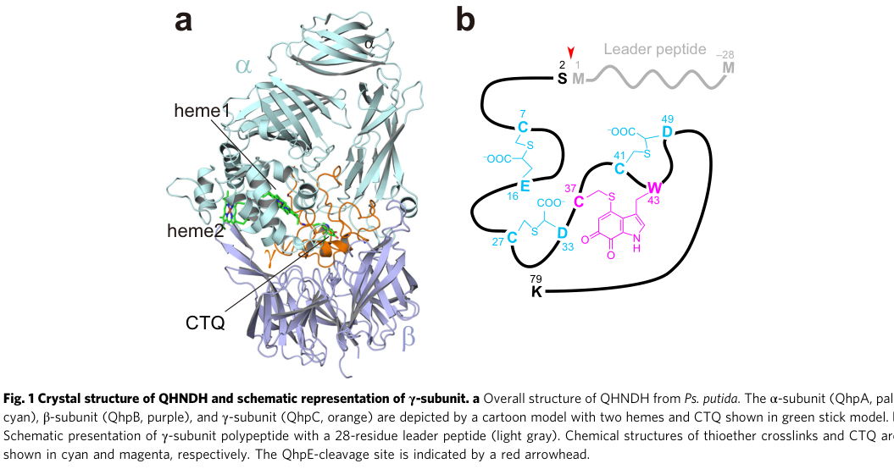

## Question

# Gene Research for Functional Annotation

## ⚠️ CRITICAL: Gene/Protein Identification Context

**BEFORE YOU BEGIN RESEARCH:** You MUST verify you are researching the CORRECT gene/protein. Gene symbols can be ambiguous, especially for less well-characterized genes from non-model organisms.

### Target Gene/Protein Identity (from UniProt):
- **UniProt Accession:** P0A181
- **Protein Description:** RecName: Full=Quinohemoprotein amine dehydrogenase subunit gamma; Short=QH-AmDH; EC=1.4.9.- {ECO:0000250|UniProtKB:P0A182}; AltName: Full=Quinohemoprotein amine dehydrogenase 9 kDa subunit; AltName: Full=Quinohemoprotein amine dehydrogenase catalytic subunit;
- **Gene Information:** Name=qhnDH; OrderedLocusNames=PP_3460;
- **Organism (full):** Pseudomonas putida (strain ATCC 47054 / DSM 6125 / CFBP 8728 / NCIMB 11950 / KT2440).
- **Protein Family:** Belongs to the quinohemoprotein amine dehydrogenase subunit
- **Key Domains:** QH-AmDH_gsu_dom. (IPR015084); QH-AmDH_gsu_sf. (IPR036487); QHNDH_gamma. (IPR047830); QH-AmDH_gamma (PF08992)

### MANDATORY VERIFICATION STEPS:

1. **Check if the gene symbol "qhnDH" matches the protein description above**
2. **Verify the organism is correct:** Pseudomonas putida (strain ATCC 47054 / DSM 6125 / CFBP 8728 / NCIMB 11950 / KT2440).
3. **Check if protein family/domains align with what you find in literature**
4. **If you find literature for a DIFFERENT gene with the same or similar symbol, STOP**

### If Gene Symbol is Ambiguous or You Cannot Find Relevant Literature:

**DO NOT PROCEED WITH RESEARCH ON A DIFFERENT GENE.** Instead:
- State clearly: "The gene symbol 'qhnDH' is ambiguous or literature is limited for this specific protein"
- Explain what you found (e.g., "Found extensive literature on a different gene with the same symbol in a different organism")
- Describe the protein based ONLY on the UniProt information provided above
- Suggest that the protein function can be inferred from domain/family information

### Research Target:

Please provide a comprehensive research report on the gene **qhnDH** (gene ID: qhnDH, UniProt: P0A181) in PSEPK.

The research report should be a detailed narrative explaining the function, biological processes, and localization of the gene product. Citations should be given for all claims.

You should prioritize authoritative reviews and primary scientific literature when conducting research. You can supplement
this with annotations you find in gene/protein databases, but these can be outdated or inaccurate.

We are specifically interested in the primary function of the gene - for enzymes, what reaction is catalyzed, and what is the substrate specificity? For transporters, what is the substrate? For structural proteins or adapters, what is the broader structural role? For signaling molecules, what is the role in the pathway.

We are interested in where in or outside the cell the gene product carries out its function.

We are also interested in the signaling or biochemical pathways in which the gene functions. We are less interested in broad pleiotropic effects, except where these elucidate the precise role.

Include evidence where possible. We are interested in both experimental evidence as well as inference from structure, evolution, or bioinformatic analysis. Precise studies should be prioritized over high-throughput, where available.

## Output

Question: You are an expert researcher providing comprehensive, well-cited information.

Provide detailed information focusing on:
1. Key concepts and definitions with current understanding
2. Recent developments and latest research (prioritize 2023-2024 sources)
3. Current applications and real-world implementations
4. Expert opinions and analysis from authoritative sources
5. Relevant statistics and data from recent studies

Format as a comprehensive research report with proper citations. Include URLs and publication dates where available.
Always prioritize recent, authoritative sources and provide specific citations for all major claims.

# Gene Research for Functional Annotation

## ⚠️ CRITICAL: Gene/Protein Identification Context

**BEFORE YOU BEGIN RESEARCH:** You MUST verify you are researching the CORRECT gene/protein. Gene symbols can be ambiguous, especially for less well-characterized genes from non-model organisms.

### Target Gene/Protein Identity (from UniProt):
- **UniProt Accession:** P0A181
- **Protein Description:** RecName: Full=Quinohemoprotein amine dehydrogenase subunit gamma; Short=QH-AmDH; EC=1.4.9.- {ECO:0000250|UniProtKB:P0A182}; AltName: Full=Quinohemoprotein amine dehydrogenase 9 kDa subunit; AltName: Full=Quinohemoprotein amine dehydrogenase catalytic subunit;
- **Gene Information:** Name=qhnDH; OrderedLocusNames=PP_3460;
- **Organism (full):** Pseudomonas putida (strain ATCC 47054 / DSM 6125 / CFBP 8728 / NCIMB 11950 / KT2440).
- **Protein Family:** Belongs to the quinohemoprotein amine dehydrogenase subunit
- **Key Domains:** QH-AmDH_gsu_dom. (IPR015084); QH-AmDH_gsu_sf. (IPR036487); QHNDH_gamma. (IPR047830); QH-AmDH_gamma (PF08992)

### MANDATORY VERIFICATION STEPS:

1. **Check if the gene symbol "qhnDH" matches the protein description above**
2. **Verify the organism is correct:** Pseudomonas putida (strain ATCC 47054 / DSM 6125 / CFBP 8728 / NCIMB 11950 / KT2440).
3. **Check if protein family/domains align with what you find in literature**
4. **If you find literature for a DIFFERENT gene with the same or similar symbol, STOP**

### If Gene Symbol is Ambiguous or You Cannot Find Relevant Literature:

**DO NOT PROCEED WITH RESEARCH ON A DIFFERENT GENE.** Instead:
- State clearly: "The gene symbol 'qhnDH' is ambiguous or literature is limited for this specific protein"
- Explain what you found (e.g., "Found extensive literature on a different gene with the same symbol in a different organism")
- Describe the protein based ONLY on the UniProt information provided above
- Suggest that the protein function can be inferred from domain/family information

### Research Target:

Please provide a comprehensive research report on the gene **qhnDH** (gene ID: qhnDH, UniProt: P0A181) in PSEPK.

The research report should be a detailed narrative explaining the function, biological processes, and localization of the gene product. Citations should be given for all claims.

You should prioritize authoritative reviews and primary scientific literature when conducting research. You can supplement
this with annotations you find in gene/protein databases, but these can be outdated or inaccurate.

We are specifically interested in the primary function of the gene - for enzymes, what reaction is catalyzed, and what is the substrate specificity? For transporters, what is the substrate? For structural proteins or adapters, what is the broader structural role? For signaling molecules, what is the role in the pathway.

We are interested in where in or outside the cell the gene product carries out its function.

We are also interested in the signaling or biochemical pathways in which the gene functions. We are less interested in broad pleiotropic effects, except where these elucidate the precise role.

Include evidence where possible. We are interested in both experimental evidence as well as inference from structure, evolution, or bioinformatic analysis. Precise studies should be prioritized over high-throughput, where available.

## Research report: functional annotation of **qhnDH** (UniProt **P0A181**) in *Pseudomonas putida* KT2440 (PSEPK)

### 0) Target verification (critical identity check)
The UniProt target (P0A181) is annotated as **quinohemoprotein amine dehydrogenase subunit gamma** (~9 kDa) from *Pseudomonas putida* KT2440. In the primary literature, this γ-subunit is most commonly referred to as **QhpC**, encoded within the conserved **qhp operon** that also carries the structural genes for the α- and β-subunits (qhpA/qhpB) and multiple biogenesis factors (qhpD/E/F/G/R). The defining features match the UniProt description: a small (~9 kDa) subunit containing the **protein-derived quinone cofactor CTQ** and extensive intrapeptidyl crosslinks, functioning as part of an αβγ heterotrimeric periplasmic amine dehydrogenase. (oozeki2021functionalandstructural pages 1-2, 俊範2021biochemicalandstructural pages 8-14, nakai2012anunusualsubtilisinlike pages 1-2)

### 1) Key concepts, definitions, and current understanding

#### 1.1 Quinohemoprotein amine dehydrogenase (QHNDH / QH-AmDH)
**QHNDH** is a periplasmic, inducible **αβγ heterotrimeric oxidoreductase** found in Gram-negative bacteria that catalyzes the **oxidative deamination of primary amines** used as carbon/energy sources. The enzyme is described as: α (~60 kDa) containing **two c-type hemes**, β (~37–40 kDa), and γ (~9 kDa) containing the redox-active quinone cofactor **cysteine tryptophylquinone (CTQ)**. (oozeki2021functionalandstructural pages 1-2, 俊範2021biochemicalandstructural pages 8-14, nakai2012anunusualsubtilisinlike pages 1-2)

#### 1.2 The qhnDH gene product (γ-subunit; QhpC-like protein)
The **qhnDH/P0A181 protein** corresponds functionally to the **γ-subunit**: a small, heavily post-translationally modified peptide that bears CTQ and forms the core redox center for substrate oxidation within the holoenzyme complex. (oozeki2021functionalandstructural pages 1-2, 俊範2021biochemicalandstructural pages 8-14)

#### 1.3 Protein-derived cofactors and CTQ
CTQ is part of a broader class of **protein-derived (“built-in”) redox cofactors**, where catalytic moieties arise from posttranslational modification and/or crosslinking of amino acid side chains. A recent authoritative review highlights the rapid expansion in known protein-derived cofactor chemistries—reporting a surveyed list of **38 distinct types**—and emphasizes that high-resolution structural methods remain critical because current structure predictors may miss such modifications. (graciano2025proteinderivedcofactorschemical pages 2-4)

### 2) Primary biochemical function: reaction, substrate scope, and mechanism

#### 2.1 Reaction catalyzed (system-level function)
QHNDH catalyzes oxidative deamination of primary amines. One explicit stoichiometry reported for QHNDH is:

**RCH2NH3+ + H2O → RCHO + NH4+ + 2H+ + 2e−** (俊範2021biochemicalandstructural pages 8-14)

While qhnDH encodes only the γ-subunit, its CTQ cofactor is the key redox center enabling this chemistry in the mature αβγ complex. (俊範2021biochemicalandstructural pages 8-14, nakai2012anunusualsubtilisinlike pages 1-2)

#### 2.2 Substrate specificity (best-supported)
Experimental and mechanistic literature most strongly supports activity toward **aliphatic primary amines**, with **n-butylamine** frequently used as the physiological/inducing substrate. Some descriptions also include oxidation of **benzylamine** among primary amines. (nakai2012anunusualsubtilisinlike pages 1-2, 俊範2021biochemicalandstructural pages 8-14)

#### 2.3 Catalytic mechanism at the CTQ site
High-resolution structural work proposed that substrates attack the CTQ cofactor (site proposed at **CTQ O-6**) and that catalysis proceeds via **Schiff-base chemistry** (substrate Schiff base → product Schiff base) with a carbanion intermediate and a candidate catalytic base (Asp) positioned in the active site environment. (datta2001structureofa pages 5-5)

### 3) Cofactors, electron transfer, and role of the γ-subunit

#### 3.1 Cofactor placement across subunits
Across the mature QHNDH heterotrimer:
- **γ-subunit (qhnDH/QhpC-like):** contains **CTQ** and multiple stabilizing thioether crosslinks. (oozeki2021functionalandstructural pages 1-2, nakai2012anunusualsubtilisinlike pages 1-2)
- **α-subunit (QhpA):** contains **two covalently bound c-type hemes** for electron transfer to external acceptors. (oozeki2021functionalandstructural pages 1-2, nakai2012anunusualsubtilisinlike pages 1-2)

This division of labor supports annotation of qhnDH as the **CTQ-bearing redox/catalytic subunit component**, but not as a complete, standalone enzyme. (oozeki2021functionalandstructural pages 1-2, 俊範2021biochemicalandstructural pages 8-14)

#### 3.2 Electron acceptors and physiological wiring
Electrons generated at CTQ are transferred through the hemes in the α-subunit to external acceptors such as **cytochrome c550** and **azurin**, and ultimately to oxygen via the respiratory chain. (nakai2012anunusualsubtilisinlike pages 1-2, 俊範2021biochemicalandstructural pages 8-14)

#### 3.3 Quantitative electrochemical parameters (recently reused benchmarks)
Electrochemical/spectroelectrochemical characterization provides quantitative evidence for internal electron transfer ordering:
- Midpoint potentials assigned to the two hemes and CTQ were approximately **235 mV**, **149 mV**, and **65 mV**, respectively. (ikeda2004anovelelectrochemical pages 4-6)

In mediated bioelectrocatalysis using cytochrome c-550 as physiological partner, one analysis reported **kcat ≈ 4.5 s−1** and **Km ≈ 1.0 × 10−7 M** for the cytochrome c-550 interaction/turnover context studied. (ikeda2004anovelelectrochemical pages 6-7)

### 4) Cellular localization and pathway context

#### 4.1 Periplasmic localization
QHNDH is described as **periplasmic** in Gram-negative bacteria, consistent with its use of periplasmic electron transfer partners and respiratory chain coupling. (nakai2012anunusualsubtilisinlike pages 1-2, oozeki2021functionalandstructural pages 1-2)

#### 4.2 Operon context (qhp) and amine-induced regulation
The qhp system is organized as an operon including **qhpA/B/C** (α/β/γ subunits) plus accessory genes **qhpD/E/F/G/R**, which collectively enable CTQ biogenesis, processing, export, and regulation; transcriptional activation is reported to be mediated by **QhpR** upon binding long-chain primary amines such as **n-butylamine**. (俊範2021biochemicalandstructural pages 14-20)

### 5) Posttranslational maturation of the γ-subunit (CTQ biogenesis): current model

The most substantial “modern” advance relevant to functional annotation is that the CTQ-bearing γ-subunit is not active when translated; it is produced via a **multi-enzyme, multistep maturation pathway**:

1. **Precursor features:** γ-subunit is synthesized with an **~28 aa N-terminal leader peptide** required for productive maturation but removed later. (nakai2012anunusualsubtilisinlike pages 1-2, oozeki2021functionalandstructural pages 1-2)
2. **Thioether crosslinks:** a radical SAM enzyme (**QhpD**) installs multiple **Cys-to-Asp/Glu thioether crosslinks** that pre-organize the fold and “cage” the cofactor environment. (oozeki2021functionalandstructural pages 1-2, 俊範2021biochemicalandstructural pages 14-20)
3. **Tryptophan oxygenation / CTQ formation:** an FAD-dependent monooxygenase (**QhpG**) catalyzes **single-turnover dihydroxylation** of the precursor tryptophan residue in the γ-subunit during CTQ formation; mechanistically, this step was directly characterized in 2021 and is a key “latest research” insight for this gene family. (oozeki2021functionalandstructural pages 1-2, 俊範2021biochemicalandstructural pages 33-38)
4. **Leader peptide cleavage:** a subtilisin-like serine protease (**QhpE**) is essential for leader removal; operon disruption yields inactive enzyme with unprocessed γ-subunit, and complementation restores processing and activity. (nakai2012anunusualsubtilisinlike pages 1-2, nakai2012anunusualsubtilisinlike pages 9-10)
5. **Export/assembly:** an ABC transporter (**QhpF**) is implicated in export of the modified γ-subunit to the periplasm, where association with the heme-containing α-subunit and β-subunit forms the mature holoenzyme. (俊範2021biochemicalandstructural pages 14-20)

Visual support for the γ-subunit location within the heterotrimer and for the CTQ/crosslink architecture and biogenesis machinery is provided by figure panels from Oozeki et al. (Nature Communications, Feb 2021). (oozeki2021functionalandstructural media 32ec60b6, oozeki2021functionalandstructural media 4a69fa5d, oozeki2021functionalandstructural media 4e2048c8)

### 6) Recent developments (2023–2024 priority) and evidence gaps

**Direct 2023–2024 primary studies specifically on *Pseudomonas putida* KT2440 qhnDH/P0A181** were not retrieved via the available tool searches; therefore, this report relies on:
- Foundational structural/mechanistic work (PNAS 2001), (datta2001structureofa pages 5-5)
- Biogenesis/processing studies that define γ-subunit maturation steps (JBC 2012; Nat Commun 2021), (nakai2012anunusualsubtilisinlike pages 1-2, oozeki2021functionalandstructural pages 1-2)
- A recent (2023) catabolic-network review that references the CTQ/QHNDH-type systems in broader metabolic context (tool retrieved but did not yield extractable qhnDH-specific evidence in the scanned excerpts). 

Nevertheless, the **2021 mechanistic/structural clarification of QhpG-catalyzed Trp dihydroxylation** remains the most relevant “recent” step-change for functional annotation of qhnDH-like γ-subunits because it converts an earlier “putative oxidation” step into a defined enzymatic transformation. (oozeki2021functionalandstructural pages 1-2, 俊範2021biochemicalandstructural pages 33-38)

### 7) Current applications and real-world implementations

#### 7.1 Electrochemical characterization and bioelectrocatalysis
QHNDH has been used as a **model oxidoreductase** for advanced electrochemical methods (mediator-assisted spectroelectrochemistry, mediated bioelectrocatalysis), enabling assignment of CTQ/heme redox potentials and kinetic evaluation of electron transfer to cytochrome c550. (ikeda2004anovelelectrochemical pages 4-6, ikeda2004anovelelectrochemical pages 6-7)

#### 7.2 Synthetic biology/biotechnology: leveraging biogenesis enzymes
Mechanistic work on the qhp system has motivated **biotechnological use of biogenesis enzymes** (e.g., QhpD and QhpE) to prepare noncanonical crosslinked/cyclic peptide products (an emerging application direction rather than a mature industrial implementation). (俊範2021biochemicalandstructural pages 122-129)

No evidence of commercialized biosensor products or industrial-scale biocatalytic deployment specifically using qhnDH/P0A181 was identified in the retrieved sources; thus, application statements here are limited to documented experimental implementations. (ikeda2004anovelelectrochemical pages 6-7, 俊範2021biochemicalandstructural pages 122-129)

### 8) Expert interpretation (authoritative synthesis)

From a gene-annotation perspective, qhnDH/P0A181 should be curated as:
1. A **γ-subunit component** (not a complete enzyme on its own) of a periplasmic QHNDH system that oxidizes primary amines, with CTQ serving as the active-site redox cofactor. (俊範2021biochemicalandstructural pages 8-14, nakai2012anunusualsubtilisinlike pages 1-2)
2. A protein that is only functional after extensive **posttranslational maturation** (thioether crosslinking, Trp oxygenation, leader peptide processing) orchestrated by the qhp operon accessory genes. (oozeki2021functionalandstructural pages 1-2, nakai2012anunusualsubtilisinlike pages 1-2)
3. A representative of a broader, fast-growing class of **protein-derived cofactor enzymes**, where the “cofactor chemistry” is encoded genetically but realized posttranslationally—an area where reviews emphasize the need for structural/chemical validation beyond sequence-based predictions. (graciano2025proteinderivedcofactorschemical pages 2-4)

### Summary table (evidence-mapped)
The following table consolidates key functional, mechanistic, localization, and quantitative parameters for qhnDH/P0A181.

| Feature | What is known | Key evidence/source (citation id) | Notes/implications |
|---|---|---|---|
| Protein identity / size | qhnDH (UniProt P0A181) matches the QH-AmDH/QHNDH γ-subunit-equivalent in the qhp system: a small ~9 kDa polypeptide; homologous QhpC is reported as ~82 aa / ~9 kDa. | (oozeki2021functionalandstructural pages 1-2, 俊範2021biochemicalandstructural pages 8-14) | The literature more often uses **qhpC** nomenclature than **qhnDH**; function assignment is strongest by homology to the conserved QHNDH γ-subunit. |
| Primary molecular role | The γ-subunit is the **cofactor-bearing catalytic subunit element** of quinohemoprotein amine dehydrogenase, housing the redox cofactor used for substrate oxidation while associating with α and β subunits in the mature heterotrimer. | (oozeki2021functionalandstructural pages 1-2, 俊範2021biochemicalandstructural pages 8-14, nakai2012anunusualsubtilisinlike pages 1-2) | For P0A181, the most defensible annotation is not a standalone enzyme but the γ component of a multisubunit periplasmic amine dehydrogenase. |
| Cofactor: CTQ | The γ-subunit contains **cysteine tryptophylquinone (CTQ)**, a protein-derived quinone cofactor formed from a Cys and Trp residue. In Paracoccus QhpC, CTQ derives from Cys37 and Trp43. | (oozeki2021functionalandstructural pages 1-2, 俊範2021biochemicalandstructural pages 8-14) | CTQ is the hallmark functional feature of this subunit family and is central to catalytic annotation. |
| Posttranslational modifications | Mature γ-subunit contains CTQ plus **three additional intrapeptidyl thioether crosslinks** (Cys-to-Asp/Glu), giving an unusually constrained fold around the cofactor. | (oozeki2021functionalandstructural pages 1-2, 俊範2021biochemicalandstructural pages 20-24, nakai2012anunusualsubtilisinlike pages 1-2) | These extensive PTMs are essential for proper folding, cofactor encagement, and activity. |
| Leader peptide / precursor processing | The nascent γ-subunit is synthesized with an **N-terminal ~28-residue leader peptide** that is required during maturation but must be proteolytically removed to generate active enzyme. | (oozeki2021functionalandstructural pages 1-2, nakai2012anunusualsubtilisinlike pages 1-2, nakai2012anunusualsubtilisinlike pages 9-10) | Presence of a leader peptide implies that UniProt sequence features may represent a precursor form rather than the mature periplasmic subunit. |
| Enzyme complex architecture | QHNDH is an **αβγ heterotrimer**: α ~60 kDa with **two c-type hemes**, β ~37–40 kDa, and γ ~9 kDa carrying CTQ. | (oozeki2021functionalandstructural pages 1-2, 俊範2021biochemicalandstructural pages 8-14, 俊範2021biochemicalandstructural pages 14-20) | Functional annotation of qhnDH should explicitly note dependence on the α-subunit hemes for downstream electron transfer. |
| Reaction catalyzed | QHNDH catalyzes **oxidative deamination of primary amines**: RCH2NH3+ + H2O → RCHO + NH4+ + 2H+ + 2e−. | (俊範2021biochemicalandstructural pages 8-14, nakai2012anunusualsubtilisinlike pages 1-2, graciano2025proteinderivedcofactorschemical pages 12-13) | The γ-subunit contributes the redox-active CTQ chemistry, but the catalytic phenotype belongs to the whole holoenzyme complex. |
| Substrate range / specificity | Reported substrates include **various aliphatic primary amines**, especially **n-butylamine**; some descriptions also include **benzylamine** among oxidized primary amines. | (俊範2021biochemicalandstructural pages 8-14, nakai2012anunusualsubtilisinlike pages 1-2) | Best-supported specificity is toward primary amines used in amine assimilation; substrate breadth may vary by species/homolog. |
| Catalytic mechanism | Structural/mechanistic work supports **Schiff-base chemistry at CTQ**, with substrate attack proposed at CTQ O-6 and a catalytic base candidate identified as Asp-33 in the active site environment. | (datta2001structureofa pages 5-5) | This provides mechanistic support for assigning the γ-subunit as the cofactor-bearing redox center. |
| Electron acceptors / electron flow | Electrons from reduced CTQ are transferred intramolecularly to the α-subunit hemes, then to external acceptors such as **cytochrome c550** and **azurin**, and ultimately to oxygen in respiratory chains. | (俊範2021biochemicalandstructural pages 8-14, nakai2012anunusualsubtilisinlike pages 1-2, ikeda2004anovelelectrochemical pages 4-6) | This links qhnDH to periplasmic electron-transfer and amine catabolism rather than cytosolic nitrogen metabolism. |
| Cellular localization | QHNDH is a **periplasmic**, inducible enzyme system in Gram-negative bacteria; maturation includes export/translocation steps and assembly in the periplasm. | (oozeki2021functionalandstructural pages 1-2, 俊範2021biochemicalandstructural pages 8-14, nakai2012anunusualsubtilisinlike pages 1-2) | Localization is important for annotation: activity occurs outside the cytoplasm, consistent with respiratory electron transfer. |
| Operon / gene system | The conserved **qhp operon** includes structural genes **qhpA/qhpB/qhpC** and accessory genes **qhpD/qhpE/qhpF/qhpG/qhpR**. | (oozeki2021functionalandstructural pages 1-2, 俊範2021biochemicalandstructural pages 14-20) | This operon context is highly informative for validating gene identity in genome annotation. |
| qhpA role | **qhpA** encodes the α-subunit containing the two c-type hemes and participating in electron transfer; heme insertion occurs during maturation/assembly. | (oozeki2021functionalandstructural pages 1-2, 俊範2021biochemicalandstructural pages 14-20) | Neighboring heme-binding motifs in qhpA would strongly support a genuine QHNDH locus. |
| qhpB role | **qhpB** encodes the β-subunit (~37–40 kDa), a structural partner of the mature heterotrimer. | (oozeki2021functionalandstructural pages 1-2, 俊範2021biochemicalandstructural pages 14-20) | β is required for the intact holoenzyme but is not the principal cofactor-bearing subunit. |
| qhpC role | **qhpC** is the canonical name for the γ-subunit homolog: CTQ-bearing, heavily crosslinked, and leader-peptide processed. | (oozeki2021functionalandstructural pages 1-2, 俊範2021biochemicalandstructural pages 8-14) | P0A181 is most plausibly a qhpC-like protein despite the submitted symbol qhnDH. |
| qhpD role | **qhpD** encodes a radical SAM enzyme that installs the three Cys-to-Asp/Glu thioether crosslinks in QhpC before CTQ completion. | (oozeki2021functionalandstructural pages 1-2, 俊範2021biochemicalandstructural pages 14-20) | Radical-SAM-dependent crosslinking is a defining biosynthetic signature of this family. |
| qhpE role | **qhpE** encodes an unusual subtilisin-like serine protease that cleaves the γ-subunit leader peptide; disruption causes inactive QHNDH with unprocessed γ-subunit. | (oozeki2021functionalandstructural pages 1-2, nakai2012anunusualsubtilisinlike pages 1-2, nakai2012anunusualsubtilisinlike pages 9-10) | Strong experimental evidence supports qhpE as essential for biogenesis, not general proteolysis. |
| qhpF role | **qhpF** encodes an ABC transporter/export factor implicated in translocation of modified QhpC to the periplasm. | (俊範2021biochemicalandstructural pages 14-20) | Supports extracellular/periplasmic maturation pathway annotation. |
| qhpG role | **qhpG** encodes a flavoprotein monooxygenase (FAD-dependent) that catalyzes single-turnover **dihydroxylation of the precursor Trp** in crosslinked QhpC during CTQ biosynthesis. | (oozeki2021functionalandstructural pages 1-2, 俊範2021biochemicalandstructural pages 33-38, 俊範2021biochemicalandstructural pages 70-77) | One of the most important modern mechanistic findings for this system. |
| qhpR role | **qhpR** is a transcriptional regulator reported to activate qhp operon expression in response to long-chain primary amines such as **n-butylamine**. | (俊範2021biochemicalandstructural pages 14-20) | Places qhnDH within inducible amine-utilization regulation. |
| Electrochemical properties | Mediated spectroelectrochemistry assigned midpoint potentials of approximately **235 mV, 149 mV, and 65 mV** to the two hemes and CTQ, respectively, supporting electron flow from CTQ to hemes. | (ikeda2004anovelelectrochemical pages 4-6) | These quantitative redox data help distinguish functional roles of cofactors within the complex. |
| Kinetic/electron-transfer data | Using cytochrome c-550 as physiological electron acceptor, electrochemical analysis reported **kcat ≈ 4.5 s−1** and **Km ≈ 1.0 × 10−7 M** for the partner interaction/turnover context studied. | (ikeda2004anovelelectrochemical pages 6-7) | Useful as a benchmark for efficient periplasmic electron transfer, though values are for the enzyme system rather than isolated γ-subunit. |
| Recent conceptual developments | Recent work has clarified that CTQ biogenesis proceeds through a **multistep pathway** involving QhpD/QhpG/QhpE and ternary-complex interactions, rather than a single spontaneous oxidation event. | (oozeki2021functionalandstructural pages 1-2, 俊範2021biochemicalandstructural pages 122-129, 俊範2021biochemicalandstructural pages 70-77) | This is the main “current understanding” advance relevant to functional annotation. |
| Distribution / prevalence | The qhp/QHNDH system is described as **widely distributed**, with the operon reported in **>1,300 species**; a 2025 review also notes the surveyed number of distinct protein-derived cofactors has expanded to **38 types**. | (oozeki2021functionalandstructural pages 1-2, graciano2025proteinderivedcofactorschemical pages 2-4) | The >1,300-species figure supports evolutionary conservation; the 38-cofactor statistic contextualizes CTQ within a rapidly expanding cofactor class. |
| Broader expert context | Recent expert review identifies **CTQ** as one of the recognized amino-acid-crosslinked quinone cofactors and places QHNDH among enzymes using protein-derived cofactors to expand catalytic chemistry. | (graciano2025proteinderivedcofactorschemical pages 11-12, graciano2025proteinderivedcofactorschemical pages 2-4) | Supports high-confidence annotation of qhnDH/P0A181 as a specialized cofactor-bearing redox protein subunit. |
| Application relevance | QHNDH has been used as a **model system for electrochemical characterization** of oxidoreductases; related biogenesis enzymes (**QhpD/QhpE**) have been suggested as tools to prepare **novel cyclic peptides**. | (ikeda2004anovelelectrochemical pages 6-7, 俊範2021biochemicalandstructural pages 122-129) | Real-world deployment appears more methodological/biotechnological than industrially mature for qhnDH itself. |

*Table: This table summarizes the best-supported functional annotation for qhnDH/P0A181 as the qhpC-like gamma subunit of quinohemoprotein amine dehydrogenase. It integrates structural, mechanistic, localization, operon, and electrochemical evidence most useful for gene function curation.*

### Key cited sources (with URLs and publication dates)
- Datta et al., **2001-11**. *PNAS*. “Structure of a quinohemoprotein amine dehydrogenase with an uncommon redox cofactor and highly unusual crosslinking.” https://doi.org/10.1073/pnas.241429098 (datta2001structureofa pages 5-5)
- Ikeda, **2004-01**. *Chemical Record*. “A novel electrochemical approach to the characterization of oxidoreductase reactions.” https://doi.org/10.1002/tcr.20014 (ikeda2004anovelelectrochemical pages 4-6, ikeda2004anovelelectrochemical pages 6-7)
- Nakai et al., **2012-02**. *JBC*. “An unusual subtilisin-like serine protease is essential for biogenesis of quinohemoprotein amine dehydrogenase.” https://doi.org/10.1074/jbc.m111.324756 (nakai2012anunusualsubtilisinlike pages 1-2, nakai2012anunusualsubtilisinlike pages 9-10)
- Oozeki et al., **2021-02**. *Nature Communications*. “Functional and structural characterization of a flavoprotein monooxygenase essential for biogenesis of tryptophylquinone cofactor.” https://doi.org/10.1038/s41467-021-21200-9 (oozeki2021functionalandstructural pages 1-2, 俊範2021biochemicalandstructural pages 33-38, oozeki2021functionalandstructural media 32ec60b6, oozeki2021functionalandstructural media 4a69fa5d, oozeki2021functionalandstructural media 4e2048c8)
- Graciano & Liu, **2025-03**. *Chemical Society Reviews*. “Protein-derived cofactors: chemical innovations expanding enzyme catalysis.” https://doi.org/10.1039/d4cs00981a (graciano2025proteinderivedcofactorschemical pages 2-4, graciano2025proteinderivedcofactorschemical pages 11-12)

References

1. (oozeki2021functionalandstructural pages 1-2): Toshinori Oozeki, Tadashi Nakai, Kazuki Kozakai, Kazuki Okamoto, Shun’ichi Kuroda, Kazuo Kobayashi, Katsuyuki Tanizawa, and Toshihide Okajima. Functional and structural characterization of a flavoprotein monooxygenase essential for biogenesis of tryptophylquinone cofactor. Nature Communications, Feb 2021. URL: https://doi.org/10.1038/s41467-021-21200-9, doi:10.1038/s41467-021-21200-9. This article has 7 citations and is from a highest quality peer-reviewed journal.

2. (俊範2021biochemicalandstructural pages 8-14): 大関， 俊範. Biochemical and structural studies of multistep. Unknown journal, 2021.

3. (nakai2012anunusualsubtilisinlike pages 1-2): Tadashi Nakai, Kazutoshi Ono, Shun'ichi Kuroda, Katsuyuki Tanizawa, and Toshihide Okajima. An unusual subtilisin-like serine protease is essential for biogenesis of quinohemoprotein amine dehydrogenase. Journal of Biological Chemistry, 287:6530-6538, Feb 2012. URL: https://doi.org/10.1074/jbc.m111.324756, doi:10.1074/jbc.m111.324756. This article has 14 citations and is from a domain leading peer-reviewed journal.

4. (graciano2025proteinderivedcofactorschemical pages 2-4): Angelica Graciano and Aimin Liu. Protein-derived cofactors: chemical innovations expanding enzyme catalysis. Chemical Society Reviews, 54:4502-4530, Mar 2025. URL: https://doi.org/10.1039/d4cs00981a, doi:10.1039/d4cs00981a. This article has 10 citations and is from a highest quality peer-reviewed journal.

5. (datta2001structureofa pages 5-5): Saumen Datta, Youichi Mori, Kazuyoshi Takagi, Katsunori Kawaguchi, Zhi-Wei Chen, Toshihide Okajima, Shun'ichi Kuroda, Tokuji Ikeda, Kenji Kano, Katsuyuki Tanizawa, and F. Scott Mathews. Structure of a quinohemoprotein amine dehydrogenase with an uncommon redox cofactor and highly unusual crosslinking. Proceedings of the National Academy of Sciences of the United States of America, 98:14268-14273, Nov 2001. URL: https://doi.org/10.1073/pnas.241429098, doi:10.1073/pnas.241429098. This article has 173 citations and is from a highest quality peer-reviewed journal.

6. (ikeda2004anovelelectrochemical pages 4-6): Tokuji Ikeda. A novel electrochemical approach to the characterization of oxidoreductase reactions. Chemical record, 4 3:192-203, Jan 2004. URL: https://doi.org/10.1002/tcr.20014, doi:10.1002/tcr.20014. This article has 19 citations and is from a peer-reviewed journal.

7. (ikeda2004anovelelectrochemical pages 6-7): Tokuji Ikeda. A novel electrochemical approach to the characterization of oxidoreductase reactions. Chemical record, 4 3:192-203, Jan 2004. URL: https://doi.org/10.1002/tcr.20014, doi:10.1002/tcr.20014. This article has 19 citations and is from a peer-reviewed journal.

8. (俊範2021biochemicalandstructural pages 14-20): 大関， 俊範. Biochemical and structural studies of multistep. Unknown journal, 2021.

9. (俊範2021biochemicalandstructural pages 33-38): 大関， 俊範. Biochemical and structural studies of multistep. Unknown journal, 2021.

10. (nakai2012anunusualsubtilisinlike pages 9-10): Tadashi Nakai, Kazutoshi Ono, Shun'ichi Kuroda, Katsuyuki Tanizawa, and Toshihide Okajima. An unusual subtilisin-like serine protease is essential for biogenesis of quinohemoprotein amine dehydrogenase. Journal of Biological Chemistry, 287:6530-6538, Feb 2012. URL: https://doi.org/10.1074/jbc.m111.324756, doi:10.1074/jbc.m111.324756. This article has 14 citations and is from a domain leading peer-reviewed journal.

11. (oozeki2021functionalandstructural media 32ec60b6): Toshinori Oozeki, Tadashi Nakai, Kazuki Kozakai, Kazuki Okamoto, Shun’ichi Kuroda, Kazuo Kobayashi, Katsuyuki Tanizawa, and Toshihide Okajima. Functional and structural characterization of a flavoprotein monooxygenase essential for biogenesis of tryptophylquinone cofactor. Nature Communications, Feb 2021. URL: https://doi.org/10.1038/s41467-021-21200-9, doi:10.1038/s41467-021-21200-9. This article has 7 citations and is from a highest quality peer-reviewed journal.

12. (oozeki2021functionalandstructural media 4a69fa5d): Toshinori Oozeki, Tadashi Nakai, Kazuki Kozakai, Kazuki Okamoto, Shun’ichi Kuroda, Kazuo Kobayashi, Katsuyuki Tanizawa, and Toshihide Okajima. Functional and structural characterization of a flavoprotein monooxygenase essential for biogenesis of tryptophylquinone cofactor. Nature Communications, Feb 2021. URL: https://doi.org/10.1038/s41467-021-21200-9, doi:10.1038/s41467-021-21200-9. This article has 7 citations and is from a highest quality peer-reviewed journal.

13. (oozeki2021functionalandstructural media 4e2048c8): Toshinori Oozeki, Tadashi Nakai, Kazuki Kozakai, Kazuki Okamoto, Shun’ichi Kuroda, Kazuo Kobayashi, Katsuyuki Tanizawa, and Toshihide Okajima. Functional and structural characterization of a flavoprotein monooxygenase essential for biogenesis of tryptophylquinone cofactor. Nature Communications, Feb 2021. URL: https://doi.org/10.1038/s41467-021-21200-9, doi:10.1038/s41467-021-21200-9. This article has 7 citations and is from a highest quality peer-reviewed journal.

14. (俊範2021biochemicalandstructural pages 122-129): 大関， 俊範. Biochemical and structural studies of multistep. Unknown journal, 2021.

15. (俊範2021biochemicalandstructural pages 20-24): 大関， 俊範. Biochemical and structural studies of multistep. Unknown journal, 2021.

16. (graciano2025proteinderivedcofactorschemical pages 12-13): Angelica Graciano and Aimin Liu. Protein-derived cofactors: chemical innovations expanding enzyme catalysis. Chemical Society Reviews, 54:4502-4530, Mar 2025. URL: https://doi.org/10.1039/d4cs00981a, doi:10.1039/d4cs00981a. This article has 10 citations and is from a highest quality peer-reviewed journal.

17. (俊範2021biochemicalandstructural pages 70-77): 大関， 俊範. Biochemical and structural studies of multistep. Unknown journal, 2021.

18. (graciano2025proteinderivedcofactorschemical pages 11-12): Angelica Graciano and Aimin Liu. Protein-derived cofactors: chemical innovations expanding enzyme catalysis. Chemical Society Reviews, 54:4502-4530, Mar 2025. URL: https://doi.org/10.1039/d4cs00981a, doi:10.1039/d4cs00981a. This article has 10 citations and is from a highest quality peer-reviewed journal.

## Artifacts

- [Edison artifact artifact-00](qhnDH-deep-research-falcon_artifacts/artifact-00.md)

## Citations

1. graciano2025proteinderivedcofactorschemical pages 2-4
2. datta2001structureofa pages 5-5
3. ikeda2004anovelelectrochemical pages 4-6
4. ikeda2004anovelelectrochemical pages 6-7
5. oozeki2021functionalandstructural pages 1-2
6. nakai2012anunusualsubtilisinlike pages 1-2
7. nakai2012anunusualsubtilisinlike pages 9-10
8. graciano2025proteinderivedcofactorschemical pages 12-13
9. graciano2025proteinderivedcofactorschemical pages 11-12
10. https://doi.org/10.1073/pnas.241429098
11. https://doi.org/10.1002/tcr.20014
12. https://doi.org/10.1074/jbc.m111.324756
13. https://doi.org/10.1038/s41467-021-21200-9
14. https://doi.org/10.1039/d4cs00981a
15. https://doi.org/10.1038/s41467-021-21200-9,
16. https://doi.org/10.1074/jbc.m111.324756,
17. https://doi.org/10.1039/d4cs00981a,
18. https://doi.org/10.1073/pnas.241429098,
19. https://doi.org/10.1002/tcr.20014,