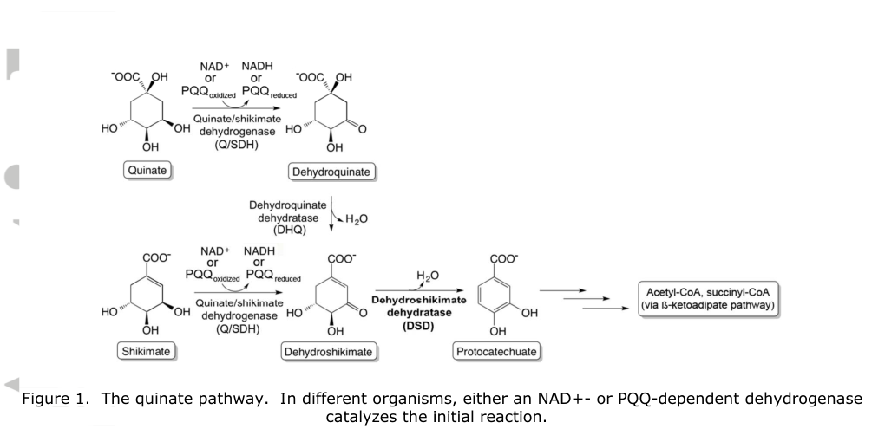

## Question

# Gene Research for Functional Annotation

## ⚠️ CRITICAL: Gene/Protein Identification Context

**BEFORE YOU BEGIN RESEARCH:** You MUST verify you are researching the CORRECT gene/protein. Gene symbols can be ambiguous, especially for less well-characterized genes from non-model organisms.

### Target Gene/Protein Identity (from UniProt):
- **UniProt Accession:** Q88JU3
- **Protein Description:** RecName: Full=3-dehydroshikimate dehydratase {ECO:0000303|PubMed:27706847}; Short=DSD {ECO:0000303|PubMed:27706847}; EC=4.2.1.118 {ECO:0000269|PubMed:27706847};
- **Gene Information:** Name=quiC1 {ECO:0000303|PubMed:27706847}; Synonyms=quiC {ECO:0000312|EMBL:AAN68163.1}; OrderedLocusNames=PP_2554 {ECO:0000312|EMBL:AAN68163.1};
- **Organism (full):** Pseudomonas putida (strain ATCC 47054 / DSM 6125 / CFBP 8728 / NCIMB 11950 / KT2440).
- **Protein Family:** Belongs to the bacterial two-domain DSD family.
- **Key Domains:** 4OHPhenylPyrv_dOase_N. (IPR041736); DSD. (IPR043700); Glyas_Bleomycin-R_OHBP_Dase. (IPR029068); Glyas_Fos-R_dOase_dom. (IPR004360); IolE/XylAMocC-like. (IPR050312)

### MANDATORY VERIFICATION STEPS:

1. **Check if the gene symbol "quiC1" matches the protein description above**
2. **Verify the organism is correct:** Pseudomonas putida (strain ATCC 47054 / DSM 6125 / CFBP 8728 / NCIMB 11950 / KT2440).
3. **Check if protein family/domains align with what you find in literature**
4. **If you find literature for a DIFFERENT gene with the same or similar symbol, STOP**

### If Gene Symbol is Ambiguous or You Cannot Find Relevant Literature:

**DO NOT PROCEED WITH RESEARCH ON A DIFFERENT GENE.** Instead:
- State clearly: "The gene symbol 'quiC1' is ambiguous or literature is limited for this specific protein"
- Explain what you found (e.g., "Found extensive literature on a different gene with the same symbol in a different organism")
- Describe the protein based ONLY on the UniProt information provided above
- Suggest that the protein function can be inferred from domain/family information

### Research Target:

Please provide a comprehensive research report on the gene **quiC1** (gene ID: quiC1, UniProt: Q88JU3) in PSEPK.

The research report should be a detailed narrative explaining the function, biological processes, and localization of the gene product. Citations should be given for all claims.

You should prioritize authoritative reviews and primary scientific literature when conducting research. You can supplement
this with annotations you find in gene/protein databases, but these can be outdated or inaccurate.

We are specifically interested in the primary function of the gene - for enzymes, what reaction is catalyzed, and what is the substrate specificity? For transporters, what is the substrate? For structural proteins or adapters, what is the broader structural role? For signaling molecules, what is the role in the pathway.

We are interested in where in or outside the cell the gene product carries out its function.

We are also interested in the signaling or biochemical pathways in which the gene functions. We are less interested in broad pleiotropic effects, except where these elucidate the precise role.

Include evidence where possible. We are interested in both experimental evidence as well as inference from structure, evolution, or bioinformatic analysis. Precise studies should be prioritized over high-throughput, where available.

## Output

Question: You are an expert researcher providing comprehensive, well-cited information.

Provide detailed information focusing on:
1. Key concepts and definitions with current understanding
2. Recent developments and latest research (prioritize 2023-2024 sources)
3. Current applications and real-world implementations
4. Expert opinions and analysis from authoritative sources
5. Relevant statistics and data from recent studies

Format as a comprehensive research report with proper citations. Include URLs and publication dates where available.
Always prioritize recent, authoritative sources and provide specific citations for all major claims.

# Gene Research for Functional Annotation

## ⚠️ CRITICAL: Gene/Protein Identification Context

**BEFORE YOU BEGIN RESEARCH:** You MUST verify you are researching the CORRECT gene/protein. Gene symbols can be ambiguous, especially for less well-characterized genes from non-model organisms.

### Target Gene/Protein Identity (from UniProt):
- **UniProt Accession:** Q88JU3
- **Protein Description:** RecName: Full=3-dehydroshikimate dehydratase {ECO:0000303|PubMed:27706847}; Short=DSD {ECO:0000303|PubMed:27706847}; EC=4.2.1.118 {ECO:0000269|PubMed:27706847};
- **Gene Information:** Name=quiC1 {ECO:0000303|PubMed:27706847}; Synonyms=quiC {ECO:0000312|EMBL:AAN68163.1}; OrderedLocusNames=PP_2554 {ECO:0000312|EMBL:AAN68163.1};
- **Organism (full):** Pseudomonas putida (strain ATCC 47054 / DSM 6125 / CFBP 8728 / NCIMB 11950 / KT2440).
- **Protein Family:** Belongs to the bacterial two-domain DSD family.
- **Key Domains:** 4OHPhenylPyrv_dOase_N. (IPR041736); DSD. (IPR043700); Glyas_Bleomycin-R_OHBP_Dase. (IPR029068); Glyas_Fos-R_dOase_dom. (IPR004360); IolE/XylAMocC-like. (IPR050312)

### MANDATORY VERIFICATION STEPS:

1. **Check if the gene symbol "quiC1" matches the protein description above**
2. **Verify the organism is correct:** Pseudomonas putida (strain ATCC 47054 / DSM 6125 / CFBP 8728 / NCIMB 11950 / KT2440).
3. **Check if protein family/domains align with what you find in literature**
4. **If you find literature for a DIFFERENT gene with the same or similar symbol, STOP**

### If Gene Symbol is Ambiguous or You Cannot Find Relevant Literature:

**DO NOT PROCEED WITH RESEARCH ON A DIFFERENT GENE.** Instead:
- State clearly: "The gene symbol 'quiC1' is ambiguous or literature is limited for this specific protein"
- Explain what you found (e.g., "Found extensive literature on a different gene with the same symbol in a different organism")
- Describe the protein based ONLY on the UniProt information provided above
- Suggest that the protein function can be inferred from domain/family information

### Research Target:

Please provide a comprehensive research report on the gene **quiC1** (gene ID: quiC1, UniProt: Q88JU3) in PSEPK.

The research report should be a detailed narrative explaining the function, biological processes, and localization of the gene product. Citations should be given for all claims.

You should prioritize authoritative reviews and primary scientific literature when conducting research. You can supplement
this with annotations you find in gene/protein databases, but these can be outdated or inaccurate.

We are specifically interested in the primary function of the gene - for enzymes, what reaction is catalyzed, and what is the substrate specificity? For transporters, what is the substrate? For structural proteins or adapters, what is the broader structural role? For signaling molecules, what is the role in the pathway.

We are interested in where in or outside the cell the gene product carries out its function.

We are also interested in the signaling or biochemical pathways in which the gene functions. We are less interested in broad pleiotropic effects, except where these elucidate the precise role.

Include evidence where possible. We are interested in both experimental evidence as well as inference from structure, evolution, or bioinformatic analysis. Precise studies should be prioritized over high-throughput, where available.

## Research report: **quiC1 (UniProt Q88JU3; locus PP_2554)** in *Pseudomonas putida* KT2440

### 1) Target verification (gene/protein identity and disambiguation)
The target protein is **QuiC1**, also described as **3-dehydroshikimate dehydratase (DSD)**, from *Pseudomonas putida* strain KT2440 (ATCC 47054/DSM 6125) and corresponds to **UniProt accession Q88JU3** (per the 2024 metabolic-engineering study that explicitly states UniProt Q88JU3 as the DSD gene amplified from *P. putida* genomic DNA). (orn2024enhancingmetabolicefficiency pages 1-2)

The aliasing of this activity across organisms is a common source of symbol ambiguity; the same enzymatic function is also referred to as **AroZ, AsbF, 3dhsd, and QuiC1** in various taxa, and Örn et al. explicitly lists these as alternative names for the same dehydroshikimate dehydratase activity. (orn2024enhancingmetabolicefficiency pages 1-2)

### 2) Key concepts and current functional understanding

#### 2.1 Enzymatic function and reaction definition
**QuiC1/DSD catalyzes dehydration of 3-dehydroshikimate (DHS) to form protocatechuate (PCA; protocatechuic acid).** This reaction is a key biochemical definition for functional annotation of the gene product. (peek2017structurallydiversedehydroshikimate pages 5-9, peek2017structurallydiversedehydroshikimate pages 23-27, orn2024enhancingmetabolicefficiency pages 1-2)

#### 2.2 Pathway context: quinate/shikimate catabolism and a branchpoint with aromatic amino acid biosynthesis
Peek et al. characterize QuiC1 as a **dehydroshikimate dehydratase variant that participates in microbial quinate catabolism**, specifically feeding carbon into **protocatechuate** formation. (peek2017structurallydiversedehydroshikimate pages 1-5, peek2017structurallydiversedehydroshikimate pages 5-9)

A critical systems-level point is that QuiC1 uses **DHS**, which is also an intermediate on the route to **chorismate** (aromatic amino acid biosynthesis). Peek et al. emphasize this competition/branchpoint concept, i.e., QuiC1 can redirect DHS away from chorismate biosynthesis toward protocatechuate. (peek2017structurallydiversedehydroshikimate pages 16-20)

### 3) Experimental evidence for function, substrate specificity, and mechanism

#### 3.1 In vivo physiological evidence (pathway role)
Peek et al. tested a **Pseudomonas aeruginosa quiC1 knockout** for growth on quinate or shikimate as sole carbon sources and showed that expression of the **P. putida KT2440 QuiC1 ortholog** restores growth, supporting that QuiC1 function is required in the quinate/shikimate utilization route producing protocatechuate. (peek2017structurallydiversedehydroshikimate pages 5-9)

Additionally, expression of **P. putida QuiC1 in *E. coli*** cultures supplemented with quinate led to accumulation of **protocatechuate**, described as the predicted QuiC1 reaction product, consistent with the DHS→protocatechuate conversion occurring in vivo. (peek2017structurallydiversedehydroshikimate pages 5-9)

#### 3.2 In vitro biochemical evidence (substrate/product, assay, metal dependence)
Peek et al. directly assayed purified enzyme for formation of protocatechuate from DHS using **spectrophotometric monitoring at 290 nm** and confirmed product identity by **HPLC/UV** coelution with a protocatechuate standard. (peek2017structurallydiversedehydroshikimate pages 23-27)

QuiC1 is a **divalent-metal-dependent enzyme**: activity is supported by multiple metals (Ni2+, Mn2+, Mg2+), with maximal activity under tested conditions with **Co2+**, and activity is inhibited by EDTA (consistent with metalloenzyme behavior). (peek2017structurallydiversedehydroshikimate pages 5-9, peek2017structurallydiversedehydroshikimate pages 23-27)

#### 3.3 Kinetics and catalytic efficiency (quantitative annotation)
Under Peek et al.’s conditions (10 mM CoCl2), full-length *P. putida* QuiC1 exhibited **kcat = 163.6 ± 8.5 s−1** and **KM = 331 ± 51 µM** for DHS. (peek2017structurallydiversedehydroshikimate pages 5-9, peek2017structurallydiversedehydroshikimate media c68b7fb3)

The isolated N-terminal domain alone retained DSD activity but with reduced turnover (**kcat = 61.2 ± 2.5 s−1; KM = 205 ± 30 µM**), supporting that the catalytic machinery is contained in the N-terminal DSD domain while the C-terminal region enhances overall performance in vivo. (peek2017structurallydiversedehydroshikimate pages 5-9, peek2017structurallydiversedehydroshikimate media c68b7fb3)

#### 3.4 Structure and domain architecture (mechanistic inference)
Peek et al. solved the crystal structure of *P. putida* KT2440 QuiC1 (**PDB: 5HMQ**) at ~2.37 Å resolution and found it is a **two-domain fusion protein**: 
- **N-terminal TIM-barrel DSD domain** (catalytic DSD activity) and
- **C-terminal VOC/HPPD-like domain** (sequence/structural similarity to hydroxyphenylpyruvate dioxygenase),
with the domains connected by a linker and the enzyme forming a **dimer** in solution. (peek2017structurallydiversedehydroshikimate pages 9-12, peek2017structurallydiversedehydroshikimate pages 5-9)

Metal-binding residues at the N-terminal active site (e.g., involving Glu134, Asp165, Gln191, Glu239) were identified structurally; ICP-AES indicated magnesium as the predominant bound metal in purified protein preparations, while catalytic assays showed Co2+ gave highest activity under tested assay conditions. (peek2017structurallydiversedehydroshikimate pages 9-12, peek2017structurallydiversedehydroshikimate pages 27-31, peek2017structurallydiversedehydroshikimate pages 5-9)

The C-terminal domain is “HPPD-like”, but targeted assays did **not** detect canonical HPPD or protocatechuate dioxygenase activities, consistent with the functional annotation that the **primary catalytic role is DSD activity** in the N-terminal domain. (peek2017structurallydiversedehydroshikimate pages 5-9, peek2017structurallydiversedehydroshikimate pages 23-27)

### 4) Cellular localization and where the reaction occurs
Direct subcellular localization experiments (e.g., fluorescence localization, fractionation in native host) were not found in the retrieved sources for *P. putida* KT2440 QuiC1. However, multiple lines of evidence support **cytosolic/soluble localization**:
1) Recombinant QuiC1 was purified from **soluble lysates**, is a soluble **dimer**, and is crystallizable as a soluble enzyme. (peek2017structurallydiversedehydroshikimate pages 20-23, peek2017structurallydiversedehydroshikimate pages 5-9)
2) Peek et al. note that a distinct **membrane-associated DSD class** exists in some *Pseudomonas* strains but is **absent from KT2440**, making a soluble cytosolic QuiC1 the relevant DSD activity in KT2440. (peek2017structurallydiversedehydroshikimate pages 16-20)

Thus, the best-supported functional model is that QuiC1 catalyzes DHS→protocatechuate in the **cytosol**, feeding protocatechuate into downstream aromatic metabolism. (peek2017structurallydiversedehydroshikimate pages 16-20, peek2017structurallydiversedehydroshikimate pages 5-9)

### 5) Signaling/regulatory and genomic context (evidence and gaps)

#### 5.1 What is supported
Peek et al. provide strong functional genetics connecting QuiC1 to quinate/shikimate utilization phenotypes, but the retrieved excerpts do not provide a complete *P. putida* KT2440 **operon map** or direct transcriptional regulation model for **quiC1** itself. (peek2017structurallydiversedehydroshikimate pages 5-9, peek2017structurallydiversedehydroshikimate pages 1-5)

#### 5.2 Inference from related systems (clearly separated from direct evidence)
In *Acinetobacter* ADP1, genes for quinate→protocatechuate and protocatechuate degradation are arranged in a large cluster (dca-pca-qui-pob-hca), and expression of pca/qui can be **induced by protocatechuate** and regulated by the LysR-type regulator **PcaU**. This provides a plausible regulatory archetype for quinate/protocatechuate modules, but it is not direct evidence for *P. putida* KT2440 quiC1 regulation. (dal2005transcriptionalorganizationof pages 1-2)

### 6) Recent developments (2023–2024) and latest research emphasizing applications

#### 6.1 2024: promoter engineering to improve protocatechuic acid production using *P. putida* DSD (Q88JU3)
Örn et al. (publication date **Aug 2024**) used *P. putida* DSD (**UniProt Q88JU3**) expressed in *E. coli* and screened a **degenerate synthetic promoter library**, identifying three constitutive promoters that improved protocatechuic acid yield from glucose by **10–21%** relative to a T7-inducible system and removed the need for IPTG. (orn2024enhancingmetabolicefficiency pages 1-2)

They also report that DSD transcript levels dropped by about **250-fold** in stationary phase vs exponential phase (RT-qPCR), highlighting growth-phase-dependent expression as a key constraint in real-world implementations of DHS→PCA bioconversion. (orn2024enhancingmetabolicefficiency pages 1-2)

#### 6.2 2023: reversing catabolism in *P. putida* KT2440 to produce gallic acid via a DSD-enabled intermediate
Dias et al. (publication date **Nov 2023**) engineered *P. putida* KT2440 to produce **gallic acid** from glycerol by introducing a synthetic operon including a **dehydroshikimate dehydratase (quiC)** step (DHS→protocatechuate) and preventing re-consumption of intermediates by deleting degradation genes (pcaHG and galTAPR). In shake-flask assays (10 g/L glycerol mineral medium), the engineered strain produced **346.7 ± 0.004 mg/L gallic acid** after 72 h. (dias2023fromdegraderto pages 1-2)

They further report a gallic acid yield of **0.12 g GA per g glycerol consumed** between 24–72 h (~**15.4%** of their in silico maximum), and that the engineered strain secreted GA and PCA predominantly to the medium and stopped growing after induction—an important process-level observation about metabolic burden and product flux. (dias2023fromdegraderto pages 8-11)

### 7) Current applications and real-world implementations

#### 7.1 Protocatechuate as a platform intermediate
Peek et al. discuss DSD-enabled protocatechuate formation as a precursor node to multiple industrially relevant products (e.g., catechol, vanillin, muconic acid) and note muconic acid can be hydrogenated to **adipic acid**, linking the enzymology of QuiC1-like DSDs to industrial polymer-precursor value chains. (peek2017structurallydiversedehydroshikimate pages 16-20, peek2017structurallydiversedehydroshikimate pages 20-23)

#### 7.2 Quantitative performance in engineered hosts (production statistics)
Örn et al. (Jun 2021) expressed the *P. putida* DSD in engineered *E. coli* and achieved in fed-batch a maximum PCA titer of **4.2–4.25 g/L**, yield **18 mol% per mol glucose**, and productivity **0.079 g/L/h**. They report acetate as a major side product and interpret production cessation as feedback inhibition affecting enzymes including DSD at critical PCA concentrations; flow cytometry suggested PCA did not cause overt membrane damage. (orn2021enhancedprotocatechuicacid pages 1-2, orn2021enhancedprotocatechuicacid pages 8-9)

Although 2021 is not within the user-prioritized 2023–2024 window, it provides a concrete benchmark for real-world process performance and constraints of the same enzyme (QuiC1/DSD) in microbial production. (orn2021enhancedprotocatechuicacid pages 1-2)

### 8) Expert interpretation and evidence-weighted conclusions

**Primary function (high confidence):** QuiC1 (Q88JU3) is a **metal-dependent dehydroshikimate dehydratase** converting DHS→protocatechuate/protocatechuic acid. This is supported by (i) purified-enzyme assays with verified product identity; (ii) quantified kinetic parameters; (iii) solved crystal structure supporting domain-based catalytic assignment; and (iv) in vivo complementation/growth phenotypes in a pseudomonad quinate/shikimate utilization context. (peek2017structurallydiversedehydroshikimate pages 5-9, peek2017structurallydiversedehydroshikimate pages 23-27, peek2017structurallydiversedehydroshikimate pages 9-12)

**Substrate specificity:** The experimentally validated substrate is DHS (3-dehydroshikimate), and the validated product is protocatechuate/PCA. No evidence in the retrieved sources supports broad alternative substrate specificity as the primary role; the C-terminal HPPD-like domain does not show canonical HPPD activity in the tested assays, reinforcing the DSD-centric annotation. (peek2017structurallydiversedehydroshikimate pages 5-9, peek2017structurallydiversedehydroshikimate pages 23-27)

**Localization:** Best-supported model is **cytosolic/soluble** localization in *P. putida* KT2440, with explicit exclusion of a membrane-associated DSD class from KT2440. Direct localization experiments in the native host were not retrieved, so this remains inference from biochemical behavior and comparative genomics rather than definitive cell-fractionation evidence. (peek2017structurallydiversedehydroshikimate pages 16-20, peek2017structurallydiversedehydroshikimate pages 20-23)

**Pathway integration:** QuiC1 sits at a physiologically important node linking quinate/shikimate-derived carbon to protocatechuate formation and potentially into broader aromatic catabolism (e.g., β-ketoadipate routes) and/or engineered product pathways. (peek2017structurallydiversedehydroshikimate pages 5-9, peek2017structurallydiversedehydroshikimate pages 16-20)

### 9) Visual evidence from the primary literature
Peek et al. provide a quinate-pathway schematic, kinetic table, and domain/structure figure for *P. putida* QuiC1, supporting the pathway assignment, kinetics, and architecture discussed above. (peek2017structurallydiversedehydroshikimate media c68b7fb3, peek2017structurallydiversedehydroshikimate media 75f43c71, peek2017structurallydiversedehydroshikimate media 396bae63)

### 10) Summary table of key facts
| Feature | Finding | Publication | DOI URL |
|---|---|---|---|
| Identity | **QuiC1 / DSD** from *Pseudomonas putida* KT2440; UniProt **Q88JU3**; locus **PP_2554**; experimentally used as the *P. putida* dehydroshikimate dehydratase in biochemical and engineering studies (orn2024enhancingmetabolicefficiency pages 1-2, peek2017structurallydiversedehydroshikimate pages 1-5) | Peek et al., 2017; Örn et al., 2024 | https://doi.org/10.1111/mmi.13542 ; https://doi.org/10.1007/s00253-024-13256-6 |
| Catalyzed reaction | Converts **3-dehydroshikimate (DHS)** to **protocatechuate / protocatechuic acid (PCA)**; DSD step in quinate/shikimate-derived protocatechuate formation (peek2017structurallydiversedehydroshikimate pages 5-9, peek2017structurallydiversedehydroshikimate pages 23-27, orn2024enhancingmetabolicefficiency pages 1-2) | Peek et al., 2017; Örn et al., 2024 | https://doi.org/10.1111/mmi.13542 ; https://doi.org/10.1007/s00253-024-13256-6 |
| Pathway role | Functions in **quinate/shikimate catabolism**; genetic complementation data show QuiC1 is needed for efficient growth on quinate or shikimate, and protocatechuate supplementation bypasses the block (peek2017structurallydiversedehydroshikimate pages 5-9) | Peek et al., 2017 | https://doi.org/10.1111/mmi.13542 |
| Domain architecture | **Two-domain fusion protein**: N-terminal **TIM-barrel DSD domain** (~275 aa) plus C-terminal **VOC/HPPD-like domain** (~325 aa), connected by a proline-rich linker; N-terminal domain carries DSD activity, C-terminal domain enhances in vivo performance but no HPPD/PCD activity was detected (peek2017structurallydiversedehydroshikimate pages 9-12, peek2017structurallydiversedehydroshikimate pages 5-9) | Peek et al., 2017 | https://doi.org/10.1111/mmi.13542 |
| Cofactors / metal dependence | DSD activity is **divalent-metal dependent**; activated by **Ni2+, Mn2+, Mg2+**, with **Co2+** giving highest activity under tested conditions; **EDTA inhibits** activity; ICP-AES on purified protein found **Mg2+** associated with the structure (peek2017structurallydiversedehydroshikimate pages 5-9, peek2017structurallydiversedehydroshikimate pages 23-27, peek2017structurallydiversedehydroshikimate pages 27-31) | Peek et al., 2017 | https://doi.org/10.1111/mmi.13542 |
| Kinetics | Full-length QuiC1: **kcat 163.6 ± 8.5 s^-1**, **KM 331 ± 51 µM** for DHS under 10 mM CoCl2; N-terminal domain alone retains activity with **kcat 61.2 ± 2.5 s^-1**, **KM 205 ± 30 µM** (peek2017structurallydiversedehydroshikimate pages 5-9, peek2017structurallydiversedehydroshikimate media c68b7fb3) | Peek et al., 2017 | https://doi.org/10.1111/mmi.13542 |
| Structure | Crystal structure solved for *P. putida* QuiC1, **PDB 5HMQ**; 2.37 Å diffraction; refined to **R/Rfree 0.1853/0.2317**; dimeric in solution and in crystal packing; Figure 4 shows the two-domain architecture (peek2017structurallydiversedehydroshikimate pages 9-12, peek2017structurallydiversedehydroshikimate media c68b7fb3) | Peek et al., 2017 | https://doi.org/10.1111/mmi.13542 |
| Evidence type: in vitro | Purified recombinant enzyme assayed spectrophotometrically at **290 nm** and product identity confirmed by **HPLC/UV coelution** with protocatechuate; metal-screening, mutagenesis, and truncation studies support catalytic assignment (peek2017structurallydiversedehydroshikimate pages 23-27, peek2017structurallydiversedehydroshikimate pages 9-12) | Peek et al., 2017 | https://doi.org/10.1111/mmi.13542 |
| Evidence type: in vivo | *P. aeruginosa* **quiC1** knockout showed impaired utilization of quinate/shikimate as sole carbon sources; plasmid-borne *P. putida* QuiC1 restored growth; expression in *E. coli* with quinate caused extracellular protocatechuate accumulation (peek2017structurallydiversedehydroshikimate pages 5-9) | Peek et al., 2017 | https://doi.org/10.1111/mmi.13542 |
| Localization inference | Best-supported inference is **soluble/cytosolic** localization: QuiC1 was purified from **soluble lysate**, behaves as a soluble dimer, and KT2440 lacks the alternative **membrane-associated DSD** class reported in some other *Pseudomonas* strains (peek2017structurallydiversedehydroshikimate pages 20-23, peek2017structurallydiversedehydroshikimate pages 16-20) | Peek et al., 2017 | https://doi.org/10.1111/mmi.13542 |
| Branchpoint significance | QuiC1 competes for DHS at the interface of **catabolic protocatechuate formation** and the **shikimate/chorismate biosynthetic branch**, helping redirect carbon from DHS toward aromatic acid products (peek2017structurallydiversedehydroshikimate pages 16-20) | Peek et al., 2017 | https://doi.org/10.1111/mmi.13542 |
| 2021 applied implementation | Heterologous expression of the *P. putida* DSD in engineered *E. coli* enabled PCA production up to **4.2–4.25 g/L**, **18 mol% mol^-1 glucose**, productivity **0.079 g/L/h** in fed-batch; PCA accumulation likely caused pathway/product inhibition (orn2021enhancedprotocatechuicacid pages 1-2, orn2021enhancedprotocatechuicacid pages 8-9) | Örn et al., 2021 | https://doi.org/10.3389/fbioe.2021.695704 |
| 2024 applied implementation | Same *P. putida* DSD gene (**Q88JU3**) used in *E. coli* promoter engineering; three constitutive promoters improved PCA yield by **10–21%** versus T7 and avoided IPTG; RT-qPCR showed **~250-fold** lower DSD transcript in stationary vs exponential phase; background PCA about **0.04 g/L** even without a regulatory element (orn2024enhancingmetabolicefficiency pages 1-2) | Örn et al., 2024 | https://doi.org/10.1007/s00253-024-13256-6 |
| 2023 related *P. putida* implementation | In **reversed gallic acid metabolism** engineering of *P. putida* KT2440, a synthetic pathway containing a DSD/QuiC step plus deletions preventing PCA/GA degradation produced **346.7 ± 0.004 mg/L gallic acid** from glycerol, yield **0.12 g/g glycerol consumed** (~15.4% of in silico maximum) (dias2023fromdegraderto pages 1-2, dias2023fromdegraderto pages 8-11) | Dias et al., 2023 | https://doi.org/10.1007/s10123-022-00282-5 |
| Broader product relevance | DSD-enabled protocatechuate formation has been highlighted for production of **catechol, vanillin, muconic acid**, and ultimately **adipic acid** via downstream chemistry/bioprocessing, supporting industrial relevance of QuiC1-like enzymes (peek2017structurallydiversedehydroshikimate pages 16-20, peek2017structurallydiversedehydroshikimate pages 20-23) | Peek et al., 2017 | https://doi.org/10.1111/mmi.13542 |

*Table: This table summarizes experimentally supported functional-annotation facts for *Pseudomonas putida* KT2440 QuiC1/DSD (Q88JU3/PP_2554), including reaction, pathway role, structure, kinetics, evidence types, localization inference, and recent engineering uses. It is useful as a compact evidence map linking core annotation claims to specific publications and DOI URLs.*

### 11) Key references with publication dates and URLs
- Peek J, Roman J, Moran GR, Christendat D. **Structurally diverse dehydroshikimate dehydratase variants participate in microbial quinate catabolism.** *Molecular Microbiology*. **Jan 2017**. https://doi.org/10.1111/mmi.13542 (peek2017structurallydiversedehydroshikimate pages 5-9)
- Örn OE et al. **Enhancing metabolic efficiency via novel constitutive promoters to produce protocatechuic acid in Escherichia coli.** *Applied Microbiology and Biotechnology*. **Aug 2024**. https://doi.org/10.1007/s00253-024-13256-6 (orn2024enhancingmetabolicefficiency pages 1-2)
- Dias FMS et al. **From degrader to producer: reversing the gallic acid metabolism of Pseudomonas putida KT2440.** *International Microbiology*. **Nov 2023**. https://doi.org/10.1007/s10123-022-00282-5 (dias2023fromdegraderto pages 1-2)
- Örn OE et al. **Enhanced protocatechuic acid production from glucose using Pseudomonas putida 3-dehydroshikimate dehydratase expressed in a phenylalanine-overproducing mutant of Escherichia coli.** *Frontiers in Bioengineering and Biotechnology*. **Jun 2021**. https://doi.org/10.3389/fbioe.2021.695704 (orn2021enhancedprotocatechuicacid pages 1-2)

### 12) Explicit limitations of the present evidence set
- No retrieved full-text evidence explicitly mapping **quiC1 (PP_2554) operon neighbors** or directly demonstrating **induction/regulation of quiC1 transcription** in *P. putida* KT2440 under quinate/shikimate conditions; the report therefore emphasizes biochemical/genetic function and uses regulatory archetypes from related organisms only as labeled context. (peek2017structurallydiversedehydroshikimate pages 5-9, dal2005transcriptionalorganizationof pages 1-2)

References

1. (orn2024enhancingmetabolicefficiency pages 1-2): Oliver Englund Örn, Arne Hagman, Mohamed Ismail, Nélida Leiva Eriksson, and Rajni Hatti-Kaul. Enhancing metabolic efficiency via novel constitutive promoters to produce protocatechuic acid in escherichia coli. Applied Microbiology and Biotechnology, Aug 2024. URL: https://doi.org/10.1007/s00253-024-13256-6, doi:10.1007/s00253-024-13256-6. This article has 1 citations and is from a domain leading peer-reviewed journal.

2. (peek2017structurallydiversedehydroshikimate pages 5-9): James Peek, Joseph Roman, Graham R. Moran, and Dinesh Christendat. Structurally diverse dehydroshikimate dehydratase variants participate in microbial quinate catabolism. Molecular Microbiology, 103:39-54, Jan 2017. URL: https://doi.org/10.1111/mmi.13542, doi:10.1111/mmi.13542. This article has 25 citations and is from a domain leading peer-reviewed journal.

3. (peek2017structurallydiversedehydroshikimate pages 23-27): James Peek, Joseph Roman, Graham R. Moran, and Dinesh Christendat. Structurally diverse dehydroshikimate dehydratase variants participate in microbial quinate catabolism. Molecular Microbiology, 103:39-54, Jan 2017. URL: https://doi.org/10.1111/mmi.13542, doi:10.1111/mmi.13542. This article has 25 citations and is from a domain leading peer-reviewed journal.

4. (peek2017structurallydiversedehydroshikimate pages 1-5): James Peek, Joseph Roman, Graham R. Moran, and Dinesh Christendat. Structurally diverse dehydroshikimate dehydratase variants participate in microbial quinate catabolism. Molecular Microbiology, 103:39-54, Jan 2017. URL: https://doi.org/10.1111/mmi.13542, doi:10.1111/mmi.13542. This article has 25 citations and is from a domain leading peer-reviewed journal.

5. (peek2017structurallydiversedehydroshikimate pages 16-20): James Peek, Joseph Roman, Graham R. Moran, and Dinesh Christendat. Structurally diverse dehydroshikimate dehydratase variants participate in microbial quinate catabolism. Molecular Microbiology, 103:39-54, Jan 2017. URL: https://doi.org/10.1111/mmi.13542, doi:10.1111/mmi.13542. This article has 25 citations and is from a domain leading peer-reviewed journal.

6. (peek2017structurallydiversedehydroshikimate media c68b7fb3): James Peek, Joseph Roman, Graham R. Moran, and Dinesh Christendat. Structurally diverse dehydroshikimate dehydratase variants participate in microbial quinate catabolism. Molecular Microbiology, 103:39-54, Jan 2017. URL: https://doi.org/10.1111/mmi.13542, doi:10.1111/mmi.13542. This article has 25 citations and is from a domain leading peer-reviewed journal.

7. (peek2017structurallydiversedehydroshikimate pages 9-12): James Peek, Joseph Roman, Graham R. Moran, and Dinesh Christendat. Structurally diverse dehydroshikimate dehydratase variants participate in microbial quinate catabolism. Molecular Microbiology, 103:39-54, Jan 2017. URL: https://doi.org/10.1111/mmi.13542, doi:10.1111/mmi.13542. This article has 25 citations and is from a domain leading peer-reviewed journal.

8. (peek2017structurallydiversedehydroshikimate pages 27-31): James Peek, Joseph Roman, Graham R. Moran, and Dinesh Christendat. Structurally diverse dehydroshikimate dehydratase variants participate in microbial quinate catabolism. Molecular Microbiology, 103:39-54, Jan 2017. URL: https://doi.org/10.1111/mmi.13542, doi:10.1111/mmi.13542. This article has 25 citations and is from a domain leading peer-reviewed journal.

9. (peek2017structurallydiversedehydroshikimate pages 20-23): James Peek, Joseph Roman, Graham R. Moran, and Dinesh Christendat. Structurally diverse dehydroshikimate dehydratase variants participate in microbial quinate catabolism. Molecular Microbiology, 103:39-54, Jan 2017. URL: https://doi.org/10.1111/mmi.13542, doi:10.1111/mmi.13542. This article has 25 citations and is from a domain leading peer-reviewed journal.

10. (dal2005transcriptionalorganizationof pages 1-2): Süreyya Dal, Gaby Trautwein, and Ulrike Gerischer. Transcriptional organization of genes for protocatechuate and quinate degradation from acinetobacter sp. strain adp1. Applied and Environmental Microbiology, 71:1025-1034, Feb 2005. URL: https://doi.org/10.1128/aem.71.2.1025-1034.2005, doi:10.1128/aem.71.2.1025-1034.2005. This article has 42 citations and is from a peer-reviewed journal.

11. (dias2023fromdegraderto pages 1-2): Felipe M. S. Dias, Raoní K. Pantoja, José Gregório C. Gomez, and Luiziana F. Silva. From degrader to producer: reversing the gallic acid metabolism of pseudomonas putida kt2440. International Microbiology, 26:243-255, Nov 2023. URL: https://doi.org/10.1007/s10123-022-00282-5, doi:10.1007/s10123-022-00282-5. This article has 7 citations and is from a peer-reviewed journal.

12. (dias2023fromdegraderto pages 8-11): Felipe M. S. Dias, Raoní K. Pantoja, José Gregório C. Gomez, and Luiziana F. Silva. From degrader to producer: reversing the gallic acid metabolism of pseudomonas putida kt2440. International Microbiology, 26:243-255, Nov 2023. URL: https://doi.org/10.1007/s10123-022-00282-5, doi:10.1007/s10123-022-00282-5. This article has 7 citations and is from a peer-reviewed journal.

13. (orn2021enhancedprotocatechuicacid pages 1-2): Oliver Englund Örn, Stefano Sacchetto, Ed W. J. van Niel, and Rajni Hatti-Kaul. Enhanced protocatechuic acid production from glucose using pseudomonas putida 3-dehydroshikimate dehydratase expressed in a phenylalanine-overproducing mutant of escherichia coli. Frontiers in Bioengineering and Biotechnology, Jun 2021. URL: https://doi.org/10.3389/fbioe.2021.695704, doi:10.3389/fbioe.2021.695704. This article has 27 citations.

14. (orn2021enhancedprotocatechuicacid pages 8-9): Oliver Englund Örn, Stefano Sacchetto, Ed W. J. van Niel, and Rajni Hatti-Kaul. Enhanced protocatechuic acid production from glucose using pseudomonas putida 3-dehydroshikimate dehydratase expressed in a phenylalanine-overproducing mutant of escherichia coli. Frontiers in Bioengineering and Biotechnology, Jun 2021. URL: https://doi.org/10.3389/fbioe.2021.695704, doi:10.3389/fbioe.2021.695704. This article has 27 citations.

15. (peek2017structurallydiversedehydroshikimate media 75f43c71): James Peek, Joseph Roman, Graham R. Moran, and Dinesh Christendat. Structurally diverse dehydroshikimate dehydratase variants participate in microbial quinate catabolism. Molecular Microbiology, 103:39-54, Jan 2017. URL: https://doi.org/10.1111/mmi.13542, doi:10.1111/mmi.13542. This article has 25 citations and is from a domain leading peer-reviewed journal.

16. (peek2017structurallydiversedehydroshikimate media 396bae63): James Peek, Joseph Roman, Graham R. Moran, and Dinesh Christendat. Structurally diverse dehydroshikimate dehydratase variants participate in microbial quinate catabolism. Molecular Microbiology, 103:39-54, Jan 2017. URL: https://doi.org/10.1111/mmi.13542, doi:10.1111/mmi.13542. This article has 25 citations and is from a domain leading peer-reviewed journal.

## Artifacts

- [Edison artifact artifact-00](quiC1-deep-research-falcon_artifacts/artifact-00.md)

## Citations

1. orn2024enhancingmetabolicefficiency pages 1-2
2. peek2017structurallydiversedehydroshikimate pages 16-20
3. peek2017structurallydiversedehydroshikimate pages 5-9
4. peek2017structurallydiversedehydroshikimate pages 23-27
5. dal2005transcriptionalorganizationof pages 1-2
6. dias2023fromdegraderto pages 1-2
7. dias2023fromdegraderto pages 8-11
8. orn2021enhancedprotocatechuicacid pages 1-2
9. peek2017structurallydiversedehydroshikimate pages 1-5
10. peek2017structurallydiversedehydroshikimate pages 9-12
11. peek2017structurallydiversedehydroshikimate pages 27-31
12. peek2017structurallydiversedehydroshikimate pages 20-23
13. orn2021enhancedprotocatechuicacid pages 8-9
14. https://doi.org/10.1111/mmi.13542
15. https://doi.org/10.1007/s00253-024-13256-6
16. https://doi.org/10.3389/fbioe.2021.695704
17. https://doi.org/10.1007/s10123-022-00282-5
18. https://doi.org/10.1007/s00253-024-13256-6,
19. https://doi.org/10.1111/mmi.13542,
20. https://doi.org/10.1128/aem.71.2.1025-1034.2005,
21. https://doi.org/10.1007/s10123-022-00282-5,
22. https://doi.org/10.3389/fbioe.2021.695704,