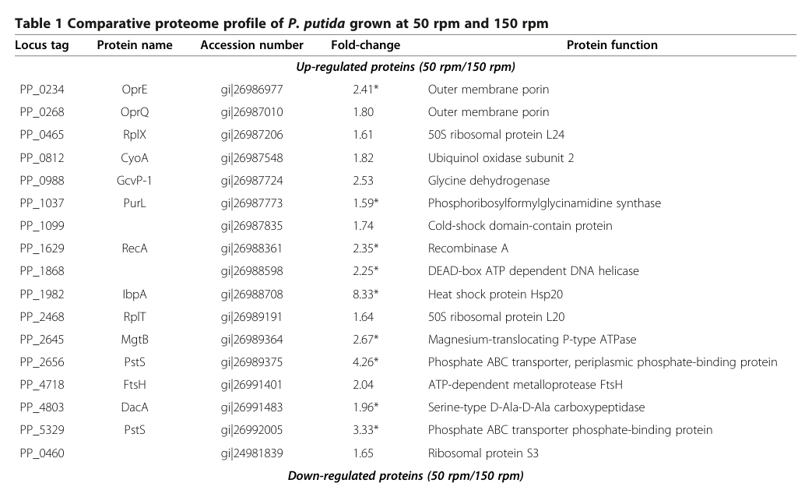

## Question

# Gene Research for Functional Annotation

## ⚠️ CRITICAL: Gene/Protein Identification Context

**BEFORE YOU BEGIN RESEARCH:** You MUST verify you are researching the CORRECT gene/protein. Gene symbols can be ambiguous, especially for less well-characterized genes from non-model organisms.

### Target Gene/Protein Identity (from UniProt):
- **UniProt Accession:** Q88ME4
- **Protein Description:** RecName: Full=Protein RecA {ECO:0000255|HAMAP-Rule:MF_00268}; AltName: Full=Recombinase A {ECO:0000255|HAMAP-Rule:MF_00268};
- **Gene Information:** Name=recA {ECO:0000255|HAMAP-Rule:MF_00268}; OrderedLocusNames=PP_1629;
- **Organism (full):** Pseudomonas putida (strain ATCC 47054 / DSM 6125 / CFBP 8728 / NCIMB 11950 / KT2440).
- **Protein Family:** Belongs to the RecA family. {ECO:0000255|HAMAP-
- **Key Domains:** AAA+_ATPase. (IPR003593); DNA_recomb/repair_RecA. (IPR013765); DNA_recomb/repair_RecA_CS. (IPR020584); P-loop_NTPase. (IPR027417); RecA-like_C. (IPR049261)

### MANDATORY VERIFICATION STEPS:

1. **Check if the gene symbol "recA" matches the protein description above**
2. **Verify the organism is correct:** Pseudomonas putida (strain ATCC 47054 / DSM 6125 / CFBP 8728 / NCIMB 11950 / KT2440).
3. **Check if protein family/domains align with what you find in literature**
4. **If you find literature for a DIFFERENT gene with the same or similar symbol, STOP**

### If Gene Symbol is Ambiguous or You Cannot Find Relevant Literature:

**DO NOT PROCEED WITH RESEARCH ON A DIFFERENT GENE.** Instead:
- State clearly: "The gene symbol 'recA' is ambiguous or literature is limited for this specific protein"
- Explain what you found (e.g., "Found extensive literature on a different gene with the same symbol in a different organism")
- Describe the protein based ONLY on the UniProt information provided above
- Suggest that the protein function can be inferred from domain/family information

### Research Target:

Please provide a comprehensive research report on the gene **recA** (gene ID: recA, UniProt: Q88ME4) in PSEPK.

The research report should be a detailed narrative explaining the function, biological processes, and localization of the gene product. Citations should be given for all claims.

You should prioritize authoritative reviews and primary scientific literature when conducting research. You can supplement
this with annotations you find in gene/protein databases, but these can be outdated or inaccurate.

We are specifically interested in the primary function of the gene - for enzymes, what reaction is catalyzed, and what is the substrate specificity? For transporters, what is the substrate? For structural proteins or adapters, what is the broader structural role? For signaling molecules, what is the role in the pathway.

We are interested in where in or outside the cell the gene product carries out its function.

We are also interested in the signaling or biochemical pathways in which the gene functions. We are less interested in broad pleiotropic effects, except where these elucidate the precise role.

Include evidence where possible. We are interested in both experimental evidence as well as inference from structure, evolution, or bioinformatic analysis. Precise studies should be prioritized over high-throughput, where available.

## Output

Question: You are an expert researcher providing comprehensive, well-cited information.

Provide detailed information focusing on:
1. Key concepts and definitions with current understanding
2. Recent developments and latest research (prioritize 2023-2024 sources)
3. Current applications and real-world implementations
4. Expert opinions and analysis from authoritative sources
5. Relevant statistics and data from recent studies

Format as a comprehensive research report with proper citations. Include URLs and publication dates where available.
Always prioritize recent, authoritative sources and provide specific citations for all major claims.

# Gene Research for Functional Annotation

## ⚠️ CRITICAL: Gene/Protein Identification Context

**BEFORE YOU BEGIN RESEARCH:** You MUST verify you are researching the CORRECT gene/protein. Gene symbols can be ambiguous, especially for less well-characterized genes from non-model organisms.

### Target Gene/Protein Identity (from UniProt):
- **UniProt Accession:** Q88ME4
- **Protein Description:** RecName: Full=Protein RecA {ECO:0000255|HAMAP-Rule:MF_00268}; AltName: Full=Recombinase A {ECO:0000255|HAMAP-Rule:MF_00268};
- **Gene Information:** Name=recA {ECO:0000255|HAMAP-Rule:MF_00268}; OrderedLocusNames=PP_1629;
- **Organism (full):** Pseudomonas putida (strain ATCC 47054 / DSM 6125 / CFBP 8728 / NCIMB 11950 / KT2440).
- **Protein Family:** Belongs to the RecA family. {ECO:0000255|HAMAP-
- **Key Domains:** AAA+_ATPase. (IPR003593); DNA_recomb/repair_RecA. (IPR013765); DNA_recomb/repair_RecA_CS. (IPR020584); P-loop_NTPase. (IPR027417); RecA-like_C. (IPR049261)

### MANDATORY VERIFICATION STEPS:

1. **Check if the gene symbol "recA" matches the protein description above**
2. **Verify the organism is correct:** Pseudomonas putida (strain ATCC 47054 / DSM 6125 / CFBP 8728 / NCIMB 11950 / KT2440).
3. **Check if protein family/domains align with what you find in literature**
4. **If you find literature for a DIFFERENT gene with the same or similar symbol, STOP**

### If Gene Symbol is Ambiguous or You Cannot Find Relevant Literature:

**DO NOT PROCEED WITH RESEARCH ON A DIFFERENT GENE.** Instead:
- State clearly: "The gene symbol 'recA' is ambiguous or literature is limited for this specific protein"
- Explain what you found (e.g., "Found extensive literature on a different gene with the same symbol in a different organism")
- Describe the protein based ONLY on the UniProt information provided above
- Suggest that the protein function can be inferred from domain/family information

### Research Target:

Please provide a comprehensive research report on the gene **recA** (gene ID: recA, UniProt: Q88ME4) in PSEPK.

The research report should be a detailed narrative explaining the function, biological processes, and localization of the gene product. Citations should be given for all claims.

You should prioritize authoritative reviews and primary scientific literature when conducting research. You can supplement
this with annotations you find in gene/protein databases, but these can be outdated or inaccurate.

We are specifically interested in the primary function of the gene - for enzymes, what reaction is catalyzed, and what is the substrate specificity? For transporters, what is the substrate? For structural proteins or adapters, what is the broader structural role? For signaling molecules, what is the role in the pathway.

We are interested in where in or outside the cell the gene product carries out its function.

We are also interested in the signaling or biochemical pathways in which the gene functions. We are less interested in broad pleiotropic effects, except where these elucidate the precise role.

Include evidence where possible. We are interested in both experimental evidence as well as inference from structure, evolution, or bioinformatic analysis. Precise studies should be prioritized over high-throughput, where available.

## Research Report: Functional Annotation of **recA** (UniProt Q88ME4; locus **PP_1629**) in *Pseudomonas putida* KT2440

### 0) Target verification (critical identity check)
The requested target corresponds to the canonical bacterial homologous recombination protein **RecA** encoded by **recA** at locus **PP_1629** in *Pseudomonas putida* KT2440, consistent with the UniProt entry Q88ME4 provided by the user. In *P. putida* KT2440, **recA (PP_1629)** is listed among transcriptional units regulated by the E. coli–like SOS repressor **LexA1** (supporting that the gene is the classic SOS/repair recA, not an unrelated gene symbol collision). (abella2007cohabitationoftwo pages 4-4)

### 1) Key concepts and definitions (current understanding)

#### 1.1 RecA is the central bacterial homologous recombination (HR) recombinase
RecA is widely conserved in bacteria and acts as the core recombinase that: (i) binds single-stranded DNA (ssDNA), (ii) forms a **right-handed helical nucleoprotein filament**, (iii) performs a **homology search** on duplex DNA, and (iv) catalyzes **DNA pairing and strand exchange** (synapsis). These steps constitute the fundamental biochemical definition of RecA-dependent HR and underpin double-strand break repair, recovery of stalled replication forks, and repair of postreplication gaps. (cox2023generationandrepair pages 20-22, carrasco2024processingofstalled pages 9-10)

#### 1.2 ATPase-coupled motor-like strand exchange and filament dynamics
RecA filament formation proceeds through nucleation and extension phases, nucleates preferentially on ssDNA, and filament growth is directionally biased (noted as 5′→3′ extension in a recent MMBR review). RecA-mediated strand exchange is **coupled to ATP hydrolysis** and described as motor-like; a representative in vitro strand-exchange rate reported for *E. coli* RecA is **~360 bp/min at 37°C** (useful as an order-of-magnitude benchmark for bacterial RecA kinetics). (cox2023generationandrepair pages 20-22)

#### 1.3 RecA as the SOS “coprotease” platform (RecA*) that activates LexA self-cleavage
In canonical bacterial SOS regulation, DNA damage yields ssDNA substrates that support formation of the activated RecA nucleoprotein filament (often denoted RecA*). RecA* then serves as a scaffold that promotes **LexA autocatalytic self-cleavage**, de-repressing the SOS regulon. This RecA–LexA axis is emphasized as conserved in recent reviews of replication stress and bacterial DNA damage responses. (carrasco2024processingofstalled pages 9-10)

### 2) Gene product function, pathways, and localization for *P. putida* KT2440 RecA (PP_1629)

#### 2.1 Molecular function of RecA in *P. putida*: HR recombinase and SOS activator
A *P. putida* KT2440/EM173-focused study directly addresses RecA/LexA function and reports that activated **RecA from *P. putida*** (RecA*PP) is capable of **fully cleaving the LexA1 repressor** (“RecA*PP does cleave entirely LexA1”), demonstrating that the protein can execute the key SOS-activation step at the mechanistic level. (akkaya2021thefaultysos pages 9-10, akkaya2021thefaultysos pages 7-9)

#### 2.2 SOS pathway architecture is atypical in KT2440: competent cleavage but weak network output
Despite RecA*PP being capable of LexA1 cleavage, *P. putida* KT2440/EM173 is reported to mount a **weak (“faulty/mediocre”) SOS response** compared with *E. coli*. The authors attribute this to an “inefficacy of the crucial RecA–LexA interplay,” emphasizing promoter/repression architecture: basal expression of **recA and lexA1 is high even without DNA damage** and induction by norfloxacin is only moderate. (akkaya2021thefaultysos pages 1-2, akkaya2021thefaultysos pages 7-9)

At the quantitative level, promoter fusion experiments show species-dependent promoter strengths and cross-compatibility asymmetries: in *P. putida*, an *E. coli* PrecA fusion yields higher fluorescence than the native *P. putida* PrecA, while an *E. coli* PlexA fusion is much weaker than *P. putida* PlexA1. Cross-complementation indicates **RecA_EC poorly induces cleavage/response via LexA1_PP**, whereas **RecA_PP supports stronger proteolysis of LexA_EC**, suggesting a non-symmetric RecA–LexA compatibility. (akkaya2021thefaultysos pages 5-7)

The same KT2440/EM173 study also reports that *P. putida* carries **two lexA variants**; LexA1 is the main SOS regulator partnered with RecA for the general SOS response, while LexA2 appears specialized and controls a mutagenesis-associated unit including **imuA/imuB/dnaE2**. (akkaya2021thefaultysos pages 2-3)

#### 2.3 Cellular localization and “where it acts”
RecA is not a secreted or membrane protein; functionally it operates in the **cytosol on DNA** by assembling on ssDNA to form nucleoprotein filaments. Recent reviews emphasize that RecA forms stimulus-dependent foci that can develop into dynamic filaments/threads and can colocalize with replisome components under some conditions (evidence described in *B. subtilis* but framed as general bacterial RecA behavior). (carrasco2024processingofstalled pages 9-10)

### 3) Organism-specific phenotypes and quantitative data for *P. putida* KT2440 recA

#### 3.1 RecA supports stress survival in KT2440 and is induced under filament-inducing conditions
Proteomics of *P. putida* KT2440 grown under filament-inducing conditions (low shaking, 50 rpm) shows increased abundance of RecA (**PP_1629**) by **2.35-fold** relative to non-filament-inducing conditions (150 rpm). (crabbe2012differentialproteomicsand pages 2-5, crabbe2012differentialproteomicsand media 5d0c0d05)

In the same work, filament-inducing growth is associated with higher stress tolerance: **12.5-fold** greater heat-shock resistance and **2.1-fold** greater saline resistance in 50 rpm cultures compared with 150 rpm cultures, and the increased heat-shock resistance phenotype (55°C for 30 min) is reported as **RecA-dependent**, while filamentation itself is RecA-independent. (crabbe2012differentialproteomicsand pages 1-2, crabbe2012differentialproteomicsand pages 2-5, crabbe2012differentialproteomicsand media 40d79d61)

#### 3.2 RecA is required for resistance to lethal formaldehyde stress
In *P. putida* KT2440, formaldehyde detoxification experiments show that wild type tolerates up to **1.5 mM** formaldehyde, while **10 mM** is lethal; a sublethal **0.5 mM** decreases growth rate by about **40%**. (roca2008physiologicalresponsesof pages 1-3)

Mutants defective in DNA repair genes including **recA (PP1629)** are **hypersensitive** to 10 mM formaldehyde: killing rates are reported as **3–4 orders of magnitude higher** than the parental strain, and another section describes killing as about **~1000-fold faster** than the parental strain. (roca2008physiologicalresponsesof pages 1-3, roca2008physiologicalresponsesof pages 9-10)

### 4) Recent developments and latest research (prioritized 2023–2024)

#### 4.1 2024 structural snapshots of a Pseudomonas RecA–LexA SOS activation complex
A 2024 preprint reports cryo-EM/biophysical characterization of the SOS activation complex in *Pseudomonas aeruginosa*, revealing how ssDNA/ATP-bound activated RecA filaments (“RecA*”) accommodate LexA and position the LexA cleavable loop for self-cleavage. The study reports quantitative binding parameters (apparent dissociation constants): **KDapp ~82 ± 34 nM** for RecA binding a 32-mer ssDNA, **KDapp ~2.0 ± 0.2 µM** for ATPγS binding (in the presence of ssDNA), and **KDapp ~390 ± 50 nM** for LexA CTD binding to activated RecA*. Although this is not *P. putida*, it is genus-relevant and directly informs mechanistic interpretation of RecA–LexA interplay in pseudomonads. (vascon2024snapshotsofpseudomonas pages 9-13)

#### 4.2 2023–2024 synthesis of RecA-centered DNA damage/recombination pathways
Recent authoritative reviews highlight RecA’s roles in (i) postreplication gap formation/repair and (ii) processing stalled replication forks, emphasizing mediator/modulator systems that load or regulate RecA filaments and linking RecA filament activity to fork rescue and genome stability. These reviews provide the current consensus framing for functional annotation of RecA homologs in Gram-negative bacteria, including pseudomonads. (cox2023generationandrepair pages 20-22, carrasco2024processingofstalled pages 5-6, carrasco2024processingofstalled pages 9-10)

### 5) Current applications and real-world implementations

#### 5.1 Genome engineering: RecA-mediated homologous recombination in allelic exchange/knockouts
A 2023 review of bacterial knockout methods describes RecA- and RecBCD-mediated homologous recombination as a conventional route for two-step allelic exchange in Gram-negative bacteria, including suicide-plasmid integration followed by a second recombination event to resolve plasmid backbone and yield an accurate deletion. The same review highlights practical limitations of RecA-dependent workflows (e.g., DNA delivery/uptake constraints; efficiency barriers), motivating alternative approaches. (tong2023reviewofknockout pages 2-4, tong2023reviewofknockout pages 7-9)

#### 5.2 Recombineering as an efficiency-enhancing alternative to RecA-dependent HR
A 2023 recombineering review contrasts RecA-dependent HR with phage recombinase systems (e.g., λ-Red/RecET), emphasizing that recombineering can achieve high-efficiency homologous recombination using **short homology arms (~50 bp)** and simple linear DNA or oligonucleotide substrates—often substantially reducing the experimental burden relative to RecA-dependent allelic exchange. (li2023theemergingrole pages 1-2)

#### 5.3 Antimicrobial strategy relevance: targeting SOS activation
The 2024 *P. aeruginosa* structural work explicitly positions its RecA–LexA interaction model as groundwork for **designing antimicrobial strategies** that interfere with SOS induction (a pathway linked to stress adaptation and antibiotic resistance evolution). (vascon2024snapshotsofpseudomonas pages 9-13)

#### 5.4 *P. putida* chassis engineering implications
The KT2440/EM173 study argues that a weak/faulty RecA–LexA-controlled SOS response correlates with **high DNA-damage sensitivity** and **low homologous recombination efficiencies**, complicating classical genetic engineering; the authors also propose this may stabilize paralog-rich genomes and influence HGT tolerance. (akkaya2021thefaultysos pages 9-10, akkaya2021thefaultysos pages 1-2)

### 6) Expert interpretation and synthesis (authoritative analysis)

#### 6.1 Primary function statement (annotation-ready)
Taken together, the evidence supports annotating *P. putida* KT2440 RecA (PP_1629; UniProt Q88ME4) as an **ATP-dependent DNA strand exchange recombinase** that forms helical nucleoprotein filaments on ssDNA to catalyze homology search and homologous recombination, and as a **key SOS activator** whose activated filament (RecA*) promotes **LexA1 self-cleavage** to control DNA damage–induced transcriptional programs. (cox2023generationandrepair pages 20-22, carrasco2024processingofstalled pages 9-10, akkaya2021thefaultysos pages 9-10)

#### 6.2 Strain-specific nuance: competent core chemistry, atypical regulatory behavior
A KT2440-specific nuance is that while RecA*PP can cleave LexA1, network-level SOS induction is weak due to promoter/repression architecture and an inefficient RecA–LexA interplay. This nuance is important for functional annotation because it affects: (i) expected inducibility of DNA repair/mutagenesis modules, (ii) strain behavior in DNA damage and genome engineering contexts, and (iii) interpretation of RecA as a stress-response hub in *P. putida* relative to *E. coli*. (akkaya2021thefaultysos pages 1-2, akkaya2021thefaultysos pages 5-7, akkaya2021thefaultysos pages 2-3)

### 7) Evidence summary table
The following table summarizes the main conclusions, quantitative data, and most relevant recent papers.

| Topic | Key points | Best supporting citations (with pqac ids) | Primary sources with year + URL |
|---|---|---|---|
| Identity/domains | Target verified as recA / PP_1629 / UniProt Q88ME4 from Pseudomonas putida KT2440, a canonical bacterial RecA-family recombinase. User-provided UniProt/domain context is consistent with conserved RecA architecture: AAA+ ATPase / P-loop NTPase core, RecA DNA recombination-repair domain, and RecA-like C-terminal region. P. putida carries a single canonical recA plus two lexA paralogs, with LexA1 acting as the main SOS partner of RecA. | (akkaya2021thefaultysos pages 2-3, abella2007cohabitationoftwo pages 4-4, sabei2023modelingthehomologous pages 7-9) | Akkaya et al., 2021, Environmental Microbiology, https://doi.org/10.1111/1462-2920.15384; Abella et al., 2007, Journal of Bacteriology, https://doi.org/10.1128/JB.01213-07; Sabei et al., 2023, IJMS, https://doi.org/10.3390/ijms241914896 |
| Molecular function | Conserved RecA function is ATP-dependent homologous recombination: RecA nucleates on ssDNA, forms right-handed nucleoprotein filaments, conducts homology search, and catalyzes DNA strand exchange. ATP hydrolysis powers filament dynamics and strand exchange progression. Filaments assemble preferentially on ssDNA and may extend directionally. RecA also serves as the activated coprotease platform that enables LexA self-cleavage in SOS signaling. | (cox2023generationandrepair pages 20-22, carrasco2024processingofstalled pages 9-10, mudgal2024cyclicdiampregulates pages 11-11, bakhlanova2025asingledna pages 17-19) | Cox et al., 2023, MMBR, https://doi.org/10.1128/mmbr.00078-22; Carrasco et al., 2024, FEMS Microbiology Reviews, https://doi.org/10.1093/femsre/fuad065; Mudgal et al., 2024, PNAS Nexus, https://doi.org/10.1093/pnasnexus/pgae555; Bakhlanova et al., 2025 preprint, https://doi.org/10.1101/2024.05.07.592916 |
| SOS regulation in P. putida | In KT2440/EM173, activated RecA can fully cleave LexA1, but the overall SOS response is unusually weak relative to E. coli. Basal recA and lexA1 expression is high even without DNA damage, and inducibility by norfloxacin is only moderate. Cross-species complementation showed asymmetry: RecA_PP can efficiently support cleavage of LexA_EC, whereas RecA_EC poorly promotes cleavage of LexA1_PP. This supports the conclusion that KT2440 has limited SOS output because of inefficient RecA-LexA1 interplay plus promoter architecture and repression differences. | (akkaya2021thefaultysos pages 7-9, akkaya2021thefaultysos pages 5-7, akkaya2021thefaultysos pages 9-10, akkaya2021thefaultysos pages 1-2) | Akkaya et al., 2021, Environmental Microbiology, https://doi.org/10.1111/1462-2920.15384 |
| Organism-specific phenotypes/data | Under filament-inducing growth at 50 rpm, RecA or PP_1629 increased 2.35-fold. Filamented cultures showed 12.5-fold greater heat-shock resistance and 2.1-fold greater saline resistance than non-filamented cultures. RecA was required for the heat-shock resistance gain but not for filament formation itself. For formaldehyde, KT2440 tolerated up to 1.5 mM, while 10 mM was lethal, and 0.5 mM reduced growth rate by about 40 percent. recA mutants were hypersensitive at 10 mM formaldehyde, with killing 3 to 4 orders of magnitude higher or about 1000-fold faster than wild type. | (crabbe2012differentialproteomicsand pages 2-5, roca2008physiologicalresponsesof pages 1-3, roca2008physiologicalresponsesof pages 9-10, crabbe2012differentialproteomicsand pages 1-2, crabbe2012differentialproteomicsand media 5d0c0d05) | Crabbé et al., 2012, BMC Microbiology, https://doi.org/10.1186/1471-2180-12-282; Roca et al., 2008, Microbial Biotechnology, https://doi.org/10.1111/j.1751-7915.2007.00014.x |
| Recent 2023-2024 developments | Recent work sharpened mechanistic understanding of RecA systems. A 2024 Pseudomonas aeruginosa cryo-EM and biophysical study resolved the activated RecA-LexA complex and quantified binding parameters: KDapp about 82 plus or minus 34 nM for RecA binding a 32-mer ssDNA, about 2.0 plus or minus 0.2 µM for ATPγS binding with ssDNA, and about 390 plus or minus 50 nM for LexA CTD binding to activated RecA. Broader 2023 to 2024 reviews emphasize RecA as the central bacterial recombinase for stalled-fork processing, postreplication-gap repair, and filament-based homology search and strand exchange. | (vascon2024snapshotsofpseudomonas pages 9-13, cox2023generationandrepair pages 20-22, carrasco2024processingofstalled pages 9-10, sabei2023modelingthehomologous pages 7-9) | Vascon et al., 2024 preprint, https://doi.org/10.1101/2024.03.22.585941; Cox et al., 2023, MMBR, https://doi.org/10.1128/mmbr.00078-22; Carrasco et al., 2024, FEMS Microbiology Reviews, https://doi.org/10.1093/femsre/fuad065; Sabei et al., 2023, IJMS, https://doi.org/10.3390/ijms241914896 |
| Applications | RecA-mediated homologous recombination remains a standard route for bacterial allelic exchange and suicide-plasmid knockouts, but it is often less efficient and more difficult operationally than phage recombineering systems such as lambda-Red or RecET. DNA uptake requirements and RecBCD-related constraints are practical limitations. For P. putida specifically, weak recombinogenic and SOS behavior helps explain why KT2440 can be harder to engineer by classical homologous recombination, even as this may contribute to genome stability. The 2024 Pseudomonas RecA-LexA structural study also provides a framework for SOS-targeting antimicrobial design. | (tong2023reviewofknockout pages 2-4, tong2023reviewofknockout pages 7-9, li2023theemergingrole pages 1-2, akkaya2021thefaultysos pages 9-10, vascon2024snapshotsofpseudomonas pages 9-13) | Tong et al., 2023, PeerJ, https://doi.org/10.7717/peerj.15790; Li et al., 2023, Engineering Microbiology, https://doi.org/10.1016/j.engmic.2023.100097; Akkaya et al., 2021, Environmental Microbiology, https://doi.org/10.1111/1462-2920.15384; Vascon et al., 2024 preprint, https://doi.org/10.1101/2024.03.22.585941 |

*Table: This table summarizes the verified identity, core function, SOS biology, organism-specific phenotypes, recent mechanistic advances, and application relevance of RecA in Pseudomonas putida KT2440. It includes direct KT2440 evidence plus carefully labeled recent conserved RecA-family findings most relevant to functional annotation.*

### 8) Visual evidence from primary data (KT2440)
Crabbé et al. provide direct KT2440 data showing RecA (PP_1629) induction and associated stress phenotypes under filament-inducing growth. The RecA fold-change (2.35×) and the stress-resistance differences are visible in their Table 1 and Figure 3 excerpts, respectively. (crabbe2012differentialproteomicsand media 5d0c0d05, crabbe2012differentialproteomicsand media 40d79d61)

### 9) Limitations of this evidence base
*P. putida* KT2440 RecA is well supported by organism-specific genetics/physiology papers and by modern conserved-mechanism reviews; however, within the retrieved corpus there were limited **2023–2024 primary studies directly focused on PP_1629 in KT2440**. The most directly “latest” Pseudomonas mechanistic advance retrieved is from *P. aeruginosa* (2024). Where evidence is drawn from other bacteria, it is used only to describe conserved RecA family mechanisms and is identified as such. (vascon2024snapshotsofpseudomonas pages 9-13, cox2023generationandrepair pages 20-22, carrasco2024processingofstalled pages 9-10)

References

1. (abella2007cohabitationoftwo pages 4-4): Marc Abella, Susana Campoy, Ivan Erill, Fernando Rojo, and Jordi Barbé. Cohabitation of two different<i>lexa</i>regulons in<i>pseudomonas putida</i>. Dec 2007. URL: https://doi.org/10.1128/jb.01213-07, doi:10.1128/jb.01213-07. This article has 44 citations and is from a peer-reviewed journal.

2. (cox2023generationandrepair pages 20-22): Michael M. Cox, Myron F. Goodman, James L. Keck, Antoine van Oijen, Susan T. Lovett, and Andrew Robinson. Generation and repair of postreplication gaps in escherichia coli. Microbiology and Molecular Biology Reviews, Jun 2023. URL: https://doi.org/10.1128/mmbr.00078-22, doi:10.1128/mmbr.00078-22. This article has 23 citations and is from a domain leading peer-reviewed journal.

3. (carrasco2024processingofstalled pages 9-10): Begoña Carrasco, Rubén Torres, María Moreno-del Álamo, Cristina Ramos, Silvia Ayora, and Juan C Alonso. Processing of stalled replication forks in bacillus subtilis. FEMS Microbiology Reviews, Dec 2024. URL: https://doi.org/10.1093/femsre/fuad065, doi:10.1093/femsre/fuad065. This article has 14 citations and is from a domain leading peer-reviewed journal.

4. (akkaya2021thefaultysos pages 9-10): Özlem Akkaya, Tomás Aparicio, Danilo Pérez‐Pantoja, and Víctor de Lorenzo. The faulty <scp>sos</scp> response of <i>pseudomonas putida</i> kt2440 stems from an inefficient <scp>reca‐lexa</scp> interplay. Jan 2021. URL: https://doi.org/10.1111/1462-2920.15384, doi:10.1111/1462-2920.15384. This article has 1 citations and is from a domain leading peer-reviewed journal.

5. (akkaya2021thefaultysos pages 7-9): Özlem Akkaya, Tomás Aparicio, Danilo Pérez‐Pantoja, and Víctor de Lorenzo. The faulty <scp>sos</scp> response of <i>pseudomonas putida</i> kt2440 stems from an inefficient <scp>reca‐lexa</scp> interplay. Jan 2021. URL: https://doi.org/10.1111/1462-2920.15384, doi:10.1111/1462-2920.15384. This article has 1 citations and is from a domain leading peer-reviewed journal.

6. (akkaya2021thefaultysos pages 1-2): Özlem Akkaya, Tomás Aparicio, Danilo Pérez‐Pantoja, and Víctor de Lorenzo. The faulty <scp>sos</scp> response of <i>pseudomonas putida</i> kt2440 stems from an inefficient <scp>reca‐lexa</scp> interplay. Jan 2021. URL: https://doi.org/10.1111/1462-2920.15384, doi:10.1111/1462-2920.15384. This article has 1 citations and is from a domain leading peer-reviewed journal.

7. (akkaya2021thefaultysos pages 5-7): Özlem Akkaya, Tomás Aparicio, Danilo Pérez‐Pantoja, and Víctor de Lorenzo. The faulty <scp>sos</scp> response of <i>pseudomonas putida</i> kt2440 stems from an inefficient <scp>reca‐lexa</scp> interplay. Jan 2021. URL: https://doi.org/10.1111/1462-2920.15384, doi:10.1111/1462-2920.15384. This article has 1 citations and is from a domain leading peer-reviewed journal.

8. (akkaya2021thefaultysos pages 2-3): Özlem Akkaya, Tomás Aparicio, Danilo Pérez‐Pantoja, and Víctor de Lorenzo. The faulty <scp>sos</scp> response of <i>pseudomonas putida</i> kt2440 stems from an inefficient <scp>reca‐lexa</scp> interplay. Jan 2021. URL: https://doi.org/10.1111/1462-2920.15384, doi:10.1111/1462-2920.15384. This article has 1 citations and is from a domain leading peer-reviewed journal.

9. (crabbe2012differentialproteomicsand pages 2-5): Aurélie Crabbé, Baptiste Leroy, Ruddy Wattiez, Abram Aertsen, Natalie Leys, Pierre Cornelis, and Rob Van Houdt. Differential proteomics and physiology of pseudomonas putida kt2440 under filament-inducing conditions. BMC Microbiology, Nov 2012. URL: https://doi.org/10.1186/1471-2180-12-282, doi:10.1186/1471-2180-12-282. This article has 33 citations and is from a peer-reviewed journal.

10. (crabbe2012differentialproteomicsand media 5d0c0d05): Aurélie Crabbé, Baptiste Leroy, Ruddy Wattiez, Abram Aertsen, Natalie Leys, Pierre Cornelis, and Rob Van Houdt. Differential proteomics and physiology of pseudomonas putida kt2440 under filament-inducing conditions. BMC Microbiology, Nov 2012. URL: https://doi.org/10.1186/1471-2180-12-282, doi:10.1186/1471-2180-12-282. This article has 33 citations and is from a peer-reviewed journal.

11. (crabbe2012differentialproteomicsand pages 1-2): Aurélie Crabbé, Baptiste Leroy, Ruddy Wattiez, Abram Aertsen, Natalie Leys, Pierre Cornelis, and Rob Van Houdt. Differential proteomics and physiology of pseudomonas putida kt2440 under filament-inducing conditions. BMC Microbiology, Nov 2012. URL: https://doi.org/10.1186/1471-2180-12-282, doi:10.1186/1471-2180-12-282. This article has 33 citations and is from a peer-reviewed journal.

12. (crabbe2012differentialproteomicsand media 40d79d61): Aurélie Crabbé, Baptiste Leroy, Ruddy Wattiez, Abram Aertsen, Natalie Leys, Pierre Cornelis, and Rob Van Houdt. Differential proteomics and physiology of pseudomonas putida kt2440 under filament-inducing conditions. BMC Microbiology, Nov 2012. URL: https://doi.org/10.1186/1471-2180-12-282, doi:10.1186/1471-2180-12-282. This article has 33 citations and is from a peer-reviewed journal.

13. (roca2008physiologicalresponsesof pages 1-3): Amalia Roca, José‐Juan Rodríguez‐Herva, Estrella Duque, and Juan L. Ramos. Physiological responses of pseudomonas putida to formaldehyde during detoxification. Microbial Biotechnology, 1:158-169, Dec 2008. URL: https://doi.org/10.1111/j.1751-7915.2007.00014.x, doi:10.1111/j.1751-7915.2007.00014.x. This article has 96 citations and is from a peer-reviewed journal.

14. (roca2008physiologicalresponsesof pages 9-10): Amalia Roca, José‐Juan Rodríguez‐Herva, Estrella Duque, and Juan L. Ramos. Physiological responses of pseudomonas putida to formaldehyde during detoxification. Microbial Biotechnology, 1:158-169, Dec 2008. URL: https://doi.org/10.1111/j.1751-7915.2007.00014.x, doi:10.1111/j.1751-7915.2007.00014.x. This article has 96 citations and is from a peer-reviewed journal.

15. (vascon2024snapshotsofpseudomonas pages 9-13): Filippo Vascon, Sofia De Felice, Matteo Gasparotto, Stefan T. Huber, Claudio Catalano, Monica Chinellato, Alessandro Grinzato, Francesco Filippini, Lorenzo Maso, Arjen J. Jakobi, and Laura Cendron. Snapshots of pseudomonas aeruginosa sos response activation complex reveal structural prerequisites for lexa engagement and cleavage. bioRxiv, Mar 2024. URL: https://doi.org/10.1101/2024.03.22.585941, doi:10.1101/2024.03.22.585941. This article has 0 citations.

16. (carrasco2024processingofstalled pages 5-6): Begoña Carrasco, Rubén Torres, María Moreno-del Álamo, Cristina Ramos, Silvia Ayora, and Juan C Alonso. Processing of stalled replication forks in bacillus subtilis. FEMS Microbiology Reviews, Dec 2024. URL: https://doi.org/10.1093/femsre/fuad065, doi:10.1093/femsre/fuad065. This article has 14 citations and is from a domain leading peer-reviewed journal.

17. (tong2023reviewofknockout pages 2-4): Chunyu Tong, Yimin Liang, Zhelin Zhang, Sen Wang, Xiaohui Zheng, Qi Liu, and Bocui Song. Review of knockout technology approaches in bacterial drug resistance research. PeerJ, 11:e15790, Aug 2023. URL: https://doi.org/10.7717/peerj.15790, doi:10.7717/peerj.15790. This article has 30 citations and is from a peer-reviewed journal.

18. (tong2023reviewofknockout pages 7-9): Chunyu Tong, Yimin Liang, Zhelin Zhang, Sen Wang, Xiaohui Zheng, Qi Liu, and Bocui Song. Review of knockout technology approaches in bacterial drug resistance research. PeerJ, 11:e15790, Aug 2023. URL: https://doi.org/10.7717/peerj.15790, doi:10.7717/peerj.15790. This article has 30 citations and is from a peer-reviewed journal.

19. (li2023theemergingrole pages 1-2): Ruijuan Li, Aiying Li, Youming Zhang, and Jun Fu. The emerging role of recombineering in microbiology. Sep 2023. URL: https://doi.org/10.1016/j.engmic.2023.100097, doi:10.1016/j.engmic.2023.100097. This article has 31 citations.

20. (sabei2023modelingthehomologous pages 7-9): Afra Sabei, Mara Prentiss, and Chantal Prévost. Modeling the homologous recombination process: methods, successes and challenges. International Journal of Molecular Sciences, 24:14896, Oct 2023. URL: https://doi.org/10.3390/ijms241914896, doi:10.3390/ijms241914896. This article has 7 citations.

21. (mudgal2024cyclicdiampregulates pages 11-11): Sudhanshu Mudgal, Nisha Goyal, Manikandan Kasi, Rahul Saginela, Anusha Singhal, Soumyadeep Nandi, A K M Firoj Mahmud, Kalappa Muniyappa, and Krishna Murari Sinha. Cyclic di-amp regulates genome stability and drug resistance in <i>mycobacterium</i> through reca-dependent and reca-independent recombination. PNAS Nexus, Nov 2024. URL: https://doi.org/10.1093/pnasnexus/pgae555, doi:10.1093/pnasnexus/pgae555. This article has 5 citations and is from a peer-reviewed journal.

22. (bakhlanova2025asingledna pages 17-19): Irina Bakhlanova, Aleksandr Alekseev, Maria Yakunina, Natalia Morozova, Mikhail Khodorkovskii, Michael Petukhov, and Dmitry Baitin. A single dna binding site of dpra dimer is required to facilitate reca filament nucleation. bioRxiv, Jun 2025. URL: https://doi.org/10.1101/2024.05.07.592916, doi:10.1101/2024.05.07.592916. This article has 1 citations.

## Artifacts

- [Edison artifact artifact-00](recA-deep-research-falcon_artifacts/artifact-00.md)

## Citations

1. abella2007cohabitationoftwo pages 4-4
2. cox2023generationandrepair pages 20-22
3. carrasco2024processingofstalled pages 9-10
4. akkaya2021thefaultysos pages 5-7
5. akkaya2021thefaultysos pages 2-3
6. roca2008physiologicalresponsesof pages 1-3
7. vascon2024snapshotsofpseudomonas pages 9-13
8. li2023theemergingrole pages 1-2
9. akkaya2021thefaultysos pages 9-10
10. akkaya2021thefaultysos pages 7-9
11. akkaya2021thefaultysos pages 1-2
12. crabbe2012differentialproteomicsand pages 2-5
13. crabbe2012differentialproteomicsand pages 1-2
14. roca2008physiologicalresponsesof pages 9-10
15. carrasco2024processingofstalled pages 5-6
16. tong2023reviewofknockout pages 2-4
17. tong2023reviewofknockout pages 7-9
18. sabei2023modelingthehomologous pages 7-9
19. mudgal2024cyclicdiampregulates pages 11-11
20. bakhlanova2025asingledna pages 17-19
21. https://doi.org/10.1111/1462-2920.15384;
22. https://doi.org/10.1128/JB.01213-07;
23. https://doi.org/10.3390/ijms241914896
24. https://doi.org/10.1128/mmbr.00078-22;
25. https://doi.org/10.1093/femsre/fuad065;
26. https://doi.org/10.1093/pnasnexus/pgae555;
27. https://doi.org/10.1101/2024.05.07.592916
28. https://doi.org/10.1111/1462-2920.15384
29. https://doi.org/10.1186/1471-2180-12-282;
30. https://doi.org/10.1111/j.1751-7915.2007.00014.x
31. https://doi.org/10.1101/2024.03.22.585941;
32. https://doi.org/10.7717/peerj.15790;
33. https://doi.org/10.1016/j.engmic.2023.100097;
34. https://doi.org/10.1101/2024.03.22.585941
35. https://doi.org/10.1128/jb.01213-07,
36. https://doi.org/10.1128/mmbr.00078-22,
37. https://doi.org/10.1093/femsre/fuad065,
38. https://doi.org/10.1111/1462-2920.15384,
39. https://doi.org/10.1186/1471-2180-12-282,
40. https://doi.org/10.1111/j.1751-7915.2007.00014.x,
41. https://doi.org/10.1101/2024.03.22.585941,
42. https://doi.org/10.7717/peerj.15790,
43. https://doi.org/10.1016/j.engmic.2023.100097,
44. https://doi.org/10.3390/ijms241914896,
45. https://doi.org/10.1093/pnasnexus/pgae555,
46. https://doi.org/10.1101/2024.05.07.592916,